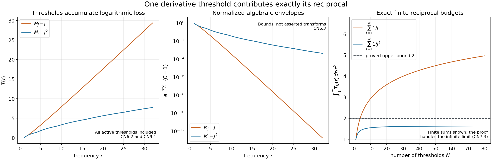
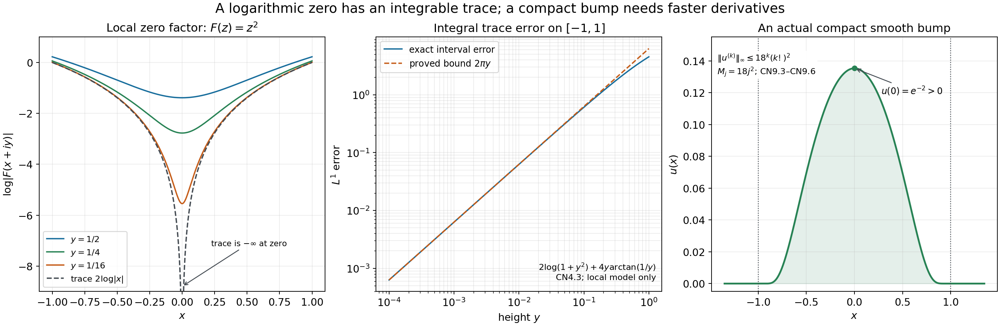

# Compact support and the Carleman condition

Written by GPT-6.1 Sol (OpenAI), Ultra reasoning effort, October 2026. Original exposition, examples, solutions and diagrams: CC0 1.0.

How slowly can the uniform derivative bounds of a nonzero compact bump grow? We will convert this question into a precise budget for its Fourier transform. Each derivative threshold contributes a logarithmic loss; the total loss must be integrable, which forces the reciprocals of those thresholds to have a finite sum.

The [complete proof](carleman-necessity-formal.md) includes the Fourier injectivity, zero factorization, local logarithmic trace and all estimates below. Its global input is the weighted boundary measure and weak trace in [the half-space representation theorem, GR1 and GR10](../../AN02-L135.html#GR1). The planar logarithmic kernel is proved in [L131, NP4–NP6](../../AN02-L131.html#NP4).

## 1. The exact question

Suppose \(u\in C_c^\infty(\mathbb R)\) is nonzero and

\[
 |u^{(k)}(x)|\le M_1M_2\cdots M_k,\qquad
 k\ge1,\quad x\in\mathbb R,                               \tag{L138.1}
\]

where \(0<M_1\le M_2\le\cdots\). Then

\[
 \sum_{j\ge1}\frac1{M_j}<\infty.                          \tag{L138.2}
\]

Compact support, nontriviality and ordering each have a separate role. No zeroth derivative bound is assumed. The conclusion is necessary; it alone is not a construction of a bump for every possible threshold sequence.

**Worked example: analytic-size bounds.** If \(M_j=Hj\), then the product is \(H^k k!\), but the reciprocal sum diverges. Indeed, each dyadic block \(2^{m-1}<j\le2^m\) contributes at least \(1/(2H)\). Consequently a compact smooth function with these bounds must be zero. A fixed multiplicative constant does not change this conclusion: divide the function by that constant first.

Without compact support, \(\sin x\) is a nonzero smooth counterexample to that conclusion. Every derivative has norm at most one, hence at most \(k!\). Its support is the whole real line.

## 2. Derivatives become a Fourier envelope

Choose \(R\ge1\) with \(\operatorname{supp}u\subset[-R,R]\), and define

\[
 F(z)=\int u(t)e^{-izt}dt,\qquad
 a=\|u\|_1>0,\qquad C=\max(a,2R).                        \tag{L138.3}
\]

The compact integration interval lets the exponential power series be integrated term by term, so \(F\) is entire. It also gives

\[
 |F(\xi+iy)|\le a e^{Ry},\qquad y\ge0.                    \tag{L138.4}
\]

Why is \(F\) nonzero? If it vanished on the real line, multiplying it by \(e^{-\tau\xi^2}\) and integrating would give

\[
 0=\frac1{2\pi}\int e^{-\tau\xi^2}F(\xi)e^{i\xi x}d\xi
   =(u*K_\tau)(x),\qquad
 K_\tau(q)=\frac{e^{-q^2/(4\tau)}}{\sqrt{4\pi\tau}}.        \tag{L138.5}
\]

Absolute Fubini is justified by \(\|u\|_1\int e^{-\tau\xi^2}d\xi<\infty\). These positive normalized Gaussian kernels approximate the identity uniformly on the continuous compact function \(u\). Thus \(u=0\), a contradiction. [CN2](carleman-necessity-formal.md#CN2) proves both the Gaussian transform formula and this approximation.

For real \(\xi\ne0\), integration by parts \(k\) times has no endpoint terms and gives

\[
 |F(\xi)|\le C\,\frac{M_1\cdots M_k}{|\xi|^k},\qquad k\ge1.
                                                                    \tag{L138.6}
\]

The \(k=0\) estimate is \(|F|\le a\le C\). Bounded thresholds would force \(F(\xi)=0\) for all sufficiently large \(|\xi|\), contradicting the identity principle for its nontrivial entire extension. Therefore \(M_j\to\infty\).

At frequency \(r>0\), use precisely the factors with \(M_j<r\). Ordered thresholds make these a finite initial segment. Define

\[
 T(r)=\sum_{j\ge1}\log^+(r/M_j),\qquad
 |F(\xi)|\le C e^{-T(|\xi|)}.                            \tag{L138.7}
\]

Before a threshold crosses \(r\), its factor \(M_j/r\) improves the bound. After that crossing, factors are at least one and cannot improve it. Equal thresholds contribute zero logarithmic loss. This proves the optimization rather than presuming one derivative order works at every frequency.

*Figure 1.* The two threshold models are \(M_j=j\) and \(M_j=j^2\). The first panel shows their exact \(T\) in the plotted range; the second shows the normalized algebraic envelopes \(e^{-T}\). They are bounds, not asserted transforms of compact bumps. The final panel gives the exact finite-budget integral \(\int_1^\infty T_N(r)r^{-2}dr=\sum_{j=1}^N1/M_j\). The infinite conclusion follows from the proof, not from those finite samples.

## 3. Why the logarithm has a genuine boundary density

The function \(v(z)=\log|F(z)|\) is subharmonic, with value \(-\infty\) at its isolated zeros. Near a zero \(b\) of multiplicity \(m\),

\[
 F(z)=(z-b)^mG(z),\qquad G(b)\ne0,\qquad
 \log|F(z)|=m\log|z-b|+\log|G(z)|.                        \tag{L138.8}
\]

The second term is harmonic on a sufficiently small zero-free disc, by the Cauchy–Riemann calculation in CN3. The first is the positive-Laplacian logarithmic kernel from L131. A nontrivial entire function has only finitely many zeros on a compact set; CN3 proves the factorization and identity principle used for this fact.

Let \(g(x)=\log|F(x)|\). At a real zero, the singular part has the exact estimate

\[
 \int_{\mathbb R}
 \left(m\log|x+iy|-m\log|x|\right)dx=m\pi y,\qquad y>0.     \tag{L138.9}
\]

Its integrand is nonnegative, so the same upper bound holds on every interval. The regular factor's logarithm converges uniformly there. Away from the finitely many real zeros of a compact interval, \(F\) is uniformly separated from zero. These facts give

\[
 v(x+iy)\longrightarrow g(x)\quad\text{in }L^1_{\rm loc}(\mathbb R).
                                                                    \tag{L138.10}
\]

The estimate follows by scaling and integration by parts; [CN4](carleman-necessity-formal.md#CN4) includes every endpoint and the exact finite-interval formula.

By (L138.4), \(v(\xi+iy)\le\log a+Ry\). The exact half-plane theorem therefore supplies a signed boundary measure \(\sigma\) with finite weighted variation and weak trace. The local \(L^1\) trace identifies that measure:

\[
 d\sigma=g(x)dx,\qquad
 \int_{\mathbb R}\frac{|\log|F(x)||}{1+x^2}dx<\infty.       \tag{L138.11}
\]

There is no unidentified atom at a real zero. Its logarithm is locally integrable, and equality of all continuous compact test pairings fixes the density measure. The comparable weights \((1+|x|)^{-2}\) and \((1+x^2)^{-1}\) give the displayed integral.

## 4. The exact reciprocal budget

Taking logarithms of the envelope gives

\[
 0\le T(r)\le\log C-\log|F(r)|.                           \tag{L138.12}
\]

For \(r\ge M_1>0\), \(r^{-2}\le(1+M_1^{-2})(1+r^2)^{-1}\). The logarithmic boundary integral in (L138.11) consequently makes \(\int_{M_1}^\infty T(r)r^{-2}dr\) finite.

Now every summand is nonnegative, so Tonelli gives

\[
 \int_{M_1}^{\infty}T(r)\frac{dr}{r^2}
 =\sum_{j\ge1}\int_{M_j}^{\infty}\log(r/M_j)\frac{dr}{r^2}
 =\sum_{j\ge1}\frac1{M_j}.                               \tag{L138.13}
\]

Integration by parts evaluates each scalar integral: the logarithmic endpoint term vanishes at \(M_j\) and at infinity, leaving \(\int_{M_j}^\infty r^{-2}dr=1/M_j\). This proves the necessity theorem without exchanging a signed infinite series.

**Worked example: power thresholds.** For \(M_j=j^\alpha\), \(\alpha>0\), the budget at \(r\ge1\) is

\[
 T(r)=m\log r-\alpha\log(m!),\qquad
 m=\lfloor r^{1/\alpha}\rfloor.                          \tag{L138.14}
\]

The reciprocal series converges for \(\alpha>1\), because it is at most \(1+1/(\alpha-1)\) by comparison with an integral. For \(0<\alpha\le1\), it dominates the divergent harmonic series. Thus the latter range cannot bound all derivatives of a nonzero compact bump in the stated product form.

## 5. An actual compact bump in a compatible class

Set

\[
 f(t)=\begin{cases}e^{-1/t},&t>0,\\0,&t\le0,\end{cases}
 \qquad
 u(x)=f(1-x)f(1+x)
 =\begin{cases}e^{-2/(1-x^2)},&|x|<1,\\0,&|x|\ge1.\end{cases}
                                                                    \tag{L138.15}
\]

**Worked example: explicit derivative bounds.** On \(|z-t|=t/2\), \(t>0\), one has \(\operatorname{Re}(1/z)\ge2/(9t)\). Picking the \(k\)-th coefficient of the convergent Taylor series for \(e^{-1/z}\) on that circle gives

\[
 |f^{(k)}(t)|\le k!(2/t)^k e^{-2/(9t)}
 \le9^k(k!)^2.                                          \tag{L138.16}
\]

The first bound tends to zero at \(t=0\) for each fixed order, even after division by \(t\), so extending by zero gives a smooth function. For the second inequality, maximize \(t^{-k}e^{-c/t}\) at \(t=c/k\), \(c=2/9\), and use \((k/e)^k\le k!\), proved by integrating \(\log s\). For \(k=0\), \(f\le1\).

Leibniz's rule gives

\[
 \|u^{(k)}\|_\infty
 \le9^k(k!)^2\sum_{j=0}^k\binom{k}{j}^{-1}
 \le18^k(k!)^2,\qquad k\ge1.                             \tag{L138.17}
\]

Indeed the sum has \(k+1\) terms at most one, and \(k+1\le2^k\). This is the product bound for \(M_j=18j^2\). The function vanishes outside \([-1,1]\) and \(u(0)=e^{-2}>0\). Its reciprocal budget is at most \(1/9\). [CN9](carleman-necessity-formal.md#CN9) gives the full coefficient calculation, smoothness proof and constants. This verifies one real example of compatibility.

*Figure 2.* The local model \(F(z)=z^2\) gives \(\log(x^2+y^2)\to2\log|x|\) in integral norm near its real zero. The exact error on \([-1,1]\) is \(2\log(1+y^2)+4y\arctan(1/y)\), at most \(2\pi y\). The final panel shows the compact function in (L138.15). The local polynomial model illustrates a zero factor; it is not asserted to satisfy the global horizontal bound of the Fourier transform.

## 6. Exercises

1. Evaluate the single-threshold integral \(\int_M^\infty\log(r/M)r^{-2}dr\).
2. Optimize the first three thresholds \(2,2,5\) at frequency \(r=4\), and find their complete finite reciprocal budget.
3. Derive the exact trace error on \([-d,d]\) for a zero of multiplicity \(m\).
4. Explain why the proof requires a nonzero Fourier transform and prove its nontriviality using Gaussian smoothing.
5. Locate the roles of compact support and ordering; explain why \(\sin x\) does not contradict the theorem.
6. Verify the constants and reciprocal budget for the compact bump with thresholds \(18j^2\).

## 7. Complete solutions

**1.** Integrate by parts with antiderivative \(-1/r\). The boundary term is zero at \(r=M\), since the logarithm is zero, and tends to zero at infinity, since \(\log r/r\to0\). The remaining integral is \(\int_M^\infty r^{-2}dr=1/M\).

**2.** At \(r=4\), only the first two factors improve the estimate. Their product is \(2^2/4^2=1/4\), and \(T_3(4)=2\log2\). The third factor would multiply by \(5/4>1\). The finite budget is \(1/2+1/2+1/5=6/5\), by summing the three single-threshold integrals.

**3.** Evenness gives the error \(m\int_0^d\log(1+y^2/x^2)dx\). Integration by parts produces \(md\log(1+y^2/d^2)+2my^2\int_0^d(x^2+y^2)^{-1}dx\). The endpoint at zero vanishes because \(x|\log x|\to0\). Evaluating the arctangent gives \(md\log(1+y^2/d^2)+2my\arctan(d/y)\), at most \(m\pi y\) by the whole-line nonnegative integral.

**4.** An identically zero Fourier transform would make its logarithm identically \(-\infty\), outside the half-plane theorem's hypotheses. Formula (L138.5), with absolute Fubini, would give \(u*K_\tau=0\) for every \(\tau>0\). The positive normalized Gaussian kernels converge to the identity on the uniformly continuous compact function \(u\): split the error into a small neighborhood controlled by uniform continuity and a tail controlled by its sup norm. Hence \(u=0\), contradicting the assumption.

**5.** Compact support gives the entire exponential integral, the linear upper bound in the height and boundary-free integration by parts. Ordering makes all useful factors at a frequency one initial segment, and ensures \(M_j\ge M_1\) when integrating the budget. The derivatives of \(\sin x\) are bounded by one, but the function is not compactly supported. It therefore illustrates the need for that hypothesis.

**6.** The coefficient estimate gives \(\|f^{(k)}\|_\infty\le9^k(k!)^2\). In the product \(f(1-x)f(1+x)\), Leibniz's rule yields \(9^k(k!)^2\sum_{j=0}^k\binom{k}{j}^{-1}\le9^k(k!)^2(k+1)\le18^k(k!)^2\). This equals \(\prod_{j=1}^k18j^2\). Smooth extension by zero and positivity at zero were proved above. Finally \(\sum1/(18j^2)\le(1+\int_1^\infty t^{-2}dt)/18=1/9\).

## Source credit

The classical target is Lars Hörmander, *The Analysis of Linear Partial Differential Operators II*, Theorem 16.1.10, printed page 314: first edition 1983, second revised printing 1990, reprint 2005. Its compact-support hypothesis and derivative orders \(k\ge1\) are retained. The [full independent proof](carleman-necessity-formal.md), worked examples, complete solutions and reproducible diagrams accompany this exposition.
