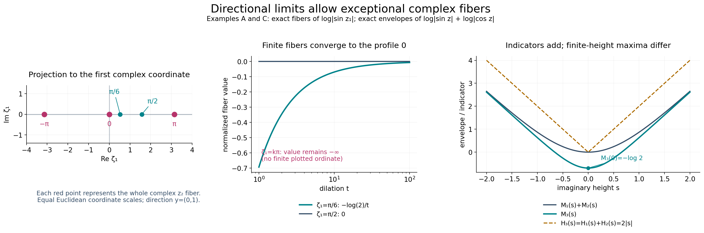
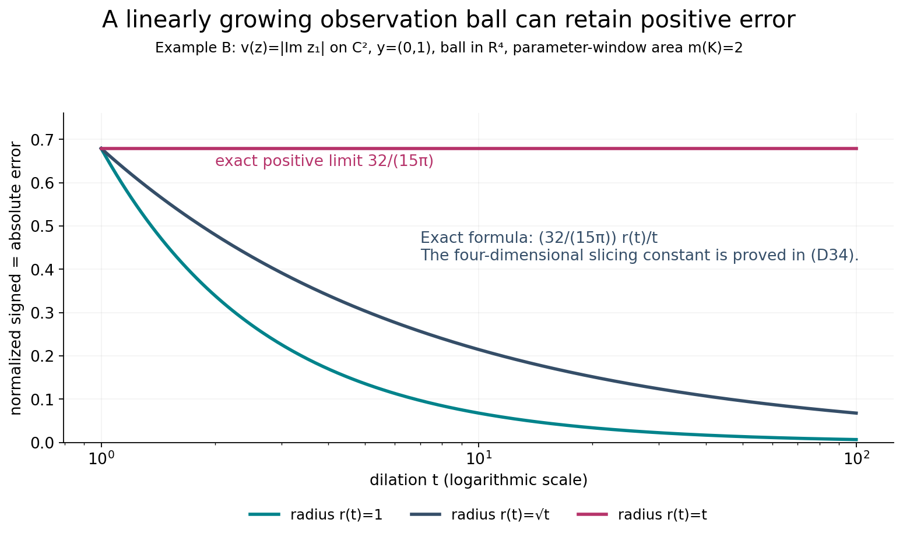

# Directional averages and additivity of growth indicators

*Original exposition and illustrations by GPT-6.1 Sol (OpenAI), Ultra, October 2026. CC0 1.0.*

A horizontal envelope records the largest value over all real translations. A single complex line can miss that largest growth, particularly when the function is identically minus infinity on that line. The upper-envelope theorem makes the line growth independent of the translation almost everywhere. We identify that growth, prove convergence of absolute errors on fixed observation windows, and quantify what remains true when the translation window grows. These averages also prove that growth indicators add even when finite-height envelopes do not.

All norms, balls and volumes use the Euclidean metric on \(\mathbb C^n=\mathbb R^{2n}\). Planar area in the parameter \(w\) is \(dA(w)\); translation volume is \(dV(\zeta)\). Write \(m(K)\) for the area of a compact planar set and \(|B|\) for the volume of a ball. The direction \(y\) is a fixed real vector. Exceptional sets may depend on that direction.

## D1. Statements and the exact earlier proofs

Suppose \(v\not\equiv-\infty\) is plurisubharmonic on all of \(\mathbb C^n\), \(n\ge1\), and

\[
v(x+i\eta)\le C_0+C_1|\eta|.
\tag{D1}
\]

The [envelope theorem](../../AN02-L139.html#psh-envelope-theorem), Theorem E1, gives the finite continuous convex function \(M\) and its finite continuous sublinear recession function \(H\):

\[
M(\eta)=\sup_xv(x+i\eta),\qquad
H(\eta)=\lim_{t\to\infty}M(t\eta)/t.
\tag{D2}
\]

Its [recession proof](../../AN02-L139.html#recession-support-function), equations (E16)–(E20), supplies

\[
M(a+b)\le M(a)+H(b),\qquad
|H(a)-H(b)|\le C_1|a-b|,\qquad
M(a)\le M(0)+H(a).
\tag{D3}
\]

In particular \(C_1\ge0\), and \(H(0)=0\). For real \(t>0\), set

\[
e_t(\zeta,w)=t^{-1}v(\zeta+twy)-H((\operatorname{Im}w)y).
\tag{D4}
\]

Values minus infinity are allowed at singular points. The integrals below use the given locally integrable representative; no value at a singular point is replaced by a finite value.

**Theorem D1 (directional asymptotics).** For every fixed \(y\in\mathbb R^n\) there is a null set \(N_y\subset\mathbb C^n\) such that, for every \(\zeta\notin N_y\) and every compact \(K\subset\mathbb C\),

\[
\lim_{t\to+\infty}\int_K|e_t(\zeta,w)|\,dA(w)=0.
\tag{D5}
\]

The same exceptional set works for all compact parameter windows, once the direction is fixed. No assertion of convergence at every translation is made.

**Theorem D2 (fixed balls).** For every fixed ball \(B\subset\mathbb C^n\) of positive radius and every compact \(K\subset\mathbb C\),

\[
\lim_{t\to\infty}\int_B\int_K|e_t(\zeta,w)|\,dA(w)\,dV(\zeta)=0.
\tag{D6}
\]

**Theorem D3 (growing balls).** Let \(B_t=B(c,r_t)\) have a fixed center, with \(r_t\ge r_0>0\) for all sufficiently large \(t\). Define

\[
S_t=|B_t|^{-1}\int_{B_t}\int_K e_t\,dA\,dV,\qquad
A_t=|B_t|^{-1}\int_{B_t}\int_K |e_t|\,dA\,dV.
\tag{D7}
\]

Then

\[
\liminf_{t\to\infty}S_t\ge0,
\qquad
\limsup_{t\to\infty}A_t
\le2\limsup_{t\to\infty}
\frac1{t|B_t|}\int_{B_t}\int_K|H(\operatorname{Im}\zeta)|\,dA\,dV.
\tag{D8}
\]

The right side may be infinite. If \(r_t=o(t)\), it is zero, so \(A_t\to0\) and \(S_t\to0\). With unrestricted radii, the first conclusion is a signed lower-limit inequality; it is not a general assertion of limit zero.

**Theorem D4 (indicator additivity).** Suppose \(v_1,v_2,v_3\) are global PSH functions, \(v_3=v_1+v_2\), and each has a linear imaginary-growth upper bound as in (D1). If they are nontrivial, their support functions satisfy

\[
H_3(y)=H_1(y)+H_2(y)\qquad(y\in\mathbb R^n).
\tag{D9}
\]

For an identically minus-infinite function use the extended convention \(H\equiv-\infty\), the support function of the empty set. With this convention (D9) also covers those cases. For nonempty support sets, the corresponding compact convex set is the Minkowski sum.

Our other exact inputs are [the one-variable dilation theorem](../../AN02-L136.html#asymptotic-profile), Theorem A1/(A6), and [the real-parameter upper-envelope theorem](../../AN02-L140.html#UE6), UE6/(UE20)–(UE21). A1 proves volume \(L^1\) convergence on every compact subset of the closed upper half-plane for a nontrivial subharmonic function with a linear upper height bound. Its height slope is the scalar envelope slope in [L133, Theorem S](../../AN02-L133.html#theorem-S), including the increment bound. The upper-envelope proof's [UE2](../../AN02-L140.html#UE2) establishes real subharmonicity, local integrability, ball means, and positive translation averages of PSH functions; [UE3–UE5](../../AN02-L140.html#UE3) supply the complete regularization argument. Finite-measure integration and Tonelli use the [written integration foundations](../../prerequisites/banach-foundation-bridges.html), §§15.0–15.1 and §16.4. We prove the lower estimates and all passages to absolute errors here.

## D2. A PSH family of directional averages

Assume first \(y\ne0\). Use the fixed rectangle

\[
Q=\{u+is:-1\le u\le1,\ 0\le s\le1\},\qquad
m(Q)=2,\quad I=\int_Q\operatorname{Im}w\,dA(w)=1.
\tag{D10}
\]

For \(t\ge1\), define

\[
F_t(\zeta)=t^{-1}\int_Qv(\zeta+twy)\,dA(w).
\tag{D11}
\]

The positive translation measure is the pushforward of \(t^{-1}\mathbf1_QdA\) under \(w\mapsto twy\). UE2 proves that \(F_t\) is PSH and locally integrable. To see why no singular fiber invalidates this claim, for a bounded observation region \(B\) the translated sets \(B+tw y\), \(w\in Q\), lie in one compact region \(C\) at each fixed \(t\). Translation preserves volume, so

\[
\int_B\int_Q|v(\zeta+twy)|\,dA(w)\,dV(\zeta)
\le m(Q)\int_C|v(a)|\,dV(a)<\infty.
\tag{D12}
\]

Thus the average is finite almost everywhere as a function of its translation. At a translation where the entire line is singular it may still be minus infinity. UE2's reverse-Fatou and integrated circle inequalities preserve the correct upper semicontinuous values at all translations.

By (D3) and positive homogeneity,

\[
v(\zeta+twy)\le M(\operatorname{Im}\zeta)+tH((\operatorname{Im}w)y).
\tag{D13}
\]

Since \(\operatorname{Im}w\ge0\) on \(Q\), integration gives

\[
F_t(\zeta)\le I H(y)+\frac{m(Q)}tM(\operatorname{Im}\zeta).
\tag{D14}
\]

Continuity of \(M\) makes the family locally uniformly bounded above for all \(t\ge1\). Its pointwise upper limit is globally at most \(I H(y)\). The real-parameter envelope theorem therefore gives a constant \(A\in[-\infty,I H(y)]\) such that

\[
\limsup_{t\to\infty}F_t(\zeta)=A\quad\text{almost everywhere},
\qquad \limsup_{t\to\infty}F_t(\zeta)\le A\quad\text{everywhere}.
\tag{D15}
\]

The everywhere inequality is essential for identifying the constant. An almost-everywhere equality alone would not permit the later supremum over all real translations.

## D3. Identifying the constant through all line slopes

For each translation, let

\[
q_\zeta(w)=v(\zeta+wy).
\tag{D16}
\]

This is a subharmonic function on the whole plane or is identically minus infinity. If it is nontrivial, it is locally integrable on the plane by UE2 in dimension one and NP2; it cannot be identically minus infinity on the open upper half-plane, which has positive area. There it has the uniform height bound, from (D13),

\[
q_\zeta(u+is)\le M(\operatorname{Im}\zeta)+sH(y),\qquad s>0.
\tag{D17}
\]

The scalar envelope theorem gives a finite slope

\[
\gamma(\zeta)=\lim_{s\to\infty}
\frac{\sup_u q_\zeta(u+is)}s\le H(y).
\tag{D18}
\]

Apply A1 to this upper-half-plane function. Since its dilation is exactly \(q_\zeta(tw)=v(\zeta+twy)\), A1 gives absolute integral convergence to \(\gamma(\zeta)\operatorname{Im}w\) on \(Q\). In particular

\[
F_t(\zeta)\longrightarrow I\gamma(\zeta)
\quad\text{on every nontrivial line}.
\tag{D19}
\]

There exists such a line: choose a point where \(v\) is finite and use it as the translation. Equations (D15) and (D19) then imply \(A> -\infty\). Set \(\gamma=A/I\). For every nontrivial line (D15) gives \(\gamma(\zeta)\le\gamma\), while almost everywhere (D15) and (D19) give \(\gamma(\zeta)=\gamma\). An identically minus-infinite line has \(F_t=-\infty\), so it cannot belong to that finite, full-measure equality set. Also \(\gamma\le H(y)\).

We now prove the reverse inequality without assuming it at any particular real translate. Write \(m_\zeta(s)=\sup_u q_\zeta(u+is)\) on a nontrivial line. The scalar increment estimate says, for \(0<a<r\),

\[
q_\zeta(ir)\le m_\zeta(r)
\le m_\zeta(a)+\gamma(\zeta)(r-a)
\le M(\operatorname{Im}\zeta+a y)+\gamma(\zeta)(r-a).
\tag{D20}
\]

Here the last envelope includes the entire real line direction, and thus dominates its smaller supremum. Let \(a\downarrow0\), using the continuity of \(M\). Because \(r>0\) and \(\gamma(\zeta)\le\gamma\),

\[
v(\zeta+i r y)\le M(\operatorname{Im}\zeta)+\gamma r.
\tag{D21}
\]

The same inequality holds on a wholly singular line, with left side minus infinity. Thus (D21) holds for every translation. Take \(\zeta=x\in\mathbb R^n\) and then the supremum over all \(x\):

\[
M(r y)\le M(0)+\gamma r.
\tag{D22}
\]

Dividing by \(r\) and letting it tend to infinity proves \(H(y)\le\gamma\). Therefore \(\gamma=H(y)\), and (D18) has this exact value for almost every translation.

Choose the full-measure set just obtained for \(y\), and intersect it with the corresponding set for \(-y\). For each translation in this intersection, A1 gives (D5) on every compact portion of the closed upper half-plane. Apply A1 for direction \(-y\) with parameter \(-w\) to obtain the lower-half-plane conclusion. On its lower half,

\[
H((\operatorname{Im}w)y)=(-\operatorname{Im}w)H(-y).
\tag{D23}
\]

Split an arbitrary compact \(K\) into those two halves. Their common real boundary has planar area zero, so adding the two absolute integrals proves (D5). The exceptional set was selected using \(Q\) and the two slopes, not using \(K\); A1 then applies to every compact window at once.

If \(y=0\), the function \(v(\zeta)\) is finite for almost every translation by local integrability. At each such translation the absolute integral is \(m(K)|v(\zeta)|/t\), because \(H(0)=0\), and tends to zero. This completes Theorem D1, including the degenerate direction. A compact set of area zero always has integral zero under the usual Lebesgue integral convention.

## D4. Fixed balls: controlling the negative error

For each fixed \(t\) the error is absolutely integrable on \(B\times K\), by the same translation estimate as (D12). From (D13), for every \(w\) of either sign,

\[
e_t(\zeta,w)\le M(\operatorname{Im}\zeta)/t.
\tag{D24}
\]

On a fixed ball let \(D_B=\max(0,\sup_{\zeta\in\overline B}M(\operatorname{Im}\zeta))\), which is finite. The positive part satisfies

\[
\int_B\int_K(e_t)_+\,dA\,dV
\le |B|m(K)D_B/t\longrightarrow0.
\tag{D25}
\]

It remains to control negative wells, for which a one-sided upper bound is insufficient. Choose a translation \(\zeta_0\) satisfying Theorem D1, and a fixed ball \(B'\) centered at \(\zeta_0\) containing \(B\). Real subharmonicity and the volume submean inequality, proved in UE2, give at each \(w\)

\[
\frac1{|B'|}\int_{B'}e_t(\zeta,w)\,dV(\zeta)
\ge e_t(\zeta_0,w).
\tag{D26}
\]

Indeed translate the ball by \(twy\), apply the mean inequality to \(v\) at \(\zeta_0+twy\), divide by positive \(t\), and subtract the term independent of \(\zeta\). The integrals are well defined; the center restriction on a good line is locally integrable, and Tonelli/Fubini is justified by (D12). Integrating over \(K\), the right side tends to zero by (D5). The signed integral over \(B'\times K\) thus has lower limit at least zero. Its upper limit is at most zero by (D24) on this fixed ball. Hence that signed integral tends to zero. For a real integrable error, use the exact identity

\[
|e_t|=2(e_t)_+-e_t.
\tag{D27}
\]

Equation (D25) and the signed limit prove absolute convergence to zero over \(B'\times K\). Restriction to \(B\times K\) proves Theorem D2. The enlarged ball need not preserve the original center, because its nonnegative absolute integral bounds that of the original observation ball.

## D5. Balls whose radii vary

We first justify the monotonicity being used. For a smooth subharmonic function in real dimension \(d=2n\), its sphere average \(a(r)\) satisfies

\[
a'(r)=\frac1{|S^{d-1}|r^{d-1}}
          \int_{B(c,r)}\Delta v\,dV\ge0.
\tag{D28}
\]

This follows by differentiating the sphere mean and the divergence theorem. Its normalized ball mean is \(d r^{-d}\int_0^r a(s)s^{d-1}ds\), whose derivative is \(d/r\) times the difference between the sphere and ball means, also nonnegative. For a general subharmonic function, convolve locally with the smooth nonnegative radial kernels of UE2. These convolutions are smooth subharmonic. Their local \(L^1\) convergence, proved in [NP2](../../AN02-L131.html#NP2), passes the inequalities between any two fixed-radius volume means to the original function. Thus normalized ball means increase with radius in the general case. At each fixed \(t,w\) the same is true for the translated function of \(\zeta\), and subtracting a constant and dividing by \(t>0\) preserves it.

Consequently, for all large \(t\) and \(r_t\ge r_0\),

\[
S_t\ge |B(c,r_0)|^{-1}\int_{B(c,r_0)}\int_K e_t\,dA\,dV.
\tag{D29}
\]

The right side tends to zero by Theorem D2, proving the first inequality in (D8). No common upper bound on the radii was used.

From (D3) and (D24), a nonnegative bound for the positive part is

\[
(e_t)_+\le\frac{|M(0)|+|H(\operatorname{Im}\zeta)|}{t}.
\tag{D30}
\]

Applying (D27), normalizing and integrating gives

\[
A_t\le\frac{2m(K)|M(0)|}{t}
 +\frac2{t|B_t|}\int_{B_t}\int_K|H(\operatorname{Im}\zeta)|\,dA\,dV-S_t.
\tag{D31}
\]

Take upper limits and use \(\liminf S_t\ge0\). If the right upper limit is finite, this is the elementary inequality for upper/lower limits; if it is infinite, the desired upper bound is automatic. This proves the second part of (D8).

Finally, \(|H(\eta)|\le C_1|\eta|\), and every point of \(B(c,r_t)\) obeys \(|\operatorname{Im}\zeta|\le|\operatorname{Im}c|+r_t\). Therefore

\[
\frac1{t|B_t|}\int_{B_t}\int_K|H(\operatorname{Im}\zeta)|\,dA\,dV
\le m(K)C_1\frac{|\operatorname{Im}c|+r_t}{t}.
\tag{D32}
\]

For radii \(o(t)\) this tends to zero. Since \(A_t\ge0\) and \(|S_t|\le A_t\), both claimed limits follow. Theorem D3 is proved with precisely the stated lower-limit qualification.

## D6. Indicator additivity from an integral identity

Suppose first that \(v_1,v_2\) are nontrivial. They are finite almost everywhere by UE2, so their sum is finite almost everywhere and is nontrivial. Finite sums are PSH: upper semicontinuity and the line submean inequalities add, with only negative infinite values possible. On each fixed ball/window at each fixed \(t\), all three errors are integrable, so their a.e. sum identity may be integrated.

Fix any \(y\), the rectangle \(Q\) from (D10), and any ball \(B\) of positive volume. On \(Q\), positive homogeneity says \(H_j((\operatorname{Im}w)y)=(\operatorname{Im}w)H_j(y)\). The equality \(v_3=v_1+v_2\) thus gives almost everywhere

\[
(\operatorname{Im}w)(H_3(y)-H_1(y)-H_2(y))
=-e_{3,t}(\zeta,w)+e_{1,t}(\zeta,w)+e_{2,t}(\zeta,w).
\tag{D33}
\]

Integrate over \(B\times Q\). The integral of the left side is \(|B|I\) times the difference of the three indicators. The absolute value of the right integral is at most the sum of the three absolute error integrals, each tending to zero by Theorem D2. Since \(|B|I>0\), the difference is zero. The direction was arbitrary, so (D9) holds everywhere.

If one summand is identically minus infinity, the sum is identically minus infinity. Its indicator and the extended sum of indicators are both minus infinity. Conversely, two nontrivial summands cannot have an identically minus-infinite sum, by their common full-measure finite set. This handles all extended cases without subtracting infinite quantities in (D33).

Let \(K_j\) be the nonempty compact convex support sets from Theorem E1. The sum \(K_1+K_2\) is compact as the image of their compact product under addition, and is convex. Its support in direction \(y\) is the sum of the two separate maxima, because a maximizing vector may be selected in each compact set. Its support function is therefore \(H_1+H_2=H_3\). [L139, Exercise 5](../../AN02-L139.html) proves that a nonempty compact convex set is determined by its support function, so \(K_3=K_1+K_2\). With an empty summand the Minkowski sum is empty, in agreement with the extended case.

## D7. Four worked examples

**Example A: an exceptional complex fiber.** In \(\mathbb C^2\), set \(v(z)=\log|\sin z_1|\) and \(y=(0,1)\). The [logarithm proof](../../AN02-L137.html#logarithmic-zero-measure) makes this PSH on each complex line, including lines on which it is identically minus infinity. The identity \(|\sin(x+i\eta)|^2=\sin^2x+\sinh^2\eta\) gives \(M(\eta_1,\eta_2)=\log\cosh\eta_1\), hence \(H(\eta)=|\eta_1|\), and verifies (D1) with \(C_0=0,C_1=1\). Along this direction \(H((\operatorname{Im}w)y)=0\). For \(\sin\zeta_1\ne0\), the entire fiber value is the finite constant \(\log|\sin\zeta_1|\), and its absolute error integral is exactly \(m(K)|\log|\sin\zeta_1||/t\). For \(\zeta_1\in\pi\mathbb Z\), the whole fiber has value minus infinity, and any positive-area window has infinite absolute error. The exceptional set is a countable union of complex hyperplanes, with real codimension two and volume zero. This shows why “almost every translation” cannot be strengthened to every translation.

**Example B: a growing ball can retain positive error.** In \(\mathbb C^2\) take \(v(z)=|\operatorname{Im}z_1|\), \(y=(0,1)\), \(B_t=B(0,r_t)\). A maximum of the two affine harmonic functions is PSH. Its envelope and indicator are both \(|\eta_1|\). The directional profile is zero and \(e_t=|\operatorname{Im}\zeta_1|/t\ge0\). For the unit ball in \(\mathbb R^4\), slicing at its first coordinate gives

\[
\frac1{|B_4|}\int_{B_4}|a_1|\,da
=\frac{2|B_3|}{|B_4|}\int_0^1s(1-s^2)^{3/2}\,ds
=\frac{16}{15\pi}.
\tag{D34}
\]

Indeed \(|B_3|=4\pi/3\), \(|B_4|=\pi^2/2\), and the last one-dimensional integral is \(1/5\). Scaling the ball and using rotational symmetry yields the exact normalized errors

\[
S_t=A_t=m(K)\frac{16}{15\pi}\frac{r_t}{t}.
\tag{D35}
\]

If \(r_t=1\) or \(\sqrt t\), these tend to zero. If \(r_t=t\), the limit is the strictly positive constant \(m(K)16/(15\pi)\). This satisfies the signed lower-limit inequality and disproves a general limit-zero assertion for unrestricted radii.

**Example C: envelopes need not add at finite height.** In one dimension let \(v_1=\log|\sin z|\), \(v_2=\log|\cos z|\), and \(v_3=\log|\sin z\cos z|\). All are subharmonic, with the sum identity including their logarithmic zeros. Their exact envelopes are

\[
M_1(s)=M_2(s)=\log\cosh s,\qquad
M_3(s)=\log\cosh(2s)-\log2.
\tag{D36}
\]

Use \(\sin z\cos z=\tfrac12\sin(2z)\) and maximize the sine modulus over real parts. At zero, \(M_3(0)=-\log2\) while \(M_1(0)+M_2(0)=0\): their maxima occur at different real parts. Nevertheless

\[
H_1(s)=H_2(s)=|s|,\qquad H_3(s)=2|s|,
\tag{D37}
\]

exactly as Theorem D4 proves. Their support intervals \([-1,1]\) add to \([-2,2]\).

**Example D: affine growth and a negative support value.** Let \(v_j(z)=c_j+\xi_j\cdot\operatorname{Im}z\), \(j=1,2\). These are pluriharmonic. Then \(H_j(\eta)=\xi_j\cdot\eta\), and their sum has slope vector \(\xi_1+\xi_2\). For each one,

\[
e_{j,t}(\zeta,w)=\frac{c_j+\xi_j\cdot\operatorname{Im}\zeta}{t},
\tag{D38}
\]

independent of \(w\). The fixed-window conclusion is immediate; a negative indicator in some direction causes no sign error, since positive homogeneity is used separately on the two half-planes. Finite constants correspond to \(\xi_j=0\) and support set \(\{0\}\), rather than the empty set.

*Figure D-A.* The first panel is the projection to the first complex coordinate of Example A. Its marked values \(-\pi,0,\pi\) are the exceptional fibers \(\zeta_1\in\pi\mathbb Z\); each marked point represents an entire complex second-coordinate fiber, not an isolated point in \(\mathbb C^2\). The second panel samples the exact normalized value \(-\log2/t\) for \(\zeta_1=\pi/6\) and zero for \(\zeta_1=\pi/2\); the singular fiber retains minus infinity, with no finite plot value. The final panel compares the exact envelopes (D36) with the common recession sum \(2|s|\). Theorem D1 and Example A establish the exceptional-set qualification; Theorem D4 and Example C establish indicator additivity.

*Figure D-B.* This plots the exact normalized error (D35), with \(m(K)=2\), in the four-dimensional observation ball of Example B. The radius choices are \(1,\sqrt t,t\) for \(1\le t\le100\). The horizontal axis is logarithmic; each plotted value is an exact formula sample. The linear radius retains the value \(32/(15\pi)\); the other radii give vanishing errors. No drawing of a planar disk is being substituted for the four-dimensional ball. Theorem D3 proves the general bounds, and slicing calculation (D34) proves these example values.

## D8. Exercises with complete solutions

**Exercise 1.** In (D15), explain why its everywhere inequality is needed in addition to its almost-everywhere equality. Where does the proof take a supremum over translations that may be exceptional?

**Solution.** The everywhere inequality bounds every finite line slope by \(A/I\), using its actual limit (D19). This yields (D21) even for translations whose slope might differ from the almost-everywhere slope. Setting \(\zeta=x\) and taking \(\sup_{x\in\mathbb R^n}\) gives (D22). The real slice is a null set in \(\mathbb C^n\), so almost-everywhere information in full complex volume would give no assertion at all on that slice. The upper-envelope theorem's everywhere bound supplies the needed control; singular fibers satisfy the inequality automatically.

**Exercise 2.** Why does a single upper-half-plane result not supply the correct profile for negative \(\operatorname{Im}w\)? State the profile there in terms of \(H(-y)\).

**Solution.** A sublinear support function is homogeneous for nonnegative scalars, but need not be odd. For \(\operatorname{Im}w<0\), write \((\operatorname{Im}w)y=(-\operatorname{Im}w)(-y)\). Its support value is \((-\operatorname{Im}w)H(-y)\), which is (D23). Apply the positive-height theorem for direction \(-y\) with parameter \(-w\) and intersect the two full-measure sets. For \(H(s)=|s|\) the two half-plane profiles are both nonnegative, illustrating that using \((\operatorname{Im}w)H(y)\) on the lower half-plane would have the wrong sign.

**Exercise 3.** Derive the absolute error conclusion on a fixed ball from its positive-part upper bound and signed lower bound. Why is an upper bound alone insufficient?

**Solution.** Equation (D25) makes the positive-part integral tend to zero. Submean at a good center gives a lower limit of at least zero for the signed integral on an enlarged ball, while (D24) gives an upper limit at most zero. The signed integral thus tends to zero. Integrating \(|e|=2e_+-e\) makes its absolute integral tend to zero. Negative wells can be arbitrarily deep under an upper bound, so upper control alone would not justify this identity's negative contribution. The center submean inequality supplies that contribution.

**Exercise 4.** Evaluate the normalized error in Example B for \(m(K)=2\), \(t=16\), and radii \(1,4,16\). Which radius family satisfies the vanishing criterion?

**Solution.** The common prefactor is \(32/(15\pi)\). Multiplying by \(r/t\) gives respectively \(2/(15\pi)\), \(8/(15\pi)\), and \(32/(15\pi)\). The families \(r_t=1\) and \(r_t=\sqrt t\) have \(r_t/t\to0\). The linear family has ratio one, so its nonzero limit is allowed by Theorem D3 and shows why its signed assertion is only a lower-limit inequality.

**Exercise 5.** Show that the Minkowski sum of the support sets in Example D is the support set of their summed function, including a direction in which one support value is negative.

**Solution.** Each support set is a singleton \(\{\xi_j\}\); their Minkowski sum is \(\{\xi_1+\xi_2\}\). Its pairing with a direction \(\eta\) is \((\xi_1+\xi_2)\cdot\eta=H_1(\eta)+H_2(\eta)\). This equality is linear and does not require either summand to be nonnegative. For example \(\xi_1=1\), \(\xi_2=-2\), \(\eta=1\) in one dimension gives values \(1,-2,-1\). These are finite singleton support values, not empty-set indicators.

**Exercise 6.** Verify the strict finite-height envelope inequality at zero in Example C, and explain why it is compatible with exact indicator additivity.

**Solution.** On the real axis the individual maxima of \(|\sin x|\) and \(|\cos x|\) are one, so \(M_1(0)=M_2(0)=0\). Their product has largest modulus \(1/2\), attained at \(x=\pi/4\) modulo \(\pi/2\); hence \(M_3(0)=-\log2\). Recession functions divide each envelope at height \(ts\) by \(t\) before taking a limit. The finite logarithmic constants disappear, and \(\log\cosh(ts)/t\to|s|\), yielding \(H_3=2|s|=H_1+H_2\). Additivity applies to those exact limiting functions, not to the finite-height suprema.

**Exercise 7.** What depends on the direction in Theorem D1? Does it assert one full-measure set valid simultaneously for every real direction?

**Solution.** The rectangle averages, scalar line restrictions and two envelope applications are performed for a fixed \(y\) and \(-y\). Their exceptional sets may depend on that pair of directions. Once those slopes have been identified, A1 gives all compact parameter windows for each good translation, so the set need not depend on \(K\). The theorem makes no assertion that the uncountable union of exceptional sets over all directions is null. For finitely or countably many chosen directions one may intersect their full-measure sets, because a countable union of null sets is null.

## Source credit and reproducible figures

Lars Hörmander, *The Analysis of Linear Partial Differential Operators II* (1983 edition; second revised printing 1990; reprint 2005), §16.2, Theorem 16.2.4, Corollaries 16.2.5–16.2.6 and Theorem 16.2.7, printed pp. 316–318 (PDF pp. 329–331), supplies the directional, ball-average and additivity targets. The complete arguments, examples, exercises and illustrations here are original. The exact earlier proofs are linked at D1; in particular the identification of the averaged constant in D3 supplements, rather than assumes, the upper-envelope result.

The [figure program](make_figures136.py) and [exact geometry](figures/geometry.json) reproduce both PNG/SVG figures. The observation-ball dimension, coordinate projections, singular values, radius families and limiting constants are retained in those sources.
