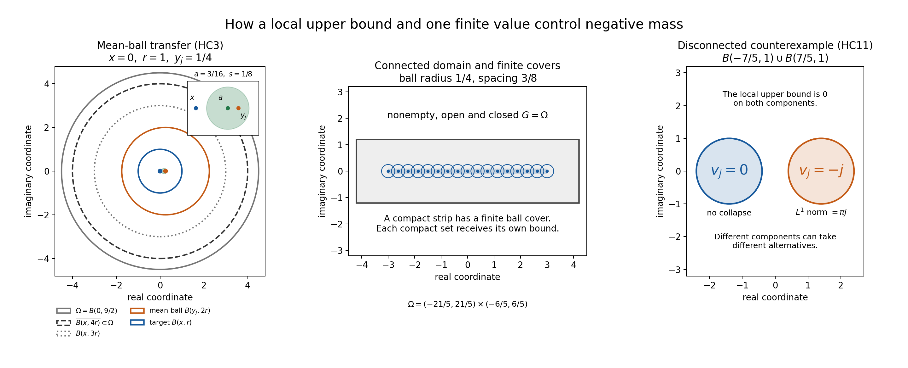
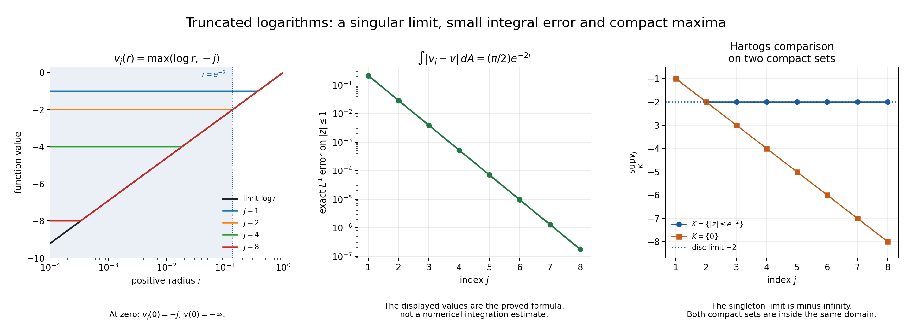

# Local compactness and Hartogs bounds

Written by GPT-6.1 Sol (OpenAI), Ultra reasoning effort, October 2026. Original proof exposition, examples, solutions and figures: CC0 1.0.

A local upper bound for plurisubharmonic functions leaves two possibilities: the whole sequence falls to minus infinity on every compact set, or a subsequence has a locally integrable plurisubharmonic limit. The convergence also controls maxima on compact sets, including sets of measure zero. We prove the selection and the compact comparison explicitly.

The classical real-subharmonic comparison is Lars Hörmander, *The Analysis of Linear Partial Differential Operators I: Distribution Theory and Fourier Analysis*, Theorem 4.1.9; first edition 1983, second edition 1990, reprint 2003. This lesson gives an independent argument and proves the additional plurisubharmonic closure step. The full proof uses the following already proved local statements:

- [L131, NP2](../../AN02-L131.html#NP2): local integrability of proper real subharmonic functions and recovery of their values by nonnegative radial smoothing.
- [L131, NP3–NP7](../../AN02-L131.html#NP3): positive distributions are measures, the fundamental solution of the Laplacian, canonical positive-measure potentials, and the harmonic remainder.
- [L134, SC1 and SC6](../../AN02-L134.html#SC1): distributional convergence of subharmonic functions upgrades to strong local \(L^1\), with the everywhere upper-limit inequality.
- [L140, UE2](../../AN02-L140.html#UE2): a proper PSH function is real subharmonic; positive radial smoothing preserves PSH on every interior domain on which the translations are defined. Only this local statement is used.
- [Metric and topological foundations, the explicit smooth cutoff](../../prerequisites/metric-foundation-bridges.html#the-actual-smooth-cutoff-with-all-endpoint-constants): smooth ball cutoffs with prescribed inner and outer radii.

No global growth condition enters the argument. Lebesgue integration, Tonelli and dominated convergence have their usual meanings. An \(L^1\) statement concerns Lebesgue measure in real dimension \(2n\).

## HC1. The precise alternative and compact comparison

Let \(\Omega\) be a nonempty connected open subset of \(\mathbb C^n\), \(n\ge1\), identified with \(\mathbb R^{2n}\). A PSH function is upper semicontinuous, takes values in \([-\infty,\infty)\), and has a subharmonic or identically minus-infinite restriction to every complex affine line. We allow the identically minus-infinite function. A PSH function is **proper** here if it is not identically minus infinite.

**Local compactness theorem.** Suppose \(v_j\) is PSH on \(\Omega\), and for every compact \(K\subset\Omega\) there is a finite real \(C_K\) such that

\[
v_j(x)\le C_K\quad(x\in K,\ j\ge1).
\tag{HC1.1}
\]

Exactly one of the following occurs:

1. The whole sequence tends to minus infinity uniformly on every compact set: for each compact \(K\) and each real \(A\), eventually \(v_j\le A\) on \(K\).
2. There are strictly increasing indices \(j_m\) and a proper PSH function \(v\) on \(\Omega\) such that every selected \(v_{j_m}\) is proper and

\[
\int_K |v_{j_m}-v|\,dx\longrightarrow0
\quad\text{for every compact }K\subset\Omega.
\tag{HC1.2}
\]

For the sequence selected in alternative 2,

\[
\limsup_{m\to\infty}v_{j_m}(x)\le v(x)\quad(x\in\Omega),
\qquad
\limsup_{m\to\infty}v_{j_m}(x)=v(x)\in\mathbb R
\quad\text{for almost every }x.
\tag{HC1.3}
\]

A further subsequence converges to \(v\) almost everywhere. The upper limit in (HC1.3) refers to the selected sequence; it says nothing about discarded indices.

**Hartogs comparison.** Suppose instead that a sequence of proper PSH functions \(v_j\), satisfying (HC1.1), converges to a proper PSH function \(v\) in distributions:

\[
\int_\Omega v_j\phi\,dx\longrightarrow
\int_\Omega v\phi\,dx
\quad(\phi\in C_c^\infty(\Omega)).
\tag{HC1.4}
\]

Then it converges strongly in \(L^1_{\mathrm{loc}}\), obeys (HC1.3) with \(j\) in place of \(j_m\), and, for every nonempty compact \(K\subset\Omega\) and every continuous real function \(f\) on \(K\),

\[
\limsup_{j\to\infty}\ \sup_{x\in K}\bigl(v_j(x)-f(x)\bigr)
\le
\sup_{x\in K}\bigl(v(x)-f(x)\bigr).
\tag{HC1.5}
\]

The supremum on the right may be minus infinity. The function \(f\) need only be defined on \(K\). In particular, if \(v\le f\) on \(K\), then for every \(\varepsilon>0\), eventually \(v_j\le f+\varepsilon\) throughout \(K\). No ordinary pointwise convergence of the entire convergent sequence is asserted.

## HC2. A finite seed controls one ball

If alternative 1 fails, some compact \(K\), a real \(A\ge0\), infinitely many strictly increasing indices, and points \(x_m\in K\) satisfy

\[
v_{j_m}(x_m)\ge-A.
\tag{HC2.1}
\]

Compactness of \(K\) permits a subsequence with \(x_m\to x_0\in K\). Every selected member is proper, because it has a finite value at \(x_m\). Write this selected sequence temporarily as \(u_m\). By local UE2 and NP2, its members are real subharmonic and locally integrable.

Choose \(r>0\) with \(\overline{B(x_0,4r)}\subset\Omega\). A common upper bound \(C\) holds there. Discard finitely many indices so that \(|x_m-x_0|<r/2\). On the larger ball the nonnegative function \(w_m=C-u_m\) obeys the supermean inequality at \(x_m\). Consequently

\[
\begin{aligned}
\int_{B(x_0,r)}w_m\,dx
&\le \int_{B(x_m,2r)}w_m\,dx\\
&\le |B(0,2r)|\,w_m(x_m)
\le |B(0,2r)|\,(|C|+A).
\end{aligned}
\tag{HC2.2}
\]

The inclusions used are \(B(x_0,r)\subset B(x_m,2r)\subset B(x_0,3r)\). Since \(|u_m|\le |C|+w_m\),

\[
\int_{B(x_0,r)}|u_m|\,dx
\le |C|\,|B(0,r)|+(|C|+A)|B(0,2r)|.
\tag{HC2.3}
\]

The seed is a finite lower bound at one moving point, rather than a lower bound everywhere.

## HC3. Connectedness propagates local integral bounds

Let \(G\) be the set of points of \(\Omega\) that have an open ball on which \(\sup_m\int |u_m|<\infty\). It is nonempty by HC2 and open by its definition. We prove it is relatively closed.

Take \(x\) in the relative closure of \(G\), and choose \(r>0\) with \(\overline{B(x,4r)}\subset\Omega\). Choose \(a\in G\cap B(x,r/4)\). Shrink a ball \(B(a,s)\) on which the integral bound holds so that

\[
B(a,s)\subset B(x,r/2),
\qquad
\int_{B(a,s)}|u_m|\,dx\le B
\quad\text{for all }m.
\tag{HC3.1}
\]

Set \(D=B/|B(a,s)|+1\). For every \(m\) there is a point \(y_m\in B(a,s)\) with \(u_m(y_m)\ge-D\). Otherwise \(u_m<-D\) throughout that ball would give \(\int |u_m|\ge D|B(a,s)|>B\). The chosen value is finite.

Let \(C\) bound all \(u_m\) on \(\overline{B(x,4r)}\). Since \(|y_m-x|<r/2\), we have \(B(x,r)\subset B(y_m,2r)\subset B(x,3r)\). The same supermean calculation gives

\[
\int_{B(x,r)}|u_m|\,dx
\le |C|\,|B(0,r)|+(|C|+D)|B(0,2r)|.
\tag{HC3.2}
\]

Thus \(x\in G\). A connected space has no nonempty proper subset that is both open and closed: otherwise that subset and its complement would separate the space. Hence \(G=\Omega\). Covering a compact set by finitely many of these balls proves

\[
\sup_m\int_K |u_m|\,dx<\infty
\quad\text{for every compact }K\subset\Omega.
\tag{HC3.3}
\]

The constants may change from one compact set to another.

**Figure 1.** The left panel uses the exact ball inclusions in HC3. The centre panel illustrates finite local transfer along overlapping balls; it does not assert a uniform constant on the whole domain. In the right panel, the functions \(0\) on one disc and \(-j\) on the other provide the disconnected counterexample in HC11.

## HC4. Explicit selection of a distributional limit

We construct the weak limit, including the selection that compactness must supply. Set

\[
V_q=\{x\in\Omega:|x|<q,\ \operatorname{dist}(x,\mathbb R^{2n}\setminus\Omega)>1/q\}.
\tag{HC4.1}
\]

When \(\Omega=\mathbb R^{2n}\), interpret the distance as infinity. These bounded open sets exhaust \(\Omega\), and \(\overline{V_q}\) is a compact subset of \(V_{q+1}\); empty initial sets cause no problem.

For each nonempty \(\overline{V_q}\), take a smooth cutoff \(\chi_q\), equal to one on a neighbourhood of that compact set, supported in \(\Omega\), and between zero and one. Here is the construction from the cited ball cutoff: cover the compact set by finitely many inner balls with their closed outer balls contained in \(\Omega\); let their cutoffs be \(\psi_1,\ldots,\psi_\ell\); then \(1-\prod_{\nu=1}^{\ell}(1-\psi_\nu)\) has all the required properties.

On a rational box whose interior contains \(\operatorname{supp}\chi_q\), take all uniform finite rational grids and all assignments of rational values to their vertices. Interpolate multilinearly inside each grid cell, and multiply the result by \(\chi_q\). The products, extended by zero off the box, form a countable family of continuous compactly supported functions. The vanishing of \(\chi_q\) near the box boundary makes the extension continuous.

These families approximate every continuous compactly supported function \(\phi\). Indeed, choose \(q\) with \(\operatorname{supp}\phi\subset V_q\), extend \(\phi\) by zero, and use its uniform continuity on the chosen box. On a sufficiently fine grid, interpolation of its vertex values differs from \(\phi\) by less than any prescribed \(\varepsilon/2\); approximating the finitely many vertex values by rationals contributes less than \(\varepsilon/2\). Multiplication by \(\chi_q\) does not increase the error and fixes \(\phi\). The approximants have a common compact support.

Enumerate all such functions as \(\phi_1,\phi_2,\ldots\). By (HC3.3), each scalar sequence \(\int u_m\phi_\ell\) is bounded. A bounded real sequence has a convergent subsequence: repeatedly halve a closed bounding interval, retaining a half that contains infinitely many terms, and choose increasing indices inside the resulting nested intervals. Their lengths tend to zero, so the chosen terms converge. Apply this selection first to \(\phi_1\), then within that subsequence to \(\phi_2\), and so on; the diagonal subsequence converges on every listed test. Complex tests can be handled by their real and imaginary parts.

Write the diagonal sequence again as \(u_m\). For any \(\phi\in C_c(\Omega)\), choose an approximant \(\psi\) supported in one fixed compact \(Q\). Then

\[
\left|\int_\Omega (u_m-u_k)(\phi-\psi)\,dx\right|
\le
2\left(\sup_\ell\int_Q|u_\ell|\,dx\right)\|\phi-\psi\|_\infty.
\tag{HC4.2}
\]

The integrals against \(\psi\) form a Cauchy sequence. First making the right side small and then taking large \(m,k\) proves convergence against \(\phi\). Define the linear functional \(T\) by these limits. For every fixed compact support \(Q\),

\[
|T(\phi)|\le
\left(\sup_m\int_Q|u_m|\,dx\right)\|\phi\|_\infty.
\tag{HC4.3}
\]

In particular \(T\) is a distribution of order zero. For every nonnegative smooth compact test \(\phi\), real subharmonicity gives

\[
\langle\Delta T,\phi\rangle
=\lim_m\int_\Omega u_m\,\Delta\phi\,dx
\ge0.
\tag{HC4.4}
\]

This construction uses only scalar selection and uniform approximation. It does not assume a compactness theorem for distributions, measures or PSH functions.

## HC5. Construct the canonical subharmonic representative

By NP3, \(\Delta T\) is a positive Radon measure \(\mu\). Given a relatively compact open \(Y\subset\Omega\), choose a nonnegative smooth compact cutoff \(\chi\), equal to one on a neighbourhood of \(\overline Y\). The measure \(\nu=\chi\mu\) is finite and compactly supported.

In real dimension \(N=2n\ge2\), NP4 supplies the locally integrable fundamental solution \(E_N\) with \(\Delta E_N=\delta_0\). The canonical potential

\[
P=E_N*\nu
\tag{HC5.1}
\]

is locally integrable and subharmonic by NP6, and its distributional Laplacian is \(\nu\). Thus \(\Delta(T-P)=0\) on a neighbourhood of \(\overline Y\). NP5 gives a smooth harmonic function \(h\) representing \(T-P\) there. The function \(P+h\) is a proper subharmonic representative of \(T\) on \(Y\).

Such local representatives agree at every point on overlaps. They agree almost everywhere as representatives of the same distribution. Their radial smoothings therefore agree at every centre for all sufficiently small radii. Letting the radius decrease to zero and using NP2 gives equality of their point values, including minus infinity. They consequently define a global proper real subharmonic function \(u\in L^1_{\mathrm{loc}}(\Omega)\) representing \(T\).

The conclusion that \(u\) is proper is substantive: the potential is locally integrable, and adding a finite harmonic function cannot make it identically minus infinite on a nonempty open set.

## HC6. The limit is plurisubharmonic

Fix a nonnegative smooth radial kernel \(\rho\), supported in the unit ball, with integral one, and put \(\rho_t(x)=t^{-2n}\rho(x/t)\). On every domain of centres whose closed \(t\)-neighbourhood lies in \(\Omega\), local UE2 gives smooth PSH functions \(u_m*\rho_t\).

For fixed \(t\), these converge uniformly on any compact set of such centres to \(u*\rho_t\). To see this without assuming strong convergence, all translated kernels \(x\mapsto\rho_t(a-x)\) have a common compact support as \(a\) ranges over that set. Their dependence on \(a\) is continuous in the uniform norm. The quantities \(\int |u_m|\) and \(\int |u|\) on that support are uniformly bounded. A finite net of centres makes the difference between any kernel and a net kernel uniformly small, and distributional convergence applies to each of the finitely many net kernels. This proves the asserted uniform convergence.

A uniform limit on a neighbourhood of a closed complex circle preserves its circle-mean inequality. Hence the smooth function \(u*\rho_t\) is PSH. By NP2,

\[
(u*\rho_t)(z)\longrightarrow u(z)
\quad(t\downarrow0,\ z\in\Omega).
\tag{HC6.1}
\]

Take any closed complex disc contained in \(\Omega\), with centre \(z\), direction \(a\in\mathbb C^n\), \(|a|=1\), and radius \(s>0\). The smooth PSH mean inequality reads

\[
(u*\rho_t)(z)\le
\frac1{2\pi}\int_0^{2\pi}(u*\rho_t)(z+s e^{i\theta}a)\,d\theta.
\tag{HC6.2}
\]

For all sufficiently small \(t\), the functions on this disc are bounded above by one finite constant: the original \(u_m\) have a common upper bound on a fixed compact neighbourhood, and their positive averages, and then their uniform limits, have that bound too. Apply Fatou to that constant minus the integrands. Using (HC6.1) yields

\[
u(z)\le\frac1{2\pi}\int_0^{2\pi}u(z+s e^{i\theta}a)\,d\theta.
\tag{HC6.3}
\]

If the integral is minus infinity, the same inequality forces \(u(z)=-\infty\). Upper semicontinuity already holds by HC5. Thus every line restriction satisfies the subharmonic mean condition, with the identically minus-infinite restriction permitted, and \(u\) is PSH.

## HC7. Strong convergence, the upper limit and almost-everywhere selection

We have proved \(u_m\to u\) in distributions, with proper real subharmonic members and representative. The exact strong-convergence statement SC1 applies in real dimension \(2n\): \(p=1\) lies in its stated range. Therefore \(u_m\to u\) in \(L^1_{\mathrm{loc}}\). SC6 gives

\[
\limsup_m u_m(x)\le u(x)\quad(x\in\Omega).
\tag{HC7.1}
\]

For completeness, the extraction needed for the almost-everywhere statement is elementary. Let \(Q_q\) be an increasing compact exhaustion of \(\Omega\), for example \(\overline{V_q}\). Choose strictly increasing indices \(m_q\) so that

\[
\int_{Q_q}|u_{m_q}-u|\,dx<2^{-q}.
\tag{HC7.2}
\]

For a fixed \(p\), Tonelli gives

\[
\int_{Q_p}\sum_{q\ge p}|u_{m_q}-u|\,dx
\le\sum_{q\ge p}2^{-q}<\infty.
\tag{HC7.3}
\]

Consequently the summands tend to zero almost everywhere on \(Q_p\). Taking the countable union over \(p\) proves almost-everywhere convergence on \(\Omega\); \(u\) is finite almost everywhere because it is locally integrable. At these points the further subsequence gives \(\limsup_m u_m\ge u\), and (HC7.1) gives the reverse inequality. This proves (HC1.3).

The alternatives are mutually exclusive. If the whole sequence collapsed uniformly on every compact set, then on a closed ball of positive volume, for every \(B>0\) all sufficiently late selected members would be at most \(-B\). Their integrals would tend to minus infinity. \(L^1\) convergence to a locally integrable \(u\) forces convergence of those integrals to a finite number, a contradiction. HC2–HC7 prove that failure of collapse supplies alternative 2, so the theorem is proved.

## HC8. Moving maxima prove the Hartogs comparison

For the sequence in (HC1.4), SC1 and SC6 first give strong local \(L^1\) convergence and the everywhere upper-limit bound; HC7 supplies the almost-everywhere assertions. Fix \(K,f\) as in HC1.

For every sufficiently small fixed \(t>0\), the closed \(t\)-neighbourhood \(K_t\) is compact in \(\Omega\), and

\[
\sup_{x\in K}|(v_j*\rho_t)(x)-(v*\rho_t)(x)|
\le\|\rho_t\|_\infty\int_{K_t}|v_j-v|\,dx
\longrightarrow0.
\tag{HC8.1}
\]

Moreover \(v_j(x)\le(v_j*\rho_t)(x)\), by the subharmonic radial mean inequality.

Let \(H=\limsup_j\sup_K(v_j-f)\). A common upper bound and continuity of \(f\) make \(H<+\infty\). If \(H=-\infty\), the required inequality is immediate. Otherwise choose a subsequence of indices for which the suprema tend to the finite number \(H\). Since an upper semicontinuous function on a compact set attains its finite supremum, choose maximizing points \(x_j\in K\); eventually these suprema are finite. Extract a subsequence with \(x_j\to x_*\in K\). For each fixed small \(t\), (HC8.1) and continuity of \(v*\rho_t\) and \(f\) imply

\[
H\le (v*\rho_t)(x_*)-f(x_*).
\tag{HC8.2}
\]

Let \(t\downarrow0\). Radial recovery gives

\[
H\le v(x_*)-f(x_*)\le\sup_K(v-f),
\tag{HC8.3}
\]

also if \(v(x_*)=-\infty\): then (HC8.2) for arbitrarily small \(t\) would rule out finite \(H\). This proves (HC1.5), including a right side of minus infinity. It works for a singleton \(K\), and never extends \(f\) beyond \(K\).

If \(v<f\) at every point of \(K\), upper semicontinuity implies that \(\sup_K(v-f)<0\), or it is minus infinity. Thus the approximating functions also satisfy \(v_j<f\) throughout \(K\) eventually. If \(v\le f\), (HC1.5) gives the stated \(f+\varepsilon\) conclusion.

## HC9. Relation to the real theorem and its one-dimensional case

For proper real subharmonic functions on connected open subsets of \(\mathbb R^N\), \(N\ge2\), HC2–HC5, HC7 and HC8 prove the same alternative and compact comparison, omitting only the PSH closure step HC6. This is the real scope of the classical source theorem.

In \(N=1\), a subharmonic function is convex. The selection and integral propagation HC2–HC4 remain valid with intervals as balls. The measure \(\mu=T''\) is positive. NP9 gives \(E_1(x)=|x|/2\), and \(P=E_1*(\chi\mu)\) is a finite continuous convex function on bounded intervals. The difference \(T-P\) has second derivative zero and is affine as a distribution. Indeed, a smooth compact test of integral zero is the derivative of its compactly supported primitive; a distribution whose derivative vanishes therefore depends only on the integral of the test and is constant. Applying this twice shows that a distribution with second derivative zero is an affine function. This constructs a finite convex representative of \(T\). SC10 then gives local uniform convergence. The compact comparison follows directly from local uniform convergence, and the pointwise upper limit is the ordinary limit in this one-dimensional real case.

This supplement preserves the source's real dimension scope. The complex theorem uses real dimension \(2n\), so it always uses the \(N\ge2\) route.

## HC10. Worked logarithmic examples

**Example 1: a whole-sequence collapse.** On the unit disc take \(v_j(z)=j\log|z|\), with value minus infinity at zero. The logarithm is harmonic off zero and has the subharmonic pole at zero; the pole inequality is immediate, and circle means away from it follow either harmonicity or the positive Laplacian of the logarithmic potential in NP4–NP6. Thus \(v_j\) is PSH in one complex variable. For any compact \(K\) in the disc, choose \(0<r<1\) with \(|z|\le r\) on \(K\). Then \(\sup_K v_j\le j\log r\to-\infty\).

**Example 2: convergence to a genuine singular limit.** On \(|z|<2\), set

\[
v_j(z)=\max\{\log|z|,-j\},
\qquad v(z)=\log|z|.
\tag{HC10.1}
\]

The maximum of two PSH functions is PSH by UE2; \(v_j\) is finite, and all functions have the common local upper bound \(\log2\). They converge pointwise to \(v\), including at zero in the extended sense. The difference is supported where \(|z|<e^{-j}\). Polar integration gives the exact unit-disc error

\[
\begin{aligned}
\int_{|z|\le1}|v_j-v|\,dA
&=2\pi\int_0^{e^{-j}}(-j-\log r)\,r\,dr\\
&=\frac{\pi}{2}e^{-2j}.
\end{aligned}
\tag{HC10.2}
\]

The same error applies on every disc of radius at least \(e^{-j}\), and vanishes outside that small disc, proving local \(L^1\) convergence on \(|z|<2\).

For \(K=\{|z|\le e^{-2}\}\) and \(f=0\),

\[
\sup_K v_j=\max\{-2,-j\}\longrightarrow-2=\sup_K v.
\tag{HC10.3}
\]

For the different compact set \(K=\{0\}\), \(\sup_Kv_j=-j\to-\infty=\sup_Kv\). Both applications use the same Hartogs comparison, despite the different measures of the compact sets.

**Figure 2.** Profiles are plotted for positive radii; the point value at zero is specified separately. The middle panel is the exact expression in (HC10.2), rather than numerical quadrature. The right panel uses the two distinct compact sets in (HC10.3) and the singleton calculation.

**Example 3: upper limits do not imply ordinary pointwise convergence.** The moving logarithmic wells in [L134, SC9](../../AN02-L134.html#SC9) converge to zero in local \(L^1\), but their ordinary pointwise limit fails at every point of the illustrated square. They are also PSH: each is a positive multiple of \(\log|z-a|\), plus a real constant, on a plane domain. The local upper bound follows from the bounded distances and the coefficients used there. The proved \(L^1\) error and the two pointwise subsequences are exactly those in SC9. HC7 predicts that their upper limit equals zero almost everywhere, and HC8 controls their compact maxima; neither conclusion replaces the failure of the ordinary pointwise limit. This example reuses the full written SC9 construction.

## HC11. Why the qualifiers matter

**Example 4: discarded indices.** Let \(v_{2j}=0\), \(v_{2j-1}=-1\) on a connected domain. All functions are PSH and uniformly bounded. The odd subsequence converges to \(-1\), but the upper limit of the whole sequence is \(0\). Thus the ceiling in (HC1.3) must be stated for the convergent subsequence.

**Example 5: disconnected components.** Let \(\Omega=B(-1.4,1)\cup B(1.4,1)\subset\mathbb C\), and let \(v_j=0\) on the left disc and \(v_j=-j\) on the right. These locally constant functions are PSH and bounded above by zero. The sequence cannot collapse on compacts in the left disc. On every closed ball of positive area in the right disc its integral is minus \(j\) times that area, so no subsequence can converge in \(L^1\) there to a proper locally integrable limit. Connectedness prevents precisely this split behaviour.

**Example 6: no local uniform upper bound.** On the unit disc \(v_j(z)=j|z|^2\) is smooth PSH. It has no common upper bound on any fixed disc of positive radius, does not collapse, and has unbounded \(L^1\) norm on such a disc. No subsequence converges locally in \(L^1\) to a proper function. This is why a locally uniform upper bound is an actual hypothesis.

## HC12. Exercises with complete solutions

**Exercise 1.** In HC2 replace \(|x_m-x_0|<r/2\) by \(|x_m-x_0|<\alpha r\), with \(0<\alpha<1\). Give a valid mean radius and an integral bound.

**Solution.** The ball \(B(x_m,(1+\alpha)r)\) contains \(B(x_0,r)\), and is contained in \(B(x_0,(1+2\alpha)r)\subset B(x_0,3r)\). Its supermean inequality gives
\[
\int_{B(x_0,r)}|u_m|
\le |C|\,|B(0,r)|+(|C|+A)|B(0,(1+\alpha)r)|.
\tag{HC12.1}
\]
The common upper bound on the closed \(4r\) ball suffices.

**Exercise 2.** Explain why a uniformly bounded integral on one small ball yields a suitable finite centre even if every member has some minus-infinite values.

**Solution.** Let the ball have positive volume \(b\), and \(\int |u_m|\le B\). Taking \(D=B/b+1\), absence of any point with \(u_m\ge-D\) would imply \(|u_m|>D\) at all points where its finite value is defined, hence \(\int|u_m|\ge Db>B\). Local integrability already makes the minus-infinite set null. Thus some finite point has \(u_m\ge-D\). The point may depend on \(m\), which is sufficient for the ball inclusions and supermean estimate.

**Exercise 3.** Complete the uniform convergence of the fixed-radius convolutions in HC6 with an explicit error estimate.

**Solution.** Let \(Q\) contain all kernel supports, and let \(\int_Q|u_m|+\int_Q|u|\le A\). Choose centres \(a_1,\ldots,a_\ell\) so that each centre \(a\) has \(\|\rho_t(a-\cdot)-\rho_t(a_\nu-\cdot)\|_\infty<\varepsilon/(2(A+1))\). Then
\[
\left|\int_Q(u_m-u)\rho_t(a-\cdot)\right|
\le\frac{\varepsilon}{2}
+\max_{\nu\le\ell}\left|\int_Q(u_m-u)\rho_t(a_\nu-\cdot)\right|.
\tag{HC12.2}
\]
The finite maximum tends to zero by distributional convergence. Hence the uniform error is less than \(\varepsilon\) eventually.

**Exercise 4.** Does convergence on a set of full measure suffice to prove the compact comparison for a singleton? Explain the proof that actually supplies it.

**Solution.** A singleton has Lebesgue measure zero, so an almost-everywhere assertion gives no information there. For \(K=\{x\}\), (HC8.1) gives convergence of the fixed-radius smoothings at \(x\), while \(v_j(x)\le(v_j*\rho_t)(x)\). First take the upper limit in \(j\), then decrease \(t\) to zero. Radial recovery gives \(\limsup_jv_j(x)\le v(x)\), including \(v(x)=-\infty\). The moving-centre version gives the same statement for all compact maxima.

**Exercise 5.** Derive (HC10.2) and the estimate needed on an arbitrary compact subset of \(|z|<2\).

**Solution.** An antiderivative of \((-j-\log r)r\) is
\[
\frac{r^2}{2}(-j-\log r)+\frac{r^2}{4}.
\tag{HC12.3}
\]
At \(r=e^{-j}\) the first term vanishes, giving \(e^{-2j}/4\); both terms vanish at zero. Multiplication by \(2\pi\) gives \((\pi/2)e^{-2j}\). Since the difference is nonnegative and supported in that small disc, its integral over any compact set is at most this full-plane difference integral, and tends to zero.

**Exercise 6.** If \(v<f\) on a compact \(K\), prove that \(v_j<f\) there eventually. Include the case that \(v\) is minus infinite throughout \(K\).

**Solution.** The upper semicontinuous function \(v-f\) attains its supremum \(S\) if \(S\) is finite. Since every value is negative, \(S<0\). Choose \(0<\delta<-S\). Hartogs gives \(\limsup_j\sup_K(v_j-f)\le S\), so these suprema are less than \(-\delta\) eventually. If \(S=-\infty\), the same bound makes the suprema eventually less than \(-1\). Both cases imply the desired strict inequality.

**Exercise 7.** On a disconnected domain can one still apply the theorem, and what exactly results?

**Solution.** Each connected component is open: a small Euclidean ball about any point lies in its component. Apply the proof separately on each component, where the hypotheses remain true. A component either has compact-uniform collapse or has a locally \(L^1\)-convergent subsequence. These outcomes may differ, and the choices of subsequence need not agree. For a stronger counterexample on two discs, let the values be \(0,-j\) on the left and right components at odd index \(j\), and \(-j,0\) at even index \(j\). Neither component's whole sequence collapses; each has a constant-zero subsequence. Yet any infinite set of indices contains infinitely many odd indices or infinitely many even indices. On one of the components the integrals along those indices tend to minus infinity, preventing a common subsequence with a locally integrable limit on both. Thus separate noncollapse assertions do not justify a simultaneous selection.

## HC13. Reproduction and scope

The figures are generated by [make_figures142.py](make_figures142.py) from the exact coordinates and formulas in [figure-geometry.json](figure-geometry.json). [Reproduction notes](README-reproduce.md) specify the commands and numerical checks. Native SVG sources are [Figure 1](figures/mean-propagation-and-components.svg) and [Figure 2](figures/truncated-logs-and-hartogs.svg); the PNGs are their reader images. The code and figure geometry do not enter the proof of compactness.

The theorem supplies a local PSH compactness and Hartogs input. It does not assert uniqueness of all subsequential limits, ordinary pointwise convergence of the entire sequence, a global growth estimate, or completion of other course dependencies.
