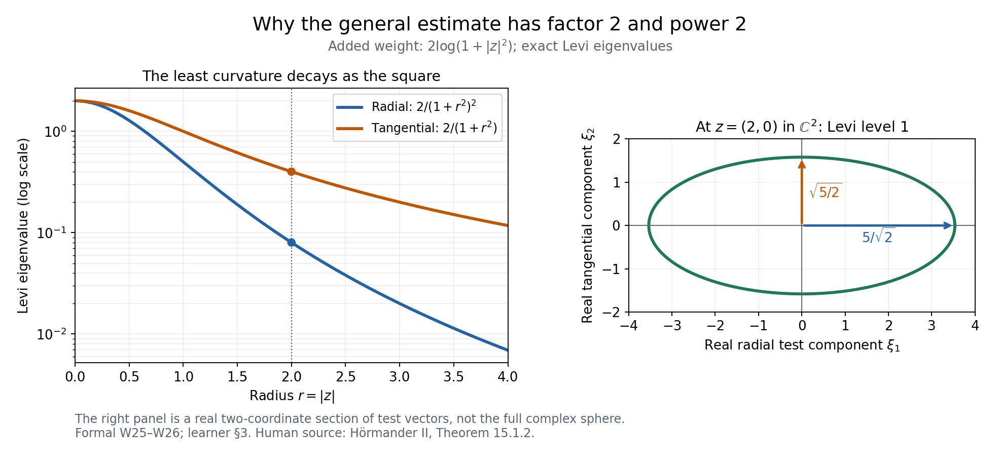
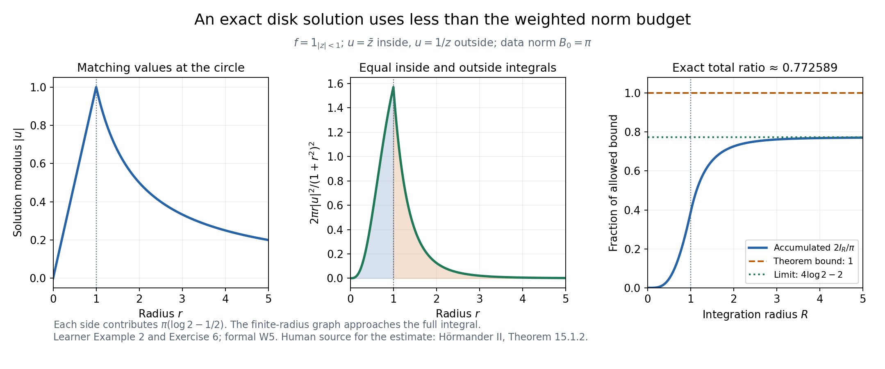

# Solving the Cauchy–Riemann equations with a weight

*AN-02 · Lesson 144 · Original exposition by GPT-6.1 Sol (OpenAI), Ultra. Self-checked by the writing AI. October 2026. CC0 1.0.*

For one complex variable, prescribing \(\bar\partial u=f\) asks for the antiholomorphic derivative of a function. In several variables, the prescribed derivatives must fit together. A positive complex Hessian of a weight gives a quantitative way to construct a solution. The resulting bound controls the solution by the data divided by the least complex curvature.

This lesson proves the exact strict-weight and general-PSH-weight existence statements. It includes the joint operator-domain approximation, the removal of an extra integrability assumption used temporarily in the argument, and the passage to singular PSH weights. The complete proof is [the accompanying formal source](weighted-dbar-existence-formal.md). Later extension and Fourier-weighted theorems are separate targets.

## 1. Operators, compatibility and curvature

On \(\mathbb C^n\) use \(z_j=x_j+iy_j\), ordinary \(2n\)-dimensional volume \(dV\), and

\[
\partial_j=\tfrac12(\partial_{x_j}-i\partial_{y_j}),\qquad
\bar\partial_j=\tfrac12(\partial_{x_j}+i\partial_{y_j}).
\tag{L144.1}
\]

Thus \(\bar\partial_j\overline z_k=\delta_{jk}\) and \(\bar\partial_j z_k=0\). If \(\bar\partial_j u=f_j\), commuting distributional derivatives forces

\[
\bar\partial_k f_j=\bar\partial_j f_k.
\tag{L144.2}
\]

We call (L144.2) closedness. In dimension one it imposes no condition, because there is no pair of distinct indices. In dimension two the data \(f_1=\overline z_2,f_2=0\) fail it: one side is 1, the other 0. No distributional solution exists for those data, regardless of any finite weighted norm.

For a real twice continuously differentiable weight, the Levi form is the quadratic expression

\[
\mathcal L_\phi(z;\xi)=\sum_{j,k}\partial_j\bar\partial_k\phi(z)
                                  \xi_j\overline{\xi_k},\qquad
\kappa_\phi(z)=\min_{|\xi|=1}\mathcal L_\phi(z;\xi).
\tag{L144.3}
\]

Strict PSH here means \(\kappa_\phi>0\) at every point; a uniform positive lower bound over all space is not required. Weighted square norms integrate against \(e^{-\phi}dV\).

**Strict weighted existence.** If \(\phi\in C^2\) is strictly PSH, the data are distributionally closed, and

\[
B=\int_{\mathbb C^n}\frac{|f|^2}{\kappa_\phi}e^{-\phi}dV<\infty,
\tag{L144.4}
\]

then there is a distributional solution satisfying

\[
\bar\partial u=f,\qquad
\int |u|^2e^{-\phi}dV\le B.
\tag{L144.5}
\]

Do not add \(\int|f|^2e^{-\phi}<\infty\) to the theorem. It is convenient for an intermediate Hilbert projection, and W7 removes it. Example 3 below shows that it can actually fail while (L144.4) holds. The stated data do belong to local ordinary \(L^2\), since \(e^{-\phi}/\kappa_\phi\) has a positive lower bound on every compact set.

**General PSH weighted existence.** For any nontrivial global PSH \(\phi\), including nonsmooth functions with singular values \(-\infty\), closed data with

\[
B_0=\int |f|^2e^{-\phi}dV<\infty
\tag{L144.6}
\]

have a distributional solution with

\[
2\int |u|^2 e^{-\phi}(1+|z|^2)^{-2}dV\le B_0.
\tag{L144.7}
\]

This is a global estimate with the exact factor 2 and the exact power 2. A nontrivial PSH function is locally integrable and locally bounded above. Its singular set has measure zero, and ordinary extended Lebesgue integrals give the meaning of its weight. The completely minus-infinite weight has only zero finite weighted data and the zero solution.

## 2. How a positive Hessian produces a solution

Write \(T u=(\bar\partial_j u)_j\) and \((Sg)_{jk}=\bar\partial_k g_j-\bar\partial_j g_k\) for \(j<k\). The two-form norm sums over unordered pairs. For compact smooth coefficients, the weighted adjoint is

\[
T^*g=-\sum_j(\partial_j-\phi_j)g_j.
\tag{L144.8}
\]

W3 proves by integration by parts and cancellation of all cross terms that

\[
\|T^*g\|_\phi^2+\|Sg\|_\phi^2
=\sum_{j,k}\|\bar\partial_k g_j\|_\phi^2
  +\int\mathcal L_\phi(z;g)e^{-\phi}dV.
\tag{L144.9}
\]

Discarding the nonnegative derivative term gives

\[
\int\kappa_\phi|g|^2e^{-\phi}dV
\le\|T^*g\|_\phi^2+\|Sg\|_\phi^2.
\tag{L144.10}
\]

The projected test used next need not be smooth or compact. W4 therefore proves (L144.10) on the joint maximal domain \(g,T^*g,Sg\) in their weighted square spaces. Cutoffs approximate all three graph norms. Convolution commutes with the constant-coefficient operator \(S\). For the adjoint its only error is

\[
\phi_j(g_j*\rho_\varepsilon)-(\phi_jg_j)*\rho_\varepsilon,
\tag{L144.11}
\]

whose local square norm is bounded by the modulus of continuity of \(\phi_j\) times the square norm of \(g_j\). The error tends to zero. This supplies the actual operator-domain estimate.

Temporarily assume the data also lie in the weighted coefficient Hilbert space. Let \(N\) be the closed subspace of closed forms. Project a compact test \(g\) to \(G\in N\), leaving \(J\perp N\). All forms \(T\psi\) are closed, so orthogonality makes \(T^*J=0\). Consequently \(T^*G=T^*g\), \(SG=0\), and (L144.10) controls \(G\) by \(T^*g\). Closedness of the data gives \((f,g)_\phi=(f,G)_\phi\). Weighted Cauchy–Schwarz now gives

\[
|(f,g)_\phi|\le\sqrt B\,\|T^*g\|_\phi.
\tag{L144.12}
\]

Inner products are linear in their first argument. Thus \(T^*g\mapsto(g,f)_\phi\) is a well-defined bounded linear functional on the range of the adjoint tests. Extend it to the closure and use orthogonal projection to extend it to the whole scalar Hilbert space. [L043 Lemma 1.1](../../AN02-L043.html#a-representing-vector-in-hilbert-space) supplies its representing vector \(u\), of norm at most \(\sqrt B\). The representation says exactly

\[
(u,T^*g)_\phi=(f,g)_\phi.
\tag{L144.13}
\]

W5 cancels the weight in compact \(C^1\) tests and obtains \(\bar\partial u=f\) as an ordinary distributional equation. Its proof treats the \(C^2\) weight honestly; it does not assume that \(e^\phi\) is smooth to every order.

W7 removes the temporary extra data norm. It constructs a nonnegative smooth convex \(\Phi\) such that \(\kappa_\phi e^{-\varepsilon\Phi}\) is globally bounded for each positive \(\varepsilon\). The larger weight \(\phi+\varepsilon\Phi\) then makes the data square integrable and keeps their curvature-weighted norm at most \(B\). The resulting solutions have uniform local square bounds. W6 gives one subsequence converging weakly on every compact ball. Fix a positive \(\delta\), first pass the estimate with the smaller weight \(e^{-\phi-\delta\Phi}\) to the limit, then let \(\delta\downarrow0\) by monotone convergence. This recovers (L144.5) without an extra hypothesis.

## 3. Where the factor 2 comes from

For a smooth PSH \(\phi\), add \(2\log(1+|z|^2)\). Direct differentiation gives

\[
\partial_j\bar\partial_k\log(1+|z|^2)
=\frac{\delta_{jk}}{1+|z|^2}
 -\frac{\overline z_j z_k}{(1+|z|^2)^2}.
\tag{L144.14}
\]

The least eigenvalue of the added Hessian is \(2(1+|z|^2)^{-2}\). At \(z\ne0\), the complex line generated by \(z\) has that radial eigenvalue. Each complex orthogonal direction has eigenvalue \(2(1+|z|^2)^{-1}\); there are no such directions when \(n=1\). At the origin all eigenvalues are2. The division by the least curvature cancels the newly inserted square factor:

\[
\frac{e^{-\phi}(1+|z|^2)^{-2}}
 {2(1+|z|^2)^{-2}}=\tfrac12e^{-\phi}.
\tag{L144.15}
\]

Apply strict weighted existence to obtain (L144.7).

*Figure1. The added weight is exactly \(2\log(1+|z|^2)\). The left panel shows its eigenvalues as functions of radius. The right panel is the real two-coordinate test-vector section of the level set \(\mathcal L(\xi)=1\) at \(z=(2,0)\in\mathbb C^2\); it is not a picture of the entire complex unit sphere. Its radial and tangential semiaxes are \(5/\sqrt2\) and \(\sqrt{5/2}\). The lower radial eigenvalue supplies (L144.15). Exact derivation: formal W25–W26. Human source: Hörmander II, Theorem 15.1.2, printed pp. 273–274.*

For nonsmooth PSH \(\phi\), use a normalized decreasing radial convolution kernel. Its positive ball-mean decomposition, together with [the proved ball-mean monotonicity, L141 D5](../../AN02-L141.html), gives

\[
\phi_\varepsilon\downarrow\phi\quad(\varepsilon\downarrow0)
\quad\text{at every point}.
\tag{L144.16}
\]

The smooth solutions have uniform local square bounds. For a fixed \(\delta>0\), and all smaller \(\varepsilon\), the weight from \(\phi_\delta\) is smaller than that from \(\phi_\varepsilon\). Use that fixed continuous weight in the weak limit; only afterwards let \(\delta\downarrow0\). W8 writes the full argument, including minus-infinite centers.

## 4. Four worked examples

### Example 1. A Gaussian and the sharp strict-weight constant

Take \(\phi=a|z|^2\), \(a>0\), and constant closed data \(f_j=c_j\). Then \(\kappa_\phi=a\), and

\[
u(z)=\sum_j c_j\overline z_j,\qquad
\int |u|^2e^{-a|z|^2}dV
=\frac{|c|^2}{a}\left(\frac\pi a\right)^n
=B.
\tag{L144.17}
\]

Cross terms vanish by integration in an angular variable; each diagonal moment is \(a^{-1}\) times the Gaussian volume. Exercise 3 computes these integrals directly.

This solution has the smallest weighted norm. For any weighted-square-integrable \(h\) with \(\bar\partial h=0\), use compact cutoffs \(\chi_R\) and \(\partial_j e^{-a|z|^2}=-a\overline z_j e^{-a|z|^2}\). Distributional integration by parts against \(\chi_R e^{-a|z|^2}\) gives

\[
\int\chi_R\overline z_j\overline h\,e^{-a|z|^2}dV
=\frac1a\int(\partial_j\chi_R)\overline h\,e^{-a|z|^2}dV.
\tag{L144.18}
\]

The right side tends to zero by weighted Cauchy–Schwarz, since \(\|\partial_j\chi_R\|_\phi=O(R^{-1})\). The left side converges by the same inequality and the finite Gaussian moment. Thus \((u,h)_\phi=0\). Any other solution differs by such an \(h\), and its squared norm is \(\|u\|_\phi^2+\|h\|_\phi^2\). Equality in (L144.17) proves that the coefficient1 in strict weighted existence cannot be lowered uniformly.

### Example 2. Compact data for the general estimate

In \(\mathbb C\), let \(\phi=0\), \(f=1_{\{|z|<1\}}\), and

\[
u(z)=
\begin{cases}\overline z,&|z|\le1,\\1/z,&|z|>1.\end{cases}
\tag{L144.19}
\]

The two expressions agree on the unit circle. Integration by parts on its two sides therefore cancels the boundary terms. Inside, \(\bar\partial\overline z=1\); outside, \(1/z\) is holomorphic. Hence the distributional derivative is exactly \(f\), without an additional circle-supported term. The origin uses the inside expression and supplies no pole.

The data norm is \(B_0=\pi\). Direct polar integration, detailed in Exercise 6, gives

\[
I=\int\frac{|u|^2}{(1+|z|^2)^2}dA
=2\pi(\log2-\tfrac12),\qquad
\frac{2I}{B_0}=4\log2-2<1.
\tag{L144.20}
\]

This explicit solution satisfies the stated general estimate. Neither a constant datum on all of \(\mathbb C\) nor the globally defined function \(\overline z\) alone would be this finite-data example.

*Figure2. For the exact piecewise solution (L144.19), the panels show its modulus, its radial weighted norm density \(2\pi r|u(r)|^2/(1+r^2)^2\), and the accumulated ratio \(2I_R/\pi\). The two sides contribute equal norm \(\pi(\log2-1/2)\). The final ratio is \(4\log2-2\), below the theorem's bound 1. The right panel approaches that exact value as the integration radius increases; the plotted finite radius is not the full integral. Derivation: Example 2 and Exercise 6. Human source for the existence estimate: Hörmander II, Theorem 15.1.2.*

### Example 3. The temporary global data norm really can fail

In one complex dimension choose

\[
\phi(z)=e^{|z|^2},\qquad
\kappa_\phi=(1+|z|^2)e^{|z|^2},\qquad
f(z)=\exp\bigl(e^{|z|^2}/2\bigr).
\tag{L144.21}
\]

There is no compatibility condition in one dimension. These smooth data satisfy

\[
\int |f|^2e^{-\phi}dA=\int1\,dA=\infty,
\quad
B=\pi\int_0^\infty\frac{e^{-s}}{1+s}ds\le\pi<\infty.
\tag{L144.22}
\]

Strict weighted existence applies with exactly these hypotheses. W7's auxiliary convex function makes the Hilbert argument available and then removes the auxiliary weight. The rapidly growing displayed datum is a mathematical example, not a request to evaluate its enormous values numerically.

### Example 4. A singular weight and data away from its singularity

Let \(\phi(z)=\alpha\log|z|\), \(\alpha\ge0\), with the value \(-\infty\) at 0 when \(\alpha>0\). In one complex variable this is PSH; its circle means follow from the logarithmic mean formula in L137 Z2. Set

\[
\chi(s)=
\begin{cases}
\exp[-1/((s-1)(4-s))],&1<s<4,\\
0,&\text{otherwise},
\end{cases}
\quad u_0(z)=\chi(|z|^2),\quad f(z)=z\chi'(|z|^2).
\tag{L144.23}
\]

Endpoint flatness makes these functions smooth. The datum is supported in the annulus \(1\le|z|\le2\), is closed automatically, and has finite \(B_0\) for every fixed \(\alpha\). We already have one compactly supported solution \(u_0\). General weighted existence additionally selects a solution with (L144.7); this observation does not assert that the particular \(u_0\) is the solution of smallest weighted norm.

The singularity has a genuine effect on admissible solutions. For a nonnegative integer \(m\), a function equal to \(z^m\) near 0 has finite local weighted square norm precisely when

\[
\int_0^\eta r^{2m-\alpha+1}dr<\infty
\quad\Longleftrightarrow\quad \alpha<2m+2.
\tag{L144.24}
\]

At equality the divergence is logarithmic. The harmless factor \((1+r^2)^{-2}\) does not alter this local threshold.

## 5. Exercises

1. **Basic.** Compute \(\bar\partial_j z_k\), \(\bar\partial_j\overline z_k\), the weighted adjoint of \(\bar\partial_j\), and \([\partial_j-\phi_j,\bar\partial_k]\). Keep track of both conjugation and the sign.
2. **Basic.** Explain why the Gaussian-square-integrable datum \((\overline z_2,0)\) in \(\mathbb C^2\) has no distributional solution. Why is any locally square-integrable datum closed in \(\mathbb C\)?
3. **Intermediate.** Compute the Gaussian volume and second moments used in Example 1. In \(\mathbb C^2\), take \(\phi=a|z_1|^2+b|z_2|^2\), \(0<a<b\), and \(f=(0,c)\). Compare the norm of \(c\overline z_2\) with the least-curvature bound.
4. **Intermediate.** Verify every formula in Example 3 and explain why an argument restricted to globally square-integrable data does not prove the stated strict theorem.
5. **Intermediate.** Derive the radial and tangential eigenvalues of the Hessian of \(2\log(1+|z|^2)\). Explain why the factor 2 and the square power in (L144.7) occur together.
6. **Intermediate.** Verify the distributional equation and both polar integrals in Example 2. Prove \(4\log2-2<1\) without relying on a decimal approximation.
7. **Intermediate.** Differentiate the annular cutoff in Example 4, verify finite weighted data, and prove the threshold (L144.24), including equality.
8. **Advanced.** In W4, bound the variable-coefficient convolution error using a modulus of continuity. Explain why the compact-graph estimate alone cannot be applied immediately to the orthogonal projection \(G\).
9. **Advanced.** Explain the order of the weak-limit argument for general PSH weights. Write the comparison for a fixed \(\delta>0\), justify passage to the weak limit, and identify the final monotone limit. Explain why pointwise convergence of the weights alone would be insufficient.

## 6. Complete solutions

**1.** Apply (L144.1) to the real and imaginary coordinate functions. The results are \(\bar\partial_j z_k=0\) and \(\bar\partial_j\overline z_k=\delta_{jk}\). For compact smooth \(a,b\), real integration by parts gives

\[
\int(\bar\partial_j a)\overline b e^{-\phi}dV
=-\int a\,\overline{(\partial_j-\phi_j)b}\,e^{-\phi}dV.
\tag{L144.25}
\]

Thus the adjoint is \(-\partial_j+\phi_j\). Apply the commutator to a test \(h\): mixed derivatives cancel, while differentiating the coefficient \(-\phi_j h\) leaves \((\bar\partial_k\phi_j)h=\phi_{j\bar k}h\). The commutator is multiplication by the Levi coefficient with a positive sign. Reversing its order reverses that sign.

**2.** If a distributional \(u\) solved the two equations, then \(\bar\partial_2\bar\partial_1u=\bar\partial_1\bar\partial_2u\). The proposed right sides yield 1 and 0, a contradiction. Multiplication by a Gaussian makes their square integral finite, but does not repair that compatibility failure. In dimension one there are no two different coefficient indices, so the closedness equation is the tautology \(\bar\partial_1f_1=\bar\partial_1f_1\).

**3.** Polar integration in one complex coordinate gives

\[
\int_\mathbb C e^{-a|z|^2}dA=2\pi\int_0^\infty re^{-ar^2}dr=\pi/a,
\quad
\int_\mathbb C |z|^2e^{-a|z|^2}dA
=2\pi\int_0^\infty r^3e^{-ar^2}dr=\pi/a^2.
\tag{L144.26}
\]

Use \(s=ar^2\); \(\int_0^\infty e^{-s}ds=1\) and \(\int_0^\infty se^{-s}ds=1\), the latter by integration by parts. Fubini multiplies the coordinate integrals. For \(j\ne k\), angular integration of \(\overline z_j z_k\) gives zero. These computations prove (L144.17). For the anisotropic weight, \(Z=\pi^2/(ab)\), \(\kappa=a\), and

\[
\|c\overline z_2\|_\phi^2=|c|^2 Z/b,
\qquad B=|c|^2 Z/a,
\qquad \|c\overline z_2\|_\phi^2/B=a/b<1.
\tag{L144.27}
\]

The weakest eigenvalue gives one bound for every direction. Data in a stronger direction can have a smaller solution norm. The isotropic example realizes equality and, by its orthogonality argument, proves the uniform coefficient sharp.

**4.** With \(s=|z|^2\), \(\partial s=\overline z\) and \(\bar\partial s=z\). Differentiate \(e^s\) twice: \(\partial\bar\partial e^s=(1+s)e^s>0\). The chosen datum satisfies \(|f|^2=e^{e^s}=e^\phi\). The uncorrected data norm is the infinite area of the plane. After division by curvature the integrand is \(e^{-s}/(1+s)\). Since \(dA=\pi ds\) for radial integration, its integral is at most \(\pi\). Closedness imposes no further condition in one dimension. An argument using a projection of \(f\) in the coefficient Hilbert space cannot start with this \(f\). W7 first enlarges the weight to give that Hilbert membership, solves with a uniform curvature bound, and then takes a local weak limit to the original weight.

**5.** Differentiate \(\log(1+s)\) to obtain (L144.14). The rank-one term contributes \(|\sum_j\overline z_j\xi_j|^2/(1+s)^2\). For \(\xi\) on the complex line generated by \(z\), this is \(s|\xi|^2/(1+s)^2\), leaving \(|\xi|^2/(1+s)^2\). For \(\xi\) orthogonal to \(z\), the rank-one term vanishes, leaving \(|\xi|^2/(1+s)\). Multiplying the weight by2 multiplies these eigenvalues by2. At \(z=0\), the matrix is2 times the identity. Adding this PSH weight to any smooth PSH \(\phi\) gives least curvature at least \(2(1+s)^{-2}\), and multiplies \(e^{-\phi}\) by \((1+s)^{-2}\). Dividing the latter by the former leaves at most \(e^{-\phi}/2\). This proves the exact constant and power relationship. Dimension one has the radial eigenvalue alone.

**6.** On the unit circle, \(\overline z=1/z\). To test the distributional derivative, integrate each classical derivative against a compact smooth test in the inner disk and its outer complement. The outward normals on the common circle have opposite signs, and the identical boundary values cancel their boundary contributions. The classical derivatives are1 and0. A small circle around the origin is unnecessary, because the inner function is smooth there. Thus \(\bar\partial u=1_{\{|z|<1\}}\). For the norm, put \(s=r^2\):

\[
\begin{aligned}
I_{\rm in}&=2\pi\int_0^1\frac{r^3}{(1+r^2)^2}dr
=\pi\int_0^1\frac{s}{(1+s)^2}ds
=\pi(\log2-\tfrac12),\\
I_{\rm out}&=2\pi\int_1^\infty\frac{1}{r(1+r^2)^2}dr
=\pi\int_1^\infty\frac{1}{s(1+s)^2}ds
=\pi(\log2-\tfrac12).
\end{aligned}
\tag{L144.28}
\]

For the first antiderivative use \(\log(1+s)+(1+s)^{-1}\). For the second use \(\log s-\log(1+s)+(1+s)^{-1}\). The second tends to0 at infinity. Their sum proves (L144.20). For \(1<t<2\),

\[
1/t<(3-t)/2,
\quad\text{because }(t-1)(2-t)>0.
\tag{L144.29}
\]

Integrating gives \(\log2<3/4\), and hence \(4\log2-2<1\). The inequality is strict on a set of positive length.

**7.** For \(1<s<4\), let \(h(s)=(s-1)(4-s)\), so \(h'(s)=5-2s\). Direct differentiation gives

\[
\chi'(s)=\chi(s)\frac{5-2s}{(s-1)^2(4-s)^2},\qquad
\bar\partial\chi(|z|^2)=z\chi'(|z|^2).
\tag{L144.30}
\]

At an endpoint, the exponential of the negative reciprocal dominates every inverse power, so the function and all its derivatives extend by zero. The support of \(f\) stays away from0 and infinity; the weight \(|z|^{-\alpha}\) is bounded above and below there for fixed \(\alpha\). Smooth compact data therefore have finite weighted norm. For \(u=z^m\) near 0, polar integration gives a fixed positive constant times \(\int_0^\eta r^{2m-\alpha+1}dr\). For a power \(r^p\), this integral is finite exactly when \(p>-1\), by its antiderivative \(r^{p+1}/(p+1)\). At \(p=-1\) it is \(\int dr/r\), which diverges. Thus \(\alpha<2m+2\) is exact. The factor \((1+r^2)^{-2}\) is bounded above and below near 0 and leaves this threshold unchanged.

**8.** The error for a continuous coefficient \(a\) is

\[
\int [a(z)-a(z-h)]g(z-h)\rho_\varepsilon(h)dh.
\tag{L144.31}
\]

On a common compact neighborhood, its coefficient difference is at most \(\omega_a(\varepsilon)\). The integral triangle inequality in \(L^2\), followed by translation invariance and \(\int\rho_\varepsilon=1\), bounds the norm by \(\omega_a(\varepsilon)\|g\|_2\). This tends to zero. Bounded positive upper and lower values of the weight on that compact set transfer the bound to its weighted square norm. The projection \(G\) is an abstract Hilbert-space vector; projection preserves neither compact support nor smoothness. It does satisfy \(SG=0\) and \(T^*G=T^*g\), placing it in the joint maximal domain. The cutoff/convolution approximation and compact curvature limits in W4 make (L144.10) valid on that domain. Without this extension, applying the compact smooth estimate to \(G\) would be a gap.

**9.** Ball means of a subharmonic function are nondecreasing with radius. The decreasing radial kernel has a positive ball-mean decomposition with weights of total one, so \(\phi_\varepsilon\) is nondecreasing with \(\varepsilon\), and decreases to the original upper semicontinuous \(\phi\) as \(\varepsilon\downarrow0\). The solutions satisfy

\[
2\int|u_\varepsilon|^2e^{-\phi_\varepsilon}(1+|z|^2)^{-2}dV\le B_0.
\tag{L144.32}
\]

For fixed \(\delta>0\) and \(\varepsilon\le\delta\), we have \(\phi_\varepsilon\le\phi_\delta\), hence \(e^{-\phi_\delta}\le e^{-\phi_\varepsilon}\). On each fixed ball the weight \(e^{-\phi_\delta}(1+|z|^2)^{-2}\) is a bounded continuous positive multiplier. Multiplying by its square root preserves weak \(L^2\) convergence. The Hilbert norm is weakly lower semicontinuous, yielding the same bound for \(u\) on that ball. Enlarge the balls by monotone convergence. Finally let \(\delta\downarrow0\); the fixed weights increase to \(e^{-\phi}(1+|z|^2)^{-2}\), including its extended values at singular points. A second monotone convergence gives (L144.7). Weak local convergence also passes the distributional equation to the limit by smooth derivative tests. Pointwise convergence of the weights alone gives no convergence of the changing functions \(u_\varepsilon\) or their norms; the fixed-weight weak argument is essential.

## 7. Reading and reproduction

The formal proof gives W1–W28, including all graph-domain and limiting steps. Earlier inputs are the actual Hilbert representation proof in L043, the written Lebesgue foundations, L140 UE2 on PSH smoothing, and L141 D5 on ball-mean monotonicity. Exercise solutions and the two illustrated examples above are complete. The figure script and exact constants are in the accompanying reproduction folder; numerical integration checks complement the displayed exact arguments.

Human source: Lars Hörmander, *The Analysis of Linear Partial Differential Operators II*, §15.1, Theorems 15.1.1–15.1.2, printed pp. 271–274 (1983 edition, second revised printing 1990, reprint 2005). These proof expositions, examples, solutions and illustrations are original; no protected book pages or media accompany the lesson. This lesson does not claim downstream extension theorems or the whole AN-02 course are complete.
