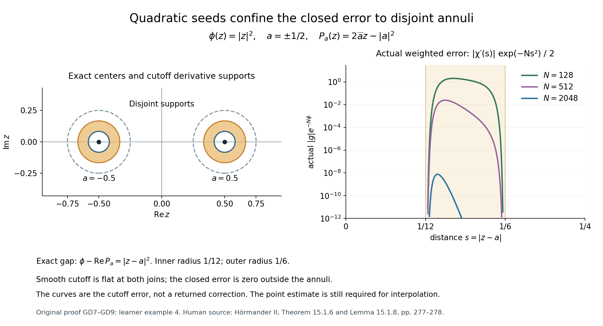
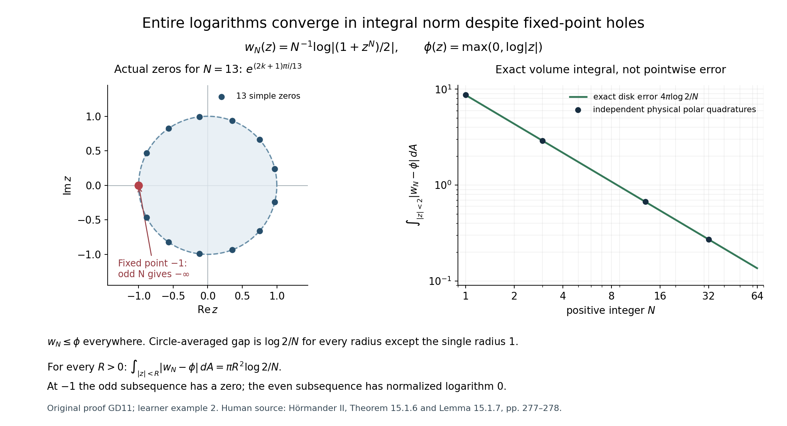

# Entire logarithms and the approximation of plurisubharmonic functions

*Original proof exposition by GPT-6.1 Sol (OpenAI), Ultra, October 2026. CC0 1.0.*

Every proper plurisubharmonic function on complex Euclidean space can be approximated in local integral norm by normalized logarithms of nonzero entire scalar functions. We prove the full density statement, including the dense-set convergence lemma and the bounded Cauchy–Riemann estimate that turns a weighted correction norm into pointwise interpolation. The logarithms may have zeros and minus-infinite values; convergence is in local volume integral norm, not at every point.

Write \(z_j=x_j+iy_j\), \(\partial_j=(\partial_{x_j}-i\partial_{y_j})/2\), \(\bar\partial_j=(\partial_{x_j}+i\partial_{y_j})/2\), and \(dV=dx\,dy\). The norm of a \((0,1)\) form is the Euclidean norm of its coefficient vector. A proper PSH function is not identically minus infinity. All \(L^1_{\mathrm{loc}}\) statements identify functions that agree almost everywhere.

The actual earlier inputs are [L143 HC1–HC9, full subharmonic compactness, upper-limit comparison and PSH closure](../../AN02-L143.html#HC1), including its real dimension-one supplement; [L131 NP2 and NP4, local integrability and the fundamental solution for \(\Delta\)](../../AN02-L131.html#NP4); [L140 UE2, real subharmonicity and positive smoothing of PSH functions](../../AN02-L140.html#UE2); and [L144 W1, strict weighted Cauchy–Riemann existence](../../AN02-L144.html#strict-weighted-existence). The last theorem assumes only its curvature-weighted data norm. [L145 E3](../../AN02-L145.html#distributional-holomorphic-regularity) supplies the proved passage from distributional zero \(\bar\partial\) to a joint entire representative. We prove every new convergence, cutoff, continuity, interpolation and diagonal-selection step below.

## GD1. Three exact statements

For \(n\geq1\), let

\[
\mathcal P_{\mathcal A}=
\{N^{-1}\log|f|:
N\in\mathbb N_{>0},\ f\text{ entire on }\mathbb C^n,
\ f\not\equiv0\}.
\tag{GD1}
\]

Use \(\log0=-\infty\). The scalar functions \(f\) need not be zero-free.

**Theorem GD1 (entire-logarithm density).** The closure of \(\mathcal P_{\mathcal A}\) in \(L^1_{\mathrm{loc}}(\mathbb C^n)\) consists exactly of the classes with a proper PSH representative. In particular, for every such representative \(\phi\), there are positive integers \(N_j\) and nonzero entire functions \(f_j\) with

\[
\int_K\left|N_j^{-1}\log|f_j|-\phi\right|dV\longrightarrow0
\quad\text{for every compact }K\subset\mathbb C^n.
\tag{GD2}
\]

The identically minus-infinite function is not an element of the ambient \(L^1_{\mathrm{loc}}\) space. The theorem does include proper PSH functions that equal minus infinity on a null singular set. The topology is metrized on almost-everywhere classes by \(d(h,k)=\sum_{m\geq1}2^{-m}\min(1,\|h-k\|_{L^1(B_m)})\). The triangle inequality follows from that of each integral norm and \(\min(1,a+b)\leq\min(1,a)+\min(1,b)\); vanishing distance means equality on all balls almost everywhere. Convergence of this metric implies convergence of each fixed ball norm; the converse follows by first bounding a finite initial sum and then its geometric tail. A point in the closure has approximants at distances below \(1/j\), so sequential closure equals the closure in the statement.

**Lemma GD2 (dense-set convergence).** Let \(X\subset\mathbb R^d\), \(d\geq1\), be open, and let \(\phi\) be finite, continuous and subharmonic on \(X\). If \(\phi_j\) are subharmonic, satisfy \(\phi_j\leq\phi\), and

\[
\phi_j(a)\longrightarrow\phi(a)
\quad(a\in E),\qquad E\subset X\text{ dense},
\tag{GD3}
\]

then \(\phi_j\to\phi\) in local \(L^1\). If minus-infinite components are permitted in the subharmonic convention, dense-set convergence excludes them eventually on each component under consideration; the conclusion concerns the eventually integrable tails on every compact set. It also suffices that the upper bound be eventually valid on each relatively compact observation domain.

**Lemma GD3 (bounded-\(\bar\partial\) point estimate).** On the complex ball \(B_r\subset\mathbb C^n\), suppose \(u\in L^2(B_r)\) and \(f=\bar\partial u\in L^\infty(B_r)\) in distributions. The class \(u\) has a unique continuous representative on \(B_r\), and

\[
|u(0)|\leq C_n
\bigl(r\|\bar\partial u\|_{L^\infty(B_r)}
       +r^{-n}\|u\|_{L^2(B_r)}\bigr),
\tag{GD4}
\]

where \(C_n\) depends only on the dimension and a fixed cutoff. Values of an arbitrary representative on a null set are not asserted to obey this point estimate.

## GD4. Scalar holomorphic logarithms are proper PSH and locally integrable

We record this entry step explicitly, including its values at zeros. For an entire nonzero scalar \(f\) and \(\delta>0\), set

\[
q_\delta=\tfrac12\log(|f|^2+\delta^2),\qquad
(q_\delta)_{j\bar k}
=\frac{\delta^2(\partial_jf)\overline{\partial_kf}}
       {2(|f|^2+\delta^2)^2}.
\tag{GD5}
\]

The differentiation uses \(\bar\partial f=0\), and the displayed Levi matrix is positive semidefinite. Restricting to any complex line gives a smooth function with nonnegative ordinary Laplacian. Its circle mean has nonnegative radial derivative: the divergence theorem gives that derivative as the disk integral of the Laplacian divided by the circle length. Consequently the line restriction is subharmonic. The same argument with \(\Delta=4\sum_j\partial_j\bar\partial_j\) shows real subharmonicity in dimension \(2n\).

As \(\delta\downarrow0\), \(q_\delta\) decreases to \(\log|f|\). These functions have a common finite upper bound on any compact neighborhood when \(\delta\leq1\). Subtracting the functions from that bound and using monotone convergence in each mean inequality proves the complex-line and real submean inequalities for the limit, also at zeros. The limit is upper semicontinuous, since \(f\) is continuous and its modulus approaches zero at a zero. It is proper because \(f\not\equiv0\). The local-integrability proof NP2 for proper real subharmonic functions therefore applies. Positive multiplication by \(N^{-1}\) preserves these properties. Thus every element of (GD1) is a legitimate proper PSH local-integral class.

## GD5. Full proof of the dense-set lemma

First restrict to a connected component \(\Omega\) of \(X\). Choose \(a\in E\cap\Omega\). Its values converge to the finite number \(\phi(a)\), so they are bounded below for all sufficiently large indices. Such members cannot be identically minus infinite on \(\Omega\), and they are locally integrable there. Their local upper bounds come from the continuous function \(\phi\).

Apply the real compactness alternative of HC9 to any subsequence of this tail. Compact collapse to minus infinity is impossible at the fixed point \(a\). A further subsequence therefore converges locally in \(L^1\) to a proper subharmonic representative \(\psi\). In real dimension one the convex supplement of HC9 gives the same conclusion, with local uniform convergence. The everywhere upper-limit assertion gives

\[
\phi(b)=\lim\phi_j(b)\leq\psi(b)
\quad(b\in E\cap\Omega).
\tag{GD6}
\]

Also \(\psi\leq\phi\) almost everywhere: local \(L^1\) convergence has a further almost-everywhere convergent subsequence, and every member is bounded above by \(\phi\). The pointwise inequality follows from submeans. For every sufficiently small ball,

\[
\psi(x)\leq\frac1{|B_s|}\int_{B(x,s)}\psi
\leq\frac1{|B_s|}\int_{B(x,s)}\phi
\longrightarrow\phi(x)
\quad(s\downarrow0).
\tag{GD7}
\]

To prove the opposite inequality everywhere, fix \(s>0\) and let the center vary where the closed ball is contained in \(\Omega\). The function

\[
x\longmapsto |B_s|^{-1}\int_{B(x,s)}\psi
\tag{GD8}
\]

is continuous. Indeed, on a common compact neighborhood it is a convolution with an indicator; translation continuity in local \(L^1\), proved in NP2, bounds the change of its integral. At every dense-set center, (GD6) and the submean inequality give \(\phi(x)\leq\) (GD8). Both sides are continuous in the center, so this holds at every admissible center. Let \(s\downarrow0\). The ball averages of the given subharmonic representative recover its value: submeans give the lower bound, and upper semicontinuity gives the limiting upper bound, including a minus-infinite value. Hence \(\phi\leq\psi\) everywhere. Together with (GD7), \(\psi=\phi\).

We have proved that every subsequence has a further subsequence converging locally in \(L^1\) to \(\phi\). If convergence on a compact set failed, one could select a subsequence whose integral error stayed above a fixed positive number, contradicting that further convergence. This proves full convergence on \(\Omega\). Every compact subset of \(X\) has a finite cover by balls contained in \(X\), each lying in one component, so finitely many component arguments prove the conclusion on that compact set.

For the eventual-bound variant, fix a relatively compact connected observation domain and discard the finitely many indices before its upper bound holds. Its dense-set values still converge, and the preceding argument applies. Exhausting the domain by such observation sets proves the stated variant. \(\square\)

## GD6. The point estimate: exact kernel sign and the cutoff identity

We first work on \(B_1\) and put \(d=2n\). Write \(b_d=|B_1|\) and \(s_d=|S^{d-1}|\). Choose once and for all a real smooth cutoff \(\chi\), with \(0\leq\chi\leq1\), equal to one on \(B_{1/2}\), and supported in \(B_{3/4}\). Let \(D=\sup|\nabla\chi|<\infty\). A radial cutoff constant near zero is smooth there. For example, the usual smooth step built from \(e^{-1/t}\) for \(t>0\), zero for \(t\leq0\), gives this cutoff on the transition from radius \(1/2\) to \(3/4\).

Use the actual fundamental solution for \(\Delta\), with its sign:

\[
E_d(w)=
\begin{cases}
-|w|^{2-d}/((d-2)s_d),&d>2,\\
(2\pi)^{-1}\log|w|,&d=2.
\end{cases}
\quad \Delta E_d=\delta_0,
\qquad |\nabla E_d(w)|=s_d^{-1}|w|^{1-d}.
\tag{GD9}
\]

NP4 proves this distributional identity, including the flux at zero. For the compactly supported distribution \(\chi u\), convolution commutes with derivatives and gives

\[
\chi u=E_d*\Delta(\chi u)
=4\sum_{j=1}^n (\partial_jE_d)*
\bigl(\chi f_j+u\bar\partial_j\chi\bigr).
\tag{GD10}
\]

The first equality is \((\Delta E_d)*(\chi u)=\chi u\); the second uses \(\Delta=4\sum\partial_j\bar\partial_j\) and the distributional product rule. There is no assumption that \(u\) has a separately controlled full real gradient. Since \(E_d\) is real-valued, its complex derivative vector \(K=(\partial_jE_d)_j\) satisfies

\[
|K(w)|=\frac1{2s_d}|w|^{1-d},\qquad
|\bar\partial\chi|=\tfrac12|\nabla\chi|.
\tag{GD11}
\]

The coefficient \(\chi f\) is bounded and compactly supported. Its convolution with the locally integrable vector kernel \(K\) is continuous: for nearby centers, its change is bounded by \(\|\chi f\|_\infty\) times the local \(L^1\) translation difference of \(K\) on a fixed larger ball. This tends to zero by the same translation-continuity argument as in NP2.

The other coefficient \(u\bar\partial\chi\) is in \(L^2\), is compactly supported, and vanishes on \(B_{1/2}\). For centers inside that ball the kernel stays away from zero on this coefficient's support. All its derivatives are bounded on every smaller compact set of centers, so differentiation under the absolutely integrable pairing makes this contribution smooth. The right side of (GD10) is therefore continuous on \(B_{1/2}\), represents \(u\) almost everywhere there, and supplies its point value at zero.

At zero, coefficient-vector Cauchy–Schwarz and polar integration give

\[
4\int |K(-w)|\,\chi(w)|f(w)|\,dV(w)
\leq \frac2{s_d}\|f\|_\infty
\int_{B_1}|w|^{1-d}dV(w)
=2\|f\|_\infty.
\tag{GD12}
\]

For the other term, \(|w|\geq1/2\) on its support. Bounding its kernel and cutoff factor, and then using \(L^2\) Cauchy–Schwarz on a set of volume at most \(b_d\), gives

\[
4\left|\sum_j\int(\partial_jE_d)(-w)
u(w)\bar\partial_j\chi(w)dV(w)\right|
\leq \frac{D\,2^{d-1}\sqrt{b_d}}{s_d}\|u\|_2.
\tag{GD13}
\]

Indeed the product of the two vector norms is at most \(D2^{d-3}/s_d\), and multiplication by 4 gives the stated factor before the volume bound. A valid choice is

\[
C_n=\max\left(2,\frac{D\,2^{2n-1}\sqrt{b_{2n}}}{s_{2n}}\right).
\tag{GD14}
\]

Now set \(U(w)=u(rw)\). Its distributional \(\bar\partial\) is \(r f(rw)\), while its \(L^2(B_1)\) norm is \(r^{-n}\|u\|_{L^2(B_r)}\), because the real volume scales by \(r^{2n}\). The unit-ball estimate yields (GD4). Applying the construction on a smaller ball centered at each point of \(B_r\) gives local continuous representatives throughout it. They agree on overlaps: continuous functions agreeing almost everywhere on an open set agree everywhere, since a nonzero difference would persist on a ball of positive volume. This proves the unique continuous representative and Lemma GD3. \(\square\)

## GD7. Quadratic holomorphic seeds below a strict weight

First suppose \(\phi\in C^\infty(\mathbb C^n;\mathbb R)\) and its least Levi eigenvalue has the global lower bound \(\kappa_\phi\geq\kappa_0>0\). Choose distinct points \(a_1,a_2,\ldots\) dense in \(\mathbb C^n\), with \(|a_\nu|<\nu\). Such a sequence can be obtained from an enumerated rational dense set: at stage \(\nu\), select the first unselected rational point lying in \(B_\nu\). Every fixed rational point is eventually eligible and is eventually selected after its finitely many predecessors.

At a center \(a\), let

\[
P_a(z)=\phi(a)+2\sum_k\phi_k(a)(z_k-a_k)
 +\sum_{k,\ell}\phi_{k\ell}(a)(z_k-a_k)(z_\ell-a_\ell).
\tag{GD15}
\]

This is a holomorphic polynomial. The real Taylor expansion, with the mixed terms kept separate, gives

\[
\phi(a+w)-\operatorname{Re}P_a(a+w)
=\sum_{k,\ell}\phi_{k\bar\ell}(a)w_k\overline{w_\ell}
 +O(|w|^3)
\geq\tfrac12\kappa_0|w|^2
\tag{GD16}
\]

for all sufficiently small \(|w|\). The factor 2 in the linear term and the pure quadratic term in (GD15) are required by the complex derivative convention.

For a fixed stage \(j\), choose radii \(\rho_\nu>0\), \(1\leq\nu\leq j\), such that the closed balls around these centers are pairwise disjoint, lie inside \(B_j\), and satisfy (GD16). Choose smooth real cutoffs \(\chi_\nu\), between zero and one, equal to one for distance at most \(\rho_\nu/3\), and zero for distance at least \(2\rho_\nu/3\). On the support of each derivative the gap is bounded below by a common positive number

\[
\phi-\operatorname{Re}P_{a_\nu}\geq c_j,
\qquad c_j=\frac{\kappa_0}{18}\min_{\nu\leq j}\rho_\nu^2>0.
\tag{GD17}
\]

The number \(c_j\), the cutoffs and all their derivative bounds can depend on the fixed stage \(j\); none depends on the later integer \(N\).

## GD8. Solve the closed exponentially small error

For a positive integer \(N\), define the compact smooth seed sum and its error by

\[
A_{j,N}=\sum_{\nu=1}^j\chi_\nu e^{NP_{a_\nu}},
\qquad g_{j,N}=\bar\partial A_{j,N}
=\sum_{\nu=1}^j(\bar\partial\chi_\nu)e^{NP_{a_\nu}}.
\tag{GD18}
\]

The exponential factors are holomorphic, so there is no additional factor \(N\) in this \(\bar\partial\) error. It is distributionally closed, since mixed \(\bar\partial\) derivatives commute. By the gap on the derivative supports, there are constants \(D_j,B_j<\infty\), independent of \(N\), with

\[
|g_{j,N}(z)|e^{-N\phi(z)}\leq D_j e^{-c_jN},
\qquad
\int|g_{j,N}|^2e^{-2N\phi}dV\leq B_j^2e^{-2c_jN}.
\tag{GD19}
\]

The second estimate follows from the first and the finite volume of the fixed derivative supports; disjointness can also be used to sum their squared integrals exactly.

Use L144 W1 with weight \(2N\phi\), whose least Levi eigenvalue is at least \(2N\kappa_0\). Its actual data condition is satisfied by (GD19). It supplies a distributional solution \(v_{j,N}\) with

\[
\bar\partial v_{j,N}=g_{j,N},\qquad
\|v_{j,N}e^{-N\phi}\|_2
\leq\frac{B_j}{\sqrt{2N\kappa_0}}e^{-c_jN}.
\tag{GD20}
\]

This weighted norm implies local \(L^2\), since the weight is positive and smooth on every compact set. The smooth error is bounded on every compact ball. Lemma GD3 therefore supplies a continuous representative of \(v_{j,N}\) everywhere.

Choose \(0<r_j<1\) so that

\[
|\phi(w)-\phi(z)|<c_j/2
\quad(|z|\leq j,\ |w-z|<r_j).
\tag{GD21}
\]

Uniform continuity on \(\overline B_{j+1}\) provides this one radius for the entire current ball. On \(B(z,r_j)\), (GD19) bounds the unweighted error by \(D_j e^{-c_jN/2}e^{N\phi(z)}\). Equation (GD20) bounds the local unweighted solution norm by

\[
\|v_{j,N}\|_{L^2(B(z,r_j))}
\leq \frac{B_j}{\sqrt{2N\kappa_0}}
e^{-c_jN/2}e^{N\phi(z)}.
\tag{GD22}
\]

Apply (GD4) on that recentered ball. Since \(N\geq1\), the favorable factor \(N^{-1/2}\) can be discarded to obtain a fixed finite stage constant

\[
|v_{j,N}(z)|\leq Q_j e^{-c_jN/2}e^{N\phi(z)}
\quad(|z|\leq j),\qquad
Q_j=C_n\left(r_jD_j+
\frac{r_j^{-n}B_j}{\sqrt{2\kappa_0}}\right).
\tag{GD23}
\]

This is a bound for the returned correction; it does not specify its actual values or a unique correction. The constants do not secretly increase with \(N\).

## GD9. The exact interpolation margins give local integral convergence

Choose strictly increasing positive integers \(N_j\), with \(N_j\geq j\), so large that \(Q_j e^{-c_jN_j/2}<1/3\). Define

\[
f_j=\tfrac34(A_{j,N_j}-v_{j,N_j}).
\tag{GD24}
\]

The difference has zero \(\bar\partial\) in distributions and is locally \(L^2\). L145 E3 gives an entire representative. The displayed difference is continuous, so it agrees everywhere with that representative. In particular, the pointwise estimates below really hold for the entire function.

At most one cutoff is nonzero at any point. By (GD16), its seed modulus is at most \(e^{N_j\phi}\). Thus \(|A_{j,N_j}|\leq e^{N_j\phi}\) globally, and (GD23) gives

\[
|f_j(z)|\leq e^{N_j\phi(z)}\quad(|z|<j).
\tag{GD25}
\]

At each \(a_\nu\), \(\nu\leq j\), just its own cutoff equals one, and \(P_{a_\nu}(a_\nu)=\phi(a_\nu)\) is real. The strict one-third correction bound gives

\[
|f_j(a_\nu)|>\tfrac12 e^{N_j\phi(a_\nu)}.
\tag{GD26}
\]

So \(f_j\not\equiv0\). Set \(w_j=N_j^{-1}\log|f_j|\). By the logarithm step in section GD4 these are proper PSH, hence real subharmonic, and

\[
w_j\leq\phi\text{ on }B_j,\qquad
\phi(a_\nu)-\frac{\log2}{N_j}<w_j(a_\nu)\leq\phi(a_\nu)
\quad(\nu\leq j).
\tag{GD27}
\]

For each fixed observation ball the upper bound holds for all sufficiently large indices, and the dense center values converge. Apply Lemma GD2 on that observation ball. This proves local \(L^1\) approximation for the smooth strict weight. No global bound \(w_j\leq\phi\) for every index was used or claimed.

This explicit one-variable example uses \(\phi(z)=|z|^2\). Its exact seed gap is \(|z-a|^2\). The plotted weighted \(\bar\partial\) error includes the derivative of the specified radial cutoff. It is not the correction produced by the weighted existence theorem.

## GD10. Proper singular weights and the second diagonal selection

Let \(\phi\) be any proper PSH function on \(\mathbb C^n\). UE2 gives local integrability, smooth PSH radial convolutions, and their convergence in local \(L^1\). For a fixed nonnegative smooth compact radial kernel of integral one, put

\[
\phi_\varepsilon=\phi*\rho_\varepsilon+\varepsilon|z|^2,
\qquad \kappa_{\phi_\varepsilon}\geq\varepsilon>0.
\tag{GD28}
\]

These are finite smooth global weights. The nonnegative Levi contribution of the smoothed PSH term and the identity Levi matrix of \(|z|^2\) give the asserted global curvature bound. They converge to \(\phi\) in local \(L^1\): the convolution does, and the added polynomial tends to zero uniformly on compact sets.

For each integer \(j\), choose \(\varepsilon_j>0\) with \(\|\phi_{\varepsilon_j}-\phi\|_{L^1(B_j)}<1/(2j)\). Apply the smooth strict construction to that weight, then select one of its sufficiently late nonzero entire logarithms \(w_j\) such that

\[
\|w_j-\phi_{\varepsilon_j}\|_{L^1(B_j)}<1/(2j),
\qquad \|w_j-\phi\|_{L^1(B_j)}<1/j.
\tag{GD29}
\]

Every fixed compact set lies in \(B_j\) for all sufficiently large \(j\), proving (GD2). The normalization integers can also be required to increase in this second selection, since the integers in each smooth construction tend to infinity.

For the reverse inclusion, suppose a sequence \(w_j\in\mathcal P_{\mathcal A}\) converges to \(h\in L^1_{\mathrm{loc}}\). Fix a compact set \(K\) and a radius \(s>0\) whose closed neighborhood of \(K\) is compact in the domain. The real submean inequality gives

\[
w_j(x)\leq |B_s|^{-1}\int_{B(x,s)}w_j
\leq |B_s|^{-1}\int_{K_s}|w_j|
\quad(x\in K).
\tag{GD30}
\]

The last integrals are uniformly bounded by local \(L^1\) convergence. Hence these proper PSH functions have locally uniform upper bounds. HC1 supplies a proper PSH subsequential limit: its compact-collapse alternative would force their integrals on a fixed positive-volume ball to tend to minus infinity, contrary to their bounded local \(L^1\) norms. HC6 and HC7 give the proper PSH representative and strong local convergence. That limit represents the same local-integral class as \(h\), since the original sequence already converges to \(h\). Thus the closure has no other classes. This completes Theorem GD1. \(\square\)

## GD11. An explicit approximation with an exact integral error

In one complex variable take

\[
\phi(z)=\max(0,\log|z|),\qquad
f_N(z)=\frac{1+z^N}{2},\qquad
w_N(z)=N^{-1}\log|f_N(z)|.
\tag{GD31}
\]

The target is continuous and PSH, using the finite-maximum property in UE2. The elementary bound \(|1+z^N|/2\leq\max(1,|z|^N)\) gives \(w_N\leq\phi\) everywhere. For \(|z|<1\), the logarithm of \(|1+z^N|\) tends to zero; for \(|z|>1\), factor \(z^N\) to see that \(w_N\to\log|z|\). This is convergence on a dense set, so GD2 proves local \(L^1\) convergence.

There is an exact error formula as well. For a radius \(r<1\), the uniformly convergent analytic series of \(\log(1+r^N e^{iN\theta})\) has only nonconstant Fourier terms, so its real circle average is zero. For \(r>1\), factor \(r^N e^{iN\theta}\) and apply the same argument with \(r^{-N}\). Consequently, for \(r\ne1\),

\[
\frac1{2\pi}\int_0^{2\pi}w_N(re^{i\theta})d\theta
=\max(0,\log r)-\frac{\log2}{N}.
\tag{GD32}
\]

Proper-log integrability was proved in GD4. The nonnegative error \(\phi-w_N\), polar coordinates and Tonelli allow integration of (GD32) over radii. The single exceptional radius \(r=1\) has zero radial measure. For every \(R>0\),

\[
\int_{|z|<R}|w_N-\phi|dA
=\frac{\pi R^2\log2}{N}.
\tag{GD33}
\]

Nevertheless \(w_N(-1)=-\infty\) for odd \(N\), and \(w_N(-1)=0\) for even \(N\). Full local \(L^1\) convergence therefore does not imply pointwise convergence everywhere. The zeros are exactly the distinct points \(e^{(2k+1)\pi i/N}\), \(0\leq k<N\), all on the unit circle; their simplicity follows from the nonzero derivative \(Nz^{N-1}\) there.

The error curve is the exact value (GD33), not a pointwise convergence curve. The marked zero at \(-1\) uses the odd degree \(N=13\). The weighted-correction construction above is the proof for arbitrary PSH targets; this polynomial family is one explicitly solvable target.

## GD12. Source comparison and remaining scope

Theorem GD1, Lemma GD2 and Lemma GD3 match Lars Hörmander, *The Analysis of Linear Partial Differential Operators II*, §15.1, Theorem 15.1.6 and Lemmas 15.1.7–15.1.8, printed pp. 277–278; 1983 edition, second revised printing 1990, reprint 2005. The source describes the density theorem as unused in its later arguments; it is nevertheless an assigned course target and is proved here. The dense-set upper comparison is the continuous function \(\phi\), not the number zero.

The earlier compactness proof realizes the source input I, Theorem 4.1.9. The Newtonian proof realizes I, Theorem 3.3.2 in the sign \(\Delta E=\delta\). The weighted existence proof realizes II, Theorem 15.1.1, and the joint holomorphic regularity step was fully written in L145. We supply the pointwise representative issue, global stage-independent-in-\(N\) correction estimate, expanding-ball qualification, both diagonal selections, closure direction and explicit counterexample to pointwise convergence. All exposition, examples and artwork are original; protected native book pages stay private. The remaining weighted Fourier, division, topology and other assigned course targets are not completed by this lesson.
