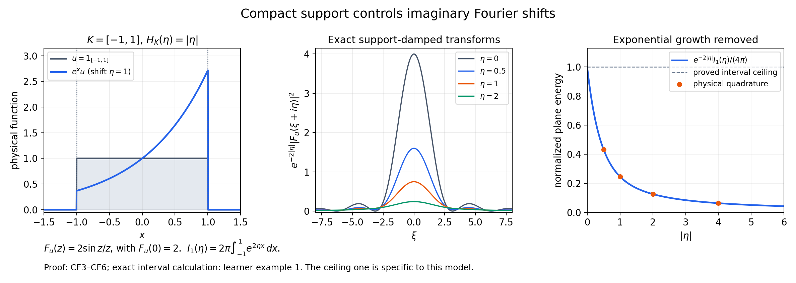
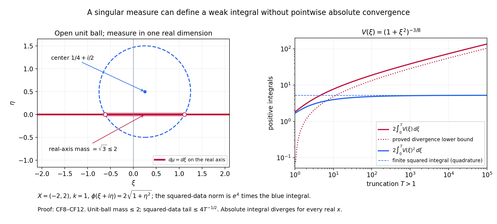

# Working with complex frequencies and weak exponential integrals

*Written and self-checked by GPT-6.1 Sol (OpenAI), Ultra reasoning effort, October 2026. CC0.*

The [formal proof](complex-fourier-estimates-formal.md) distinguishes three operations: moving the Fourier transform to an imaginary plane, multiplying the original distribution by a cutoff, and integrating exponential solutions against a measure. This companion develops four concrete models and ten exercises with complete solutions.

Use \(\widehat u(\xi)=\int e^{-ix\xi}u(x)\,dx\), with inverse factor \((2\pi)^{-1}\) in one dimension. Pairings are complex-linear and bilinear: there is no conjugation in \(\langle v,u\rangle\). A weight \(k\) obeys \(k(\xi+h)\le(1+C|h|)^Nk(\xi)\), and its reflected weight is \(\check k(\xi)=k(-\xi)\).

## Worked example 1. An interval on every imaginary plane

Let \(u=1_{[-a,a]}\), \(a>0\), and \(k=1\). Its support is \(K=[-a,a]\), its squared \(B_{2,1}\) norm is \(2a\), and
\[
F_u(z)=\frac{2\sin(az)}{z},\qquad F_u(0)=2a,\qquad
H_K(\eta)=a|\eta|.
\tag{L148.1}
\]
The removable value at zero follows from the sine power series, or directly by integrating the constant function over the interval.

Multiplication by \(e^{\eta x}\) moves the Fourier transform to \(\xi+i\eta\). The unweighted Plancherel extension proved in CF1 therefore gives the exact plane energy
\[
I_a(\eta)=\int_{\mathbb R}|F_u(\xi+i\eta)|^2\,d\xi
=2\pi\int_{-a}^{a}e^{2\eta x}\,dx
=
\begin{cases}
2\pi\,\sinh(2a\eta)/\eta,&\eta\ne0,\\
4\pi a,&\eta=0.
\end{cases}
\tag{L148.2}
\]
This is even in \(\eta\). The support factor removes its exponential growth:
\[
e^{-2a|\eta|}I_a(\eta)
=\pi\,\frac{1-e^{-4a|\eta|}}{|\eta|}\quad(\eta\ne0),
\qquad
0<e^{-2a|\eta|}I_a(\eta)\le4\pi a.
\tag{L148.3}
\]
The limit at zero is \(4\pi a\). The last inequality also follows without evaluating the integral: \(e^{2\eta x-2a|\eta|}\le1\) for \(x\in[-a,a]\).

For \(a=1\), choose the valid weight exponent \(N=1\), so the complex-volume damping is \((1+\eta^2)^{-3}\). The full integral in CF17 becomes
\[
2\pi\int_0^\infty
\frac{1-e^{-4\eta}}{\eta(1+\eta^2)^3}\,d\eta.
\tag{L148.4}
\]
The quotient tends to four at zero and decays as \(\eta^{-7}\) at infinity. This sharper example does not reduce the exponent required for arbitrary \(k\) and arbitrary compact distributions in CF18.

For independent numerical checks there is a stable formula, with no exponentially large sine evaluation:
\[
e^{-2a|\eta|}|F_u(\xi+i\eta)|^2
=\frac{1+e^{-4a|\eta|}-2e^{-2a|\eta|}\cos(2a\xi)}
{\xi^2+\eta^2}.
\tag{L148.5}
\]
At \((0,0)\) its limiting value is \(4a^2\). When \(\eta=0\) use \(4\sin^2(a\xi)/\xi^2\). Formula L148.5 follows from
\(|\sin(s+it)|^2=\sin^2s+\sinh^2t\), then elementary exponential algebra.

The plane-energy curve is normalized by \(I_1(0)=4\pi\). Its ceiling one is specific to this interval model; CF18 gives the general estimate with the displayed polynomial loss.

## Worked example 2. Two genuinely complex exponential modes

Let \(X=(-2,2)\), \(k=1\), and \(\phi(\xi+i\eta)=2\sqrt{1+\eta^2}\). These satisfy CF27–CF28: every compact \(L\Subset X\) has \(H_L(\eta)\le2|\eta|\), and \(|\nabla\phi|\le2\). Put
\[
\mu=\delta_{1+i}+\delta_{-2-i/2},\qquad
V(1+i)=1,\quad V(-2-i/2)=i/2.
\tag{L148.6}
\]
The atoms are more than two apart, so each open complex unit ball contains at most one. The total variation bound is \(M=1\), and the data norm is the finite number
\[
Q^2=e^{4\sqrt2}+\tfrac14 e^{4\sqrt{5/4}}.
\tag{L148.7}
\]
Here the coefficient \(i/2\) belongs to \(V\); \(\mu\) has two positive unit masses. The represented function is
\[
v(x)=e^{ix-x}+\frac i2 e^{-2ix+x/2}.
\tag{L148.8}
\]
It is smooth, and multiplying by any compact smooth cutoff gives a Schwartz function, so its local \(B_{2,1}\) membership is explicit.

To check the sign, use the shifted triangular test
\[
u(x)=\left(1-\frac{|x-b|}{r}\right)_+,\qquad b=\tfrac14,\quad r=\tfrac12.
\tag{L148.9}
\]
Its support is \([-1/4,3/4]\Subset X\), and \(\|u\|_2^2=2r/3=1/3\). The triangle is the convolution of two interval indicators divided by \(r\), followed by translation. Consequently
\[
F_u(z)=e^{-ibz}\frac{2(1-\cos(rz))}{rz^2},\qquad
F_u(0)=r.
\tag{L148.10}
\]
The formula also follows by integrating the two linear sides of the triangle. Thus
\[
\int v(x)u(x)\,dx
=F_u(-1-i)+\frac i2F_u(2+i/2).
\tag{L148.11}
\]
The shift \(b\ne0\) makes the negative-frequency sign observable. Neither the atoms nor the coefficients are complex-conjugated. There is no inverse-Fourier factor in L148.8: this is an exponential-mode measure, not an unnormalized Fourier density.

## Worked example 3. A nonsymmetric weight reveals the dual

Take \(k(\xi)=(1+\max(\xi,0))^2\). The inequality
\(1+\max(\xi+h,0)\le(1+|h|)(1+\max(\xi,0))\)
shows that \(C=1,N=2\) work. Define tempered distributions by their Fourier functions:
\[
\widehat w(\xi)=1_{\{\xi<-1\}}(1+|\xi|),\qquad
\widehat u(\xi)=1_{\{\xi>1\}}(1+\xi)^{-3}.
\tag{L148.12}
\]
They are tempered because these functions have polynomial growth. On the negative half-line the reciprocal reflected weight is \((1+|\xi|)^{-2}\). Hence
\[
\|w\|_{2,1/\check k}^2
=\frac1{2\pi}\int_1^\infty(1+t)^{-2}\,dt
=\frac1{4\pi}.
\tag{L148.13}
\]
In contrast, \(1/k=1\) on that half-line, and the corresponding norm of \(w\) diverges. The test \(u\) has
\[
\|u\|_{2,k}^2=\frac1{4\pi},\qquad
\mathcal B(w,u)=\frac1{2\pi}\int_1^\infty(1+t)^{-2}\,dt
=\frac1{4\pi}.
\tag{L148.14}
\]
It attains equality in the bilinear norm estimate. These are global weighted distributions used to expose the dual convention; no compact support of either is asserted. The local representation theorem obtains this same reflected weight after multiplication by cutoffs.

## Worked example 4. A weak integral with infinite absolute mass

Keep \(X,k,\phi\) from example 2, but let \(\mu\) be Lebesgue measure on the real axis inside the complex plane, and set
\[
V(\xi)=(1+\xi^2)^{-3/8}.
\tag{L148.15}
\]
An open unit ball centered at \(\alpha+i\beta\) cuts out an interval of length
\(2\sqrt{1-\beta^2}\) when \(|\beta|<1\), and has zero real-axis mass when \(|\beta|\ge1\). Thus \(M=2\) works although this measure has no two-dimensional Lebesgue density.

The reflected data norm is
\[
Q^2=e^4\int_{\mathbb R}(1+\xi^2)^{-3/4}\,d\xi.
\tag{L148.16}
\]
It is finite by the tail estimate in CF45. But the proposed pointwise absolute integral has modulus integrand \(V(\xi)\), independent of \(x\), whose tail decays only as \(|\xi|^{-3/4}\). CF46 proves that its total integral diverges. At \(x=0\) all terms are positive, so there is no cancellation even for a symmetric cutoff.

This does not prevent distributional integration. For a compact smooth \(u\), its transform decays faster than any power on the real line, and \(\int V(\xi)F_u(-\xi)\,d\xi\) converges. CF39–CF43 extend that action to every compact weighted test, not just smooth ones. Globally the inverse transform of \(2\pi V\) is an \(L^2\) distribution; its restriction to \(X\) is exactly this weak representation.

The squared-data plot omits the fixed multiplier \(e^4\). Its finite tails and the divergence lower bound are established analytically in CF45–CF46; the curves visualize those arguments.

## Exercises with complete solutions

**Exercise 1 — entry: the support-function sign.** For \(K=[-3/2,1/2]\), calculate \(H_K(\eta)\) and \(H_K(-\eta)\), and explain why they cannot be interchanged in the cutoff estimate.

**Solution 1.** Maximizing \(x\eta\) gives \(H_K(\eta)=\eta/2\) for \(\eta\ge0\) and \(-3\eta/2\) for \(\eta<0\). Therefore \(H_K(-\eta)=3\eta/2\) for \(\eta\ge0\) and \(-\eta/2\) for \(\eta<0\). The shifted distribution is \(e^{x\eta}u\); recovering \(\psi u\) multiplies it by \(\psi e^{-x\eta}\). The modulus of this multiplier's exponential is controlled by the maximum of \(-x\eta\) on \(K\), hence by \(H_K(-\eta)\). For \(\eta=1\) the two maxima are \(1/2\) and \(3/2\), respectively. The minus sign records the operation being performed.

**Exercise 2 — entry: exact normalizations.** In one dimension take \(k=1\) and \(u=1_{[-1,1]}\). Compute \(\|u\|_{2,k}^2\), \(I_1(0)\), and the ratio between them.

**Solution 2.** CF1 gives the equal physical and weighted squared norm \(\int_{-1}^1 1\,dx=2\). Formula L148.2 at zero gives \(I_1(0)=4\pi\). The ratio is \(2\pi\), exactly the inverse of the factor \((2\pi)^{-1}\) in the squared norm CF4. The undivided real Fourier integral is not itself the squared \(B_{2,1}\) norm.

**Exercise 3 — intermediate: the full imaginary exponent.** Starting from CF18, show why the damper \((1+|\eta|^2)^{-N-2n}\) is integrable after the plane estimate. What goes wrong if it is replaced by \((1+|\eta|^2)^{-N-n}\)?

**Solution 3.** Since \((1+r)^2\le2(1+r^2)\), the squared plane power \((1+r)^{2(N+n)}\) is at most \(2^{N+n}(1+r^2)^{N+n}\). The correct damper leaves \((1+r^2)^{-n}\). In real dimension \(n\), its tail is bounded by \(r^{-2n}\), and the radial volume factor is \(r^{n-1}\), leaving the integrable \(r^{-n-1}\). With the proposed replacement the powers cancel completely, leaving only a constant upper bound. Integrating that bound over \(\mathbb R^n\) gives infinity. This shows the proposed deduction fails; it does not assert that every individual transform has an infinite integral for that weaker damper.

**Exercise 4 — intermediate: a thin support.** Verify CF12–CF13 when \(K=\{0\}\subset\mathbb R^n\). Why is an indicator of \(K\) itself unsuitable?

**Solution 4.** The indicator in CF12 is that of \(B(0,\delta/2)\), not that of \(K\). Convolution with the probability bump of radius \(\delta/4\) is one on \(B(0,\delta/4)\), and its support is contained in \(\overline B(0,3\delta/4)\). Derivatives fall on the bump. Its derivative \(L^1\) norms scale as \((\delta/4)^{-|\alpha|}\), while the indicator has volume \(b_n(\delta/2)^n\). The convolution bound yields the stronger \(O(\delta^{n-|\alpha|})\) estimate, which implies CF13 for \(0<\delta\le1\). An indicator of the point has zero Lebesgue measure, so its convolution would be identically zero and could not equal one near the support.

**Exercise 5 — intermediate: detect the reflected dual by integration.** Verify both finite quantities in L148.14, and show directly that \(w\notin B_{2,1/k}\).

**Solution 5.** On \(\xi>1\), \(k^2|\widehat u|^2=(1+\xi)^4(1+\xi)^{-6}=(1+\xi)^{-2}\). Its integral from one to infinity is \(1/2\), giving \(\|u\|_{2,k}^2=1/(4\pi)\). In the bilinear pairing \(\widehat w(-\xi)\widehat u(\xi)\) is zero unless \(\xi>1\); there it is \((1+\xi)(1+\xi)^{-3}=(1+\xi)^{-2}\), giving the identical result. On \(\xi<-1\), \(1/k(\xi)=1\), so its proposed squared weighted integrand is \((1+|\xi|)^2\), whose integral diverges. The finite norm in L148.13 instead uses \(1/k(-\xi)\).

**Exercise 6 — advanced: a different logarithmic coefficient.** Suppose CF28 has \(A\log(1+|\eta|)\), with \(A\ge0\), in place of its logarithm. Find the polynomial loss in CF33 and decide whether CF39 still follows.

**Solution 6.** The segment argument gives \(e^{-2\phi(z)}\le e^{2C_\phi}(2+|\operatorname{Im}w|)^{2A}e^{-2\phi(w)}\) on a unit ball. Since \(2+r\le2(1+r)\), the loss is \((1+r)^{2A}\), with constant \(2^{2A}e^{2C_\phi}\). The unit-ball variation proof is otherwise identical. Enlarge the support as in CF36. The required supremum becomes \(e^{-2\rho r}(1+r)^{2A}(1+r^2)^{N+2n}\), still finite. Thus the conditional representation remains valid with adjusted constants. The exact source hypothesis has \(A=1\), producing the power two in CF33.

**Exercise 7 — advanced: two kinds of measure.** Show that \(\sum_{(m,l)\in\mathbb Z^2}\delta_{2m+2il}\) obeys the unit-ball bound with \(M=1\). Contrast the proof of CF35 for this measure and for real-axis Lebesgue measure.

**Solution 7.** Distinct atoms have distance at least two. Two points in an open unit ball have distance strictly less than two by the triangle inequality; therefore such a ball contains at most one atom, including when its center is not a lattice point. For the lattice, the left side of CF35 is a nonnegative sum of Lebesgue integrals, so Tonelli interchanges the sum and integral. For real-axis measure it is a nonnegative product integral of one-dimensional measure and two-dimensional Lebesgue measure. In both cases translating the inner Lebesgue variable produces the indicator \(|w-z|<1\), and integrating \(z\) produces exactly \(\nu(B(w,1))\). Neither measure needs a density in the complex plane.

**Exercise 8 — advanced: all weighted tests, not just smooth ones.** Let a compactly supported \(u\in B_{2,k}\) have support inside \(X\). Prove that mollification preserves a common compact support neighborhood and converges in the norm needed for CF31.

**Solution 8.** A compact subset of the open \(X\) has positive distance from its complement. Choose \(\varepsilon_0>0\) so that its closed \(\varepsilon_0\)-neighborhood is compactly contained in \(X\). For a mollifier supported in the unit ball, the support of \(u*\rho_\varepsilon\) is inside the \(\varepsilon\)-neighborhood of that support, hence inside the fixed one when \(\varepsilon\le\varepsilon_0\). Distributional differentiation of the mollifier gives a smooth compact function. Its transform is \(\widehat u(\xi)\widehat\rho(\varepsilon\xi)\). The latter multiplier tends to one and is bounded by \(\|\rho\|_1\), independent of \(\varepsilon\). Dominated convergence against \(|k\widehat u|^2\) proves norm convergence. CF40 controls the difference of the measure integrals using this common neighborhood, while the global reflected dual norm of \(\chi v\) controls the pairings on the left. Thus both sides pass to the original \(u\).

**Exercise 9 — advanced: finite data, divergent values.** For example 4 prove the squared-data tail bound and the divergence lower bound, keeping both half-lines.

**Solution 9.** For \(T\ge1\), \((1+\xi^2)^{-3/4}\le|\xi|^{-3/2}\) on \(|\xi|>T\). The two tails have total integral at most \(2\int_T^\infty t^{-3/2}\,dt=4T^{-1/2}\); the actual data norm multiplies this by \(e^4\). On \([1,T]\), \(1+t^2\le2t^2\) yields \((1+t^2)^{-3/8}\ge2^{-3/8}t^{-3/4}\). Integrating and doubling gives \(8\,2^{-3/8}(T^{1/4}-1)\). The omitted interval \([0,1]\) only increases the positive integral. Hence the squared data converge and the absolute value integral diverges. No oscillatory argument is required.

**Exercise 10 — synthesis: a lattice representation which does converge pointwise.** Use \(X=(-2,2)\), \(\phi(\xi+i\eta)=2\sqrt{1+\eta^2}\), and the lattice measure of exercise 7. Set
\[
V(2m+2il)=\frac{e^{-2\sqrt{1+4l^2}}}{1+4m^2+4l^2}.
\tag{L148.17}
\]
Prove the reflected data condition and absolute, locally uniform convergence of its exponential series in \(X\).

**Solution 10.** The data condition cancels the exponential and becomes \(\sum_{m,l}(1+4m^2+4l^2)^{-2}<\infty\). On the square shell \(\max(|m|,|l|)=j\ge1\) there are exactly \(8j\) lattice points, and each summand is at most \((1+4j^2)^{-2}\le(16j^4)^{-1}\). The shell sum is at most \(\tfrac12j^{-3}\), which is summable; the origin is finite. For a compact set \(|x|\le a<2\), each mode has modulus at most
\[
\frac{e^{-2\sqrt{1+4l^2}-2lx}}{1+4m^2+4l^2}
\le \frac{e^{-(4-2a)|l|}}{1+4m^2}.
\tag{L148.18}
\]
The sum over \(m\) is finite by comparison with \(m^{-2}\), and the sum over \(l\) is a geometric series. The bound is independent of \(x\) in that compact set, so the tails tend uniformly to zero there and the series is absolutely and locally uniformly convergent. Its sum is continuous. Integrating it against a compact smooth test is justified by that uniform absolute bound on the support, and gives CF31. Uniqueness identifies it with the theorem's distribution. This extra decay proves a pointwise representation in this example; CF30 by itself did not prove one in example 4.

## What the computations check

The reproducible calculations evaluate physical integrals independently of the displayed Fourier formulas, verify the shifted triangle's complex signs, compare truncated Fourier-plane integrals with the exact plane energy and a rigorous tail bound, and check the data-tail and divergence inequalities. They also verify the nonsymmetric dual norm and lattice shell count. These checks are supplements to CF1–CF12, not substitutes for the proofs.

The formal companion supplies the exact source-statement map and references. The complete course still has separate mathematical and prerequisite targets beyond this lesson.
