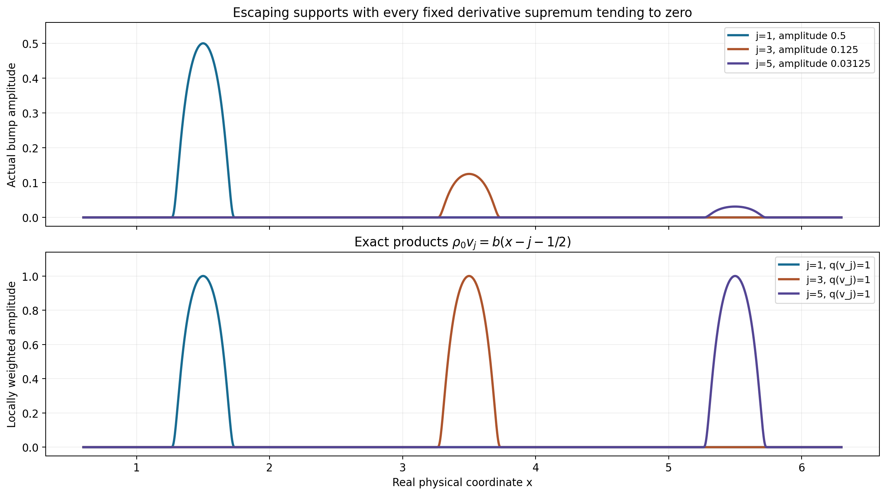
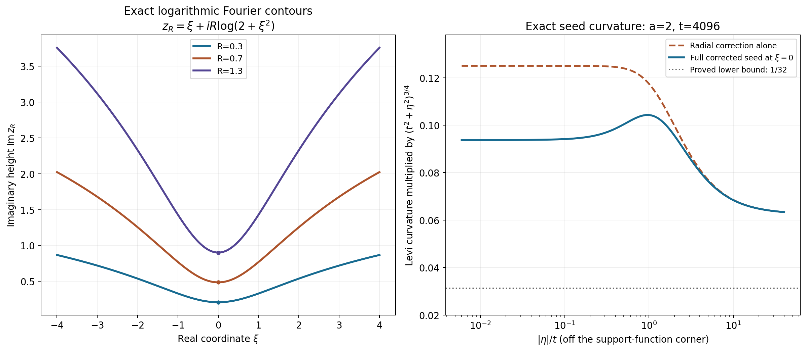

# Learning compact-test neighborhoods through the Fourier transform

The complete lesson proves three descriptions of the same topology. Compact supports let each fixed stage use finitely many derivatives, but the required orders and constants can change along an exhaustion. The Fourier description consequently uses a whole sequence of support functions and decay powers. A carefully stabilized maximum then gives one PSH integral norm whose small ball lies in any prescribed neighborhood.

Read [TP1–TP7, the complete proof](../../AN02-L153.html#complete-proof). The examples below distinguish real-frequency decay, imaginary-frequency support growth, contour geometry and local curvature.

## Worked example 1. Small moving bumps need not be small in the test topology

Let \(X=\mathbb R\), \(K_j=[-j,j]\), and define the compact smooth bump
\[
b(x)=
\begin{cases}
\exp(1-1/(1-16x^2)),&|x|<1/4,\\
0,&|x|\ge1/4.
\end{cases}
\qquad
v_j(x)=2^{-j}b(x-j-\tfrac12).
\tag{L153.1}
\]
The exponential vanishes with all derivatives at the endpoints: each derivative inside is a polynomial in \(1/(1-16x^2)\) and \(x\), times the exponential, and an exponential dominates every such power. Thus \(b\) and \(v_j\) are smooth. Also \(0\le b\le1\), \(b(0)=1\), and
\[
\sup_x|D^Nv_j(x)|=2^{-j}\sup_x|D^Nb(x)|\longrightarrow0
\quad\text{for every fixed }N.
\tag{L153.2}
\]
Their supports lie in \([j+\frac14,j+\frac34]\), so no one compact set contains them.

Choose a smooth \(0\le\chi\le1\), equal to one on \([-1/4,1/4]\), supported in \((-2/5,2/5)\), and put
\[
\rho_0(x)=\sum_{j\ge1}2^j\chi(x-j-\tfrac12),\qquad
q(v)=\sup_x|\rho_0(x)v(x)|.
\tag{L153.3}
\]
The supports in this sum are disjoint and locally finite. Hence \(\rho_0\) is smooth. On every fixed compact support, \(q\) is bounded by a finite constant times the zeroth derivative seminorm; it is a continuous seminorm of the compact-test inductive topology. Yet \(q(v_j)=1\) exactly. Therefore \(v_j\) does not converge to zero in that topology, although every fixed global derivative supremum tends to zero.

This example gives a concrete reason for the varying stage constants. The topology can see amplitudes after they are multiplied by a weight growing along an escaping support.

**Figure TP-A.** The top profiles are the exact \(v_j\) for three specified translated supports; the lower profiles are their exact weighted products \(\rho_0v_j=b(x-j-\frac12)\). Their amplitudes shrink above but remain one below. The visible finite selections do not replace the locally finite infinite coefficient function in L153.3.

## Worked example 2. A logarithmic contour has its own Jacobian

For the same bump let \(F_b(z)=\int_{-1/4}^{1/4}b(s)e^{-isz}\,ds\). In one dimension, with \(\eta=1\), the contour is
\[
z_R(\xi)=\xi+iR\log(2+\xi^2),\qquad
J_R(\xi)=1+i\frac{2R\xi}{2+\xi^2}.
\tag{L153.4}
\]
Its imaginary height at zero is \(R\log2>0\) for \(R>0\). The Jacobian is not the arc-length element: the Fourier contour uses the complex differential \(dz=J_Rd\xi\).

For every real \(x\) and fixed \(R\), the proved homotopy gives
\[
b(x)=\frac1{2\pi}\int_{\mathbb R}
     F_b(z_R(\xi))e^{ixz_R(\xi)}J_R(\xi)\,d\xi.
\tag{L153.5}
\]
At \(x=2\), the true value is zero. The entire support-growth factor in the integrand obeys
\[
e^{H_{[-1/4,1/4]}(\operatorname{Im}z_R)
           -2\operatorname{Im}z_R}
=(2+\xi^2)^{-7R/4}.
\tag{L153.6}
\]
This decays as the contour moves upward. At an interior point such as \(x=0\), that same factor can grow; TP11's arbitrary polynomial decay still makes the contour identity valid. Thus the contour is used with the direction supplied by an exterior separation gap, rather than one imaginary direction assumed to help everywhere.

The determinant bound is exact here:
\(|J_R|=\sqrt{1+[2R\xi/(2+\xi^2)]^2}\le\sqrt{1+R^2/2}\).
The last inequality follows because \(2|\xi|/(2+\xi^2)\) is maximal at \(|\xi|=\sqrt2\), where it equals \(1/\sqrt2\).

## Worked example 3. Correcting a negative logarithmic seed

Take one complex dimension, \(K=[-1,1]\), \(a=2\), \(t=4096\), and write \(z=\xi+i\eta\). The seed is
\[
\psi(z)=|\eta|-2\log(t^2+\xi^2+\eta^2)+p_t(\eta),\qquad
p_t(\eta)=\frac{\sqrt{t^2+\eta^2}}{\sqrt t}
                   -(t^2+\eta^2)^{1/4}.
\tag{L153.7}
\]
The support term \(|\eta|\) has a positive distributional Hessian at \(\eta=0\), but away from that line its classical Hessian is zero. Without \(p_t\), the negative logarithm has negative Levi curvature and would not be PSH.

Let \(s=t^2+\eta^2\) and \(q=t^2/s\). At \(\xi=0,\eta\ne0\), direct differentiation gives
\[
s^{3/4}\partial_z\bar\partial_z\psi(i\eta)
=\frac14(q^{3/4}+\tfrac14-\tfrac34q)
                     -\frac a{\sqrt t}q^{5/4}
\ge\frac1{32}.
\tag{L153.8}
\]
Here \(\sqrt t=64=32a\). The radial correction's normalized real Hessian is at least \(1/4\); division by four gives \(1/16\), and the negative term has magnitude at most \(a/\sqrt t=1/32\). At other real frequencies the logarithmic negative term is smaller, so the same lower bound holds. At \(\eta=0\), the additional positive measure from \(|\eta|\) is kept in the distributional interpretation.

The gradient bound is also quantitative:
\[
|\nabla\psi|\le1+a/t+t^{-1/2}
  =1+\tfrac1{2048}+\tfrac1{64}<\log4096 .
\tag{L153.9}
\]
Therefore on \(|\eta|>t\) it is at most \(\log(1+|\eta|)\). The positive curvature has scale \(s^{-3/4}\); a summary replacing this by \((1+\eta^2)^{-3/2}\) would describe a weaker, incorrect source target.

**Figure TP-B.** The left curves are the complete complex contours L153.4 with their positive height at \(\xi=0\). The right curves show the exact classical Levi form in L153.8, normalized by \(s^{-3/4}\), and the radial correction before subtracting the logarithm. The lower bound is \(1/32\). The \(|\eta|\) support term contributes an additional positive measure at zero; the plot describes its classical part off that line.

## Worked example 4. An explicit weighted smooth-test neighborhood

Let \(X=(-1/2,1/2)\) and choose
\[
\phi(\xi+i\eta)=p_1(\eta)
=\sqrt{1+\eta^2}-(1+\eta^2)^{1/4}.
\tag{L153.10}
\]
It is independent of \(\xi\), has gradient bounded by one, and has Levi form at least
\(\frac1{16}(1+\eta^2)^{-3/4}\).
For \(M=\sqrt{1+\eta^2}\), the square inequality
\((\sqrt M-2)^2\ge0\) gives \(\sqrt M\le M/4+1\). Hence
\[
\phi\ge\tfrac34M-1\ge\tfrac34|\eta|-1.
\tag{L153.11}
\]
Any compact \(K\Subset X\) has \(H_K(\eta)\le a_K|\eta|\) for some \(a_K<1/2\). Thus \(e^{-\phi}\le e\,e^{-H_K(\eta)}\), proving the support-growth condition with \(N_K=0\). All three properties of TP25 hold.

For the bump \(b\) of Example 1, supported in \([-1/4,1/4]\), real-plane Plancherel at each fixed \(\eta\) yields
\[
P_\phi(b)^2
=2\pi\int_{\mathbb R}e^{-2p_1(\eta)}
       \int_{-1/4}^{1/4}|b(x)|^2e^{2x\eta}\,dx\,d\eta
\le4\pi e^2\|b\|_{L^2}^2 .
\tag{L153.12}
\]
Indeed the inner integral is at most \(e^{|\eta|/2}\|b\|_2^2\), and L153.11 bounds the outer factor by \(e^2e^{-3|\eta|/2}\), leaving \(e^2e^{-|\eta|}\). Its integral is \(2e^2\).
Consequently any \(|\epsilon|<[2\sqrt\pi e\|b\|_2]^{-1}\) gives \(P_\phi(\epsilon b)<1\).

The same norm is finite and continuous on every compact smooth-support stage in \(X\), by TP11 and TP25. Its unit ball is therefore a genuine zero-neighborhood in the test topology. This one explicit neighborhood does not claim that one fixed norm generates all the inductive topology; TP5 constructs a suitable weight for each prescribed convex neighborhood.

## Exercises with complete solutions

**Exercise 1.** Verify the infinite multiindex sum used to turn exterior derivative bounds into a strict coefficient-seminorm bound.

**Solution 1.** For \(n\) coordinates,
\[
\sum_{\alpha\in\mathbb N^n}2^{-n-1-|\alpha|}
=2^{-n-1}\prod_{l=1}^n\sum_{r=0}^\infty2^{-r}
=2^{-n-1}2^n=\tfrac12.
\tag{L153.13}
\]
The sums are nonnegative, so successive products and summation are valid. This strict factor \(1/2\) ensures a bound below one even when the exterior restrictions themselves use \(\le\).

**Exercise 2.** Why are the coefficients in TP7 majorized by smooth functions instead of being defined directly from \(|D^\beta\psi_j|\)?

**Solution 2.** A smooth real function can cross zero with nonzero derivative, in which case its absolute value is not differentiable. The theorem explicitly requires smooth coefficient functions. For each compact derivative support, take a nonnegative smooth cutoff equal to one there and multiply it by the finite derivative supremum. This dominates the absolute derivative while remaining smooth. Enlarging only within annular neighborhoods that avoid successively larger \(K_j\)'s preserves local finiteness. The product-rule bound TP8 then holds with the stated smooth coefficients.

**Exercise 3.** Prove the rank-one determinant formula for \(I+uv^{\mathsf T}\), and apply it to L153.4.

**Solution 3.** Expand the determinant column by column. The term using only the identity columns is one. Every term using two added columns vanishes because those columns are multiples of \(u\). The term using only added column \(j\) is \(u_jv_j\). Therefore
\(\det(I+uv^{\mathsf T})=1+\sum_ju_jv_j\).
With \(u=iR\eta\) and \(v=\nabla\ell\) it gives TP13. For \(n=1,\eta=1\), \(\ell'=2\xi/(2+\xi^2)\), giving the exact complex differential L153.4.

**Exercise 4.** For \(K_{j-1}=[-(j-1),j-1]\) and \(K_j=[-j,j]\), compute the exterior separation and the later-term support gap.

**Solution 4.** For \(x>j\) choose \(\eta=1\), and for \(x<-j\) choose \(\eta=-1\). In both cases
\(x\eta-H_{K_{j-1}}(\eta)=|x|-(j-1)>1\).
The uniform permissible gap is \(c_j=1\). For \(k\ge j\),
\(H_{K_k}(\eta)-H_{K_{j-1}}(\eta)-c_j=k-(j-1)-1=k-j\).
Thus \(b_{jk}=k-j\), and a sufficient tail decay power is
\[
M_k\ge L_j+2R_j(k-j)+n+1.
\tag{L153.14}
\]
The exponent changes with the later carrier; holding it fixed independently of \(k\) would not control that tail.

**Exercise 5.** Justify the vanished boundary flux in TP14 for the bump at a fixed \(x,R\).

**Solution 5.** On a real cube boundary \(|\xi|\ge A\), TP11 supplies every integer decay power \(L\). The polynomial \(z^\alpha\) costs at most \(|\alpha|\) powers, the logarithmic imaginary displacement costs at most \(2R(r_S+|x|)\) powers, the face volume costs \(n-1\), and the flux has one logarithm. Choosing \(L>|\alpha|+2R(r_S+|x|)+n+2\) leaves a negative power which tends to zero even after multiplication by that logarithm. The bound is uniform in the homotopy parameter \(s\in[0,1]\), so integration in \(s\) does not change the conclusion. This proves the identity without replacing the contour Jacobian by one.

**Exercise 6.** Explain how the diagonal envelope choices avoid circularity, and why its infinite sum can be made finite everywhere.

**Solution 6.** At step \(k\), the earlier coefficients and powers are already fixed. They determine the finite early contribution used to choose \(R_k\). Then choose \(M_k\) to satisfy the finitely many power requirements for every exterior index \(j\le k\), and finally choose \(d_k>0\) below the finitely many corresponding coefficient thresholds. Increasing \(M_k\) helps all earlier inequalities. Add
\(d_k\le2^{-k}e^{-k(1+r_{K_k})}\).
On any fixed imaginary strip \(|\eta|\le A\), all \(k\ge A\) terms are bounded by \(2^{-k}e^{-k}\), uniformly in real frequency. The early terms are finite in number. Thus the envelope converges uniformly on that strip and is finite everywhere. No yet-unchosen tail coefficient is used to choose an earlier contour.

**Exercise 7.** Differentiate the radial correction and recover its exact \(-3/4\) lower curvature scale.

**Solution 7.** Write \(p_t=g(s)\), \(s=t^2+|\eta|^2\), \(g(s)=t^{-1/2}s^{1/2}-s^{1/4}\). Its real transverse eigenvalue is \(2g'\), and its real radial eigenvalue is \(2g'+4|\eta|^2g''\). Direct differentiation gives normalized values
\(t^{-1/2}s^{1/4}-1/2\ge1/2\) and
\(q^{3/4}+1/4-3q/4\ge1/4\), respectively, where \(q=t^2/s\).
Because a function independent of \(\xi\) has complex Hessian one quarter of its real \(\eta\)-Hessian, its Levi form is at least
\(\frac1{16}s^{-3/4}|w|^2\). The power is \(-3/4\) of \(t^2+|\eta|^2\), equivalently \(-3/2\) of its square root; those two variables must not be conflated.

**Exercise 8.** Show why whole-strip stabilization of \(\psi_j-G_j\) is possible even at arbitrarily large real frequency.

**Solution 8.** The powers \(a_j\) and parameters \(t_j\) are nondecreasing and \(t_j\ge1\). Therefore
\[
-a_j\log(t_j^2+|z|^2)
+a_1\log(t_1^2+|z|^2)\le0.
\tag{L153.15}
\]
On \(|\eta|\le B_j\) the support-function differences and radial-correction differences are bounded independently of \(\xi\). Their sum therefore bounds \(\psi_j-\psi_1\) uniformly over the whole strip. A finite \(G_j\) makes the new branch smaller than the first branch there. If the logarithmic powers were allowed to decrease, their difference could instead tend to \(+\infty\) with \(|\xi|\), which no finite vertical shift could fix.

**Exercise 9.** Derive the one extra polynomial power used in TP33 from the gradient and ball mean estimate.

**Solution 9.** Along a unit segment, the gradient bound gives
\(\phi(z+w)-\phi(z)\le C_b+\log(2+|\eta|)\).
The unit-ball mean for \(|F|^2\), followed by the weighted integral and a square root, consequently gives
\[
|F(z)|\le(n!/\pi^n)^{1/2}
 e^{\phi(z)+C_b}(2+|\eta|)P_\phi(v).
\tag{L153.16}
\]
Since \(2+|\eta|\le2+|z|\), one additional negative power in each seed absorbs it. The constant \(e^{C_b}\) is absorbed by the vertical shift. It is not a polynomial factor of degree \(C_b\).

**Exercise 10.** Verify that the explicit weight in Example 4 works for a non-centered compact interval \(K=[a,b]\Subset(-1/2,1/2)\).

**Solution 10.** Its support function is \(b\eta\) for \(\eta\ge0\), and \(a\eta\) for \(\eta<0\). In either case it is at most \(r_K|\eta|\), where \(r_K=\max(|a|,|b|)<1/2\). L153.11 therefore gives
\(\phi-H_K\ge(3/4-r_K)|\eta|-1\ge-1\).
Thus \(e^{-\phi}\le e\,e^{-H_K}\) with no polynomial factor, while the gradient and strict curvature are unchanged. On a fixed smooth support the exact complex decay TP11 makes the entire weighted integral finite and bounds it by finitely many derivative suprema. This verifies the correct topology on each stage without requiring the interval to be symmetric.

The numerical checks evaluate actual compact-bump Fourier integrals, complex-contour Jacobians and homotopy derivatives, the radial correction's real and complex Hessians, and the explicit weighted integral. They supplement the full arguments; formal target completion does not complete the chapter's separate embedded exercises or the rest of the assigned course.
