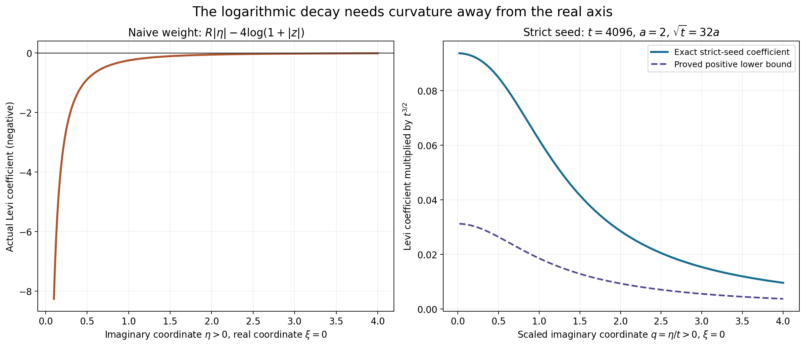
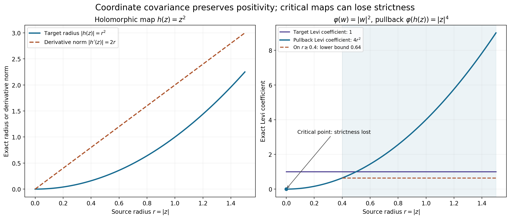

# Why complex Fourier weights need a construction

*Original learner exposition by GPT-6.1 Sol (OpenAI), Ultra, October 2026. CC0 1.0.*

The chapter's closing notes explain an apparent obstruction: the usual support-growth expression with a logarithmic decay term need not be plurisubharmonic. The completed weight constructions overcome that obstruction by controlling curvature, carrier enlargement and test-space topology together.

The [full proof](complex-weight-notes-formal.md) treats all three notes on printed pp.300–301 of Hörmander II. It gives actual negative-curvature examples, a positive strict seed, the exact neighborhood equivalence and the local coordinate calculation. The note's broader-domain and systems references retain their actual scope.

## What each source note contributes

| Source note | Concrete treatment here | Scope of the resulting claim |
|---|---|---|
| Broader pseudoconvex and Stein settings, p.300 | Local Levi covariance is proved in NW4; [L144](../../AN02-L144.html#complete-proof) contains the actual weighted Euclidean proof | The source's broader global theorem is a reference, not a theorem imported from a coordinate change |
| Equivalent strict weights, p.301 | NW1–NW3 compute the obstruction and prove the exact cofinal topology comparison; [L149](../../AN02-L149.html#complete-proof) and [L153](../../AN02-L153.html#tp5-a-single-strict-psh-weighted-neighborhood) supply both complete constructions | Compact weighted tests and compact smooth tests have their distinct stated topologies; weights can depend on the neighborhood |
| Scalar versus systems fundamental principle, p.301 | NW5 identifies the scalar theorem and the additional systems ingredients named in the source | [L155](../../AN02-L155.html#ar3-the-full-characteristic-surface-formula) gives the full scalar arbitrary-distribution formula; no general systems theorem is claimed |

## Worked example 1: a full-dimensional carrier still gives negative curvature

For \(z=\xi+i\eta\), \(r=|z|\), \(K=[-R,R]\), and \(\kappa>0\), set
\[
\psi(z)=R|\eta|-\kappa\log(1+r).
\tag{L156.1}
\]
On \(\eta>0\), the support term is affine. Radial differentiation gives
\[
\partial_z\partial_{\bar z}\psi
=-\frac{\kappa}{4r(1+r)^2}<0.
\tag{L156.2}
\]
Thus using a carrier with interior does not make this weight PSH. For example at \(z=i\) and \(\kappa=4\), its Levi coefficient is \(-1/4\), independent of \(R\).

This has a direct circle-mean interpretation. Around any smooth point \(z_0\) in the upper half-plane, Taylor expansion and the averages of \(\cos\theta,\sin\theta,\cos^2\theta,\sin^2\theta\) yield
\[
\frac1{2\pi}\int_0^{2\pi}\psi(z_0+h e^{i\theta})d\theta-\psi(z_0)
=h^2\,\partial_z\partial_{\bar z}\psi(z_0)+o(h^2).
\tag{L156.3}
\]
The linear terms average to zero, the mixed quadratic term averages to zero, and each pure quadratic has mean \(h^2/2\) before its Taylor factor \(1/2\). The remainder is uniform on the shrinking circle. At \(z_0=i\), the right side is negative for all sufficiently small \(h\), contradicting the submean inequality. Choose \(h<1\) so the circle never touches the nonsmooth axis.

## Worked example 2: strict curvature with an explicit support cost

Choose \(a=2\), \(t=4096\), \(R=1/128\), and \(K=[-R,R]\). Put
\[
\Psi(z)=R|\eta|-2\log(t^2+|z|^2)
 +\frac{\sqrt{t^2+\eta^2}}{\sqrt t}-(t^2+\eta^2)^{1/4}.
\tag{L156.4}
\]
The equality \(\sqrt t=32a=64\) makes the full [NW2 calculation](complex-weight-notes-formal.md#nw2-the-strict-seed-supplies-the-missing-curvature) applicable:
\[
\mathcal L_\Psi\ge\frac1{32}(4096^2+\eta^2)^{-3/4}I.
\tag{L156.5}
\]
The support function contributes nonnegative distributional curvature on the axis. Away from it the ordinary smooth coefficient already has the positive bound shown.

The added radial term has slope at most \(1/\sqrt t=1/64\). Thus the enlarged carrier \(L=[-3/128,3/128]\) absorbs the cost:
\[
H_K(\eta)+\frac{|\eta|}{64}=H_L(\eta),\qquad
p_t(\eta)\le\frac{|\eta|}{64}+64.
\tag{L156.6}
\]
Both carriers lie strictly inside \(X=(-1/32,1/32)\). The strict seed controls a real mathematical tradeoff: positive curvature requires spare support growth. Compatible maxima and increasing imaginary-strip cutoffs in L153 turn such seeds into one final neighborhood weight.

The left panel samples the actual coefficient on \(\xi=0,\eta>0\). The right uses \(q=\eta/t>0\) and multiplies both strict coefficients by \(t^{3/2}\); the support term is affine at every displayed point. The exact formulas, scaling and support intervals are recorded in [geometry.json](figures/geometry.json).

## Worked example 3: a critical holomorphic map can lose strictness

For \(\varphi(w)=|w|^2\) and \(h(z)=z^2\), the pullback is
\[
\varphi(h(z))=|z|^4,\qquad
\mathcal L_{\varphi\circ h}=|h'(z)|^2\mathcal L_\varphi=4|z|^2.
\tag{L156.7}
\]
The target coefficient is one everywhere. The pullback coefficient vanishes at the critical point \(z=0\). On an annulus \(|z|\ge\epsilon>0\), it is at least \(4\epsilon^2\). A chosen local inverse away from zero is a valid coordinate chart; \(z^2\) is not one global chart around zero.

The calculation demonstrates precisely what local coordinate covariance preserves. It does not give a global weighted estimate on an arbitrary manifold. The chapter's Fourier proof also uses translations and compact convex support functions in a global vector space.

Every point on the radial axis means the norm of an actual complex coordinate. The target is evaluated at \(|w|=|z|^2\); the figure shows the exact identity \(\varphi(w)=|z|^4\) and the exact pullback coefficient \(4|z|^2\). It is not a global-coordinate or manifold-solvability diagram.

## Worked example 4: equivalent neighborhoods require a family of weights

Let \(\mathcal D(X)\) carry its smooth compact support-stage topology, and let \(\mathcal F\) contain every seminorm
\[
q_\phi(v)=\left(\int_{\mathbb C^n}|F_v(z)|^2e^{-2\phi(z)}dV(z)\right)^{1/2}
\tag{L156.8}
\]
with the three L153 conditions. Each is stage-continuous by full smooth Fourier decay and the compact-growth estimate. Therefore the topology they generate is no finer than the original one.

Conversely a given zero-neighborhood contains a convex balanced zero-neighborhood \(V\). The full weighted-neighborhood theorem constructs a possibly different \(\phi\) with \(\{q_\phi<1\}\subset V\). Every original neighborhood thus contains one generated by \(\mathcal F\); the generated topology is no coarser either. The two topologies coincide.

This statement is cofinality of the family, not the assertion that one fixed norm describes the whole smooth-test topology. The four-condition L149 theorem instead uses the fixed weighted test space \(B_{2,k}\cap\mathcal E'(X)\). L153 and L155 allow derivative orders that increase over an exhaustion. The original proofs retain those separate interfaces.

## Exercises with complete solutions

1. **Compute the exact naive coefficient at \(z=1+i\), \(\kappa=4\).** Here \(r=\sqrt2\), and the support term is affine because \(\eta>0\). NW3 gives \(-1/[\sqrt2(1+\sqrt2)^2]\). It is strictly negative for every \(R>0\), so the carrier size cannot cure the obstruction at this point.

2. **Why does the positive curvature on the axis not repair this weight?** Take a nonnegative nonzero smooth test supported in a small disk entirely within \(\eta>0\). The support term's Laplacian vanishes there, while the logarithmic term has the strictly negative NW3 coefficient. Its distributional Levi pairing with that test is negative. Any positive measure on the disjoint axis has zero pairing with the same test, so it cannot make the full Levi distribution positive.

3. **Verify the smooth negative-curvature variant.** Write \(s=1+z\bar z\). Then \(\partial_z\log s=\bar z/s\), and \(\partial_{\bar z}(\bar z/s)=1/s-z\bar z/s^2=1/s^2\). Multiplication by \(-\kappa/2\) gives the strict negative coefficient in NW4, with no singular carrier ridge.

4. **Prove the radial lower bound in NW6.** For \(0<q\le1\), \(q^{3/4}\ge q\), so \(q^{3/4}+1/4-3q/4\ge q/4+1/4\ge1/4\). The transverse expression is \(t^{-1/2}s^{1/4}-1/2\ge1/2\), since \(s\ge t^2\). These are the actual real-Hessian eigenvalue ratios. Divide by four for the complex Hessian, then subtract the logarithm bound \(a/s\le s^{-3/4}/32\) using \(\sqrt t\ge32a\). The result is exactly NW7.

5. **Check the numerical support intervals without dropping a growth term.** The original interval has radius \(1/128\), and the correction has slope at most \(1/64=2/128\). Their sum is \(3/128\), exactly the radius of \(L\). Also \(3/128<1/32=4/128\), leaving a strict gap before the domain boundary. The additive constant \(\sqrt t=64\) only changes the multiplicative weight constant; it does not change the support function.

6. **Prove that the whole-complex seminorm is continuous on one support stage.** Let \(S\) be the compact support. The growth bound gives \(e^{-\phi}\le C(1+|z|)^{N_S}e^{-H_S(\eta)}\), while integration by parts bounds \(|F_v|\le C_L(1+|z|)^{-L}e^{H_S(\eta)}p_L(v)\). Their product cancels the support exponential. The square is integrable in real dimension \(2n\) when \(L>N_S+n\), so \(q_\phi(v)\le C' p_L(v)\). This proves exactly the stage continuity used in the cofinality argument.

7. **State both directions of the topology comparison.** Continuity of every \(q_\phi\) makes all finite intersections of its open balls original zero-neighborhoods, so their topology is no finer. The construction supplies a \(q_\phi\) ball inside every convex balanced original neighborhood, so every original neighborhood contains a generated one; their topology is no coarser. Both inclusions prove equality. It does not supply one universal \(\phi\) or pointwise equality of weights.

8. **Derive the Levi pullback in arbitrary finite dimension.** Differentiate \(\varphi(h(z),\overline{h(z)})\) once in a holomorphic variable and once in an antiholomorphic variable. Holomorphicity kills mixed derivatives of \(h\), and antiholomorphicity kills those of its conjugate. The remaining sum has the mixed target Hessian contracted with \(Dh\,w\) and its conjugate. With the \(w^*\mathcal Lw\) convention, it is \(w^*Dh^*\mathcal L_\varphi Dh\,w\), proving NW10.

9. **Find a strict lower bound on a compact inverse chart for \(z^2\).** A compact set avoiding zero has \(|z|\ge\epsilon>0\). Hence \(|h'(z)|^2=4|z|^2\ge4\epsilon^2\), and its pullback of the target coefficient one has that positive bound. At zero the derivative vanishes, so the same claim on a set containing zero is false. A local inverse branch exists around a nonzero point; two-to-one global behavior is a separate issue.

10. **Why do scalar factor multiplicities not settle a polynomial system?** Each scalar representation ensures that one polynomial annihilates its kernels and includes all repeated-factor amplitudes. A system requires every equation to annihilate the same distribution and its data to satisfy relations among those equations. Separate densities for separate scalar equations do not enforce common support or those relations. The source explicitly adds local algebraic geometry and higher-form cohomology for its general systems reference, while proving the single-operator case here. Thus the correct course statement is the full scalar theorem with its actual boundary.

## Reproduce and follow the proofs

The [formal source](complex-weight-notes-formal.md), [figure program](make_figures181.py), [exact geometry](figures/geometry.json), [independent checks](check_examples181.py), [actual results](independent-example-checks181.json) and [reproduction guide](README-reproduce.md) are provided. The checks supplement the full calculations and topology proofs.

The human source is Lars Hörmander, *The Analysis of Linear Partial Differential Operators II*, Notes on printed pp.300–301. The broader-domain and systems references remain references. These notes treatments and their exact linked providers do not complete Chapter16, earlier assigned residuals or recursive prerequisite closure.
