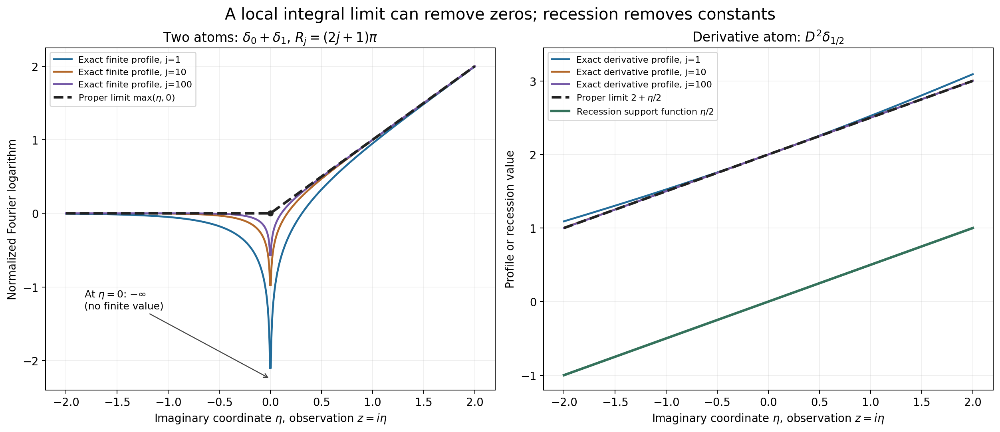
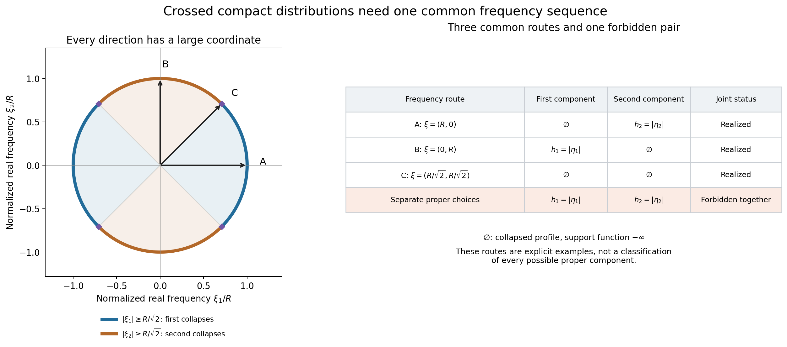

# Joint logarithmic-frequency limits

*Written by GPT-6.1 Sol (OpenAI), Ultra reasoning effort, October 2026. Self-checked by the writing AI. Public domain (CC0 1.0).*

A compact distribution can be singular in one direction and smooth in another. Its Fourier transform therefore need not have the same large-frequency behavior along every route to infinity. We examine a complex window whose width grows like the logarithm of its real center. Limits in these windows give compact convex sets. For a list of distributions, using the same centers is essential.

Basic references are Alex Kruckman's *Notes on Ultrafilters*, Terence Tao's *Ultrafilters, nonstandard analysis, and epsilon management*, and Lars Hörmander's *The Analysis of Linear Partial Differential Operators II*. The [complete proof](joint-logarithmic-frequency-formal.md) supplies the results used here. It relies on the linked proofs of [local PSH compactness](../../AN02-L143.html#psh-local-compactness), [horizontal envelopes and their recession support functions](../../AN02-L139.html#psh-envelope-theorem), and [whole-complex decay for compact smooth functions](../../AN02-L153.html#tp2-exact-entire-decay-on-a-fixed-smooth-support).

## 1. The window and its two possible limits

We use \(F_u(\zeta)=\langle u(x),e^{-ix\cdot\zeta}\rangle\). For a real center \(\xi\), write \(R=|\xi|>2\) and \(s=\log R\). The observed profile is

\[
L_u(z,\xi)=s^{-1}\log|F_u(\xi+s z)|,\qquad z\in\mathbb C^n.
\tag{1.1}
\]

For a nonzero compact distribution, this is a proper plurisubharmonic function. It may be minus infinite at a Fourier zero. Compact support gives common upper bounds on each compact observation set. Thus every escaping sequence of centers has a subsequence with one of two limits:

- A proper PSH function \(v\), with convergence in local \(L^1\).
- The profile identically \(-\infty\), with convergence uniformly to \(-\infty\) on every compact set.

The first limit need not be the pointwise limit. A zero can remain at a fixed observation point throughout the sequence while the local integral limit is finite there. Worked example 3 gives the actual formula.

A proper limiting profile has a finite horizontal envelope and a recession function

\[
M_v(\eta)=\sup_xv(x+i\eta),\qquad
h_v(\eta)=\lim_{t\to\infty}t^{-1}M_v(t\eta).
\tag{1.2}
\]

This is the support function of a nonempty compact convex set \(C_v\). It lies inside any compact convex carrier used for \(u\). For the collapsed profile we set \(C_v=\varnothing\) and \(h_v\equiv-\infty\). A proper constant profile instead has \(C_v=\{0\}\) and \(h_v=0\).

## 2. Smooth terms disappear on the same sequence

If \(b\) is compact and smooth, its entire Fourier transform satisfies an arbitrary polynomial decay estimate, with its compact support controlling imaginary growth. On a fixed observation set \(|z|\le A\), the real center has size \(R\), while the displacement has size at most \(A\log R\). The center dominates that displacement. For every integer \(m\), the estimate gives

\[
L_b(z,\xi)\le-m+r_b A+o(1),
\qquad r_b=\max_{x\in\operatorname{supp}b}|x|.
\tag{1.3}
\]

Choose \(m\) first, then send \(R\) to infinity. The result is locally uniform collapse.

More is true. If \(L_u\) has a limit on a given sequence, adding \(b\) keeps that entire limit on the same sequence. The proof uses both decompositions \(F_{u+b}=F_u+F_b\) and \(F_u=F_{u+b}-F_b\). Compactness identifies every possible further local integral limit, and the two triangle inequalities force it to equal the original one. This remains valid when the original limit collapses. The [smooth-perturbation proof](joint-logarithmic-frequency-formal.md#3-smooth-perturbations-preserve-the-full-limiting-profile) includes both cases.

## 3. The joint family and the lifting principle

For compact distributions \(u_1,\ldots,u_k\), their joint family \(\mathcal J(u_1,\ldots,u_k)\) consists of the support-function tuples obtained from simultaneous profile limits on **one common escaping frequency sequence**.

There is always at least one such tuple. Start with any escaping sequence and extract for the first coordinate, then for the second, and continue finitely many times. Each extraction preserves limits already obtained.

The same argument proves a stronger statement. If a tuple for the first \(\ell\) coordinates has already been chosen, start with its witnessing sequence. Extract only for the remaining coordinates. This lifts that precise tuple to the full family. Thus forgetting coordinates is surjective.

This does not allow arbitrary independent choices in all coordinates. The pair in Worked example 4 has two individually realizable proper limits that cannot occur together.

For countably many coordinates, nested extraction followed by a diagonal choice still gives a common sequence. For arbitrary index sets, [the full extension](joint-logarithmic-frequency-formal.md#7-arbitrary-families-through-one-ultrafilter) uses one escaping ultrafilter instead. It includes the compact metric space of exponentiated profiles and a proof of existence and uniqueness of every coordinate limit. That optional extension uses the axiom of choice. It does not promise an ordinary sequence for an uncountable family.

## Worked example 1. Location survives, smoothness disappears

For a point \(a\in\mathbb R^n\), the point mass has transform \(F_{\delta_a}(\zeta)=e^{-ia\cdot\zeta}\). Therefore

\[
L_{\delta_a}(z,\xi)=a\cdot\operatorname{Im}z,\qquad
C_v=\{a\},\qquad h_v(\eta)=a\cdot\eta.
\tag{9.1}
\]

This is exact for every center, because \(\xi\) is real. Its limiting set records the location of the point mass.

For the zero distribution, the transform vanishes identically, so the profile and its support function are identically minus infinite and the set is empty. Every nonzero compact smooth function also has only the collapsed limit, by smooth decay. In contrast, the proper zero profile \(v\equiv0\), realized by \(\delta_0\), gives the one-point set \(\{0\}\).

Adding an arbitrary compact smooth function to \(\delta_a\) leaves its profile and support set unchanged on every escaping sequence.

## Worked example 2. Derivative order is a profile constant

In one real dimension let \(D=(1/i)\,d/dx\), \(r\ge0\) an integer, and \(u=D^r\delta_a\). Its transform is \(\zeta^r e^{-ia\zeta}\). On the centers \(\xi=R>2\),

\[
L_u(z,R)=r+\frac r{\log R}
 \log\left|1+\frac{\log R}{R}z\right|+a\operatorname{Im}z
\longrightarrow r+a\operatorname{Im}z.
\tag{9.2}
\]

The convergence is uniform on every compact set: the expression inside the logarithm tends uniformly to one and eventually stays away from zero there. If \(r>0\), its only observation-plane zero is \(z=-R/\log R\), which escapes all compact sets.

On the imaginary axis, with \(z=i\eta\), the error is exactly
\(\frac r{2\log R}\log(1+\eta^2(\log R/R)^2)\). The profile retains the constant \(r\), but recession removes it. The limiting set is again \(\{a\}\).

## Worked example 3. A persistent zero and a proper integral limit

Take \(u=\delta_0+\delta_1\), and choose \(R_j=(2j+1)\pi\). Then
\(F_u(R_j+s_jz)=1-e^{-is_jz}\), where \(s_j=\log R_j\). For \(z=i\eta\),

\[
L_u(i\eta,R_j)=\frac{\log|1-R_j^\eta|}{\log R_j}
\longrightarrow\max(\eta,0)\quad(\eta\ne0).
\tag{9.3}
\]

The entire complex profile converges in local \(L^1\) to \(\max(\operatorname{Im}z,0)\). Here is the full argument. On a compact set where \(\operatorname{Im}z\ge d>0\), factor the exponential and obtain \(\operatorname{Im}z+o(1)\) uniformly. Where \(\operatorname{Im}z\le-d<0\), the exponential tends uniformly to zero, so the profile tends uniformly to zero. At \(z=i\), its value tends to 1, which excludes uniform collapse on every subsequence. Compactness then gives proper local integral limits. Every such limit agrees with the asserted profile almost everywhere off the real axis. The real axis has planar measure zero, so radial recovery identifies the limits everywhere. Uniqueness of all compactness extractions gives convergence of the full sequence.

At the observation point \(z=0\), however, the transform is exactly zero for every \(j\). Thus \(L_u(0,R_j)=-\infty\) for all \(j\), while the canonical integral limit has value zero there. Its recession support function is \(\max(\eta,0)\), the support function of \([0,1]\).

**Figure 1.** The left panel evaluates (9.3) on the imaginary axis for \(j=1,10,100\). The point \(\eta=0\) is excluded from the finite curves because its value is exactly \(-\infty\), as marked. The solid limiting profile is \(\max(\eta,0)\). The right panel evaluates (9.2) for \(r=2\), \(a=1/2\), on the same imaginary axis. Its proper limit is \(2+\eta/2\), while its recession function is \(\eta/2\). The constants and signs come from the displayed Fourier convention; the full compactness and constant-removal arguments are proved above and in the complete proof.

## Worked example 4. Two individual limits that cannot be joined

Let \(\phi(x)=e^{-1/(1-x^2)}\) for \(|x|<1\), and zero otherwise. It is nonzero and smooth, with support \([-1,1]\): every derivative near an endpoint is a finite sum of a rational power of \(1-x^2\) times the exponential, and \(t^{-m}e^{-1/t}\to0\) as \(t\downarrow0\) for every integer \(m\). All derivatives therefore extend by zero.

In \(\mathbb R^2\), set

\[
u_1=\phi(x_1)\otimes\delta_0(x_2),\qquad
u_2=\delta_0(x_1)\otimes\phi(x_2),\qquad
F_{u_1}(\zeta)=F_\phi(\zeta_1),\quad
F_{u_2}(\zeta)=F_\phi(\zeta_2).
\tag{9.4}
\]

On \(\xi=(R,0)\), the first coordinate's real Fourier frequency is large, so its smooth transform decays and \(L_{u_1}\) collapses uniformly on compact sets. The second profile is \((\log R)^{-1}\log|F_\phi((\log R)z_2)|\). The [proved endpoint theorem](../../AN02-L137.html#asymptotic-zero-count), with endpoints \(-1,1\), makes this converge in local \(L^1(\mathbb C)\) to \(|\operatorname{Im}z_2|\). It also converges in local \(L^1(\mathbb C^2)\): on a product of disks, Fubini bounds the error by the area of the first disk times the one-dimensional error. The profile is independent of \(z_1\).

On \(\xi=(0,R)\) the conclusions reverse, giving the proper first profile \(|\operatorname{Im}z_1|\) and a collapsed second profile. On \(\xi=(R/\sqrt2,R/\sqrt2)\), both profiles collapse.

No common escaping sequence can give two proper limits. Every frequency vector has at least one coordinate of magnitude at least \(|\xi|/\sqrt2\). Along an infinite subsequence, the same coordinate satisfies that inequality. Whole-complex smooth decay in that coordinate gives uniform collapse of the corresponding profile on this subsequence. It cannot simultaneously converge in local \(L^1\) to a proper limit on the full sequence: the integrals on a ball would both tend to \(-\infty\) and to a finite value. Hence every joint tuple has at least one collapsed component.

Individually the functions \(h_1(\eta)=|\eta_1|\) and \(h_2(\eta)=|\eta_2|\) are realizable. The pair \((h_1,h_2)\) is not jointly realizable. The three frequency routes above are explicit examples; they do not classify every possible proper component on other routes.

**Figure 2.** The unit circle uses equal Euclidean scales in the two real frequency coordinates. Blue arcs satisfy \(|\xi_1|\ge|\xi|/\sqrt2\), forcing the first profile to collapse. Orange arcs satisfy the corresponding condition for the second profile. Together they cover the circle; on their diagonal boundary both conditions hold. The matrix shows the three explicitly realized routes and the forbidden pair of two proper limits. Here \(h_1=|\eta_1|\), \(h_2=|\eta_2|\), and \(\varnothing\) means the identically minus-infinite support function. The exclusion is proved by the coordinate inequality and smooth complex decay, not by the plotted samples.

## Exercises with complete solutions

1. **Starting with a carrier.** Suppose \(u\ne0\) has a compact convex carrier \(K\). Why does \(h_v\le H_K\) follow for every proper escaping limit? Why is the resulting set inclusion valid even when \(0\notin K\)?

   **Solution.** The refined Fourier bound gives \(v(z)\le N+H_K(\operatorname{Im}z)\), so \(M_v(t\eta)\le N+tH_K(\eta)\). Divide by \(t\) and take its limit to get \(h_v(\eta)\le H_K(\eta)\). A point outside \(K\) is strictly separated by the vector from its closest point of \(K\), as proved in Theorem 2.1. That argument uses convexity and compactness, not containment of the origin. It excludes every outside point from the set whose support function is \(h_v\).

2. **Zero versus empty.** Compute the profile and support set for \(\delta_0\), for the zero distribution, and for a nonzero compact smooth function.

   **Solution.** The transform of \(\delta_0\) is 1, so its profile is the proper zero function and its recession function is zero; the support set is \(\{0\}\). The zero distribution has identically zero transform, hence identically minus-infinite profile and empty support set. A nonzero compact smooth function has a nonzero entire transform, so each individual profile is proper, but Lemma 3.1 makes every escaping limit collapsed. Its limiting set is therefore empty too. A sequence of proper functions may have the collapsed limit.

3. **Translation and a nonzero scalar.** For \(a\in\mathbb R^n\), define translation by \(\langle\tau_a u,f\rangle=\langle u,f(\cdot+a)\rangle\). If \(c\ne0\), find the limits for \(c\,\tau_a u\) on any witnessing sequence for \(u\).

   **Solution.** Direct substitution gives \(F_{\tau_a u}(\zeta)=e^{-ia\cdot\zeta}F_u(\zeta)\). Thus \(L_{c\tau_a u}=L_u+a\cdot\operatorname{Im}z+(\log|c|)/\log|\xi|\). The last term tends uniformly to zero, and the affine term is fixed and bounded on compact sets. A proper limit becomes \(v+a\cdot\operatorname{Im}z\); its recession function becomes \(h_v+a\cdot\eta\), so the compact set becomes \(C_v+a\). A collapsed limit stays collapsed and has empty set.

4. **The derivative error.** In Worked example 2, bound the error uniformly on \(|z|\le A\) when \((\log R)A/R\le1/2\).

   **Solution.** If \(|w|\le1/2\), then \(1-|w|\le|1+w|\le1+|w|\). The real inequalities \(\log(1+t)\le t\) and \(-\log(1-t)\le2t\) for \(0\le t\le1/2\) give \(|\log|1+w||\le2|w|\). Set \(w=(\log R)z/R\). Formula (9.2) differs from \(r+a\operatorname{Im}z\) by at most \(2rA/R\). This tends uniformly to zero. If \(r=0\), the error is exactly zero.

5. **A persistent Fourier zero.** Why does the infinite value at \(z=0\) in Worked example 3 not contradict local \(L^1\) convergence? Identify its recession support set.

   **Solution.** Local \(L^1\) convergence disregards values on a Lebesgue null set. Every profile is locally integrable despite its logarithmic singularities. The argument in the example determines the limit almost everywhere off the real axis, then uses canonical radial recovery to choose its value on that axis. It gives \(v(z)=\max(\operatorname{Im}z,0)\). Its horizontal envelope is that same function of height; it is positively homogeneous, so \(h_v(\eta)=\max(\eta,0)\). This is exactly \(\sup_{a\in[0,1]}a\eta\).

6. **Preserving a previously chosen limit.** Given a tuple in \(\mathcal J(u_1,u_2)\), prove that it lifts to \(\mathcal J(u_1,u_2,u_3,u_4)\). Why is starting with an unrelated escaping sequence insufficient?

   **Solution.** Begin with the sequence that witnesses the given pair, including its actual proper or collapsed profile limits. Extract for \(u_3\), and then extract from that subsequence for \(u_4\). Subsequences preserve both forms of convergence for the first pair, so their exact support functions remain. The final sequence witnesses the lift. An unrelated sequence may give different profile limits and support functions for the first pair, so it establishes nonemptiness but does not lift the prescribed tuple.

7. **Why the crossed pair is forbidden.** Prove that every common escaping sequence for the pair in Worked example 4 has a coordinate profile that collapses on an infinite subsequence. Deduce the exclusion of two proper limits.

   **Solution.** The identity \(|\xi_1|^2+|\xi_2|^2=|\xi|^2\) forces at least one of \(|\xi_1|,|\xi_2|\) to be at least \(|\xi|/\sqrt2\). At least one of these alternatives occurs infinitely often. For that fixed coordinate, \(|\xi_i+(\log|\xi|)z_i|\ge|\xi|/\sqrt2-A\log|\xi|\), hence at least \(|\xi|/(2\sqrt2)\) on every fixed compact observation set for sufficiently late frequencies. Smooth Fourier decay bounds its profile by \(-m+A+o(1)\) for every \(m\); it collapses uniformly. If its full-sequence limit were proper, the same subsequence would converge locally in \(L^1\) to that proper function. On a ball of positive volume this contradicts the divergent negative integrals from collapse. Therefore a joint pair cannot have both components proper.

8. **Exponentiating the collapsed profile.** On a family of PSH functions with common local upper bounds, why does a metric limit of the exponentials equal to zero force locally uniform collapse of the original profiles?

   **Solution.** If collapse failed, PSH compactness would give a subsequence converging locally in \(L^1\) to a proper function \(v\). On each compact ball, the exponential is Lipschitz below the common upper bound, so the exponentials converge to \(e^v\) locally in \(L^1\). A proper PSH function is finite almost everywhere, and \(e^v\) is positive almost everywhere. It cannot be the zero integral class. This contradicts the given metric limit. Thus failure of collapse is impossible. Local upper bounds and PSH compactness are essential to this converse.

9. **An ultrafilter on a finite partition.** If \(I=A_1\cup\cdots\cup A_m\) is a disjoint finite partition, prove that an ultrafilter contains exactly one part. Use this to explain why it makes compatible finite-coordinate choices.

   **Solution.** If none of the parts belonged to the ultrafilter, every complement would belong to it. Their finite intersection is empty, contrary to properness. If two disjoint parts belonged to it, their intersection would be empty, again impossible. Exactly one part is selected. More generally, finitely many chosen coordinate neighborhoods have preimages in the same ultrafilter; their intersection is nonempty. A single frequency can therefore satisfy all of those finite neighborhood requirements together. This is the step used to recover a common sequence for a countable family.

10. **A common sequence for countably many prescribed coordinates.** Suppose an escaping ultrafilter supplies limits for \(u_1,u_2,\ldots\). Give an ordinary sequence realizing all those profiles, and explain the limit of this argument.

    **Solution.** Let \(q_i\) be the limiting exponential in \(\mathcal K_{u_i}\). At step \(j\), intersect the tail \(\{|\xi|>j+2\}\) with the preimages of the radius-\(1/j\) metric balls about \(q_1,\ldots,q_j\). Every one of these finitely many sets belongs to the ultrafilter, so their intersection is nonempty. Choose \(\xi_j\) in it. For fixed \(i\), all \(j\ge i\) meet its ball requirement, giving metric convergence to \(q_i\). Lemma 6.1 converts this into proper local \(L^1\) convergence or uniform collapse, as appropriate. The choice controls only finitely many coordinates at each step, and its countable enumeration reaches each coordinate eventually. An arbitrary uncountable family has no such enumeration; the ultrafilter result remains valid without claiming that this sequence construction applies.

## References

1. Alex Kruckman, [*Notes on Ultrafilters*](https://akruckman.faculty.wesleyan.edu/files/2019/07/ultrafilters.pdf), Berkeley Math Toolbox Seminar, 7 November 2012.
2. Terence Tao, [*Ultrafilters, nonstandard analysis, and epsilon management*](https://terrytao.wordpress.com/2007/06/25/ultrafilters-nonstandard-analysis-and-epsilon-management/), *What's New*, 25 June 2007.
3. Lars Hörmander, *The Analysis of Linear Partial Differential Operators II: Differential Operators with Constant Coefficients*, Springer, 1983; second revised printing 1990; reprint 2005.

The [figure program](make_figures185.py), [exact geometry](figures/geometry.json), and [example calculations](check_examples185.py) accompany the original illustrations. The mathematical proofs are in the lesson and its exact linked prerequisites.
