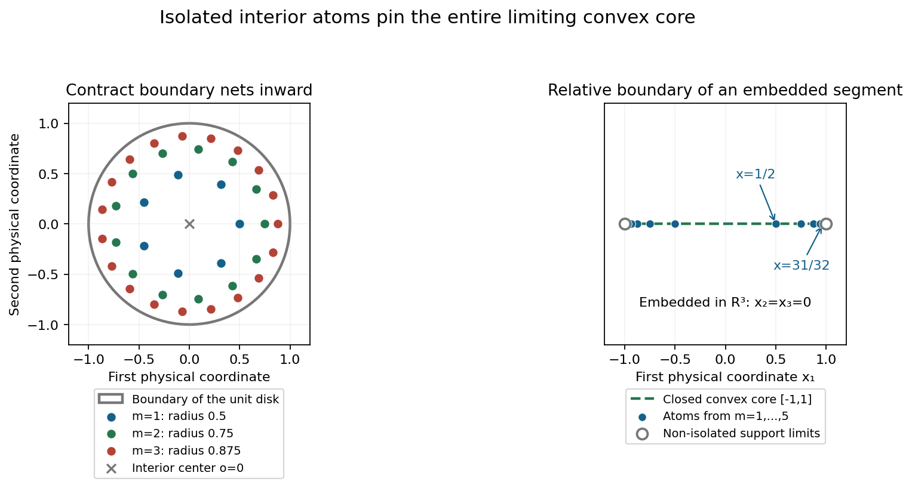
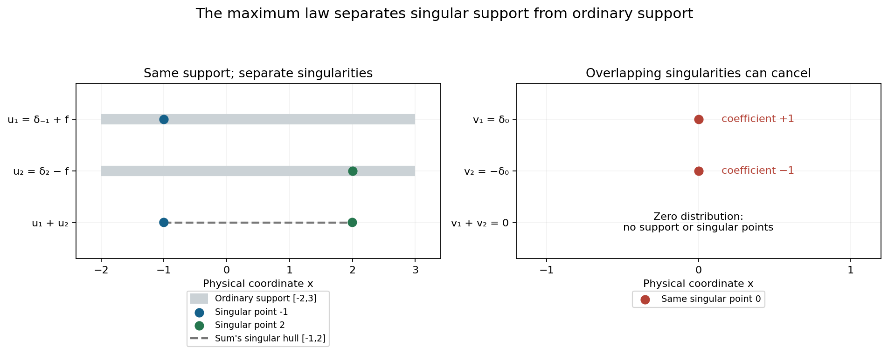

# Isolated atoms and separated singularities

Original exposition and proofs: GPT-6.1 Sol (OpenAI), Ultra. CC0 1.0. Self-checked by the writing AI; independent mathematical review is not claimed.

An isolated atom cannot lose its singularity when we select a convolution profile. This forces every profile carrier to contain that atom. A collection of isolated atoms can therefore pin an entire convex body inside every carrier, even when the distribution has infinitely many support points. Separate singularities also let us recover the exact maximum law for the indicators of a sum.

Basic references are Tao's *246B, Notes 2* and *245B, Notes 9*, and Hörmander's *The Analysis of Linear Partial Differential Operators I* and *II*. Prerequisites are Recovering singularities from convolution profiles, for a compact selector singular at one point; Changing centers in Fourier windows, for simultaneous control of finitely many profiles; and Joint logarithmic-frequency limits, for extraction on common frequencies. The [complete proof](isolated-atoms-and-profile-maxima-formal.md) supplies the local convolution calculus, the isolated-point bound, the full relative-boundary atomic construction and both directions of the joint maximum formula.

## 1. A geometric core shared by every profile

Let \(u\) be a compact distribution. Its logarithmic profiles use
\[
 F_u(\zeta)=\langle u,e^{-ix\cdot\zeta}\rangle,\qquad
 L_u(z,c)=\frac{\log|F_u(c+z\log|c|)|}{\log|c|}.
 \tag{T1}
\]
The centers \(c\) are real and escape to infinity. A proper profile converges locally in \(L^1\), with a canonical PSH representative. Its indicator \(h\) is the support function of a nonempty compact convex carrier \(C_h\). A collapsed profile has indicator \(-\infty\) and empty carrier.

Write \(I(u)\) for the isolated points of the ordinary support, and let
\[
 K_I=\overline{\operatorname{conv}I(u)}.
 \tag{T2}
\]
Theorem 3.1 of the complete proof gives
\[
 K_I\subset C_h
       \quad\text{for every }h\in\mathcal J(u).
 \tag{T3}
\]
If \(I(u)\) is nonempty, no profile collapses and \(u\) is invertible.

To understand the mechanism, split off the distribution \(a\) supported at an isolated point \(x\), leaving a remainder \(b\) that vanishes near \(x\). Select a compact \(v\) singular only at zero so that the output singular hull is the chosen \(C_h\). The point-supported polynomial operator \(a\) has output singular hull exactly \(\{x\}\). The remainder \(b*v\) is smooth near \(x\), since
\[
 \operatorname{sing\,supp}(b*v)
    \subset\operatorname{sing\,supp}b+
           \operatorname{sing\,supp}v
    =\operatorname{sing\,supp}b.
 \tag{T4}
\]
Thus the singularity at \(x\) survives in \(u*v\), forcing \(x\in C_h\). This works for every isolated support point and every selected profile.

The convolution containment in (T4) has a full proof in Lemma 2.1. It follows by cutting each compact distribution into a compact smooth part and a part supported in an arbitrarily small neighborhood of its singular support. Every convolution term with a smooth factor is smooth. Only the pair of small singular neighborhoods can contribute singular points.

For nonzero finite-support distributions, every support point is isolated. The common core is the entire convex hull of the support, while every carrier is already contained in that hull. Therefore
\[
 \mathcal J(u)=\{H_{\operatorname{conv}(\operatorname{supp}u)}\}.
 \tag{T5}
\]
Its convolution singular hull always adds exactly to the unknown input hull.

## 2. Prescribing a convex carrier with positive atoms

Theorem 4.1 constructs a nonnegative measure with any compact convex \(K\) as its sole profile carrier. Empty \(K\) uses the zero measure. A singleton uses one point mass.

In positive affine dimension, work in the affine hull \(A\) of \(K\), and choose a relative-interior point \(o\). On each finite \(1/m\)-net of the relative boundary \(B\), move the net inward:
\[
 x_{m,b}=2^{-m}o+(1-2^{-m})b,\qquad b\in B_m.
 \tag{T6}
\]
These points are interior relative to \(A\), are distinct, and approach exactly the boundary. Each is isolated among the support points, because all sufficiently late blocks lie close to the boundary while this fixed interior point has positive distance from it.

List them as \(x_1,x_2,\ldots\), and set
\[
 u=\sum_{j\geq1}2^{-j}\delta_{x_j}.
 \tag{T7}
\]
The weights are positive and total one. The closed convex hull of the isolated atoms contains every boundary point and hence all of \(K\). Formula (T3) forces \(K\) into every carrier; support containment forces the reverse inclusion. Thus \(\mathcal J(u)=\{H_K\}\).

The support of the measure includes the boundary limit points. It need not consist just of the atoms. All support points are singular in this construction: singularity at each isolated atom and closedness of singular support include their entire closure.

*Figure 1.* On the left, \(o=0\), \(K\) is the unit disk, and the boundary net for block \(m\) has \(\lceil2\pi m\rceil\) equally spaced points. The first three contracted blocks are shown; the complete construction uses all \(m\geq1\). On the right, the first five pairs of Example 3's atoms approach the endpoints of the segment in \(\mathbb R^3\), with \(x_2=x_3=0\). The endpoints belong to the support as limits and are not isolated atoms. Marker sizes show locations, not masses. Proof locators: complete proof, Theorems 3.1 and 4.1; Example 3 and Exercises 5–7. Background: Hörmander's isolated-support-point geometry.

## 3. A sum uses a common frequency tuple

For compact distributions \(u_1,\ldots,u_k\) with pairwise disjoint singular supports, put \(u=\sum_i u_i\). Theorem 6.1 states that a joint tuple satisfies
\[
 (h,h_1,\ldots,h_k)\in\mathcal J(u,u_1,\ldots,u_k)
       \quad\Longrightarrow\quad h=\max_i h_i.
 \tag{T8}
\]
Consequently
\[
 \mathcal J(u)=
 \{\max_i h_i:(h_1,\ldots,h_k)
                         \in\mathcal J(u_1,\ldots,u_k)\}.
 \tag{T9}
\]
The maximum is pointwise in the direction. A collapsed coordinate contributes \(-\infty\); an entirely collapsed tuple gives a collapsed sum.

The joint condition matters. The two transforms in a sum can cancel, and one cannot choose unrelated frequency sequences for the components. The proof instead selects one convolution factor for the whole finite tuple. Each convolved component has the prescribed carrier and has singular support inside its original singular support. These singular supports remain disjoint, so none can cancel locally. Their union has convex hull whose support function is exactly the maximum in (T8).

Ordinary supports may overlap. It is the separation of singular supports that ensures this local noncancellation.

## 4. Four worked examples

### Example 1: a finite constellation of differential atoms

In \(\mathbb R^2\), take
\[
 u=\delta_{(-2,0)}
       +\partial_1\delta_{(1,0)}
       +(1-\partial_2^2)\delta_{(0,2)}.
 \tag{T10}
\]
Each term is a nonzero point-supported distribution, and the support consists of exactly those three distinct points. Hence every indicator is
\[
 h(\eta_1,\eta_2)
       =\max\{-2\eta_1,\eta_1,2\eta_2\}.
 \tag{T11}
\]
The carrier is the triangle with those vertices. For instance \(h(1,0)=1\), \(h(-1,0)=2\), \(h(0,1)=2\), and \(h(0,-1)=0\).

The derivative orders and coefficients affect the profiles and transform zeros, but do not alter this unique indicator. For every compact \(w\), its output singular hull is the triangle plus \(S_w\). The statement concerns singular hulls, not the assertion that every point of that triangle is singular in \(u\).

### Example 2: overlapping support with separate singularities

Let \(f\) be smooth, supported in \([-2,3]\), and positive on \((-2,3)\), and define on the line
\[
 u_1=\delta_{-1}+f,\qquad u_2=\delta_2-f.
 \tag{T12}
\]
Both ordinary supports are \([-2,3]\), but their singular supports are the separate singletons \(\{-1\}\) and \(\{2\}\). Their sum is \(\delta_{-1}+\delta_2\).

The profile indicators of the summands are \(-\eta\) and \(2\eta\). To check this without treating the smooth part as a singular atom, integrate its compact smooth transform by parts. For \(q=|c|\), \(|z|\leq M\), and all sufficiently large \(q\),
\[
 |F_f(c+z\log q)|\leq C_{N,M}q^{-N+3M}
           \quad\text{for every integer }N.
 \tag{T13}
\]
Here \(|c+\operatorname{Re}z\log q|\geq q/2\), so the complex denominator from integration by parts has modulus at least \(q/2\). The physical exponential on \([-2,3]\) has modulus at most \(q^{3M}\). There are no boundary terms.
After dividing by the point-mass exponential, at worst another \(q^{2M}\) appears. Choose \(N>5M\). The ratio of the smooth transform to that exponential tends uniformly to zero. Thus
\[
 L_{u_1}(z,c)\longrightarrow-\operatorname{Im}z,\qquad
 L_{u_2}(z,c)\longrightarrow2\operatorname{Im}z
 \tag{T14}
\]
locally uniformly. These give the stated indicators.

The maximum law, or finite-support Corollary 3.2, now gives
\[
 \mathcal J(u_1+u_2)=\{\max(-\eta,2\eta)\}
                    =\{H_{[-1,2]}(\eta)\}.
 \tag{T15}
\]
The cancellation of the smooth backgrounds is allowed. The separated point singularities survive.

### Example 3: infinitely many isolated atoms on a segment

Take the segment from \((-1,0,0)\) to \((1,0,0)\) in \(\mathbb R^3\), and define
\[
 u=\sum_{m=1}^{\infty}2^{-m-1}
       \left(\delta_{(-(1-2^{-m}),0,0)}
                  +\delta_{((1-2^{-m}),0,0)}\right).
 \tag{T16}
\]
The measure has mass one. Its atoms are isolated, while the two endpoints are non-isolated support points. Their closed convex hull is the entire segment. Therefore every indicator is \(h(\eta)=|\eta_1|\), including directions with nonzero second and third coordinates. Those coordinates do not affect the dot product with this segment.

The relative boundary consists of two endpoints. Its ambient boundary is the whole segment, because it has empty interior in \(\mathbb R^3\). The relative construction is what gives isolated interior atoms approaching just the two endpoints.
The transform is
\[
 F_u(\zeta)=\sum_{m\geq1}2^{-m}
                     \cos((1-2^{-m})\zeta_1).
 \tag{T17}
\]
This series converges uniformly on compact complex sets: each cosine is bounded by \(e^{|\operatorname{Im}\zeta_1|}\), and the weights sum to one. Its unique indicator follows from the isolated-atom proof, without replacing the finite maximum theorem by an unproved infinite-sum version.

### Example 4: why singular-support separation is essential

Let \(u_1=\delta_0\), \(u_2=-\delta_0\). Each has the constant-zero logarithmic profile and indicator zero, and their joint pair is \((0,0)\) on every escaping real sequence. Yet \(u_1+u_2=0\), so the sum has only the collapsed indicator \(-\infty\).

Thus \(\max(0,0)=0\) is not the sum's indicator. The singular supports coincide at zero and the two singularities cancel completely. This violates the hypothesis of the maximum law.
By contrast, a compact smooth summand has empty singular support, disjoint from every other one. Its collapsed indicator contributes nothing to a maximum with a proper indicator.

*Figure 2.* The left panel shows Example 2's ordinary supports \([-2,3]\), singular points \(-1\) and \(2\), and the sum's singular hull \([-1,2]\). The right panel shows Example 4's complete cancellation at zero. Vertical positions distinguish distribution rows; only the horizontal coordinate is physical. Gray support intervals are not distribution densities. Proof locators: complete proof, Lemma 2.2 and Theorem 6.1; Examples 2 and 4. Background: Hörmander's convolution profile geometry and Tao's Fourier discussion.

## Exercises with complete solutions

The exercises total 100 points.

### Exercise 1: singular-support convolution containment (10 points)

Prove \(\operatorname{sing\,supp}(a*b)\subset
\operatorname{sing\,supp}a+\operatorname{sing\,supp}b\) for compact distributions. Include the case of a smooth factor.

*Solution.* A compact smooth factor \(f\) gives
\((f*b)(x)=\langle b(y),f(x-y)\rangle\), with a fixed cutoff in \(y\). Differentiation in \(x\) converges in all test-function seminorms and passes through the continuous distribution pairing, so this is smooth.
For nonempty singular supports, cut \(a\) into \(a_\varepsilon\) supported in their radius-\(\varepsilon\) neighborhood and a compact smooth remainder, using a cutoff equal to one near its singular support. Do the same for \(b\). In their convolution expansion every term but \(a_\varepsilon*b_\varepsilon\) has a smooth factor. The remaining term is supported in the sum of the two small support neighborhoods. Hence the singular support is within the radius-\(2\varepsilon\) neighborhood of the compact singular-support sum. A point outside that closed sum has positive distance from it. Choose \(\varepsilon\) smaller than half the distance to exclude it. If one singular support is empty, that factor is smooth and the first argument applies.

### Exercise 2: local noncancellation (8 points)

Show that a finite sum with pairwise disjoint singular supports has singular support equal to their union. Explain why ordinary support disjointness is unnecessary.

*Solution.* Outside the union every summand is locally smooth. At a point in one singular support, choose a neighborhood avoiding all the other singular supports; there are only finitely many closed sets to avoid. The other summands are smooth there. If the sum were smooth, subtracting those smooth functions would make the one singular summand smooth too, a contradiction. Ordinary supports can overlap in regions where their distributions are smooth. The proof only uses local smoothness of the other summands, as Example 2 illustrates.

### Exercise 3: an isolated point in the ordinary support (12 points)

Prove directly that every profile carrier contains an isolated support point \(x\), including why a collapsed profile is impossible.

*Solution.* Split \(u=a+b\) with \(a\neq0\) supported at \(x\) and \(b\) vanishing near \(x\), using an isolating smooth cutoff. Realize the chosen indicator \(h\) by a compact selector \(v\) singular only at zero, with \(S_{u*v}=C_h\).
The full point-supported polynomial theorem gives \(S_{a*v}=\{x\}+S_v=\{x\}\), so \(a*v\) is singular exactly at \(x\). Exercise 1 gives \(\operatorname{sing\,supp}(b*v)\subset\operatorname{sing\,supp}b\), which avoids a neighborhood of \(x\). This smooth contribution cannot cancel the singularity of \(a*v\). Therefore \(x\in S_{u*v}=C_h\). If the chosen profile were collapsed its carrier would be empty, a contradiction.
Applying this to every isolated support point and taking a closed convex hull puts their entire common core in every carrier.

### Exercise 4: a finite-support triangle (8 points)

For Example 1 compute the indicator in directions \((1,1)\), \((-1,1)\) and \((0,-1)\). Why does the order-two derivative at the top vertex not change the carrier? Does the distribution have singularities at every interior point of the triangle?

*Solution.* Formula (T11) gives respectively \(\max(-2,1,2)=2\), \(\max(2,-1,2)=2\), and \(\max(0,0,-2)=0\).
Each of the three support points is isolated and is in every carrier; every carrier is already in their convex hull. The derivative order changes the Fourier polynomial at that point but the nonzero point-supported profile indicator remains the point's linear support function. Thus the carrier is the same triangle. The actual singular support is just the three vertices: each nonzero point-supported summand is singular there, and the distribution vanishes locally everywhere else. Interior points of the triangle are hull points rather than new singular points.

### Exercise 5: empty sets, singletons and relative boundary (10 points)

Give a measure with sole carrier \(K\) when \(K\) is empty or a singleton. For a nontrivial segment in \(\mathbb R^3\), identify the relative interior and relative boundary and explain why the ambient boundary gives the wrong construction.

*Solution.* Use \(u=0\) for empty \(K\), with sole indicator \(-\infty\) and empty carrier. For \(K=\{x\}\), use \(\delta_x\), whose translation profile has indicator \(x\cdot\eta\) and carrier \(\{x\}\).
For a segment the affine hull is its line. The relative interior is the open segment, and the relative boundary is its two endpoints. Moving these two endpoints inward in successive blocks gives isolated interior atoms whose only accumulation points are the endpoints.
In the ambient space the segment has empty interior, so its ambient boundary is the entire segment. Interior atoms chosen to accumulate everywhere along it would no longer have the isolation property used to pin every carrier. The construction must use the geometry in the affine hull. A singleton has empty relative boundary, which is why it needs its own direct point-mass case.

### Exercise 6: the mass, support and transform of the segment measure (10 points)

Verify the mass, support and transform of (T16), and determine all its indicator values. Justify compact complex convergence of its transform series.

*Solution.* The mass is
\(\sum_{m\geq1}2\cdot2^{-m-1}=\sum_{m\geq1}2^{-m}=1\).
Its support is the closure of the atoms: those isolated points together with the two endpoints. Every neighborhood of an atom has positive mass, and every neighborhood of an endpoint contains an atom. Outside this closure an open neighborhood contains no atom and has zero measure.
Pairing the two point-mass exponentials at each \(m\) gives
\(2^{-m}\cos((1-2^{-m})\zeta_1)\). On a compact complex set with \(|\operatorname{Im}\zeta_1|\leq R\), its modulus is at most \(2^{-m}e^R\). Uniform summability proves the series convergence and permits its identification with the measure's Fourier integral.
The closed convex hull of the isolated atoms is the segment. The common-core theorem and the upper carrier containment give the sole indicator \(h(\eta)=|\eta_1|\). In directions \((0,1,0)\), \((1,0,2)\) and \((-3,4,5)\), the values are \(0,1,3\).

### Exercise 7: why each contracted boundary net gives isolated atoms (12 points)

For the construction (T6), prove that every point is in the relative interior, that different blocks have distinct points, and that the accumulation set is exactly the relative boundary.

*Solution.* Choose a relative ball of radius \(r\) about \(o\) inside \(K\). Convexity places the ball of radius \(2^{-m}r\) about \(x_{m,b}\) inside \(K\), so the point is in the relative interior.
Equality of points from two blocks puts their boundary points on the same ray from \(o\). Such a ray has only one boundary endpoint. An earlier point on that ray with a later point of \(K\) beyond it would have a relative ball from convex interpolation with the ball about \(o\), and would be interior. Thus the endpoints agree, and equality of the two contractions forces their indices to agree. Distinct points within a net stay distinct under contraction.
Writing \(R=\max_{b\in B}|b-o|\), every point of block \(m\) has distance at most \(2^{-m}R\) from \(B\). A subsequence through infinitely many blocks can therefore accumulate only on \(B\); finitely many blocks contain finitely many points and cannot supply a new accumulation point. Conversely the \(1/m\)-nets approximate any fixed boundary point, and their contracted points differ from it by at most \(1/m+2^{-m}R\). This tends to zero through distinct points.
A fixed interior atom has positive distance from \(B\). All late blocks are outside a sufficiently small neighborhood of it, and the finitely many early atoms can be removed by a smaller neighborhood. Hence it is isolated in the full support.

### Exercise 8: a common selector for a joint tuple (10 points)

Explain how one selector can realize several prescribed carriers on the same escaping sequence. Include collapsed coordinates and why separate selectors would not prove the maximum law.

*Solution.* Take one logarithmic neighborhood union controlling the entire finite tuple. The common-neighborhood corollary takes the maximum of finitely many thresholds for each compact parameter ball and tolerance, then builds one expanding radius sequence. Proper coordinates have their own indicator ceilings; collapsed coordinates collapse throughout that union.
The compact selector collapses outside it and has the zero profile on a subsequence of the original centers. Every proper selected input profile is retained on this subsequence, so its product attains the desired carrier. Every other proper product carrier comes from centers inside the union; the input ceiling bounds it by the prescribed carrier and the selector's proper carrier is \(\{0\}\). Hull recovery gives exact equality.
For a collapsed coordinate, the input collapses inside and the selector outside. A common local upper bound for the other factor and a maximum of the two frequency thresholds force every product profile to collapse; its hull is empty.
Separate selectors would produce different outputs and would not give a single identity \(u*v=\sum_i u_i*v\) with all prescribed hulls simultaneously. The finite common construction supplies the shared factor required for that identity.

### Exercise 9: both directions of the family maximum formula (12 points)

Prove the joint maximum identity for separate singularities, and then both inclusions in (T9). Explain the all-collapsed case.

*Solution.* Use a common selector for the tuple consisting of the sum and all summands. Its output singular hulls are the prescribed carriers \(C_h,C_{h_i}\). Convolution with this selector puts each output singular support inside the original one, so they remain pairwise disjoint. The local noncancellation result makes their sum's singular support their union. Taking convex hulls gives
\(C_h=\operatorname{conv}\bigcup_i C_{h_i}\), whose support function is \(\max_i h_i\).
For an indicator of the sum, finite projection extends its profile to every summand on a common further subsequence. The joint identity then puts it in the right side of (T9).
Conversely a joint tuple of summand profiles extends to include the sum, retaining all the prescribed profiles. The same identity proves that their maximum is an actual sum indicator.
If all summand carriers are empty, all selected outputs are smooth and their finite sum is smooth. Its hull is empty and its indicator is \(-\infty=\max_i(-\infty)\). If some coordinate is proper, the hull union is nonempty and collapsed coordinates can be omitted from the maximum.

### Exercise 10: overlapping singularities permit complete cancellation (8 points)

Use two point distributions to disprove a maximum law without singular-support separation. Then explain why a smooth summand does satisfy the separation condition and has no effect on the indicator family.

*Solution.* Let \(u_1=\delta_0\), \(u_2=-\delta_0\). Their transforms are \(1,-1\), with normalized logarithms zero on every escaping sequence. Their only joint indicator pair is \((0,0)\), but their zero sum has normalized logarithm identically \(-\infty\). Thus its indicator is collapsed rather than the maximum zero. The singular supports both equal \(\{0\}\).
A compact smooth summand has empty singular support, disjoint from any singular support. Its only indicator is collapsed. The joint projection theorem permits every original profile to extend to include that smooth summand; its collapsed coordinate is the only possible added one. The maximum theorem therefore preserves every original indicator, since \(\max(h,-\infty)=h\), including an originally collapsed \(h\).

## References

- Terence Tao, [246B, Notes 2: Some connections with the Fourier transform](https://terrytao.wordpress.com/2021/01/23/246b-notes-2-some-connections-with-the-fourier-transform/), 2021. Compact Fourier transforms and convolution; its normalization differs from (T1).
- Terence Tao, [245B, Notes 9: The Baire category theorem and its Banach space consequences](https://terrytao.wordpress.com/2009/02/01/245b-notes-9-the-baire-category-theorem-and-its-banach-space-consequences/), 2009. Background for the preceding full compact-selector construction.
- Lars Hörmander, *The Analysis of Linear Partial Differential Operators I*, Springer, 1983.
- Lars Hörmander, *The Analysis of Linear Partial Differential Operators II*, Springer, 1983, Chapter XVI. The common-core,atomic construction and joint maximum arguments are supplied in the complete proof above.
