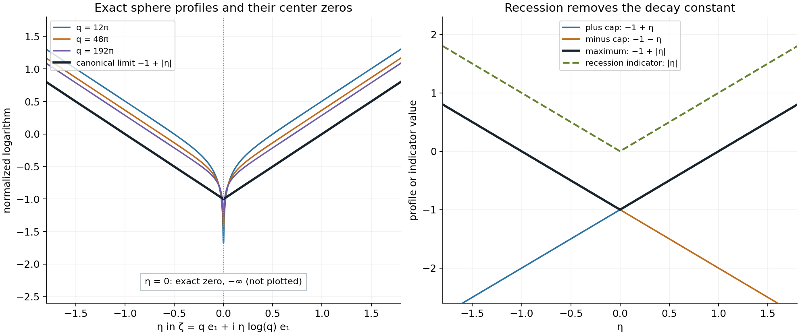
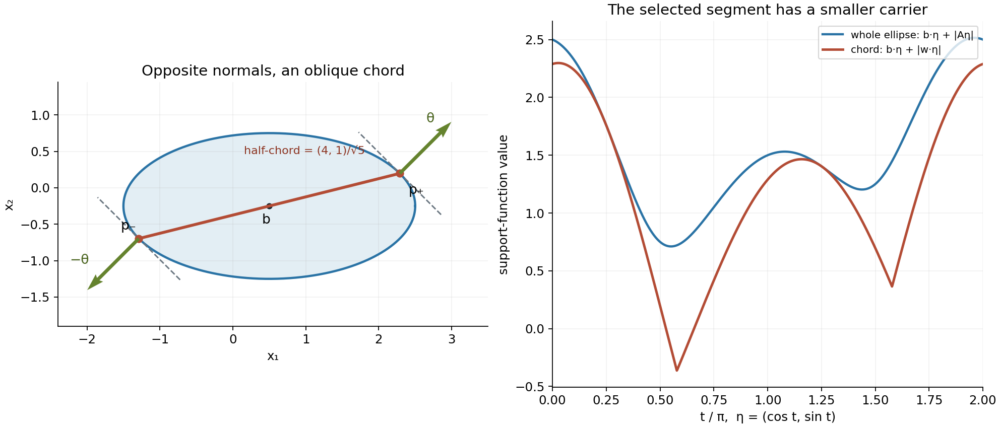

# Curved boundaries and directional Fourier carriers

Original exposition and proofs: GPT-6.1 Sol (OpenAI), Ultra. CC0 1.0. Self-checked by the writing AI; independent mathematical review is not claimed.

The Fourier transform of a curved surface is an oscillatory sum. Most of the surface cancels rapidly. Two small regions remain when the frequency direction is fixed: the points where that direction is normal. This lesson shows why the logarithmic Fourier carrier is the segment joining those two points, and how wavefront directions bound carriers for more general distributions.

Basic references are Guillemin and Sternberg's *Semi-classical Analysis* and Hörmander's *The Analysis of Linear Partial Differential Operators I* and *II*. We assume the definitions and compactness in Joint logarithmic-frequency limits, the exact joint maximum theorem in Isolated atoms and separated singularities, and the full uniform expansion in Stationary phase and critical manifolds. The [complete proof](curved-boundaries-and-directional-carriers-formal.md) proves the geometry, the complex-window estimates, both inclusions in the carrier family and the wavefront bound.

## 1. Two normal points determine the carrier

Let \(X\subset\mathbb R^n\) be a nonempty bounded open convex set with smooth boundary \(\Sigma\). Assume that its second fundamental form is positive definite everywhere, with the outward-normal convention that is positive on a sphere. Take a strictly positive smooth density \(a\) and the compact surface measure
\[
 u=a\,dS.
 \tag{T1}
\]
For \(\theta\in S^{n-1}\), let \(p_+(\theta)\) be the point with outward normal \(\theta\), and \(p_-(\theta)\) the point with outward normal \(-\theta\). There is exactly one of each. Positive curvature makes the inverse normal maps smooth.

The directional carrier theorem, Theorem 5.1 of the complete proof, is
\[
 \mathcal J_\theta(u)=\{H_{D_\theta}\},\qquad
 D_\theta=[p_-(\theta),p_+(\theta)],
 \tag{T2}
\]
where
\[
 H_{D_\theta}(\eta)=
       \max\{p_-(\theta)\cdot\eta,p_+(\theta)\cdot\eta\}.
 \tag{T3}
\]
The full family consists of these indicators for all unit directions, and no profile collapses. In dimension one, positive endpoint weights give the single segment that is the interval's closure.

The endpoints have opposite normals. The chord between them need not run in the frequency direction. A support function describes a convex set: (T3) is the support function of one segment, rather than of the whole convex body.

## 2. The cap calculation and its uniformity

Use the Fourier convention
\[
 F_u(\zeta)=\int_\Sigma a(x)e^{-ix\cdot\zeta}\,dS(x),\qquad
 L_u(z,c)=\frac{\log|F_u(c+z\log|c|)|}{\log|c|}.
 \tag{T4}
\]
Put \(c=q\theta\), \(\ell=\log q\) and \(d=n-1\). For a small surface cap at either normal point, Theorem 4.1 gives
\[
 F_{u_\pm}(q\theta+\ell z)=
 q^{-d/2}C_\pm(\theta)
 e^{-iq\theta\cdot p_\pm(\theta)}
 e^{-i\ell z\cdot p_\pm(\theta)}
 \left(1+O_M\!\left(\frac{(1+\ell)^2}{q}\right)\right).
 \tag{T5}
\]
This holds uniformly for \(|z|\leq M\) and for directions in a sufficiently small compact neighborhood. The coefficient is
\[
 C_\pm(\theta)=(2\pi)^{d/2}e^{\pm i\pi d/4}
              \frac{a(p_\pm(\theta))}{\sqrt{\kappa(p_\pm(\theta))}},
 \tag{T6}
\]
where \(\kappa>0\) is the Gauss curvature. The \(+\) cap has positive phase Hessian for the phase \(-\theta\cdot x\). The minus cap has negative Hessian. These signs follow from the chosen negative Fourier exponent.

Taking normalized logarithms removes the bounded coefficient and gives
\[
 L_{u_\pm}(z,q_j\theta_j)\longrightarrow
       -\frac d2+p_\pm(\theta_0)\cdot\operatorname{Im}z,
       \qquad \theta_j\to\theta_0.
 \tag{T7}
\]
The constant \(-d/2\) records stationary-phase decay. The recession indicator removes that constant, leaving the point carrier \(\{p_\pm(\theta_0)\}\).

The complex shift matters in proving (T5). In real stationary phase its imaginary part enters the amplitude as \(e^{\ell\,\operatorname{Im}z\cdot x}\). On a chart with \(|x|\leq R\), amplitude derivatives of order \(k\) can be as large as \(q^{RM}(1+\ell)^k\). A one-term absolute error need not be small relative to a leading amplitude as small as \(q^{-RM}\).

The full expansion resolves this. Each coefficient is evaluated at the critical point and shares its leading exponential. Its relative \(j\)-th term is at most \(Cq^{-j}(1+\ell)^{2j}\). The relative remainder at expansion order \(N\) is at most
\[
 C_{N,M}q^{-N+2RM}(1+\ell)^{k_N}.
 \tag{T8}
\]
Choose \(N>2RM+2\). All finitely many logarithmic powers are absorbed as \(q\to\infty\). This gives the stated uniform relative estimate on each fixed complex parameter ball.

## 3. Adding the caps and discarding the rest

Cut the surface into two disjoint caps and a remaining smooth surface density:
\[
 u=u_++u_-+r.
 \tag{T9}
\]
For directions near \(\theta_0\), the phase has no stationary point on the remaining support. Repeated integration by parts proves
\[
 \sup_{|z|\leq M}|F_r(q\theta+z\log q)|
       \leq C_{M,N}q^{-N}
       \quad\text{for every }M,N.
 \tag{T10}
\]
Lemma 2.2 shows that such a remainder preserves every proper profile and every collapsed status on the same frequency sequence.

The two caps have disjoint singular supports. Their joint indicators are the two linear functions from (T7). The exact preceding maximum theorem therefore gives (T3). Its proper maximum excludes a collapsed sum. Compactness of the unit sphere gives a limiting direction for any extracted profile. Conversely, fixed-direction centers realize the indicator for every prescribed direction.

This step uses a joint theorem about indicators. Pointwise logarithms of sums can have cancellations and zeros. A Fourier zero at one parameter value does not turn a proper local \(L^1\) limit into a collapsed profile.

## 4. Wavefront directions give a general upper bound

A pair \((x,\theta)\), with \(\theta\ne0\), is absent from \(\operatorname{WF}(u)\) when a compact smooth cutoff equal to one near \(x\) makes the real Fourier transform rapidly decreasing in a cone about \(\theta\). This definition keeps location and frequency direction together.

For a compact distribution define
\[
 E_\theta(u)=\{x:(x,\theta)\in\operatorname{WF}(u)\},\qquad
 K_\theta(u)=\operatorname{conv}E_\theta(u).
 \tag{T11}
\]
Theorem 6.1 proves that a profile obtained along centers with direction limit \(\theta\) has
\[
 h(\eta)\leq H_{K_\theta(u)}(\eta).
 \tag{T12}
\]
An empty fiber forces collapse in that direction.

The proof cuts off a small neighborhood of \(E_\theta(u)\). A finite cover of its complement has rapid real Fourier decay in one common cone. Lemma 2.1 carries this decay to all fixed logarithmic complex windows. The remaining compact distribution has support arbitrarily close to the fiber, so its support-function bound tends to (T12).

For a positive density on a positively curved boundary, Corollary 6.2 gives
\[
 E_\theta(a\,dS)=\{p_+(\theta),p_-(\theta)\}.
 \tag{T13}
\]
Here the general bound is attained exactly.

## 5. Four worked examples

**Example 1. A circle separates the constant from the indicator.** For arc-length measure on the unit circle in \(\mathbb R^2\), \(d=1\), \(a=1\), \(\kappa=1\), and \(p_\pm(\theta)=\pm\theta\). The two cap limits are
\[
 -\frac12+\theta\cdot\operatorname{Im}z,\qquad
 -\frac12-\theta\cdot\operatorname{Im}z.
 \tag{E1}
\]
Their indicators are the two linear terms. The directional carrier is \([-\theta,\theta]\), with \(h_\theta(\eta)=|\theta\cdot\eta|\). The polynomial decay power of each cap does not enlarge or shrink its point carrier.

**Example 2. A sphere has an exact transform and exact zeros.** Surface-area measure on the unit sphere in \(\mathbb R^3\) has
\[
 F_u(\zeta)=4\pi\sum_{k=0}^\infty
      \frac{(-1)^k(\zeta\cdot\zeta)^k}{(2k+1)!}
      =4\pi\frac{\sin r}{r},\qquad r^2=\zeta\cdot\zeta.
 \tag{E2}
\]
The series defines the value at zero and makes the choice of square-root sign irrelevant. For real \(\zeta=q\theta\), rotation and the area coordinate \(t=\theta\cdot x\) give \(2\pi\int_{-1}^1e^{-iqt}\,dt=4\pi\sin q/q\). The two entire functions agree on the real space and hence everywhere, by applying the one-variable identity theorem successively in the three coordinates.

If \(c_j=q_j\theta_j\) and \(\theta_j\to\theta\), then uniformly on each fixed complex parameter compact set the root near \(q_j\) satisfies
\[
 r(q_j\theta_j+(\log q_j)z)
       =q_j+(\log q_j)\theta_j\cdot z
                      +O((\log q_j)^2/q_j).
 \tag{E3}
\]
At points where \(\theta\cdot\operatorname{Im}z\ne0\), one exponential in the sine dominates. Thus the normalized logarithm tends to
\[
 U(z)=-1+|\theta\cdot\operatorname{Im}z|.
 \tag{E4}
\]
The exceptional hyperplane has real measure zero. Theorem 5.1 excludes collapse; any proper local \(L^1\) extraction has a further almost-everywhere extraction, so the pointwise limit just proved identifies it almost everywhere with (E4). The canonical PSH representative is (E4). Compactness and uniqueness give the full local \(L^1\) limit.

Nevertheless, at \(z=0\) and \(q_j=j\pi\), every transform is exactly zero. The pointwise normalized logarithm is \(-\infty\), while the proper canonical limit is \(-1\) there. Its recession indicator is \(|\theta\cdot\eta|\).

*Figure 1.* The left panel evaluates (E2) at \(q e_1+i\eta(\log q)e_1\) for \(q=12\pi,48\pi,192\pi\), using the entire sine quotient. The value at \(\eta=0\) is an exact zero and is omitted from those curves; the annotation records \(-\infty\), not a finite ordinate. The black curve is the canonical limit \(-1+|\eta|\) from Example 2. The right panel shows the individual cap limits \(-1+\eta\) and \(-1-\eta\), their maximum, and the recession indicator \(|\eta|\). The constant is removed only at the recession step. Proof locators: Theorem 4.1; Theorem 5.1; Example 2 and Exercise 7. Background: Guillemin–Sternberg stationary phase and Hörmander logarithmic profiles.

**Example 3. An ellipse's normal chord is oblique.** Let
\[
 X=\left\{x:\frac{(x_1-\frac12)^2}{4}
                  +(x_2+\frac14)^2<1\right\},\qquad
 b=(\tfrac12,-\tfrac14),\quad A=\operatorname{diag}(2,1).
 \tag{E5}
\]
Any strictly positive smooth boundary density satisfies the theorem. A linear functional on \(b+A S^1\) is maximized at \(y=A\theta/|A\theta|\), by Cauchy–Schwarz. Hence
\[
 p_\pm(\theta)=b\pm\frac{A^2\theta}{|A\theta|},\qquad
 h_\theta(\eta)=b\cdot\eta+
       \frac{|\eta\cdot A^2\theta|}{|A\theta|}.
 \tag{E6}
\]
For \(\theta=(1,1)/\sqrt2\), the half-chord is \((4,1)/\sqrt5\). Its direction differs from \((1,1)\). At \(\eta=(1,-4)\), the segment indicator is \(3/2\), whereas the whole body's support function is \(3/2+\sqrt{20}\). The carrier for this direction is a segment inside the ellipse.

*Figure 2.* The ellipse is exactly (E5). The marked endpoints are \(b\pm(4,1)/\sqrt5\), their outward normals are \(\pm(1,1)/\sqrt2\), and the dashed tangent lines are perpendicular to those normals. The left panel uses equal coordinate scales. The right panel evaluates the exact support functions \(b\cdot\eta+|\eta\cdot(4,1)/\sqrt5|\) and \(b\cdot\eta+|A\eta|\) at \(\eta=(\cos t,\sin t)\). It compares the selected chord with the full body; no finite plot is a proof of containment. Proof locators: Lemma 3.1; Theorem 5.1; Example 3 and Exercise 2. Background: Hörmander's directional convolution geometry.

**Example 4. A smooth direction can force collapse.** Choose \(f\in C_c^\infty(\mathbb R)\), positive on \((-1,1)\), with support \([-1,1]\), and let
\[
 v=\delta_0(x_1)\otimes f(x_2),\qquad
 F_v(\zeta_1,\zeta_2)=F_f(\zeta_2).
 \tag{E7}
\]
For every direction with \(\theta_2\ne0\), localization leaves a smooth compact function of \(x_2\), whose Fourier transform is rapidly decreasing where \(|\xi_2|\) is a fixed positive fraction of \(|\xi|\). Thus \(E_\theta(v)=\varnothing\), and profiles in that direction collapse by Theorem 6.1.

For a horizontal direction the fiber is \(\{0\}\times[-1,1]\). At an interior point, any cutoff equal to one there leaves a nonzero compact smooth function \(g(x_2)\). Its Fourier transform is nonzero at some finite \(t\), by Fourier injectivity. Along \((q,t)\) it stays independent of \(q\), contradicting rapid decrease in any horizontal cone. Closedness includes the endpoints. Every horizontal-direction profile is therefore bounded by the vertical segment's support function \(H(\eta)=|\eta_2|\). This is an upper bound; no equality for an individual horizontal profile is asserted here.

## Exercises with complete solutions

The ten exercises total 100 points.

**Exercise 1. The signs and the one-dimensional case (8 points).** Compute the profile of \(\delta_p\). Then determine the indicator family of two positive point masses at \(b_-<b_+\).

*Solution.* Its transform is \(e^{-ip\cdot\zeta}\), so \(\log|F_{\delta_p}(c+z\log|c|)|/\log|c|=p\cdot\operatorname{Im}z\). Its indicator is \(p\cdot\eta\). For the two endpoint masses, the finite-support theorem gives the single indicator \(\max(b_-\eta,b_+\eta)\). No profile collapses. This also proves the dimension-one assertion of Theorem 5.1 without a curvature definition. Award 4 points for the Fourier sign and 4 for the full indicator family.

**Exercise 2. Recover the ellipse's normal points (12 points).** Prove (E6), check that its endpoints lie on the ellipse, and compare the chord and body at \(\eta=(1,-4)\) for \(\theta=(1,1)/\sqrt2\).

*Solution.* Write \(x=b+Ay\), \(|y|\leq1\). Then \(\theta\cdot x=\theta\cdot b+(A\theta)\cdot y\). Equality in Cauchy–Schwarz gives \(y=\pm A\theta/|A\theta|\), proving \(p_\pm=b\pm A^2\theta/|A\theta|\). Their transformed coordinates \(A^{-1}(p_\pm-b)\) have length one. At the chosen direction the half-chord is \(w=(4,1)/\sqrt5\). A segment \(b+[-w,w]\) has support function \(b\cdot\eta+|w\cdot\eta|\), whereas the body has \(b\cdot\eta+|A\eta|\). Here \(w\cdot(1,-4)=0\), \(b\cdot(1,-4)=3/2\), and \(|A(1,-4)|=\sqrt{20}\). Award 4 points for maximization, 4 for endpoint and chord geometry, and 4 for the comparison.

**Exercise 3. The cap constants on a circle and a sphere (10 points).** Find the two constants (4.2) when \(a=\kappa=1\) in dimensions two and three. Check the sphere's leading sum against (E2) at real \(q\theta\).

*Solution.* For \(n=2\), \(d=1\), so \(C_\pm=\sqrt{2\pi}e^{\pm i\pi/4}\). For \(n=3\), \(d=2\), so \(C_+=2\pi i\) and \(C_-=-2\pi i\). The sphere sum is \(q^{-1}[2\pi i e^{-iq}-2\pi i e^{iq}]=4\pi\sin q/q\), exactly the real transform. The signature signs come from \(-\theta\cdot x\), not from the positive-exponent Fourier convention. Award 4 points for the circle and 6 for the sphere and sign check.

**Exercise 4. Why the full expansion is needed (10 points).** Suppose \(|x|\leq R=3\) on a chart and \(|z|\leq M=2\). Give an expansion order that controls the relative remainder in (4.7). Explain why merely bounding an absolute one-term error does not establish this.

*Solution.* Here \(2RM=12\). Any integer \(N>14\), for instance \(N=15\), makes \(q^{-N+12}(1+\log q)^{k_N}=q^{-3}(1+\log q)^{k_N}=O(q^{-2})\) on a tail, and hence certainly \(O(q^{-1})\). The relative coefficient terms are bounded by \(q^{-j}(1+\log q)^{2j}\), whose finite sum is \(O((1+\log q)^2/q)\). An absolute remainder containing \(q^{RM}\) must be divided by a leading amplitude possibly as small as \(q^{-RM}\); this costs the second factor \(q^{RM}\). A fixed one-term estimate does not absorb that loss. Award 4 points for an admissible order, 3 for the finite coefficient sum and 3 for the relative-error explanation.

**Exercise 5. The far part of a Fourier convolution (10 points).** In Lemma 2.1 take \(n=2\), real growth order \(m=3\), \(RM=4\), and desired bound \(q^{-5}\). Give choices of \(L,k\) for the two parts of the integral.

*Solution.* The near part is at most \(Cq^{4-L}(1+\log q)^{k_0}\) with fixed \(k_0>2\). Choose \(k_0=4\) and \(L=11\), so it is \(q^{-7}(1+\log q)^4=O(q^{-5})\). The far part is \(Cq^{4+3+2-k}(1+\log q)^k=Cq^{9-k}(1+\log q)^k\). Choose \(k=16\); this gives \(q^{-7}(1+\log q)^{16}=O(q^{-5})\). These are independent estimates on the kernel, so different derivative orders are allowed in the two integrals. The fixed positive gap between direction cones ensures the near frequencies remain in the decay cone. Award 4 points for each exponent calculation and 2 for the cone qualification.

**Exercise 6. A rapid error at a Fourier zero (8 points).** If two Fourier transforms differ by every inverse power in a logarithmic window, explain why their proper profiles agree even if one has zeros at some parameter values.

*Solution.* Joint compactness gives proper local \(L^1\) limits \(U,V\), unless both collapse. Extract almost-everywhere convergence. At almost every point \(U\) is finite, so the first transform has modulus \(q^{U(z)+o(1)}\). An error \(O(q^{-N})\) with \(N>-U(z)+2\) divided by this modulus tends to zero. The Fourier ratio tends to one and the normalized logarithms agree in the limit almost everywhere. Canonical PSH recovery gives equality everywhere for the representatives. Exceptional zeros do not justify division there and are unnecessary for this argument. If one coordinate collapses, the triangle inequality makes the other collapse too. Award 5 points for the almost-everywhere argument and 3 for canonical recovery and collapse.

**Exercise 7. Exact zeros versus the canonical sphere profile (12 points).** Prove that along \(q_j=j\pi\), \(\theta_j=e_1\), the canonical local \(L^1\) sphere profile is \(-1+|\operatorname{Im}z_1|\), although the value at \(z=0\) is always \(-\infty\).

*Solution.* Expand the square root near \(q_j\) as in (E3). At each point with \(\operatorname{Im}z_1\ne0\), its imaginary part is \((\log q_j)\operatorname{Im}z_1+o(1)\), and \(|r|/q_j\to1\). The growing exponential in \(\sin r=(e^{ir}-e^{-ir})/(2i)\) dominates, giving normalized logarithm \(-1+|\operatorname{Im}z_1|\). The omitted real hyperplane has measure zero. Theorem 5.1 excludes collapse, so every proper extraction is identified almost everywhere by this formula. Its canonical representative is the displayed continuous PSH maximum of two affine functions. Uniqueness under the compactness alternative yields the full local \(L^1\) limit. At \(z=0\), (E2) gives \(\sin(j\pi)=0\) exactly. A value on this exceptional set need not converge to the canonical representative. Award 4 points for the asymptotic, 4 for the measure and compactness argument and 4 for the exact zero and its interpretation.

**Exercise 8. Letting the direction move (8 points).** Suppose \(\theta_j\to\theta_0\), with no relation imposed between its rate and \(\log q_j\). Does the cap profile formula still hold?

*Solution.* Yes. The normalized logarithm of (4.1) is \(-d/2+p_\pm(\theta_j)\cdot\operatorname{Im}z+o(1)\), uniformly on each compact \(z\)-set. The large oscillatory factor \(e^{-iq_j\theta_j\cdot p_\pm(\theta_j)}\) has modulus one. The logarithm removes it. Smoothness gives \(p_\pm(\theta_j)\to p_\pm(\theta_0)\), and bounded coefficients divided by \(\log q_j\) vanish. There is no factor \(\log q_j\) left multiplying the error in the normal point after normalization. Award 4 points for the normalized formula and 4 for the lack of a rate requirement.

**Exercise 9. Invertibility without universal hull addition (12 points).** For \(n\geq2\), show that the surface measure in Theorem 5.1 is invertible, but does not have universal singular-hull addition. Use the exact preceding criteria in Slow decrease and entire Fourier division and Recovering singularities from convolution profiles.

*Solution.* Invertibility is equivalent to absence of a collapsed profile, which Theorem 5.1 proves. Corollary 6.2 shows that every surface point is singular; the distribution is zero away from the surface. Thus its singular-support convex hull is \(\operatorname{conv}\Sigma=\overline X\). To prove the last equality, each interior point lies on a line segment between the two boundary intersections of a line through it, while the boundary is already included. The universal hull-addition criterion requires the sole indicator \(H_{\overline X}\). Each available carrier \(D_\theta\) is a line segment. Since the body has nonempty interior in dimension at least two, that segment is a proper subset, and its support function differs from the body's support function by convex separation. The criterion therefore fails. Award 4 points for invertibility, 4 for the singular hull and 4 for applying the exact criterion.

**Exercise 10. Directional fibers for a smooth line density (10 points).** Prove the fiber claims in Example 4, including its support endpoints.

*Solution.* A localized distribution at \((0,s)\) has the form \(\delta_0(x_1)g(x_2)\), with \(g\) smooth and compactly supported, and Fourier transform \(F_g(\xi_2)\). In a cone with \(\theta_2\ne0\), shrink the cone until \(|\xi_2|\geq c|\xi|\); the Schwartz decay of \(F_g\) then proves absence from the wavefront set. At an interior support point and a horizontal direction, any cutoff equal to one there gives a nonzero \(g\), since \(f>0\) nearby. Fourier injectivity gives a finite \(t\) with \(F_g(t)\ne0\). The frequencies \((q,t)\) or \((-q,t)\) eventually lie in every cone about the corresponding horizontal direction, but this transform does not decay along them. These pairs belong to the wavefront set. The set is closed, so the endpoints \(s=\pm1\) are included as limits of interior pairs. Outside the support it is absent. The horizontal fiber is exactly the closed vertical segment; the other fibers are empty. Award 4 points for the nonhorizontal estimate, 4 for horizontal nondecay and 2 for the endpoints.

## References

- Victor Guillemin and Shlomo Sternberg, *Semi-classical Analysis*, lecture notes, 2010. [Online reading](https://math.mit.edu/~vwg/semiclassGuilleminSternberg.pdf). Background on stationary phase.
- Lars Hörmander, *The Analysis of Linear Partial Differential Operators I: Distribution Theory and Fourier Analysis*, second edition, Springer, 1990. Background on wavefront sets and oscillatory integrals.
- Lars Hörmander, *The Analysis of Linear Partial Differential Operators II: Differential Operators with Constant Coefficients*, Springer, 1983. Background on logarithmic Fourier profiles and convolution.
