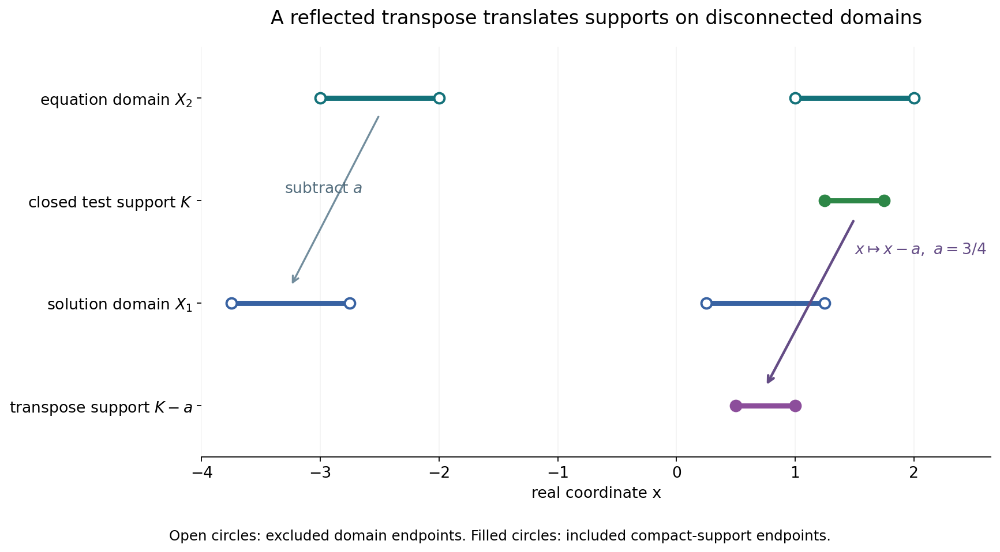
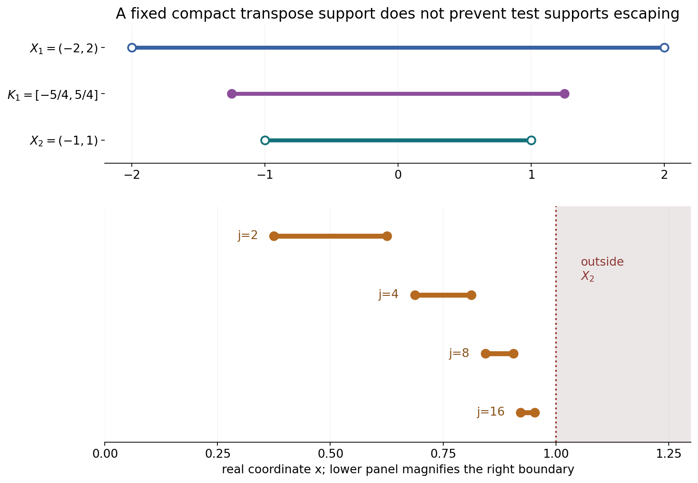

# Smooth forcing, invertible kernels and support confinement

*Written by GPT-6.1 Sol (OpenAI), Ultra reasoning effort, October 2026. Self-checked by the writing AI, GPT-6.1 Sol (OpenAI). Public domain (CC0).*

Two necessary conditions arise when a convolution equation is solvable for smooth forcing. Compact smooth forcing already requires slow Fourier decrease of the kernel. Allowing every smooth forcing also prevents transpose-test supports from escaping toward the boundary while their convolutions remain in a fixed compact set. We explain the common estimate, work through kernels with and without zeros, and exhibit the boundary obstruction.

Basic references are [Grubb's Fourier-distribution notes](https://web.math.ku.dk/~grubb/dist5.pdf), [Melrose's tempered-distribution notes](https://math.mit.edu/~rbm/iml/Chapter1.pdf), and Hörmander's *The Analysis of Linear Partial Differential Operators*, volumes I and II. Read Slow decrease and entire Fourier division for the definition and equivalent characterizations of an invertible compact distribution, and Frequency-selective singularities and smooth convolutions for the arbitrarily localized nonsmooth factor used in the proof. The complete argument below includes the Baire estimate and both necessary conditions.

## 1. Two levels of smooth forcing

Let \(X_1,X_2\subset\mathbb R^n\) be nonempty open sets with
\[
 X_2-\operatorname{supp}\mu\subset X_1.
 \tag{L1}
\]
Our convolution and bilinear transpose are
\[
 (\mu*u)(x)=\mu_y(u(x-y)),\qquad
 \langle\mu*u,v\rangle=\langle u,\check\mu*v\rangle,
 \quad \check\mu(\phi)=\mu(\phi(-\,\cdot)).
 \tag{L2}
\]
The compatibility condition makes the transpose test compactly supported inside \(X_1\). Neither domain needs to be convex or connected.

If every \(f\in C_c^\infty(X_2)\) has a distributional solution on \(X_1\), then \(\mu\) is invertible. One exact formulation is: for some \(A>0\),
\[
 \sup_{|\zeta-c|<A\log(2+|c|)}|F_\mu(\zeta)|
                         >(A+|c|)^{-A}
 \quad(c\in\mathbb R^n,\ \zeta\in\mathbb C^n).
 \tag{L3}
\]
Zeros of \(F_\mu\) are allowed. “Invertible” does not mean that its pointwise reciprocal is entire or that a compact convolution inverse exists.

Under the stronger hypothesis of a distributional solution for every \(f\in C^\infty(X_2)\), one additionally has:
\[
 \begin{gathered}
 \text{for every compact }K_1\subset X_1
       \text{ there is compact }K_2\subset X_2\text{ such that}\\
 v\in C_c^\infty(X_2),\
       \operatorname{supp}(\check\mu*v)\subset K_1
       \ \Longrightarrow\ \operatorname{supp}v\subset K_2.
 \end{gathered}
 \tag{L4}
\]
The compact \(K_2\) is uniform over all such tests \(v\). Conditions (L3) and (L4) are necessary here; their sufficiency on general domains requires additional arguments.

## 2. Why one complete space is enough

Write \(B(f,v)=\int fv\). For fixed \(v\), it is continuous in \(f\). For fixed \(f\), choose a solution \(u_f\), and use
\[
 B(f,v)=u_f(\check\mu*v).
 \tag{L5}
\]
When the transpose tests have one compact support, distributional continuity gives an order and constant that can initially depend on \(f\). Baire's theorem removes that dependence.

The precise lemma requires only completeness of the first variable. With increasing seminorms \(q_N\) on a Fréchet space \(F\) and \(p_M\) on a second vector space \(V\), separate bounds imply
\[
 |B(f,v)|\le Cq_N(f)p_M(v)
 \tag{L6}
\]
for one \(C,N,M\). The closed sets
\(\{f:|B(f,v)|\le m p_m(v)\text{ for all }v\}\)
cover \(F\). One has interior; subtracting two points in that interior and rescaling yields the bound. No continuous choice of solutions and no completeness of \(V\) is required.

For compact forcing, take \(F\) to be the complete space of smooth tests supported in a fixed compact \(K\subset X_2\). The estimate says that every derivative of a regularized compact \(w\) whose transpose convolution is smooth has the same distributional order \(N\). Constants may depend on the derivative. Fourier tests then give
\[
 |\xi^\gamma F_w(\xi)|\le C_\gamma(1+|\xi|)^N
                  \quad\hbox{for every }\gamma.
 \tag{L7}
\]
Taking arbitrarily large coordinate powers makes \(F_w\) rapidly decreasing; Fourier inversion makes \(w\) smooth. The available localized smoothing-factor theorem contradicts this if the kernel is not invertible.

For arbitrary smooth forcing, take \(F=C^\infty(X_2)\). Its resulting seminorm sees only one compact \(K_2\). A test \(v\) nonzero outside \(K_2\) can be detected by \(f=\theta\overline v\) supported there: the seminorm is zero, whereas \(\int fv=\int\theta|v|^2>0\). That proves support confinement.

## 3. Four worked examples

### Example 1: a translated point mass on disconnected domains

Take \(a=3/4\), \(\mu=\delta_a\), and
\[
 X_2=(-3,-2)\cup(1,2),\qquad
 X_1=X_2-a=(-15/4,-11/4)\cup(1/4,5/4).
 \tag{L8}
\]
For every smooth \(f\) on \(X_2\), the smooth function \(u(t)=f(t+a)\) on \(X_1\) satisfies
\[
 (\delta_a*u)(x)=u(x-a)=f(x).
 \tag{L9}
\]
Disconnectedness creates no obstruction for this compatible translated pair.

Its transform is \(F_\mu(\zeta)=e^{-ia\zeta}\), of modulus one on the real axis. In (L3), choose \(A=2\) and use \(\zeta=c\). Then \(1>(2+|c|)^{-2}\), with a positive window radius, proving slow decrease directly.

Also \((\check\mu*v)(t)=v(t+a)\), so its support is \(\operatorname{supp}v-a\). For a compact \(K_1\subset X_1\), choose \(K_2=K_1+a\subset X_2\); this proves (L4) exactly.

Open circles mark the excluded endpoints of the domains in (L8). The closed test support \(K=[5/4,7/4]\) lies in the right component of \(X_2\). Its transpose support is \(K-a=[1/2,1]\), inside the right component of \(X_1\). The arrow subtracts \(a=3/4\); the domain translation and the transpose reflection use the same physical coordinates.

### Example 2: an averaging kernel with characteristic zeros

Let \(\mu\) have density \(1/2\) on \([-1,1]\). Its entire transform is
\[
 F_\mu(\zeta)=\frac{\sin\zeta}{\zeta},\qquad F_\mu(0)=1.
 \tag{L10}
\]
For each real \(c\), choose a nearest point \(t=\pi/2+k\pi\). Then \(|t-c|\le\pi/2\), \(|\sin t|=1\), and
\[
 |F_\mu(t)|=\frac1{|t|}
       \ge\frac1{|c|+\pi/2}>(3+|c|)^{-3}.
 \tag{L11}
\]
The inequality is strict because \(|c|+\pi/2<|c|+3<(3+|c|)^3\). The point lies in the complex window with \(A=3\), since \(3\log(2+|c|)\ge3\log2>\pi/2\). Thus the kernel is invertible despite its infinitely many real zeros.

There is also a direct solution for every compact smooth \(f\) on the real line:
\[
 u(x)=2\sum_{k=0}^{\infty}f'(x-1-2k).
 \tag{L12}
\]
The sum is locally finite, since its arguments eventually lie below the compact support of \(f'\), uniformly on any bounded set of \(x\). Hence \(u\) is smooth. Its average telescopes:
\[
 \begin{aligned}
 (\mu*u)(x)
 &=\sum_{k=0}^{\infty}
       \bigl[f(x-2k)-f(x-2-2k)\bigr]\\
 &=f(x).
 \end{aligned}
 \tag{L13}
\]
Every integration involves only finitely many terms on the compact averaging interval. The formula proves this compact-forcing example; it does not claim that the displayed series remains locally finite for noncompact forcing.

### Example 3: a smooth compact kernel and analytic forcing

Let
\[
 b(y)=
 \begin{cases}
 (1+y/3)e^{-1/(1-4y^2)},&|y|<1/2,\\
 0,&|y|\ge1/2,
 \end{cases}
 \qquad d\mu(y)=b(y)\,dy.
 \tag{L14}
\]
The flat exponential makes every derivative vanish at the endpoints: each derivative is bounded by finitely many powers of \((1-4y^2)^{-1}\) times the decaying exponential. Thus \(b\) is smooth, compactly supported and positive inside its support.

This kernel is not invertible. Fix any candidate \(A>0\). Integration by parts \(m\) times gives
\[
 |F_\mu(\zeta)|\le \|b^{(m)}\|_1|\zeta|^{-m}
                       e^{|\operatorname{Im}\zeta|/2}.
 \tag{L15}
\]
For large real \(c>0\) and \(|\zeta-c|<A\log(2+c)\), one has \(|\zeta|\ge c/2\). Therefore the window supremum is at most
\(2^m\|b^{(m)}\|_1c^{-m}(2+c)^{A/2}\).
Choose an integer \(m>3A/2\). This is \(o(c^{-A})\), violating the lower bound in (L3) for large \(c\). Since \(A\) was arbitrary, the kernel is not slowly decreasing.

The necessity theorem consequently excludes solvability for every compact smooth forcing on any compatible pair of nonempty open domains. Yet the particular analytic forcing \(f(x)=e^x\) has a smooth entire solution on the line:
\[
 d=\int_{-1/2}^{1/2}b(y)e^{-y}\,dy>0,\qquad
 u(x)=e^x/d,\qquad \mu*u=e^x.
 \tag{L16}
\]
Direct integration verifies the identity. Solving selected analytic forcing does not imply the universal compact smooth-forcing hypothesis.

### Example 4: an invertible kernel with a boundary obstruction

Take \(\mu=\delta_0\), \(X_1=(-2,2)\), \(X_2=(-1,1)\). Every compact smooth \(f\) on \(X_2\) extends by zero to a smooth function on \(X_1\), and that extension solves the equation. The kernel is invertible.

Choose a nonzero smooth bump \(\beta\) supported exactly in \([-1,1]\), positive inside, and set for \(j\ge2\)
\[
 v_j(x)=\beta\bigl(4j(x-1+1/j)\bigr),\qquad
 \operatorname{supp}v_j=
       [1-5/(4j),\,1-3/(4j)].
 \tag{L17}
\]
Each test lies in \(C_c^\infty(X_2)\). Its transpose convolution is itself, and all these supports fit in \(K_1=[-5/4,5/4]\subset X_1\). They cannot fit in one compact \(K_2\subset X_2\), since they approach the excluded endpoint \(1\). Condition (L4) fails. Hence the equation cannot be solved distributionally on \(X_1\) for every smooth \(f\) on \(X_2\).

An explicit obstructed forcing is \(f(x)=e^{1/(1-x)}\). Suppose a distribution \(u\) on \(X_1\) agreed with it on \(X_2\). Let \(\chi\) be a nonnegative smooth bump supported in \([-1,1]\), with \(Z=\int\chi>0\), and for small \(h>0\) put
\[
 \phi_h(x)=\chi\bigl((x-1+2h)/h\bigr).
 \tag{L18}
\]
Its support is \([1-3h,1-h]\subset X_2\), inside one fixed compact neighborhood of \(1\) in \(X_1\). Finite distributional order gives \(|u(\phi_h)|\le C h^{-N}\) for fixed \(C,N\). But positivity yields
\[
 u(\phi_h)=\int f\phi_h\ge hZ\,e^{1/(3h)}.
 \tag{L19}
\]
The right side grows faster than every power \(h^{-N}\), a contradiction. For example, the exponential series lower bound of degree \(N+2\) already makes \(h^{N+1}e^{1/(3h)}\) tend to infinity. This forcing is smooth inside \(X_2\), although it has no distributional extension across the endpoint.

For \(j=2,4,8,16\), the bars are the exact closed intervals in (L17). Their right endpoints approach \(1\). The fixed compact \(K_1=[-5/4,5/4]\) belongs to the larger solution domain. The open equation domain excludes \(1\); no single compact subset of it contains the entire test family.

## 4. Exercises and full solutions

The ten exercises total 100 points. Each solution states the hypotheses used in its argument.

**Exercise 1 (10 points; introductory).** For \(\mu=\delta_{-2/3}\), let \(X_2=(0,1)\cup(3,4)\) and \(X_1=X_2+2/3\). Determine the transpose action and one smooth solution for every smooth forcing on \(X_2\). State the support confinement compact associated to \(K_1\subset X_1\).

*Solution.* Here \(a=-2/3\). The transpose kernel is \(\delta_{2/3}\), so \((\check\mu*v)(t)=v(t-2/3)\), with support \(\operatorname{supp}v+2/3\). The solution \(u(t)=f(t-2/3)\) on \(X_1\) satisfies \((\mu*u)(x)=u(x+2/3)=f(x)\). If the transpose support is inside \(K_1\), the original support lies in \(K_2=K_1-2/3\). This is compact inside \(X_2\). No convexity or connectedness has entered. On real frequencies the transform has modulus one, and \(A=2\) in (L3) gives a strict lower bound.

**Exercise 2 (10 points; intermediate).** Verify (L12)–(L13) for an arbitrary compact smooth \(f\). Explain why replacing “compact smooth” by “smooth” in the locally finite series argument is unjustified.

*Solution.* Let \(\operatorname{supp}f\subset[-R,R]\). On a bounded interval of \(x\), the values \(x-1-2k\) eventually lie below \(-R\), uniformly for all \(x\) there, so every derivative of the sum is locally finite. For each \(k\),
\[
 \frac12\int_{-1}^{1}2f'(x-y-1-2k)\,dy
                  =f(x-2k)-f(x-2-2k).
 \tag{S1}
\]
The factor \(1/2\) cancels the prefactor \(2\). Relabel the second term in the finite sum to obtain \(f(x)-f(x-2L-2)\) after indices \(0,\ldots,L\). For sufficiently large \(L\) the final value is zero. This proves the identity everywhere. A general smooth function need not vanish at any of those negative arguments; for \(f(x)=e^{-x}\), even the terms in (L12) grow exponentially with \(k\). The particular series then does not define a solution, irrespective of what another solvability theorem might provide.

**Exercise 3 (8 points; intermediate).** Show directly that the averaging kernel satisfies (L3) with \(A=3\). At the center \(c=\pi\), identify a point of its window where its transform is nonzero.

*Solution.* The grid \(\pi/2+k\pi\) has spacing \(\pi\), so every real \(c\) lies within \(\pi/2\) of some grid point \(t\). Its sine has modulus one, and \(|t|\le|c|+\pi/2\). Since \(3\log2>\pi/2\), the point is strictly inside the window. Inequality (L11) gives the required strict lower bound. At \(c=\pi\), either \(t=\pi/2\) or \(t=3\pi/2\) works. Although \(F_\mu(\pi)=0\), these nearby values are \(2/\pi\) and \(-2/(3\pi)\), respectively. The theorem concerns a window supremum, not the value at its center.

**Exercise 4 (10 points; advanced).** Reconstruct the complete-first-variable argument for (L6). Address a nonzero \(f\) whose chosen seminorm \(q_N(f)\) is zero, and state whether completeness of \(V\) is needed.

*Solution.* The sets \(E_m=\{f:|B(f,v)|\le m p_m(v)\text{ for all }v\}\) are closed because \(B(\,\cdot\,,v)\) is continuous for each \(v\). They cover the complete first space by the separate bound and monotonicity of the second seminorms. Baire supplies \(f_0+\{h:q_N(h)<\delta\}\subset E_m\). Subtracting the inequalities for \(f_0+h\) and \(f_0\) gives \(2m p_m(v)\). For positive \(q_N(f)\), scaling by \(\delta/(2q_N(f))\) gives \(4m q_N(f)p_m(v)/\delta\). If \(q_N(f)=0\), every multiple \(tf\) lies in the neighborhood, so \(|t||B(f,v)|\le2m p_m(v)\) for arbitrary \(t\). Hence \(B(f,v)=0\). The closed sets and the Baire theorem belong to \(F\); neither completeness nor a Hausdorff topology on \(V\) is used.

**Exercise 5 (10 points; advanced).** In two real dimensions suppose that for every multi-index \(\gamma\),
\(|\xi^\gamma F(\xi)|\le C_\gamma(1+|\xi|)^3\).
Prove a bound \(|F(\xi)|\le C_r(1+|\xi|)^{-r}\) for any integer \(r\ge0\), assuming continuity on bounded sets.

*Solution.* For \(|\xi|\ge1\), one of its coordinates has modulus at least \(|\xi|/\sqrt2\). Choose \(\gamma=(3+r)e_k\) for that coordinate. The two corresponding constants have a finite maximum \(C_*\). Thus
\[
 |F(\xi)|\le C_*2^{(3+r)/2}|\xi|^{-3-r}
                  (1+|\xi|)^3
           \le C_*2^{(3+r)/2+3+r}(1+|\xi|)^{-r}.
 \tag{S2}
\]
We used \((1+|\xi|)^3\le2^3|\xi|^3\) and
\(|\xi|^{-r}\le2^r(1+|\xi|)^{-r}\). Continuity bounds \(F\) on the unit ball, so increasing the constant includes bounded frequencies. The constants need not be uniform over all \(\gamma\); for each \(r\), only the two chosen derivatives are used. The exponent \(3\) is fixed independently of \(\gamma\).

**Exercise 6 (8 points; intermediate).** Why does rapid real Fourier decay imply smoothness of a compact distribution? State an integrability exponent sufficient to obtain a derivative of order \(m\), and retain the inverse Fourier factor.

*Solution.* Choose an integer \(r>n+m\). Then the estimate \(|F_w(\xi)|\le C_r(1+|\xi|)^{-r}\) makes \(|\xi|^mF_w(\xi)\) integrable; radial shell integration compares its tail to \(\int_1^\infty t^{n-1+m-r}\,dt\), which converges. The function
\[
 W(x)=(2\pi)^{-n}\int e^{ix\cdot\xi}F_w(\xi)\,d\xi
 \tag{S3}
\]
has every derivative of order at most \(m\) by differentiation under the integrable bound. Dominated convergence makes them continuous. As \(m\) is arbitrary, \(W\) is smooth. Schwartz inversion on a test \(\phi\), with uniform convergence of the finitely many derivatives needed by the distribution, gives
\(w(\phi)=(2\pi)^{-n}\int F_w(\xi)F_\phi(-\xi)\,d\xi=\int W\phi\).
Thus \(w=W\) as distributions. Both the factor and the reflected test frequency are necessary for this bilinear convention.

**Exercise 7 (10 points; intermediate).** Choose a point and radius for the localized smoothing factor in the disconnected domain \(X_2=(-3,-2)\cup(1,2)\). Show how its exact location and radius allow the necessity proof to work without convexity.

*Solution.* Take \(x_0=3/2\), \(a=1/8\), and \(K=[5/4,7/4]\). Then \(\overline B_a(x_0)=[11/8,13/8]\) lies in the interior of \(K=\overline B_{2a}(x_0)\), and \(K\subset(1,2)\subset X_2\). Noninvertibility of the reflected kernel would give a compact continuous \(w\) supported in the inner interval, not of class \(C^1\), whose reflected convolution is smooth. The fixed-support Baire estimate applies on this \(K\). Small mollifiers stay in \(K\), every derivative obtains the common order, and Fourier decay makes \(w\) smooth, contradicting the chosen factor. All support gaps occur inside one component; no convex hull of the whole disconnected domain is required.

**Exercise 8 (8 points; intermediate).** In Theorem 5.1, show that the test \(f=\theta\overline v\) detects a nonzero value outside \(K_2\). Explain why the argument cannot use a test topology with a different compact set for each \(v\).

*Solution.* If \(v(x_0)\ne0\) outside the closed compact \(K_2\), choose a small ball about \(x_0\) disjoint from \(K_2\) and inside \(X_2\). Take a nonnegative smooth \(\theta\) supported there and positive at \(x_0\). All derivatives of \(f=\theta\overline v\) vanish near \(K_2\), so \(q_N(f)=0\). Continuity of \(v\) makes \(\theta|v|^2\) positive on a smaller open neighborhood; hence \(\int fv=\int\theta|v|^2>0\), contradicting the uniform estimate. If the observation compact depended on \(v\), it could include this very support, and its seminorm need not vanish. Baire in the complete full smooth-forcing space supplies one compact for every admissible \(v\), which is precisely the confinement conclusion.

**Exercise 9 (8 points; advanced).** For the smooth density in (L14), choose a derivative order that defeats a proposed slow-decrease constant \(A=4\). Explain why the integration-by-parts bound is valid for complex frequencies.

*Solution.* The support radius is \(1/2\). Take \(m=7>3A/2=6\). For complex \(\zeta\ne0\), integration by parts gives
\((i\zeta)^mF_b(\zeta)=F_{b^{(m)}}(\zeta)\).
All boundary terms vanish because the density and every derivative are flat at the support endpoints. The right side is bounded by
\(\|b^{(m)}\|_1e^{|\operatorname{Im}\zeta|/2}\), yielding (L15). In the \(A=4\) logarithmic window, \(|\zeta|\ge c/2\) for all sufficiently large positive \(c\), so the supremum is at most \(2^7\|b^{(7)}\|_1c^{-7}(2+c)^2=O(c^{-5})\). This is smaller than \((4+c)^{-4}\) for sufficiently large \(c\). An arbitrary \(A>0\) is defeated by any integer \(m>3A/2\), so failure is not restricted to the chosen constant.

**Exercise 10 (18 points; advanced).** Show that a point mass cannot have all its derivatives bounded by one fixed smooth-test order \(N\), even with a different constant for every derivative. Then prove both the support escape and explicit forcing obstruction in Example 4.

*Solution.* Choose a smooth cutoff \(\eta\) equal to one near zero and supported in \((-1,1)\), and set \(P(t)=t^{N+1}\eta(t)\). For \(0<h\le1\), put \(f_h(x)=h^N P(x/h)\). Each test is supported in \([-h,h]\). For \(0\le k\le N\),
\[
 \|f_h^{(k)}\|_\infty
     =h^{N-k}\|P^{(k)}\|_\infty
     \le\max_{0\le k\le N}\|P^{(k)}\|_\infty,
 \quad
 |(\delta_0^{(N+1)})(f_h)|=(N+1)!/h.
 \tag{S4}
\]
The last equality uses the bilinear distributional derivative sign, whose modulus is one, and \(P^{(N+1)}(0)=(N+1)!\). Thus no finite constant for that one derivative can bound it by the fixed \(N\)-order seminorm. Constants depending on the derivative do not repair the missing order.

For Example 4, the support intervals in (L17) are contained in \(X_2\) for every \(j\ge2\) and in the fixed \(K_1\). Their right endpoints tend to \(1\). A compact \(K_2\subset(-1,1)\) has a positive distance from \(1\), so one sufficiently large \(j\) puts a point of \(\operatorname{supp}v_j\) above every point of \(K_2\). Confinement fails, although \(\delta_0\) is invertible and compact forcing extends by zero.

Finally a hypothetical distributional extension of \(f=e^{1/(1-x)}\) has finite order \(N\) on the fixed compact neighborhood of \(1\) that contains every \(\phi_h\). Scaling gives the upper bound \(Ch^{-N}\). Since \(\phi_h\ge0\), its mass is \(hZ\), and \(1-x\le3h\) on its support, integration gives the lower bound \(hZ e^{1/(3h)}\). The ratio to \(h^{-N}\) is at least \(Z h^{N+1}e^{1/(3h)}\), which tends to infinity by the exponential-series term of degree \(N+2\). This contradicts the finite-order bound. The obstruction concerns growth at the excluded endpoint, not a lack of smoothness inside the forcing domain.

## References

- Gerd Grubb, *Distributions and Operators*, Chapter 5, “Fourier transformation of distributions,” freely readable [lecture notes](https://web.math.ku.dk/~grubb/dist5.pdf).
- Richard B. Melrose, *Introduction to Microlocal Analysis*, MIT, 2007, Chapter 1, “Tempered distributions and the Fourier transform,” freely readable [notes](https://math.mit.edu/~rbm/iml/Chapter1.pdf).
- Lars Hörmander, *The Analysis of Linear Partial Differential Operators I: Distribution Theory and Fourier Analysis*, second edition, Springer, 1990.
- Lars Hörmander, *The Analysis of Linear Partial Differential Operators II: Differential Operators with Constant Coefficients*, Springer, 1983.
- The complete proof below supplies the shared Baire lemma, fixed-support regularization, rapid Fourier decay and full smooth-forcing support confinement. Its exact earlier localized-smoothing and slow-decrease theorems are linked in the introduction.
