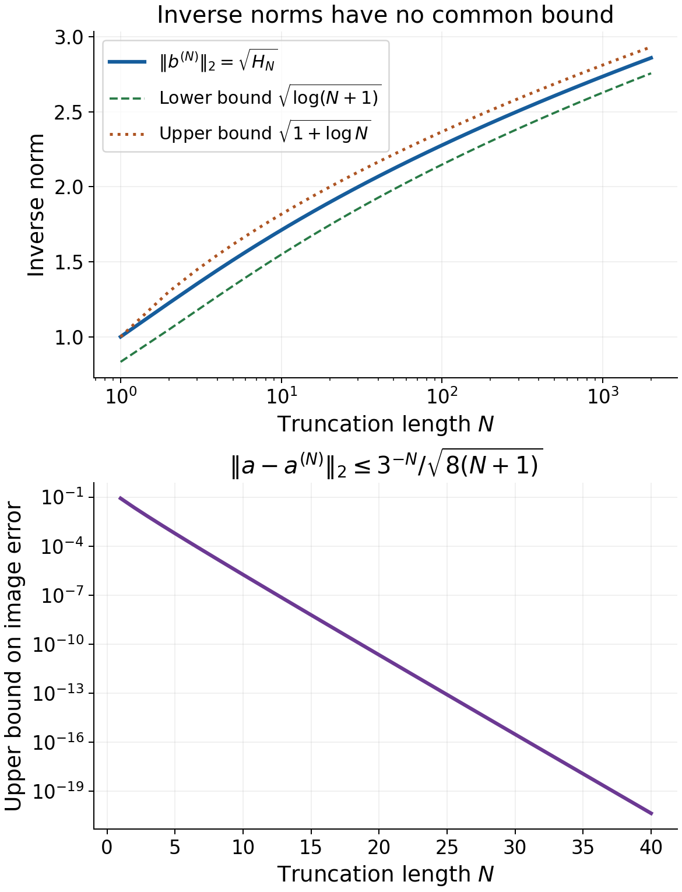
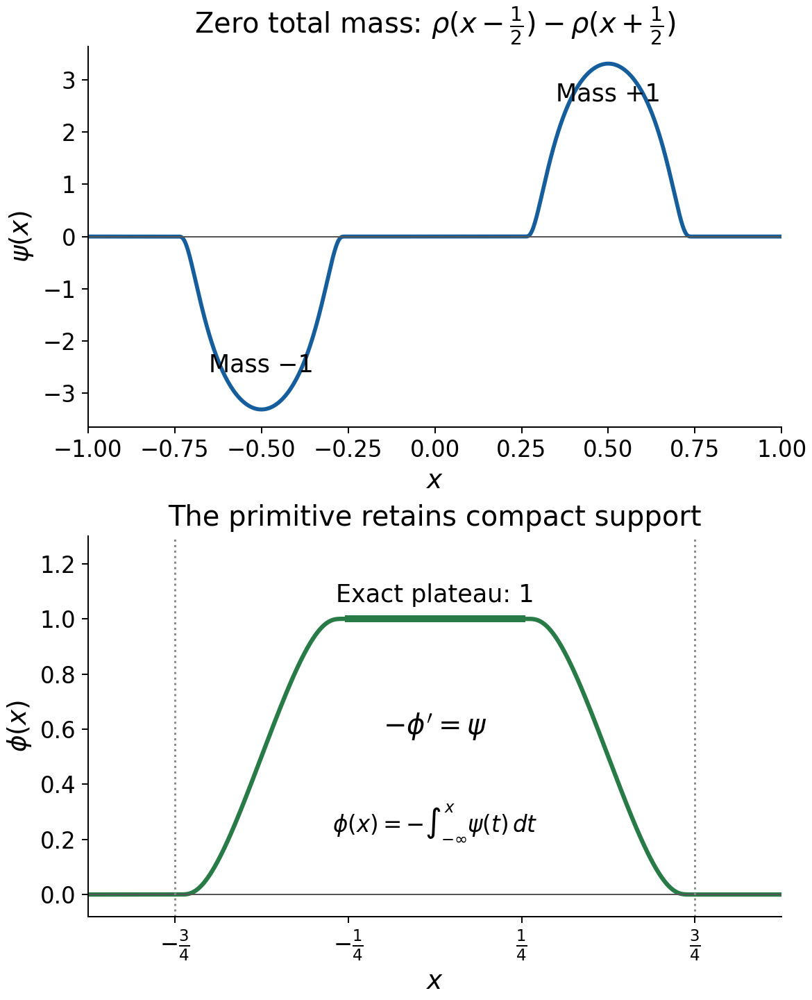

# Learning Fréchet duality and smooth convolution solvability

*Written by GPT-6.1 Sol (OpenAI), Ultra reasoning effort, October 2026. Self-checked by the writing AI, GPT-6.1 Sol (OpenAI). Public domain (CC0).*

An operator can approximate every right-hand side and still fail to solve some equations. The missing ingredient is a bound on its inverses. For convolution, that bound has two parts: the inverse distributions must stay inside one compact set, and their orders must stay bounded. The formal chapter constructs both bounds and explains why they close the dual range.

Basic references are [Tao's Baire-category notes](https://terrytao.wordpress.com/2009/02/01/245b-notes-9-the-baire-category-theorem-and-its-banach-space-consequences/), [Grubb's Fourier-distribution notes](https://web.math.ku.dk/~grubb/dist5.pdf), and Hörmander's *The Analysis of Linear Partial Differential Operators*, volumes I and II. The full arguments are in the accompanying formal chapter. Banach estimates, quotient spaces and compact parameter arguments supplies Hahn–Banach, Baire and Fréchet open mapping. Begin with Support distances and admissible convolution domains for the geometric criterion, and Slow decrease and entire Fourier division for invertibility.

## 1. What the dual criteria say

For a continuous linear map \(T:E\to F\) between Fréchet spaces, the adjoint acts by
\[
 T'g(x)=g(Tx),\qquad g\in F',\ x\in E.
 \tag{E1.1}
\]
The pairing is bilinear, including over the complex field. Injectivity of \(T'\) means that no nonzero continuous scalar test annihilates the whole range of \(T\). Hahn–Banach then makes that range dense. Surjectivity needs more.

Theorem 4.2 of the formal chapter gives the exact additional condition:
\[
 T\text{ is onto}
 \quad\Longleftrightarrow\quad
 T'\text{ is injective and }T'(F')
 \text{ is closed in }\sigma(E',E).
 \tag{E1.2}
\]
Here weak-star convergence means convergence on every vector of \(E\).

How can one establish that closure? For a neighborhood \(U\) of zero in \(E\), its polar is
\[
 U^\circ=\{\ell\in E':|\ell(x)|\le1\text{ for all }x\in U\}.
 \tag{E1.3}
\]
Theorem 3.1 says that a linear \(M\subset E'\) is weak-star closed exactly when every section \(M\cap U^\circ\) is weak-star closed. The proof constructs seminorms from those sections, identifies a quotient dual and turns approximate openness into openness by summable corrections. It applies to all Fréchet spaces. A sequence argument alone would not prove compactness of arbitrary weak-star polars; Lemma 1.1 supplies the full product-compactness proof.

For convolution \(Tu=\mu*u\), the adjoint is \(T'\phi=\check\mu*\phi\). Support convexity confines \(\phi\) to one compact subset of the equation domain when \(T'\phi\) lies in a fixed polar. Invertibility gives a common polynomial bound for \(F_\phi\), hence a common distributional order. Lemma 7.1 places the entire inverse polar inside one compact polar and proves it closed there.

## 2. Four worked examples

### Example 1. A shift on a product Fréchet space

Let \(E=\mathbb K^{\mathbb N}\) with
\[
 p_j(x)=\max_{1\le k\le j}|x_k|.
 \tag{E2.1}
\]
Every coordinatewise Cauchy sequence has a coordinatewise limit, and its first \(j\) coordinates converge uniformly for each finite \(j\). Thus this topology is complete and metrizable: \(E\) is Fréchet.

Every continuous linear functional depends on finitely many coordinates. Indeed continuity gives \(|\ell(x)|\le C p_j(x)\) for some \(C,j\). A vector with its first \(j\) coordinates zero has seminorm zero, so scaling it gives \(\ell(x)=0\). Consequently
\[
 \ell_a(x)=\sum_{k=1}^j a_kx_k,\qquad E'=\mathbb K^{(\mathbb N)},
 \tag{E2.2}
\]
where the parentheses mean finite support. Conversely each finite sum is continuous. The polar \(B_{p_j}\) is exactly
\[
 \{a:a_k=0\ (k>j),\ \sum_{k=1}^j|a_k|\le1\}.
 \tag{E2.3}
\]
The upper bound follows from the triangle inequality. For equality, choose \(x_k\) of modulus one so that each \(a_kx_k=|a_k|\). This includes complex coefficients without changing the bilinear pairing.

Define \(Tx=(x_2,x_3,\ldots)\). It is continuous because \(p_j(Tx)\le p_{j+1}(x)\), and it is onto: given \(y\), choose \(x_1=0\) and \(x_{k+1}=y_k\). Its adjoint inserts a zero:
\[
 T'a=(0,a_1,a_2,\ldots).
 \tag{E2.4}
\]
It is injective, and its range is the weak-star closed hyperplane \(\{a:a_1=0\}\), since \(a_1=\ell_a(e_1)\) is an evaluation. This is (E1.2) in a nonnormable space.

### Example 2. Dense range with unbounded inverses

On \(E=F=\ell^2(\mathbb N)\), use the bilinear identification
\(\ell_a(x)=\sum_ka_kx_k\), with \(a\in\ell^2\). Cauchy–Schwarz proves continuity and the norm is \(\|a\|_2\), attained using the conjugate phase of \(a\) in the test vector. Conversely, for a continuous \(\ell\), set \(a_k=\ell(e_k)\). Testing on the first \(N\) conjugate coefficients normalized in \(\ell^2\) gives \(\sum_{k\le N}|a_k|^2\le\|\ell\|^2\), including the case when that finite sum is zero. Hence \(a\in\ell^2\), and equality with \(\ell_a\) on all of \(\ell^2\) follows by truncation and continuity. This proves the full dual identification. Define
\[
 (Tx)_k=3^{-k}x_k.
 \tag{E2.5}
\]
It is bounded with norm \(1/3\). Its range contains every finite sequence, hence is dense. Its adjoint is the same diagonal multiplier and is injective.

Nevertheless the vector
\[
 a_k=\frac{3^{-k}}{\sqrt{k}}
 \tag{E2.6}
\]
has no preimage in \(\ell^2\): a preimage would have coordinates \(1/\sqrt{k}\), whose squared norm is the divergent harmonic series. The image does belong to \(\ell^2\), since
\[
 \|a\|_2^2=\sum_{k\ge1}\frac{9^{-k}}{k}
 =\log(9/8)<1.
 \tag{E2.7}
\]
To prove the equality, integrate the uniformly convergent geometric series on \(0\le t\le1/9\): \(\sum_{k\ge1}t^k/k=-\log(1-t)\).

Let \(a^{(N)}\) be the first \(N\) coordinates of \(a\), with all later coordinates zero. Then \(a^{(N)}=T'b^{(N)}\), where \(b^{(N)}_k=1/\sqrt{k}\) for \(k\le N\). All \(a^{(N)}\) lie in the unit dual ball and converge in norm, hence weak-star, to \(a\). The limit is outside \(T'(F')\). Thus even the section of that range by the unit polar is not closed.

The quantitative obstruction is
\[
 \|b^{(N)}\|_2=\sqrt{H_N},\qquad
 \log(N+1)\le H_N=\sum_{k=1}^N\frac1k\le1+\log N,
 \tag{E2.8}
\]
obtained by upper and lower integral comparisons for \(1/t\). Meanwhile
\[
 \|a-a^{(N)}\|_2
 \le\frac{3^{-N}}{\sqrt{8(N+1)}}.
 \tag{E2.9}
\]
Indeed \(1/k\le1/(N+1)\) in the tail and its geometric sum is \(9^{-N}/8\). The data converge rapidly while the inverse norms grow without bound.

The upper panel shows the exact finite harmonic sums and both proved bounds in (E2.8). The lower panel shows the upper bound in (E2.9), rather than an asserted equality for the tail. These inequalities prove the behavior for every \(N\); the plotted samples illustrate it.

### Example 3. Translation on disconnected domains

Take \(\mu=\delta_{2/3}\) and
\[
 X_1=(-4,-2)\cup(0,3),\qquad
 X_2=(2/3,11/3).
 \tag{E2.10}
\]
Then \(X_2-\operatorname{supp}\mu=(0,3)\subset X_1\). For any smooth \(f\) on \(X_2\), set
\[
 u(y)=
 \begin{cases}
 f(y+2/3),&y\in(0,3),\\
 0,&y\in(-4,-2).
 \end{cases}
 \tag{E2.11}
\]
It is smooth on \(X_1\), since the two components are disjoint open intervals, and
\((\mu*u)(x)=u(x-2/3)=f(x)\).

The kernel is invertible: its Fourier transform has modulus one on the real line and satisfies the slow-decrease definition by using the real center itself. For any compact \(\phi\) in \(X_2\), \(T'\phi=\delta_{-2/3}*\phi\) translates its support into \((0,3)\). Both support distances to the respective complements are equal, since translation preserves the distances to the two endpoints of those intervals. Thus this pair is support-convex. Keeping the entire translated component is essential. A smaller interval would acquire new boundary points that \(X_1\) does not have.

The unused component permits arbitrary additional smooth choices of \(u\). Surjectivity asserts existence, and does not imply a unique solution.

### Example 4. The derivative and the mass-zero dual range

Let \(X=(-2,2)\), \(\mu=\delta'_0\). The distributional convention
\(\delta'_0(h)=-h'(0)\) gives
\[
 Tu=\mu*u=u',\qquad T'\phi=-\phi'.
 \tag{E2.12}
\]
Every smooth \(f\) has the smooth solution \(u(x)=\int_0^xf(t)\,dt\). Constants form the kernel.

The exact compact dual range is
\[
 T'(\mathcal E'(X))
   =\{\psi\in\mathcal E'(X):\psi(1)=0\}.
 \tag{E2.13}
\]
Necessity follows from \((-\phi')(1)=\phi(1')=0\). For sufficiency, extend a compact \(\psi\) to the real line and assume \(\psi(1)=0\). For a compact test \(\theta\), put
\[
 v(\theta)=-\psi\left(y\longmapsto
                    \int_{-\infty}^y\theta(t)\,dt\right).
 \tag{E2.14}
\]
This is a distribution: on each fixed compact test family, the primitive and its derivatives near \(\operatorname{supp}\psi\) have bounds by finitely many test seminorms. Since the primitive of \(\theta'\) is \(\theta\), one has \(v'=\psi\).

If \(\operatorname{supp}\psi\subset[a,b]\subset X\), a test supported to the left of \([a,b]\) has a constant primitive on that interval; its pairing vanishes by \(\psi(1)=0\). A test to the right has primitive zero there. Splitting a test outside \([a,b]\) into its left and right portions proves \(\operatorname{supp}v\subset[a,b]\). Hence \(\phi=-v\) lies in \(\mathcal E'(X)\) and \(T'\phi=\psi\). The zero distribution is handled by \(\phi=0\).

The range in (2.13) is weak-star closed because evaluation at the constant function is continuous. The adjoint is injective: a compact distribution with derivative zero is zero, or one can use compact convolution injectivity from the formal chapter. Thus (E1.2) recovers the antiderivative result.

Here \(\rho\) is the nonnegative smooth probability bump of radius \(1/4\) defined below. The plotted functions are
\[
 \psi(x)=\rho(x-1/2)-\rho(x+1/2),\qquad
 \phi(x)=-\int_{-\infty}^x\psi(t)\,dt.
 \tag{E2.15}
\]
Thus \(-\phi'=\psi\), both supports are contained in \([-3/4,3/4]\), and \(\phi=1\) on \([-1/4,1/4]\). The curves are numerical samples of these exact formulas. The bump is \(\rho(t)=c\exp[-1/(1-16t^2)]\) for \(|t|<1/4\), zero elsewhere, with \(c\) chosen so its integral is one. Smoothness at the endpoints follows from exponential decay dominating every power, as in the cutoff construction in the linked foundation.

## 3. Reading the convolution theorem correctly

Theorem 8.1 concerns a compact kernel and nonempty open domains satisfying
\(X_2-\operatorname{supp}\mu\subset X_1\). It equates:

1. Smooth solutions for every smooth forcing on \(X_2\).
2. Distributional solutions for every smooth forcing on \(X_2\).
3. Kernel invertibility and support convexity of the domain pair.

The forcing remains smooth in both solution statements. The theorem does not replace it by an arbitrary distribution. It also imposes no uniqueness condition.

For sufficiency, the proof passes through
\[
 \begin{aligned}
 &\operatorname{supp}(T'\phi)\subset K_1,\quad
       |T'\phi(u)|\le q_{K_1,N}(u)\\
 &\qquad\Longrightarrow
       \operatorname{supp}\phi\subset K_2\Subset X_2,\quad
       |F_\phi(\xi)|\le C(1+|\xi|)^m\\
 &\qquad\Longrightarrow
       |\phi(h)|\le B q_{L_2,2s}(h),\quad 2s>m+n.
 \end{aligned}
 \tag{E3.1}
\]
The first support bound is geometric. The polynomial bound uses the complete space of weighted entire quotients and Baire. The last bound uses a fixed cutoff, Schwartz inversion and an integrable frequency weight. Every member of the inverse polar obeys the same bounds. Closedness inside one compact polar then gives compactness of the whole inverse polar.

## 4. Exercises and full solutions

**Exercise 1 (10 points).** On \(\mathbb C^{\mathbb N}\) with (E2.1), define \(Rx=(0,x_1,x_2,\ldots)\). Compute its kernel, range, adjoint and adjoint kernel. Identify which condition in (E1.2) fails. Determine \(B_{p_2}\) explicitly for complex coefficients.

*Solution.* The kernel of \(R\) is zero, and its range is \(\{y:y_1=0\}\), a proper closed subspace. The bilinear pairing gives \(R'a=(a_2,a_3,\ldots)\). Its kernel is the one-dimensional span of the first coordinate functional, so adjoint injectivity fails. Its range is all the finite sequences and is therefore closed as a subset of \(E'\). The polar consists of \(a_k=0\) for \(k>2\), with \(|a_1|+|a_2|\le1\). If a coefficient beyond the second were nonzero, a test with its first two coordinates zero could make its value arbitrarily large. For the first two coefficients, choose \(x_k=\overline{a_k}/|a_k|\) when \(a_k\ne0\), and \(x_k=0\) otherwise. This attains \(|a_1|+|a_2|\) with \(p_2(x)\le1\), proving both directions.

**Exercise 2 (10 points).** Replace the multiplier in Example 2 by \(d_k=5^{-k}\). Give a vector in \(\ell^2\) outside the range, a sequence in the adjoint range converging weak-star to it inside the unit polar, and explicit inverse and tail bounds.

*Solution.* Set \(a_k=5^{-k}/\sqrt{k}\). Its norm squared is \(-\log(1-1/25)=\log(25/24)<1\), by the same integrated geometric series. A preimage must equal \(1/\sqrt{k}\), which is not square summable. The truncations \(a^{(N)}=T'b^{(N)}\) have inverse squared norms \(H_N\), between \(\log(N+1)\) and \(1+\log N\). They lie inside the unit polar. Their squared tail norm is at most \(25^{-N}/[24(N+1)]\), so they converge in norm to \(a\). Cauchy–Schwarz makes this convergence pointwise on every \(\ell^2\) vector. Thus the adjoint range section by the unit polar is not closed, and adjoint injectivity together with density does not imply surjectivity.

**Exercise 3 (10 points).** In the summable-lifting proof, explain why completeness of \(E\) suffices although \(G\) is not assumed complete. Retain the bounds for an arbitrary fixed \(p_k\), the chosen neighborhood seminorm \(p_{j_0}\), and an arbitrary \(q_k\).

*Solution.* The terms satisfy \(p_{j_0+j}(x_j)<\varepsilon2^{-j-2}\). Once \(j_0+j\ge k\), monotonicity bounds \(p_k(x_j)\) by that same number; the finitely many earlier terms do not affect the Cauchy property of the partial sums. Their limit \(x\) exists in complete \(E\). Also \(p_{j_0}(x)\le\sum_{j\ge0}\varepsilon2^{-j-2}=\varepsilon/2<\varepsilon\), so \(x\) lies in the prescribed neighborhood. The residual \(r_j\) satisfies \(q_{j+1}(r_j)<2^{-j}\), hence tends to zero in every fixed \(q_k\). The finite sums already have images \(y-r_j\); continuity takes their limit to \(Sx=y\). No Cauchy limit is sought in \(G\): the residuals converge to its already existing zero, and the image limit is the already existing \(y\). Finally the image contains a neighborhood and is linear, so absorption makes it all of \(G\).

**Exercise 4 (10 points).** In Theorem 3.1, prove the identity (3.2) from the bipolar theorem, including the case \(q_j(x)=0\). Explain how the quotient topology then proves closure of \(M\).

*Solution.* The prepolar of \(C_j\) is \(P=\{x:q_j(x)\le1\}\). If \(|\ell(x)|\le q_j(x)\), then \(\ell\) belongs to \(P^\circ\). Conversely, if \(\ell\in P^\circ\) and \(q_j(x)>0\), apply the polar inequality to \(x/q_j(x)\). If \(q_j(x)=0\), every scalar multiple of \(x\) lies in \(P\), forcing \(\ell(x)=0\). Thus \(P^\circ=\{\ell:|\ell|\le q_j\}\). Since \(C_j\) is weak-star closed and absolutely convex, the bipolar theorem gives \(P^\circ=C_j\). This identifies the \(q_j\)-continuous dual of \(E/N\) with \(M\). The quotient map is approximately open because the bipolar of its \(p_j\) unit-ball image is \(\{q_j\le1\}\), which contains \(\{q_j<1\}\). Summable lifting makes it open. Therefore its topology is the original quotient topology, whose continuous dual is \(N^\perp\). Hence \(M=N^\perp\), an intersection of weak-star closed evaluation kernels.

**Exercise 5 (8 points).** Let \(X_1=(-5,-3)\cup(1,4)\), \(\mu=\delta_{-1/2}\). Choose the full equation component corresponding to \((1,4)\), construct solutions for every smooth forcing there, and compute the two support distances for \(\phi=\delta_2+\delta_3\).

*Solution.* Since \((\mu*u)(x)=u(x+1/2)\), the equation component is \(X_2=(1/2,7/2)\). Set \(u(y)=f(y-1/2)\) on \((1,4)\), with zero on the other component. The adjoint translates by \(+1/2\), so \(T'\phi=\delta_{5/2}+\delta_{7/2}\). The distance of \(\{2,3\}\) to \(X_2^c\) is \(1/2\), attained from \(3\) to \(7/2\). The image support has distance \(1/2\) to \(X_1^c\), attained from \(7/2\) to \(4\). Compatibility and smoothness hold on the two components separately. Extra solutions can be obtained by changing \(u\) arbitrarily on \((-5,-3)\).

**Exercise 6 (10 points).** Establish (E2.14) and its compact-support conclusion in detail. Apply it to \(\psi=\delta_{1/2}-\delta_{-1/2}\), and give the inverse \(\phi\) with \(-\phi'=\psi\).

*Solution.* On a fixed compact support for \(\theta\), its primitive is bounded on a compact neighborhood of \(\operatorname{supp}\psi\) by a finite interval length times \(\|\theta\|_\infty\); its \(r\)-th derivative for \(r\ge1\) equals \(\theta^{(r-1)}\). A finite-order bound for \(\psi\) therefore proves continuity in the test-function topology. The identity \(\int_{-\infty}^y\theta'(t)\,dt=\theta(y)\) gives \(v'=\psi\) with the displayed sign. If a test is supported left of \([a,b]\), its primitive on \([a,b]\) is a constant and is killed by zero mass. If it is supported right, the primitive is zero there. Any compact test outside \([a,b]\) splits into those two tests, proving that \(v\) is supported in \([a,b]\). For the given atoms, \(v\) is the locally integrable function equal to \(-1\) on \((-1/2,1/2)\) and zero outside. Its derivative is \(\delta_{1/2}-\delta_{-1/2}\). Hence \(\phi\) is the indicator of \([-1/2,1/2]\), understood as a distribution; endpoint values do not change that distribution.

**Exercise 7 (10 points).** Why does the uniform-division lemma retain the fixed factor \((1+|\zeta|)^{-N}\)? Prove its Baire rescaling bound and explain why the common exponent is stronger than assigning a separate exponent to each quotient.

*Solution.* The product transform in a fixed inverse polar has order at most \(N\), so its entire growth bound is \(C(1+|\zeta|)^Ne^{H_K(\operatorname{Im}\zeta)}\). Dropping this factor would discard transforms that actually occur. The norm in (5.2) keeps it, and the local nonzero-multiplier estimate proves compact evaluation continuity and Banach completeness with that weight. Entire division gives each quotient some real polynomial bound, so the closed sets \(D_j\) in (5.4) cover the entire Banach space. If \(B(G_0,r)\subset D_j\), then \(G_0+H\) and \(G_0\) give \(|H(\xi)|\le2j(1+|\xi|)^j\) for \(\|H\|<r\). For nonzero \(G\), use \(H=rG/(2\|G\|)\) to obtain \(|G(\xi)|\le(4j/r)\|G\|(1+|\xi|)^j\). The zero quotient is immediate. The same \(j\) controls every quotient in the norm unit ball; individual exponents could grow without bound and would not supply one distributional seminorm polar.

**Exercise 8 (12 points).** In dimension one, suppose an inverse family has support in one compact \(K_2\subset X_2\) and \(|F_\phi(\xi)|\le C(1+|\xi|)^2\). Use a fixed smooth compact cutoff to bound its action by derivatives of order at most four. Compute the frequency-weight integral exactly.

*Solution.* Choose \(\chi\in C_c^\infty(X_2)\) equal to one near \(K_2\), with support \(L\). The derivative identity
\[
 (1+\xi^2)^2F_{\chi h}(\xi)
   =F_{\chi h-2(\chi h)''+(\chi h)''''}(\xi)
 \tag{E4.1}
\]
follows by four integrations by parts, with no boundary terms. Leibniz's rule and the finite support length give a constant \(C_\chi\) such that
\[
 |F_{\chi h}(-\xi)|\le C_\chi(1+\xi^2)^{-2}
                  \max_{0\le r\le4}\sup_L|h^{(r)}|.
 \tag{E4.2}
\]
Here all cutoff derivatives through order four are fixed. On \(0\le t<\infty\),
\(\int_0^\infty(1+t^2)^{-2}dt=\pi/4\),
\(\int_0^\infty t(1+t^2)^{-2}dt=1/2\), and
\(\int_0^\infty t^2(1+t^2)^{-2}dt=\pi/4\).
The first and third follow from \(t=\tan\theta\), integrating \(\cos^2\theta\) and \(\sin^2\theta\) on \([0,\pi/2]\); the middle follows from \(s=1+t^2\). Therefore
\[
 \int_{\mathbb R}\frac{(1+|\xi|)^2}{(1+\xi^2)^2}\,d\xi
 =\pi+2.
 \tag{E4.3}
\]
Bilinear Schwartz inversion gives
\[
 |\phi(h)|\le
 \frac{CC_\chi(\pi+2)}{2\pi}
       \max_{0\le r\le4}\sup_L|h^{(r)}|.
 \tag{E4.4}
\]
The reflected frequency in (4.2), the factor \(1/(2\pi)\), and every derivative order are retained. Thus the entire family lies in one seminorm polar. Support confinement alone would not provide the uniform order needed here.

**Exercise 9 (10 points).** For \(\mu=\delta_0\), \(X_1=(-2,2)\), \(X_2=(-1,1)\), show that the smooth forcing
\[
 f(x)=\exp\bigl((1-x)^{-2}\bigr)
 \tag{E4.5}
\]
has no distributional solution on \(X_1\). Relate this to support convexity.

*Solution.* A solution would be a distribution \(u\) whose restriction to \(X_2\) is \(f\). Choose nonnegative \(\eta\in C_c^\infty((-1/4,1/4))\) with integral one. Put \(a_j=2^{-j}\), \(t_j=1-a_j\), and \(\theta_j(x)=\eta((x-t_j)/a_j)\). For \(j\ge1\), its support is contained in \([1-5a_j/4,1-3a_j/4]\subset[0,3/2]\cap X_2\). On that support \(f(x)\ge\exp(16/(25a_j^2))\), so positivity gives
\[
 u(\theta_j)=\int f\theta_j
       \ge a_j\exp(16/(25a_j^2)).
 \tag{E4.6}
\]
A distribution on \(X_1\) has a finite-order bound on the fixed compact test support \([0,3/2]\). Thus \(|u(\theta_j)|\le C a_j^{-N}\) for some \(C,N\), absorbing the fixed derivatives of \(\eta\). This contradicts (E4.6), since the exponential dominates \(a_j^{-N-1}\); taking logarithms makes the contradiction explicit. For the point test \(\delta_0\), its distance to \(X_2^c\) is \(1\), while the unchanged image has distance \(2\) to \(X_1^c\). The pair fails the exact support-distance criterion despite the invertible identity kernel. Mere compatibility does not ensure solvability.

**Exercise 10 (10 points).** On the whole real line let \(\mu=\delta_0-\delta_1\). Prove invertibility directly from slow decrease, apply Theorem 8.1 to arbitrary smooth forcing, and find explicit solutions for \(f(x)=e^{\lambda x}\), including every resonant \(\lambda\in2\pi i\mathbb Z\).

*Solution.* The transform is \(F_\mu(\zeta)=1-e^{-i\zeta}\). For every real center \(\xi\), choose \(\zeta=\xi+i\). Then \(|\zeta-\xi|=1\le2\log(2+|\xi|)\), and
\[
 |1-e^{-i(\xi+i)}|\ge e-1>1
                    \ge(2+|\xi|)^{-2}.
 \tag{E4.7}
\]
This is a slow-decrease window bound with constant \(2\), so the kernel is invertible by the linked characterization. The whole-space domain pair is support-convex by the convex maximal-domain theorem, or because both complement distances are infinite for every nonzero compact test. Thus Theorem 8.1 gives a smooth solution for every smooth \(f\). If \(e^{-\lambda}\ne1\), take \(u(x)=e^{\lambda x}/(1-e^{-\lambda})\). Then \(u(x)-u(x-1)=f(x)\). If \(\lambda=2\pi ik\), take \(u(x)=x e^{\lambda x}\), since the exponential is one-periodic. This includes \(\lambda=0\). Real forcing can be handled by real parts because the operator has real coefficients. Real Fourier zeros at \(2\pi k\) therefore do not contradict invertibility or the smooth-forcing theorem.

## References

- Terence Tao, “245B, Notes 9: The Baire category theorem and its Banach space consequences,” 2009, freely readable [notes](https://terrytao.wordpress.com/2009/02/01/245b-notes-9-the-baire-category-theorem-and-its-banach-space-consequences/).
- Gerd Grubb, *Distributions and Operators*, Chapter 5, “Fourier transformation of distributions,” freely readable [lecture notes](https://web.math.ku.dk/~grubb/dist5.pdf).
- Lars Hörmander, *The Analysis of Linear Partial Differential Operators I: Distribution Theory and Fourier Analysis*, second edition, Springer, 1990.
- Lars Hörmander, *The Analysis of Linear Partial Differential Operators II: Differential Operators with Constant Coefficients*, Springer, 1983.
- The full polars, lifting, dual closure, adjoint criterion and smooth-solvability proofs are in the accompanying formal chapter. The examples and exercises here are original.
