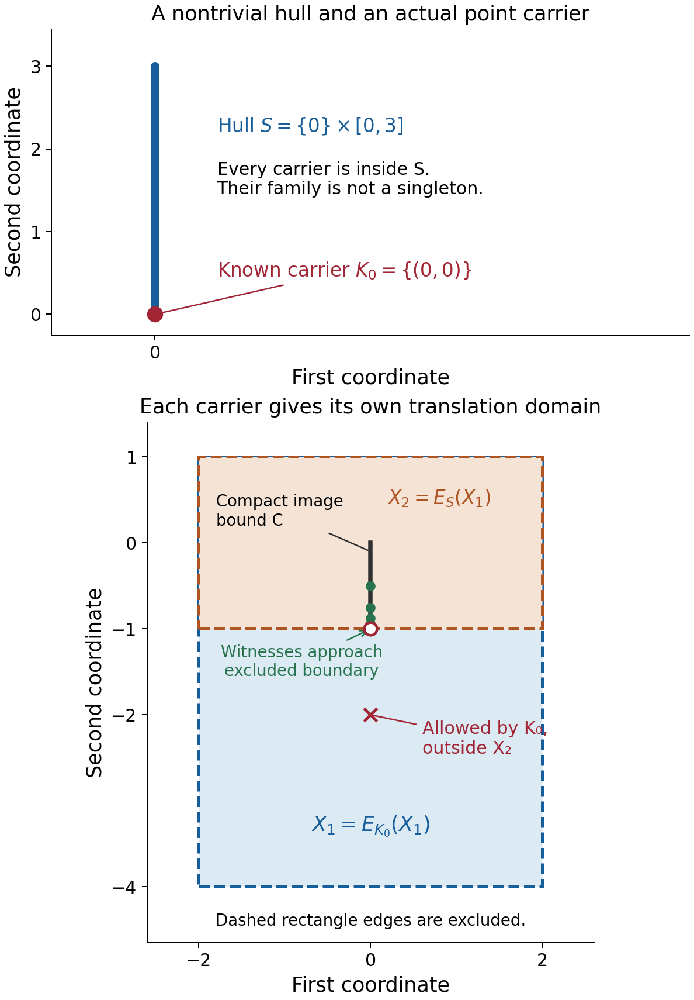
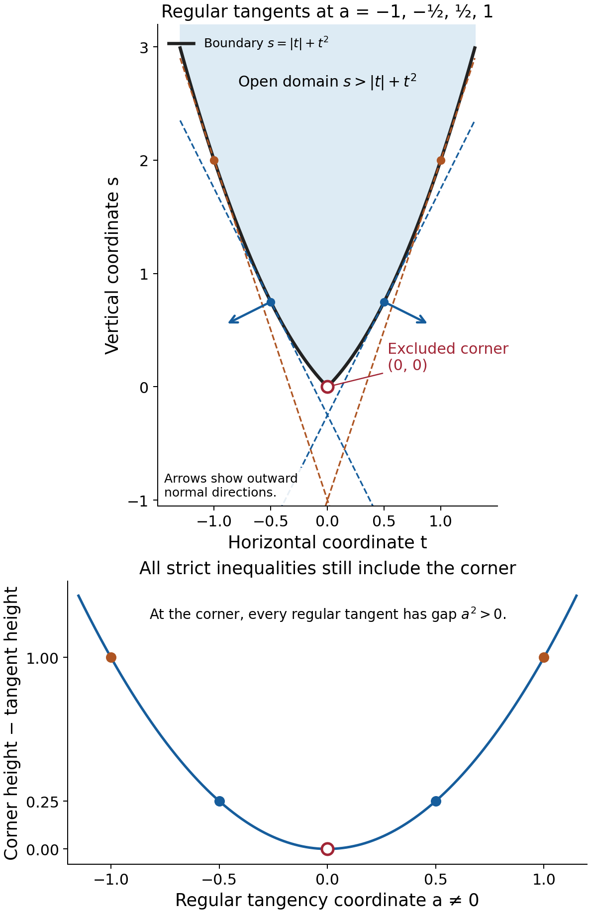

# Learning to choose convex convolution domains

*Written by GPT-6.1 Sol (OpenAI), Ultra reasoning effort, October 2026. Self-checked by the writing AI, GPT-6.1 Sol (OpenAI). Public domain (CC0).*

A logarithmic Fourier carrier describes the singular geometry visible along one escaping frequency sequence. An equation must accommodate every carrier, even when they differ from the kernel's combined singular hull. Convexity turns this requirement into a test of translated compact sets. Supporting planes then identify which boundary directions matter.

Basic references are [Grubb's Fourier-distribution notes](https://web.math.ku.dk/~grubb/dist5.pdf), [Melrose's differential-analysis course](https://ocw.mit.edu/courses/18-155-differential-analysis-fall-2004/), and Hörmander's *The Analysis of Linear Partial Differential Operators*, volumes I and II. The accompanying formal chapter proves the convex separation, regular-boundary reconstruction and full domain criteria. Use Recovering singularities from convolution profiles for exact one-point singularity realizations, Isolated atoms and maxima of Fourier profiles for the finite-support singleton theorem, and Convolution modulo smooth functions and compact singularity bounds for the compact singularity condition.

## 1. Containment uses every point of a carrier

Let \(\mu\) be a compact invertible kernel and
\[
 S=\operatorname{conv}(\operatorname{sing\,supp}\mu).
 \tag{E1.1}
\]
Its nonempty compact convex profile carriers form a family \(\mathcal K(\mu)\). Each \(K\) lies in \(S\), and
\[
 H_S(\eta)=\sup_{K\in\mathcal K(\mu)}H_K(\eta).
 \tag{E1.2}
\]
The hull combines the carriers; it need not itself be the only carrier.

Take nonempty open convex \(X_1,X_2\), where \(X_1\) is the domain of the unknown and \(X_2\) is the domain of the equation. Singular sampling requires \(X_2-S\subset X_1\). For one carrier define
\[
 E_K(X_1)=\{x:x-K\subset X_1\}.
 \tag{E1.3}
\]
For a compact \(K\), this is open because the compact set \(x-K\) has a positive margin inside \(X_1\). It is convex because the containment is preserved along line segments.

The exact profile-domain criterion is
\[
 (X_1,X_2)\text{ is convex for singular supports}
 \quad\Longleftrightarrow\quad
 E_K(X_1)\subset X_2\quad\text{for every }K.
 \tag{E1.4}
\]
Compatibility already gives \(X_2\subset E_K(X_1)\). Thus the criterion says \(E_K(X_1)=X_2\) for every carrier, not just for the hull.

Here singular-support convexity means that every compact image-singularity bound inside \(X_1\) has a compact input-singularity bound inside \(X_2\), for the adjoint convolution \(\check\mu*v\) with \(v\in\mathcal E'(X_2)\). The reflected kernel has carriers \(-K\). A selected singularity at \(x\) can therefore have image hull \(x-K\). Theorem 4.1 of the formal chapter uses this exact realization for necessity. For sufficiency it bounds all the sets \(E_K(C)\), for a fixed compact \(C\subset X_1\), and applies the full inverse carrier criterion. The positive boundary margin survives the convex hull and its closure.

Keep the translation domain separate from the Minkowski difference
\[
 X_1-K=\{u-k:u\in X_1,\ k\in K\}.
 \tag{E1.5}
\]
Expression (E1.5) chooses one pair of points. Expression (E1.3) requires every point of \(x-K\) to lie inside \(X_1\).

If the carrier family is the singleton \(\{S\}\), the largest admissible equation domain for a fixed convex \(X_1\) is \(E_S(X_1)\). Conversely, for every nonempty open convex \(U\),
\[
 X_2=U,\qquad X_1=U-S
 \quad\Longrightarrow\quad E_S(X_1)=U.
 \tag{E1.6}
\]
The separation argument in Lemma 2.2 proves this identity, including unbounded \(U\).

## 2. The boundary test uses the reflected normal

A regular boundary point has one outward normal ray. The formal chapter proves that such points are dense by constructing a local convex graph and using the Baire theorem on its one-sided derivative gaps. It also proves that their closed supporting halfspaces recover the closure of the domain, and taking the interior recovers the open domain.

At a regular boundary point of \(X_2\) with unit outward normal \(\nu\), singular-support convexity requires
\[
 H_K(-\nu)=H_S(-\nu)\quad\text{for every carrier }K.
 \tag{E2.1}
\]
The minus sign comes from the sampled point \(x-k\). In the outward direction \(\nu\), that sample has scalar product \(\nu\cdot x-\nu\cdot k\). Its largest possible value is \(\nu\cdot x+H_K(-\nu)\).

Conversely, let \(U\) be nonempty, proper, open and convex. If every regular outward normal of \(U\) satisfies (E2.1), then
\[
 X_2=U,\qquad X_1=U-S
 \tag{E2.2}
\]
is convex for singular supports. Theorem 7.1 proves this by placing each open \(E_K(X_1)\) inside all the closed regular supporting halfspaces, and then inside the interior of their intersection.

Only normals that occur on this boundary are tested. Agreement in those directions need not make the carrier family a singleton.

## 3. Four worked examples

### Example 1. Two atoms and an exact rectangular domain

Set
\[
 \mu=\delta_{(-1,0)}+2\delta_{(2,0)},\qquad
 S=[-1,2]\times\{0\},\qquad
 U=(-2,3)\times(-1,2).
 \tag{E3.1}
\]
Every support point is isolated and singular. Corollary 3.2 of the isolated-atoms lesson gives invertibility and the singleton carrier family \(\{S\}\), even though a finite-support kernel can have Fourier zeros.

The unknown domain prescribed by (E1.6) is
\[
 X_1=U-S=(-4,4)\times(-1,2).
 \tag{E3.2}
\]
Indeed the horizontal Minkowski difference of the open interval \((-2,3)\) with the closed interval \([-1,2]\) is \((-4,4)\). The second coordinate is unchanged.

The condition \(x-S\subset X_1\) is
\[
 x_1-2>-4,\qquad x_1+1<4,\qquad -1<x_2<2.
 \tag{E3.3}
\]
Thus \(E_S(X_1)=(-2,3)\times(-1,2)=U\), and the pair is convex for singular supports.

The adjoint illustrates the reflection: for \(v=\delta_y\),
\[
 \check\mu*v=\delta_{y+(1,0)}+2\delta_{y-(2,0)}.
 \tag{E3.4}
\]
Its singular hull is \(y-S\). The coefficient \(2\) remains \(2\); a complex coefficient would also remain unchanged under the bilinear transpose.

### Example 2. The whole singular hull can hide a smaller carrier

Define a normalized smooth bump
\[
 g(t)=
 \begin{cases}
 c\exp[-1/((t-2)(3-t))],&2<t<3,\\
 0,&t\notin(2,3),
 \end{cases}
 \qquad \int_{\mathbb R}g(t)\,dt=1.
 \tag{E3.5}
\]
The positive constant \(c\) exists because the unnormalized bump has positive finite integral. Every endpoint derivative of its zero extension is zero: differentiating gives the same exponential times reciprocal polynomial powers, which the exponential dominates. Thus \(g\) is smooth, positive on \((2,3)\), and supported exactly in \([2,3]\).

On \(\mathbb R^2\), put
\[
 \mu=\delta_{(0,0)}+\tfrac15\,\delta_0\otimes g,\qquad
 F_\mu(\zeta_1,\zeta_2)=1+\tfrac15F_g(\zeta_2).
 \tag{E3.6}
\]
On real frequencies \(|F_g|\le\int g=1\), so \(|F_\mu|\ge4/5\). This gives slow decrease and invertibility. Its singular support is
\(\{(0,0)\}\cup(\{0\}\times[2,3])\). Where \(g\ne0\), a distribution supported on the vertical line is nonzero and cannot be a smooth function: a smooth function supported on a line must vanish. The endpoints remain singular since every neighborhood contains an interior singular point. Near the origin the separated point mass remains singular. Consequently
\[
 S=\{0\}\times[0,3].
 \tag{E3.7}
\]

There is an actual point carrier \(K_0=\{(0,0)\}\). To prove this, take escaping centers \(c_j=(e^{2j},e^j)\), and \(q_j=|c_j|\). On \(|z|\le M\), for all sufficiently large \(j\),
\[
 |e^j+z_2\log q_j|\ge q_j^{1/2}/4,\qquad
 |\operatorname{Im}(z_2\log q_j)|\le M\log q_j.
 \tag{E3.8}
\]
Repeated integration by parts in \(g\), with no endpoint terms, gives for any integer \(k\ge0\)
\[
 |F_g(e^j+z_2\log q_j)|
 \le4^k\|g^{(k)}\|_1q_j^{-k/2+3M}.
 \tag{E3.9}
\]
Choose \(k>6M\). The right side tends to zero uniformly on the parameter compact set. Hence \(F_\mu(c_j+z\log q_j)\to1\), and its normalized logarithm tends uniformly to zero. This proper profile has zero indicator, with carrier \(K_0\). Since the carriers' combined hull is the nontrivial \(S\), at least one other carrier differs from \(K_0\). We do not need a formula for the entire family.

Now prescribe
\[
 X_2=(-2,2)\times(-1,1),\qquad
 X_1=X_2-S=(-2,2)\times(-4,1).
 \tag{E3.10}
\]
The hull passes the containment test: \(E_S(X_1)=X_2\). But
\[
 E_{K_0}(X_1)=X_1\not\subset X_2.
 \tag{E3.11}
\]
For example \((0,-2)\) belongs to the left side. The full family criterion therefore fails.

This failure has actual compact singularity witnesses. Let \(y_j=(0,-1+2^{-j})\), \(j\ge1\), and fix \(C=\{0\}\times[-1,0]\Subset X_1\). The reflected point carrier is still \(K_0\). The exact realization theorem supplies \(v_j\) with arbitrarily small support inside \(X_2\), singular exactly at \(y_j\), and image hull \(y_j-K_0=\{y_j\}\subset C\). The image singular support is this singleton: its hull is nonempty and a singleton. All the input singularities approach the excluded boundary \((0,-1)\), so no compact subset of \(X_2\) contains them.

The boundary sign agrees with this obstruction. At the lower edge the outward normal is \(\nu=(0,-1)\); its reflection is \(-\nu=(0,1)\). Then
\[
 H_{K_0}(-\nu)=0,\qquad H_S(-\nu)=3.
 \tag{E3.12}
\]
At the upper edge, \(\nu=(0,1)\), both reflected support values are zero. Testing \(+\nu\) at the lower edge would miss its obstruction.

*Figure 1.* For the kernel (E3.6), the known carriers include \(K_0=\{0\}\), and all carriers lie in the vertical hull \(S=\{0\}\times[0,3]\). The diagram does not claim that \(S\) itself is an actual profile carrier. The domains and sampled points have the exact coordinates in (E3.10); dashed rectangle edges are excluded. The witnesses \(y_j=(0,-1+2^{-j})\), \(j=1,\ldots,5\), lie in the fixed compact image bound \(C\) but approach the equation boundary. Proof locators: formal Theorem 4.1 and Theorem 6.1; Example 2 and Exercise 5. Background: Hörmander's convolution-domain geometry.

### Example 3. Several carriers work on the same unbounded strip

Keep the kernel of Example 2 but take
\[
 U=(-2,2)\times\mathbb R.
 \tag{E3.13}
\]
Every nonempty carrier lies on the vertical segment \(S\). Subtracting any such carrier affects only the unrestricted vertical coordinate. Thus
\[
 U-S=U,\qquad E_K(U)=U\quad(K\in\mathcal K(\mu)).
 \tag{E3.14}
\]
The pair \(X_1=X_2=U\) is convex for singular supports by Theorem 4.1.

The only unit outward normals at boundary points are \((1,0)\) and \((-1,0)\). Every carrier has support value zero in either horizontal direction. Hence the normal test succeeds despite the differing point and nonpoint carriers. Their unequal vertical support values are irrelevant to this strip because its boundary has no vertical normal.

This gives a proper unbounded domain to which the converse applies. It also explains why the normal condition is restricted to the normals of the prescribed domain.

### Example 4. Strict regular-plane inequalities need an interior step

Let
\[
 f(t)=|t|+t^2,\qquad U=\{(t,s):s>f(t)\}.
 \tag{E3.15}
\]
This is nonempty, proper, open and convex. At \(a\ne0\), the boundary point \(q_a=(a,f(a))\) is regular, with slope \(p_a=\operatorname{sgn}(a)+2a\) and outward unit normal
\[
 \nu_a=\frac{(p_a,-1)}{\sqrt{1+p_a^2}}.
 \tag{E3.16}
\]
Its closed supporting halfspace is
\[
 s\ge p_at-a^2.
 \tag{E3.17}
\]
Indeed
\[
 f(t)-(p_at-a^2)
 =(t-a)^2+|t|-\operatorname{sgn}(a)t\ge0.
 \tag{E3.18}
\]
Equality holds at \(t=a\).

At the corner \((0,0)\), every one of (E3.17) is strict, since \(0>-a^2\). The corner nevertheless does not belong to \(U\). Its outward normals have directions \((p,-1)\), \(-1\le p\le1\), rather than one ray.

The supremum of the tangent values \(p_at-a^2\) over \(a\ne0\) equals \(f(t)\): for \(t\ne0\), take \(a=t\); for \(t=0\), take \(a\to0\). Thus the intersection of all the closed regular halfspaces is exactly \(\{s\ge f(t)\}=\overline U\). Taking its interior gives \(U\). Theorem 7.1 correctly uses this interior step, together with openness of \(E_K(X_1)\).

*Figure 2.* The graph and the four tangents at \(a=-1,-1/2,1/2,1\) are exact. The shaded region above the graph is the open domain; its boundary is excluded. The marked corner satisfies strictly every regular tangent inequality, not only the four drawn, but remains a boundary point. Outward normal arrows at \(a=\pm1/2\) use (E3.16). Proof locators: formal Lemmas 3.1–3.2 and Theorem 7.1; Example 4 and Exercise 7. Background: convex supporting-plane geometry in Hörmander's solvability theory.

## 4. Exercises and full solutions

The ten exercises total 100 points. Each includes a complete solution.

**Exercise 1 (10 points).** Take \(U=(-3,5)\times(-2,4)\) and \(K=[-1,2]\times[-1/2,1/2]\). Compute \(E_K(U)\) and \(U-K\), with correct endpoint conventions. Explain the difference.

*Solution.* The containment of the first coordinate interval \(x_1-[-1,2]=[x_1-2,x_1+1]\) in \((-3,5)\) requires \(x_1-2>-3\) and \(x_1+1<5\), hence \(-1<x_1<4\). Similarly \(-3/2<x_2<7/2\). Therefore
\[
 E_K(U)=(-1,4)\times(-3/2,7/2).
 \tag{E4.1}
\]
The independent coordinate differences give
\[
 U-K=(-5,6)\times(-5/2,9/2).
 \tag{E4.2}
\]
All endpoints are excluded because an extremum in the closed \(K\) would have to meet an excluded endpoint of \(U\). The translation domain requires the entire shifted \(K\) to fit, whereas the difference set allows one chosen pair. For example \((5,0)\) is in the difference set but not the translation domain.

**Exercise 2 (10 points).** Let \(a=(1/2,-1/4)\), \(\mu=i\delta_a\), and \(X_2=(-1,2)\times(-2,1)\). Choose \(X_1=X_2-\{a\}\). Compute \(X_1\), the reflected kernel, the adjoint image of \(\delta_p\), and the compact singularity distance identity.

*Solution.* Coordinate translation gives
\[
 X_1=(-3/2,3/2)\times(-7/4,5/4),\qquad
 \check\mu=i\delta_{-a},\qquad
 \check\mu*\delta_p=i\delta_{p-a}.
 \tag{E4.3}
\]
The bilinear transpose reflects the point and retains the coefficient \(i\). There is no complex conjugation. The nonzero one-point kernel has singleton carrier \(\{a\}\). Thus \(E_{\{a\}}(X_1)=X_1+a=X_2\), proving singular-support convexity. For any compact test distribution \(v\), the nonzero coefficient does not change its singular set, and translation gives
\[
 \operatorname{sing\,supp}(\check\mu*v)
 =\operatorname{sing\,supp}v-a.
 \tag{E4.4}
\]
The complements satisfy \(X_1^c=X_2^c-a\); Euclidean distances are translation invariant. Therefore the two singular-set distances to their respective complements are equal. If \(v\) is smooth, both singular sets are empty and both distances are infinite.

**Exercise 3 (10 points).** Use the two-atom kernel and the domains of Example 1. If the image singular support is confined to \(C=[-3,3]\times[-1/2,3/2]\), find a sharp compact receiver for the input singularities. Check its boundary margin.

*Solution.* The reflected carrier is \(-S\). The inverse criterion requires every \(y\) with \(y-S\subset C\) to lie in the receiver. The horizontal endpoint conditions are \(y_1-2\ge-3\), \(y_1+1\le3\); the vertical coordinate stays unchanged. Thus
\[
 K_2=E_S(C)=[-1,2]\times[-1/2,3/2].
 \tag{E4.5}
\]
This nonempty compact convex set lies inside \(X_2=(-2,3)\times(-1,2)\). The inverse carrier theorem proves that it receives every input singularity under the stated image bound.

It is sharp: for every \(y\in K_2\), the input \(v=\delta_y\) has the two distinct image singularities \(y+(1,0)\), \(y-(2,0)\) inside \(C\). Its input singularity is \(y\), so a universal receiver must include that point. The distance of \(K_2\) from \(X_2^c\) is \(1/2\), reached on its horizontal edges; the distance of \(C\) from \(X_1^c\) is also \(1/2\). Here “horizontal edges” refers to the edges at second-coordinate heights \(-1/2,3/2\), rather than the vertical edges whose margin is \(1\).

**Exercise 4 (10 points).** Explain why a compact smooth nonzero kernel cannot be used as the nonempty singleton-carrier case of Corollary 5.1, even on the whole space. Show that its compact singularity confinement condition fails.

*Solution.* Smoothness makes its singular support and singular hull empty. Repeated integration by parts gives a rapidly decreasing real Fourier transform. For any proposed real slow-decrease window constant \(A\), the frequencies in a logarithmic window about a sufficiently large center have norm at least half the center norm. A decay estimate of order \(N>A\) then makes the maximum on that window smaller than its required polynomial lower bound. Thus the kernel is not invertible, by the real-window characterization in the preceding slow-decrease lesson. Its profiles all collapse, so its singleton indicator is \(-\infty\), not a support function of a nonempty compact carrier.

More directly, for every \(y\), the compact input \(\delta_y\) has smooth adjoint image \(\check\mu*\delta_y\), a translated smooth function. On \(X_1=X_2=\mathbb R^n\), all these images satisfy the empty compact singularity bound, while their input singularities range over all \(y\in\mathbb R^n\). No compact receiver exists. The nonsmooth, proper-indicator hypothesis in Corollary 5.1 cannot be dropped.

**Exercise 5 (10 points).** For Example 2, prove directly that \(C=\{0\}\times[-1,0]\) has no compact singularity receiver in \(X_2\). Specify how to choose compactly supported witnesses rather than merely drawing points.

*Solution.* The proper zero profile of \(\mu\) gives the point carrier \(K_0\). Reflection keeps this carrier fixed. For \(y_j=(0,-1+2^{-j})\), use the exact reflected one-point realization with a support radius less than \(2^{-j-2}\). This ball is inside \(X_2\): its radius is less than half the distance \(2^{-j}\) to the lower edge, and the other three edge distances are larger. The supplied \(v_j\) is compactly supported in that ball and singular exactly at \(y_j\). Its reflected image has singular hull \(\{y_j\}\), so its nonempty singular support is exactly \(\{y_j\}\subset C\).

If a compact \(K_2\subset X_2\) received every input, the continuous function \(x\mapsto x_2+1\) would have a positive minimum \(\varepsilon\) on the nonempty \(K_2\). Choose \(j\) with \(2^{-j}<\varepsilon\). Then \(y_j\notin K_2\), a contradiction. An empty receiver fails already for \(v_1\). This verifies the distributional confinement failure with actual witnesses.

**Exercise 6 (10 points).** For the kernel of Example 2, compare the strip \(U=(-2,2)\times\mathbb R\) with the unit disk as prescribed equation domains. Can either be part of a compatible convex singular-support pair? Explain what the normal test says without assuming a full formula for the carrier family.

*Solution.* In the strip, all unit boundary normals are horizontal. Every nonempty carrier lies on \(S=\{0\}\times[0,3]\), so \(H_K(\pm e_1)=0=H_S(\pm e_1)\). Theorem 7.1 gives the pair \(X_1=U-S=U\), \(X_2=U\).

For the unit disk, every boundary point is regular and every unit vector occurs as an outward normal. Any compatible convex singular-support pair with that disk as \(X_2\) would, by Theorem 6.1, have \(H_K(\eta)=H_S(\eta)\) for every unit \(\eta\), and then for every real \(\eta\) by positive homogeneity. Equality of support functions would force \(K=S\). But the established point carrier \(K_0=\{0\}\) differs from \(S\); already at the bottom boundary, \(-\nu=e_2\) has support values \(0\) and \(3\). Thus no such convex pair exists for the disk. This conclusion is specific to its normals and does not assert that every bounded convex domain has all directions as regular normals.

**Exercise 7 (10 points).** For \(f(t)=|t|+t^2\), prove that the corner satisfies all strict regular tangent inequalities but is outside the open epigraph. Then compute the closed halfspace intersection.

*Solution.* For every \(a\ne0\), differentiation gives \(p_a=\operatorname{sgn}(a)+2a\), and
\(f(a)-p_aa=-a^2\). The nonnegative gap in (E3.18) proves the supporting inequality \(s\ge p_at-a^2\). At \((t,s)=(0,0)\), it is strict since \(0>-a^2\). The corner is outside \(U\) because its defining inequality would read \(0>f(0)=0\).

For \(t\ne0\), the tangent with \(a=t\) attains \(f(t)\); all other tangent values are at most \(f(t)\). For \(t=0\), their values \(-a^2\) have supremum zero. Hence
\[
 \sup_{a\ne0}(p_at-a^2)=|t|+t^2,\qquad
 \bigcap_{a\ne0}\{s\ge p_at-a^2\}=\{s\ge f(t)\}.
 \tag{E4.6}
\]
Continuity of \(f\) makes the interior of the last set exactly \(s>f(t)\). Strict satisfaction of infinitely many inequalities can fail to define an open set, as this corner demonstrates.

**Exercise 8 (10 points).** Let \(f(x_1,x_2)=|x_1|+2|x_2|+x_1^2+x_2^2\). Find its regular graph points, outward normals there, and all normal rays at the origin. Verify density of regular boundary points in this example.

*Solution.* When both coordinates are nonzero, the gradient is
\[
 p=(\operatorname{sgn}x_1+2x_1,\;
              2\operatorname{sgn}x_2+2x_2).
 \tag{E4.7}
\]
The graph point has the unique outward unit normal \((p,-1)/\sqrt{1+|p|^2}\). If \(x_1=0\), the first one-sided derivative gap is \(2\); if \(x_2=0\), the second gap is \(4\). There are then at least two subgradients, so the supporting-normal ray is not unique. Thus the regular graph points are exactly those with both coordinates nonzero. They are dense because any coordinate can be perturbed by an arbitrarily small nonzero amount, and continuity of \(f\) makes the graph points converge.

At the origin, \(|x_1|\ge p_1x_1\) for all \(x_1\) exactly when \(-1\le p_1\le1\), and \(2|x_2|\ge p_2x_2\) exactly when \(-2\le p_2\le2\). Adding the nonnegative quadratic terms proves these are subgradients. Conversely coordinate testing with arbitrarily small positive and negative coordinates gives those same necessary intervals. All normal rays are therefore
\[
 \mathbb R_{>0}(p_1,p_2,-1),\qquad
 (p_1,p_2)\in[-1,1]\times[-2,2].
 \tag{E4.8}
\]
The local graph/subgradient correspondence in Lemma 3.1 proves that none are missing.

**Exercise 9 (10 points).** Let \(C\Subset X_1\) be nonempty compact and convex, and choose \(0<\delta\le d(C,X_1^c)\). Suppose every \(E_K(X_1)\) lies in a convex open \(X_2\), and the nonempty carriers all lie in one compact convex \(S\). Prove that, when \(D=\bigcup_KE_K(C)\) is nonempty, \(\overline{\operatorname{conv}D}\) is a compact subset of \(X_2\) with boundary distance at least \(\delta\).

*Solution.* For \(x\in E_K(C)\), choose any \(k\in K\subset S\). Then \(x-k\in C\), so \(x\in C+S\). This Minkowski sum is compact, as a continuous image of \(C\times S\), and convex. It contains \(D\) and its closed convex hull, making that hull compact.

For \(|h|<\delta\), the containment \(C+h\subset X_1\) holds by the chosen boundary distance. Thus \(x+h-K\subset X_1\), so \(x+h\in E_K(X_1)\subset X_2\). For a finite convex combination \(z=\sum_i\lambda_ix_i\) of points of \(D\), use the same \(h\) at each point:
\[
 z+h=\sum_i\lambda_i(x_i+h)\in X_2.
 \tag{E4.9}
\]
Hence \(d(z,X_2^c)\ge\delta\). Distance to a nonempty closed set is continuous, since the triangle inequality gives a Lipschitz constant one. Passing to the closure keeps that bound. A positive distance excludes every point of \(X_2^c\), so the compact closed hull is inside \(X_2\). If \(X_2^c\) is empty, all these distances are infinite and the conclusion is immediate.

**Exercise 10 (10 points).** Take the open halfspace \(U=\{x:\nu\cdot x<\alpha\}\), with \(\nu\ne0\). Compute \(U-S\) and \(E_K(U-S)\). Deduce the exact normal condition for \(X_2=U\), \(X_1=U-S\).

*Solution.* Compactness gives \(s_0\in S\) minimizing \(\nu\cdot s\). For every \(u\in U,s\in S\),
\(\nu\cdot(u-s)<\alpha+H_S(-\nu)\). Conversely, if \(z\) satisfies this strict inequality, then \(u=z+s_0\) has \(\nu\cdot u<\alpha\) and \(z=u-s_0\). Therefore
\[
 U-S=\{z:\nu\cdot z<\alpha+H_S(-\nu)\}.
 \tag{E4.10}
\]
Every \(x-k\) is in this set precisely when its maximum scalar product is below the threshold. Since \(K\) is compact, that maximum is attained and equals \(\nu\cdot x+H_K(-\nu)\). Thus
\[
 E_K(U-S)
 =\{x:\nu\cdot x<
              \alpha+H_S(-\nu)-H_K(-\nu)\}.
 \tag{E4.11}
\]
Because \(K\subset S\), the added term is nonnegative. This halfspace equals \(U\) if and only if it is zero. The family criterion therefore requires \(H_K(-\nu)=H_S(-\nu)\) for every carrier, exactly the reflected-normal condition. If the added term were positive, a point with scalar product strictly between the two thresholds would be in \(E_K(U-S)\) but outside \(U\). This computation covers any dimension and the unbounded halfspace directly.

## References

- Gerd Grubb, *Distributions and Operators*, Chapter 5, “Fourier transformation of distributions,” freely readable [lecture notes](https://web.math.ku.dk/~grubb/dist5.pdf).
- Richard B. Melrose, *Differential Analysis*, MIT OpenCourseWare, Fall 2004, freely readable [course materials](https://ocw.mit.edu/courses/18-155-differential-analysis-fall-2004/).
- Lars Hörmander, *The Analysis of Linear Partial Differential Operators I: Distribution Theory and Fourier Analysis*, second edition, Springer, 1990.
- Lars Hörmander, *The Analysis of Linear Partial Differential Operators II: Differential Operators with Constant Coefficients*, Springer, 1983.
- Full profile realization and finite-support proofs are in the preceding lessons linked above. The accompanying formal chapter proves the exact domain-family criterion, regular boundary geometry and reflected-normal converse used here.
