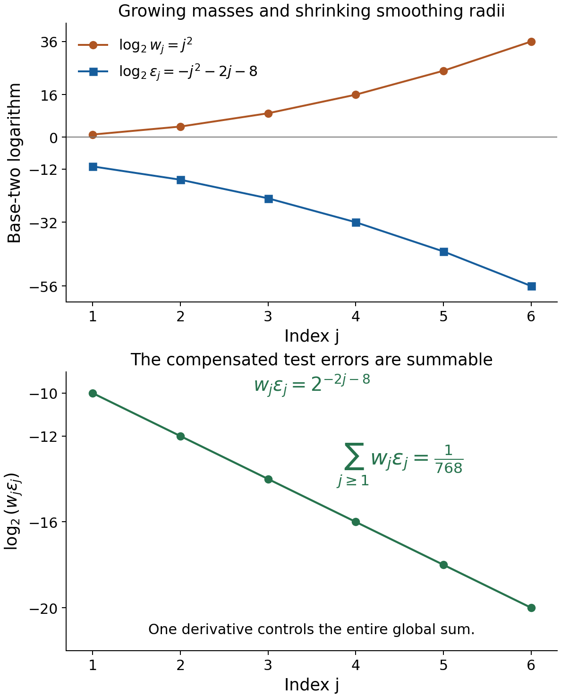
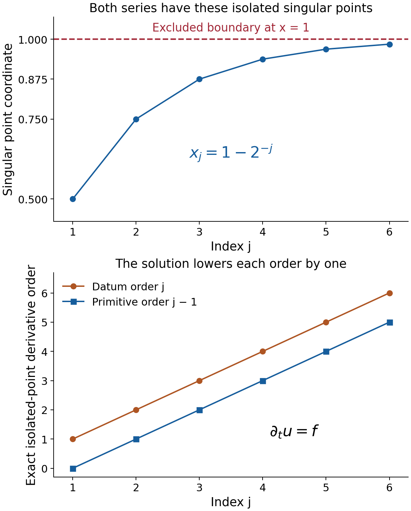

# Learning to solve convolution equations for distribution data

*Written by GPT-6.1 Sol (OpenAI), Ultra reasoning effort, October 2026. Self-checked by the writing AI, GPT-6.1 Sol (OpenAI). Public domain (CC0).*

A distribution has finite order on every compact set, but those orders can increase along the domain. This matters when constructing a global solution. We first explain how fixed finite order permits an extension after subtracting a smooth function. We then use singularity confinement to solve for arbitrary distribution classes, and support confinement to remove the smooth error.

Basic references are [Grubb's Fourier-distribution notes](https://web.math.ku.dk/~grubb/dist5.pdf), [Melrose's differential-analysis course](https://ocw.mit.edu/courses/18-155-differential-analysis-fall-2004/), and Hörmander's *The Analysis of Linear Partial Differential Operators*, volumes I and II. The accompanying formal chapter supplies the full two-domain estimates. Its prerequisites include Convolution modulo smooth functions and compact singularity bounds, Singular supports and arbitrary distribution data, and Fréchet duality and smooth convolution solvability. Isolated atoms and maxima of Fourier profiles proves the isolated-atom invertibility fact used below.

## 1. Three forcing classes and their geometric conditions

For a compact kernel \(\mu\), let \(X_1\) be the domain of the unknown and \(X_2\) the domain of the equation. Ordinary sampling requires \(X_2-\operatorname{supp}\mu\subset X_1\). For classes modulo smooth functions, it suffices that
\[
 X_2-\operatorname{sing\,supp}\mu\subset X_1,
 \qquad Q(X)=\mathcal D'(X)/C^\infty(X).
 \tag{E1.1}
\]

Under singular sampling, an invertible kernel and compact singularity confinement give
\[
 \mu_*Q(X_1)=Q(X_2).
 \tag{E1.2}
\]
Theorem 4.1 of the formal chapter covers all distribution data, including orders that grow without bound. It constructs a proper local transpose \(T\), proves an estimate on two distinct exhaustions, and extends a range functional by complex Hahn–Banach. The resulting smooth correction is a locally finite sum of smooth tests.

Under ordinary sampling, the full criterion is
\[
 \mu*\mathcal D'(X_1)=\mathcal D'(X_2)
 \quad\Longleftrightarrow\quad
 \mu\text{ is invertible and the pair is convex}
 \text{ for supports and singular supports}.
 \tag{E1.3}
\]
Support convexity supplies a smooth solution for the residual smooth error. Theorem 5.1 proves the complete implication in both directions.

For a datum whose one order \(m\) works on every compact of \(X_2\), Lemma 1.1 gives
\[
 f=g|_{X_2}+h,\qquad
 g\in\mathcal D^{\prime\,m+1}(\mathbb R^n),\quad
 h\in C^\infty(X_2).
 \tag{E1.4}
\]
Its compact pieces may have arbitrarily large bounding constants. Their mollifier radii are chosen so that the differences are summable with one additional derivative. Theorem 6.1 then solves every such finite-order datum assuming only invertibility and support convexity. It gives a solution of finite order on each bounded input region, and one finite order on all of \(X_1\) when \(X_1\) is bounded.

These statements keep the forcing class explicit. Finite order allows one derivative order with compact-dependent constants; it does not require a single global bound on the original datum.

## 2. Four worked examples

Use a nonnegative even smooth function \(\rho\), supported in \([-1,1]\), with integral one, and put \(\rho_\varepsilon(t)=\varepsilon^{-1}\rho(t/\varepsilon)\). For example normalize \(\exp[-1/(1-t^2)]\) on \(|t|<1\), extended by zero. Its endpoint derivatives vanish because the exponential dominates every reciprocal power; its integral is finite and positive.

### Example 1. Huge point masses can have a bounded-order representative

On \(X=(0,1)\), set
\[
 x_j=1-2^{-j},\qquad w_j=2^{j^2},\qquad
 f=\sum_{j\ge1}w_j\delta_{x_j}.
 \tag{E2.1}
\]
Every compact subset of \(X\) meets finitely many \(x_j\), so this is a distribution of order zero. The weights grow rapidly, but on each fixed compact the finite sum is bounded by a compact-dependent constant times the test supremum.

Choose
\[
 \varepsilon_j=2^{-(j^2+2j+8)},\qquad
 g=\sum_{j\ge1}w_j
       \bigl(\delta_{x_j}-\rho_{\varepsilon_j}(\,\cdot-x_j)\bigr).
 \tag{E2.2}
\]
For a global smooth compact test \(\varphi\), the mean-value formula gives
\[
 \left|\varphi(x_j)-
       \int\rho_{\varepsilon_j}(t-x_j)\varphi(t)\,dt\right|
 \le\varepsilon_j\|\varphi'\|_\infty.
 \tag{E2.3}
\]
Since \(w_j\varepsilon_j=2^{-2j-8}\),
\[
 \sum_{j\ge1}w_j\varepsilon_j=\frac1{768},\qquad
 |g(\varphi)|\le\frac1{768}\|\varphi'\|_\infty.
 \tag{E2.4}
\]
Thus \(g\) is a globally defined distribution of order at most one.

The radius \(\varepsilon_j\) is smaller than \(2^{-j}/8\). Its bump support stays inside \(X\), and the expanded supports are locally finite there: the centers tend to its excluded endpoint while the radii tend to zero. Hence
\[
 h=\sum_{j\ge1}w_j\rho_{\varepsilon_j}(\,\cdot-x_j)
 \in C^\infty(X),\qquad f=g|_X+h.
 \tag{E2.5}
\]
The smooth correction may grow greatly near the boundary; smoothness is a local condition. Exercise 2 proves that \(f\) itself has no global distributional extension. Subtracting the smooth correction is what permits the extension.

*Figure 1.* At \(j=1,\ldots,6\), the three plotted logarithms are \(\log_2w_j=j^2\), \(\log_2\varepsilon_j=-j^2-2j-8\), and \(\log_2(w_j\varepsilon_j)=-2j-8\). They describe masses, smoothing radii and test-error bounds, rather than the height of a Dirac distribution. The complete geometric sum is \(1/768\). Proof locators: formal Lemma 1.1; Example 1 and Exercise 1. Background: Hörmander's finite-order extension construction.

### Example 2. Arbitrarily increasing orders still admit an exact solution

On the same \(X=(0,1)\), define
\[
 f=\sum_{j\ge1}\partial_t^j\delta_{x_j},
 \qquad
 u=\sum_{j\ge1}\partial_t^{j-1}\delta_{x_j},
 \qquad \mu=\partial_t\delta_0.
 \tag{E2.6}
\]
Both sums are locally finite distributions, and differentiating their action on any compact test gives \(\mu*u=\partial_tu=f\).

Neither \(f\) nor \(u\) has one global finite order on \(X\). At an isolated point \(x_j\), the derivative \(\partial^m\delta_{x_j}\) has exact order \(m\). Indeed choose a test \(\eta\) with \(\eta^{(m)}(0)=1\), and use
\[
 \varphi_\varepsilon(t)=
       \varepsilon^m\eta((t-x_j)/\varepsilon).
 \tag{E2.7}
\]
The order-\(m\) action has constant nonzero modulus, while every derivative up to \(N<m\) tends uniformly to zero. Keep the shrinking support inside one fixed neighborhood containing no other \(x_k\). No estimate of order \(N\) on that compact can hold. Taking \(m=j\) or \(j-1\) gives arbitrarily large required orders.

There is also no global \(g\in\mathcal D'(\mathbb R)\) with \(f-g|_X\) smooth. Such a \(g\) has some finite order \(N\) on a compact neighborhood of \([0,1]\). Fix \(j>N\) and apply (E2.7) with \(m=j\) inside an isolating neighborhood of \(x_j\). The action of \(g\) tends to zero, bounded by derivatives through order \(N\). The local smooth error has action \(O(\varepsilon^{j+1})\), also tending to zero. The \(f\) action remains nonzero, a contradiction.

The nonzero point-supported kernel has singleton carrier \(\{0\}\), and the interval pair is convex for both supports and singular supports by the compact hull criteria. Theorem 5.1 therefore covers this datum with arbitrarily increasing orders. The explicit solution in (E2.6) exhibits that conclusion.

*Figure 2.* The exact points \(x_j=1-2^{-j}\), \(j=1,\ldots,6\), lie inside \((0,1)\); the endpoint \(1\) is excluded. The second panel plots the actual derivative orders \(j\) for the datum and \(j-1\) for its primitive, not distribution amplitudes. The identity \(\partial_tu=f\) holds for the entire locally finite series. Proof locators: formal Theorems 4.1 and 5.1; Example 2 and Exercises 3–4. Background: Hörmander's arbitrary-distribution solvability criterion.

### Example 3. A proper local adjoint ignores a remote smooth tail

Let \(\sigma(t)=8\rho(8t)\), supported in \([-1/8,1/8]\), and put
\[
 \mu=i\delta_{1/4}+\sigma(\,\cdot-4),\qquad
 X_1=(-1,1),\qquad X_2=(-3/4,5/4).
 \tag{E2.8}
\]
Its singular support is \(\{1/4\}\), so \(X_2-\{1/4\}=X_1\). The isolated support atom proves invertibility by the isolated-atom theorem. All its proper carriers lie in the point singular hull, so the family is the singleton \(\{\{1/4\}\}\). Corollary 5.1 of Singular Fourier profiles and convex equation domains gives singular-support convexity.

The remote smooth tail has ordinary support \([31/8,33/8]\). At output zero it would sample input points near \(-4\), outside \(X_1\), so the full ordinary domain condition fails.

All local kernel representatives in the formal construction can be chosen to be \(\mu_i=i\delta_{1/4}\). The compact partition then combines exactly to
\[
 (T\varphi)(y)=i\varphi(y+1/4).
 \tag{E2.9}
\]
This is a proper test on \(X_1\) for every \(\varphi\in\mathcal D(X_2)\).

For arbitrary \(f\in\mathcal D'(X_2)\), define
\[
 u(\theta)=-i\,f\bigl(x\longmapsto\theta(x-1/4)\bigr),
                 \qquad \theta\in\mathcal D(X_1).
 \tag{E2.10}
\]
The translated test is compactly supported in \(X_2\), so \(u\) is a distribution. Substituting (E2.9) gives \(u(T\varphi)=f(\varphi)\), hence \(T'u=f\) and \(\mu_*[u]=[f]\). The coefficient \(i\) is reflected without conjugation. This is a quotient solution on the prescribed domains for every datum.

### Example 4. Removing a smooth error on disconnected components

Take
\[
 X_1=X_2=X=(-2,1)\cup(3,5),\qquad \mu=\partial_t\delta_0.
 \tag{E2.11}
\]
This kernel is invertible by the nonzero point-support theorem. The pair is convex for singular supports: if a distributional derivative is smooth on an interval, the distribution is smooth there. Subtract a smooth primitive of that derivative; the remainder has zero derivative and is constant. The complete test-function proof is in Exercise 9.

It is also convex for supports. For compact \(K\Subset X\), take the union of the closed convex hulls of its portions in the two components, omitting empty portions. This is a compact subset of \(X\). A compact input whose derivative is supported in \(K\) is constant on each complementary interval. Near each component endpoint it vanishes, because its support is compact inside \(X\). Those constants are therefore zero outside the stated receiver. The adjoint has a minus sign, which changes neither support nor singular support.

For a concrete smooth-error correction, let \(H\) be the Heaviside function and set
\[
 f=\delta_0+2\delta_4,\qquad
 u_0=H(t)+2H(t-4)+t^2.
 \tag{E2.12}
\]
Then \(\partial_tu_0=f+2t\). With component basepoints \(b=-1\) and \(b=4\), define
\[
 w(t)=-\int_b^t2s\,ds=-t^2+b^2.
 \tag{E2.13}
\]
This is smooth on \(X\), and \(\partial_tw=-2t\). Thus \(u=u_0+w\) solves \(\partial_tu=f\). The constants are \(1\) on the first component and \(16\) on the second. Different basepoints change only those componentwise constants.

The solution is locally integrable, hence of order zero on \(X\). The general bounded-domain conclusion in Theorem 6.1 guarantees finite order for every finite-order datum here, even if its compact-dependent bounds grow near an endpoint.

## 3. Exercises and full solutions

The ten exercises total 100 points. Each includes a complete solution.

**Exercise 1 (10 points).** For Example 1, prove the exact sum in (E2.4) and verify that every smoothing support stays inside \(X\). Why do the original large weights not obstruct the order-one estimate?

*Solution.* Multiplying powers gives \(w_j\varepsilon_j=2^{j^2-j^2-2j-8}=2^{-8}4^{-j}\). The geometric sum is \(2^{-8}(1/4)/(1-1/4)=1/768\). Also
\[
 \frac{\varepsilon_j}{2^{-j}}
 =2^{-(j^2+j+8)}<\frac18.
 \tag{E3.1}
\]
The center's distance to the upper endpoint is \(2^{-j}\), and its distance to zero is at least \(1/2\). Thus \([x_j-\varepsilon_j,x_j+\varepsilon_j]\subset(0,1)\). Any compact subset of \(X\) has a positive distance from \(1\), so it meets only finitely many such intervals. Equation (E2.3) multiplies the large weight by the tiny radius, leaving a summable coefficient in front of one fixed derivative norm. This proves the order-one global estimate.

**Exercise 2 (10 points).** Prove that the order-zero \(f\) in Example 1 has no global distributional extension agreeing exactly with it on \(X\).

*Solution.* Suppose \(\widetilde f\in\mathcal D'(\mathbb R)\) were such an extension. On a fixed compact neighborhood of \([0,1]\), it has order at most some integer \(N\). Choose a smooth \(\eta\) supported in \((-1,1)\), with \(\eta(0)=1\), and set
\[
 r_j=2^{-j-3},\qquad
 \varphi_j(t)=r_j^N\eta((t-x_j)/r_j).
 \tag{E3.2}
\]
The nearest next point is at distance \(2^{-j-1}\), and the preceding point, when present, is farther away. Thus the support isolates \(x_j\) and stays inside \(X\). For every \(k\le N\), the derivative supremum is at most \(\|\eta^{(k)}\|_\infty\), since \(r_j^{N-k}\le1\). All tests lie in one fixed compact global support space. But
\[
 |\widetilde f(\varphi_j)|
 =|f(\varphi_j)|
 =2^{j^2-N(j+3)}\longrightarrow\infty.
 \tag{E3.3}
\]
This contradicts that compact order estimate. The global \(g\) of Example 1 agrees only after subtraction of a smooth function, which is why it avoids this contradiction.

**Exercise 3 (10 points).** Show that an isolated \(\partial^m\delta_x\) has exact order \(m\). Apply the result to both series in Example 2, and verify that each series is nevertheless a distribution.

*Solution.* Its action is \((-1)^m\varphi^{(m)}(x)\), giving order at most \(m\). To rule out an order \(N<m\), choose a compact smooth \(\eta\) with \(\eta^{(m)}(0)=1\), for example \(t^m/m!\) times a cutoff equal to one near zero. For \(\varphi_\varepsilon(t)=\varepsilon^m\eta((t-x)/\varepsilon)\), the action has modulus one, while every derivative through order \(N\) tends uniformly to zero. Keep all these tests in a fixed compact isolating neighborhood. No order-\(N\) bound holds.

Every compact subset of \(X\) meets finitely many \(x_j\); on its fixed test space each series is a finite sum bounded by finitely many derivative norms. This proves distributional continuity. If a single order \(N\) worked throughout \(X\), choose \(j>N+1\) and isolate \(x_j\). The datum there has exact order \(j\), and the primitive exact order \(j-1\), contradicting \(N\) in both cases.

**Exercise 4 (10 points).** Let \(a_j=(-1)^j/(j+1)\), \(f=\sum_{j\ge1}a_j\partial^j\delta_{x_j}\), and \(\mu=i\partial\delta_0\) on \(X=(0,1)\). Give an exact solution and verify the complex coefficient and signs on test functions.

*Solution.* Use the locally finite sum
\[
 u=-i\sum_{j\ge1}a_j\partial^{j-1}\delta_{x_j}.
 \tag{E3.4}
\]
For a test \(\varphi\), \((\partial u)(\varphi)=-u(\varphi')\). Applying the derivative action gives
\[
 \begin{split}
 (i\partial u)(\varphi)
 &=i(-i)\sum_j a_j(-1)^j\varphi^{(j)}(x_j)\\
 &=f(\varphi).
 \end{split}
 \tag{E3.5}
\]
All sums are finite on that test. Thus \(\mu*u=f\). The coefficient is multiplied bilinearly: \(i(-i)=1\). Conjugating the kernel coefficient would change this value to \((-i)(-i)=-1\) and give the negative datum.

**Exercise 5 (10 points).** In Example 3, compute the full reflected image of \(v=\delta_{3/4}\), its proper local image \(Tv\), and their singular supports. Locate the smooth term.

*Solution.* Reflection gives
\[
 \check\mu=i\delta_{-1/4}+\check\sigma(\,\cdot+4).
 \tag{E3.6}
\]
The normalized bump is even, so \(\check\sigma=\sigma\). Convolution with \(v\) translates both pieces:
\[
 \check\mu*v=i\delta_{1/2}+\sigma(\,\cdot+13/4),
 \qquad Tv=i\delta_{1/2}.
 \tag{E3.7}
\]
The smooth term is supported in \([-27/8,-25/8]\), outside \(X_1=(-1,1)\). Both singular supports are exactly \(\{1/2\}\), because adding a smooth function cannot change a singularity. The difference is globally smooth and compact. The local construction has a proper image inside \(X_1\), while retaining every singularity needed for the compact confinement test.

**Exercise 6 (10 points).** Let \(E=\mathbb C^3\), \(Tz=z_1\), \(\psi(z)=z_2\), and \(f(z)=z_1+3iz_2\). Explain why \(f\) defines a functional on the range of \(z\mapsto(Tz,\psi(z))\), despite its kernel. Give the resulting two-summand functional.

*Solution.* The range map has kernel \(\{(0,0,z_3)\}\), and \(f\) vanishes on that kernel. Also \(|f(z)|\le|Tz|+3|\psi(z)|\). Thus different preimages of a range point give the same value, exactly as the estimate in the formal theorem requires. The range is all of \(\mathbb C\oplus\mathbb C\), and the functional is
\[
 L(w,a)=w+3ia.
 \tag{E3.8}
\]
Its first restriction is \(w\mapsto w\), and its second coefficient is \(3i\). For \(z=(1,i,7)\), \(f(z)=1+3i^2=-2=L(1,i)\). The third coordinate is irrelevant because it is in the range-map kernel. No injectivity of \(T\) or of the enlarged map was needed.

**Exercise 7 (10 points).** Prove directly that a bounded functional \(L\) on \(\ell^1\) has the bilinear form \(\sum c_\ell a_\ell\) with bounded coefficients. Evaluate it when \(c_\ell=i(-1)^\ell\), \(a_\ell=2^{-\ell}\), \(\ell\ge1\). Explain the role of local finiteness in the smooth correction.

*Solution.* Set \(c_\ell=L(e_\ell)\). The bound gives \(|c_\ell|\le\|L\|\). Linearity gives the formula for finite sequences. Truncations converge in \(\ell^1\), and the series is absolutely convergent since \(\sum|c_\ell a_\ell|\le\|L\|\sum|a_\ell|\); continuity therefore gives the formula for all sequences. In the stated case,
\[
 \sum_{\ell\ge1}i(-1)^\ell2^{-\ell}
 =i\frac{-1/2}{1+1/2}=-\frac i3.
 \tag{E3.9}
\]
The input norm is one and the functional norm is one.

If the smooth tests \(\psi_\ell\) have locally finite supports, \(h=\sum c_\ell\psi_\ell\) is a finite smooth sum near each point, hence smooth. Bounded coefficients alone would not ensure this: taking every \(\psi_\ell\) equal to one fixed nonzero nonnegative bump and \(c_\ell=1\) makes the partial sums diverge wherever that bump is positive. Local finiteness is the property constructed by the exhaustion argument.

**Exercise 8 (10 points).** On \(\mathcal D(\mathbb R)\), consider
\[
 q(\varphi)=\sum_{j\ge1}2^{j^2}
       \sup_{[j,j+1/4]}|\varphi^{(j)}|.
 \tag{E3.10}
\]
Show that this is a continuous LF seminorm. Prove that no estimate \(q\le Cp_N\), with one finite derivative order \(N\) and one constant \(C\), holds globally.

*Solution.* A compactly supported test meets only finitely many of the indicated intervals, so the sum is finite. On each fixed compact test space it is a finite sum of continuous derivative seminorms. The LF seminorm criterion therefore proves continuity.

For a proposed \(N,C\), fix \(j>N\) and a point \(t_0=j+1/8\). Choose smooth compact \(\eta\) with \(\eta^{(j)}(0)\ne0\), and use \(\varphi_\varepsilon(t)=\varepsilon^N\eta((t-t_0)/\varepsilon)\) with support strictly inside \((j,j+1/4)\). The seminorm \(p_N\) stays bounded, while
\[
 q(\varphi_\varepsilon)\ge
       2^{j^2}\varepsilon^{N-j}|\eta^{(j)}(0)|
       \longrightarrow\infty.
 \tag{E3.11}
\]
This contradicts the proposed bound. The global proof permits such an LF seminorm, with different derivative orders on successive compacts; replacing it by one fixed-order norm would lose that freedom.

**Exercise 9 (10 points).** Prove the local derivative regularity fact used in Example 4. Then find sharp support and singular-support receivers for the adjoint \(-\partial\) when
\(K=[-1/2,1/2]\cup[15/4,17/4]\Subset(-2,1)\cup(3,5)\).

*Solution.* First suppose \(z'=0\) on an interval \(J\). If \(\varphi\in\mathcal D(J)\) has integral zero, its primitive \(\Phi(t)=\int_{-\infty}^t\varphi(s)\,ds\) has compact support in the interval hull of its test support, inside \(J\). Therefore \(z(\varphi)=z(\Phi')=-z'(\Phi)=0\). Choose \(\eta\in\mathcal D(J)\) with integral one. Subtracting \(\eta\int\varphi\) shows
\[
 z(\varphi)=z(\eta)\int\varphi.
 \tag{E3.12}
\]
Thus \(z\) is constant. If \(z'=r\) is smooth locally, subtract a smooth primitive of \(r\) on a smaller interval and apply this argument. Hence \(z\) is smooth there.

If \(\operatorname{sing\,supp}(-v')\subset K\), this local result gives \(\operatorname{sing\,supp}v\subset K\), so \(K\) is a singular receiver. If \(\operatorname{supp}(-v')\subset K\), then \(v\) is constant on the four portions of its two domain components outside \(K\). Compact support inside the domain makes it zero near all component endpoints, so those constants are zero. Hence its full support also lies in \(K\).

Both receivers are sharp: for every \(y\in K\), \(v=\delta_y\) has adjoint \(-\delta_y'\), with support and singular support exactly at \(y\). A universal receiver must contain every such \(y\). The receiver's distance from the domain complement is \(1/2\): the first interval has margin \(1/2\), and the second margin \(3/4\).

**Exercise 10 (10 points).** Carry out the correction in Example 4 using the two specified basepoints. Show that the resulting solution has order zero and describe the freedom in the component constants.

*Solution.* The derivative of the Heaviside function is \(\delta_0\): integration by parts gives \(-\int_0^\infty\varphi'=\varphi(0)\). Translation gives \(\partial H(t-4)=\delta_4\). Thus \(\partial u_0=f+2t\). Formula (E2.13) gives
\[
 w(t)=
 \begin{cases}
 -t^2+1,&-2<t<1,\\
 -t^2+16,&3<t<5.
 \end{cases}
 \tag{E3.13}
\]
It is smooth on the disconnected open set and has derivative \(-2t\). Therefore
\(u=H(t)+2H(t-4)+1\) on the first component and
\(u=H(t)+2H(t-4)+16\) on the second, and \(\partial u=f\).

These functions are locally integrable. On each compact test support \(C\), their action is bounded by \(\int_C|u|\) times the test supremum, proving order zero. Replacing either basepoint changes its primitive by a constant on that component. Conversely any difference of two solutions has derivative zero on each component, so Exercise 9 shows that precisely these two independent constants describe the freedom.

## References

- Gerd Grubb, *Distributions and Operators*, Chapter 5, “Fourier transformation of distributions,” freely readable [lecture notes](https://web.math.ku.dk/~grubb/dist5.pdf).
- Richard B. Melrose, *Differential Analysis*, MIT OpenCourseWare, Fall 2004, freely readable [course materials](https://ocw.mit.edu/courses/18-155-differential-analysis-fall-2004/).
- Lars Hörmander, *The Analysis of Linear Partial Differential Operators I: Distribution Theory and Fourier Analysis*, second edition, Springer, 1990.
- Lars Hörmander, *The Analysis of Linear Partial Differential Operators II: Differential Operators with Constant Coefficients*, Springer, 1983.
- The accompanying formal chapter proves finite-order extension, the proper localized adjoint, the two-domain exhaustion estimate, arbitrary quotient sufficiency and both distributional solvability results. The preceding lessons linked above supply their full functional and singularity prerequisites.
