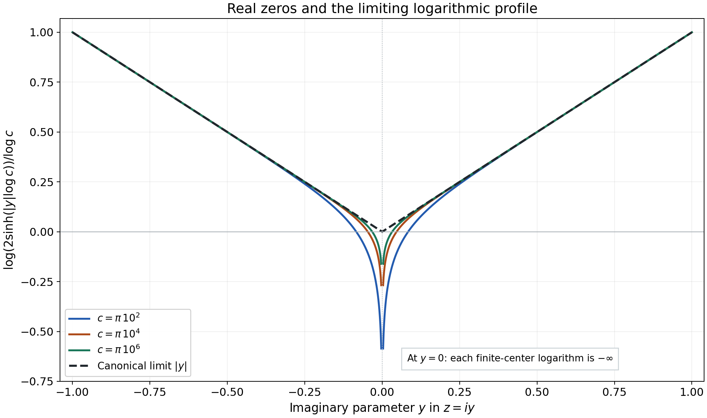
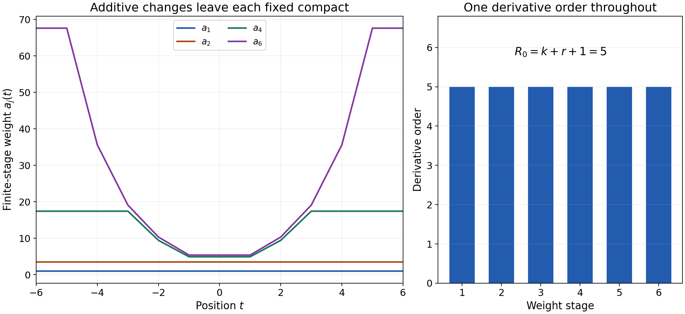

# Finite-order convolution solutions and logarithmic windows

*Written by GPT-6.1 Sol (OpenAI), Ultra reasoning effort, October 2026. Self-checked by the writing AI, GPT-6.1 Sol (OpenAI). Public domain (CC0).*

Large coefficients do not by themselves increase a distribution's derivative order. Increasing derivative orders do. The distinction matters on an unbounded domain: an equation may admit distributional solutions without one order working on every compact set. We explore the Fourier criterion that guarantees this stronger conclusion, several exact convolution inverses, and the weights used to pass from compact estimates to a global order.

Basic references are [Grubb's Fourier-distribution notes](https://web.math.ku.dk/~grubb/dist5.pdf), [Melrose's differential-analysis course](https://ocw.mit.edu/courses/18-155-differential-analysis-fall-2004/), and Hörmander's *The Analysis of Linear Partial Differential Operators*, volumes I and II. The full proofs of the quantitative criterion, fixed derivative loss and weighted construction accompany this chapter in *One derivative order for global convolution solutions*. Read Solving convolution equations for arbitrary distribution data, Lemma 1.1, for the extension modulo smooth functions, and Frequency-selective singularities and smooth convolutions for probability bumps and their Fourier transforms.

## 1. What is fixed, and what may grow

The order condition \(f\in\mathcal D^{\prime k}(X)\) says that, for every compact \(K\Subset X\), there is \(D_K\) with
\[
 |f(\varphi)|\le D_Kp_k(\varphi),\qquad
 \operatorname{supp}\varphi\subset K,\qquad
 p_k(\varphi)=\max_{a\le k}\|\varphi^{(a)}\|_\infty
 \tag{E1.1}
\]
in one dimension. The same \(k\) works throughout \(X\); \(D_K\) may grow without bound. In higher dimensions use all partial derivatives of total order at most \(k\).

For a compact convolution kernel with transform
\(F(z)=\mu(e^{-itz})\), very slow decrease means that a single \(A\ge0\) works in
\[
 \liminf_{|c|\to\infty}|c|^A
       \sup_{|h|<e\log|c|}|F(c+h)|>0
                    \quad\text{for every }e>0.
 \tag{E1.2}
\]
The real window may be arbitrarily narrow relative to \(\log|c|\), but the exponent does not change. The lower constant and the frequency threshold may change.

If the space dimension is \(n\), the kernel order is \(M\), and \(A\) works in (E1.2), choose an integer
\[
                            r>n+2M+A.
 \tag{E1.3}
\]
The formal Theorem 3.1 proves a loss of \(r\) derivatives for tests on each fixed compact support. Theorem 4.1 solves whole-space order-\(k\) forcing with a solution of order at most \(k+r+1\). On an arbitrary pair convex for supports, with the full kernel sampling defined, Theorem 5.1 gives order at most \(k+r+2\). These bounds guarantee an order; an explicit solution may have a much smaller one.

## 2. Four exact examples

### A complex derivative and a translated jump

Let
\[
              \mu=i\partial_t\delta_{1/3},\qquad
              F(z)=-z e^{-iz/3}.
 \tag{E2.1}
\]
For real \(c\), \(|F(c)|=|c|\). Thus (E1.2) holds with \(A=0\) for every width, using the center point alone on every large window.

Let \(H(t)=1\) for \(t>0\) and \(0\) for \(t<0\); its value at zero does not affect the associated regular distribution. Its distributional derivative is \(\delta_0\), since
\[
             H'(\varphi)=-\int_0^\infty\varphi'(t)\,dt
                                     =\varphi(0).
 \tag{E2.2}
\]
Then
\[
                         u(t)=-iH(t+1/3)
 \tag{E2.3}
\]
is an order-zero fundamental solution:
\[
             (\mu*u)(t)=i\,\partial_tu(t-1/3)=\delta_0(t).
 \tag{E2.4}
\]
The transpose is
\[
                 T\varphi(t)=-i\varphi'(t+1/3).
 \tag{E2.5}
\]
Indeed reflection sends \(\partial\delta_a\) to \(-\partial\delta_{-a}\), retaining its scalar \(i\). Pairing (E2.3) with (E2.5) gives
\((-i)(-i)\int_{-1/3}^\infty\varphi'(t+1/3)\,dt=\varphi(0)\).
Conjugating \(i\) would change this sign.

### A geometric train of point masses

Let
\[
              \mu=\delta_0+\frac14\delta_2,\qquad
              F(z)=1+\frac14e^{-2iz}.
 \tag{E2.6}
\]
For real \(c\), the reverse triangle inequality gives \(|F(c)|\ge3/4\), so \(A=0\) works.

The locally finite series
\[
                          U=\sum_{j=0}^\infty
                                      \left(-\frac14\right)^j\delta_{2j}
 \tag{E2.7}
\]
has order zero. On a compact set only finitely many displayed atoms meet the test support. In fact its total variation is
\(\sum_j4^{-j}=4/3\), so
\(|U(\varphi)|\le(4/3)p_0(\varphi)\) globally.
Convolution by the two-point kernel is defined on every distribution. For the partial sums \(U_N\),
\[
             \mu*U_N=\delta_0+
                     \frac14\left(-\frac14\right)^N\delta_{2N+2}.
 \tag{E2.8}
\]
The residual leaves every compact test support; hence \(\mu*U=\delta_0\).

For \(f=\partial\delta_1+i\delta_{-2}\), a solution is
\[
 u=\sum_{j=0}^\infty\left(-\frac14\right)^j
          \bigl(\partial\delta_{1+2j}+i\delta_{-2+2j}\bigr).
 \tag{E2.9}
\]
This series is locally finite and has order at most one. On a fixed compact its finitely many terms give a bound by \(p_1\). The same telescoping calculation proves \(\mu*u=f\).

An infinite fundamental-solution series is not automatically a convolution formula for every possible forcing. Exercise 9 exhibits a smooth forcing for which that naive series diverges, even though the existence theorem still applies.

### Real zeros do not defeat the window condition

Let
\[
                    \mu=\delta_1-\delta_{-1},\qquad
                    F(z)=-2i\sin z.
 \tag{E2.10}
\]
Every real center lies within distance at most \(\pi/2\) of a point where \(|\sin|=1\). For any \(e>0\), eventually \(e\log|c|>\pi/2\); the window supremum then equals two. Thus \(A=0\) works despite infinitely many real zeros.

There is an exact order-zero fundamental solution
\[
                         U=-\sum_{j=0}^\infty\delta_{2j+1}.
 \tag{E2.11}
\]
It is locally finite. For a test on a compact interval, its value is bounded by the number of odd positive integers in that interval times \(p_0\). The kernel applied to the partial sum through \(j=N\) gives
\[
                      \mu*U_N=\delta_0-\delta_{2N+2}.
 \tag{E2.12}
\]
The escaping residual again vanishes on each compact test eventually.

For the logarithmic profiles, take any escaping real centers \(c_j\), and put \(\ell_j=\log|c_j|\). For \(z=x+iy\) with \(y\ne0\), the exact identity
\[
 |\sin(c_j+\ell_j z)|^2
     =\sin^2(c_j+\ell_j x)+\sinh^2(\ell_j y)
 \tag{E2.13}
\]
shows
\[
          \frac{\log|F(c_j+\ell_j z)|}{\ell_j}
                          \longrightarrow |y|
 \tag{E2.14}
\]
uniformly on compact sets bounded away from the real axis. PSH compactness makes this the full local \(L^1\) limit. Collapse is impossible because of a positive imaginary point in (E2.14); any proper extracted limit agrees with \(|y|\) off the real axis, hence almost everywhere, hence as the canonical representative. The uniqueness of all extracted limits proves convergence of the entire sequence.

If \(c_j\) is always an integer multiple of \(\pi\), the value of every normalized logarithm at \(z=0\) is \(-\infty\), while its canonical limit at zero is \(0\). Local \(L^1\) convergence allows these narrow negative spikes.

*Figure 1.* At the exact centers \(c=\pi10^2,\pi10^4,\pi10^6\), the curves for \(y>0\) are \(\log(2\sinh(y\log c))/\log c\); reflection gives the negative half-axis. The black graph is the proved limit \(|y|\). The omitted point at \(y=0\) has value \(-\infty\) for each finite center. Proof locators: (E2.13)–(E2.14), formal Theorem 2.3. Background: Hörmander's logarithmic-profile criterion.

### Large masses and growing jet orders

The series
\[
                   f=\sum_{j=1}^\infty j!\delta_j,\qquad
                   u(t)=\sum_{j=1}^\infty j!H(t-j)
 \tag{E2.15}
\]
are locally finite. The forcing has order zero. The solution is locally bounded, hence locally integrable and of order zero, and \(\partial_tu=f\). The constants in the compact estimates grow very rapidly; the derivative order stays zero.

By contrast,
\[
                   g=\sum_{j=1}^\infty\partial_t^j\delta_j,\qquad
                   v=\sum_{j=1}^\infty\partial_t^{j-1}\delta_j
 \tag{E2.16}
\]
are distributions with \(\partial_tv=g\), but neither has one finite order throughout \(\mathbb R\). Each compact meets finitely many atoms, so the distributions are well-defined. A compact neighborhood isolating the \(j\)-th atom has exact order \(j\) for \(g\) and \(j-1\) for \(v\). The scaled-jet proof in Exercise 4 verifies the exact orders. Thus coefficient growth and derivative-order growth are different phenomena.

## 3. Why the weights change

For a chosen derivative index \(R_0\), the formal proof uses
\[
                      q_a(\psi)=
             \sum_{b=0}^{R_0}\sup_t a(t)|\psi^{(b)}(t)|.
 \tag{E3.1}
\]
The positive locally Lipschitz weight \(a\) may grow arbitrarily; the derivative index stays fixed. During an exhaustion, new weight is added outside larger and larger output compact sets, while earlier weight is multiplied by a factor slightly larger than one.

For a concrete display of this mechanism, use
\[
 a_1(t)=1,\quad e_j=2^{-j},\quad N_j=2^j,\qquad
 a_{j+1}(t)=(1+e_j)a_j(t)+N_jb_j(t),
 \tag{E3.2}
\]
where \(b_1=1\) and, for \(j\ge2\),
\[
                         b_j(t)=\min\{1,(|t|-j+1)_+\}.
 \tag{E3.3}
\]
Here \(s_+=\max\{s,0\}\). These are explicit weights illustrating local stabilization; their chosen \(N_j\) do not assert an estimate for a particular arbitrary forcing. In the theorem, the contradiction argument chooses the needed \(N_j\).

*Figure 2.* The left panel draws the exact finite recurrence (E3.2)–(E3.3). At any fixed \(t\), only finitely many additive terms are nonzero. The right panel shows the common derivative index \(R_0=5\), obtained for \(n=1,M=0,A=0,k=2,r=2\); these satisfy \(r>n+2M+A\). The weights are a model of the mechanism, rather than asserted solving weights for an unspecified forcing. Proof locator: formal Theorem 4.1, especially (4.7)–(4.14). Background: Hahn–Banach and the fixed-support Fourier estimate.

## 4. Exercises and full solutions

Each exercise is worth 10 points.

### 1. A width-independent exponent

For \(F(z)=1+\tfrac14e^{-2iz}\), prove the window condition with \(A=0\), give the kernel order and support radius, and compute the smallest integer loss allowed by (E1.3) in one dimension.

**Solution.** On the real axis \(|e^{-2ic}|=1\), so \(|F(c)|\ge1-1/4=3/4\). The center is allowed in every open window, hence its supremum is at least \(3/4\). Thus the liminf in (E1.2) with \(A=0\) is at least \(3/4\) for every width. The kernel \(\delta_0+\tfrac14\delta_2\) has order zero and support contained in \([-2,2]\), so \(M=0,C=2\) are valid. Inequality (E1.3) is \(r>1\); the smallest integer is \(r=2\). Whole-space order-\(k\) data receive the bound \(k+3\), and an arbitrary support-convex pair receives \(k+4\). These are guaranteed bounds, not claims of optimality. **Points:** real lower bound 3; quantifiers 2; order and radius 2; loss and both bounds 3.

### 2. Telescoping a finite train

For \(U_N\) in (E2.7), prove (E2.8), and justify convergence of its residual in distributions without estimating its scalar coefficient.

**Solution.** The unshifted sum contributes coefficient \((-1/4)^j\) at \(2j\). The shifted sum contributes \(\tfrac14(-1/4)^{j-1}\) there for \(1\le j\le N\). Their sum is zero because \((-1/4)^j+\tfrac14(-1/4)^{j-1}=0\). At zero only the first sum contributes one. At \(2N+2\) only the shifted final term remains, with coefficient \(\tfrac14(-1/4)^N\). This is (E2.8). A test has a bounded support; for all sufficiently large \(N\), \(2N+2\) lies outside it, so the residual's pairing is exactly zero. The limiting identity follows regardless of how its coefficient would be bounded. **Points:** interior cancellation 4; endpoints 3; compact-test convergence 3.

### 3. Reflection with a complex coefficient

Verify (E2.5) directly from the pairing, and evaluate \(u(T\varphi)\) for (E2.3).

**Solution.** If \(\nu=\partial\delta_a\), then \(\nu(\theta)=-\theta'(a)\). Its reflection acts by \(\nu(\theta(-\,\cdot))=\theta'(-a)\), so \(\check\nu=-\partial\delta_{-a}\). Reflection is complex linear and therefore sends \(i\nu\) to \(-i\partial\delta_{-a}\). Convolution with a test gives \(-i\varphi'(t+a)\), with \(a=1/3\). The regular distribution \(u=-iH(t+a)\) then gives
\[
 u(T\varphi)=(-i)(-i)\int_{-a}^\infty
                        \varphi'(t+a)\,dt
                    =-\bigl(-\varphi(0)\bigr)=\varphi(0).
 \tag{E4.1}
\]
The upper endpoint term vanishes because the test is compact. Complex conjugation would replace \(-i\) in the transpose by \(i\) and would give the wrong sign. **Points:** reflected jet 4; retained coefficient 2; full integral and sign 4.

### 4. Exact order of an isolated jet

Prove that \(\partial^j\delta_a\) has exact order \(j\). Use this to prove both global-order failures in (E2.16).

**Solution.** Its pairing is \((-1)^j\varphi^{(j)}(a)\), immediately bounded by \(p_j\). Choose a smooth bump \(\eta\) supported in \((-1/3,1/3)\) with \(\eta^{(j)}(0)=1\); a cutoff times \(t^j/j!\), equal to that monomial near zero, works. Put
\(\varphi_d(t)=d^j\eta((t-a)/d)\).
For \(b<j\), its \(b\)-th derivative supremum is \(d^{j-b}\|\eta^{(b)}\|_\infty\), tending to zero as \(d\downarrow0\), while the jet pairing has modulus one. Its supports lie in one fixed neighborhood of \(a\). No bound of order less than \(j\) can hold there. For (E2.16), isolate the atom at the integer \(j\) in an interval of radius less than \(1/2\). All other terms disappear there. Any proposed fixed global order \(s\) fails by choosing \(j>s\) for \(g\), or \(j-1>s\) for \(v\), and applying the preceding scaling. **Points:** upper bound 2; bump and scaling 4; both global failures 4.

### 5. The absolute mean of a profile

Compute the normalized integral of \(|\operatorname{Im}z|\) over the complex disk \(B_\delta\). Compare it with the bound (2.1) in the formal chapter for the kernel (E2.10).

**Solution.** In coordinates \(z=x+iy\), the horizontal length at height \(y\) is \(2\sqrt{\delta^2-y^2}\). Symmetry gives
\[
 \int_{B_\delta}|y|\,dx\,dy
       =4\int_0^\delta y\sqrt{\delta^2-y^2}\,dy
       =\frac{4\delta^3}{3}.
 \tag{E4.2}
\]
The substitution \(s=\delta^2-y^2\), \(ds=-2y\,dy\), proves the last equality. Divide by \(|B_\delta|=\pi\delta^2\): the normalized mean is \(4\delta/(3\pi)\). For the difference kernel, \(M=0,A=0,C=1\), so the theorem's upper bound is \(2\delta\). The computed mean is smaller, since \(4/(3\pi)<2\). At the real axis the canonical profile is zero, consistent with its fixed lower bound. **Points:** slicing and integration 5; normalization 2; comparison and real bound 3.

### 6. The compact receiver

In one dimension, suppose a nonzero compact kernel is supported in \([-2,2]\) and a compact distribution \(v\) satisfies \(\operatorname{supp}(\check\mu*v)\subset[-j,j]\). Prove \(\operatorname{supp}v\subset[-j-2,j+2]\), using the support-hull theorem. Explain the zero-image case.

**Solution.** The support-hull theorem says
\(\operatorname{ch}\operatorname{supp}v+
\operatorname{ch}\operatorname{supp}\check\mu
=\operatorname{ch}\operatorname{supp}(\check\mu*v)\).
For nonzero \(v\), choose any \(y\in\operatorname{supp}\check\mu\), so \(|y|\le2\). For each \(x\in\operatorname{supp}v\), the sum \(x+y\) belongs to the left hull, hence to \([-j,j]\). Thus \(|x|\le j+2\), proving the receiver. If the image is zero, Fourier transforms give the identically zero product \(F_{\check\mu}F_v\). The first factor is a nonzero entire function, so the second vanishes on its nonempty open nonzero set; the identity principle makes \(F_v\equiv0\). Fourier injectivity gives \(v=0\). The empty output therefore needs an empty receiver. **Points:** exact hull identity 3; point and bound 4; zero case 3.

### 7. Local stabilization of the weights

For (E3.2)–(E3.3), compute \(a_2(5/2),a_3(5/2),a_4(5/2)\). Prove that their full limiting weight at this point is finite.

**Solution.** Since \(a_1=1\) and \(b_1=1\),
\(a_2=(1+1/2)+2=7/2\).
At \(t=5/2\), \(b_2=\min(1,3/2)=1\), hence
\[
 a_3(5/2)=\frac54\frac72+4=\frac{67}{8}.
 \tag{E4.3}
\]
Also \(b_3=\min(1,1/2)=1/2\), so
\[
 a_4(5/2)=\frac98\frac{67}{8}+8\frac12
                                      =\frac{859}{64}.
 \tag{E4.4}
\]
For every \(j\ge4\), \(5/2\) lies inside \([-j+1,j-1]\), so \(b_j(5/2)=0\). The final value is therefore
\[
                 \frac{859}{64}\prod_{j=4}^\infty(1+2^{-j})
                   \le\frac{859}{64}e^{1/8}<\infty,
 \tag{E4.5}
\]
because \(\sum_{j=4}^\infty2^{-j}=1/8\) and \(\log(1+s)\le s\). The same argument works on a whole bounded neighborhood, making the limiting weight locally Lipschitz. **Points:** exact stages 5; vanishing additions 2; product and local conclusion 3.

### 8. The mollifier ratio

Let a positive weight \(a\) have minimum \(a_0>0\) and Lipschitz constant \(L\) on a fixed compact neighborhood. For a nonnegative probability mollifier supported in \([-d,d]\), prove the weighted inequality used in (4.12).

**Solution.** If \(|x-y|\le d\) in the neighborhood, then
\(a(x)\le a(y)+Ld\le(1+Ld/a_0)a(y)\).
For every derivative index \(b\), write
\[
 a(x)|(\psi*\rho_d)^{(b)}(x)|
 \le\int a(x)|\psi^{(b)}(x-y)|\rho_d(y)\,dy
 \le(1+Ld/a_0)\sup_t a(t)|\psi^{(b)}(t)|.
 \tag{E4.6}
\]
Use the ratio at \(x,x-y\), and use that the mollifier has total mass one. Supremum in \(x\), followed by the finite sum over \(b\le R_0\), gives
\(q_a(\psi*\rho_d)\le(1+Ld/a_0)q_a(\psi)\).
All nonzero integrands lie in the prescribed compact neighborhood after expanding the original support by \(d\). **Points:** ratio 4; convolution bound 4; fixed support and summation 2.

### 9. Existence beyond a naive inverse series

For the kernel (E2.6) and \(f(t)=e^{t^2}\), show that \(\sum_{j\ge0}(-1/4)^jf(t-2j)\) does not converge at any fixed \(t\). Explain why an order-zero smooth forcing still satisfies the existence theorem on the whole line.

**Solution.** The absolute value of its \(j\)-th term is
\[
              \exp\bigl((t-2j)^2-j\log4\bigr).
 \tag{E4.7}
\]
The exponent has positive quadratic leading term \(4j^2\), so the terms do not tend to zero. Therefore the numerical series cannot converge. The failure of this formula is not a failure of existence. The function \(f\) is smooth, hence a distribution of order zero on each compact, with one common order zero. The kernel satisfies (E1.2) with \(A=0\). Theorem 4.1 gives a finite-order solution on the whole line, with the guaranteed bound three when \(r=2\). The exact smooth-solvability theorem also gives a smooth solution, since the whole-line pair is convex for supports by the compact receiver argument. A smooth solution has order zero, although its compact constants may grow rapidly. The infinite kernel \(U\) in (E2.7) and this \(f\) do not have a proper addition map on their support product: compact output locations admit unbounded input pairs. No general distributional convolution of those two factors was justified. **Points:** terms and divergence 4; applicable existence hypotheses 4; convolution issue 2.

### 10. A real-zero threshold and the concentrated-test bound

For (E2.10), give a sufficient frequency threshold for a width \(e>0\) to contain a sine maximum. Then show that the bound (6.12) in the formal chapter implies the strict necessity statement for every \(A>m\).

**Solution.** Every center lies within \(\pi/2\) of a sine maximum. The strict inequality \(e\log|c|>\pi/2\), for example \(|c|>\exp(\pi/(2e))\), places that maximum strictly inside the open window. Its supremum is then two. This shows why a threshold may depend very strongly on the width, without requiring a change of exponent.

The concentrated-test estimate is
\(S(c)\ge d_e|c|^{-m}(\log|c|)^{-m-n/2}\).
For \(A>m\), put \(q=\log|c|\). Multiplication by \(|c|^A\) gives
\[
                d_e\,e^{(A-m)q}q^{-m-n/2}\longrightarrow\infty.
 \tag{E4.8}
\]
Take logarithms: \((A-m)q-(m+n/2)\log q\to\infty\), since \(\log q/q\to0\). Thus the required liminf is positive, and the stronger divergence follows. Nothing in this estimate claims the same conclusion at the endpoint \(A=m\). **Points:** nearest maximum and strict threshold 4; exponential comparison 4; endpoint qualification 2.

## References

- Gerd Grubb, *Distributions and Operators*, open lecture notes, [Fourier transformation of distributions](https://web.math.ku.dk/~grubb/dist5.pdf).
- Richard Melrose, *Differential Analysis*, [MIT OpenCourseWare, Fall 2004](https://ocw.mit.edu/courses/18-155-differential-analysis-fall-2004/).
- Lars Hörmander, *The Analysis of Linear Partial Differential Operators I: Distribution Theory and Fourier Analysis*, Springer.
- Lars Hörmander, *The Analysis of Linear Partial Differential Operators II: Differential Operators with Constant Coefficients*, Springer.
