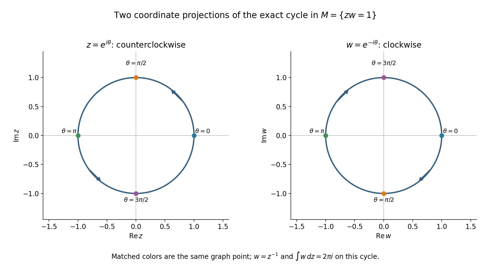
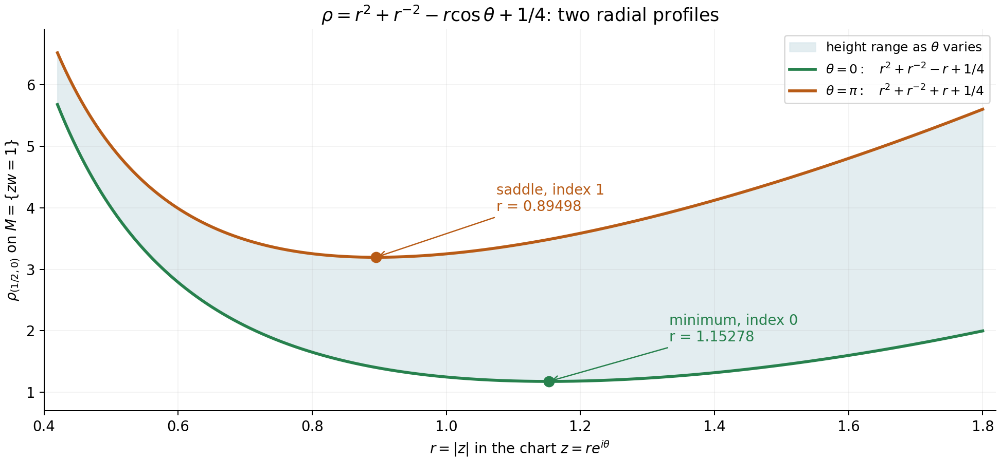

# Rational top forms detect cycles in a hypersurface complement

*Written by GPT-6.1 Sol (OpenAI), October 2026. Self-checked by the writing AI. Public domain (CC0).*

Suppose a finite cycle lies in the region where a polynomial is nonzero. Can rational differential forms tell whether that cycle bounds? The answer is yes in the complex top degree, with rational or complex coefficients. The result also says something stronger: every smooth cohomology class in that degree has a rational representative.

The basic references are Hörmander [H] for weighted Cauchy–Riemann equations, Sard [S] for critical values and Grothendieck [G] for the broader algebraic de Rham comparison. The complete proof following this introduction gives a direct route for a polynomial complement. It uses the exact internal integration theorem in [When zero smooth periods mean that a cycle bounds](../../AN02-L116.html#cd6-integration-and-smooth-continuous-comparison), the written semialgebraic projection proof in [Symbols at infinity](../../AN02-L018.html#algebraic-inequalities-survive-projection), and [Ordinary finite-chain Morse handles](../../AN02-L125.html#mh0-statement-coefficients-and-boundary-cases). All needed analytic steps are proved in the formal argument, including the higher-degree estimate and local smoothness.

## 1. The theorem and what its coefficients mean

Let \(d\geq1\), let \(f\) be a nonzero complex polynomial on \(\mathbb C^d\), and set
\[
 V=\{z:f(z)\ne0\}.
 \tag{1}
\]
The polynomial may have repeated factors or a singular zero set. A rational top form on \(V\) has the shape
\[
 \eta=\frac{p(z)}{f(z)^k}\,dz_1\wedge\cdots\wedge dz_d,
       \qquad p\in\mathbb C[z],\quad k\geq0.
 \tag{2}
\]
Its poles lie outside \(V\), so it is holomorphic there. It is closed: its antiholomorphic derivative is zero, and the holomorphic exterior derivative has degree \(d+1\), which vanishes in complex dimension \(d\).

**The result.** Every class of closed smooth complex \(d\)-forms on \(V\), modulo smooth exact forms, has a representative (2). A finite smooth \(d\)-cycle is zero in ordinary homology over \(\mathbb C\), or over \(\mathbb Q\), exactly when every period \(\int_c\eta\) vanishes.

Ordinary chains here are finite sums of singular simplices. The result concerns that chain theory. Its rational-coefficient conclusion does not imply vanishing of integral torsion. The exact faithful coefficient change from rational to complex homology is part of the previously proved integration theorem.

There is a projective version. Let \(F\) be homogeneous of degree \(m\geq1\), let \(L\) be a nonzero linear form, and remove both divisors from \(\mathbb P^d\). In coordinates \(Z_0=L,Z_1,\ldots,Z_d\), define
\[
 \omega=\sum_{j=0}^{d}(-1)^jZ_j\,
       dZ_0\wedge\cdots\wedge\widehat{dZ_j}
                             \wedge\cdots\wedge dZ_d.
 \tag{3}
\]
The homogeneous family
\[
 \frac{P\omega}{F^kL^s},\qquad
 k,s\geq1,\qquad \deg P=mk+s-d-1
 \tag{4}
\]
has the same spanning and detection properties on
\(\mathbb P^d\setminus\{FL=0\}\).
The two exponents are positive. A specific form may nevertheless have a removable pole, because its numerator can cancel a factor.

## 2. Four steps that turn approximation into a basis

The missing divisor is moved to infinity by the graph
\[
 M=\{(z,w):f(z)w=1\}\subset\mathbb C^{d+1},
 \qquad \iota(z)=(z,1/f(z)).
 \tag{5}
\]
This is a closed smooth complex manifold, even when \(\{f=0\}\) is singular: on \(M\), the derivative of \(fw-1\) with respect to \(w\) is \(f\ne0\). Projection onto \(z\) is the inverse of \(\iota\).

First, the weighted Cauchy–Riemann estimate is proved in every positive form degree. In degree \(q\), the curvature term acts on a coordinate wedge by a sum of \(q\) Levi eigenvalues. A weight with all those eigenvalues at least one gives
\[
 q\|v\|_\phi^2
       \leq\|\bar\partial_\phi^*v\|_\phi^2+
                    \|\bar\partial v\|_\phi^2.
 \tag{6}
\]
An adaptive radial weight makes any given smooth datum square integrable. The Hilbert argument gives a solution, and a local elliptic bootstrap proves that its minimal solution is smooth.

Second, smooth solutions transfer from the ambient affine space to \(M\). A cutoff extends a closed form from \(V\) to an ambient form \(h\) that is closed near \(M\). If \(G=fw-1\), solve successively
\[
 \bar\partial v=\frac{\bar\partial h}{G},\qquad
 \bar\partial u=h-Gv.
 \tag{7}
\]
Both right sides are smooth global closed forms of the appropriate degrees. Pulling back the second equation gives the desired solution on \(V\). This removes the positive antiholomorphic degrees of a closed smooth top form, one at a time, and leaves a holomorphic top form in the same class.

Third, every holomorphic coefficient \(g\) on \(V\) extends to an entire function \(H(z,w)\). Apply the same cutoff and the scalar equation to construct \(H=h-Gv\). Entire Taylor polynomials approximate \(H\) on compact sets. On \(M\), their monomials become
\[
 z^\alpha w^j=\frac{z^\alpha}{f(z)^j}.
 \tag{8}
\]
Thus rational coefficients approximate every holomorphic coefficient on compact sets, with derivatives when desired.

Fourth, the graph has finite-dimensional ordinary homology. A generic squared distance \(|x-a|^2\) on \(M\) is a proper strictly plurisubharmonic Morse function. Its critical-point equations are polynomial; the regular-value argument makes their solution set discrete; semialgebraic projection makes a discrete such set finite. The finite-chain handle theorem then gives finite-dimensional homology, with no groups above degree \(d\).

The distinction between approximation and exact spanning matters. Choose a finite cycle basis and holomorphic forms with identity period matrix. Approximate their coefficients so well that the rational period matrix \(P\) satisfies \(\|P-I\|_\infty<1/2\). It is invertible. Those finitely many rational-form classes therefore form an exact basis of cohomology. The proof does not replace a rational representative by an infinite series of rational forms.

## 3. Four worked examples

### Example 1. The punctured line and its orientation

Take \(d=1\), \(f(z)=z\), so \(V=\mathbb C^*\). Write \(z=re^{i\theta}\). The expression \(d\theta\) is a global smooth one-form even though a single real-valued angle is not global:
\[
 d\theta=\frac{x\,dy-y\,dx}{x^2+y^2},\qquad
 \frac{dz}{z}=d\log r+i\,d\theta.
 \tag{9}
\]
Therefore
\[
 \frac{d\theta}{2\pi}
       -\frac{dz}{2\pi i z}=\frac{i}{2\pi}d\log r
 \tag{10}
\]
is exact. The smooth angular class has the rational representative \(dz/(2\pi i z)\).

Orient the unit circle by increasing \(\theta\), from \(0\) to \(2\pi\). Then
\[
 \int_{|z|=1}\frac{dz}{2\pi iz}
   =\frac1{2\pi i}\int_0^{2\pi}i\,d\theta=1.
 \tag{11}
\]
The homotopy
\[
 z\longmapsto\bigl((1-t)|z|+t\bigr)\frac{z}{|z|},
             \qquad0\leq t\leq1,
 \tag{12}
\]
stays in \(\mathbb C^*\), fixes the unit circle and retracts onto it. The written singular-homology calculation of the circle gives a one-dimensional \(H_1\), so the nonzero period identifies a basis of its dual cohomology. Reversing the orientation changes the period to \(-1\).

*Figure 1. The exact cycle is \(\theta\mapsto(e^{i\theta},e^{-i\theta})\) in \(M=\{zw=1\}\), oriented by increasing \(\theta\). The two panels show its complex coordinate projections, rather than all four real ambient coordinates. Equal colors mark the same graph point. The \(z\) projection goes counterclockwise and the \(w\) projection clockwise; the form is \(w\,dz\), whose period is \(2\pi i\), with the orientation of the parameter cycle. Equations (5), (9)–(11) and formal Proposition 5.1 give the exact graph and period mechanism. Original figure, CC0-1.0; classical method context [H].*

### Example 2. An essential singularity still admits rational approximation

On the same complement, let \(g(z)=e^{1/z}\). The ambient entire extension is explicit:
\[
 H(z,w)=e^w,\qquad H(z,1/z)=g(z).
 \tag{13}
\]
The entire Taylor polynomial restricts to
\[
 r_N(z)=\sum_{j=0}^{N}\frac{1}{j!z^j}.
 \tag{14}
\]
On any compact annulus \(a\leq|z|\leq b\), \(a>0\), the tail satisfies
\[
 |g(z)-r_N(z)|
 \leq\sum_{j=N+1}^{\infty}\frac{a^{-j}}{j!}
 \leq e^{1/a}\frac{a^{-N-1}}{(N+1)!}.
 \tag{15}
\]
For the last inequality write \(j=N+1+\ell\) and use
\((N+1+\ell)!\geq(N+1)!\ell!\).
The right side tends to zero for fixed \(a\), without requiring control at \(z=0\).

The period on the positively oriented unit circle is exactly
\[
 \int_{|z|=1} e^{1/z}\,dz=2\pi i.
 \tag{16}
\]
Indeed the Laurent series converges uniformly on that circle, so it can be integrated term by term. The term \(j=1\) has period \(2\pi i\); every other term has period zero by the parameter integral of \(i e^{i(1-j)\theta}\). Already every partial sum with \(N\geq1\) has this exact period, although none equals the full holomorphic function.

### Example 3. Repeated factors change denominators but not the space

Take \(f(z)=z^m\), \(m\geq1\). The complement is still \(\mathbb C^*\), while the closed graph is now
\[
 M_m=\{z^m w=1\}.
 \tag{17}
\]
It is smooth because \(\partial(z^m w-1)/\partial w=z^m\ne0\) on the graph. The basic period form belongs to the allowed family:
\[
 \frac{dz}{z}=\frac{z^{m-1}}{f(z)}\,dz .
 \tag{18}
\]
Likewise every negative Laurent monomial is represented with powers of this repeated denominator:
\[
 z^{-j}=\frac{z^{(m-1)j}}{f(z)^j},\qquad j\geq0.
 \tag{19}
\]
The extension of the preceding example can be taken as
\[
 H(z,w)=\exp(z^{m-1}w),
 \tag{20}
\]
which is entire and restricts to \(e^{1/z}\). Its Taylor monomials give exactly (19). The graph argument uses smoothness of the graph, which follows from nonvanishing of \(f\) there; it imposes no reduced-divisor assumption.

### Example 4. A squared distance with exactly two critical points

On \(M=\{zw=1\}\), choose the real ambient center \(a=(1/2,0)\in\mathbb C^2\). In its global chart \(z=re^{i\theta}\), \(w=r^{-1}e^{-i\theta}\), the squared distance is
\[
 \rho=r^2+r^{-2}-r\cos\theta+\tfrac14.
 \tag{21}
\]
It tends to infinity as \(r\downarrow0\) or \(r\uparrow\infty\), hence is proper on the graph. Its Levi form in the \(z\) chart is \(1+|(-1/z^2)|^2>0\).

The angular critical equation is \(\rho_\theta=r\sin\theta=0\). As \(r>0\), the only possibilities on the circle are \(\theta=0\) and \(\theta=\pi\). The radial equation is
\[
 r-r^{-3}=\tfrac12\cos\theta .
 \tag{22}
\]
The function on the left has derivative \(1+3r^{-4}>0\), with limits \(-\infty\) and \(+\infty\). There is exactly one positive root for each of the two angles. They satisfy
\[
 r_+^4-\tfrac12r_+^3-1=0,\quad 1<r_+<\tfrac54,
 \qquad
 r_-^4+\tfrac12r_-^3-1=0,\quad \tfrac45<r_-<\tfrac9{10}.
 \tag{23}
\]
The bounds follow by inserting the endpoints into the strictly increasing function in (22). Numerically the roots are \(r_+\approx1.15278\) and \(r_-\approx0.89498\); those decimal labels illustrate the exact equations, rather than defining the roots.

At either critical point the mixed Hessian entry is zero and
\[
 \rho_{rr}=2+6r^{-4}>0,\qquad
 \rho_{\theta\theta}=r\cos\theta .
 \tag{24}
\]
The point at \(\theta=0\) has index zero, and the point at \(\theta=\pi\) has index one. The radial profile at the latter point has a minimum, but the full two-variable height has a negative angular direction; this is why it is a saddle.

The finite-chain handle argument gives at most one degree-one generator. The nonzero period in Example 1 gives at least one. Thus the ordinary \(H_1\) has dimension exactly one, consistent with the explicit radial retraction (12). The handle argument does not simply add generators from arbitrary critical levels: the exact sequences account for possible cancellation.

*Figure 2. The curves are the exact profiles of (21) at \(\theta=0\) and \(\theta=\pi\); the shaded interval is the exact range of the height as \(\theta\) varies at fixed \(r\). This is a plot in the chart \(z=re^{i\theta}\), not an ambient embedding of \(M\). Critical labels use the unique positive roots in (23), with the indices computed from (24). The saddle has a positive radial Hessian and negative angular Hessian. Formal Proposition 6.3 and Corollary 6.4 explain how this example models the generic finite-critical-point argument. Original figure, CC0-1.0; classical critical-value method context [S].*

## 4. Exercises, 100 points

1. **The sharp Gaussian degree constant, 10 points.** For \(\phi(Z)=|Z|^2\) on \(\mathbb C^D\) and \(1\leq q\leq D\), take \(a=d\bar Z_1\wedge\cdots\wedge d\bar Z_q\). Construct a polynomial \((0,q-1)\)-form \(u\) with \(\bar\partial u=a\) and \(\|u\|_\phi^2=\|a\|_\phi^2/q\). Explain why no solution has a smaller weighted norm.
2. **Curvature on actual wedges, 12 points.** Verify the sign of \(c_2^*(d\bar Z_1\wedge d\bar Z_2)\). For a diagonal Levi matrix with eigenvalues \(2,3,5\), compute the three curvature eigenvalues in degree two. Explain the general sum-of-eigenvalues rule and its degree-\(q\) lower bound.
3. **Smoothness before restriction, 14 points.** Explain why an arbitrary \(L^2_{\mathrm{loc}}\) ambient form cannot simply be restricted to \(M\). Derive the elliptic equation for the minimal solution in formal Theorem 1.2. In four real dimensions, how many steps from \(L^2_{\mathrm{loc}}\) in the written one-order bootstrap suffice to guarantee a \(C^2\) representative?
4. **The top-degree endpoint of graph transfer, 12 points.** For a closed \((0,d)\)-form \(a\) on \(V\), identify the degrees of \(h\), \(\bar\partial h/G\), \(v\), \(h-Gv\) and \(u\) in (7). Prove that the quotient is smooth and closed and that the final pullback solves \(\bar\partial b=a\).
5. **Why critical images are small, 12 points.** In the equal-dimensional critical-value proof, derive the total covering-volume bound from the number of grid cubes and the thin-box estimate. Apply the statement to \(F(x,y)=(x^2,y)\); distinguish the critical set from its image, and explain why the result does not claim that either set is finite.
6. **Why the algebraic critical points are finite, 10 points.** Prove that a discrete semialgebraic subset of \(\mathbb R^s\) is finite using coordinate projections. Explain which two facts establish those hypotheses for the set (37), and why discreteness alone would be insufficient.
7. **An exact rational period basis, 16 points.** Explain why the error in (45) produces an invertible period matrix. For
\[
 P=\begin{pmatrix}1&1/5\\1/5&1\end{pmatrix},
 \qquad b=\begin{pmatrix}2\\-1\end{pmatrix},
 \tag{25}
\]
compute the rational-form coefficients with period vector \(b\). If their denominators are \(f^2\) and \(f^5\), combine the result into one denominator. Explain precisely where finite-dimensionality enters.
8. **Positive projective pole orders, 14 points.** In \(\mathbb P^2\), take \(L=Z_0\), any nonzero cubic \(F\), and the affine polynomial form \((z_1^2+z_2)\,dz_1\wedge dz_2\), initially with denominator exponent zero. Construct (4) with \(k,s\geq1\), verify its homogeneous degree and its affine restriction, and explain why this representation also works if \(F\) has repeated factors.

## 5. Complete solutions

### Solution 1

Put \(a=d\bar Z_1\wedge\cdots\wedge d\bar Z_q\) and
\[
 u=\frac1q\sum_{j=1}^q(-1)^{j-1}\bar Z_j\,
       d\bar Z_1\wedge\cdots\wedge\widehat{d\bar Z_j}
                                     \wedge\cdots\wedge d\bar Z_q .
 \tag{26}
\]
Differentiating each coefficient inserts \(d\bar Z_j\) in front of the omitted-index wedge. Moving it past \(j-1\) indices cancels the displayed sign. Each summand contributes \(a/q\), so \(\bar\partial u=a\). **4 points.**

Distinct omitted-index wedges are orthogonal in the stipulated coefficient norm. The product Gaussian integral is \(\|a\|_\phi^2=\pi^D\), while
\(\int_{\mathbb C^D}|Z_j|^2e^{-|Z|^2}dV=\pi^D\).
The latter follows in that coordinate from
\(2\pi\int_0^\infty r^3e^{-r^2}dr=\pi\);
the other coordinates contribute \(\pi^{D-1}\). Thus
\[
 \|u\|_\phi^2=q^{-2}\sum_{j=1}^q\pi^D=\pi^D/q .
 \tag{27}
\]
**3 points.**

For the Gaussian, \(T^*a=\sum_j\bar Z_jc_j^*a=qu\), since \(\partial_ja=0\). The constant form \(a\) belongs to the weighted adjoint domain: both it and \(T^*a\) have finite Gaussian norm. Hence \(u=q^{-1}T^*a\) is orthogonal to \(\ker T\). Any other weighted-square-integrable solution is \(u+h\), with \(Th=0\), so its squared norm is \(\|u\|_\phi^2+\|h\|_\phi^2\geq\|u\|_\phi^2\). Solutions of infinite weighted norm cannot improve that bound. The constant \(1/q\) is attained. **3 points.**

### Solution 2

Deleting the second index passes the contraction over the first wedge factor:
\[
 c_2^*(d\bar Z_1\wedge d\bar Z_2)=-d\bar Z_1.
 \tag{28}
\]
Inserting it again gives \(c_2(-d\bar Z_1)=d\bar Z_1\wedge d\bar Z_2\). Thus \(c_2c_2^*\) is \(+I\) on this wedge, despite the intermediate minus sign. **3 points.**

The degree-two basis consists of indices \(12,13,23\). The diagonal curvature \(\sum_j\lambda_jc_jc_j^*\) therefore has eigenvalues
\[
 2+3=5,\qquad2+5=7,\qquad3+5=8.
 \tag{29}
\]
**3 points.** Each \(c_jc_j^*\) keeps a wedge containing \(j\) and kills one missing \(j\). For a degree-\(q\) wedge this sums exactly its \(q\) selected eigenvalues. Unitary diagonalization preserves the coefficient inner product, so this determines the general Hermitian curvature spectrum at a point. **4 points.** If all eigenvalues are at least \(\kappa>0\), every selected sum is at least \(q\kappa\). Here that lower bound is \(4\), while the exact smallest degree-two curvature eigenvalue is \(5\). **2 points.**

### Solution 3

An \(L^2_{\mathrm{loc}}\) coefficient is specified only up to changes on sets of ambient measure zero. The graph \(M\) has real codimension two and ambient measure zero, so its point values are not determined by that equivalence class. A plain restriction is therefore undefined without additional regularity or a proved trace statement. **3 points.**

For the minimal Hilbert solution \(u\), orthogonality to \(\ker T_{q-1}\) implies \(T_{q-2}^*u=0\), because the lower range is contained in that kernel. Together with \(T_{q-1}u=a\), this yields
\[
 (T_{q-2}T_{q-2}^*+T_{q-1}^*T_{q-1})u=T_{q-1}^*a .
 \tag{30}
\]
For \(q=1\) the first product is absent. Expanding the left side gives
\[
 -\tfrac14\Delta u+\sum_j\phi_j\bar\partial_ju+
       \sum_{j,k}\phi_{k\bar j}c_jc_k^*u=T_{q-1}^*a .
 \tag{31}
\]
The right side and all coefficients are smooth. **5 points.**

With a compact cutoff, the first-order terms initially belong to \(H^{-1}\). The Fourier estimate for \(\Delta\) gives one gain, from \(L^2=H^0\) to \(H^1\); repeating with nested cutoffs gains one integer order at each step. **3 points.** In real dimension four, \(H^s\) gives continuous derivatives through order two when \(s>2+4/2=4\). Five steps reach \(H^5_{\mathrm{loc}}\), which suffices for \(C^2\). Continuing to arbitrarily high orders proves smoothness, after which ordinary pullback is legitimate. **3 points.**

### Solution 4

The degrees are respectively \(d,d+1,d,d,d-1\). The ambient dimension is \(d+1\), so the first right side has its permitted top antiholomorphic degree. The second equation uses degree \(d\); neither equation is beyond the available theorem. **3 points.**

Near \(f=0\) at a finite ambient point, \(G\) is close to \(-1\), and the cutoff in (22) is zero on a neighborhood. Hence \(h\) extends smoothly by zero. Near \(M\), the cutoff is one, so \(\bar\partial h=\pi^*\bar\partial a=0\) on a neighborhood. Therefore \(\bar\partial h/G\) extends smoothly by zero through \(M\). Off \(M\) it is closed because \(G\) is holomorphic and \(\bar\partial^2=0\); near \(M\) it is zero. **4 points.**

Solve \(\bar\partial v=\bar\partial h/G\). Then \(H=h-Gv\) is closed, so solve \(\bar\partial u=H\). Both solutions are smooth by the proved ambient theorem. The holomorphic pullback commutes with \(\bar\partial\), while \(\iota^*h=a\) and \(G\circ\iota=0\). Thus
\[
 \bar\partial(\iota^*u)=\iota^*(h-Gv)=a .
 \tag{32}
\]
**5 points.**

### Solution 5

On a fixed compact domain set, there are at most \(C_Q\delta^{-N}\) cubes of side \(\delta\). At a singular derivative the linear image has rank at most \(N-1\). Uniform continuity of the derivative makes the nonlinear remainder at most \(C_N\varepsilon\delta\), so each image fits in a box of volume at most
\(C_N(B+\varepsilon)^{N-1}\varepsilon\delta^N\).
The sum is therefore at most
\[
 C_QC_N(B+\varepsilon)^{N-1}\varepsilon .
 \tag{33}
\]
The grid scale cancels. Letting \(\varepsilon\) decrease to zero gives outer measure zero; compact exhaustion covers the entire open domain. **7 points.**

For \(F(x,y)=(x^2,y)\), the derivative is \(\operatorname{diag}(2x,1)\). Its critical set is \(\{x=0\}\), and its critical image is \(\{(0,y):y\in\mathbb R\}\). That image has two-dimensional measure zero but infinitely many points. **3 points.** The critical-value statement gives a measure conclusion about images. It does not make the domain critical set discrete or finite. In Proposition 6.3, choosing a regular center separately makes the relevant preimages discrete, and their polynomial equations then give finiteness. **2 points.**

### Solution 6

Every point of a discrete subset has a ball from the countable rational basis meeting the subset in that point alone. Assigning the first such ball injects the subset into a countable set. Its coordinate projections are thus countable. Semialgebraic projection makes each projection semialgebraic. A one-dimensional semialgebraic set is constant on the intervals between the finitely many real roots of its defining nonzero polynomials; hence it is a finite union of intervals and points. Countability excludes every nonempty interval. Each coordinate projection is finite, so the original subset lies in their finite Cartesian product and is finite. **6 points.**

For (37), polynomial equations give semialgebraicity. A regular value of the normal-parameter map makes each solution isolated by the inverse function theorem; the graph chart has the actual ambient subspace topology, so this is discreteness of the polynomial solution set itself. **3 points.** The set \(\{1/n:n\geq1\}\subset\mathbb R\) is discrete and infinite; its accumulation point zero is outside it. Thus discreteness alone is insufficient. It is not semialgebraic, by the preceding one-dimensional conclusion. **1 point.**

### Solution 7

For each basis cycle, (42) bounds the period error by \(B_{c_i}\varepsilon\). With (45) this is less than \(1/(2r)\). The row-sum error norm is consequently less than \(1/2\). If \(Pv=0\), then \(v=(I-P)v\), and the norm inequality forces \(v=0\). Thus the finite square matrix is invertible. **5 points.**

In the example,
\[
 P^{-1}=
 \begin{pmatrix}25/24&-5/24\\-5/24&25/24\end{pmatrix},
 \qquad
 P^{-1}b=\begin{pmatrix}55/24\\-35/24\end{pmatrix}.
 \tag{34}
\]
One can verify both equations by direct multiplication; the determinant is \(1-1/25=24/25\). The coefficients of the two rational-form classes are therefore \(55/24\) and \(-35/24\). **4 points.**

If their numerators are \(p_1,p_2\) and their denominator powers are two and five, the combined representative is
\[
 \left(\frac{55}{24}\frac{p_1}{f^2}
          -\frac{35}{24}\frac{p_2}{f^5}\right)
          dz_1\wedge\cdots\wedge dz_d
 =\frac{55p_1f^3-35p_2}{24f^5}\,
          dz_1\wedge\cdots\wedge dz_d .
 \tag{35}
\]
**3 points.** Finite-dimensionality gives a finite cycle basis, its finite union of compact simplex images, and a finite square period matrix. Approximation then produces finitely many exact independent classes. Without that step, density does not establish algebraic spanning: polynomials approximate the entire function \(e^z\) on compact subsets of \(\mathbb C\), yet no finite linear combination of polynomials equals \(e^z\), since all sufficiently high derivatives of a polynomial vanish. The finite period matrix, rather than coefficient approximation alone, establishes the cohomological assertion. **4 points.**

### Solution 8

Start with \(p=z_1^2+z_2\) and \(k=0\). Replace it by \(k=1\) and numerator \(pf\), where \(f=F(1,z_1,z_2)\). Choose homogenizing degree \(D_0=5\). Since \(m=3\) and \(d=2\), formula (52) gives \(s=5-3+2+1=5\). A suitable homogeneous numerator is
\[
 P(Z)=(Z_1^2+Z_0Z_2)F(Z).
 \tag{36}
\]
It has degree \(2+3=5\), exactly
\(mk+s-d-1=3+5-2-1=5\).
**5 points.**

The projective form is
\[
 \frac{(Z_1^2+Z_0Z_2)F\,\omega}{FZ_0^5}
        =\frac{(Z_1^2+Z_0Z_2)\omega}{Z_0^5}
 \tag{37}
\]
on the complement. Its total homogeneous weight is \(5+3-3-5=0\), since \(\omega\) has weight three, and it is horizontal as a multiple of the Euler-contracted volume form. **4 points.** On the section \(Z_0=1\), \(\omega=dz_1\wedge dz_2\), and (37) becomes exactly the given affine form. Both stipulated denominator exponents are positive, although the \(F\) pole cancels. **3 points.** Cancellation only uses that \(F\ne0\) on this complement; no factorization or simple-zero hypothesis is required. The same calculation therefore works for repeated factors and even when the affine degree of \(f\) is less than three. **2 points.**

## 6. The next geometric application

The complete proof below gives the all-degree smooth Cauchy–Riemann estimate, graph transfer, holomorphic representatives, entire extension, finite-dimensionality and exact rational spanning. Each step retains the hypotheses needed by the next one. In particular the finite period matrix turns compact approximation into an exact cohomological basis.

The exact rational spanning theorem can be combined with a normal-tube injection, once the specified cycle has actually been identified with that tube. The affine/projective cycle, orientation, sign and multiplicity must be established in that application. This lesson supplies the rational-form step and preserves that separate geometric obligation.

## References

[H] Lars Hörmander, *\(L^2\) estimates and existence theorems for the \(\bar\partial\) operator*, Acta Mathematica **113** (1965), 89–152. [Primary article](https://archive.ymsc.tsinghua.edu.cn/pacm_download/117/5989-11511_2006_Article_BF02391775.pdf), [journal record](https://www.mathnet.ru/eng/mat389).

[S] Arthur Sard, *The measure of the critical values of differentiable maps*, Bulletin of the American Mathematical Society **48** (1942), 883–890. [Original article](https://webhomes.maths.ed.ac.uk/~v1ranick/papers/sard.pdf).

[G] Alexander Grothendieck, *On the de Rham cohomology of algebraic varieties*, Publications Mathématiques de l'IHÉS **29** (1966), 95–103. [Primary article](https://www.numdam.org/item/PMIHES_1966__29__95_0.pdf). The broader comparison is historical context; the exact top-degree argument used here is fully supplied.

Original lesson prose and figures are CC0-1.0. The linked historical articles retain their own rights and are not reproduced.
