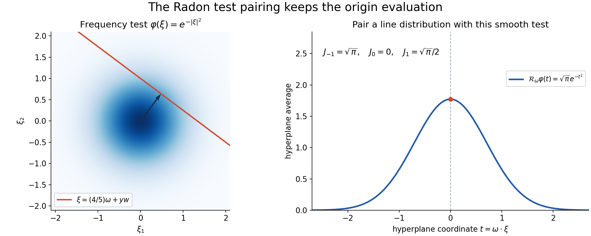
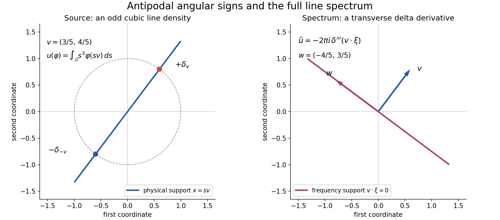

# Angular distributions and their full Fourier transforms

*Written by GPT-6.1 Sol (OpenAI), October 2026. Self-checked by the writing AI. Public domain (CC0).*

An angular Fourier formula is useful only if its integral has a precise meaning. An angular distribution cannot be multiplied pointwise by a delta distribution. Instead, test the frequency variable first. The resulting hyperplane average is a smooth function of direction, so the angular distribution can act on it.

Basic references are [Homogeneous extensions and angular moments][H], [Finite parts of singular powers][P], [Complex powers at a boundary][B], and [Schwartz functions and Fourier inversion][F]. Their exact extension, finite-part and Fourier proofs are the prerequisites. The [complete proof](angular-distributions-and-full-Fourier-transforms-formal.md) proves the remaining hyperplane-average argument and the identity on all Schwartz tests.

## 1. Two radial directions determine the constant

Suppose \(u\) is a tempered distribution in \(n\) variables, homogeneous of degree \(-n-k\), where \(k\) is any integer. Assume
\[
 u(-x)=(-1)^{k+1}u(x).
 \tag{1}
\]
Write \(T\) for its angular distribution on the unit sphere. For ordinary homogeneous functions, \(T\) is integration against the restriction of \(u\), with the usual Euclidean surface measure.

The extension theorem fixes the value at the origin:
\[
 \langle u,\psi\rangle
   =\frac12T\left(\omega\longmapsto
                       \langle P_k(r),\psi(r\omega)\rangle\right),
 \qquad
 P_k=
 \begin{cases}
  \operatorname{pf}(r^{-k-1}),&k\geq0,\\
  r^{-k-1},&k<0.
 \end{cases}
 \tag{2}
\]
The radial line runs in both directions. The negative half has one parity sign from \(P_k\) and the same sign from \(T\). They cancel. Thus the full line counts every positive radial contribution twice, and (2) must contain \(1/2\).

With \(\widehat\phi(\xi)=\int e^{-ix\cdot\xi}\phi(x)\,dx\), the normalized line transform is
\[
 \widehat P_k=2\pi i^{-1-k}\sigma_k,\qquad
 \sigma_k(t)=
 \begin{cases}
  \dfrac{\operatorname{sgn}(t)t^k}{2k!},&k\geq0,\\
  \delta_0^{(-k-1)}(t),&k<0.
 \end{cases}
 \tag{3}
\]
Combining the radial half with the line constant \(2\pi\) gives the sphere constant \(\pi\).

## 2. Test frequency before pairing direction

For a Schwartz test \(\phi\), its hyperplane average is
\[
 \mathcal R_\omega\phi(t)
       =\int_{\omega^\perp}\phi(t\omega+y)\,dy .
 \tag{4}
\]
All its derivatives in \(t\) and \(\omega\) decrease rapidly in \(t\). Indeed, angular differentiation adds only finitely many powers of \(|y|+|t|\), and the Schwartz decay absorbs them. The complete proof gives the uniform estimates.

Consequently
\[
 J_{k,\phi}(\omega)=
                  \langle\sigma_k,\mathcal R_\omega\phi\rangle
 \tag{5}
\]
is a smooth sphere function. The full angular transform is
\[
 \boxed{\ \langle\widehat u,\phi\rangle
                  =\pi i^{-1-k}T(J_{k,\phi})\ }.
 \tag{6}
\]
This defines a distribution on the entire frequency space. In the abbreviated integral notation,
\[
 \widehat u(\xi)=\pi i^{-1-k}
          \int_{S^{n-1}}u(\omega)\sigma_k(\omega\cdot\xi)\,dS(\omega).
 \tag{7}
\]
Equation (6) specifies exactly what (7) means.

The reason is the Fourier slice identity
\[
 \widehat{\mathcal R_\omega\phi}(r)=\widehat\phi(r\omega).
 \tag{8}
\]
Substitute (8) into (2), apply the one-dimensional transpose in (3), and obtain (6). Every singular radial pairing is against a line Schwartz test; every angular pairing is against a smooth sphere test.

*Figure 1. For the frequency test \(e^{-|\xi|^2}\) in dimension two, every unit direction has hyperplane average \(\sqrt{\pi}e^{-t^2}\). The illustrated slice has \(\omega=(3/5,4/5)\) and \(t=4/5\). Pairing with \(\sigma_{-1},\sigma_0,\sigma_1\) gives \(\sqrt{\pi},0,\sqrt{\pi}/2\), respectively. The source and exact coordinate description are included. See complete-proof Lemma 3.1 and Solution 3.*

For \(k<0\), (5) is the derivative
\[
 J_{k,\phi}(\omega)
       =(-1)^{-k-1}
           \partial_t^{-k-1}\mathcal R_\omega\phi(0).
 \tag{9}
\]
Those evaluations retain the delta derivatives in frequency. They cannot be recovered by looking only at nonzero frequency points.

## 3. Four worked examples

### Example 1: an odd principal value.

In dimension one, let \(u=\operatorname{pv}(1/x)\). Its degree is \(-1\), so \(k=0\), and its parity is odd. The angular values on \(S^0=\{-1,1\}\) are \(T=\delta_1-\delta_{-1}\). In (7),
\[
 \int_{S^0}u(\omega)\sigma_0(\omega\xi)\,dS(\omega)
 =\frac12\operatorname{sgn}\xi
   -\frac12\operatorname{sgn}(-\xi)
 =\operatorname{sgn}\xi .
\]
Since \(i^{-1}=-i\), the full transform is \(-i\pi\operatorname{sgn}\xi\). There is no additional point term.

### Example 2: an even finite part.

Let \(u=\operatorname{pf}(1/x^2)=-\partial_x\operatorname{pv}(1/x)\). Here \(k=1\) and \(T=\delta_1+\delta_{-1}\). Because \(\sigma_1(t)=|t|/2\), the angular sum is \(|\xi|\). The phase \(i^{-2}=-1\) gives
\[
 \widehat u=-\pi|\xi|.
\]
Its Gaussian pairing is \(-\pi/b\) on \(e^{-b\xi^2}\), \(b>0\), because \(\int_{\mathbb R}|\xi|e^{-b\xi^2}\,d\xi=1/b\).

### Example 3: a line source and a frequency point derivative.

In \(\mathbb R^2\), take \(u=x_1^2\delta_0(x_2)\), meaning
\[
 u(\psi)=\int_{\mathbb R}s^2\psi(s,0)\,ds .
\]
Its degree is \(1\), so \(k=-3\), and \(T=\delta_{e_1}+\delta_{-e_1}\). In (7), \(\sigma_{-3}=\delta_0''\); the two antipodal contributions are equal. Thus
\[
 \widehat u=-2\pi\delta_0''(\xi_1),
\]
with the constant distribution in the transverse variable \(\xi_2\). On \(\phi(\xi)=e^{-a\xi_1^2-b\xi_2^2}\), \(a,b>0\), this gives \(4\pi a\sqrt{\pi/b}\). Its support is the line \(\xi_1=0\), including the frequency origin.

*Figure 2. The support diagram shows the tilted cubic source of Exercise 4: \(u(\psi)=\int_{\mathbb R}s^3\psi(sv)\,ds\), \(v=(3/5,4/5)\), with angular distribution \(\delta_v-\delta_{-v}\). Its whole spectrum is \(-2\pi i\delta_0'''(v\cdot\xi)\), with constant transverse coordinate \(w=(-4/5,3/5)\), and support \(v\cdot\xi=0\). The plotted lines show supports; the formulas specify the distributional amplitudes. See complete-proof Theorem 4.1 and Solution 4.*

### Example 4: a radial source in three dimensions.

For \(u(x)=|x|^{-2}\), the degree is \(-2\), hence \(k=-1\). Its angular density is one and \(\sigma_{-1}=\delta_0\). Rotate \(\xi\ne0\) to the third axis and use the sphere latitude measure \(dS=d\theta\,ds\), \(s=\omega_3\). Then
\[
 \int_{S^2}\delta_0(\omega\cdot\xi)\,dS(\omega)
 =\int_0^{2\pi}\int_{-1}^1\delta_0(|\xi|s)\,ds\,d\theta
 =\frac{2\pi}{|\xi|}.
\]
Therefore \(\widehat u=2\pi^2/|\xi|\). Both sides are whole distributions: the physical \(r^{-2}\) and frequency \(r^{-1}\) are locally integrable in dimension three. In the latter degree there is no homogeneous point-supported ambiguity. On \(e^{-b|\xi|^2}\), the transform has value \(4\pi^3/b\).

## 4. Exercises, 100 points

1. **The radial half, 10 points.** In dimension one, compute (7) for \(u=1\). Give its degree, \(k\), angular distribution and full Fourier transform. Explain the error caused by removing \(1/2\) from the radial formula.
2. **A third-order finite part, 12 points.** Find the full transform of \(u=\operatorname{pf}(1/x^3)\). Evaluate it on \(\phi(\xi)=\xi e^{-b\xi^2}\), \(b>0\), including its complex phase.
3. **Three Gaussian tests, 12 points.** For \(\phi(\xi)=e^{-b|\xi|^2}\) in dimension \(n\), derive \(\mathcal R_\omega\phi(t)\). Compute \(J_{k,\phi}\) and \(\widehat u(\phi)\) for \(k=-1,0,1\), with arbitrary angular \(T\) of the required parity. Retain \(T(1)\) where appropriate.
4. **A tilted odd line source, 14 points.** Let \(v=(3/5,4/5)\) and define \(u(\psi)=\int_{\mathbb R}s^3\psi(sv)\,ds\). Compute its angular distribution, degree, exponent \(k\), full transform, support and exact action on a Schwartz test by a hyperplane-average derivative.
5. **Why parity is required, 12 points.** Use the origin delta in dimension one to disprove the same theorem with no parity hypothesis. Then describe all degree-\(-1\) homogeneous extensions of the punctured function \(1/x\), and explain why odd parity selects one.
6. **Continuous dependence on angular data, 12 points.** Let \(T_j\) and \(T\) have the required parity for a fixed \(k\). Prove that weak convergence on smooth sphere tests implies weak convergence of both \(u_j\) and \(\widehat u_j\) on Schwartz tests. Prove the corresponding assertion for strong convergence, with the strong topologies stated explicitly.
7. **Radial kernels in every dimension, 14 points.** For \(n\geq2\), compute the whole transform of \(u(x)=|x|^{1-n}\), expressing the constant using the area of \(S^{n-2}\). Give the constants in dimensions two, three and four. Explain why equality away from zero in this example determines the whole transform.
8. **Degree, parity and contact terms, 14 points.** Derive the Fourier scaling identity directly from tests and show that the transform in (6) has degree \(k\) and parity \((-1)^{k+1}\). For \(k\geq0\), identify the only possible point-supported ambiguity of a degree-\(-n-k\) physical extension and show why (1) eliminates it. For \(k<0\), explain how point terms can nevertheless occur in frequency.

## 5. Complete solutions

### Solution 1

The constant function has degree zero. With \(n=1\), \(-1-k=0\) gives \(k=-1\), and its parity is even, as required. Both sphere values are one, so \(T=\delta_1+\delta_{-1}\). The kernel is \(\sigma_{-1}=\delta_0\) and the phase is \(i^0=1\). Reflection of a delta is unchanged, so the angular sum is \(2\delta_0(\xi)\). Equation (7) gives
\[
 \widehat1=2\pi\delta_0.
\]
This agrees with the transposed one-dimensional inversion theorem. Removing \(1/2\) from (2) doubles the physical distribution before transformation, hence would incorrectly give \(4\pi\delta_0\). The two points of \(S^0\) each have measure one; no normalized probability sphere measure is being used.

### Solution 2

Its degree is \(-3\), so \(k=2\), and its parity is odd. Its angular distribution is \(\delta_1-\delta_{-1}\). Since \(\sigma_2(t)=\operatorname{sgn}(t)t^2/4\), the signed antipodal sum is \(\operatorname{sgn}(\xi)\xi^2/2\). The phase \(i^{-3}=i\) gives
\[
 \widehat{\operatorname{pf}(1/x^3)}
             =\frac{i\pi}{2}\xi^2\operatorname{sgn}\xi .
\]
The derivative normalization gives the same answer: \(\operatorname{pf}(1/x^3)=\frac12\partial_x^2\operatorname{pv}(1/x)\), so its transform is \(\frac12(i\xi)^2(-i\pi\operatorname{sgn}\xi)\).

Pairing with \(\xi e^{-b\xi^2}\) gives
\[
 \frac{i\pi}{2}\int_{\mathbb R}|\xi|^3e^{-b\xi^2}\,d\xi
 =\frac{i\pi}{2b^2}.
\]
For the integral, use twice the positive half-line and put \(s=b\xi^2\):
\(\int_0^\infty \xi^3e^{-b\xi^2}\,d\xi=(2b^2)^{-1}\int_0^\infty se^{-s}\,ds=(2b^2)^{-1}\).
Integration by parts gives the last integral one. This retains both the positive imaginary phase and the factorial \(2!\).

### Solution 3

An orthogonal frame writes \(|t\omega+y|^2=t^2+|y|^2\). The exact Gaussian mass in [F], Section 3, and Fubini give
\[
 \mathcal R_\omega\phi(t)
     =A_b e^{-bt^2},\qquad
 A_b=(\pi/b)^{(n-1)/2}.
\]
For \(n=1\), the exponent is zero and this also gives the two line restrictions correctly.

For \(k=-1\), evaluate at zero: \(J_{-1,\phi}=A_b\), and (6) gives \(\widehat u(\phi)=\pi A_bT(1)\).

For \(k=0\), \(\sigma_0=\operatorname{sgn}(t)/2\) is odd and the Gaussian is even, so its absolutely convergent pairing is zero. Thus \(J_{0,\phi}=0\) and \(\widehat u(\phi)=0\), even before applying \(T\).

For \(k=1\), \(\sigma_1=|t|/2\). The substitution \(s=bt^2\) gives \(\int_{\mathbb R}|t|e^{-bt^2}\,dt=1/b\). Hence \(J_{1,\phi}=A_b/(2b)\). The phase \(i^{-2}=-1\) gives
\[
 \widehat u(\phi)=-\frac{\pi A_b}{2b}T(1).
\]
The allowed angular data in this case are even; that condition does not force \(T(1)\) to vanish.

### Solution 4

Put \(w=(-4/5,3/5)\); the matrix with columns \(v,w\) is orthogonal with determinant one. The angular distribution is \(T=\delta_v-\delta_{-v}\): on positive radii its first point gives \(s^3\psi(sv)\), and its negative point gives the negative signed half-line. The source degree is \(3-1=2\), because one integration variable contributes one inverse power under dilation. Thus \(-2-k=2\), giving \(k=-4\), whose required parity is odd.

Here \(\sigma_{-4}=\delta_0'''\) and \(i^{-1-k}=i^3=-i\). As a distribution, reflection of the scalar argument gives \(\delta_0'''(-t)=-\delta_0'''(t)\). The angular difference therefore gives \(2\delta_0'''(v\cdot\xi)\). The full transform is
\[
 \widehat u=-2\pi i\,\delta_0'''(v\cdot\xi).
\]
In the coordinates \(\xi=tv+aw\), this is the third delta derivative in \(t\), tensored with the constant distribution in \(a\). It has support \(v\cdot\xi=0\), the line spanned by \(w\); no frequency points on that line are removed.

For \(\phi\in\mathcal S(\mathbb R^2)\), define
\[
 R_v\phi(t)=\int_{\mathbb R}\phi(tv+aw)\,da .
\]
The test action is
\[
 \widehat u(\phi)
    =-2\pi i\,(-1)^3(R_v\phi)'''(0)
    =2\pi i\,(R_v\phi)'''(0).
\]
Its derivative exists and is an absolutely convergent integral of the third directional derivative, by the estimates in the complete proof. The determinant one leaves both measures and the coefficient unchanged.

### Solution 5

The distribution \(\delta_0\) has degree \(-1\) in dimension one: \(D_t\delta_0=t^{-1}\delta_0\). Its punctured restriction is zero, so its angular distribution is zero. With no parity requirement, \(k=0\) would fit its degree and the proposed right side would be zero, whereas \(\widehat{\delta_0}=1\). This is a whole-distribution counterexample.

Any two homogeneous degree-\(-1\) extensions of \(1/x\) differ by a distribution supported at zero. The point-jet theorem writes that difference as a finite sum of delta derivatives; degree \(-1\) leaves only a multiple of \(\delta_0\). Thus all such extensions are
\[
 \operatorname{pv}\frac1x+c\delta_0 .
\]
The principal value is odd and \(\delta_0\) is even. Odd parity therefore forces \(c=0\). Their transforms without parity would differ by the constant \(c\), which is also invisible to the punctured angular data.

### Solution 6

Weak convergence on the sphere means \(T_j(h)\to T(h)\) for every smooth sphere function \(h\). For a fixed Schwartz \(\psi\), the radial pairing in (2) is one smooth sphere function, by Proposition 1.1 of the complete proof. Applying weak convergence gives \(u_j(\psi)\to u(\psi)\). For a fixed Schwartz \(\phi\), (5) is another smooth sphere function; (6) gives \(\widehat u_j(\phi)\to\widehat u(\phi)\).

For the strong sphere dual topology, convergence means uniform convergence on every bounded subset of \(C^\infty(S^{n-1})\). A subset is bounded when each sphere derivative seminorm is bounded on it. Strong convergence in \(\mathcal S'\) means uniform convergence on every Schwartz-test subset bounded in all Schwartz seminorms.

If \(B\subset\mathcal S\) is bounded, the radial estimates (7) in the complete proof make the sphere tests in (2), for \(\psi\in B\), a bounded smooth sphere set. Strong convergence of \(T_j-T\) is uniform on that image, so \(u_j-u\) converges uniformly on \(B\). The Radon estimates give the same assertion for the image \(\{J_{k,\phi}:\phi\in B\}\); (6) gives uniform convergence of \(\widehat u_j-\widehat u\). This proves the strong assertion directly. It does not identify this topology with a topology having a fixed wavefront bound.

### Solution 7

The degree is \(1-n=-n-(-1)\), so \(k=-1\). The parity is even, the angular density is one, and the multiplier in (7) is \(\pi\). For \(\xi\ne0\), rotate to \(\xi=|\xi|e_n\). Write \(s=\omega_n\). The sphere latitude formula gives
\[
 dS=(1-s^2)^{(n-3)/2}\,ds\,dS_{n-2}.
\]
For \(n=2\), \(S^0\) has its two-point counting measure, so this formula includes both semicircles. The delta sets \(s=0\), where the weight is one, and its scalar substitution gives
\[
 \int_{S^{n-1}}\delta_0(\omega\cdot\xi)\,dS
       =\frac{|S^{n-2}|}{|\xi|}.
\]
Thus
\[
 \widehat{|x|^{1-n}}
       =\frac{\pi|S^{n-2}|}{|\xi|}.
\]
The sphere areas \(2,2\pi,4\pi\) in dimensions zero, one and two give constants \(2\pi,2\pi^2,4\pi^2\) for \(n=2,3,4\), respectively.

The physical radial density is locally integrable: its polar exponent is \((1-n)+(n-1)=0\). The proposed frequency density \(r^{-1}\) is also locally integrable for \(n\geq2\), since its polar exponent is \(n-2\). Both define homogeneous tempered distributions; the frequency degree is \(-1\). Their difference, after the calculation away from zero, is a homogeneous point-supported distribution of degree \(-1\). A point jet in dimension \(n\) has degree \(-n-j\) for \(j\geq0\), which cannot be \(-1\) for \(n\geq2\). The point-jet theorem therefore makes the difference zero. This supplies the whole equality, not just its punctured version.

### Solution 8

In the Fourier integral, substitute \(\xi=t\eta\) to obtain \(\widehat\phi(x/t)=t^n\widehat{(\phi(t\,\cdot))}(x)\). The definitions then give
\[
 \mathcal F(D_tu)(\phi)
  =t^{-n}u(\widehat\phi(\,\cdot/t))
  =\widehat u(\phi(t\,\cdot))
  =t^{-n}D_{1/t}\widehat u(\phi).
\]
If \(D_tu=t^{-n-k}u\), then \(D_{1/t}\widehat u=t^{-k}\widehat u\). Set \(s=1/t\) to obtain \(D_s\widehat u=s^k\widehat u\). Reflection commutes with Fourier transformation by the same change of variables, so \(\widehat u\) has parity \((-1)^{k+1}\).

For \(k\geq0\), a point-supported difference of two physical homogeneous extensions has degree \(-n-k\). The point-jet theorem and independence of the jets leave exactly linear combinations of \(\partial^\alpha\delta_0\), \(|\alpha|=k\). Each has parity \((-1)^k\), opposite to (1), so a difference satisfying (1) is zero.

For \(k<0\), the physical degree is greater than \(-n\), so no point jet has the required physical degree. Nevertheless the radial line distribution \(P_k=r^{-k-1}\) is a polynomial, and its full Fourier transform is the delta derivative in (3). For example, in dimension one \(u=x^j\) has \(k=-j-1\) and transform \(2\pi i^j\delta_0^{(j)}\). Uniqueness of the physical extension is compatible with a spectrum concentrated entirely at the origin. It is precisely why the full test identity is needed.

## References

[H] [Homogeneous extensions and angular moments][H], Theorems 1.2, 3.1 and 5.1; its angular foundations give the sphere measure and point-jet theorem.

[P] [Finite parts of singular powers][P], Proposition 5.1.

[B] [Complex powers at a boundary][B], Theorem 2.1 and Corollary 3.2.

[F] [Schwartz functions and Fourier inversion][F], Sections 1–5.

Original exposition, examples and solutions are CC0. The linked proofs retain their own CC0 notices and provenance. General analytic-wavefront operation theorems are additional prerequisites for microlocal conclusions beyond the Fourier identity proved here.

[H]: https://github.com/KokunoYumeto/open-math-courses-public/blob/a1dbde19825087b59ffadcbed96c2cfa65d047c3/docs/courses/AN-01/src/homogeneous-extensions-and-angular-moments.md
[P]: https://github.com/KokunoYumeto/open-math-courses-public/blob/a1dbde19825087b59ffadcbed96c2cfa65d047c3/docs/courses/AN-01/src/finite-parts-of-singular-powers.md
[B]: https://github.com/KokunoYumeto/open-math-courses-public/blob/a1dbde19825087b59ffadcbed96c2cfa65d047c3/docs/courses/AN-01/src/complex-powers-at-a-boundary.md
[F]: https://github.com/KokunoYumeto/open-math-courses-public/blob/a1dbde19825087b59ffadcbed96c2cfa65d047c3/docs/courses/AN-01/prerequisites/U011-free-foundations/schwartz-fourier-foundations-U017.md
