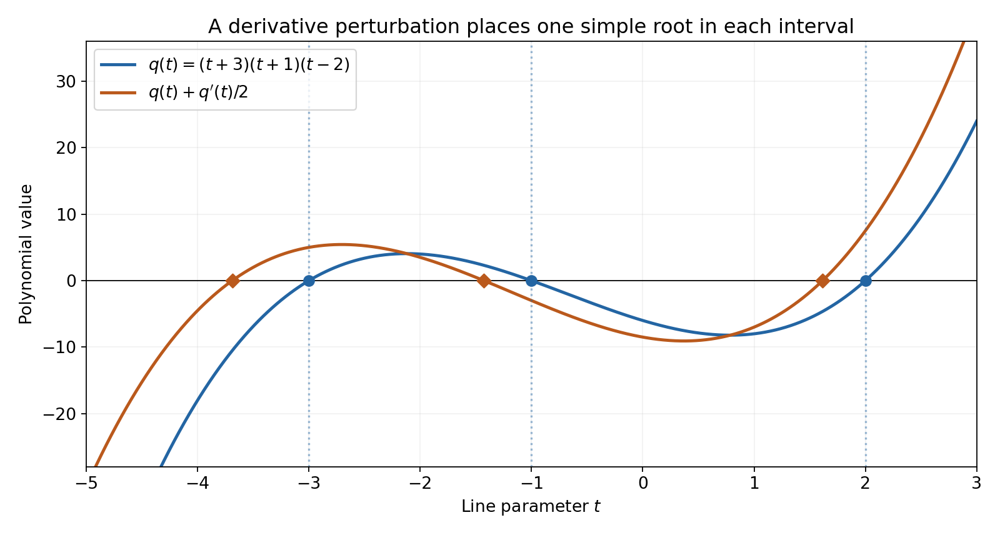
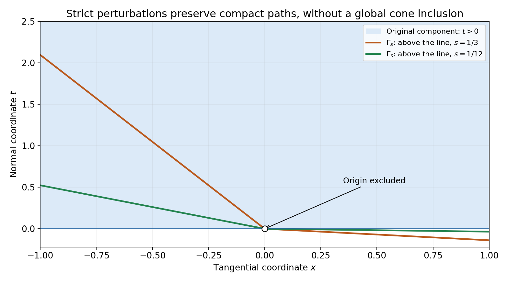

# Real roots and their convex component

*Written by GPT-6.1 Sol (OpenAI), October 2026. Self-checked by the writing AI. Public domain (CC0).*

Real roots on parallel lines determine more than a direction for solving an equation. For a homogeneous polynomial they identify a convex region of directions, and every imaginary vector in that region gives a zero-free Fourier–Laplace tube. We explain why repeated roots do not spoil this geometry.

Read [Cauchy bounds, root counts and analytic extensions][C] for Rouché's theorem and continuous root counts. Basic references are that chapter, Nuij's paper [N] and Harvey and Lawson's account [L]. The [complete proof](real-roots-and-their-convex-component-formal.md) proves every implication, including the root perturbation and the passage back to multiple roots.

## 1. The direction and its component

Let \(F\) be homogeneous of positive degree \(m\). Its coefficients may be complex. A real vector \(e\) is hyperbolic if \(F(e)\ne0\) and every polynomial
\[
                        t\longmapsto F(x+te),\qquad x\in\mathbb R^n,
 \tag{11}
\]
has only real roots. Its degree is always \(m\), because its leading coefficient is \(F(e)\).

Normalize \(p=F/F(e)\). Each polynomial \(p(x+te)\) is a product of real monic linear factors, so \(p(x)\) is real for every real \(x\). This makes every coefficient of \(p\) real. A complex overall factor therefore has no effect on the geometry.

The component containing \(e\) in \(\{F\ne0\}\) is denoted by \(\Gamma\). The hyperbolic component theorem says:

- \(\Gamma\) is open, convex and closed under positive scaling. It excludes zero for positive degree.
- Every \(v\in\Gamma\) is hyperbolic.
- For such a \(v\), a real \(x\) belongs to \(\Gamma\) exactly when every root of \(F(x+tv)\) is strictly negative.
- \(F(x+i y)\ne0\) for all real \(x\) and all \(y\in\Gamma\).

The last assertion follows immediately once directions are known: \(i\) is not a real root of \(F(x+t y)\). The work is proving that every direction in the same component remains hyperbolic.

## 2. Separate repeated roots, then change the direction

For a real-rooted one-variable polynomial, the operation
\[
                             q\longmapsto q+cq',\qquad c\in\mathbb R,
 \tag{12}
\]
preserves real roots. When \(c\ne0\), it reduces every old root multiplicity by one and inserts simple roots in the intervals between old roots. There is one further simple root on an exterior interval. Repeating the operation \(m\) times makes a degree-\(m\) polynomial have simple roots. Complete-proof Lemma 2.1 proves the precise interval count.

To apply this to a homogeneous polynomial, choose tangential linear forms \(\ell_j\) that vanish on \(e\). Form
\[
             p_s=\prod_j(1+s\ell_j\partial_e)^m p,
                         \qquad s\ne0.
 \tag{13}
\]
On an \(e\)-line every \(\ell_j\) is constant, so (13) is exactly a sequence of the operations (12). A line not parallel to \(e\) has at least one nonzero tangential coordinate, which gives simple roots. The polynomial stays homogeneous, \(p_s(e)=1\), and \(p_s\to p\) in coefficients.

Simple real roots persist for a small change of direction. To make the change uniform, use unit base points in the transverse plane and its compact sphere. Finitely many sign-changing root intervals suffice. A multiple root along any hyperbolic direction would force the gradient to vanish at that zero; complete-proof Lemma 3.1 proves this through a small real displacement and a nonreal scaled root. Strictness in \(e\) rules out such a zero gradient. Thus the hyperbolic directions in the component of \(p_s\) are both open and closed, and include the whole component.

Finally choose one compact path from \(e\) to the proposed direction \(v\) in \(\Gamma\). The original polynomial is bounded away from zero on this path. For small \(s\), the same path avoids zeros of \(p_s\), so \(v\) is hyperbolic for \(p_s\). Root continuity then makes \(v\) hyperbolic for \(p\). This is a compact-path argument; it does not require a uniform estimate over the unbounded cone.

*Figure 1. The blue polynomial is \(q(t)=(t+3)(t+1)(t-2)\), with roots \(-3,-1,2\). The orange polynomial is \(q(t)+q'(t)/2=t^3+7t^2/2-3t-17/2\). Its three diamonds show numerical root locations, approximately \(-3.68857931,-1.42666426,1.61524357\). The exact roots are in \((-\infty,-3)\), \((-3,-1)\) and \((-1,2)\), respectively; there is one simple root in each interval and no other root. The graph shows polynomial values against the line parameter, rather than a solution of a differential equation. See complete-proof Lemma 2.1 and Solution 2.*

## 3. Why the component is convex

Fix \(v\in\Gamma\). Along a path from \(v\) to another point \(x\in\Gamma\), the roots of \(F(x+tv)\) stay real. They start at \(-1\), cannot cross zero because the path avoids \(F=0\), and cannot escape to infinity because the degree and leading coefficient stay fixed. All roots are therefore negative.

The segment from \(v\) to \(x\) has
\[
 F(a x+(1-a)v)=a^m F\big(x+((1-a)/a)v\big)\ne0,
                         \qquad 0<a\le1.
 \tag{14}
\]
The parameter on the right is nonnegative and cannot be one of the negative roots. At \(a=0\), the value is \(F(v)\ne0\). The whole segment stays in the same component. This proves convexity.

Conversely, if the roots on the \(v\)-line through \(x\) are all negative, this same segment reaches \(x\) without crossing a zero. Thus it also proves the exact root test for membership. Complete-proof Theorem 4.1 includes the openness, scaling and tube arguments.

## 4. Four examples

### Example 1: a complex coefficient factor changes no direction.

Let \((x,t)\in\mathbb R^2\), \(e=(0,1)\), and
\[
                    F(x,t)=e^{i\pi/5}(2t-x)(t+3x).
 \tag{15}
\]
Since \(F(e)=2e^{i\pi/5}\), normalization gives \(p=(t-x/2)(t+3x)\), with real coefficients. The roots of \(F((x,t)+z e)\) are
\[
                             z=-t+x/2,\qquad z=-t-3x.
 \tag{16}
\]
They are negative exactly when
\[
                          t>x/2,\qquad t>-3x.
 \tag{17}
\]
This open wedge is \(\Gamma\). Every point can be joined to \(e\) within it, and crossing either bounding line makes one factor vanish.

For a direction \(v=(v_x,v_t)\) in the wedge, both normal coefficients \(v_t-v_x/2\) and \(v_t+3v_x\) are positive. On any real \(v\)-line each linear factor has a real root. Also the two factors evaluated at \(w+i v\) have strictly positive imaginary parts, so neither is zero. This verifies every assertion directly for the example.

### Example 2: an elliptic spatial norm gives a Lorentz cone.

Let
\[
                   F(x,y,t)=t^2-x^2-4y^2,\qquad e=(0,0,1).
 \tag{18}
\]
The time-line roots are \(-t\pm\sqrt{x^2+4y^2}\). Consequently
\[
                         \Gamma=\{t>\sqrt{x^2+4y^2}\}.
 \tag{19}
\]
The triangle inequality for the norm \(\sqrt{x^2+4y^2}\) also proves convexity directly. It follows, for example, from the usual two-dimensional Cauchy–Schwarz inequality after replacing \(y\) by \(2y\).

There is a direct check of the imaginary tube. Write spatial vectors after that replacement as \(r\), and let the imaginary vector be \((b,\tau)\), with \(\tau>|b|\). If \(F((r,t)+i(b,\tau))=0\), its imaginary and real parts give
\[
               t\tau=r\cdot b,\qquad t^2-|r|^2=\tau^2-|b|^2>0.
 \tag{20}
\]
The first identity and Cauchy–Schwarz imply \(t^2\tau^2\le |r|^2|b|^2\). If \(r\ne0\), then \(t^2<|r|^2\), contrary to the second identity. If \(r=0\), then \(t=0\), again contrary to it. Thus there is no tube zero.

### Example 3: three coincident roots split while the cone changes.

Start with \(p(x,t)=t^3\), \(e=(0,1)\), and tangential form \(\ell(x,t)=x\). Its component is the open halfplane \(t>0\). Put \(c=sx\). The perturbation is
\[
              p_s=(1+sx\partial_t)^3t^3
                    =t^3+9ct^2+18c^2t+6c^3.
 \tag{21}
\]
Let \(\lambda_1<\lambda_2<\lambda_3\) be the roots of
\[
                          R(\lambda)=\lambda^3-9\lambda^2+18\lambda-6.
 \tag{22}
\]
Endpoint signs give exactly one root in each of \((0,1)\), \((2,3)\), \((6,7)\). These three intervals account for the degree and make all roots simple and positive. Thus
\[
                       p_s=\prod_{j=1}^3(t+\lambda_j sx).
 \tag{23}
\]
For \(s>0\), its component containing \(e\) is the region where all three factors are positive. Its lower boundary is
\[
 t=\begin{cases}
          -\lambda_1 s x,&x\ge0,\\
          -\lambda_3 s x,&x\le0.
       \end{cases}
 \tag{24}
\]
The middle factor gives no additional inequality once the two extreme factors are positive. For a fixed compact subset of \(t>0\), these components contain it for sufficiently small \(s\). The components need not contain the whole original halfplane for any one nonzero \(s\): for negative \(x\) their boundary lies above zero. Nor need they lie inside it: for positive \(x\) they extend below zero. The compact-path proof uses exactly the appropriate local assertion.

*Figure 2. Blue shading is the original component \(t>0\). The orange and green boundaries use \(s=1/3\) and \(s=1/12\), respectively. Each perturbed component is strictly above its own boundary; the boundary itself is excluded. The slopes are \(-\lambda_3s\) on \(x<0\) and \(-\lambda_1s\) on \(x>0\), where \(\lambda_1\) and \(\lambda_3\) are the exact algebraic roots in (22), approximately \(0.41577456\) and \(6.28994508\). The curves show numerical samples of those exact lines. The open circle marks the excluded origin. This is a planar polynomial component, with the coordinates of Example 3; it is not a projected higher-dimensional cone. See Example 3, Solution 8 and complete-proof Theorem 4.1.*

### Example 4: real coefficients alone do not give a convex component.

Take \(F(x,t)=t^2+x^2\), \(e=(0,1)\). The roots on the line based at \((1,0)\) are \(\pm i\), so \(e\) is not hyperbolic. The nonzero set is the punctured plane. It is connected but not convex: it contains \(e\) and \(-e\), while their midpoint is the excluded origin. It also has an imaginary-tube zero,
\[
                               F((1,0)+i e)=1+i^2=0.
 \tag{25}
\]
Every coefficient is real, and \(F(e)\ne0\). The missing hypothesis is the real-root property on all real affine lines.

## 5. Exercises

1. **Basic, 10 points.** Prove coefficient reality from monic real-root polynomials. Apply it to Example 1, and compute its component and the two roots explicitly.
2. **Intermediate, 12 points.** For \(q(t)=(t+3)(t+1)(t-2)\) and \(c=1/2\), compute \(q+cq'\). Prove that it has one root left of \(-3\), one in \((-3,-1)\) and one in \((-1,2)\), with no other root.
3. **Intermediate, 12 points.** Expand the cubic perturbation in Example 3. Verify all six endpoint values that locate the roots in (22), and derive the two boundary inequalities in (24).
4. **Advanced, 14 points.** Prove the multiple-root gradient lemma by the scaled limit (7). Explain the choice of sign for a double root and why higher multiplicity also gives a nonreal limiting root.
5. **Advanced, 14 points.** Give the finite-cover proof that strict hyperbolicity is open in the direction. Explain why translating and scaling transverse base points suffices, and include base points parallel to the perturbed direction.
6. **Intermediate, 12 points.** Prove both directions of the negative-root component test and obtain convexity and the tube property. State exactly where the leading coefficient is used.
7. **Basic, 12 points.** For \(F(x)=i x^4\) and \(e=-2\), find the normalized polynomial, its component, all hyperbolic directions and the root on a line through a real \(x\). Contrast this with the nonzero constant polynomial \(F=7i\).
8. **Advanced, 14 points.** Justify the passage from strict perturbations to an arbitrary point in the original component. Explain why a compact path is enough, and use Example 3 to disprove either inclusion between the entire original and perturbed components for \(s>0\).

## 6. Complete solutions

### Solution 1

For every real \(x\), normalization makes the degree-\(m\) line polynomial monic. Its factorization \(\prod_j(t-r_j)\), with real \(r_j\), has real coefficients and real constant term \(p(x)\). The imaginary coefficient polynomial vanishes on all real points, hence is zero by successively fixing coordinates and using the one-variable root bound. This proves reality without any initial reality assumption on \(F\).

In Example 1, \(F(e)=2e^{i\pi/5}\) and \(p=(t-x/2)(t+3x)\). The roots are (16). Both are negative exactly under (17). The intersection of the two open halfplanes is convex, contains \(e\), and is connected. Each factor has positive sign there. Any path from \(e\) leaving their positive intersection must meet a zero of a factor. It is therefore precisely the component of the nonzero set containing \(e\).

### Solution 2

Expansion gives
\[
 q=t^3+2t^2-5t-6,\qquad
 q+\tfrac12q'=t^3+\tfrac72t^2-3t-\tfrac{17}2.
 \tag{26}
\]
The original roots \(-3,-1,2\) are simple. Off them,
\[
                    \frac{q'}q=\frac1{t+3}+\frac1{t+1}+\frac1{t-2}.
 \tag{27}
\]
Its derivative is strictly negative on each complementary interval. The equation for the new roots is \(q'/q=-2\). On \((-\infty,-3)\), the left side decreases from \(0^-\) to negative infinity, so there is exactly one root. On \((-3,-1)\) and \((-1,2)\), it decreases from positive infinity to negative infinity, giving one each. On \((2,\infty)\) it is positive and gives none. At an original root, \(q+q'/2=q'/2\ne0\). These three new roots are simple, because the derivative of (27) is nonzero. Degree three leaves no other real or complex roots.

### Solution 3

The binomial expansion is valid because \(\partial_t(sx)=0\). Applied to \(t^3\), its four terms are \(t^3\), \(3c(3t^2)\), \(3c^2(6t)\) and \(c^3(6)\). This gives (21). The endpoint values for (22) are
\[
  R(0)=-6,\ R(1)=4,\ R(2)=2,\ R(3)=-6,\ R(6)=-6,\ R(7)=22.
 \tag{28}
\]
The intermediate value theorem gives one root in each indicated disjoint interval. Since the degree is three, there is exactly one in each, and they are simple. Comparing the monic coefficients gives (23): the three elementary symmetric sums are \(9,18,6\).

When \(x\ge0\), the smallest \(\lambda_j sx\) is \(\lambda_1 sx\), so its factor gives the strongest lower bound on \(t\). When \(x\le0\), the strongest bound comes from \(\lambda_3\). All factors remain positive in the intersection of these halfplanes, which is connected and contains \(e\). A path out crosses a factor zero, so this intersection is the component and has boundary (24).

### Solution 4

Write \(h(z+tv)=a t^k+O(t^{k+1})\), \(a\ne0\). If the gradient were nonzero, take real \(w\) with \(b=\partial_w h(z)\ne0\). In the finite expansion about \(z\), substitute a displacement \(\sigma r w+r^{1/k}u v\), divide by \(r\), and let \(r\downarrow0\). The pure \(v\)-terms below degree \(k\) vanish. The first surviving one is \(a u^k\), and the sole surviving term involving \(w\) is \(\sigma b\). Terms with higher powers of \(w\), or with both a \(w\)-factor and a \(v\)-factor, tend to zero. Convergence is uniform for \(u\) on compact sets.

For \(k=2\), choose \(\sigma\) so that \(\sigma b/a>0\); then \(u^2=-\sigma b/a\) gives nonreal simple roots. For \(k>2\), a nonzero real right side has at most two real \(k\)-th roots and the polynomial has \(k\) simple roots, so there is a nonreal one. A small circle around one of these roots avoids the real axis. Uniform convergence and Rouché give a nonreal root of the scaled polynomial. This is a nonreal root on a line in direction \(v\) through the real base point \(z+\sigma r w\), contradicting hyperbolicity. The gradient must be zero.

### Solution 5

For a fixed unit \(w\in v^\perp\), choose \(m\) pairwise disjoint intervals, one about each simple real root, with nonzero opposite endpoint signs. Joint continuity in \(w\) and the direction preserves these finitely many signs on a neighborhood. It also preserves the nonzero leading coefficient. The perturbed polynomial has a real root in each interval; degree \(m\) makes these all its roots and makes each simple.

The unit sphere in \(v^\perp\) is compact. Cover it by finitely many such base-point neighborhoods and intersect the associated direction neighborhoods. Shrink the latter intersection to ensure \(v\cdot v'\ne0\). Every real base point \(x\) then has a unique decomposition \(x=w+a v'\) with \(w\in v^\perp\). For \(w\ne0\), positive scaling reduces it to a unit base point; homogeneity merely rescales the root parameter, and translation by \(a\) shifts the roots. For \(w=0\), the polynomial is \(h(v')(t+a)^m\) and has the single real root \(-a\) with multiplicity \(m\). Such parallel base points are permitted in the definition of strict hyperbolicity. This proves the claimed openness.

### Solution 6

Once every direction in \(\Gamma\) is hyperbolic, fix \(v\in\Gamma\) and a path from \(v\) to \(x\in\Gamma\). All roots are real. At the start they equal \(-1\). No root can cross zero because the path consists of nonzeros of \(F\). The leading coefficient is the fixed \(F(v)\ne0\); bounded coefficients on a compact path bound all roots. For example, after division by the leading coefficient, every root of \(t^m+a_1t^{m-1}+\cdots+a_m\) has modulus at most \(1+\max_j|a_j|\), by the geometric-series estimate outside that disk. Continuous root counts therefore keep all roots negative.

Conversely negative roots ensure that the nonnegative parameter in (14) is never a root. The entire segment to \(v\) avoids the zero set and lies in its component, so \(x\in\Gamma\). Applying the same identity to any two points in \(\Gamma\) proves convexity. For the tube property take the hyperbolic direction \(y\in\Gamma\): its line polynomial cannot vanish at the nonreal parameter \(i\). The nonzero leading coefficient guarantees the fixed full degree in both the root-continuity and tube arguments.

### Solution 7

Here \(F(e)=16i\), so \(p(x)=x^4/16=(x/e)^4\). Its nonzero set consists of two open rays, and the component containing \(-2\) is the negative ray. Every nonzero real \(v\) is hyperbolic, since
\[
                          F(x+tv)=i v^4(t+x/v)^4.
 \tag{29}
\]
The root is \(-x/v\), with multiplicity four. For \(v<0\), it is negative exactly when \(x<0\), as the component test requires. The imaginary tube over the negative ray has no zero because \(x+i y\ne0\) for \(y<0\).

For \(F=7i\), there is no zero anywhere and no root on any line. The nonzero set is the entire real line, including zero, and its imaginary tube is the whole complex line. The positive-degree exclusion of the origin does not apply to constants; empty roots alone do not supply that exclusion.

### Solution 8

An open connected component is polygonally connected, so choose a path from \(e\) to \(v\) with compact image in \(\{p\ne0\}\). Continuity and compactness give a positive lower bound for \(|p|\) there. Coefficient convergence is uniform on that compact image, so \(p_s\) also stays nonzero on the same path for small \(s\). It puts \(v\) in the strict polynomial's component. Hence all roots in direction \(v\) are real for \(p_s\). The limiting leading coefficient \(p(v)\) is nonzero. If the original line polynomial had a nonreal root, a small circle around it and Rouché would force a nonreal root of the approximants. Thus \(v\) is hyperbolic for the original polynomial.

Example 3 disproves either global inclusion for any \(s>0\). At \(x=1\), take \(t=-\lambda_1s/2\). This point is below zero but above the perturbed boundary \(-\lambda_1s\), so it belongs to the perturbed component and not to the original one. At \(x=-1\), take \(t=\lambda_3s/2>0\). It lies in the original component but below the perturbed boundary \(\lambda_3s\). These two strict inequalities explain why the proof uses one compact path and then takes small enough \(s\), instead of claiming an inclusion of whole components.

## References

[C]: ../../AN02-L045.html

- **[C]** *Cauchy bounds, root counts and analytic extensions*, Section 2. Rouché's theorem and root continuity.
- **[N]** Wim Nuij, “A Note on Hyperbolic Polynomials,” *Mathematica Scandinavica* **23** (1968), 69–72. [Original journal record](https://journals.msp.org/mscand/article/view/2455), DOI 10.7146/math.scand.a-10898.
- **[L]** F. Reese Harvey and H. Blaine Lawson Jr., *Hyperbolic polynomials and the Dirichlet problem*, arXiv:0912.5220, version 2 (2010). [Author-deposited account](https://arxiv.org/abs/0912.5220). Freely readable background.
- **[G]** Lars Gårding, “An inequality for hyperbolic polynomials,” *Journal of Mathematics and Mechanics* **8** (1959), 957–965, DOI 10.1512/IUMJ.1959.8.58061. Historical source of the component theorem.
