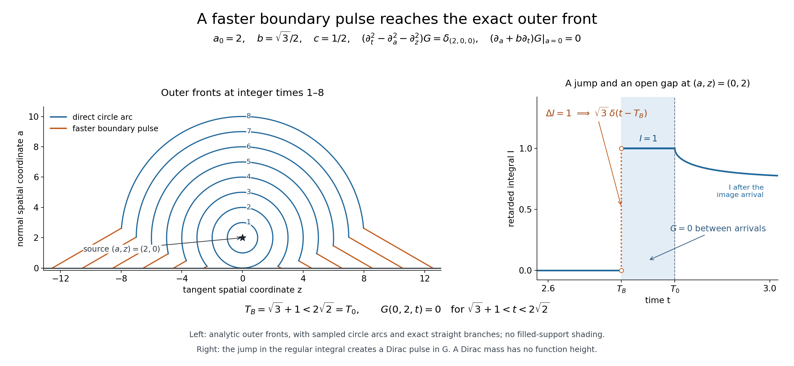

# A reflected wave and its faster boundary pulse

*Written by GPT-6.1 Sol (OpenAI), Ultra reasoning effort, October 2026. Self-checked by GPT-6.1 Sol (OpenAI). Public domain (CC0).*

The cone of a mixed problem gives an upper support bound, but a source picture needs nonvanishing too. For the two-spatial-dimensional wave equation with an isotropic oblique derivative, we construct the point-source Green distribution and prove its exact outer front. A boundary pulse can precede the direct wave. It does not fill the entire intervening region.

Read [Complex oblique derivatives for the wave equation](complex-oblique-derivatives-for-the-wave-equation.md). [Fourier transforms, finite spectra and convex separation](../prerequisites/prerequisite-bridges.html) supplies the Fourier convention and Gaussian formula; [Metric and topological foundations](../prerequisites/metric-foundation-bridges.html) supplies scalar calculus and cutoffs. [Polynomial and contour interfaces for stable boundary models](../prerequisites/stable-prerequisite-bridges.html) supplies finite scalar and polynomial algebra. [Banach estimates, quotient spaces and compact parameter arguments](../prerequisites/banach-foundation-bridges.html), Sections 16–17, supplies scalar product measure and absolute Fubini; Section 6 supplies the finite-order uniform-boundedness argument. [Tensor products and parameter-dependent distributions](../prerequisites/tensor-products-and-parameters.html) supplies compact parameter and tensor operations. 

This specific Green-function theorem proves its own two-dimensional retarded kernel and uniqueness in the stated exponentially weighted tempered class. It uses the linked Fourier, calculus, scalar integration and distribution proofs. Cauchy kernels and distributional boundary limits, Theorem 1.1, and [Holomorphic boundaries in convex cones](../prerequisites/holomorphic-boundaries-in-convex-cones.html), formula 3.1 and Lemma 3.1, supply the classical Cauchy series and identity principle. The general mixed arbitrary-growth uniqueness theorem is not an input to this proof.

Basic references are Grubb's *Distributions and Operators* ([author's lecture notes](https://web.math.ku.dk/~grubb/distribution.htm)), Melrose's *Differential Analysis* and Hörmander's treatment of constant-coefficient equations. The linked lessons supply the prerequisite proofs used below.

## The source problem and its Green class

Let a≥0 be the normal coordinate, z∈R the tangent spatial coordinate, t time, and fix a0>0 and 0<b<1. Put c=\(\sqrt{1-b^2}\). We seek the causal Green distribution
\[
\begin{gathered}
(\partial_t^2-\partial_a^2-\partial_z^2)G
      =\delta(a-a_0)\delta(z)\delta(t)\\
\quad(a>0),\\
\qquad
       (\partial_a+b\partial_t)G|_{a=0}=0 .
\end{gathered}
\tag{1}
\]
Multiplication of the boundary operator by -i gives the original \(D_a+bD_t\); its homogeneous condition is identical. The class used here consists of distributions causal in t, with a smooth normal distribution family near a=0 so the boundary traces exist, and with
\[
           e^{-\lambda t}G_+\in\mathcal S'(\mathbb R^3)
                                  \quad\text{for every }\lambda>0 .
 \tag{2}
\]
Here \(G_+\) is its zero extension to a<0, defined using that smooth boundary family. Interior singularities at a=a0 are allowed. This is an exact growth condition on the Green object, not a growth assumption on all smooth data in [Compatible smooth mixed data and the data that determine a solution](compatible-smooth-mixed-data-and-determination.md).

## The retarded kernel and the normal transform

Define the locally integrable full-space function
\[
 E(a,z,t)=\frac{1_{\{t>\sqrt{a^2+z^2}\}}}
                     {2\pi\sqrt{t^2-a^2-z^2}} .
 \tag{3}
\]
At a fixed t>0, polar spatial integration gives
\[
\begin{gathered}
\int_{\mathbb R^2}E(a,z,t)\,da\,dz=t,
       \\
\qquad \int_0^\infty e^{-\lambda t}t\,dt=\lambda^{-2}.
\end{gathered}
\tag{4}
\]
These formulas prove local integrability including the vertex and full exponential integrability. They also justify all scalar Fubini orders below by the sigma-finite scalar measure and integration proof in [Banach estimates, quotient spaces and compact parameter arguments](../prerequisites/banach-foundation-bridges.html) Sections16 and17.4.

Its time Laplace and full spatial Fourier transform is
\[
\begin{gathered}
\int e^{-i\xi\cdot(a,z)}\int_0^\infty e^{-\lambda t}E(a,z,t)\,dt\,da\,dz
       \\
=\frac1{\lambda^2+|\xi|^2},\\
\qquad \lambda>0 .
\end{gathered}
\tag{5}
\]
Here is a proof with the constant. The spatial inverse of the right side is, by the Gaussian Fourier formula,
\(\int_0^\infty (4\pi u)^{-1}e^{-\lambda^2u-r^2/(4u)}\,du\), r=√(a²+z²). It is integrable in space, with norm λ^-2, since each normalized heat Gaussian has integral one. For r>0 substitute \(v=\lambda u+r^2/(4\lambda u)\). Its two branches have \(u=(v\pm\sqrt{v^2-r^2})/(2\lambda)\), and their absolute logarithmic derivatives sum to \(2/\sqrt{v^2-r^2}\). The integral is exactly \((2\pi)^{-1}\int_r^\infty e^{-\lambda v}/\sqrt{v^2-r^2}\,dv\), the time Laplace transform of 3. Equality away from the spatial origin gives equality of these integrable spatial functions. Gaussian inversion and absolute Fubini prove 5.

Both sides are holomorphic when λ is replaced by κ with Reκ>0. On a compact subset of that half-plane, every derivative of the integral is bounded by \(\int e^{-\epsilon t}t^{j+1}\,dt\). The denominator cannot vanish: if its imaginary part is zero then Imκ=0, when its real part is positive. The difference of the two sides vanishes on the positive real interval; hence all its real derivatives there vanish. The Cauchy–Riemann equations and the Cauchy series identify these with all complex derivatives, so the difference vanishes on a complex neighborhood. The connected-domain identity principle in [Holomorphic boundaries in convex cones](../prerequisites/holomorphic-boundaries-in-convex-cones.html) then extends 5 to the half-plane. Taking κ=λ+iω gives the full Fourier transform of \(e^{-\lambda t}E\). Its denominator is \((\lambda+i\omega)^2+|\xi|^2\). Multiplication by the Fourier symbol of the weighted wave operator gives one. Schwartz Fourier injectivity therefore proves \((\partial_t^2-\Delta)E=\delta\), with the sign and normalization in 1.

For the tangent transform alone put
\[
\begin{gathered}
\kappa=\lambda+i\omega,\\
\quad
 q=\sqrt{\kappa^2+y^2},\\
\quad\operatorname{Re}q>0,\\
\qquad
              \widehat E(a;y,\kappa)=\frac{e^{-q|a|}}{2q}.
\end{gathered}
\tag{6}
\]
The square root exists uniquely because κ²+y² cannot be a nonpositive real number when Reκ>0, by its imaginary part and the positive real square when Imκ=0. The elementary Fourier transform of \(e^{-q|a|}/(2q)\) in a is \(1/(\xi_a^2+q^2)\), by the two exponential integrals. This and 5 first prove 6 as a distribution in all three transformed variables.

We also need the formula at each fixed nonzero a, rather than only almost every normal coordinate. In the time integral substitute \(v=\sqrt{t^2-a^2-z^2}\). The fixed-a tangent transform becomes the integral over \(z\in\mathbb R,\ v>0\) of
\(e^{-iyz-\kappa\sqrt{a^2+z^2+v^2}}/(2\pi\sqrt{a^2+z^2+v^2})\).
At a real positive Laplace weight its absolute integral is \(e^{-\lambda|a|}/(2\lambda)\), by polar integration in this half-plane. On normal compact sets avoiding zero, the substitution has a denominator bounded away from zero, and every a-derivative is dominated by a polynomial times an exponentially decaying integrable function. Thus this scalar transform is smooth in a there. The right side of 6 is likewise smooth. Their distributional equality therefore gives equality for every such a. After 7, its polynomial derivative bounds also prove smoothness of the weighted distribution family itself.

For real y and λ>0,
\[
\begin{gathered}
\operatorname{Re}q\ge\lambda,\\
\quad |q|\ge\lambda,\\
\qquad
                 \operatorname{Re}(q-b\kappa)\ge(1-b)\lambda>0 .
\end{gathered}
\tag{7}
\]
Write q=u+iv. Then uv=λω and \(u^2-v^2=\lambda^2-\omega^2+y^2\). If u<λ, substituting \(v=\lambda\omega/u\) makes the left side strictly less than \(\lambda^2-\omega^2\), a contradiction; ω=0 gives u=√(λ²+y²) directly. This proves the bound, including equality y=0. The chosen q and its derivatives have polynomial growth in (ω,y), because q²=κ²+y² and |q|≥λ. 6 consequently gives a smooth distribution family in any normal interval a>0: every fixed normal derivative has a polynomially bounded Fourier multiplier, uniformly on compact intervals, and compact-test Fourier decay permits differentiation. This proves the normal traces needed below without trying to restrict E at its spatial source plane.

## A proper retarded integral

For A>0 define
\[
        I(A,z,t)=\int_0^\infty E(A+r,z,t+br)\,dr .
 \tag{8}
\]
If an integrand can contribute, \(t+br\ge A+r\), so \(t\ge A+(1-b)r\). On each compact output set with A bounded below by a positive number, r has a common finite bound. The integral is thus proper. It is locally integrable by nonnegative integration and the computation below; in fact it is bounded by 1/(2c). It has support in t≥A and |z|≤t/(1-b).

For Reκ>0, the tangent Laplace-Fourier transform is
\[
                  \widehat I(A;y,\kappa)
                      =\frac{e^{-qA}}{2q(q-b\kappa)} .
 \tag{9}
\]
The time advance by br contributes \(e^{b\kappa r}\): E(A+r,z,v) is zero for v<A+r>br, so shifting the lower integration limit loses no term. The preceding fixed-normal integral gives the exact positive weighted norm
\(\int e^{-\lambda t}I(A,z,t)\,dz\,dt=e^{-\lambda A}/(2(1-b)\lambda^2)\).
This proves absolute Fubini directly. 6 and 7 then give the convergent r integral exactly, also for complex κ on the same positive Laplace line. Each normal derivative multiplies by (-q)^j. 7 and compact-test Fourier decay prove that I is a smooth normal family for A>0 with all right traces there.

The Green distribution is
\[
\begin{gathered}
G(a,z,t)=E(a-a_0,z,t)\\
+E(a+a_0,z,t)
                           \\
+2b\,\partial_t I(a+a_0,z,t),\\
\qquad a\ge0 .
\end{gathered}
\tag{10}
\]
Both E terms are locally integrable. The I term is a derivative of a locally bounded causal function. On the half-space, a+a0>0 supplies every boundary normal derivative. 4 and the support/size bound for I imply 2: the first two weighted terms are integrable, while \(e^{-\lambda t}\partial_t I=(\partial_t+\lambda)(e^{-\lambda t}I)\) is tempered. For I the bounded integrand size and \(0\le a\le t,\ |z|\le t/(1-b)\) make the weighted volume integral finite.

Its tangent transform is
\[
\begin{gathered}
\widehat G(a)\\
=\frac1{2q}
     \left\{e^{-q|a-a_0|}
                  +\frac{q+b\kappa}{q-b\kappa}e^{-q(a+a_0)}\right\}.
\end{gathered}
\tag{11}
\]
I is zero in a whole initial-time neighborhood because A>0, so its derivative transform has multiplier κ and no missing initial term. The finite identity \(1+2b\kappa/(q-b\kappa)=(q+b\kappa)/(q-b\kappa)\) gives the reflection coefficient.

The elementary normal derivative jump of \(e^{-q|a-a0|}/(2q)\) gives the point source, and the other term is homogeneous. At a=0 the incident normal derivative has sign +q and the reflected derivative sign -q. Direct substitution yields
\[
\begin{gathered}
(-\partial_a^2+q^2)\widehat G=\delta(a-a_0),\\
\qquad
                  (\partial_a+b\kappa)\widehat G|_0=0 .
\end{gathered}
\tag{12}
\]
Tangent Fourier injectivity on each positive Laplace line proves 1 with all time distributions included. Causality was established directly by the support of each term.

## Uniqueness in the specified Green class

Let V be the difference of two Green distributions satisfying 1–2 and the stated boundary trace class. It is important to establish tempering of the boundary traces rather than silently Fourier transforming an arbitrary tangent distribution. Put \(W=e^{-\lambda t}V_+\) and \(v_j=e^{-\lambda t}\partial_a^jV|_0\) for j=0,1, initially in \(\mathcal D'\). Integration by parts in the zero-extension formula gives
\[
\begin{gathered}
((\partial_t+\lambda)^2-\partial_a^2-\partial_z^2)W\\
=-\delta'(a)\otimes v_0-\delta(a)\otimes v_1
\end{gathered}
\]
The left side is tempered. Pair it with a fixed compact normal test having value zero and derivative one at zero to recover \(v_0\), and with a test having value one and derivative zero to recover \(-v_1\). These pairings are continuous on tangent Schwartz tests, so both traces are tempered. Their boundary relation is \(v_1+b(\partial_t+\lambda)v_0=0\) in this same space.

Transform W in the tangent variables. On a>0 its transform satisfies
\[
                   (\partial_a^2-q^2)\widehat V=0 .
 \tag{13}
\]
Localize to any compact tangent frequency set. The coefficient q is smooth, nonzero and independent of a. Distributional integrating factors prove
\[
               \widehat V(a)=e^{-qa}A+e^{qa}C
 \tag{14}
\]
with compactly supported frequency distributions A,C. To give the distribution step in full, a distribution with ∂aT=0 is constant in a: subtract from a test a fixed compact a-test of integral one times its a-integral. The remaining test has zero a-integral and is the derivative of a compactly supported test, which T annihilates. Apply this to \((\partial_a-q)(\partial_a+q)\widehat V=0\) after multiplying the first factor's result by \(e^{-qa}\). Integrating the resulting equation \(\partial_a(e^{qa}\widehat V)=e^{2qa}T\) gives the particular primitive \(e^{2qa}T/(2q)\) and one constant term. This is 14. No normal regularity is assumed in advance; the formula proves it.

Choose a compact smooth χ of integral one and any compact frequency test φ in the localized region. Test 14 against
\[
\begin{gathered}
\Phi_R(a,\omega,y)
                    =\chi(a-R)e^{-qa}\phi(\omega,y),\\
\qquad R\to+\infty .
\end{gathered}
\tag{15}
\]
By 7 these tests tend to zero in every full Schwartz seminorm: their a supports move to R, frequency supports are fixed, and every derivative costs a polynomial in R times \(e^{-\lambda R}\). Temperedness makes the pairing tend to zero. The decaying A term paired with them also tends to zero by its compact distribution order. The C term pairs to C(φ), exactly, since the exponentials cancel and χ has integral one. Hence C=0.

To identify A with the transformed physical trace, extend \(e^{-qa}A\) by zero to a<0 and subtract it from the localized transform of W. The difference Z is supported on a=0. It has finite normal delta order: on its compact frequency support a distribution has finite order N; Taylor subtraction in a to order N shows that it depends only on the first N normal test jets. Indeed a test with those jets zero, multiplied by a cutoff supported in \(|a|<\epsilon\), has every derivative up to N tending uniformly to zero by Taylor's formula, while support on the plane leaves the pairing unchanged. Consequently Z is a finite sum of normal delta derivatives with frequency distribution coefficients.

Applying \(q^2-\partial_a^2\) to Z gives a sum of only \(\delta'\) and \(\delta\), by the transformed zero-extension equation and the formula for the decaying mode. A nonzero highest normal delta derivative in Z would instead produce a nonzero derivative two orders higher. Hence Z=0. Comparing the two remaining coefficients proves that the localized transforms of \(v_0,v_1\) are respectively A and \(-qA\). This proves compatibility with the physical boundary traces without any unstated Schwartz trace assumption. Their boundary relation now gives
\[
                         (q-b\kappa)A=0,\qquad A=0 .
 \tag{16}
\]
The reciprocal is smooth on the localized compact set by 7. All frequency localizations vanish, so tangent Fourier and exponential injectivity give V=0. Thus 10 is the unique Green distribution in the declared class. This does not substitute a growth condition for the arbitrary-growth smooth uniqueness theorem elsewhere; it proves the exact Green claim at its own class.

## Evaluating the integral and locating the boundary pulse

Write ρ=|z|. For nonnegative t, the integrand in 8 is \((2\pi)^{-1}Q(r)^{-1/2}\) where Q>0, with
\[
\begin{gathered}
Q(r)=t^2-A^2-\rho^2\\
+2(bt-A)r-c^2r^2,\\
\qquad
                D=(t-bA)^2-c^2\rho^2 .
\end{gathered}
\tag{17}
\]
The roots and center are
\[
\begin{gathered}
r_\pm=(bt-A\pm\sqrt D)/c^2,\\
\qquad
              Q(r)=D/c^2\\
-c^2(r-(bt-A)/c^2)^2 .
\end{gathered}
\tag{18}
\]
Only roots yielding a positive interval with r≥0 contribute. Minimizing \(\sqrt{(A+r)^2+\rho^2}-br\) for r≥0 gives the first possible time
\[
\begin{gathered}
T_B(A,\rho)\\
=  \begin{cases}
 \sqrt{A^2+\rho^2},&\rho\le cA/b,\\
 bA+c\rho,&\rho\ge cA/b .
 \end{cases}
\end{gathered}
\tag{19}
\]
The derivative in A+r is \((A+r)/\sqrt{(A+r)^2+\rho^2}-b\), so its minimum is at A+r=bρ/c if that is at least A; otherwise at r=0. This proves the exact attained time, including ρ=0.

For t larger than the first time, elementary arcsine integration gives, with \(T_0=\sqrt{A^2+\rho^2}\),
\[
\begin{gathered}
I(A,z,t)\\
=  \begin{cases}
 0,&t<T_B,\\
 1/(2c),&\begin{gathered}T_B<t<T_0\quad\\
(\rho>cA/b)\end{gathered},\\
 \begin{gathered}(2\pi c)^{-1}\\
\arccos((A-bt)/\sqrt D)\end{gathered},&t>T_0 .
 \end{cases}
\end{gathered}
\tag{20}
\]
When both roots are positive, the entire quadratic interval has integral π/c, giving the middle line. Above T0 the lower root is nonpositive and the upper positive; the substitution \(u=c^2(r-(bt-A)/c^2)/\sqrt D\) gives the last line. These formulas also prove \(0\le I\le1/(2c)\) everywhere up to irrelevant boundary values. The negative-time integrand is zero by \(t\ge A+(1-b)r\), so no negative-time branch of the squared inequality is included.

In the strict fast case ρ>cA/b, T_B<T0 and I jumps from zero to 1/(2c). Consequently the correction contains the nonzero distribution
\[
\begin{gathered}
2b\,\partial_t I
                 = (b/c)\delta(t-T_B)
          \\
\quad\text{on a neighborhood of }\\
\text{the fast front below }T_0 .
\end{gathered}
\tag{21}
\]
This proves nonvanishing, with its exact positive coefficient. Between the pulse and T0 the correction is zero. At the threshold the closed-support statement follows by approximation from the strict fast and ordinary fronts; no pointwise value at a distributional transition is imposed.

## The exact outer support envelope

Set \(T_D=\sqrt{(a-a_0)^2+\rho^2}\) and A=a+a0. The direct E term begins at T_D; the image term begins at T0≥T_D; the correction begins at T_B. Therefore G has no support below
\[
                          T(a,\rho)=\min\{T_D,T_B(a+a_0,\rho)\}.
 \tag{22}
\]
This bound is attained as an outer closed-support front. If T_B<T_D, then necessarily the strict fast branch is in use; the nonzero delta pulse in 21 cannot cancel with the E terms, which are zero there. If \(T_D<T_B\) and a>0, the direct term is positive just inside its front and the other terms are zero until their later arrivals. If \(T_D=T_B\) with a>0 and strict fast branch, the nonzero pulse remains, while the locally integrable direct term cannot cancel a delta. All transition points follow by closure of support.

For a=0, the slow front has \(T_D=T_B=T_0\). For ρ<cA/b, direct differentiation of the last line of 20 gives its ordinary boundary value for t>T0:
\[
\begin{gathered}
G(0,z,t)=
   \frac{t^2-bAt-\rho^2}
                {\pi D\sqrt{t^2-A^2-\rho^2}},\\
\qquad A=a_0 .
\end{gathered}
\tag{23}
\]
At t=T0 the numerator is \(A(A-bT_0)>0\), since ρ<cA/b. It remains positive on a small interval above T0, so this boundary front cannot disappear. Its threshold points are again in support by closure. The source itself is in support because its wave image is the nonzero delta. These arguments prove all of the outer envelope 22, both in the open half-space and with its right boundary family.

For the twice-speed example \(a_0=2,\ b=\sqrt3/2,\ c=1/2\), the exact front is
\[
\begin{gathered}
T(a,\rho)\\
=\min\left\{\begin{gathered}\sqrt{(a-2)^2+\rho^2},\\
\
 \begin{cases}
 \sqrt{(a+2)^2+\rho^2},&\begin{gathered}\rho\le\\
(a+2)/\sqrt3\end{gathered},\\
 \begin{gathered}(\sqrt3/2)(a+2)\\
+\rho/2\end{gathered},&\begin{gathered}\rho\ge\\
(a+2)/\sqrt3\end{gathered} .
 \end{cases}\end{gathered}\right\}.
\end{gathered}
\tag{24}
\]
The slower image branch cannot beat the direct branch. The straight faster branch becomes the earliest one precisely when
\[
             \rho>\frac{c(a+a_0)+2\sqrt{aa_0}}b .
 \tag{25}
\]
Indeed on its allowed branch \(\rho\ge cA/b\),
\(T_D^2-(bA+c\rho)^2=b^2(\rho-cA/b)^2-4aa_0\).
All times are nonnegative, so the squared comparison preserves the inequality. This proves the switch, including a=0 and equality. Fixed integer time levels of 24 give the exact outer support contours shown below.

The theorem is about the outer front, not equality of support with every point of \(\{t\ge T\}\). A temporal gap after the fast pulse is exhibited next.

## Exercises with complete solutions

**Exercise 1 (entry: the Neumann endpoint).** Let b decrease to zero. Find the limit of 10 and its outer front.

**Solution.** For b in a fixed small interval starting at zero, 20 bounds I locally by a common constant. For every compact test φ, the pairing of \(2b\partial_t I\) with φ is bounded by \(2b\sup|I|\int|\partial_t\phi|\), which tends to zero. Thus the correction tends to zero in distributions, and 10 converges to
\[
\begin{gathered}
G_N\\
=E(a-a_0,z,t)+E(a+a_0,z,t).
\end{gathered}
\tag{26}
\]
This formula can also be checked directly: the two right normal derivatives at a=0 cancel. Its source is the direct delta, the image source lies outside the open half-space, and the boundary derivative is zero. The earliest front is \(T_D\), since the image distance is never smaller for a≥0. Both terms are nonnegative locally integrable functions, so the direct front is not canceled. There is no faster boundary pulse in this endpoint. It has the same exponentially tempered uniqueness proof, now with q as the nonzero boundary divisor.

**Exercise 2 (intermediate: a pulse before the direct wave).** In 24 take a=0 and z=2. Compute both arrivals and the boundary pulse coefficient.

**Solution.** Here A=2, ρ=2>(2/√3). The two first times and pulse are
\[
\begin{gathered}
T_B=\sqrt3+1<2\sqrt2=T_D=T_0,\\
\qquad
                         (b/c)\delta(t-T_B)=\sqrt3\,\delta(t-T_B).
\end{gathered}
\tag{27}
\]
The strict inequality follows by squaring positive quantities: \((\sqrt3+1)^2=4+2\sqrt3<8\). The nonzero delta occurs while both E terms vanish, so it cannot be canceled. This proves a concrete faster-support point, not only a dual-cone bound.

**Exercise 3 (advanced: a front followed by an empty interval).** At the same point, determine G on the open interval between these two arrivals. Explain which support conclusion would be false.

**Solution.** Formula 20 gives the constant I=1/(2c)=1 throughout that interval; its ordinary derivative there is zero. Both E terms are still zero. Hence
\[
\begin{gathered}
G(0,2,t)=0\\
\quad(\sqrt3+1<t<2\sqrt2).
\end{gathered}
\tag{28}
\]
There is a nonzero pulse at its left endpoint and a direct/image tail begins at its right endpoint. Thus the exact outer support front does not assert that every later time at a fixed spatial point belongs to support. In the strict region near this point the same inequalities persist, so the temporal gap also gives an open spacetime zero region. The distinction is a distributional one, not a choice of a point value for a delta.

## The exact fronts in a fixed-time section

The source is (a,z,t)=(2,0,0), b=√3/2 and c=1/2. At integer times 1 through 8, the outer front consists of a direct circle arc and the allowed faster straight branches. Both spatial axes use the same unit scale. The right panel displays the regular integral I, whose unit jump creates the pulse with coefficient √3. It is not a function plot of a Dirac mass. Between √3+1 and 2√2 the Green distribution vanishes in an open region. Equations 20–25 and Exercises 2–3 prove these claims.

The original figure, editable SVG and reproducible Python source are included with this lesson.

## References

- Gerd Grubb, *Distributions and Operators*, lecture-note versions, 2007–2008. [Open lecture notes](https://web.math.ku.dk/~grubb/distribution.htm).
- Richard Melrose, *Differential Analysis*, MIT OpenCourseWare, Fall 2004. [Open course](https://ocw.mit.edu/courses/18-155-differential-analysis-fall-2004/).
- Lars Hörmander, *The Analysis of Linear Partial Differential Operators I: Distribution Theory and Fourier Analysis*, second edition (1990), reprinted in Classics in Mathematics, Springer, 2003, e-ISBN 978-3-642-61497-2.
- Lars Hörmander, *The Analysis of Linear Partial Differential Operators II: Differential Operators with Constant Coefficients*, Springer, 1983.
