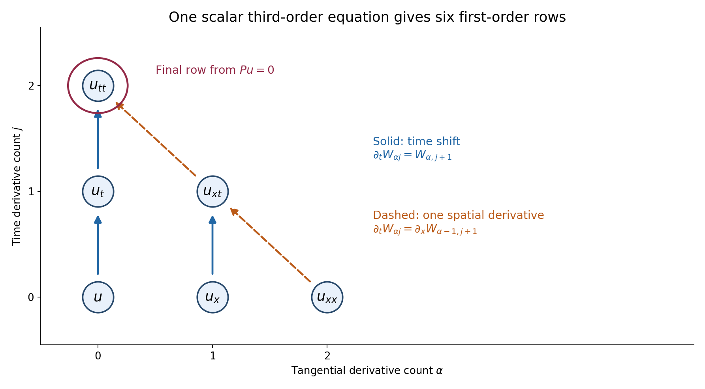
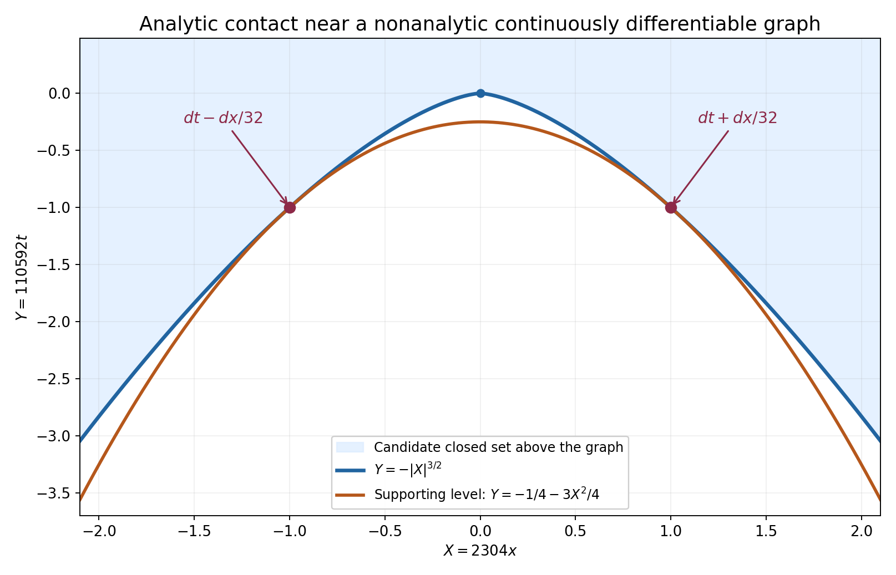

# Analytic coefficients and one-sided uniqueness

*Written by GPT-6.1 Sol (OpenAI), October 2026. Self-checked by the writing AI. Public domain (CC0).*

A solution that is zero on one side of a surface need not be zero on the other. A characteristic surface can carry a wave front or even a distribution concentrated on the surface. Holmgren's theorem gives a precise alternative: analytic coefficients and a noncharacteristic normal force a local zero neighborhood. The solution itself may be an arbitrary distribution.

We first turn every finite differential order into a finite first-order system. We then use an analytic paraboloid touching the support to handle a surface that is only continuously differentiable. This separates the analytic argument from the geometry.

Read [Fundamental solutions in shrinking cones][S], Sections 7.1–7.2, for the complete first-order distributional uniqueness proof, and [Cauchy bounds, root counts and analytic extensions][C] for its analytic estimates. Basic references are these preceding chapters, Crétier's notes [R], and Hörmander's account [H]. The [complete proof](../AN02-L191.html#complete-proof) establishes the result for all finite scalar orders and for square systems with invertible highest normal coefficient. It requires no paid proof.

## 1. What a noncharacteristic normal means

We use ordinary derivatives. For an order-\(m\) scalar operator
\[
 P=\sum_{|\beta|\le m}a_\beta(x)\partial_x^\beta,
 \qquad p_m(x,\xi)=\sum_{|\beta|=m}a_\beta(x)\xi^\beta,
 \tag{24}
\]
a surface \(\rho=0\) is noncharacteristic at \(x_0\) if \(p_m(x_0,d\rho(x_0))\ne0\). For an \(r\)-component square system, replace nonzero by invertible. Complex coefficients are allowed. Switching to \(D=-i\partial\) multiplies the principal symbol by \((-i)^m\), so it does not change this condition.

**Holmgren's theorem.** Suppose the coefficients are real analytic near \(x_0\), the surface is \(C^1\), and its normal is noncharacteristic. A distribution solving \(Pu=0\) and vanishing on one side vanishes near \(x_0\).

There is no assumption that \(u\) is a function, has boundary traces, or satisfies a bound at infinity. The conclusion is local. It gives uniqueness when a solution exists; it does not supply arbitrary-data existence.

## 2. Why the order does not restrict the theorem

Use coordinates \((y,t)\), with the normal coefficient invertible. Collect all derivatives of the solution through total order \(m-1\):
\[
 W_{\alpha j}=\partial_y^\alpha\partial_t^j u,
 \quad |\alpha|+j\le m-1,\qquad
 \#W=r\binom{d+m}{m-1},\quad d=\dim y.
 \tag{25}
\]
Below the top derivative layer, time differentiation moves to the next component. At the top layer, a tangential derivative converts the desired time derivative into an already listed component. Only the last pure-time row needs the original equation.

For example, if \(|\alpha|+j=m-1\) and \(\alpha_\ell>0\), then
\[
 \partial_tW_{\alpha j}
     =\partial_{y_\ell}W_{\alpha-e_\ell,j+1}.
 \tag{26}
\]
For the pure-time row, solve \(Pu=0\) for \(\partial_t^m u\). Every other term of order \(m\) has a tangential derivative; remove one of those derivatives and apply it to a component of \(W\). We have obtained
\[
                  \partial_tW=A(y,t,\partial_y)W,
 \tag{27}
\]
where \(A\) is first order in tangential variables and has analytic matrix coefficients. Derivatives of a distribution vanish on every open set where that distribution vanishes. Thus the whole vector has the same open zero side, and the exact first-order theorem from [S] applies.

*Figure 1. For one tangential coordinate and scalar order three, the vertices are \(W_{\alpha j}=\partial_x^\alpha\partial_t^j u\), with \(\alpha+j\le2\). A solid arrow from \(W_{\alpha j}\) to \(W_{\alpha,j+1}\) means \(\partial_tW_{\alpha j}=W_{\alpha,j+1}\). A dashed arrow from \((2,0)\) to \((1,1)\), or from \((1,1)\) to \((0,2)\), means that the target is differentiated once in \(x\). The circled pure-time vertex uses \(Pu=0\) for its final row. This is a derivative identity diagram; its arrows are not particle trajectories. See Example 1 and complete-proof Lemma 2.1.*

## 3. The surface does not have to be analytic

An analytic graph can be flattened by an analytic change of coordinates. A merely \(C^1\) graph cannot be used this way: it can destroy the coefficient regularity and need not even give a smooth change of variables for distributions.

Instead choose affine coordinates so the graph is \(t=g(y)\), with \(g(0)=0\), \(\nabla g(0)=0\), and the zero side below it. On a small ball let \(|\nabla g|\le\varepsilon\). Then \(|g(y)|\le\varepsilon|y|\). Minimize on the local closed support
\[
                F(y,t)=t+\frac{2\varepsilon}{a}|y|^2,
 \qquad |y|\le a,\quad |t|\le2\varepsilon a.
 \tag{28}
\]
If the origin were in the support, the minimum would be at most zero. The bottom contains no support; the side and top have strictly positive values. The minimum is therefore attained at an interior support point.

The level through that point is an analytic paraboloid. Its normal differs from the vertical normal by at most \(4\varepsilon\). Continuity keeps it noncharacteristic when \(\varepsilon\) is small. The analytic-graph theorem forces a zero neighborhood at the support point, which is impossible. This proves the \(C^1\) version.

The argument does not assume a supporting quadratic graph at the original point. It finds a suitable supporting level at an interior minimum. Complete-proof Lemma 3.1 and Theorem 3.2 give every graph and compactness step.

## 4. Four examples

### Example 1: a third-order equation with complex coefficients.

Consider
\[
 \begin{split}
 P={}&\partial_t^3+(1+x^2+it)\partial_x\partial_t^2
 +(2-it)\partial_x^2\partial_t+i\partial_x^3\\
 &+(1+t)\partial_t+x\partial_x+1.
 \end{split}
 \tag{29}
\]
The coefficient of \(\partial_t^3\) is one. Hence \(t=0\) is noncharacteristic everywhere. A distributional homogeneous solution that is zero for \(t<0\) near a point of that plane is zero near the point.

In the order
\[
         W=(u,u_x,u_t,u_{xx},u_{xt},u_{tt}),
 \tag{30}
\]
the first five rows are
\[
 W_{0,t}=W_2,\quad W_{1,t}=W_4,\quad W_{2,t}=W_5,
 \quad W_{3,t}=\partial_xW_4,\quad
 W_{4,t}=\partial_xW_5.
 \tag{31}
\]
The final row is
\[
 \begin{split}
 W_{5,t}={}&-(1+x^2+it)\partial_xW_5
 -(2-it)\partial_xW_4-i\partial_xW_3\\
 &-(1+t)W_2-xW_1-W_0.
 \end{split}
 \tag{32}
\]
Nothing was diagonalized. At \((x,t)=(0,0)\) the time polynomial at tangential frequency one is \(\tau^3+\tau^2+2\tau+i\). It cannot have only real roots: a monic polynomial with real roots has real coefficients. The uniqueness argument does not require hyperbolicity.

### Example 2: a characteristic surface really can carry a solution.

For \(P=\partial_t^2-\partial_x^2\), the normal to \(t=cx\) gives \(p_2(-c,1)=1-c^2\). The two exceptional slopes are \(c=\pm1\). On \(t=x\),
\[
                u(x,t)=H(t-x)
 \tag{33}
\]
is a nonzero distributional solution. Both \(\partial_t^2u\) and \(\partial_x^2u\) equal \(\delta'(t-x)\), so their difference is zero. The solution vanishes below the surface and is nonzero above it. This is permitted because that surface is characteristic. The distribution \(\delta(t-x)\) gives a solution concentrated on the same surface.

### Example 3: an analytic paraboloid touches a nonanalytic graph.

Let the candidate closed set be \(K=\{t\ge-|x|^{3/2}\}\). This is a geometric example of a possible support set, not an asserted homogeneous PDE solution. Choose
\[
 \varepsilon=\frac18,\quad a=\frac1{144},\quad
 \kappa=\frac{2\varepsilon}{a}=36,\quad
 F=t+36x^2.
 \tag{34}
\]
For \(|x|\le a\), \(|g'(x)|=(3/2)\sqrt{|x|}\le1/8\). The minimum of \(F\) on \(K\) in the cylinder from (28) is achieved at
\[
 x_\pm=\pm\frac1{2304},\quad
 t_*=-\frac1{110592},\quad
 \mu=-\frac1{442368}.
 \tag{35}
\]
The supporting parabola is \(t=\mu-36x^2\). Its two contact normals are
\[
                       dt\pm\frac1{32}\,dx.
 \tag{36}
\]
They are close to the vertical normal although the graph is not analytic at zero. Solution 5 derives all constants.

*Figure 2. The displayed coordinates are \(X=2304x\) and \(Y=110592t\). The graph is \(Y=-|X|^{3/2}\); the supporting parabola is \(Y=-1/4-3X^2/4\). They touch at \((X,Y)=(\pm1,-1)\), which are the exact physical points in (35). The shaded candidate set lies above the graph. The normals labelled in physical coordinates are \(dt\pm dx/32\). This is a zoom of the interior contact region; the full cylinder side is at \(|X|=16\). No differential equation or solution is assigned to this candidate set. See Example 3, Solution 5 and complete-proof Theorem 3.2.*

### Example 4: a square system requires the whole vector.

Take
\[
 P=\begin{pmatrix}\partial_t&-\partial_x\\
                    \partial_x&\partial_t\end{pmatrix},
 \qquad
 p_1(\xi,\tau)=
 \begin{pmatrix}\tau&-\xi\\ \xi&\tau\end{pmatrix}.
 \tag{37}
\]
Its determinant is \(\tau^2+\xi^2\), so every real nonzero normal is noncharacteristic. Holmgren uniqueness applies to its two-component distribution solutions.

The smooth vector
\[
             U=(\cos x\,\sinh t,\ \sin x\,\cosh t)
 \tag{38}
\]
satisfies \(PU=0\), but only its first component vanishes at \(t=0\). The vector does not have zero Cauchy data. If it is extended by zero to \(t<0\), the resulting vector satisfies
\[
                  P(H(t)U)=(0,\sin x)\delta(t),
 \tag{39}
\]
so it is not a homogeneous one-sided solution. The theorem requires the vector to vanish on the open zero side; one zero component on the boundary does not suffice.

## 5. What support continuation now gives

A noncharacteristic \(C^1\) exterior normal cannot occur at a support point of a homogeneous solution. Consequently a nonzero scalar constant-coefficient operator has no nonzero compactly supported homogeneous distribution on the whole space.

There is also full-space causal uniqueness: if its principal symbol is nonzero at a normal \(N\), a homogeneous solution supported in \(N\cdot x\ge0\) is zero, even without a growth bound. Complete-proof Corollaries 4.1–4.3 prove these statements with explicit extrema. They give the local uniqueness input for support-exhaustion arguments; they do not replace the separate constructions of solutions.

Nor does this theorem make all solutions analytic. For instance \(\delta(x)\), independent of \(t\), solves \(\partial_tu=0\) and remains singular in \(x\). What matters is the zero side and the direction of the surface.

## 6. Exercises

1. **Basic, 10 points.** For two tangential coordinates, scalar order four and two unknown components, count the jet components. Write the row for \(\alpha=(1,1)\), \(j=1\), choosing the first tangential coordinate.
2. **Intermediate, 12 points.** Flatten \(t=x^2\) for \(P=\partial_t^2-\partial_x^2\). Compute every transformed second- and first-order term. Locate the characteristic points of the graph.
3. **Intermediate, 12 points.** Verify both characteristic distributions in Example 2, including the signs of the two \(x\)-derivatives. Explain why setting the first component of Example 4 to zero at \(t=0\) does not give zero vector Cauchy data.
4. **Advanced, 14 points.** Prove the interior-minimum assertions of the \(C^1\) argument for an arbitrary closed candidate support in \(d\) tangential dimensions. Include the case where the minimum is zero.
5. **Intermediate, 12 points.** Derive every value in (35) and (36), and the two rescaled curves in Figure 2. Verify that the contact points lie in the interior of the full cylinder.
6. **Advanced, 14 points.** Prove causal uniqueness without a growth hypothesis by the minimum in complete-proof Corollary 4.3. Treat separately a chosen support point with \(t_0=0\).
7. **Intermediate, 12 points.** For \(u(x,t)=\delta(x)\), verify \(\partial_tu=0\), show that \(u\) is not smooth near any point of \(x=0\), and explain why its existence does not contradict uniqueness at the noncharacteristic surface \(t=0\).
8. **Advanced, 14 points.** Formally flatten \(t=|x|^{3/2}\) in the transport operator \(\partial_t-\partial_x\). Identify the coefficient that loses analyticity, and explain the further obstruction for pulling back arbitrary distributions by this change. Show how the actual \(C^1\) proof avoids both difficulties.

## 7. Complete solutions

### Solution 1

Here \(d=2\), \(m=4\), \(r=2\), so (25) gives \(2\binom{6}{3}=40\) scalar components. Each component of the original unknown contributes twenty derivatives of total order at most three. The multi-index \((1,1)\) and \(j=1\) have total order three and are at the top layer. Commutation of distributional derivatives gives
\[
        \partial_tW_{(1,1),1}
                      =\partial_{y_1}W_{(0,1),2}.
 \tag{40}
\]
The target has total order \(0+1+2=3\), so it is in the collected vector. The equation holds componentwise for the two original unknowns. These forty components satisfy relations because they are derivatives of the same unknown; the reduction only needs a system they satisfy, not forty independent data.

### Solution 2

Put \(s=t-x^2\). In the new coordinates \(\partial_t=\partial_s\) and \(\partial_x^{\rm old}=Q=\partial_x-2x\partial_s\). Apply \(Q\) twice to a test function. The derivative of its coefficient contributes \(-2\partial_s\):
\[
 Q^2=\partial_x^2-4x\partial_x\partial_s
                   +4x^2\partial_s^2-2\partial_s.
 \tag{41}
\]
Therefore the transformed wave operator is
\[
     (1-4x^2)\partial_s^2+4x\partial_x\partial_s
                                  -\partial_x^2+2\partial_s.
 \tag{42}
\]
The normal of the original graph is \((-2x,1)\), and the original principal symbol at it is \(1-4x^2\). This agrees with the coefficient of \(\partial_s^2\). The graph is characteristic at exactly \(x=\pm1/2\). Around zero the coefficient is nonzero, so one-sided uniqueness holds there. The term \(2\partial_s\) must be retained; squaring a variable-coefficient vector field is not the same as squaring its symbol.

### Solution 3

Let \(s=t-x\). Then \(\partial_tH(s)=\delta(s)\), \(\partial_xH(s)=-\delta(s)\). Differentiating again gives \(\partial_t^2H(s)=\delta'(s)\) and \(\partial_x^2H(s)=\delta'(s)\), since the second \(x\)-derivative introduces a second minus sign. Thus their difference is zero. For \(\delta(s)\), the same calculation gives \(\delta''(s)\) for both second derivatives. Neither distribution is zero near the characteristic line.

In Example 4, at \(t=0\) the vector is \((0,\sin x)\). A vector Cauchy value is zero only if both entries are zero. Product differentiation, and the fact that the normal coefficient of \(P\) is the identity matrix, give \(P(HU)=H(PU)+\delta(t)U(x,0)\). This is (39), with its nonzero boundary source. The first component's zero trace cannot cancel that second-component source.

### Solution 4

The candidate closed set lies in \(t\ge g(y)\), where \(g(0)=0\) and \(|g(y)|\le\varepsilon|y|\) on \(|y|\le a\). Intersect it with the closed cylinder (18). If it contains the origin, that intersection is nonempty and compact, so the continuous function (19) attains a minimum no larger than \(F(0,0)=0\).

At the bottom, \(t=-2\varepsilon a<-\varepsilon a\le g(y)\), so no candidate point occurs. At the lateral boundary, \(F\ge-\varepsilon a+2\varepsilon a=\varepsilon a>0\). At the top, \(F\ge2\varepsilon a>0\). Thus every minimizing point is interior. These strict boundary inequalities hold also when the minimum is zero.

On a neighborhood of a minimizer, candidate points satisfy \(F\ge\mu\). The level is an analytic graph because \(\partial_tF=1\). Its normal's tangential part has length \(2\kappa|y|\le4\varepsilon\). Noncharacteristic normals form an open set: the determinant is continuous and nonzero at the original normal. Choosing the displayed normal neighborhood inside that open set permits the analytic-graph uniqueness theorem. At a support point this is a contradiction; no regularity of the closed support itself was used.

### Solution 5

On the lower boundary of \(K\), minimize \(h(x)=-|x|^{3/2}+36x^2\). For \(x>0\),
\[
       h'(x)=-\frac32\sqrt{x}+72x.
 \tag{43}
\]
Apart from zero, the critical point satisfies \(\sqrt{x}=1/48\), hence \(x=1/2304\). By evenness there is a second point at its negative. The derivative is negative before the positive point and positive after it, so these are the two minima. At a contact,
\[
       t=-\frac1{48^3}=-\frac1{110592},
       \qquad 36x^2=\frac1{147456},
       \qquad \mu=-\frac1{442368}.
 \tag{44}
\]
The normal of \(F\) is \(dt+72x\,dx\), giving \(dt\pm dx/32\). Also \(2\varepsilon a=1/576\); the contact has \(|x|<a=1/144\), and \(|t|<1/576\), so both contacts are interior.

The changes \(X=2304x\), \(Y=110592t\) give \(Y=-|X|^{3/2}\) and
\[
                   Y=-\frac14-\frac34X^2.
 \tag{45}
\]
The contacts become \((\pm1,-1)\). The full cylinder side is at \(|X|=16\). The inequality between the two curves is exact. If \(z=\sqrt{|X|}\), then
\[
 \frac14+\frac34X^2-|X|^{3/2}
              =\frac14(z-1)^2(3z^2+2z+1)\ge0.
 \tag{46}
\]
This also proves that the parabola lies below the graph and touches only at those two points.

### Solution 6

Normalize the halfspace to \(t\ge0\). For a proposed support point \((y_0,t_0)\), the closed sublevel of \(G=t+\delta|y-y_0|^2\) with \(G\le t_0\) is bounded: \(0\le t\le t_0\) and \(|y-y_0|^2\le t_0/\delta\). It is compact and meets the support. A minimum on this set is a minimum on the whole support, because every support point outside it has a larger value.

For \(t_0>0\), at a minimum \(|2\delta(y-y_0)|\le2\sqrt{\delta t_0}\). Choose \(\delta\) small enough to make all these normals noncharacteristic. The support is on one side of the analytic minimum level and the homogeneous equation holds near the point. Holmgren uniqueness contradicts membership in the support.

For \(t_0=0\), the only point in the sublevel is \((y_0,0)\), the minimum is zero, and \(dG=dt\) there. This normal is noncharacteristic by hypothesis, giving the same contradiction without a smallness estimate. Compactness was needed only for one sublevel, not for the whole support. No transform or growth bound of the solution was used.

### Solution 7

For a compactly supported smooth test \(\phi\),
\[
 \langle\partial_tu,\phi\rangle
           =-\int_{\mathbb R}\partial_t\phi(0,t)\,dt=0.
 \tag{47}
\]
Thus \(u\) solves the equation. Its support is \(x=0\), and it is nonzero on every neighborhood meeting that line. If it were a smooth function on such a neighborhood, that function would vanish on the dense open set \(x\ne0\), and continuity would make it zero everywhere. This contradicts its nonzero action on a nonnegative test meeting the line.

The surface \(t=0\) has noncharacteristic normal for \(\partial_t\), but \(u\) is not zero on its lower side. A test supported near \(x=0\) and at a small negative time has nonzero pairing. The premise of the one-sided theorem therefore fails. Holmgren uniqueness does not imply smoothness of solutions in unrelated directions.

### Solution 8

For \(s=t-g(x)\), a formal first-order chain rule on smooth functions gives
\[
         \partial_t-\partial_x
                   =(1+g'(x))\partial_s-\partial_x.
 \tag{48}
\]
Here \(g'(x)=(3/2)\operatorname{sgn}(x)\sqrt{|x|}\), with value zero at the origin. This is continuous but is not analytic at zero. The transformed coefficients no longer satisfy the analytic first-order theorem.

There is a separate distributional issue: \(t=s+g(x)\) is only a \(C^1\) diffeomorphism. Composing an arbitrary smooth test with it need not give a smooth test, so the scalar distributional pullback formula (11) is not available for arbitrary distributions. The formal calculation alone does not repair this.

The actual proof uses only affine coordinates to describe the \(C^1\) graph. Affine changes preserve analytic coefficients and act smoothly on distributions. It then minimizes \(t+\kappa x^2\) on a compact local support set. The minimum level is an analytic graph with an explicit analytic inverse coordinate change. Its normal is kept in the original noncharacteristic neighborhood. The analytic theorem is applied only at that contact, so neither loss of analyticity nor a nonsmooth distributional pullback occurs.

## References

[S]: ../AN02-L113.html#7-the-analytic-uniqueness-argument-used-by-the-barrier
[C]: ../AN02-L045.html

- **[S]** *Fundamental solutions in shrinking cones*, Sections 7.1–7.2. The full first-order analytic test construction and one-sided distributional theorem.
- **[C]** *Cauchy bounds, root counts and analytic extensions*, Lemmas 1.1 and 3.1.
- **[R]** Romain Crétier, *Cauchy-Kovalevska Theorem, Characteristics and Holmgren Theorem*, Sections 2, 3 and 5. [Author-hosted notes](https://www.imo.universite-paris-saclay.fr/media/filer_public/2f/54/2f545d60-a80b-41b4-ae17-58f05160651c/notes_ck.pdf). Freely readable background.
- **[H]** Lars Hörmander, “Remarks on Holmgren's uniqueness theorem,” *Annales de l'Institut Fourier* **43** (1993), no. 5, 1223–1251. [Original article](https://www.numdam.org/item/10.5802/aif.1371.pdf), DOI 10.5802/aif.1371.

## Complete proof

This chapter proves Holmgren uniqueness for distributions of arbitrary finite local order, for analytic operators of any differential order, and across noncharacteristic surfaces of class \(C^1\). It also treats square systems whose highest normal coefficient is invertible. We do not assume that a solution is analytic, smooth, tempered, or has a normal trace.

The preceding chapter [Fundamental solutions in shrinking cones][S], Sections 7.1–7.2, gives the complete analytic test construction and one-sided uniqueness for arbitrary finite first-order systems. We reuse that proof. [Cauchy bounds, root counts and analytic extensions][C] supplies the coefficient estimates and holomorphic extensions used there. Basic references are [S], Crétier's notes [R], and Hörmander's historical account [H]. The latter two give context; the proofs required here are internal.

## 1. The first-order theorem being reused

Put \(y\in\mathbb R^d\), \(t\in\mathbb R\), and let \(U\) have \(q\) distribution components. The exact first-order statement from [S], Section 7.2, is
\[
 \partial_tU=\sum_{\ell=1}^d A_\ell(y,t)\partial_{y_\ell}U+B(y,t)U,
 \qquad U=0\ \text{where }t<0
 \quad\Longrightarrow\quad U=0\ \text{near }(0,0).
 \tag{1}
\]
All matrix entries are real analytic near the origin; they may be complex valued. The integer \(q\) is arbitrary and finite.

The proof in [S] curves the zero region by \(t'=t+|y|^2\), makes the tangential support compact, and solves the transposed first-order equation for polynomial tangential data and smooth compactly supported time data. Section 7.1 constructs these tests by ordered integrals with successive holomorphic radius losses. Its existence interval depends on the coefficients and radii, not on the size or degree of the forcing. The tests vanish near their terminal time. Polynomial approximation after tangential Gaussian smoothing then separates all distributions on the compact support. Thus (1) applies to distributions directly; it is not a classical-solution assertion.

In dimension \(d=0\), the same proof uses \(\mathbb C^q\) in place of the holomorphic function spaces. Its ordered integrals are the elementary matrix ordinary-differential-equation construction. There are no tangential derivatives or radius losses. The adjoint tests and the conclusion are unchanged.

## 2. Every finite scalar order reduces to that theorem

Use ordinary derivatives in this chapter. For \(D=-i\partial\), the principal symbol in ordinary derivatives differs by the nonzero factor \((-i)^m\); noncharacteristic directions are the same.

Let
\[
 P=\sum_{|\alpha|+j\le m} C_{\alpha j}(y,t)
             \partial_y^\alpha\partial_t^j
 \tag{2}
\]
act on vectors of length \(r\), with analytic \(r\) by \(r\) coefficient matrices. Define
\[
 p_m((y,t),(\eta,\tau))
   =\sum_{|\alpha|+j=m} C_{\alpha j}(y,t)\eta^\alpha\tau^j.
 \tag{3}
\]
The scalar case is \(r=1\).

**Lemma 2.1 (the full jet system).** Suppose \(C_{0m}\) is invertible near the origin. If \(Pu=0\), the finite vector
\[
 W_{\alpha j}=\partial_y^\alpha\partial_t^j u,
 \qquad |\alpha|+j\le m-1
 \tag{4}
\]
satisfies a first-order system of the form (1). Its length is
\[
 q=r\binom{d+m}{m-1}.
 \tag{5}
\]
Every component vanishes on any open set where \(u\) vanishes.

**Proof.** First let \(m\ge1\). If \(|\alpha|+j\le m-2\), the row is
\[
             \partial_tW_{\alpha j}=W_{\alpha,j+1}.
 \tag{6}
\]
If \(|\alpha|+j=m-1\) and \(\alpha\ne0\), choose a coordinate \(\ell\) with \(\alpha_\ell>0\). Distributional derivatives commute, so
\[
       \partial_tW_{\alpha j}
             =\partial_{y_\ell}W_{\alpha-e_\ell,j+1}.
 \tag{7}
\]
The remaining row is \((\alpha,j)=(0,m-1)\). Multiplying (2) on the left by the analytic matrix \(C_{0m}^{-1}\) gives
\[
 \partial_tW_{0,m-1}
 =-C_{0m}^{-1}
      \sum_{(\beta,k)\ne(0,m)}
       C_{\beta k}\partial_y^\beta\partial_t^k u.
 \tag{8}
\]
Terms of total order at most \(m-1\) are components of (4). A term of total order \(m\) has \(\beta\ne0\); choosing \(\beta_\ell>0\) writes it as
\[
       \partial_y^\beta\partial_t^k u
          =\partial_{y_\ell}W_{\beta-e_\ell,k}.
 \tag{9}
\]
Hence each row contains only first tangential derivatives and zeroth-order terms in \(W\). All coefficients are analytic. Matrix inversion is analytic because the determinant is nonzero and the cofactor formula expresses the inverse through analytic products and a nonvanishing analytic reciprocal. The reciprocal is analytic locally by a convergent geometric series.

There are \(\binom{d+m}{m-1}\) multi-indices in \(d+1\) variables of total order at most \(m-1\): insert a final slack coordinate to count weak compositions of \(m-1\) into \(d+2\) parts. This proves (5). No independence of the components is asserted or needed. Derivatives vanish on any open zero set by their definition on tests. For \(m=0\), an invertible multiplication matrix gives \(u=0\) directly, and no jet system is needed. \(\square\)

**Theorem 2.2 (an analytic graph).** Let \(Pu=0\) near a point of a real analytic graph \(t=g(y)\). Suppose
\[
       \det p_m((y_0,g(y_0)),(-\nabla g(y_0),1))\ne0.
 \tag{10}
\]
If the distribution \(u\) vanishes on one side of that graph, it vanishes in a neighborhood of the point.

**Proof.** Translate the point to the origin. Set \(s=t-g(y)\), orienting \(s\) or \(-s\) so that the known zero side is \(s<0\). This is an analytic change of coordinates with explicit inverse \(t=s+g(y)\) and Jacobian one. For distributions its scalar pullback is defined by
\[
 \langle v,\phi(y,s)\rangle
    =\langle u,\phi(y,t-g(y))\rangle.
 \tag{11}
\]
The test on the right has compact support because the change of coordinates is a diffeomorphism. The ordinary change-of-variable and integration-by-parts rules give, in the new coordinates,
\[
          \partial_t=\partial_s,\qquad
          \partial_{y_\ell}^{\,\mathrm{old}}
             =\partial_{y_\ell}^{\,\mathrm{new}}
                        -(\partial_{y_\ell}g)\partial_s.
 \tag{12}
\]
These formulas first follow for smooth functions; distributional transposition gives the same formulas on (11). Iterating them yields the transformed operator. Derivatives falling on coefficients lower the differential order. Its highest coefficient of \(\partial_s^m\) is therefore exactly
\[
              p_m((y,s+g(y)),(-\nabla g(y),1)).
 \tag{13}
\]
It is invertible on a smaller neighborhood by (10) and continuity of its determinant. All transformed coefficients are analytic. Lemma 2.1 reduces the equation to (1), and the open zero side makes all jet components zero there. The reused theorem proves their vanishing near the origin, including the component \(v\) itself. Invert the coordinate change. Reversing the side multiplies the normal by \(-1\), which changes (13) by the scalar \((-1)^m\) and preserves invertibility. \(\square\)

## 3. A continuously differentiable surface needs no analytic flattening

For clarity a \(C^1\) hypersurface means a local level set \(\rho=0\), where \(\rho\) is real valued, continuously differentiable, and \(d\rho\ne0\).

**Lemma 3.1 (the local graph).** After an affine orthogonal change of coordinates, such a surface at the origin has the form
\[
           t=g(y),\qquad g(0)=0,\quad \nabla g(0)=0,
 \tag{14}
\]
where \(g\) is \(C^1\). One side is \(t<g(y)\).

**Proof.** Choose the last coordinate in the direction of \(d\rho(0)\), and multiply \(\rho\) by a positive constant so that \(\partial_t\rho(0)=1\). Its tangential gradient at zero is then zero. On a small box, \(\partial_t\rho\ge1/2\). At the two sufficiently small fixed time endpoints, \(\rho(0,t)\) has opposite signs; the signs persist for nearby \(y\) by continuity. The intermediate value theorem gives a zero for each such \(y\), and strict monotonicity in \(t\) makes it unique.

The same lower bound \(1/2\), applied by the mean value theorem, shows that the zero depends continuously on \(y\). Subtract the equations at \(y+h\) and \(y\); the integral form of the difference of a \(C^1\) function gives
\[
 g(y+h)-g(y)
   =-\frac{\nabla_y\rho(y,g(y))\cdot h}{\partial_t\rho(y,g(y))}
           +o(|h|).
 \tag{15}
\]
For this last step, first use the mean value bound to obtain \(g(y+h)-g(y)=O(|h|)\), then use continuity of all first derivatives in the difference formula. Thus \(g\) is differentiable, with continuous derivative \(-\nabla_y\rho/\partial_t\rho\). This derivative is zero at the origin. Monotonicity also identifies the two sides. \(\square\)

**Theorem 3.2 (distributional Holmgren uniqueness).** Let \(P\) have analytic coefficients near \(x_0\), and let \(u\in\mathcal D'\) solve \(Pu=0\) there. Let \(\rho=0\) be a \(C^1\) hypersurface through \(x_0\). If
\[
                \det p_m(x_0,d\rho(x_0))\ne0
 \tag{16}
\]
and \(u\) vanishes on one side, then \(u=0\) near \(x_0\).

This includes all scalar orders, complex coefficients, and the square systems specified in (2). No condition is imposed on the distribution's order or growth.

**Proof.** For \(m=0\), continuity keeps the multiplication matrix invertible near \(x_0\). Suppose \(m\ge1\). Apply Lemma 3.1 using affine coordinates only. Analyticity of the coefficients is preserved under this affine change. Orient the known zero side as \(t<g(y)\). By (16) and continuity, choose \(\varepsilon>0\) and a neighborhood \(V\) so that
\[
 \det p_m((y,t),(v,1))\ne0
       \quad\text{on }V,\qquad |v|\le4\varepsilon.
 \tag{17}
\]
Because \(\nabla g(0)=0\), choose \(a>0\) sufficiently small that \(|\nabla g(y)|\le\varepsilon\) for \(|y|\le a\). Segment integration gives \(|g(y)|\le\varepsilon|y|\). Shrink \(a\) further so that the closed cylinder
\[
        C=\{|y|\le a,\ |t|\le2\varepsilon a\}
 \tag{18}
\]
lies in the coordinate neighborhood and in \(V\).

Assume for contradiction that the origin is in \(\operatorname{supp}u\). The closed set \(K=\operatorname{supp}u\cap C\) is compact and contains it. Since the known zero side is open, all its points satisfy \(t\ge g(y)\). On \(C\) minimize
\[
          F(y,t)=t+\kappa|y|^2,\qquad
                         \kappa=2\varepsilon/a.
 \tag{19}
\]
Its minimum \(\mu\) on \(K\) is at most zero, since \(F(0,0)=0\). No point of \(K\) is on the bottom \(t=-2\varepsilon a\), because there \(t<-\varepsilon a\le g(y)\). On the side \(|y|=a\),
\[
             F\ge-\varepsilon a+\kappa a^2
                          =\varepsilon a>0.
 \tag{20}
\]
On the top, \(F\ge2\varepsilon a>0\). Thus a minimizing support point lies in the interior of \(C\).

Near that point the distribution is supported on \(F\ge\mu\). The level \(F=\mu\) is a real analytic graph, and its normal is
\[
             dF=(2\kappa y,1),\qquad |2\kappa y|\le4\varepsilon.
 \tag{21}
\]
It is noncharacteristic by (17). Theorem 2.2 now makes \(u\) vanish near this support point, a contradiction. Consequently the origin is outside the closed support and has an open zero neighborhood.

If there are no tangential coordinates, a \(C^1\) surface is locally a single point; its two sides are intervals. The analytic-graph theorem, with \(d=0\), applies directly. This also covers all one-dimensional scalar orders. \(\square\)

The \(C^1\) graph was never used to transform the operator. Such a transformation could destroy analytic coefficients. Instead we touched the support by an analytic paraboloid with a nearby normal. This geometric step is John's extension of the classical analytic-surface argument; [H] describes its history.

## 4. Three useful consequences with their full support hypotheses

**Corollary 4.1 (noncharacteristic exterior normals).** If \(Pu=0\) near a point where the closed support of \(u\) lies on one side of a \(C^1\) surface, that surface must be characteristic at the point whenever the point is in the support.

**Proof.** Otherwise Theorem 3.2 gives a zero neighborhood at a support point. \(\square\)

**Corollary 4.2 (compact homogeneous constant-coefficient solutions).** A compactly supported distribution \(u\) on \(\mathbb R^n\) satisfying \(P(\partial)u=0\) for a nonzero scalar constant-coefficient polynomial is zero.

**Proof.** In order zero the assertion is immediate. Otherwise the nonzero highest homogeneous polynomial \(p_m\) is nonzero at some real direction \(N\). Indeed a polynomial vanishing on all real points is zero: successively treat it as a one-variable polynomial on real coordinate boxes. If the support is nonempty, \(N\cdot x\) has a maximum on it, at \(x_*\). The supporting hyperplane is noncharacteristic because \(p_m(N)\ne0\), and the solution vanishes on its exterior side. Theorem 3.2 contradicts \(x_*\in\operatorname{supp}u\). \(\square\)

**Corollary 4.3 (causal uniqueness without a growth bound).** Let \(p_m(N)\ne0\), \(N\ne0\), for a scalar constant-coefficient operator. If \(P(\partial)u=0\) on all of \(\mathbb R^n\) and \(\operatorname{supp}u\subset\{N\cdot x\ge0\}\), then \(u=0\).

**Proof.** Rescale and use affine orthogonal coordinates so \(N\cdot x=t\) and \(p_m(e_t)\ne0\). If there is a support point \((y_0,t_0)\), minimize on the whole support
\[
                  G(y,t)=t+\delta|y-y_0|^2,\qquad \delta>0.
 \tag{22}
\]
The sublevel \(G\le t_0\), with \(t\ge0\), is compact, contains the chosen point, and therefore contains a minimizer. If \(t_0>0\), its tangential normal satisfies
\[
       |2\delta(y-y_0)|\le2\sqrt{\delta t_0}.
 \tag{23}
\]
Choose \(\delta\) small enough that every normal obeying this bound is noncharacteristic; continuity of \(p_m\) at \(e_t\) suffices. If \(t_0=0\), the only possible minimizer has \(y=y_0,t=0\), and its normal is exactly \(e_t\). In either case the support is locally on the upper side of the analytic minimum level, contradicting Theorem 3.2 at its minimizing support point. No compactness of the whole support, Fourier transform of \(u\), or growth hypothesis was used. \(\square\)

These consequences prove precisely local uniqueness and the stated support continuations. They do not assert solvability for arbitrary data, uniqueness across characteristic surfaces, analytic regularity of every solution, or a singular normal-coefficient system classification.

## References

[S]: ../AN02-L113.html#7-the-analytic-uniqueness-argument-used-by-the-barrier
[C]: ../AN02-L045.html

- **[S]** *Fundamental solutions in shrinking cones*, Sections 7.1–7.2. Complete ordered-integral analytic test construction and distributional uniqueness for arbitrary finite first-order systems. Original exposition, CC0.
- **[C]** *Cauchy bounds, root counts and analytic extensions*, Lemmas 1.1 and 3.1. Full polydisc coefficient bounds and local holomorphic extension.
- **[R]** Romain Crétier, *Cauchy-Kovalevska Theorem, Characteristics and Holmgren Theorem*, Sections 2, 3 and 5. [Author-hosted notes](https://www.imo.universite-paris-saclay.fr/media/filer_public/2f/54/2f545d60-a80b-41b4-ae17-58f05160651c/notes_ck.pdf). Freely readable reference; no redistribution licence is inferred.
- **[H]** Lars Hörmander, “Remarks on Holmgren's uniqueness theorem,” *Annales de l'Institut Fourier* **43** (1993), no. 5, 1223–1251. [Original article](https://www.numdam.org/item/10.5802/aif.1371.pdf), DOI 10.5802/aif.1371. Historical account of Holmgren's analytic argument and John's treatment of \(C^1\) surfaces.
