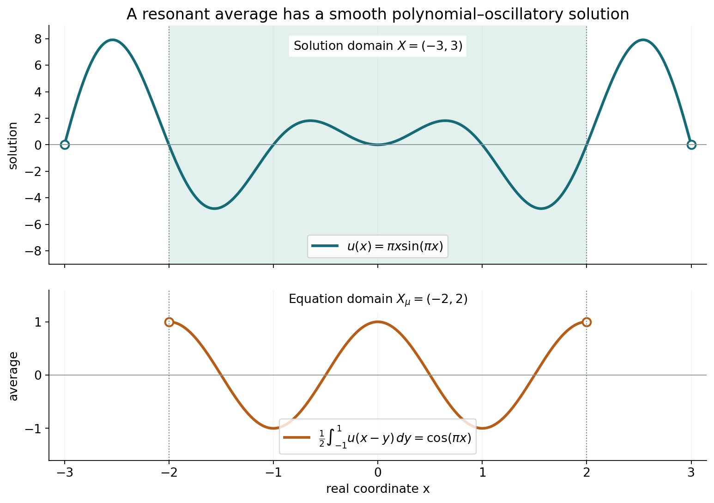
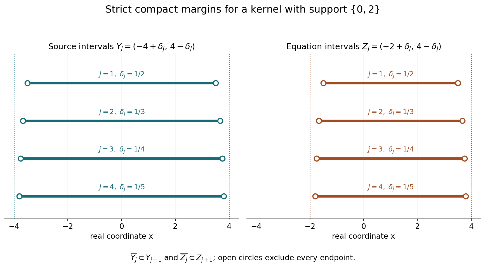

# Analytic forcing and smooth convolution solutions

*Written by GPT-6.1 Sol (OpenAI), Ultra reasoning effort, October 2026. Self-checked by the writing AI, GPT-6.1 Sol (OpenAI). Public domain (CC0).*

An analytic right-hand side can be solved against every nonzero compact convolution kernel on a convex domain. A kernel may have characteristic zeros or may smooth away singularities. We explain why neither phenomenon prevents smooth solvability for analytic forcing. We then work through reflection, resonance, a compact smooth kernel, and growth near a boundary.

Basic references are [Grubb's Fourier-distribution notes](https://web.math.ku.dk/~grubb/dist5.pdf), [Melrose's tempered-distribution notes](https://math.mit.edu/~rbm/iml/Chapter1.pdf), and Hörmander's *The Analysis of Linear Partial Differential Operators*, volumes I and II. Read [Exponential-polynomial solutions and convex approximation](../AN02-L167.html) for the exact homogeneous approximation and Gaussian localization theorems. [Fourier transforms of analytic functionals on a real convex carrier](../AN02-L146.html) supplies the analytic-functional transform and germ results. The full proof below also identifies the required Baire, Hahn–Banach and endpoint Lebesgue-duality statements.

## 1. A local equation on the correct domain

Our convention is
\[
 (\mu*u)(x)=\mu_y(u(x-y)),\qquad
 X_\mu=\{x:x-\operatorname{supp}\mu\subset X\}.
 \tag{L1}
\]
For \(0\ne\mu\in\mathcal E'(\mathbb R^n)\), an open convex \(X\), and every real-analytic \(f\) on \(X_\mu\), there is a smooth \(u\) on \(X\) satisfying \(\mu*u=f\) on \(X_\mu\). “Real analytic” allows complex values. The input need not extend to an entire function. The output is smooth; no analytic regularity or global boundedness is asserted.

If \(X_\mu\) is empty, the equation has no points at which it must hold, and \(u=0\) suffices. A nonempty \(X\) can still have empty \(X_\mu\): the translations demanded by the entire support of the kernel may not fit.

The construction has two scales. On every smaller convex domain \(Y\) with compact closure inside \(X\), a transpose estimate gives a globally defined bounded smooth solution of the equation on \(Y_\mu\). On successively larger \(Y\), homogeneous exponential-polynomial corrections make the local solutions converge on every compact subset of \(X\). Their global bounds need not stay uniform.

## 2. What makes the estimate uniform

Fix a nonzero compact smooth \(\psi\). Put
\[
 \rho=\check\mu*\psi,\quad A=F_\rho,\quad
 L=\operatorname{conv}\operatorname{supp}\rho,\quad
 D=\overline{Y_\mu}.
 \tag{L2}
\]
The norm in the full proof is
\[
 \|\Phi\|=\sup_{\zeta\in\mathbb C^n}
 |A(\zeta)\Phi(\zeta)|
 e^{-H_L(\operatorname{Im}\zeta)-H_D(\operatorname{Im}\zeta)} .
 \tag{L3}
\]
Zeros of \(A\) do not make this norm degenerate. A nonzero entire multiplier is nonzero on some open set, and holomorphic identity then determines the entire quotient everywhere. More strongly, Cauchy's formula on a suitable translated circle bounds each quotient on a compact set by its product on a larger compact set. This proves completeness of the space in (L3).

The convex quotient theorem places the analytic functional associated to \(\Phi\) on the real carrier \(D\). Its polynomial moments are
\[
 v_\Phi(P)=P(i\partial_\zeta)\Phi(0).
 \tag{L4}
\]
Every individual functional has a local holomorphic supremum bound. Baire's theorem in the complete quotient space turns those separate bounds into one bound valid for every \(\Phi\). Gaussian approximation in a fixed complex neighborhood then allows evaluation on \(f\), even when \(f\) is not entire.

For an actual test \(\phi\) in \(Y_\mu\), this gives
\[
 \left|\int f\phi\right|
 \le C\sup_K|\widetilde f|\,
                 \|\check\mu*\psi*\phi\|_1 .
 \tag{L5}
\]
The test support and its derivative order do not change \(C\). Hahn–Banach extends the functional on these smoothed tests to \(L^1\). Its bounded representing function \(v\) yields
\[
 U=v*\check\psi,\qquad
 \|\partial^\alpha U\|_\infty
 \le \|v\|_\infty\|\partial^\alpha\psi\|_1 .
 \tag{L6}
\]
The two reflections have different roles: \(\check\mu\) enters the test, and \(\check\psi\) enters the solution. The full proof checks both transposes.

## 3. Four worked examples

### Example 1: a translated derivative

Take \(a=3/4\), \(X=(-2,2)\), \(\mu=\delta'_a\), and \(f(x)=e^{2x}\). By the distributional derivative convention,
\[
 (\delta'_a*u)(x)
 =-\left.\frac{d}{dy}u(x-y)\right|_{y=a}
 =u'(x-a).
 \tag{L7}
\]
Here \(X_\mu=X+a=(-5/4,11/4)\). Set
\[
 u(t)=\frac12e^{2(t+a)}.
 \tag{L8}
\]
Then \(u'(x-a)=e^{2x}=f(x)\) throughout \(X_\mu\). Both the plus sign and the translation by \(+a\) in (L8) matter. Every constant can be added to \(u\).

### Example 2: a resonant averaging kernel

Let \(\mu\) have density \(1/2\) on \([-1,1]\), take \(X=(-3,3)\), and let \(f(x)=\cos(\pi x)\) on \(X_\mu=(-2,2)\). For a complex parameter \(\lambda\),
\[
 \mu*e^{\lambda x}=b(\lambda)e^{\lambda x},\qquad
 b(\lambda)=\frac{\sinh\lambda}{\lambda},\quad b(0)=1.
 \tag{L9}
\]
This follows by directly integrating \(e^{-\lambda y}/2\) over \([-1,1]\). At \(\lambda=i\pi\), \(b=0\), so a constant multiple of \(e^{i\pi x}\) cannot produce that forcing. Differentiate the integral identity with respect to \(\lambda\):
\[
 \mu*(xe^{\lambda x})
     =[b'(\lambda)+xb(\lambda)]e^{\lambda x}.
 \tag{L10}
\]
Since \(b'(i\pi)=i/\pi\), the function \(-i\pi xe^{i\pi x}\) produces \(e^{i\pi x}\). Taking real parts gives the real smooth solution
\[
 u(x)=\pi x\sin(\pi x),\qquad
 \frac12\int_{-1}^{1}u(x-y)\,dy=\cos(\pi x).
 \tag{L11}
\]
Resonance adds a polynomial factor; it does not obstruct this analytic right-hand side.

The curve \(u(x)=\pi x\sin(\pi x)\) is defined on \(X=(-3,3)\). Its average is the lower-amplitude curve \(f(x)=\cos(\pi x)\) on \(X_\mu=(-2,2)\). The marked points \(x=\pm2\) are excluded boundary points. Formula (L11), not the sampled curves, proves the identity. The editable figure source accompanies the illustration.

### Example 3: a compact smooth kernel

Let
\[
 \beta(y)=
 \begin{cases}
 e^{-1/(1-y^2)},&|y|<1,\\
 0,&|y|\ge1,
 \end{cases}
 \quad Z=\int_{-1}^{1}\beta(y)\,dy,\quad
 d\mu(y)=Z^{-1}\beta(y)\,dy .
 \tag{L12}
\]
Every derivative of the inside expression is an exponential times a rational function whose only singular factors are powers of \(1-y^2\). As \(y\to\pm1\), \(e^{-1/(1-y^2)}(1-y^2)^{-m}\to0\) for each \(m\), by the exponential series or repeated elementary comparison. Thus all derivatives extend by zero, and \(\beta\in C_c^\infty\). Also \(Z>0\).

For \(f(x)=e^{2x}\) on the full real line, define
\[
 c=Z^{-1}\int_{-1}^{1}\beta(y)e^{-2y}\,dy
   =Z^{-1}\int_{-1}^{1}\beta(y)\cosh(2y)\,dy>1.
 \tag{L13}
\]
Evenness gives the second equality. The strict inequality follows because \(\cosh(2y)>1\) away from zero and \(\beta>0\) throughout \((-1,1)\). Then \(u(x)=e^{2x}/c\) is an entire solution by direct integration.

This kernel erases a compact singularity: \(\mu*\delta_0=\mu\) is smooth, whereas \(\delta_0\) is not a smooth distribution. The last claim follows, for example, by testing smooth bumps of height one whose supports shrink to zero: \(\delta_0\) takes value one, whereas a locally bounded smooth density has integrals tending to zero. Nevertheless the analytic forcing above is solvable. Its solution is unbounded on the line, which is allowed by the global theorem.

### Example 4: analytic forcing near a boundary

Take \(X=(-2,2)\), \(\mu=\delta_0-\delta_1\), and \(f(x)=1/(2-x)\). Then \(X_\mu=(-1,2)\). The forcing is analytic on this interval and becomes unbounded as \(x\uparrow2\).

Choose a smooth \(h\) with \(h(t)=0\) for \(t\le-7/4\) and \(h(t)=1\) for \(t\ge-5/4\). One explicit choice is
\[
 B(s)=
 \begin{cases}e^{-1/s},&s>0,\\0,&s\le0,\end{cases}
 \qquad
 h(t)=\frac{B(t+7/4)}{B(t+7/4)+B(-5/4-t)}.
 \tag{L14}
\]
The denominator is positive everywhere, and the same flat-exponential argument as in Example 3 proves smoothness. On \(X\), set
\[
 u(x)=\sum_{k=0}^{3}\frac{h(x-k)}{2-x+k}.
 \tag{L15}
\]
All denominators are positive for \(x<2\), so \(u\) is smooth on \(X\). Subtracting the same sum at \(x-1\) telescopes:
\[
 u(x)-u(x-1)=\frac{h(x)}{2-x}
       -\frac{h(x-4)}{6-x}=\frac1{2-x}
             \quad(-1<x<2).
 \tag{L16}
\]
Indeed \(h(x)=1\) for \(x>-1\), and \(h(x-4)=0\) for \(x<2\). This example needs no control at the excluded endpoint \(x=2\). It also shows why bounded local solutions need not give a bounded solution on the whole domain.

## 4. How the local solutions become compatible

Choose bounded convex \(Y_j\) with compact closure \(K_j\), \(K_j\subset Y_{j+1}\), and union \(X\). Let \(Z_j=(Y_j)_\mu\). Their closures fit inside the next \(Z_j\), and their union is \(X_\mu\). Compactness of the entire translated kernel support proves that union assertion.

Take local global smooth solutions \(V_j\). The difference \(V_j-u_{j-1}\) solves the homogeneous equation on \(Z_{j-1}\). Approximate it on \(K_{j-2}\), through derivative order \(j\), by a global homogeneous exponential-polynomial \(h_j\). Then \(u_j=V_j-h_j\) still solves the equation on \(Z_j\), and
\[
 \max_{|\alpha|\le j}\sup_{K_{j-2}}
       |\partial^\alpha(u_j-u_{j-1})|<2^{-j}.
 \tag{L17}
\]
The two-index separation ensures that the approximation compact set is inside the domain on which the difference is homogeneous. Every fixed compact set and derivative order eventually fit these bounds. Summing the geometric tail proves convergence in every smooth seminorm. Convolution with the fixed compact distribution is continuous for those seminorms, so the limit solves the equation throughout \(X_\mu\).

Here \(X=(-4,4)\), \(\operatorname{supp}\mu=\{0,2\}\), \(Y_j=(-4+1/(j+1),4-1/(j+1))\), and \(Z_j=(-2+1/(j+1),4-1/(j+1))\), for \(j=1,2,3,4\). Open circles mark every excluded endpoint. The compact closure of each interval is strictly inside the next interval of the same type. These intervals illustrate the nesting used in the proof; no local solution is identified with an interval.

## 5. Exercises and full solutions

The ten exercises total 100 points. Each solution includes the argument required for its conclusion.

**Exercise 1 (10 points; introductory).** For \(X=(-3,5)\), \(\mu=\delta''_{-1/2}\), and \(f(x)=e^{3x}\), determine \(X_\mu\), the sign of \(\mu*u\), and one solution. Describe the homogeneous freedom for this kernel.

*Solution.* The support is \(\{-1/2\}\), so \(X_\mu=X-1/2=(-7/2,9/2)\). Two distributional derivatives give
\[
 (\delta''_{-1/2}*u)(x)=
 \left.\partial_y^2u(x-y)\right|_{y=-1/2}
 =u''(x+1/2).
 \tag{S1}
\]
The two chain-rule minus signs cancel. Taking \(u(t)=e^{3(t-1/2)}/9\) gives \(u''(x+1/2)=e^{3x}\). The difference of any two smooth solutions has second derivative zero on all of \(X\), because \(x+1/2\) ranges through \(X\). Its derivative is constant by the fundamental theorem of calculus, so the difference is affine. Every affine addition indeed leaves the equation unchanged.

**Exercise 2 (10 points; intermediate).** Let the uniform averaging kernel of Example 2 be convolved with itself, and call the resulting kernel \(\nu\). Find a real solution of \(\nu*u=\cos(\pi x)\), and verify why the linear prefactor from Example 2 is insufficient.

*Solution.* Its exponential multiplier is \(c(\lambda)=b(\lambda)^2\), where \(b(\lambda)=\sinh\lambda/\lambda\). At \(\lambda_0=i\pi\), \(b=0\), \(b'=i/\pi\). Thus \(c(\lambda_0)=c'(\lambda_0)=0\) and
\[
 c''(\lambda_0)=2b'(\lambda_0)^2=-2/\pi^2.
 \tag{S2}
\]
Twice differentiating \(\nu*e^{\lambda x}=c(\lambda)e^{\lambda x}\) gives
\(\nu*(x^2e^{\lambda_0x})=c''(\lambda_0)e^{\lambda_0x}\).
Consequently
\[
 u(x)=-\frac{\pi^2}{2}x^2\cos(\pi x)
 \tag{S3}
\]
solves the real equation. The transform calculation is justified by parameter differentiation over the compact kernel support. For every affine polynomial \(a+dx\), convolution of \((a+dx)e^{\lambda_0x}\) is zero because both \(c\) and \(c'\) vanish. A degree-one prefactor therefore cannot produce the nonzero forcing. On a chosen open domain the equation is asserted only where the support \([-2,2]\) fits.

**Exercise 3 (8 points; introductory).** Let \(Y=(-7/3,5/2)\) and let the kernel support be \(\{-2/3,4/3\}\). Determine \(Y_\mu\) and its closure. If \(\overline Y\subset X\), prove that this closure is a compact subset of \(X_\mu\).

*Solution.* The two conditions are \(x+2/3\in Y\) and \(x-4/3\in Y\). Their intervals are \((-3,11/6)\) and \((-1,23/6)\), respectively, so
\[
 Y_\mu=(-1,11/6),\qquad D=[-1,11/6].
 \tag{S4}
\]
For every \(x\in D\), both \(x+2/3\) and \(x-4/3\) are in \(\overline Y\), hence in \(X\). Thus \(D\subset X_\mu\). It is closed and bounded, hence compact. Since \(X_\mu\) is open by the compact-support argument, compactness gives a positive neighborhood of \(D\) inside \(X_\mu\). The endpoints of \(D\) do not belong to \(Y_\mu\); using the closure does not change the domain where the local equation is asserted.

**Exercise 4 (10 points; advanced).** Explain why a norm-Cauchy sequence for (L3) converges as entire quotients, even when \(A\) vanishes at zero. Identify what fails if \(A\equiv0\).

*Solution.* Choose a direction \(\theta\) at each center for which the first nonzero Taylor term of \(A\) does not vanish. A circle in that complex line avoids the isolated zeros of \(A\), and its positive minimum persists for nearby centers. Cauchy's formula bounds the quotient there by its product on the circle. A finite cover proves \(\sup_Q|\Phi|\le C_Q\|\Phi\|\) on every compact \(Q\), including those containing zeros of \(A\).

A norm-Cauchy sequence is therefore uniformly Cauchy on each compact. Cauchy's integral formula on slightly larger polydisks gives convergence of all derivatives and ensures that the limit is entire. Fixing \(\zeta\), passing to the limit in the original weighted inequality for \(\Phi_j-\Phi_k\), and then taking the supremum proves convergence in the norm itself. Its limit has finite norm by the triangle inequality with one term of the sequence. If \(A\equiv0\), every entire function has displayed value zero; it is not a norm, the nonzero Taylor direction does not exist, and none of these quotient estimates follows.

**Exercise 5 (8 points; intermediate).** Let \(\Phi(\zeta_1,\zeta_2)=e^{-i(2\zeta_1-\zeta_2/3)}\). Compute the moment \(v_\Phi(x_1^2x_2)\) using (L4), and verify it by identifying the carrier.

*Solution.* Here \(P(i\partial)=(i\partial_1)^2(i\partial_2)\). The exponential derivatives multiply by \(-2i,-2i,i/3\), respectively, so
\[
 i^3(-2i)^2(i/3)=-4/3.
 \tag{S5}
\]
The function \(\Phi\) is the transform of the point mass at \((2,-1/3)\). Its moment is \(2^2(-1/3)=-4/3\), agreeing with the derivative result. Omitting \(i^{|\alpha|}\) would give a different, imaginary answer.

**Exercise 6 (10 points; advanced).** In the Baire argument suppose \(B(\Phi_0,r)\subset\mathcal C_m\). Prove the bound \(4m/r\) for all polynomial moments, including \(\Phi=0\), and explain why the polynomial space need not be complete.

*Solution.* For \(\|h\|<r\), both \(\Phi_0+h\) and \(\Phi_0\) satisfy the defining moment bound. Subtract them and use the triangle inequality to get \(|v_h(P)|\le2m\sup_K|P|\). For \(\Phi\ne0\), the choice \(h=r\Phi/(2\|\Phi\|)\) is inside that ball difference. Linearity gives
\[
 |v_\Phi(P)|\le (4m/r)\|\Phi\|\sup_K|P|.
 \tag{S6}
\]
For \(\Phi=0\), all its moments vanish by (L4). The sets \(\mathcal C_m\) are closed subsets of the complete quotient space, and their union covers that space by individual analytic-functional bounds. Baire uses precisely that completeness. Polynomials merely index the closed moment inequalities; their own norm completion is not used.

**Exercise 7 (10 points; intermediate).** Starting from \(T(q)=\int vq\), prove both convolution transposes in (4.12) and the reflected smoothing \(U=v*\check\psi\). Show the difference between \(v*\check\psi\) and \(v*\psi\) on the bounded function \(v(t)=e^{it}\).

*Solution.* By definition,
\((v*\check\psi)(x)=\int v(t)\psi(t-x)\,dt\).
Pair it with \(\check\mu*\phi\), change the order of the absolutely integrable compact-kernel integral, and obtain
\[
 \int U(x)(\check\mu*\phi)(x)\,dx
 =\int v(t)\left[\int\psi(t-x)(\check\mu*\phi)(x)\,dx\right]dt
 =\int v(t)(\psi*\check\mu*\phi)(t)\,dt.
 \tag{S7}
\]
The first transpose is \(\langle\mu*U,\phi\rangle=\langle U,\check\mu*\phi\rangle\), obtained by changing \(x-y\) to the new \(x\) in the compact-distribution pairing. Finite order justifies that change using the corresponding finitely many smooth derivatives of the compact tests.

For \(v(t)=e^{it}\), (S7)'s reflected smoothing is
\((v*\check\psi)(x)=e^{ix}F_\psi(-1)\); unreflected smoothing is
\((v*\psi)(x)=e^{ix}F_\psi(1)\).
These need not agree. For example take a nonnegative even compact smooth bump \(\beta\) supported in \((-1/4,1/4)\), not zero, and \(\psi(t)=\beta(t-\pi/2)\). Its real \(F_\beta(1)>0\), since \(\cos t>0\) on the support. Then \(F_\psi(1)=-iF_\beta(1)\), whereas \(F_\psi(-1)=iF_\beta(1)\). The two smoothings are opposite nonzero functions. No evenness of \(\psi\) is assumed in the theorem.

**Exercise 8 (8 points; intermediate).** Give a numerical tail bound from (L17). If all relevant compact and derivative conditions hold for \(j\ge12\), bound the distance between \(u_{11}\) and the limit in that smooth seminorm. Explain the use of \(K_{j-2}\).

*Solution.* Sum the inequalities over \(j=12,13,\ldots\):
\[
 \|u-u_{11}\|_{Q,m}\le\sum_{j=12}^{\infty}2^{-j}
           =2^{-11}=1/2048.
 \tag{S8}
\]
The difference before correction is homogeneous on the domain \(Y_{j-1}\). Its approximation compact set must lie inside that domain. The inclusion \(K_{j-2}\subset Y_{j-1}\) guarantees this. The closed set \(K_{j-1}\) can touch the boundary of \(Y_{j-1}\), so replacing \(K_{j-2}\) by it is not justified by the stated approximation theorem. Every fixed compact eventually lies in \(K_{j-2}\), which makes the smaller index sufficient for full convergence.

**Exercise 9 (8 points; intermediate).** For the compact smooth probability kernel of Example 3, prove \(1<c<\cosh2\). Decide whether its smoothing of \(\delta_0\) prevents the analytic-forcing theorem from applying.

*Solution.* The kernel density is strictly positive in \((-1,1)\), normalized to integral one, and even. Therefore \(c\) is its average of \(\cosh(2y)\). This continuous function equals one only at zero and is strictly between one and \(\cosh2\) for \(0<|y|<1\). Integrating over an interval where the strict inequalities hold proves \(1<c<\cosh2\). The kernel is nonzero and compact, so the theorem applies. Its smoothing of a point mass shows that it does not preserve every singularity; the analytic-forcing theorem requires no such preservation. The explicitly verified solution \(e^{2x}/c\) confirms this distinction for the chosen forcing.

**Exercise 10 (18 points; advanced).** Explain why uniform entire approximation of \(f\) on the complex compact \(K\), rather than only smooth convergence on real \(D\), is used in the local estimate. Then verify the boundary solution of Example 4 and prove that no bounded \(u\) on \((-2,2)\) can solve that example.

*Solution.* For each \(\Phi\), the analytic functional has a supremum bound on a complex neighborhood of its carrier. Lemma 3.2 has the common bound on \(K\) for entire tests. Gaussian entire approximants converge uniformly to the local holomorphic extension \(\widetilde f\) on this very compact neighborhood. Continuity of the germ action permits their functional values to converge to \(v_\Phi(\widetilde f)\), while the uniform moment estimate yields \(|v_\Phi(\widetilde f)|\le C_K\|\Phi\|\sup_K|\widetilde f|\). Smooth convergence on the real carrier alone does not establish convergence in that holomorphic supremum topology. Analytic functionals can depend on arbitrarily high derivative information; their continuity has the precise complex-neighborhood hypothesis proved in the analytic-functional lesson.

For the explicit sum in (L15), subtract the sum with \(x\) replaced by \(x-1\). Relabel its index \(k+1\). The terms with indices \(1,2,3\) cancel, leaving exactly the two end terms in (L16). For \(-1<x<2\), their cutoff values are one and zero, respectively, so the difference is \(1/(2-x)\). All four denominators stay positive on \(X\), and the cutoff is smooth, so this is a smooth solution on the full domain. If another solution \(u\) were bounded by \(M\) throughout \(X\), then \(|u(x)-u(x-1)|\le2M\) on \(X_\mu=(-1,2)\). Its required value \(1/(2-x)\) tends to infinity as \(x\uparrow2\), a contradiction. Thus the global smooth conclusion cannot in general be strengthened to boundedness, even for this finite-support kernel.

## References

- Gerd Grubb, *Distributions and Operators*, Chapter 5, “Fourier transformation of distributions,” freely readable [lecture notes](https://web.math.ku.dk/~grubb/dist5.pdf).
- Richard B. Melrose, *Introduction to Microlocal Analysis*, MIT, 2007, Chapter 1, “Tempered distributions and the Fourier transform,” freely readable [notes](https://math.mit.edu/~rbm/iml/Chapter1.pdf).
- Lars Hörmander, *The Analysis of Linear Partial Differential Operators I: Distribution Theory and Fourier Analysis*, second edition, Springer, 1990.
- Lars Hörmander, *The Analysis of Linear Partial Differential Operators II: Differential Operators with Constant Coefficients*, Springer, 1983.
- The full argument below provides the weighted quotient completeness, uniform analytic estimate, smooth transpose construction and convex-exhaustion convergence, with the precise earlier internal proofs linked in its introduction.

## Complete proof

A convolution equation can have a very small Fourier multiplier. Analytic forcing still admits a smooth solution on a convex domain. We prove this by building bounded smooth solutions on smaller domains and correcting their differences by homogeneous solutions. The local estimate comes from analytic functionals and a complete space of entire quotients.

Basic references are [Grubb's notes on Fourier transformation of distributions](https://web.math.ku.dk/~grubb/dist5.pdf), [Melrose's introduction to tempered distributions](https://math.mit.edu/~rbm/iml/Chapter1.pdf), and Hörmander's *The Analysis of Linear Partial Differential Operators*, volumes I and II. The arguments needed here are given below or in the linked preceding lessons.

The main prerequisite is [Exponential-polynomial solutions and convex approximation](../AN02-L167.html): Theorem 3.1 proves the convex carrier and growth of an entire quotient, Lemma 4.1 proves uniform Gaussian approximation in a complex neighborhood of a compact real set, and Theorem 5.1 proves density in the homogeneous convolution kernel. We also use [Fourier transforms of analytic functionals on a real convex carrier](../AN02-L146.html#af1-the-definition-and-the-exact-theorem), Theorems AF1 and AF8; [Fourier indicators and the convex hull of a measure's support](../AN02-L142.html#MI1), Theorem MI1; and [Compact Fourier division and multiplicity-sensitive annihilators](../AN02-L122.html), for Fourier injectivity. The complete-metric Baire theorem and normed Hahn–Banach are proved in Sections 6 and 5 of [Banach estimates, quotient spaces and compact parameter arguments](../prerequisites/banach-foundation-bridges.html). The required endpoint representation of an \(L^1\) functional is Theorem 3.1 of [Lebesgue duality and the functionals on Fourier spaces](../AN02-L043.html#the-full-domain-exact-norm-and-uniqueness).

Smooth cutoffs near compact sets are proved in Section 13.10 of [Metric and topological foundations](../prerequisites/metric-foundation-bridges.html). We construct the convex exhaustion explicitly rather than assuming an exhaustion with the necessary kernel margins.

## 1. The domain where the equation makes sense

Let \(0\ne\mu\in\mathcal E'(\mathbb R^n)\), write \(S=\operatorname{supp}\mu\), and use the bilinear distribution pairing. Reflection is
\[
 \check\mu(\phi)=\mu(\phi(-\,\cdot)),\qquad
 \check\psi(x)=\psi(-x).
 \tag{1.1}
\]
For an open convex \(X\subset\mathbb R^n\), set
\[
 X_\mu=\{x:x-S\subset X\}.
 \tag{1.2}
\]
If \(u\in C^\infty(X)\), then
\[
 (\mu*u)(x)=\mu_y\bigl(u(x-y)\bigr),\qquad x\in X_\mu.
 \tag{1.3}
\]
Compactness of \(S\) provides a fixed neighborhood of \(S\) on which the test in (1.3) is defined for all \(x\) near any given point. A cutoff on that neighborhood makes the pairing precise and independent of cutoff. Finite distributional order permits differentiation in \(x\), so (1.3) is smooth. Compactness also makes \(X_\mu\) open. It is convex because \(X_\mu=\bigcap_{y\in S}(X+y)\). It may be empty.

**Theorem 1.1 (analytic forcing).** Every real-analytic, possibly complex-valued function \(f\) on \(X_\mu\) has a solution \(u\in C^\infty(X)\) satisfying
\[
 \mu*u=f\quad\hbox{on }X_\mu.
 \tag{1.4}
\]
The distribution \(\mu\) need not be invertible and need not have finite support. The domain need not be bounded. The conclusion concerns smooth solutions; it imposes no uniform bound on their growth and no analytic regularity on them.

Empty \(X\) or empty \(X_\mu\) gives the assertion by taking the zero function. We prove the remaining case in Section 5 after establishing the local estimate.

## 2. A complete space of entire quotients

For a compact distribution \(a\), write
\[
 F_a(\zeta)=a_x(e^{-ix\cdot\zeta}),\qquad \zeta\in\mathbb C^n.
 \tag{2.1}
\]
For a compact convex real set \(D\), its support function is
\[
 H_D(\eta)=\sup_{x\in D}x\cdot\eta.
 \tag{2.2}
\]
Fix a nonzero \(\psi\in C_c^\infty(\mathbb R^n)\) and put
\[
 \rho=\check\mu*\psi,\quad
 A=F_\rho=F_\mu(-\,\cdot)F_\psi,\quad
 L=\operatorname{conv}\operatorname{supp}\rho .
 \tag{2.3}
\]
The function \(\rho\) is smooth and compactly supported. It is nonzero: both factors of its entire transform are nonzero by Fourier injectivity, their product is nonzero, and injectivity applies again. Thus \(A\not\equiv0\), and \(L\) is nonempty and compact. Finite-dimensional affine dependence reduces convex combinations to at most \(n+1\) points; this proves compactness of the hull.

We first establish the local estimate that allows zeros of \(A\).

**Lemma 2.1 (bounded division on compact sets).** For every compact \(Q\subset\mathbb C^n\), there are a compact \(Q'\subset\mathbb C^n\) and \(c_Q<\infty\) such that
\[
 \sup_Q|\Phi|\le c_Q\sup_{Q'}|A\Phi|
 \tag{2.4}
\]
for every entire \(\Phi\).

*Proof.* Fix \(z_0\). The first nonzero homogeneous Taylor term of \(A\) at \(z_0\) is a nonzero polynomial \(P\). Choose a complex vector \(\theta\) with \(P(\theta)\ne0\), so the one-variable function \(t\mapsto A(z_0+t\theta)\) is not identically zero. Its zeros are isolated. Choose \(r>0\) so it has no zero on \(|t|=r\). The positive minimum there persists for \(z\) in a sufficiently small closed neighborhood \(Q_0\) of \(z_0\): for one \(a_0>0\),
\[
 |A(z+t\theta)|\ge a_0
        \quad(z\in Q_0,\ |t|=r).
 \tag{2.5}
\]
Continuity on the compact circle supplies this persistence. Cauchy's formula applied to the entire function \(t\mapsto\Phi(z+t\theta)\) gives
\[
 |\Phi(z)|\le \sup_{|t|=r}|\Phi(z+t\theta)|
      \le a_0^{-1}\sup_{z\in Q_0,\ |t|=r}|A(z+t\theta)\Phi(z+t\theta)|.
 \tag{2.6}
\]
Cover \(Q\) by finitely many interiors of such \(Q_0\). Their finitely many translated circles form a compact \(Q'\); the maximum of the finitely many reciprocal lower bounds proves (2.4). This proof does not divide at a zero or assume a lower bound for \(A\) on \(Q\). \(\square\)

Fix a nonempty compact convex real \(D\). Define
\[
 \mathcal B_D=\left\{\Phi\hbox{ entire}:
 \|\Phi\|_{\mathcal B_D}
 :=\sup_{\zeta\in\mathbb C^n}|A(\zeta)\Phi(\zeta)|
       e^{-H_L(\operatorname{Im}\zeta)-H_D(\operatorname{Im}\zeta)}
       <\infty\right\}.
 \tag{2.7}
\]

**Lemma 2.2.** Formula (2.7) is a norm and makes \(\mathcal B_D\) complete. Its norm convergence implies locally uniform convergence of the entire functions and of all their derivatives.

*Proof.* The triangle inequality and scalar homogeneity follow from the supremum. If the norm is zero, then \(A\Phi=0\); on the nonempty open set where \(A\ne0\), \(\Phi=0\), and the identity theorem gives \(\Phi=0\) everywhere.

On a compact \(Q'\), the exponential weight and its reciprocal are bounded, because support functions are continuous. Lemma 2.1 therefore gives
\[
 \sup_Q|\Phi|\le C_Q\|\Phi\|_{\mathcal B_D}.
 \tag{2.8}
\]
Cauchy's formula on slightly larger compact polydisks gives the corresponding bound for each derivative. Thus a norm-Cauchy sequence \(\Phi_j\) converges uniformly on every compact, with all derivatives, to an entire \(\Phi\). Entirety follows by the local Cauchy formula, or by convergence of its derivative formulas.

Given \(\varepsilon>0\), choose \(N\) so \(\|\Phi_j-\Phi_k\|_{\mathcal B_D}\le\varepsilon\) for \(j,k\ge N\). For each \(\zeta\), pass to the limit \(k\to\infty\) in the weighted pointwise inequality. Taking the supremum gives \(\|\Phi_j-\Phi\|_{\mathcal B_D}\le\varepsilon\) for \(j\ge N\). One such \(j\) also proves that \(\Phi\) has finite norm. This proves completeness and convergence in the original norm. \(\square\)

## 3. From individual carriers to one uniform bound

**Lemma 3.1 (the carrier of a quotient).** Every \(\Phi\in\mathcal B_D\) is the Fourier transform of a unique analytic functional \(v_\Phi\) carried by \(D\). For every complex neighborhood \(V\) of \(D\), this functional has a bound by the supremum on a compact subset of \(V\). It acts on holomorphic germs near \(D\), and
\[
 v_\Phi(P)=P(i\partial_\zeta)\Phi(0)
 \tag{3.1}
\]
for every polynomial \(P\) on the real variables.

*Proof.* The zero function is immediate. For nonzero \(\Phi\), put
\[
 p_1=\log|A|,\quad p_2=\log|\Phi|,\quad p_3=\log|A\Phi|.
 \tag{3.2}
\]
These are proper plurisubharmonic functions, and \(p_3=p_1+p_2\) with their values at zeros interpreted by their logarithms. The precise proper-logarithm statement is Lemma Z2 of [Fourier endpoints and the asymptotic density of zeros](../AN02-L137.html#proof-Z2).

The compact-measure indicator theorem applied to the nonzero smooth density \(\rho\) gives the horizontal-envelope indicator \(H_1=H_L\), as well as an imaginary-linear upper bound for \(p_1\). The defining norm gives
\[
 p_3(\zeta)\le
 \log\|\Phi\|_{\mathcal B_D}
       +H_L(\operatorname{Im}\zeta)+H_D(\operatorname{Im}\zeta).
 \tag{3.3}
\]
In particular \(p_3\) has an imaginary-linear upper bound and its indicator satisfies \(H_3\le H_L+H_D\).

The full quotient-carrier theorem, Theorem 3.1 of [Exponential-polynomial solutions and convex approximation](../AN02-L167.html#3-the-convex-carrier-of-an-exponential-quotient), now gives a nonempty compact convex real \(K_\Phi\) such that
\[
 H_{K_\Phi}=H_3-H_L\le H_D,\qquad
 |\Phi(\zeta)|\le C_{\Phi,\varepsilon}
 e^{H_{K_\Phi}(\operatorname{Im}\zeta)+\varepsilon|\zeta|}
          \quad(\varepsilon>0).
 \tag{3.4}
\]
The support-function separation characterization, proved with the support-function theorem in [Plurisubharmonic envelopes and support functions](../AN02-L139.html#recession-support-function), gives \(K_\Phi\subset D\). Replacing \(H_{K_\Phi}\) by \(H_D\) preserves (3.4). Theorem AF1 supplies the unique analytic functional carried by \(D\), and Theorem AF8 supplies its action on germs and its local supremum bounds. Differentiating \(v_\Phi(e^{-ix\cdot\zeta})=\Phi(\zeta)\) at zero yields \(v_\Phi(x^\alpha)=i^{|\alpha|}\partial^\alpha\Phi(0)\), proving (3.1). These are real convex carriers; no assertion about an arbitrary complex carrier is used. \(\square\)

**Lemma 3.2 (uniform moments).** Let \(K\subset\mathbb C^n\) be compact and have \(D\) in its interior. There is a constant \(C_K<\infty\), independent of \(\Phi\) and \(P\), such that
\[
 |v_\Phi(P)|\le C_K\|\Phi\|_{\mathcal B_D}\sup_K|P|
       \quad(\Phi\in\mathcal B_D,\ P\hbox{ polynomial}).
 \tag{3.5}
\]
The same bound holds for every entire function in place of \(P\).

*Proof.* For a positive integer \(m\), let
\[
 \mathcal C_m=\{\Phi\in\mathcal B_D:
       |P(i\partial)\Phi(0)|\le m\sup_K|P|
                \text{ for every polynomial }P\}.
 \tag{3.6}
\]
Each polynomial-moment map is norm-continuous by Lemma 2.2 and Cauchy's derivative bounds. Thus \(\mathcal C_m\), an intersection of closed inequalities, is closed. It is convex and balanced. Each \(\Phi\) belongs to some \(\mathcal C_m\): Lemma 3.1 bounds its functional by the supremum on a compact neighborhood of \(D\) contained in \(\operatorname{int}K\), hence by the supremum on \(K\).

Completeness from Lemma 2.2 and the complete-metric Baire theorem imply that some \(\mathcal C_m\) contains an open norm ball \(B(\Phi_0,r)\), \(r>0\). If \(\|h\|<r\), both \(\Phi_0+h\) and \(\Phi_0\) are in \(\mathcal C_m\). Subtracting their moment inequalities gives
\[
 |P(i\partial)h(0)|\le2m\sup_K|P|.
 \tag{3.7}
\]
For \(\Phi\ne0\), take \(h=r\Phi/(2\|\Phi\|)\). This proves (3.5) with \(C_K=4m/r\); the zero function is trivial. The argument also covers the zero Banach space by taking any finite constant.

For an entire \(F\), its Taylor polynomials at zero converge uniformly on \(K\) and on a compact neighborhood of \(D\): use a polydisk containing these compact sets and the absolutely convergent Taylor series on a larger polydisk. Continuity of \(v_\Phi\) from Lemma 3.1 permits passing to the limit in (3.5). Hence
\[
 |v_\Phi(F)|\le C_K\|\Phi\|_{\mathcal B_D}\sup_K|F|.
 \tag{3.8}
\]
The Baire theorem is applied to the complete space of quotients. No completeness of the polynomials or of the space of restrictions of entire functions on \(K\) is needed. \(\square\)

## 4. A bounded smooth solution on a smaller domain

**Theorem 4.1 (local smoothing estimate).** Let \(Y\) be bounded, open and convex, with \(\overline Y\subset X\). For every nonzero \(\psi\in C_c^\infty(\mathbb R^n)\), there is a bounded smooth function \(U\) on \(\mathbb R^n\) such that
\[
 \mu*U=f\ \hbox{on }Y_\mu,\qquad
 \|\partial^\alpha U\|_\infty\le
       C\sup_K|\widetilde f|\,\|\partial^\alpha\psi\|_1
             \quad(\alpha\in\mathbb N^n).
 \tag{4.1}
\]
Here \(\widetilde f\) is a holomorphic extension near
\(D=\overline{Y_\mu}\), \(K\) is a sufficiently small compact complex neighborhood of \(D\), and \(C\) depends on \(\mu,\psi,D,K\), but not on \(\alpha\). If \(Y_\mu\) is empty, take \(U=0\) and omit \(D,K\).

*Proof.* Assume \(Y_\mu\ne\varnothing\). Since \(S\ne\varnothing\), choosing \(s_0\in S\) gives \(Y_\mu\subset Y+s_0\), so its closure \(D\) is bounded. It is compact and convex. Also
\[
 D-S\subset\overline Y\subset X,\qquad D\subset X_\mu.
 \tag{4.2}
\]
The first inclusion follows by taking limits in \(x-s\in Y\) for each fixed \(s\). The second uses the definition (1.2); compactness then supplies a positive margin inside the open set \(X_\mu\).

Real-analytic power series extend \(f\) to a complex neighborhood of \(D\). They agree on overlapping sufficiently small real-centered polydisks: their real values agree, and repeated one-variable identity theorems extend that agreement to the connected complex intersections. The gluing argument and the Gaussian conclusion are proved in Lemma 4.1 of the preceding approximation lesson.

Choose \(\chi\in C_c^\infty(X_\mu)\) equal to one near \(D\), and extend \(g=\chi f\) by zero to a smooth compactly supported function on the real space. The Gaussian entire functions
\[
 G_j(z)=\left(\frac j\pi\right)^{n/2}
       \int_{\mathbb R^n}e^{-j\sum_k(z_k-t_k)^2}g(t)\,dt
 \tag{4.3}
\]
converge uniformly to \(\widetilde f\) on a fixed complex neighborhood of \(D\). Lemma 4.1 of the preceding lesson proves this for a general nonzero germ, including all vertical contour faces. Thus for sufficiently small \(\delta>0\), the compact convex set
\[
 K=D+\{z\in\mathbb C^n:|z|\le\delta\}
 \tag{4.4}
\]
is contained in that neighborhood and in the domain of \(\widetilde f\), and \(G_j\to\widetilde f\) uniformly on \(K\). The set \(D\) lies in its interior.

Use this \(D\) in \(\mathcal B_D\). Lemma 3.1 gives continuity of \(v_\Phi\) on the holomorphic germs near \(D\). Pass to the limit in (3.8), with \(F=G_j\), to obtain the single bound
\[
 |v_\Phi(\widetilde f)|
       \le C_K\|\Phi\|_{\mathcal B_D}\sup_K|\widetilde f|.
 \tag{4.5}
\]
For \(\phi\in C_c^\infty(Y_\mu)\), take \(\Phi=F_\phi\) and
\(q=\rho*\phi=\check\mu*\psi*\phi\). Its support is contained in \(L+D\), so direct integration gives
\[
 |A(\zeta)\Phi(\zeta)|=|F_q(\zeta)|
       \le\|q\|_1e^{H_L(\operatorname{Im}\zeta)+H_D(\operatorname{Im}\zeta)}.
 \tag{4.6}
\]
Consequently \(\Phi\in\mathcal B_D\) and
\(\|\Phi\|_{\mathcal B_D}\le\|q\|_1\). The compact smooth distribution \(\phi\) itself is an analytic functional carried by \(D\) with transform \(F_\phi\). Uniqueness in Theorem AF1 identifies it with \(v_\Phi\). Its germ action is ordinary integration. Formula (4.5) becomes
\[
 \left|\int f(x)\phi(x)\,dx\right|
 \le C_K\sup_K|\widetilde f|\
                 \|\check\mu*\psi*\phi\|_1.
 \tag{4.7}
\]
This is a uniform estimate over every test function in \(Y_\mu\); the constants do not depend on its support, order or individual Fourier quotient.

On the linear subspace
\(\mathcal R=\{\check\mu*\psi*\phi:\phi\in C_c^\infty(Y_\mu)\}\)
of \(L^1(\mathbb R^n)\), define
\[
 T(\check\mu*\psi*\phi)=\int f\phi .
 \tag{4.8}
\]
Inequality (4.7) makes this well-defined, including two tests giving the same image, and bounds its norm by \(C_K\sup_K|\widetilde f|\). Normed complex Hahn–Banach extends it to all of \(L^1\). The full \(p=1\) representation in the linked Lebesgue-duality theorem gives a \(v\in L^\infty\) such that
\[
 T(q)=\int v(x)q(x)\,dx,\qquad
 \|v\|_\infty\le C_K\sup_K|\widetilde f|.
 \tag{4.9}
\]
That theorem writes a conjugate on its representing density; absorb it into \(v\). Our distribution pairing remains bilinear.

Set
\[
 U=v*\check\psi,\qquad
 U(x)=\int v(t)\psi(t-x)\,dt.
 \tag{4.10}
\]
Every derivative of the translated compact kernel is integrable. Difference quotients converge in \(L^1\), by the fundamental theorem of calculus and translation continuity, so differentiation under (4.10) gives
\[
 \partial^\alpha U(x)=(-1)^{|\alpha|}
       \int v(t)(\partial^\alpha\psi)(t-x)\,dt,\qquad
 \|\partial^\alpha U\|_\infty\le
              \|v\|_\infty\|\partial^\alpha\psi\|_1.
 \tag{4.11}
\]
Translation continuity of these \(L^1\) kernels makes every derivative continuous. This proves smoothness and (4.1).

For a test \(\phi\) in \(Y_\mu\), compact supports, finite order of \(\mu\), and boundedness of \(v\) justify the two transposes below. Equivalently first differentiate the compact smooth kernels, use their uniform integrable bounds, and then apply the finite-order pairing:
\[
\begin{aligned}
 \langle\mu*U,\phi\rangle
 &=\int U(x)(\check\mu*\phi)(x)\,dx\\
 &=\int v(t)(\psi*\check\mu*\phi)(t)\,dt\\
 &=T(\check\mu*\psi*\phi)=\int f\phi.
\end{aligned}
\tag{4.12}
\]
In the middle equality the inner integral is
\(\int\psi(t-x)(\check\mu*\phi)(x)\,dx\);
it uses \(\psi\), whereas \(U\) uses \(\check\psi\). Thus \(\mu*U=f\) distributionally on \(Y_\mu\). Both sides are smooth there, so the equality is pointwise. \(\square\)

## 5. Summable corrections across a convex exhaustion

*Proof of Theorem 1.1.* We give the domain and convergence details. If \(X=\mathbb R^n\), interpret distance to its empty complement as \(+\infty\). Choose an integer \(N\) so the following sets are nonempty, and put \(r_j=N+j\):
\[
 Y_j=\{x:|x|<r_j,\ 
             \operatorname{dist}(x,\mathbb R^n\setminus X)>1/r_j\},
 \qquad K_j=\overline{Y_j}.
 \tag{5.1}
\]
Each \(Y_j\) is open, bounded and convex. For the last assertion, its distance condition is equivalent to
\(x+\overline B(0,1/r_j)\subset X\), an intersection of translates of the convex set \(X\); intersect with the open ball. Compactness of the closed ball makes the strict distance condition open. Closure satisfies \(|x|\le r_j\) and distance at least \(1/r_j\), so
\[
 K_j\subset Y_{j+1},\qquad \bigcup_jY_j=X.
 \tag{5.2}
\]
The union assertion follows from positive distance at each point of the open set and \(r_j\to\infty\).

Write \(Z_j=(Y_j)_\mu\). They are nested open convex sets and
\[
 \overline{Z_j}\subset Z_{j+1},\qquad
 \bigcup_j Z_j=X_\mu .
 \tag{5.3}
\]
Indeed \(\overline{Z_j}-S\subset K_j\subset Y_{j+1}\). For \(x\in X_\mu\), its entire compact set \(x-S\) is contained in \(X\), hence in one \(Y_j\) by a finite subcover of this nested exhaustion. This proves the union. The same argument applies to \(Q-S\) for any compact \(Q\subset X_\mu\).

Theorem 4.1 supplies a global smooth \(V_j\) satisfying
\(\mu*V_j=f\) on \(Z_j\). If \(Z_j\) is empty, use \(V_j=0\). Set \(u_1=V_1\) and \(u_2=V_2\). For \(j\ge3\), suppose \(u_{j-1}\) is globally smooth and satisfies the equation on \(Z_{j-1}\). Then
\[
 \mu*(V_j-u_{j-1})=0\quad\hbox{on }Z_{j-1}.
 \tag{5.4}
\]
Apply Theorem 5.1 of the preceding approximation lesson on the domain \(Y_{j-1}\). Its compact set is \(K_{j-2}\subset Y_{j-1}\), its derivative order is \(j\), and its tolerance is \(2^{-j}\). It gives a finite exponential-polynomial global homogeneous solution \(h_j\) such that
\[
 \max_{|\alpha|\le j}\sup_{K_{j-2}}
       |\partial^\alpha(V_j-u_{j-1}-h_j)|<2^{-j}.
 \tag{5.5}
\]
Define \(u_j=V_j-h_j\). Subtracting \(h_j\) preserves the equation on \(Z_j\), and (5.5) says precisely that the successive corrected solutions differ by a summable amount on the indicated compact set.

Fix any compact \(Q\subset X\) and derivative order \(m\). There is \(J\ge\max(3,m)\) with \(Q\subset K_{J-2}\). For \(j\ge J\), nesting and (5.5) give the bound \(2^{-j}\) for each derivative of order at most \(m\) on \(Q\). Therefore, for \(b>a\ge J-1\),
\[
 \max_{|\alpha|\le m}\sup_Q
       |\partial^\alpha(u_b-u_a)|
       \le \sum_{j=a+1}^{b}2^{-j}\le2^{-a}.
 \tag{5.6}
\]
The sequence is Cauchy in every \(C^\infty(X)\) seminorm. The full completeness proof in Section 14.2 of the Banach foundation, obtained from uniform limits of derivatives on small balls and the fundamental theorem of calculus, gives a smooth limit \(u\) on all of \(X\). Equivalently the same small-ball argument shows that the limiting derivative fields are the derivatives of the limiting function. There is no need for a common global bound on the \(u_j\).

Finally take a compact \(Q\subset X_\mu\). The compact set \(Q-S\) lies in \(X\), and hence \(Q\subset Z_N\) for some \(N\). All \(j\ge N\) satisfy \(\mu*u_j=f\) near \(Q\). A slightly larger compact neighborhood of \(Q\) inside \(X_\mu\), together with a fixed cutoff near \(S\), bounds each derivative of \(\mu*(u_j-u)\) by finitely many derivatives of \(u_j-u\) on a compact subset of \(X\). Their limits are zero. Thus \(\mu*u=f\) on \(Q\). As \(Q\) was arbitrary, (1.4) holds everywhere on \(X_\mu\). This completes the proof for every nonzero compact kernel. \(\square\)

The local construction controls derivatives through the chosen smooth kernel \(\psi\). The summable corrections impose compatibility on compact sets, not a global boundedness or analytic-regularity conclusion. Homogeneous solutions may be added to any solution.

## References

- Gerd Grubb, *Distributions and Operators*, Chapter 5, “Fourier transformation of distributions,” freely readable [lecture notes](https://web.math.ku.dk/~grubb/dist5.pdf).
- Richard B. Melrose, *Introduction to Microlocal Analysis*, MIT, 2007, Chapter 1, “Tempered distributions and the Fourier transform,” freely readable [notes](https://math.mit.edu/~rbm/iml/Chapter1.pdf).
- Lars Hörmander, *The Analysis of Linear Partial Differential Operators I: Distribution Theory and Fourier Analysis*, second edition, Springer, 1990.
- Lars Hörmander, *The Analysis of Linear Partial Differential Operators II: Differential Operators with Constant Coefficients*, Springer, 1983.
- The exact internal proofs used above are the linked quotient-carrier theorem, analytic-functional transform and germ theorems, Gaussian localization and convex approximation theorems, Baire and Hahn–Banach proofs, and the full endpoint Lebesgue-duality theorem.
