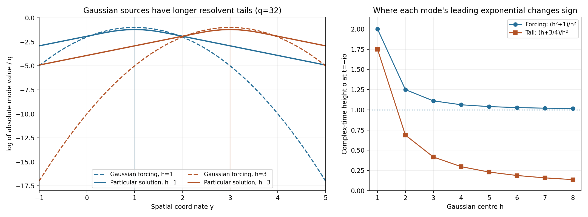

# Analytic forcing without global analytic solutions

*Written by GPT-6.1 Sol (OpenAI), October 2026. Self-checked by the writing AI. Public domain (CC0).*

A right-hand side can be analytic at every real point and still admit no analytic solution on the whole space. We will see this for a heat equation with two spatial variables and for a two-variable Laplacian with an extra parameter. In both cases a smooth solution exists. The obstacle is the analytic dependence that a solution would have to retain while its forcing moves farther into space.

Assume smooth functions, convergent power series and the Cauchy integral formula. The [complete proof](#complete-proof) supplies the Gaussian identities, spatial continuation of homogeneous solutions, infinite-series estimates and the contradiction. Basic references are E. De Giorgi's *Solutions analytiques des équations aux dérivées partielles à coefficients constants*, L. C. Piccinini's work on analytic nonsurjectivity, and [Compact Fourier division and multiplicity-sensitive annihilators](../AN02-L122.html). The latter gives a useful comparison with distributional solvability; it does not replace the analytic arguments here. Credit for the counterexamples and the localized-frequency method belongs to De Giorgi, Lamberto Cattabriga and Piccinini.

## 1. The two equations and the conclusion

On \(\mathbb R^3\), with coordinates \(x,y,t\), consider
\[
 P_0=\partial_x^2+\partial_y^2,\qquad
 P_1=\partial_x^2+\partial_y^2+\partial_t.
 \tag{E1.1}
\]
The variable \(t\) is an analytic parameter for \(P_0\). Reversing time changes \(P_1\) to the forward heat sign.

**Theorem 1.1.** There is a globally real analytic forcing \(f\) such that neither \(P_0u=f\) nor \(P_1u=f\) has a globally real analytic solution. Each equation has a global smooth solution. The forcing may be chosen real valued.

Here “globally real analytic” means analytic near every real point, with a neighborhood allowed to depend on the point. It does not mean an entire extension to all complex space. The dimension is part of the theorem. We use two spatial variables and one time or parameter variable; this is not a counterexample for a heat equation with just one spatial variable.

Theorem 1.1 in the complete proof constructs a specific complex-valued \(f\). One of the three real-valued functions \(\operatorname{Re}f,\operatorname{Im}f,\operatorname{Re}f+\operatorname{Im}f\) defeats both operators. The proof does not identify which of these three it is.

## 2. Analytic sources with much longer solution tails

Choose positive integers \(h,k\). They label a spatial center \(h\) and a frequency \(q=q_{hk}\). Set
\[
 d=h+k-2,\qquad
 n_{hk}=3+\frac{d(d+1)}2+h,\qquad
 q_{hk}=(n_{hk}!)!.
 \tag{E2.1}
\]
The labels \(n_{hk}\) run through all integers at least four once. The successive frequencies are extremely far apart. This will let a high derivative distinguish one mode from all the others.

Define
\[
 f_{hk}(x,y,t)=e^{q[ix+ih^2t-(y-h)^2-1]},\qquad
 f=\sum_{h,k\ge1}f_{hk}.
 \tag{E2.2}
\]
The forcing is concentrated near \(y=h\). At \(y=0\) its absolute size is \(e^{-q(h^2+1)}\). A small imaginary change in \(t\) produces the factor \(e^{-h^2q\operatorname{Im}t}\). The quadratic spatial suppression still protects a complex neighborhood of every real compact set, so the sum is analytic. Lemma 2.2 of the complete proof gives explicit neighborhood widths.

A smooth particular solution of each mode has the form
\[
 w_{hk}^{\varepsilon}(x,y,t)
     =e^{iqx+ih^2qt}W_{h,q}^{\varepsilon}(y),
 \qquad
 \kappa^2=q^2-i\varepsilon h^2q,\quad
 \operatorname{Re}\kappa>0,
 \tag{E2.3}
\]
where \(\varepsilon=0,1\). The one-dimensional Green kernel gives
\[
 W_{h,q}^{\varepsilon}(y)
    =-\frac{e^{-q}}{2\kappa}
       \int_{\mathbb R}e^{-\kappa|y-s|}e^{-q(s-h)^2}\,ds.
 \tag{E2.4}
\]
The negative sign is necessary: the derivative of this Green kernel has jump 1. Its second derivative minus \(\kappa^2\) times itself is a point mass.

The real particular solution is tiny: \(|W|\le e^{-q}q^{-2}\). The sum \(w^\varepsilon=\sum w_{hk}^\varepsilon\) converges with every real derivative and solves the equation smoothly. But at the origin the distant tail has the asymptotic size
\[
 |W_{h,q}^{\varepsilon}(0)|
       \sim\frac{\sqrt\pi}{2q^{3/2}}e^{-q(h+3/4)}
       \quad(q\to\infty,\ h\text{ fixed}).
 \tag{E2.5}
\]
This is much larger than the original forcing's \(e^{-q(h^2+1)}\) there. The integral is dominated near \(s=h-1/2\); completion of the square supplies the constant \(3/4\). Lemma 3.2 includes the phase for the heat operator and bounds the discarded endpoint terms.

The [figure in the complete proof](#complete-proof) shows exact single-mode profiles and their complex-time growth scales. The plotted finite frequencies illustrate the mode family; the proof uses the full lacunary frequencies in (E2.1).

## 3. Why a different homogeneous solution cannot repair analyticity

Finding one particular solution that fails to be analytic would not finish the argument. Another solution could differ from it by a homogeneous solution. We must control every such difference.

**Spatial extension fact.** If \(v\) is a global smooth solution of either homogeneous equation, then for every \(R>0,p>0\),
\[
 |\partial_x^a v(0,0,t)|\le C_{p,R}a!R^{-a}
       \quad(a\ge0,\ |t|\le p).
 \tag{E3.1}
\]
For the Laplacian, the Poisson formula on arbitrarily large spatial circles gives this estimate. For the heat operator, cut the solution off on a large spatial ball and use the heat kernel over one unit of reversed time. The cutoff error stays far from the origin. At a complex spatial coordinate of modulus at most \(R\), the Gaussian still has a positive distance exponent, so its integral is holomorphic and bounded. Cauchy's formula gives (E3.1). Lemma 4.1 proves both cases with no growth condition at infinity. The constant can depend on \(R\); the radius can be chosen arbitrarily large.

Now test a candidate solution with
\[
 B_{h,q}(a)=\int_{-p}^{p}\partial_x^q a(0,0,t)
       e^{-h^2q(t^2/(2p)+it)}\,dt.
 \tag{E3.2}
\]
For the selected particular mode, the time oscillations cancel. Its normalized logarithm has the limit
\[
 \frac{\log|B_{h,q}(w_{hk}^\varepsilon)|}{q}-\log q
       \longrightarrow-h-\frac34.
 \tag{E3.3}
\]
Every other mode is negligible on this scale, because of the gaps between successive frequencies. For a homogeneous solution, (E3.1) gives an upper limit at most \(-1-\log R\) for every \(R\); allowing \(R\) to grow gives upper limit \(-\infty\).

An analytic candidate \(u\) near the origin has a positive complex neighborhood width \(p\). Move the time integral down to imaginary height \(-p\). On the lower side and both vertical sides, the weight gains at least \(e^{-h^2qp/2}\). The Cauchy bound on the \(x\) derivative then gives
\[
 \limsup_{k\to\infty}
 \left(\frac{\log|B_{h,q}(u)|}{q}-\log q\right)
      \le-1-\log p-\frac{h^2p}{2}.
 \tag{E3.4}
\]
For sufficiently large \(h\), this is strictly smaller than (E3.3). If \(u\) were a global analytic solution, \(w^\varepsilon-u\) would be a global smooth homogeneous solution. The selected tail would then be the sum of the analytic candidate's contribution, a negligible homogeneous contribution, and negligible other tails. Their sizes contradict (E3.3). The complete proof supplies all four estimates and this exact decomposition.

## 4. Four worked examples

**Example 1. An explicit separating center.** Suppose the complex neighborhood of an assumed analytic candidate permits \(p=1/4\). Take \(h=12\). The selected-tail limit is \(-12-3/4=-51/4\), whereas the candidate's upper bound is
\[
 -1-\log(1/4)-12^2/8=\log4-19<-17.
 \tag{E4.1}
\]
We used \(\log4<2\). Thus the candidate decays strictly faster on the testing scale. This is a conditional choice of \(p\), not a claim that every analytic function has that width. For any positive width, the positive quadratic term in \(h\) eventually gives the same separation.

**Example 2. Entire spatial behavior without boundedness.** The function \(v(x,y,t)=e^{x-t}\) solves \(P_1v=0\) and is unbounded as \(x\to+\infty\). Nevertheless
\[
 |\partial_x^a v(0,0,t)|=e^{-t}\le e^p
       \le e^{p+R}a!R^{-a}\quad(|t|\le p).
 \tag{E4.2}
\]
The last inequality is a single term of \(e^R=\sum_{j\ge0}R^j/j!\). Thus the spatial extension estimate permits unbounded homogeneous solutions. The constant grows with the radius, which is harmless because the derivative order tends to infinity after the radius is fixed.

**Example 3. Every finite partial sum has an entire solution.** Fix a mode and \(\varepsilon\). Its equation in \(y\) is \(W''-\kappa^2W=e^{-q}e^{-q(y-h)^2}\). With any initial constants \(c_0,c_1\), an entire solution is
\[
 W(y)=c_0\cosh(\kappa y)+\frac{c_1}{\kappa}\sinh(\kappa y)
       +\frac{e^{-q}}{\kappa}\int_0^y
           \sinh(\kappa(y-s))e^{-q(s-h)^2}\,ds.
 \tag{E4.3}
\]
The integral is entire: write \(s=\tau y\), \(0\le\tau\le1\), and integrate the locally uniformly convergent power series in \(y\). Differentiate twice to verify the equation and its initial values. Multiplication by \(e^{iqx+ih^2qt}\) gives an entire mode solution. A finite sum therefore has an entire solution too. The infinite forcing is different: convergence of every real derivative does not imply convergence on a complex neighborhood for the particular-solution sum.

**Example 4. The protective distance in the heat kernel.** In Lemma 4.1 take \(R=2\). The cutoff error is supported at spatial distance at least \(8\). For \(|z|\le2\),
\[
 \operatorname{Re}((z-Y_1)^2+Y_2^2)\ge(8-2)^2-2^2=32,
 \quad
 |G_\tau((z,0)-Y)|\le(4\pi\tau)^{-1}e^{-8/\tau}.
 \tag{E4.4}
\]
The latter is integrable as \(\tau\downarrow0\), even after multiplication by any fixed inverse power of \(\tau\). It protects holomorphy of the cutoff-error integral. Taking larger \(R\) gives arbitrarily large complex spatial discs while using only compact real space-time regions.

## 5. Exercises and full solutions

Exercises 1–4 are worth 10 points each. Exercises 5–8 are worth 15 points each, for a total of 100 points.

### Exercise 1. A diagonal enumeration and factorial gaps — 10 points

List the pairs \((h,k)\) giving labels \(n=4,\ldots,9\). Prove \(q_{n+1}\ge q_n^{n+1}\) without expanding the enormous factorials.

**Solution.** The pairs in order are \((1,1),(1,2),(2,1),(1,3),(2,2),(3,1)\). Their diagonals have lengths \(1,2,3\), giving the labels \(4\), \(5,6\), \(7,8,9\). For \(m=n!\), the quotient \(((n+1)m)!/(m!)^{n+1}\) is the multinomial coefficient counting divisions into \(n+1\) labeled blocks of size \(m\). It is a positive integer, hence at least 1. This is exactly \(q_{n+1}/q_n^{n+1}\). Award 4 points for the pairs and 6 for the factorial argument.

### Exercise 2. A complex neighborhood of a real box — 10 points

For a real box with \(|y|\le1\), use \(H=12\) and the widths in Lemma 2.2. Bound the real part of \(ix+ih^2t-(y-h)^2-1\) for \(h\le12\) and for \(h>12\), and explain why its mode sum is holomorphic there.

**Solution.** Enlarge to \(|\operatorname{Re}y|\le2\), take \(|\operatorname{Im}x|,|\operatorname{Im}y|<1/8\), and \(|\operatorname{Im}t|<1/(8\cdot12^2)\). For \(h\le12\) the real part is at most
\[
 -1+\frac18+\frac18+\frac1{64}=-\frac{47}{64}<-\frac12.
 \tag{E5.1}
\]
For \(h>12\), \(|h-\operatorname{Re}y|\ge3h/4\), and the possible time growth is at most \(h^2/8\). The real part is at most \(-1+1/8+1/64-7h^2/16<-1/2\). Thus each mode has modulus at most \(e^{-q_{hk}/2}\). Since the labels are bijective and \(q_n\ge n\), their sum is dominated by a convergent geometric series. Uniform convergence on compact subsets passes the Cauchy formulas to the sum and gives its holomorphy. Award 4 points for the first bound, 3 for the large-center bound, and 3 for convergence and holomorphy.

### Exercise 3. The Green-kernel sign — 10 points

Show that \(-e^{-\kappa|y|}/(2\kappa)\), with \(\operatorname{Re}\kappa>0\), is a Green kernel for \(\partial_y^2-\kappa^2\). Derive the value of \(\kappa^2\) needed for the heat mode in (E2.3).

**Solution.** On \(y>0\) its first derivative is \(e^{-\kappa y}/2\); on \(y<0\) it is \(-e^{\kappa y}/2\). Its jump is 1. The function itself is continuous, so its distributional second derivative is its ordinary second derivative off zero plus \(\delta_0\), with no derivative of a point mass. Off zero the second derivative equals \(\kappa^2\) times the function. Thus the asserted Green equation holds. On \(e^{iqx+ih^2qt}W(y)\), the \(x\) second derivative contributes \(-q^2W\), and the time derivative contributes \(ih^2qW\). Hence the remaining equation is \(W''-(q^2-ih^2q)W=e^{-q}e^{-q(y-h)^2}\). Award 6 points for the jump and distributional equation, and 4 for the heat sign.

### Exercise 4. Why the endpoint is negligible — 10 points

For \(h=1\), compare the full Gaussian saddle term in Lemma 3.2 with the two negative-half-line errors. Derive the limiting exponential rate of \(W_{1,q}^{\varepsilon}(0)\).

**Solution.** The full integral has modulus asymptotic to \(\sqrt{\pi/q}e^{-3q/4}\), since \(h-1/4=3/4\). Each endpoint error is \(O(q^{-1}e^{-q})\). Their ratio to the full integral is \(O(q^{-1/2}e^{-q/4})\), which tends to zero. Multiplication by \(e^{-q}/(2\kappa)\), with \(|\kappa|/q\to1\), gives
\[
 |W_{1,q}^{\varepsilon}(0)|
       \sim\frac{\sqrt\pi}{2q^{3/2}}e^{-7q/4},
 \qquad \frac{\log|W_{1,q}^{\varepsilon}(0)|}{q}\to-\frac74.
 \tag{E5.2}
\]
The heat phase has modulus one and does not alter this rate. Award 4 points for the two exponential orders, 3 for the relative error, and 3 for the final rate and prefactor.

### Exercise 5. Localizing the homogeneous heat solution — 15 points

Let \(V\) solve \((\partial_s-\Delta_X)V=0\), and let \(\chi\) be the spatial cutoff of Lemma 4.1. Derive the cutoff error \(Q\), its spatial support, and the complex Gaussian bound on \(|z|\le R\). Explain why this gives a spatial Cauchy estimate without an assumption at infinity.

**Solution.** The product rule gives
\[
 (\partial_s-\Delta_X)(\chi V)
       =-2\nabla\chi\cdot\nabla V-(\Delta_X\chi)V=Q.
 \tag{E5.3}
\]
Its support lies in \(4R\le|X|\le5R\), because both derivatives of \(\chi\) vanish elsewhere. For \(Y\) in that support and \(|z|\le R\), the real part of the Gaussian square is at least \((|Y|-|\operatorname{Re}z|)^2-|\operatorname{Im}z|^2\ge8R^2\). Thus \(|G_\tau|\le(4\pi\tau)^{-1}e^{-2R^2/\tau}\). This is integrable at zero; every fixed complex derivative remains integrable with its additional inverse powers. The Duhamel formula therefore extends the restriction at \(y=0\) holomorphically past the closed radius-\(R\) disc. The real solution and its first derivatives are bounded on the compact cutoff region and the fixed time interval, giving a constant \(C_{p,R}\). Cauchy's formula yields \(C_{p,R}a!R^{-a}\). The radius may be arbitrarily large, but the constant need not be independent of it. Award 4 points for the product rule and support, 5 for the Gaussian bound, and 6 for holomorphy, Cauchy's estimate and the role of compactness.

### Exercise 6. Moving the time contour — 15 points

Calculate the real part of \(t^2/(2p)+it\) on the bottom and vertical sides of the rectangle used in Lemma 5.4. Combine it with the Cauchy bound in \(x\) to estimate \(B_{h,q}(u)\). Identify the role of choosing \(h\) after \(p\).

**Solution.** For \(t=s-ip\) the real part is \(s^2/(2p)+p/2\). For \(t=\pm p-i\sigma\), \(0\le\sigma\le p\), it is \(p/2+\sigma-\sigma^2/(2p)\ge p/2\). The bottom length is \(2p\) and the two vertical lengths total \(2p\). Cauchy's formula bounds the derivative by \(Mq!p^{-q}\) on all three sides. The contour identity and the triangle inequality give
\[
 |B_{h,q}(u)|\le4pM q!p^{-q}e^{-h^2qp/2}.
 \tag{E5.4}
\]
The normalized logarithmic upper bound is \(-1-\log p-h^2p/2\). The width \(p\) belongs to the assumed candidate and may be very small; it cannot be fixed in advance for all candidates. Once it is fixed, choose \(h\) so that \(1+\log p+h^2p/2>h+3/4\). The quadratic term makes this possible. Award 6 points for both contour computations, 5 for the estimate, and 4 for the quantifier order.

### Exercise 7. Separating all other frequencies — 15 points

Prove that the lower- and higher-frequency modes have normalized logarithmic upper limit \(-\infty\) in the testing functional. Explain why no oscillatory cancellation estimate is needed.

**Solution.** A mode of frequency \(\lambda\ne q=q_n\) contributes in absolute value at most \(2p\lambda^q e^{-\lambda}\lambda^{-2}\). For lower frequencies, \(\lambda\le q_{n-1}\), so the sum is at most \(C_pq_{n-1}^q\). Its normalized logarithm minus \(\log q\) is at most
\[
 \frac{\log C_p}{q}+\log q_{n-1}-\log q
       \le\frac{\log C_p}{q}-(1-1/n)\log q\longrightarrow-\infty.
 \tag{E5.5}
\]
For higher frequencies, \(\lambda\ge q_{n+1}\ge q^2\), and \(q\log\lambda\le\lambda/2\). Their sum is at most \(C_pe^{-q_{n+1}/2}\). The normalized logarithm is at most \((\log C_p)/q-q_{n+1}/(2q)-\log q\), again tending to \(-\infty\). These are absolute-value estimates. The large factorial gaps already eliminate the other modes, so cancellation of their different time phases is unnecessary. Award 6 points for the lower-frequency bound, 6 for the higher-frequency bound, and 3 for explaining absolute control.

### Exercise 8. Real forcings and extra parameters — 15 points

Suppose the complex forcing \(f=a+ib\) is excluded for both operators. Prove that one of \(a,b,a+b\) is excluded for both. Show how the counterexample extends when extra real variables are added and the operators do not differentiate them.

**Solution.** For one operator, if any two of \(a,b,a+b\) had analytic solutions, addition or subtraction would provide solutions for both \(a\) and \(b\). Their complex linear combination would solve \(f\), a contradiction. Thus at most one of the three candidates is solvable for that operator. With two operators, at most two candidates are solvable for at least one. At least one candidate fails for both. Real coefficients ensure that real or imaginary parts of the smooth particular solutions provide smooth solutions for these real forcings.

For extra variables \(r\in\mathbb R^\ell\), keep the forcing and the smooth particular solution independent of \(r\). If an analytic solution on \(\mathbb R^{3+\ell}\) existed, its restriction to \(r=0\) would remain globally analytic and would solve the already excluded three-dimensional equation, because all derivatives act only in \(x,y,t\). The failure therefore persists. Award 7 points for the three-candidate argument, 3 for the smooth real solutions, and 5 for the restriction argument.

## References

- [Compact Fourier division and multiplicity-sensitive annihilators](../AN02-L122.html), comparison with distributional solvability.
- E. De Giorgi, *Solutions analytiques des équations aux dérivées partielles à coefficients constants*, Séminaire Goulaouic–Schwartz (1971–1972), exposé 29. [Author's seminar](https://www.numdam.org/item/SEDP_1971-1972____A29_0/).
- L. C. Piccinini, *Non surjectivity of the two-variable Laplacian as an operator on the space of analytic functions on three-dimensional real space*, Summer College on Global Analysis, Trieste (1972).
- L. C. Piccinini, *Non surjectivity of the Cauchy–Riemann operator on the space of the analytic functions in real space: generalization to parabolic operators*, Bollettino dell'Unione Matematica Italiana (4), 7 (1973).

## Complete proof

An analytic right-hand side does not always have an analytic solution on the whole real space. Local analytic solvability leaves room for a global obstruction. We give one explicit forcing that defeats both the heat operator with two spatial variables and the two-variable Laplacian acting with an additional parameter.

Basic references are E. De Giorgi's *Solutions analytiques des équations aux dérivées partielles à coefficients constants*, L. C. Piccinini's *Non surjectivity of the Cauchy–Riemann operator on the space of the analytic functions in real space: generalization to parabolic operators*, and [Compact Fourier division and multiplicity-sensitive annihilators](../AN02-L122.html). Credit for the counterexamples and the localized-frequency argument belongs to De Giorgi, Lamberto Cattabriga and Piccinini. Every argument needed here is proved below. We use a diagonal integer enumeration to separate the frequencies and give a direct localized heat-kernel proof of the homogeneous-solution estimate.

All functions may be complex valued. Analytic on real space means locally represented by a convergent power series, or equivalently locally extended holomorphically to complex variables. No common complex neighborhood radius over the whole space is assumed.

## 1. A single forcing for two operators

For \(\varepsilon\in\{0,1\}\), write
\[
 P_\varepsilon=\partial_x^2+\partial_y^2+\varepsilon\partial_t
       \quad\text{on }\mathbb R^3.
 \tag{1.1}
\]
The variable \(t\) is a parameter when \(\varepsilon=0\). When \(\varepsilon=1\), replacing \(t\) by \(-t\) gives the forward heat sign.

**Theorem 1.1.** There is a function \(f\), analytic on all of \(\mathbb R^3\), such that neither equation \(P_\varepsilon u=f\), \(\varepsilon=0,1\), has a global analytic solution. Each equation does have a global smooth solution. At least one of the three real analytic forcings \(\operatorname{Re}f,\operatorname{Im}f,\operatorname{Re}f+\operatorname{Im}f\) has no global analytic solution for either operator.

Here is the forcing. For positive integers \(h,k\), let
\[
 d_{hk}=h+k-2,\qquad
 n_{hk}=3+\frac{d_{hk}(d_{hk}+1)}2+h,\qquad
 q_{hk}=(n_{hk}!)!.
 \tag{1.2}
\]
The integers \(n_{hk}\) enumerate every integer at least four exactly once. For a fixed \(h\), they tend to infinity with \(k\). Set
\[
 f_{hk}(x,y,t)
   =\exp\!\bigl(q_{hk}[ix+ih^2t-(y-h)^2-1]\bigr),
 \qquad f=\sum_{h,k\ge1}f_{hk}.
 \tag{1.3}
\]
The sum and its real derivatives converge locally. Its global analyticity follows from the stronger complex convergence proved next. Sections 3–6 prove the theorem.

## 2. Lacunarity and analyticity of the forcing

**Lemma 2.1.** Put \(q_n=(n!)!\), \(n\ge4\). Then
\[
 q_n\ge n^2,\qquad
 q_n\ge q_{n-1}^{\,n}\ (n\ge5),\qquad
 q_{n+1}\ge q_n^{\,n+1}.
 \tag{2.1}
\]
Consequently, as \(n\to\infty\),
\[
 \log q_{n-1}-\log q_n\longrightarrow-\infty,\qquad
 q_{n+1}/q_n\longrightarrow+\infty.
 \tag{2.2}
\]

**Proof.** The diagonals \(d=h+k-2\) contain \(d+1\) pairs. Their consecutive labels before adding three are \(d(d+1)/2+1,\ldots,(d+1)(d+2)/2\), so (1.2) is a bijection. Also \(h\le n_{hk}\).

The factorial inequality \((am)!\ge(m!)^a\) holds for positive integers \(a,m\): its ratio is the positive integer multinomial coefficient for \(a\) blocks of size \(m\). Apply it with \(a=n,m=(n-1)!\), and then with \(a=n+1,m=n!\). Finally \(n!\ge n^2\) for \(n\ge4\), by the base case \(24\ge16\) and induction, so \(q_n\ge n^2\). Equation (2.2) follows from \(\log q_{n-1}\le(\log q_n)/n\) and \(q_{n+1}\ge q_n^{n+1}\). \(\square\)

**Lemma 2.2.** The function \(f\) in (1.3) extends holomorphically to a neighborhood of every real compact set. In particular it is globally real analytic.

**Proof.** It suffices to consider a compact real box with \(|y|\le M\). Enlarge its real \(y\) range to \(|\operatorname{Re}y|\le M+1\), and choose an integer \(H\ge4(M+2)\). Restrict the imaginary coordinates by
\[
 |\operatorname{Im}x|<\frac18,\qquad
 |\operatorname{Im}y|<\frac18,\qquad
 |\operatorname{Im}t|<\frac1{8H^2}.
 \tag{2.3}
\]
The real part of the bracket in (1.3) is
\[
 -\operatorname{Im}x-h^2\operatorname{Im}t
       -(\operatorname{Re}y-h)^2+(\operatorname{Im}y)^2-1.
 \tag{2.4}
\]
For \(h\le H\), discard the nonpositive square. The remaining upper bound is \(-1+1/8+1/8+1/64<-1/2\). For \(h>H\), \(|\operatorname{Re}y-h|\ge3h/4\), and the positive time term is at most \(h^2/8\). This also makes (2.4) less than \(-1/2\).

Thus \(|f_{hk}|\le e^{-q_{hk}/2}\) on this complex neighborhood. The bijection and \(q_n\ge n\) imply summability. The series converges uniformly on compact subsets there. Its sum is holomorphic: integrate the uniformly convergent sums on small coordinate circles to pass their Cauchy formulas to the limit, obtaining convergent local power series. The same formulas justify local termwise differentiation. \(\square\)

## 3. Smooth particular solutions and their distant tails

For a pair with frequency \(q=q_{hk}\), define the square root with positive real part
\[
 \kappa=\sqrt{q^2-i\varepsilon h^2q},\qquad
 W_{h,q}^{\varepsilon}(y)
   =-\frac{e^{-q}}{2\kappa}
      \int_{\mathbb R}e^{-\kappa|y-s|}e^{-q(s-h)^2}\,ds,
 \qquad
 w_{hk}^{\varepsilon}(x,y,t)
   =e^{iqx+ih^2qt}W_{h,q}^{\varepsilon}(y).
 \tag{3.1}
\]
Since \(h^2\le q\),
\[
 \operatorname{Re}\kappa\ge q,\qquad
 q\le|\kappa|\le 2^{1/4}q.
 \tag{3.2}
\]

**Lemma 3.1.** The series \(w^\varepsilon=\sum_{h,k}w_{hk}^\varepsilon\) converges with all real derivatives, uniformly on real space for each fixed derivative order. It is a global smooth solution of \(P_\varepsilon w^\varepsilon=f\). Each summand satisfies
\[
 |W_{h,q}^{\varepsilon}(y)|\le e^{-q}q^{-2}
       \quad(y\in\mathbb R).
 \tag{3.3}
\]

**Proof.** The real part and modulus identities for the square root give (3.2). The function \(-e^{-\kappa|y|}/(2\kappa)\) has derivative jump 1 at zero. Thus its distributional second derivative minus \(\kappa^2\) times itself is \(\delta_0\). Convolution with the Gaussian gives
\[
 (W_{h,q}^{\varepsilon})''-\kappa^2W_{h,q}^{\varepsilon}
          =e^{-q}e^{-q(y-h)^2}.
 \tag{3.4}
\]
The integral and its first derivative are continuous. Equation (3.4) and the smooth right side show successively that \(W\) is smooth. Multiplying it by the exponential in (3.1), with \(\kappa^2=q^2-i\varepsilon h^2q\), proves the particular equation.

Dropping the Gaussian in the absolute integral gives (3.3), since \(\int e^{-q|r|}dr=2/q\). Differentiating the kernel once gives \(|W'|\le e^{-q}/q\). Each fixed Gaussian derivative of order \(a\) is bounded by \(C_aq^{a/2}\): differentiate after the change of variable \(\sqrt q(y-h)\), and use boundedness of each fixed polynomial times \(e^{-r^2}\).

Differentiate (3.4) repeatedly. From the bounds on \(W,W'\), on \(\kappa\), and on the Gaussian derivatives, induction gives \(|W^{(a)}|\le C_a e^{-q}q^a\), a sufficiently loose bound for every \(a\). An \(x\) derivative contributes \(q\), and a \(t\) derivative contributes \(h^2q\le q^2\). Every fixed mixed derivative is therefore bounded by \(C e^{-q}q^L\) for some fixed integer \(L\). Its sum over the distinct increasing integers \(q_n\) converges, being at most a constant times \(\sum_{j\ge1}e^{-j}j^L\). Uniform convergence proves smoothness and the termwise equation. \(\square\)

**Lemma 3.2.** Fix \(h\ge1\) and \(\varepsilon\in\{0,1\}\). As the real frequency \(q\to\infty\),
\[
 W_{h,q}^{\varepsilon}(0)
 =-\frac{\sqrt\pi}{2q^{3/2}}
       e^{-q(h+3/4)}
       e^{i\varepsilon(h^3/2-h^2/4)}
       (1+o(1)).
 \tag{3.5}
\]
In particular this value is nonzero for all sufficiently large \(q\).

**Proof.** Taylor expansion of the square root at 1 gives, for this fixed \(h\),
\[
 \kappa=q-i\varepsilon h^2/2+O_h(q^{-1}).
 \tag{3.6}
\]
The full Gaussian integral, with no absolute value in the linear exponent, is
\[
 J=\int_{\mathbb R}e^{-\kappa s-q(s-h)^2}\,ds
       =\sqrt{\pi/q}\,e^{-\kappa h+\kappa^2/(4q)}.
 \tag{3.7}
\]
For real \(\kappa\) this is completion of the square and the Gaussian integral. Both sides are entire in \(\kappa\); uniform domination on each compact set permits complex differentiation under the integral. Equality for real \(\kappa\) therefore proves the complex identity by its power series identity theorem.

Let \(I\) be the integral with \(e^{-\kappa|s|}\) in (3.1), at \(y=0\). The two negative-half-line integrals distinguish it from \(J\). Their absolute values are bounded respectively by
\[
 \frac{e^{-qh^2}}{2qh+\operatorname{Re}\kappa},
 \qquad
 \frac{e^{-qh^2}}{2qh-\operatorname{Re}\kappa}.
 \tag{3.8}
\]
The second denominator is positive for all large \(q\), by (3.6) and \(h\ge1\). To obtain these bounds set \(s=-r\), \(r\ge0\), and discard the nonpositive term \(-qr^2\). Consequently \(I-J=O_h(q^{-1}e^{-qh^2})\).

Meanwhile \(|J|=\sqrt{\pi/q}\exp(-q(h-1/4)+O_h(q^{-1}))\). The error relative to \(J\) tends to zero, because \(h^2-h+1/4=(h-1/2)^2>0\). Finally
\[
 -q-\kappa h+\kappa^2/(4q)
   =-q(h+3/4)+i\varepsilon(h^3/2-h^2/4)+O_h(q^{-1}),
 \tag{3.9}
\]
and \(\kappa/q\to1\). Insert these identities into (3.1) to prove (3.5). \(\square\)

**Figure 1.** The left panel gives exact single-mode profiles at \(x=t=0\), for \(\varepsilon=0,q=32,h=1,3\). These finite parameter examples belong to the resolvent family (3.1); they are not the full lacunary sum (1.3). The ordinate is the actual logarithm of the absolute mode value divided by \(q\). The Gaussian forcing decays quadratically away from its center, whereas the particular solution has a longer tail. At \(y=0,t=-i\sigma\), the forcing's exponential rate changes sign at \(\sigma=(h^2+1)/h^2\). By Lemma 3.2, the tail's leading rate changes sign at \(\sigma=(h+3/4)/h^2\) as \(q\to\infty\). The right panel gives these exact rates. They explain the obstruction, but growth of individual modes alone does not exclude a different analytic solution. Lemma 4.1 and the functionals of Section 5 supply that exclusion. [Full-size image](../reproduce/L181/figures/gaussian-sources-and-distant-tails.png), [vector drawing](../reproduce/L181/figures/gaussian-sources-and-distant-tails.svg).

## 4. Global homogeneous solutions are entire in a spatial coordinate

**Lemma 4.1.** Suppose \(v\) is smooth on all of \(\mathbb R^3\), with \(P_\varepsilon v=0\). For every \(p>0,R>0\), there is a constant \(C_{p,R}\) such that
\[
 |\partial_x^a v(0,0,t)|
       \le C_{p,R}\,a!\,R^{-a}
       \quad(a\ge0,\ -p\le t\le p).
 \tag{4.1}
\]
No boundedness or growth condition at spatial infinity is needed.

**Proof for the Laplacian.** At each real \(t\), the function in the two spatial variables is harmonic. On the circle of radius \(2R\), let \(M_{p,R}\) be the maximum of its modulus over that circle and \([-p,p]\). It is finite by continuity on a compact set. The Poisson formula, restricted to the real \(x\) axis, is
\[
 v(x,0,t)=\frac1{2\pi}\int_0^{2\pi}
      v(2R\cos\theta,2R\sin\theta,t)
      \frac{4R^2-x^2}{4R^2-4Rx\cos\theta+x^2}\,d\theta
      \quad(|x|<2R).
 \tag{4.2}
\]
For completeness, the Poisson kernel on the disc has expansion
\(1+2\sum_{m\ge1}(r/(2R))^m\cos(m(\theta-\varphi))\), for \(r<2R\). Each term is harmonic and the sum converges uniformly on smaller discs. The positive kernel has integral \(2\pi\); away from a given boundary angle it tends uniformly to zero as \(r\uparrow2R\). Integration against continuous boundary data therefore gives their boundary values. Uniqueness follows from the maximum principle, for real and imaginary parts separately. That principle follows by adding a positive multiple of the squared radius: a strictly positive Laplacian prevents a positive interior maximum, then the multiple tends to zero. These facts prove (4.2).

Replace \(x\) by the complex coordinate \(z\). The denominator factors as \((2Re^{i\theta}-z)(2Re^{-i\theta}-z)\). On \(|z|\le R\) its modulus is at least \(R^2\), while the numerator modulus is at most \(5R^2\). Thus (4.2) extends holomorphically to \(|z|<2R\) and is bounded by \(5M_{p,R}\) on \(|z|\le R\). Cauchy's coefficient formula gives (4.1).

**Proof for the heat operator.** Reverse time: \(V(X,s)=v(X,-s)\), \(X=(x,y)\), satisfies \((\partial_s-\Delta_X)V=0\). Take a smooth spatial cutoff \(\chi\), equal to 1 on \(|X|\le4R\), supported in \(|X|<5R\). Such a cutoff is a fixed smooth function of \(|X|^2/R^2\). Put
\[
 A=\chi V,\qquad
 Q=(\partial_s-\Delta_X)A
      =-2\nabla\chi\cdot\nabla V-(\Delta_X\chi)V.
 \tag{4.3}
\]
The support of \(Q\) in space is contained in \(4R\le|X|\le5R\). Both \(A\) and \(Q\) are uniformly bounded on their spatial supports for \(-p-1\le s\le p\).

The heat kernel and the compactly supported Duhamel identity are
\[
 G_\tau(Z)=(4\pi\tau)^{-1}
       \exp(-(Z_1^2+Z_2^2)/(4\tau)),\qquad
 A(X,s)=(G_1*A(\,\cdot,s-1))(X)
       +\int_0^1(G_\tau*Q(\,\cdot,s-\tau))(X)\,d\tau.
 \tag{4.4}
\]
Here the squares are bilinear complex squares. To prove the real identity, the Gaussian has integral 1, satisfies \(\partial_\tau G_\tau=\Delta G_\tau\), and is an approximate identity as \(\tau\downarrow0\). These statements follow by differentiation, the one-dimensional Gaussian integral in each coordinate, and splitting the mass into a small ball and its exponentially small complement. Differentiate \(G_{s-\sigma}*A(\,\cdot,\sigma)\) in \(\sigma<s\). Compact support permits integration by parts, so its derivative is \(G_{s-\sigma}*Q(\,\cdot,\sigma)\). Integrate from \(s-1\) to \(s\), using the approximate-identity limit. This proves (4.4).

At \(X=(z,0)\), the first term of (4.4) is entire in \(z\). On \(|z|\le R\) and the support of \(Q(Y,\cdot)\),
\[
 \operatorname{Re}((z-Y_1)^2+Y_2^2)
   =(\operatorname{Re}z-Y_1)^2+Y_2^2-(\operatorname{Im}z)^2
   \ge(4R-R)^2-R^2=8R^2.
 \tag{4.5}
\]
The absolute heat kernel is consequently at most \((4\pi\tau)^{-1}e^{-2R^2/\tau}\), an integrable function of \(0<\tau\le1\). Spatial compactness and the bound on \(Q\) give uniform domination, also uniformly for real \(-p\le s\le p\). On smaller complex neighborhoods each derivative has the same exponential domination with an additional finite power of \(1/\tau\). The integral term is holomorphic and uniformly bounded on \(|z|\le R\). Equivalently its coordinate Cauchy formulas pass under the dominated integral.

For real \(|x|\le R\), \(A(x,0,s)=V(x,0,s)\). Thus (4.4) gives a uniformly bounded holomorphic extension of that restriction to a neighborhood of \(|z|\le R\). Cauchy's formula gives (4.1) and reversing \(s\) gives its original \(t\) interval. The bounds use only compact real space-time sets; no estimate at infinity was invoked. \(\square\)

Since \(R\) is arbitrary, the compatible extensions along this spatial coordinate are entire. We only need their derivative bounds, uniform on a fixed real time interval.

## 5. Functionals that detect one tail

Fix \(p>0\). At frequency \(q=q_{hk}\), define
\[
 B_{h,q}(a)=\int_{-p}^{p}\partial_x^q a(0,0,t)
       \exp\!\left(-h^2q\left(\frac{t^2}{2p}+it\right)\right)\,dt.
 \tag{5.1}
\]
All these functionals are defined on global smooth functions. Write \(\log0=-\infty\) in the limiting estimates.

**Lemma 5.1 (the selected tail).** For fixed \(h\) and either \(\varepsilon\), as \(k\to\infty\),
\[
 \frac{\log|B_{h,q}(w_{hk}^{\varepsilon})|}{q}-\log q
        \longrightarrow-(h+3/4).
 \tag{5.2}
\]

**Proof.** The \(t\) phases cancel for this summand, so
\[
 B_{h,q}(w_{hk}^{\varepsilon})
   =(iq)^qW_{h,q}^{\varepsilon}(0)
           \int_{-p}^{p}e^{-h^2qt^2/(2p)}\,dt.
 \tag{5.3}
\]
After changing variable \(r=h\sqrt{q/(2p)}\,t\), the last integral is asymptotic to \(\sqrt{2\pi p/(h^2q)}\). The omitted Gaussian tails tend to zero by the elementary bound \(\int_L^\infty e^{-r^2}dr\le e^{-L^2}/(2L)\). Lemma 3.2 now proves (5.2), because the powers and fixed constants outside the exponential have logarithms \(O(\log q)\). \(\square\)

**Lemma 5.2 (all other tails).** For fixed \(h\),
\[
 \limsup_{k\to\infty}
 \left(\frac{\log|B_{h,q}(w^\varepsilon-w_{hk}^\varepsilon)|}{q}
                  -\log q\right)=-\infty.
 \tag{5.4}
\]

**Proof.** Differentiated uniform convergence in Lemma 3.1 permits the sum in the functional. For a summand with different frequency \(\lambda\), its absolute contribution is at most
\[
 2p\,\lambda^q e^{-\lambda}\lambda^{-2}.
 \tag{5.5}
\]
The time weight has modulus at most 1 on the real interval. Suppose \(q=q_n\). Every smaller frequency is at most \(q_{n-1}\). Their total is bounded by \(C_p q_{n-1}^q\), because \(\sum_\lambda e^{-\lambda}\lambda^{-2}\) is finite. Its normalized logarithm minus \(\log q\) tends to \(-\infty\) by Lemma 2.1.

For larger frequencies \(\lambda\ge q_{n+1}\ge q^2\), we have \(q\log\lambda\le\lambda/2\). Indeed \((\log r)/r\) decreases for \(r>e\), and at \(r=q^2\) the desired bound follows from \(2\log q/q<1/2\); all our \(q\)'s are at least \(24!\). Thus their total is bounded by
\[
 2p\sum_{\lambda\ge q_{n+1}}e^{-\lambda/2}
       \le C_p e^{-q_{n+1}/2}.
 \tag{5.6}
\]
The last estimate enlarges the sum to all integer frequencies, a geometric series. Its normalized logarithm also tends to \(-\infty\), since \(q_{n+1}/q\to\infty\). Adding the two bounds proves (5.4). \(\square\)

**Lemma 5.3 (homogeneous solutions).** If \(P_\varepsilon v=0\) globally and \(v\) is smooth, then for each fixed \(h\),
\[
 \limsup_{k\to\infty}
 \left(\frac{\log|B_{h,q}(v)|}{q}-\log q\right)=-\infty.
 \tag{5.7}
\]

**Proof.** Lemma 4.1 and the modulus bound of the real time weight give
\[
 |B_{h,q}(v)|\le2p\,C_{p,R}\,q!\,R^{-q}
       \quad\text{for every }R>0.
 \tag{5.8}
\]
The elementary factorial asymptotic is \((\log q!)/q-\log q\to-1\). One proof compares \(\sum_{j=1}^q\log j\) with \(\int_1^q\log s\,ds=q\log q-q+1\); the difference is at most \(\log q\). Hence the left upper limit in (5.7) is at most \(-1-\log R\). Let \(R\to\infty\). Each constant is fixed before taking \(k\to\infty\), so these inequalities prove (5.7). \(\square\)

**Lemma 5.4 (a locally analytic candidate).** If \(u\) is analytic near the origin, choose \(p>0\) so that its holomorphic extension is bounded by \(M\) on a neighborhood of
\[
 \{|x|\le p,\ y=0,\ |\operatorname{Re}t|\le p,\
                       -p\le\operatorname{Im}t\le0\}.
 \tag{5.9}
\]
Such a positive \(p\) exists. Then
\[
 |B_{h,q}(u)|\le4pM\,q!\,p^{-q}e^{-h^2qp/2},
 \qquad
 \limsup_{k\to\infty}
 \left(\frac{\log|B_{h,q}(u)|}{q}-\log q\right)
       \le-1-\log p-h^2p/2.
 \tag{5.10}
\]

**Proof.** Cauchy's formula in \(x\) bounds \(|\partial_x^q u(0,0,t)|\) by \(Mq!p^{-q}\), uniformly on the indicated complex time rectangle. Move the real integration segment in (5.1) to the other three sides of that rectangle. The integrand is holomorphic in \(t\). On the lower side \(t=s-ip\),
\[
 \operatorname{Re}\left(\frac{t^2}{2p}+it\right)
       =\frac{s^2}{2p}+\frac p2.
 \tag{5.11}
\]
On either vertical side \(t=\pm p-i\sigma\), \(0\le\sigma\le p\), the same real part is
\[
 \frac p2+\sigma-\frac{\sigma^2}{2p}\ge\frac p2.
 \tag{5.12}
\]
The three side lengths total \(4p\). Their common exponential bound proves the first inequality, regardless of their orientations. The factorial estimate in Lemma 5.3 proves the second. \(\square\)

## 6. Contradiction and the real-valued conclusion

**Proof of Theorem 1.1.** The forcing is analytic by Lemma 2.2, and Lemma 3.1 provides its global smooth particular solution for each operator.

Suppose a global analytic solution \(u\) existed for one of the two operators. Then \(v=w^\varepsilon-u\) is a global smooth homogeneous solution. Fix the positive \(p\) supplied by Lemma 5.4. Choose an integer \(h\) so large that
\[
 1+\log p+h^2p/2>h+3/4.
 \tag{6.1}
\]
This is possible since the positive quadratic term dominates the linear term. At each frequency \(q=q_{hk}\), the exact decomposition gives
\[
 B_{h,q}(w_{hk}^{\varepsilon})
   =B_{h,q}(u)+B_{h,q}(v)
             -B_{h,q}(w^\varepsilon-w_{hk}^{\varepsilon}).
 \tag{6.2}
\]
By Lemma 5.1 the normalized logarithm of the left side tends to \(-(h+3/4)\). By Lemma 5.4 and (6.1), the upper limit for the first term on the right is strictly smaller. Lemmas 5.2 and 5.3 give upper limit \(-\infty\) for the other terms. The triangle inequality contradicts (6.2): choose a fixed exponent strictly between the first right upper bound and the left limit; the three right terms are eventually bounded by \(3q^qe^{-cq}\) at a larger decay exponent than the left. Thus no global analytic solution exists.

Both operators have real coefficients. Put \(a=\operatorname{Re}f,b=\operatorname{Im}f\). For a fixed operator, at most one of \(a,b,a+b\) can have an analytic solution: solutions for any two give solutions for both \(a\) and \(b\) by addition or subtraction, and then a complex linear combination solves the already excluded forcing \(f\). For two operators, at most two of the three candidates can be solvable for at least one of them. At least one candidate therefore fails for both. If real-valued solutions are desired, real parts of solutions of a real forcing give such solutions, so the same conclusion applies. Real or imaginary parts, or their sum, of the respective \(w^\varepsilon\) provide smooth solutions for each candidate. \(\square\)

The operator and its dimension matter. The heat example has two spatial variables and one time variable. It supplies no negative result for a heat operator in only two total real variables. The partial Laplacian acts in two variables on functions of three variables; the parameter is part of the analytic requirement.

**Corollary 6.1.** For either operator, the same failure holds on \(\mathbb R^{3+\ell}\), \(\ell\ge0\), when it acts only in the displayed three variables.

**Proof.** Keep the forcing independent of the additional variables. Restricting any hypothetical analytic solution to the additional variables equal to zero would give a global analytic solution on \(\mathbb R^3\), which has just been excluded. The smooth particular solution extends by independence of those variables. \(\square\)

## References

- [Compact Fourier division and multiplicity-sensitive annihilators](../AN02-L122.html), comparison with distributional solvability; its Fourier theorem is not a substitute for analytic solvability.
- E. De Giorgi, *Solutions analytiques des équations aux dérivées partielles à coefficients constants*, Séminaire Goulaouic–Schwartz (1971–1972), exposé 29. [Author's seminar](https://www.numdam.org/item/SEDP_1971-1972____A29_0/). Credit for the heat counterexample and its frequency-isolating argument.
- L. C. Piccinini, *Non surjectivity of the two-variable Laplacian as an operator on the space of analytic functions on three-dimensional real space*, Summer College on Global Analysis, Trieste (1972). Credit for the partial-Laplacian counterexample.
- L. C. Piccinini, *Non surjectivity of the Cauchy–Riemann operator on the space of the analytic functions in real space: generalization to parabolic operators*, Bollettino dell'Unione Matematica Italiana (4), 7 (1973). Credit for the global analytic nonsurjectivity phenomenon. The complete arguments required for the two operators treated here are supplied above.
