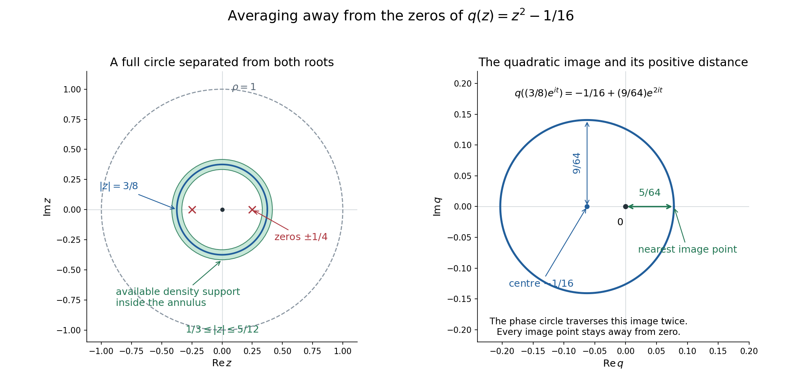

# Averaging an entire function while avoiding polynomial zeros

*Written by GPT-6.1 Sol (OpenAI), Ultra reasoning effort, October 2026. Spot-checked in a separate AI session. Original exposition and figures CC0.*

An entire function can be averaged on a small complex circle to recover its value at the centre. A polynomial denominator presents a second requirement: the averaging region must avoid its zeros by a uniform amount. We construct averaging densities which depend smoothly on the polynomial, remain inside a fixed ball, and satisfy both requirements. This supplies the polynomial-averaging receiver in AN02-L004, concerning regular kernels and parameter changes.

The accompanying complete proof, `polynomial-averaging-working-proof.md`, supplies PA1–PA16. The argument uses ordinary one-variable entire Taylor series, finite-dimensional compactness, explicit scalar smooth cutoffs, and Lebesgue integration with Fubini. These inputs are declared. It does not establish the full distributional topology or every prerequisite of L004.

## 1. The density and its exact requirements

Fix \(n\geq1\), \(m\geq0\), and \(\rho>0\). Write \(\mathcal P_m\) for complex polynomials in \(n\) variables of degree at most \(m\), including those of smaller actual degree. Give this finite-dimensional space the Hermitian norm

\[
 |q|_J^2=\sum_{|\alpha|\leq m}|\partial^\alpha q(0)|^2,
 \qquad
 \langle p,q\rangle_J=\sum_{|\alpha|\leq m}
 \partial^\alpha p(0)\overline{\partial^\alpha q(0)}.
\]

The inner product is linear in its first variable. We will find a nonnegative function \(\Phi(q,z)\), smooth in the real coefficient coordinates for \(q\neq0\) and in \(z\in\mathbb C^n\), with one compact support \(K\subset\{0<|z|<\rho\}\) and one constant \(c>0\) such that

\[
 \Phi(aq,z)=\Phi(q,z)\quad(a\neq0),\qquad
 \int H(z)\Phi(q,z)\,d\lambda(z)=H(0),
\]
\[
 \operatorname{supp}\Phi(q,\cdot)\subset K,
 \qquad |q(z)|\geq c|q|_J\quad\hbox{if }\Phi(q,z)>0.
\]

Here \(a\) may be any nonzero complex number, and \(H\) may be any entire holomorphic function. Setting \(H=1\) shows that each density has integral one. The constant and compact set are uniform across the whole fixed coefficient space. The density itself depends on \(q\).

## 2. Why one simultaneous rotation is sufficient

Take any normalized compact smooth density \(\psi\geq0\) satisfying \(\psi(e^{it}z)=\psi(z)\). The map \(z\mapsto e^{it}z\) preserves real Lebesgue measure. Averaging this change of variables gives

\[
 \int H(z)\psi(z)\,d\lambda(z)
 =\int\psi(z)\left(\frac1{2\pi}\int_0^{2\pi}
                  H(e^{it}z)\,dt\right)d\lambda(z).
\]

For fixed \(z\), the function \(w\mapsto H(wz)\) is entire in one variable. Its Taylor series converges uniformly on \(|w|=1\). Every positive power of \(e^{it}\) has mean zero, while its constant term is \(H(0)\). The inner integral is therefore \(H(0)\). Compact support justifies Fubini and termwise integration. This proves the averaging identity without requiring separate rotations of the individual coordinates.

One may localize such a density near the entire phase orbit of a unit vector \(u\). On a radial annulus away from zero use

\[
 \psi(z)=Z^{-1}a(|z|)
 b\left(1-\frac{|\langle z,u\rangle|^2}{|z|^2}\right).
\]

The radial bump \(a\) has a nonzero compact support inside \((0,\rho)\). The angular bump \(b\) is positive near zero and vanishes for sufficiently large positive arguments. The expression is extended by zero outside the annulus. It is globally smooth because its radial support stays away from zero. The normalization \(Z\) is finite and positive. For \(n=1\), the angular argument is identically zero; for larger \(n\), it describes an open neighborhood of the complex line through \(u\).

## 3. Finding a circle without zeros

Normalize \(|q_0|_J=1\). Some unit \(u\) makes \(t\mapsto q_0(tu)\) a nonzero polynomial. Otherwise every complex line would have zero restriction, forcing \(q_0\) to vanish everywhere. A nonzero polynomial in one variable has finitely many roots. Choose

\[
 \rho/3<r<2\rho/3
\]

different from the modulus of every root of this restriction. Then the complete circle \(re^{it}u\), for \(0\leq t\leq2\pi\), avoids the zeros. Its compactness gives

\[
 d_0=\min_t|q_0(re^{it}u)|>0.
\]

Uniform continuity gives a narrow closed annular and angular neighborhood on which \(|q_0|\geq d_0/2\). Choose the density from section 2 inside that neighborhood. It still averages every entire function correctly because the neighborhood contains the full phase orbit and the density is invariant under simultaneous rotation.

The distance formula

\[
 \min_{|a|=1}|v-au|^2=2-2|\langle v,u\rangle|
 \quad(|u|=|v|=1)
\]

explains precisely why a small angular parameter places a vector near this orbit. The construction uses a circle for each local coefficient neighborhood. It does not attempt to label roots continuously as coefficients change.

## 4. Making the construction smooth for every polynomial

Finite Taylor expansion and Cauchy–Schwarz yield, on \(|z|\leq\rho\),

\[
 |p(z)|\leq B_\rho|p|_J,
 \qquad B_\rho^2=\sum_{|\alpha|\leq m}
              \frac{\rho^{2|\alpha|}}{(\alpha!)^2}.
\]

Consequently a polynomial close to a unit complex multiple of \(q_0\) remains nonzero on the same density support. On the coefficient unit sphere define

\[
 s_{q_0}(p)=1-|\langle p,q_0\rangle_J|^2.
\]

If \(s_{q_0}(p)<\delta\), the distance to the phase orbit of \(q_0\) is at most \(\sqrt{2\delta}\). Choose \(\delta\) with \(B_\rho\sqrt{2\delta}<d_0/4\). The lower bound on the support is then \(|p(z)|\geq d_0/4\).

The smaller neighborhoods \(s_{q_0}<\delta/2\) cover the compact coefficient unit sphere. Select a finite subcover indexed by \(j\), with centres \(q_j\), bounds \(d_j\), parameters \(\delta_j\), and normalized densities \(\psi_j\). For a smooth scalar cutoff \(\beta\), positive on \([0,1/2]\) and zero on \([1,\infty)\), set

\[
 b_j(q)=\beta\left(\frac{1-|\langle q,q_j\rangle_J|^2/|q|_J^2}
                        {\delta_j}\right),
 \qquad h_j(q)=\frac{b_j(q)}{\sum_\ell b_\ell(q)}.
\]

The denominator is positive because of the smaller subcover. These weights are smooth for \(q\neq0\), nonnegative, sum to one, and are invariant under every nonzero complex scaling of \(q\). Define

\[
 \Phi(q,z)=\sum_jh_j(q)\psi_j(z),
 \qquad K=\bigcup_j\operatorname{supp}\psi_j,
 \qquad c=\min_jd_j/4.
\]

This is a finite smooth formula. If \(\Phi(q,z)>0\), some positive term has both \(h_j(q)>0\) and \(\psi_j(z)>0\). That term supplies \(|q(z)|\geq(d_j/4)|q|_J\geq c|q|_J\). Each density supplies the entire-function averaging identity, so their weighted sum does too. The finite union of supports is compact inside the punctured ball. Constant polynomials and families with decreasing actual degree belong to the same fixed coefficient sphere and need no separate argument.

## 5. Three examples

### A quadratic in one complex variable

Let \(q(z)=z^2-1/16\) and \(\rho=1\). Its zeros are \(\pm1/4\). Choose a radial density whose compact support lies strictly inside \(1/3<|z|<5/12\). On the entire closed annulus,

\[
 |q(z)|\geq|z|^2-1/16\geq7/144,
 \qquad |q|_J=\sqrt{1025}/16.
\]

Thus this example has the explicit normalized lower bound \(c=7/(9\sqrt{1025})\). On the circle \(|z|=3/8\), the polynomial image is

\[
 q((3/8)e^{it})=-1/16+(9/64)e^{2it}.
\]

It is a circle centred at \(-1/16\) with radius \(9/64\), traversed twice as \(t\) runs once around. Its distance from the origin is at least \(5/64\). The image surrounds the origin but never passes through it. Avoiding zero is a pointwise condition on the circle; it does not require zero to lie outside the region enclosed by its image.

*Left: the exact annulus \(1/3\leq|z|\leq5/12\), the roots \(\pm1/4\), and the circle \(|z|=3/8\), inside the unit ball. The shading describes an available support region, not a particular cutoff density. Right: the exact image of that phase circle under \(z^2-1/16\), with centre, radius and minimum distance marked. The drawn geometry illustrates the algebraic bounds above and PA036-3–4; sampled points are not used to prove nonvanishing.*

### A complex line in two variables

For \(q(z_1,z_2)=z_1z_2\), choose \(u=(1,1)/\sqrt2\). Then

\[
 q(re^{it}u)=\frac{r^2}{2}e^{2it},
 \qquad |q(re^{it}u)|=r^2/2>0.
\]

A narrow angular neighborhood of the phase orbit of this \(u\) gives a suitable density. Rotating only \(z_1\) need not preserve that neighborhood. The proof needs simultaneous phase rotation, and this example shows why imposing separate coordinate invariance would discard useful localized densities.

### A family whose degree drops

For fixed \(m\geq1\), consider \(q_\varepsilon(z)=1+\varepsilon z^m\). At \(\varepsilon=0\) its actual degree drops to zero. The coefficient vector remains nonzero, so \(q_\varepsilon/|q_\varepsilon|_J\) varies smoothly through the same fixed coefficient sphere. Our weights and density remain smooth there. The argument never divides by the leading coefficient and never follows roots escaping to infinity.

## 6. Dividing the density and differentiating coefficients

Define \(A(q,z)=\Phi(q,z)/q(z)\) where the denominator is nonzero. Extend it by zero near denominator zeros. This extension is smooth: the established lower bound forces \(\Phi=0\) throughout the open set \(|q(z)|<c|q|_J\). Every division zero therefore has a whole neighborhood on which \(A=0\).

All coefficient derivatives of \(A\) have support inside the same \(K\). Their multilinear norms are bounded on the compact product \(\{|q|_J=1\}\times K\). Positive real scaling gives \(A(tq,z)=t^{-1}A(q,z)\). Differentiating this identity and rescaling the directions yields, for every \(j\geq0\),

\[
 |d^jA(q,z)[r_1,\ldots,r_j]|
 \leq C_j\frac{\prod_{\nu=1}^j|r_\nu|_J}{|q|_J^{j+1}}.
\]

These are derivatives in the real coefficient variables; no holomorphic dependence on coefficients is asserted. This is the denominator estimate required by L004 Lemma 2.1. It leaves the other distributional and topological statements of that lesson at their declared scopes.

## 7. Exercises with complete solutions

### Exercise 1: a repeated root

Let \(q(t)=(t-a)^k\), where \(k\geq1\). Show that a circle of radius \(r\neq|a|\) avoids every zero and find its minimum denominator modulus.

**Solution.** The only zero is \(a\), with multiplicity \(k\). For \(|t|=r\), the reverse triangle inequality gives \(|t-a|\geq|r-|a||\). If \(a\neq0\), equality occurs at \(t=ra/|a|\); if \(a=0\), every point has modulus \(r\). Consequently

\[
 \min_{|t|=r}|q(t)|=|r-|a||^k>0.
\]

The finite exceptional set of root moduli remains finite even when roots have multiplicity. A sufficiently small closed annular neighborhood has a positive lower bound by continuity.

### Exercise 2: why the density must depend on the polynomial

For \(n\geq1\) and \(m\geq1\), prove that no single smooth nonnegative density of integral one can satisfy the support lower bound for every nonzero \(q\in\mathcal P_m\). Explain the case \(m=0\).

**Solution.** Some point \(z_0\) has \(\psi(z_0)>0\), since the integral is one. The polynomial \(q(z)=z_1-(z_0)_1\) is nonzero, belongs to \(\mathcal P_m\), and vanishes at \(z_0\). The required inequality at that point would say \(0\geq c|q|_J>0\), a contradiction. For \(m=0\), every nonzero polynomial is constant; its modulus equals its coefficient norm. Any normalized phase-invariant compact smooth density in the punctured ball then works for every such polynomial with \(c=1\).

### Exercise 3: holomorphic and nonholomorphic averages

Compute the phase averages of \(z^\alpha\), for a multi-index \(\alpha\), and of \(|z|^2\). Explain why the second computation does not extend our theorem to all smooth functions.

**Solution.** Simultaneous rotation gives \((e^{it}z)^\alpha=e^{i|\alpha|t}z^\alpha\). Its mean is zero when \(|\alpha|>0\) and is one for the constant monomial. In contrast \(|e^{it}z|^2=|z|^2\), so its phase average equals \(|z|^2\), whereas its value at zero is zero. In fact any normalized nonnegative density supported away from zero has \(\int|z|^2\psi(z)d\lambda(z)>0\). The entire Taylor argument applies to holomorphic functions; it supplies no such identity for arbitrary smooth functions.

### Exercise 4: verify the quadratic constants

For the first example, compute the coefficient norm, the annular bound, the circle-image bound, and the normalized annular constant.

**Solution.** The derivatives at zero are \(q(0)=-1/16\), \(q'(0)=0\), and \(q''(0)=2\). Hence \(|q|_J^2=1/256+4=1025/256\). On the closed annulus the reverse triangle bound is \(1/9-1/16=7/144\). On \(|z|=3/8\), it is \(9/64-1/16=5/64\). Dividing the annular bound by \(\sqrt{1025}/16\) gives \(7/(9\sqrt{1025})\). All three bounds are exact at positive real points of the appropriate circles. A smooth radial density compactly supported in the open annulus therefore satisfies the claimed weaker closed-annulus estimate.

### Exercise 5: the projective distance

For unit vectors \(p,q\) in the coefficient inner product, prove the phase-distance formula and the estimate used when \(1-|\langle p,q\rangle_J|^2<\delta\).

**Solution.** For \(|a|=1\), expand

\[
 |p-aq|_J^2=2-2\operatorname{Re}
                       (\overline a\langle p,q\rangle_J).
\]

The maximum of that real part is \(|\langle p,q\rangle_J|\), attained by choosing its phase when the inner product is nonzero. If it is zero every phase attains zero. Thus the minimum is \(2-2|\langle p,q\rangle_J|\). The hypothesis implies \(|\langle p,q\rangle_J|>\sqrt{1-\delta}\), so the squared distance is less than \(2(1-\sqrt{1-\delta})\leq2\delta\). This treats arbitrary coefficient vectors, irrespective of their actual polynomial degree.

### Exercise 6: constants and coefficient derivatives

When \(m=0\), take a fixed normalized density \(\psi\). Determine \(\Phi\), \(A\), their behavior under complex scaling, and all coefficient derivatives of \(A\).

**Solution.** Set \(\Phi(q,z)=\psi(z)\) for a nonzero complex constant \(q\). Then \(A(q,z)=\psi(z)/q\). For \(a\neq0\), \(\Phi(aq,z)=\Phi(q,z)\), while \(A(aq,z)=a^{-1}A(q,z)\). Regarding complex numbers as a real coefficient space, the directional derivatives are

\[
 d^jA(q,z)[r_1,\ldots,r_j]
 =(-1)^j j!\,\psi(z)\frac{r_1\cdots r_j}{q^{j+1}}.
\]

This follows by differentiating \(q^{-1}\) repeatedly; multiplication of complex directions is also real multilinear. Its modulus is bounded by \(j!\|\psi\|_\infty\prod|r_\nu|/|q|^{j+1}\), including \(j=0\). This verifies the power and shows why the density is invariant while the divided density has degree minus one.

## 8. Source credit and scope

L004 attributes the polynomial-averaging method to Lars Hörmander in the context of Malgrange–Ehrenpreis existence. The historical primary archive is [On the existence and the regularity of solutions of linear pseudo-differential equations](https://www.e-periodica.ch/digbib/view?lang=en&pid=ens-001%3A1971%3A17%3A%3A213), *L’Enseignement Mathématique* 17 (1971), 99–163. Its title and volume were verified. The chapter-download endpoint returned a verification page; no exact original proof or lemma number has been compared. The full argument written here requires no unavailable proof from that source.

The zero-dimensional endpoint is stated separately in the complete proof: with unit mass on the one-point space, \(\Phi(q,0)=1\), \(K=\{0\}\), and \(c=1\); separation of \(K\) from zero is specific to \(n\geq1\). General distribution-family topology, other L004 receivers, recursive prerequisite closure, and the full AN-02 course remain unfinished.

---

## Complete formal proof PA1–PA16

The full proof follows, with every declared scalar prerequisite and dimensional qualification retained.

# Smooth averaging away from the zeros of a polynomial

*Written by GPT-6.1 Sol (OpenAI), Ultra reasoning effort, October2026. Spot-checked in a separate AI session. Original exposition CC0.*

This is the exact finite-degree averaging receiver used in AN02-L004. Its construction is written below. The ordinary scalar complex Taylor theorem for an entire function restricted to a complex line, elementary finite-dimensional compactness, smooth scalar cutoffs, and real Lebesgue integration/Fubini remain declared inputs. No general analytic functional theorem is assumed. No wider AN-01 assignment is transferred.

## PA036-1. The precise statement

Fix integers n>=1, m>=0 and rho>0. Let P_m be the complex polynomials on C^n of degree at most m. Use the Hermitian coefficient inner product, linear in the first variable,

\[
 \langle p,q\rangle_J=\sum_{|\alpha|\le m}
       \partial^\alpha p(0)\overline{\partial^\alpha q(0)},
 \qquad |q|_J^2=\langle q,q\rangle_J.\tag{PA1}
\]

There is a nonnegative real smooth function Phi(q,z) on (P_m minus0) times C^n, smooth in the real and imaginary coefficient coordinates, and a compact K contained in0<|z|<rho, such that

\[
 \operatorname{supp}_z\Phi(q,\cdot)\subset K,
 \quad \Phi(aq,z)=\Phi(q,z)\quad(a\in\mathbb C\setminus\{0\}),\tag{PA2}
\]
\[
 \int_{\mathbb C^n} H(z)\Phi(q,z)\,d\lambda(z)=H(0)
       \quad\text{for every entire holomorphic }H,\tag{PA3}
\]
\[
 |q(z)|\ge c|q|_J\quad\text{whenever }\Phi(q,z)>0,\tag{PA4}
\]

for one c>0 depending only on the fixed m,n,rho and the construction. In particular Phi has integral one. The assertion includes constant nonzero polynomials and coefficient families whose actual degree drops. It does not assert a single averaging density independent of q.

## PA036-2. Averaging under one simultaneous complex rotation

For any nonnegative compact smooth psi on C^n, supported away from0, with integral one and

\[
 \psi(e^{it}z)=\psi(z)\quad(t\in\mathbb R),\tag{PA5}
\]

equation PA3 holds with psi in place of Phi. Indeed the real map z->e^{it}z is orthogonal and has absolute determinant one. Change variables, then average t and apply Fubini. All integrands are bounded on the compact set of rotations of the support. For fixed z, the one-variable function w->H(wz) is entire. Its Taylor series converges uniformly on |w|=1. Integrating term by term kills every strictly positive Taylor power and leaves H(0). Consequently

\[
 \int H(z)\psi(z)\,d\lambda(z)
 =\int\psi(z)\left[\frac1{2\pi}\int_0^{2\pi}H(e^{it}z)\,dt\right]d\lambda(z)
 =H(0).\tag{PA6}
\]

Only simultaneous rotation of every complex coordinate is needed. Separate coordinate rotations, full radial symmetry, or invariance of q under rotations are not assumptions.

Here are explicit localized such densities. For a unit u in C^n, set d_u(v)=1-|<v,u>|^2 on the unit sphere. It is real smooth, nonnegative and invariant under v->e^{it}v. A smooth nonnegative bump b(d_u(v)), supported in a sufficiently small interval0<=d_u(v)<delta and positive near0, localizes near the phase orbit of u. Take a nonzero nonnegative radial bump a supported in an interval (r_-,r_+) with0<r_-<r_+<rho. Then

\[
 \psi(z)=Z^{-1}a(|z|)b\left(1-
               \frac{|\langle z,u\rangle|^2}{|z|^2}\right),
 \qquad Z=\int a(|z|)b\left(1-
               \frac{|\langle z,u\rangle|^2}{|z|^2}\right)d\lambda(z),\tag{PA7}
\]

extended by zero, is smooth on all of C^n. The radial support is separated from0 and has a compact margin before rho. The integral Z is finite and positive: for n>1 the bump is positive on a nonempty open annular set; for n=1 its angular argument is identically0 and the nonzero radial annulus has positive real two-dimensional measure. The bumps can be constructed from the scalar function exp(-1/t) for t>0, extended by zero for t<=0. Thus no partition of unity on an unproved projective manifold is required.

## PA036-3. A nonvanishing full circle for every nonzero polynomial

For any nonzero q0 with |q0|_J=1 there is a unit u such that the one-variable polynomial t->q0(tu) is not identically zero. Otherwise evaluating each such polynomial at the positive real number |z| would give q0(z)=0 for every z!=0; continuity also gives q0(0)=0, contradicting its nonzero coefficient norm. A nonzero one-variable polynomial of degree at most m has at most m roots: polynomial division at a root reduces degree by one, inductively.

Choose r in (rho/3,2rho/3) unequal to the modulus of any of those finitely many roots. Compactness of the phase circle gives

\[
 d_0=\min_{0\le t\le2\pi}|q_0(re^{it}u)|>0.\tag{PA8}
\]

There are closed radial and angular neighborhoods of that circle, still in0<|z|<rho, on which |q0(z)|>=d0/2. One direct justification is uniform continuity on a closed ball and the phase-orbit distance formula

\[
 \min_{|a|=1}|v-au|^2=2-2|\langle v,u\rangle|,
                  \quad |v|=|u|=1.\tag{PA9}
\]

The minimizing phase is explicit if the inner product is nonzero, and if it is zero every phase has the displayed distance. Choose radial support sufficiently close to r and angular parameter1-|<v,u>|^2 sufficiently small. Formula PA9 places every supported point sufficiently close to some point of the original circle. Use PA7 to obtain a phase-invariant normalized psi0 with support in that neighborhood. Therefore

\[
       |q_0(z)|\ge d_0/2\quad(z\in\operatorname{supp}\psi_0).\tag{PA10}
\]

The construction needs no continuous enumeration of polynomial roots and no constant actual degree.

## PA036-4. Stability under changes of coefficients and their phase

The exact finite Taylor expression and Cauchy--Schwarz give

\[
 |p(z)|\le B_\rho|p|_J,\quad |z|\le\rho,
 \qquad B_\rho=
 \left(\sum_{|\alpha|\le m}\frac{\rho^{2|\alpha|}}{(\alpha!)^2}\right)^{1/2}.\tag{PA11}
\]

For unit coefficient vectors p,q0 the same phase-distance formula holds in the J inner product. If

\[
 s_{q_0}(p)=1-|\langle p,q_0\rangle_J|^2<\delta,
 \quad 0<\delta<1,\tag{PA12}
\]

there is |a|=1 with |p-aq0|_J<=sqrt(2delta), since1-sqrt(1-delta)<=delta. Select delta so small that B_rho sqrt(2delta)<d0/4. On the full support of psi0, PA10--PA11 then give

\[
        |p(z)|\ge d_0/4.\tag{PA13}
\]

This neighborhood is invariant under multiplication of p by a unit scalar. The lower bound concerns the modulus of q; q itself need not have the same phase at different supported points.

## PA036-5. A finite smooth invariant coefficient partition

Apply PA036-3--4 to each point of the unit coefficient sphere. The open neighborhoods s_{q0}<delta/2 cover that compact sphere; a finite subcover yields q1,...,qJ, associated deltas delta_j, densities psi_j, and numbers d_j>0. Fix one smooth scalar function beta>=0 which is positive on [0,1/2] and zero on [1,infinity), for example beta(t)=exp(-1/(1-t)) for t<1 and0 for t>=1, restricted to t>=0. For arbitrary q!=0 define

\[
 b_j(q)=\beta\left(\frac{1-
 |\langle q,q_j\rangle_J|^2/|q|_J^2}{\delta_j}\right),
 \qquad h_j(q)=\frac{b_j(q)}{\sum_{\ell=1}^Jb_\ell(q)}.\tag{PA14}
\]

The denominator is positive because some member of the finite subcover has argument<1/2. Every b_j and h_j is real smooth for q!=0, nonnegative and unchanged by every nonzero complex scalar multiplying q. Their sum is one. If h_j(q)>0, then s_{q_j}(q/|q|_J)<delta_j, so PA13 applies. Set

\[
 \Phi(q,z)=\sum_{j=1}^Jh_j(q)\psi_j(z),
 \qquad K=\bigcup_{j=1}^J\operatorname{supp}\psi_j,
 \qquad c=\min_j d_j/4>0.\tag{PA15}
\]

The finite union K is compact in0<|z|<rho. Smoothness, positivity, invariance and common support are immediate from the explicit finite expression. Equation PA6 for each psi_j gives PA3. If Phi(q,z)>0, at least one positive term has h_j(q)>0 and psi_j(z)>0; its bound PA13 after restoring |q|_J gives PA4. This proves PA036-1 with every quantifier retained. The only compactness sphere is the fixed degree-at-most-m coefficient sphere, so lower-degree polynomials and degree-dropping families are included.

For n=0 the space is one point with its unit-mass zero-dimensional Lebesgue convention. Nonzero polynomials are constants. Phi(q,0)=1 gives the same averaging identity and bound with c=1, with K={0}. The additional assertion K separated from0 is specific to n>=1 and is not imposed at this endpoint.

## PA036-6. Division and coefficient derivatives

Define A(q,z)=Phi(q,z)/q(z) where q(z)!=0. Define it as zero near q(z)=0. This defines one smooth function: PA4 says Phi=0 on the open set |q(z)|<c|q|_J, so a whole neighborhood of every division zero is zero. All real coefficient derivatives retain common z-support K. For every j>=0 their multilinear operator norms are bounded on the compact product {|q|_J=1} times K. Off K all those derivatives are zero, because Phi is identically zero there for every q. Since A(tq,z)=t^(-1)A(q,z) for t>0, differentiating j times in real coefficient directions yields

\[
 |d^jA(q,z)[r_1,...,r_j]|
 \le C_j\frac{\prod_{\nu=1}^j|r_\nu|_J}{|q|_J^{j+1}}.\tag{PA16}
\]

This is exactly the denominator/differentiation receiver of L004 Lemma2.1, now supplied by the written averaging construction. It does not independently admit that lesson's full distributional family topology, convolution identities, or recursive Fourier/integration prerequisites.

## Human credit and exact retained scope

The current L004 receiver credits Lars Hormander's polynomial averaging method and the Malgrange--Ehrenpreis existence theorem. The historical reference is *On the existence and the regularity of solutions of linear pseudo-differential equations*, L'Enseignement Mathematique17(1971),99--163, [primary archive](https://www.e-periodica.ch/digbib/view?lang=en&pid=ens-001%3A1971%3A17%3A%3A213). The archive's title and volume were verified. Its chapter download returned a verification-required HTML page, so no original proof page or exact original lemma number is claimed inspected. The construction above uses its own finite rotation-invariant densities and explicit coefficient partition and requires no unavailable source proof. All actual declared scalar/Taylor/compactness/cutoff/integration inputs remain explicit. The full course remains unfinished.
