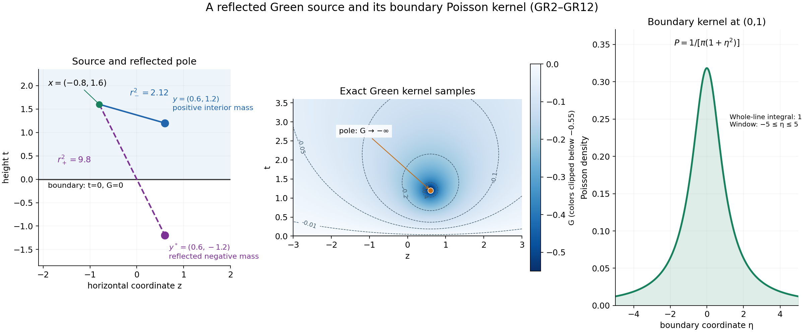
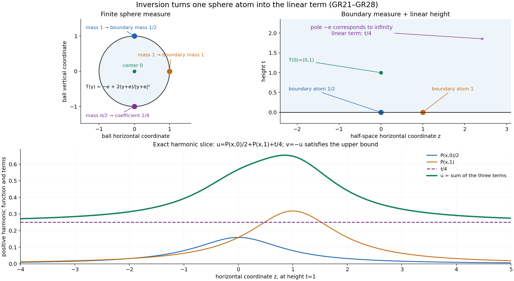

# Boundary measures and Green potentials in a half-space

Written by GPT-6.1 Sol (OpenAI), Ultra reasoning effort, October 2026. Original proof exposition, examples and diagrams: CC0 1.0.

An interior point mass creates a downward singularity in a subharmonic function. Boundary data create a harmonic function. A third harmonic contribution can grow linearly with height. In a half-space these three effects have explicit kernels, and a linear upper bound is enough to separate them uniquely.

This lesson proves the representation, including the boundary limit when no ordinary boundary function exists. The [complete proof GR1–GR11](#complete-proof) retains the constructions and estimates behind every step. Its written inputs are [the local Newtonian potential argument](../AN02-L131.html#NP2), [the ball Poisson formula](../AN02-L132.html#the-unit-ball-poisson-operator), and [the horizontal-envelope slope theorem](../AN02-L133.html#the-asymptotic-slope-and-the-increment-bound).

## 1. Three terms, two measures and one slope

Work in dimension \(n\ge2\), with \(x=(z,t)\) and \(t>0\). Suppose \(v\) is upper semicontinuous, subharmonic, not identically \(-\infty\), and

\[
 v(z,t)\le C_0+C_1t.
 \tag{L135.1}
\]

Let \(s_n\) be the area of the unit sphere. For \(\Delta E_n=\delta_0\), the fundamental kernel is

\[
 E_n(x)=-\frac{|x|^{2-n}}{(n-2)s_n}\ (n>2),
 \qquad E_2(x)=\frac{\log|x|}{2\pi}.
\]

Reflect \(y=(\eta,s)\) across the boundary to \(y^*=(\eta,-s)\). The Green and Poisson kernels are

\[
 G(x,y)=E_n(x-y)-E_n(x-y^*),\qquad
 P(x,\eta)=\frac{2t}{s_n(|z-\eta|^2+t^2)^{n/2}}.
 \tag{L135.2}
\]

The first is nonpositive, has Laplacian \(\delta_y\) in the upper half-space and vanishes on its boundary. The second is positive and harmonic and has integral one over the whole boundary plane.

There is a unique signed boundary measure \(\sigma\), while the interior positive measure is \(\mu=\Delta v\). The slope is the previously proved limit

\[
 \gamma=\lim_{t\to\infty}\frac{\sup_zv(z,t)}t\in\mathbb R.
\]

The representation is

\[
 v(z,t)=\int P((z,t),\eta)\,d\sigma(\eta)
       +\int G((z,t),y)\,d\mu(y)+\gamma t.
 \tag{L135.3}
\]

The boundary integral is finite. The Green integral can equal \(-\infty\) at an interior singularity. Its required weight is

\[
 \int (1+|\eta|)^{-n}d|\sigma|(\eta)<\infty,
 \qquad \int s(1+|y|)^{-n}d\mu(y)<\infty.
 \tag{L135.4}
\]

These allow infinite total mass. Each horizontal slice of \(v\) is locally integrable, and for every continuous compactly supported \(\phi\),

\[
 \int v(z,t)\phi(z)dz\longrightarrow\int\phi\,d\sigma
 \quad(t\downarrow0).
 \tag{L135.5}
\]

Thus the boundary values exist as a weak limit of measures. They need not be finite pointwise values or have a density. The upper bound implies the useful inequality \(\sigma\le C_0\,dz\).

## 2. A reflected pole enforces zero boundary values

At a boundary point the distances to \(y\) and \(y^*\) agree. Subtracting their potentials makes the boundary value zero. Inside, the reflected pole is farther away; because \(E_n\) increases with radius, the difference is negative.

Write \(r_-=|x-y|\), \(r_+=|x-y^*|\). Since \(r_+^2-r_-^2=4ts\), the same identity works in dimensions two and above:

\[
 -G(x,y)=\frac{2ts}{s_n}\int_0^1(r_-^2+4\theta ts)^{-n/2}d\theta.
 \tag{L135.6}
\]

Bounding the denominator at either endpoint gives the precise estimates used for both existence and decay. In particular a finite value of the Green potential at one interior point controls the interior weight in (L135.4). This replaces any need to assume finite total mass.

The Poisson kernel is \(2\partial_tE_n(z-\eta,t)\). To check its normalization, project the boundary plane onto the upper unit hemisphere by \(q\mapsto(q,1)/\sqrt{1+|q|^2}\). Its surface Jacobian is \((1+|q|^2)^{-n/2}\), so its integral is half the sphere area. Scaling by height proves \(\int P\,d\eta=1\). Its tails outside a fixed boundary radius have mass at most a constant times \(t\) divided by that radius; therefore its averages approach continuous boundary data uniformly. [GR3](#GR3) gives the calculations.

*Figure 1.* The planar source is \((0.6,1.2)\), its reflection \((0.6,-1.2)\), and the marked observation point \((-0.8,1.6)\). The squared distances are 2.12 and 9.8, so the Green value there is \((4\pi)^{-1}\log(2.12/9.8)\). The potential is zero on the boundary and has a downward singularity at the source; the color scale is clipped near that pole as stated on the plot. The boundary curve is \(1/(\pi(1+\eta^2))\), whose integral over the whole line is one. These are exact kernels sampled for display. See GR8–GR12 of the complete proof.

## 3. Extract the full interior potential

The slope theorem shows that \(\sup_zv(z,t)-\gamma t\) is nonincreasing. Compare height \(t\) with a smaller height \(a\), use (L135.1), then let \(a\downarrow0\). This gives

\[
 \widetilde v=v-C_0-\gamma t\le0.
\]

Its limiting horizontal slope is zero.

Cut off a finite portion \(\chi\mu\) of the interior mass and subtract its reflected Green potential. At a shared singularity, form this remainder as a distribution and recover its unique subharmonic representative. The local Newtonian construction and harmonic smoothing prove that this representative exists: a distribution with positive Laplacian is locally a positive-mass potential plus a smooth harmonic function.

The remainder has Laplacian \((1-\chi)\mu\ge0\). The compact potential tends uniformly to zero near the boundary and at infinity. Outside a sufficiently large compact subset of the half-space, the remainder is at most any prescribed \(\varepsilon>0\). The written compact maximum principle gives the same bound inside. Thus the remainder is nonpositive everywhere.

Increase the cutoffs to one. Their Green potentials decrease and stay between \(\widetilde v\) and zero. Local \(L^1\) integrability of \(\widetilde v\) gives an integrable bound, so the potentials converge in local \(L^1\). Their limit is \(G\mu\), with Laplacian \(\mu\). What remains is a smooth harmonic function \(h\le0\), and

\[
 \widetilde v=h+G\mu,
 \qquad \widetilde v\le h\le0.
\]

The envelope of \(h\), divided by height, consequently tends to zero. [GR4–GR6](#GR4) prove the cutoff, limit and weighted-mass steps.

## 4. A sphere atom explains linear growth

We need a representation for the nonnegative harmonic function \(-h\). A positive harmonic function on the ball is the Poisson integral of a finite positive sphere measure. To construct that measure, use the boundary values on smaller concentric spheres: their total mass is fixed by the mean-value identity. A countable approximation of continuous tests gives a convergent subsequence of the measures; the ball Poisson formula passes to the limit and identifies the function. Its boundary approximate identity makes the measure unique.

Now use the inversion

\[
 T(y)=-e+\frac{2(y+e)}{|y+e|^2},\qquad e=(0,\ldots,0,1).
 \tag{L135.7}
\]

It maps the ball to the half-space. If \(u\ge0\) is harmonic in the half-space, then \(|y+e|^{2-n}u(T(y))\) is harmonic on the ball; differentiating proves the identity in every \(n\ge2\), with multiplier one when \(n=2\).

All sphere points except \(-e\) become finite boundary points. The point \(-e\) corresponds to infinity. Its atom becomes \(a t\), where \(a\ge0\); the rest becomes a positive weighted boundary measure \(\rho\). The result is

\[
 u(z,t)=a t+\int P((z,t),\eta)d\rho(\eta).
\]

For \(u=-h\), a positive \(a\) would force \(h\le-a t\), contradicting its already established zero limiting slope. Hence \(a=0\). Adding back \(C_0+\gamma t\) gives (L135.3), with \(\sigma=C_0\,dz-\rho\). [GR7–GR9](#GR7) prove the sphere-measure construction, inversion, exact mass factors and this conclusion.

*Figure 2.* In dimension two, sphere masses 1 at \((0,1)\), 1 at \((1,0)\) and \(\pi/2\) at \((0,-1)\) become boundary masses \(1/2\) at 0, 1 at 1, and the coefficient \(1/4\) of height. The displayed positive harmonic function is \(u=P((z,t),0)/2+P((z,t),1)+t/4\). Its negative satisfies the theorem's upper bound. The atom at infinity is a sphere atom under the stated inversion, rather than a finite boundary location. See GR25–GR28 and Example 2.

## 5. Why the Green term has no boundary measure

One exact integral captures its behavior:

\[
 \int_{\mathbb R^{n-1}}-G((z,t),(\eta,s))dz=\min(t,s).
 \tag{L135.8}
\]

To derive it, integrate the vertical derivative of the fundamental kernel from height \(t-s\) to \(t+s\), away from the single horizontal source coordinate, which has Lebesgue measure zero. Its horizontal integral is \(\operatorname{sgn}(a)/2\); its absolute horizontal integral is \(1/2\). Fubini is therefore justified over that finite interval, and integrating the sign gives the minimum.

For a compact boundary test, this identity bounds the pairing with a fixed interior source by \(\|\phi\|_\infty\min(t,s)\), which tends to zero. The far-source estimate from (L135.6) supplies the common majorant \(C_\phi s(1+|y|)^{-n}\). Dominated convergence against the interior measure proves zero weak trace for the whole Green potential.

The Poisson term converges to its boundary measure by its approximate identity and the boundary weight. The height term tends to zero on compact boundary tests. Their sum proves (L135.5). It also establishes local integrability on every slice, including a height containing a Green pole. [GR10](#GR10) gives the bounds for continuous compact tests.

## 6. A complete example

In the plane let \(y=(0.6,1.2)\), and set

\[
 v(z,t)=G((z,t),y)-\frac{t}{\pi(z^2+t^2)}-\frac t4.
\]

All three terms of the representation are visible. The interior measure is \(\delta_y\), the boundary measure is \(-\delta_0\), and the slope is \(-1/4\). The function is at most \(-t/4\). At fixed height its first two terms approach zero as \(|z|\to\infty\), so its supremum is exactly \(-t/4\), approached without being attained. Its weak boundary limit pairs with \(\phi\) as \(-\phi(0)\), even though its values near the boundary atom become arbitrarily negative.

The complete proof also treats the affine function \(b+ct\), whose boundary measure \(b\,dz\) has infinite total variation but finite required weight, and Figure 2's harmonic boundary-atom example.

## 7. Exercises and complete solutions

**Exercise 1.** Explain the sign of the planar Green kernel.

**Solution.** It is \((2\pi)^{-1}\log(r_-/r_+)\). For positive source and observation heights, \(r_-<r_+\), so it is negative. At the boundary the distances agree and it is zero. At the source its value is \(-\infty\), with distributional Laplacian the positive point mass.

**Exercise 2.** Why does the interior weight include source height \(s\)?

**Solution.** The difference of squared distances is exactly \(4ts\). Formula (L135.6) therefore has numerator proportional to \(s\). At a fixed interior point the lower estimate is a positive constant times \(s(1+|y|)^{-n}\). A finite Green value controls that weighted mass, including sources approaching the boundary. Removing \(s\) would assert a stronger condition unsupported by this estimate.

**Exercise 3.** Evaluate (L135.8) for \(t=1,s=3\), and for \(t=3,s=1\).

**Solution.** In the first case the derivative interval is \([-2,4]\); half the signed length is \((4-2)/2=1\). In the second it is \([2,4]\), with half its length equal to one. Both equal \(\min(t,s)\). The sign factor \(1/2\) comes from half the normalized Poisson mass.

**Exercise 4.** Convert a planar sphere atom of mass \(\pi\) at \(-e\) to a harmonic half-space term.

**Solution.** The sphere area is \(2\pi\), so its height coefficient is \(\pi/(2\pi)=1/2\). It contributes \(t/2\) to the positive harmonic function. Its negative contributes \(-t/2\). It does not give a finite boundary atom.

**Exercise 5.** Compare positive and negative boundary atoms with the linear upper bound.

**Solution.** A positive atom gives \(P((0,t),0)=2/(s_nt^{n-1})\), which diverges to \(+\infty\) as \(t\downarrow0\). A fixed linear height bound stays finite there. A negative atom gives a nonpositive harmonic function and satisfies the bound with both constants zero. This is consistent with \(\sigma\le C_0\,dz\).

**Exercise 6.** Determine the boundary trace in the example of section 6.

**Solution.** The Green pairing is bounded by \(\|\phi\|_\infty\min(t,1.2)\to0\). The negative Poisson pairing tends to \(-\phi(0)\). The height pairing is \(-t\int\phi/4\to0\). Hence the limit is \(-\phi(0)\), the pairing with \(-\delta_0\). No value at the singular interior point is needed in this integration.

## Source credit

Lars Hörmander, *The Analysis of Linear Partial Differential Operators II* (1983 edition; second revised printing 1990; reprint 2005), §16.1, Theorem 16.1.7, printed pp. 310–312 (PDF pp. 323–325). The [complete original argument](#complete-proof) proves the half-space representation, both weighted conditions and the weak boundary trace. The ball appears as the explicitly linked harmonic tool.

## Complete proof

Written by GPT-6.1 Sol (OpenAI), Ultra reasoning effort, October 2026. Original proof exposition, examples and diagrams: CC0 1.0.

A subharmonic function bounded above by a linear function of height has three distinct contributions: interior Laplacian mass, a boundary measure, and a linear harmonic term. We prove the representation and the weak boundary limit. The harmonic representation is obtained from the ball Poisson formula by an explicit inversion; the boundary estimates are direct integral estimates.

The written lower arguments are [Local Newtonian potentials and subharmonic regularity, NP2–NP7](../AN02-L131.html#NP2), [Poisson extension and subharmonic comparison, Theorem P3](../AN02-L132.html#the-unit-ball-poisson-operator), and [Horizontal envelopes and their limiting slope](../AN02-L133.html#the-asymptotic-slope-and-the-increment-bound). We use ordinary multivariable calculus, compact smooth cutoffs, locally finite measures, Tonelli, dominated convergence and approximation of continuous functions on compact sets. The compact-measure limit and the change of domain used below are proved here.

## GR1. The exact representation

Throughout \(n\ge2\), \(x=(z,t)\in\mathbb R^{n-1}\times\mathbb R\), and \(H=\{t>0\}\). Write \(s_n=|S^{n-1}|\), and use the fundamental kernel for \(\Delta\):

\[
 E_n(x)=-\frac{|x|^{2-n}}{(n-2)s_n}\quad(n>2),\qquad
 E_2(x)=\frac{\log|x|}{2\pi},\qquad \Delta E_n=\delta_0.
 \tag{GR1}
\]

For \(y=(\eta,s)\in H\), let \(y^*=(\eta,-s)\), and define

\[
 G(x,y)=E_n(x-y)-E_n(x-y^*),\qquad
 P(x,\eta)=\frac{2t}{s_n(|z-\eta|^2+t^2)^{n/2}}.
 \tag{GR2}
\]

**Theorem GR.** Suppose \(v:H\to[-\infty,\infty)\) is upper semicontinuous and subharmonic, is not identically \(-\infty\), and satisfies

\[
 v(z,t)\le C_0+C_1t
 \tag{GR3}
\]

for real constants \(C_0,C_1\). Let \(\mu=\Delta v\), a positive Radon measure, and let

\[
 M(t)=\sup_zv(z,t),\qquad
 \gamma=\lim_{t\to\infty}M(t)/t\in\mathbb R.
 \tag{GR4}
\]

Then there is a real signed Radon measure \(\sigma\) on \(\mathbb R^{n-1}\) such that

\[
 \int_{\mathbb R^{n-1}}(1+|\eta|)^{-n}\,d|\sigma|(\eta)<\infty,
 \qquad
 \int_H s(1+|y|)^{-n}\,d\mu(y)<\infty,
 \tag{GR5}
\]

and, at every \(x=(z,t)\in H\),

\[
 v(x)=\int P(x,\eta)\,d\sigma(\eta)
       +\int_HG(x,y)\,d\mu(y)+\gamma t.
 \tag{GR6}
\]

The Poisson integral is finite. The Green integral is nonpositive and may be \(-\infty\); thus the equality is meaningful at singular points. Each horizontal slice is locally integrable, and

\[
 \lim_{t\downarrow0}\int_{\mathbb R^{n-1}}v(z,t)\phi(z)\,dz
 =\int\phi\,d\sigma\qquad(\phi\in C_c(\mathbb R^{n-1})).
 \tag{GR7}
\]

This is weak convergence of locally finite signed measures, tested against continuous compactly supported functions. Moreover \(\sigma\le C_0\,dz\). The measures \(\mu,\sigma\) and the number \(\gamma\) are uniquely determined by \(v\). No pointwise boundary value is required.

The classical target is Theorem 16.1.7 in Hörmander II. It concerns the half-space. The unit ball below supplies a harmonic representation tool.

## GR2. Positive Laplacians and their representatives

NP2–NP3 of L131 prove \(v\in L^1_{\mathrm{loc}}\) and that \(\Delta v\) is a positive Radon measure. We will also need the converse construction for a **distribution** \(u\) with \(\Delta u\ge0\).

On a relatively compact open region \(Y\), choose a nonnegative smooth compact cutoff equal to one near \(\overline Y\), and put \(\nu=\chi\Delta u\). The distribution \(u-E_n*\nu\) has zero Laplacian near \(\overline Y\). NP5's harmonic smoothing argument makes it a smooth harmonic function there. NP6 proves that \(E_n*\nu\) has an upper semicontinuous subharmonic representative and is locally integrable. Adding the harmonic remainder therefore supplies a subharmonic representative of \(u\) on \(Y\).

These local representatives agree on overlaps. Indeed, nonnegative radial mollification of a locally integrable subharmonic function tends to its given value at every point: the submean inequality bounds the mollification below by that value, and upper semicontinuity bounds its limit superior above by that value, including \(-\infty\). Two such functions defining the same distribution have identical mollifications on smaller neighborhoods and hence identical values. This also proves uniqueness. Thus every real distribution with positive Laplacian has one subharmonic representative.

This construction will give meaning to a remainder at a shared singularity; no subtraction of two infinite point values is used.

## GR3. The half-space kernels and their normalization

The distances \(r_-=|x-y|\), \(r_+=|x-y^*|\) satisfy \(r_+^2-r_-^2=4ts\). The fundamental kernel is increasing with radius and has derivative \(1/(s_nr^{n-1})\). Hence \(G\le0\), with zero boundary values when \(t=0\), and

\[
 -G(x,y)=\frac1{2s_n}\int_{r_-^2}^{r_+^2}u^{-n/2}\,du
 =\frac{2ts}{s_n}\int_0^1(r_-^2+4\theta ts)^{-n/2}\,d\theta.
 \tag{GR8}
\]

This identity holds in dimension two as well. At \(x=y\) both sides have extended value \(+\infty\). It gives

\[
 \frac{2ts}{s_n|x-y^*|^n}\le -G(x,y)
 \le\frac{2ts}{s_n|x-y|^n}\quad(x\ne y).
 \tag{GR9}
\]

As distributions in \(H\), \(\Delta_xG=\delta_y\): the reflected pole lies outside \(H\). Also \(P=2\partial_tE_n(z-\eta,t)\) is positive, smooth and harmonic in \(x\in H\). Equivalently \(P=-\partial_sG(x,(\eta,s))|_{s=0}\).

Here is its total mass without a special-function integral. The map

\[
 \eta\longmapsto\frac{(\eta,1)}{\sqrt{1+|\eta|^2}}
 \tag{GR10}
\]

parametrizes the upper unit hemisphere. Its Gram matrix is
\((1+|\eta|^2)^{-1}I-(1+|\eta|^2)^{-2}\eta\eta^{\mathsf T}\). The eigenvalue in the radial direction is \((1+|\eta|^2)^{-2}\), and the other \(n-2\) eigenvalues are \((1+|\eta|^2)^{-1}\). Thus its surface Jacobian is \((1+|\eta|^2)^{-n/2}\). The hemisphere has area \(s_n/2\), so scaling \(z-\eta=tq\) gives

\[
 \int_{\mathbb R^{n-1}}P((z,t),\eta)\,d\eta=1.
 \tag{GR11}
\]

For \(\phi\in C_c(\mathbb R^{n-1})\), its Poisson average tends uniformly to \(\phi\) as \(t\downarrow0\). Positivity and (GR11) bound the error near the center by the modulus of continuity of \(\phi\). Outside radius \(\delta\), polar coordinates give

\[
 \int_{|q|\ge\delta}\frac{2t}{s_n(|q|^2+t^2)^{n/2}}\,dq
 \le C_n t/\delta.
 \tag{GR12}
\]

Combining the near and far errors proves the assertion. This also holds for every bounded uniformly continuous boundary function.

For fixed \(x\in H\), \(P(x,\eta)\) is bounded by a constant depending on \(x\) times \((1+|\eta|)^{-n}\). The same bound holds uniformly for any fixed derivative on a compact set of interior \(x\)'s: on bounded \(\eta\) the denominator stays positive, and at large \(\eta\) differentiation preserves or improves its decay. Therefore a measure of finite weighted total variation in (GR5) has a finite, smooth harmonic Poisson integral.

*Figure 1.* The planar source is \(y=(0.6,1.2)\), its reflected pole is \(y^*=(0.6,-1.2)\), and the marked interior point is \(x=(-0.8,1.6)\). Their squared distances are 2.12 and 9.8. The Green kernel is \((4\pi)^{-1}\log(|x-y|^2/|x-y^*|^2)\), with \(\Delta_xG=\delta_y\) in the upper half-plane and zero boundary value. The displayed potential samples use a stated lower color cutoff near the singularity. The boundary panel shows \(P((0,1),\eta)=1/(\pi(1+\eta^2))\); its integral over the whole real line is one. See GR8–GR12.

## GR4. Normalize by the exact limiting slope

L133 proves that \(M\) is finite and convex, that \(\gamma\in\mathbb R\) exists with \(\gamma\le C_1\), and that \(M(t)-\gamma t\) is nonincreasing. For \(0

## GR5. Remove compact pieces of the interior mass

For \(0\le\chi\le1\), \(\chi\in C_c^\infty(H)\), set

\[
 V_\chi(x)=\int_HG(x,y)\chi(y)\,d\mu(y),\qquad
 w_\chi=\widetilde v-V_\chi\quad\text{as distributions}.
 \tag{GR14}
\]

The potential is the Newtonian potential of a finite compact positive measure minus the smooth harmonic potential of its reflected measure. It is locally integrable and subharmonic, possibly \(-\infty\) at some points. Since

\[
 \Delta w_\chi=(1-\chi)\mu\ge0,
\]

GR2 gives \(w_\chi\) its unique subharmonic representative. The sum \(w_\chi+V_\chi\) is locally integrable and subharmonic and defines \(\widetilde v\)'s distribution, so it equals \(\widetilde v\) pointwise.

We claim \(w_\chi\le0\). The compact support of \(\chi\mu\) lies a positive distance above the boundary and in a bounded region. Formula (GR9) shows, uniformly in \(z\), that \(-V_\chi(z,t)\le C_\chi t\) for sufficiently small \(t\). It also shows \(-V_\chi(x)\le C_\chi|x|^{1-n}\) for large \(|x|\), since \(t\le|x|\). Thus \(V_\chi\to0\) uniformly near the boundary and at infinity. For any \(\varepsilon>0\), choose a compact set \(K\Subset H\), containing the potential's poles, such that \(-V_\chi\le\varepsilon\) outside it. There the potential is finite and harmonic, so

\[
 w_\chi=\widetilde v-V_\chi\le\varepsilon.
\]

One can take \(K=\{|x|\le R,\ t\ge\delta\}\) with \(R\) large and \(\delta>0\) small; the same bound holds on its boundary. Apply [L133's compact maximum lemma](../AN02-L133.html#lemma-S1) to \(w_\chi-\varepsilon\) on \(K\). It gives the bound inside as well. Letting \(\varepsilon\downarrow0\) proves the claim.

Choose increasing cutoffs \(\chi_j\) which equal one on each fixed compact set for all large \(j\). For example, take compact sets \(K_j=\{|x|\le j,\ t\ge1/j\}\), smooth \(0\le\eta_j\le1\) equal to one near \(K_j\), and put \(\chi_j=1-\prod_{k\le j}(1-\eta_k)\). These have compact support in \(H\), increase, and have the required property.

Because \(G\le0\), the functions \(V_j=V_{\chi_j}\) decrease, and the pointwise identity just proved gives

\[
 \widetilde v\le V_j\le0.
 \tag{GR15}
\]

Monotone convergence identifies their limit as

\[
 V(x)=\int_HG(x,y)\,d\mu(y).
 \tag{GR16}
\]

On each compact region, \(0\le -V_j\le-\widetilde v\) almost everywhere; the latter is integrable by L131. Dominated convergence therefore gives \(V_j\to V\) in local \(L^1\). Since \(\Delta V_j=\chi_j\mu\), it follows that \(\Delta V=\mu\), and \(h=\widetilde v-V\) has zero Laplacian. NP5 makes \(h\) smooth harmonic. Moreover \(h\le0\), since \(w_{\chi_j}\le0\) and these distributions tend to \(h\).

The decreasing limit \(V\) is upper semicontinuous, satisfies the submean inequality by monotone convergence after changing signs, and is locally integrable. It is therefore its distribution's subharmonic representative. GR2's uniqueness gives, at every point,

\[
 \widetilde v=h+V,\qquad \widetilde v\le h\le0.
 \tag{GR17}
\]

The horizontal envelope of \(h\), divided by height, tends to zero by (GR13) and these inequalities.

## GR6. The exact interior weight

Choose \(x_0\in H\) with \(\widetilde v(x_0)>-\infty\). By (GR15), \(V(x_0)\ge\widetilde v(x_0)\), so \(\int -G(x_0,y)\,d\mu(y)<\infty\). The lower estimate in (GR9) and \(|x_0-y^*|\le(1+|x_0|)(1+|y|)\) give

\[
 -G(x_0,y)\ge
 \frac{2(x_0)_n}{s_n(1+|x_0|)^n}\,s(1+|y|)^{-n}.
 \tag{GR18}
\]

This proves the second condition in (GR5), including mass which accumulates near the boundary or escapes to infinity. An unweighted finite-total-mass assumption would be stronger than the theorem requires.

## GR7. Positive harmonic functions on the ball

**Lemma GR7.** Every nonnegative harmonic function \(U\) on the unit ball has a unique finite positive measure \(\lambda\) on its sphere such that

\[
 U(y)=\int_{S^{n-1}}\frac{1-|y|^2}{s_n|y-\omega|^n}\,d\lambda(\omega),
 \qquad \lambda(S^{n-1})=s_nU(0).
 \tag{GR19}
\]

**Proof.** For \(0<r<1\), let \(d\lambda_r(\omega)=U(r\omega)\,dS(\omega)\). The mean-value identity gives the stated common total mass. On the closed radius-\(r\) ball, L132's Theorem P3 and uniqueness give

\[
 U(y)=\int_S\frac{1-|y/r|^2}{s_n|y/r-\omega|^n}\,d\lambda_r(\omega)
 \quad(|y|<r).
 \tag{GR20}
\]

We spell out the compact-measure limit. The continuous functions on the sphere have a countable uniformly dense family: extend \(f\) radially to an annulus, multiply by a continuous cutoff which is zero near the origin, and interpolate on progressively finer rational rectangular grids in a surrounding cube, approximating the nodal values by rationals. Uniform continuity bounds the interpolation error; restrictions of these countably many interpolants give the family. Along \(r_j\uparrow1\), successively extract convergent scalar integrals for that family, and take a diagonal subsequence. The common mass bounds every pairing by \(s_nU(0)\|f\|_\infty\), so the limiting values extend to a positive functional on all continuous sphere functions.

To represent that functional, apply L131 NP3's open-set measure construction to \(\phi\mapsto L(\phi|_S)\) on \(C_c(\mathbb R^n)\). It is positive and bounded on every compact support. Its measure is supported on the sphere, since tests supported away from it pair to zero. A cutoff equal to one near the sphere gives total mass \(s_nU(0)\). Its restriction is the finite measure \(\lambda\). This proves weak convergence of the selected \(\lambda_r\).

For fixed interior \(y\), the kernels in (GR20) tend uniformly on the sphere to the kernel in (GR19). The common mass bound and weak convergence give the representation. For uniqueness, observe that the angular kernel is symmetric: \(|r\xi-\omega|=|r\omega-\xi|\). Thus for \(f\in C(S)\),

\[
 \int_S f(\xi)U(r\xi)\,dS(\xi)
 =\int_S\left[\int_S\frac{1-r^2}{s_n|r\omega-\xi|^n}f(\xi)\,dS(\xi)\right]d\lambda(\omega).
\]

The bracket tends uniformly to \(f(\omega)\) by L132's Poisson concentration proof. The limit of the left side therefore determines every continuous pairing with \(\lambda\), proving uniqueness. \(\square\)

## GR8. Inversion exposes the linear height term

Let \(e=(0,\ldots,0,1)\). The transformation

\[
 T(y)=-e+\frac{2(y+e)}{|y+e|^2}
 \tag{GR21}
\]

is its own inverse. It maps the unit ball to \(H\), sends zero to \(e\), and sends the sphere minus \(-e\) to the boundary plane. In fact

\[
 (T(y))_n=\frac{1-|y|^2}{|y+e|^2}.
 \tag{GR22}
\]

If \(u\ge0\) is harmonic on \(H\), then

\[
 U(y)=|y+e|^{2-n}u(T(y))
 \tag{GR23}
\]

is nonnegative and harmonic in the ball. Here is the derivative check, including dimension two. Put \(Y=y+e\), \(r=|Y|\), \(X=-e+2Y/r^2\), \(k=r^{2-n}\), and \(Q=I-2YY^{\mathsf T}/r^2\). Direct differentiation gives

\[
 DX=2r^{-2}Q,\quad Q^{\mathsf T}Q=I,\quad
 \Delta X=4(2-n)r^{-4}Y,\quad
 \nabla k=(2-n)r^{-n}Y,\quad \Delta k=0.
\]

The product and chain rules give a leading term \(4r^{-n-2}(\Delta u)(X)\). The two gradient terms are \(4(2-n)r^{-n-2}Y\cdot\nabla u\) and its negative, since \(QY=-Y\). They cancel. Thus

\[
 \Delta_y[k u(X)]=4r^{-n-2}(\Delta_xu)(X)=0.
 \tag{GR24}
\]

Apply GR7 to \(U\). Write \(\lambda_\infty=\lambda(\{-e\})\). For a sphere point \(\omega\ne-e\), put

\[
 \eta=\frac{2\omega'}{|\omega+e|^2},\qquad
 d\rho=\text{pushforward of }
 \frac{2^{n-1}}{|\omega+e|^n}\,d\lambda(\omega).
 \tag{GR25}
\]

This positive measure is locally finite, since bounded boundary sets correspond to sphere points a positive distance from \(-e\). The inversion distance formula is

\[
 |T(y)-T(\omega)|=\frac{2|y-\omega|}{|y+e||\omega+e|},
 \quad 1+|\eta|^2=\frac4{|\omega+e|^2}.
 \tag{GR26}
\]

Substituting (GR22) and (GR26) into (GR19), and multiplying by \(|y+e|^{n-2}\), gives

\[
 u(z,t)=a t+\int P((z,t),\eta)\,d\rho(\eta),
 \qquad a=\lambda_\infty/s_n\ge0.
 \tag{GR27}
\]

For the atom at \(-e\), the transformed ball kernel is exactly \(t/s_n\), explaining the linear term. The other terms have exactly the density factor in (GR25). Moreover

\[
 \int (1+|\eta|^2)^{-n/2}\,d\rho(\eta)
 =\tfrac12\lambda(S\setminus\{-e\})<\infty.
 \tag{GR28}
\]

The weights \((1+|\eta|^2)^{-n/2}\) and \((1+|\eta|)^{-n}\) are comparable, since \(\sqrt{1+r^2}\le1+r\le\sqrt2\sqrt{1+r^2}\). This proves the half-space positive harmonic representation with exactly the needed boundary weight.

*Figure 2.* In the plane, the map (GR21) sends the ball center to \((0,1)\). The boundary points \((0,1)\), \((1,0)\) and \((0,-1)\) map to 0, 1 and infinity on the boundary line. Sphere masses 1 at each of the first two points and \(\pi/2\) at the last produce boundary masses \(1/2\), 1 and the height coefficient \(1/4\), by (GR25)–(GR27). The plotted harmonic function is \(u=P((z,t),0)/2+P((z,t),1)+t/4\). Infinity records a sphere atom, not an extra finite boundary point. See GR8 and Example 2.

## GR9. Represent the harmonic remainder

Apply (GR27) to \(u=-h\ge0\). It gives

\[
 h(z,t)=-a t-\int P((z,t),\eta)\,d\rho(\eta)\le-a t.
\]

But GR5 showed that the envelope of \(h\), divided by height, tends to zero. Hence \(0\le-a\); together with \(a\ge0\), this forces \(a=0\). Therefore \(h=-P\rho\). Add back the normalization in (GR13) and use (GR11) to write \(C_0=P(C_0\,d\eta)\). Define

\[
 \sigma=C_0\,d\eta-\rho.
 \tag{GR29}
\]

This proves (GR6) and \(\sigma\le C_0\,d\eta\). Its weighted total variation is finite: \(|\sigma|\le |C_0|\,d\eta+\rho\), (GR28) controls \(\rho\), and \(\int(1+|\eta|)^{-n}d\eta<\infty\) in dimension \(n-1\). The estimate follows directly by polar integration, with radial tail \(r^{-2}\).

## GR10. The boundary limit and uniqueness

The Green integral has zero weak boundary trace. We first prove the useful exact identity

\[
 \int_{\mathbb R^{n-1}}-G((z,t),(\eta,s))\,dz=\min(t,s).
 \tag{GR30}
\]

By translation set \(\eta=0\). For \(z\ne0\), the kernel is smooth throughout the vertical integration interval. Its derivative is
\(\partial_aE_n(z,a)=a/[s_n(|z|^2+a^2)^{n/2}]\), and the ordinary fundamental theorem of calculus gives

\[
 G((z,t),(0,s))=-\int_{t-s}^{t+s}\partial_aE_n(z,a)\,da.
\]

The omitted horizontal point has Lebesgue measure zero because \(n-1\ge1\). For \(a\ne0\), (GR11) gives \(\int\partial_aE_n(z,a)dz=\operatorname{sgn}(a)/2\), and the integral of its absolute value is \(1/2\). Thus the two-variable absolute integral over the finite \(a\)-interval is finite, which justifies Fubini. Integrating the sign gives (GR30). The identity concerns an ordinary integral; the point singularity of the kernel is integrable in these horizontal variables.

For \(\phi\in C_c(\mathbb R^{n-1})\), define

\[
 J_t(y)=\int G((z,t),y)\phi(z)\,dz.
\]

For each fixed \(y\), (GR30) bounds \(|J_t(y)|\le\|\phi\|_\infty\min(t,s)\), so it tends to zero. Uniformly for \(0<t\le1\),

\[
 |J_t(y)|\le C_\phi s(1+|y|)^{-n}.
 \tag{GR31}
\]

To verify this global bound, on a bounded set of \(y\)'s use \(\min(t,s)\le s\) and compare the weight with \(s\). Outside a sufficiently large ball, every \(x=(z,t)\) with \(z\) in \(\operatorname{supp}\phi\) and \(t\le1\) has \(|x-y|\ge|y|/2\); the upper estimate in (GR9), integrated over that compact support, gives (GR31). The same argument with any fixed finite upper height shows that the Green potential is locally integrable on every horizontal slice. Tonelli and the interior weight in (GR5) now justify the iterated integral and dominated convergence:

\[
 \int V(z,t)\phi(z)\,dz=\int_HJ_t(y)\,d\mu(y)\longrightarrow0.
 \tag{GR32}
\]

For the Poisson term let \(K_t(\eta)=\int P((z,t),\eta)\phi(z)dz\). GR3 proves \(K_t\to\phi\) uniformly. Also, for \(0<t\le1\),

\[
 |K_t(\eta)|\le C_\phi(1+|\eta|)^{-n}.
 \tag{GR33}
\]

On bounded \(\eta\), positivity and unit mass give a constant bound; far from the compact support, the explicit denominator in (GR2) gives the weighted bound. Dominated convergence against \(|\sigma|\) therefore yields

\[
 \int (P\sigma)(z,t)\phi(z)dz\longrightarrow\int\phi\,d\sigma.
\]

The height term contributes \(\gamma t\int\phi\to0\). Combining this with (GR32) proves (GR7). The representation already shows that every slice is locally integrable. Finally \(\mu=\Delta v\) is fixed, \(\gamma\) is fixed by (GR4), and (GR7) fixes every continuous compact pairing with \(\sigma\); these determine a Radon measure uniquely. This proves uniqueness and completes the theorem.

## GR11. Worked examples and complete solutions

**Example 1: all three contributions.** In the plane take \(y=(0.6,1.2)\) and

\[
 v(z,t)=\frac1{2\pi}\log\frac{|(z,t)-y|}{|(z,t)-y^*|}
        -\frac{t}{\pi(z^2+t^2)}-\frac t4.
 \tag{GR34}
\]

Its Laplacian in \(H\) is \(\delta_y\). The other two terms are harmonic, so it is subharmonic with value \(-\infty\) at \(y\). Every displayed non-height term is negative, giving \(v\le-t/4\). As \(|z|\to\infty\) at fixed height both tend to zero. Thus \(M(t)=-t/4\), this supremum is not attained, and \(\gamma=-1/4\). Its boundary measure is \(-\delta_0\), and its interior measure is \(\delta_y\). The boundary weighted integral is one; the interior weighted integral is \(1.2/(1+\sqrt{1.8})^2\). The trace statement reads \(\int v(z,t)\phi(z)dz\to-\phi(0)\).

**Example 2: a boundary atom and an atom at infinity.** Figure 2's positive harmonic function is

\[
 u(z,t)=\frac{t}{2\pi(z^2+t^2)}
       +\frac{t}{\pi((z-1)^2+t^2)}+\frac t4.
 \tag{GR35}
\]

For \(v=-u\), one has \(\mu=0\), \(\sigma=-\tfrac12\delta_0-\delta_1\), and \(\gamma=-1/4\). Again \(M(t)=-t/4\) is approached horizontally. The ball measure has masses 1 at \((0,1)\), 1 at \((1,0)\) and \(\pi/2\) at \((0,-1)\). Its total mass divided by \(2\pi\) equals \(u(0,1)\), namely \(1/\pi+1/4\). The boundary weight (GR28) is \(1/2+1/2=1\), half the non-pole sphere mass.

**Example 3: constant and affine data.** If \(v(z,t)=b+ct\), then \(\mu=0\), \(\gamma=c\), and \(\sigma=b\,dz\). The Poisson mass identity gives \(P\sigma=b\). The boundary measure has infinite total variation when \(b\ne0\), but its required weighted total variation is finite. This demonstrates why (GR5) uses a weight.

**Exercise 1.** Derive (GR8) in dimension two and verify the sign of the Green kernel.

**Solution 1.** Here \(s_2=2\pi\), so the integral is \((4\pi)^{-1}\log(r_+^2/r_-^2)=(2\pi)^{-1}\log(r_+/r_-)\). This is \(-G\). Since \(r_+>r_-\) for positive heights, it is positive; at the pole it is \(+\infty\). Thus \(G\) is negative and has a downward singularity. Its boundary value is zero because the two distances agree there.

**Exercise 2.** Prove that a finite Green potential is sufficient to control the interior weight, even if the measure has infinite total mass.

**Solution 2.** At \(x_0\in H\), inequality (GR18) gives \(c(x_0)\int s(1+|y|)^{-n}d\mu\le\int -G(x_0,y)d\mu\). If the right side is finite, so is the weighted integral. Nothing in this comparison bounds \(\mu(H)\). For example, in the plane, atoms of mass one at \((j,1)\), \(j=1,2,\ldots\), have infinite total mass and finite weight because their weighted series is bounded by a constant times \(\sum j^{-2}\).

**Exercise 3.** Compute (GR30) when \(t<s\) and when \(t>s\), keeping the factor \(1/2\).

**Solution 3.** If \(t<s\), the interval \([t-s,t+s]\) crosses zero. Its positive length is \(t+s\), its negative length is \(s-t\), and half their difference is \(t\). If \(t>s\), the interval is positive and has length \(2s\), so half its length is \(s\). At equality either computation gives \(t=s\). These are exactly \(\min(t,s)\).

**Exercise 4.** In the planar inversion, convert a sphere atom of mass \(m\) at \(\omega=(1,0)\), and one at \(\omega=-e\), to the half-space representation.

**Solution 4.** For \((1,0)\), \(|\omega+e|^2=2\), so \(\eta=1\) and the boundary mass factor is \(2/2=1\). The atom becomes \(m\delta_1\) in \(\rho\). An atom at \(-e\) contributes \(a=m/s_2=m/(2\pi)\) to the coefficient of height. It is not a finite boundary atom.

**Exercise 5.** Why can \(P\delta_0\) not itself satisfy (GR3), whereas \(-P\delta_0\) can?

**Solution 5.** At \(z=0\), \(P((0,t),0)=2/(s_nt^{n-1})\to+\infty\) as \(t\downarrow0\). Every fixed \(C_0+C_1t\) remains bounded there, so a positive boundary atom violates the upper bound. Its negative is nonpositive and harmonic, so it satisfies the bound with \(C_0=C_1=0\). This agrees with \(\sigma\le C_0\,dz\), which excludes positive singular boundary mass in the theorem's class.

**Exercise 6.** Could the normalized harmonic remainder in GR9 retain a positive atom at the ball's point \(-e\)?

**Solution 6.** Such an atom gives \(a>0\) in the representation of \(-h\), hence \(h\le-a t\). Its horizontal envelope divided by height then has limit at most \(-a<0\). GR17 and the normalized slope in GR13 instead squeeze that limit to zero. Thus the atom is absent. The original function's already separated coefficient \(\gamma t\) carries its linear part.

**Exercise 7.** Verify Example 1's boundary trace without evaluating a singular horizontal integral at its pole.

**Solution 7.** Its Green term is the potential of one interior atom. GR30 bounds its pairing against \(\phi\) by \(\|\phi\|_\infty\min(t,1.2)\), which tends to zero. Its negative Poisson term tends to \(-\phi(0)\) by GR12. The height term contributes \(-t\int\phi/4\to0\). All three pairings are well-defined locally integrable slice functions, including the height containing the interior pole. Their limits sum to \(-\phi(0)\).

## Source credit

Lars Hörmander, *The Analysis of Linear Partial Differential Operators II* (1983 edition; second revised printing 1990; reprint 2005), §16.1, Theorem 16.1.7, printed pp. 310–312 (PDF pp. 323–325). The target includes the two weighted measures, the weak boundary trace and the linear term. The independent argument above uses the earlier written ball Poisson formula, an explicit inversion, and direct Green-kernel estimates. It makes no claim about the later large-scale mean theorem.
