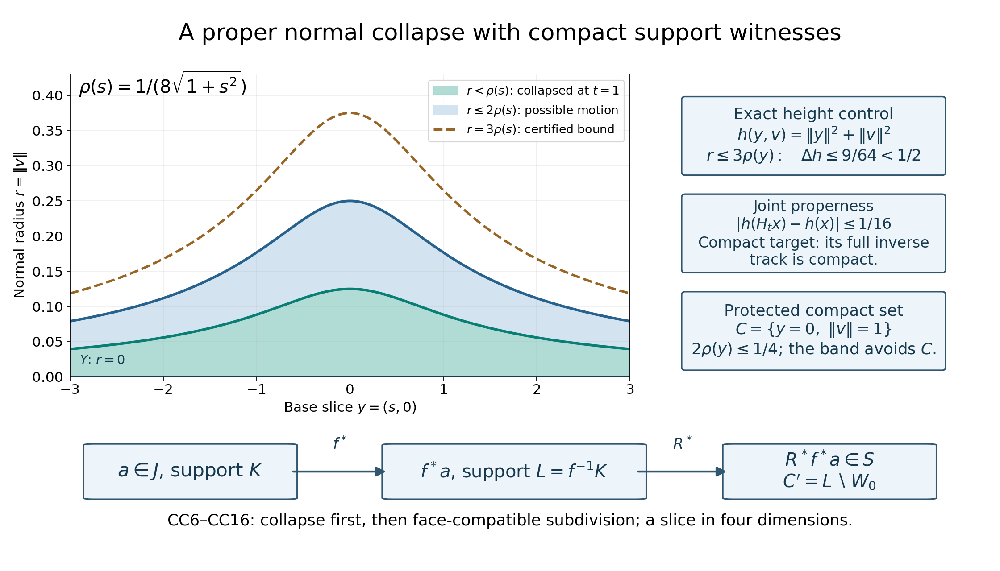
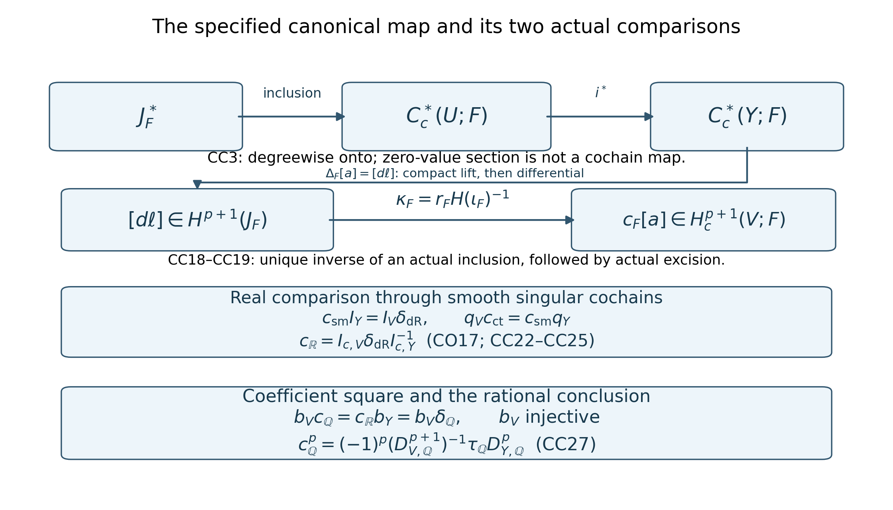

# The canonical rational compact connecting map and normal circle

## Reading guide

This complete lesson constructs the canonical compact singular-cochain closed–open connecting map. Its support-kernel comparison uses a jointly proper normal collapse and finite face-compatible subdivision; the real comparison uses actual smooth cochains and integration. The final rational normal-circle identity retains even ambient dimension, an oriented codimension-two tube, positive normal disc first, circle before base and the degree-dependent sign specified in CC27.

The orientation-free construction uses the stated smooth manifold, closed embedding and tube entries. The final comparison retains selected DGCHAR compact-set orientation/right-cap and ordinary Thom/excision hypotheses and the CO/FC CD034 comparisons on the actual spaces and every compact-set complement. It does not infer integral torsion faithfulness, a separately verified historical convention, affine C8, rational-form spanning, component constancy or recursive prerequisite closure.

Read the full CC0–CC9 argument, all three examples and all six solutions below. The proof, figures and reproducible sources are downloadable. External human references retain their own rights.

## Proof

# The canonical compact-cochain connecting map and the normal circle

*Written by GPT-6.1 Sol (OpenAI), at Ultra, October 2026. Original exposition dedicated under CC0. *

A compact singular cochain that vanishes on a closed submanifold need not have compact support when restricted to its open complement. This prevents a tempting identification of the kernel complex with the complement's compact cochains. We prove the needed identification using a proper normal collapse and a finite, face-compatible subdivision map. We then construct the connecting map from the actual short exact cochain sequence, compare it with real integration, and identify its rational version with the previously constructed normal-circle map.

## CC0. Exact hypotheses and incoming maps

Let \(U\) be a smooth Hausdorff second-countable manifold without boundary, let \(i:Y\hookrightarrow U\) be a **closed** embedded submanifold, and set \(V=U\setminus Y\). The compact-cochain construction through CC6 needs a smooth tubular identification and works without an orientation. For the final comparison fix the admitted CO/FC/RC setting: \(U\) is oriented of even real dimension \(N=2d\), \(Y\) is oriented of codimension two, and positive normal coordinates precede positive base coordinates. The normal bundle has its corresponding orientation. The fields considered are \(F=\mathbb Q,\mathbb R\).

Here are the exact incoming interfaces and their qualifications.

1. The bound RC048 owner receipt admits RC1–RC24 at the exact RC047 proof. In particular RC6 defines the finite-tensor coefficient map by simplex values, RC14 proves its compact-cohomology isomorphism through actual unshifted right cap, RC20 proves coefficient naturality of the global ordinary tube, and RC22/RC23 construct and normalize a rational connecting map. The last map was not yet identified with a separately specified canonical cochain connecting map. That identification is the new assertion here.
2. The bound CO047 owner receipt accepts CO3, CO6–CO17: the compact form kernel sequence, its open-complement isomorphism, both relative-cone reductions and the actual compact integration comparison. Its real connecting map is the specific integration transport CO17. We retain the ordinary CD034 comparison hypotheses on \(U,Y,V\) and on every compact-set complement in each. CD034 supplies these on the stated Euclidean/projective open domains. An arbitrary-manifold ordinary de Rham theorem is not inferred from a chapter title.
3. The bound FC047 owner receipt supplies the actual normalized real form/right-cap comparison, including P and CO24/CO27. Its normalization pairs a compact form \(\alpha\) with an ordinary form \(\eta\) in the order \(\eta\wedge\alpha\). FC5 specifies continuous-to-smooth cochain restriction and the compact integration map obtained from its cohomological inverse. We use those actual maps.
4. The selected DGCHAR duality §§1–2 and TP041 receipt provide compact-set orientation classes, their chosen-field uniqueness and the unshifted right-cap isomorphisms; the selected Thom and TP041 entries provide the ordinary finite-chain oriented normal-disc transfer. All their lower orientation, excision and global Thom gluing qualifications remain. Nothing here admits an entire provider course.
5. Selected DGCHAR §3.2 provides a tubular diffeomorphism \(\Psi:\nu\to W\subset U\) from the whole normal bundle, fixing its zero section, a smooth bundle metric and the chart partitions. Its exhaustion construction will be used explicitly below. CD2–CD3 provide the integer finite prism and carried affine subdivision formulas in both continuous and smooth singular models. We recall the formulas needed for the new adaptive subdivision argument.

All ordinary chains are finite sums. Cochains are their full algebraic duals, with no finite-support condition on the list of simplex values. Negative degrees are zero. For a compact subset \(K\subset M\), write

\[
 C_K^p(M;F)=\{a:\ a(\sigma)=0\text{ whenever }\sigma(\Delta^p)\subset M\setminus K\},\quad
 C_c^*(M;F)=\bigcup_{K\text{ compact}}C_K^*(M;F),\quad da=a\partial.
 \tag{CC1}
\]

The union is directed by finite unions of compact sets. A cocycle, a primitive and any finite set of equalities have a common compact stage. Thus \(H^p(C_c^*)=\operatorname{colim}_K H^p(M,M\setminus K;F)\). No inverse limit or interchange of an infinite algebraic dual with scalar extension is used.

## CC1. The actual short exact compact cochain sequence

Closedness of \(Y\) makes \(K\cap Y\) compact in \(Y\). Restriction by evaluation on the same simplex therefore gives a compact-cochain map. Define

\[
 J_F^*=\ker(i^*:C_c^*(U;F)\to C_c^*(Y;F)),\qquad
 S_F^*=\bigcup_{C\subset V\text{ compact}}C_C^*(U;F).
 \tag{CC2}
\]

Every element of \(S_F\) vanishes on all simplices in \(Y\), so there is an actual inclusion \(\iota_F:S_F\hookrightarrow J_F\). Both are subcomplexes of compact cochains on \(U\). For \(a\in C_c^p(Y;F)\), define \(e_Fa\) on a basis simplex of \(U\) to be its value on \(Y\) if the simplex is entirely in \(Y\), and zero otherwise. If \(a\) is supported at \(K\subset Y\), this extension is supported at the compact subset \(i(K)\subset U\). Hence

In the smooth model this uses the same basis identification: if an ambient smooth simplex has its entire closed-simplex image in \(Y\), extend it into the open tube near that compact image and compose the extension with the smooth tubular projection to \(Y\). It becomes a smooth simplex of \(Y\) with identical values on its original domain. Thus the same degreewise section works in both models.

\[
 0\longrightarrow J_F^*\longrightarrow C_c^*(U;F)
 \xrightarrow{i^*}C_c^*(Y;F)\longrightarrow0,
 \qquad i^*e_F=\mathrm{id}
 \tag{CC3}
\]

is degreewise exact. The section \(e_F\) is degreewise linear; it is usually **not** a cochain map. Faces of a simplex not contained in \(Y\) can lie in \(Y\), so its coboundary can acquire nonzero values. This failure produces the connecting cocycle.

At a compact stage \(C\subset V\), literal cochain restriction induces an excision isomorphism

\[
 H^p(U,U\setminus C;F)\xrightarrow{\ \cong\ }
 H^p(V,V\setminus C;F).
 \tag{CC4}
\]

Indeed \(Y\) is closed and contained in the interior of \(U\setminus C\); equivalently the open sets \(V,U\setminus C\) cover \(U\). Finite small-chain excision computes this restriction. The argument holds in the smooth model as well because the subdivision uses affine parameter maps. Passing to the support union gives an actual isomorphism

\[
 r_F:H^p(S_F)\xrightarrow{\ \cong\ }H_c^p(V;F).
 \tag{CC5}
\]

Every inverse, representative and equality is witnessed at a finite later compact stage. The inverse of CC4 is the extension-of-support map; there is no purported zero-extension cochain map on all singular cochains of \(V\).

It remains to prove that \(H(\iota_F)\) is an isomorphism. Restricting an arbitrary element of \(J_F\) directly to \(V\) does not do this: \(K\cap V\) need not be compact. Even after a collapse makes a cochain zero on a normal neighborhood, vanishing separately on two open sets does not imply vanishing on every simplex in their union. CC2–CC4 below handle both issues.

## CC2. A proper normal collapse with a protected compact set

**Lemma.** Given a compact \(C\subset V\), including \(C=\varnothing\), there is a smooth homotopy \(H:U\times[0,1]\to U\), with \(H_0=\mathrm{id}\) and \(H_1=f\), such that all \(H_t\) fix \(Y\), \(f\) maps an open neighborhood \(W_0\) of \(Y\) into \(Y\), the joint map \(H\) is proper, and \(H_t^{-1}(C)=C\) for every \(t\).

**Proof.** Choose a nonnegative proper smooth function \(h\) on \(U\). To recall the precise construction, take a compact exhaustion \(L_j\subset\operatorname{int}L_{j+1}\) from a countable precompact chart cover, and smooth bumps \(\psi_j=1\) on \(L_j\), supported in \(L_{j+1}\). The sum \(h=\sum_{j\ge1}(1-\psi_j)\) is locally finite near each point, smooth and nonnegative. Outside \(L_m\) its first \(m-1\) terms are one. Therefore every sublevel is a closed subset of one sufficiently large compact stage and is compact. This is the selected §3.2 construction; it also handles a compact manifold by eventually taking the full manifold as a stage.

Over each sufficiently small precompact chart of \(Y\), choose a positive constant radius so that the closed normal disc of three times that radius satisfies

\[
 |h(\Psi(y,v))-h(y)|<\tfrac12,\qquad
 \Psi(y,v)\notin C\quad\text{if }\|v\|\le3\rho(y).
 \tag{CC6}
\]

Here is a precise smooth variable-radius choice. On the compact closure of each base chart, continuity at the zero section gives a uniform positive valid radius for both conditions, since its zero section is disjoint from the closed set \(C\). Take a locally finite partition \(\theta_j\) subordinate to such charts and corresponding positive constants \(\epsilon_j\), valid throughout their closures. Put \(\rho=\tfrac12\sum_j\theta_j\epsilon_j\). At any point only finitely many terms occur, and \(\rho\) is less than the largest active valid radius. The validity conditions decrease monotonically with radius, so CC6 holds there. The resulting \(\rho\) is smooth and strictly positive; no uniform positive lower bound at infinity is asserted.

Choose a smooth function \(\chi:[0,\infty)\to[0,1]\) equal to one on \([0,1]\) and zero on \([4,\infty)\). On the tube set

\[
 H_t\Psi(y,v)=\Psi\bigl(y,(1-t\chi(\|v\|^2/\rho(y)^2))v\bigr),\quad
 G=\Psi\{\|v\|\le2\rho(y)\},\quad
 W_0=\Psi\{\|v\|<\rho(y)\}.
 \tag{CC7}
\]

Set \(H_t=\mathrm{id}\) outside the tube. We verify this is globally smooth and proper rather than relying on that extension informally.

The set \(G\) is closed in \(U\). If a sequence of its points converges in \(U\), CC6 bounds the heights of its base points by the bounded heights of that sequence plus \(1/2\). Because \(Y\) is closed, these base points lie in a compact subset of \(Y\). The function \(\rho\) is bounded on that subset, and a closed bounded disc bundle over it is compact, by finitely many bundle trivializations. A subsequence of the normal vectors converges, and its image under \(\Psi\) is the given limit in \(G\). Coordinate neighborhoods are first countable, so this sequential argument proves closedness. The modification is zero outside \(G\). Since \(G\subset W\) is closed in \(U\), every point outside \(W\) has a neighborhood on which the formula is the identity. Thus the extension is smooth.

Radii only decrease, so \(H_t(G)\subset G\). The set \(G\) is disjoint from \(C\); outside \(G\) the map is the identity. This proves \(H_t^{-1}(C)=C\), and also shows the homotopy is the identity on a neighborhood of \(C\). It fixes the zero section and maps \(W_0\) to that section at \(t=1\). CC6 applied before and after a modification gives

\[
 |h(H_t x)-h(x)|\le1.
 \tag{CC8}
\]

For a compact \(A\subset U\), the inverse image \(H^{-1}(A)\) is closed in the compact set \(h^{-1}([0,\max_A h+1])\times[0,1]\). It is therefore compact. The empty inverse image needs no maximum. This proves joint properness, which is stronger than merely checking each time slice. In particular both \(f^{-1}(A)\) and the track-support witness

\[
 P_H(A)=\operatorname{pr}_U H^{-1}(A)
 \tag{CC9}
\]

are compact. When \(A=C\), the latter witness is exactly \(C\). This proves the lemma. \(\square\)

The ordinary finite prism operator \(P\) for this homotopy satisfies \(\partial P+P\partial=f_*-\mathrm{id}\). Explicitly, on an ordered parameter simplex with vertices \(v_0,\ldots,v_n\), its prism is the sum with coefficients \((-1)^j\) of the simplices with vertices \((v_0,0),\ldots,(v_j,0),(v_j,1),\ldots,(v_n,1)\), postcomposed with \(H(\sigma(-),-)\). Interior faces cancel in pairs and the two ends give the stated identity. Its carrier lies in \(H(\sigma(\Delta^n)\times[0,1])\). In the smooth category every term extends smoothly around its closed parameter simplex.

Put \(k_Ha=aP\). Then

\[
 dk_H+k_Hd=f^*-\mathrm{id},\qquad
 f^*(C_K^*)\subset C_{f^{-1}K}^*,\qquad
 k_H(C_K^*)\subset C_{P_H(K)}^{*-1}.
 \tag{CC10}
\]

Both operators preserve \(J_F\): prisms of simplices in \(Y\) are chains in \(Y\), on which such a cochain is zero. In degree zero \(k_H=0\). If \(K=C\) is protected, both support witnesses are \(C\) itself. Properness is essential to these statements about compact cochains.

*Figure1.* The plotted slice is the explicit Example3 in \(U=\mathbb R^2_y\times\mathbb R^2_v\), with \(y=(s,0)\), \(r=\|v\|\) and \(-3\le s\le3\). The exact curves are \(r=\rho(s)=1/(8\sqrt{1+s^2})\), \(2\rho(s)\) and \(3\rho(s)\). The inner open band collapses onto the zero section; all motion lies inside the closed band \(\|v\|\le2\rho(y)\). The outer curve certifies CC6. The protected compact set has base \(y=0\) and radius one, outside the plotted vertical range. The slice represents radius, not one chosen normal direction or the whole four-dimensional tube. The equations and support-witness diagram refer to CC6–CC10 and Example3. No inferred compact support from mere vanishing on two open pieces is pictured.

## CC3. A face-compatible finite subdivision map

**Lemma.** Let \(B=A_0\cup A_1\) be open in \(U\). There are integer-linear operators \(R:C_*(U;\mathbb Z)\to C_*(U;\mathbb Z)\) and \(T:C_*(U;\mathbb Z)\to C_{*+1}(U;\mathbb Z)\) such that \(R\) is a chain map, \(\partial T+T\partial=\mathrm{id}-R\), their carriers stay in the image of the original simplex, and \(R(C_*(B))\subset C_*(A_0)+C_*(A_1)\). On a simplex contained in one \(A_i\), \(R\) is the identity and \(T=0\). Each output chain is finite. The same construction works for smooth chains and after extending coefficients to either field.

**Proof.** Recall the actual affine construction in CD3. For an ordered affine simplex \(\tau\), let \(b_\tau\) be its barycenter. The augmented cone satisfies \(\partial(b*c)=c-b*\partial c\). Barycentric subdivision \(D\) is the identity in degree zero and satisfies \(D\tau=b_\tau*D\partial\tau\) in positive degrees. Hence \(\partial D=D\partial\). Define \(Q=0\) in degrees minus one and zero and recursively

\[
 Q\tau=b_\tau*(\tau-D\tau-Q\partial\tau),\qquad
 \partial Q+Q\partial=\mathrm{id}-D.
 \tag{CC11}
\]

The parenthesis is a cycle by the lower-degree identity, so the cone formula proves the second equation. All affine vertices remain in the original simplex. Postcompose these universal finite parameter chains with each singular simplex. Thus \(D,Q\) are integer operators carrying every simplex inside itself and preserving smoothness. Set

\[
 Q_k=\sum_{j=0}^{k-1}D^jQ,\quad Q_0=0,\qquad
 \partial Q_k+Q_k\partial=\mathrm{id}-D^k.
 \tag{CC12}
\]

The telescoping identity follows because \(D\) commutes with boundary. No commutation of \(D\) with \(Q\) is needed.

For nested faces with \(a\le b\le n+1\) vertices, their barycenters differ by at most \(((b-a)/b)\operatorname{diam}\tau\le(n/(n+1))\operatorname{diam}\tau\). Vertices of a subdivided simplex are such nested barycenters. Its diameter is the largest vertex distance. Repeated subdivision therefore makes the parameter mesh tend to zero for \(n>0\); degree-zero simplices are already small. Compactness of each parameter simplex and a Lebesgue number for the inverse-image cover show that a finite chain in \(B\) becomes small after finitely many subdivisions. Only a finite maximum is taken, for that chain.

Construct \(R,T\) inductively on dimensions of basis simplices. Suppose their lower-dimensional values have already been fixed. For a basis \(n\)-simplex \(\sigma\), put \(b=\sigma-T\partial\sigma\); induction gives \(\partial b=R\partial\sigma\). If \(\sigma\) is in \(B\), choose the least nonnegative \(k\) for which \(D^kb\) is small for \(A_0,A_1\). The carrier condition makes every term of \(b\) lie in \(B\), so this exists. If \(\sigma\) is not in \(B\), take \(k=0\). Define

\[
 R\sigma=D^kb+Q_k\partial b,\qquad T\sigma=Q_kb.
 \tag{CC13}
\]

Since \(\partial^2b=0\), CC12 gives \(\partial R\sigma=\partial b=R\partial\sigma\). It also gives
\(R\sigma=b-\partial Q_kb\), hence
\(\sigma-R\sigma=T\partial\sigma+\partial T\sigma\).
This proves the chain and homotopy identities at this dimension. Every term remains in the image of \(\sigma\), by induction and the carriers of \(D,Q\).

For \(\sigma\) in \(B\), the boundary \(R\partial\sigma\) is small by induction. Its image under \(Q_k\) is still small because each term stays in the same cover member as its original small simplex. Both terms defining \(R\sigma\) are therefore small. If \(\sigma\) lies in one \(A_i\), all its faces have \(T=0\); then \(b=\sigma\), \(k=0\), \(R\sigma=\sigma\) and \(T\sigma=0\). At dimension zero these conclusions hold directly. The induction defines finite operators on every basis simplex, then on each finite chain. It does not select one global subdivision depth or sum infinitely many chains. \(\square\)

Dualizing these *actual* operators gives

\[
 dT^*+T^*d=\mathrm{id}-R^*,\qquad
 R^*(C_K^*)\subset C_K^*,\qquad T^*(C_K^*)\subset C_K^{*-1}.
 \tag{CC14}
\]

The support claims use the carrier: a simplex outside \(K\) yields only chains outside \(K\). If \(Y\subset A_0\), both operators preserve \(J_F\), and \(T\) is zero on simplices of \(Y\). Choices are made over the integer simplex basis and are independent of \(F\). This is not a theorem that the full cochain dual commutes with tensor products.

## CC4. The inclusion from open supports to the kernel is an isomorphism

**Surjectivity.** Let \(a\in J_F^p\) be closed and supported at \(K\subset U\). Apply CC2 with no protected set. The cochain \(f^*a\) is supported at \(L=f^{-1}(K)\), compact by properness, and it is zero on every simplex in \(W_0\), because \(f(W_0)\subset Y\). Put

\[
 C'=L\setminus W_0\subset V,\qquad
 B=U\setminus C'=W_0\cup(U\setminus L).
 \tag{CC15}
\]

The set \(C'\) is closed in the compact set \(L\) and disjoint from \(Y\), so it is compact in \(V\). Apply CC3 to this displayed two-set open cover of \(B\). For a simplex contained in \(B\), its image under \(R\) is a finite sum of simplices in \(W_0\) or \(U\setminus L\). Evaluation by \(f^*a\) is zero on every term. Therefore

\[
 a'=R^*f^*a\in C_{C'}^p(U;F)\subset S_F^p,\qquad
 a'-a=d\bigl(k_Ha-T^*f^*a\bigr).
 \tag{CC16}
\]

It is closed because both maps are cochain maps. The primitive on the right belongs to \(J_F\), has degree \(p-1\), and is supported at the finite compact union \(P_H(K)\cup L\), by CC10/CC14. Thus every class of \(J_F\) comes from \(S_F\). In degree zero both homotopies into degree minus one are zero, so CC16 says \(a'=a\). Negative-degree assertions are empty.

**Injectivity.** Let a closed \(z\in S_F^p\), supported at a compact \(C\subset V\), satisfy \(z=d\beta\) with \(\beta\in J_F^{p-1}\), supported at a compact \(K\subset U\). For \(p=0\) there is no such nonzero boundary, so the conclusion is immediate. For \(p\ge1\), use the proper homotopy with the protected compact set \(C\). Form \(L=f^{-1}(K)\), \(C'=L\setminus W_0\) and the adaptive operators for CC15. The same evaluation argument gives \(\beta'=R^*f^*\beta\in S_F^{p-1}\), supported at \(C'\). Its derivative is \(R^*f^*z\). For the closed cochain \(z\), the homotopy identities give

\[
 R^*f^*z=z+d\gamma,\qquad
 \gamma=k_Hz-T^*f^*z\in C_C^{p-1}(U;F),\qquad
 z=d(\beta'-\gamma).
 \tag{CC17}
\]

The protected homotopy ensures \(f^*z\) and \(k_Hz\) are supported at \(C\); the subdivision carrier ensures the same for \(T^*f^*z\). Thus \(\gamma\in S_F\), and the last displayed primitive is supported at \(C'\cup C\), a compact subset of \(V\). This proves injectivity, including \(p=1\), where the primitive and the correction are genuine zero-cochains. We have proved

\[
 H(\iota_F):H^p(S_F)\xrightarrow{\ \cong\ }H^p(J_F),\qquad
 \kappa_F=r_F H(\iota_F)^{-1}:H^p(J_F)\xrightarrow{\ \cong\ }H_c^p(V;F).
 \tag{CC18}
\]

The inverse in CC18 is the unique inverse of an already defined inclusion map. It does not depend on the particular exhaustion, collapse or adaptive subdivision used to prove invertibility. Those auxiliary choices were allowed to depend on the one finite collection of support witnesses involved.

## CC5. The specified canonical singular connecting map

For a compact cocycle \(a\) on \(Y\), choose a compact lift \(\ell\) under CC3, for instance \(e_Fa\). Then \(d\ell\) is a closed element of \(J_F\). Define

\[
 \Delta_F^p[a]=[d\ell]\in H^{p+1}(J_F),\qquad
 c_F^p=\kappa_F\Delta_F^p:
 H_c^p(Y;F)\longrightarrow H_c^{p+1}(V;F).
 \tag{CC19}
\]

This is the canonical compact singular-cochain closed–open connecting construction meant here. Its sign is fixed by \(da=a\partial\) and by using \(d\ell\), with no preceding minus sign. Two compact lifts differ by an element of \(J_F\), so their differentials give the same class. If \(a\) changes by \(db\), choose a compact lift of \(b\); subtract its derivative from the chosen lift of \(a\). This reduces the difference to a derivative in \(J_F\). These operations use only finite unions of compact supports. They prove well-definedness and linearity in degree zero as well; degree minus one is zero.

For completeness, exactness of the short exact sequence follows by three explicit calculations. A kernel cocycle that becomes a boundary in \(C_c(U)\) is \(d\ell\); its restriction is a cocycle on \(Y\), so its class is a connecting image. A closed compact cochain on \(U\) whose restriction is \(db\) can be corrected by subtracting the derivative of a compact lift of \(b\) to become a kernel cocycle. Finally, if \(d\ell=dv\) in the kernel, \(\ell-v\) is a closed lift of the original class on \(Y\). Conversely each of these constructions has the stated zero following image. These are the three positions, repeated in all degrees, of the long exact sequence. CC5/CC18 identify its kernel term with \(H_c(V)\). The arrow from \(H_c(V)\) to \(H_c(U)\) is the inverse of actual open excision followed by inclusion, exactly the extension-of-support arrow used in RC16. Thus

\[
 \cdots\to H_c^p(V;F)\xrightarrow{j_0}H_c^p(U;F)
 \xrightarrow{i^*}H_c^p(Y;F)\xrightarrow{c_F^p}H_c^{p+1}(V;F)\to\cdots
 \tag{CC20}
\]

is the specified canonical sequence. All absent negative groups are zero. No assertion that exactness by itself determines a connecting sign is being used.

*Figure2.* The upper row is CC3; the downward lift-differential route is CC19, and the two isomorphisms in CC18 identify its target with compact cohomology of \(V\). The middle comparison is CC22–CC25 through the smooth singular model: integration itself is evaluated on smooth simplices, while continuous-to-smooth restriction is inverted only in cohomology. The bottom coefficient square is CC21/CC26. Combining it with the admitted RC23 and injectivity of \(b_V\) identifies the rational canonical arrow with RC22. The figure displays maps and their proof dependencies; it depicts no tensor isomorphism between unrestricted cochain duals and no integral descent.

## CC6. Naturality of the actual coefficient maps

For a rational cochain \(a\), write \(b a\) for the real cochain having the same simplex values, extended real-linearly on real chains. More generally the finite-tensor rule in RC6 sends \(\sum_j a_j\otimes r_j\) to the cochain with value \(\sum_j r_j a_j(\sigma)\). A finite union of the supports of the \(a_j\) is a compact support witness. The rule is balanced, commutes with coboundary, and preserves \(S\) and \(J\) by their literal vanishing conditions. It commutes with the same restriction maps and the same zero-value section \(e\). In particular a lift \(\ell\) for \(a\) maps to a lift \(b\ell\) for \(ba\), with \(d(b\ell)=b(d\ell)\). This proves naturality of \(\Delta\) directly from lifts.

At each compact subset of \(V\), excision restriction commutes with coefficients, because it evaluates the same simplex. Its inverse on cohomology commutes as well, by composing that square with the two inverses. Compact-stage enlargement preserves the square. The inclusion \(S\hookrightarrow J\) also commutes literally, so its cohomological inverse does. Consequently

\[
 b_{V,p+1}c_{\mathbb Q}^p=c_{\mathbb R}^p b_{Y,p},\qquad
 B_{V,p+1}(c_{\mathbb Q}^p\otimes1)=c_{\mathbb R}^p B_{Y,p}.
 \tag{CC21}
\]

For the second identity each tensor is a finite sum of the first calculation with real scalar multiples; RC7 identifies the cohomology of the tensor complex. No isomorphism of full cochain duals is assumed. The prism, affine subdivision and adaptive operators were constructed over integer chains, so the explicit support and homotopy proofs also commute with coefficients when the same finite witnesses are chosen. Auxiliary choices do not enter the canonical definition CC19.

## CC7. The real map is exactly the admitted integration transport

We distinguish continuous and smooth singular models by subscripts \(\mathrm{ct}\) and \(\mathrm{sm}\). All arguments CC1–CC6 apply to both. Literal restriction of continuous cochains to smooth simplices gives maps \(q_M:C_{c,\mathrm{ct}}^*(M;\mathbb R)\to C_{c,\mathrm{sm}}^*(M;\mathbb R)\) and corresponding maps on \(S,J\). They preserve the same support stages and commute with restrictions, inclusions and excision maps. Natural lift calculations then give

\[
 H(q_V)c_{\mathrm{ct}}^p=c_{\mathrm{sm}}^p H(q_Y).
 \tag{CC22}
\]

Under the declared CD034 ordinary smooth/continuous comparison on \(M\) and \(M\setminus K\), the actual smooth chain inclusion induces an isomorphism on pair homology, by their exact sequences. Over \(\mathbb R\), the cohomology of the full algebraic dual of a chain complex is the dual of its homology: extend a functional on cycles to chains; a cocycle killing cycles factors through boundaries and is a coboundary after extending that functional. This is the incoming CD1 basis argument and requires no finite dimension. Hence \(q_M\) induces an isomorphism at every relative compact stage. Elementwise support witnesses pass this to compact cohomology. This is the specific comparison established in FC5 and CO4.

Write \(J_{\mathrm{dR}}\) for the kernel of \(i^*:\Omega_c^*(U)\to\Omega_c^*(Y)\). Ordinary smooth integration \(I\alpha(\sigma)=\int_\sigma\alpha\) is a cochain map by Stokes and maps compact forms to compact smooth cochains at the same support stage. Pullback along \(i\) gives a literal commutative diagram of short exact complexes

\[
 \begin{array}{ccccccc}
 0\to J_{\mathrm{dR}}&\to&\Omega_c^*(U)&\xrightarrow{i^*}&\Omega_c^*(Y)&\to0\\
 \ \downarrow I_J&&\downarrow I_U&&\downarrow I_Y\\
 0\to J_{\mathrm{sm}}&\to&C_{c,\mathrm{sm}}^*(U;\mathbb R)&\xrightarrow{i^*}&C_{c,\mathrm{sm}}^*(Y;\mathbb R)&\to0 .
 \end{array}
 \tag{CC23}
\]

The degreewise form section in CO4 and the cochain section here need not agree. Naturality of connecting classes needs only the displayed cochain maps: integrate any compact form lift and take its derivative. The image is a valid singular lift, and a different singular lift differs by a kernel element.

The open square must also be actual. If \(\eta\in\Omega_c^*(V)\) is supported at \(C\subset V\), the integration cochain of its extended-zero form on \(U\) belongs to \(C_C^*(U)\subset S_{\mathrm{sm}}\). Restricting it to \(V\) is literally the integration cochain of \(\eta\). Let \(j_{0,\mathrm{dR}}:\Omega_c^*(V)\to J_{\mathrm{dR}}\) be CO6. CC5/CC18 and this compact-stage square give

\[
 \kappa_{\mathrm{sm}}H(I_J)H(j_{0,\mathrm{dR}})=H(I_V),\qquad
 c_{\mathrm{sm}}^p H(I_Y)=H(I_V)\delta_{\mathrm{dR}}^p.
 \tag{CC24}
\]

For the second identity use naturality of the connecting classes in CC23 and the inverse of the CO6 isomorphism. This proves precisely the required open-excision comparison; no zero-extension operator on arbitrary singular cochains occurs.

The actual CO16 map is \(I_{c,M}=H(q_M)^{-1}H(I_M)\). CO12–CO15/FC5 prove it is an isomorphism using both relative cones and support limits. In particular this specifies the same map on a supported form, rather than merely an abstract isomorphism of groups. Apply CC22 and CC24, then cancel the isomorphism \(H(q_V)\), to obtain

\[
 c_{\mathbb R}^p I_{c,Y}=I_{c,V}\delta_{\mathrm{dR}}^p,
 \qquad c_{\mathbb R}^p=I_{c,V}\delta_{\mathrm{dR}}^p I_{c,Y}^{-1}
 =\delta_{\mathbb R}^p\text{ of CO17}.
 \tag{CC25}
\]

We have compared the specified continuous singular-cochain connecting map to the exact real transport, with its sign. We have not integrated forms on arbitrary continuous simplices or canonically extended an individual smooth integration cochain to them. Negative degrees use the absent components; in degree zero Stokes, cochain lifts and the same equations apply directly.

## CC8. Identification over the rationals and the normalized tube

At the admitted selected orientation/right-cap and ordinary Thom entries, write \(D_{M,F}^p:H_c^p(M;F)\to H_{\dim M-p}(M;F)\) for the unshifted right cap, and \(\tau_F\) for the normal-first ordinary tube. It is the boundary of the global oriented normal-disc Thom inverse, followed through actual excision. RC22 defines \(\delta_{\mathbb Q}^p=(-1)^p(D_{V,\mathbb Q}^{p+1})^{-1}\tau_{\mathbb Q}D_{Y,\mathbb Q}^p\). RC23 gives its coefficient square with the specific CO17 real map. CC21 and CC25 now imply

\[
 b_V c_{\mathbb Q}^p
 =c_{\mathbb R}^p b_Y
 =\delta_{\mathbb R}^p b_Y
 =b_V\delta_{\mathbb Q}^p.
 \tag{CC26}
\]

RC14 and faithful field extension make \(b_V\) injective. Cancelling it on each rational input proves the new identification

\[
 \boxed{c_{\mathbb Q}^p=\delta_{\mathbb Q}^p
 =(-1)^p(D_{V,\mathbb Q}^{p+1})^{-1}\tau_{\mathbb Q}D_{Y,\mathbb Q}^p.}
 \tag{CC27}
\]

The degrees agree: put \(q=N-2-p\). The source right cap has degree \(q\), the tube has target degree \(q+1=N-(p+1)\), and the inverse target right cap lands in compact degree \(p+1\). For \(p<0\) the source is zero. For \(q<0\) it is zero by the selected duality; the asserted map is then zero. The canonical sequence CC20 with \(F=\mathbb Q\) is consequently the previously constructed RC24 sequence with identical arrows, not just another exact sequence of isomorphic groups.

The sign in CC27 is the admitted even-dimensional, normal-first convention. Its actual real proof uses the annular form \(d\chi\wedge\pi^*\beta\), the order \(\eta\wedge\alpha\), and the positive circle before the base cycle. We preserve those conventions rather than using exactness to guess the sign. Our proof of the canonical singular sequence itself does not need the orientation assumptions; its comparison with this tube formula does.

This identification is rational. The argument does not identify a separately prescribed integral tube/right-cap connecting formula: real extension kills torsion and cannot cancel an integral coefficient map. It does not identify an affine C8 representative with this tube, prove rational-form spanning, settle an independent historical convention, prove component constancy or close recursive prerequisites. Those are separate statements. All previous alternatives, qualified source entries and original archive identities are retained.

## CC9. Worked examples, complete solutions and credits

### Example1: a positive point in an oriented plane

Take \(U=\mathbb R^2\) with orientation \(dx\wedge dy\), \(Y=\{0\}\) with positive point orientation, and \(V=\mathbb R^2\setminus\{0\}\). The compact zero-cocycle \(a(0)=1\) on \(Y\) has the degreewise lift \(\ell(x)=1\) for \(x=0\) and zero for all other point simplices. Its derivative on an oriented singular edge \(\sigma\) is

\[
 d\ell(\sigma)=\mathbf1_{\{0\}}(\sigma(1))-
                   \mathbf1_{\{0\}}(\sigma(0)).
 \tag{CC28}
\]

This is a compact kernel one-cocycle supported at \(\{0\}\). It is not asserted already to be an open-support cochain. CC16 produces its representative in \(S\), and CC19 defines its class in \(H_c^1(V;\mathbb Q)\). For a smooth radial cutoff equal to one near zero and zero at large radius, CC25 identifies its real class with \([d\chi]\). The ordinary form \(\eta=d\theta/(2\pi)\) on \(V\) has period one on a positive normal circle. The normalized pairing is \(\int_V\eta\wedge d\chi=1\): since \(d\chi=\chi'(r)dr\), exchanging \(d\theta\) and \(dr\) contributes a minus sign, and \(\int_0^\infty\chi'(r)dr=-1\). Hence right cap is the positive counterclockwise circle. Formula CC27 has \(p=0\), \(q=0\) and coefficient \(+1\), agreeing with the explicitly chosen lift sign.

### Example2: the odd-degree sign over an annular base

Let \(Y=\mathbb R^2\setminus\{0\}\), oriented by \(dr\wedge d\theta\), and \(U=\mathbb R^2_v\times Y\), oriented by positive normal coordinates first. The closed submanifold is the zero section in the first factor and \(V=(\mathbb R^2_v\setminus\{0\})\times Y\). Choose a compactly supported radial function \(g\) on the base annulus with \(\int g(r)dr=1\), and put \(\beta=g(r)dr\). This is a closed compact one-form. With \(\eta_Y=d\theta/(2\pi)\), one has \(\int_Y\eta_Y\wedge\beta=-1\), so the real right-cap class of \(I_c[\beta]\) is minus the positive base circle. It lies in the injected rational subspace, because it is the right-cap inverse of that rational finite cycle, using the actual coefficient square. This does not claim that \(\beta\) is a rational-valued de Rham cochain.

Its annular connecting form is \(d\chi\wedge\pi^*\beta\). Let \(\eta\) on \(V\) be the product of the normalized positive normal angle one-form followed by \(\eta_Y\). Then

\[
 \int_V\eta\wedge d\chi\wedge\pi^*\beta=1,\qquad
 \int_{\tau D_Y I_c[\beta]}\eta=-1,\qquad (-1)^p=-1.
 \tag{CC29}
\]

For the first equality move the base angle past the normal radial factor, giving one minus sign; the normal angle-radial integral is one by Example1, and the base angle-radial integral is minus one. The tube of minus the base circle has period minus one against the normal-angle/base-angle product. Thus the extra degree-one coefficient changes it to plus one. CC27 identifies the rational canonical lift map with that very class; changing the lift sign or moving the circle after the base would change the comparison.

### Example3: a nonuniform collapse with an exact properness bound

Take \(U=\mathbb R^2_y\times\mathbb R^2_v\), \(Y=\mathbb R^2_y\times\{0\}\), the identity tubular map and \(h(y,v)=\|y\|^2+\|v\|^2\). Put \(\rho(y)=1/(8\sqrt{1+\|y\|^2})\), and protect the compact normal unit circle over \(y=0\). Then

\[
 \|v\|\le3\rho(y)\Longrightarrow
 |h(y,v)-h(y,0)|\le\frac9{64(1+\|y\|^2)}\le\frac9{64}<\frac12,
 \qquad |h(H_t x)-h(x)|\le\frac1{16}.
 \tag{CC30}
\]

The modified band has \(\|v\|\le2\rho(y)\le1/4\), disjoint from the protected unit circle. The homotopy preserves \(y\) and decreases normal norm; therefore its change of height is at most \((2\rho(y))^2\le1/16\). For any compact target \(A\), its full inverse homotopy track lies in \(h^{-1}([0,\max_Ah+1/16])\times[0,1]\), a compact set. This verifies the whole joint map is proper. The inner radius tends to zero as the base escapes to infinity; uniform radius is unnecessary. For a supported cochain the exact stage witnesses are still the sets \(f^{-1}(K)\) and \(P_H(K)\), rather than a numerical plot of its unknown values. Figure1 plots a specified slice of these exact radii.

### Six exercises with complete solutions

**Exercise1.** Show directly why compact restriction to a closed subset is legitimate, why a kernel cochain need not restrict compactly to the complement, and why the zero-value section need not commute with the differential.

**Solution1.** For a compact support \(K\subset U\), closedness makes \(K\cap Y\) compact, and a simplex of \(Y\setminus(K\cap Y)\) is outside \(K\) in \(U\), so its restricted value is zero. For the failure at the complex level take \(U=\mathbb R\), \(Y=\{0\}\), and the zero-cochain \(a(x)=1\) on \(0<x\le1\), zero elsewhere. It is supported at \([0,1]\) and vanishes on \(Y\). Its restriction has nonzero values arbitrarily close to the missing origin. A compact subset of \(\mathbb R\setminus\{0\}\) cannot contain all these points: its image in \(\mathbb R\) would be compact and closed, hence would also contain their limit zero. Thus the restriction is not a compact cochain. This is an example of a cochain, not a cocycle, and proves the asserted complex-level obstruction without an unsupported cohomological counterexample. Finally the section of the point's constant zero-cocycle has the edge derivative in CC28; an edge from zero to another point has value minus one, whereas the section of its zero derivative is zero. The section is therefore not a cochain map. The one-dimensional example illustrates the orientation-free kernel lemma; the final tube comparison retains even dimension and codimension two.

**Exercise2.** Verify CC13, including the term that corrects the boundary, and explain why separately subdividing each simplex to an arbitrary depth would be insufficient.

**Solution2.** With the inductive identity \(\sigma-R\sigma=T\partial\sigma+\partial T\sigma\) in lower dimensions, apply it to \(\partial\sigma\). It gives \(\partial T\partial\sigma=\partial\sigma-R\partial\sigma\), hence \(\partial b=R\partial\sigma\). For the displayed definition of \(R\sigma\), use \(\partial Q_k\partial b=(\mathrm{id}-D^k)\partial b\), since \(\partial^2b=0\). This makes its boundary exactly \(\partial b\). For its homotopy identity substitute \(Q_k\partial b=b-D^kb-\partial Q_kb\), obtaining \(R\sigma=b-\partial T\sigma\). Thus both required identities hold. Smallness of the correction term follows because \(\partial b\) is already small and \(Q_k\) stays in the same simplex carrier. In contrast a rule \(\sigma\mapsto D^{k(\sigma)}\sigma\) has boundary \(D^{k(\sigma)}\partial\sigma\); its faces generally were assigned different depths, so it need not equal the assigned image of the boundary. The correction in CC13 repairs precisely that defect. At degree zero all chains are already small and \(T=0\), starting the induction.

**Exercise3.** Give the actual compact stages for both directions of CC18, and check degrees zero and one.

**Solution3.** For a kernel cocycle supported at \(K\), joint properness supplies \(L=f^{-1}K\) and \(P_H(K)\) compact in \(U\). The corrected cocycle is supported at \(C'=L\setminus W_0\), compact in \(V\). Its kernel primitive in CC16 is supported at \(P_H(K)\cup L\). For injectivity start with support \(C\subset V\) and a kernel primitive at \(K\). Protect \(C\), so both the prism correction and the pullback of the original cocycle have support at \(C\); carrier subdivision preserves that support. The new primitive is supported at \((f^{-1}K\setminus W_0)\cup C\), compact in \(V\). In degree zero there are no degree-minus-one primitives, and the homotopies on closed zero-cochains have zero right side; surjectivity gives equality of the original and corrected cocycles. In degree one the injection proof uses a zero-cochain primitive and a zero-cochain correction, both legitimate compact elements. No cone component in negative degree or primitive beyond these actual stages is needed.

**Exercise4.** Prove that CC7 defines a smooth global homotopy even for noncompact \(Y\), and explain why properness of each individual time slice would be a weaker statement.

**Solution4.** A convergent sequence of points in its modification band has bounded ambient height. CC6 bounds the base heights, which gives a compact subset of the closed \(Y\). Bounded radius over that compact base gives a compact disc bundle; a convergent normal-vector subsequence places the limit back in the band. Thus the band is closed in \(U\) and contained in the open tube. Around any point outside that tube, a neighborhood avoids the band, and the formula is identically the smooth identity there, uniformly for all times. At the tube's radius cutoff the function \(\chi\) is smooth and identically zero on a one-sided neighborhood, so the formula matches smoothly. At zero the squared norm is smooth and the positive radius is smooth. This proves global smoothness. The height inequality bounds all inverse images of a fixed compact target uniformly in time, inside one compact sublevel times the compact interval. Closedness then gives joint properness. Knowing separate compact inverse images at individual times would supply no such common compact set and would not prove compactness of the prism track witness CC9.

**Exercise5.** Explain the actual continuous/smooth/form comparison that yields CC25 without integrating a form on every continuous simplex.

**Solution5.** On smooth simplices ordinary integration is defined and commutes with differentials by Stokes. It also commutes with closed pullback, giving the short exact diagram CC23. On a compact stage in the open complement, integrating an extended-zero form yields a cochain of \(S_{\mathrm{sm}}\), whose restriction is the original smooth integration cochain; this is the open square in CC24. Continuous-to-smooth restriction is a cochain map at the same compact stages. Its cohomological inverse exists by the actual ordinary comparisons on both spaces of each pair, pair exactness, the field dual argument and compact-stage passage. The canonical continuous/smooth connecting maps commute with that restriction by the lift calculation. Combine these two commuting diagrams, then cancel its isomorphism on the target. The result is \(c_{\mathbb R} I_{c,Y}=I_{c,V}\delta_{\mathrm{dR}}\). Each map in this equation has been specified: \(I_c\) is the cohomological inverse restriction followed by smooth integration. There is no claimed canonical extension of an individual smooth integration cochain to all continuous simplices.

**Exercise6.** Why does the comparison prove rational equality with RC22, but neither exactness alone nor the same real argument proves an integral tube identity?

**Solution6.** Naturality from actual cochain lifts and excision gives \(b_V c_{\mathbb Q}=c_{\mathbb R}b_Y\). CC25 identifies the real canonical map with the specific CO17 map, and admitted RC23 gives \(b_V\delta_{\mathbb Q}=\delta_{\mathbb R}b_Y\). Subtraction places the value of \(c_{\mathbb Q}-\delta_{\mathbb Q}\) in the kernel of \(b_V\), which is zero by RC14 and faithful rational field extension. This proves equality of actual maps on every rational class. Merely having two exact sequences would leave at least a possible connecting-sign ambiguity; the real square supplies the extra normalization. Over the integers a nonzero torsion class can map to zero after extension to the reals, for example \((\mathbb Z/2)\otimes\mathbb R=0\). The corresponding cancellation argument is not available. Our integral chain operators ensure coefficient naturality of the constructions considered; they do not by themselves compare a separately chosen integral right-cap/tube formula or justify torsion-faithful descent.

### Human method credit, source notices and boundaries

The kernel short exact sequence, lift-differential connecting construction, excision and prism/subdivision methods are classical. Human method credit is due to [Allen Hatcher, *Algebraic Topology*, chapter 2](https://pi.math.cornell.edu/~hatcher/AT/ATch2.pdf), Theorem 2.10 (prisms, printed pages 112–113) and Proposition 2.21 (small chains, printed pages 119–124); the selected CD2–CD3 proof supplies those formulas and arguments in the programme. The adaptive extension in CC13 is proved here, with actual face, carrier and support identities. The proper collapse CC6–CC10 is likewise proved here from the selected smooth tube, metric, partitions and exhaustion construction. No new outside source body or private book expression is reproduced.

The selected DGCHAR orientation/right-cap and ordinary Thom entries carry their own retained sources and lower prerequisites. The coefficient and real-comparison proofs are given in L126–L128 under their stated lower hypotheses. This new exposition, its figures and reproducible renderer are original and dedicated under CC0; that dedication does not relicense any cited external work. The companion download contains the full argument, all three examples and all six solutions. 
