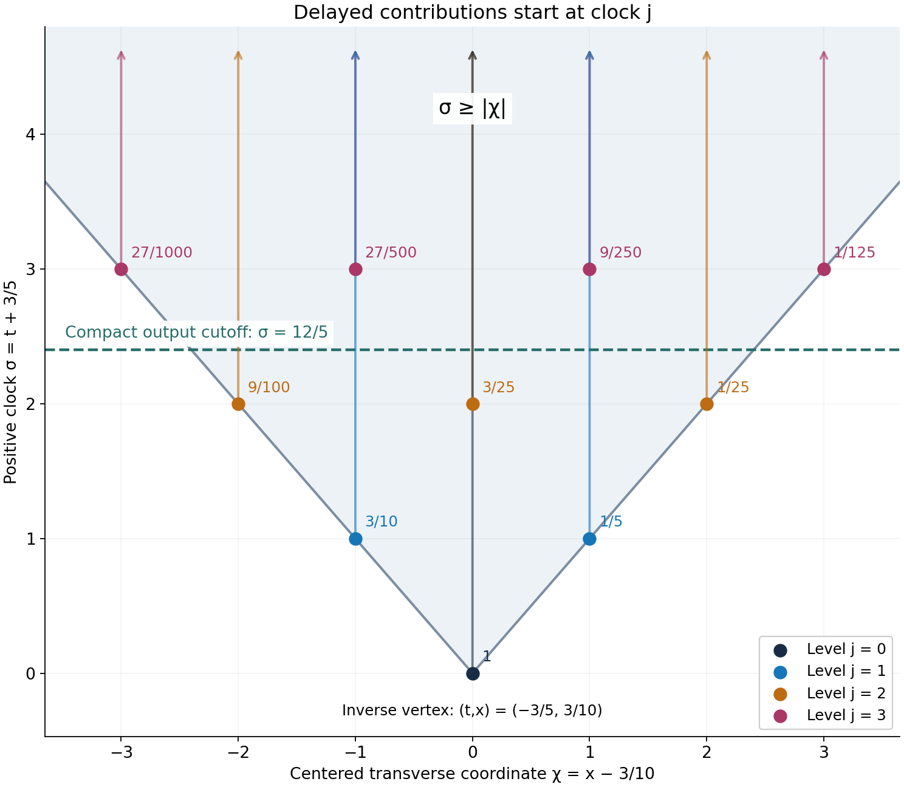
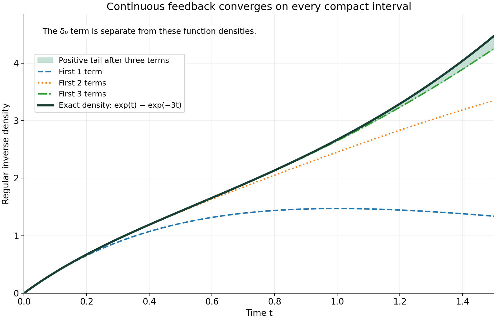

# Worked causal inverses, examples and exercises

*Written by GPT-6.1 Sol (OpenAI), Ultra reasoning effort, October 2026. Self-checked by the writing AI GPT-6.1 Sol (OpenAI). Public domain (CC0 1.0).*

The preceding chapter separates two ways an inverse series can exist. A positive delay makes it locally finite. A continuous error at the vertex instead requires a convergent local construction. The examples below show the distinction, including a compact differential-and-delay kernel, a noncompact kernel with a finite differentiability threshold, and an inverse that grows exponentially.

Basic references are Richard Melrose's [Differential Analysis](https://ocw.mit.edu/courses/18-155-differential-analysis-fall-2004/), Gerd Grubb's [distribution Fourier chapter](https://web.math.ku.dk/~grubb/dist5.pdf), and Lars Hörmander's *The Analysis of Linear Partial Differential Operators*, volumes I and II. The actual proof prerequisites are the preceding chapter, [Convolution as addition of supports](../prerequisites/convolution-as-addition-of-supports.html), Theorems 1.1, 2.1, 3.1 and 3.2, and its Proposition 3.3. The support-frequency comparison uses [Support cones force reciprocal bounds](../AN02-L115.html), Theorem 1.1, and the explicit cone convention of [Logarithmic Fourier graphs construct a cone-supported inverse](../AN02-L117.html), Theorem 1.1.

## 1. A line has no positive clock

**Example 1.** In one dimension let
\[
C=\mathbb R,\qquad R=\delta_1+\delta_{-1}.
\tag{E1.1}
\]
The support of \(R\) misses zero. Nevertheless
\[
R^{*2j}
=\sum_{k=0}^{2j}\binom{2j}{k}\delta_{2k-2j}
\tag{E1.2}
\]
has a mass \(\binom{2j}{j}\delta_0\) for every \(j\). This follows by expanding the finite convolution product: choose \(k\) copies of \(\delta_1\) and \(2j-k\) copies of \(\delta_{-1}\), and add their locations.

Choose a nonnegative compact smooth test supported in \((-1/2,1/2)\), with value one at zero. Its pairing with every even power is \(\binom{2j}{j}\ge1\), and its pairing with every odd power is zero. Thus the proposed sum of powers diverges on this one test. It is neither locally finite nor a distributional sum.

Every finite convolution here exists, because all factors are compact. The failure is the infinite sum. Pointedness is what prevents repeated contributions from returning to one bounded region. By contrast, for \(C=\{0\}\), a distribution in \(\mathcal A_C\) that vanishes near zero is zero, and its delayed inverse series is just \(\delta_0\).

## 2. A differential kernel with two transverse delays

**Example 2.** Use coordinates \((t,x)\), and put
\[
\begin{gathered}
C=\{(t,x):t\ge|x|\},\qquad
a=(3/5,-3/10),\\
p=(1,1),\quad q=(1,-1),\quad
b=1/5,\quad c=3/10,\\
\mu=\tau_a(\delta_0+\partial_t\delta_0),\qquad
v=\mu-b\delta_{a+p}-c\delta_{a+q}.
\end{gathered}
\tag{E2.1}
\]
This is a compact kernel. Its inverse without the delays is
\[
E=\tau_{-a}E_0,\qquad
E_0(t,x)=H(t)e^{-t}\otimes\delta_0(x),
\tag{E2.2}
\]
where \(H\) is the indicator of the nonnegative half-line. Integration by parts gives \((1+\partial_t)(H(t)e^{-t})=\delta_0\), so \(\mu*E=\delta_0\). Both the kernel and the inverse have the translated cone supports required by Theorem 2.2.

Let \(d=b\delta_p+c\delta_q\). The error is \(R=d*E_0\). Its clock \(t\) is at least one. Every compact time interval therefore receives only finitely many powers. The inverse is
\[
F=\tau_{-a}F_0,\qquad
F_0=\sum_{j=0}^\infty d^{*j}*E_0^{*(j+1)}.
\tag{E2.3}
\]
This formula has a complete explicit form. For \(\ell\ge1\), define
\[
g_\ell(s)=H(s)e^{-s}\frac{s^{\ell-1}}{(\ell-1)!}.
\tag{E2.4}
\]
Then
\[
E_0^{*\ell}=g_\ell(t)\otimes\delta_0(x),
\qquad
F_0(t,x)=
\sum_{j=0}^\infty\sum_{k=0}^j
\binom jk b^kc^{j-k}
g_{j+1}(t-j)\otimes\delta_{2k-j}(x).
\tag{E2.5}
\]
To verify the first identity, the convolution of \(g_r\) and \(g_s\) is zero at negative time and, at \(t>0\), equals
\[
\frac{e^{-t}}{(r-1)!(s-1)!}
\int_0^t u^{r-1}(t-u)^{s-1}\,du
=e^{-t}\frac{t^{r+s-1}}{(r+s-1)!}.
\tag{E2.6}
\]
The integral formula follows by substituting \(u=tz\) and integrating by parts \(s-1\) times; its last integral is \(\int_0^1 z^{r+s-2}\,dz=1/(r+s-1)\). The boundary terms vanish at each earlier step, and the resulting factorials give the displayed value. The second identity in (E2.5) now follows by the finite binomial expansion of \(d^{*j}\).

For a direct check of the equation,
\[
(1+\partial_t)g_1=\delta_0,\qquad
(1+\partial_t)g_{\ell+1}=g_\ell\quad(\ell\ge1).
\tag{E2.7}
\]
The first formula includes the jump at zero. The other \(g_{\ell+1}\) vanish there, so their distributional derivative has no delta term. Applying \(1+\partial_t-d*\) to (E2.3) cancels successive terms, with only \(\delta_0\) left. This is a valid locally finite cancellation on each compact test support, not a formal multiplication of unrestricted series.

All coefficients in (E2.5) are positive. Its exact support is
\[
\operatorname{supp}F_0
=\{(t,x):x\in\mathbb Z,\ t\ge|x|\}.
\tag{E2.8}
\]
Indeed, the term of level \(j\) lies at \(x=2k-j\), with \(t\ge j\). These locations satisfy \(j\ge|x|\). Conversely, for any integer \(x\), take \(j=|x|\) and the corresponding endpoint \(k\). Its density is positive for \(t>j\), and its closure contains the initial point. The union of these rays is closed, and positivity prevents cancellation.

The closed convex hull of this support is the whole cone \(C\): the initial points at all nonnegative integers fill both boundary rays by convex combinations, and convexity fills the wedge between them. Translation gives the hull \(C-a\) for \(F\).

*Figure 1. Coordinates are \(\sigma=t+3/5\) and \(\chi=x-3/10\), so the inverse's vertex is the origin in this plot. The first four contribution families in (E2.5) start at \((\sigma,\chi)=(j,2k-j)\) and continue upward. Later rays can overlap earlier ones. The dashed line \(\sigma=12/5\) receives only levels \(j=0,1,2\). The ray arrows and the wedge indicate unbounded support; only a finite part is drawn. Formula (E2.5), support identity (E2.8), and Theorem 2.1 give the exact argument.*

## 3. One derivative at the vertex suffices

**Example 3.** On the nonnegative half-line take the noncompact kernel and its point-supported inverse
\[
\mu(t)=H(t)e^{-t},\qquad E=\delta'_0+\delta_0.
\tag{E3.1}
\]
The calculation in (E2.7) gives \(\mu*E=\delta_0\). The local order of \(E\) is at most one. Change the kernel by
\[
w(t)=t_+^2e^{-2t},\qquad v=\mu+w.
\tag{E3.2}
\]
This \(w\) is \(C^1\) on the whole line, although its second derivative jumps at zero. Theorem 3.2 applies with \(m=1\).

The error can be written without an unknown distributional pairing:
\[
R=-w*E=-(w'+w)
=H(t)e^{-2t}(t^2-2t).
\tag{E3.3}
\]
There is no delta term in \(w'\), because \(w\) is continuous and zero at zero. The resulting \(R\) is continuous.

Choose \(0\le\chi\le1\), smooth, equal to one for \(|t|\le1/8\), and supported in \(|t|<1/4\). Such a cutoff is made from the flat function \(e^{-1/s}\) for \(s>0\), extended by zero for \(s\le0\). Put \(r_0=\chi R\), \(R_1=R-r_0\). Since \(|R(t)|\le2t\) for \(0\le t\le1/4\),
\[
\|r_0\|_1\le\int_0^{1/4}2t\,dt=1/16.
\tag{E3.4}
\]
Thus \(T=\delta_0+\sum_{j\ge1}r_0^{*j}\) converges in \(L^1\) after its delta term. The support of \(R_1\) lies in \([1/8,\infty)\), so the same is true of \(Q=T*R_1\). Consequently
\[
S_1=\sum_{j=0}^\infty Q^{*j},\qquad
F=(\delta'_0+\delta_0)*T*S_1
\tag{E3.5}
\]
is a complete construction of the inverse of \(v\). On time intervals ending at \(U\), only powers with \(j/8\le U\) can contribute to \(S_1\). The factorization (3.5) proves \(v*F=\delta_0\), and every factor has nonnegative support.

The construction works despite noncompactness of both \(\mu\) and \(v\), and it uses only the one derivative dictated by the local order of \(E\). Different admissible cutoffs produce the same \(F\), by uniqueness in the cone algebra.

## 4. A continuous feedback with an exponentially growing inverse

**Example 4.** Let
\[
r(t)=4tH(t)e^{-t},\qquad v=\delta_0-r.
\tag{E4.1}
\]
Here \(r\) is continuous at zero. It does not vanish on any right neighborhood of zero, and every nonzero convolution power has support \([0,\infty)\). The powers are not locally finite. Nevertheless their local convergence can be computed exactly:
\[
r^{*j}(t)=
H(t)e^{-t}\frac{4^j t^{2j-1}}{(2j-1)!}
\quad(j\ge1),
\tag{E4.2}
\]
by the same elementary integral as (E2.6). On each bounded time interval the factorials make the sum uniformly convergent, and
\[
F=\delta_0+H(t)e^{-t}\,2\sinh(2t)
=\delta_0+H(t)(e^t-e^{-3t}).
\tag{E4.3}
\]

One can check the equation independently of the series. With \(f(t)=H(t)(e^t-e^{-3t})\), ordinary integration at \(t>0\) gives
\[
\begin{aligned}
(r*f)(t)
&=4e^t\int_0^t s e^{-2s}\,ds
-4e^{-3t}\int_0^t s e^{2s}\,ds\\
&=e^t-4te^{-t}-e^{-3t}=f(t)-r(t).
\end{aligned}
\tag{E4.4}
\]
At negative time all terms vanish. They are continuous at zero, so this is also an identity of distributions. It proves
\[
(\delta_0-r)*(\delta_0+f)=\delta_0.
\tag{E4.5}
\]

The inverse is not tempered. Let \(\psi\ge0\) be a nonzero compact smooth function supported in \((0,1)\). Pairing \(f\) with \(\psi(t-N)\) gives
\[
e^N\int_0^1 e^s\psi(s)\,ds
-e^{-3N}\int_0^1 e^{-3s}\psi(s)\,ds.
\tag{E4.6}
\]
This grows exponentially in \(N\). Every fixed finite collection of Schwartz seminorms of those translates grows at most polynomially, by the product rule and the bound \(|t|\le N+1\) on their support. A tempered distribution has a bound by some such finite collection, contradicting (E4.6).

The inverse is therefore a well-defined causal distribution with no ordinary tempered Fourier transform. The whole construction uses compact tests and proper-support convolution.

*Figure 2. The solid curve is the regular part \(e^t-e^{-3t}\) of (E4.3); the delta mass at zero is specified in the formula and is not drawn as a function value. The other curves are the first one, two and three terms of (E4.2), on \(0\le t\le3/2\). Every power begins at time zero, so convergence here is factorial convergence on compact intervals, rather than the finite level cutoff of Figure 1. The shaded difference is the positive tail after three terms. Equations (E4.2)–(E4.5) supply the proof.*

## 5. Exercises and full solutions

Each exercise is worth 10 points, for 100 points in total.

### Exercise 1. A sharp clock in a wedge

For \(C=\{(t,x):t\ge|x|\}\), show that \(\tau=(1,0)\) and \(\kappa=1/\sqrt2\) work in (1.2), and that this value of \(\kappa\) cannot be increased. Bound all coordinates in a contributing \(r\)-fold sum with total clock at most \(U\).

**Solution.** For \((t,x)\in C\), \(t\ge0\) and \(t^2+x^2\le2t^2\). Therefore \(t\ge|(t,x)|/\sqrt2\). At the nonzero boundary point \((1,1)\), equality holds, proving sharpness for this unit clock. For \(z_j=(t_j,x_j)\in C\) with \(\sum_jt_j\le U\), one has \(\sum_j|z_j|\le\sqrt2U\), so each \(|z_j|\le\sqrt2U\). If \(U<0\), there are no such coordinates. The bound does not depend on the number of factors. Award 4 points for the inequality, 2 for sharpness and 4 for the sum estimate.

### Exercise 2. A curved set still has a translated cone bound

Let \(K=\{(x,y):y\le-x^2\}\) and \(\theta=(0,1)\). Compute its support function where finite, describe every high slice, and verify (4.2) with \(x_0=(0,1)\), \(A=\sqrt2\).

**Solution.** If \(\eta_y>0\), maximizing first in \(y\) gives
\[
H_K(\eta_x,\eta_y)
=\sup_x(\eta_xx-\eta_yx^2)=\frac{\eta_x^2}{4\eta_y}.
\]
The maximum occurs at \(x=\eta_x/(2\eta_y)\). At \(\eta=0\) the support value is zero. If \(\eta_y<0\), letting \(y\to-\infty\) gives \(+\infty\); if \(\eta_y=0\), \(\eta_x\ne0\), letting \(x\) tend with its sign gives \(+\infty\). For \(c\le0\), the high slice is \(c\le y\le-x^2\), so \(|x|\le\sqrt{-c}\); it is closed and bounded. For \(c>0\) it is empty. Finally \(x^2\le-y\) and \(1-y\ge1\), whence
\[
x^2+(1-y)^2\le (1-y)+(1-y)^2\le2(1-y)^2.
\]
Taking square roots gives (4.2). Award 4 points for the support function, 3 for the slices and 3 for the cone inequality.

### Exercise 3. The exact finite contribution budget

Suppose \(\operatorname{supp}R\subset C\cap\{\tau\cdot x\ge b\}\), \(b>0\). Determine how many powers can pair nontrivially with a test supported in \(L\), where \(M=\max_L\tau\cdot x\), and justify the telescoping inverse on that test.

**Solution.** For \(j\ge1\), support inclusion gives clock at least \(jb\). Thus \(j>M/b\) contributes zero. If \(M\ge0\), only \(j=0,\ldots,\lfloor M/b\rfloor\) need be retained; some of these can also vanish. If \(M<0\), all terms vanish, including \(\delta_0\). The equality case \(jb=M\) cannot be discarded without further information about the test and support, so the strict inequality is necessary for this support argument. For finite partial sums, (2.3) is an exact identity. Choose \(N\) with \((N+1)b>M\); its remainder vanishes on the test. Fixed proper-support continuity transfers the partial-sum identity to \(S\). Award 5 points for the budget and endpoint, and 5 for the limit justification.

### Exercise 4. One line of the delayed inverse

In Example 2, find the coefficient density of the atom at \(\chi=0\), for \(2\le\sigma<3\), and evaluate it at \(\sigma=12/5\). Here \((\sigma,\chi)=(t+3/5,x-3/10)\).

**Solution.** Only \(j=0,1,2\) can contribute before time three. A zero transverse coordinate requires \(2k-j=0\), which occurs at \(j=0,k=0\) and \(j=2,k=1\). The density is
\[
g_1(\sigma)+2bc\,g_3(\sigma-2)
=e^{-\sigma}+\frac3{25}g_3(\sigma-2).
\]
At \(\sigma=12/5\), \(g_3(2/5)=2e^{-2/5}/25\), so the value is
\[
e^{-12/5}+\frac6{625}e^{-2/5}.
\]
This is the scalar density multiplying the point mass in \(\chi\), not a two-dimensional function value of \(F\). Award 4 points for the contributing indices, 4 for the value and 2 for its interpretation.

### Exercise 5. The boundary term in a causal derivative

Prove (E2.7) by testing against a compact smooth function. Explain why the case \(g_1\) differs from the others.

**Solution.** For a test \(\phi\),
\[
\langle(1+\partial_t)g_1,\phi\rangle
=\int_0^\infty e^{-t}(\phi(t)-\phi'(t))\,dt=\phi(0),
\]
by integrating the derivative of \(e^{-t}\phi(t)\). For \(\ell\ge1\), \(g_{\ell+1}(0+)=0\). Integration by parts has no endpoint term, and ordinary differentiation on \(t>0\) yields
\[
g'_{\ell+1}=e^{-t}\frac{t^{\ell-1}}{(\ell-1)!}
-e^{-t}\frac{t^\ell}{\ell!}=g_\ell-g_{\ell+1}.
\]
All functions vanish for negative time. Thus the displayed distributional formulas follow. Award 5 points for the delta term and 5 for the higher powers.

### Exercise 6. A finite-regularity perturbation with one extra derivative

Keep \(\mu,E\) of Example 3, but take \(w(t)=t_+^3e^{-2t}\). Compute \(R=-w*E\), determine the regularity of \(w\) at zero, and give a small \(L^1\) bound for the cutoff error on \(0\le t\le1/4\).

**Solution.** The function \(w\) is \(C^2\), while its third derivative jumps from zero to six at zero. Since \(w\) is continuous and zero at zero, differentiation introduces no delta term, and
\[
R=-(w'+w)=H(t)e^{-2t}(t^3-3t^2).
\]
It is continuous near zero. For \(0\le t\le1/4\), \(|R(t)|\le3t^2\). Any cutoff \(0\le\chi\le1\) supported in that positive interval after multiplication by \(R\) gives
\[
\|\chi R\|_1\le\int_0^{1/4}3t^2\,dt=1/64<1.
\]
Choose the cutoff equal to one near zero. The remaining error has a positive delay. The order-one threshold in Theorem 3.2 is already met, and Theorem 3.1 then gives the inverse. Award 4 points for the derivative calculation, 3 for regularity and 3 for the quantitative bound.

### Exercise 7. A uniform bound on the continuous-series tail

Let \(P_J=\sum_{j=1}^J r^{*j}\) in Example 4. Show, for \(0\le t\le T\) and \(J\ge0\), that
\[
0\le f(t)-P_J(t)
\le 2e^{2T}\frac{(2T)^{2J+1}}{(2J+1)!}.
\tag{E5.1}
\]

**Solution.** Formula (E4.2) gives
\[
f-P_J
=2e^{-t}\sum_{j=J+1}^\infty
\frac{(2t)^{2j-1}}{(2j-1)!}.
\]
Its terms are nonnegative. Enlarge the odd-power sum to all powers \(k\ge m=2J+1\), and use \((m+\ell)!\ge m!\ell!\). The resulting upper bound is
\[
2\frac{(2T)^m}{m!}\sum_{\ell=0}^\infty
\frac{(2T)^\ell}{\ell!}
=2e^{2T}\frac{(2T)^m}{m!}.
\]
We used \(e^{-t}\le1\). For \(T=0\) both sides are zero. This proves uniform convergence on every fixed compact positive interval. Award 4 points for the exact tail and 6 for the factorial estimate.

### Exercise 8. Why exponential growth defeats temperedness

Complete the translated-test contradiction after (E4.6), using the standard finite-seminorm bound for a tempered distribution.

**Solution.** Continuity on Schwartz space gives some integers \(M,K\) and a constant \(B\) such that
\[
|\langle T,\phi\rangle|
\le B\max_{j\le K}\sup_t(1+|t|)^M|\phi^{(j)}(t)|.
\]
For \(\phi_N(t)=\psi(t-N)\), all derivatives have fixed sup norms and support in \((N,N+1)\). The right side is at most a fixed constant times \((N+2)^M\). The first integral in (E4.6) is strictly positive, and the second decays exponentially. Hence the left side grows like a positive constant times \(e^N\), contradicting that bound. For large \(N\), the delta part of \(F\) pairs to zero with \(\phi_N\), so \(F\) is also not tempered. Award 5 points for the seminorm estimate and 5 for the contradiction.

### Exercise 9. A dimension matters in a reciprocal diagnostic

Explain why the all-direction derivative counterexample in Example 5.3 of the preceding chapter uses one dimension. For \(\mu=\partial_t\delta_0\) on \(\mathbb R^2\), test the zero-free premise on \(\Gamma=\mathbb R^2\).

**Solution.** The transform is \(i\zeta_t\). At \(\zeta=(0,iR)\), \(R\ge2\), it is zero, while the imaginary norm is \(R\) and the total complex norm is \(R\). For any fixed logarithmic barrier constant \(D\), arbitrarily large \(R\) satisfy \(R>D\log(R+2)\). Thus the all-direction zero-free premise fails in two dimensions. In one dimension the only zero of \(i\zeta\) is zero itself, which lies below every positive logarithmic barrier; the reciprocal premise can hold there. Award 5 points for the exact zero family and 5 for the quantifier comparison.

### Exercise 10. An unrestricted vertex change can destroy the inverse

Take \(\mu=\delta_0\), \(E=\delta_0\), \(a=0\), and any pointed cone \(C\). Set \(v=0\). Identify which perturbation hypotheses fail and whether \(v\) can have an inverse.

**Solution.** All support inclusions are satisfied, since the empty support of \(v\) lies in \(C\). But \(v-\mu=-\delta_0\) neither vanishes near zero nor is a function near zero, so it satisfies neither Theorem 2.2 nor Theorem 3.2. The error \(R=(\mu-v)*E\) is \(\delta_0\); its clock delay is zero, and every power is \(\delta_0\). Finally \(v*F=0\) for every allowed \(F\), so it cannot equal \(\delta_0\). The support condition alone cannot preserve an inverse under arbitrary changes at the vertex. Award 4 points for the failed hypotheses, 3 for the error and 3 for the impossibility.

## References

- Richard B. Melrose, *Differential Analysis*, MIT OpenCourseWare, Fall 2004. [Open course materials](https://ocw.mit.edu/courses/18-155-differential-analysis-fall-2004/).
- Gerd Grubb, *Fourier transformation of distributions*. [Author-hosted chapter](https://web.math.ku.dk/~grubb/dist5.pdf).
- [Convolution as addition of supports](../prerequisites/convolution-as-addition-of-supports.html), especially its proper-support convolution, finite-regularity and cone-algebra statements.
- [Support cones force reciprocal bounds](../AN02-L115.html), Theorem 1.1.
- [Logarithmic Fourier graphs construct a cone-supported inverse](../AN02-L117.html), Theorem 1.1, with its stated cone convention.
- Lars Hörmander, *The Analysis of Linear Partial Differential Operators*, volumes I and II, Springer. Background reference.

## Complete proof

A causal inverse can grow rapidly and still act on every compactly supported test. Its support, rather than a growth estimate, makes convolution possible. We prove that changing a kernel away from the first point of its support preserves such an inverse. A second argument allows a change that is only sufficiently differentiable near that point. We then connect the support geometry to directional hyperbolicity and to the existing Fourier criteria.

Basic references are Richard Melrose's [Differential Analysis](https://ocw.mit.edu/courses/18-155-differential-analysis-fall-2004/), Gerd Grubb's [Fourier transformation of distributions](https://web.math.ku.dk/~grubb/dist5.pdf), and Lars Hörmander's *The Analysis of Linear Partial Differential Operators*, volumes I and II. The proofs used in this chapter are given here or in the following preceding lessons:

- [Convolution as addition of supports](../prerequisites/convolution-as-addition-of-supports.html), Theorems 1.1, 2.1, 3.1 and 3.2, and Proposition 3.3: proper-support convolution, finite-regularity smoothing, associativity, continuity with fixed supports, and the algebra of distributions in a cone containing no line.
- [Support cones force reciprocal bounds](../AN02-L115.html), Theorem 1.1: the exact translated support cone and its reciprocal estimate.
- [Logarithmic Fourier graphs construct a cone-supported inverse](../AN02-L117.html), Theorem 1.1: one common inverse from the stated estimates on a nonempty open convex cone that excludes zero.

All distributions and pairings are complex-linear. We work in real dimension \(n\ge1\). A closed convex cone \(C\) is nonempty, closed, convex, and invariant under multiplication by nonnegative scalars. In this chapter it is **pointed** when
\[
C\cap(-C)=\{0\}.
\tag{1.1}
\]
The cone \(\{0\}\) is allowed. We impose no growth or temperedness hypothesis on a cone-supported distribution.

## 1. A positive clock on a pointed cone

**Lemma 1.1 (a quantitative clock).** If \(C\ne\{0\}\) satisfies (1.1), there are a unit vector \(\tau\) and \(\kappa>0\) such that
\[
\tau\cdot x\ge\kappa|x|\quad(x\in C).
\tag{1.2}
\]
For \(C=\{0\}\), any unit vector and \(\kappa=1\) give the same inequality.

**Proof.** Let \(A=C\cap\{|x|=1\}\). This set is compact. Its convex hull is compact: every finite convex combination can be reduced to at most \(n+1\) points. Indeed, if there are more points, their augmented vectors \((x_j,1)\) are linearly dependent. Change the weights along a nonzero dependence, choosing its sign and increasing its magnitude until one positive weight becomes zero. The sum of the weights and the represented point stay fixed. Repeating gives at most \(n+1\) points. The convex hull is therefore the continuous image of the compact product of \(A^{n+1}\) and the closed simplex of weights.

Zero is not in this convex hull. If \(\sum_j\alpha_jx_j=0\) with positive weights and unit vectors \(x_j\in C\), then for any index \(j\) with positive weight,
\[
-x_j=\sum_{\ell\ne j}(\alpha_\ell/\alpha_j)x_\ell\in C.
\]
This contradicts (1.1). Choose a point \(q\) of least norm in the compact convex hull. Its norm is positive. For every \(x\) in that hull, differentiating \(|q+s(x-q)|^2\) at \(s=0+\) gives
\[
q\cdot x\ge |q|^2.
\]
Set \(\tau=q/|q|\) and \(\kappa=|q|\), and apply this inequality to \(x/|x|\) for every nonzero \(x\in C\). The zero case is immediate. \(\square\)

The clock makes the locality of addition explicit. If \(u_j\in C\), \(1\le j\le r\), and \(z=b+\sum_j u_j\), then
\[
\kappa\sum_j|u_j|
\le\sum_j\tau\cdot u_j=\tau\cdot(z-b).
\tag{1.3}
\]
For outputs in a fixed compact set, all the contributing coordinates are bounded. They form a closed set and hence a compact set. This proves the properness needed for any fixed number of factors supported in translates of \(C\). The convolution, commutativity, support inclusion, associativity and fixed-support continuity now follow from the exact preceding foundation theorems. We will use those theorems at these proper support sets, including for noncompact factors.

Write
\[
\mathcal A_C=\{T\in\mathcal D'(\mathbb R^n):
\operatorname{supp}T\subset C\}.
\tag{1.4}
\]
This is the commutative algebra of Proposition 3.3 of the preceding convolution lesson. Its identity is \(\delta_0\).

If \(T\in\mathcal A_C\) vanishes near zero, its closed support misses some ball of radius \(r>0\). Thus (1.2) gives
\[
\operatorname{supp}T\subset\{x\in C:\tau\cdot x\ge b\},
\qquad b=\kappa r>0.
\tag{1.5}
\]
If its support is empty, \(T=0\), and any \(b>0\) works.

## 2. An error with a delay has a locally finite inverse

**Theorem 2.1 (delayed Neumann series).** Let \(R\in\mathcal A_C\) vanish on a neighborhood of zero. Put \(R^{*0}=\delta_0\). Then
\[
S=\sum_{j=0}^{\infty}R^{*j}
\quad\text{is a distribution in }\mathcal A_C,
\qquad
(\delta_0-R)*S=\delta_0.
\tag{2.1}
\]
The series is locally finite on every compact set. It defines the unique inverse of \(\delta_0-R\) in \(\mathcal A_C\).

**Proof.** Choose \(b\) in (1.5). The support inclusion for proper convolution gives
\[
\operatorname{supp}R^{*j}\subset
\{x\in C:\tau\cdot x\ge jb\}\quad(j\ge1).
\tag{2.2}
\]
The inclusion follows by induction, since the clock adds. For a compact test support \(L\), let \(M_L=\max_{x\in L}\tau\cdot x\). Every term with \(jb>M_L\) vanishes on tests supported in \(L\). The sum is therefore finite on that support space, with a finite distributional order and bound. These finite definitions agree when the test support is enlarged. They define a distribution supported in the closed set \(C\).

For \(S_N=\sum_{j=0}^N R^{*j}\), associativity gives
\[
(\delta_0-R)*S_N=\delta_0-R^{*(N+1)}.
\tag{2.3}
\]
One can take the limit on each fixed test. Convolution is continuous for the fixed proper support pair \(C,C\), by Theorem 3.2 of the foundation lesson; \(S_N\to S\) distributionally, and the remainder vanishes eventually on that test by (2.2). This proves (2.1). Since the algebra is commutative, it is also a right inverse. If \(S'\) is another inverse in this algebra, then
\[
S'=S'*(\delta_0-R)*S=S.
\]
Every convolution in this identity is permitted by (1.3). \(\square\)

**Theorem 2.2 (stability away from the first support point).** Let \(a\in\mathbb R^n\). Suppose that
\[
\begin{gathered}
\mu,v\in\mathcal D'(\mathbb R^n),\qquad
\operatorname{supp}\mu,\operatorname{supp}v\subset a+C,\\
\operatorname{supp}E\subset C-a,\qquad
\mu*E=\delta_0,
\end{gathered}
\tag{2.4}
\]
and \(v-\mu\) vanishes near \(a\). There is a unique \(F\), supported in \(C-a\), satisfying
\[
v*F=\delta_0.
\tag{2.5}
\]
In particular, \(\mu\) need not be compactly supported.

**Proof.** Translate the kernel to the vertex and the inverse in the opposite direction:
\[
\mu_0=\tau_{-a}\mu,\quad v_0=\tau_{-a}v,\quad
E_0=\tau_a E.
\tag{2.6}
\]
All three supports lie in \(C\), and \(\mu_0*E_0=\delta_0\). Translation follows directly from the addition pairing in the foundation lesson. The distribution \(w_0=v_0-\mu_0\) vanishes near zero. Set
\[
R=(\mu_0-v_0)*E_0=-w_0*E_0.
\tag{2.7}
\]
Its support is in \(C\). Moreover, \(\operatorname{supp}w_0\) satisfies a positive clock bound (1.5), and \(\tau\cdot x\ge0\) on \(\operatorname{supp}E_0\). Their sum satisfies the same positive bound. Hence \(R\) vanishes near zero.

Theorem 2.1 provides \(S\) with \((\delta_0-R)*S=\delta_0\). Since
\[
v_0*E_0=\delta_0-R,
\qquad
F_0=E_0*S,
\tag{2.8}
\]
we have \(v_0*F_0=\delta_0\) and \(\operatorname{supp}F_0\subset C\). Set \(F=\tau_{-a}F_0\). This gives (2.5) and the required support. For uniqueness, translate any other such inverse into \(\mathcal A_C\) and use the uniqueness of an inverse in a commutative algebra. \(\square\)

The series in this theorem needs no convergence estimate at infinity. Its terms simply stop contributing on each bounded output region. Lower dimensional pointed cones are included.

## 3. A continuous error at the vertex also has an inverse

**Theorem 3.1 (locally continuous causal errors).** Suppose \(R\in\mathcal A_C\) is represented by a continuous function on some neighborhood of zero. Then \(\delta_0-R\) has an inverse in \(\mathcal A_C\).

**Proof.** Choose a compact smooth cutoff \(\chi\) supported inside that neighborhood, equal to one near zero, and with \(0\le\chi\le1\). Shrink its support until
\[
r_0=\chi R\in C_c^0,\qquad
\operatorname{supp}r_0\subset C,\qquad
\|r_0\|_{L^1}=q<1.
\tag{3.1}
\]
This is possible because the continuous representative is bounded on a fixed small closed ball, while the volume of a shrinking ball tends to zero. Multiplication by the cutoff gives a globally continuous compact function. The support inclusion follows because its distribution is \(\chi R\).

Ordinary integration and Fubini give \(\|f*g\|_1\le\|f\|_1\|g\|_1\) for integrable functions. Consequently
\[
T=\delta_0+\sum_{j=1}^{\infty}r_0^{*j}
\tag{3.2}
\]
converges in \(L^1\) after the delta term. Its support is in \(C\), since every partial sum has that support. The function terms are continuous: convolution with a compact continuous function is continuous by uniform continuity and dominated integration. Also
\[
\|r_0^{*j}\|_\infty
\le\|r_0\|_\infty q^{j-1}.
\tag{3.3}
\]
Thus their sum converges uniformly to a bounded continuous function. Telescoping the finite sums and using the \(L^1\) remainder bound \(q^{N+1}\) proves
\[
(\delta_0-r_0)*T=\delta_0.
\tag{3.4}
\]
This identity is also an identity in the cone algebra: its convolution agrees with ordinary integration for the function terms, by the foundation addition pairing, and convergence can be passed through the fixed proper supports.

Put \(R_1=R-r_0\). It vanishes near zero and is supported in \(C\). Define \(Q=T*R_1\). All factors lie in \(\mathcal A_C\), so this convolution exists even if \(R_1\) is not compact. Its support satisfies a positive clock bound, inherited from \(R_1\) because \(T\) has nonnegative clock. Therefore \(Q\) vanishes near zero. Theorem 2.1 gives \(S_1=(\delta_0-Q)^{-1}\) in the cone algebra.

The factorization is exact:
\[
\begin{aligned}
(\delta_0-r_0)*(\delta_0-Q)
&=\delta_0-r_0-(\delta_0-r_0)*T*R_1\\
&=\delta_0-r_0-R_1=\delta_0-R.
\end{aligned}
\tag{3.5}
\]
Its inverse is \(S=T*S_1\). Proper-support associativity justifies every product. This proves the theorem. \(\square\)

**Theorem 3.2 (a finite differentiability threshold).** Fix \(\mu,E,a,C\) as in (2.4). There is an integer \(m\ge0\), depending on \(E\) near \(-a\), with the following property. If \(v\) has support in \(a+C\) and \(v-\mu\) is represented by a \(C^m\) function on a neighborhood of \(a\), then \(v\) has a unique inverse supported in \(C-a\).

**Proof.** Use (2.6), and choose \(m\) to be a finite local order of \(E_0\) on the closed unit ball about zero, with a slightly larger compact neighborhood for its controlling test bound. The local finite-order property of a distribution supplies such an \(m\).

Let \(w_0=v_0-\mu_0\). It is \(C^m\) near zero. Choose a ball of radius \(r<1\) inside that neighborhood. Formula (1.3), for two cone coordinates with sum \(z\), implies
\[
|x|+|y|\le |z|/\kappa
\quad(x,y\in C,\ x+y=z).
\tag{3.6}
\]
For \(z\) sufficiently near zero, all contributing coordinates therefore lie well inside that ball. Choose compact smooth cutoffs \(\alpha,\beta\), supported in the ball and equal to one on a smaller ball containing all these coordinates. On a neighborhood of zero,
\[
w_0*E_0=(\alpha w_0)*(\beta E_0).
\tag{3.7}
\]
To verify the localization, take a test with sufficiently small support. On every contributing pair in the support of \(w_0\otimes E_0\), both cutoffs are one by (3.6). The difference of the two addition pairings is zero.

The first factor on the right is compactly supported and \(C^m\). The second is a compact distribution of order at most \(m\): multiplication by a fixed smooth cutoff preserves that order. The finite-regularity part of Theorem 2.1 of the foundation convolution lesson, with \(j=m\) and \(k=0\), makes (3.7) a continuous function. Thus \(R=-w_0*E_0\) is continuous near zero and belongs to \(\mathcal A_C\).

Theorem 3.1 provides \(S=(\delta_0-R)^{-1}\). Now \(F_0=E_0*S\) is a cone-supported inverse of \(v_0\), as in (2.8). Translate back. Uniqueness is the same cone-algebra argument as before. For \(C=\{0\}\), a function distribution supported in \(C\) is zero; the proof still applies, and the perturbation in this case is zero. \(\square\)

The differentiability requirement is a sufficient condition with an actual finite integer. It is not a claim that every less regular perturbation fails. No global derivative bound is imposed on the perturbation, and no compactness is imposed on \(v\) or on the inverse.

## 4. Three equivalent ways to see directional support

For a closed convex set \(K\subset\mathbb R^n\), let
\[
H_K(\eta)=\sup_{x\in K}x\cdot\eta.
\tag{4.1}
\]
The empty set has support value \(-\infty\). We allow \(+\infty\) for nonempty sets.

**Lemma 4.1 (support values, compact slices, and a translated cone).** Let \(\theta\ne0\). The following conditions are equivalent:

1. \(H_K(\eta)<+\infty\) for every \(\eta\) in some neighborhood of \(\theta\).
2. For every real \(c\), \(K\cap\{x:x\cdot\theta\ge c\}\) is compact, possibly empty.
3. There are \(x_0\in\mathbb R^n\) and \(A>0\) such that
\[
|x-x_0|\le A(x_0-x)\cdot\theta
\quad(x\in K).
\tag{4.2}
\]

**Proof.** The empty set satisfies all three conditions. Suppose \(K\) is nonempty.

For \(1\Rightarrow2\), choose \(h>0\) for which every \(\theta\pm h e_\ell\) has finite support value. For a point of the slice,
\[
\pm h x_\ell
\le H_K(\theta\pm h e_\ell)-c.
\tag{4.3}
\]
These finitely many bounds control every coordinate. The slice is closed and bounded and therefore compact. This is also the exact argument of Lemma 2.1 of the preceding support-cone lesson.

For \(2\Rightarrow3\), translate a point \(p\in K\) to zero, writing \(L=K-p\). Let
\[
L_{-1}=L\cap\{y:y\cdot\theta\ge-1\},\qquad
B=\max\{1,\max_{y\in L_{-1}}|y|\},\qquad
M=\max_{y\in L_{-1}}y\cdot\theta.
\tag{4.4}
\]
The set is compact and contains zero, so \(M\ge0\). If \(y\in L\) has \(y\cdot\theta<-1\), then \(s=-1/(y\cdot\theta)\) belongs to \((0,1)\). Convexity and \(0\in L\) give \(sy\in L\), and \(sy\cdot\theta=-1\). Hence
\[
|y|\le B(-y\cdot\theta).
\tag{4.5}
\]
Put \(d=M+1\), \(x_0=p+d\theta/|\theta|^2\), and choose
\[
A=\max\{B,\ 1/|\theta|,\ B+d/|\theta|\}.
\tag{4.6}
\]
For \(y\in L_{-1}\), the right side of (4.2) is \(A(d-y\cdot\theta)\ge A\), while the left side is at most \(B+d/|\theta|\le A\). For the remaining \(y\), (4.5) gives
\[
\left|y-\frac{d\theta}{|\theta|^2}\right|
\le B(-y\cdot\theta)+d/|\theta|
\le A(d-y\cdot\theta).
\]
Thus (4.2) holds in both cases.

For \(3\Rightarrow1\), let \(z=x-x_0\). Then \(z\cdot\theta\le-|z|/A\). If \(|\eta-\theta|<1/(2A)\), it follows that
\[
z\cdot\eta
\le-|z|/A+|z||\eta-\theta|\le0.
\tag{4.7}
\]
Therefore \(H_K(\eta)\le x_0\cdot\eta<\infty\) on that neighborhood. \(\square\)

The minus sign in (4.2) says the unbounded part of \(K\) goes in directions with negative \(\theta\)-pairing.

**Definition 4.2 (directional hyperbolicity).** A compact kernel \(\mu\) is hyperbolic in a nonzero direction \(\theta\) if it has a distributional inverse \(E\) supported in a convex set whose support function is finite near \(-\theta\). The inverse belongs to \(\mathcal D'\); it need not be tempered.

Taking the closed convex hull of its support preserves the condition. Indeed the support function is unchanged by taking that hull, since linear functions preserve convex combinations and are continuous under limits. With \(-\theta\) in Lemma 4.1, every low-time set
\[
K\cap\{x:x\cdot\theta\le T\}
\tag{4.8}
\]
is compact. Also \(K\) lies in a translated pointed cone facing the positive \(\theta\) direction. The cone defined by \(|z|\le A z\cdot\theta\) is closed and convex, since it is the sublevel set of the convex function \(|z|-A z\cdot\theta\); it contains no nonzero line.

The same directional support condition can be applied to the noncompact kernels of Theorems 2.2 and 3.2 whenever their convolution is defined by these proper cone supports.

## 5. Connecting the support picture to complex frequency

The analytic criteria already have complete preceding proofs. Here are their exact roles.

**Theorem 5.1 (the forward criterion).** Suppose \(\mu\in\mathcal E'\), \(E\in\mathcal D'\), and \(\mu*E=\delta_0\). Let \(K\) be the closed convex hull of \(\operatorname{supp}E\), and suppose
\[
\Gamma=\operatorname{int}\{\eta:H_K(\eta)<\infty\}\ne\varnothing.
\tag{5.1}
\]
There is a unique real vector \(a\) such that
\[
H_\mu(\eta)=-H_K(\eta)=a\cdot\eta\quad(\eta\in\Gamma).
\tag{5.2}
\]
With the negative polar
\[
C=\{x:x\cdot\eta\le0\text{ for all }\eta\in\Gamma\},
\tag{5.3}
\]
one has \(K=C-a\) and \(\operatorname{supp}\mu\subset C+a\). For every closed cone \(\Gamma_1\subset\Gamma\cup\{0\}\), there are constants \(D>0\) and an integer \(N\ge0\) such that
\[
\left|\widehat\mu(\zeta)^{-1}\right|
\le D(1+|\zeta|)^N e^{-a\cdot\operatorname{Im}\zeta}
\tag{5.4}
\]
whenever \(\operatorname{Im}\zeta\in\Gamma_1\) and
\[
|\operatorname{Im}\zeta|>D\log(|\zeta|+2).
\tag{5.5}
\]
The transform is nonzero in this region. The cone \(\Gamma=\mathbb R^n\) is allowed in this forward assertion.

**Proof.** This is Theorem 1.1 of [Support cones force reciprocal bounds](../AN02-L115.html), with the same compact kernel, arbitrary distributional inverse, closed convex support hull, negative polar, translation, closed angular cones and logarithmic barrier. Rename its constants \(C_1,M\) as \(D,N\). No hypothesis on the growth or Fourier transform of \(E\) is added. \(\square\)

**Theorem 5.2 (the converse at an explicit cone convention).** Let \(\Gamma\) be nonempty, open in \(\mathbb R^n\), ordinarily convex, invariant under positive dilations, and exclude zero. Let \(\mu\in\mathcal E'\). Suppose that on each closed cone \(\Gamma_1\subset\Gamma\cup\{0\}\), its transform is nonzero beyond a logarithmic barrier and satisfies
\[
\left|\widehat\mu(\zeta)^{-1}\right|
\le D(1+|\zeta|)^N e^{A|\operatorname{Im}\zeta|}
\tag{5.6}
\]
there, with constants \(D\ge1\), \(A\ge0\), \(N\ge0\) that can depend on \(\Gamma_1\). Then one common \(E\in\mathcal D'\) satisfies \(\mu*E=\delta_0\) and \(H_K(\eta)<\infty\) for every \(\eta\in\Gamma\).

**Proof.** These are exactly the hypotheses and conclusion of Theorem 1.1 of [Logarithmic Fourier graphs construct a cone-supported inverse](../AN02-L117.html). Its construction uses one distribution for all directions. Its support bound \(H_K(\eta)\le A|\eta|\) for each corresponding angular cone gives the assertion here. The closure of \(\Gamma\) is not required to be pointed. \(\square\)

These two criteria use different zero-containing cases. The following direct calculation explains why the distinction is mathematical.

**Example 5.3 (all directions cannot be inserted in the converse).** On \(\mathbb R\), let \(\mu=\delta'_0\). Then \(\widehat\mu(\zeta)=i\zeta\). On the whole imaginary-direction space \(\Gamma=\mathbb R\), the reciprocal bound with \(D=1\), \(N=0\), \(A=0\) holds whenever
\[
|\operatorname{Im}\zeta|>\log(|\zeta|+2).
\tag{5.7}
\]
In fact this inequality forces \(|\zeta|>1\): for \(0\le r\le1\), \(\log(r+2)-r\) decreases and has positive value \(\log3-1\) at one. Thus \(|\zeta|^{-1}<1\). The transform has no zero in (5.7).

There is nevertheless no inverse whose support function is finite in both directions. If its support hull \(K\) had finite values at \(1\) and \(-1\), it would be bounded, making the inverse compact. A compact solution of \(E'=\delta_0\) is impossible: choose a compact smooth test equal to one on a neighborhood of \(\operatorname{supp}E\cup\{0\}\). Then \(\langle E',\phi\rangle=-\langle E,\phi'\rangle=0\), while \(\langle\delta_0,\phi\rangle=1\).

An empty direction set also cannot give a converse: its estimates are vacuous, even for the zero kernel. These examples establish necessary qualifications. They make no attribution about an unspecified convention in another work.

## References

- Richard B. Melrose, *Differential Analysis*, MIT OpenCourseWare, Fall 2004. [Open course materials](https://ocw.mit.edu/courses/18-155-differential-analysis-fall-2004/).
- Gerd Grubb, *Fourier transformation of distributions*. [Author-hosted chapter](https://web.math.ku.dk/~grubb/dist5.pdf).
- [Convolution as addition of supports](../prerequisites/convolution-as-addition-of-supports.html), Theorems 1.1, 2.1, 3.1 and 3.2, and Proposition 3.3.
- [Support cones force reciprocal bounds](../AN02-L115.html), Theorem 1.1 and Lemma 2.1.
- [Logarithmic Fourier graphs construct a cone-supported inverse](../AN02-L117.html), Theorem 1.1.
- Lars Hörmander, *The Analysis of Linear Partial Differential Operators*, volumes I and II, Springer. Background reference; the required proofs are the explicit internal ones cited above and those given in this chapter.
