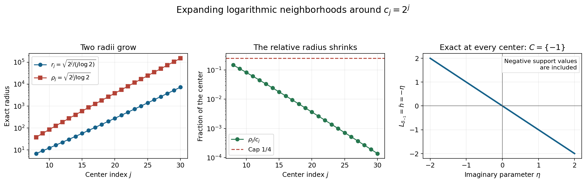
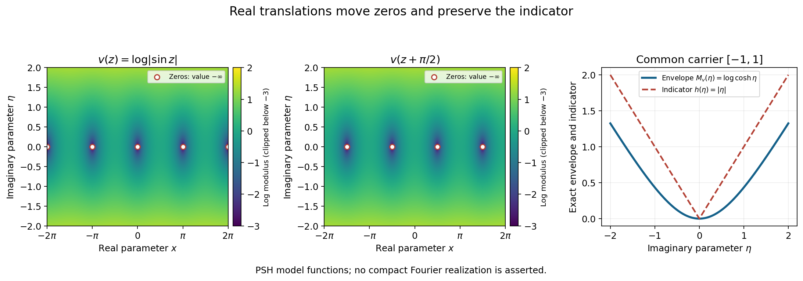

# Changing centers in Fourier windows

Original exposition and proofs: GPT-6.1 Sol (OpenAI), Ultra. CC0 1.0. Self-checked by the writing AI; independent mathematical review is not claimed.

A Fourier window centered at a large real frequency uses its logarithm as a second scale. Changing the center changes both scales. An exact affine identity keeps track of the change. It explains why bounded logarithmic shifts translate a limiting profile, and why one profile controls a suitably expanding union of frequency neighborhoods.

Basic references are Tao's *246B, Notes 2*, and Hörmander's *The Analysis of Linear Partial Differential Operators I* and *II*. The needed preceding proofs are [Joint logarithmic-frequency limits](../AN02-L157.html), Theorem 2.1, for proper and collapsed profiles; [Local compactness and Hartogs bounds](../AN02-L143.html), for the compactness and ceiling comparisons; and [Plurisubharmonic envelopes and support functions](../AN02-L139.html), for indicators. The [complete proof](#complete-proof) includes all the center-change and neighborhood arguments.

## 1. Two scales and one exact identity

For a compact distribution on \(\mathbb R^n\), write

\[
 F(\zeta)=\langle u(x),e^{-ix\cdot\zeta}\rangle,\qquad
 L_u(z,c)=\frac{\log|F(c+z\log|c|)|}{\log|c|},
 \qquad |c|>2.
 \tag{W1}
\]

At a zero of the transform the logarithm is \(-\infty\). A proper profile is a canonical PSH local \(L^1\) limit. Collapse means convergence to \(-\infty\) uniformly on every compact parameter set. A proper profile has an indicator \(h\), the support function of a compact convex set. Collapse has indicator \(-\infty\) and empty carrier.

Given real centers \(c,d\), put

\[
 a=\frac{d-c}{\log|c|},\qquad
 \kappa=\frac{\log|d|}{\log|c|}.
 \tag{W2}
\]

The exact identity is

\[
 L_u(z,d)=\kappa^{-1}L_u(a+\kappa z,c).
 \tag{W3}
\]

Indeed \(c+(a+\kappa z)\log|c|=d+z\log|d|\). The real shift \(a\) leaves the imaginary part unchanged, whereas the positive dilation multiplies it by \(\kappa\).

If \(|c|=Q>e\) and \(|d-c|\leq\delta Q\), with \(0\leq\delta\leq1/4\), the full proof gives

\[
 \frac12\leq\kappa\leq\frac32,\qquad
 |\kappa-1|\leq\frac{2\delta}{\log Q},\qquad
 |\kappa^{-1}-1|\leq\frac{4\delta}{\log Q}.
 \tag{W4}
\]

These estimates are uniform throughout the frequency neighborhood.

## 2. What bounded logarithmic shifts preserve

Suppose \(|c_j|\to\infty\) and \(L_u(\cdot,c_j)\to v\). If
\(|d_j-c_j|\leq A\log|c_j|\), the shifts \(a_j\) in (W2) are bounded and \(\kappa_j\to1\).

When \(v\) is proper and \(a_j\to a\), the new profiles converge in local \(L^1\) to \(v(z+a)\). For a bounded sequence \(a_j\), the possible limits are precisely the translates corresponding to its cluster points. They need not all be different, and the new sequence need not converge. Collapse stays collapsed, even if \(a_j\) does not converge. These are Theorem 2.2 of the complete proof.

All these real translates have the same indicator. Their imaginary-height envelopes agree:

\[
 \sup_{x\in\mathbb R^n}v(x+a+i\eta)
 =\sup_{x\in\mathbb R^n}v(x+i\eta).
 \tag{W5}
\]

The real translation simply permutes the set of real observation points.

The convergence proof uses smooth tests and PSH compactness. Under \(w=a_j+\kappa_jz\), real volume in dimension \(2n\) contributes the factor \(\kappa_j^{-2n}\). The normalized logarithm contributes another \(\kappa_j^{-1}\). Thus the pairing has factor \(\kappa_j^{-1-2n}\). Moving tests converge uniformly on a common compact support; the old functions have bounded local \(L^1\) norms. This gives distributional convergence. PSH compactness and uniqueness of canonical representatives then give convergence in local \(L^1\), as proved in Lemma 2.1.

## 3. Neighborhoods that grow on the logarithmic scale

Let \(N\geq0\) be a compact Fourier growth order. Every proper profile satisfies
\(v(z)\leq N+h(\operatorname{Im}z)\).
Theorem 3.1 of the complete proof constructs \(r_j\to\infty\) such that

\[
 E=\bigcup_j\{d:|d-c_j|<r_j\log|c_j|\},\qquad
 \frac{r_j\log|c_j|}{|c_j|}\longrightarrow0.
 \tag{W6}
\]

In the proper case, for every compact \(B\subset\mathbb C^n\) and \(\varepsilon>0\), there is \(T\) such that

\[
 L_u(z,d)\leq N+h(\operatorname{Im}z)+\varepsilon
 \quad(z\in B,\ d\in E,\ |d|>T).
 \tag{W7}
\]

This also bounds the joint upper limit when \(d\) escapes and the parameter \(z\) moves toward a fixed point. In the collapsed case the convergence to \(-\infty\) is uniform on \(B\) throughout the escaping part of \(E\).

Here is how the two requirements on the radii fit together. Hartogs comparison gives a diagonal \(s_j\to\infty\) with error \(1/s_j\) on the parameter ball of radius \(2s_j\). Choose

\[
 Q_j=|c_j|,\qquad
 r_j=\min\left\{s_j,\sqrt{\frac{Q_j}{\log Q_j}},
                   \frac{Q_j}{4\log Q_j}\right\}.
 \tag{W8}
\]

The first bound keeps the new affine parameter inside the old Hartogs ball. The other two bounds make the relative frequency displacement small and keep \(\kappa\) uniformly positive. For fixed \(|z|\leq M\) and large \(j\),
\(|a+\kappa z|\leq3r_j/2\leq2s_j\).
The support term cancels exactly:

\[
 \kappa^{-1}h(\kappa\operatorname{Im}z)
 =h(\operatorname{Im}z).
 \tag{W9}
\]

The remaining upper error is at most \(4Nr_j/Q_j+2/s_j\), which tends to zero. Positive homogeneity makes (W9) valid even where \(h\) is negative.

Finitely many early frequency neighborhoods form a bounded set. Consequently every neighborhood index witnessing an escaping frequency must itself tend to infinity. This is the step that makes the estimate uniform over the entire union \(E\), including overlaps.

## 4. Four worked examples

### Example 1: a negative support value and growing neighborhoods

Take \(u=\delta_{-1}\) on \(\mathbb R\). Then \(F(\zeta)=e^{i\zeta}\), and for \(z=x+i\eta\),

\[
 L_u(z,c)=-\eta,\qquad h(\eta)=-\eta,\qquad C=\{-1\}.
 \tag{W10}
\]

The profile is exact for every real \(|c|>2\). Its carrier is a singleton even though the support function is negative for \(\eta>0\). Identity (W3) gives
\(\kappa^{-1}[-\kappa\eta]=-\eta\) exactly.

Choose \(c_j=2^j\), \(j\geq8\), and
\(r_j=\sqrt{2^j/(j\log2)}\).
The absolute frequency radius is
\(\rho_j=r_j\log c_j=\sqrt{2^jj\log2}\).
Both \(r_j\) and \(\rho_j\) tend to infinity, while
\(\rho_j/c_j=\sqrt{j\log2/2^j}\to0\).
At \(j=8\) this ratio is less than \(1/4\), and it decreases thereafter because \((j+1)/(2j)<1\).
Every neighborhood therefore lies in positive frequencies. The bound is exact throughout the entire union, with \(N=0\) and no error.

*Figure 1.* Left: the exact radii \(r_j\) and \(\rho_j\) for \(c_j=2^j\), \(8\leq j\leq30\). Middle: the exact relative displacement \(\rho_j/c_j\), together with the cap \(1/4\). Right: the exact profile of \(\delta_{-1}\) at every center in these neighborhoods. This profile has carrier \(\{-1\}\); a negative support value is part of the theorem, not an exceptional case. Proof locators: Example 1 and the complete proof, Lemma 1.1 and Theorem 3.1. Background: Tao and Hörmander.

### Example 2: derivatives add a real-axis order

Let \(u=D^2\delta_2\). The distribution derivative convention gives

\[
 F(\zeta)=(i\zeta)^2e^{-2i\zeta},\qquad
 L_u(z,c)=\frac{2\log|c+z\log|c||}{\log|c|}
                   +2\operatorname{Im}z.
 \tag{W11}
\]

For a compact parameter set \(|z|\leq M\), write
\(c+z\log|c|=c(1+z\log|c|/c)\).
Eventually the second term in the parentheses has modulus at most \(1/2\). For \(|w|\leq1/2\), the inequalities
\(1-|w|\leq|1+w|\leq1+|w|\) give
\(|\log|1+w||\leq2|w|\).
It follows that

\[
 |L_u(z,c)-(2+2\operatorname{Im}z)|\leq\frac{4M}{|c|}.
 \tag{W12}
\]

There are no transform zeros on this compact set for large \(|c|\). The convergence is therefore uniform, stronger than the required local \(L^1\) convergence. The proper profile is \(v=2+2\eta\), its indicator is \(2\eta\), and its carrier is \(\{2\}\). The order \(N=2\) supplies the constant term.

For \(d_j=c_j+a_j\log c_j\), with \(c_j>0\) and any bounded real \(a_j\), the same bound (W12) holds with \(d_j\). All real translates of this particular profile coincide. Thus this example converges even when \(a_j\) alternates between two values. Theorem 2.2 permits this; convergence of the shifts is a sufficient condition, not a necessary condition for every individual profile.

### Example 3: a smooth compact function stays collapsed

Let \(f\in C^\infty_c(\mathbb R)\) be supported in \([-1,1]\). Its transform obeys, for every positive integer \(q\) and nonzero real \(X\),

\[
 |F(X+iY)|\leq C_q|X|^{-q}(1+|Y|)^q e^{|Y|}.
 \tag{W13}
\]

To prove this, integrate \(e^{-iXx}\) by parts \(q\) times against \(f(x)e^{Yx}\). Boundary terms vanish. Its \(q\)-th derivative is the finite sum
\(\sum_{k=0}^q\binom qk f^{(k)}(x)Y^{q-k}e^{Yx}\).
Its \(L^1\) norm is bounded by \(C_q(1+|Y|)^qe^{|Y|}\), giving (W13).

For \(|z|\leq M\), set \(X=d+\operatorname{Re}z\log|d|\) and \(Y=\operatorname{Im}z\log|d|\). At every sufficiently large \(|d|\), \(|X|\geq|d|/2\) and \(|Y|\leq M\log|d|\). At nonzeros, (W13) yields

\[
 L_f(z,d)\leq -q+M+
 \frac{\log C_q+q\log2+q\log(1+M\log|d|)}{\log|d|}.
 \tag{W14}
\]

The last fraction tends to zero uniformly on the compact parameter set. Given \(K>0\), choose \(q>M+K+1\) and then a sufficiently large frequency threshold. The result is \(L_f(z,d)\leq-K\), also at zeros. Thus \(L_f\) collapses along all escaping real frequencies. Every union \(E\) from the theorem inherits this collapse. For \(f=0\) the normalized logarithm is identically \(-\infty\), so the same conclusion holds directly.

### Example 4: translating zeros without changing the indicator

The proper PSH function
\(v(z)=\log|\sin z|\) is an illustrative input for the affine-pullback lemma. We do not assert that it is a normalized limiting profile of a particular compact distribution.
Its modulus satisfies

\[
 |\sin(x+i\eta)|^2=\sin^2x+\sinh^2\eta,\qquad
 M_v(\eta)=\log\cosh\eta,\qquad h(\eta)=|\eta|.
 \tag{W15}
\]

The first identity follows by expanding
\(\sin(x+i\eta)=\sin x\cosh\eta+i\cos x\sinh\eta\).
Taking the supremum in \(x\) gives \(M_v\). Since
\(\log\cosh(t\eta)/t\to|\eta|\), the indicator is as stated, with carrier \([-1,1]\).
The translate \(v(z+a)\) has zeros \(z=m\pi-a\), \(m\in\mathbb Z\), while its envelope and carrier stay the same.

*Figure 2.* Exact samples of \(\frac12\log(\sin^2(x+a)+\sinh^2\eta)\) for \(a=0\) and \(a=\pi/2\), with their exact real zero sets marked. The common envelope is \(\log\cosh\eta\) and the common indicator is \(|\eta|\). Display colors are clipped below \(-3\); the marked zeros have value \(-\infty\). These are PSH model functions for Lemma 2.1, without a claim that the model is realized by compact Fourier normalization. Proof locators: Example 4 and the complete proof, Corollary 2.3. Background: Hörmander.

## Exercises with complete solutions

The exercises total 100 points.

### Exercise 1: a vector point mass (8 points)

For \(b=(-2,3)\) and \(u=\delta_b\) on \(\mathbb R^2\), compute the normalized profile, indicator and carrier. Verify (W3) in both coordinates.

*Solution.* The transform is \(e^{-ib\cdot\zeta}\). Its logarithmic modulus is \(b\cdot\operatorname{Im}\zeta\). Hence
\(L_u(z,c)=b\cdot\operatorname{Im}z=-2\eta_1+3\eta_2\).
The imaginary-height envelope is this same linear function, so \(h(\eta)=b\cdot\eta\) and the carrier is \(\{(-2,3)\}\). Since \(a\) is real,
\(\kappa^{-1}b\cdot\operatorname{Im}(a+\kappa z)=b\cdot\eta\).
This proves the exact identity without approximating either logarithm.

### Exercise 2: the size of the dilation error (8 points)

Take \(c=100\), and \(d=75\) or \(125\). Give \(\kappa\) exactly and verify each bound in (W4) with \(\delta=1/4\).

*Solution.* The two ratios are
\(\kappa_-=\log75/\log100=1+\log(3/4)/\log100\) and
\(\kappa_+=\log125/\log100=1+\log(5/4)/\log100\).
The integral bounds
\(-\log(3/4)\leq(1/4)/(3/4)=1/3\leq1/2\) and
\(\log(5/4)\leq1/4\leq1/2\)
give \(|\kappa_\pm-1|\leq1/(2\log100)<1/2\).
Thus \(1/2\leq\kappa_\pm\leq3/2\). Dividing by their lower bound gives
\(|\kappa_\pm^{-1}-1|\leq1/\log100\), which is (W4).
Both new centers have norm greater than two, so all normalized logarithms are defined.

### Exercise 3: the real-volume factor (10 points)

In complex dimension two, compute the change of variables in the test pairing for a positive dilation \(\kappa\) and real shift \(a=(1,-1)\). Explain why the moving-test error tends to zero when \(a_j\to a\), \(\kappa_j\to1\) and \(f_j\to v\) locally in \(L^1\).

*Solution.* Complex dimension two has real dimension four. The map \(z\mapsto a+\kappa z\) has real determinant \(\kappa^4\). Therefore

\[
 \int \kappa^{-1}f(a+\kappa z)\phi(z)\,dV(z)
 =\kappa^{-5}\int f(w)\phi((w-a)/\kappa)\,dV(w).
 \tag{W16}
\]

For example \(\kappa=2\) gives factor \(1/32\). For the converging maps, the supports of the transformed tests lie in one compact set \(K\), and their differences from \(\phi(w-a)\) tend uniformly to zero there. The corresponding integral error is at most
\(\|f_j\|_{L^1(K)}\|\phi((\,\cdot-a_j)/\kappa_j)-\phi(\,\cdot-a)\|_\infty\).
The first factor is bounded by local \(L^1\) convergence; the second tends to zero. The fixed-test difference is at most
\(\|f_j-v\|_{L^1(K)}\|\phi(\,\cdot-a)\|_\infty\), also tending to zero. Finally \(\kappa_j^{-5}\to1\). These three estimates justify the distributional limit in full.

### Exercise 4: an explicit threshold diagonal (12 points)

Suppose the Hartogs thresholds can be taken as \(J_k=2^k\), and \(Q_j=e^j\). Determine \(s_j\) and the eventual \(r_j\) in (W8). For order \(N=3\) and \(|z|\leq2\), give the resulting error and the required parameter inclusion condition.

*Solution.* For \(j\geq2\), the largest \(k\leq j\) with \(2^k\leq j\) is \(s_j=\lfloor\log_2j\rfloor\). The restriction \(k\leq j\) is automatic for this maximum. Both
\(\sqrt{e^j/j}\) and \(e^j/(4j)\) eventually exceed \(s_j\), because exponential growth dominates any fixed power of \(j\), while \(s_j\leq j\). Hence \(r_j=s_j\) eventually.
Its relative frequency displacement is \(s_jje^{-j}\to0\).
The affine image lies in the old ball when \(r_j\geq3M=6\). Indeed
\(|a+\kappa z|\leq r_j+3\leq3r_j/2\leq2s_j\).
The upper error in (3.13) of the complete proof is
\(12s_je^{-j}+2/s_j\to0\).
Once \(s_j\geq6\), the radius caps hold, and this error is below a prescribed \(\varepsilon\), the same estimate applies to every new center in that neighborhood.

### Exercise 5: exact cancellation at a negative value (8 points)

Let \(h(\eta)=-2\eta\), and take \(\eta>0\). If the old ceiling is
\(N+h(\kappa\eta)+1/s\), calculate its pulled-back ceiling. Bound the excess over \(N+h(\eta)\).

*Solution.* Positive homogeneity gives
\(\kappa^{-1}h(\kappa\eta)=-2\eta=h(\eta)\), even though both support values are negative. The exact pulled-back ceiling is
\(\kappa^{-1}(N+1/s)-2\eta\).
Its excess over \(N-2\eta\) is
\(N(\kappa^{-1}-1)+\kappa^{-1}/s\).
For the neighborhoods in the proof this is at most
\(4Nr_j/Q_j+2/s\), since \(N\geq0\), \(|\kappa^{-1}-1|\leq4r_j/Q_j\), and \(\kappa^{-1}\leq2\). No inequality involving the sign of the support value is needed.

### Exercise 6: passing to an overlapping union (10 points)

Use the neighborhoods of Example 1, indexed by \(j\geq8\). For a fixed \(J\geq8\), give a frequency threshold excluding every membership witness with \(j\leq J\). Explain why the argument does not require disjoint neighborhoods.

*Solution.* Each such interval has right endpoint
\(2^j+\sqrt{2^jj\log2}\). Both positive terms increase with \(j\), so every interval with \(8\leq j\leq J\) is contained in
\((0,T_J)\), where \(T_J=2^J+\sqrt{2^JJ\log2}\).
If \(d\in E\) and \(d>T_J\), none of those intervals contains \(d\); every index witnessing membership exceeds \(J\). Thus any estimate valid throughout every interval after index \(J\) applies to \(d\), regardless of which witness is chosen. Overlaps create additional possible witnesses, but all are beyond the same threshold. This proves the union quantifier without a disjointness assumption.

### Exercise 7: transporting collapse (8 points)

Suppose the old functions are at most \(-s_j\) on the required parameter ball, and \(1/2\leq\kappa_{j,d}\leq3/2\). Give a uniform new upper bound and a sufficient condition for it to be at most \(-K\).

*Solution.* Identity (W3) gives
\(L_u(z,d)\leq-s_j/\kappa_{j,d}\).
The least reciprocal on the allowed interval is \(2/3\), so this is at most \(-2s_j/3\). Taking \(s_j\geq3K/2\) suffices for the upper bound \(-K\). The slightly weaker bound \(-s_j/2\) in the full proof also tends to \(-\infty\), and therefore gives the same uniform local collapse conclusion.

### Exercise 8: two distinct translated limits (10 points)

For the PSH model \(v(z)=\log|\sin z|\), let \(f_j=v\), \(\kappa_j=1+1/j\), and let \(a_j\) alternate between \(0\) and \(\pi/2\). Determine the two subsequential local \(L^1\) limits, and show that the entire sequence of pullbacks does not converge locally in \(L^1\).

*Solution.* Lemma 2.1 applies on the two subsequences, giving \(v(z)\) and \(v(z+\pi/2)\). Both are proper PSH functions and have indicator \(|\eta|\).
They are distinct: at \(z=i\), their values are \(\log\sinh1\) and \(\log\cosh1\). Since \(\cosh1>\sinh1>0\), these finite values differ. If the two functions were equal almost everywhere, canonical PSH uniqueness would make them equal everywhere, contrary to this evaluation. They are therefore distinct as local \(L^1\) functions on some compact region. A convergent full sequence would have the same local \(L^1\) limit along every subsequence, which is impossible. This is an abstract PSH pullback example, without a compact Fourier realization claim.

### Exercise 9: a mixed proper and collapsed tuple (12 points)

On one escaping real frequency sequence consider
\((\delta_{-1},D^2\delta_2,f)\), where \(f\) is a smooth compact function as in Example 3. Give the limiting profiles, indicators and carriers. Prove that one expanding neighborhood union can serve all three coordinates.

*Solution.* Examples 1–3 give the profiles
\((-\eta,2+2\eta,-\infty)\), indicators
\((-\eta,2\eta,-\infty)\), and carriers
\((\{-1\},\{2\},\varnothing)\).
For each integer \(k\), take a common threshold after which the first two coordinates satisfy their ceilings with error \(1/k\) on \(|z|\leq2k\), and the third is at most \(-k\) there. The first coordinate is exact; the second follows from (W12); the third follows from (W14) with a sufficiently large derivative order. Increase the thresholds to be strictly increasing and at least \(k\). The diagonal in Lemma 3.2 and radius (W8) now work for all three coordinates.
Their bounds on a fixed compact set are, respectively,
\(-\eta+2/s_j\), \(2+2\eta+8r_j/Q_j+2/s_j\), and \(-s_j/2\).
The first bound may be sharpened to the exact value \(-\eta\). The finite-prefix argument from Exercise 6 passes all three conclusions to the same union.

### Exercise 10: countably many coordinates and their quantifiers (14 points)

Suppose countably many compact distributions have proper or collapsed profiles on the same \(c_j\). Construct common radii for which the conclusion of Theorem 3.1 holds for each fixed coordinate. Explain why this gives no estimate uniform over all coordinates at once.

*Solution.* For each \(k\), require the needed bound on the ball of radius \(2k\) for the first \(k\) coordinates: proper ceilings with error \(1/k\), or collapsed bounds \(-k\). There are finitely many requirements at this stage, so they have a common finite threshold \(J_k\). Increase these thresholds to be strictly increasing and satisfy \(J_k\geq k\). Construct \(s_j\) by (3.8) and \(r_j\) by (3.9) of the complete proof.

Fix a coordinate \(m\). Eventually \(s_j\geq m\), so the requirement for that coordinate is included at stage \(s_j\). For a fixed parameter compact set, the same affine inclusion then holds. In a proper coordinate the error is
\(4N_mr_j/Q_j+2/s_j\to0\); in a collapsed coordinate the upper bound is \(-s_j/2\to-\infty\).
The finite-prefix union argument completes that coordinate's theorem. Its final frequency threshold may depend on \(m\). Thus the assertion is: for every fixed coordinate, compact set and tolerance, there exists a threshold.

Coordinatewise convergence cannot by itself supply a threshold uniform in all coordinates. An elementary PSH array demonstrates the quantifier issue:
\(g_{m,j}(z)=1\) for \(j<m\), and \(g_{m,j}(z)=0\) for \(j\geq m\).
Every function is constant and proper PSH; every fixed coordinate converges to zero. Yet \(\sup_m g_{m,j}(z)=1\) for every \(j\). A uniform ceiling with error less than one never holds. This array illustrates the limitation of a coordinatewise argument; it is not asserted to be a family of compact Fourier profiles. The common-radius construction above retains the valid coordinate-dependent conclusion.

## References

- Terence Tao, [246B, Notes 2: Some connections with the Fourier transform](https://terrytao.wordpress.com/2021/01/23/246b-notes-2-some-connections-with-the-fourier-transform/), 2021. Background on entire transforms and support; its Fourier normalization differs from (W1).
- Lars Hörmander, *The Analysis of Linear Partial Differential Operators I*, Springer, 1983. Compact Fourier transforms, smooth decay, and PSH compactness.
- Lars Hörmander, *The Analysis of Linear Partial Differential Operators II*, Springer, 1983, Chapter XVI. Background on logarithmic-frequency profiles and neighborhood bounds. The precise center change, proper and collapsed cases, and uniform neighborhood proof are provided in the complete proof above.

## Complete proof

Moving a real Fourier center by a bounded multiple of its logarithm translates the limiting profile in a real direction. Its indicator does not change. More widely, a profile controls a suitable union of growing logarithmic neighborhoods around the original centers. We prove both facts, including collapsed profiles and a uniform comparison that permits the complex parameter to move.

Basic references are Tao's *246B, Notes 2*, Hörmander's *The Analysis of Linear Partial Differential Operators I*, and its second volume. The precise earlier inputs are [Joint logarithmic-frequency limits](../AN02-L157.html), Theorem 2.1; [Local compactness and Hartogs bounds](../AN02-L143.html); and [Plurisubharmonic envelopes and support functions](../AN02-L139.html). These provide profile compactness, canonical uniqueness, continuous Hartogs ceilings, and the indicator increment bound.

## 1. The exact change of parameters

For a compact distribution on \(\mathbb R^n\), use

\[
 F(\zeta)=\langle u(x),e^{-ix\cdot\zeta}\rangle,\qquad
 L_u(z,c)=\frac{\log|F(c+z\log|c|)|}{\log|c|},
 \quad c\in\mathbb R^n,\quad |c|>2. \tag{1.1}
\]

Logarithms at transform zeros have value \(-\infty\). A proper profile means a canonical PSH local \(L^1\) limit. A collapsed profile means convergence to \(-\infty\) uniformly on every compact parameter set. A proper profile has a finite continuous support function \(h\); a collapsed profile has \(h\equiv-\infty\).

Fix two real centers \(c,d\), both of norm greater than two. Put

\[
 Q=|c|,\quad \ell=\log Q,\quad
 a=\frac{d-c}{\ell},\quad
 \kappa=\frac{\log|d|}{\ell}>0,\quad
 T(z)=a+\kappa z. \tag{1.2}
\]

Thus \(a\in\mathbb R^n\), and \(T:\mathbb C^n\to\mathbb C^n\) is an invertible complex affine map.

**Lemma 1.1 (no asymptotic replacement in the identity).**

\[
 L_u(z,d)=\kappa^{-1}L_u(T(z),c),\qquad
 \operatorname{Im}T(z)=\kappa\operatorname{Im}z. \tag{1.3}
\]

*Proof.* The entire Fourier argument on the right is
\(c+(a+\kappa z)\ell=d+z\log|d|\), exactly. Dividing its logarithmic modulus by the two different logarithms gives the first equality. Both \(c,d\) are real, so \(a\) is real and contributes no imaginary part. The identities hold at zeros with the extended convention as well. \(\square\)

**Lemma 1.2 (uniform logarithmic-ratio control).** If \(Q>e\) and
\(|d-c|\leq\delta Q\), with \(0\leq\delta\leq1/4\), then

\[
 \frac12\leq\kappa\leq\frac32,\qquad
 |\kappa-1|\leq\frac{2\delta}{\log Q},\qquad
 |\kappa^{-1}-1|\leq\frac{4\delta}{\log Q}. \tag{1.4}
\]

*Proof.* The triangle inequality gives
\(1-\delta\leq |d|/Q\leq1+\delta\).
For \(0\leq\delta\leq1/4\), integration of \(1/(1-t)\) gives
\(-\log(1-\delta)\leq\delta/(1-\delta)\leq2\delta\);
also \(\log(1+\delta)\leq\delta\).
Consequently
\(|\log|d|-\log Q|\leq2\delta\).
Divide by \(\log Q>1\). The resulting error is at most \(1/2\), proving the bounds for \(\kappa\). Finally
\(|\kappa^{-1}-1|=|\kappa-1|/\kappa\leq2|\kappa-1|\).
All these bounds are uniform over the indicated real neighborhood. \(\square\)

## 2. Bounded logarithmic shifts translate proper profiles

**Lemma 2.1 (affine pullbacks of PSH limits).** Suppose proper PSH functions \(f_j\) are locally uniformly bounded above on \(\mathbb C^n\) and converge to a proper PSH function \(v\) in local \(L^1\). Let \(a_j\to a\) in \(\mathbb R^n\), and \(\kappa_j\to1\) be positive. Then

\[
 \kappa_j^{-1}f_j(a_j+\kappa_j z)
 \longrightarrow v(z+a)\quad\text{in local }L^1. \tag{2.1}
\]

*Proof.* The affine pullbacks are proper PSH functions. Every compact observation region has its affine images inside one fixed compact region for large \(j\). Positivity and boundedness of \(\kappa_j^{-1}\), together with the upper bound for \(f_j\), give local uniform upper bounds for the pullbacks.

For a smooth compactly supported test function \(\phi\) on \(\mathbb C^n\), use real volume in dimension \(2n\). The exact change of variables \(w=a_j+\kappa_j z\) gives

\[
 \begin{split}
 &\int_{\mathbb C^n}\kappa_j^{-1}f_j(a_j+\kappa_j z)\phi(z)\,dV(z)\\
 &\quad=\kappa_j^{-1-2n}
       \int_{\mathbb C^n}f_j(w)\phi((w-a_j)/\kappa_j)\,dV(w)
 \longrightarrow
       \int_{\mathbb C^n}v(w)\phi(w-a)\,dV(w).
 \end{split} \tag{2.2}
\]

Here is the full justification with moving tests. The transformed tests have a common compact support and converge uniformly there to \(\phi(w-a)\); the same holds for every derivative. The local \(L^1\) norms of \(f_j\) on that support are bounded because \(f_j\to v\) in \(L^1\). The integral against the difference of the tests is therefore bounded by that \(L^1\) bound times a supremum tending to zero. The remaining difference against the fixed limiting test tends to zero by \(L^1\) convergence. The scalar factor tends to one. This proves (2.2) without assuming strong continuity of affine pullbacks on arbitrary locally integrable functions.

Apply PSH compactness to any subsequence of the pullbacks. Uniform local collapse would make the pairing with a nonnegative test of positive integral tend to \(-\infty\), contrary to the finite limit in (2.2). A proper further local \(L^1\) limit must equal \(v(z+a)\) as a distribution, hence almost everywhere, and then everywhere as the canonical PSH representative. If convergence to that limit failed in an \(L^1\) norm on a compact set, select a subsequence whose norm-distance is bounded below by a positive number; compactness gives a further subsequence with precisely that limit, a contradiction. Thus the entire sequence converges in local \(L^1\). \(\square\)

**Theorem 2.2 (logarithmic-center translation).** Let \(|c_j|\to\infty\), and suppose \(L_u(\cdot,c_j)\) has a proper or collapsed profile \(v\). If real \(d_j\) satisfy

\[
 |d_j-c_j|\leq A\log|c_j|\quad\text{for a fixed }A,\qquad
 a_j=\frac{d_j-c_j}{\log|c_j|}, \tag{2.3}
\]

then:

- If \(v\) is proper and \(a_j\to a\), the new profiles converge in local \(L^1\) to \(v(z+a)\).
- If \(v\) is proper and \(a_j\) is only bounded, every limiting profile of the new sequence is a real translate of \(v\), corresponding to a cluster point of \(a_j\). Every such cluster point gives that translate on its subsequence. No new collapsed limit occurs.
- If \(v\) is collapsed, the new sequence collapses uniformly locally, whether or not \(a_j\) converges.

*Proof.* Set \(Q_j=|c_j|\). The relative displacement is bounded by
\(\delta_j=A\log Q_j/Q_j\to0\).
Lemma 1.2 gives \(\kappa_j=\log|d_j|/\log Q_j\to1\), and \(d_j\) still escapes. Lemma 1.1 and Lemma 2.1 give the first assertion.

For bounded \(a_j\), every subsequence has a further subsequence on which \(a_j\to a\). Apply the first assertion. A proposed proper or collapsed limiting profile of the full subsequence is unchanged by this further extraction, so it must be the asserted proper translate. Conversely, extract a subsequence for each cluster point \(a\); the first assertion gives its translate. This proves the second assertion without claiming convergence when the translates differ.

In the collapsed case, the images \(a_j+\kappa_j B\) of a fixed compact set \(B\) lie inside a fixed compact set \(B'\). For every \(M>0\), the old normalized logarithms are eventually at most \(-M\) on \(B'\). Since \(\kappa_j^{-1}\geq1/2\) for large \(j\), their pullbacks are at most \(-M/2\). The arbitrary choice of \(M\) proves uniform collapse. \(\square\)

**Corollary 2.3 (indicators do not see the real translation).** All proper profiles in Theorem 2.2 have the same indicator and compact convex carrier as \(v\).

*Proof.* For a real vector \(a\), the imaginary-height envelope satisfies

\[
 \sup_{x\in\mathbb R^n}v(x+a+i\eta)
 =\sup_{x\in\mathbb R^n}v(x+i\eta). \tag{2.4}
\]

The real translation permutes the whole real space. Thus the envelopes and their recession support functions coincide. Compact convex carrier uniqueness gives the same carrier. In the collapsed case both indicators are \(-\infty\) and both carriers are empty. \(\square\)

## 3. One profile controls expanding logarithmic neighborhoods

Choose an integer \(N\geq0\) which is an ordinary compact Fourier growth order for \(u\). For a proper normalized profile, the earlier increment theorem gives

\[
 v(z)\leq N+h(\operatorname{Im}z). \tag{3.1}
\]

This exact inequality follows from the real-axis ceiling \(v\leq N\) and the indicator increment bound in [Plurisubharmonic envelopes and support functions](../AN02-L139.html). It also occurs in [Joint logarithmic-frequency limits](../AN02-L157.html), Theorem 2.1. The support function \(h\) is finite, continuous and positively homogeneous; it is allowed to have negative values.

**Theorem 3.1 (uniform expanding-neighborhood bound).** Suppose
\(L_u(\cdot,c_j)\to v\) properly in local \(L^1\), or by uniform local collapse. There are positive numbers \(r_j\to\infty\) with

\[
 \frac{r_j\log|c_j|}{|c_j|}\longrightarrow0 \tag{3.2}
\]

such that, for

\[
 E=\bigcup_j
 \{d\in\mathbb R^n:|d-c_j|<r_j\log|c_j|\}, \tag{3.3}
\]

the following holds. In the proper case, every compact \(B\subset\mathbb C^n\) and every \(\varepsilon>0\) have a threshold \(T\) for which

\[
 L_u(z,d)\leq N+h(\operatorname{Im}z)+\varepsilon
 \quad(z\in B,\ d\in E,\ |d|>T). \tag{3.4}
\]

In particular,

\[
 \limsup_{\substack{d\in E,\ |d|\to\infty\\w\to z}}
 L_u(w,d)\leq N+h(\operatorname{Im}z). \tag{3.5}
\]

In the collapsed case, \(L_u(\cdot,d)\to-\infty\) uniformly on every compact set as \(d\in E\) escapes. Formula (3.5) then has right side \(-\infty\). The conclusion therefore includes the regularized upper limit, not only the value at a fixed parameter point.

The constant \(N\) in (3.4) is an available real Fourier growth order. The existence of a finite constant is enough for the neighborhood statement; the shrinking-error diagonal below retains \(N\) itself.

**Lemma 3.2 (a quantified diagonal).** In the proper case one can choose integers \(s_j\to\infty\) such that, for all large \(j\),

\[
 L_u(w,c_j)\leq N+h(\operatorname{Im}w)+1/s_j
 \quad(|w|\leq2s_j). \tag{3.6}
\]

In the collapsed case one can instead choose such integers with

\[
 L_u(w,c_j)\leq-s_j\quad(|w|\leq2s_j). \tag{3.7}
\]

*Proof.* For each fixed positive integer \(k\), Hartogs comparison against the continuous ceiling in (3.1), on the closed ball of radius \(2k\) inside a slightly larger ball, gives a threshold \(J_k\) such that
\(L_u\leq N+h+1/k\) there for all \(j\geq J_k\).
For collapse, uniform convergence on that ball gives the analogous bound \(-k\).
Increase the thresholds so that \(J_k\geq k\) and they are strictly increasing. For \(j\geq J_1\), define

\[
 s_j=\max\{k\leq j:J_k\leq j\}. \tag{3.8}
\]

This finite set is nonempty. For every fixed \(k\), all \(j\geq J_k\) have \(s_j\geq k\), so \(s_j\to\infty\). The chosen maximum itself satisfies \(J_{s_j}\leq j\), giving (3.6) or (3.7) with \(k=s_j\). Assign any positive integer to the finitely many earlier indices. \(\square\)

*Proof of Theorem 3.1.* Write \(Q_j=|c_j|\), and ignore a finite prefix until \(Q_j>e\). It can be added back with arbitrary finite positive radii, because finitely many bounded frequency neighborhoods do not affect the limit at infinity. For the remaining indices use Lemma 3.2 and put

\[
 r_j=\min\left\{
 s_j,\sqrt{\frac{Q_j}{\log Q_j}},
 \frac{Q_j}{4\log Q_j}
 \right\}. \tag{3.9}
\]

Each of these three positive quantities tends to infinity, so \(r_j\to\infty\).
If \(d\) is in its \(j\)-th neighborhood, set
\[
 a_{j,d}=\frac{d-c_j}{\log Q_j},\qquad
 \kappa_{j,d}=\frac{\log|d|}{\log Q_j},\qquad
 \delta_j=\frac{r_j\log Q_j}{Q_j}.
 \tag{3.10}
\]
The cap in (3.9) gives \(\delta_j\leq1/4\), and the square-root bound gives
\(\delta_j\leq\sqrt{\log Q_j/Q_j}\to0\).
This proves (3.2), and ensures \(|d|\geq3Q_j/4\) in the tail. Lemma 1.2 gives uniformly throughout the neighborhood

\[
 \frac12\leq\kappa_{j,d}\leq\frac32,\qquad
 |\kappa_{j,d}^{-1}-1|\leq4r_j/Q_j\longrightarrow0. \tag{3.11}
\]

Let \(B\) lie in a ball \(|z|\leq M\). For large \(j\), \(r_j\geq3M\), so the parameter in Lemma 1.1 satisfies

\[
 |a_{j,d}+\kappa_{j,d}z|
 \leq r_j+\tfrac32M
 \leq\tfrac32r_j\leq2s_j
 \quad(z\in B). \tag{3.12}
\]

In the proper case, apply (3.6) at this entire parameter and then (1.3). Positive homogeneity cancels the logarithmic ratio in the support term exactly:

\[
 \begin{split}
 L_u(z,d)
 &\leq\kappa_{j,d}^{-1}(N+1/s_j)
       +\kappa_{j,d}^{-1}h(\kappa_{j,d}\operatorname{Im}z)\\
 &=\kappa_{j,d}^{-1}(N+1/s_j)+h(\operatorname{Im}z)\\
 &\leq N+h(\operatorname{Im}z)+4Nr_j/Q_j+2/s_j.
 \end{split} \tag{3.13}
\]

The last error tends to zero. This exact cancellation remains valid for negative support values; no sign-dependent approximation of \(h\) has been used.

In the collapsed case, (3.7), (3.12) and (1.3) give
\[
 L_u(z,d)\leq-\kappa_{j,d}^{-1}s_j\leq-s_j/2
 \quad(z\in B), \tag{3.14}
\]
which tends uniformly to \(-\infty\).

It remains to pass from individual neighborhoods to their union with the correct quantifiers. For any fixed \(J\), the union of the first \(J\) frequency neighborhoods is bounded: each has a finite center and finite radius. Therefore, as \(d\in E\) tends to infinity, every index witnessing its membership eventually exceeds \(J\). Choose \(J\) so that (3.12) holds and the error in (3.13) is below the prescribed \(\varepsilon\) for all \(j>J\). Then choose \(T\) exceeding the norms of the first \(J\) neighborhoods. This proves (3.4). The same argument with the bound \(-s_j/2\) proves uniform collapse throughout the union.

Finally, for \(w\to z\), place these parameter points in one compact neighborhood and use the continuous support function in (3.4). First let the escaping frequency and parameter approach their limits, and then let \(\varepsilon\downarrow0\). This proves (3.5), including moving parameter points. \(\square\)

**Corollary 3.3 (one neighborhood union for a finite joint profile tuple).** For finitely many compact distributions whose profiles converge properly or collapse on the same \(c_j\), the radii in Theorem 3.1 can be chosen in common. Each proper coordinate has its own order \(N_i\) and indicator \(h_i\); collapsed coordinates collapse uniformly throughout the common union.

*Proof.* For each fixed \(k\), take the maximum of the finitely many thresholds \(J_{i,k}\) needed for its proper ceilings or collapsed bounds. Make these common thresholds strictly increasing, and construct \(s_j\) by (3.8). The same radius (3.9) gives (3.12) for every coordinate. Apply (3.13) or (3.14) coordinatewise. Each prescribed compact set and tolerance then has a common threshold by another finite maximum. \(\square\)

## References

- Terence Tao, [246B, Notes 2: Some connections with the Fourier transform](https://terrytao.wordpress.com/2021/01/23/246b-notes-2-some-connections-with-the-fourier-transform/), for background on entire Fourier transforms and support. Its normalization differs from (1.1).
- Lars Hörmander, *The Analysis of Linear Partial Differential Operators I*, Springer, 1983, for compact Fourier theory and PSH compactness.
- Lars Hörmander, *The Analysis of Linear Partial Differential Operators II*, Springer, 1983, Chapter XVI, for logarithmic-frequency center changes and neighborhood bounds. The exact affine identity, moving-test proof, quantified diagonal and proper/collapsed conclusions are proved above.
