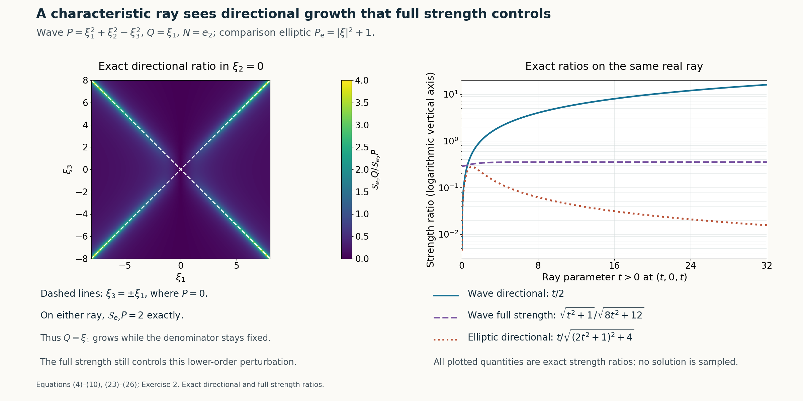

# Characteristic rays and directional strength

*Written by GPT-6.1 Sol (OpenAI), Ultra reasoning effort, October 2026. Self-checked by GPT-6.1 Sol (OpenAI). Original expression: CC0.*

Directional strength measures only the derivatives along one normal. A wave symbol can therefore have bounded directional strength on a characteristic ray even though its full strength grows there. A linear perturbation that grows along that ray supplies the real-frequency construction. Homogeneity gives a second route: either a flat function of the normal is already a solution, or a common directional zero yields the growing ray. These arguments also explain why elliptic symbols cannot meet the real-frequency hypothesis.

Read [Flat half-space solutions from real frequency rays](flat-half-space-solutions-from-real-frequency-rays.md). We use the preceding half-space theorem under its noncharacteristic real-frequency hypotheses. The homogeneous characteristic profile, polynomial rays and constant-operator restriction cases are proved here; a general characteristic-plane existence theorem is not an input.

The mathematical inputs are the internal proofs identified above and below. The Hörmander reference provides background comparison.

## A flat profile in a homogeneous characteristic half space

Write \(D=-i\partial\), \(D_N=-iN\cdot\partial_\xi\), and define
\[
\begin{gathered}
\mathcal S_NR(\xi)^2
=\sum_{j=0}^{\deg R}|D_N^jR(\xi)|^2,\\
S_R(\xi)^2=\sum_{|\alpha|\le\deg R}|\partial_\xi^\alpha R(\xi)|^2.
\end{gathered}
\tag{1}
\]
Terms of a zero polynomial are zero. The second norm is the full frozen-symbol strength, and its coordinate derivatives differ from D-derivatives only by factors of modulus 1. No derivatives of a spatial coefficient are included in either frozen-symbol norm.

Let P be homogeneous of degree \(m\ge 1\), let \(N\ne0\) be real, and suppose \(P(N)=0\). For \(s=x\cdot N\) and any smooth f of one variable, the chain rule for each monomial gives
\[
\begin{gathered}
P(D)[f(x\cdot N)]
\\
=P(N)(-i)^mf^{(m)}(x\cdot N)\\
=0.
\end{gathered}
\tag{2}
\]
Choose
\[
f(s)=
\begin{cases}e^{-1/s^2},&s>0,\\0,&s\le0.\end{cases}
\qquad v(x)=f(x\cdot N),\qquad a=0.
\tag{3}
\]
Every j-th positive-side derivative is a polynomial in \(s^{-1}\) times \(e^{-1/s^2}\), by induction using the product and chain rules. For each integer M, \(s^{-M}e^{-1/s^2}\to0\) as s↓0: putting \(r=1\)/s gives \(r^Me^{-r^2}\to0\), since its logarithm is \(M\log r-r^2\to-\infty\). The same argument with extra powers proves every jet flat. Defining the candidate derivative to be zero on \(s\le 0\), integration across 0 and induction prove f is classically smooth. Thus v is smooth, nonzero at every \(s>0\), and has exact support \(H_N\)={x:x·\(N\ge 0\)}. Equation (2) proves \(P(D)v=0\). This proves the homogeneous characteristic observation without the separate general characteristic-plane theorem.

## The wave symbol and the perturbations it sees

Take
\[
\begin{gathered}
P(\xi)=\xi_1^2+\xi_2^2-\xi_3^2,\\
N=e_2,\\
\mathcal S_{e_2}P(\xi)^2
=(\xi_1^2+\xi_2^2-\xi_3^2)^2+4\xi_2^2+4.
\end{gathered}
\tag{4}
\]
The last two terms are the first and second normal derivatives. In particular \(P_2(e_2)\)=1 and the directional denominator is never zero.

A linear symbol here means a homogeneous linear symbol, \(Q(\xi)=c_1\xi_1+c_2\xi_2+c_3\xi_3\), with complex constants. On the two real rays
\[
\begin{gathered}
\xi_\pm(t)=(t,0,\pm t),\\
\mathcal S_{e_2}P(\xi_\pm(t))=2,\\
Q(\xi_\pm(t))=t(c_1\pm c_3).
\end{gathered}
\tag{5}
\]
If \(|Q|/\mathcal S_{e_2}P\) is bounded, both \(c_1\)+\(c_3\) and \(c_1\)−\(c_3\) must vanish, hence \(c_1\)=\(c_3\)=0. Conversely, if \(Q=c_2\xi_2\), then
\[
\begin{gathered}
\mathcal S_{e_2}Q(\xi)^2
=|c_2|^2(\xi_2^2+1),\\
\mathcal S_{e_2}P(\xi)^2\ge4(\xi_2^2+1),
\\
\frac{\mathcal S_{e_2}Q}{\mathcal S_{e_2}P}\le |c_2|/2.
\end{gathered}
\tag{6}
\]
This proves both the scalar boundedness criterion and its full directional-strength version.

If Q depends on \(ξ_1\) or \(ξ_3\), at least one of \(c_1\)±\(c_3\) is nonzero. Since \(\mathcal S_{e_2}Q\ge|Q|\), (5) gives an unbounded directional ratio. Its order 1 is at most the order 2 of P. The actual half-space theorem therefore supplies, for any ε>0,
\[
\begin{gathered}
(P(D)+a(x)Q(D))v=0,\\
\operatorname{supp}v=\operatorname{supp}a=\{x:x_2\ge0\},
\\
\sup|a|<\varepsilon .
\end{gathered}
\tag{7}
\]
The coefficient's exact support is a proved addition to the printed subset conclusion.

The resulting operator can indeed be chosen of constant full strength. Direct differentiation gives
\[
\begin{gathered}
S_P(\xi)^2=|P(\xi)|^2+4|\xi|^2+12,\\
S_Q(\xi)^2=|c\cdot\xi|^2+|c|^2.
\end{gathered}
\tag{8}
\]
Here \(|c|^2=|c_1|^2+|c_2|^2+|c_3|^2\), and Cauchy–Schwarz gives
\[
S_Q(\xi)^2\le |c|^2(|\xi|^2+1)\le\frac{|c|^2}{4}S_P(\xi)^2.
\tag{9}
\]
At each fixed x the derivative vector of \(P+a(x)Q\) is the vector of P plus a(x) times that of Q. Pad the degree 1 vector with its zero degree 2 entries. The Euclidean triangle and reverse triangle inequalities imply, on choosing \(\sup|a|\,|c|\le1\),
\[
\begin{gathered}
\frac12S_P(\xi)\le S_{P+a(x)Q}(\xi)\le\frac32S_P(\xi)
\\
\text{for all }x,\xi.
\end{gathered}
\tag{10}
\]
Thus all frozen operators are uniformly equivalent to P and to one another. The quadratic principal symbol is also unchanged, since Q has degree 1. This argument does not infer a directional bound from the full-strength bound: (5) already proves that the directional bound fails for these Q.

## Homogeneous common zeros give a higher-degree perturbation

Let \(P\ne0\) be homogeneous of degree \(m\ge 1\), \(N\ne0\) real, and let the integer k satisfy \(0\le k\le m\). This range makes the prescribed perturbation degree \(m-k\) a nonnegative polynomial degree. Suppose the exceptional condition fails, meaning that there is \(\xi^0\in\mathbb R^n\setminus\{0\}\) with
\[
D_N^jP(\xi^0)=0\qquad(0\le j\le k).
\tag{11}
\]
We prove the common-zero theorem with nonnegative polynomial degree, including its homogeneous characteristic alternative.

If \(P(N)=0\), (2)–(3) give the required solution with \(a=0\) for any nonzero homogeneous Q of degree \(m-k\). For example choose \(Q(\xi)=(\xi\cdot N)^{m-k}\), taking the zeroth power to be 1. This is enough for the printed support inclusion for a; we do not claim exact support of a in this zero-coefficient branch.

Now assume \(P(N)\ne0\). The top normal derivative is the nonzero constant \((-i)^m m!P(N)\), so (11) forces \(k<m\). Let
\[
\begin{gathered}
\ell(\xi)=\frac{\xi\cdot\xi^0}{|\xi^0|^2},\\
Q(\xi)=\ell(\xi)^{m-k},\\
Q(\xi^0)=1 .
\end{gathered}
\tag{12}
\]
Homogeneity of each derivative gives, for \(t\ge 1\),
\[
\begin{gathered}
\mathcal S_NP(t\xi^0)^2
\\
=\sum_{j=k+1}^m t^{2(m-j)}|D_N^jP(\xi^0)|^2\\
\le C_P^2\,t^{2(m-k-1)},\\
C_P^2=\sum_{j=k+1}^m|D_N^jP(\xi^0)|^2>0 .
\end{gathered}
\tag{13}
\]
The strict positivity follows from the top derivative, so there is no zero-denominator ambiguity. On the same ray,
\[
\begin{gathered}
\mathcal S_NQ(t\xi^0)\ge |Q(t\xi^0)|=t^{m-k},
\\
\frac{\mathcal S_NQ(t\xi^0)}{\mathcal S_NP(t\xi^0)}
\ge t/C_P\longrightarrow\infty.
\end{gathered}
\tag{14}
\]
The actual half-space theorem applies with the original m and the chosen degree \(m-k\). It gives smooth v,a with the required equation, exact half-space support for v and supported a; in this noncharacteristic branch a can also have exact support and arbitrarily small global norm.

The polynomial-degree assertion requires \(k\le m\) when a nonzero perturbing polynomial of order \(m-k\) is requested. Without it the literal assertion can ask for negative order. For example,
\[
\begin{gathered}
P(\xi_1,\xi_2)=\xi_1^2,\\
m=2,\\
N=e_2,\\
k=3,\\
\xi^0=e_2
\end{gathered}
\tag{15}
\]
satisfies (11), while no nonzero polynomial can have order \(m-k\)=−1. This explains the nonnegative-degree qualification in the theorem. In the noncharacteristic branch the exceptional implication is automatically true for \(k\ge m\), because the top normal derivative is nonzero; no false positive instance arises there.

## The first-order example and independent operator replacement

For the first-order model, take the two-variable symbols
\[
\begin{gathered}
P(\xi_1,\xi_2)=\xi_2,\\
Q(\xi_1,\xi_2)=\xi_1,\\
N=e_2.
\\
\mathcal S_{e_2}P^2=\xi_2^2+1,\\
\mathcal S_{e_2}Q^2=\xi_1^2.
\end{gathered}
\tag{16}
\]
At (t,0) the ratio is t, \(P_1(e_2)\)=1, and both degrees are 1. Consequently the actual half-space construction proves exactly the printed first-order equation, and more precisely gives
\[
\begin{gathered}
D_2v+aD_1v=0,\\
\operatorname{supp}v=\operatorname{supp}a=\{x_2\ge0\},
\\
\sup|a|<\varepsilon .
\end{gathered}
\tag{17}
\]
There is no square on the \(D_2\) in this statement.

Now let \(B(D_2,\ldots,D_n)\) be any constant coefficient operator independent of \(D_1\), and let
\[
B_0(\tau)=B(\tau,0,\ldots,0).
\tag{18}
\]
For a function of only (\(x_1\),\(x_2\)), all terms involving a derivative \(D_j\) with \(j\ge 3\) vanish, so B acts exactly as \(B_0(D_2)\). Extending a two-variable construction independently of the other variables preserves smoothness and exact support \(\{x_2\ge0\}\).

If \(B_0\) has degree \(d\ge 1\), its leading coefficient is nonzero, and the two-variable operator \(P(\xi)=B_0(\xi_2)\) has \(P_d(e_2)\ne0\). At (t,0),
\[
\begin{gathered}
\mathcal S_{e_2}P(t,0)^2
\\
=\sum_{j=0}^d|(-i)^jB_0^{(j)}(0)|^2\\
=:C_B^2>0,\\
\mathcal S_{e_2}Q(t,0)=t,\\
Q=\xi_1.
\end{gathered}
\tag{19}
\]
Thus the half-space construction applies, including to every positive power of \(D_2\). If \(B_0\)≡0, choose \(v=f(x_2)\) from (3) and \(a=0\); both Bv and \(D_1v\) vanish.

It remains to prove the case \(B_0\)=\(C\ne 0\), whose degree 0 does not fit the order 1 perturbation hypothesis. This case has an explicit construction. Fix any \(\delta>0\). For \(s>0\) put
\[
\begin{gathered}
a(s)=\delta e^{-1/s^2},\\
g(s)=a(s)^{-1},\\
v(x_1,s)=\exp[-g(s)^2-iC\,g(s)x_1],
\end{gathered}
\tag{20}
\]
and put \(a=v=0\) for \(s\le 0\). Then \(D_1v=-Cg(s)v\), and hence
\[
(C+a(s)D_1)v=0\qquad(s>0).
\tag{21}
\]
Each positive-side derivative of g is g times a polynomial in \(s^{-1}\), with δ fixed. Every mixed derivative of v is therefore a finite sum bounded on \(|x_1|\le M\), \(0<s\le1\) by
\[
\begin{gathered}
|\partial_{x_1}^r\partial_s^jv|\\
\le C_{r,j,M}\,g^{A_{r,j}}s^{-B_{r,j}}
 \exp[-g^2+|C|Mg]\\
\le C'_{r,j,M}\,g^{A_{r,j}}s^{-B_{r,j}}e^{-g^2/2}
\end{gathered}
\tag{22}
\]
for sufficiently small s. The powers A,B are finite nonnegative integers. The last bound is smaller than every positive power of s: with \(g=\delta^{-1}e^{1/s^2}\), the negative term \(-g^2/2\) dominates \(A\log g+B\log(1/s)\) and every further logarithmic power loss. Thus all mixed jets extend by zero, locally uniformly in \(x_1\); the same integration and induction argument used after (3) proves a,v are smooth and flat at \(s=0\). Every interior v is a nonzero exponential, and every interior a is positive, so both supports are exactly the half space. Equation (21) holds globally after extension. Also \(\sup a\le\delta\). This completes the constant coefficient independent-operator replacement, including its degree 0 case. No corresponding arbitrary variable coefficient replacement is asserted.

## Why ellipticity prevents the real-frequency hypothesis

Let \(P\ne0\) have degree \(m\ge 0\) and be elliptic, meaning \(P_m(\omega)\ne0\) on the real unit sphere. Compactness and continuity give a positive number c such that
\[
\begin{gathered}
|P_m(\omega)|\ge c\\
(|\omega|=1),\\
|P_m(\xi)|\ge c|\xi|^m.
\end{gathered}
\tag{23}
\]
For \(m\ge 1\) the lower terms are \(O(|\xi|^{m-1})\), so there is \(R\ge 1\) such that
\[
|P(\xi)|\ge(c/2)|\xi|^m\qquad(|\xi|\ge R).
\tag{24}
\]
For \(m=0\) the same bound holds directly with P constant. If \(\deg Q\)≤m, its finitely many normal derivatives obey
\[
\mathcal S_NQ(\xi)\le C_Q(1+|\xi|)^m.
\tag{25}
\]
Since \(\mathcal S_NP\ge|P|\), (24)–(25) bound the directional ratio outside the ball. On the ball, ellipticity also gives \(P_m(N)\ne0\) for every real \(N\ne0\), and the top normal derivative is the nonzero constant \((-i)^mm!P_m(N)\). Thus \(\mathcal S_NP\ge m!|P_m(N)|>0\) globally. A continuous numerator is bounded on the compact ball. Combining both regions proves
\[
\begin{gathered}
\sup_{\xi\in\mathbb R^n}
\frac{\mathcal S_NQ(\xi)}{\mathcal S_NP(\xi)}<\infty\\
\text{whenever P is elliptic and }\deg Q\le m.
\end{gathered}
\tag{26}
\]
This proves that the first real-frequency hypothesis cannot hold in the elliptic case. It does not assert uniqueness for arbitrary smooth elliptic operators; the compact elliptic counterexample remains compatible with this obstruction.

**Figure 1.** Exact wave symbol \(P=\xi_1^2+\xi_2^2-\xi_3^2\), linear \(Q=\xi_1\), normal \(N=e_2\). Left: the complete directional ratio \(|\xi_1|/\sqrt{(\xi_1^2-\xi_3^2)^2+4}\) in the slice \(\xi_2=0\), with both exact characteristic lines indicated and equal Euclidean axis scales. Right: along \((t,0,t)\), the wave directional ratio \(t/2\), the full-strength ratio \(\sqrt{t^2+1}/\sqrt{8t^2+12}\), and the directional ratio \(t/\sqrt{(2t^2+1)^2+4}\) for the comparison elliptic symbol \(P_{\mathrm e}=|\xi|^2+1\). The right vertical axis is logarithmic, and \(t>0\) is used there. All three plotted quantities are exact polynomial-strength ratios evaluated numerically, rather than asymptotic replacements. The general elliptic bound is proved in equation (23)–equation (26). Neither assembled solution nor coefficient is sampled. Equations: equation (4)–equation (10), equation (23)–equation (26), Exercise 2. 

## Exercises with complete solutions

**Exercise 1 (the characteristic flat profile).** Take \(P(\xi_1,\xi_2)=\xi_1^2\) and N=\(e_2\). Verify directly that \(v=f(x_2)\) has exact half-space support and is killed by \(P(D)\). Explain why this does not prove the corresponding statement for a general nonhomogeneous characteristic symbol.

**Solution.** All \(x_1\) derivatives of v vanish, so \(D_1^2v=0\). The explicit f in (3) is smooth, positive for \(x_2\)>0 and zero for \(x_2\)≤0, so its support is exactly the closed half space. For a nonhomogeneous symbol lower-degree terms may survive on f. For example \(P=\xi_1^2+1\) gives \(P(D)f=f\) rather than 0. The general characteristic-plane existence theorem therefore has not been replaced by this elementary homogeneous argument.

**Exercise 2 (full strength and normal strength differ).** In the wave example take Q=\(ξ_1\). Compute the ratio along \(\xi(t)=(t,0,t)\) for both directional and full strengths.

**Solution.** The directional strengths are \(\mathcal S_{e_2}Q=t\) and \(\mathcal S_{e_2}P=2\), so the ratio is t/2. The full strengths are \(S_Q=\sqrt{t^2+1}\) and \(S_P=\sqrt{8t^2+12}\). Their ratio tends to 1/√8 and is bounded globally by (9). This is exactly why a full-strength comparison does not exclude the normal construction.

**Exercise 3 (construct the perturbing homogeneous symbol).** For the same wave P, N=\(e_2\) and \(k=1\), use \(\xi^0=(1,0,1)\). Find Q from (12), and check the growth orders in (13)–(14).

**Solution.** Both P(ξ^0) and \(D_NP(ξ^0)\) vanish. The selected functional is \(\ell(\xi)=(\xi_1+\xi_3)/2\), and \(m-k\)=1, so \(Q=\ell\). On tξ^0 the directional strength of P is 2, while Q equals t. Therefore its ratio is at least t/2. The prescribed degree is \(m-k\)=1, exactly as required. The second normal derivative of P has modulus 2 and supplies \(C_P\)=2.

**Exercise 4 (a negative-order request cannot be literal).** Check the example in (15). Why does it require the polynomial-order qualification \(0\le k\le m\)?

**Solution.** P does not depend on \(ξ_2\). Its positive-order normal derivatives are identically zero, and P(\(e_2\))=0. Thus \(e_2\) is a nonzero common zero of all derivatives through \(k=3\). The literal degree requested is 2−3=−1, while every nonzero polynomial has a nonnegative degree. The corrected meaningful-degree statement assumes \(k\le m\); the explicit characteristic solution is still valid independently of that degree request.

**Exercise 5 (a first-order equation and a higher-power replacement).** Verify the directional hypotheses for \(D_2+aD_1\) and for \(D_2^r+aD_1\), with any positive integer r.

**Solution.** For P=\(ξ_2\), the squared denominator at \(ξ_2\)=0 is 1 and Q=\(ξ_1\) has directional strength|\(ξ_1\)|. For P=\(ξ_2^r\), at \(ξ_2\)=0 only its r-th normal derivative survives, with modulus r!, so the denominator is r!. Both ratios become unbounded as \(ξ_1\)→∞. The leading normal value is 1, and \(\deg Q=1\) is at most r. Thus both are applications of the actual half-space theorem, with \(r=1\) giving the printed first-order example and \(r\ge 2\) giving the separate replacement.

**Exercise 6 (a constant operator also fits the replacement).** Let \(B_0\)=\(C=1\)+i and δ=1 in (20). Compute the modulus of v for real \(x_1\) and prove that it remains flat at \(s=0\) on bounded \(x_1\) intervals.

**Solution.** Since \(-iC=1-i\), \(|v|=\exp(-g^2+gx_1)\), where \(g=e^{1/s^2}\). For \(|x_1|\le M\) and \(g\ge2M\), this is at most \(e^{-g^2/2}\). Each mixed derivative adds only finite powers of g and \(s^{-1}\), as (22) proves. Those powers are absorbed by the same negative quadratic exponential, which is smaller than every s power. Thus all mixed jets are flat locally uniformly in \(x_1\), while the interior function never vanishes. Directly \(D_1v=−(1+i)gv\), so \((C+aD_1)v=0\).

## References

- Internal half-space construction: [Flat half-space solutions from real frequency rays](flat-half-space-solutions-from-real-frequency-rays.md#statement-and-normalized-windows), equations (1)–(36), with its noncharacteristic normal, degree and unbounded directional-strength hypotheses; the construction proves exact support, all boundary jets flat and an arbitrarily small coefficient.
- [Hörmander] Lars Hörmander, *The Analysis of Linear Partial Differential Operators II: Differential Operators with Constant Coefficients*, Springer, 1983.
- The homogeneous characteristic profile, wave-ray estimates, common-zero perturbation, two-variable first-order and positive-power models, constant-operator restriction and elliptic obstruction are proved in this lesson, equations (2)–(26) and Exercises 1–6.
