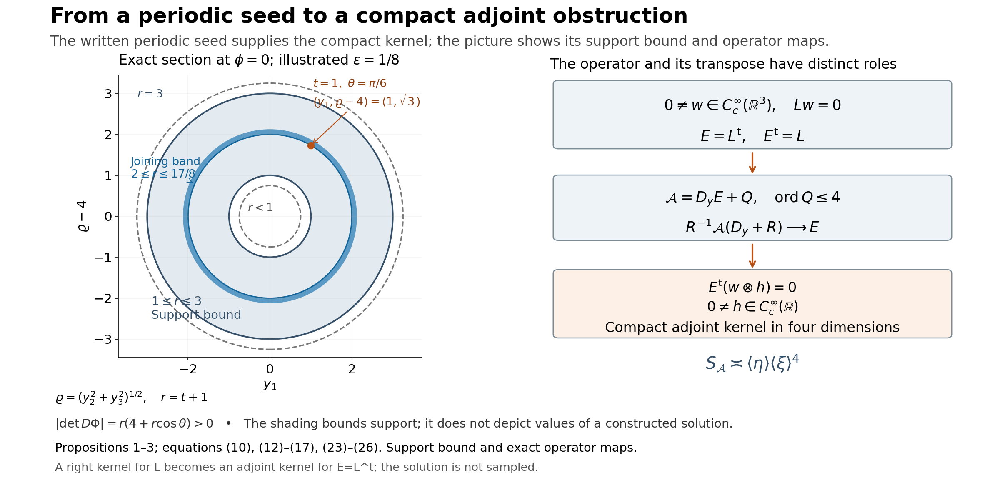

# Compact elliptic kernels and adjoint obstructions

*Written by GPT-6.1 Sol (OpenAI), Ultra reasoning effort, October 2026. Self-checked by GPT-6.1 Sol (OpenAI). Original expression: CC0.*

A smooth solution supported on one side of a plane can be reflected and joined to a second copy. Periodicity in the two tangential variables then turns the bounded normal support into compact support in ordinary three-dimensional space. The joining error is removable by a smooth zeroth-order coefficient wherever the joined solution is nonzero. Ellipticity survives that correction and an exterior patch. This proof applies those steps to the actual written periodic one-sided seed below, producing a compact elliptic kernel and the corrected adjoint localization obstruction.

Read [Periodic flat solutions and uniform integer frequencies](periodic-flat-solutions-and-uniform-integer-frequencies.md). We use Theorem 1 of the periodic-flat-solution lesson, including global coefficient smallness and its two-sided nonzero single-mode germ. Reflection, compact joining, the Euclidean embedding, exterior elliptic patch and bilinear transpose obstruction are proved here. The additional power-frequency calculations establish algebraic window conditions only; their general nonuniqueness application is a separate result.

Basic references are [Grubb] and [Hörmander]. Their bibliographic entries are below; every argument used from a prerequisite is identified above.

## The periodic seed used for gluing

Write \(D_j=-i\partial_j\), \(x'=(x_1,x_2)\in\mathbb T^2=(\mathbb R/2\pi\mathbb Z)^2\), and \(t=x_3\in\mathbb R\). Set
\[
\begin{gathered}
p(\xi)=(\xi_1^2+\xi_2^2+\xi_3^2)^2-\frac12\xi_1^4,
\\
q(\xi)=\xi_2^4.
\end{gathered}
\tag{1}
\]
Both symbols have real coefficients and order four. For real \(\xi\),
\[
p(\xi)\ge\frac12|\xi|^4,
\qquad 0\le q(\xi)\le|\xi|^4.
\tag{2}
\]

**Written seed.** The periodic seed theorem, applied with c*=1/4 and any fixed prescribed boundary order, supplies \(u,a\in C^\infty(\mathbb T^2\times\mathbb R)\) satisfy
\[
\begin{gathered}
(p(D)+a(x',t)q(D))u=0,
\\
u(x',t)=0\ (t\le0),
\\
\sup|a|<\frac14.
\end{gathered}
\tag{3}
\]
It also supplies some \(k=(k_1,k_2)\in\mathbb Z^2\), \(0<\epsilon<1/4\), and smooth complex \(v\) give a common plane-wave germ on both sides of \(t=1\):
\[
\begin{gathered}
u(x',t)=e^{ik\cdot x'}v(t),\\
v(1)=1,\\
\operatorname{Re}v(t)>\frac12
\\
(|t-1|<2\epsilon).
\end{gathered}
\tag{4}
\]
The two-sided interval in (4) is part of the actual seed theorem, equation (3) of [Periodic flat solutions and uniform integer frequencies](periodic-flat-solutions-and-uniform-integer-frequencies.md) and equation (30) of [Periodic flat solutions and uniform integer frequencies](periodic-flat-solutions-and-uniform-integer-frequencies.md). The nonzero single-mode tail begins below 1/2 and contains \(t=1\) on both sides. Multiplication by a fixed nonzero complex scalar gives \(v(1)=1\); continuity gives the strict real-part bound. No dilation changes the integer periods.

## Reflection, joining, and a smooth correction

**Proposition 1 (compact normal support from the written seed).** Under(3)–(4), there are periodic smooth \(U,A,B\) such that \(U\not\equiv0\),
\[
\begin{gathered}
\operatorname{supp}U\subset\mathbb T^2\times[0,2],
\\
L_0U=0,
\\
L_0=p(D)+Aq(D)-B,
\end{gathered}
\tag{5}
\]
and the principal symbol obeys
\[
\begin{gathered}
\operatorname{Re}(p(\xi)+A(x',t)q(\xi))
\ge\frac14|\xi|^4
\\
(\xi\in\mathbb R^3).
\end{gathered}
\tag{6}
\]
Only a support bound is asserted; no filled support set is inferred.

**Proof.** Let \(Tf(x',t)=\overline{f(-x',2-t)}\), where the tangential minus signs act on the torus. This is an antilinear map. Differentiating, and remembering that complex conjugation changes the sign of \(i\), gives \(D_jT=TD_j\). Thus, because \(p,q\) have real coefficients,
\[
\begin{gathered}
u^\sharp=Tu,\\
a^\sharp=Ta,
\\
(p(D)+a^\sharp q(D))u^\sharp=0.
\end{gathered}
\tag{7}
\]
The original solution vanishes for \(t\le0\); its reflected conjugate vanishes for \(t\ge2\). On the germ in (4),
\[
u^\sharp(x',t)=e^{ik\cdot x'}\overline{v(2-t)}.
\tag{8}
\]
The same tangential phase is the reason for conjugating as well as reflecting.

Here is an explicit cutoff convention used throughout the proof. Let \(b(s)=e^{-1/s}\) for \(s>0\) and \(b(s)=0\) otherwise, and put \(h(s)=b(s)/(b(s)+b(1-s))\). The denominator is positive everywhere; \(h\) is smooth, lies in \([0,1]\), and equals zero for \(s\le0\) and one for \(s\ge1\). Smoothness of \(b\) at zero follows because each derivative on \(s>0\) is \(e^{-1/s}\) times a polynomial in \(1/s\), which tends to zero faster than every power. Set
\[
\begin{gathered}
\psi(t)=1-h((t-1)/\epsilon),\\
U=\psi u+(1-\psi)u^\sharp,
\\
A=\psi a+(1-\psi)a^\sharp.
\end{gathered}
\tag{9}
\]
For \(t\le1\) the equation for \(u\) holds unchanged; for \(t\ge1+\epsilon\) the reflected equation holds unchanged. Consequently the smooth residual \(F=(p(D)+Aq(D))U\) satisfies
\[
\operatorname{supp}F\subset\mathbb T^2\times[1,1+\epsilon].
\tag{10}
\]
In a neighbourhood of this band, both germs in (4) and(8) apply. There
\[
\begin{gathered}
U\\
=e^{ik\cdot x'}\bigl(\psi(t)v(t)+(1-\psi(t))\overline{v(2-t)}\bigr),\\
\operatorname{Re}\bigl(\psi v+(1-\psi)\overline{v(2-t)}\bigr)>\frac12.
\end{gathered}
\tag{11}
\]
Thus \(U\) has no zero there. Choose a smooth real \(\rho(t)\) equal to one near \([1,1+\epsilon]\), with support in \((1-\epsilon/2,1+3\epsilon/2)\). This interval is contained in the germ where both factors used in(11) are defined. The same explicit \(h\), with affine arguments at the interval endpoints, supplies \(\rho\). Define \(B=\rho F/U\) in that nonzero region and extend it by zero outside. The support of \(\rho\) stays strictly inside the region, so the extension is smooth. Also \(BU=F\) everywhere, proving the equation in(5).

For \(t\le0\), \(U=u=0\); for \(t\ge2\), \(U=u^\sharp=0\). All boundary derivatives vanish because these are smooth functions that vanish on the corresponding closed half-spaces. At \(t=1\), \(U=e^{ik\cdot x'}\ne0\). Finally \(|A|\le\sup|a|<1/4\), since the coefficients in its definition are real and nonnegative. Apply(2) to obtain(6). The zeroth-order term \(B\) changes no principal coefficient. \(\square\)

## An exact embedding and an elliptic exterior patch

**Proposition 2 (a compact elliptic kernel in three dimensions).** Under the same seed hypothesis, there is a smooth fourth-order operator \(L\) on \(\mathbb R^3\) and \(0\ne w\in C_c^\infty(\mathbb R^3)\) such that \(Lw=0\) and the real part of the principal symbol of \(L\) is positive for every nonzero real covector.

**Proof.** Use \(\theta=x_1\), \(\phi=x_2\), and the open normal interval \((-1/4,9/4)\). Define
\[
\begin{gathered}
\Phi(\theta,\phi,t)\\
=\bigl((t+1)\sin\theta,
(4+(t+1)\cos\theta)\cos\phi,
(4+(t+1)\cos\theta)\sin\phi\bigr).
\end{gathered}
\tag{12}
\]
Put \(r=t+1\) and \(\varrho=4+r\cos\theta\). Then \(3/4<r<13/4\) and \(\varrho>3/4\). The determinant for the ordered variables \((\theta,\phi,t)\) is
\[
\begin{gathered}
\det D\Phi=-r\varrho,
\\
|\det D\Phi|=r(4+r\cos\theta)>0.
\end{gathered}
\tag{13}
\]
For a point \(y\) in the image, recover the coordinates by
\[
\begin{gathered}
\varrho=(y_2^2+y_3^2)^{1/2},\\
r=(y_1^2+(\varrho-4)^2)^{1/2},\\
t=r-1,
\end{gathered}
\tag{14}
\]
and by the circle-valued angles determined by
\[
\begin{gathered}
(\sin\theta,\cos\theta)=\frac{(y_1,\varrho-4)}r,
\\
(\cos\phi,\sin\phi)=\frac{(y_2,y_3)}{\varrho}.
\end{gathered}
\tag{15}
\]
These formulas give a smooth inverse with values in \(\mathbb T^2\times(-1/4,9/4)\), avoiding any claim that a real-valued angle is globally continuous. They also characterize the open image \(W\) by \(3/4<r(y)<13/4\). This condition forces \(\varrho>3/4\), so all denominators are positive. Thus \(\Phi\) is a diffeomorphism onto \(W\).

Define \(w(y)=U(\Phi^{-1}y)\) on \(W\) and extend by zero. The support bound in(5) places its support in the image of \(\mathbb T^2\times[0,2]\), a compact subset of \(W\). The extension is smooth because \(U\) is zero on normal neighbourhoods of both endpoints of the larger coordinate interval. It is nonzero at the image of \(t=1\). In particular,
\[
\operatorname{supp}w\subset\{y:1\le r(y)\le3\}\Subset W.
\tag{16}
\]
The torus shell here bounds the support; the argument does not identify its exact support.

Push \(L_0\) forward by this diffeomorphism: define \(R f=(L_0(f\circ\Phi))\circ\Phi^{-1}\). The ordinary chain rule shows that \(R\) is a fourth-order differential operator with smooth coefficients on \(W\), and \(Rw=0\). For a real covector \(\eta\) at \(y=\Phi(x)\), its principal symbol is exactly
\[
\begin{gathered}
R_4(y,\eta)=(L_0)_4(x,(D\Phi_x)^T\eta),
\\
\operatorname{Re}R_4(y,\eta)\ge\frac14|(D\Phi_x)^T\eta|^4>0
\\
(\eta\ne0).
\end{gathered}
\tag{17}
\]
The last inequality uses invertibility in(13). This is ellipticity under a coordinate change; no general invariance of constant strength under coordinate changes is used.

Choose \(0\le\chi\le1\) smooth with compact support in \(W\), equal to one on a neighbourhood of the compact set in(16). For example, on \(W\) take
\[
\begin{gathered}
\chi(y)\\
=h(16(r(y)-13/16))h(16(51/16-r(y))).
\end{gathered}
\tag{18}
\]
Its support lies in \(13/16\le r\le51/16\), strictly inside \(W\), and its value is one when \(7/8\le r\le25/8\). Thus extension by zero is smooth, including every coefficient of \(\chi R\). Now define globally
\[
L=\chi R+(1-\chi)\Delta^2.
\tag{19}
\]
Here \(\chi R\) means multiplication after applying \(R\); it introduces no extra coefficient derivatives in this formula. Its principal real part is \(\chi\operatorname{Re}R_4+(1-\chi)|\eta|^4\), strictly positive at every \(\eta\ne0\). On the region where \(\chi=1\), the equation follows from \(Rw=0\). Elsewhere \(w\) vanishes on a neighbourhood, since \(\chi=1\) near its entire support. Hence \(Lw=0\) everywhere. \(\square\)

**Figure 1.** The left panel is the \(\phi=0\) section of (12), with axes \(y_1,\varrho-4\). Its annulus bounds support and is not a sampled solution. The illustrated joining width is \(\epsilon=1/8\), and the marked point is exactly \((1,4+\sqrt3,0)\) in three dimensions. The right panel records the actual witness maps (20), (25) and (26); it illustrates their operator roles and does not sample the solution. Equations: Propositions 1–3, (10), (12)–(17), (23)–(26).

## The transpose that gives the required localization obstruction

Proposition 2 now constructs a compact kernel from the periodic seed. The next proposition applies to that operator and also to any smooth fourth-order elliptic operator with such a kernel. It distinguishes a right kernel from the compact adjoint kernel required by the solvability theorem.

**Proposition 3 (compact right kernel to compact adjoint obstruction).** Let \(L\) be any smooth fourth-order elliptic differential operator on \(\mathbb R^3\), and suppose \(0\ne w\in C_c^\infty(\mathbb R^3)\) and \(Lw=0\). Use the bilinear formal transpose, without conjugating coefficients, and put \(E=L^t\). For any smooth differential operator \(Q(x,D_x)\) of order at most four, define on \(\mathbb R^3_x\times\mathbb R_y\)
\[
\mathcal A=D_y E(x,D_x)+Q(x,D_x).
\tag{20}
\]
Its coefficients are independent of \(y\). Then \(\mathcal A\) has constant strength, the same as \(D_y\Delta_x^2\), and \(E\) is a nonzero positive-scalar localization at vertical infinity. The transpose of that localization has a nonzero compact smooth kernel. Also \(E\) itself has a nonzero compact adjoint kernel in three dimensions.

**Proof.** If \(L=\sum_{|\alpha|\le4}\ell_\alpha(x)D_x^\alpha\), integration by parts gives \(E=\sum(-D_x)^\alpha(\ell_\alpha(x)\,\cdot)\). A second transposition returns \(L\). Its order-four symbol is \(E_4(x,\xi)=L_4(x,-\xi)=L_4(x,\xi)\), because the degree is even. Thus \(E\) is elliptic.

Fix a compact coefficient set \(K\subset\mathbb R^3\). For every multiindex of length at most four, form the finite derivative vectors
\[
\begin{gathered}
\mathbf a(x,\xi)=(\partial_\xi^\alpha E(x,\xi))_\alpha,
\\
\mathbf b(x,\xi)=(\partial_\xi^\alpha Q(x,\xi))_\alpha.
\end{gathered}
\tag{21}
\]
Ellipticity and compactness give constants \(c,C,M>0\) such that, with \(\langle\xi\rangle=(1+|\xi|^2)^{1/2}\),
\[
\begin{gathered}
c\langle\xi\rangle^4\le\|\mathbf a\|\le C\langle\xi\rangle^4,
\\
\|\mathbf b\|\le M\|\mathbf a\|
\\
(x\in K).
\end{gathered}
\tag{22}
\]
For completeness, the upper bound follows by finitely many coefficient bounds. For large \(|\xi|\), a positive uniform lower bound for \(|E_4(x,\xi)|\) on the compact unit-covector bundle dominates the order-three remainder. On bounded frequencies the order-four derivatives are constants in \(\xi\), and their vector cannot vanish for any \(x\) because the principal polynomial is nonzero. Its positive minimum on \(K\) supplies the remaining lower bound. The bound for \(\mathbf b\) follows by the same upper estimate and division by the lower estimate for \(\mathbf a\).

The full symbol of \(\mathcal A\) is \(\eta E(x,\xi)+Q(x,\xi)\). Its derivatives in \(\eta\) of order at least two vanish. Therefore its strength norm has the exact expression
\[
S_{\mathcal A}(x,\xi,\eta)^2
=\|\eta\mathbf a+\mathbf b\|^2+\|\mathbf a\|^2.
\tag{23}
\]
In particular \(\|\mathbf a\|\le S_{\mathcal A}\) and

\(|\eta|\|\mathbf a\|\le\|\eta\mathbf a+\mathbf b\|+\|\mathbf b\|\le(1+M)S_{\mathcal A}\).
Squaring these two inequalities and adding proves the lower estimate below; the triangle inequality proves the upper estimate:
\[
\begin{gathered}
\frac{\langle\eta\rangle\|\mathbf a\|}{\sqrt{1+(1+M)^2}}
\\
\le S_{\mathcal A}
\\
\le C_M\langle\eta\rangle\|\mathbf a\|
\\
\asymp_K\langle\eta\rangle\langle\xi\rangle^4.
\end{gathered}
\tag{24}
\]
The reference polynomial \(\eta(|\xi|^2)^2\) has strength norm exactly \(\langle\eta\rangle S_{(|\xi|^2)^2}(\xi)\), with its second factor comparable to \(\langle\xi\rangle^4\) by the same elliptic argument. Thus every frozen polynomial of \(\mathcal A\) has that strength. Taking a compact set containing any chosen pair of base points proves constant strength on the whole space, and the estimates are locally uniform.

For \(R>0\), a real vertical shift gives
\[
\begin{gathered}
R^{-1}\mathcal A(x,D_x,D_y+R)\\
=E(x,D_x)+R^{-1}\bigl(D_yE(x,D_x)+Q(x,D_x)\bigr)\\
\longrightarrow E(x,D_x).
\end{gathered}
\tag{25}
\]
Convergence holds in every local smooth coefficient seminorm. The normalization \(1/R\) is positive and the limit is nonzero, so this is a localization at infinity with this convention. If derivative-norm normalization is used instead, the limit is a positive constant multiple of \(E\), which has the same kernel for its transpose.

Take any \(0\ne h\in C_c^\infty(\mathbb R)\). Since \(E^t=L\) acts only in \(x\),
\[
\begin{gathered}
E^t(w\otimes h)=(Lw)\otimes h=0,
\\
0\ne w\otimes h\in C_c^\infty(\mathbb R^4).
\end{gathered}
\tag{26}
\]
This proves failure of the compact-adjoint injectivity condition for the localization. In three dimensions \(E^tw=Lw=0\) already gives the adjoint obstruction. \(\square\)

The orientation in(20) is explicit. For arbitrary \(Q\), neither \(\mathcal A(w\otimes h)=0\) nor \(\mathcal A^t(w\otimes h)=0\) follows from \(Lw=0\). The assertion just proved concerns the transpose of the localization \(E\). It supplies the intended obstruction in the localization example without silently identifying a right kernel and an adjoint kernel of the same operator.

**Corollary 4 (a smooth datum that cannot be solved).** Under the hypothesis of Proposition 3, choose any relatively compact open \(Y\subset\mathbb R^3\) containing \(\operatorname{supp}w\) in its interior. Then \(E\) has constant strength on \(Y\), and the equation \(Eu=\overline w\) has no distributional solution on \(Y\).

**Proof.** Ellipticity gives the same strength comparison as(22), hence constant strength. If \(u\in\mathcal D'(Y)\) solved the equation, testing against the compact smooth \(w\) and using the bilinear transpose would give
\[
\begin{gathered}
0\\
=\langle u,E^tw\rangle\\
=\langle Eu,w\rangle
\\
=\int_Y|w(x)|^2\,dx>0,
\end{gathered}
\tag{27}
\]
a contradiction. In particular the smooth compact adjoint obstruction space for a compact set containing \(\operatorname{supp}w\) has positive dimension. For the actual L,w from Proposition 2 this is a completed elliptic nonsolvability witness. Its proof uses the bilinear transpose convention and no unproved kernel identification. \(\square\)

## Additional exact frequency families whose general theorem application remains open

The following additional computations prove algebraic hypotheses of the general complex-frequency theorem for the displayed families. The actual seed above has its own completed explicit uniform proof. These additional general-family conclusions still require full the general complex-frequency criterion, including its alternative real-frequency branch, and do not follow from the compact witness.

**Proposition 5 (the parameter interval in the first power-frequency family).** Let \(a>1\) and \(1\le b\le2a\) be integers. Define
\[
\begin{gathered}
p_a(\xi)=(\xi_1^2+\xi_2^2+\xi_3^2)^a-\xi_1^{2a}/2,
\\
q_b(\xi)=\xi_2^b,
\\
N=e_3.
\end{gathered}
\tag{28}
\]
If \(b>(3a+1)/2\), select real exponents
\[
\begin{gathered}
\frac{3a+1}{4a}<\beta<\frac b{2a}\le1,
\\
\frac{2a\beta-a}{a+1}<\gamma<\frac{2a\beta-a-1}{a-1}.
\end{gathered}
\tag{29}
\]
The second interval is nonempty because \(4a\beta>3a+1\). Its upper endpoint is smaller than \(2\beta-1<1\). For \(s>1\), set
\[
\begin{gathered}
\zeta_s=(s^\beta,(s^2-s^{2\beta})^{1/2},-is),
\\
T_s=s^\gamma,
\\
K_s=s^{a(2\beta-1-\gamma)}.
\end{gathered}
\tag{30}
\]
These data satisfy all the normalized polynomial and scale normalized window and scale hypotheses of the general complex-frequency criterion.

**Proof.** The components of \(\operatorname{Re}\zeta_s\) are real, and \(\operatorname{Im}\zeta_s=-sN\), as required. Direct substitution gives \(p_a(\zeta_s)=-s^{2a\beta}/2\), \(q_b(\zeta_s)=(s^2-s^{2\beta})^{b/2}\), and
\[
\begin{gathered}
\frac{p_a(\zeta_s+T_szN)}{p_a(\zeta_s)}
\\
=1-2s^{a(1+\gamma-2\beta)}
\bigl(s^{\gamma-1}z^2-2iz\bigr)^a,\\
\frac{q_b(\zeta_s+T_szN)}{q_b(\zeta_s)}=1.
\end{gathered}
\tag{31}
\]
All convergences here hold coefficientwise in the finite polynomial space, hence uniformly on every compact complex \(z\)-set. The exponent \(a(1+\gamma-2\beta)\) is negative, so the first ratio tends to one. The ratio \(p_a(\zeta_s)/q_b(\zeta_s)\) tends to zero because \(2a\beta<b\). Multiplying the difference of the two ratios by \(K_s\) cancels its power of \(s\), leaving the limit
\[
r(z)=-2(-2iz)^a.
\tag{32}
\]
Its derivative is a nonconstant polynomial because \(a>1\), so it takes some value with negative imaginary part: explicitly solve \(r'(z)=-i\). The remaining two scale conditions are
\[
\begin{gathered}
T_s/K_s=s^{(a+1)\gamma-2a\beta+a}\longrightarrow\infty,
\\
\frac{T_sK_s}{1+s}\asymp
s^{2a\beta-a-1-(a-1)\gamma}\longrightarrow\infty,
\end{gathered}
\tag{33}
\]
by(29). These verify the claimed hypotheses.

For this family of power scales, the two inequalities on \(\gamma\) are compatible exactly when \(4a\beta>3a+1\). Combining that with \(2a\beta<b\) gives \(b>(3a+1)/2\), the resulting threshold. This necessity concerns this power-scale construction; it is not a universal uniqueness theorem below the threshold. When \(a=2\) the eligible integer is \(b=4\). The first strict lower-order example occurs at \(a=4,b=7\). \(\square\)

For the fourth-order symbols(1), a convenient exact choice is
\[
\begin{gathered}
\beta=15/16,\\
\gamma=2/3,\\
T_s=s^{2/3},\\
K_s=s^{5/12},\\
T_s/K_s=s^{1/4},\\
T_sK_s/(1+s)\asymp s^{1/12},
\\
r(z)=8z^2.
\end{gathered}
\tag{34}
\]
This supplies concrete algebraic data for the future periodic construction. It does not establish that construction.

**Proposition 6 (bounded integer replacement for the explicit fourth-order data).** In(30) with the choices(34), replace the first two components of \(\zeta_s\) by nearest integers, leaving its third component unchanged. The rounded data still satisfy every normalized polynomial and scale hypothesis, with the same \(T_s,K_s\) and \(r(z)=8z^2\).

**Proof.** Write the rounded vector as \(\widehat\zeta_s=\zeta_s+(\delta_1,\delta_2,0)\), where the real errors have absolute values at most \(1/2\). Put \(c_s=1/p(\zeta_s)=-2s^{-15/4}\) and \(b_s=1/q(\zeta_s)=s^{-4}(1-s^{-1/8})^{-2}\). At the shifted complex point the sum of coordinate squares is
\[
S_s(z)=T_s^2z^2-2isT_sz.
\tag{35}
\]
Its coefficients are \(O(s^{5/3})\). The tangential displacement changes this sum by
\[
\begin{gathered}
d_s\\
=2s^{15/16}\delta_1+2(s^2-s^{15/8})^{1/2}\delta_2+\delta_1^2+\delta_2^2\\
=O(s).
\end{gathered}
\tag{36}
\]
Consequently the polynomial difference \(p(\widehat\zeta_s+T_szN)-p(\zeta_s+T_szN)\) equals \(2S_sd_s+d_s^2-\tfrac12[(s^{15/16}+\delta_1)^4-s^{15/4}]\). Every coefficient is \(O(s^{45/16})\): the square-sum terms are \(O(s^{8/3})\) and \(O(s^2)\), and the fourth-power difference is \(O(s^{45/16})\). For \(q\), the difference is independent of \(z\) and is \(O(s^3)\). Multiplying gives coefficientwise bounds, uniform in the rounding errors,
\[
\begin{gathered}
K_sc_s[p(\widehat\zeta_s+T_szN)-p(\zeta_s+T_szN)]
\\
=O(s^{-25/48}),\\
K_sb_s[q(\widehat\zeta_s)-q(\zeta_s)]
\\
=O(s^{-7/12}).
\end{gathered}
\tag{37}
\]
In particular \(c_sp(\widehat\zeta_s)=1+o(1)\) and \(b_sq(\widehat\zeta_s)=1+o(1)\), so neither denominator vanishes for large \(s\). For clarity, if \(f_s(z)=c_sp(\zeta_s+T_szN)\) and \(\Delta_s(z)\) is its rounded perturbation, exact renormalization reads
\[
\begin{gathered}
\frac{p(\widehat\zeta_s+T_szN)}{p(\widehat\zeta_s)}-f_s(z)
\\
=\frac{\Delta_s(z)-f_s(z)\Delta_s(0)}{1+\Delta_s(0)}.
\end{gathered}
\tag{38}
\]
The coefficients of \(f_s\) stay bounded, and(37) makes \(K_s\) times the right side tend to zero coefficientwise. The normalized \(q\)-ratio is still identically one, since \(q\) is independent of the third coordinate. Thus the normalized limits and \(r=8z^2\) are unchanged. The ratio \(p(\widehat\zeta_s)/q(\widehat\zeta_s)\) has the same zero limit as the original ratio; the two scale conditions depend only on \(T_s,K_s\) and the unchanged imaginary component \(-sN\). Finally the tangential exponential of each individual rounded mode is \(2\pi\)-periodic. This establishes the algebraic rounding step, not uniform transport estimates or assembly of a periodic solution. \(\square\)

**Proposition 7 (an explicit linear limiting polynomial).** The fourth-order data, including the bounded tangential integer replacement in Proposition 6, can be changed so that the limiting polynomial is \(r(z)=-iz\), while retaining both scale conditions.

**Proof.** Let \(f_s(z)=p(\widehat\zeta_s+T_szN)/p(\widehat\zeta_s)\). Proposition 6 and the exact expansion of(31) give, coefficientwise,
\[
\begin{gathered}
K_s(f_s(z)-1)=r_s(z)+e_s(z),\\
r_s(z)=8z^2+8is^{-1/3}z^3-2s^{-2/3}z^4,\\
\|e_s\|_{\mathrm{coeff}}=O(s^{-25/48}).
\end{gathered}
\tag{39}
\]
Choose \(z_0=-i/16\), so that \(r'(z_0)=-i\), and put
\[
\begin{gathered}
\lambda_s=s^{-1/48},\\
\zeta_s^\ast=\widehat\zeta_s+T_sz_0N,\\
T_s^\ast=\lambda_sT_s=s^{31/48},\\
K_s^\ast=K_s/\lambda_s=s^{7/16}.
\end{gathered}
\tag{40}
\]
The first two components remain integers. The imaginary third component is \(-s-T_s/16\), so it remains in the required half-line and has magnitude asymptotic to \(s\). Also \(f_s(z_0)\to1\), so the new normalizing denominator is nonzero for large \(s\). The normalized \(q\)-ratio is still one. The new normalized difference, multiplied by \(K_s^\ast\), is exactly
\[
\begin{gathered}
\frac{r_s(z_0+\lambda_sz)-r_s(z_0)+e_s(z_0+\lambda_sz)-e_s(z_0)}
{\lambda_s f_s(z_0)}\\
\longrightarrow -iz.
\end{gathered}
\tag{41}
\]
Indeed, finite polynomial Taylor expansion makes the first difference divided by \(\lambda_s\) tend coefficientwise to \(r'(z_0)z\). The error after division is \(O(s^{-25/48+1/48})=O(s^{-1/2})\), since evaluation and substitution at the fixed \(z_0\) and bounded \(\lambda_s\) are bounded linear maps on this finite polynomial space. The unmultiplied difference tends to zero because \(K_s^\ast\to\infty\). The ratio of the new base values \(p/q\) still tends to zero, since it is the old ratio times \(f_s(z_0)\). Finally
\[
\begin{gathered}
T_s^\ast/K_s^\ast=s^{5/24}\longrightarrow\infty,\\
\frac{T_s^\ast K_s^\ast}{1+s+T_s/16}\asymp s^{1/12}\longrightarrow\infty.
\end{gathered}
\tag{42}
\]
The new \(r'\) is the constant \(-i\), with negative imaginary part. Every algebraic hypothesis is therefore retained with a linear limiting polynomial. This calculation still supplies no assembled solution or uniform transport estimate. \(\square\)

## Fully solved exercises

**Exercise 1 (the correct change of covector).** Derive the transpose in(17), and explain why the inverse matrix is not substituted there.

**Solution.** For the test phase \(f(y)=e^{iy\cdot\eta}\), the pulled-back phase is \(e^{i\Phi(x)\cdot\eta}\). Its differential in \(x\) is \((D\Phi_x)^T\eta\). Every top derivative in \(L_0\) therefore evaluates its principal symbol on that covector. Terms in which a derivative hits \(D\Phi\) have lower order. An inverse matrix would describe the pullback in the opposite direction, and would compute a different symbol. This directly proves(17) with the stated domains.

**Exercise 2 (a compact support bound does not fill the shell).** Determine what Proposition 2 proves about the zero set of \(w\), and locate a point where it proves nonvanishing.

**Solution.** The proof gives \(w=0\) outside the closed shell \(1\le r\le3\), and smooth flat extension across its two boundary tori. It gives no general assertion of nonvanishing in the remaining shell. At \(t=1\), \(U=e^{ik\cdot x'}\), so every point \(\Phi(\theta,\phi,1)\) has nonzero value. In particular \(\Phi(0,0,1)=(0,6,0)\) has value one. The entire image of the joining torus \(r=2\) is thus disjoint from the zero set, without an assertion about other radii.

**Exercise 3 (why a lower-order term does not repair the limiting obstruction).** In Proposition 3 choose \(Q=1\). Calculate \(\mathcal A^t(w\otimes h)\) and compare it with the transpose of the vertical localization.

**Solution.** Since \(E\) is independent of \(y\), \((D_yE)^t=E^t(-D_y)=L(-D_y)\). Thus \[
\begin{gathered}
\mathcal A^t(w\otimes h)\\
=(Lw)\otimes(-D_yh)+w\otimes h\\
=w\otimes h\ne0.
\end{gathered}
\] The vertical localization is still \(E\), whose transpose kills \(w\otimes h\) by(26). The localization condition in the global solvability theorem can fail even though this specific function does not belong to the adjoint kernel of \(\mathcal A\) itself.

**Exercise 4 (the second frequency model and its order restriction).** Let \(a>1\), \(1\le b\le a\) be integers, \(p(\xi)=(\xi_1-i\xi_2)^a-\xi_1^{b-1}\), \(q(\xi)=\xi_1^b\), and \(N=(0,1)\). Derive the parameter threshold of the second power-frequency family.

**Solution.** Set \(\zeta_s=(s,-is)\), \(T_s=s^\gamma\), and \(K_s=s^{b-1-a\gamma}\). Then \(p(\zeta_s)=-s^{b-1}\), \(q(\zeta_s)=s^b\), and the normalized polynomial difference is \(-s^{a\gamma-b+1}(-iz)^a\). It tends to zero if \(\gamma<(b-1)/a\), while multiplication by \(K_s\) gives \(r(z)=-(-iz)^a\). Again \(r'\) has a value with negative imaginary part. The two scale conditions require

\(\gamma>(b-1)/(a+1)\) and \(\gamma<(b-2)/(a-1)\).

These are compatible exactly when \(a<2b-3\), equivalently \(b>(a+3)/2\). Under the stipulated \(b\le a\), the second upper bound is less than \((b-1)/a\), so it already gives the normalized polynomial convergence. The lower bound is positive. The ratio \(p(\zeta_s)/q(\zeta_s)=-1/s\) tends to zero. Thus all algebraic hypotheses of the general complex-frequency criterion hold. The restriction \(b\le a\) preserves its required inequality \(\operatorname{ord}q\le\operatorname{ord}p\); silently permitting \(b=a+1\) would violate that theorem's order hypothesis. The first strict lower-order case is \(a=6,b=5\). These computations establish the algebraic window conditions. A general nonuniqueness conclusion for this family is a separate theorem.

**Exercise 5 (a witness datum with the bilinear convention).** Why is the datum in Corollary 4 \(\overline w\), rather than necessarily \(w\)?

**Solution.** With the bilinear distribution pairing, \(\langle w,w\rangle=\int w^2\) may vanish for a nonzero complex function. The datum \(\overline w\) instead gives \(\langle\overline w,w\rangle=\int|w|^2>0\). Coefficients are still transposed without conjugation, so \(E^tw=Lw=0\) is exactly the needed identity. Conjugation of the chosen datum does not change the transpose convention.

## References

- [Grubb] Gerd Grubb, *Distributions and Operators*, Graduate Texts in Mathematics 252, Springer, 2009. [Author's lecture notes](https://web.math.ku.dk/~grubb/distribution.htm).
- [Hörmander] Lars Hörmander, *The Analysis of Linear Partial Differential Operators II: Differential Operators with Constant Coefficients*, Springer, 1983.
