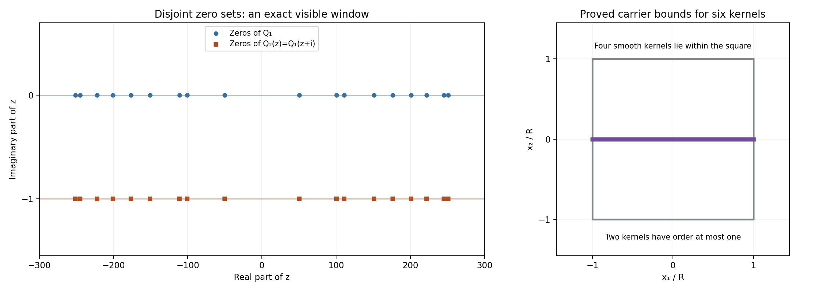

# Compact multipliers and exponential solutions of convolution systems

*Written by GPT-6.1 Sol (OpenAI), October 2026. Self-checked by the writing AI. Public domain (CC0).*

A common zero of the Fourier transforms of compact kernels gives a common exponential solution. Does every system with a nonzero solution have such a zero? In at least two variables the answer is no. We construct six kernels whose system has a nonzero smooth solution even though every exponential, and every exponential polynomial, fails.

Assume distributions, compact convolution and holomorphic functions. The exact compact-support Fourier theorem is Theorem CF2.1 in [Compact Fourier division and multiplicity-sensitive annihilators](../AN02-L122.html). The weighted existence theorem used to construct an entire graph is Theorem W2 in [Solving the Cauchy–Riemann equations with a weight](../AN02-L144.html). Both lessons supply full proofs. The [complete proof](#complete-proof) supplies every additional argument, including functional separation and the topology of the entire-function ideal.

Basic references are D. I. Gurevich's *Counterexamples to a problem of L. Schwartz*, the compact Fourier lesson, and the weighted Cauchy–Riemann lesson. The summable sinc product in [Zero-free cones turn slow decrease into reciprocal bounds](../AN02-L178.html) provides another useful comparison. The product here has a different spacing and a stronger quantitative decay estimate.

## 1. What the exponential test can tell us

We use the conventions
\[
 \widehat\mu(z)=\langle\mu(t),e^{-it\cdot z}\rangle,
 \qquad D=-i\partial,\qquad z\in\mathbb C^n.
 \tag{E1.1}
\]
For any complex frequency \(\zeta\),
\[
 (\mu*e^{ix\cdot\zeta})(x)
   =e^{ix\cdot\zeta}\widehat\mu(\zeta).
 \tag{E1.2}
\]
Compact support makes this convolution well defined. A common zero of several transforms therefore gives a common exponential solution. If their common zero set is empty, no exponential works.

There is a further consequence: no nonzero exponential polynomial works. Such a function is a finite sum of polynomials times exponentials. Choose a real direction that separates its finitely many distinct frequencies. Apply constant coefficient differential operators that kill all but one frequency. Further derivatives reduce its polynomial to a nonzero constant. These operations commute with compact convolution, so an exponential polynomial solution would produce an exponential solution. Proposition 4.2 of the complete proof gives the full isolation argument.

This test excludes a particular class of solutions. To construct a solution outside that class, we need a different tool.

## 2. A system that defeats the exponential zero test

**Theorem 2.1.** In every dimension \(n\ge2\), there are six compact distributions \(\mu_1,\ldots,\mu_6\) for which
\[
 \mu_j*u=0\quad(j=1,\ldots,6)
 \tag{E2.1}
\]
has a smooth global solution with \(u(0)=1\), while it has no nonzero exponential polynomial solution. The solution extends to an entire function.

Here is the construction. Choose
\[
 \alpha=\frac34,\qquad \beta=\frac78,\qquad
 A=\frac1{16},\qquad d=1,\qquad
 a_j=A j^{-1/\beta},\qquad R=\sum_{j\ge1}a_j\le\frac12.
 \tag{E2.2}
\]
Form the two entire multipliers
\[
 Q_1(z)=\prod_{j\ge1}\frac{\sin(a_jz)}{a_jz},
 \qquad Q_2(z)=Q_1(z+i).
 \tag{E2.3}
\]
The value of each factor at zero is one. The zeros of the first product are real; the zeros of the second have imaginary part \(-1\). Thus the products have no common zero. Both are transforms of smooth compact functions supported in \([-R,R]\). Their real-axis decay is strong enough to absorb any growth of the form \(\exp(B|z|^\alpha)\), because \(\alpha<\beta\).

The geometric part produces an entire function \(g\) on \(\mathbb C\) and an entire function \(f_2\) on \(\mathbb C^2\). Put
\[
 f_1(z_1,z_2)=z_2-g(z_1),\qquad
 f_2(v,g(v))=e^{-v^2}.
 \tag{E2.4}
\]
Both \(g\) and \(f_2\) grow at most like \(\exp(B|z|^\alpha)\), with their own constants. The graph restriction in (E2.4) is never zero. Consequently \(f_1\) and \(f_2\) have no common zero. Propositions 5.2 and 5.3 of the complete proof construct these functions using the weighted Cauchy–Riemann theorem.

Define six transforms by
\[
 \begin{aligned}
 h_1&=f_1Q_1(z_1),&h_2&=f_1Q_2(z_1),\\
 h_3&=f_2Q_1(z_1)Q_1(z_2),&
 h_4&=f_2Q_1(z_1)Q_2(z_2),\\
 h_5&=f_2Q_2(z_1)Q_1(z_2),&
 h_6&=f_2Q_2(z_1)Q_2(z_2).
 \end{aligned}
 \tag{E2.5}
\]
Each is a compact-distribution transform. The first two kernels have order at most one and support in \([-R,R]\times\{0\}\). The last four are smooth functions supported in \([-R,R]^2\). For the first two, multiplication by \(z_2\) produces \(D\delta_0\) in the second coordinate. This is why the assertion concerns distributions rather than six measures.

At a hypothetical common zero, the first two equations force \(f_1=0\). In each coordinate one of \(Q_1,Q_2\) is nonzero. Select the corresponding product among the last four equations; it forces \(f_2=0\). This contradicts (E2.4). Thus the exponential test excludes every exponential polynomial.

The existence of a different solution follows from the proper ideal discussed next. For \(n>2\), tensor each two-dimensional kernel with point distributions in the extra coordinates and make the solution independent of those coordinates. Theorem 6.1 of the complete proof verifies the whole assertion.

## 3. Why an ideal can produce a solution

Let \(\mathcal A\) be the algebra of entire functions of finite exponential type. For each positive integer \(m\), let
\[
 E_m=\{F:\|F\|_m<\infty\},\qquad
 \|F\|_m=\sup_{z\in\mathbb C^2}|F(z)|e^{-m|z|},
 \qquad \mathcal A=\bigcup_{m\ge1}E_m.
 \tag{E3.1}
\]
Give this union its finest locally convex topology making every inclusion \(E_m\to\mathcal A\) continuous. This topology allows all finite exponential types.

The graph construction has the crucial property
\[
 1\notin\overline{f_1\mathcal A+f_2\mathcal A}.
 \tag{E3.2}
\]
Because every \(h_j\) in (E2.5) belongs to this ideal, the closure of the ideal they generate also misses 1. Functional separation gives a continuous linear functional \(L\) vanishing on that closure, with \(L(1)=1\). Set
\[
 U(w)=L_z(e^{iw\cdot z}).
 \tag{E3.3}
\]
This is entire. Moreover,
\[
 (\mu_j*U)(w)
   =L_z(e^{iw\cdot z}h_j(z))=0,\qquad U(0)=1.
 \tag{E3.4}
\]
Lemma 3.2 of the complete proof proves the interchange of the distributional pairing and \(L\), including the necessary derivative estimates. The real restriction of \(U\) is the required solution.

Why does (E3.2) hold? The graph is bounded after the substitution \(v=\sqrt z\) in the curved region
\[
 G=\{z:\operatorname{Re}z>|z|^{3/4}\}.
 \tag{E3.5}
\]
On that graph, an ideal element \(F=f_1A_1+f_2A_2\) becomes \(e^{-z}a(z)\), where \(a\) has growth of order at most \(1/2\) on \(G\). A suitable small neighborhood in \(\mathcal A\) controls \(F-1\) on the graph by growth of order \(2/3\). A maximum-principle argument then forces \(F\) to be small at one fixed large positive point, while the neighborhood condition forces it to be close to 1 there. These demands contradict one another. Proposition 5.4 of the complete proof supplies the constants and proves that the neighborhood controls every exponential type.

The empty common zero set and the proper ideal are separate facts. The first excludes exponentials; the second produces the nonzero solution.

## 4. Four worked examples

**Example 1. A smaller support and a larger imaginary shift.** Take \(\beta=3/4,A=1/32,d=2\). Then
\[
 a_j=\frac1{32}j^{-4/3},\qquad
 R=\frac1{32}\sum_{j\ge1}j^{-4/3}\le\frac18,\qquad
 c=(\log4)\,128^{-3/4}.
 \tag{E4.1}
\]
The support bound follows from \(R\le A/(1-\beta)\). The first multiplier has zeros \(32\pi m j^{4/3}\), with \(m\ne0\). The shifted multiplier has exactly those real parts and imaginary part \(-2\). If \(\rho\) is the nonnegative smooth kernel of the first multiplier, the second kernel is \(e^{2t}\rho(t)\). Its integral need not be one; its carrier stays within the same interval. The Fourier sign is checked directly:
\[
 \int e^{2t}\rho(t)e^{-itz}\,dt
      =\int\rho(t)e^{-it(z+2i)}\,dt=Q_1(z+2i).
 \tag{E4.2}
\]

**Example 2. An empty zero set can also mean there are no solutions.** On the real line take
\[
 \mu_1=\delta_1-2\delta_0,\qquad
 \mu_2=D\delta_0-b\delta_0.
 \tag{E4.3}
\]
Their transforms are \(e^{-iz}-2\) and \(z-b\). A common zero exists exactly when \(e^{-ib}=2\). For \(b=i\log2\), the function \(u(x)=e^{-x\log2}\) solves both equations: translation by one multiplies it by 2, and \(Du=i(\log2)u\). For \(b=0\), the second equation says \(u'=0\). A smooth solution is constant; the first equation then says \(-u=0\). Only the zero solution remains. The same conclusion holds for distributions: if \(T'=0\), every compactly supported test function of integral zero is a derivative of another test function, so \(T\) is a constant distribution. Its first equation kills that constant. Thus an empty common zero set alone neither constructs nor guarantees a nonzero solution.

**Example 3. A polynomial graph gives visible distribution kernels.** Let \(g(z_1)=z_1^2\), \(f_1=z_2-z_1^2\), and \(f_2=1\). Use either multiplier from Example 1, with kernel \(\rho_\ell\). The transform \(h_\ell=f_1Q_\ell(z_1)\) comes from
\[
 \mu_\ell=\rho_\ell\otimes D\delta_0
              -D_1^2\rho_\ell\otimes\delta_0.
 \tag{E4.4}
\]
Indeed the transforms of the two terms are \(z_2Q_\ell(z_1)\) and \(z_1^2Q_\ell(z_1)\). Both physical terms are supported on \([-R,R]\times\{0\}\); the derivative in the second variable has order one. This example makes the Fourier conversion explicit. It is not the graph used in Theorem 2.1: here \(f_2=1\), so the generated ideal contains 1 and the proper-ideal argument cannot apply.

**Example 4. Choosing the separating point explicitly.** Let \(C_0\ge0\) be the bound for \(g(\sqrt z)\) on the closed region \(G\), and put
\[
 D_0=3\left(\frac{1+C_0}{4}\right)^{4/3},\qquad
 K=\frac{1+D_0}{\cos(3\pi/8)},\qquad
 X=[2(K+1)]^4,\qquad
 \eta=\frac18e^{-D_0X^{2/3}}.
 \tag{E4.5}
\]
The symbol \(D_0\) here is a positive scalar constant, not the differential operator \(D\). We have \(X>16\) and
\[
 \frac{KX^{3/4}}X=\frac{K}{2(K+1)}<\frac12,\qquad
 2e^{-X+KX^{3/4}}<2e^{-8}<\frac12,\qquad
 \eta e^{D_0X^{2/3}}=\frac18.
 \tag{E4.6}
\]
An ideal element lying within this neighborhood of 1 would therefore have modulus less than \(1/2\) and at least \(7/8\) at the same graph point. This explicit choice closes the contradiction without choosing a new neighborhood for each exponential type.

## 5. Exercises and full solutions

The first four exercises are worth 10 points each. The last four are worth 15 points each, for a total of 100 points.

### Exercise 1. Support, decay and zero coordinates — 10 points

Take \(\beta=4/5,A=1/20,d=3/2\). Compute the support bound, the decay constant \(c\), and both zero sets. Explain why zero is not a zero of either multiplier.

**Solution.** The spacing is \(a_j=(1/20)j^{-5/4}\). The support radius and decay constant satisfy
\[
 R=\frac1{20}\sum_{j\ge1}j^{-5/4}\le\frac14,\qquad
 c=(\log4)\,80^{-4/5}.
 \tag{E5.1}
\]
The first zero set is \(\{20\pi m j^{5/4}:m\in\mathbb Z\setminus\{0\},j\ge1\}\). The second is its translate by \(-3i/2\). The product at zero is 1. The shifted product at zero is
\[
 Q_2(0)=\prod_{j\ge1}\frac{\sinh(3a_j/2)}{3a_j/2}>0.
 \tag{E5.2}
\]
The factors have no zeros and their deviations from 1 are summable, so their convergent product is positive. Alternatively the exact zero-set theorem already excludes this point. Award 3 points for the support bound, 2 for \(c\), 3 for both zero sets, and 2 for the values at zero.

### Exercise 2. Which weight moves the zeros downward? — 10 points

Let \(Q=\widehat\rho\), where \(\rho\) is smooth and supported in \([-R,R]\). Identify the physical kernel of \(Q(z+id)\), including the sign of its weight. Prove that this change does not enlarge support. If \(\rho\ge0\), show that the new kernel is nonnegative.

**Solution.** Substitute the shifted argument:
\[
 Q(z+id)=\int\rho(t)e^{-it(z+id)}\,dt
       =\int e^{dt}\rho(t)e^{-itz}\,dt.
 \tag{E5.3}
\]
Thus the weight is \(e^{dt}\). It is smooth, strictly positive and never zero. Multiplication by it leaves the support exactly unchanged: the function vanishes on an open set before multiplication if and only if it vanishes there afterward. In particular both supports are contained in \([-R,R]\). Nonnegativity is also preserved. Award 5 points for the transform calculation and its sign, 3 for support, and 2 for positivity.

### Exercise 3. Removing every support loss — 10 points

Suppose one entire function \(H\) satisfies, for every \(\delta>0\), the compact Fourier growth condition for the box \([-R-\delta,R+\delta]^k\). Each application of the compact Fourier theorem yields a distribution \(\nu_\delta\). Show that there is one distribution supported in \([-R,R]^k\). Explain why a single value of \(\delta\) would not suffice.

**Solution.** All the transforms equal \(H\). Fourier uniqueness gives \(\nu_\delta=\nu_{\delta'}\) for every pair of positive values. Denote this common distribution by \(\nu\). Its support lies in every larger box, hence in their intersection:
\[
 \operatorname{supp}\nu
 \subset\bigcap_{\delta>0}[-R-\delta,R+\delta]^k
 =[-R,R]^k.
 \tag{E5.4}
\]
Equivalently any point outside the smaller box has one coordinate of modulus larger than \(R\); choosing a smaller positive \(\delta\) gives a neighborhood where \(\nu\) vanishes. A single growth bound yields only its one larger box. For example a point distribution at \(R+\delta/2\) in one coordinate fits that box but lies outside the desired box. Award 4 points for uniqueness, 4 for intersection or the neighborhood argument, and 2 for the counterexample to one fixed loss.

### Exercise 4. Why all four products are present — 10 points

Suppose \(Q_1,Q_2\) have no common zero and \(f_1,f_2\) have no common zero. Prove that the six functions in (E2.5) have no common zero. State the extra assertion that is needed to obtain a nonzero solution.

**Solution.** At a common zero \(z\), at least one of \(Q_1(z_1),Q_2(z_1)\) is nonzero. The first two equations then imply \(f_1(z)=0\). Select a nonzero multiplier in the second coordinate as well. The corresponding one of the four products multiplying \(f_2\) is nonzero, so its equation implies \(f_2(z)=0\). This contradicts the premise. All four products allow either of the two choices in each coordinate. A nonzero solution is obtained from the separate assertion \(1\notin\overline{f_1\mathcal A+f_2\mathcal A}\), together with the compact-transform construction and functional separation. Example 2 shows why absence of common zeros does not supply this assertion. Award 3 points for forcing \(f_1=0\), 4 for selecting the product and forcing \(f_2=0\), and 3 for identifying the extra condition.

### Exercise 5. Positive Levi eigenvalues without a uniform bound — 15 points

For \(M>0\), put \(\phi(z)=M(1+|z|^2)^p\) on \(\mathbb C^2\), with \(p=3/8\). Calculate its tangential and radial Levi eigenvalues. Prove strict positivity and determine whether the least eigenvalue has a positive global lower bound.

**Solution.** Write \(s=|z|^2\). Differentiating gives the Hermitian matrix
\[
 \left(\frac{\partial^2\phi}{\partial z_j\partial\bar z_\ell}\right)
 =Mp(1+s)^{p-1}I
      +Mp(p-1)(1+s)^{p-2}(\bar z_j z_\ell)_{j,\ell}.
 \tag{E5.5}
\]
The rank-one term is zero on the complex tangent space perpendicular to the radial direction and has eigenvalue \(s\) on that direction. Consequently the two eigenvalues are
\[
 \lambda_{\mathrm{tan}}=Mp(1+s)^{p-1},\qquad
 \lambda_{\mathrm{rad}}=Mp(1+s)^{p-2}(1+ps).
 \tag{E5.6}
\]
Both are positive for all \(s\ge0\). Since \(p<1\), their ratio is \((1+ps)/(1+s)\le1\), so the radial eigenvalue is the least. As \(s\to\infty\), it is asymptotic to \(Mp^2s^{p-1}\), which tends to zero. Thus the weight is strictly plurisubharmonic everywhere but has no positive uniform global lower eigenvalue. The general weighted theorem used in the proof permits this situation; replacing it by a theorem requiring a uniform lower bound would change the hypotheses. Award 5 points for the matrix, 5 for both eigenvalues, and 5 for positivity and the failed uniform bound.

### Exercise 6. The strict sector gap — 15 points

For \(\alpha=3/4\), \(\pi/4\le\theta\le3\pi/4\), and \(s=\sin(3\pi\alpha/4)\), prove
\[
 s\cos(\alpha(\theta-\pi))
   +\cos(\alpha\theta+\pi/2-\pi\alpha/4)
 =\sin(\alpha(\pi-\theta))\cos(3\pi\alpha/4)<0.
 \tag{E5.7}
\]
Give an explicit uniform negative upper bound. Explain the consequence for a polynomial factor times the exponential error ratio in the graph construction.

**Solution.** Set \(t=\alpha(\pi-\theta)\) and \(a=3\pi\alpha/4\). Then \(\cos(\alpha(\theta-\pi))=\cos t\), while the second cosine is \(\cos(a+\pi/2-t)=-\sin(a-t)\). The left side is
\[
 \sin a\cos t-\sin(a-t)=\cos a\sin t.
 \tag{E5.8}
\]
Here \(a=9\pi/16\), so \(\cos a<0\). Also \(3\pi/16\le t\le9\pi/16\). The sine on this interval has minimum \(\sin(3\pi/16)>0\): it increases up to \(\pi/2\), then decreases to \(\sin(9\pi/16)>\sin(3\pi/16)\). Thus the left side is at most \(-\varepsilon\), where
\[
 \varepsilon=-\cos(9\pi/16)\sin(3\pi/16)>0.
 \tag{E5.9}
\]
An error ratio bounded by \(Cr^N e^{-\varepsilon r^{3/4}}\) tends uniformly to zero as \(r\to\infty\), because \(N\log r-\varepsilon r^{3/4}\to-\infty\). This is the strict gap that allows the selected exponential term to dominate. Award 5 points for the identity, 6 for the interval and explicit gap, and 4 for uniform error decay.

### Exercise 7. How fast must the neighborhood shrink? — 15 points

Replace the factors \(e^{-m^4}\) in the absolutely convex neighborhood by \(e^{-m^q}\), where \(q>1\). On a graph with \(|Z(z)|\le\sqrt r+C_0\), calculate the resulting power of \(r\) in the evaluation bound. For which \(q\) can this bound be absorbed on \(\operatorname{Re}z=r^{3/4}\)?

**Solution.** For \(a\ge0\), maximize \(-t^q+at\) over \(t\ge0\). Its derivative vanishes at \(t=(a/q)^{1/(q-1)}\), and the maximum is
\[
 (q-1)(a/q)^{q/(q-1)}.
 \tag{E5.10}
\]
Use \(a=\sqrt r+C_0\le(1+C_0)\sqrt r\) for \(r\ge1\). The evaluation envelope is bounded by \(\exp(C_q r^\tau)\), with
\[
 \tau=\frac{q}{2(q-1)},\qquad
 C_q=(q-1)\left(\frac{1+C_0}{q}\right)^{q/(q-1)}.
 \tag{E5.11}
\]
For absorption by a constant times \(r^{3/4}\), we need \(\tau\le3/4\). Solving \(2q\le3(q-1)\) gives \(q\ge3\). Equality at \(q=3\) is allowed by enlarging the damping constant; \(q>3\) gives a strictly smaller power. The choice \(q=4\) gives \(2/3\). At \(q=2\), the power is 1, so this particular damping argument fails. This does not prove that no other neighborhood or proof could work. Award 5 points for maximization, 5 for the envelope, and 5 for the threshold with its exact interpretation.

### Exercise 8. Extra coordinates and polynomial frequencies — 15 points

Starting with the six two-dimensional kernels and the normalized entire solution, extend them to \(\mathbb R^n\), \(n>2\). Prove that the normalization and empty common zero set survive. Then give the full differential argument excluding exponential polynomial solutions.

**Solution.** Set
\[
 \widetilde\mu_j=\mu_j\otimes\delta_0^{\otimes(n-2)},\qquad
 \widetilde U(w)=U(w_1,w_2).
 \tag{E5.12}
\]
The point distributions evaluate the extra variables at zero in the convolution pairing. Hence \(\widetilde\mu_j*\widetilde U=(\mu_j*U)(w_1,w_2)=0\), and \(\widetilde U(0)=1\). The extended transforms are \(h_j(z_1,z_2)\), independent of the extra coordinates. An empty common zero set in the first two coordinates stays empty.

Suppose a nonzero exponential polynomial solution has distinct frequencies \(\zeta_1,\ldots,\zeta_s\). Choose a real vector \(v\) such that the numbers \(v\cdot\zeta_j\) are distinct. For each unequal pair, the forbidden real vectors lie in the kernel of a nonzero real linear form, obtained from a nonzero real or imaginary part of their difference. The product of these finitely many linear forms is a nonzero real polynomial. Such a polynomial cannot vanish on all real space: induction on the number of variables reduces this assertion to the root bound for a one-variable polynomial. Therefore an allowed \(v\) exists.

Select a term \(p_j(x)e^{ix\cdot\zeta_j}\) with \(p_j\ne0\). Apply
\[
 T_j=\prod_{\ell\ne j}
       (v\cdot D-v\cdot\zeta_\ell)^{\deg p_\ell+1}.
 \tag{E5.13}
\]
On each other frequency, its matching factor acts as a degree-lowering derivative and kills the polynomial. On the selected frequency, each factor acts on its polynomial as the nonzero scalar \(v\cdot(\zeta_j-\zeta_\ell)\) plus a degree-lowering derivative. The highest homogeneous part is multiplied by nonzero scalars, so the result is still nonzero. Choose a highest total-degree monomial \(x^\gamma\) in the remaining polynomial. Applying \((D-\zeta_j)^\gamma\) kills every other monomial of that total degree, kills all smaller degrees, and sends the chosen monomial to the nonzero constant \((-i)^{|\gamma|}\gamma!\) times its coefficient. Thus a nonzero exponential solution results. All these differential operators commute with compact convolution, so it would still solve the system. The empty common zero set excludes it. Award 4 points for the extension and normalization, 3 for the zero set and separating direction, 5 for differential isolation, and 3 for reduction to an exponential and the contradiction.

## References

- [Compact Fourier division and multiplicity-sensitive annihilators](../AN02-L122.html), Theorem CF2.1, the exact compact-support Fourier theorem and uniqueness.
- [Solving the Cauchy–Riemann equations with a weight](../AN02-L144.html), Theorem W2, weighted existence with its full proof.
- [Zero-free cones turn slow decrease into reciprocal bounds](../AN02-L178.html), Proposition 5.1, comparison with a geometrically spaced sinc product.
- D. I. Gurevich, *Counterexamples to a problem of L. Schwartz*, Functional Analysis and Its Applications 9 (1975), 116–120. [Original publication](https://www.mathnet.ru/eng/faa2235). Credit for the counterexample, the entire-graph construction and the six-generator idea. The complete proof and the exact linked lessons supply the required arguments.

## Complete proof

A compact convolution kernel has an entire Fourier transform. For a system, a common transform zero gives an exponential solution. The converse question is harder: can a system have other solutions when all common zeros have disappeared? We separate the algebraic zero test from the topological obstruction that produces a solution.

Basic references are Gurevich's *Counterexamples to a problem of L. Schwartz*, [Compact Fourier division and multiplicity-sensitive annihilators](../AN02-L122.html), and [Solving the Cauchy–Riemann equations with a weight](../AN02-L144.html). We use Theorem CF2.1 of the compact Fourier lesson and Theorem W2 of the weighted lesson, with their available full proofs. The geometric product in Proposition 5.1 of [Zero-free cones turn slow decrease into reciprocal bounds](../AN02-L178.html) explains the elementary convergence mechanism. Here a different spacing gives a quantitative subexponential bound. Sections 1–4 prove the algebraic construction and its precise ideal hypothesis. Section 5 constructs that ideal, and Section 6 gives the resulting counterexample in every dimension at least two.

The convention throughout is
\[
 \widehat\mu(z)=\langle\mu(t),e^{-it\cdot z}\rangle,\qquad
 D=-i\partial,\qquad
 \operatorname{sinc}w=\frac{\sin w}{w},\quad \operatorname{sinc}0=1.
 \tag{1.1}
\]

## 1. Two compact multipliers with disjoint zero sets

**Theorem 1.1.** Fix \(0<\beta<1\), \(A>0\), and \(d>0\). Set
\[
 a_j=A j^{-1/\beta},\qquad R=\sum_{j\ge1}a_j,\qquad
 c=(\log4)(A/4)^\beta,
 \tag{1.2}
\]
and define
\[
 Q_1(z)=\prod_{j\ge1}\operatorname{sinc}(a_jz),\qquad
 Q_2(z)=Q_1(z+id).
 \tag{1.3}
\]
The products define nonzero entire functions. For every \(z=x+iy\),
\[
 |Q_1(z)|\le4e^{R|y|-c|z|^\beta},\qquad
 |Q_2(z)|\le4e^{Rd}e^{R|y|-c|x|^\beta}.
 \tag{1.4}
\]
Their zero sets are exactly
\[
 Z_1=\{\pi m/a_j:j\ge1,\ m\in\mathbb Z\setminus\{0\}\},\qquad
 Z_2=Z_1-id.
 \tag{1.5}
\]
In particular they have no common zero. There is a nonnegative smooth function \(\rho\), supported in \([-R,R]\), with integral one, such that
\[
 \widehat\rho=Q_1,\qquad
 Q_2=\widehat{e^{dt}\rho(t)}.
 \tag{1.6}
\]
The support radius satisfies \(R\le A/(1-\beta)\).

**Proof.** The decreasing integral comparison gives
\[
 \sum_{j\ge1}j^{-1/\beta}
 \le1+\int_1^\infty t^{-1/\beta}\,dt=\frac1{1-\beta}.
 \tag{1.7}
\]
The sine series and \((2k+1)!\ge6(2k-2)!\), \(k\ge1\), imply
\[
 |\operatorname{sinc}w-1|\le |w|^2e^{|w|}/6.
 \tag{1.8}
\]
Because \(\sum a_j^2<\infty\), this estimate gives locally uniform convergence of the product: on each compact set the sum of the factor errors is finite, and a telescoping product bounds each tail error by the exponential of that sum minus one. Thus \(Q_1\) is entire and \(Q_1(0)=1\).

Both the integral formula for sinc and the elementary sine bound give
\[
 |\operatorname{sinc}(az)|
 \le e^{a|y|}\min\{1,(a|z|)^{-1}\}\quad(a>0,\ z\ne0).
 \tag{1.9}
\]
Indeed the integral formula is
\(\frac12\int_{-1}^{1}e^{-iat z}\,dt\). Also
\(|\sin(az)|^2=\sin^2(ax)+\sinh^2(ay)\le\cosh^2(ay)\le e^{2a|y|}\).
Let
\[
 N=\left\lfloor(A|z|/4)^\beta\right\rfloor.
 \tag{1.10}
\]
For \(1\le j\le N\), \(a_j|z|\ge4\). Applying the second bound to these \(N\) factors and the first bound to the others gives
\[
 |Q_1(z)|\le e^{R|y|}4^{-N}
 \le4e^{R|y|-(\log4)(A|z|/4)^\beta}.
 \tag{1.11}
\]
The case \(N=0\), including \(z=0\), is covered by the same last inequality. Replacing \(z\) by \(z+id\), using \(|y+d|\le|y|+d\) and \(|z+id|\ge|x|\), proves the other bound in (1.4).

Each factor has precisely the real zeros in (1.5). At a point that is not such a zero, choose a tail for which every error in (1.8) is below \(1/2\). The series of the corresponding logarithms converges absolutely, since \(|\log(1+w)|\le2|w|\) there. Its exponential is nonzero. A finite initial product is also nonzero. This proves the exact zero set, without inferring zero-freeness from numerical samples. A given finite zero belongs to only finitely many factors, because \(a_j|z|\ge\pi\) at a factor zero. Translation gives \(Z_2\), and the two horizontal lines containing these sets are disjoint.

The coarser bound \(|Q_1(z)|\le e^{R|y|}\) and Theorem CF2.1 give a unique distribution supported in \([-R,R]\). On the real axis (1.4) decreases faster than every inverse power. The inverse Fourier integral and every differentiated integral therefore converge absolutely and define a smooth function \(\rho\). Fourier uniqueness identifies this function with that compact distribution.

To verify positivity, let \(b_j(t)=(2a_j)^{-1}1_{[-a_j,a_j]}(t)\), and let \(\mu_M=b_1*\cdots*b_M\). These are nonnegative probability densities, with transforms equal to the finite products and support in \([-R,R]\). For any compact smooth test \(\phi\), Fourier inversion gives
\[
 \langle\mu_M,\phi\rangle
 =(2\pi)^{-1}\int_{\mathbb R}
       \prod_{j=1}^M\operatorname{sinc}(a_j\xi)\,
       \widehat\phi(-\xi)\,d\xi.
 \tag{1.12}
\]
The products have real-axis modulus at most one. Dominated convergence, with the integrable Schwartz transform of \(\phi\), makes this tend to \(\langle\rho,\phi\rangle\). Thus every nonnegative test has nonnegative pairing with \(\rho\); continuity of \(\rho\) makes it pointwise nonnegative. Its integral is \(Q_1(0)=1\). Finally the actual compact Fourier formula gives
\[
 Q_1(z+id)=\int_{-R}^R e^{dt}\rho(t)e^{-itz}\,dt,
 \tag{1.13}
\]
which proves (1.6). \(\square\)

For example, \(\beta=7/8\), \(A=1/16\), and \(d=1\) give \(R\le1/2\) and the explicit constant \(c=(\log4)64^{-7/8}\). Changing the support spacing from geometric decay to a summable power sequence is what makes the negative exponent in (1.4) dominate every smaller positive power.

**Lemma 1.2 (a quantitative tail).** Let \(P_K(z)\) be the first \(K\) factors of \(Q_1\). If \(a_{K+1}|z|\le1/2\), put
\[
 S_K(z)=
 \frac{e^{1/2}|z|^2A^2}{6(2/\beta-1)}K^{1-2/\beta}.
 \tag{1.14}
\]
When \(P_K(z)\ne0\),
\[
 \left|Q_1(z)/P_K(z)-1\right|\le e^{S_K(z)}-1.
 \tag{1.15}
\]
If \(S_K(z)\le1/2\), the last bound is at most \(2S_K(z)\).

**Proof.** Every tail argument has modulus at most \(1/2\). Estimate (1.8) and the decreasing integral comparison give
\[
 \sum_{j>K}|\operatorname{sinc}(a_jz)-1|
 \le \frac{e^{1/2}|z|^2A^2}{6}
              \int_K^\infty t^{-2/\beta}\,dt=S_K(z).
 \tag{1.16}
\]
A telescoping finite product bounds its distance from 1 by
\(\prod(1+|\varepsilon_j|)-1\le\exp(\sum|\varepsilon_j|)-1\).
Pass to the locally uniform product limit. For \(0\le s\le1/2\), comparison of the exponential series with the geometric series gives \(e^s-1\le s/(1-s)\le2s\). \(\square\)

## 2. Converting subexponential growth into compact transforms

**Lemma 2.1.** Suppose \(0<\alpha<\beta<1\), and \(F\) is entire on \(\mathbb C^k\), with
\[
 |F(z)|\le C\exp\!\left(B\sum_{\ell=1}^k|z_\ell|^\alpha\right)
 \tag{2.1}
\]
for fixed \(B,C>0\). Select either multiplier of Theorem 1.1 in every coordinate. Then
\[
 H(z)=F(z)\prod_{\ell=1}^k Q_{\epsilon_\ell}(z_\ell),
 \qquad \epsilon_\ell\in\{1,2\},
 \tag{2.2}
\]
is the transform of a smooth function supported in the exact box \([-R,R]^k\).

**Proof.** For \(x,y\in\mathbb R\), concavity gives \(|x+iy|^\alpha\le|x|^\alpha+|y|^\alpha\). For every \(\delta>0\) there are finite constants \(M_1,M_2\) with
\[
 B t^\alpha\le(c/2)t^\beta+M_1,\qquad
 B t^\alpha\le\delta t+M_2\quad(t\ge0).
 \tag{2.3}
\]
The differences tend to \(-\infty\) at infinity and are continuous, so their suprema are finite. Consequently (1.4) gives, with a constant depending on \(\delta\),
\[
 |H(x+iy)|\le C_\delta
 \exp\!\left((R+\delta)\sum_\ell|y_\ell|
                   -(c/2)\sum_\ell|x_\ell|^\beta\right).
 \tag{2.4}
\]
Theorem CF2.1 first gives a distribution supported in \([-R-\delta,R+\delta]^k\). All these applications give the same distribution by Fourier uniqueness. Intersecting the boxes over all \(\delta>0\) gives support in \([-R,R]^k\). Real-axis rapid decay in (2.4) makes the inverse Fourier integral smooth, including all derivative orders. \(\square\)

There is an important quantifier here: the loss \(\delta\) can be arbitrarily small, and its constant can change. One fixed larger box would not prove the exact smaller support.

**Proposition 2.2 (six compact transforms).** Let \(g\) be entire in one variable and \(f_2\) entire in two variables. Suppose both obey bounds of the form (2.1) for the same \(\alpha<\beta\), and put \(f_1(z)=z_2-g(z_1)\). Suppose \(f_1,f_2\) have no common zero. Define
\[
 \begin{aligned}
 h_1&=f_1Q_1(z_1),& h_2&=f_1Q_2(z_1),\\
 h_3&=f_2Q_1(z_1)Q_1(z_2),&
 h_4&=f_2Q_1(z_1)Q_2(z_2),\\
 h_5&=f_2Q_2(z_1)Q_1(z_2),&
 h_6&=f_2Q_2(z_1)Q_2(z_2).
 \end{aligned}
 \tag{2.5}
\]
Every \(h_j\) is a compact-distribution transform. Their common zero set is empty. The first two kernels have order at most one and support in \([-R,R]\times\{0\}\); the other four are smooth kernels supported in \([-R,R]^2\).

**Proof.** Lemma 2.1 gives smooth kernels \(\sigma_\ell\) with transform \(gQ_\ell\), supported in \([-R,R]\), and Theorem 1.1 gives smooth kernels \(\rho_\ell\) with transform \(Q_\ell\). Thus the first two actual kernels are
\[
 \mu_\ell=\rho_\ell\otimes D\delta_0-\sigma_\ell\otimes\delta_0,
 \qquad \ell=1,2.
 \tag{2.6}
\]
The sign in this formula follows from \(\widehat{D\delta_0}(z_2)=z_2\). The last four kernels follow directly from Lemma 2.1.

If all six functions vanished at a point, the first two and the absence of a common zero of \(Q_1,Q_2\) would force \(f_1=0\). In each coordinate at least one \(Q_\ell\) is nonzero. Among the last four products choose those two nonzero factors; their product forces \(f_2=0\). This contradicts the premise. \(\square\)

Only the empty-common-zero conclusion has been established here. It does not yet produce a nonzero solution of the six equations.

**Figure 1.** The left panel includes every zero of \(Q_1,Q_2\) with real part between \(-300\) and \(300\), for \(\beta=7/8,A=1/16,d=1\). Their imaginary parts are exactly 0 and \(-1\); the horizontal coordinates are \(16\pi m j^{8/7}\). The right panel uses the actual support radius \(R=\zeta(8/7)/16\) to normalize both physical coordinates. Its line and square are the proved carrier inclusions of Proposition 2.2, and need not be the exact supports. The nonzero solution uses (4.1), proved in Proposition 5.4. [Full-size image](../reproduce/L180/figures/multiplier-zeros-and-kernel-carriers.png), [vector drawing](../reproduce/L180/figures/multiplier-zeros-and-kernel-carriers.svg).

## 3. A proper ideal produces a solution directly

For \(b>0\), let \(E_b\) be the Banach space of entire functions on \(\mathbb C^k\) with norm
\[
 \|F\|_b=\sup_z|F(z)|e^{-b|z|}.
 \tag{3.1}
\]
Completeness follows because a norm Cauchy sequence converges locally uniformly to an entire function, with the same weighted uniform limit. Let \(\mathcal A=\bigcup_{m\ge1}E_m\), with its locally convex inductive limit topology. A linear map out of \(\mathcal A\) is continuous when all its restrictions to \(E_m\) are continuous. Products remain in \(\mathcal A\): \(E_bE_{b'}\subset E_{b+b'}\). We take closures of ideals in this specified topology.

**Lemma 3.1 (separation at the unit).** If \(I\) is a closed linear subspace of a locally convex space \(V\), and \(e\notin I\), there is a continuous complex linear functional \(L\) on \(V\), vanishing on \(I\), with \(L(e)=1\).

**Proof.** The Hausdorff locally convex quotient \(V/I\) has a continuous complex seminorm \(p\) with \(p([e])>0\). Divide by this value, so \(p([e])=1\). The complex line through \([e]\) carries the functional \(a[e]\mapsto a\), dominated in modulus by \(p\).

Here is the extension argument. For a real linear functional \(\lambda\) dominated by a real seminorm \(p\) on a real subspace \(M\), its extension to \(M+\mathbb R v\) can have \(\lambda(v)=c\) whenever
\[
 \sup_{m\in M}\bigl(\lambda(m)-p(m-v)\bigr)
 \le c\le
 \inf_{m\in M}\bigl(p(m+v)-\lambda(m)\bigr).
 \tag{3.2}
\]
The interval is nonempty: for \(m,n\in M\), domination and the triangle inequality give
\(\lambda(m)+\lambda(n)\le p(m+n)\le p(m-v)+p(n+v)\).
These inequalities also show the indicated endpoints are finite. Checking positive and negative multiples of \(v\) proves domination of the extension. The maximal-extension principle, applied to the ordered dominated extensions, yields a real extension to the whole space, because (3.2) would extend any proper domain.

Apply this to the real part of the initial complex functional. If its real extension is \(\lambda\), set \(L(w)=\lambda(w)-i\lambda(iw)\). This is complex linear and agrees on the initial complex line. For any \(w\), multiply it by a scalar of modulus one making \(L(w)\) positive real. Then \(|L(w)|\le p(w)\). Thus \(L\) is continuous and lifting it from the quotient proves the assertion. \(\square\)

**Lemma 3.2 (plane-wave pairing).** Let \(L\) be a continuous complex linear functional on \(\mathcal A\). Then
\[
 U(w)=L_z(e^{iw\cdot z}),\qquad w\in\mathbb C^k,
 \tag{3.3}
\]
is entire. If \(\mu\) is any compact distribution on \(\mathbb R^k\), then
\[
 \langle\mu(t),U(w-t)\rangle
       =L_z\!\left(e^{iw\cdot z}\widehat\mu(z)\right).
 \tag{3.4}
\]
No unspecified duality theorem is needed for this formula.

**Proof.** On a compact set of \(w\)'s, choose \(b\) larger than their norms by a positive margin. The map \(w\mapsto e^{iw\cdot z}\) and every \(w\) derivative have finite \(E_b\) norm, because
\[
 |z|^q e^{|w||z|-b|z|}\le |z|^q e^{-\varepsilon|z|}.
 \tag{3.5}
\]
The Taylor remainder on a slightly larger compact set has the same bound. Its difference quotients therefore converge in \(E_b\). Applying the continuous restriction of \(L\) proves holomorphy in every coordinate and its locally convergent multivariable power series. Hence \(U\) is entire.

For (3.4), fix a compact neighborhood of \(\operatorname{supp}\mu\), contained in \(|t|\le T\), and let \(N\) be a finite order of \(\mu\) there. Choose \(b>|w|+rT\) for some \(r>1\). Expand
\[
 e^{iw\cdot z}e^{-it\cdot z}
 =\sum_{q\ge0}e^{iw\cdot z}\frac{(-it\cdot z)^q}{q!}.
 \tag{3.6}
\]
This series converges in \(E_b\), uniformly in all real \(t\) derivatives through order \(N\) on that compact neighborhood. One direct tail bound uses the Cauchy formula in a scalar parameter \(s\) for \(e^{iw\cdot z}e^{-is t\cdot z}\). On \(|s|=r\), a \(t\) derivative of order \(m\le N\), multiplied by \(e^{-b|z|}\), is bounded by
\[
 r^m |z|^m e^{-(b-|w|-rT)|z|}.
 \tag{3.7}
\]
Its supremum is finite; the corresponding coefficient norms are bounded by a constant times \(r^{-q}\). The contour formula can also be read pointwise and bounded by its contour length, so it requires no additional Banach-valued integration theorem.

For each term of (3.6), distributional evaluation in \(t\) and \(L\) commute, since the term is a finite polynomial in \(t\) with coefficients in \(E_b\). The finite-order bound of \(\mu\), (3.7), and continuity of \(L|_{E_b}\) pass this identity to the sum. Pairing (3.6) with \(\mu\) before applying \(L\) gives \(e^{iw\cdot z}\widehat\mu(z)\); doing it in the opposite order gives the left side of (3.4). \(\square\)

**Theorem 3.3 (an ideal-to-solution bridge).** Let \(\mu_1,\ldots,\mu_s\) be compact distributions, with transforms \(h_1,\ldots,h_s\). Suppose the closure of the algebraic ideal
\[
 h_1\mathcal A+\cdots+h_s\mathcal A
 \tag{3.8}
\]
does not contain the unit 1. Then the system \(\mu_j*u=0\) has a solution that is the restriction of an entire function, with \(u(0)=1\).

**Proof.** Separate the closure from 1 by Lemma 3.1, obtaining \(L(1)=1\). Define \(U\) by (3.3). The multiplier \(e^{iw\cdot z}\) is in \(\mathcal A\), so \(L(e^{iw\cdot z}h_j)=0\) for every \(w\) and \(j\). Equation (3.4) makes \(\mu_j*U=0\), and \(U(0)=L(1)=1\). Its real restriction is a nonzero smooth solution. All convolutions exist because the kernels are compact. \(\square\)

## 4. What is needed for the six-kernel counterexample

**Theorem 4.1 (conditional construction).** Assume \(g,f_2\) satisfy Proposition 2.2. In addition suppose
\[
 1\notin\overline{f_1\mathcal A+f_2\mathcal A}.
 \tag{4.1}
\]
Then the six compact kernels in (2.5) have a nonzero entire-restriction solution on \(\mathbb R^2\) and have no exponential solution. The same conclusions, with six kernels, hold on every \(\mathbb R^n\), \(n\ge2\).

**Proof.** Each \(h_j\) lies in \(f_1\mathcal A+f_2\mathcal A\), because the multiplier products are of finite exponential type. Its generated ideal is contained in that ideal. Its closure therefore does not contain 1 by (4.1), and Theorem 3.3 gives the nonzero solution.

For any complex frequency \(\zeta\),
\[
 \mu_j*e^{ix\cdot\zeta}
          =e^{ix\cdot\zeta}h_j(\zeta).
 \tag{4.2}
\]
Proposition 2.2 says that the six scalar factors cannot vanish together. Thus no nonzero exponential solves the system.

For \(n>2\), take \(\widetilde\mu_j=\mu_j\otimes\delta_0^{\otimes(n-2)}\), and take \(\widetilde U(w)=U(w_1,w_2)\). The convolution reduces to the first two coordinates, so \(\widetilde U\) is a solution and still has value one at zero. The transforms are \(h_j(z_1,z_2)\). Their common zero set remains empty for all values of the extra coordinates. Equation (4.2) gives the same exclusion. \(\square\)

**Proposition 4.2.** For any compact convolution system whose transforms have no common zero, there is no nonzero exponential polynomial solution either.

**Proof.** Constant coefficient differential operators commute with compact convolution. A nonzero polynomial times a single exponential can be reduced to a nonzero multiple of that exponential: select a highest nonzero polynomial monomial and apply its multi-index of operators \(D_\ell-\zeta_\ell\).

For a sum with distinct complex frequencies \(\zeta_1,\ldots,\zeta_r\), choose a real vector \(v\) for which \(v\cdot\zeta_j\) are distinct. Such a vector exists: each forbidden equality is contained in the kernel of a nonzero real linear form. Their product is a nonzero real polynomial. A nonzero polynomial cannot vanish on all real space: induction on the number of variables reduces this to the finite number of roots of a one-variable polynomial. Select a point where the product is nonzero.

Fix a term \(p_j e^{ix\cdot\zeta_j}\) with \(p_j\ne0\). Applying
\[
 \prod_{\ell\ne j}(v\cdot D-v\cdot\zeta_\ell)^{\deg p_\ell+1}
 \tag{4.3}
\]
annihilates every other term. In the \(j\)-th term, each factor acts on its polynomial as a nonzero scalar plus a degree-lowering derivative. It preserves a nonzero highest homogeneous part, multiplied by that nonzero scalar. Thus the remaining term is nonzero. Reduce its polynomial as above to obtain an exponential solution, contradicting (4.2). \(\square\)

The proper-ideal condition (4.1) is essential. The absence of common zeros alone supplies no functional separating the unit. Section 3 proves the consequence of that condition; constructing \(g,f_2\) with the condition is a distinct existence theorem.

## 5. An entire graph with a proper growth ideal

We first record the elementary holomorphic regularity used in the two weighted constructions.

**Lemma 5.1.** A locally square-integrable function whose distributional \(\bar\partial\) derivatives all vanish agrees almost everywhere with a holomorphic function. For holomorphic functions, a local square norm bounds the value at the center of a smaller polydisc.

**Proof.** For a holomorphic power series on a polydisc, integration over each coordinate circle kills every mixed monomial of unequal multi-index. The resulting square average is a sum of nonnegative terms, including the square of the constant term. Integrate the circle radii to obtain the same bound with the polydisc volume average. On smaller polydiscs the Cauchy formula bounds every fixed derivative by the resulting local supremum.

Mollify the distribution on relatively compact subsets. The mollified functions have zero ordinary \(\bar\partial\) derivatives, so are holomorphic, and their square norms on a fixed smaller set are bounded by the original norm on a slightly larger set. The polydisc bound and the Cauchy derivative bounds make them bounded and equicontinuous locally. Finite nets on nested compact sets give a subsequence converging uniformly on each compact set; a diagonal selection makes the limits compatible. The Cauchy formula passes to the uniform limit, so it is holomorphic. Mollification also converges in local square norm to the original function. Therefore the holomorphic limit equals that function almost everywhere. \(\square\)

**Proposition 5.2 (the graph).** For every \(2/3<\alpha<1\) there is an entire function \(g\) with
\[
 |g(v)|\le C e^{B|v|^\alpha}\quad(v\in\mathbb C),
 \tag{5.1}
\]
which has the following two properties:

1. For large \(|v|\), in either closed angular sector
\[
 \pi/4\le|\arg v|\le3\pi/4,
 \qquad |g(v)|\ge |v|^3/2.
 \tag{5.2}
\]
2. With the positive-real-part square root,
\[
 |g(\sqrt z)|\le C_0
 \quad\text{on }\overline G,\qquad
 G=\{z:\operatorname{Re}z>|z|^{3/4}\}.
 \tag{5.3}
\]

**Proof.** Powers use the principal argument, and
\[
 b=e^{i(\pi/2-\pi\alpha/4)},\qquad
 s=\sin(3\pi\alpha/4)>0,\qquad
 \psi_0(v)=s\operatorname{Re}((-v)^\alpha).
 \tag{5.4}
\]
The last function is understood continuously across its cut on the positive real axis. It is subharmonic. To check the sign, the continuous function \(\operatorname{Re}(v^\alpha)\) is harmonic off the negative axis, and its upward normal derivative has jump \(2\alpha\sin(\pi\alpha)|x|^{\alpha-1}\) there. Integration by parts on the two sides gives the nonnegative line measure
\[
 \Delta\operatorname{Re}(v^\alpha)
 =2\alpha\sin(\pi\alpha)|x|^{\alpha-1}
                  1_{\{x<0\}}\,dx\,\delta_{\{y=0\}}.
 \tag{5.5}
\]
At the origin the small-circle flux is \(O(\varepsilon^\alpha)\), which vanishes; the displayed line density is locally integrable. Rotation and multiplication by the positive number \(s\) prove the assertion for \(\psi_0\).

Let \(\eta\) be a real smooth cutoff, with \(0\le\eta\le1\), equal to zero within distance \(5/4\) of the negative real half-line and equal to one at distance at least \(7/4\), with bounded derivatives. Such a cutoff is \(1-1_{U_{3/2}}*\chi\), where \(U_{3/2}\) is the distance-\(3/2\) neighborhood of that half-line and \(\chi\) is a nonnegative normalized radial smooth function supported in the radius-\(1/4\) disc. The triangle inequality gives these exact distance thresholds. Define the globally smooth function
\[
 H(v)=\eta(v)v^3
       \bigl(e^{-bv^\alpha}+e^{-\overline b v^\alpha}\bigr).
 \tag{5.6}
\]
It is zero in a neighborhood of the branch cut and the origin. Its \(\bar\partial\) derivative is supported in the bounded-width strip surrounding the negative half-line.

On that strip, for large \(r=|v|\), the two boundary arguments of \(v^\alpha\) give
\[
 \max\{\operatorname{Re}(-bv^\alpha),
               \operatorname{Re}(-\overline b v^\alpha)\}
       \le\psi_0(v)+C.
 \tag{5.7}
\]
Here is the uniform comparison. On the negative half-line the larger coefficient is \(s\); the other is \(-\sin(5\pi\alpha/4)\le s\), because
\(s+\sin(5\pi\alpha/4)=2\sin(\pi\alpha)\cos(\pi\alpha/4)>0\).
Moving within a fixed width of that half-line changes these powers by \(O(r^{\alpha-1})\), which is bounded since \(\alpha<1\). The compact remaining part is absorbed into \(C\). Hence
\[
 |\bar\partial H(v)|\le C(1+r)^3 e^{\psi_0(v)}.
 \tag{5.8}
\]

Apply the exact general-weight Theorem W2 to
\[
 \phi(v)=2\psi_0(v)+12\log(1+r^2),\qquad
 \bar\partial u=\bar\partial H.
 \tag{5.9}
\]
This weight is global subharmonic; in one complex dimension the data are automatically closed. Its data square integral is finite by (5.8), since it is bounded by a constant times
\((1+r)^6(1+r^2)^{-12}\), which is integrable even over the whole plane. The theorem gives
\[
 \int_{\mathbb C}|u|^2e^{-2\psi_0}(1+r^2)^{-14}\,dV<\infty.
 \tag{5.10}
\]
The function \(g=H-u\) is holomorphic by Lemma 5.1. Both terms have local square norms at most a polynomial times \(e^{C r^\alpha}\); for \(u\), use (5.10) and \(\psi_0\le s r^\alpha\). The holomorphic square-mean bound for \(g\), followed by absorption of the polynomial into \(e^{B r^\alpha}\), proves (5.1).

Away from the data strip, \(u\) itself is holomorphic. On unit discs there, \(\psi_0\) changes by a bounded amount for large \(r\). This follows from its piecewise gradient bound \(O(r^{\alpha-1})\), including continuity across the positive-axis cut. Applying Lemma 5.1 and (5.10) therefore yields
\[
 |u(v)|\le C(1+r^2)^7 e^{\psi_0(v)}.
 \tag{5.11}
\]
These discs exist uniformly far along all the sectors used below.

On \(|\arg v|\le\pi/4\), one has
\[
 \psi_0(v)\le s\cos(3\pi\alpha/4)r^\alpha<0.
 \tag{5.12}
\]
Thus \(u\) is bounded there and tends to zero as \(r\to\infty\).
In the upper sector \(\pi/4\le\theta=\arg v\le3\pi/4\), the leading term is \(v^3e^{-bv^\alpha}\), whose modulus is at least \(r^3\). The other term has modulus at most \(r^3e^{-c_1r^\alpha}\) for a fixed \(c_1>0\): the argument of \(\overline b v^\alpha\) stays in a closed subinterval of \((-\pi/2,\pi/2)\).
The exact trigonometric identity
\[
 s\cos(\alpha(\theta-\pi))
   +\cos(\alpha\theta+\pi/2-\pi\alpha/4)
 =\sin(\alpha(\pi-\theta))\cos(3\pi\alpha/4)
 \tag{5.13}
\]
is negative uniformly on this closed sector. In fact the sine has a positive minimum there and the cosine is negative. Dividing (5.11) by the leading term bounds the quotient by \(C(1+r)^{11}e^{-c_2r^\alpha}\). This tends to zero. Also \(\eta=1\) there for large \(r\). The two error terms together are at most half of the leading term for sufficiently large \(r\), proving (5.2) in the upper sector. The identical computation with \(\overline b\) dominant proves it in the lower sector; no symmetry assumption on the chosen solution \(u\) is needed.

Finally let \(z\in\overline G\), \(r=|z|\), and \(v=\sqrt z\). Necessarily \(r\ge1\), \(|v|=\sqrt r\), and \(|\arg v|\le\pi/4\). Put \(\delta=\pi/4-|\arg v|\). Then
\[
 \delta\ge\frac{\operatorname{Re}z}{2r},\qquad
 \min\{\operatorname{Re}(bv^\alpha),
              \operatorname{Re}(\overline b v^\alpha)\}
 \ge\frac{\alpha}{\pi}r^{\alpha/2-1}\operatorname{Re}z.
 \tag{5.14}
\]
Indeed \(\operatorname{Re}z/r=\sin(2\delta)\le2\delta\), and
\(\sin(\alpha\delta)\ge(2\alpha/\pi)\delta\).
Thus the two terms in (5.6), at \(\sqrt z\), have total modulus at most
\[
 2r^{3/2}\exp\!\left(-(\alpha/\pi)r^{\alpha/2-1/4}\right).
 \tag{5.15}
\]
The positive exponent \(\alpha/2-1/4\) makes this bounded. Estimate (5.12) makes \(u(\sqrt z)\) bounded as well, including the remaining compact portion by holomorphy. This proves (5.3). \(\square\)

**Proposition 5.3 (lifting a value from the graph).** For the \(g\) in Proposition 5.2 there is an entire function \(f_2\) on \(\mathbb C^2\), with
\[
 |f_2(z_1,z_2)|\le C e^{B(|z_1|^\alpha+|z_2|^\alpha)},\qquad
 f_2(v,g(v))=e^{-v^2}.
 \tag{5.16}
\]
Thus \(f_1(z)=z_2-g(z_1)\) and \(f_2\) have no common zero.

**Proof.** Estimate (5.2) and \(3\alpha>2\) imply
\[
 |e^{-v^2}|\le C
           \exp\!\left(B(|v|^\alpha+|g(v)|^\alpha)\right).
 \tag{5.17}
\]
Where \(-\operatorname{Re}v^2\le0\) the left side is at most one. Elsewhere the argument is in one of the sectors (5.2); for large \(r\), \(r^2\le C|g(v)|^\alpha\). The compact portion is again absorbed into \(C\).

Choose a smooth scalar cutoff \(\theta\) equal to one on \((-\infty,1]\) and zero on \([2,\infty)\), and put
\[
 w=z_2-g(z_1),\qquad
 q(z)=e^{-z_1^2}\theta(|w|^2),\qquad
 a=\frac{\bar\partial q}{w}.
 \tag{5.18}
\]
The last form is extended by zero near \(w=0\). It is smooth and closed: off \(w=0\) this follows from holomorphy of \(w\), and near \(w=0\) its coefficients vanish. On the annulus \(1\le|w|^2\le2\), its two coefficients are
\[
 a_1=-e^{-z_1^2}\theta'(|w|^2)\overline{g'(z_1)},
 \qquad a_2=e^{-z_1^2}\theta'(|w|^2).
 \tag{5.19}
\]
Cauchy's unit-disc estimate and (5.1) give the same subexponential order for \(g'\). On this annulus, \(|g(z_1)|\le|z_2|+\sqrt2\). Formula (5.17) therefore bounds the coefficients and \(q\) by
\[
 C\exp\!\left(B'(|z_1|^\alpha+|z_2|^\alpha)\right).
 \tag{5.20}
\]
For \(q\), use its support \(|w|^2\le2\); the same comparison holds there.

The smooth radial weight
\[
 \phi(z)=M(1+|z|^2)^{\alpha/2}
 \tag{5.21}
\]
is strictly plurisubharmonic. Writing \(p=\alpha/2\), its least Levi eigenvalue is
\[
 Mp(1+|z|^2)^{p-2}(1+p|z|^2)>0.
 \tag{5.22}
\]
This follows by differentiating the radial function: the Levi matrix is
\(Mp(1+|z|^2)^{p-1}I+Mp(p-1)(1+|z|^2)^{p-2}\overline z z^t\), whose smaller eigenvalue is the radial one in (5.22).
For large enough \(M\), (5.20) makes \(\int|a|^2e^{-\phi}\) finite. Theorem W2 gives a solution
\[
 \bar\partial u=a,\qquad
 \int|u|^2e^{-\phi}(1+|z|^2)^{-2}\,dV<\infty.
 \tag{5.23}
\]
Set \(f_2=q-wu\). Its distributional \(\bar\partial\) is zero. Lemma 5.1 makes it entire. In \(|w|<1\), \(u\) itself is holomorphic, so evaluation on the graph is legitimate and gives \(f_2(v,g(v))=e^{-v^2}\).

To verify the exact growth order, on unit polydiscs centered at \(z\) the weight (5.21) differs from its central value by a bounded amount: its real gradient is bounded because \(\alpha<1\). Thus (5.23) bounds the local square norm of \(u\) by a polynomial times \(e^{M(1+|z|^2)^{\alpha/2}}\). Formula (5.1) bounds the local supremum of \(w\) by \(Ce^{B(1+|z|^2)^{\alpha/2}}\), and (5.20) does the same for \(q\). The local square norm of \(f_2=q-wu\), followed by its holomorphic mean bound, is therefore at most \(Ce^{B''(1+|z|^2)^{\alpha/2}}\) after absorbing polynomial factors. Finally
\((1+|z|^2)^{\alpha/2}\le1+|z_1|^\alpha+|z_2|^\alpha\).
This proves (5.16). The graph value is never zero, so the common zero set is empty. \(\square\)

**Proposition 5.4 (the unit remains outside the closure).** For this pair,
\[
 1\notin\overline{f_1\mathcal A+f_2\mathcal A}
 \tag{5.24}
\]
in the topology specified in Section 3.

**Proof.** This step must exclude closure in the whole inductive limit, not merely approximation with one fixed exponential type.

Let \(B_m\) be the closed unit ball of \(E_m\), and let \(V\) be the absolutely convex hull of \(\bigcup_{m\ge1}e^{-m^4}B_m\). It is absorbing. Its Minkowski functional \(p_V\) is a continuous seminorm on \(\mathcal A\): on \(E_m\), \(p_V(F)\le e^{m^4}\|F\|_m\), and the finest locally convex topology making all inclusions continuous makes every such seminorm continuous. Also \(\{p_V<\eta\}\subset\eta V\) for every \(\eta>0\).

On \(\overline G\), write \(r=|z|\) and \(Z(z)=(\sqrt z,g(\sqrt z))\). Proposition 5.2 gives \(|Z(z)|\le\sqrt r+C_0\). Every \(E\in V\) is a finite sum of the generating balls with sum of absolute coefficients at most one. Therefore
\[
 |E(Z(z))|
 \le\sup_{m\ge1}\exp(-m^4+m(\sqrt r+C_0))
 \le e^{D r^{2/3}},
 \qquad D=3((1+C_0)/4)^{4/3}.
 \tag{5.25}
\]
The last inequality follows by maximizing \(-t^4+a t\) over \(t\ge0\), whose maximum is \(3(a/4)^{4/3}\), and using \(r\ge1\).

Suppose \(F=f_1A_1+f_2A_2\), \(A_1,A_2\in\mathcal A\), and \(F-1\in\eta V\), where \(0<\eta\le1\) will be chosen below. Restriction to the graph gives
\[
 F(Z(z))=e^{-z}a(z),\qquad
 a(z)=A_2(\sqrt z,g(\sqrt z)).
 \tag{5.26}
\]
The function \(a\) is holomorphic in the right half-plane, and on \(G\) it has growth at most \(C_F e^{B_F\sqrt r}\), since \(A_2\) has finite exponential type and \(g(\sqrt z)\) is bounded there.

On \(\partial G\), \(\operatorname{Re}z=r^{3/4}\). The error estimate (5.25) yields
\[
 |a(z)|\le2\exp((1+D)r^{3/4}).
 \tag{5.27}
\]
Put \(\sigma=3/4\) and \(K=(1+D)/\cos(3\pi/8)\). The principal power satisfies
\(\operatorname{Re}z^\sigma\ge r^\sigma\cos(3\pi/8)\) in the closed right half-plane. Hence \(a(z)e^{-Kz^\sigma}\) has boundary modulus at most 2. On a large circular arc inside \(G\), its modulus is at most
\[
 C_F\exp(B_F\sqrt r-K\cos(3\pi/8)r^{3/4}),
 \tag{5.28}
\]
which tends to zero. The ordinary maximum principle on the bounded truncations of \(G\) therefore gives modulus at most 2 throughout \(G\). On its positive real axis,
\[
 |F(Z(X))|\le2e^{-X+KX^{3/4}}\quad(X>1).
 \tag{5.29}
\]
This bound is uniform for all the putative \(F\)'s, although the arc threshold in (5.28) can depend on their representation.

Choose a fixed \(X>1\) so that (5.29) is below \(1/2\). Then choose \(0<\eta\le1\) with \(\eta e^{D X^{2/3}}<1/4\). If \(F-1\in\eta V\), (5.25) gives \(|F(Z(X))-1|<1/4\), so \(|F(Z(X))|>3/4\), a contradiction.
The open neighborhood \(\{p_V<\eta\}\) of zero is thus disjoint from every \(F-1\) from the ideal. This proves (5.24). \(\square\)

## 6. A system with solutions and no exponential solution

**Theorem 6.1 (Gurevich's phenomenon).** In every dimension \(n\ge2\), there are six compact distributions \(\mu_1,\ldots,\mu_6\) such that
\[
 \mu_j*u=0\quad(j=1,\ldots,6)
 \tag{6.1}
\]
has a nonzero smooth global solution, but has no nonzero exponential polynomial solution. The solution can be chosen to be the restriction of an entire function, with value one at the origin.

**Proof.** Choose \(\alpha=3/4,\beta=7/8,A=1/16,d=1\). Propositions 5.2–5.3 construct \(g,f_2\) at the exact smaller growth order \(\alpha\), with no common zero with \(f_1=z_2-g(z_1)\). Proposition 5.4 proves the proper-ideal hypothesis (4.1) in its full locally convex topology. Theorem 4.1 now constructs the six compact kernels and the nonzero entire-restriction solution in every \(n\ge2\). Proposition 4.2 excludes every nonzero exponential polynomial. \(\square\)

The first two kernels can contain a derivative of a point distribution in the second coordinate, while the last four are smooth. This does not assert that all six are measures. In dimensions above two the added coordinate point distributions are explicit. No conclusion about one-dimensional systems follows from this construction.

## References

- [Compact Fourier division and multiplicity-sensitive annihilators](../AN02-L122.html), Theorem CF2.1, compact support, Fourier uniqueness and transform convention.
- [Zero-free cones turn slow decrease into reciprocal bounds](../AN02-L178.html), Proposition 5.1, the elementary convergence and zero-set argument for a summable sinc product.
- [Solving the Cauchy–Riemann equations with a weight](../AN02-L144.html), Theorem W2, general plurisubharmonic weighted solvability with its full available proof.
- D. I. Gurevich, *Counterexamples to a problem of L. Schwartz*, Functional Analysis and Its Applications 9 (1975), 116–120. [Original publication](https://www.mathnet.ru/eng/faa2235). Credit for the counterexample, the entire-graph construction and the six-generator idea. Every required argument is supplied above or in the exact internal proofs.
