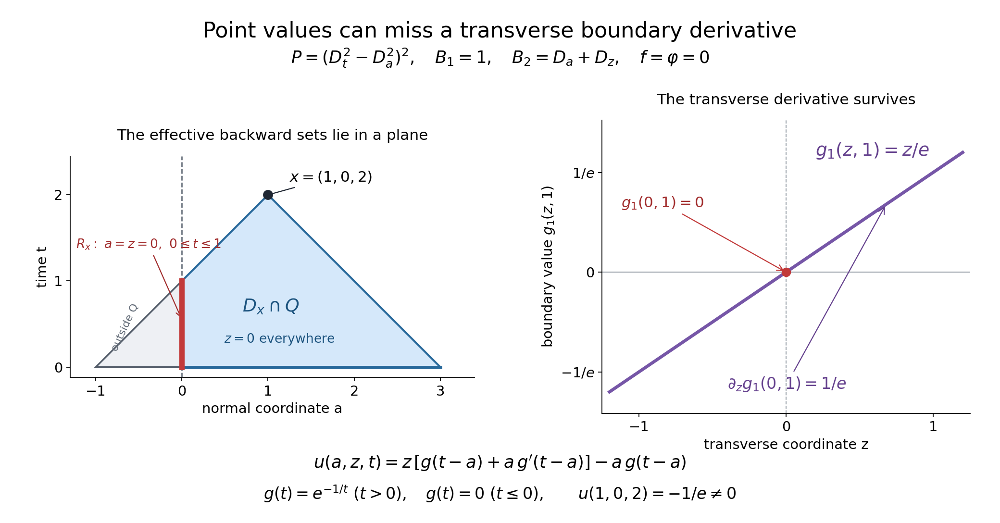

# Compatible smooth mixed data and the data that determine a solution

*Written by GPT-6.1 Sol (OpenAI), Ultra reasoning effort, October 2026. Self-checked by GPT-6.1 Sol (OpenAI). Public domain (CC0).*

Boundary kernels solve the part of a mixed problem left over after a whole-space Cauchy solution. Compatibility at the corner says exactly that this residual boundary datum is flat at initial time. We prove smooth existence and uniqueness for all compatible data, with no spatial growth assumption. We also identify the precise backward sets of data germs that determine a value. When a cone is lower dimensional, values on its footprint alone can lose needed derivatives; that distinction is explicit.

Read [Boundary fundamental kernels and their propagation support](boundary-fundamental-kernels-and-their-propagation-support.md), [Uniqueness from the principal boundary symbol](uniqueness-from-the-principal-boundary-symbol.md). [Fourier transforms, finite spectra and convex separation](../prerequisites/prerequisite-bridges.html) supplies the Fourier convention and Gaussian formula; [Metric and topological foundations](../prerequisites/metric-foundation-bridges.html) supplies scalar calculus and cutoffs. [Polynomial and contour interfaces for stable boundary models](../prerequisites/stable-prerequisite-bridges.html) supplies finite scalar and polynomial algebra. [Tensor products and parameter-dependent distributions](../prerequisites/tensor-products-and-parameters.html) supplies compact parameter and tensor operations. [Convolution as addition of supports](../prerequisites/convolution-as-addition-of-supports.html) supplies proper convolution.

Existence uses the available cone theorem in [Real roots and their convex component](../AN02-L192.html#4-pass-to-multiple-roots-and-obtain-convexity), Theorem 4.1, and the planned analytic zero-order theorem stated in [Incoming normal roots at a flat boundary](incoming-normal-roots-at-a-flat-boundary.md). Uniqueness also uses the available local Holmgren theorem in [Analytic coefficients and one-sided uniqueness](../AN02-L191.html#3-a-continuously-differentiable-surface-needs-no-analytic-flattening), Theorem 3.2, and the two planned analytic support-normal and analytic convolution-ellipticity theorems stated in [Uniqueness from the principal boundary symbol](uniqueness-from-the-principal-boundary-symbol.md). The remaining planned uses are conditional on their specified proofs.

Basic references are Grubb's *Distributions and Operators* ([author's lecture notes](https://web.math.ku.dk/~grubb/distribution.htm)), Melrose's *Differential Analysis* and Hörmander's treatment of constant-coefficient equations. The linked lessons supply the prerequisite proofs used below.

## The smooth problem and compatibility

Use coordinates \(x=(a,z,t)\), with \(a,t\ge0\) in the quarter-space Q. Write
\[
\begin{gathered}
P(D)=P_m(N)D_t^m\\
+\sum_{j<m}Q_j(D_a,D_z)D_t^j,
        \\
\qquad P_m(N)\ne0,\\
\qquad m\ge1 .
\end{gathered}
\tag{1}
\]
The time and boundary covectors are independent. The balanced mixed system is hyperbolic in the sense defined in [A necessary time strip for smooth mixed solvability](a-necessary-time-strip-for-smooth-mixed-solvability.md): its h boundary conditions have nonzero principal value at time and the full lower-time zero-free strip. Let C and \(C_\partial\) be [Boundary fundamental kernels and their propagation support](boundary-fundamental-kernels-and-their-propagation-support.md)'s interior and embedded boundary polar cones, and \(S=C+C_\partial\), a closed cone with a proper positive time bound.

The forcing f is jointly right-smooth on Q, the initial data \(\phi_j(a,z)\), \(0\le j<m\), are right-smooth for \(a\ge0\), and the boundary data \(g_k(z,t)\), \(1\le k\le h\), are right-smooth for \(t\ge0\). At every corner point \((0,z_0,0)\), call these data compatible when there is a formal power series in \(a,z-z_0,t\) whose equation and initial/boundary series agree with the Taylor series of the given data. The series is formal; no convergence or analyticity of the data is assumed.

An equivalent initial-data formulation uses \(\varphi\) as a smooth reference function near Q and sets \(\phi_j=D_t^j\varphi|_{t=0}\). The conditions \(D^\alpha(u-\varphi)|_{t=0}=0\), \(|\alpha|<m\), imply these normal conditions. Conversely, differentiating the normal trace identities in every spatial direction gives all those full-jet identities, including right spatial derivatives at a=0. There is no loss of initial data. Arbitrary smooth normal jets can be encoded by a reference function using 3. Point values of the normal-jet functions on an initial footprint and point values of a reference function on the entire backward set are different determination claims.

**Theorem.** Every such compatible smooth datum has a unique jointly right-smooth solution on Q of
\[
\begin{gathered}
P(D)u=f\\
\quad(a>0,t>0),\\
\qquad
 D_t^ju|_{t=0}=\phi_j\ (0\le j<m),\\
\qquad
 B_k(D)u|_{a=0}=g_k .
\end{gathered}
\tag{2}
\]
Uniqueness is among existing right-smooth solutions with arbitrary spatial growth. Compatibility is necessary as well: the Taylor series of any solution is a formal solution at each corner. The prerequisites of the existence and uniqueness clauses are distinguished below.

## A smooth jet construction with parameters

We first supply the extension needed for f and the initial data. Let \(b_k(y)\), \(k\ge0\), be arbitrary smooth functions of parameters y, which may include right-smooth half-space coordinates. Choose a smooth compact cutoff \(\chi\) equal to one near zero and supported in \([-1,1]\). There exist \(\epsilon_k>0\) for which
\[
\begin{gathered}
J(r,y)=\sum_{k=0}^\infty
        \chi(r/\epsilon_k)\frac{r^k}{k!}b_k(y),
       \\
\qquad \partial_r^kJ(0,y)=b_k(y).
\end{gathered}
\tag{3}
\]
Here r ranges over the whole real line. We prove convergence with every derivative, rather than assume a parameter Borel theorem.

Exhaust the parameter domain by nested boxes, using \(|y_i|\le k\) on whole coordinates and \(0\le y_i\le k\) on right coordinates. On the k-th box the derivatives of \(b_k\) through order \(\lfloor k/2\rfloor\) have finite suprema. For \(k\ge1\), the derivatives of its summand with \(j\) r-derivatives and total parameter order at most \(\lfloor k/2\rfloor-j\) have supremum at most
\(A_k\epsilon_k^{k-j}\), \(0\le j\le\lfloor k/2\rfloor\), by the finite Leibniz formula on \(|r|\le\epsilon_k\). The constants \(A_k\) include the finitely many cutoff derivatives and factorial factors. Choose \(0<\epsilon_k\le\min(1,1/k)\) so small that
\[
 A_k\epsilon_k^{k-\lfloor k/2\rfloor}\le2^{-k}.
 \tag{4}
\]
For k=0 choose any fixed positive scale. Because \(\epsilon_k\le1\), this also bounds all the smaller j derivative estimates by \(2^{-k}\). Every compact parameter set lies in all sufficiently large boxes. For each fixed total derivative order, all sufficiently late summands are uniformly bounded there by the summable sequence \(2^{-k}\). The series and every derivative thus converge uniformly on compact parameter boxes, including their right boundaries.

Coordinate fundamental-theorem identities pass to those uniform limits and identify them as the actual successive derivatives, just as in [A necessary time strip for smooth mixed solvability](a-necessary-time-strip-for-smooth-mixed-solvability.md)'s completeness check. This proves smoothness, including right parameter derivatives. At r=0, each cutoff is constant near zero; the j-th r-derivative of its summand is zero unless k=j, in which case it is \(b_j\). Interchange with the uniformly convergent derivative series proves the jet identity in 3. No bound on the growth of the sequence of jets was required.

For a right-smooth function \(F(r,y)\), \(r\ge0\), apply 3 to its right jets \(b_k(y)=\partial_r^kF(0,y)\). Define the extension to be F for \(r\ge0\) and J for \(r<0\). Every mixed derivative agrees across r=0. Coordinate integral identities then give a smooth extension across that boundary, still right-smooth in any remaining right parameters. In particular f extends across a=0 while remaining right-smooth for \(t\ge0\), and each \(\phi_j\) extends across a=0 on the initial plane.

We will also need extensions that vanish near a specified compact set K. If the original data vanish on a relative neighborhood of \(K\) intersected with their closed data domain, their relative closed support A is disjoint from K. Compactness gives positive separation from A. A smooth multiplier can therefore be chosen zero near K and one near A: finitely many small balls around K disjoint from A, with cutoffs supported in those balls, give \(1-\chi_K\). Multiplying any just-constructed extension by this multiplier preserves its value on the entire original data domain and makes it vanish near K, including the part of K outside that domain. This proves the needed support-preserving extension claim locally, without a global extension theorem.

## A whole-space smooth Cauchy solution

Let F on \(t\ge0\), with all spatial \(a,z\) unrestricted, and \(\Phi_j\) on its initial plane be the extensions just constructed. We prove the complete smooth Cauchy fact used here directly. Define successive time D-jets by
\[
\begin{gathered}
\Phi_{m+r}=\\
P_m(N)^{-1}\left[\begin{gathered}
      (D_t^rF)|_{t=0}
          \\
-\sum_{j<m}Q_j(D_a,D_z)\Phi_{j+r}\end{gathered}\right],
                                      \\
\qquad r\ge0 .
\end{gathered}
\tag{5}
\]
Every index on the right is smaller than \(m+r\), so this defines all jets smoothly. Apply 3 in time to their ordinary jets \(i^j\Phi_j\). It gives a global smooth v whose D-time jets are exactly \(\Phi_j\). The residual \(F-P(D)v\) on \(t\ge0\) is flat in time by 5. Its zero extension h to \(t<0\) is globally smooth: each mixed derivative has equal zero traces on the two sides, and the coordinate integral argument proves the joined derivatives are classical ones.

For clarity, construct the required causal inverse without using the finite-regularity jet theorem of the earlier Cauchy lesson. Choose \(\sigma<\min(\tau_0-1,-1)\). [Incoming normal roots at a flat boundary](incoming-normal-roots-at-a-flat-boundary.md) excludes zeros on the full affine tube \(\operatorname{Im}\zeta\in\sigma N-\Gamma\), and its time-line root factorization gives \(|P(\zeta)|\ge|P_m(N)|\) there, exactly as in [equation 18 in Boundary fundamental kernels and their propagation support](boundary-fundamental-kernels-and-their-propagation-support.md). The affine [Boundary determinants as causal Fourier kernels](boundary-determinants-as-causal-fourier-kernels.md) inverse of \(1/P\) gives a distribution E with
\[
 P(D)E=\delta_0,\qquad \operatorname{supp}E\subset C .
 \tag{6}
\]
Polynomial division of its transform verifies the equation, using inverse uniqueness.

Addition is proper on \(C\times\{t\ge0\}\). If \(c+y\) lies in a fixed compact set, \(c_t\ge b|c|\) and \(y_t\ge0\) bound \(c_t\), hence c and y. [Convolution as addition of supports](../prerequisites/convolution-as-addition-of-supports.html), Theorem 1.1 therefore applies even to distributions of arbitrary growth. It gives
\[
\begin{gathered}
P(D)(E*T)=T,\\
\qquad E*(P(D)T)=T
                       \\
\quad(\operatorname{supp}T\subset\{t\ge0\}).
\end{gathered}
\tag{7}
\]
For the second identity differentiate the E factor, obtaining \((P(D)E)*T=\delta_0*T\). All addition pairings are proper by the preceding bound; no transform of T is required.

For the smooth causal h, \(w=E*h\) is globally smooth. On each compact output neighborhood, one compact cutoff in the E variable equals one on all relevant support pairs; the pairing is with \(h(x-c)\). Its fixed compact support and every derivative depend smoothly on x, so [Tensor products and parameter-dependent distributions](../prerequisites/tensor-products-and-parameters.html), Lemma 1.1 proves this assertion. All derivatives retain causal support and consequently vanish at t=0. Thus
\[
\begin{gathered}
u_0=v+E*h\\
\quad(t\ge0),\\
\qquad
 P(D)u_0=F,\\
\qquad D_t^ju_0|_0=\Phi_j .
\end{gathered}
\tag{8}
\]
This is a smooth Cauchy solution up to the initial plane, with no finite-regularity or growth loss.

Its causal zero extension \(U_0\), as a distribution, obeys
\[
\begin{gathered}
P(D)U_0=F_++\mathcal B_\Phi,\\
\qquad
 \mathcal B_\Phi=
     \sum_{\ell=1}^m\sum_{r=0}^{\ell-1}(-i)^{r+1}
       \\
\delta^{(r)}(t)\otimes Q_\ell(D_a,D_z)\Phi_{\ell-1-r},
 \\
\quad Q_m=P_m(N),
 \\
\qquad U_0=E*(F_++\mathcal B_\Phi).
\end{gathered}
\tag{9}
\]
This is the full initial boundary-source formula, derived by ordinary integration by parts as in [equation 13 in Boundary fundamental kernels and their propagation support](boundary-fundamental-kernels-and-their-propagation-support.md). The last identity follows from 7. It proves whole-space Cauchy uniqueness and dependence on data germs at the compact past cone, retaining any spatial derivatives appearing in this finite source.

## Compatibility is residual flatness

On the boundary a=0, \(t\ge0\), put
\[
\begin{gathered}
\psi_k(z,t)\\
=g_k(z,t)-B_k(D)u_0(0,z,t).
\end{gathered}
\tag{10}
\]
The data are compatible exactly when each \(\psi_k\) is flat at t=0. To prove the forward implication, subtract the Taylor series of \(u_0\) at a corner point from a compatible formal solution. Its equation has zero right side and its first m time-jet series are zero. The formal recurrence 1, whose highest time coefficient is a nonzero scalar, makes every further time coefficient zero by induction, as a formal series in \(a,z-z_0\). The full difference series is therefore zero. Applying each polynomial boundary operator shows that the Taylor series of \(\psi_k\) in \(z-z_0,t\) is zero. This holds at every \(z_0\), so all time jets at zero vanish as smooth functions of z.

Conversely, if those time jets vanish, all their spatial derivatives vanish. The Taylor series of \(u_0\) itself solves the original formal problem at every corner, including every boundary datum, because its difference from \(g_k\) has zero Taylor series. Thus it witnesses compatibility. This proves both implications, without an analytic continuation claim for smooth flat functions.

Extend \(\psi_k\) by zero to \(t<0\). Flatness and coordinate integral identities make this a globally smooth causal function on the boundary. Use [Boundary fundamental kernels and their propagation support](boundary-fundamental-kernels-and-their-propagation-support.md)'s kernels and define tangential convolution
\[
\begin{gathered}
v(a,x')=\sum_{k=1}^h e_k(a,\cdot)*\psi_k(x'),\\
\qquad
                         u=u_0+v\\
\quad\hbox{on Q}.
\end{gathered}
\tag{11}
\]
For every compact output set with a in a fixed compact right interval, [Boundary fundamental kernels and their propagation support](boundary-fundamental-kernels-and-their-propagation-support.md)'s support in S and S's positive time bound give a common compact set of all relevant tangential input variables. The convolution is therefore proper and can use one fixed compact cutoff there. [Boundary fundamental kernels and their propagation support](boundary-fundamental-kernels-and-their-propagation-support.md)'s smooth distribution-valued family and [Tensor products and parameter-dependent distributions](../prerequisites/tensor-products-and-parameters.html), Lemma 1.1 show that v is jointly smooth with every right derivative at a=0. Tangential differentiation, normal differentiation and taking boundary traces commute with this pairing.

Consequently \(P(D)v=0\) in a>0 and \(B_j(D)v|_0=\psi_j\), by [Boundary fundamental kernels and their propagation support](boundary-fundamental-kernels-and-their-propagation-support.md)'s identity traces. Its causal support makes all initial time jets zero, including at the corner. Equation 8 and restriction of the extensions to the original data domain show that u has every equation and datum in 2. This proves full compatible smooth-data existence, including h=0, when the correction sum is empty.

For uniqueness, the difference of two solutions has zero forcing, all first m initial jets and every boundary datum. The recurrence 1 annihilates all higher initial jets, including at the normal corner by right continuity; its zero extension to the past is jointly right-smooth and causal. [Uniqueness from the principal boundary symbol](uniqueness-from-the-principal-boundary-symbol.md)'s arbitrary-growth mixed uniqueness theorem then makes it zero. This last clause retains [Uniqueness from the principal boundary symbol](uniqueness-from-the-principal-boundary-symbol.md)'s five exact planned inputs. Only its two cone/order inputs enter the existence construction above; its other three enter solely the uniqueness clause.

## The exact backward determination sets

For \(x\in Q\), define the compact sets
\[
\begin{gathered}
R_x=\{a=0,t\ge0\}\cap(x-S),\\
\qquad
 D_x=(\{x\}\cup R_x)-C\\
\quad\hbox{intersected with }\{t\ge0\}.
\end{gathered}
\tag{12}
\]
The boundary cone S has a positive time bound, so \(R_x\) is compact, with time between zero and \(x_t\). The same interior cone bound makes \(D_x\) compact. Its portions in the original data domains are the forcing set \(D_x\cap Q\), the initial set \(D_x\cap\{t=0,a\ge0\}\), and the boundary set \(R_x\cap\{t\ge0\}\).

If the differences of two compatible data sets vanish on relative neighborhoods of these respective sets, then their solution difference vanishes on a neighborhood of x in Q. Here is the full extension argument. Apply the support-preserving extension after 4 to make the extended forcing zero near the whole compact \(D_x\), including its negative-a part, and each extended initial jet zero near its whole t=0 section. 9 and proper addition make \(u_0\) zero near x and near the whole \(R_x\), because every relevant Cauchy backward set of those points lies in \(D_x\). Compactness permits one neighborhood for their union. Its boundary residual in 10 is zero near \(R_x\) on nonnegative time; its zero past extension is zero near the entire \(R_x\), including t=0, since the original residual is flat there.

The boundary correction at x has only input points in \(R_x\): the kernel's displacement from a boundary input lies in S. With the residual zero near that compact input set, proper convolution makes the correction zero near x. Thus \(u=u_0+v=0\) there. Uniqueness permits application to the data difference independently of how the extensions were selected. This proves the determination assertion at the germ level on exactly these backward sets.

The datum includes the tangential derivatives that occur in 9 and the boundary operators. It is not generally enough to give only its point values on a lower-dimensional footprint. The earlier Cauchy lesson recorded the distinction for normal initial jets. Exercise3 instead gives a boundary-data counterexample with the full initial reference function identically zero. Thus that example addresses the unrestricted value-only mixed determination claim itself, rather than confusing the full initial-data convention with the normal-jet convention.

## Exercises with complete solutions

**Exercise 1 (entry: a prescribed incoming wave).** For \(P(w,s)=(s-i)^2-w^2\) with Dirichlet boundary operator 1, take zero forcing and initial data. For a smooth causal boundary datum g, construct the solution and identify its determining boundary point.

**Solution.** Compatibility is exactly flatness of g at t=0. [Boundary fundamental kernels and their propagation support](boundary-fundamental-kernels-and-their-propagation-support.md)'s Dirichlet kernel gives
\[
\begin{gathered}
u(a,t)=e^{-a}g(t-a),\\
\qquad
 u(0,t)=g(t),\\
\qquad
                     \operatorname{supp}u\subset\{t\ge a\}.
\end{gathered}
\tag{13}
\]
Writing u as \(e^{-t}\) times the smooth function \(e^{t-a}g(t-a)\) of t-a verifies the interior equation. Its initial jets vanish because g is zero in the past and flat at zero. The value at \((a,t)\) uses just \(g(t-a)\), when \(t\ge a\); if t<a it is zero. In this scalar example the kernel is a translated point mass, so a boundary point value really is sufficient. This special fact does not replace the general germ/jet assertion.

**Exercise 2 (intermediate: the infinite corner conditions).** For the ordinary wave equation \(u_{tt}-u_{aa}=f\) on \(a,t\ge0\), prescribe \(u(a,0)=p(a)\), \(u_t(a,0)=q(a)\), and \(u(0,t)=g(t)\). Write the exact compatibility recurrence and its first four conditions. Explain why four conditions alone are insufficient for smooth solvability.

**Solution.** Put \(v_j(a)=\partial_t^ju(a,0)\). Its formal time recurrence is
\[
\begin{gathered}
v_0=p,\\
\quad v_1=q,\\
\qquad
 v_{j+2}=v_j''+\partial_t^jf(a,0),\\
\qquad
                 g^{(j)}(0)=v_j(0)\\
\quad(j\ge0).
\end{gathered}
\tag{14}
\]
It determines all jets and gives all corner conditions. The first four are
\[
\begin{gathered}
g(0)=p(0),\\
\quad g'(0)=q(0),\\
\quad
 g''(0)=p''(0)+f(0,0),\\
\quad
 g'''(0)=q''(0)+f_t(0,0).
\end{gathered}
\tag{15}
\]
All further conditions in 14 are needed. For example p=q=f=0 and \(g(t)=t^4\) satisfy the four displayed conditions but fail the condition \(g^{(4)}(0)=0\). No smooth solution can have those data. For zero f, 14 reduces to \(g^{(2r)}(0)=p^{(2r)}(0)\) and \(g^{(2r+1)}(0)=q^{(2r)}(0)\) for every r. A smooth boundary correction flat at zero changes no one of these conditions.

**Exercise 3 (advanced: a boundary derivative is invisible on the footprint).** In \((a,z,t)\), use
\[
\begin{gathered}
P(w,y,s)=(s^2-w^2)^2,\\
\qquad
 B_1=1,\\
\quad B_2=D_a+D_z,\\
\qquad
 x=(1,0,2).
\end{gathered}
\tag{16}
\]
Prescribe zero forcing and zero full initial reference function. Put \(g_1(z,t)=z\,g(t)\), \(g_2=0\), where \(g(t)=e^{-1/t}\) for t>0 and g=0 for t≤0. Verify hyperbolicity and compatibility, compute the determining footprint, and compare this solution with the zero solution.

**Solution.** The real-frequency time roots are the double roots s=±w, independently of y. Thus m=4, the barrier is zero, and the time principal value is one. When \(\operatorname{Im}s<0\), the upper normal factor is \((w-\lambda)^2\), with \(\lambda=-s\). The two residue rows for \(1,w+y\) are \((0,1)\) and \((1,2\lambda+y)\). Their determinant and the cones are
\[
\begin{gathered}
M=\begin{pmatrix}0&1\\1&2\lambda+y\end{pmatrix},
 \\
\quad L=L_0=-1,\\
\quad \Sigma=\mathbb R^2,\\
\quad
 \Gamma=\{(w,y,s):s>|w|\},\\
\quad
 C=\{(a,0,t):t\ge|a|\},\\
\quad S=C .
\end{gathered}
\tag{17}
\]
The determinant is zero-free and its principal value at time is nonzero, so this is a balanced hyperbolic mixed system. The entire boundary principal component has polar \(\{0\}\), hence S=C. Arbitrary y forces z=0 in the interior polar; the remaining two-dimensional light cone gives the stated inequality.

The function g is smooth and flat at zero. Indeed every derivative for t>0 is \(e^{-1/t}\) times a polynomial in \(1/t\); each tends to zero at zero, since \(e^{-r}r^k\to0\) as r→∞, as follows from the exponential series with any larger integer power. Induction and coordinate integral identities give the smooth zero extension. All boundary jets at the corner consequently vanish. The zero formal series witnesses compatibility with zero forcing and zero full initial reference function.

The inverse residue columns give \(H_1=w-2\lambda-y\), \(H_2=1\). The corresponding transformed kernels are \(e^{-ias}(1+ias-iay)\) and \(ia\,e^{-ias}\). Inverting them, or directly checking the following formula, gives with r=t-a
\[
\begin{gathered}
u(a,z,t)\\
=z\{g(r)+a g'(r)\}-a g(r),\\
\qquad
 u|_{a=0}=z g(t),\\
\qquad
 (D_a+D_z)u|_{a=0}=0,\\
\qquad
 u(1,0,2)=-e^{-1}\ne0 .
\end{gathered}
\tag{18}
\]
For the boundary derivative, \(\partial_a u|_0=-g(t)\) and \(\partial_z u|_0=g(t)\), which cancel. The ordinary wave operator annihilates every function of r and sends \(aF(r)\) to \(2F'(r)\); applying it twice therefore annihilates every term displayed in u. Its squared operator has the same zero set as \(P(D)\). At t=0, g and all its derivatives vanish for r≤0, so every initial derivative, including all derivatives of order below four, is zero throughout a≥0.

For the selected x the effective boundary footprint is \(R_x=\{(0,0,t):0\le t\le1\}\). Both boundary data vanish pointwise throughout that set. Forcing and the full initial reference function vanish identically, hence also on the entire set \(D_x\). All three data restrictions agree pointwise with those of the zero solution, but 18 gives a different solution value. The missing boundary datum is the transverse derivative \(\partial_zg_1=g(t)\). The germ theorem retains it. Thus point-value determination fails in this allowed lower-dimensional case even with the full initial-jet convention. This does not question compatible smooth existence or germ dependence, proved above.

## A transverse derivative in the backward footprint

The left section has z=0: the backward sets include the boundary segment a=0, 0≤t≤1. Both boundary values vanish on that segment, while the transverse derivative remains 1/e at t=1 and the solution value is −1/e. The right panel displays the actual transverse boundary graph. Exercise 3 proves every equation and datum in this figure.

The original figure, editable SVG and reproducible Python source are included with this lesson.

## References

- Gerd Grubb, *Distributions and Operators*, lecture-note versions, 2007–2008. [Open lecture notes](https://web.math.ku.dk/~grubb/distribution.htm).
- Richard Melrose, *Differential Analysis*, MIT OpenCourseWare, Fall 2004. [Open course](https://ocw.mit.edu/courses/18-155-differential-analysis-fall-2004/).
- Lars Hörmander, *The Analysis of Linear Partial Differential Operators I: Distribution Theory and Fourier Analysis*, second edition (1990), reprinted in Classics in Mathematics, Springer, 2003, e-ISBN 978-3-642-61497-2.
- Lars Hörmander, *The Analysis of Linear Partial Differential Operators II: Differential Operators with Constant Coefficients*, Springer, 1983.
