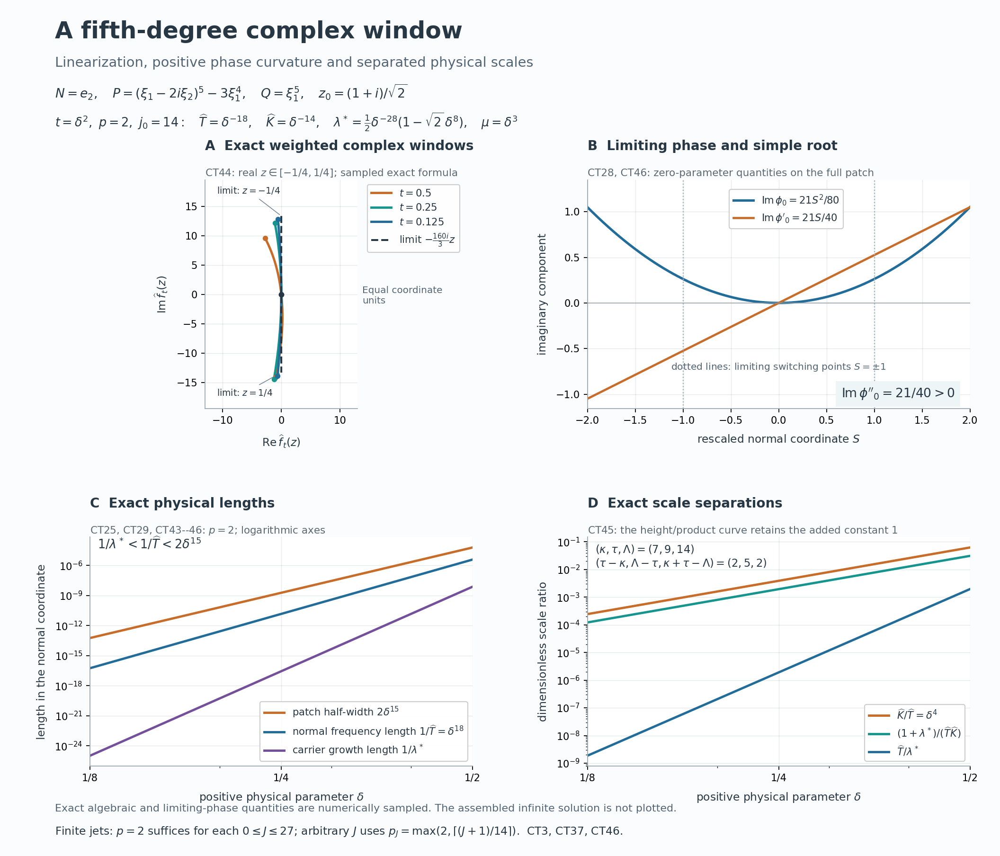

# Complex frequency windows and exact half-space support

*Written by GPT-6.1 Sol (OpenAI), Ultra reasoning effort, October 2026. Original expression and original illustrations: CC0.*

The theorem permits a characteristic normal and a frequency centre on the real boundary of its complex half-space. The proof therefore begins with those cases, before using the physical transport construction. A characteristic normal is handled by the planned general characteristic-halfspace theorem. For a noncharacteristic normal, either the real directional-strength ratio is unbounded, in which case the full real-frequency construction applies, or a uniform strength comparison supplies the additional imaginary-height escape needed to move and shrink a complex window. The latter branch then passes through the rational, transport, and assembly modules with their hypotheses checked explicitly.

## Proof ingredients and the planned characteristic case

The theorem permits a nonnegative imaginary-height parameter, total degree of P at least that of Q, pointwise window limits for every complex z, and a strict negative imaginary derivative at some complex point. Its characteristic case uses the negative-halfspace contract stated below, with the normal reversed.

These written lessons supply the other proof ingredients. Their equation labels below are their public numeric labels.

| Lesson | Exact argument used |
| --- | --- |
| [Real Laurent paths and the growth of normal windows](real-laurent-paths-and-growth-envelopes.md) | Theorem 1, equations (1)–(21): real Laurent path, integer scale and unequal limiting normal degrees under a noncharacteristic real-strength imbalance. |
| [Flat half-space solutions from real frequency rays](flat-half-space-solutions-from-real-frequency-rays.md) | Equations (1)–(36) and the full construction: smooth equation, exact half-space support, flat boundary jets and global upper tail; uses Theorem 1 of the Laurent-path lesson. |
| [Rational complex frequency paths without real poles](rational-complex-frequency-paths-without-real-poles.md) | Lemma 1, equations (2)–(8), for the escape estimate; Theorem 2, equations (9)–(24), for rational paths with coefficient errors O(parameter), a ratio analytic on the real line and integer scale inequalities. The extension to height zero is proved below. |
| [Moving complex frequency windows to a linear limit](moving-complex-frequency-windows-to-a-linear-limit.md) | Proposition 1 and Theorem 2, equations (3)–(12): exact weighted normalization after a complex shift, followed by reciprocal scale shrinking. |
| [Simple-root phases and flat switching errors](simple-root-phases-and-flat-switching-errors.md) | Theorem 1, equations (1)–(17), its finite-power coefficient extension and Corollary 2: smooth finite-order scale, nonzero amplitude and residual flat on the parameter line and both specified curves; equation (12) for finite-power flat division. |
| [Physical transport scales and curved phases](physical-transport-scales-and-curved-phases.md) | Equations (1)–(20): finite choice of parameter power, highest coefficient conditions on both curves, correct limiting phase primitive, exact ordered nonzero Q-image, physical derivative bounds and joint residual flatness. |
| [Joining modes through a vanishing operator image](joining-modes-through-a-vanishing-operator-image.md) | Theorem 1, equations (1)–(26): prescribed matching graph, positive matching constants, carrier and difference estimates, decay, nodal division, all cutoff commutators, zero extension and a nonzero global upper tail. |

**Planned prerequisite: [exact characteristic-halfspace smooth homogeneous solution](../prerequisites/planned-foundation-proofs.html#exact-characteristic-halfspace-smooth-homogeneous-solution).** If B is a nonzero constant-coefficient polynomial with highest homogeneous part B_d and M is a nonzero real vector satisfying B_d(M)=0, there exists v in C-infinity(R^n) such that B(D)v=0 and its support is exactly `{x:x dot M <= 0}`. Replacing M by -M supplies either prescribed closed characteristic half-space. The general proof of this prerequisite remains planned. The characteristic branch below is conditional on this exact contract. The algebraic and smooth-jet prerequisites of the linked lessons also retain their stated open transitive dependencies.

## Full theorem and conventions

Put D=-i times differentiation, fix N in R^n minus {0}, and write s=x dot N and H_N={x:s>=0}. Let P,Q be nonzero complex polynomials, and let m=degree P >= degree Q. Write P_m for the homogeneous part of degree m. Suppose there are sequences

\[
\zeta_\nu=\xi_\nu-i\lambda_\nu N,
\qquad \xi_\nu\in\mathbb R^n,\quad \lambda_\nu\ge0,
\quad T_\nu,K_\nu>0,
\quad P(\zeta_\nu)Q(\zeta_\nu)\ne0 .
\tag{CT1}
\]

For every z in C assume the pointwise limits

\[
\begin{gathered}
p_\nu(z):=\frac{P(\zeta_\nu+T_\nu zN)}{P(\zeta_\nu)}\longrightarrow1,
\qquad
q_\nu(z):=\frac{Q(\zeta_\nu+T_\nu zN)}{Q(\zeta_\nu)}\longrightarrow1,\\
\frac{P(\zeta_\nu)}{Q(\zeta_\nu)}\longrightarrow0,
\qquad r_\nu(z):=K_\nu(p_\nu(z)-q_\nu(z))\longrightarrow r(z),\\
\frac{K_\nu}{T_\nu}\longrightarrow0,
\qquad \frac{1+|\operatorname{Im}\zeta_\nu|}{T_\nu K_\nu}\longrightarrow0,
\qquad \operatorname{Im}r'(z_0)<0
\quad\hbox{for some }z_0\in\mathbb C .
\end{gathered}
\tag{CT2}
\]

The limiting polynomial r is consequently of degree at most m and has r(0)=0. There is no assumption P_m(N) nonzero in this theorem.

**Theorem (complex-frequency criterion, relative to the declared prerequisites).** Under (CT1)–(CT2), for every integer J>=0 there exist complex a,u in C-infinity(R^n) such that

\[
(P(D)+a(x)Q(D))u=0,
\qquad \operatorname{supp}u=H_N,
\qquad \partial^\alpha a(x)=0
\quad(s=0,\ |\alpha|\le J).
\tag{CT3}
\]

The functions may depend on J; the quantifier is for every J there exist a,u. The theorem does not assert that the bounded-strength complex construction produces one coefficient flat to every order. It does produce u flat to every order at the boundary. The characteristic and unbounded-strength branches produce a flat to every order too. This is an implication from the planned characteristic contract and the written proof ingredients above; recursive prerequisite closure remains incomplete.

## Polynomial convergence and the first branch split

Every p_nu,q_nu,r_nu has degree at most m. Choose m+1 distinct fixed complex nodes z_j. Lagrange interpolation writes each polynomial as the sum of its values at these nodes times fixed polynomial basis functions. Their pointwise limits therefore imply convergence of all coefficients in the norm `sum_j |coefficient_j|`; in particular the three pointwise limits in (CT2) are coefficient limits. The limiting polynomial for r_nu is the prescribed r, since interpolation and convergence at an arbitrary additional point give equality there. The identities p_nu(0)=q_nu(0)=1 give r_nu(0)=r(0)=0. If m=0, both windows equal 1 identically, so r=0 and the derivative sign in (CT2) is impossible. Thus every admissible input has m>=1.

Fix J>=0. If P_m(N)=0, homogeneity gives P_m(-N)=(-1)^m P_m(N)=0. Apply the planned characteristic contract with B=P and M=-N. It supplies a smooth homogeneous solution with

\[
P(D)u=0,
\qquad \operatorname{supp}u=\{x:x\cdot(-N)\le0\}=H_N .
\tag{CT4}
\]

Taking a=0 gives (CT3) for this J and in fact for all J at once. This uses the general characteristic theorem for the entire symbol P, including its lower order terms. A first-order special family is not a replacement for this contract. The general proof of the linked characteristic prerequisite remains planned.

It remains to consider P_m(N) nonzero. For R=P,Q define

\[
\mathcal S_N R(\eta)=
\left(\sum_{j=0}^m|\partial_N^jR(\eta)|^2\right)^{1/2},
\qquad \eta\in\mathbb R^n .
\tag{CT5}
\]

The D_N=-i partial_N convention changes each summand only by a factor of modulus 1, so this is precisely the directional-strength interface of [Laurent-path lesson](real-laurent-paths-and-growth-envelopes.md) and [real-frequency construction](flat-half-space-solutions-from-real-frequency-rays.md). Taylor's formula gives partial_N^m P=m!P_m(N), a nonzero constant. Thus S_N P is everywhere positive and the ratio S_N Q/S_N P is a well-defined continuous real function.

If its supremum is infinite, all hypotheses of Theorem 1 of [Real Laurent paths and the growth of normal windows](real-laurent-paths-and-growth-envelopes.md) and equation (1) of [Flat half-space solutions from real frequency rays](flat-half-space-solutions-from-real-frequency-rays.md) hold: m is the degree of P, Q has degree at most m, and the normal is noncharacteristic. The full [real-frequency construction](flat-half-space-solutions-from-real-frequency-rays.md), using the [Laurent-path lesson](real-laurent-paths-and-growth-envelopes.md), supplies globally smooth a,u with exact support H_N for u and with every derivative of a and u zero on s=0 (equations (33)–(35) of [Flat half-space solutions from real frequency rays](flat-half-space-solutions-from-real-frequency-rays.md)). Its equation (22) of [Flat half-space solutions from real frequency rays](flat-half-space-solutions-from-real-frequency-rays.md) and equation (32) of [Flat half-space solutions from real frequency rays](flat-half-space-solutions-from-real-frequency-rays.md) handle possible Q-image cancellation by exact neighbouring quotient identities, and its upper affine tail prevents an unintended upper endpoint. This supplies (CT3), with no use of the later complex branch or any additional premise about (CT1). In particular this branch invokes the full real-frequency theorem, not just the Laurent-path lemma or a special example.

In the remaining case there is a finite C such that

\[
\mathcal S_N Q(\eta)\le C\mathcal S_N P(\eta)
\quad(\eta\in\mathbb R^n).
\tag{CT6}
\]

We now verify the necessary escape premise before applying [linear-limit lesson](moving-complex-frequency-windows-to-a-linear-limit.md) and [rational-selection lesson](rational-complex-frequency-paths-without-real-poles.md).

## Escape from the real boundary, including zero original height

The scalar limits in (CT2) imply

\[
\frac{1+|\operatorname{Im}\zeta_\nu|}{T_\nu^2}
=\frac{1+|\operatorname{Im}\zeta_\nu|}{T_\nu K_\nu}
\frac{K_\nu}{T_\nu}\longrightarrow0,
\qquad T_\nu\longrightarrow\infty .
\tag{CT7}
\]

Those limits alone would not imply T_nu/lambda_nu tends to zero; the strength comparison is needed. Lemma 1 of [Rational complex frequency paths without real poles](rational-complex-frequency-paths-without-real-poles.md) extends to every lambda>=0 as follows. Set U=1+lambda, zeta=xi-i lambda N, and consider the univariate normal restrictions P(xi+tN), Q(xi+tN). For real |t|<=U, expressing all derivatives of the P restriction through its coefficients at scale U costs only constants depending on m, since U>=1 and each derivative factor U^{-j} is at most 1. (CT6) therefore bounds |Q(xi+tN)| by a fixed constant times the coefficient norm of P(xi+UzN). Interpolation at m+1 fixed real nodes in [-1,1] bounds the full Q-window coefficient norm at scale U by the same quantity. Translating the polynomial variable by -i lambda/U and translating back have uniformly bounded norms on this fixed degree space: the binomial formula applies and |lambda/U|<=1, including lambda=0. Consequently

\[
\|Q(\zeta+UzN)\|_{\rm c}
\le C_1\|P(\zeta+UzN)\|_{\rm c}
\qquad(\xi\in\mathbb R^n,\ \lambda\ge0),
\tag{CT8}
\]

with C_1 independent of xi and lambda. This is the precise height-zero extension of equation (4) of [Rational complex frequency paths without real poles](rational-complex-frequency-paths-without-real-poles.md), and keeps the height-zero case within the stated hypotheses.

Suppose T_nu/(1+lambda_nu) does not tend to zero. Some subsequence and some a_0>0 then satisfy T_nu>=a_0 U_nu. Rescale p_nu from its T_nu-window to U_nu: its finitely many coefficients acquire factors (U_nu/T_nu)^j, bounded by a fixed constant. Since p_nu tends coefficientwise to 1, the rescaled norms are uniformly bounded. Thus (CT8) gives

\[
|Q(\zeta_\nu)|
\le\|Q(\zeta_\nu+U_\nu zN)\|_{\rm c}
\le C_2|P(\zeta_\nu)|
\tag{CT9}
\]

on that subsequence, contradicting the nonzero ratio P(zeta_nu)/Q(zeta_nu) tending to zero. We have proved

\[
\frac{T_\nu}{1+\lambda_\nu}\to0,
\qquad \lambda_\nu\to\infty,
\qquad \frac{T_\nu}{\lambda_\nu}\to0 .
\tag{CT10}
\]

For the middle assertion use T_nu tending to infinity in (CT7); U_nu must tend to infinity too. The last assertion follows since (1+lambda_nu)/lambda_nu tends to 1. A finite prefix can now be discarded so that lambda_nu>0. Since |Im zeta_nu|=|N|lambda_nu, the Euclidean imaginary-height conventions of all modules agree up to the fixed nonzero factor |N|. Original centres of height zero are permitted; the bounded-strength branch proves that none can persist in its final sequence.

## The exact shift and a linear limiting polynomial

Choose the point z_0 in (CT2) and set

\[
\begin{gathered}
\zeta_\nu^*=\zeta_\nu+T_\nu z_0N
=\xi_\nu^*-i\lambda_\nu^*N,\\
\xi_\nu^*=\xi_\nu+T_\nu\operatorname{Re}z_0N,
\qquad \lambda_\nu^*=\lambda_\nu-T_\nu\operatorname{Im}z_0 .
\end{gathered}
\tag{CT11}
\]

(CT10) gives lambda_nu^*/lambda_nu tending to 1, so lambda_nu^*>0 eventually. Also p_nu(z_0),q_nu(z_0) tend to 1 and are nonzero eventually. With exact renormalization at the new centre,

\[
p_\nu^*(z)=\frac{p_\nu(z+z_0)}{p_\nu(z_0)},
\qquad q_\nu^*(z)=\frac{q_\nu(z+z_0)}{q_\nu(z_0)},
\tag{CT12}
\]

the weighted difference is precisely

\[
r_\nu^*(z)=K_\nu(p_\nu^*-q_\nu^*)
=\frac{q_\nu(z_0)r_\nu(z+z_0)
-q_\nu(z+z_0)r_\nu(z_0)}
{p_\nu(z_0)q_\nu(z_0)}
\longrightarrow r(z+z_0)-r(z_0).
\tag{CT13}
\]

This is equation (7) of [Moving complex frequency windows to a linear limit](moving-complex-frequency-windows-to-a-linear-limit.md); it follows by using K_nu p_nu=K_nu q_nu+r_nu in the cross-multiplied numerator at its two arguments. In particular r_nu^*(0)=0 exactly. A raw translation of r_nu without subtracting and weighting the constant would not have this property. Coefficient convergence, the ratio P/Q tending to zero and the original scale limits persist: the new scalar ratio is the old one times p_nu(z_0)/q_nu(z_0), and the imaginary heights are asymptotically equal. (CT10) also persists with lambda_nu^*.

Set rho_nu=K_nu/T_nu and choose

\[
h_\nu=\rho_\nu^{1/4},\qquad
\widehat T_\nu=h_\nu T_\nu,\qquad
\widehat K_\nu=K_\nu/h_\nu,
\qquad
\widehat p_\nu(z)=p_\nu^*(h_\nu z),\quad
\widehat q_\nu(z)=q_\nu^*(h_\nu z).
\tag{CT14}
\]

Since r_nu^* has exact zero constant coefficient and bounded convergent coefficients, writing r_nu^*(z)=sum_{j=1}^m d_{nu,j}z^j gives

\[
\widehat K_\nu(\widehat p_\nu-\widehat q_\nu)
=\frac{r_\nu^*(h_\nu z)}{h_\nu}
=\sum_{j=1}^m d_{\nu,j}h_\nu^{j-1}z^j
\longrightarrow a_{\rm lin}z,
\qquad a_{\rm lin}=r'(z_0),\quad\operatorname{Im}a_{\rm lin}<0 .
\tag{CT15}
\]

The normalization has prevented a constant error from being magnified by 1/h_nu. The limits of both new windows are still 1. The full scale checks are

\[
\frac{\widehat K_\nu}{\widehat T_\nu}=\rho_\nu^{1/2}\to0,
\qquad \widehat T_\nu\widehat K_\nu=T_\nu K_\nu,
\qquad
\frac{1+|\operatorname{Im}\zeta_\nu^*|}{\widehat T_\nu\widehat K_\nu}\to0,
\qquad \frac{\widehat T_\nu}{\lambda_\nu^*}\to0 .
\tag{CT16}
\]

These reproduce equations (10)–(12) of [Moving complex frequency windows to a linear limit](moving-complex-frequency-windows-to-a-linear-limit.md) and verify all [linear-limit lesson](moving-complex-frequency-windows-to-a-linear-limit.md) hypotheses rather than assuming an escape conclusion for the original unbounded-strength branch. In particular the transformed data now satisfy equation (6) of [Rational complex frequency paths without real poles](rational-complex-frequency-paths-without-real-poles.md) and equation (8) of [Rational complex frequency paths without real poles](rational-complex-frequency-paths-without-real-poles.md) with a linear limit.

## Rational paths and all integer scale inequalities

Apply Theorem 2 of [Rational complex frequency paths without real poles](rational-complex-frequency-paths-without-real-poles.md) to these transformed data. It gives rational real xi(epsilon), lambda(epsilon), T(epsilon), K(epsilon), rational complex c(epsilon),b(epsilon), and zeta=xi-i lambda N, with positive lambda,T,K for small positive epsilon. In fixed degree coefficient norm,

\[
\begin{gathered}
cP(\zeta+TzN)=1+O(\varepsilon),\qquad
q_\varepsilon(z):=bQ(\zeta+TzN)=1+O(\varepsilon),\\
f_\varepsilon(z):=K\{cP(\zeta+TzN)-bQ(\zeta+TzN)\}
=a_{\rm lin}z+O(\varepsilon),\\
A(\varepsilon):=b/c=O(\varepsilon),\qquad
K/T=O(\varepsilon),\qquad
\frac{1+|\operatorname{Im}\zeta|}{TK}=O(\varepsilon),\qquad
\frac{1+T}{|\operatorname{Im}\zeta|}=O(\varepsilon).
\end{gathered}
\tag{CT17}
\]

A is analytic at every real parameter, including negative parameters and zero. These are the complete equation (9) of [Rational complex frequency paths without real poles](rational-complex-frequency-paths-without-real-poles.md) conclusions. equation (12) of [Rational complex frequency paths without real poles](rational-complex-frequency-paths-without-real-poles.md) supplies compact minimum-norm selectable fibers even when the original semialgebraic fibers are unbounded; equations (14)–(17) of [Rational complex frequency paths without real poles](rational-complex-frequency-paths-without-real-poles.md) retain the large-K cancellation during finite Laurent truncation; equations (19)–(22) of [Rational complex frequency paths without real poles](rational-complex-frequency-paths-without-real-poles.md) move all real denominator zeros away. Those parts of the proof are needed for a globally smooth background A(s^p), and for the finite-power mode estimates; an arbitrary convergent subsequence would not supply them.

Write the positive rational leading terms as in equation (23) of [Rational complex frequency paths without real poles](rational-complex-frequency-paths-without-real-poles.md):

\[
K=k_0\varepsilon^{-\kappa}(1+O(\varepsilon)),\quad
T=t_0\varepsilon^{-\tau}(1+O(\varepsilon)),\quad
\lambda=l_0\varepsilon^{-\Lambda}(1+O(\varepsilon)),
\qquad k_0,t_0,l_0>0 .
\tag{CT18}
\]

The scales diverge: T follows from the product argument (CT7), lambda/T tends to infinity, and K=(T*K/lambda)(lambda/T) tends to infinity. Hence their pole orders are positive integers. The O(epsilon) estimates force exactly

\[
\kappa\ge2,\qquad
\tau-\kappa\ge1,\qquad
\Lambda-\tau\ge1,\qquad
\kappa+\tau-\Lambda\ge1.
\tag{CT19}
\]

The last three inequalities come from the leading powers of K/T, T/lambda and lambda/(T*K); adding the last two gives kappa>=2. Replace K by the pure power epsilon^{-kappa}. The ratio of new K to old K is k_0^{-1}(1+O(epsilon)); multiplying the bounded f_epsilon by it keeps O(epsilon) error and changes the limit to

\[
a_1 z,\qquad a_1=a_{\rm lin}/k_0,
\qquad\operatorname{Im}a_1<0 .
\tag{CT20}
\]

All scale inequalities persist. This positive scalar normalization is used in equation (2) of [Physical transport scales and curved phases](physical-transport-scales-and-curved-phases.md); silently discarding k_0 without changing the limiting coefficient would be incorrect. Rename the resulting weighted polynomial f_epsilon. The bounded rational coefficients of q_epsilon,f_epsilon have analytic extensions through zero. A is not identically zero since b,c are nonzero for small positive epsilon, so

\[
A(\varepsilon)=\varepsilon^{j_0}v(\varepsilon),
\qquad j_0\ge1,\quad v(0)\ne0 .
\tag{CT21}
\]

## Choose the power and the two graphs before constructing modes

For the fixed J select an integer p>=2 with p j_0>=J+1. It must also satisfy the finite highest-coefficient conditions equations (9)–(11) of [Physical transport scales and curved phases](physical-transport-scales-and-curved-phases.md). Here is why a single finite p can do both jobs. Let d be the largest index for which f_d or q_d is not identically zero near zero; d>=1 since f_1(0)=a_1. For any nonzero one of these two rational analytic coefficients use its first nonzero term, say f_d=alpha epsilon^r(1+O(epsilon)) and q_d=beta epsilon^t(1+O(epsilon)). At S=-1 and S=1 the top coefficient of f+Cq has respective leading constants alpha, or plus/minus p j_0 beta, or alpha plus/minus p j_0 beta, according as r<t, r>t, or r=t. An absent coefficient is omitted. In the equal-order case it suffices to choose

\[
p j_0|\beta|>|\alpha|.
\tag{CT22}
\]

In all other cases the indicated leading term is already nonzero at both points. Enlarging p keeps the boundary order requirement and all (CT19) separations, so only finitely many lower bounds are imposed. A moving graph with value 1 at zero has the same leading coefficient as S=1. This is precisely the equations (9)–(11) of [Physical transport scales and curved phases](physical-transport-scales-and-curved-phases.md) hypothesis check; it does not assume that a coefficient finite at one curve is finite at the other.

Put

\[
q_*:=\kappa p,\qquad w=q_*+1,\qquad
\gamma_*:=1/q_*,\qquad d_*^{q_*}=1/(2q_*),
\tag{CT23}
\]

and choose the second switching graph to be

\[
\gamma_2(\delta)=
\frac{(1-2q_*\delta^{q_*})^{-\gamma_*}-1}{\delta^{q_*}}
-(1-2q_*\delta^{q_*})^{-\gamma_* w},
\qquad \gamma_2(0)=1 .
\tag{CT24}
\]

This is an analytic germ through zero. The first numerator is divisible by delta^{q_*}, and its quotient has constant term 2q_* gamma_*=2, whereas the second term has constant 1. Both real functions are defined in a two-sided neighborhood of zero where 1-2q_* delta^{q_*}>0. Thus the two graphs S=-1 and S=gamma_2(delta) meet the zero-parameter line transversely at distinct points. The graph is chosen now, before the invocation of transport, so each mode will have its residual flat on the exact matching planes of the subsequent assembly.

## Physical input to the assembly

Set epsilon=delta^p and s=delta+S delta^w for delta>0. The smooth scale and background coefficient are

\[
\mu(\delta)=\frac1{\delta^wT(\delta^p)}
=\delta^{m_0}\widetilde v(\delta),
\qquad m_0=p(\tau-\kappa)-1\ge1,
\quad\widetilde v(0)=t_0^{-1}>0,
\tag{CT25}
\]

\[
C(S,\delta)=\delta^{-\kappa p}
\left(1-\frac{A(s^p)}{A(\delta^p)}\right),
\qquad C(S,0)=-p j_0 S.
\tag{CT26}
\]

The ratio factors as (1+S epsilon^kappa)^{p j_0} times
v(epsilon(1+S epsilon^kappa)^p)/v(epsilon); subtracting 1 is divisible by epsilon^kappa. This proves the smooth analytic extension in (CT26), including the coefficient's parameter-power factor. The rescaled polynomial is

\[
H_\delta(S,z)=f_{\delta^p}(z)+C(S,\delta)q_{\delta^p}(z),
\qquad H_0(S,z)=a_1z-pj_0S.
\tag{CT27}
\]

Its simple root and phase primitive are

\[
\psi_0(S)=\frac{pj_0}{a_1}S,
\qquad \phi_0(S)=\frac{pj_0}{2a_1}S^2,
\qquad \operatorname{Im}\phi_0''
=-\frac{pj_0\operatorname{Im}a_1}{|a_1|^2}>0 .
\tag{CT28}
\]

Differentiating phi_0 reproduces the root for all S; no factor p is omitted. For F_delta=H_delta(S,mu D_S), with coefficients on the left, and G_delta=delta^{-1}F_delta, equation (11) of [Physical transport scales and curved phases](physical-transport-scales-and-curved-phases.md) gives the top G coefficient on either curve in the form delta^{d m_0-1+p ell}d_j(delta), d_j(0) nonzero, with finite integer ell>=0. All other coefficients have at most finite-power singularities. Thus Theorem 1 of [Simple-root phases and flat switching errors](simple-root-phases-and-flat-switching-errors.md) and its smooth-scale Corollary 2 apply to G_delta, with m_1=1, the simple root (CT28) and both prescribed curves. Multiplication of its flat residual by delta gives the F_delta residual. equations (13)–(20) of [Physical transport scales and curved phases](physical-transport-scales-and-curved-phases.md) then supply smooth phi,W, with W a nonzero unit on the fixed patch, and

\[
u_\delta(x)=e^{i x\cdot\zeta(\delta^p)}
W(S,\delta)e^{i\phi(S,\delta)/\mu(\delta)},
\qquad S=(s-\delta)/\delta^w,\quad |S|\le2,
\tag{CT29}
\]

\[
Lu_\delta=r_\delta u_\delta,
\qquad L=P(D)-A(s^p)Q(D),
\qquad Q(D)u_\delta=M_\delta u_\delta,
\quad M_\delta=\frac{m(S,\delta)}{b(\delta^p)}\ne0,
\tag{CT30}
\]

where m(S,0)=1, |m-1|<1/2 and partial_S^2 Im phi has a uniform positive lower bound. The residual divided by KcW is smooth and flat by equation (12) of [Simple-root phases and flat switching errors](simple-root-phases-and-flat-switching-errors.md); all these factors have a finite Laurent leading term or are smooth units. Fixed physical derivatives of u_delta, M_delta, and their nonzero factors have fixed-power relative bounds. Most importantly, for each fixed mixed derivative and any nonnegative integers L_0,J_0, equation (20) of [Physical transport scales and curved phases](physical-transport-scales-and-curved-phases.md) gives

\[
|\partial_S^a\partial_\delta^b r(S,\delta)|
\le C\delta^{J_0}|S-\gamma_j(\delta)|^{L_0}
\quad(j=1,2),
\qquad \gamma_1=-1 .
\tag{CT31}
\]

Full graph flatness and full parameter-line flatness give this product bound by successive Taylor integral remainders. Rescaling to physical distance and differentiating cost only fixed powers, which the arbitrary J_0 absorbs. Separate informal assertions of smallness would not suffice for nodal division.

The physical conjugation in (CT30) uses partial_x S=N delta^{-w}, hence D_x F(S)=N delta^{-w}D_S F(S) for a function F of S, with no unit-normal assumption. All A and C coefficients multiply on the left; Q does not differentiate the perturbation coefficient. The ordered Q-image is equation (17) of [Physical transport scales and curved phases](physical-transport-scales-and-curved-phases.md), not a scalar substitution for powers of a nonconstant phase derivative. These checks supply exactly the input declared in equations (2)–(3) of [Joining modes through a vanishing operator image](joining-modes-through-a-vanishing-operator-image.md).

## Assembly, nodal division and the global support

Apply Theorem 1 of [Joining modes through a vanishing operator image](joining-modes-through-a-vanishing-operator-image.md) with J_*=J+1. Its centres are delta_nu=d_* nu^{-gamma_*}, widths delta_nu^w, and switching levels B_nu=delta_nu-delta_nu^w. (CT24) gives the exact identity

\[
B_{\nu-1}=\delta_\nu+\delta_\nu^w\gamma_2(\delta_\nu),
\tag{CT32}
\]

because 1/nu=2q_* delta_nu^{q_*}. Thus each mode's two flat residual graphs are exactly its lower and upper matching planes. Taking the starting index sufficiently large satisfies all uniform patch, separation and unit bounds in [physical-mode lesson](physical-transport-scales-and-curved-phases.md) and [assembly lesson](joining-modes-through-a-vanishing-operator-image.md). The positive constants C_nu of equation (8) of [Joining modes through a vanishing operator image](joining-modes-through-a-vanishing-operator-image.md) match the two neighbouring Q-image moduli at B_nu.

For clarity, the estimates that turn this input into a coefficient are recorded here with the equations supplying each estimate. With F_nu=|M_nu C_nu u_delta_nu|, equations (9)–(14) of [Joining modes through a vanishing operator image](joining-modes-through-a-vanishing-operator-image.md) retain the carrier exp(lambda_nu s). Each carrier dominates the derivative of its own modulus, but the neighbouring carrier difference is o(T_nu):

\[
\frac{\lambda_{\delta_\nu}/\nu}{T_{\delta_\nu}}
=O(\delta_\nu^{p(\kappa+\tau-\Lambda)})\to0,
\qquad
\frac{\delta_\nu^{-w}}{T_{\delta_\nu}}
=O(\delta_\nu^{m_0})\to0 .
\tag{CT33}
\]

Positive imaginary phase curvature therefore gives

\[
cT_{\delta_\nu}\le
\frac{\log(F_\nu(s)/F_{\nu+1}(s))}{s-B_\nu}
\le CT_{\delta_\nu}
\quad(s\ne B_\nu\hbox{ in the overlap}).
\tag{CT34}
\]

The upper mode dominates above its plane and the lower one below. equations (15)–(18) of [Joining modes through a vanishing operator image](joining-modes-through-a-vanishing-operator-image.md) then give the full cutoff mode amplitude bounded by C exp(-c nu^{1+eta}), where

\[
\eta=\frac{p(\Lambda-\kappa)-1}{\kappa p}>0 .
\tag{CT35}
\]

All fixed derivatives, including cutoff derivatives, cost only polynomial powers of nu, so the locally finite positive-side sum of modes has a smooth zero extension and all its boundary jets zero. equations (18)–(19) of [Joining modes through a vanishing operator image](joining-modes-through-a-vanishing-operator-image.md) supply these uniform derivative estimates; pointwise decay of a sequence by itself would not prove smooth extension.

In a switching tube both cutoffs equal 1. On one side divide by the dominant Q-image and set Z equal to the smaller-to-larger complex Q-image ratio. equation (20) of [Joining modes through a vanishing operator image](joining-modes-through-a-vanishing-operator-image.md) proves

\[
|1+Z|\ge c_0\min(1,T_{\delta_\nu}|s-B_\nu|)
\quad(s\ne B_\nu).
\tag{CT36}
\]

At the plane itself cancellation is allowed. The residual numerator of E=Lu/Q(D)u has the arbitrary product bounds (CT31) for both neighbours, including after all physical derivatives. equations (21)–(23) of [Joining modes through a vanishing operator image](joining-modes-through-a-vanishing-operator-image.md) divide those bounds by (CT36) and its differentiated reciprocals, whose losses are only finite powers of delta_nu and of the plane distance. The resulting quotient has every derivative tending to zero at the plane. Its zero extension there is smooth and flat. This defines E without assuming that Q(D)u never vanishes on a switching plane.

In a cutoff transition the neighbour with cutoff 1 dominates the changing mode by exp(-c/mu_delta), which beats every fixed inverse power. equations (24)–(25) of [Joining modes through a vanishing operator image](joining-modes-through-a-vanishing-operator-image.md) estimate all commutators [P(D),chi] and [Q(D),chi], retaining A(s^p) on the left in [L,chi]. The total Q-image is a nonzero dominant image times 1+epsilon_Q with |epsilon_Q|<1/2, and the quotient E and every fixed derivative have arbitrary boundary decay. Single-mode strips and plateau strips outside the switching tubes are covered in the same [assembly lesson](joining-modes-through-a-vanishing-operator-image.md) proof. Hence E extends smoothly by zero to s<=0 and is flat on s=0.

equation (26) of [Joining modes through a vanishing operator image](joining-modes-through-a-vanishing-operator-image.md) and its surrounding upper-tail construction extend the first mode to every larger s. Its amplitude remains nonzero; its phase derivative becomes constant, while all derivatives relevant to the finite ordered Q expression stay uniformly bounded. Since q_0 tends to 1 and each q_j with j>=1 tends to zero, the normalized Q-image remains uniformly within 1/2 of 1 when the initial index is sufficiently large. There is therefore a nonzero smooth upper mode with a nonzero Q-image on the entire tail. Its quotient E is defined smoothly there and agrees on the joining neighborhood with the assembled quotient. This step is necessary for support equal to the whole half-space, rather than a finite normal slab.

Finally set

\[
a(x)=-A(s^p)-E(x).
\tag{CT37}
\]

Then P+aQ=L-EQ annihilates u on every open positive region by construction; continuity gives the same identity on switching planes and at the boundary, and u=0 on the negative side. The background is smooth globally because A is analytic on the whole real line. It vanishes to order p j_0 at zero, while E is flat. Thus every physical derivative of a of order strictly less than p j_0 vanishes on s=0. Our choice p j_0>=J+1 proves the inclusive range |alpha|<=J in (CT3); [assembly lesson](joining-modes-through-a-vanishing-operator-image.md)'s strictly-less-than-J_* notation has not lost one boundary order.

Off the discrete switching planes every positive open set meets a strip with nonzero Q-image, so u cannot vanish identically on that open set. The upper tail is itself nonzero everywhere. Boundary points are limits of positive support points; the negative half-space has u=0. [assembly lesson](joining-modes-through-a-vanishing-operator-image.md)'s exact support argument therefore gives supp u=H_N. This completes the proof of (CT3) in the bounded-strength branch, and the preceding characteristic and unbounded-strength branches exhaust all original inputs. The relative theorem is proved. ∎

## A fifth-degree example in the bounded-strength branch

Here is an exact example distinct from the sixth-degree model in the reused modules. In dimension 2 take

\[
N=e_2,\quad P(\xi_1,\xi_2)=(\xi_1-2i\xi_2)^5-3\xi_1^4,
\quad Q(\xi_1,\xi_2)=\xi_1^5,
\tag{CT38}
\]

\[
\zeta(v)=\left(v^{-7},-\frac{i}{2}v^{-7}\right),
\quad T(v)=v^{-5},\quad K(v)=v^{-3},\qquad 0<v<1 .
\tag{CT39}
\]

The second coordinate is minus i times one half of v^{-7}, not a fractional power of v. The combination zeta_1-2i zeta_2 is zero. As (-2i)^5=-32i, direct substitution gives

\[
\begin{gathered}
P(\zeta)=-3v^{-28},\qquad Q(\zeta)=v^{-35},\qquad
P(\zeta)/Q(\zeta)=-3v^7,\\
p_v(z)=1+\frac{32i}{3}v^3z^5,\qquad q_v(z)=1,\qquad
K(p_v-q_v)=r(z)=\frac{32i}{3}z^5,\\
K/T=v^2,\qquad T/\lambda=2v^2,
\qquad (1+\lambda)/(TK)=v^8+v/2,
\quad \lambda=v^{-7}/2 .
\end{gathered}
\tag{CT40}
\]

At z_0=exp(i pi/4)=(1+i)/sqrt(2), z_0^4=-1, so r'(z_0)=-160i/3 and Im r'(z_0)=-160/3. All denominators are nonzero and all original limits hold. Also P_5(e_2)=-32i is nonzero.

The real-strength ratio is bounded, so this example actually exercises the complex branch. For real xi, |xi_1-2i xi_2|>=|xi|. If |xi|>=6,

\[
|P(\xi)|\ge|\xi|^5-3|\xi|^4\ge|\xi|^5/2,
\qquad |Q(\xi)|\le|\xi|^5 .
\tag{CT41}
\]

If |xi|<=6, |Q(xi)|<=6^5=7776, while the fifth normal derivative of P has modulus 5! times 32=3840. Since Q is independent of xi_2, S_N Q=|Q|; hence on the compact region S_N Q/S_N P<=7776/3840=81/40, and on the exterior the ratio is at most 2. In particular the global bound S_N Q<=3 S_N P holds. No assumption about zeros of the real value P is needed on the compact region, because its fifth derivative supplies the denominator bound.

For completeness the prescribed shift and shrink can be made rational explicitly. Put v=t^2, alpha=32i/3 and

\[
\mathcal D(t)=1+\alpha t^6z_0^5
=1+\frac{16\sqrt2}{3}(1-i)t^6 .
\tag{CT42}
\]

The shifted and shrunk data are

\[
\begin{gathered}
\zeta^*(t)=\left(t^{-14},\frac{t^{-10}}{\sqrt2}
-i\left(\frac{t^{-14}}2-\frac{t^{-10}}{\sqrt2}\right)\right),\qquad
\lambda^*(t)=\frac{t^{-14}}2(1-\sqrt2t^4)>0,\\
\widehat T=t^{-9},\quad\widehat K=t^{-7},\quad
c^*=-\frac{t^{56}}{3\mathcal D(t)},\quad b^*=t^{70},
\quad A^*(t)=-3t^{14}\mathcal D(t).
\end{gathered}
\tag{CT43}
\]

Here h=(K/T)^{1/4}=v^{1/2}=t and lambda^*>0 for 0<t<2^{-1/8}. The exact windows and weighted difference are

\[
\begin{gathered}
c^*P(\zeta^*+\widehat T zN)
=\frac{1+\alpha t^6(z_0+tz)^5}{\mathcal D(t)},
\qquad b^*Q(\zeta^*+\widehat T zN)=1,\\
\widehat f_t(z)
=\frac{\alpha\{(z_0+tz)^5-z_0^5\}}{t\mathcal D(t)}
\longrightarrow-\frac{160i}{3}z .
\end{gathered}
\tag{CT44}
\]

The numerator is divisible by t, so the coefficients have analytic extensions at zero; the coefficient error from the linear limit is O(t). The real part of D(t) is at least 1 on the whole real line. The ratio A^* is a polynomial, globally analytic, and has zero order j_0=14. The exact scales are

\[
\begin{gathered}
(\kappa,\tau,\Lambda)=(7,9,14),\quad
\tau-\kappa=2,\quad\Lambda-\tau=5,\quad
\kappa+\tau-\Lambda=2,\\
\widehat K/\widehat T=t^2,\quad
\widehat T/\lambda^*=\frac{2t^5}{1-\sqrt2t^4},\quad
\frac{1+\lambda^*}{\widehat T\widehat K}
=t^{16}+\frac12t^2-\frac{t^6}{\sqrt2} .
\end{gathered}
\tag{CT45}
\]

Thus these explicit paths satisfy the full rational-path estimates without further selection or K normalization. They instantiate the same general theorem; the general proof did not assume these formulas.

The top coefficient of f is alpha t^4/D(t), while q_5=0. There is no equal-order competition in (CT22), so for a requested J one may use

\[
p_J=\max\left(2,\left\lceil\frac{J+1}{14}\right\rceil\right),
\qquad w=7p_J+1,\quad\mu=\delta^{2p_J-1},\quad
\phi_0(S)=\frac{21p_Ji}{160}S^2 .
\tag{CT46}
\]

The top G coefficient has finite nonzero leading order 14p_J-6 on both switching curves. The exact physical Q-image is delta^{-70p_J}u_delta because all amplitude and normal phase factors depend only on x_2 and the carrier frequency in x_1 is delta^{-14p_J}. For p=2, the limiting imaginary curvature is 21/40 and the assembly exponent eta is 13/14, giving the amplitude decay bound C exp(-c nu^{27/14}). These refer to the limiting phase and proved bounds. They do not claim an explicit closed formula for the finite-parameter transport amplitude or for the assembled solution.

**Figure 1. Fifth-degree windows and their physical scales.** Panel A evaluates the exact complex weighted polynomial of (CT44) on the real normal-window interval −1/4 ≤ z ≤ 1/4 at t=1/2, 1/4 and 1/8. The dashed limit is −160iz/3, with equal real and imaginary coordinate units; its endpoints are labelled. Panel B shows the zero-parameter phase `Im phi_0=21 S^2/80` and its derivative `Im phi'_0=21 S/40` throughout −2 ≤ S ≤ 2. Its limiting switching points are S=−1,1; the actual second graph is S=gamma_2(delta) from (CT24). The limiting imaginary curvature is 21/40.

Panels C and D use p=2, t=delta² and 1/8 ≤ delta ≤ 1/2 on logarithmic axes. C plots the patch half-width `2 delta^15`, normal frequency length `1/T_hat=delta^18`, and carrier growth length `1/lambda*=2 delta^28/(1−sqrt(2) delta^8)`. D plots the exact ratios `K_hat/T_hat=delta^4`, `T_hat/lambda*=2 delta^10/(1−sqrt(2) delta^8)`, and `(1+lambda*)/(T_hat K_hat)=delta^32+delta^4/2−delta^12/sqrt(2)`, retaining the added 1. These are exact algebraic evaluations and zero-parameter quantities. The frequency length is not a wavelength at a point where the phase derivative vanishes. The full finite-parameter transport amplitude and the infinite assembled solution are not pictured.

The displayed p=2 gives the inclusive finite-jet range 0 ≤ J ≤ 27. For an arbitrary requested J, (CT46) chooses its own p_J; the diagram does not assert one coefficient flat to every order. Proof locators: (CT38)–(CT46), Exercise 6, physical coordinates (CT25), (CT29), phase/root identity (CT27)–(CT28), and support and nodal division (CT32)–(CT37). Mathematical antecedent: Hörmander II, Theorem 13.6.9, printed pp.210–211 (PDF pp.216–217), shift and reduction pp.211–212 (PDF pp.217–218), physical phase and scales pp.217–219 (PDF pp.223–225). Original figure: GPT-6.1 Sol (OpenAI), Ultra; CC0.

## Exercises with complete solutions

**Exercise 1 (the characteristic orientation and the dependency).** The planned characteristic theorem gives support `{x:x dot M<=0}`. Which normal is required to obtain H_N? Explain why this branch does not impose P_m(N) nonzero on the theorem, and what remains conditional.

**Solution.** Take M=-N. Homogeneity gives P_m(M)=(-1)^mP_m(N)=0, and the prescribed support is `{x:-x dot N<=0}=H_N`. Set a=0; every derivative of a vanishes and the homogeneous equation is exactly the required perturbed equation. This solves the characteristic branch using the full general characteristic contract. The theorem consequently keeps characteristic normals in its scope. Its use remains conditional on the planned AN-01 theorem; this reduction neither proves that theorem nor closes its prerequisites.

**Exercise 2 (why the scalar inequalities do not imply escape).** For epsilon tending to zero through positive values, take T=epsilon^{-3}, K=epsilon^{-2}, lambda=epsilon^{-1}. Check the two scalar limits in (CT2) and compare T/lambda. Identify the additional fact that proves escape for an admissible bounded-strength input.

**Solution.** K/T=epsilon and (1+lambda)/(T*K)=epsilon^5+epsilon^4 tend to zero, while T/lambda=epsilon^{-2} diverges. These are only scalar data; they are not asserted to satisfy the polynomial window and small P/Q hypotheses. Escape for the full input uses (CT6) to compare P and Q at U=1+lambda in (CT8). If T is bounded below by a positive fraction of U, normalized P is bounded on that scale, so |Q(zeta)|<=C|P(zeta)|. This contradicts the small nonzero P/Q ratio. It is that contradiction, including the height-zero estimate, that proves (CT10).

**Exercise 3 (normalization and the shrinking exponent).** Derive (CT13). For h=(K/T)^theta, determine the positive theta for which the new K/T tends to zero automatically, and explain why exact zero constant coefficient matters.

**Solution.** Multiplying K(p^*-q^*) by p(z_0)q(z_0) gives K[p(z+z_0)q(z_0)-q(z+z_0)p(z_0)]. Substitute Kp=Kq+r at both arguments. The two Kq(z+z_0)q(z_0) terms cancel, leaving q(z_0)r(z+z_0)-q(z+z_0)r(z_0), as claimed. With rho=K/T tending to zero, the new ratio is rho/h^2=rho^{1-2theta}; h tends to zero and that ratio tends to zero precisely for 0<theta<1/2. At theta=1/2 it equals 1; beyond that it diverges. An error polynomial e_nu+a z with e_nu>0 tending to zero would become e_nu/h_nu+a z after shrinking. For h_nu=e_nu^2 its constant term diverges. Exact normalization makes the constant identically zero in (CT15) and removes this obstruction.

**Exercise 4 (the pole order of K).** Prove that the rational O(epsilon) separations require kappa>=2, not just kappa>=1. Explain the effect of replacing k_0 epsilon^{-kappa}(1+O(epsilon)) by epsilon^{-kappa}.

**Solution.** T/lambda=O(epsilon) implies Lambda-tau>=1 and lambda/(T*K)=O(epsilon) implies kappa+tau-Lambda>=1. Adding gives kappa>=2. The K/T estimate separately gives tau-kappa>=1. The quotient of the new and old K is k_0^{-1}(1+O(epsilon)); the bounded weighted window therefore keeps O(epsilon) convergence and its limit is divided by k_0. Because k_0 is positive, the strict negative imaginary derivative sign persists. Omitting the division would misstate the limiting phase coefficient.

**Exercise 5 (inclusive jets and a simultaneous finite p).** Suppose A(epsilon)=epsilon^{j_0}v(epsilon), j_0>=1, v(0) nonzero. Determine a sufficient condition for all derivatives of A(s^p) of orders at most J to vanish at zero. If the highest f and q coefficients have equal leading order with constants alpha,beta nonzero, include the two-curve condition.

**Solution.** A(s^p)=s^{p j_0}v(s^p), so every derivative of order strictly less than p j_0 is zero at zero. Thus p j_0>=J+1 is sufficient for the inclusive range. At the two limiting curve points S=-1,1 the highest coefficient has constants alpha plus/minus p j_0 beta. The strict bound p j_0|beta|>|alpha| ensures both are nonzero by the reverse triangle inequality. Choose one integer p>=2 satisfying both lower bounds; it exists since j_0 and |beta| are positive. A graph with gamma(0)=1 has the same leading constant at the second curve. No upper bound on p is imposed by the scale requirements.

**Exercise 6 (check the fifth-degree family and its physical phase).** Compute the normalized windows and derivative sign for (CT38)–(CT39). After the shift and substitution v=t^2, verify the new integer exponents and the p=2 limiting phase, including its curvature.

**Solution.** The normal combination at zeta is zero, so the shifted fifth power is (-2i v^{-5}z)^5=-32i v^{-25}z^5. Division by -3v^{-28} gives p=1+(32i/3)v^3z^5. Q is independent of the normal variable, so q=1 and K(p-q)=(32i/3)z^5. Since z_0^4=-1, the derivative is (160i/3)z_0^4=-160i/3. The shrink h=v^{1/2} gives T_hat=v^{-9/2}, K_hat=v^{-7/2}; after v=t^2 these have pole orders 9,7, while the shifted height has leading term t^{-14}/2. Thus (kappa,tau,Lambda)=(7,9,14), with the differences 2,5,2. The ratio -3t^{14}D(t) has j_0=14. For p=2, the phase primitive pj_0 S^2/(2a_1) is 28 S^2/(2(-160i/3))=21i S^2/80. Its imaginary second derivative is 21/40>0, and its derivative is the exact root 28S/a_1. On real frequencies the exterior bound is 2 and the compact bound is 7776/3840=81/40, so the global real-strength bound 3 is valid.

**Exercise 7 (a nodal quotient and support equality).** Let Z_1(h)=exp(Th/2), Z_2(h)=-exp(-Th/2), T>0. Show that exp(-1/h^2)/(Z_1+Z_2), extended by zero at h=0, is smooth and flat. Explain why allowing isolated switching-plane zeros is consistent with exact half-space support, and why an upper tail is still necessary.

**Solution.** Z_1+Z_2=2sinh(Th/2)=h g(h), where g(h)=T integral_0^1 cosh(Th theta/2) dtheta is smooth and positive. The quotient is h^{-1}exp(-1/h^2)/g(h). Every derivative of h^{-1}exp(-1/h^2) is a finite Laurent polynomial in h times the same exponential and tends to zero at zero; multiplying by the smooth reciprocal of g preserves this. Thus a zero denominator of finite order can be divided when the numerator is flat to every order. In the assembly, every positive open set meets a strip away from the discrete switching planes with nonzero Q-image. The function cannot be identically zero on that open set, so the planes do not remove points from its support. A construction defined only up to a finite upper level would nevertheless miss all larger normal coordinates. [assembly lesson](joining-modes-through-a-vanishing-operator-image.md)'s nonzero upper tail supplies those coordinates and makes the support the entire closed half-space.

## Scope of the conclusion

The relative proof now covers all the stated quantifiers, the characteristic-normal branch, the full unbounded real-strength branch, the bounded-strength escape with height zero included, the exact complex normalization and linear shrink, rational O(epsilon) paths and all four integer exponent inequalities, the simultaneous finite p choice, both prescribed flat switching graphs, nodal quotient extension, every cutoff error and a nonzero global upper tail. The fifth-degree family and the seven solutions provide explicit bounded checks of the signs, scales, boundary order and support arguments.

The general characteristic prerequisite remains planned. The linked algebraic and smooth-jet lessons retain their stated open transitive dependencies.

## References

- Lars Hörmander, *The Analysis of Linear Partial Differential Operators II: Differential Operators with Constant Coefficients*, Springer, 1983. Theorem 13.6.9, pp.210–211.
- Lars Hörmander, *The Analysis of Linear Partial Differential Operators I: Distribution Theory and Fourier Analysis*, Springer, Theorem 8.6.7. The general characteristic-halfspace proof remains a planned prerequisite here.

The linked course lessons provide the written proof ingredients. These human references identify the mathematical antecedents; the precise planned contract remains explicitly conditional.
