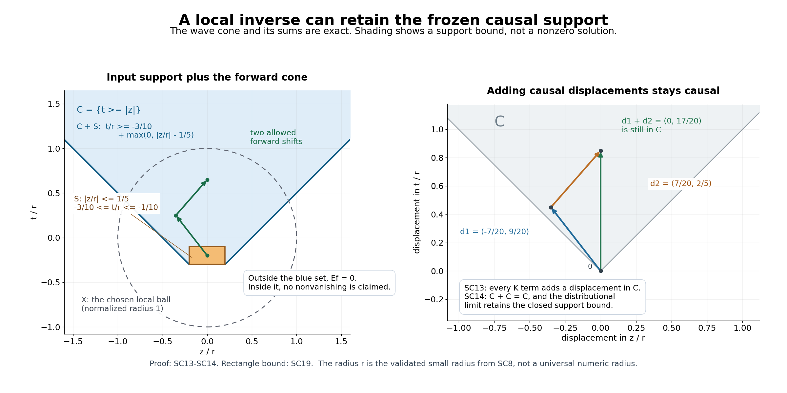

# Constant-strength inverses with causal support

*Written by GPT-6.1 Sol (OpenAI), Ultra reasoning effort, October 2026. Self-checked by the writing AI. Original expression: CC0.*

Freezing coefficients gives a local inverse, but an arbitrary frozen inverse can bring information from the wrong side of a time surface. We choose a frozen kernel whose support already has the desired direction. Differentiation and multiplication preserve that support restriction. The perturbation series then keeps the restriction even when the coefficients vary. Its convergence must be in a topology that passes vanishing on an open set to the limit.

Read [Freezing coefficients without losing strength](freezing-coefficients-and-constant-strength.md), [Measuring regularity with weighted Fourier spaces](weighted-fourier-spaces.md), [Rescaled symbols and stable strength](rescaled-symbols-and-stable-strength.md), [Causal fundamental solutions and lower order expansions](causal-fundamental-solutions-and-lower-order-expansions.md), [Local supported solutions with the exact symbol gain](local-supported-solutions-with-exact-symbol-gain.md), [Analytic root barriers and supported solvability](analytic-root-barriers-and-supported-solvability.md).

The hyperbolic branch assumes the two analytic zero-order and homogeneous hyperbolic-cone theorems stated in the causal-kernel prerequisite. The support theorem's evolution branch uses only the necessary root-barrier implication. Its final component-stability remark uses the available noncharacteristic Holmgren theorem in [Analytic coefficients and one-sided uniqueness](../AN02-L191.html#3-a-continuously-differentiable-surface-needs-no-analytic-flattening), Theorem 3.2. These dependencies retain their stated scope.

## The two support geometries and the full local theorem

Use \(D=-i\partial\), the Fourier transform \(\widehat f(\xi)=\int e^{-ix\cdot\xi}f(x)\,dx\), and \(\|f\|_{p,k}=(2\pi)^{-n/p}\|k\widehat f\|_p\). A moderate weight has the shift bound used in the weighted-space lesson. Let \(A(x,D)\) have smooth coefficients and constant strength near \(x_0\), with nonzero frozen polynomial \(P=A(x_0,\cdot)\). The fixed weaker-polynomial basis gives
\[
\begin{gathered}
A(x,D)\\
=P(D)+\sum_{\nu=1}^q c_\nu(x)Q_\nu(D),\\
Q_\nu\prec P,\\
c_\nu(x_0)\\
=0.
\end{gathered}
\tag{SC1}
\]

There are two alternatives. If \(P\) is hyperbolic with respect to \(N\ne0\), let \(F_m\) be its principal homogeneous part and set
\[
\begin{gathered}
\Gamma\\
=\Gamma(F_m,N),\\
C\\
=\{z:z\cdot\theta\\
\ge0\text{ for every }\theta\in\Gamma\}.
\end{gathered}
\tag{SC2}
\]
This is the closed forward propagation cone, including its boundary. In the second alternative, \(P\) is an evolution symbol for \(H_N=\{z:z\cdot N\ge0\}\); set \(C=H_N\). Here an evolution symbol can be specified by the existence of a global fundamental distribution supported in \(H_N\), or directly by the necessary analytic normal-root barrier. The written necessary implication converts the former specification to the latter. The argument below needs only a compact local regular kernel, not a global regular kernel in this second alternative.

Both choices of \(C\) are closed cones with \(0\in C\) and \(C+C=C\). A cone here may contain lines. No proper addition of two unrestricted half-space-supported distributions will be used.

**Theorem 1.** There are a neighborhood \(X\) of \(x_0\) and one linear map \(E:\mathcal E'(\mathbb R^n)\to\mathcal E'(\mathbb R^n)\), independent of \(p,k\), such that
\[
\begin{gathered}
A(x,D)Ef\\
=f\\
\text{in }X\\
(f\in\mathcal E'(\mathbb R^n)),\\
EA(x,D)u\\
=u\\
\text{in }X\\
(u\in\mathcal E'(X)).
\end{gathered}
\tag{SC3}
\]
For every moderate \(k\) and \(1\le p\le\infty\),
\[
\begin{gathered}
\|Ef\|_{p,kS_P}\le C_{p,k}\|f\|_{p,k}
\\
\quad(f\in\mathcal E'\cap B_{p,k}),
\\
\qquad
\operatorname{supp}Ef\subset C+\operatorname{supp}f.
\end{gathered}
\tag{SC4}
\]
The output supports are also contained in one fixed compact set. The support assertion is an inclusion, not a statement that the solution is nonzero at every point of that set. It is a property of this choice of inverse; it is not local uniqueness for every solution of the variable-coefficient equation.

## Select a compact frozen kernel before selecting a weight

Choose a bounded neighborhood \(U_0\) of \(x_0\) with closure in the coefficient neighborhood. Choose an open bounded \(V\) containing a neighborhood of \(\overline{U_0}-\overline{U_0}\). We first obtain one compact distribution \(F\) with
\[
\begin{gathered}
F\in B_{\infty,S_P},\\
\qquad
\operatorname{supp}F\subset C,\\
\qquad
P(D)F-\delta_0=0\\
\quad\text{in }V.
\end{gathered}
\tag{SC5}
\]

In the hyperbolic alternative, take the regular causal fundamental solution \(E_0\) of the linked kernel theorem. It is supported in \(C\) and belongs to \(B_{\infty,S_P}^{\mathrm{loc}}\). Multiply it by a compact smooth cutoff equal to one near \(\overline V\). The result has all three properties in(SC5): the differentiated cutoff is zero there, and multiplication cannot enlarge support.

In the evolution alternative, rotate the normal direction to the time coordinate and use the root-barrier adapter. The local supported existence theorem with \(p=\infty\), \(k=1\), datum \(\delta_0\), and equation set \(V\) gives(SC5) directly. The Fourier transform of \(\delta_0\) is one. The theorem's solution is compact, belongs to \(B_{\infty,S_P}\), and is supported in \(H_N\). Orthogonal coordinates preserve compactness, the half-space, and equivalent polynomial derivative norms; transporting back retains these properties. No assertion about a globally regular evolution fundamental solution is needed.

For every \(g\in\mathcal E'(U_0)\), locality in the convolution gives
\[
\begin{gathered}
P(D)(F*g)=g\\
\quad\text{in }U_0,
\\
\qquad F*P(D)g=g\\
\quad\text{in }U_0.
\end{gathered}
\tag{SC6}
\]
Indeed the error \(R=P(D)F-\delta_0\) is supported outside \(V\). If \(x\in U_0\) and \(y\in\operatorname{supp}g\subset U_0\), then \(x-y\in V\). On a compact set of output tests, those differences lie a positive distance inside \(V\); the compact convolution pairing therefore makes \(R*g\) zero on that set. The second equality follows from commutation of constant derivatives with compact convolution. All distributions in this convolution are compact, so addition is proper without any half-space properness assumption.

## One contraction for all Fourier scales

Choose \(w\in C_c^\infty\) equal to one near the closed unit ball and supported in the ball of radius two. Put \(w_r(x)=w((x-x_0)/r)\), with \(r\) small enough that \(\operatorname{supp}w_r\subset U_0\). Extend \(w_rc_\nu\) smoothly by zero off \(U_0\). Set
\[
\begin{gathered}
M_\nu\\
=\sup_{\xi}|Q_\nu(\xi)\widehat F(\xi)|<\infty,\\
K_rg\\
=\sum_{\nu=1}^q w_rc_\nu Q_\nu(D)(F*g).
\end{gathered}
\tag{SC7}
\]
The constants are finite because \(|Q_\nu|\le S_{Q_\nu}\le C_\nu S_P\) and(SC5) holds. Fourier multiplication shows that each \(Q_\nu(D)F*\) has norm at most \(M_\nu\) on every \(B_{p,k}\). This bound is independent of \(p\) and of the weight.

The coefficient-cutoff lemma in the freezing lesson gives \(\|w_rc_\nu\|_{1,1}=O(r)\). Choose \(r\), before choosing \(p,k\), so that
\[
2\sum_{\nu=1}^q M_\nu\|w_rc_\nu\|_{1,1}<\tfrac12.
\tag{SC8}
\]
For any given moderate \(k\), choose a sufficiently slow equivalent weight \(k_\delta\) for the finite family \(w_rc_\nu,w_r\). The slow-weight multiplier lemma then gives
\[
\begin{gathered}
\|K_rg\|_{p,k_\delta}\\
\le\tfrac12\|g\|_{p,k_\delta},\\
\|w_rf\|_{p,k_\delta}\\
\le2\|w_r\|_{1,1}\|f\|_{p,k_\delta}.
\end{gathered}
\tag{SC9}
\]
The same \(\delta\) works for every \(p\) for this fixed finite family and weight. Endpoints are included in the multiplier and convolution estimates. The equation
\[
\begin{gathered}
g+K_rg=w_rf,
\\
\qquad
g=\sum_{j=0}^{\infty}(-K_r)^j(w_rf)
\end{gathered}
\tag{SC10}
\]
therefore has a unique solution in \(B_{p,k_\delta}=B_{p,k}\) whenever the datum belongs to that space. It converges in that Banach norm. Both terms on the right of \(g=w_rf-K_rg\) have support in the fixed compact \(\operatorname{supp}w_r\), so \(g\in\mathcal E'(U_0)\).

For arbitrary compact \(f\), its finite-order estimate on a compact neighborhood of its support gives a polynomial bound on its Fourier transform. Hence it belongs to some \(B_{\infty,\langle\xi\rangle^{-L}}\). Construct \(g\) in that space using its equivalent slow weight. It is unique among all compact distributions: the difference of two compact solutions is in a single sufficiently negative weighted supremum space, and(SC9) applied to its homogeneous equation makes the difference zero. Thus different choices of \(p,k,\delta\) give the same \(g\). This proves linearity and independence of the weighted realization.

Define
\[
\begin{gathered}
Ef\\
=F*g,\\
\|Ef\|_{p,kS_P}\\
\le\|F\|_{\infty,S_P}\|g\|_{p,k}.
\end{gathered}
\tag{SC11}
\]
Equivalence of \(k\) and \(k_\delta\), followed by(SC9), proves the norm assertion in(SC4). The fixed output compact is \(\operatorname{supp}F+\operatorname{supp}w_r\). On a smaller ball \(X\) where \(w_r=1\), equations(SC6) and(SC10) give \(AEf=g+\sum c_\nu Q_\nu(F*g)=f\).

For \(u\in\mathcal E'(X)\), let \(g_0=P(D)u\). Equation(SC6) makes \(F*g_0=u\) throughout \(U_0\), including the support of \(w_r\). Since \(w_r=1\) near the support of \(u\) and its derivatives,
\[
\begin{gathered}
g_0+K_rg_0
\\
=P(D)u+w_r\sum_\nu c_\nu Q_\nu(D)u
\\
=w_rA(x,D)u.
\end{gathered}
\tag{SC12}
\]
Compact-distribution uniqueness in(SC10) identifies \(g_0\) as the auxiliary datum used for \(EAu\). Another application of(SC6) proves its equality to \(u\) in \(X\). This proves both local identities.

## Pass the support restriction through the infinite series

Let \(S=\operatorname{supp}f\), a compact set. The empty support means \(f=0\) and \(Ef=0\), so assume \(S\ne\varnothing\). The sum \(C+S\) is closed: for a convergent sequence \(c_j+s_j\), compactness gives a subsequence \(s_j\to s\in S\), and then \(c_j\to c\in C\). Differentiation and smooth multiplication do not enlarge support. Compact convolution therefore gives
\[
\begin{gathered}
\operatorname{supp}(K_rv)
\subset C+\operatorname{supp}v
\\
\quad(v\in\mathcal E').
\end{gathered}
\tag{SC13}
\]
Since \(0\in C\), the zeroth term \(w_rf\) is supported in \(C+S\). Induction, using \(C+C=C\), puts every other term of(SC10) in the same closed set. The partial sums converge in a weighted supremum space continuously included in \(\mathcal S'\). Every compact test supported outside \(C+S\) pairs to zero with all partial sums and consequently with their limit. Thus
\[
\begin{gathered}
\operatorname{supp}g\\
\subset C+S,\\
\operatorname{supp}Ef
\\
\subset C+\operatorname{supp}g
\\
\subset C+C+S\\
=C+S.
\end{gathered}
\tag{SC14}
\]
This is the exact support assertion. It does not rely on norm density of compact tests at \(p=\infty\), a positive cone kernel, or convergence at individual points. Only continuity into distributions and closed-set support were used. In the half-space branch, all the factors are compact, so lineality of \(H_N\) causes no convolution obstruction. The theorem is proved.

If \(P\) has degree zero, constant strength forces \(A(x,D)=a(x)\ne0\). Choose a compact smooth \(\rho\) supported in the coefficient neighborhood and equal to \(1/a\) near \(X\), and set \(Ef=\rho f\). This has both local identities, all weighted multiplier bounds, fixed compact output support, and the stronger \(\operatorname{supp}Ef\subset\operatorname{supp}f\). It supplies the scalar endpoint without invoking a positive-order cone construction.

## The frozen hyperbolic cones are identical

The preceding theorem only needs the kernel of \(P=A(x_0,\cdot)\). There is also a useful exact interpretation of its cone. Suppose the order is \(m\ge1\) and \(P\) is hyperbolic in direction \(N\). Let \(Q=A(x,\cdot)\) for another point and let \(G\) be its principal part. Equal strength gives equal degree. Scaling the finite derivative-vector inequalities at \(rv\), dividing by \(r^m\), and taking \(r\to\infty\) gives
\[
\begin{gathered}
|G(v)|\le C_x|F_m(v)|,
\\
\qquad |F_m(v)|\le C'_x|G(v)|
\\
\quad(v\in\mathbb R^n).
\end{gathered}
\tag{SC15}
\]
In particular \(G(N)\ne0\). The homogeneous hyperbolic-root contract says that \(s\mapsto F_m(v+sN)\) has all its \(m\) roots real, with multiplicity. At each root, the first inequality in(SC15) forces \(G(v+sN)\) to vanish to at least the same order: otherwise the quotient has an unbounded power as real \(s\) approaches that root. Both polynomials have degree \(m\), so comparison of the coefficient of \(s^m\) yields
\[
\begin{gathered}
G(v+sN)\\
=\frac{G(N)}{F_m(N)}F_m(v+sN),\\
G\\
=\frac{G(N)}{F_m(N)}F_m.
\end{gathered}
\tag{SC16}
\]
The second identity follows by setting \(s=0\) for every real \(v\), then equality of polynomial coefficients. The scalar can be complex and is nonzero. It does not change the homogeneous zero set, its component containing \(N\), or its dual cone.

The lower-order hyperbolicity theorem says \(P\) has equal strength to \(F_m\). Hence \(Q\) has equal strength to \(G\). Applying its same-direction characterization with principal part \(G\), which is hyperbolic by(SC16), proves that \(Q\) too is hyperbolic with direction \(N\). All the frozen cones in this constant-strength family are therefore the same \(C\). This argument imports exactly the homogeneous hyperbolic-root contract already declared by the lower-order theorem. It makes no nonlinear coordinate-invariance assertion.

For evolution symbols, smoothness makes \(x\mapsto A(x,\cdot)\) continuous in the finite-dimensional weaker-symbol space. On a connected coefficient region its image is connected. The already written component-stability theorem then shows that all frozen symbols are evolution symbols in the same half-space if one is. This last contextual consequence retains the component theorem's own available sufficient-direction Holmgren input; it is not used in the construction or support proof of Theorem 1.

## Exercises with complete solutions

**Exercise 1 (entry: a thin propagation cone).** Take \(A=D_t+b(z,t)\) with \(b\) globally smooth and \(b(0,0)=0\). Identify the frozen propagation cone. For compact smooth \(h(t)\), verify a causal solution of \(Au=\delta_0(z)h(t)\) and its spatial support.

**Solution.** The polynomial at the origin is \(\tau\). Its homogeneous component containing \(N=e_t\) is \(\{(\xi,\tau):\tau>0\}\). Testing all tangential covectors of either sign in its dual forces \(z=0\); testing positive \(\tau\) gives \(t\ge0\). Thus the closed cone is the forward time ray, not the whole half-space. The basis correction is a multiple of the constant polynomial, which is dominated by \(\tau\) in the enlarged-window sense. Constant strength follows from stable strength.

Put
\[
\begin{gathered}
u(z,t)\\
=i\delta_0(z)\int_{-\infty}^t
\exp\!\left(-i\int_s^t b(0,r)\,dr\right)h(s)\,ds.
\end{gathered}
\tag{SC17}
\]
The integral is over a finite relevant interval on each compact time set, because \(h\) is compact and the upper limit is finite. It defines a smooth time function. Calling the integral \(J(t)\), differentiation gives \(J'=h-i b(0,t)J\). Hence \(D_t(iJ)+b(0,t)iJ=J'+i b(0,t)J=h\). Multiplication by \(b(z,t)\) on \(\delta_0(z)\) uses its value \(b(0,t)\), so this verifies the distributional equation. The solution is zero before \(\min\operatorname{supp}h\), and its spatial support is contained in \(z=0\). It has the cone inclusion even though its time support may be unbounded. The local theorem chooses a compact output extension of a local solution; it does not claim this global expression is compact.

**Exercise 2 (intermediate: the choice of frozen inverse matters).** For \(P=D_t\) on the line, construct a compact local regular kernel supported on both sides of zero. Use it in the unperturbed freezing construction to show why the support assertion does not hold for every local inverse.

**Solution.** Choose \(\chi\in C_c^\infty\) equal to one on \((-2,2)\), and put \(F=(i/2)\chi\operatorname{sgn}t\). Since \(\partial_t\operatorname{sgn}t=2\delta_0\), \(D_tF=\delta_0\) on \((-2,2)\). On the entire line its derivative is \(\delta_0+(1/2)\chi'\operatorname{sgn}t\), a finite measure of compact support. Fourier transformation gives \(|\xi\widehat F(\xi)|\le C\). Also \(|\widehat F|\le\|F\|_1\), so \(\sqrt{1+\xi^2}|\widehat F|\) is bounded: \(F\in B_{\infty,S_{D_t}}\). It is a valid local regular kernel.

With no variable correction, \(K_r=0\) and \(Ef=F*(w_rf)\). For \(f=\delta_0\) and \(w_r(0)=1\), this gives \(E\delta_0=F\), nonzero on a negative-time interval. Yet the local right and compact-input left identities still hold by(SC6). The causal cone for \(D_t\) is \([0,\infty)\), so the support inclusion fails for this choice. Selecting the causal frozen kernel is essential.

**Exercise 3 (advanced: a wave equation with a smooth potential).** In two variables \((z,t)\), let \(A=D_t^2-D_z^2+V(z,t)\), with smooth possibly complex \(V\) and \(V(0,0)=0\). Establish constant strength. Suppose the compact forcing is supported in the rectangle \(S=\{|z|\le a,\ t_0\le t\le t_1\}\), with \(a>0\). Give the exact cone support bound and explain what it says about the solution inside that bound.

**Solution.** Write \(P(\xi,\tau)=\tau^2-\xi^2\). Its derivative norm satisfies
\[
\begin{gathered}
S_P(\xi,\tau)^2\\
=(\tau^2-\xi^2)^2+4\tau^2+4\xi^2+8.
\end{gathered}
\tag{SC18}
\]
At enlarged scale \(T\), the two second derivatives contribute \(8T^4\), so \(S_P(\xi,\tau,T)\ge\sqrt8\,T^2\). Therefore the constant polynomial is dominated by \(P\): the defining uniform ratio is at most \(1/(\sqrt8 T^2)\to0\). Every frozen addition \(V(z,t)\) preserves strength. The principal hyperbolic component is \(\{(\xi,\tau):\tau>|\xi|\}\), whose dual is \(C=\{(z,t):t\ge|z|\}\).

For a point in \(C+S\), write \(z=z_s+z_c\) and \(t=t_s+t_c\), with \(|z_s|\le a\), \(t_s\ge t_0\), and \(t_c\ge|z_c|\). Then \(t\ge t_0+\operatorname{dist}(z,[-a,a])\). Conversely, choose \(z_s\) as the nearest point of \([-a,a]\) to \(z\), set \(t_s=t_0\), and \(t_c=t-t_0\). This proves
\[
\begin{gathered}
C+S\\
=\{(z,t):t\\
\ge t_0+\max(0,|z|-a)\}.
\end{gathered}
\tag{SC19}
\]
Theorem 1 makes \(Ef\) vanish outside this set. It gives no equality of supports or sign of the solution inside it. Cancellations, special forcing and the compact output cutoff may leave substantial zero regions there. In the same conventions, the constant wave kernel is \(-\tfrac12H(t-z)H(t+z)\): applying \(-4\partial_{t-z}\partial_{t+z}\) gives \(2\delta(t-z)\delta(t+z)=\delta(t)\delta(z)\), fixing its source normalization. The kernel has the required cone support; its sign plays no role in the perturbation-support argument.

## An exact support diagram

The blue set is the upper bound \(C+S\) in(SC19), in the normalized coordinates \(z/r,t/r\). The rectangle is \([-1/5,1/5]\times[-3/10,-1/10]\); the dashed circle is the local ball after its admissible radius has been normalized to one. The two displacement vectors are \((-7/20,9/20)\) and \((7/20,2/5)\). Their sum is \((0,17/20)\), still strictly inside \(t\ge|z|\). These are geometric support displacements, not sampled values of the operator or its solution. SC13–SC14 prove that finite terms and their distributional limit retain this support bound. Neither the shading nor the diagram claims that the whole blue set is occupied. The editable SVG and exact geometry record are retained with the reproducible rendering script. The human mathematical source is the constant-strength support theorem in Hörmander; this coordinate diagram is original.

## References

- Lars Hörmander, *The Analysis of Linear Partial Differential Operators II: Differential Operators with Constant Coefficients*, Springer, sections 13.3–13.5.
- Gerd Grubb, author-hosted lecture chapter §5, *Fourier transformation of distributions*, §§5.1–5.3, from the 2007–2008 lecture notes for *Distributions and Operators*. [Exact freely readable chapter](https://www.math.ku.dk/~grubb/dist5.pdf). [Author's lecture-note index](https://web.math.ku.dk/~grubb/distribution.htm). Fourier and tempered-distribution background; the proofs use the written lessons cited here.
- Written support and inverse proofs: Theorem 1 and (SC5)–(SC14) here; [Freezing coefficients without losing strength](freezing-coefficients-and-constant-strength.md#smooth-cutoffs-that-make-all-weights-work), Lemmas 3.1–3.2; [Causal fundamental solutions and lower order expansions](causal-fundamental-solutions-and-lower-order-expansions.md#construct-the-regular-causal-kernel), (4)–(13); and [Local supported solutions with the exact symbol gain](local-supported-solutions-with-exact-symbol-gain.md#a-compact-local-fundamental-solution), (1)–(20). The stated analytic prerequisites and conditional component-stability remark retain their scope.
