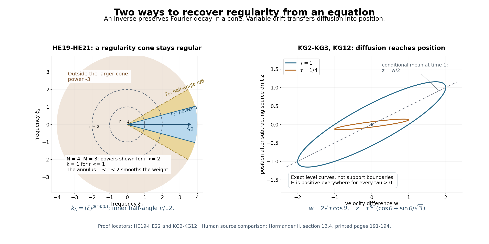

# Constant strength, regularity, and the directions of singularities

*Written by GPT-6.1 Sol (OpenAI), Ultra reasoning effort, October 2026. Self-checked by the writing AI. Original expression: CC0.*

A frozen operator can control a variable-coefficient equation when every frozen symbol measures the same derivatives. Here that agreement has a stronger consequence. If one frozen operator removes all singularities from homogeneous solutions, the variable equation gains its full symbol weight, and it preserves exactly the singular directions of its right-hand side. The necessity proof explains why: a rapidly modulated point source would otherwise leave a nonconstant limiting equation supported at a single point.

Read [Measuring regularity with weighted Fourier spaces](weighted-fourier-spaces.md), [Local regularity, sharp embeddings, and compactness](local-regularity-and-compactness.md), [Rescaled symbols and stable strength](rescaled-symbols-and-stable-strength.md), [Freezing coefficients without losing strength](freezing-coefficients-and-constant-strength.md), [Hypoellipticity and complex zeros](hypoellipticity-and-complex-zeros.md), [Symbols at infinity](symbols-at-infinity.md).

The wave-front assertions assume the Fourier cutoff definition of the smooth wave front set and its projection onto singular support. The Gaussian comparison uses tensor products, differentiation of compact distribution pairings, and the real Gaussian Fourier formula. A kernel-composition theorem for wave fronts is not an input: the proof gives its own angular-weight argument.

## A point source detects a bad frozen symbol

Use \(D=-i\partial\) and \(\widehat f(\xi)=\int e^{-ix\cdot\xi}f(x)\,dx\). The coefficients are smooth on a nonempty open set \(X\). Constant strength means that the nonzero frozen polynomials \(A(x,\cdot)\), for \(x\in X\), have equivalent full derivative norms. At a chosen \(x_0\), write the fixed weaker-polynomial expansion
\[
\begin{gathered}
P(\xi)\\
=A(x_0,\xi),\\
A(x,D)\\
=P(D)+\sum_{\nu=1}^q c_\nu(x)Q_\nu(D),\\
S_P(\xi,T)^2\\
=\sum_{\alpha}T^{2|\alpha|}|\partial^\alpha P(\xi)|^2,
\\
S_P(\xi)\\
=S_P(\xi,1).
\end{gathered}
\tag{HE1}
\]
Here \(c_\nu(x_0)=0\), \(Q_\nu\prec P\), and the sum of derivative norms is finite. A nonzero highest derivative gives a positive constant lower bound for \(S_P\). Uniform rescaled comparison says that \(S_Q(\xi,T)\le C_Q S_P(\xi,T)\) for every \(Q\prec P\) and \(T\ge1\). The finite-dimensional proof in the rescaled-symbol lesson is the input for this assertion.

**Lemma 1 (necessity from a point source).** Suppose that \(A\) is hypoelliptic on \(X\), in the sense that its singular support agrees with that of its argument. Every coefficient limit
\[
\begin{gathered}
P_j(\xi)=\frac{P(\xi+\eta_j)}{S_P(\eta_j)}\longrightarrow Q_0(\xi),
\\
\qquad |\eta_j|\longrightarrow\infty,
\end{gathered}
\tag{HE2}
\]
is a nonzero constant. Consequently, for every positive multi-index order,
\(\partial^\alpha P(\eta)/P(\eta)\to0\) on real frequencies going to infinity, and \(P\) is eventually nonzero there.

**Proof.** The one-weight-independent inverse theorem gives a small neighborhood \(Y\Subset X\) of \(x_0\), a compact global output, and
\[
\begin{gathered}
u=E\delta_{x_0}\in B_{\infty,S_P},\\
\qquad Au=\delta_{x_0}\\
\quad\hbox{on }Y.
\end{gathered}
\tag{HE3}
\]
Restrict this global distribution to \(X\). Hypoellipticity on \(X\) makes it smooth on \(Y\setminus\{x_0\}\), since its right-hand side is smooth there. We need no assertion about extending an arbitrary distribution on \(Y\) to \(X\).

The coefficients of \(P_j\) in(HE2) have bounded degree and bounded size. Moreover \(S_{P_j}(0)=1\); thus a coefficient limit exists along a subsequence and is nonzero. For each fixed weaker basis polynomial take the simultaneous coefficient limit
\[
\begin{gathered}
Q_{\nu,j}(\xi)\\
=\frac{Q_\nu(\xi+\eta_j)}{S_P(\eta_j)}\\
\longrightarrow Q_{\nu,\infty}(\xi),\\
v_j\\
=S_P(\eta_j)e^{-i(x-x_0)\cdot\eta_j}u.
\end{gathered}
\tag{HE4}
\]
Weak comparison bounds the finitely many coefficients of all these polynomials, so one subsequence suffices for the finite list.

For every \(\chi\in C_c^\infty(Y)\), weighted multiplication and the moderation of \(S_P\) give, with \(m=\deg P\),
\[
\begin{gathered}
|\widehat{\chi v_j}(\xi)|
\\
\le C_\chi\frac{S_P(\eta_j)}{S_P(\eta_j+\xi)}
\\
\le C'_\chi(1+|\xi|)^m.
\end{gathered}
\tag{HE5}
\]
The modulus of the constant centered phase is one. Compactness in the local weighted-space lesson, from the weight \((1+|\xi|)^{-m}\) to \((1+|\xi|)^{-m-1}\), applies to these fixed compact supports. Use a countable exhaustion of \(Y\) by compact cutoffs and a diagonal subsequence. We obtain \(v_j\to v\) locally in distributions, with locally uniform Fourier convergence for every cutoff. On overlapping cutoffs the limits agree because distribution limits are unique.

The exact identity
\(S_P(\eta_j+\xi)/S_P(\eta_j)=S_{P_j}(\xi)\)
and the first estimate in(HE5) imply
\[
\begin{gathered}
S_{Q_0}(\xi)|\widehat{\chi v}(\xi)|\\
\le C_\chi,\\
\left(Q_0(D)+\sum_{\nu=1}^q c_\nu(x)Q_{\nu,\infty}(D)\right)v\\
=\delta_{x_0}\\
\hbox{on }Y.
\end{gathered}
\tag{HE6}
\]
For the equation, conjugate \(Au=\delta_{x_0}\) by the centered modulation in(HE4) and divide the operator by \(S_P(\eta_j)\). Its right-hand side remains exactly \(\delta_{x_0}\). Its coefficients and all their local derivatives converge to those displayed. The polynomial Fourier bound in(HE5) also gives a common local finite-order distribution bound: Fourier inversion against a test is bounded by a sufficiently high test seminorm. This bound permits passage to the limit even when the transposed test operator varies with \(j\). In particular \(v\ne0\).

If \(\chi\) is supported away from \(x_0\), then \(\chi u\) is compact and smooth. Its Fourier transform is rapidly decreasing, and \(S_P(\eta_j)\le C\langle\eta_j\rangle^m\). For any fixed test, repeated integration by parts in the modulated smooth function shows \(\chi v_j\to0\). Thus \(\operatorname{supp}v\subset\{x_0\}\).

We spell out the point-support step. A distribution supported at one point has finite order \(r\) on a compact neighborhood. Subtract from a test its degree-\(r\) Taylor polynomial times a fixed cutoff equal to one there. The remainder has derivatives of order \(|\alpha|\le r\) equal to \(o(|x-x_0|^{r-|\alpha|})\). Multiply it by a cutoff of radius \(\epsilon\); Leibniz's formula shows its \(C^r\) norm tends to zero. Support at the point makes the original remainder pairing equal to this cutoff pairing, so the pairing vanishes. The distribution therefore depends only on the finite Taylor jet, and is a finite linear combination of delta derivatives. For a cutoff one near \(x_0\),
\[
\begin{gathered}
\widehat{\chi v}(\xi)\\
=e^{-ix_0\cdot\xi}R(\xi),\\
R\ne0\text{ a polynomial},\\
|Q_0(\xi)R(\xi)|\\
\le S_{Q_0}(\xi)|R(\xi)|\\
\le C.
\end{gathered}
\tag{HE7}
\]
A polynomial bounded on all real space is constant: restrict its highest nonzero homogeneous part to a real direction where it does not vanish and let the radius increase. Since the polynomial ring has no zero divisors, \(Q_0R\) is nonzero and its degree is the sum of the degrees. Both factors must be nonzero constants.

This applies to every normalized coefficient limit in(HE2). If some positive-order normalized derivative failed to tend to zero, coefficient compactness would supply a limit with a nonzero coefficient of positive order, a contradiction. Hence
\[
\begin{gathered}
\frac{\partial^\alpha P(\eta)}{S_P(\eta)}\longrightarrow0\\
\quad(|\alpha|\ge1),
\\
\qquad
\frac{|P(\eta)|}{S_P(\eta)}\longrightarrow1.
\end{gathered}
\tag{HE8}
\]
The second limit makes \(P\) eventually nonzero and converts the first into the claimed derivative ratios. This also covers a nonzero constant \(P\), for which the positive derivatives vanish. \(\square\)

## Distance to zeros pays for every commutator

For nonconstant \(P\), let \(d_P(\xi)\) be the Euclidean distance from the real vector \(\xi\) to its complex zero set. This zero set is nonempty: restricting a nonconstant polynomial to a suitable complex line yields a nonconstant one-variable polynomial. The distance is finite and 1-Lipschitz. If \(P(D)\) is hypoelliptic, apply Lemma 1 with the constant operator \(A=P\). The derivative criterion and Theorem 2.1 of the complex-zero lesson give
\[
\begin{gathered}
\Delta(\xi)\\
=1+d_P(\xi)\\
\ge c\langle\xi\rangle^a\\
\hbox{for some }a,c>0\text{ and all real }\xi.
\end{gathered}
\tag{HE9}
\]
The extension from large frequencies to all frequencies uses \(\Delta\ge1\) and compactness. The finite bootstrap below needs this positive power. Mere divergence of an arbitrary function would not be enough. Here the power follows from the written semialgebraic distance argument and its stated asymptotic prerequisites.

For every \(Q\prec P\), every \(T\ge1\) has the rescaled comparison in(HE1). Take \(T=\Delta\). When \(d_P\ge1\), the distance-derivative estimate gives
\(|\partial^\alpha P|\le C_\alpha |P|d_P^{-|\alpha|}\),
and \(\Delta\le2d_P\). When \(d_P\le1\), use \(\Delta\le2\) directly in the finite derivative norm. Thus
\[
\begin{gathered}
S_P(\xi,\Delta(\xi))\\
\le C S_P(\xi),\\
|\partial^\alpha Q(\xi)|\\
\le C_Q S_P(\xi)\Delta(\xi)^{-|\alpha|},\\
S_{\partial^\alpha Q}(\xi)\\
\le C_Q\frac{S_P(\xi)}{\Delta(\xi)}\\
(|\alpha|\\
\ge1).
\end{gathered}
\tag{HE10}
\]
The last assertion applies the preceding estimate to all derivatives of \(\partial^\alpha Q\) and uses \(\Delta\ge1\). Identically zero derivative polynomials are simply omitted. The bounded-distance argument includes real zeros; no ratio by \(P(\xi)\) is used there.

This estimate also transfers the required power to every equally strong frozen polynomial \(F\). Indeed \(S_F\asymp S_P\), and(HE10) for \(Q=F\) gives
\[
\begin{gathered}
\frac{\sum_{|\alpha|\ge1}|\partial^\alpha F(\xi)|^2}{S_F(\xi)^2}
\\
\le C\Delta(\xi)^{-2},\\
|F(\xi)|\\
\ge\tfrac12 S_F(\xi)\\
\hbox{for sufficiently large }|\xi|.
\end{gathered}
\tag{HE11}
\]
For each positive derivative order its ratio to \(F\) is \(O(\Delta^{-|\alpha|})\). Lemma 1.1 of the complex-zero lesson bounds the distance below by a constant divided by the sum of the corresponding fractional derivative ratios. Therefore \(1+d_F\ge c_F\Delta\) for large frequencies, and, after adjusting a positive constant on a compact set, everywhere. Equal strength preserves degree. If that degree is zero, all frozen symbols are nonzero constants instead and the scalar argument below applies.

**Theorem 2 (the full local symbol gain; Hörmander, 13.4.1).** If \(A\) has smooth coefficients and constant strength on \(X\), and one frozen polynomial \(P\) is hypoelliptic, then for every moderate \(k\), every \(1\le p\le\infty\), and every \(u\in\mathcal D'(X)\),
\[
\begin{gathered}
Au\in B_{p,k}^{\mathrm{loc}}(X)
\\
\quad\Longrightarrow\\
\quad
u\in B_{p,kS_P}^{\mathrm{loc}}(X).
\end{gathered}
\tag{HE12}
\]
In particular smoothness of \(Au\) on an open subset implies smoothness of \(u\) there.

**Proof.** Work first near a point with its own frozen polynomial, relabelled \(P\). Equations(HE9)–(HE11) give the positive power and(HE10) for that polynomial. Equivalent symbol norms will finally give the statement with the originally chosen frozen polynomial. Shrink to a neighborhood \(Y\) on which the one-inverse theorem and its compact-input gain apply. Every distribution has a finite-order bound on a slightly larger compact neighborhood. Choose \(L\) so large that, with \(k_* =\langle\xi\rangle^{-L}\), every compact localization of \(u\) belongs to \(B_{p,k_*}\); for finite \(p\) take \(L\) larger than the Fourier growth order plus \(n+1\). Set
\[
\begin{gathered}
K=kS_P,\\
\qquad k_j=\min(K,\Delta^j k_*),\\
\quad j=0,1,\ldots.
\end{gathered}
\tag{HE13}
\]
The distance weight is moderate since \(\Delta(\xi+h)\le\Delta(\xi)(1+|h|)\), and the minimum, product, and powers of positive moderate weights are moderate. In particular all the spaces used here are among those in the inverse theorem. Initially \(u\in B_{p,k_0}^{\mathrm{loc}}(Y)\). Pointwise,
\[
\begin{gathered}
k_{j+1}\le K,\\
\qquad k_{j+1}\le\Delta k_j,
\\
\qquad
\frac{k_{j+1}}{S_P}\le C\frac{k_j}{S_{\partial^\alpha Q_\nu}}\\
\quad(|\alpha|\ge1)
\end{gathered}
\tag{HE14}
\]
for nonzero derivative polynomials, by(HE10). Include \(Q_0=P,c_0=1\) in the finite list.

Assume \(u\in B_{p,k_j}^{\mathrm{loc}}(Y)\). For \(\chi\in C_c^\infty(Y)\), the exact product formula with \(D=-i\partial\) is
\[
\begin{gathered}
A(\chi u)\\
=\chi Au+
\sum_{\nu=0}^q\sum_{|\alpha|\ge1}
\frac{c_\nu(x)D^\alpha\chi(x)}{\alpha!}
(\partial_\xi^\alpha Q_\nu)(D)u.
\end{gathered}
\tag{HE15}
\]
Each term is compactly supported. Local differential estimates put the differentiated \(u\) in the weight \(k_j/S_{\partial^\alpha Q_\nu}\); compact smooth multiplication and(HE14) put the resulting term in \(B_{p,k_{j+1}/S_P}\). The data term has the same membership because \(k_{j+1}/S_P\le k\). Consequently
\[
\begin{gathered}
A(\chi u)\in B_{p,k_{j+1}/S_P}
\\
\quad\Longrightarrow\\
\quad
\chi u\in B_{p,k_{j+1}},
\end{gathered}
\tag{HE16}
\]
by the compact-input inverse corollary. This proves the next local membership for every cutoff. There is no infinite shrinkage of neighborhoods: all cutoffs are taken in the same smaller inverse neighborhood.

Moderation gives \(K\le C\langle\xi\rangle^{N+m}\) for some \(N\ge0\). Choose an integer \(J\) with \(aJ-L\ge N+m\). Equation(HE9) then yields
\[
\begin{gathered}
K\le C_J\Delta^J k_*,\\
\qquad
C_J'{}^{-1}K\le k_J\le K,
\\
\quad C_J'=\max(1,C_J).
\end{gathered}
\tag{HE17}
\]
After these finitely many steps \(u\in B_{p,K}^{\mathrm{loc}}(Y)\). The comparison is equivalence of weights; the minimum need not equal \(K\) exactly. Cover the coefficient open set by these neighborhoods. At different points the frozen full symbol norms are equivalent by constant strength, so their gain weights agree as local spaces. Both endpoints were included in every multiplication, differentiation, and inverse estimate.

If the frozen degree is zero, constant strength forces \(A=a(x)\) with \(a(x)\ne0\). Locally \(u=(Au)/a\); smooth multiplication proves(HE12) directly. Finally compact smooth data belong to every polynomially increasing Fourier weight. Applying(HE12) for those weights makes each localization of \(u\) rapidly decreasing in Fourier space and hence smooth by Fourier inversion. This proves the stated smooth conclusion. \(\square\)

## An angular weight preserves a regular direction

**Theorem 3 (Hörmander, 13.4.2).** Under Theorem 2's hypotheses,
\[
\begin{gathered}
\operatorname{WF}(u)\\
=\operatorname{WF}(Au),\\
\operatorname{sing\,supp}u\\
=\operatorname{sing\,supp}Au.
\end{gathered}
\tag{HE18}
\]

We prove the needed directional mapping before using the inverse. Suppose a compact distribution \(f\) has rapid Fourier decrease in a cone \(\Gamma_0\). Choose a smaller cone \(\Gamma_1\) whose spherical closure lies inside \(\Gamma_0\). For each desired integer \(N\ge1\), choose \(M\) larger than the global polynomial growth order of \(\widehat f\), and a smooth angular function \(b\) equal to \(N\) on \(\Gamma_1\), equal to \(-M\) outside \(\Gamma_0\), and between these values elsewhere. The transition lies in \(\Gamma_0\). Smooth Euclidean cutoffs on an annulus give this angular function also when \(n=1\). Let \(\beta(r)=0\) for \(r\le1\), \(\beta(r)=1\) for \(r\ge2\). Define
\[
\begin{gathered}
k_N(\xi)\\
= \exp\!\left(\beta(|\xi|)b(\xi/|\xi|)\log\langle\xi\rangle\right),\\
k_N\\
=1\\
\hbox{near }0.
\end{gathered}
\tag{HE19}
\]
This is a moderate weight, despite its different powers in different directions. Indeed \(\ell=\log k_N\) satisfies
\[
\begin{gathered}
|\ell(\xi)|\\
\le B\log\langle\xi\rangle,\\
|\nabla\ell(\xi)|\\
\le B'\frac{\log(e+|\xi|)}{1+|\xi|},\\
|\ell(\xi+h)-\ell(\xi)|\\
\le C\log(1+|h|).
\end{gathered}
\tag{HE20}
\]
For the last bound let \(H=|h|\). If \(H\le1\), the globally bounded gradient gives \(CH\), bounded by a constant times \(\log(1+H)\). If \(H\ge1\) and \(|\xi|\le2H\), use the first bound at both endpoints, whose radii are at most \(3H\). In the remaining case \(|\xi|>2H\), the segment stays at radius at least \(|\xi|/2\); the gradient bound gives \(C H\log(e+|\xi|)/(1+|\xi|)\). The function \(\log(e+r)/(1+r)\) is decreasing, so this is at most a constant times \(\log(1+H)\). Exponentiating proves the required polynomial shift bound with no fixed excess factor at \(h=0\).

The compact datum belongs to \(B_{\infty,k_N}\): use its global polynomial bound outside \(\Gamma_0\), its rapid decrease throughout the transition cone, and bounded frequencies separately. Apply the same inverse \(E\) from the freezing theorem to all these weights. For any compact smooth output cutoff \(\chi\),
\[
\begin{gathered}
Ef\in B_{\infty,k_NS_P},\\
|\widehat{\chi Ef}(\xi)|\\
\le C_{N,\chi}\langle\xi\rangle^{-N}\\
(\xi\in\Gamma_1).
\end{gathered}
\tag{HE21}
\]
Smooth multiplication preserves the weighted space, and \(S_P\) has a positive constant lower bound. The cone \(\Gamma_1\) is fixed while \(N\) varies. Thus every output base point is regular in those directions. This intermediate statement preserves directions; it does not assert that the inverse preserves base points.

**Proof of Theorem 3.** Fix \((x_0,\xi_0)\notin\operatorname{WF}(Au)\). Within an inverse neighborhood choose \(\chi\) compact and one near \(x_0\), and then \(\phi\) compact and one near \(x_0\) with support where \(\chi=1\). The cutoff-stable Fourier definition allows \(\phi\) to be chosen so that \(\widehat{\phi Au}\) is rapidly decreasing in a cone \(\Gamma_0\) containing \(\xi_0\). The compact left inverse gives on that neighborhood
\[
\begin{gathered}
\chi u=E A(\chi u)=E f_0+E f_1,
\\
\qquad f_0=\phi Au,
\\
\qquad f_1=(1-\phi)A(\chi u).
\end{gathered}
\tag{HE22}
\]
Here \(\phi A(\chi u)=\phi Au\) because its support lies where \(\chi=1\). Both data are compact. Equation(HE21) shows that \(Ef_0\) has no wave front in a smaller cone containing \(\xi_0\). The right inverse identity gives \(A Ef_1=f_1=0\) near \(x_0\). Theorem 2 makes \(Ef_1\) smooth there. Therefore \((x_0,\xi_0)\notin\operatorname{WF}(u)\).

For completeness, the reverse differential decrease uses only elementary Fourier estimates. If \(\chi_0u\) has rapid Fourier decrease in \(\Gamma_0\) and \(\chi_1\) is supported where \(\chi_0=1\), every term of \(\chi_1Au\) has transform
\[
(2\pi)^{-n}\widehat{\chi_1a_\alpha}*
\big(\eta^\alpha\widehat{\chi_0u}(\eta)\big)(\xi).
\tag{HE23}
\]
For \(\xi\) in a smaller cone, split the integration variable \(\eta\) into \(\Gamma_0\) and its complement. On the cone, the second factor has arbitrary polynomial decay; Peetre's inequality and the Schwartz first factor give arbitrary decay of the integral. Off the cone, angular separation gives \(|\xi-\eta|\ge c(|\xi|+|\eta|)\); the arbitrarily high decay of the first factor absorbs the global polynomial growth of the second and the integration volume. Bounded frequencies cause no difficulty. Thus \(\chi_1Au\) has rapid decay in the smaller cone. This proves \(\operatorname{WF}(Au)\subset\operatorname{WF}(u)\). Projecting the equality onto the base proves equality of singular supports. In the scalar case multiply by the smooth functions \(a\) and \(1/a\) locally for both inclusions. \(\square\)

## The frozen criterion and the definitions

**Definition 4 (Hörmander, 13.4.3).** A smooth differential operator is hypoelliptic on \(X\) if \(\operatorname{sing\,supp}u=\operatorname{sing\,supp}Au\) for every \(u\in\mathcal D'(X)\). It is microhypoelliptic if the corresponding wave front sets are equal. Differential decrease shows that only the inclusion from the right-hand side back to the solution needs proof. Microhypoellipticity implies hypoellipticity by projection.

**Theorem 5 (Hörmander, 13.4.4).** For a smooth operator of constant strength on \(X\), the following conditions are equivalent:
\[
\begin{gathered}
A\text{ is hypoelliptic};\\
A\text{ is microhypoelliptic};\\
A(x,D)\text{ is hypoelliptic}\\
\text{as a constant operator}\\
\text{for every }x\in X;\\
A(x,D)\text{ is hypoelliptic}\\
\text{for one }x\in X.
\end{gathered}
\tag{HE24}
\]

**Proof.** One frozen hypoelliptic symbol gives(HE9), its equally strong fellows satisfy(HE11), and Theorems2–3 prove the two variable-coefficient properties. In particular applying Theorem 2 to each constant frozen operator makes each of them hypoelliptic. Conversely if \(A\) is hypoelliptic, Lemma 1 at each point gives the derivative criterion(HE8). The complex-zero theorem converts that criterion into(HE9). Apply the proof of Theorem 2 to the constant operator with that polynomial: the proof uses precisely the distance power, the derivative estimate, and the compact inverse, so it proves its hypoellipticity without presupposing it. This gives every frozen hypoelliptic symbol. Microhypoellipticity implies hypoellipticity as in Definition 4, and the remaining implication from every point to one point is immediate. The scalar case was proved directly. \(\square\)

The restriction to constant strength matters. The last example proves it by an explicit kernel rather than by an appeal to an unspecified regularity theorem.

**Corollary (the source's elliptic comparison).** A smooth elliptic operator of fixed order \(m\) has the conclusions of Theorems2–3, with symbol gain equivalent to \(\langle\xi\rangle^m\). Indeed each frozen principal part has a positive minimum in absolute value on the real unit sphere. Outside a ball its full polynomial has absolute value at least \(c|\xi|^m\), while every derivative of positive order is \(O(\langle\xi\rangle^{m-|\alpha|})\). Its derivative ratios satisfy the distance criterion. The constant-operator proof of Theorem 2 therefore makes it hypoelliptic. Its full derivative norm is equivalent to \(\langle\xi\rangle^m\), including bounded frequencies by the positive highest-jet lower bound. All frozen symbols are consequently equally strong. Theorems2–3 apply to the variable operator. Order zero is the nowhere-zero scalar case. This proves the comparison for every smooth elliptic operator of fixed order, rather than only for the example in Exercise 1.

## Graded exercises with complete solutions

**Exercise 1 (entry: check a familiar gain).** For \(P(\xi)=1+|\xi|^2\), identify \(S_P\), its zero-distance growth, and the gain in(HE12) for \(k=\langle\xi\rangle^s\).

**Solution.** The value is \(1+|\xi|^2\), the first derivatives are \(2\xi_j\), and the only nonzero second derivatives are the \(n\) diagonal constants2. Thus
\[
\begin{gathered}
S_P(\xi)^2\\
=(1+|\xi|^2)^2+4|\xi|^2+4n\\
\asymp\langle\xi\rangle^4.
\end{gathered}
\tag{HE25}
\]
The complex zero equation is \(\zeta\cdot\zeta=-1\). Write \(\zeta=a+ib\) with \(a\cdot b=0\) and \(|b|^2=1+|a|^2\). For real \(\xi\), its squared distance is \(|\xi-a|^2+1+|a|^2\). This is at least \(1+|\xi|^2/2\) by completing the square in \(a\), so \(d_P\ge c\langle\xi\rangle\). A fixed zero gives the upper bound \(d_P\le C\langle\xi\rangle\); these bounds suffice in every dimension, including \(n=1\). The weighted gain is from \(B_{p,\langle\xi\rangle^s}\) to \(B_{p,\langle\xi\rangle^{s+2}}\), locally. No Hilbert restriction on \(p\) is needed.

**Exercise 2 (intermediate: nonelliptic anisotropy).** Let \(P(\xi,\tau)=\xi^2+i\tau\) in two real frequency variables. Show directly that the derivative criterion holds. Explain what the full gain measures.

**Solution.** For real frequencies,
\[
\begin{gathered}
S_P(\xi,\tau)^2\\
=\xi^4+\tau^2+4\xi^2+5,\\
S_P(\xi,\tau)\\
\asymp1+\xi^2+|\tau|.
\end{gathered}
\tag{HE26}
\]
The positive derivatives are \(2\xi,i,2\). The constant derivatives divided by \(P\) tend to zero. For the linear derivative, \(|2\xi/P|\le2/|\xi|\) when \(|\xi|\) is large, while it tends to zero with \(|\tau|\) when \(|\xi|\) is bounded. Splitting into these two regions proves the limit along every unbounded real sequence. The criterion and the constant-operator case of Theorem 2 prove hypoellipticity. The gain weights one time frequency like two spatial frequencies, rather than using only the total degree. Multiplying the weighted transform by \(\xi^2\) or \(\tau\) is bounded relative to \(S_P\), so the conclusion controls those derivatives in the data weight locally.

**Exercise 3 (intermediate: count the bootstrap steps).** Suppose \(\Delta\ge c\langle\xi\rangle^{1/3}\), \(S_P\le C\langle\xi\rangle^4\), \(k\le C\langle\xi\rangle^2\), and the initial local weight is \(k_*=\langle\xi\rangle^{-7}\). Give a sufficient step count, and say whether \(k_J=K\) is automatic.

**Solution.** We need \(J/3-7\ge6\), so \(J=39\) suffices. Indeed
\[
\begin{gathered}
K\le C\langle\xi\rangle^6\le C'\Delta^{39}\langle\xi\rangle^{-7},
\\
\qquad \min(K,\Delta^{39}k_*)\asymp K.
\end{gathered}
\tag{HE27}
\]
The constant contains \(c^{-39}\). Exact equality of the minimum to \(K\) is not automatic, since this comparison constant can exceed one. Equivalence proves the required weighted membership and is all that the proof uses.

**Exercise 4 (advanced: locate both essential steps in necessity).** Why is the centered modulation needed? Why does point support alone not force the limiting polynomial to be constant?

**Solution.** At the source, \(e^{-i(x-x_0)\cdot\eta_j}\delta_{x_0}=\delta_{x_0}\). An uncentered phase would put \(e^{-ix_0\cdot\eta_j}\delta_{x_0}\) on the right; its limit could depend on an additional subsequence and phase. Centering keeps the nonzero right-hand side fixed and immediately proves \(v\ne0\). Point support alone gives a polynomial Fourier factor \(R\); it does not bound that polynomial. The separate weighted limit in(HE6) gives \(S_{Q_0}|R|\le C\). The bounded nonzero polynomial product \(Q_0R\) in(HE7), together with degree additivity, is what forces both factors to be constant. Dropping either the nonzero equation or the weighted bound breaks the argument.

## Kolmogorov's comparison: smoothing produced by variable drift

Use coordinates \(p=(v,x,t)\) and the real operator
\[
\mathcal K=\partial_t+v\partial_x-\partial_v^2.
\tag{KG1}
\]
The source's \(-D_1^2+x_1iD_2-iD_3\), with \(D=-i\partial\), is \(\partial_v^2+v\partial_x-\partial_t\). Multiplication by minus one and reflection of the spatial coordinate turn it into(KG1). A nonzero scalar and an invertible reflection preserve the local smoothness question by the chain rule. We prove that \(\mathcal K\) is hypoelliptic although none of its frozen operators is.

For \(\tau>0\), define the probability density
\[
\begin{gathered}
H_\tau(w,z)\\
=\frac{\sqrt3}{2\pi\tau^2}
\exp\!\left(-\frac{w^2}{4\tau}
-\frac{3(z-\tau w/2)^2}{\tau^3}\right),\\
G(w,z,\tau)\\
=\mathbf1_{\{\tau>0\}}H_\tau(w,z).
\end{gathered}
\tag{KG2}
\]
The indicator is interpreted as a locally integrable distribution; its value at \(\tau=0\) is irrelevant. Integrate first in \(z\), then \(w\); the elementary one-dimensional Gaussian integral gives mass1. On bounded time intervals this mass also proves local integrability in all three variables. Its covariance and spatial Fourier transform are
\[
\begin{gathered}
\Sigma_\tau=
\begin{pmatrix}2\tau&\tau^2\\\tau^2&2\tau^3/3\end{pmatrix},
\\
\qquad \det\Sigma_\tau=\tau^4/3>0,
\\
\qquad
\widehat H_\tau(\alpha,\beta)
=e^{-\tau\alpha^2-\tau^2\alpha\beta-\tau^3\beta^2/3}.
\end{gathered}
\tag{KG3}
\]
Here the Fourier transform acts only on \((w,z)\). These formulas follow by completing the square in(KG2), or by setting \(w=\sqrt\tau W\), \(z=\tau^{3/2}Z\) and doing the two one-dimensional Gaussian integrals. For the Fourier Gaussian integral itself, differentiating its transform in frequency and integrating by parts gives the first-order equation \(F'(a)=-2c aF(a)\); its value at zero fixes the constant. Thus no stochastic assertion is an input to this proof.

Direct differentiation of the last expression in(KG3) gives both equations
\[
\begin{gathered}
(\partial_\tau-\beta\partial_\alpha+\alpha^2)\widehat H_\tau=0,
\\
\qquad
(\partial_\tau+(\alpha+\tau\beta)^2)\widehat H_\tau=0.
\end{gathered}
\tag{KG4}
\]
Spatial Fourier inversion yields the forward and backward spatial equations. Also \(H_\tau\to\delta_{(0,0)}\) as \(\tau\downarrow0\): use the displayed scaling and dominated convergence against a compact test. Integrating by parts in time from \(\epsilon\) and passing to zero gives the boundary mass. Therefore, as distributions,
\[
\begin{gathered}
(\partial_\tau+w\partial_z-\partial_w^2)G\\
=\delta_0,\\
\big(\partial_\tau-(\partial_w+\tau\partial_z)^2\big)G\\
=\delta_0.
\end{gathered}
\tag{KG5}
\]
The spatial terms have no time derivative and acquire no additional boundary term. Each time derivative has jump coefficient equal to the spatial delta just proved.

For a source \(y=(v_0,x_0,s)\), put
\[
\begin{gathered}
g(p,y)\\
=G(v-v_0,\ x-x_0-(t-s)v_0,\ t-s).
\end{gathered}
\tag{KG6}
\]
This is defined as a distribution on pairs of points by the smooth change of variables \((p,y)\leftrightarrow(w,z,\tau,y)\), of Jacobian1. In the output variables, \(\partial_t+v\partial_x\) becomes \(\partial_\tau+w\partial_z\). In the source variables, \(\partial_s+v_0\partial_{x_0}\) becomes \(-\partial_\tau\), and \(\partial_{v_0}\) becomes \(-\partial_w-\tau\partial_z\). The bilinear formal transpose is \(\mathcal K_y^t=-\partial_s-v_0\partial_{x_0}-\partial_{v_0}^2\), since the drift has zero divergence. Thus(KG5) proves
\[
\begin{gathered}
\mathcal K_p g(p,y)=\delta(p-y),\\
\qquad
\mathcal K_y^t g(p,y)=\delta(p-y).
\end{gathered}
\tag{KG7}
\]
Both signs and the source-drift dependence matter: a right fundamental kernel alone would not give the localized left identity used below.

We give a precise distributional meaning to its action on a compact datum. Define
\[
\begin{gathered}
(v,x,t)\circ(w,z,\tau)
\\
=(v+w,\ x+z+\tau v,\ t+\tau),\\
(v,x,t)^{-1}\\
=(-v,-x+tv,-t).
\end{gathered}
\tag{KG8}
\]
This associative smooth multiplication has identity0; direct expansion verifies associativity. Both left and right translation have Jacobian1. Equation(KG6) is \(g(p,y)=G(y^{-1}\circ p)\). For \(f\in\mathcal E'(\mathbb R^3)\), define
\[
\begin{gathered}
\langle Tf,\psi\rangle
\\
=\langle f(y)\otimes G(q),\ \psi(y\circ q)\rangle,\\
\mathcal K Tf\\
=f,\\
T\mathcal K f\\
=f.
\end{gathered}
\tag{KG9}
\]
The pairing includes a compact cutoff equal to one near the relevant supports. This is legitimate and independent of that cutoff: if \(y\) is in a fixed compact neighborhood of \(\operatorname{supp}f\) and \(y\circ q\) lies in \(\operatorname{supp}\psi\), then \(q=y^{-1}\circ p\) lies in a compact set. The written tensor-product theorem therefore supplies a continuous distribution pairing, without multiplying two singular distributions in a common variable. Here is a direct check of both identities on the moving test \(\psi(y\circ q)\). Applying \(\mathcal K_p^t\) to \(\psi\) and then substituting \(p=y\circ q\) is the same as applying \(-\partial_\tau-w\partial_z-\partial_w^2\) to that moving test, with \(y\) fixed. Integration by parts against \(G\) uses the first identity in(KG5) and gives \(\langle f,\psi\rangle\). For the left identity, moving \(\mathcal K f\) onto the test in the \(y\) variables, with \(q\) fixed, gives \(-\partial_\tau-(\partial_w+\tau\partial_z)^2\) acting in \(q\). Indeed \(\partial_s+v_0\partial_{x_0}\) on the moving test is \(\partial_\tau\) in \(q\), and \(\partial_{v_0}\) is \(\partial_w+\tau\partial_z\). Integrating this expression against \(G\) uses the second identity in(KG5) and gives the same pairing. Cutoffs are one on the full compact pairing region, so their derivatives contribute zero. This proves(KG9) for compact distributions directly. No claim that \(Tf\) is compact is needed.

Two smoothing properties of \(T\) now suffice. First, if \(f\) is compact and smooth, changing from \(y\) to \(q=y^{-1}\circ p\), again with Jacobian1, gives \(Tf(p)=\langle G(q),f(p\circ q^{-1})\rangle\). For \(p\) in a compact set these moving smooth tests have a common compact support in \(q\). The smooth-parameter pairing lemma makes \(Tf\) smooth.

Second, \(g(p,y)\) is smooth off the diagonal. It is already smooth where \(\tau\ne0\). At \(\tau=0\), away from the diagonal, \((w,z)\ne(0,0)\). For \(0<\tau\le1\),
\[
\begin{gathered}
\frac{w^2}{4\tau}+\frac{3(z-\tau w/2)^2}{\tau^3}
\\
\ge\frac{w^2+z^2}{12\tau}.
\end{gathered}
\tag{KG10}
\]
Indeed \(z^2\le2(z-\tau w/2)^2+\tau^2w^2/2\), which bounds \(w^2+z^2\) by \(3w^2/2+2(z-\tau w/2)^2\); the displayed constant is smaller than the resulting valid constants for both terms. On a compact set with \(w^2+z^2\ge\epsilon^2\), every derivative of(KG2) is bounded by a finite negative power of \(\tau\) times \(e^{-\epsilon^2/(12\tau)}\). Derivatives in both source and output variables have the same property on compact sets, by(KG6). All such derivatives tend to zero as \(\tau\downarrow0\), so extending by zero for negative time is smooth there. For a compact distribution supported away from an output neighborhood, pairing this smooth off-diagonal kernel with the datum is smooth on that neighborhood, by the same smooth-parameter lemma.

**Proposition 6 (the full comparison).** The operator \(\mathcal K\) is hypoelliptic. Its frozen operators are all nonhypoelliptic, and it fails constant strength on every nonempty open set.

**Proof.** If \(\mathcal Ku\) is smooth near a point, choose \(\chi\) compact and one near it. The left identity gives \(\chi u=T\mathcal K(\chi u)\). Choose a second cutoff \(\phi\) one near that point, supported where \(\chi=1\). Split the compact datum into \(\phi\mathcal Ku\), which is smooth, and \((1-\phi)\mathcal K(\chi u)\), whose support avoids the point. The two smoothing properties just proved make both images smooth near it. Hence \(u\) is smooth there. A differential operator cannot introduce singular support, so the singular supports agree for every distribution on every coefficient open set.

At a frozen velocity \(v_0\), the operator is \(\mathcal K_{v_0}=\partial_t+v_0\partial_x-\partial_v^2\). The nonsmooth distribution \(\delta(x-v_0t)\), independent of \(v\), solves its homogeneous equation. This can be checked in the linear coordinates \((v,x-v_0t,t)\): transport is differentiation in the last coordinate and the distribution is constant there and in \(v\). Thus no frozen operator is hypoelliptic. Its polynomial and derivative norm satisfy
\[
\begin{gathered}
P_{v_0}(\xi_v,\xi_x,\tau)\\
=\xi_v^2+i(\tau+v_0\xi_x),\\
S_{P_{v_0}}^2\\
=|P_{v_0}|^2+4\xi_v^2+v_0^2+5.
\end{gathered}
\tag{KG11}
\]
For two distinct velocities \(v_0,v_1\), take frequencies \((0,R,-v_0R)\). The norm for \(v_0\) is the constant \(\sqrt{v_0^2+5}\), while that for \(v_1\) grows like \(|v_1-v_0||R|\). They are not equally strong. Every nonempty open set contains two distinct velocity values, proving the last assertion. \(\square\)

The kernel illustrates the mechanism: velocity has variance proportional to \(\tau\), while spatial position has variance proportional to \(\tau^3\), with a nonzero covariance. Variable drift transports the diffusion into the spatial direction. Freezing that drift removes this transfer, leaving a nonsmooth invariant distribution.

## Two exercises for the comparison

**Exercise 5 (intermediate: exact covariance and contours).** Recover the covariance in(KG3) directly from(KG2), and describe its exponent-one contour at \(\tau=1\).

**Solution.** Complete the square as already displayed. The marginal \(w\) has mean0 and variance \(2\tau\). Conditional on \(w\), \(z\) has mean \(\tau w/2\) and independent residual variance \(\tau^3/6\). Thus \(\operatorname{Cov}(w,z)=\tau^2\), and \(\operatorname{Var}z=\tau^2(2\tau)/4+\tau^3/6=2\tau^3/3\). At time1 the exponent-one contour has exact parametrization
\[
\begin{gathered}
w=2\cos\theta,\\
\qquad
z=\cos\theta+\frac{\sin\theta}{\sqrt3},\\
\quad0\le\theta\le2\pi.
\end{gathered}
\tag{KG12}
\]
Substitution gives \(w^2/4+3(z-w/2)^2=1\). It is a density contour, with value \(\sqrt3e^{-1}/(2\pi)\), rather than a support boundary. The density is positive at every spatial point for every positive time.

**Exercise 6 (advanced: a localization trap).** In the proof of Proposition 6, why can the commutator datum be smoothed by the off-diagonal kernel, while \(\mathcal K(\chi u)\) as a whole cannot be treated that way? Why does freezing at \(v_0\) not preserve the argument?

**Solution.** The whole datum can contain a singularity at the output point, where the kernel is singular on the diagonal. After splitting by \(\phi\), the remainder has compact support separated from a smaller output neighborhood; every source-output pair is off the diagonal, and all kernel derivatives can be paired against that fixed compact distribution. The part \(\phi\mathcal Ku\) is handled by smooth-input pairing, which does not need a smooth kernel at the diagonal. For the frozen operator, the spatial motion is the deterministic drift \(v_0\tau\), so its retarded kernel has a delta factor on \(x-x_0=v_0\tau\) for positive time. It is singular off the full diagonal, and the second smoothing property fails. The explicit homogeneous distribution in Proposition 6 gives the resulting obstruction directly.

## Figure: the two mechanisms

**Figure 1.** Left: a two-dimensional frequency section of(HE19)–(HE21), with \(\Gamma_1\) having half-angle \(\pi/12\) and \(\Gamma_0\) half-angle \(\pi/6\) about \((1,0)\). For the plotted example \(N=4,M=3\), at radius at least2 the outer region has the power \(-3\), the inner region has the power4, and the transition is inside the larger regularity cone. The circles of radii1 and2 mark the radial cutoff zone, and \(k_N=1\) at radius at most1; these are chosen plotting weights, not universal constants in the theorem. Right: the exact exponent-one contour(KG12), together with its positive-time images \((w,z)=(\sqrt\tau W,\tau^{3/2}Z)\) at \(\tau=1/4,1\). The dashed line \(z=w/2\) is the conditional mean at time1; the covariance is \(\Sigma_1\) in(KG3). These curves are density contours, not support bounds or sampled wave fronts. The frozen invariant \(x-v_0t\) and the contrast with the variable drift are proved in(KG11) and Proposition 6. Reproducible figure sources and exact metadata accompany this lesson; human source comparison is Hörmander's section 13.4.

## References

- Lars Hörmander, *The Analysis of Linear Partial Differential Operators II: Differential Operators with Constant Coefficients*, Springer, sections 13.3–13.5.
- Gerd Grubb, author-hosted lecture chapter §5, *Fourier transformation of distributions*, §§5.1–5.3, from the 2007–2008 lecture notes for *Distributions and Operators*. [Exact freely readable chapter](https://www.math.ku.dk/~grubb/dist5.pdf). [Author's lecture-note index](https://web.math.ku.dk/~grubb/distribution.htm). Fourier and tempered-distribution background; the proofs use the written lessons cited here.
- Written proof inputs: [Freezing coefficients without losing strength](freezing-coefficients-and-constant-strength.md#one-inverse-for-every-weighted-scale), Theorem 4.1 and Corollary 4.2; [Hypoellipticity and complex zeros](hypoellipticity-and-complex-zeros.md#retreat-from-real-space-has-a-polynomial-rate), Lemma 1.1 and Theorem 2.1; and [Tensor products and parameter-dependent distributions](../prerequisites/tensor-products-and-parameters.html#pairing-with-a-moving-smooth-test), Lemma 1.1, Theorem 2.1 and Corollary 2.2. The angular-weight argument (HE19)–(HE23) and Gaussian comparison (KG1)–(KG12) are proved here; wavefront projection retains its stated incoming scope.
- Francesca Anceschi and Sergio Polidoro, *A survey on the classical theory for Kolmogorov equation*, [arXiv:1907.05155](https://arxiv.org/abs/1907.05155). Section 1 presents the explicit Gaussian fundamental solution that Kolmogorov found in 1934 for this degenerate equation; Section 2 treats Kolmogorov operators with constant coefficients, their fundamental solutions and their hypoellipticity.
