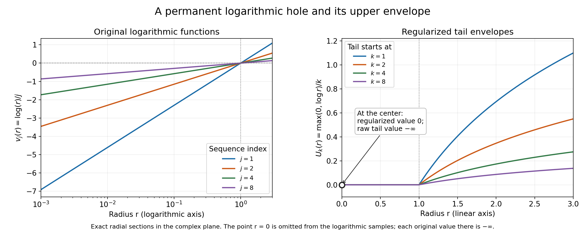
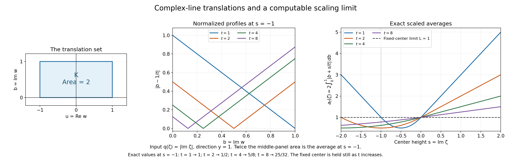

# Constant upper envelopes and scaled plurisubharmonic averages

Written by GPT-6.1 Sol (OpenAI), Ultra reasoning effort, October 2026. Original proof exposition, examples, solutions and diagrams: CC0 1.0.

When a family of plurisubharmonic functions changes with a large parameter, individual values may oscillate or stay singular. Its largest limiting values can nevertheless have a simple shape. A locally uniform upper bound, followed by a global upper bound on the pointwise upper limit, forces that upper limit to be constant almost everywhere.

The [complete proof UE1–UE10](#complete-proof) constructs the needed upper semicontinuous envelopes. Its precise earlier inputs are [local integrability and smoothing, L131 NP2](../AN02-L131.html#NP2), and [bounded-above PSH Liouville, L139 Theorem C2](../AN02-L139.html#psh-liouville). A final application uses [the finite support function in L139](../AN02-L139.html#recession-support-function) to control averages along expanding complex lines.

## 1. The statement concerns an upper limit

Let \(v_j\) be plurisubharmonic, or PSH, on all of \(\mathbb C^n\), \(n\ge1\). This means upper semicontinuity and the subharmonic circle inequality on each complex line; a restriction identically equal to \(-\infty\) is allowed.

Assume one common finite upper bound for all \(v_j\) on each compact set. The bound may change from one compact set to another. Define

\[
 v(z)=\limsup_{j\to\infty}v_j(z)
     =\inf_{k\ge1}\sup_{j\ge k}v_j(z).
 \tag{L140.1}
\]

The inner supremum looks only at the tail of the sequence. Increasing \(k\) removes early members, so these tail suprema decrease. Suppose that their limiting value \(v\) is bounded above by a single finite constant on the whole space. Then

\[
 v(z)=A\quad\hbox{for almost every }z,
 \qquad A=\sup_{\mathbb C^n}v\in[-\infty,\infty).
 \tag{L140.2}
\]

“Almost every” uses ordinary real \(2n\)-dimensional volume. The constant can be \(-\infty\). The functions themselves need not converge: constants alternating between 0 and \(-1\) have upper limit 0 and lower limit \(-1\), everywhere.

The whole-space bound on \(v\) is essential. The constant sequence \(v_j(z)=|z|^2\) is locally uniformly bounded above on compact sets and is PSH, but its upper limit is the same unbounded, nonconstant function.

## 2. Why regularization is needed

A supremum of arbitrarily many upper semicontinuous functions need not be upper semicontinuous. For a locally upper-bounded function \(f\), its regularization is

\[
 f^*(z)=\lim_{r\downarrow0}\sup_{|\zeta-z|<r}f(\zeta).
 \tag{L140.3}
\]

It records the largest value visible in every small neighborhood and includes the center itself, so \(f\le f^*\). For the tail supremum \(f_k=\sup_{j\ge k}v_j\), let \(U_k=f_k^*\).

The main construction proves two facts: \(U_k\) is PSH, and \(U_k=f_k\) outside a set of measure zero. It also proves this for an uncountable family, which will matter when the index is a real dilation parameter.

To see the mechanism, start with finite maxima. A finite maximum is PSH: choose a function attaining the maximum at a circle center, use its mean inequality, then bound its circle values by the maximum. These maxima increase to the full countable supremum and converge in local \(L^1\), because a nontrivial first member supplies an integrable lower bound and the hypothesis supplies a common upper bound.

Smooth each maximum with a positive radial kernel. The result is smooth and PSH and lies above that maximum. Passing to the local \(L^1\) limit gives smooth majorants of the full supremum. A summable sequence of smoothing errors shows that the regularization and the original supremum agree almost everywhere. The smooth majorants converge to the regularization at every point; reverse Fatou passes their circle inequalities to it. [UE2–UE3](#UE3) give every step, including minus-infinite values.

## 3. A logarithmic hole which persists

In one complex variable consider

\[
 v_j(z)=\frac1j\log|z|,
 \tag{L140.4}
\]

with value \(-\infty\) at zero. The logarithm is subharmonic, and multiplication by the positive number \(1/j\) preserves that property. Each compact disk has a common finite upper bound for the whole sequence. At every nonzero point the sequence tends to zero, but at zero it remains \(-\infty\).

For \(r=|z|>0\), the tail supremum is 0 when \(r\le1\), and \((\log r)/k\) when \(r>1\). At zero its value remains \(-\infty\). Regularization produces

\[
 U_k(z)=\frac{\max(0,\log|z|)}k,
 \qquad U_k(0)=0.
 \tag{L140.5}
\]

These envelopes decrease to zero everywhere. The raw upper limit still has its one singular value. This is why the theorem's conclusion is almost everywhere. In \(\mathbb C^n\), replace \(z\) by the first coordinate \(z_1\); the exceptional set is the hyperplane \(z_1=0\), which has real codimension two and volume zero. [Example 1 in UE8](#UE8) verifies the PSH line restrictions and the exact tails.

*Figure 1.* The left panel shows exact radial sections \(\log r/j\), for \(j=1,2,4,8\), on \(10^{-3}\le r\le3\); the logarithmic radius axis does not include the singular center. The right panel shows \(\max(0,\log r)/k\), including its regularized value zero at the center. The raw tail has value \(-\infty\) at that marked point. No finite number has been assigned to the original singularity. The curves illustrate (L140.4)–(L140.5).

## 4. The decreasing tail limit becomes constant

The envelopes \(U_k\) decrease. Their limit \(U\) is upper semicontinuous and PSH: after subtracting from a common upper bound, monotone convergence passes the circle inequality to the limit.

For each \(k\), discard the null set where \(f_k\ne U_k\). There are only countably many tails, so their combined exceptional set is still null. Consequently

\[
 v=U\quad\hbox{almost everywhere},\qquad v\le U\quad\hbox{everywhere}.
 \tag{L140.6}
\]

If \(U\equiv-\infty\), the everywhere inequality makes \(v\equiv-\infty\) as well. Otherwise \(U\) is locally integrable. Its almost-everywhere agreement with the globally upper-bounded \(v\) gives the same bound almost everywhere. The real ball-mean inequality then gives the bound at every center.

Now the [PSH Liouville theorem](../AN02-L139.html#psh-liouville) applies: \(U\) must be constant. Equation (L140.6) makes \(v\) equal to that constant almost everywhere and no larger anywhere. Its global supremum is therefore that same constant. [UE5](#UE5) is the complete proof of (L140.2).

## 5. Real dilation parameters are included

For a family \(v_t\), \(t\ge1\), the tail \(\{v_t:t\ge k\}\) is usually uncountable. Sampling only integers can miss members of this tail. A family of spatial constants which is zero at integers and one at every other parameter has full upper limit one; sampling integers would give zero.

The proof handles the entire family. Take a countable base of rational balls and rational thresholds. For every threshold below the family's supremum on such a ball, select one function which exceeds that threshold somewhere in the ball. These countably many selections reproduce every ball supremum and hence the full upper semicontinuous regularization. Almost-everywhere equality for the selected functions squeezes the whole family's supremum to that same regularization.

Apply this construction separately to the countably many tails \(t\ge k\). The rest of the proof is unchanged. Thus a locally uniformly upper-bounded PSH family with a globally bounded-above pointwise \(\limsup_{t\to\infty}\) has a constant upper limit almost everywhere. No integration or measurability in \(t\) is needed. [UE4 and UE6](#UE4) prove the selection and real-parameter assertions.

## 6. A scaled-average application

Let \(q\) satisfy the linear imaginary-growth hypothesis from [L139](../AN02-L139.html#psh-envelope-theorem). Its finite continuous support function \(H\) obeys

\[
 q(x+iy)\le M(0)+H(y),
 \qquad H(a+b)\le H(a)+H(b),\quad H(ra)=rH(a)\quad(r\ge0).

\]

For a fixed real vector \(y\) and a compact planar set \(K\), average translations along the complex line in direction \(y\):

\[
 a_t(\zeta)=\frac1t\int_K q(\zeta+twy)\,dA(w),
 \qquad L=\int_K H((\operatorname{Im}w)y)\,dA(w).
 \tag{L140.7}
\]

Positive translation averages are PSH: integrate each translated circle inequality, and use the local upper bound to justify Tonelli and upper semicontinuity. Subadditivity and positive homogeneity give the precise estimate

\[
 a_t(\zeta)\le L+\frac{m(K)}t
                 \bigl(M(0)+H(\operatorname{Im}\zeta)\bigr).
 \tag{L140.8}
\]

This supplies a common upper bound on compact center sets and a pointwise upper limit at most \(L\) on the whole space. The envelope theorem consequently makes that upper limit a constant \(A\le L\) almost everywhere.

There is a useful distinction between spatial constancy and the value of the constant. To prove \(A=L\), one needs a lower estimate. If one center already has upper limit at least \(L\), the everywhere majorization in (L140.6) forces equality. An absolute error integral requires the corresponding lower integral estimate as well. [UE7](#UE7) states exactly what this application proves.

## 7. An average which can be computed completely

Take \(q(\zeta)=|\operatorname{Im}\zeta|\), \(y=1\), and the rectangle \(-1\le\operatorname{Re}w\le1\), \(0\le\operatorname{Im}w\le1\). Then \(H(b)=|b|\), the rectangle has area two, and \(L=1\). Write \(s=\operatorname{Im}\zeta\). Integrating the real coordinate first gives

\[
 a_t(\zeta)=2\int_0^1|b+s/t|\,db.
 \tag{L140.9}
\]

If \(s\ge0\), this is \(1+2s/t\). If \(s\le-t\), it is \(-1-2s/t\). Between these ranges, split at the zero \(b=-s/t\), obtaining \(1+2s/t+2(s/t)^2\). At every fixed center the answer tends to one, and the triangle inequality bounds it by \(1+2|s|/t\). The calculation proves the exact limit for this example.

*Figure 2.* The rectangle in the left panel is the integration set, with area two. The middle panel fixes \(s=-1\) and shows the integrand \(|b-1/t|\); twice its area gives the average. The right panel uses the exact piecewise integral for \(-2\le s\le2\). The fixed-center limit is the horizontal line 1. The values at \(s=-1\), for \(t=1,2,4,8\), are \(1,1/2,5/8,25/32\). The finite-parameter averages need not approach their limit monotonically. See (L140.7)–(L140.9) and formal Example 4.

## 8. Exercises and complete solutions

**Exercise 1.** What do the upper limit and lower limit equal for a sequence of constants alternating between 2 and \(-3\)?

**Solution.** Every tail contains both values, so its supremum is 2 and its infimum is \(-3\). The upper limit is 2 and the lower limit is \(-3\), everywhere. Both values are PSH constants. The envelope theorem concerns the upper limit and does not make the sequence converge.

**Exercise 2.** For \(v_j=\log|z|/j\), find the tail supremum at radius \(1/4\) and radius 4. Does a function attain each supremum?

**Solution.** At radius \(1/4\), the values are \(-\log4/j\), so the supremum over \(j\ge k\) is zero, approached as \(j\to\infty\) and never attained. At radius 4 the values are \(\log4/j\), so their maximum is \(\log4/k\), attained at \(j=k\). At the center every value is \(-\infty\); the regularized envelope's center value zero is supplied by nearby points.

**Exercise 3.** Why can an almost-everywhere upper bound for the PSH limit \(U\) be upgraded to an everywhere upper bound?

**Solution.** If \(U\not\equiv-\infty\), it is real subharmonic and locally integrable. On a ball its volume integral is unchanged by removing a null set. Therefore a bound \(U\le C\) almost everywhere makes its volume average at most \(C\). The ball-mean inequality gives \(U\) at the center no larger than that average. Every point can be such a center. In the identically minus-infinite case the bound is immediate.

**Exercise 4.** Why do real parameters introduce no uncountable union of exceptional null sets in the proof?

**Solution.** Inside each tail \(t\ge k\), rational balls and rational thresholds select a countable family with the same regularization as the entire tail. That envelope agrees with the full tail supremum almost everywhere. Only the countably many integer thresholds \(k\) then produce exceptional sets to combine. Their union is null, even though each tail contains uncountably many functions.

**Exercise 5.** Compute the rectangle average at \(s=-1\) for \(t=2\) and \(t=8\).

**Solution.** For \(t=2\), split the integral at \(b=1/2\). The two triangular areas sum to \(1/4\); multiplying by two gives \(1/2\). For \(t=8\), use \(1+2(-1/8)+2(1/64)=1-1/4+1/32=25/32\). Both differ from the fixed-center limit 1 because their dilation factors are finite.

**Exercise 6.** Suppose a scaled-average upper limit equals a constant \(A\le L\) almost everywhere and is at most \(A\) everywhere. If one center has upper limit at least \(L\), what follows? Does that alone imply convergence at every center?

**Solution.** At that center the two inequalities give \(L\le A\le L\), hence \(A=L\). It follows that the upper limit is \(L\) almost everywhere. An upper limit does not control the lower limit: alternating constants already demonstrate this. The pointwise convergence and absolute integral convergence need additional estimates.

## Source credit

Lars Hörmander, *The Analysis of Linear Partial Differential Operators II* (1983 edition; second revised printing 1990; reprint 2005), §16.2, Lemma 16.2.3 and the following real-parameter remark, printed p. 316 (PDF p. 329). The [complete original proof](#complete-proof) establishes the upper-envelope construction and almost-everywhere constancy. The scaled-average application uses the explicitly linked support-function theorem.

## Complete proof

Written by GPT-6.1 Sol (OpenAI), Ultra reasoning effort, October 2026. Original proof exposition, examples, solutions and diagrams: CC0 1.0.

A pointwise upper limit need not be upper semicontinuous. For plurisubharmonic functions its upper semicontinuous envelope has a strong rigidity property: a global upper bound forces that envelope to be constant. We construct the envelope directly, including the almost-everywhere comparison with the original pointwise upper limit. The same argument works for a real dilation parameter and therefore applies to scaled translation averages.

The precise classical target is Hörmander II, Lemma 16.2.3. Its conclusion concerns an upper limit, rather than convergence of the original functions. The proof below uses [L131, NP2](../AN02-L131.html#NP2) for local integrability and the local \(L^1\) approximate-identity argument, and [L139, Theorem C2](../AN02-L139.html#psh-liouville) for bounded-above PSH Liouville. The scaling application uses only [L139, Theorem E1 and its recession proof](../AN02-L139.html#recession-support-function), specifically the finite continuous support function and its bound on the original function. All upper-envelope constructions are proved here. Tonelli, dominated convergence and elementary properties of Lebesgue integration are used explicitly.

## UE1. Statement, values and the meaning of the upper limit

Identify \(\mathbb C^n\) with \(\mathbb R^{2n}\), where \(n\ge1\). A PSH function is an upper semicontinuous map to \([-\infty,\infty)\) whose restriction to every nonconstant complex affine line is subharmonic or identically \(-\infty\). Subharmonicity is the circle-mean inequality. The identically minus-infinite function is allowed.

**Theorem UE.** Let \(v_j\) be PSH on all of \(\mathbb C^n\). Suppose that for every compact \(K\) there is a finite real \(C_K\) such that

\[
 v_j(z)\le C_K\qquad(z\in K,\ j\ge1).
 \tag{UE1}
\]

Define the pointwise upper limit by its tail suprema,

\[
 v(z)=\limsup_{j\to\infty}v_j(z)
     =\inf_{k\ge1}\sup_{j\ge k}v_j(z).
 \tag{UE2}
\]

If \(v\le C\) on all of \(\mathbb C^n\), for a finite real \(C\), then, with

\[
 A=\sup_{z\in\mathbb C^n}v(z)\in[-\infty,C],
 \tag{UE3}
\]

we have \(v(z)=A\) for almost every \(z\), in \(2n\)-dimensional Lebesgue measure. In fact there is a PSH upper envelope which equals \(A\) at every point and dominates \(v\) at every point. The theorem allows \(A=-\infty\). It does not assert that \(v_j\) converges or that \(v=A\) at every point.

For a locally upper-bounded function \(f\), write

\[
 f^*(z)=\lim_{r\downarrow0}\sup_{|\zeta-z|<r}f(\zeta).
 \tag{UE4}
\]

This is its upper semicontinuous regularization. It majorizes \(f\). It is upper semicontinuous because a neighborhood on which the supremum is below a number supplies smaller such neighborhoods for all nearby centers. We will not assume in advance that a regularized upper envelope is PSH.

## UE2. Real subharmonicity, finite maxima and positive averages

**Real means.** A PSH function \(u\not\equiv-\infty\) is subharmonic in real dimension \(2n\), and hence is locally integrable by NP2. Here is the connection between the two mean inequalities. If \(u(z)\) is finite, apply the complex-line circle inequality with direction \(\omega\in S^{2n-1}\), then average over \(\omega\). The normalized sphere measure is invariant under multiplication by \(e^{i\theta}\). Thus

\[
 u(z)\le\frac1{|S^{2n-1}|}
             \int_{S^{2n-1}}u(z+r\omega)\,dS(\omega).
 \tag{UE5}
\]

All integrals are justified by subtracting a common local upper bound: the resulting negative parts are nonnegative, so Tonelli applies. A finite center gives a finite lower bound for the average. At a minus-infinite center the inequality is automatic. Upper semicontinuity and (UE5) are exactly the real subharmonic conditions used in NP2. Integrating the sphere inequalities over radii also gives the ball-mean inequality.

**Finite maxima.** A finite maximum of PSH functions is PSH. It is upper semicontinuous. At a circle center with a finite maximum, choose one of the finitely many functions attaining it, apply that function's circle inequality, and bound its circle values by the maximum. A minus-infinite center again causes no problem.

**Positive translation averages.** Let \(\nu\) be a finite positive measure of bounded support in \(\mathbb C^n\). For PSH \(u\), set

\[
 T_\nu u(z)=\int u(z+a)\,d\nu(a).
 \tag{UE6}
\]

The integral is defined with its possibly infinite negative part; local upper bounds exclude a positive infinity. If \(\nu=0\), take the result to be zero. Otherwise, for \(u\not\equiv-\infty\), local integrability and Tonelli give, on every bounded compact observation region \(B\),

\[
 \int_B\int |u(z+a)|\,d\nu(a)\,dz
 \le\nu(\mathbb C^n)\int_{B+\operatorname{supp}\nu}|u(\zeta)|\,d\zeta<\infty.
 \tag{UE7}
\]

Thus the average is locally integrable and finite almost everywhere. For a sequence of centers approaching \(z\), upper semicontinuity of \(u\), the common local upper bound and reverse Fatou give upper semicontinuity of the average. Integrate each translated complex-line circle inequality with respect to \(\nu\). Tonelli applied to the common upper bound minus \(u\) permits the interchange and proves the circle inequality for the average. Consequently (UE6) is PSH. If \(u\equiv-\infty\) and \(\nu\ne0\), its average is identically \(-\infty\).

On an open region the same averaging argument applies locally whenever the translated circles and kernel supports stay in that region. In particular, convolution with a nonnegative smooth compact radial kernel of integral one makes a nontrivial PSH function smooth and PSH on the region where convolution is defined. Its real sphere-mean inequality gives

\[
 u\le u*\rho_\varepsilon,
 \qquad \rho_\varepsilon(a)=\varepsilon^{-2n}\rho(a/\varepsilon).
 \tag{UE8}
\]

NP2 proves the local \(L^1\) convergence of these approximate identities. These facts concern the given upper semicontinuous values, not an arbitrary modification on a null set.

## UE3. A countable upper envelope, without a compactness theorem

**Lemma UE3.** Suppose \(u_\ell\) are PSH on a connected open region \(\Omega\), locally uniformly bounded above, and at least one is not identically \(-\infty\). Put \(f=\sup_\ell u_\ell\). Then \(f^*\) is PSH, locally integrable, and \(f=f^*\) almost everywhere.

**Proof.** Reindex so that the first member is nontrivial, and let

\[
 f_m=\max_{1\le\ell\le m}u_\ell\uparrow f.
 \tag{UE9}
\]

Every \(f_m\) is PSH. On a compact neighborhood it lies between the locally integrable first nontrivial member and a common finite upper bound. Dominated convergence therefore gives \(f_m\to f\) in local \(L^1\), and makes \(f\) finite almost everywhere and locally integrable.

For a fixed sufficiently small \(\varepsilon>0\), (UE8) and this convergence give

\[
 f\le f*\rho_\varepsilon,
 \qquad f^*\le f*\rho_\varepsilon.
 \tag{UE10}
\]

The second inequality holds because the right side is continuous and majorizes \(f\). Convolutions of \(f_m\) tend uniformly on compact subsets to the convolution of \(f\): bound the difference by the supremum of the fixed kernel times the local \(L^1\) error. Thus \(f*\rho_\varepsilon\) is smooth and PSH, by passing to the limit in the circle inequalities.

We spell out the almost-everywhere step. Choose compact sets \(K_q\) exhausting \(\Omega\), and a sequence \(\varepsilon_q\downarrow0\), small enough that convolution is defined near \(K_q\), with

\[
 \|f*\rho_{\varepsilon_q}-f\|_{L^1(K_q)}<2^{-q}.
 \tag{UE11}
\]

This is possible by NP2's approximate-identity argument, which applies to every locally integrable \(f\). On each fixed \(K_p\), the sum of these absolute errors for \(q\ge p\) has finite integral. It is therefore finite almost everywhere, and its summands tend to zero there. Inequality (UE10) implies \(f^*\le f\) almost everywhere; the opposite inequality holds everywhere. Hence

\[
 f^*=f\quad\hbox{almost everywhere}.
 \tag{UE12}
\]

In particular \(f^*\) is locally integrable and has the same convolutions as \(f\). Upper semicontinuity gives \(\limsup_{\varepsilon\downarrow0}f^**\rho_\varepsilon(z)\le f^*(z)\), including a minus-infinite value: all values in a sufficiently small neighborhood are then below any prescribed finite number. Together with (UE10) this proves convergence at every point,

\[
 f*\rho_\varepsilon(z)\longrightarrow f^*(z).
 \tag{UE13}
\]

On any fixed complex circle the smooth convolutions have a common finite upper bound for all sufficiently small \(\varepsilon\). Their circle inequality and reverse Fatou therefore yield

\[
 f^*(z)\le\frac1{2\pi}\int_0^{2\pi}
              f^*(z+r e^{i\theta}a)\,d\theta.
 \tag{UE14}
\]

The circle lies inside \(\Omega\), and \(a\) is its complex direction. Extended negative integrals are allowed. Thus \(f^*\) is upper semicontinuous and PSH. This proves the lemma. \(\square\)

If all members are identically \(-\infty\), both the supremum and its regularization are identically \(-\infty\), so the conclusion has that immediate extended interpretation.

## UE4. Arbitrary families reduce to a countable selection

The preceding envelope assertion also holds for an arbitrarily indexed locally uniformly upper-bounded family \(\mathcal F\) of PSH functions. This fact will permit a real dilation parameter.

Take the countable base of balls with rational centers and radii whose closures lie in \(\Omega\). For each such ball \(B\), let

\[
 S_B=\sup\{u(z):u\in\mathcal F,\ z\in B\}.
 \tag{UE15}
\]

For every rational \(b<S_B\), select one member \(u_{B,b}\) and one point of \(B\) where it exceeds \(b\). There are only countably many selected functions. Their supremum \(g\) and the whole family's supremum \(f\) obey

\[
 g\le f\le f^*,\qquad \sup_B g=\sup_B f=S_B.
 \tag{UE16}
\]

The equality of ball suprema follows by taking all rational \(b<S_B\). Regularization at a point is the infimum of the suprema over its base neighborhoods; hence \(g^*=f^*\) everywhere. If the family contains a nontrivial member, the selection contains one too. UE3 then gives \(g=g^*=f^*\) almost everywhere. The inequalities in (UE16) squeeze \(f\) to the same value almost everywhere. Therefore \(f^*\) is PSH and \(f=f^*\) almost everywhere for arbitrary families as well. All-minus-infinite families have the immediate interpretation already stated.

No measurability of the index set is required. The proof also establishes Lebesgue measurability of the possibly uncountable supremum: it agrees outside a null set with the measurable function \(f^*\); Lebesgue measure is complete.

## UE5. Tail envelopes prove the exact theorem

Define

\[
 f_k=\sup_{j\ge k}v_j,\qquad U_k=f_k^*,\qquad
 U=\inf_{k\ge1}U_k.
 \tag{UE17}
\]

UE3 says that every \(U_k\) is PSH and equals \(f_k\) outside a null set, unless it is identically \(-\infty\), which causes no difficulty. The functions \(U_k\) decrease. Their limit is upper semicontinuous: \(\{U<b\}=\bigcup_k\{U_k<b\}\). On a fixed complex circle choose a common local upper bound \(B\); the nonnegative functions \(B-U_k\) increase. Monotone convergence in the circle inequalities shows that \(U\) satisfies the circle inequality. Thus \(U\) is PSH, with the identically minus-infinite case allowed.

The countable union of the exceptional null sets for \(f_k=U_k\) is null. Off that union, (UE2) and (UE17) give

\[
 v=U\quad\hbox{almost everywhere},
 \qquad v\le U\quad\hbox{everywhere}.
 \tag{UE18}
\]

The second inequality follows pointwise from \(f_k\le U_k\) for every \(k\).

If \(U\equiv-\infty\), the pointwise inequality makes \(v\equiv-\infty\), and the theorem is proved. Otherwise UE2 and NP2 make \(U\) locally integrable and real subharmonic. Since \(v\le C\), (UE18) gives \(U\le C\) almost everywhere. For any ball centered at \(z\), its volume mean is at most \(C\); the real ball-mean inequality therefore gives

\[
 U(z)\le C\quad\hbox{at every point}.
 \tag{UE19}
\]

[L139's PSH Liouville theorem](../AN02-L139.html#psh-liouville) makes \(U\) a finite constant, say \(a\). Formula (UE18) says that \(v=a\) almost everywhere and \(v\le a\) everywhere. A set of full measure contains points, so \(\sup v=a\). Hence \(a=A\), proving Theorem UE in precisely the form (UE3). \(\square\)

## UE6. A real parameter and the scope of the conclusion

Let \(v_t\) be PSH for every real \(t\ge1\), locally uniformly bounded above for all these parameters, and suppose

\[
 v(z)=\limsup_{t\to\infty}v_t(z)
     =\inf_{k\ge1}\sup_{t\ge k}v_t(z)\le C
 \tag{UE20}
\]

globally. Use UE4 for each tail \(t\ge k\), and then repeat UE5 verbatim. There are still only countably many tails and hence only countably many exceptional sets to remove. The conclusion is again

\[
 v(z)=\sup_{\zeta\in\mathbb C^n}v(\zeta)
 \quad\hbox{for almost every }z.
 \tag{UE21}
\]

It is unnecessary to replace the real parameter by integers, which could miss peaks at noninteger parameter values. For example, the family of spatial constants equal to zero at integer \(t\) and one at all other \(t\) has full upper limit one but integer-sampled upper limit zero. No parameter measurability is assumed here because we never integrate in \(t\).

Neither version implies local \(L^1\) convergence of the original functions. Alternating constants already prevent convergence. Nor may one replace “almost every” by “every”: the logarithmic example below has a persistent singular hyperplane. The regularized tail limit \(U\), rather than each raw tail or each \(v_t\), is the constant function.

## UE7. Scaled translation averages: the actual application

Suppose \(q\not\equiv-\infty\) is PSH on \(\mathbb C^n\) and satisfies the linear imaginary-growth hypothesis of [L139, Theorem E1](../AN02-L139.html#psh-envelope-theorem). Write \(M\) and \(H\) for its envelope and finite continuous support function. Its proved estimate, (E17), is

\[
 q(x+iy)\le M(0)+H(y),
 \qquad H(a+b)\le H(a)+H(b),\quad H(ra)=rH(a)\ (r\ge0).
 \tag{UE22}
\]

Fix \(y\in\mathbb R^n\) and a compact measurable \(K\subset\mathbb C\). Let \(m(K)\) be its planar area, and define

\[
 a_t(\zeta)=\frac1t\int_K q(\zeta+twy)\,dA(w),
 \qquad L=\int_K H((\operatorname{Im}w)y)\,dA(w),\quad t\ge1.
 \tag{UE23}
\]

If \(m(K)=0\), the integral is zero and the assertion below is immediate. Otherwise each \(a_t\) is PSH by UE2, using the positive translation measure which is the pushforward of \(t^{-1}\mathbf1_KdA\) under \(w\mapsto twy\). It is locally integrable and not identically \(-\infty\); this includes \(y=0\), when the average is \(m(K)q/t\).

By (UE22), positive homogeneity and subadditivity,

\[
 a_t(\zeta)
 \le\frac{m(K)M(0)}t+
       \int_K H(t^{-1}\operatorname{Im}\zeta+(\operatorname{Im}w)y)\,dA(w)
 \le L+\frac{m(K)}t\bigl(M(0)+H(\operatorname{Im}\zeta)\bigr).
 \tag{UE24}
\]

The finite continuous \(H\) is bounded on each compact set of imaginary vectors. Thus \(a_t\) is locally uniformly bounded above for all \(t\ge1\), and its pointwise upper limit is globally at most \(L\). UE6 proves that there is \(A\in[-\infty,L]\) with

\[
 \limsup_{t\to\infty}a_t(\zeta)=A
 \quad\hbox{for almost every }\zeta,
 \qquad \limsup_{t\to\infty}a_t(\zeta)\le A\quad\hbox{everywhere}.
 \tag{UE25}
\]

This is the spatial constancy supplied by the envelope lemma. Identifying \(A=L\) requires a lower estimate. Precisely, if one point \(\zeta_0\) satisfies \(\limsup a_t(\zeta_0)\ge L\), the everywhere inequality in (UE25) gives \(A\ge L\), and hence \(A=L\). Obtaining an absolute integral limit, such as \(\int_K|q(\zeta+twy)/t-H((\operatorname{Im}w)y)|dA\to0\), additionally requires the appropriate lower integral estimate. It is not a consequence of an upper-envelope statement alone.

## UE8. Four worked examples

**Example 1: a permanent exceptional hyperplane.** Let

\[
 v_j(z)=\frac1j\log|z_1|,\qquad
 Z=\{z_1=0\}.
 \tag{UE26}
\]

The planar logarithm is subharmonic: NP4 proves \(\Delta\log|w|=2\pi\delta_0\), and NP6 supplies its given logarithmic representative. On a complex line, \(z_1\) is affine in the parameter; the logarithm is harmonic off its possible single zero, with a positive logarithmic pole there, or is a constant, including identically \(-\infty\). Thus (UE26) is PSH for every \(n\ge1\). On a compact set with \(|z_1|\le R\), the common upper bound is \(\max(0,\log R)\), taking any \(R>0\). Its pointwise upper limit is zero off \(Z\) and \(-\infty\) on \(Z\). The hyperplane has real codimension two and measure zero.

For \(r=|z_1|>0\), the exact raw and regularized tails are

\[
 f_k(z)=\begin{cases}0,&0<r\le1,\\ (\log r)/k,&r>1,\end{cases}
 \qquad f_k|_Z=-\infty,\qquad
 U_k(z)=\frac{\max(0,\log r)}k,
 \tag{UE27}
\]

where \(U_k=0\) also at \(r=0\). For negative \(\log r\), the supremum over \(j\ge k\) is zero but is not attained; for positive \(\log r\), it is attained at \(j=k\). Regularization fills only the raw tail's singular hyperplane. Finally \(U_k\downarrow0\) everywhere, exactly as the theorem predicts.

*Figure 1.* The left panel samples the exact planar functions \(j^{-1}\log r\) for \(j=1,2,4,8\) on \(10^{-3}\le r\le3\), with a logarithmic radius axis. The omitted point \(r=0\) has value \(-\infty\) for every function. The right panel draws \(U_k(r)=\max(0,\log r)/k\), with value zero at the center, and marks the raw tail's missing value there. These are scalar radial sections, not a finite plot value assigned to the singularity. See UE3–UE5 and (UE26)–(UE27).

**Example 2: upper limits need not be limits.** Take \(v_{2j}=0\), \(v_{2j-1}=-1\). Every function is PSH and globally bounded above by zero. The upper limit is zero everywhere, while the lower limit is \(-1\) everywhere. The sequence has neither pointwise convergence nor local \(L^1\) convergence to a single function. This does not contradict Theorem UE.

**Example 3: the minus-infinite outcome.** Let \(v_j=-j\). These constant PSH functions satisfy (UE1) with upper bound \(-1\). Their upper limit and its global supremum are both \(-\infty\). In (UE17), \(U_k=-k\) and \(U=-\infty\). No finite nontrivial representative is asserted in this case.

**Example 4: an exact scaled average.** In one complex dimension set \(q(\zeta)=|\operatorname{Im}\zeta|\), \(y=1\), and

\[
 K=\{u+ib:-1\le u\le1,\ 0\le b\le1\}.
 \tag{UE28}
\]

The function is the maximum of two real affine harmonic functions, so it is PSH. Here \(M(b)=H(b)=|b|\), \(m(K)=2\), and \(L=1\). Writing \(s=\operatorname{Im}\zeta\), direct integration gives

\[
 a_t(\zeta)=2\int_0^1|b+s/t|\,db
 =\begin{cases}
 1+2s/t,&s\ge0,\\
 1+2s/t+2(s/t)^2,&-t\le s\le0,\\
 -1-2s/t,&s\le-t.
 \end{cases}
 \tag{UE29}
\]

The formulas and their first derivatives agree at both joining points. This is a convex function of \(s\), with second derivative \(4/t^2\) on \((-t,0)\) and zero elsewhere. It is PSH. At every fixed \(s\), (UE29) tends to one. The triangle inequality gives the exact useful bound \(a_t\le1+2|s|/t\), consistent with (UE24). At \(s=-1\), the values for \(t=1,2,4,8\) are respectively \(1,1/2,5/8,25/32\); the approach is not monotone for all positive \(t\).

*Figure 2.* The left panel is the exact planar rectangle (UE28), of area two. The middle panel fixes \(s=-1\) and draws \(|b-1/t|\) on \(0\le b\le1\). Twice its area is the scaled average. The right panel uses the full piecewise formula (UE29) for \(-2\le s\le2\); the horizontal line is the proved fixed-center limit \(L=1\). Parameters are \(t=1,2,4,8\). The picture concerns this example, while UE7 gives the general upper-envelope application.

## UE9. Exercises and complete solutions

**Exercise 1.** In Example 1, compute \(f_k\) at \(|z_1|=1/2\), \(|z_1|=2\), and \(z_1=0\). Which suprema are attained?

**Solution 1.** At radius \(1/2\), the values are \(-\log2/j\), increasing toward zero; hence the tail supremum is zero and no index attains it. At radius 2, the values are \(\log2/j\), decreasing with \(j\), so the tail supremum is \(\log2/k\), attained at \(j=k\). At zero every value is \(-\infty\); the tail remains \(-\infty\), and regularization, not any member of the sequence, gives zero there.

**Exercise 2.** Why does equality almost everywhere for each tail suffice, even though its exceptional set may depend on the tail?

**Solution 2.** There are only countably many integer tails. The union of their exceptional null sets is null. At every point outside that union, all equalities \(f_k=U_k\) hold simultaneously. Taking their decreasing limits gives \(v=U\) there. The inequality \(v\le U\) separately holds at every point and does not use removal of a null set.

**Exercise 3.** Prove that the sum-of-errors argument in (UE11) yields an almost-everywhere convergent subsequence on every compact set.

**Solution 3.** Fix \(K_p\). For \(q\ge p\), nesting gives \(\int_{K_p}|f*\rho_{\varepsilon_q}-f|<2^{-q}\). Tonelli implies that the integral of the nonnegative sum of these errors is at most \(\sum_{q\ge p}2^{-q}<\infty\). Thus that sum is finite almost everywhere on \(K_p\), so each error tends to zero there. Taking the countable union of the exceptional sets for all \(p\) gives convergence almost everywhere in the entire region. Inequality (UE10) then yields \(f^*\le f\) at those points.

**Exercise 4.** In UE4, why are countably many selections sufficient for an uncountable family? Why is sampling only integer dilation parameters insufficient?

**Solution 4.** For each of countably many rational balls and rational thresholds, one selected function reaches above the threshold somewhere in that ball. All such selections reproduce every ball supremum, so their upper semicontinuous regularization equals that of the full family. UE3 gives almost-everywhere equality for the selected family, and the supremum over the whole family is squeezed between that countable supremum and their common regularization. In a parameter family, integer samples could omit functions present only at noninteger parameters. UE4 applies to the whole family \(t\ge k\), so no such omission occurs.

**Exercise 5.** Show that the global upper bound on the raw upper limit cannot be removed, even when the original sequence is locally uniformly upper bounded.

**Solution 5.** Let \(v_j(z)=|z|^2\) for every \(j\). On each complex line it is a quadratic with nonnegative planar Laplacian, so it is PSH. The sequence has a common finite upper bound on each compact set. Its upper limit is \(|z|^2\), which is nonconstant and unbounded above globally. The step (UE19) no longer supplies a global bound to which Liouville can be applied.

**Exercise 6.** Derive the middle branch in (UE29), and evaluate the scaled average at \(s=-1,t=4\).

**Solution 6.** Put \(c=s/t\in[-1,0]\). The zero of \(b+c\) is \(-c\). Splitting there gives \(\int_0^1|b+c|db=c^2/2+(1+c)^2/2\). Multiply by two to obtain \(1+2c+2c^2\). At \(s=-1,t=4\), \(c=-1/4\), so the value is \(1-1/2+1/8=5/8\). The lower value than one reflects a finite dilation, not a different limiting constant.

**Exercise 7.** Does (UE25) alone imply \(A=L\), pointwise convergence of \(a_t\), or convergence of an absolute error integral? State an exact additional condition which does force \(A=L\).

**Solution 7.** None of the three assertions follows from the upper-envelope conclusion alone. It supplies a constant upper limit almost everywhere and the everywhere bound by that constant. A family of constants \(a_t=L-1\) already has \(A<L\); alternating constants show lack of convergence. If one point satisfies \(\limsup a_t(\zeta_0)\ge L\), the everywhere bound in (UE25) gives \(L\le A\le L\), so \(A=L\). An absolute error integral additionally needs a lower integral estimate and control of its positive part; equality of upper limits is not that estimate.

## UE10. Source credit and proof map

Lars Hörmander, *The Analysis of Linear Partial Differential Operators II* (1983 edition; second revised printing 1990; reprint 2005), §16.2, Lemma 16.2.3, printed p. 316 (PDF p. 329). The real-parameter extension is discussed immediately after the lemma. The theorem, examples, solutions and illustrations here have an independent original exposition.

UE2–UE4 prove the general PSH upper-envelope construction. UE5 proves the exact almost-everywhere constancy assertion, including all minus-infinite cases. UE6 proves the real-parameter form. UE7 shows how this form applies to scaled translation averages and states the precise extra lower estimate needed to identify their constant. Its written lower inputs are [local integrability and approximate identities, NP2](../AN02-L131.html#NP2), [PSH Liouville, Theorem C2](../AN02-L139.html#psh-liouville), and [the finite support function and increment proof, (E14)–(E17)](../AN02-L139.html#recession-support-function). Example 1 additionally uses [the logarithmic fundamental kernel, NP4](../AN02-L131.html#NP4).
