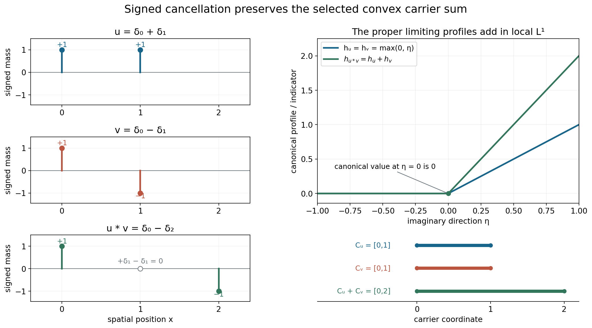
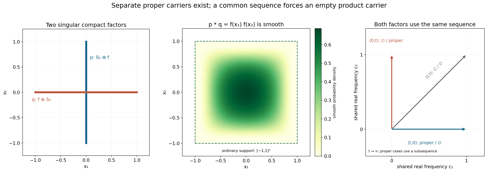

# Convolution and joint frequency carriers

Original exposition, examples and complete solutions: GPT-6.1 Sol (OpenAI), Ultra. CC0 1.0. Self-checked by the writing AI; independent mathematical review is not claimed.

Multiplying entire Fourier transforms adds their logarithmic profiles. The resulting carrier is a Minkowski sum, provided both input profiles are selected by the **same frequency sequence**. If one input collapses on that sequence, the product collapses as well.

This lesson proves the full joint-family identity and explains its synchronization requirement. The four examples include atomic cancellation, two singular factors with a smooth convolution, and a family whose output has both an empty and a nonempty carrier.

Basic references are Tao's *246B, Notes 2*, Hörmander's *The Analysis of Linear Partial Differential Operators I*, and its second volume. The actual prerequisites are the preceding proofs of [joint logarithmic-frequency compactness](../AN02-L157.html), [indicator additivity](../AN02-L141.html#indicator-additivity-theorem), and [compact Fourier inversion](../AN02-L158.html). These linked proofs provide what the argument needs.

## 4. Multiplication keeps one common frequency

Let \(u\) be a compact distribution on \(\mathbb R^n\). We use

\[
 F_u(\zeta)=\langle u(x),e^{-ix\cdot\zeta}\rangle,\qquad
 L_u(z,c)=\frac{\log|F_u(c+z\log|c|)|}{\log|c|},
 \quad |c|>2,\quad c\in\mathbb R^n. \tag{4.1}
\]

Use \(D=-i\partial\). The logarithm at a transform zero is \(-\infty\). A proper profile is a plurisubharmonic local \(L^1\) limit; a collapsed profile tends to \(-\infty\) uniformly on compact parameter sets.

Let \(\mathcal J(u_1,\ldots,u_k)\) be the set of indicator tuples realized by simultaneous profile convergence along one escaping real frequency sequence. A proper indicator \(h_j\) is the support function of a nonempty compact convex carrier \(C_j\). A collapsed indicator has empty carrier.

For compact convolution,

\[
 F_{a*b}=F_aF_b,\qquad L_{a*b}=L_a+L_b. \tag{4.2}
\]

There is no extra \(2\pi\) factor in this forward identity. The complete compact-distribution pairing proof is Lemma 2.1 below.

**Theorem 4.1.** For compact distributions \(u'_j,u''_j\), \(1\leq j\leq k\),

\[
 \begin{split}
 &\mathcal J(u'_1*u''_1,\ldots,u'_k*u''_k)\\
 &\quad=
 \left\{(h'_1+h''_1,\ldots,h'_k+h''_k):
 (h'_1,\ldots,h'_k,h''_1,\ldots,h''_k)
 \in\mathcal J(u'_1,\ldots,u'_k,u''_1,\ldots,u''_k)\right\}.
 \end{split} \tag{4.3}
\]

The indicator sum is \(-\infty\) if either summand is \(-\infty\). Every proper output carrier is \(C'_j+C''_j\); with an empty input carrier, the output carrier is empty. Theorem 1.1 gives the full proof.

The displayed right side selects all factors jointly. Selecting one indicator tuple from the primed factors and an unrelated tuple from the double-primed factors would allow incompatible frequencies. Worked example 3 shows that this larger Cartesian choice can predict a nonempty carrier when the convolution is smooth.

## 5. The two possible limiting behaviors

If both factors have proper profiles \(v'\) and \(v''\) on the same sequence, their normalized logarithms add in local \(L^1\):

\[
 \|L_{u'*u''}-v'-v''\|_{L^1(B)}
 \leq\|L_{u'}-v'\|_{L^1(B)}+\|L_{u''}-v''\|_{L^1(B)}
 \longrightarrow0. \tag{5.1}
\]

The sum is proper because the two profiles are finite on a common set of full measure. Their canonical sum is PSH and satisfies the same kind of global linear imaginary-growth bound. The exact additivity theorem in [Directional averages and additivity of growth indicators](../AN02-L141.html#indicator-additivity-theorem) gives \(h_{v'+v''}=h_{v'}+h_{v''}\).

If one input collapses, every compact parameter set has

\[
 \sup_B L_{u'*u''}\leq\sup_B L_{u'}+M_B\longrightarrow-\infty, \tag{5.2}
\]

where \(M_B\) is an upper bound for the other input normalized logarithms. The other factor need not converge for this estimate. Compact Fourier growth provides the bound.

The empty carrier here records logarithmic collapse. It does not say that the distribution is zero, or that its ordinary support is empty. A nonzero compact smooth function has empty singular carrier profiles and a nonempty ordinary support.

## 6. Why equality needs both constructions

To start with an output tuple, keep its witnessing frequency sequence and extract profiles of all finitely many factors on a common subsequence. The original output profiles persist there. Proper input pairs add; a collapsed input forces its product to collapse. This puts every output tuple on the right side of (4.3).

To start with a joint input tuple, retain its witnessing sequence. Each product coordinate converges on that sequence, by (5.1) or (5.2), and its indicator is the required sum. This gives the opposite inclusion. The two arguments also cover mixed tuples, with some proper coordinates and some collapsed coordinates.

Neither construction replaces a witnessing sequence by unrelated frequencies. Neither identifies an indicator with a finite-height supremum. These are the two synchronization points of the proof.

## Worked example 1. Derivative orders add, while the carrier translates

On \(\mathbb R\), let \(a,b\in\mathbb R\) and integers \(m,r\geq0\). Set

\[
 u=D^m\delta_a,\qquad v=D^r\delta_b.
 \tag{7.1}
\]

Their transforms are \(\zeta^m e^{-ia\zeta}\) and \(\zeta^r e^{-ib\zeta}\). On every escaping real frequency sequence, uniformly on each compact \(z\)-set,

\[
 L_u(z,c)\longrightarrow m+a\,\operatorname{Im}z,\qquad
 L_v(z,c)\longrightarrow r+b\,\operatorname{Im}z. \tag{7.2}
\]

Indeed, \((c+z\log|c|)/c\to1\) uniformly on such a set, so
\(\log|c+z\log|c||/\log|c|\to1\).
The exponential contributes its displayed exact linear term.

The product transform is \(\zeta^{m+r}e^{-i(a+b)\zeta}\), and compact Fourier inversion gives

\[
 u*v=D^{m+r}\delta_{a+b}. \tag{7.3}
\]

Its proper profile is \(m+r+(a+b)\operatorname{Im}z\). The indicators are \(a\eta\), \(b\eta\), and \((a+b)\eta\); the carriers are \(\{a\}\), \(\{b\}\), and \(\{a+b\}\). The intercept records derivative order in the profile, while the indicator records the carrier.

## Worked example 2. Atomic cancellation and persistent transform zeros

Take

\[
 u=\delta_0+\delta_1,\qquad
 v=\delta_0-\delta_1,\qquad
 u*v=\delta_0-\delta_2. \tag{7.4}
\]

The two mixed \(\delta_1\) terms cancel. Their transforms satisfy

\[
 (1+e^{-i\zeta})(1-e^{-i\zeta})=1-e^{-2i\zeta}. \tag{7.5}
\]

Both input profiles converge in local \(L^1\) to
\(\max(0,\operatorname{Im}z)\) along every escaping real sequence. To verify this, write \(R=|c|\). For \(\eta=\operatorname{Im}z\geq d>0\), the exponential has modulus \(R^\eta\), so each input modulus divided by \(R^\eta\) lies between \(1-R^{-d}\) and \(1+R^{-d}\). For \(\eta\leq-d\), each modulus lies between those same two quantities without division by \(R^\eta\). Hence the normalized logarithms converge uniformly off any strip \(|\eta|<d\) to the stated profile.

The entire normalized family is locally uniformly bounded above. Profile compactness supplies a proper or collapsed limit on a further subsequence. The off-real convergence rules out collapse and identifies any proper limit almost everywhere with \(\max(0,\eta)\); the real line has zero area. Canonical uniqueness identifies it everywhere. If full local \(L^1\) convergence failed, a subsequence separated from that limit by a positive \(L^1\) distance would have a further compactness subsequence with the very same limit, a contradiction. This proves the full convergence.

The output profile is therefore \(2\max(0,\eta)\). Its indicator and carrier are

\[
 h_{u*v}(\eta)=2\max(0,\eta),\qquad C_{u*v}=[0,2]=[0,1]+[0,1]. \tag{7.6}
\]

At \(c_j=2\pi j\), the transform of \(v\) and of \(u*v\) is zero. Their normalized logarithms at \(z=0\) remain \(-\infty\), while their canonical limiting profiles at \(z=0\) equal zero. A persistent value at one point does not replace local \(L^1\) convergence.

The signed masses in the figure are exactly those in (7.4). The support intervals in its lower panel are convex profile carriers. The output distribution is singular only at its two surviving atoms, so its carrier also contains smooth spatial points.

## Worked example 3. Two singular factors convolve to a smooth function

Let \(f\) be a nonnegative compact smooth probability density on \(\mathbb R\), positive on \((-1,1)\) and zero outside \([-1,1]\). Define

\[
 p=\delta_0(x_1)\otimes f(x_2),\qquad
 q=f(x_1)\otimes\delta_0(x_2). \tag{7.7}
\]

Their singular supports are the vertical and horizontal segments
\(\{0\}\times[-1,1]\) and \([-1,1]\times\{0\}\).
For an interior segment point, a tangential test against \(f\) reduces the distribution to a nonzero transverse point mass, which cannot be smooth. Closedness includes the endpoints. Their whole ordinary supports are those same segments.

Separate-coordinate convolution gives

\[
 p*q=f(x_1)f(x_2),\qquad
 F_p(\zeta)=\widehat f(\zeta_2),\qquad
 F_q(\zeta)=\widehat f(\zeta_1). \tag{7.8}
\]

The output is compact and smooth, with ordinary support \([-1,1]^2\). Its logarithmic profiles all collapse. The whole-complex rapid Fourier estimate for compact smooth functions, proved in [Locating singularities through logarithmic Fourier strips](../AN02-L158.html), makes the normalized logarithms tend uniformly to \(-\infty\) on each compact parameter set.

There cannot be a common frequency sequence on which both input profiles are proper. On an escaping sequence with \(R=|c|\), at least one coordinate has modulus at least \(R/\sqrt2\). On a subsequence it is always the first coordinate or always the second. If it is the first, the smooth Fourier factor in \(F_q\) decreases faster than every power of \(R\), uniformly on compact \(z\)-sets, so \(q\)'s profile collapses. If it is the second, \(p\)'s profile collapses. A presumed proper limit would persist on that subsequence, giving a contradiction.

Nevertheless each input separately has a proper profile. For \(c=(t,0)\), \(t\to\infty\), \(F_p(c)=1\), so \(L_p(0,c)=0\) and uniform collapse is impossible; profile compactness yields a proper further subsequence. On this same sequence \(q\) collapses. The vertical sequence gives the opposite pair. Thus separate proper choices exist, but they cannot be paired on one common sequence.

Their separate carrier sum is nonempty, whereas

\[
 \mathcal J(p*q)=\{-\infty\}. \tag{7.9}
\]

This proves that the Cartesian replacement of the joint family in (4.3) is false.

The segments are actual ordinary and singular supports. An individual proper profile carrier is contained in its segment; the figure does not classify all such carriers. Horizontal and vertical frequency rays admit proper/empty pairs after extraction. The diagonal ray gives two collapsed profiles. The square is the ordinary support of the smooth convolution, whose logarithmic carrier is empty.

## Worked example 4. One output is smooth and another stays singular

Use \(p,q\) from Worked example 3 and let \(a=(1,-1)\). For two output coordinates, choose the prime and double-prime blocks

\[
 (u'_1,u'_2)=(p,\delta_0),\qquad
 (u''_1,u''_2)=(q,\delta_a). \tag{7.10}
\]

The outputs are \((f\otimes f,\delta_a)\). Every output sequence has the indicator tuple

\[
 (-\infty,h_a),\qquad h_a(\eta)=\eta_1-\eta_2. \tag{7.11}
\]

The input tuple has block order
\((h_p,0,h_q,h_a)\). A common sequence forces at least one of \(h_p,h_q\) to be collapsed, as proved above; the two point-mass profiles are exact on every sequence. Its coordinate sums are thus precisely \((-\infty,h_a)\), matching (7.11). The output carrier tuple is \((\varnothing,\{(1,-1)\})\).

This mixed case is part of the full identity. It would be lost by a rule that discarded every tuple having even one collapsed coordinate.

## Exercises with complete solutions

The ten exercises total 100 points.

### Exercise 1. Add orders and translate the point carrier — 10 points

Compute the convolution, profiles and indicators of \(D^2\delta_{-1}\) and \(D\delta_2\).

**Solution.** Their transforms are \(\zeta^2e^{i\zeta}\) and \(\zeta e^{-2i\zeta}\). Their product is \(\zeta^3e^{-i\zeta}\), the transform of \(D^3\delta_1\). The two profiles are \(2-\operatorname{Im}z\) and \(1+2\operatorname{Im}z\), so the product profile is \(3+\operatorname{Im}z\). The input indicators are \(-\eta\) and \(2\eta\); the output indicator is \(\eta\). The singleton carriers \(\{-1\}\) and \(\{2\}\) add to \(\{1\}\). Negative indicator values are allowed and do not mean an empty carrier.

### Exercise 2. Detect an incorrect normalization — 6 points

Let \(a=1_{[0,1]}\) and \(b=1_{[0,2]}\). Compute their Fourier transforms and the transform of their convolution at zero. Could an additional factor \(2\pi\) occur?

**Solution.** For \(\zeta\ne0\),
\[
 F_a(\zeta)=\frac{1-e^{-i\zeta}}{i\zeta},\qquad
 F_b(\zeta)=\frac{1-e^{-2i\zeta}}{i\zeta}. \tag{8.1}
\]
The removable values at zero are \(1\) and \(2\), equal to their integrals. The convolution integral is the product of the two integrals by Fubini, so \(F_{a*b}(0)=2\). The product formula gives exactly \(1\cdot2\). Any extra \(2\pi\) factor would give the wrong mass. The inverse Fourier convention has its separate factor \((2\pi)^{-1}\).

### Exercise 3. Prove proper convergence without pointwise convergence at zeros — 8 points

Suppose two normalized logarithms converge locally in \(L^1\) to proper profiles. Prove the convolution limit in that topology and explain why transform zeros do not require pointwise convergence everywhere.

**Solution.** Nonzero entire transforms have logarithms that are locally integrable; their zero sets have zero volume. The exact extended logarithmic product identity therefore gives an almost-everywhere sum of integrable functions. Subtract the two proper limits and apply the \(L^1\) triangle inequality to obtain (5.1). The limits are finite almost everywhere, so their sum is proper, and addition of the PSH line inequalities gives its canonical PSH representative. A sequence can retain a zero at an individual point, as Worked example 2 does. Such a point has no effect on the local \(L^1\) norm, so pointwise convergence there is not needed.

### Exercise 4. A collapsed factor does not need a convergent partner — 8 points

One factor collapses uniformly on every compact parameter set. The other normalized family is merely locally uniformly bounded above. Show that their product collapses.

**Solution.** Fix a compact set \(B\). Let \(A_\nu=\sup_B L_{u'}\to-\infty\), and let \(M_B\) bound the other family for large \(\nu\). The exact sum identity gives
\(\sup_B L_{u'*u''}\leq A_\nu+M_B\to-\infty\).
Since \(B\) is arbitrary, collapse is locally uniform. The partner may oscillate or have zeros; only its upper bound is used. No positive infinite value can cancel the negative divergence.

### Exercise 5. Preserve an output sequence when lifting factors — 10 points

Describe both constructions proving equality in (4.3). Why is choosing a fresh input sequence insufficient for the first construction?

**Solution.** Starting with a left-side output tuple, retain its witnessing sequence and apply compactness successively to each of the finitely many input families. The common subsequence preserves every output profile. Proper input pairs give the original output profile by uniqueness of the local \(L^1\) limit; collapsed inputs force the original output to collapse. Their indicators give the required joint right-side tuple.

Starting with a full joint input tuple, retain its witnessing sequence and add each pair of normalized logarithms. Every coordinate converges properly or collapses, so the output indicators belong to the left family. A fresh sequence in the first construction could select different output indicators and would not show that the originally chosen tuple is represented on the right.

### Exercise 6. Finite-height suprema need not add — 10 points

For \(v_1(z)=\log|\sin z|\) and \(v_2(z)=\log|\cos z|\), compare their real-translation envelopes at imaginary height zero and compute the indicator of their sum.

**Solution.** Each function has real-axis supremum zero, so \(M_1(0)+M_2(0)=0\). The product identity
\(\sin z\cos z=\tfrac12\sin(2z)\) gives supremum \(1/2\) in modulus on the real axis; hence \(M_{v_1+v_2}(0)=-\log2\), which is strictly smaller.

At height \(\eta\), maximizing the sine modulus over the real part gives \(\cosh\eta\). Thus
\[
 M_1(\eta)=M_2(\eta)=\log\cosh\eta,\qquad
 M_{v_1+v_2}(\eta)=\log\cosh(2\eta)-\log2. \tag{8.2}
\]
Dividing the envelopes at height \(t\eta\) by \(t\) and letting \(t\to\infty\) gives indicators \(|\eta|\), \(|\eta|\), and \(2|\eta|\). The constants disappear. Indicator additivity is exact even though the finite-height suprema do not add.

### Exercise 7. Add a third atomic factor — 10 points

Convolve the two factors in Worked example 2 with \(w=\delta_0+\delta_2\). Determine the resulting atoms and the common-sequence carrier.

**Solution.** The first convolution is \(\delta_0-\delta_2\). Its convolution with \(w\) is
\[
 (\delta_0-\delta_2)*(\delta_0+\delta_2)=\delta_0-\delta_4. \tag{8.3}
\]
The intermediate \(\delta_2\) terms cancel. The three transforms multiply to \(1-e^{-4i\zeta}\). The first two canonical profiles are \(\max(0,\eta)\), and the third is \(\max(0,2\eta)\), by the same off-real estimates as in Worked example 2. Their sum is \(4\max(0,\eta)\). The carrier is
\([0,1]+[0,1]+[0,2]=[0,4]\).
At \(c_j=2\pi j\), the product transform still vanishes at \(z=0\), although its canonical limiting profile there equals zero.

### Exercise 8. Quantify collapse in the crossed example — 10 points

In Worked example 3, assume \(|c_1|\geq R/\sqrt2\) and \(|z|\leq2\). Show that \(L_q\) is eventually at most \(-5\) on this compact parameter set, using a sufficiently high smooth Fourier decay order. Explain how this yields uniform collapse.

**Solution.** For sufficiently large \(R\), the real part of
\(\zeta_1=c_1+z_1\log R\) has modulus at least \(R/(2\sqrt2)\), and \(|\operatorname{Im}\zeta_1|\leq2\log R\). The whole-complex smooth Fourier estimate of order eight gives
\[
 |\widehat f(\zeta_1)|
 \leq C_8(1+|\zeta_1|)^{-8}e^{|\operatorname{Im}\zeta_1|}
 \leq C R^{-6}. \tag{8.4}
\]
For large \(R\), absorb the fixed \(C\) into one power of \(R\), obtaining \(|F_q|\leq R^{-5}\) and \(L_q\leq-5\). For an arbitrary requested negative bound \(-A\), increase the decay order beyond \(A+2\) and enlarge the threshold. This proves uniform collapse on the chosen compact set. The same reasoning works for every compact parameter set, with its own fixed imaginary-height coefficient.

### Exercise 9. An empty carrier does not imply a zero distribution — 8 points

Let \(g\) be a nonzero compact smooth function and \(a\in\mathbb R^n\). Compute \(g*\delta_a\), its ordinary support and its logarithmic profile carriers.

**Solution.** Directly from the convolution pairing,
\((g*\delta_a)(x)=g(x-a)\).
Its ordinary support is \(a+\operatorname{supp}g\), a nonempty compact set. It is smooth. Its normalized Fourier logarithms collapse uniformly on compact parameter sets, by the whole-complex smooth Fourier decay estimate. Thus every profile carrier is empty. The input carrier for \(g\) is empty and that for \(\delta_a\) is \(\{a\}\); their Minkowski sum is empty, in exact agreement with the theorem. This records smoothness and does not assert that the translated function vanishes.

### Exercise 10. Track three blocks and two mixed outputs — 20 points

On \(\mathbb R^2\), use the crossed factors \(p,q\). Let \(a=(1,0)\), \(b=(0,1)\), \(c=(2,0)\), and \(d=(-1,0)\). The three blocks of two factors are
\((p,\delta_a)\), \((q,\delta_b)\), and \((\delta_c,\delta_d)\).
Compute the two convolutions and their indicator/carrier tuple, preserving one common six-coordinate input family.

**Solution.** The first output is
\((p*q)*\delta_c=(f\otimes f)(x-c)\), a smooth function with ordinary support
\([1,3]\times[-1,1]\).
The second output is
\(\delta_a*\delta_b*\delta_d=\delta_{a+b+d}=\delta_{(0,1)}\).
Their joint output indicator tuple is
\[
 (-\infty,\eta_2),\qquad
 (C_1,C_2)=(\varnothing,\{(0,1)\}). \tag{8.5}
\]
On every common six-coordinate input sequence, at least one of the \(p,q\) profiles collapses, by the dominant-coordinate argument. Thus their first indicator sum, even after adding the finite point-mass indicator \(c\cdot\eta\), is \(-\infty\). The second sum is
\(a\cdot\eta+b\cdot\eta+d\cdot\eta=\eta_2\).
All point-mass profiles are exact on the same sequence and impose no further choice of frequencies. The finite-factor extension, Corollary 3.1, applies to this full joint family and gives (8.5). Choosing separate \(p,q\) sequences would incorrectly allow a proper first carrier.

## References

- Terence Tao, [246B, Notes 2: Some connections with the Fourier transform](https://terrytao.wordpress.com/2021/01/23/246b-notes-2-some-connections-with-the-fourier-transform/), for background on entire Fourier transforms and support. Its \(2\pi\) convention differs from (4.1).
- Lars Hörmander, *The Analysis of Linear Partial Differential Operators I*, Springer, 1983, Chapter VII, for compact Fourier theory.
- Lars Hörmander, *The Analysis of Linear Partial Differential Operators II*, Springer, 1983, Chapter XVI, for convolution and growth indicators. The full joint identity, mixed cases and both inclusions are proved below.

## Complete proof

Fourier transforms turn compact convolution into multiplication. Logarithms then turn that product into a sum. To pass to growth indicators, every factor must use the same escaping real frequency sequence. Separate indicator families do not encode that synchronization.

Basic references are Tao's *246B, Notes 2*, Hörmander's *The Analysis of Linear Partial Differential Operators I*, and its second volume. The exact compactness and indicator proofs needed here are in the linked preceding lessons; the background references are not substitutes for those proofs.

## 1. The full joint-family identity

For a compact distribution \(u\), put

\[
 F_u(\zeta)=\langle u(x),e^{-ix\cdot\zeta}\rangle,\qquad
 L_u(z,c)=\frac{\log|F_u(c+z\log|c|)|}{\log|c|},
 \quad c\in\mathbb R^n,\quad |c|>2. \tag{1.1}
\]

Use \(D=-i\partial\). A coordinate of a limiting tuple is either a proper plurisubharmonic local \(L^1\) limit, or a uniform local collapse to \(-\infty\). A proper profile \(v\) has a finite support function \(h_v\) and a nonempty compact convex carrier \(C_v\). The collapsed profile has indicator \(-\infty\) and empty carrier.

Let \(\mathcal J(u_1,\ldots,u_k)\) denote the set of indicator tuples obtained from simultaneous profile convergence on one escaping real sequence. This definition and its full finite-coordinate extraction are proved in [Joint logarithmic-frequency limits](../AN02-L157.html), Definition 4.1 and Theorem 4.2. Every input profile has a global linear imaginary-growth upper bound, and every normalized input family is locally uniformly bounded above along escaping frequencies.

For indicator sums adopt

\[
 (-\infty)+h=h+(-\infty)=-\infty,\qquad
 (-\infty)+(-\infty)=-\infty. \tag{1.2}
\]

Proper indicators are finite, so no \(+\infty\) is involved. At the carrier level, the corresponding convention is \(C+\varnothing=\varnothing+C=\varnothing\).

**Theorem 1.1.** Let \(u'_j,u''_j\) be compact distributions on the same \(\mathbb R^n\), for \(1\leq j\leq k\). Then

\[
 \begin{split}
 &\mathcal J(u'_1*u''_1,\ldots,u'_k*u''_k)\\
 &\quad=
 \left\{(h'_1+h''_1,\ldots,h'_k+h''_k):
 (h'_1,\ldots,h'_k,h''_1,\ldots,h''_k)
 \in\mathcal J(u'_1,\ldots,u'_k,u''_1,\ldots,u''_k)\right\}.
 \end{split} \tag{1.3}
\]

The right side uses a joint \(2k\)-coordinate family. It is not the Cartesian product of separately chosen families of the primed and double-primed factors. The theorem includes zero distributions, smooth factors, and mixtures of proper and collapsed coordinates.

For every tuple in this identity, its output carrier in coordinate \(j\) is

\[
 C_j=C'_j+C''_j, \tag{1.4}
\]

with the empty-set convention above. This statement concerns the carriers selected by that common frequency sequence, rather than the ordinary supports of the distributions.

## 2. Convolution, limits and indicators

**Lemma 2.1 (no Fourier normalization factor).** For compact distributions \(a,b\),

\[
 F_{a*b}(\zeta)=F_a(\zeta)F_b(\zeta),\qquad
 L_{a*b}(z,c)=L_a(z,c)+L_b(z,c). \tag{2.1}
\]

The second identity holds with extended values at every transform zero.

*Proof.* Define compact convolution by
\(\langle a*b,\phi\rangle=\langle a_x,\langle b_y,\phi(x+y)\rangle\rangle\).
Use fixed compact cutoffs equal to one near the two supports when a test function is not compact in the separate variables. The inner pairing is smooth in \(x\): differentiating the test function in \(x\) is valid in every test-function seminorm on the fixed compact support of \(b\), and the distribution pairing is continuous in those seminorms. The outer pairing is therefore defined. The sum of the two supports is compact, so \(a*b\) is compactly supported.

More explicitly, finite-order bounds for the two distributions, of orders \(m_a\) and \(m_b\) on fixed compact cutoff supports, bound the nested action by a fixed constant times the supremum of the derivatives of \(\phi\) through order \(m_a+m_b\) on their compact sum. Fixed cutoff derivatives only change the constant. This proves continuity in the test-function topology. If \(\phi\) vanishes near the sum of the actual supports, compactness supplies separate neighborhoods of those supports on whose sum it vanishes; the nested action is then zero. Thus the support claim also uses the actual supports, independently of the chosen larger cutoff sets.

For the exponential test, the inner pairing is
\(e^{-ix\cdot\zeta}F_b(\zeta)\). Pairing this with \(a\) proves the first identity. With convention (1.1), the factor \((2\pi)^{-n}\) occurs in inverse Fourier integration and does not occur in this forward product identity. Taking logarithmic moduli and dividing by the same positive \(\log|c|\) proves the second identity. If either transform vanishes at a point, the product and the extended sum both have logarithmic value \(-\infty\). \(\square\)

**Lemma 2.2 (proper sums).** If \(L_a(\cdot,c_\nu)\to v_a\) and \(L_b(\cdot,c_\nu)\to v_b\) in local \(L^1\), with proper limits, then the convolution profiles converge in local \(L^1\) to the proper PSH function \(v_a+v_b\).

*Proof.* Proper PSH functions are locally integrable and finite almost everywhere. The intersection of their finite full-measure sets is still full measure, so their sum is not identically \(-\infty\). Their sum is PSH: upper semicontinuity and the line submean inequalities add, with no positive infinite values.

The exact identity in Lemma 2.1 holds almost everywhere for these nonzero entire transforms. For every compact observation region,
\[
 \|L_{a*b}-v_a-v_b\|_{L^1}
 \leq\|L_a-v_a\|_{L^1}+\|L_b-v_b\|_{L^1}\longrightarrow0. \tag{2.2}
\]
The zeros of a nonzero entire transform have zero volume; the full logarithmic local-integrability proof is supplied in [Scalar holomorphic logarithms](../AN02-L147.html). Thus the extended pointwise equalities cause no obstruction to (2.2). The sum is the canonical PSH representative of this limit, by uniqueness of the local \(L^1\) profile. \(\square\)

**Lemma 2.3 (collapsed sums).** If either input profile collapses uniformly locally to \(-\infty\), then the convolution profile also collapses uniformly locally. This conclusion does not require convergence of the other input.

*Proof.* On every fixed compact parameter set \(B\), ordinary compact Fourier growth gives an upper bound \(M_B\) for the other input normalized logarithms for all sufficiently large frequencies. If the first input has supremum \(A_\nu\to-\infty\) on \(B\), Lemma 2.1 gives
\[
 \sup_B L_{a*b}(\cdot,c_\nu)\leq A_\nu+M_B\longrightarrow-\infty. \tag{2.3}
\]
The same argument interchanges the inputs. It also covers identically zero input transforms. \(\square\)

**Lemma 2.4 (indicator and carrier addition).** For two proper input profiles,
\[
 h_{v_a+v_b}=h_{v_a}+h_{v_b},\qquad
 C_{v_a+v_b}=C_{v_a}+C_{v_b}. \tag{2.4}
\]
With a collapsed input, the corresponding indicator and carrier are given by (1.2).

*Proof.* Proper input profiles satisfy global linear imaginary-growth bounds. Their proper sum also satisfies such a bound. The exact indicator additivity theorem in [Directional averages and additivity of growth indicators](../AN02-L141.html#indicator-additivity-theorem), Theorem D4, applies. Its complete proof in Section D6 identifies the directional indicator by integral convergence and then integrates the sum identity. It does not add finite-height suprema: those suprema need not add.

For nonempty compact convex sets, their Minkowski sum is compact and convex. A maximizing point can be chosen separately in each compact set, so its support function is the sum of their support functions. The uniqueness of compact convex sets from their support functions, proved in [Plurisubharmonic envelopes and support functions](../AN02-L139.html), gives the carrier equality. With a collapsed input, Lemma 2.3 makes the sum collapsed and both sides have empty carrier. \(\square\)

## 3. Prove both inclusions on the same sequence

*Proof of Theorem 1.1: left to right.* Choose any tuple on the left. By definition it is realized by a common escaping sequence \(c_\nu\) on which all \(k\) product profiles converge, properly or by collapse. Their indicators are the prescribed tuple.

Apply finite-coordinate compactness to all \(2k\) input families along that very sequence. Repeated extraction gives a further common subsequence on which every input has a proper or collapsed limit \(v'_j,v''_j\). The original product limits are unchanged on the further subsequence.

If both inputs in coordinate \(j\) are proper, Lemma 2.2 says the product has canonical profile \(v'_j+v''_j\). It cannot have a collapsed profile, and uniqueness identifies this with its originally prescribed proper limit. Lemma 2.4 identifies its indicator with \(h'_j+h''_j\).

If either input coordinate is collapsed, Lemma 2.3 forces its product coordinate to collapse. The prescribed output indicator is therefore \(-\infty=h'_j+h''_j\). This covers every coordinate, including tuples with both kinds of output. The extracted input indicator tuple belongs to the joint family on the right, and produces the chosen left tuple. This proves the first inclusion.

*Right to left.* Choose any full \(2k\)-coordinate joint tuple on the right. Its definition provides a single escaping sequence and simultaneous input profiles \(v'_j,v''_j\). On that same sequence, apply Lemma 2.2 wherever both profiles are proper, and Lemma 2.3 wherever at least one collapses. Every product coordinate converges, with no further choice of frequencies required. Lemma 2.4 and the extended convention identify all output indicators with \(h'_j+h''_j\). Consequently the entire resulting \(k\)-tuple belongs to the family on the left. This proves the second inclusion, and (1.4) follows coordinate by coordinate. \(\square\)

**Corollary 3.1 (finitely many factors).** The same statement holds for \(s\) compact factors in each of \(k\) coordinates, using a common \(sk\)-coordinate input family and summing its indicators coordinatewise.

*Proof.* Along a common input sequence, apply Lemmas 2.2–2.4 repeatedly. If any factor in a coordinate collapses, the whole coordinate collapses; otherwise the finite proper sum converges in local \(L^1\) and its indicator is the sum of all factor indicators. Conversely, start with a joint output sequence and extract all finitely many input profiles on a common subsequence. The same alternatives identify the already specified output profiles. These are exactly the two inclusions used above, with a finite sum in place of a pair. \(\square\)

## References

- Terence Tao, [246B, Notes 2: Some connections with the Fourier transform](https://terrytao.wordpress.com/2021/01/23/246b-notes-2-some-connections-with-the-fourier-transform/), for named background on entire Fourier transforms. Its normalization differs from (1.1); no source text or proof is imported.
- Lars Hörmander, *The Analysis of Linear Partial Differential Operators I*, Springer, 1983, Chapter VII, for background on compact distributions and entire Fourier transforms.
- Lars Hörmander, *The Analysis of Linear Partial Differential Operators II*, Springer, 1983, Chapter XVI, for joint convolution families. Both inclusions, all mixed cases and the exact normalization are proved above.
