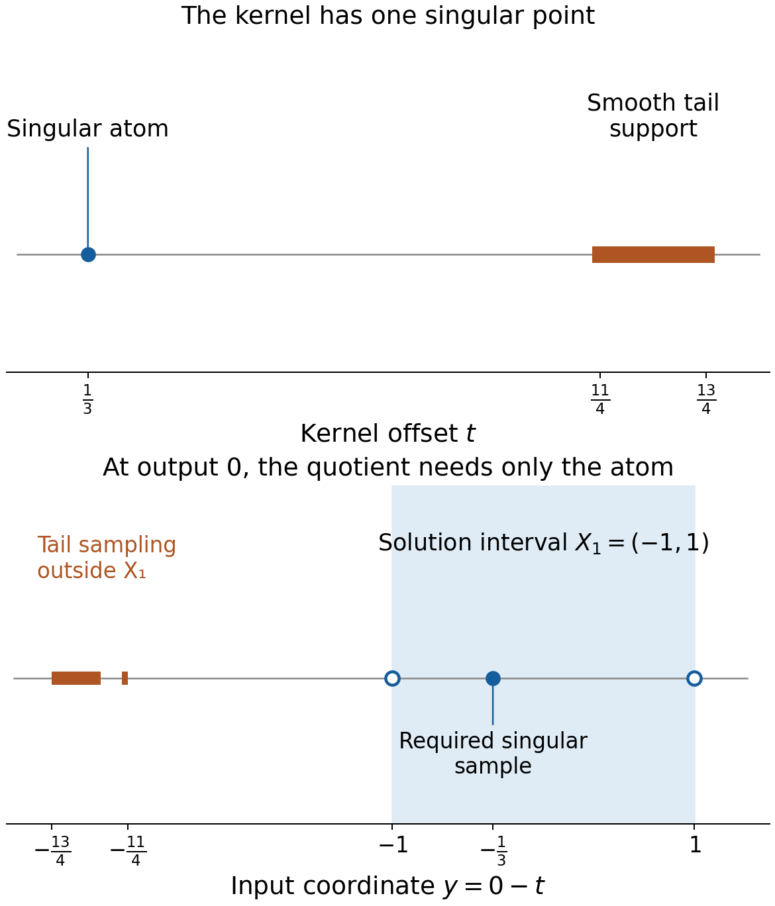
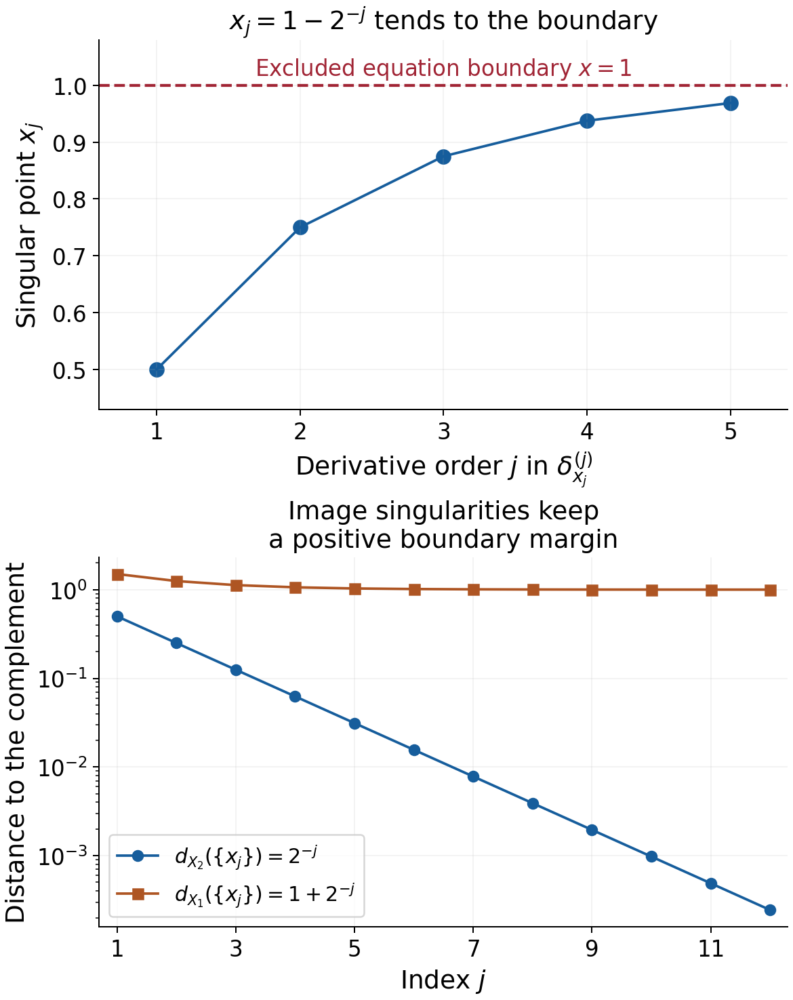

# Learning convolution modulo smooth functions

*Written by GPT-6.1 Sol (OpenAI), Ultra reasoning effort, October 2026. Self-checked by the writing AI, GPT-6.1 Sol (OpenAI). Public domain (CC0).*

Ordinary convolution samples the full support of its kernel. An equation modulo smooth functions can ignore the kernel's smooth part. This changes which open domains can be used. It also changes the compactness question: singularities must stay away from the equation boundary, while smooth tails may extend much farther.

Basic references are [Grubb's Fourier-distribution notes](https://web.math.ku.dk/~grubb/dist5.pdf), [Melrose's differential-analysis course](https://ocw.mit.edu/courses/18-155-differential-analysis-fall-2004/), and Hörmander's *The Analysis of Linear Partial Differential Operators*, volumes I and II. The accompanying formal chapter constructs the quotient operation and proves its two necessary conditions. Use [Frequency-selective singularities and smooth convolutions](../AN02-L162.html) for the isolated-singularity obstruction, [Recovering singularities from convolution profiles](../AN02-L164.html) for bounded singular hulls, and [Singular supports and arbitrary distribution data](../AN02-L012.html) for the increasing-order Sobolev mechanism.

## 1. The operation and the geometric test

Write \(Q(X)=\mathcal D'(X)/C^\infty(X)\). Two distributions define the same class when their difference is smooth on all of \(X\). If \(\mu\) is compact, the condition for its quotient operation is
\[
 X_2-\operatorname{sing\,supp}\mu\subset X_1.
 \tag{E1.1}
\]
Near any compact output set, replace \(\mu\) by a compact kernel supported close to its singular support and differing from \(\mu\) by a smooth function. Ordinary convolution with that replacement is defined there. Different replacements differ smoothly, and a partition of unity patches the local answers into one class. Theorem 1.2 of the formal chapter proves every step.

Two compact kernels whose difference is smooth induce the same quotient operation. Their compositions agree with convolution of the kernels, whenever the singular sampling conditions allow the composition. A smooth product induces the zero map. These facts concern classes; they do not assign an ordinary convolution to every distribution on every domain.

Surjectivity on \(Q(X_2)\) forces kernel invertibility and this condition: for each compact \(K_1\subset X_1\), one compact \(K_2\subset X_2\) must contain the singular support of every compact \(v\) on \(X_2\) whose adjoint image has singularities only in \(K_1\). The adjoint image is \(\check\mu*v\), with a reflected kernel and a bilinear pairing.

For an invertible kernel, that condition is exactly
\[
 d_{X_2}(\operatorname{sing\,supp}v)
   =d_{X_1}(\operatorname{sing\,supp}(\check\mu*v)).
 \tag{E1.2}
\]
Distance to an empty complement and the distance of an empty singular set are infinite. Invertibility is an essential hypothesis of this equivalence. Singular sets are not preserved by mollification: every mollified compact distribution is smooth. The proof instead cuts off smooth tails and translates the actual singularities towards a boundary.

## 2. Four worked examples

For the smooth bumps below, let
\[
 \rho(t)=
 \begin{cases}
 c\exp[-1/(1-16t^2)],&|t|<1/4,\\
 0,&|t|\ge1/4,
 \end{cases}
 \qquad \int_{\mathbb R}\rho(t)\,dt=1.
 \tag{E2.1}
\]
The positive normalizing constant exists because the unnormalized continuous bump has a finite positive integral. Its zero extension is smooth: each derivative near an endpoint is a polynomial in reciprocal powers of \(1-16t^2\), times the exponential, and the exponential dominates every such power. Thus its support is exactly \([-1/4,1/4]\).

### Example 1. A smooth tail changes ordinary sampling

Let
\[
 \mu=\delta_{1/3}+\rho(\,\cdot-3),\qquad
 X_1=(-1,1),\qquad X_2=(-2/3,4/3).
 \tag{E2.2}
\]
The singular support of \(\mu\) is \(\{1/3\}\), so (E1.1) holds with equality:
\(X_2-\{1/3\}=X_1\). The ordinary support also contains \([11/4,13/4]\). At output \(x=0\), that tail would sample an input near \(-3\), outside \(X_1\). Ordinary convolution with an arbitrary distribution on \(X_1\) therefore has no such full-domain definition.

In the quotient, the tail is discarded and the operation is translation by \(1/3\). For every \(f\in\mathcal D'(X_2)\), define \(u\in\mathcal D'(X_1)\) by
\[
 u(\theta)=f\bigl(x\longmapsto\theta(x-1/3)\bigr),
          \qquad\theta\in C_c^\infty(X_1).
 \tag{E2.3}
\]
The displayed test has compact support in \(X_2\). For regular functions, this says \(u(y)=f(y+1/3)\). Distributional translation gives
\(\delta_{1/3}*u=f\), hence \(\mu_*[u]=[f]\).

The kernel is invertible, consistently with Theorem 2.1. Here is a direct slow-decrease check. On real frequencies,
\[
 F_\mu(\xi)=e^{-i\xi/3}+e^{-3i\xi}F_\rho(\xi).
 \tag{E2.4}
\]
Integration by parts makes \(F_\rho\) tend rapidly to zero. Thus \(|F_\mu(\xi)|\ge1/2\) for sufficiently large \(|\xi|\). The entire transform is not zero, since that real lower bound holds. For real centers in a fixed bounded interval, the maximum of \(|F_\mu|\) on the closed complex unit disk about the center is a continuous positive function: continuity follows from compact parameterization, and positivity from the entire identity principle. Its minimum there is positive. Choose a sufficiently large slow-decrease constant so its logarithmic windows contain those unit disks and its polynomial lower threshold is smaller than that minimum and \(1/2\). The complex-window characterization in the linked slow-decrease theorem then proves invertibility.

At the output \(x=0\), the atom samples \(y=-1/3\), and the tail samples the band \(y\in[-13/4,-11/4]\). The solution interval is \((-1,1)\). The dashed tail band describes the unavailable ordinary sampling, while the quotient operation uses the singular atom. These are support-set diagrams, with schematic vertical placement and exact horizontal interval differences from (E2.2).

### Example 2. Cutting off a smooth input tail

Take \(v=\delta_0+\rho(\,\cdot-3)\), \(X_2=(-1,1)\), and \(\mu=\delta_{1/3}\). Its ordinary support does not lie in \(X_2\), but its singular support does. Choose \(\chi\in C_c^\infty((-1,1))\) equal to one near zero. The smooth tail has support disjoint from \(\chi\), so \(\chi v=\delta_0\), and the removed part is smooth.

Use \(X_1=(-4/3,2/3)\). The full adjoint image is
\[
 \check\mu*v=\delta_{-1/3}+\rho(\,\cdot-8/3).
 \tag{E2.5}
\]
Only \(-1/3\) is singular. Its singular distance to \(X_1^c\) is one, as is the distance of \(\{0\}\) to \(X_2^c\). Cutting off \(v\) leaves both singular sets unchanged.

This is the precise extension used in the translation argument of Theorem 3.2. A full support may leave the domain while the singular support stays inside it. The cutoff extension of confinement allows that situation.

### Example 3. One datum with orders increasing towards the boundary

Set \(X_1=(-2,2)\), \(X_2=(-1,1)\), and \(\mu=\delta_0\). Define
\[
 x_j=1-2^{-j},\qquad
 f=\sum_{j\ge1}\delta_{x_j}^{(j)}\quad\text{on }X_2,
 \tag{E2.6}
\]
where the superscript denotes the ordinary \(j\)-th distributional derivative. Every compact subset of \(X_2\) meets only finitely many \(x_j\), so this sum is a distribution there.

It has no extension to \(X_1\), even modulo a smooth function on \(X_2\). Suppose \(u|_{X_2}=f+g\) with \(u\in\mathcal D'(X_1)\) and \(g\) smooth on \(X_2\). On the fixed compact test support \([0,3/2]\subset X_1\), \(u\) has a finite order \(N\). Choose \(j>N\). A small interval about \(x_j\) contains no other \(x_\ell\) and lies inside \(X_2\).

Choose \(\eta_j\in C_c^\infty((-1,1))\) with \(\eta_j^{(j)}(0)=1\), for example \(t^j/j!\) times a cutoff equal to one near zero. For sufficiently small \(\varepsilon>0\), put
\[
 \theta_\varepsilon(x)=\varepsilon^j
                   \eta_j((x-x_j)/\varepsilon).
 \tag{E2.7}
\]
All derivatives through order \(N\) tend uniformly to zero, with bounds \(C_j\varepsilon^{j-N}\). But
\[
 f(\theta_\varepsilon)=(-1)^j,\qquad
 g(\theta_\varepsilon)=O(\varepsilon^{j+1})\longrightarrow0.
 \tag{E2.8}
\]
The bound on the smooth term is local near this one fixed \(x_j\). Thus \(u(\theta_\varepsilon)\) tends to a nonzero value, contradicting its finite-order estimate. No global growth bound on \(g\) was assumed.

The corresponding compact witnesses are \(v_j=\delta_{x_j}\). Their unchanged image singularities all lie in the one compact \([1/2,1]\subset X_1\), while no compact subset of \(X_2\) contains all their singular points. The two distances are
\[
 d_{X_2}(\{x_j\})=2^{-j},\qquad
 d_{X_1}(\{x_j\})=1+2^{-j}.
 \tag{E2.9}
\]
The failure of compact confinement and the increasing-order datum express the same boundary obstruction.

The first panel shows the first five points, their derivative orders and the excluded boundary at \(1\). The second shows the exact distances in (E2.9) for further points. The contradiction applies to the full infinite distribution (E2.6), not just to the plotted samples.

### Example 4. Infinite distances do not detect a smooth kernel

Let \(\mu=\rho\), and \(X_1=X_2=\mathbb R\). Its quotient map is zero, because its singular support is empty. Hence it cannot solve the class of any point mass. For every compact \(v\), \(\check\rho*v\) is smooth.

Nevertheless the distance identity alone reads
\[
 d_{\mathbb R}(\operatorname{sing\,supp}v)=\infty
        =d_{\mathbb R}(\varnothing).
 \tag{E2.10}
\]
It holds for every compact input. Confinement fails: the point masses \(\delta_x\), for all \(x\in\mathbb R\), have smooth images, while no one compact contains all their singular points. Theorem 3.2 explicitly assumes invertibility, and therefore makes no erroneous inference from (E2.10).

## 3. How the increasing-order proof handles a general kernel

The formal argument uses compact \(v_j\) with singular points escaping every compact subset of \(X_2\), while their image singularities remain inside one \(K_1\subset X_1\). Each \(v_j\) has some negative Sobolev order \(s_j\). Its derivatives cannot all remain in the one space \(H^{s_j-a_{j-1}}_{\rm loc}\) near its singular point, so choose a derivative of order \(a_j>a_{j-1}\) that leaves that space.

The full kernel may have an unusable smooth tail. It is replaced, separately near each compact test family, by \(\kappa_j=\theta_j\mu\). The removed part is smooth. Every \(\kappa_j\) has one common finite kernel order \(r\), although its constants may vary. This gives
\[
 \check\kappa_j*v_j\in H^{s_j-r}.
 \tag{E3.1}
\]
A cutoff of the image near \(K_1\) places its singular part on a fixed compact set in \(X_1\). Any proposed solution has one finite order \(c\) there. All other terms are smooth and can be estimated at any chosen Sobolev order. For large \(j\), \(a_{j-1}\ge c+r\), and the equation forces the forbidden derivative back into \(H^{s_j-a_{j-1}}_{\rm loc}\). That is the contradiction.

The supports of every ordinary pairing lie inside its domain. The common quantity is \(c+r\); constants and smooth errors need not be common across all \(j\).

## 4. Exercises and full solutions

**Exercise 1 (10 points).** Let \(\mu=i\delta_{-2/5}+b\), with \(b\) compact and smooth, and let \(X_1=(0,2)\), \(X_2=(-2/5,8/5)\). Construct a quotient solution for every datum. Compute the reflected kernel modulo smooth functions, and solve for \(f=\delta_{3/5}\). Keep the complex pairing bilinear.

*Solution.* The singular kernel samples \(u(x+2/5)\), so set \(u(y)=f(y-2/5)/i\) in the distributional translation sense. More explicitly, \(u(\theta)=f(x\mapsto\theta(x+2/5))/i\); its test has compact support in \(X_2\). Then \(i\delta_{-2/5}*u=f\), and the smooth part \(b\) does not change the quotient class. Reflection gives \(\check\mu=i\delta_{2/5}+\check b\): the coefficient remains \(i\). For the point datum, \(u=-i\delta_1\), and \(i\delta_{-2/5}*(-i\delta_1)=\delta_{3/5}\). Conjugating the coefficient in the reflected kernel would contradict this bilinear calculation.

**Exercise 2 (10 points).** With \(X=(-1,1)\), \(Y=(-2/3,4/3)\), take \(a=\delta_{1/3}+b\) and \(c=\delta_{-1/3}+d\), where \(b,d\) are compact smooth functions. Prove that their quotient maps are mutual inverses on the translated domains.

*Solution.* The singular sets are \(\{1/3\}\) and \(\{-1/3\}\); the compatibility relations are \(Y-\{1/3\}=X\) and \(X-\{-1/3\}=Y\). Their product is
\[
 c*a=\delta_0+\delta_{-1/3}*b+d*\delta_{1/3}+d*b.
 \tag{E4.1}
\]
The last three terms are compact smooth functions by differentiation in the smooth factor. The composition lemma therefore gives \(c_*a_*=(\delta_0)_*\), the identity on \(Q(X)\). Compact convolution is commutative, so the reverse composition is the identity on \(Q(Y)\). This conclusion uses only proper local representatives of the two kernels and does not require their full supports to satisfy ordinary sampling inclusions.

**Exercise 3 (8 points).** For \(v=\delta_0-2\delta_{1/2}+\rho(\,\cdot-3)\), \(X_2=(-1/2,1)\), \(\mu=\delta_{1/4}\), and \(X_1=(-3/4,3/4)\), compute the singular sets and their distances. Explain why the full input support need not lie in \(X_2\).

*Solution.* The singular set is \(T=\{0,1/2\}\). The reflected kernel is \(\delta_{-1/4}\), so the image singular set is \(W=\{-1/4,1/4\}\), with the coefficients unchanged. Each distance is \(1/2\), measured to the closer endpoint of the respective interval. The smooth tail is supported in \([11/4,13/4]\), outside \(X_2\), but a cutoff inside \(X_2\) equal to one near \(T\) removes it and preserves both singular sets. Condition (E1.2) and its compact-confinement extension concern this cutoff class, not the full ordinary support.

**Exercise 4 (10 points).** Apply the compact receiver in Theorem 3.2 to \(\mu=\delta_0\), \(X_1=X_2=(-3,-1)\cup(1,3)\), and \(K_1=\{-2,2\}\). Compute \(B,\delta,K_2\), and show why requiring \(B\subset X_1\) would be an incorrect extra assumption.

*Solution.* The kernel singular hull is \(\{0\}\). Thus \(B=[-2,2]\) and \(d_{X_1}(K_1)=1\), so \(\delta=1\). The points of \(B\) with distance at least one from \(X_2^c\) are exactly \(-2\) and \(2\); hence \(K_2=\{-2,2\}\). The identity image has the same singular support as its input, so this receiver works. The hull \(B\) contains the entire gap \([-1,1]\), outside the open domain. Its role is to give a bounded ambient set; the positive-distance condition then trims it into the domain.

**Exercise 5 (8 points).** Prove directly that a compact smooth kernel fails the real-window slow-decrease condition. Then explain the infinite-distance example without concluding invertibility.

*Solution.* Integration by parts gives, for every integer \(M\), \(|F_\mu(\xi)|\le C_M(1+|\xi|)^{-M}\). Fix a real logarithmic window radius constant, for example one. For large \(q=|\xi|\), every real displacement \(|h|<\log(2+q)\) has \(|\xi+h|\ge q/2\). Given any proposed lower-bound constant \(A>0\), choose \(M>A\). For sufficiently large \(q\), \(C_M(1+q/2)^{-M}<(A+q)^{-A}\). Thus the window supremum fails that lower bound, and no \(A\) works. The real-window characterization proves noninvertibility. On the full real line, both complement distances are infinite independently of this decay, so the distance equality alone cannot encode invertibility. Point masses at arbitrary locations prove that compact singularity confinement still fails.

**Exercise 6 (10 points).** Prove that the nonzero distribution \(\delta_{x_0}^{(m)}\) has order exactly \(m\) in a neighborhood of \(x_0\), for \(m\ge0\). Show that adding a smooth function does not lower this local order when \(m>0\).

*Solution.* Its action is \((-1)^m\theta^{(m)}(x_0)\), so order at most \(m\) is immediate. For \(m\ge1\), choose a compact \(\eta\) with \(\eta^{(m)}(0)=1\), and test on \(\theta_\varepsilon(x)=\varepsilon^m\eta((x-x_0)/\varepsilon)\). All derivatives through order \(m-1\) tend uniformly to zero, while the distribution's value stays \((-1)^m\). Thus no order-\((m-1)\) estimate exists. A smooth added term has value \(O(\varepsilon^{m+1})\) on these tests and does not change this contradiction. For \(m=0\), order zero is the smallest allowed nonnegative distributional order, and the nonzero point mass attains it.

**Exercise 7 (12 points).** On \(X_2=(0,2)\), set \(x_j=2-3^{-j}\) and \(f=\sum_{j\ge1}\delta_{x_j}^{(2j)}\). Prove that it is a distribution there but has no extension modulo a smooth function to \(X_1=(-1,3)\). Identify a compact set witnessing failure of singular confinement for the identity kernel.

*Solution.* Each compact subset of \(X_2\) has positive distance from \(2\) and meets only finitely many \(x_j\). Thus the sum is locally finite. If \(u|_{X_2}=f+g\) with \(g\) smooth, \(u\) has one order \(N\) on the fixed compact test support \([1,5/2]\subset X_1\). Choose \(2j>N\), and a small interval around \(x_j\) avoiding all other points. With \(\eta^{(2j)}(0)=1\), the tests \(\varepsilon^{2j}\eta((x-x_j)/\varepsilon)\) have every derivative through order \(N\) tending to zero. The datum acts by \(1\), and the smooth term tends to zero, contradicting the order bound. The compact image-singularity set \(K_1=[5/3,2]\subset X_1\) contains all \(x_j\). The compact witnesses \(\delta_{x_j}\) have no uniform compact singular support bound inside \(X_2\), since their limit point is the excluded boundary \(2\).

**Exercise 8 (12 points).** Explain why the locally truncated kernels in Theorem 4.1 have one common order \(r\), but need not have common constants. Deduce the Fourier loss \(H^{s_j}\to H^{s_j-r}\), and explain which part of the proposed solution has one common order \(c\).

*Solution.* On a fixed compact neighborhood of \(\operatorname{supp}\mu\), the kernel satisfies \(|\mu(h)|\le C\max_{|\alpha|\le r}\sup|\partial^\alpha h|\). Multiplication by \(\theta_j\) replaces \(h\) by \(\theta_jh\). The full Leibniz sum has only derivatives of \(h\) through order \(r\); derivatives of \(\theta_j\) change the constant \(C_j\) but not \(r\). Cutoffs with supports shrinking towards a singular set can indeed have growing derivative constants. Applying the bound to a real exponential gives \(|F_{\kappa_j}(\xi)|\le C_j\langle\xi\rangle^r\). Fourier multiplication therefore sends \(v_j\in H^{s_j}\) to \(\check\kappa_j*v_j\in H^{s_j-r}\). Multiplication by the fixed smooth cutoff \(\chi\) preserves that Sobolev order. The singular image part convolved with any test on \(Y_j\) has support in the one compact \(\operatorname{supp}\chi+\overline Y_1\subset X_1\); the distribution \(u\) has one order \(c\) on that compact test space. Smooth image parts and smooth errors may use constants depending on \(j\), because they can be estimated at every real Sobolev order. Thus the necessary common bound is the fixed loss \(c+r\).

**Exercise 9 (10 points).** Let \(\mu=\delta_{1/4}\), \(X_2=(-1,1)\), \(X_1=(-3/2,3/2)\). Use translated point tests to exhibit strict failure of (E1.2) and to disprove uniform singular confinement. Compute a single swept compact containing all the image singularities.

*Solution.* For \(v=\delta_0\), the input distance is one, while the image \(\delta_{-1/4}\) has distance \(5/4\). Translate by \(s\in[0,1)\). Each \(v_s=\delta_s\) lies in \(\mathcal E'(X_2)\), but its singular point tends to the excluded boundary \(1\). Every image is \(\delta_{s-1/4}\), with singular support in \(K_1=[-1/4,3/4]\subset X_1\). That compact has distance \(3/4\) from \(X_1^c\). No compact \(K_2\subset X_2\) can contain all the points \(s<1\). Compatibility still holds, since \(X_2-\{1/4\}=(-5/4,3/4)\subset X_1\). This example separates compatibility from the stronger boundary condition.

**Exercise 10 (10 points).** Suppose a compact \(v\) is singular exactly at zero and \(\mu*v\) is smooth. Prove that the quotient equation for a point mass in a nonempty equation domain cannot be solved, using the canonical composition law rather than assuming that the full kernels have proper ordinary sampling domains.

*Solution.* Let \(x_0\in X_2\) and suppose \(\mu_*[u]=[\delta_{x_0}]\), where the singular sampling condition defines the map from \(X_1\) to \(X_2\). Since \(S_v=\{0\}\), \(v_*\) is an endomorphism of \(Q(X_2)\). Composition gives \(v_*\mu_*[u]=(\mu*v)_*[u]=0\), because a smooth compact kernel induces zero. On the right, \(v_*[\delta_{x_0}]\) is the class of the translate of \(v\), singular at \(x_0\), so it is nonzero. This contradiction uses local proper representatives of the kernels; their smooth tails may lie outside the ordinary sampling region. If \(\mu\) itself is smooth, its quotient map is already zero and the same point datum cannot be solved.

## References

- Gerd Grubb, *Distributions and Operators*, Chapter 5, “Fourier transformation of distributions,” freely readable [lecture notes](https://web.math.ku.dk/~grubb/dist5.pdf).
- Richard B. Melrose, *Differential Analysis*, MIT OpenCourseWare, Fall 2004, freely readable [course materials](https://ocw.mit.edu/courses/18-155-differential-analysis-fall-2004/).
- Lars Hörmander, *The Analysis of Linear Partial Differential Operators I: Distribution Theory and Fourier Analysis*, second edition, Springer, 1990.
- Lars Hörmander, *The Analysis of Linear Partial Differential Operators II: Differential Operators with Constant Coefficients*, Springer, 1983.
- The full quotient-operation, invertibility-necessity, compact-confinement and distance proofs are in the accompanying formal chapter. The examples and exercises here are original.

## Complete proof

A smooth part of a compact convolution kernel can be ignored when an equation is considered modulo smooth functions. This gives a larger domain of definition than ordinary convolution. We construct that operation and its composition law, prove the two necessary conditions for solving every distributional datum modulo smooth functions, and express the geometric condition through distances of singular supports.

Basic references are [Grubb's Fourier-distribution notes](https://web.math.ku.dk/~grubb/dist5.pdf), [Melrose's differential-analysis course](https://ocw.mit.edu/courses/18-155-differential-analysis-fall-2004/), and Hörmander's *The Analysis of Linear Partial Differential Operators*, volumes I and II. The full isolated-singularity smoothing characterization is Theorem 1.1 of [Frequency-selective singularities and smooth convolutions](../AN02-L162.html). Theorem 1.1 of [Slow decrease and entire Fourier division](../AN02-L163.html) identifies invertibility, and Corollary 6.1 of [Recovering singularities from convolution profiles](../AN02-L164.html#6-a-uniform-difference-set-bound-for-invertible-inputs) gives the exact compact singular-hull subtraction bound.

We use the Fourier norm, scalar duality and cutoff estimates in [Measuring regularity with weighted Fourier spaces](../AN02-L008.html), and the all-order embeddings and localization in [Local regularity, sharp embeddings, and compactness](../AN02-L009.html). Lemma 3.1 of [Singular supports and arbitrary distribution data](../AN02-L012.html#why-surjectivity-modulo-smooth-functions-is-necessary) proves that membership of every derivative in one fixed local Sobolev order implies smoothness. Its increasing-order obstruction is the starting mechanism for Section 4; we prove here the additional kernel localization and two-domain argument for general compact convolution kernels. Section 13.10 of [Metric and topological foundations](../prerequisites/metric-foundation-bridges.html) supplies smooth cutoffs. All additional arguments are supplied below.

The seminorm Hahn–Banach extension used in the final local duality step is Proposition 1.1 of [Continuous functionals, test families and compact limits](../AN02-L042.html#from-normed-extension-to-seminorm-bounds).

Throughout, \(n\ge1\), all distributions may be complex, and their pairing with tests is bilinear. Write
\[
 \check a(\theta)=a(\theta(-\,\cdot)),\qquad
 S_a=\operatorname{sing\,supp}a,\qquad
 Q(X)=\mathcal D'(X)/C^\infty(X).
 \tag{1.1}
\]
Singular support is the complement of the largest open set on which the distribution agrees with a smooth function. Compact sets are allowed to be empty.

## 1. The local operation on singularity classes

We first record the required patching construction. Given an open cover of an open Euclidean \(X\), there is a locally finite smooth partition of unity subordinate to a refinement with compact supports in cover members. To see this, choose compact exhaustion sets \(K_j\subset\operatorname{int}K_{j+1}\), with their interiors covering \(X\), and put \(K_0=K_{-1}=\varnothing\). Cover each compact annulus \(K_j\setminus\operatorname{int}K_{j-1}\) by finitely many small balls whose closures lie in a member of the given cover and in \(\operatorname{int}K_{j+1}\setminus K_{j-2}\). At each point such a ball exists: the annulus misses \(K_{j-2}\) and lies in \(\operatorname{int}K_{j+1}\). Choose smaller balls still covering the annulus and nonnegative smooth bumps supported in the first balls and positive on the smaller ones. The full family is locally finite, since a compact subset of \(X\) is contained in some \(K_J\), and the supports for \(j>J+2\) miss \(K_J\). Its sum is positive everywhere; divide the bumps by that smooth positive sum. The quotient functions give the asserted partition. The compact exhaustion is the distance-and-radius exhaustion proved in the linked foundation.

**Lemma 1.1 (smooth errors and compact singular sets).** A compact smooth function convolved with a compact distribution is smooth. For compact distributions \(a,b\),
\[
 \operatorname{sing\,supp}(a*b)\subset S_a+S_b.
 \tag{1.2}
\]
If a compact distribution \(v\) has \(S_v\subset X\), then a cutoff \(\chi\in C_c^\infty(X)\) equal to one near \(S_v\) gives
\[
 S_{\chi v}=S_v,\qquad v-\chi v\in C_c^\infty(\mathbb R^n).
 \tag{1.3}
\]

*Proof.* Differentiate the smooth factor in the compact distributional pairing; its derivatives depend continuously and smoothly on the output variable on each compact set, and every derivative passes through the finite-order pairing. This proves the first assertion.

For (1.2), choose cutoffs supported in arbitrarily small neighborhoods of \(S_a,S_b\) and equal to one near those sets. Each removed part is smooth and compact. Every convolution term containing a removed part is smooth by the first assertion. The remaining term has ordinary support inside the sum of the two chosen support neighborhoods. Let their radii decrease to zero. Compactness shows that the intersection of these closed outer sums is \(S_a+S_b\): otherwise a sequence of approximating pairs would have a limit pair in the two compact singular sets representing a point outside their sum. If either singular set is empty, that factor is already smooth and the convolution is smooth. Finally (1.3) follows because the cutoff is one at every singular point and \(v\) is smooth everywhere else. The removed part is compactly supported. \(\square\)

**Theorem 1.2 (canonical convolution on the quotient).** Let \(a\) be compact and let \(X,Y\) be open with
\[
 Y-S_a\subset X.
 \tag{1.4}
\]
There is a well-defined linear map
\[
 a_*:Q(X)\longrightarrow Q(Y).
 \tag{1.5}
\]
It agrees with ordinary convolution wherever the latter is defined. Adding a compact smooth function to \(a\) does not change this map.

*Proof.* Let \(W\Subset Y\) be open. The compact difference \(\overline W-S_a\) lies in \(X\), hence has a positive margin from its closed complement. Choose a compact neighborhood \(L\) of \(S_a\) sufficiently small that \(\overline W-L\Subset X\). Choose \(\theta\in C_c^\infty\) equal to one near \(S_a\), supported in \(L\), and set \(a_W=\theta a\). Then
\[
 a-a_W\in C_c^\infty,\qquad
 \overline W-\operatorname{supp}a_W\Subset X.
 \tag{1.6}
\]
If \(S_a=\varnothing\), take \(a_W=0\).

For \(u\in\mathcal D'(X)\), multiply \(u\) by a fixed compact cutoff equal to one on a neighborhood of the second compact set in (1.6), extend this compact distribution by zero, and form \(a_W*u\) on \(W\). The local restriction is independent of that cutoff: the kernel only samples the displayed compact neighborhood.

Two choices of \(a_W\) differ by a compact smooth function. Their full supports both satisfy the second condition in (1.6). One input cutoff can serve their union of sampling compacts; convolution of the difference with that compact distribution is smooth. Thus their restrictions differ smoothly on \(W\). The same argument on overlaps of two output neighborhoods proves consistency of the local classes. Smooth input changes give smooth output changes.

Choose a locally finite partition of unity \(\eta_j\) on \(Y\), with compact supports inside neighborhoods \(W_j\Subset Y\). If \(g_j=a_{W_j}*u\) there, the locally finite sum of the distributions \(\eta_jg_j\), extended by zero, defines \(g\in\mathcal D'(Y)\). On \(W_i\), the difference between \(g\) and \(g_i\) is
\(\sum_j\eta_j(g_j-g_i)\), which is locally a finite sum of smooth functions. Hence \(g\) represents exactly the local classes just constructed. Any two global representatives with those local classes differ smoothly everywhere and therefore define the same member of \(Q(Y)\).

This proves (1.5), linearity and independence of choices. The argument also permits any compact representative \(a_W\) with \(a-a_W\) smooth and the proper sampling condition in (1.6); it need not be produced by the particular cutoff. This observation proves invariance under adding a compact smooth kernel. When ordinary convolution is defined, it is itself such a local representative, and has the same class. \(\square\)

**Lemma 1.3 (composition).** Suppose compact \(a,b\) and open \(X,Y,Z\) satisfy
\[
 Y-S_a\subset X,\qquad Z-S_b\subset Y.
 \tag{1.7}
\]
Then the convolution kernel \(b*a\) defines a map from \(Q(X)\) to \(Q(Z)\), and
\[
 b_*a_*=(b*a)_*.
 \tag{1.8}
\]
In particular a smooth compact product gives the zero composition.

*Proof.* Lemma 1.1 and (1.7) give
\(Z-S_{b*a}\subset Z-(S_b+S_a)\subset X\), so the product map is defined. On a fixed \(W\Subset Z\), first choose a compact representative \(b_W\) of \(b\), with support in a sufficiently small neighborhood of \(S_b\), so that \(\overline W-\operatorname{supp}b_W\Subset Y\). Next choose a compact representative \(a_W\) of \(a\), close enough to \(S_a\), so that
\[
 \overline W-\operatorname{supp}b_W-\operatorname{supp}a_W
                    \Subset X.
 \tag{1.9}
\]
An input cutoff equal to one near this compact makes all the convolutions ordinary compact convolutions on \(W\). Their associativity is the equality of the two iterated compact distributional pairings applied to the same smooth test. The factor cutoffs make every test compact on the required sampling neighborhoods, so the pairing can be taken in either order.

Furthermore \(b*a-b_W*a_W\) is smooth and compact: expand the difference into products containing \(a-a_W\) or \(b-b_W\) and apply Lemma 1.1. Thus \(b_W*a_W\) represents the product class on \(W\). The local composition agrees with it, and Theorem 1.2 patches these equalities. If either singular set is empty, the corresponding map is zero and the same conclusion follows directly. \(\square\)

## 2. Isolated singularities obstruct noninvertible kernels

Fix a compact kernel \(\mu\), nonempty open \(X_1,X_2\), and assume
\[
 X_2-S_\mu\subset X_1.
 \tag{2.1}
\]
The map \(\mu_*:Q(X_1)\to Q(X_2)\) is now defined. Invertibility always means the exact equivalent slow-decrease and entire-division conditions in the linked preceding theorem.

**Theorem 2.1 (invertibility is necessary).** If \(\mu_*\) is surjective, then \(\mu\) is invertible.

*Proof.* Suppose \(\mu\) is not invertible. The slow-decrease theorem gives a collapsed profile; the isolated-singularity smoothing theorem supplies a compact continuous \(v\), singular exactly at zero, with
\[
 \mu*v\in C_c^\infty.
 \tag{2.2}
\]
The factor \(v\) can have arbitrarily small support. Since \(S_v=\{0\}\), its quotient operation is an endomorphism of \(Q(X_2)\), regardless of its full support.

Choose \(x_0\in X_2\). Surjectivity gives \(\mu_*[u]=[\delta_{x_0}]\). Apply \(v_*\) and Lemma 1.3. The left side is zero because \(v*\mu\) is smooth. The right side is the class of the translate of \(v\) by \(x_0\), which has singular support \(\{x_0\}\) and is therefore nonzero in \(Q(X_2)\). To verify this local description, use any sufficiently small output neighborhood of \(x_0\) and the ordinary compact convolution \(v*\delta_{x_0}\); its restriction has precisely that singularity. This contradiction proves invertibility. Zero and smooth kernels are included: their quotient maps are zero, whereas a point mass defines a nonzero target class. \(\square\)

## 3. The compact singularity condition and its distance form

For each compact \(K_1\subset X_1\), consider the condition that there be compact \(K_2\subset X_2\) with
\[
 \begin{gathered}
 v\in\mathcal E'(X_2),\qquad
 \operatorname{sing\,supp}(\check\mu*v)\subset K_1\\
 \Longrightarrow\quad S_v\subset K_2.
 \end{gathered}
 \tag{3.1}
\]
This controls the singular support of the input, not its ordinary support.

**Proposition 3.1.** Condition (3.1) for every compact \(K_1\) forces invertibility of \(\mu\).

*Proof.* If \(\mu\) is not invertible, neither is \(\check\mu\): reflection replaces each real center and complex argument by its negative in the slow-decrease window bound, and reflection is its own inverse. For any \(x\in X_2\), apply the isolated-singularity theorem to \(\check\mu\), with a support ball compactly contained in \(X_2\), to find \(v_x\in\mathcal E'(X_2)\) singular exactly at \(x\) with \(\check\mu*v_x\) smooth. Apply (3.1) with \(K_1=\varnothing\). It would place every \(x\in X_2\) in one compact subset of \(X_2\), which is impossible for a nonempty open set in positive dimension. Such an open set cannot itself be a compact subset of itself: if it were compact, it would be closed as well, and the connected real space would make it either empty or all of \(\mathbb R^n\); the latter is not compact. \(\square\)

Write \(d_X(A)=\inf_{x\in A}\operatorname{dist}(x,\mathbb R^n\setminus X)\), with \(d_X(\varnothing)=\infty\), and with distance to an empty complement equal to infinity.

**Theorem 3.2 (singular-support distance criterion).** Assume \(\mu\) is invertible. Under (2.1), condition (3.1) for every compact \(K_1\) is equivalent to
\[
 d_{X_2}(S_v)
  =d_{X_1}\bigl(\operatorname{sing\,supp}(\check\mu*v)\bigr)
                  \qquad(v\in\mathcal E'(X_2)).
 \tag{3.2}
\]

*Proof of the forward distance inequality.* Put \(S=S_\mu\), \(T=S_v\), and \(W=\operatorname{sing\,supp}(\check\mu*v)\). Lemma 1.1 gives \(W\subset T-S\). If \(r<d_{X_2}(T)\), every closed \(r\)-ball about a point of \(T\) lies in \(X_2\). Subtract any point of \(S\) and use (2.1): its corresponding ball lies in \(X_1\). Therefore
\[
 d_{X_1}(W)\ge d_{X_2}(T).
 \tag{3.3}
\]
If the right side is infinite, use every finite \(r\). Empty \(T\) gives smooth \(v\), hence empty \(W\); invertibility conversely makes empty \(W\) imply empty \(T\), by the smoothing characterization.

*Proof that confinement gives equality.* Condition (3.1) also applies to every global compact distribution whose singular support lies inside \(X_2\), even if its ordinary support does not. Indeed apply the cutoff in (1.3) to that singular support. It preserves both singular sets in (3.2), because the removed smooth compact part has smooth convolution. The cutoff version lies in \(\mathcal E'(X_2)\).

If (3.3) is strict, its smaller side is finite and \(T\) is nonempty. Choose a nearest pair \(x_0\in T\), \(y_0\notin X_2\). It exists by compactness of \(T\) and closedness of the nonempty complement. Set
\[
 t=|y_0-x_0|=d_{X_2}(T)>0,\qquad
 e=(y_0-x_0)/t.
 \tag{3.4}
\]
For every \(0\le s<t\), \(T+se\subset X_2\). Every image singular set is \(W+se\), since translation commutes with convolution. They all lie in the fixed swept compact
\[
 K_1=W+[0,t]e\Subset X_1:
 \quad \operatorname{dist}(K_1,X_1^c)
                  \ge d_{X_1}(W)-t>0.
 \tag{3.5}
\]
The extended form of (3.1) confines every \(T+se\), \(s<t\), to one compact \(K_2\subset X_2\). But \(x_0+se\to y_0\notin X_2\), contradicting that fixed compact bound. Infinite \(d_{X_1}(W)\) satisfies the same swept-compact assertion by finite-ball containment. Thus equality holds.

*Proof that equality gives confinement.* An invertible compact kernel is nonsmooth, so \(S\) is nonempty. The exact singular-hull subtraction bound, applied to \(\check\mu\), gives
\[
 \operatorname{ch}T
   \subset \operatorname{ch}W+\operatorname{ch}S.
 \tag{3.6}
\]
The sign follows from \(\operatorname{ch}S_{\check\mu}=-\operatorname{ch}S\); the subtraction bound uses convex singular hulls. If \(W=\varnothing\), then \(T=\varnothing\), and confinement is immediate.

For a nonempty compact \(K_1\subset X_1\), put
\[
 B=\operatorname{ch}K_1+\operatorname{ch}S,\qquad
 \delta=\min\{1,d_{X_1}(K_1)\}>0,\qquad
 K_2=\{x\in B:\operatorname{dist}(x,X_2^c)\ge\delta\}.
 \tag{3.7}
\]
The hulls and their sum are compact. The final set is closed in \(B\), hence compact, and its positive distance condition places it in \(X_2\). For empty \(X_2^c\), the distance condition is automatic. Equations (3.2), (3.6) give \(T\subset K_2\) whenever \(W\subset K_1\). If \(K_1=\varnothing\), take \(K_2=\varnothing\). The hull of \(K_1\) need not lie in nonconvex \(X_1\); it is used only for boundedness. This proves (3.1) in all cases. \(\square\)

**Definition 3.3.** For an invertible compact kernel and a pair satisfying (2.1), call the pair **convex for singular supports** when it satisfies the equivalent confinement and distance conditions of Theorem 3.2. One can instead use confinement as the defining condition for arbitrary kernels; Proposition 3.1 then supplies invertibility.

The invertibility condition must be retained when using only the distance identity. For a smooth kernel with \(X_2=\mathbb R^n\), both distances in (3.2) are infinite for every compact input, but the image has no singularities and there is no uniform confinement of the input singularities. The empty-support convention does not make that kernel invertible.

## 4. Why solving every singularity class forces confinement

The proof must accommodate distributions of orders increasing along the equation domain. A single fixed negative Sobolev order for all input data would miss this obstruction.

Use \(D=-i\partial\) and \(H^s=\{v:\langle\xi\rangle^sF_v(\xi)\in L^2\}\), with the preceding Fourier normalization. Compact distributions belong to \(H^s\) for some sufficiently negative \(s\), because their transforms have polynomial growth. We need two elementary estimates. If \(v\in H^s\) is compact and \(\varphi\) is a compact smooth test, Fourier inversion and Cauchy–Schwarz give
\[
 \sup_x|D^\beta(v*\varphi)(x)|
   \le C_\beta\|v\|_{H^s}
                    \|\varphi\|_{H^{|\beta|-s}}.
 \tag{4.1}
\]
Indeed its Fourier integrand is \(\xi^\beta F_vF_\varphi\), and \(|\xi^\beta|\le\langle\xi\rangle^{|\beta|}\); the two weighted factors are square integrable.

If \(k\) is a compact smooth function, every derivative of \(k*\varphi\) has a bound by \(C_{k,\beta,r}\|\varphi\|_{H^r}\) for every real \(r\). Integration by parts makes \(F_k\) decay faster than every power, so the same Fourier Cauchy–Schwarz argument applies with arbitrary \(r\). Both statements remain true for reflected tests and translated evaluations.

**Theorem 4.1 (compact singularity confinement is necessary).** Surjectivity of \(\mu_*:Q(X_1)\to Q(X_2)\) implies (3.1) for every compact \(K_1\subset X_1\).

*Proof.* Suppose (3.1) fails for one compact \(K_1\). Take a compact exhaustion \(L_j\) of \(X_2\). Inductively choose \(v_j\in\mathcal E'(X_2)\) and \(x_j\in S_{v_j}\) such that
\[
 \operatorname{sing\,supp}(\check\mu*v_j)\subset K_1,
 \qquad
 x_j\notin L_j\cup\bigcup_{\ell<j}\operatorname{supp}v_\ell.
 \tag{4.2}
\]
At each stage the forbidden union is compact in \(X_2\), so failure of uniform confinement permits this choice. The points \(x_j\) are locally finite in \(X_2\).

Choose a fixed cutoff \(\chi\in C_c^\infty(X_1)\) equal to one near \(K_1\). Choose decreasing symmetric bounded neighborhoods \(Y_j\) of zero with
\[
 \begin{gathered}
 \operatorname{supp}\chi+\overline Y_1\Subset X_1,\qquad
 \operatorname{supp}v_j+\overline Y_j\Subset X_2,\\
 x_\ell\notin\operatorname{supp}v_j+\overline Y_j
                        \quad(\ell>j).
 \end{gathered}
 \tag{4.3}
\]
For empty \(K_1\) take \(\chi=0\). The last requirement is possible because a locally finite set of future points, disjoint from the compact support, has positive distance from that support; its intersection with a compact neighborhood is finite.

After shrinking \(Y_j\) further, choose a cutoff \(\theta_j\) equal to one near \(S_\mu\) and set \(\kappa_j=\theta_j\mu\), with its support close enough to \(S_\mu\) that
\[
 (\operatorname{supp}v_j+\overline Y_j)
                         -\operatorname{supp}\kappa_j
                              \Subset X_1.
 \tag{4.4}
\]
This uses the compact singular sampling set and (2.1), as in Theorem 1.2. When \(S_\mu=\varnothing\), take \(\kappa_j=0\). The kernel differences \(\mu-\kappa_j\) are smooth and compact. A single order \(r\ge0\) bounds every \(\kappa_j\) as a compact distribution: multiplying \(\mu\), of fixed finite order \(r\), by a smooth cutoff changes its constants but not that order. Consequently
\[
 |F_{\kappa_j}(\xi)|\le C_j\langle\xi\rangle^r
 \tag{4.5}
\]
with possibly different constants. Every compact kernel has such a global finite-order bound by the test topology on one compact neighborhood of its support.

Choose \(s_j\) with \(v_j\in H^{s_j}\), and set \(a_0=0\). The all-derivative Sobolev smoothness lemma supplies a multiindex \(\alpha_j\) for which
\[
 D^{\alpha_j}v_j\notin
       H^{s_j-a_{j-1}}_{\rm loc}(x_j+Y_j),
 \qquad a_j=|\alpha_j|>a_{j-1}.
 \tag{4.6}
\]
If every derivative belonged to that same local space, the lemma would make \(v_j\) smooth near its singular point. All derivatives of order at most \(a_{j-1}\) do belong there by the global Fourier bound; this proves the strict inequality.

The locally finite sum
\[
 f=\sum_{j\ge1}(-D)^{\alpha_j}\delta_{x_j}
                       \in\mathcal D'(X_2)
 \tag{4.7}
\]
is therefore well-defined: on each compact test support only finitely many summands act. Assume surjectivity for its class and choose \(u\in\mathcal D'(X_1)\). On a neighborhood of \(\operatorname{supp}v_j+\overline Y_j\), the actual local representative \(\kappa_j*u\) is defined and has
\[
 \kappa_j*u=f+g_j
 \tag{4.8}
\]
for a smooth \(g_j\) there, by Theorem 1.2. The smooth error may depend on \(j\); no uniform bound on these errors is used.

Put \(A_j=\check\kappa_j*v_j\). It is compactly supported in \(X_1\) by (4.4), and its singular support lies in \(K_1\), because its difference from \(\check\mu*v_j\) is smooth. Test (4.8) on \(v_j*\varphi\), for \(\varphi\in C_c^\infty(Y_j)\). This is a smooth compact test in \(X_2\). The bilinear convolution transpose and (4.3) give
\[
 \begin{aligned}
 (D^{\alpha_j}v_j*\varphi)(x_j)
 &=u(A_j*\varphi)-g_j(v_j*\varphi)\\
 &\quad-\sum_{\ell<j}
       (D^{\alpha_\ell}v_j*\varphi)(x_\ell).
 \end{aligned}
 \tag{4.9}
\]
Future terms vanish. All pairings here are ordinary local pairings, with their full supports inside the relevant domains by (4.3), (4.4). The truncated kernels justify this identity even when ordinary convolution with the full \(\mu\) would not be defined.

The finite sum in (4.9) is bounded by
\(C_j\|\varphi\|_{H^{a_{j-1}-s_j}}\), by (4.1). The smooth-error term has a bound by \(C_{j,t}\|\varphi\|_{H^t}\) for every real \(t\): insert a compact smooth cutoff of \(g_j\) equal to it near the sampling support, move the compact convolution onto that smooth test, and use Fourier duality. Its resulting test in the \(\varphi\) variable is smooth and compact.

Split the image as
\[
 A_j=A_j'+A_j'',\qquad A_j'=\chi A_j,\qquad
                 A_j''=(1-\chi)A_j.
 \tag{4.10}
\]
The second part is smooth and compact, since all image singularities lie where \(\chi=1\). Its support plus \(\overline Y_j\) lies in \(X_1\), as a subset of the full sampling compact in (4.4). Applying the finite order of \(u\) there and the smooth-kernel estimate following (4.1) bounds \(u(A_j''*\varphi)\) by \(C_{j,t}\|\varphi\|_{H^t}\) for any real \(t\).

Equations (4.5) and the exact Sobolev cutoff multiplier estimate give
\[
 A_j'\in H^{s_j-r}.
 \tag{4.11}
\]
Its convolution with \(\varphi\) is supported in the one fixed compact
\(\operatorname{supp}\chi+\overline Y_1\Subset X_1\). Let \(c\) be an order of \(u\) on this compact. Estimate (4.1) therefore gives
\[
 |u(A_j'*\varphi)|
                    \le C_j\|\varphi\|_{H^{c+r-s_j}}.
 \tag{4.12}
\]
If \(\chi=0\), this term vanishes and one may take \(c=0\). The key point is that \(c+r\) is fixed, although the cutoffs and smooth errors vary with \(j\).

Since the strictly increasing integers \(a_{j-1}\) tend to infinity, (4.9)–(4.12), with \(t=a_{j-1}-s_j\), give for all sufficiently large \(j\)
\[
 |(D^{\alpha_j}v_j*\varphi)(x_j)|
              \le C_j\|\varphi\|_{H^{a_{j-1}-s_j}}
                       \quad(\varphi\in C_c^\infty(Y_j)).
 \tag{4.13}
\]
Reflection about \(x_j\) converts the left side into the action of \(D^{\alpha_j}v_j\) on a test in \(x_j+Y_j\), and preserves the Sobolev norm. Multiply an arbitrary Schwartz test by a compact smooth cutoff in that neighborhood. The cutoff multiplier estimate makes the resulting action bounded in \(H^{a_{j-1}-s_j}\). Seminorm Hahn–Banach and the scalar \(L^2\) Fourier duality extend it to that Hilbert space and identify the compactly localized distribution with an element of \(H^{s_j-a_{j-1}}\). For precision, the bounded functional is represented by an \(L^2\) function after the isometry \(h\mapsto\langle\xi\rangle^{a_{j-1}-s_j}F_h\); the bilinear pairing reflects the frequency, which leaves this even weight unchanged. Fourier inversion identifies that representative with the original action on compact tests.

Varying the cutoff proves
\(D^{\alpha_j}v_j\in H^{s_j-a_{j-1}}_{\rm loc}(x_j+Y_j)\), contradicting (4.6). Thus failure of confinement prevents surjectivity, and (3.1) is necessary. \(\square\)

This argument proves necessity for every distributional datum, not just for a fixed-order subspace. It does not yet prove sufficiency of the geometric condition. That requires a separate construction of the quotient solutions.

## References

- Gerd Grubb, *Distributions and Operators*, Chapter 5, “Fourier transformation of distributions,” freely readable [lecture notes](https://web.math.ku.dk/~grubb/dist5.pdf).
- Richard B. Melrose, *Differential Analysis*, MIT OpenCourseWare, Fall 2004, freely readable [course materials](https://ocw.mit.edu/courses/18-155-differential-analysis-fall-2004/).
- Lars Hörmander, *The Analysis of Linear Partial Differential Operators I: Distribution Theory and Fourier Analysis*, second edition, Springer, 1990.
- Lars Hörmander, *The Analysis of Linear Partial Differential Operators II: Differential Operators with Constant Coefficients*, Springer, 1983.
- The full isolated-singularity, slow-decrease and singular-hull bounds are the exact preceding lessons linked above. The increasing-order Sobolev obstruction in the linked polynomial chapter is extended here with the full general-kernel and two-domain localization argument.
