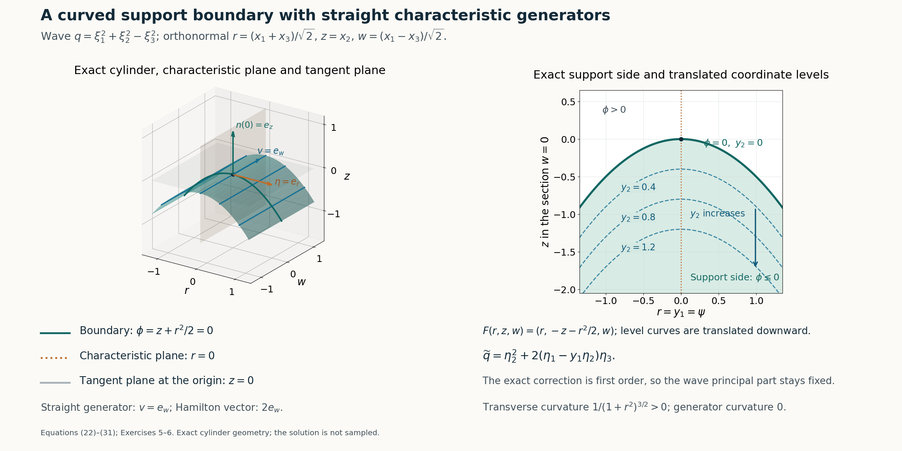

# Curved support boundaries and principal preservation

*Written by GPT-6.1 Sol (OpenAI), Ultra reasoning effort, October 2026. Self-checked by GPT-6.1 Sol (OpenAI). Original expression: CC0.*

A flat solution in two variables can be carried to a curved boundary. The characteristic phase chooses the first new coordinate, and the desired support side chooses the second. In those coordinates a missing principal coefficient lets us factor the operator on the right by the second derivative variable. A second missing coefficient lets us factor by its square, so the correction loses one order and preserves the principal part everywhere. Keeping the coefficient inside the right composition makes the equation exact, including all its differentiated coefficient terms.

Read [Characteristic rays and directional strength](characteristic-rays-and-directional-strength.md). We use the first-order and second-power two-variable models and the flat profile from the prerequisite. All coordinate inversion, principal-symbol transformations, coefficient compositions and curved geometry are proved here. The cylindrical application assumes a nonzero real straight generator proportional to the characteristic symbol gradient.

The mathematical inputs are the internal proofs identified above and below. The Hörmander reference provides background comparison.

## The statements and a chart that records the support side

Let X be open in \(\mathbb R^n\), and let \(Q(x,D)\) have smooth complex coefficients and order \(m\ge 1\). Write its degree-m homogeneous principal symbol as \(q(x,\xi)\). Let ψ,φ be real smooth functions on X, with
\[
\begin{gathered}
q(x,\nabla\psi(x))=0,\\
\nabla\psi(x^0),\nabla\phi(x^0)\ \text{linearly independent},
\\
x^0\in X .
\end{gathered}
\tag{1}
\]
In particular \(n\ge 2\). the first principal-preservation theorem asserts the existence of a neighborhood Y of \(x^0\), a smooth-coefficient operator P of order at most m, and u∈C∞(Y) such that
\[
\begin{gathered}
Pu=0,\\
\operatorname{supp}_Y u=\{x\in Y:\phi(x)\le\phi(x^0)\},\\
p_m(x,\xi)=q(x,\xi)\\
\text{when }x\in Y,\ \phi(x)\ge\phi(x^0).
\end{gathered}
\tag{2}
\]
Here \(p_m\) is the homogeneous degree-m part of the constructed operator; zero coefficients are allowed. If, in addition, the complex scalar identity
\[
\nabla_\xi q(x,\nabla\psi(x))\cdot\nabla\phi(x)=0
\quad(x\in X)
\tag{3}
\]
holds, the full principal-preservation theorem asserts the same support and equation with \(p_m\)=q on all of Y. The dot product in (3) is the polynomial derivative pairing, with no complex conjugation. Thus the corollaries also apply to complex principal symbols. The degenerate order 0 case, if included, has \(q(x)=0\) by the characteristic equation and is immediate with \(P=0\) and the same flat profile construction.

Choose \(n-2\) constant real linear forms completing the two gradient rows at \(x^0\) to a basis. Put
\[
\begin{gathered}
F(x)\\
=y\\
=\bigl(\psi(x)-\psi(x^0),\ -\phi(x)+\phi(x^0),\
\ell_3(x-x^0),\ldots,\ell_n(x-x^0)\bigr).
\end{gathered}
\tag{4}
\]
Its derivative \(A=DF(x^0)\) is invertible. Shrink the neighborhood so both original gradients remain independent and F is a smooth coordinate chart.

For completeness, this last assertion follows by contraction rather than an unreceived chart theorem. Translate \(x^0\) to 0 and write \(F(x)=Ax+R(x)\), with \(R(0)=0\) and \(DR(0)=0\). Choose a closed Euclidean ball \(\overline B_\rho\) on which \(\|A^{-1}DR\|\le1/2\). If \(\|A^{-1}y\|<\rho/2\), the map
\[
\begin{gathered}
T_y(x)=A^{-1}y-A^{-1}R(x),\\
\|T_y(x)-T_y(x')\|\le\frac12\|x-x'\|
\end{gathered}
\tag{5}
\]
maps \(\overline B_\rho\) into itself. Iteration converges geometrically to a unique \(x=G(y)\), and \(F(G(y))=y\). The bound \(\|G(y)\|\le2\|A^{-1}y\|<\rho\) puts this point strictly inside the ball. Moreover \(DF=A(I+A^{-1}DR)\) is invertible throughout the ball by the convergent matrix series \((I+A^{-1}DR)^{-1}=\sum_{j\ge0}(-A^{-1}DR)^j\). Subtracting two fixed-point equations gives \(\|G(y)-G(y')\|\le2\|A^{-1}\|\|y-y'\|\). Subtract the equations at y and y+h and use differentiability of R and this Lipschitz bound: division by |h| shows \(DG(y)=DF(G(y))^{-1}\). The inverse matrix is smooth wherever its determinant is nonzero. Repeated differentiation of that identity proves G is smooth by induction. Its image is open: for \(x=G(y)\), all sufficiently nearby x' still have \(F(x')\) in the small y-domain and belong to the ball; fixed-point uniqueness gives \(G(F(x'))=x'\). This also proves F and G are inverse on an open neighborhood. Restrict to such a Y and write \(Z=F(Y)\).

## How the principal symbol changes

For a function v of y, the first chain rule gives
\(D_{x_j}[v(F(x))]=\sum_k(\partial_{x_j}F_k)D_{y_k}v\).
Iterating produces one degree-m term for each original degree-m monomial; every term that differentiates a chart coefficient has lower order. Hence the transported principal symbol is
\[
\widetilde q(y,\eta)
=q\bigl(G(y),DF(G(y))^{\mathsf T}\eta\bigr).
\tag{6}
\]
All its coefficients are smooth. In particular
\[
\begin{gathered}
\widetilde q(y,e_1)=q(x,\nabla\psi(x))=0,\\
x=G(y).
\end{gathered}
\tag{7}
\]
Thus the coefficient of \(η_1^m\) vanishes identically.

A homogeneous degree-m polynomial without this monomial can be written, with smooth homogeneous degree-(\(m-1\)) polynomials \(q_j\),
\[
\begin{gathered}
\widetilde q(y,\eta)=\sum_{j=2}^n q_j(y,\eta)\eta_j,\\
\widetilde q(y,D)=\sum_{j=2}^n q_j(y,D)D_j .
\end{gathered}
\tag{8}
\]
For an explicit choice, assign each remaining monomial to the first index \(j\ge 2\) with positive exponent and remove one \(η_j\). The finitely many coefficient assignments are fixed, so their spatial smoothness is preserved. Operators use left coefficients and commuting constant coordinate derivatives, so the second identity is exact without a product-rule remainder.

Choose the actual two-variable directional model \(v_1\),\(a_1\):
\[
\begin{gathered}
(D_2+a_1(y_1,y_2)D_1)v_1=0,\\
\operatorname{supp}v_1=\operatorname{supp}a_1=\{y_2\ge0\},
\\
v_1,a_1\in C^\infty(\mathbb R^2).
\end{gathered}
\tag{9}
\]
Both have all jets flat at \(y_2\)=0. Extend them independently of \(y_3,\ldots,y_n\), and use the same letters on Z. Define the operator by genuine composition
\[
\begin{gathered}
L_1\\
=\widetilde q(y,D)+q_2(y,D)\circ M_{a_1}\circ D_1,\\
L_1v_1=q_2(y,D)(D_2v_1+a_1D_1v_1)=0 .
\end{gathered}
\tag{10}
\]
Here \(M_a\) denotes multiplication by a. The terms \(j\ge 3\) in (8) annihilate \(v_1\) because those rightmost derivatives are zero.

The composed correction has order at most m. More explicitly, if \(q_2(y,D)=\sum_{|\alpha|=m-1}b_\alpha(y)D^\alpha\), then
\[
\begin{gathered}
q_2(y,D)M_aD_1\\
=\sum_{\alpha}\sum_{\beta\le\alpha}
 b_\alpha(y)\binom{\alpha}{\beta}(-i)^{|\beta|}
 (\partial^\beta a)\,D^{\alpha-\beta+e_1},\\
\sigma_m(L_1)(y,\eta)\\
=\widetilde q(y,\eta)+a_1(y)q_2(y,\eta)\eta_1.
\end{gathered}
\tag{11}
\]
Terms with |β|>0 have lower order. No derivative of \(b_α\) occurs because it is on the left. Since \(a_1\) and all its derivatives vanish for \(y_2\)≤0, the correction is zero there, including its boundary jets.

Pull \(L_1\) back to x by \(P_1u=[L_1(u\circ G)]\circ F\), and put \(u_1=v_1\circ F\). The inverse cotangent substitution in (6) shows that its degree-m symbol equals the original q wherever \(y_2\)≤0, equivalently \(\phi\ge\phi(x^0)\). The equation is exact. Moreover
\[
\begin{gathered}
\operatorname{supp}_Yu_1
\\
=F^{-1}\bigl(Z\cap\{y_2\\
\ge0\}\bigr)
\\
=\{x\in Y:\phi(x)\\
\le\phi(x^0)\}.
\end{gathered}
\tag{12}
\]
To justify the support equality after restriction, every open neighborhood in Z of an interior support point projects to an open two-variable neighborhood where \(v_1\) has a nonzero value; all extra coordinates are irrelevant to that value. Every boundary point is approached from the positive \(y_2\) side. The coordinate homeomorphism preserves these relative closure statements.

Every finite x-derivative of \(v_1\)(F(x)) or \(a_1\)(F(x)) is a finite sum of y-derivatives multiplied by smooth chart derivatives. On a compact boundary neighborhood these factors are bounded. Consequently
\[
\begin{gathered}
\partial_x^\alpha u_1=\partial_x^\alpha(a_1\circ F)=0
\\
\text{on }\{\phi=\phi(x^0)\},\\
\text{for every }\alpha .
\end{gathered}
\tag{13}
\]
This proves all curved boundary jets flat and completes (2).

The stated constant nonelliptic principal application is now explicit. If a nonzero constant homogeneous symbol q is not elliptic, there is a real η≠0 with q(η)=0. Choose
\[
\begin{gathered}
\psi(x)=\eta\cdot(x-x^0),\\
\phi(x)=b\cdot(x-x^0),\\
b\notin\mathbb R\eta .
\end{gathered}
\tag{14}
\]
These data satisfy (1). Such a b exists whenever this nonelliptic positive-order situation occurs: in dimension 1 a nonzero homogeneous symbol has no nonzero real characteristic direction. More generally any given real smooth φ whose gradient is independent of this η at \(x^0\) also works with the same linear ψ. the first principal-preservation theorem therefore applies with exactly the support side and principal-side equality stated.

## A second missing coefficient lowers the correction order

Differentiate (6) with respect to \(η_2\) at η=\(e_1\). Its second cotangent column is \(\nabla F_2=-\nabla\phi\), so (3) gives
\[
\begin{gathered}
\partial_{\eta_2}\widetilde q(y,e_1)
\\
=-\nabla_\xi q(x,\nabla\psi(x))\cdot\nabla\phi(x)\\
=0.
\end{gathered}
\tag{15}
\]
The coefficient of \(η_1^{m−1}η_2\) is therefore zero, in addition to that of \(η_1^m\):
\[
[\eta_1^m]\widetilde q=0,\qquad
[\eta_1^{m-1}\eta_2]\widetilde q=0.
\tag{16}
\]
For \(m\ge 2\), assign each monomial containing some \(η_j\),\(j\ge 3\) to one such right factor. Every remaining monomial contains \(η_2\) at least twice, because the only degree-m monomials with \(η_2\) exponent 0 or 1 have just been removed. Thus
\[
\begin{gathered}
\widetilde q(y,\eta)\\
=q_2^{(2)}(y,\eta)\eta_2^2
+\sum_{j=3}^n q_j^{(2)}(y,\eta)\eta_j ,
\end{gathered}
\tag{17}
\]
where \(q_2^{(2)}\) has degree \(m-2\) and each \(q_j^{(2)}\) degree \(m-1\). Zero polynomials are allowed; all coefficients are smooth and the corresponding right-factor operator identity is exact.

Use the actual positive-power directional model with power 2:
\[
\begin{gathered}
(D_2^2+a_2(y_1,y_2)D_1)v_2=0,\\
\operatorname{supp}v_2=\operatorname{supp}a_2=\{y_2\ge0\},
\\
v_2,a_2\in C^\infty(\mathbb R^2).
\end{gathered}
\tag{18}
\]
Extend in the other coordinates as before. Define
\[
\begin{gathered}
L_2\\
=\widetilde q(y,D)
+q_2^{(2)}(y,D)\circ M_{a_2}\circ D_1,\\
\operatorname{ord}\bigl(q_2^{(2)}M_{a_2}D_1\bigr)\\
\le m-1 .
\end{gathered}
\tag{19}
\]
Every differentiated coefficient term is retained by the composition. Equation (17) and the rightmost transverse derivatives give
\[
\begin{gathered}
L_2v_2=q_2^{(2)}(y,D)(D_2^2v_2+a_2D_1v_2)=0,\\
\sigma_m(L_2)=\widetilde q\\
\text{on all of }Z.
\end{gathered}
\tag{20}
\]
Pulling back gives \(Pu=0\) with exact relative support (12), all flat boundary jets (13), and \(p_m\)=q everywhere in Y. This proves the full principal-preservation theorem for \(m\ge 2\).

For \(m=1\), (16) removes \(η_1\) and \(η_2\) altogether:
\[
\begin{gathered}
\widetilde q(y,\eta)=\sum_{j=3}^n c_j(y)\eta_j,\\
L_2=\widetilde q(y,D),\\
v_2(y)=f(y_2),
\end{gathered}
\tag{21}
\]
with f from equation (3) of [Characteristic rays and directional strength](characteristic-rays-and-directional-strength.md). Every rightmost derivative in \(L_2\) annihilates \(v_2\). Its exact support and flatness follow directly, and the pullback preserves the entire principal part. There is no need to assign a negative polynomial degree to a nonzero \(q_2^{(2)}\). This also handles an empty transverse sum. The corollary is therefore proved for every positive order allowed by its data.

## Cylindrical levels and convexity transverse to a real generator

For a constant homogeneous symbol, the real straight generator in the cylindrical application can be recorded precisely by data
\[
\begin{gathered}
\eta\in\mathbb R^n\setminus\{0\},\\
q(\eta)=0,\\
\nabla_\xi q(\eta)=\alpha v,\\
v\in\mathbb R^n\setminus\{0\},\\
\alpha\in\mathbb C\setminus\{0\}.
\end{gathered}
\tag{22}
\]
For a real symbol one can take α=1 and v its nonzero gradient. Euler's homogeneous identity gives \(\eta\cdot v=0\), since \(\eta\cdot\nabla q(\eta)=m q(\eta)=0\). Thus the generator is tangent to the characteristic planes normal to η. This formulation covers a complex scalar multiple of a real generator; it does not turn a general complex gradient into a real vector.

Let S be a smooth local hypersurface through \(x^0\), cylindrical along this v, with its normal at \(x^0\) not parallel to η. Choose orthonormal coordinates h,w,z, where h is in the unit normal b to S at \(x^0\), z is in the unit generator direction, and w consists of the remaining \(n-2\) orthogonal coordinates. The cylinder has a local graph \(h=H(w)\) independent of z: the ordinary local graph follows from the chart proof above, and invariance along each generator plus graph uniqueness removes z. Choose
\[
\begin{gathered}
\phi_{\mathrm{new}}(h,w,z)=h-H(w),\\
\psi(x)=\eta\cdot(x-x^0).
\end{gathered}
\tag{23}
\]
Every level of \(\phi_{\rm new}\) is a translate of S in the h direction, and every level is cylindrical along v. If the original defining function is φ and its orientation is chosen so \(∂_hφ\)>0 at \(x^0\), the fundamental theorem of calculus gives
\[
\begin{gathered}
\phi(h,w,z)-\phi(x^0)\\
=(h-H(w))\int_0^1
 \partial_h\phi(H(w)+t(h-H(w)),w,z)\,dt .
\end{gathered}
\tag{24}
\]
The integral is positive after shrinking the neighborhood. Thus the new and old zero levels and inequality sides agree exactly. The gradient of the new function at \(x^0\) is a positive scalar multiple of the original gradient, so independence from η remains true. Finally
\[
\begin{gathered}
\nabla_\xi q(\nabla\psi)\cdot\nabla\phi_{\mathrm{new}}
\\
=\alpha v\cdot\nabla\phi_{\mathrm{new}}\\
=0 .
\end{gathered}
\tag{25}
\]
the full principal-preservation theorem applies, and its support side is the original side by (24). This proves the translated-level cylindrical application for the real generator data in (22).

Convexity in every transverse tangent direction is also attainable, not merely schematic. Normalize v to \(\widehat v\); choose a unit b perpendicular to it and not parallel to η, and let \(W=(\operatorname{span}\{b,\widehat v\})^\perp\). For κ>0, with \(x^0=0\), set
\[
\begin{gathered}
\phi(x)=b\cdot x+\frac{\kappa}{2}|\pi_Wx|^2,\\
v\cdot\nabla\phi=0,\\
\mathrm{II}_x(\tau,\tau)
=\frac{\kappa|\pi_W\tau|^2}
 {\sqrt{1+\kappa^2|\pi_Wx|^2}}
\\
\bigl(\tau\in T_x\{\phi=0\}\bigr).
\end{gathered}
\tag{26}
\]
Our convention is \(n_\phi=\nabla\phi/|\nabla\phi|\) and \(\mathrm{II}(\tau,\tau)=\langle D_\tau n_\phi,\tau\rangle\). The displayed expression follows from the constant Hessian \(κπ_W\). A tangent vector with \(π_Wτ\)=0 has the form \(\tau=\beta b+\lambda\widehat v\), and tangency forces β=0; hence its only null direction is the generator. Every other tangent direction has positive curvature. Such a b exists exactly in the relevant transverse setting; for a nonzero simple real characteristic generator this construction is available in \(n\ge 3\). Shrink around 0 to retain gradient independence from η. The support side {φ≤0} is a convex sublevel set, since its defining function has positive semidefinite Hessian.

## An exact wave-cylinder construction

For a fully specified three-dimensional example, use
\[
\begin{gathered}
q(\xi)=\xi_1^2+\xi_2^2-\xi_3^2,\\
r=\frac{x_1+x_3}{\sqrt2},\\
z=x_2,\\
w=\frac{x_1-x_3}{\sqrt2}.
\end{gathered}
\tag{27}
\]
These are orthonormal physical coordinates. The characteristic normal is \(e_r=(1,0,1)/\sqrt2\), and the real generator is \(e_w=(1,0,-1)/\sqrt2\), with \(\nabla q(e_r)=2e_w\). For κ>0 choose \(\psi=r\) and \(\phi=z+\kappa r^2/2\). The adapted map and transformed symbol are exactly
\[
\begin{gathered}
F(x)=(y_1,y_2,y_3)=(r,-z-\kappa r^2/2,w),\\
\det DF=1,\\
\widetilde q(y,\eta)\\
=\eta_2^2+2(\eta_1-\kappa y_1\eta_2)\eta_3 .
\end{gathered}
\tag{28}
\]
The determinant includes the orthonormal transformation from x to (r,z,w); the subsequent chart alone has determinant −1. Both missing coefficients in (16) can be read off, and \(q_2^{(2)}=1\).

Let \(v_2\),\(a_2\) be the actual second-power model (18). In the orthonormal physical coordinates define
\[
\begin{gathered}
u(r,z,w)\\
=v_2(r,-z-\kappa r^2/2),\\
P\\
=2D_rD_w+D_z^2
+a_2(r,-z-\kappa r^2/2)(D_r-\kappa rD_z).
\end{gathered}
\tag{29}
\]
The coefficient multiplies the first-order operator on the left, as the \(q_2^{(2)}\)=1 case requires. Since u is independent of w, direct differentiation gives
\[
\begin{gathered}
Pu\\
=(D_2^2v_2+a_2D_1v_2)(r,-z-\kappa r^2/2)\\
=0 .
\end{gathered}
\tag{30}
\]
This can be read globally: F is a global smooth bijection with inverse \(r=y_1,\ z=-y_2-\kappa y_1^2/2,\ w=y_3\). Thus the support is exactly \(\{z+\kappa r^2/2\le0\}\), and every jet is flat on its boundary. The quadratic wave principal part is preserved everywhere. No global bound on every first-order physical coefficient is asserted; the factors \(\kappa r\) may grow.

The boundary is a parabolic cylinder, with straight w generators. Its transverse curvature and generator curvature are
\[
\begin{gathered}
\kappa_{\mathrm{trans}}(r)
=\frac{\kappa}{(1+\kappa^2r^2)^{3/2}}>0,\\
\kappa_{\mathrm{gen}}=0 .
\end{gathered}
\tag{31}
\]
The geometric normal, characteristic normal and generator are all distinct roles: the boundary normal is proportional to \(\kappa r\) \(e_r\)+\(e_z\), the characteristic planes are \(r=\mathrm{constant}\), and the straight generators vary w.

**Figure 1.** Exact example (27)–(31), κ=1, in orthonormal physical coordinates (r,z,w). Left: an orthographic view of the cropped parabolic cylinder \(z=-r^2/2\), its straight w generators, the characteristic plane \(r=0\) and the boundary tangent plane \(z=0\) at the origin. The labeled arrows are the unit characteristic normal \(e_r\), unit generator \(e_w\) and unit boundary normal \(e_z\) at 0; the Hamilton vector is \(2e_w\). The three-dimensional axes use equal physical unit scale before projection. Right: the Euclidean section \(w=0\), showing the exact support side \(z+r^2/2\le0\) and translated coordinate levels \(y_2=-(z+r^2/2)=0,0.4,0.8,1.2\). The downward arrow increases \(y_2\) at fixed r; it is a coordinate line rather than a geometric normal-distance curve. The characteristic coordinate is \(y_1\)=r. Transverse curvature is \(1/(1+r^2)^{3/2}>0\), with the signed convention in equation (26); the generator curvature is 0. The plotted windows are finite crops of the global geometry. The constructed solution and its coefficient are not sampled. Equations: equation (22)–equation (31), Exercises 5–6. 

## Exercises with complete solutions

**Exercise 1 (the coordinate side).** With \(y_2\)=\(-\phi\)+\(\phi(x^0)\), identify the support side and the side where the first-order correction vanishes. Explain why this includes the boundary for every coefficient jet.

**Solution.** The model support \(y_2\)≥0 becomes \(\phi\le\phi(x^0)\). Its coefficient \(a_1\) is zero for \(y_2\)≤0, which becomes \(\phi\ge\phi(x^0)\). Smoothness and vanishing on an open half space make all y-jets zero on the boundary; the chain rule makes every pulled-back x-jet zero there. The sides are therefore the two inequalities in (2), with equality belonging to both closed conditions.

**Exercise 2 (keep the coefficient inside the composition).** Let \(q_2(y,D)=b(y)D_2\). Expand \(q_2M_aD_1\). Which coefficient gets differentiated, and which term is its principal symbol?

**Solution.** The exact expression is \(b aD_2D_1-i b(\partial_2a)D_1\). The derivative acts on a, not on the left coefficient b. The highest-order symbol is \(b a\eta_2\eta_1\). The second term is lower order but contributes to the exact equation; replacing the composition with only its highest-order term would lose it.

**Exercise 3 (the second missing coefficient).** For a homogeneous polynomial of degree m, explain why \(\widetilde q(e_1)=0\) and \(\partial_{\eta_2}\widetilde q(e_1)=0\) remove exactly the two monomials in (16). Deduce (17).

**Solution.** Evaluation at \(e_1\) annihilates every monomial except \(η_1^m\). Differentiation once in \(η_2\) followed by evaluation at \(e_1\) annihilates every monomial except \(η_1^{m−1}η_2\), whose multiplier is 1. Any remaining monomial with no \(η_j\),\(j\ge 3\) must have \(η_2\) exponent at least 2. Those terms factor by \(η_2^2\); each other term factors by a rightmost \(η_j\),\(j\ge 3\). The fixed monomial assignment preserves smooth coefficient functions.

**Exercise 4 (order 1 under the stronger condition).** Why should one not assign a nonzero polynomial degree −1 to \(q_2^{(2)}\) when \(m=1\)? Construct the solution instead.

**Solution.** The two vanishing coefficients remove \(η_1\) and \(η_2\) from the degree 1 symbol entirely. The remaining operator is \(\sum_{j\ge3}c_j(y)D_j\), which kills the flat profile f(\(y_2\)) because it is independent of those variables. Its support is exactly \(y_2\)≥0, and its jets are flat. Pulling it back proves the desired statement while preserving the first-order principal symbol everywhere.

**Exercise 5 (verify the curved wave formula).** In (29), compute \(D_ru,D_zu\) and \((D_r-\kappa rD_z)u\). Use them to prove (30).

**Solution.** Writing \(V_j\) for \(D_jv_2\) at the adapted point, the chain rule gives \(D_ru=V_1-\kappa rV_2\) and \(D_zu=-V_2\). Subtracting \(\kappa rD_zu\) cancels the second terms and gives \(V_1\). Also \(D_z^2u=D_2^2v_2\) at that point, while \(D_wu=0\). Therefore Pu is the pulled-back value of \(D_2^2v_2+a_2D_1v_2\), which is zero by the actual model equation.

**Exercise 6 (convexity away from the generator).** For (26), show that a tangent vector with zero second fundamental form is parallel to \(\widehat v\), and specialize the transverse curvature to the κ-parabolic cylinder in (27)–(31).

**Solution.** Zero second fundamental form forces \(π_Wτ\)=0, so \(\tau=\beta b+\lambda\widehat v\). Tangency to \(\phi=0\) gives \(\tau\cdot(b+\kappa\pi_Wx)=\beta=0\). Thus only the generator is a null curvature direction. In dimension 3 take \(b=e_z\) and \(W=\operatorname{span}(e_r)\). The cross-section has graph \(z=-\kappa r^2/2\); its unsigned curvature is \(|z''|/(1+z'^2)^{3/2}=\kappa/(1+\kappa²r²)^{3/2}\). The normal convention in (26) makes this positive, while the straight w curves have zero curvature.

## References

- Internal directional models: [Characteristic rays and directional strength](characteristic-rays-and-directional-strength.md#the-first-order-example-and-independent-operator-replacement), equations (16)–(22), and its homogeneous flat profile, equation (3); the positive-power case includes the power 2 used here.
- [Hörmander] Lars Hörmander, *The Analysis of Linear Partial Differential Operators II: Differential Operators with Constant Coefficients*, Springer, 1983.
- The coordinate inverse, full symbol transformation, right-factor compositions, curved support equality, principal preservation and wave-cylinder formulas are proved in this lesson, equations (4)–(31) and Exercises 1–6.
