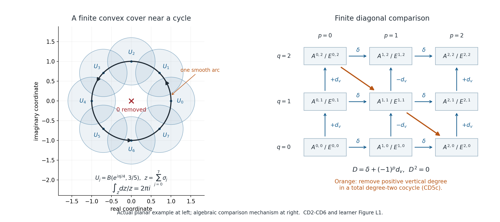

# When zero smooth periods mean that a cycle bounds

*Written by GPT-6.1 Sol (OpenAI), Ultra reasoning effort, October 2026. Self-checked by the writing AI and spot-checked in a separate AI session. Public domain (CC0).*

Its full proof is included below in [Smooth periods detect finite singular cycles](cycle-detection-proof.md). This lesson uses ordinary finite singular chains and field coefficients.

A closed form assigns a number to a cycle by integration. Stokes says that this number is zero if the cycle bounds. We will prove the converse when **every** closed smooth complex form gives zero: a finite cycle in a smooth affine or projective complement then bounds over the complex numbers. A rational cycle bounds over the rational numbers as well.

This is a smooth de Rham theorem. Testing a smaller family, such as rational forms with a selected pole order, requires a separate proof that the family represents all relevant smooth cohomology classes.

## The objects and the exact assertion

A singular \(q\)-simplex is a map from the closed standard simplex \(\Delta^q\) into the space. A smooth singular simplex extends smoothly to a neighborhood of that simplex. A chain is a finite formal sum of these maps, with coefficients in the chosen field. Its boundary is the signed sum of its faces. A cycle is a chain with zero boundary; its homology class is zero precisely when a finite chain one dimension higher has it as boundary.

Let \(M\) be any open subset of \(\mathbb C^r\), viewed as a real smooth manifold. If \(z\) is a finite smooth \(q\)-cycle, then

\[
 \int_z\omega=0\quad\text{for every closed smooth complex }q\text{-form }\omega
 \quad\Longleftrightarrow\quad [z]=0\text{ in }H_q(M;\mathbb C).
 \tag{L1}
\]

The conclusion refers to ordinary continuous singular homology. The proof also gives zero in smooth singular homology. Thus a continuous bounding chain can be replaced, for this homology calculation, by a finite smooth bounding chain.

There is no compactness hypothesis on \(M\). Forms can be arbitrary smooth complex forms on the underlying real manifold; there is no condition of holomorphicity, compact support, or growth at infinity. The cycle itself is finite. Locally finite infinite chains belong to a different theory.

For \(M_x=\{z\in\mathbb C^n:x\cdot z=0,\ F(z)\ne0\}\), \(x\ne0\), choose linear coordinates on the hyperplane to identify it with \(\mathbb C^{n-1}\). The complement is open and therefore smooth even if \(F=0\) has singularities. The same statement applies to \(Y_x=\mathbb P(H_x)\setminus\{F=0\}\), by the finite projective-chart argument below.

## How the proof finds every possible period

The proof has three comparison steps, all proved explicitly in CD1-CD8 of the full proof.

1. **Make chains small.** Repeated barycentric subdivision puts each simplex of a finite chain inside some ball of a locally finite convex-ball cover. A carried cone homotopy proves that subdivision changes a cycle only by a boundary. If a small cycle bounds in the full complex, equation (CD3.7) constructs a small bounding chain. Smooth simplices remain smooth.
2. **Compare on intersections and glue.** Every nonempty intersection of the balls is convex. Straight homotopy gives a singular prism contraction, while radial integration gives the smooth Poincare operator. Both local theories have constants in degree zero and zero cohomology in positive degrees. Alternating restrictions form a grid of cochains on the cover. A smooth partition of unity contracts its horizontal forms rows; choosing one cover index for each small simplex contracts its singular-cochain rows. Finite elimination along each diagonal shows that both grids compute the same global cohomology. Integration agrees on the local constants, and therefore gives the actual global isomorphism.
3. **Separate a nonzero class.** A nonzero homology class over a field admits a linear functional taking value 1 on it: include it in a vector-space basis. Extend that functional from cycles to chains. The integration isomorphism represents it by a closed smooth form, up to a cochain coboundary. Evaluation on a cycle kills that coboundary. A nonzero class must therefore have a nonzero smooth period.

The grids are a bookkeeping device for the actual restrictions, forms, chains and maps. No nerve theorem, unnamed smoothing theorem, universal-coefficient theorem or spectral-sequence convergence is hidden in these steps. The full proof writes out the required contractions and finite elimination.

*Figure L1.* Left: eight actual balls \(U_j=B(e^{i\pi j/4},3/5)\subset\mathbb C^*\), \(0\leq j\leq7\), and the positively oriented unit circle. The arc \(\sigma_j(t)=\exp(i(\pi j/4-\pi/8+(\pi/4)t))\), \(0\leq t\leq1\), lies in \(U_j\), since its distance from the center is at most \(2\sin(\pi/16)<3/5\). This is a finite part of a cover near this cycle, not a cover of all of \(\mathbb C^*\). Right: bidegrees \(p\) (number of cover-index overlaps minus one) and \(q\) (form/cochain degree). Horizontal arrows are alternating restrictions \(\delta\). Vertical arrows carry \((-1)^p\mathrm d_v\). The orange path shows the finite removal of positive vertical degree in a total degree-two cocycle, as proved in CD5c. It is an algebraic diagram, not a geometric deformation of the circle. The native renderer and exact coordinate specification are retained with this lesson. Human-source credit for the classical period theorem and subdivision/prism method is given at the end.

## Worked example 1: one closed form detects a loop

Take \(M=\mathbb C^*\) and use the eight arcs in Figure L1. The end of one arc is the start of the next, including the last-to-first identification, so their sum \(z=\sum_{j=0}^7\sigma_j\) is a finite smooth cycle. The form

\[
 \omega=\frac{\mathrm dz}{z}
\]

is a smooth complex one-form on \(\mathbb C^*\). It is closed, since \(\mathrm d(z^{-1}\mathrm dz)=-z^{-2}\mathrm dz\wedge\mathrm dz=0\). Along \(z=e^{it}\), it pulls back to \(i\,\mathrm dt\). Each of the eight arcs contributes \(i\pi/4\), giving

\[
 \int_z\frac{\mathrm dz}{z}=2\pi i\ne0. \tag{L2}
\]

Hence this cycle does not bound over \(\mathbb C\), and in particular does not bound over \(\mathbb Q\). This calculation uses the easy direction of Stokes. The theorem supplies the harder conclusion that some closed smooth form detects **any** nonzero complex class, even if no convenient formula for that form is already known.

Testing only exact forms would tell us nothing about this cycle: for every smooth function \(f\), \(\int_z\mathrm df=f(\text{end})-f(\text{start})=0\). The form \(\mathrm dz/z\) is not exact on \(\mathbb C^*\), precisely because of its nonzero period. A logarithm exists locally on a ball avoiding zero, while the obstruction appears when the local pieces are assembled around the circle.

## Worked example 2: the radial operator is a real calculation

On \(\mathbb R^2\), take \(a=0\) and the closed two-form \(\omega=\mathrm dx\wedge\mathrm dy\). Equation (CD2.3) gives

\[
 K\omega=\frac12(x\,\mathrm dy-y\,\mathrm dx),\qquad
 \mathrm dK\omega=\mathrm dx\wedge\mathrm dy=\omega. \tag{L3}
\]

Indeed, contraction with the radial vector \((x,y)\) gives \(x\,\mathrm dy-y\,\mathrm dx\), and \(\int_0^1t\,\mathrm dt=1/2\). Differentiating the two terms gives \(\tfrac12(\mathrm dx\wedge\mathrm dy-\mathrm dy\wedge\mathrm dx)=\mathrm dx\wedge\mathrm dy\).

The identity \(\mathrm dK+K\mathrm d=\mathrm{id}-R_0^*\) also matters for nonclosed forms. For \(\alpha=x\,\mathrm dy\),

\[
 K\alpha=xy/2,\quad \mathrm dK\alpha=(y\,\mathrm dx+x\,\mathrm dy)/2,
 \quad K\mathrm d\alpha=(x\,\mathrm dy-y\,\mathrm dx)/2.
\]

Their sum is \(x\,\mathrm dy\), as required. Omitting \(K\mathrm d\alpha\) would give the wrong local contraction formula.

## Worked example 3: reduced degree zero

Let \(M=(-2,-1)\cup(1,2)\subset\mathbb R\), and let \(z=[3/2]-[-3/2]\). Its total coefficient is zero, so it is a reduced zero-cycle. The smooth function that is 0 on the left interval and 1 on the right is closed: its derivative vanishes everywhere on \(M\). Its period on \(z\), meaning evaluation with the chain coefficients, is 1. Thus \(z\) is nonzero in reduced homology.

By contrast \(w=[7/4]-[5/4]\) is the boundary of the smooth segment \(\sigma(t)=5/4+t/2\) in the right interval. Every closed smooth zero-form is constant on that interval, so it evaluates to zero on \(w\). Testing only globally constant functions would vanish on both \(z\) and \(w\), and would miss the first class. In an oriented two-point equator the coefficient convention is likewise a difference of points, not their unsigned sum.

## Worked example 4: why rational descent is faithful

Suppose a rational cycle is a complex boundary. Its complex bounding chain has finitely many simplices, so its boundary equation has the form

\[
 A c=v,\qquad A\text{ an integer matrix},\quad v\text{ rational}.
\]

Gaussian elimination uses only rational operations on \(A\) and \(v\). Since a complex solution exists, no zero row can have a nonzero right-hand side. Assign zero to each free variable and solve backward. The result is a rational bounding chain using the same finite list of simplices. The full scalar-extension statement is proved in (CD7.1).

For example the boundary equation \(2c_1+c_2=1\) has many complex solutions, but the rational solution \((c_1,c_2)=(1/2,0)\) is sufficient. This arithmetic argument does not imply an integer solution. In the chain complex \(\partial b=2a\), with \(\partial a=0\), the class of \(a\) can have order two over the integers, while \(a=\partial(b/2)\) over the rationals. Closed complex periods cannot distinguish such integral torsion from zero.

## The precise projective extension

An open \(Y\subset\mathbb P^{r-1}(\mathbb C)\) has the finite standard cover \(W_j=Y\cap\{z_j\ne0\}\). Every finite intersection is an open subset of \(\mathbb C^{r-1}\), so the already-proved affine comparison applies there, even though an intersection need not be convex. A smooth partition for this finite chart cover is written explicitly in (CD8.3). The same horizontal contractions and a finite column comparison then give integration as an isomorphism on \(Y\). The column comparison itself is proved in CD8 by an acyclic-cone elimination with a finite stopping bound.

Thus smooth periods detect finite cycles in \(Y_x\) as well as in \(M_x\). This extension does not turn a smooth form into a rational form; algebraic/rational completeness is a different theorem.

## How this supplies the missing AH4-AH5 interface

Suppose the projection \(p:M_x\to Y_x\) sends a smooth cycle \(k\) to zero in complex singular homology. Then the smooth comparison lets Stokes kill every period of a pulled-back closed smooth form \(p^*\eta\). Suppose also that

\[
 \int_k\vartheta\wedge p^*\beta=0
 \quad\text{for every closed smooth }\beta,
 \qquad\vartheta=\frac{\mathrm dF}{mF}.
\]

AH5 says that each closed smooth form on \(M_x\), modulo an exact form, is a sum of these two kinds. Stokes kills the exact term. All smooth periods of \(k\) therefore vanish, so (L1) gives \([k]=0\) over \(\mathbb C\), and over \(\mathbb Q\) if the cycle is rational. In degree zero there is no fiber term.

For the canonical cycle, AH4 supplies the fiber-period premise relative to its stated D7 deformation input and C7 adapter. The projected-class premise still needs its own proof and exact orientation/multiplicity comparison. Rational-form completeness, tube injectivity and global component constancy remain separate.

## Exercises with complete solutions

**Exercise 1.** In a singular prism on an ordered edge \([v_0,v_1]\), write the two triangles and check the boundary sign.

**Solution.** With bottom vertices \(b_i\) and top vertices \(t_i\), the prism is \([b_0,t_0,t_1]-[b_0,b_1,t_1]\). Its boundary is

\[
 [t_0,t_1]-[b_0,t_1]+[b_0,t_0]
 -[b_1,t_1]+[b_0,t_1]-[b_0,b_1]
 =[t_0,t_1]-[b_0,b_1]-P([v_1]-[v_0]).
\]

The interior diagonal cancels. Hence \(\partial P+P\partial=\text{top}-\text{bottom}\), with the sign used in (CD2.2).

**Exercise 2.** Why does a small cycle bounding in the full complex also bound in the small complex?

**Solution.** If \(z=\partial b\), subdivide the finite \(b\) enough times that \(S^r b\) is small. The homotopy \(T^{(r)}\) stays inside each original simplex, so \(T^{(r)}z\) is small because \(z\) was small. Since \(\partial z=0\), \(\partial T^{(r)}z=z-S^r z\). Therefore \(\partial(S^r b+T^{(r)}z)=S^r z+(z-S^r z)=z\). Both summands are finite small chains. This proves the required injectivity, not just representability of full cycles by small ones.

**Exercise 3.** Why do arbitrary dimensions or infinitely many balls not invalidate the comparison-grid argument?

**Solution.** For a fixed total degree \(N\), only the bidegrees \((0,N),(1,N-1),\ldots,(N,0)\) occur. Elimination moves one step along this finite diagonal and terminates. Within a component, arbitrary cochains are products of values and impose no convergence condition. The only analytic sums are the partition sums; local finiteness makes them finite on a neighborhood of each point. Ordinary chains remain finite throughout.

**Exercise 4.** If \(q>d\) on an open \(M\subset\mathbb R^d\), every \(q\)-form is zero. What does the proved comparison imply?

**Solution.** Smooth \(q\)-forms vanish because an alternating \(q\)-linear form on a \(d\)-dimensional tangent space is zero when \(q>d\). Thus smooth de Rham cohomology in degree \(q\) is zero. The integration comparison gives zero dual singular cohomology. CD1 then says that singular homology in degree \(q\) is zero: otherwise a nonzero class would have a nonzero algebraic functional. The conclusion follows from the comparison; the absence of \(q\)-forms alone would not have been a proof about singular homology.

**Exercise 5.** In the rational descent calculation, what happens if the chosen complex bounding chain contains the same face simplex several times?

**Solution.** Combine identical \(q\)-simplex maps into a single basis entry, summing their signed integer boundary incidences. The resulting matrix still has integer entries, including entries other than \(0,1,-1\) when coincidences occur. Add the simplices in the rational target cycle to the row list if necessary, assigning zero incidences where absent. Gaussian elimination on this finite rational system remains valid.

**Exercise 6.** Does zero period against all rational top forms on a projective complement already imply zero complex singular class?

**Solution.** It does after a separate proof that their smooth cohomology classes represent every class in the relevant degree, or otherwise separate all singular classes. CD034 quantifies over all closed smooth complex forms. It proves that exact detection implication and does not prove rational-form completeness. If the current rational family represents only a proper subspace, some homology functionals could be missing; zero periods on that family would not rule them out.

## Human-source credit

This is a classical theorem with a proof written here for the course's exact chain and coefficient conventions. [Georges de Rham's 1931 thesis](https://www.numdam.org/item/THESE_1931__129__1_0/), chapter III, section 26, Theorem II, printed page 72 (PDF 77), gives the historical prescription of periods under its compact/polyhedral hypotheses. The noncompact proof here establishes the required comparison directly. [Allen Hatcher's freely supplied chapter 2](https://pi.math.cornell.edu/~hatcher/AT/ATch2.pdf), proof of Theorem 2.10 and Proposition 2.21 credit the prism and subdivision methods. Source locators and read-only input hashes are retained in this workflow's ledgers. No private textbook prose or scan is included in this learner supplement.
