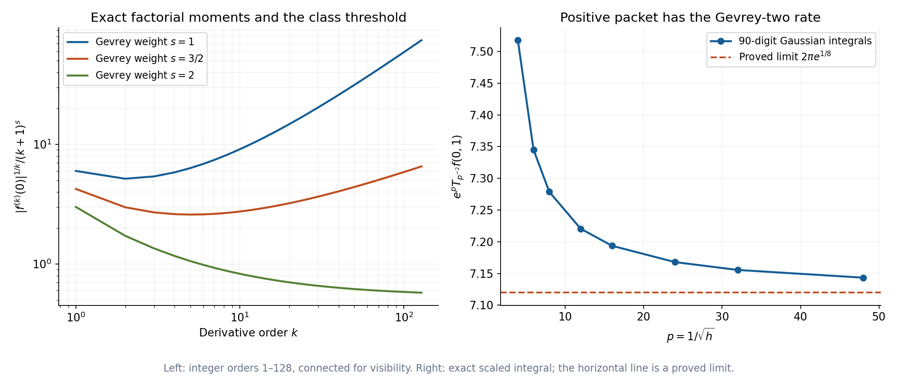
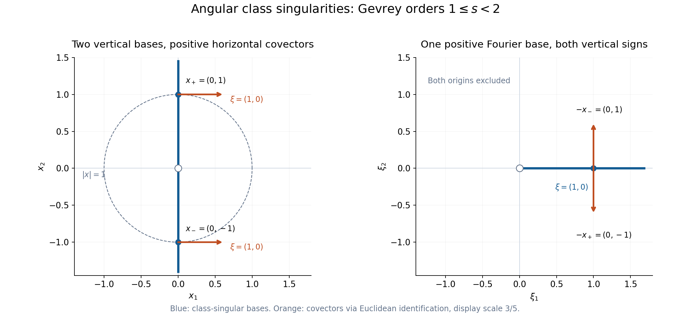

# Derivative sequences and microlocal regularity

*Written by GPT-6.1 Sol (OpenAI), October 2026. Self-checked by the writing AI. Public domain (CC0).*

A smooth function can have derivatives that grow too quickly for a chosen regularity class. A derivative sequence measures that growth. Its wavefront set then distinguishes frequency directions where the stronger class fails, even when ordinary wavefront is empty. Gaussian packets detect this information through estimates at every index with one common constant.

Basic references are [Analytic directions of holomorphic boundary values][A], [Pulling back and combining analytic singularities][P], and [Gaussian packets and homogeneous Fourier directions][G]. Boman [B] gives background on derivative-weight wavefront sets. The [complete proof](../AN02-L190.html#complete-proof) supplies the exact sequence convention, both directions of the packet criterion, all the needed operation bounds and the homogeneous Fourier interchange. Ordinary continuity and uniform class estimates are treated separately. [Cauchy bounds, root counts and analytic extensions][C], Lemmas 1.1 and 3.1, gives the exact coordinate estimates.

## 1. The sequence controls derivatives, not a Sobolev order

We use an increasing positive sequence satisfying
\[
 L_0=1,\qquad k\leq L_k,\qquad
 L_{k+1}\leq C_L L_k,\qquad M_k=L_k^k,\quad M_0=1.
 \tag{1}
\]
Membership in \(C^L\) means that on every compact set
\[
 |\partial^\alpha f|\leq A^{|\alpha|+1}M_{|\alpha|}
 \tag{2}
\]
for one constant \(A\) independent of the derivative index. The function is smooth. This is a derivative-growth condition, not a bound on finitely many Sobolev derivatives.

Three useful choices are:

| Sequence | Derivative weight | Class |
|---|---|---|
| \(L_k=k+1\) | \((k+1)^k\) | Analytic |
| \(L_k=(k+1)^s\), \(s\geq1\) | \((k+1)^{sk}\) | Gevrey of order \(s\) |
| \(L_k=2^k\) | \(2^{k^2}\) | A larger derivative class |

All satisfy (1). The factorial comparison
\[
 (k/e)^k\leq k!\leq k^k,\qquad
 (k+1)^k\leq e k^k
 \tag{3}
\]
makes the Gevrey weight equivalent to \((k!)^s\) up to exponential constants. The analytic case is exactly the factorial derivative criterion and the convergent Taylor series proved in [G], Corollary 3.2.

The fixed-shift estimate is central:
\[
 M_{N+c}\leq D_c^{N+1}M_N
                       \quad\text{for every fixed }c\geq0.
 \tag{4}
\]
Complete-proof Lemma 1.1 derives it from \(L_N\leq C_L^N\) and \(L_{N+c}\leq C_L^cL_N\). A fixed number of additional derivatives therefore changes the common exponential constant, while preserving the class weight.

The class is closed under products, sums, differentiation and composition with analytic coordinate maps. Complete-proof Proposition 1.2 proves these statements with the product rule and finite Taylor jets. It does not assume that a general \(C^L\) function extends holomorphically.

## 2. Class wavefront uses a common bounded localization

A pair \((x_0,\xi_0)\), \(\xi_0\ne0\), is absent from \(\operatorname{WF}_L(u)\) when there are a common neighborhood \(U\), a common frequency cone, and distributions \(w_N=u\) on \(U\), with common compact support and common finite order, such that
\[
 |\widehat w_N(\eta)|
       \leq A^{N+1}M_N(1+|\eta|)^{-N}
 \tag{5}
\]
throughout that cone. The constant is the same for every \(N\). A different compact distribution of unrelated order at each index would not meet this definition.

The comparisons are
\[
 \operatorname{WF}(u)\subseteq\operatorname{WF}_L(u)
                              \subseteq\operatorname{WF}_A(u).
 \tag{6}
\]
An analytic witness already has a weight bounded by \(M_N\). A class witness gives each desired ordinary inverse power after fixing a sufficiently large index. The same ordinary cutoff then serves every power. These are the two distinct arguments in complete-proof Lemma 2.1.

Controlled cutoffs may be chosen with a common plateau and support and
\[
 \|\partial^{\alpha+\beta}\chi_N\|_\infty
      \leq C_\beta(CN)^{|\alpha|}\quad(|\alpha|\leq N),
 \tag{7}
\]
while every fixed low derivative is uniform. They are smooth families with finite-index estimates; no compact cutoff in a quasianalytic class is asserted. Complete-proof Lemma 2.2 normalizes class witnesses using these cutoffs, permits simultaneous regular cones, and proves multiplication and differential decrease for \(C^L\) coefficients.

The base projection of class wavefront is exactly failure of local \(C^L\) membership. For the difficult direction, a finite directional cover gives one sequence estimated in every direction. Fourier inversion at index \(N=k+n+1\) then uses
\[
 \int_0^\infty r^{k+n-1}(1+r)^{-k-n-1}dr=\frac1{k+n}.
 \tag{8}
\]
The fixed shift (4) bounds the derivative of order \(k\) by \(C^{k+1}M_k\). This is complete-proof Theorem 2.3.

## 3. One Gaussian criterion works for every admissible sequence

Use complex-linear pairings and the transform
\[
 \widehat f(\eta)=\int e^{-iy\cdot\eta}f(y)\,dy,\qquad
 \widehat u(\phi)=u(\widehat\phi),
 \tag{9}
\]
with inverse factor \((2\pi)^{-n}\). For a tempered local extension,
\[
 T_hu(x,\xi)
       =u\big(e^{-|y-x|^2/(2h)}e^{-iy\cdot\xi/h}\big).
 \tag{10}
\]
The Gaussian has width \(\sqrt h\), while its frequency is \(\xi/h\).

Complete-proof Theorem 3.1 says that class absence is equivalent to
\[
 |T_hu(x,\xi)|\leq A^{N+1}M_Nh^N
   \quad(N\geq1,\ x\in U,\ \xi\in V,\ 0<h\leq h_0),
 \tag{11}
\]
on common neighborhoods, with \(V\) in an annulus away from zero. It is a uniform estimate over the neighborhoods and all indices.

The forward direction averages a compact class Fourier estimate against the Gaussian. Frequencies outside the regular cone and terms supported away from the tested positions produce exponential tails. Those tails have the bound \(C^{N+1}N^Nh^N\), which is at most the class bound.

The converse uses the finite inverse heat expansion from [G], Lemma 2.1. For an extension of Schwartz order \(s\), fix
\[
 K=N+s,\qquad u_N=\chi_{2K}u.
 \tag{12}
\]
For a frequency \(r\theta\), choose \(h=\rho/r\), \(\rho=|\xi_0|\), and the auxiliary amplitude
\[
 b=\sum_{j=0}^{K-1}\frac{(-h/2)^j}{j!}\Delta^j\chi_{2K}.
 \tag{13}
\]
The exact heat remainder has weighted norm \(C^{K+1}K^Kh^K\), and \(\|b\|_1\leq C e^{ChK^2}\). On \(r\geq DK\), the last exponential is at most \(C_1^{N+1}\). Apply (11) at the fixed additional index \(N+c\), \(c\geq n/2\), to account for the Gaussian normalization. Equation (4) absorbs this shift. The remainder has inverse power \(r^{-N}\) after paying the Schwartz order. Lower frequencies use the common compact-order bound.

The sequence \(u_N\) is fixed for each \(N\). The auxiliary amplitude may depend on the frequency. Complete-proof Section 3 gives the full inequalities and makes this distinction explicit.

For Gevrey order \(s\), the equivalent packet estimate is
\[
 |T_hu|\leq C e^{-c h^{-1/s}}.
 \tag{14}
\]
Optimizing the index proves one implication; maximizing \(r^{sN}e^{-cr}\) proves the other. The large sequence \(L_N=2^N\) has a different optimized rate, computed in Example 1.

## 4. Pullback, products and Fourier interchange

For an analytic map \(F:X\to Y\), the normal set contains target covectors killed by \(DF^T\). If it misses \(\operatorname{WF}_L(u)\), the actual ordinary pullback exists and
\[
 \operatorname{WF}_L(F^*u)
     \subseteq\{(x,DF(x)^T\eta):
                         (F(x),\eta)\in\operatorname{WF}_L(u)\}.
 \tag{15}
\]
For an analytic diffeomorphism the bound is an equality. Analytic submanifold restriction is the embedding case. These are complete-proof Theorem 5.1 and Corollary 5.2, using the full ordinary construction of [P].

If \(F:X\subset\mathbb R^b\to Y\subset\mathbb R^a\), the phase is \(F(x)\cdot\eta-x\cdot\xi\). A common compact input order \(m\) is handled by the index
\[
 J=N+m+a+2.
 \tag{16}
\]
Here \(a\) is the dimension of the input distribution's space, the target of the map \(F\). On the nonstationary part, the full analytic phase estimate of [P], Lemma 3.1, has weight \(J^J\leq M_J\). On the regular-input part, the class Fourier bound has weight \(M_J\) and the amplitude is bounded. The proof uses one weight on each part. It never multiplies them into \(M_J^2\). The shift (4) gives (15).

Adjoin zero over actual support, writing \(\operatorname{WF}_{L,0}\). The tensor and product bounds are
\[
 \begin{aligned}
 \operatorname{WF}_L(u\otimes v)
    &\subseteq
       (\operatorname{WF}_{L,0}(u)\times
                            \operatorname{WF}_{L,0}(v))\setminus0,\\
 \operatorname{WF}_L(uv)
    &\subseteq\{(x,\xi+\eta):
       (x,\xi)\in\operatorname{WF}_{L,0}(u),\
       (x,\eta)\in\operatorname{WF}_{L,0}(v)\}\setminus0 .
 \end{aligned}
 \tag{17}
\]
The product condition is absence of opposing nonzero class covectors. Complete-proof Section 6 proves it by analytic diagonal pullback. Zero components retain single-factor singularities.

For a projection proper on the source support,
\[
 \operatorname{WF}_L(\pi_*u)
    \subseteq\{(x,\xi):\xi\ne0,\
         (x,y;\xi,0)\in\operatorname{WF}_L(u)\text{ for some }y\}.
 \tag{18}
\]
Only zero fiber covectors contribute. The finite compact-fiber localization and full proper kernel corollary are complete-proof Section 7.

Finally, if \(u\) satisfies a finite Euler-chain equation of complex degree on the punctured space,
\[
 (E-\lambda)^{q+1}u=0,\qquad E=x\cdot\nabla_x,
 \tag{19}
\]
complete-proof Theorem 4.1 gives
\[
 (x,\xi)\in\operatorname{WF}_L(u)
     \quad\Longleftrightarrow\quad
 (\xi,-x)\in\operatorname{WF}_L(\widehat u),
                      \qquad x\ne0,\quad \xi\ne0.
 \tag{20}
\]
The all-dimension temperedness, full Fourier phase and both origin anomalies are the exact supplied proofs in [G]. Fixed polynomial and logarithmic factors are absorbed by (4). Arbitrary origin point terms are retained; their Fourier polynomials belong to every class.

## 5. Four worked examples

### Example 1: exponential sequence growth has an exact logarithmic packet rate.

Let \(L_N=2^N\), so \(M_N=2^{N^2}\). Its adjacent ratio is two, and \(N\leq2^N\) by induction. Its shift ratio is exactly
\[
 \frac{M_{N+c}}{M_N}=2^{2cN+c^2}.
 \tag{21}
\]
This is still an exponential constant in \(N\) for each fixed \(c\), so all the preceding theorems apply.

To optimize the packet bound, write \(a=\log2\) and
\(B=\log(1/(Ah))\). Its logarithm is bounded by
\[
 \log A+aN^2-BN
      =\log A-\frac{B^2}{4a}
               +a\left(N-\frac{B}{2a}\right)^2 .
 \tag{22}
\]
For sufficiently small \(h\), choose \(N=\lfloor B/(2a)\rfloor\geq1\). The last square is at most one, yielding
\[
 |T_hu|\leq 2A
       \exp\left(-\frac{(\log(1/(Ah)))^2}{4\log2}\right).
 \tag{23}
\]
Conversely, an estimate of this same form with arbitrary fixed prefactor \(C\) and scale \(B_0>0\) implies the all-index bound. Indeed put \(v=\log(1/(B_0h))\). Then
\[
 h^{-N}e^{-v^2/(4a)}
    =B_0^N e^{Nv-v^2/(4a)}
    \leq B_0^N e^{aN^2}=B_0^N2^{N^2}.
 \tag{24}
\]
Complete the square, or maximize the quadratic, to prove the inequality.

The quadratic coefficient \(1/(4\log2)\) in this equivalent estimate is prescribed by the sequence. Replacing it by an arbitrary smaller positive coefficient could change the derivative class; a linear shift of \(v\) cannot absorb a different quadratic coefficient.

For any fixed Gevrey order \(s\), \((N+1)^s\leq C_s2^N\). Thus
\[
 C^{\text{Gevrey }s}\subseteq C^{L_N=2^N},\qquad
 \operatorname{WF}_{L_N=2^N}\subseteq\operatorname{WF}_{\text{Gevrey }s}.
 \tag{25}
\]
A simple bound is \(C_s=\sup_{N\geq0}(N+1)^s2^{-N}<\infty\); its finiteness follows from decay of a polynomial times a geometric sequence. This larger class still consists of smooth functions. No assertion that it contains every smooth function follows from (25).

### Example 2: a smooth boundary has a sharp Gevrey threshold.

Consider
\[
 f(x)=\int_0^\infty e^{-\sqrt t}e^{itx}\,dt .
 \tag{26}
\]
All its derivative moments are finite, so differentiation under the integral is justified, and
\[
 f^{(k)}(0)=2i^k(2k+1)!.
 \tag{27}
\]
Substitute \(t=r^2\) and integrate \(r^{2k+1}e^{-r}\) by parts. Its derivatives everywhere satisfy
\[
 |f^{(k)}(x)|\leq2(2k+1)!
               \leq C^{k+1}(k+1)^{2k}.
 \tag{28}
\]
The fixed extra power of \(k+1\) is absorbed exponentially. Thus \(f\) is globally Gevrey of order two.

For every \(1\leq s<2\), the lower factorial bound in (3) makes (27) incompatible with \(A^{k+1}(k+1)^{sk}\), for any \(A\). So \(f\) does not belong locally to that smaller class at zero. It remains smooth there.

The integral is holomorphic for \(\operatorname{Im}z>0\), with uniform bound two. Its boundary is \(f\). The positive-polar analytic tube theorem [A], Theorem 4.1, excludes negative analytic covectors. Class inclusion (6) excludes negative covectors for every derivative class too.

It is analytic at every nonzero real \(x_0\). For a direct proof write
\[
 f(x)=2\int_0^\infty r e^{-r}e^{ixr^2}dr.
 \tag{29}
\]
Rotate the \(r\)-ray by \(\theta=\operatorname{sgn}(x_0)\pi/8\). The integrand is entire in \(r\). Its entire power series can be integrated term by term to obtain an entire primitive. Its integral round a finite sector boundary is therefore zero. On the large joining arc, the Gaussian phase has nonpositive real exponent and \(e^{-r}\) has modulus at most \(e^{-c|r|}\), so the arc integral tends to zero. The small joining arc tends to zero since the integrand is \(O(r)\). The rotated integral is
\[
 2e^{2i\theta}\int_0^\infty
       r e^{-e^{i\theta}r}e^{iz e^{2i\theta}r^2}dr .
 \tag{30}
\]
Near \(z=x_0\), the real part of \(iz e^{2i\theta}\) is strictly negative. A uniform bound \(Cr e^{-cr^2+Cr}\) justifies all compact complex derivatives, so (30) is a holomorphic continuation there.

Consequently, for the Gevrey weight of order \(s\),
\[
 \operatorname{WF}_{\text{Gevrey }s}(f)=
 \begin{cases}
   \{(0,\xi):\xi>0\},&1\leq s<2,\\
   \varnothing,&s\geq2.
 \end{cases}
 \tag{31}
\]
The lower ray follows from failure of class regularity, complete-proof Theorem 2.3, and positive conicity. The analytic fiber is the \(s=1\) case. Ordinary wavefront is empty because the function is smooth.

The whole Fourier transform, including its coefficient, is
\[
 \widehat f(\eta)=2\pi H(\eta)e^{-\sqrt\eta}.
 \tag{32}
\]
For a Schwartz test, interchange the integrals: \(\int e^{-\sqrt t}dt=2\) and the test transform is integrable. Fourier inversion [F] then gives the coefficient \(2\pi\).

The positive packet has an exact leading rate:
\[
 \lim_{h\downarrow0}e^{1/\sqrt h}T_hf(0,1)=2\pi e^{1/8}.
 \tag{32a}
\]
To prove it, interchange the defining integral with the Gaussian test, which is absolutely legitimate, and perform the full Gaussian Fourier integral. With \(p=h^{-1/2}\) and \(v=\sqrt h(t-h^{-1})\), this gives
\[
 e^pT_hf(0,1)=\sqrt{2\pi}
      \int_{-p}^{\infty}
        \exp\left(-\frac{v}{\sqrt{1+v/p}+1}-\frac{v^2}{2}\right)dv .
 \tag{32b}
\]
Rationalizing the square root gives the displayed exponent exactly. Extend the integrand by zero below \(-p\). It is bounded by \(e^{|v|-v^2/2}\), independently of \(p\), and converges pointwise to \(e^{-v/2-v^2/2}\). Dominated convergence and completion of the square yield (32a). This rate is incompatible even at the central pair with \(e^{-c h^{-1/s}}\) for \(s<2\), since \(1/s>1/2\). It is consistent with the full Gevrey-two neighborhood estimate already proved.

*Figure 1. The function is \(f(x)=\int_0^\infty e^{-\sqrt t}e^{itx}dt\). Left: the exact moments have modulus \(2(2k+1)!\); the plotted values are \(|f^{(k)}(0)|^{1/k}/(k+1)^s\), at integer orders \(1\leq k\leq128\), for \(s=1,3/2,2\). Lines connect those integer samples. Right: \(p=1/\sqrt h\) takes values \(4,6,8,12,16,24,32,48\), and each point is the exact scaled integral \(e^pT_{p^{-2}}f(0,1)\), evaluated with 90-digit arithmetic. The dashed line is the proved limit \(2\pi e^{1/8}\), not a fitted value. The class threshold and the limit are proved in Example 2, equations (27)–(28) and (32a)–(32b), and Solution 3. Complete-proof Example 8.2 supplies the same moments for the convergence example.*

### Example 3: an angular Gevrey defect becomes a Fourier half-axis.

In the plane let \(\operatorname{Re}\lambda>-2\), and define
\[
 u_\lambda(x)=|x|^\lambda f\left(\frac{x_1}{|x|}\right).
 \tag{33}
\]
The angular function is bounded and smooth. The radial integrability condition at zero is exactly the stated inequality; at infinity the modulus has polynomial growth. Hence this defines a tempered distribution, globally homogeneous of degree \(\lambda\).

Away from zero the radial factor and its reciprocal are analytic. The angular map \(w=x_1/|x|\) is analytic. Its only class-singular input value is \(w=0\), where its differential is nonzero, so the transverse pullback exists. At \(x=(0,t)\), \(t\ne0\),
\[
 dw=\left(\frac1{|t|},0\right).
 \tag{34}
\]
Example 2 and the analytic pullback bound therefore allow only positive horizontal covectors there for \(1\leq s<2\). They give none elsewhere away from zero.

For equality use local analytic coordinates \((r,w)\):
\[
 x=(rw,\sigma r\sqrt{1-w^2}),\qquad
                       r>0,\quad \sigma=\operatorname{sgn}t.
 \tag{35}
\]
In these coordinates the distribution is \(r^\lambda f(w)\). Multiplication by the analytic nonzero radial factor preserves the class wavefront in both directions. Formula (55) of the complete proof gives the exact tensor-with-constant fiber, so the positive \(w\)-covector ray is present. Analytic coordinate covariance and (34) give the exact physical set
\[
 \{((0,t),(a,0)):t\ne0,\ a>0\}
                         \quad(1\leq s<2).
 \tag{36}
\]

The full homogeneous interchange sends it to
\[
 \{((a,0),(0,-t)):a>0,\ t\ne0\}.
 \tag{37}
\]
At every positive horizontal Fourier base point the class fiber has both nonzero vertical signs. At any other nonzero Fourier base it is empty. For \(s\geq2\), both nonzero-base class wavefront sets are empty, by the same theorem and the global angular Gevrey bound. Ordinary wavefront is empty on both punctured spaces. Analytic wavefront is the \(s=1\) version of (36)–(37), so smoothness here does not imply analytic regularity.

The dot product in every displayed source pair is zero. The packet rotation phase is therefore one at these pairs, while its full factor remains \(2\pi\) in dimension two. Origin terms are not inferred from the punctured description.

*Figure 2. For \(u_\lambda(x)=|x|^\lambda f(x_1/|x|)\), \(\operatorname{Re}\lambda>-2\), the displayed class is Gevrey of order \(1\leq s<2\). The marked physical bases are \(x_\pm=(0,\pm1)\), both with covector \(\xi=(1,0)\). Rotation \((x,\xi)\mapsto(\xi,-x)\) gives the same Fourier base \((1,0)\) with covectors \((0,-1)\) and \((0,1)\). Blue lines identify the full punctured class-singular base sets: the vertical physical axis and the positive horizontal Fourier half-axis. The dashed unit circle locates the two marked source points. Both outlined origins are excluded from interchange. Covectors use the Euclidean identification and display scale \(3/5\); coordinate scales are equal in each panel. At Gevrey orders \(s\geq2\), both punctured class wavefront sets are empty. See Example 3, Solution 5 and complete-proof Theorem 4.1.*

### Example 4: a proper kernel can retain a zero fiber covector.

Let
\[
 K(x,y)=f(x)\delta_0(y),\qquad a(y)=1+y.
 \tag{38}
\]
The kernel support is proper over \(x\), since a compact \(x\)-set sees only \(y=0\). The input \(a\) is analytic and belongs to every class. The actual kernel pairing gives
\[
 (\mathcal Ka)(x)=a(0)f(x)=f(x).
 \tag{39}
\]
For orders \(1\leq s<2\), its output class fiber at zero is positive by Example 2.

The contributing source covectors include \((0,0;\xi,0)\), \(\xi>0\). They really occur, despite the zero \(y\)-covector. Direct Gaussian pairing gives
\[
 T_hK((x,y),(\xi,\eta))=T_hf(x,\xi)e^{-y^2/(2h)}.
 \tag{40}
\]
At \(y=0\) this is exactly the packet of \(f\), independent of \(\eta\). A class absence neighborhood for \(K\) at \((0,0;\xi,0)\) would give one for \(f\) at \((0,\xi)\), contradicting (31). Thus these source covectors are present and survive projection.

If both tensor factors were required to have nonzero covectors, these would be discarded. The zero component over the delta's support in (51) is necessary. The ordinary kernel has only its vertical delta covectors near this point, since \(f\) is smooth. Its projected ordinary wavefront is empty. The class projection sees additional horizontal covectors because \(f\) is not in the smaller Gevrey class.

## 6. Exercises

The eight problems total 100 points. Complete solutions follow.

1. **Weights and their packet rate, 10 points.** Prove the fixed-shift bound for an arbitrary sequence satisfying (1). For \(L_N=2^N\), derive both directions of (23)–(24) and identify why an arbitrary quadratic coefficient would not express the same class. Prove the class and wavefront inclusions in (25).
2. **Keep the localization fixed, 12 points.** Explain how controlled cutoffs normalize a class witness without a compact \(C^L\) cutoff. In the Gaussian converse, derive the remainder bound with \(K=N+s\), and the main-term bound using index \(N+c\), \(c\geq n/2\). State which distribution is fixed before the frequency varies.
3. **Find a smooth class singularity, 12 points.** Prove (27)–(28), the failure of Gevrey membership below order two, and the exact fiber (31). Establish the analytic continuation (30), including both joining arcs, and the whole coefficient in (32).
4. **Retain the exact scaled Fourier identity, 14 points.** For a globally strict homogeneous distribution of complex degree \(\lambda\) in dimension \(n\), derive the exact identity relating \(T_h\widehat u(\xi,-x)\) to \(T_hu(x,\xi)\), including its complex phase and \(h\)-power. Explain how it preserves a class estimate through fixed index shifts. Describe the errors required for an arbitrary punctured Euler-chain extension.
5. **Transport an angular class defect, 12 points.** Verify every assertion in (33)–(37), including global temperedness, complex degree, analytic coordinates, the sign in (34), exact lower fibers and both Fourier covector signs. State which origin pairs are excluded.
6. **Project the kernel's horizontal covector, 12 points.** Derive (39)–(40) from tests. Prove the presence of the zero-fiber covectors and explain how they fit both the class tensor and proper projection bounds. Compare with the ordinary kernel covectors.
7. **Use one class weight in pullback and product, 14 points.** For \(F:X\subset\mathbb R^b\to Y\subset\mathbb R^a\), identify the role of each dimension in (16). Derive the two integral bounds (49)–(50) of the complete proof and their reduction to \(M_N\). Use analytic diagonal pullback to prove the product condition and retain the zero-component terms.
8. **Separate convergence from uniform class control, 14 points.** Let \(f_R\) be (62) of the complete proof. Prove convergence to \(f\) in the ordinary normal topology with empty ordinary cone. Explain why class absence is lost below Gevrey order two. Prove that common all-index packet bounds do pass to a distributional limit, and state the additional proper-support and ordinary-cone conditions required when taking limits of the admissible operations.

## 7. Complete solutions

### Solution 1

Iteration gives \(L_N\leq C_L^N\) and \(L_{N+c}\leq C_L^cL_N\). Thus
\[
 M_{N+c}\leq C_L^{c(N+c)}L_N^{N+c}
              \leq C_L^{2cN+c^2}M_N.
\]
For \(N=0\), take \(M_0=1\) and absorb \(C_L^{c^2}\). For positive \(N\), the same fixed \(D_c\) bounds the expression by \(D_c^{N+1}M_N\). Also \(N^N\leq M_N\) by (1).

For \(M_N=2^{N^2}\), the logarithm of (11)'s right side is
\(\log A+aN^2-N\log(1/(Ah))\), \(a=\log2\). Completing the square gives (22). The integer part of the minimizer has distance less than one from it, so the error in the exponent is at most \(a\). For \(h\) small enough the integer is positive. This proves (23); bounded remaining \(h\)'s can be included with a larger prefactor.

Conversely, assume the same quadratic denominator \(4a\) with scale \(B_0\). For every positive integer \(N\), the quadratic \(Nv-v^2/(4a)\) has maximum \(aN^2\). Equation (24) follows, hence a bound \(C B_0^N2^{N^2}h^N\). Increase one common \(A\) to absorb \(C\) and \(B_0\). This is exactly the packet criterion.

Changing \(a\) changes the coefficient of \(N^2\). A factor \(A^{N+1}\) changes its logarithm only by a linear function of \(N\), so it cannot absorb that change. Therefore an unspecified logarithmic Gaussian exponent is not a substitute for the stated weight.

Finally, \((N+1)^s/2^N\) is bounded for every fixed \(s\), since its logarithm is \(s\log(N+1)-N\log2\to-\infty\). Raising the bound to the power \(N\) shows that a Gevrey weight is at most \(C_s^N2^{N^2}\). Any Gevrey derivative or Fourier-witness estimate is therefore an estimate for the larger class. Absence for the smaller function class implies absence for the larger one, so the wavefront inclusion goes in the reverse direction stated in (25).

### Solution 2

The controlled families have fixed support and plateau, uniformly bounded low derivatives, and the mixed finite-index estimates (7). Their existence is the full convolution construction [A], Lemma 1.1. They need not belong to \(C^L\) as individual compact functions.

At a regular point let \(w_J\) be its class witness, and put \(J=N+c\). Choose \(\chi_J\) supported in the common agreement neighborhood, so \(\chi_Ju=\chi_Jw_J\). Its transform is their Fourier convolution. In the smaller cone, the near-convolution part uses the class estimate of \(w_J\) and the uniformly bounded \(L^1\)-norm of \(\widehat\chi_J\). The remaining frequencies are angularly separated, so the high cutoff derivative estimate absorbs the witness's common polynomial Fourier order. Complete-proof Lemma 2.2 writes both integrals fully. The resulting weight is a single \(M_J\), which (4) converts to \(C^{N+1}M_N\). Common low derivatives supply the common compact distributional order.

For the inverse heat argument, the exact remainder has weighted norm
\(C^{K+1}K^Kh^K\). Pairing it with a distribution of Schwartz order \(s\), after multiplying by the frequency exponential \(e^{-ir y\theta}\), costs at most \((1+r)^s\). Set \(K=N+s\) and \(h=\rho/r\). For \(r\geq1\), the resulting bound is
\[
 C^{K+1}K^K(\rho/r)^K(1+r)^s
     \leq C_1^{N+1}N^N r^{-N}
     \leq C_1^{N+1}M_N r^{-N}.
\]
The fixed excess powers of \(N\) and \(\rho\) are absorbed into the exponential constant.

The auxiliary amplitude has norm \(C e^{C\rho K^2/r}\). On \(r\geq DK\), this is at most \(C_2^{N+1}\). The exact packet integral has prefactor \((2\pi h)^{n/2}\), so division costs \(C r^{n/2}\). Apply the packet estimate at the index \(N+c\), \(c\geq n/2\), to obtain
\[
 C_3^{N+1}M_{N+c}r^{n/2-N-c}
        \leq C_4^{N+1}M_Nr^{-N}.
\]
At \(r<DK\) the common compact-order bound gives the result by \(N^N\leq M_N\). The compact localized distribution is \(u_N=\chi_{2(N+s)}u\), fixed for each \(N\). Only the amplitude used to estimate its transform depends on \(r\). That fixed sequence is exactly what the definition requires.

### Solution 3

For every fixed \(k\), \(\int_0^\infty t^ke^{-\sqrt t}dt\) converges. Substitution \(t=r^2\) gives
\[
 \int_0^\infty t^ke^{-\sqrt t}dt
       =2\int_0^\infty r^{2k+1}e^{-r}dr=2(2k+1)!.
\]
The last identity follows by repeated integration by parts, ending with \(\int_0^\infty e^{-r}dr=1\); all polynomial-exponential endpoint terms vanish. Dominated differentiation gives (27), and the absolute-value estimate gives the first part of (28).

For \(k\geq1\),
\((2k+1)!\leq(2k+1)^{2k+1}\leq C^{k+1}(k+1)^{2k}\).
The additional \(k+1\) is at most \(2^k\). Handle \(k=0\) by the value two. This proves global Gevrey-two membership. If \(s<2\), the lower factorial bound yields a ratio to any proposed \(A^{k+1}(k+1)^{sk}\) whose logarithm has leading term \((2-s)k\log k\). It tends to infinity. Local membership at zero is impossible.

For the continuation, the entire \(r\)-integrand in (29) can be integrated round a sector of angle \(\theta=\operatorname{sgn}(x_0)\pi/8\). On the large arc \(r=Re^{i\varphi}\), with \(\varphi\) between zero and \(\theta\), the phase modulus is
\(e^{-x_0R^2\sin(2\varphi)}\leq1\), and \(|e^{-r}|\leq e^{-R\cos\theta}\). The polynomial factor and arc length give a bound \(CR^2e^{-R\cos\theta}\to0\). The small arc is bounded by \(C\varepsilon^2\to0\). The integrand has an entire primitive by termwise integration of its entire power series. The finite sector integral is therefore zero, and the vanishing arcs yield (30) at \(x_0\).

At that center \(\operatorname{Re}(ix_0e^{2i\theta})=-|x_0|\sin(\pi/4)<0\). It remains at most a fixed negative number for \(z\) in a sufficiently small complex neighborhood. Every derivative under (30) is a polynomial in \(r\) times a bound \(e^{-cr^2+Cr}\), so it is integrable uniformly on compact complex subsets. The rotated integral is holomorphic there. Thus every nonzero real base point is analytic.

In the upper half-plane the original integral has modulus at most \(\int e^{-\sqrt t}dt=2\) and is holomorphic. Dominated convergence gives its boundary. The tube theorem excludes negative analytic covectors; class inclusion excludes negative class covectors. At zero the smaller classes fail, so the base-regularity theorem forces a nonempty class fiber. Closed positive conicity in dimension one makes it the full positive ray. For \(s\geq2\) global class membership makes wavefront empty. This proves (31).

For a Schwartz test \(\phi\), absolute integrability permits
\[
 \widehat f(\phi)=\int_0^\infty e^{-\sqrt t}
             \left(\int_{\mathbb R}e^{itx}\widehat\phi(x)dx\right)dt
       =2\pi\int_0^\infty e^{-\sqrt t}\phi(t)dt.
\]
Fourier inversion is [F]. This proves (32) as a whole tempered identity.

### Solution 4

Let \(g(y)=e^{-|y|^2/2}\) and \(h=t^{-2}\). Strict homogeneity gives
\[
 V_gu(tx,t\xi)=t^{n+\lambda}T_hu(x,\xi).
\]
The Fourier degree is \(\mu=-n-\lambda\), and the same identity for the transform is
\[
 V_g\widehat u(t\xi,-tx)=t^{n+\mu}T_h\widehat u(\xi,-x).
\]
The complete full Fourier packet identity [G], Lemma 4.1, gives
\[
 V_g\widehat u(t\xi,-tx)
      =(2\pi)^{n/2}e^{it^2x\cdot\xi}V_gu(tx,t\xi).
\]
Combine the three exact identities:
\[
 T_h\widehat u(\xi,-x)
       =(2\pi)^{n/2}h^{-n/2-\lambda}
                      e^{ix\cdot\xi/h}T_hu(x,\xi).
\]
Positive powers of \(h\) use the real logarithm. The phase has a plus sign, and its modulus is one. The modulus of the \(h\)-power is \(h^{-n/2-\operatorname{Re}\lambda}\).

A fixed inverse power is absorbed by applying the input estimate at index \(N+c\), with \(c\) larger than the positive part of \(n/2+\operatorname{Re}\lambda\), and then (4). The inverse identity is handled by a shift exceeding the opposite exponent. All neighborhoods remain common, and \(h_0\) can be reduced to at most one.

For a finite punctured Euler chain, strict scaling is replaced by its finite nilpotent logarithmic matrix. The full source identities are [G], Sections 5–7: the physical error consists of point jets and is bounded by \(t^b e^{-ct^2}\) away from the physical origin; the Fourier error consists of polynomials and has the same type of bound away from the covector origin. Maximizing \(t^{2N+b}e^{-ct^2}\) bounds either by \(C^{N+1}N^Nt^{-2N}\leq C^{N+1}M_Nt^{-2N}\). Matrix powers, logarithms and their inverses cost a fixed further shift. Keeping the entire vector and the differential-decrease union equality gives complete-proof Theorem 4.1. Discarding origin terms before this comparison would lose the full identities.

### Solution 5

The function \(f\) is bounded by two on the real line. Thus near zero the absolute radial integral of (33) is at most a constant times
\(\int_0^1r^{\operatorname{Re}\lambda+1}dr\), finite exactly under \(\operatorname{Re}\lambda>-2\). At infinity it is bounded by \(2r^{\operatorname{Re}\lambda}\), so sufficiently large Schwartz weights give temperedness. Positive dilation changes the argument \(x_1/|x|\) by nothing and multiplies the radial factor by \(t^\lambda\). The locally integrable change of variables proves strict global homogeneity, with no additional point term.

At a vertical point \(x=(0,t)\), the derivative of \(x_1/|x|\) in the first coordinate is \(1/|t|\), and its second derivative component in the first-order differential is zero. This is (34), with a positive sign for either sign of \(t\).

The coordinates (35) are analytic for \(r>0\), \(|w|<1\) and fixed \(\sigma\). Their inverse is \(r=|x|\), \(w=x_1/|x|\), so they form an analytic diffeomorphism near the vertical point. The pullback of \(u_\lambda\) is \(r^\lambda f(w)\). The radial multiplier and its reciprocal are analytic and nonzero there, so the multiplier lemma gives equality of wavefronts. The exact tensor-with-constant equality forces zero radial covector and the positive \(w\)-covector ray from Example 2. Coordinate covariance gives precisely the positive multiples of \(dw\), namely every \((a,0)\), \(a>0\), at \((0,t)\).

Elsewhere on the punctured plane the angular value is nonzero, except on those vertical axes. The function \(f\) is analytic at every such value. Its analytic composition with the angular map and multiplication by the radial factor are analytic, so no other nonzero-base class covector occurs. This proves the exact physical set (36) below order two. At orders at least two, \(f\) belongs to the class on every compact interval; analytic composition and the radial factor give empty class wavefront on the punctured plane.

The unique rotated pair from (36) is \(((a,0),(0,-t))\). Since \(t\) ranges over both nonzero signs, so does the target vertical covector. Every \(a>0\) occurs, and the inverse rotated-pair argument excludes all other nonzero target pairs. This proves (37). The theorem excludes the physical base \(x=0\) and the source covector \(\xi=0\); equivalently it excludes zero Fourier base and zero Fourier covector. It makes no statement determining possible origin terms of the full transform.

### Solution 6

For a compact output test \(\phi\), choose a compact fiber cutoff equal to one near zero. The kernel pairing is
\[
 K(\phi(x)a(y))=\int f(x)\phi(x)dx\;a(0).
\]
The cutoff is immaterial because the fiber delta is supported at zero. Since \(a(0)=1\), this is exactly the distribution of the function \(f\). A compact output set sees \(y=0\), so properness is explicit.

The Gaussian test splits into its two variable factors. The delta evaluates the second at zero, giving \(e^{-y^2/(2h)}\), with phase one and no dependence on \(\eta\). This proves (40).

Fix \(\xi>0\). If \(K\) were class-regular at \((0,0;\xi,0)\), its common Gaussian estimate could be evaluated at the fiber position zero and fiber covector zero. It would become precisely the same common estimate for \(f\) near \((0,\xi)\), contradicting (31). Thus the zero-fiber source covectors are present.

They lie in the tensor upper bound because the delta has zero adjoined over its actual support. Projection retains exactly these zero fiber components and gives the positive output fiber of \(f\). Requiring both components nonzero would omit this actual source contribution.

For ordinary wavefront, \(f\) is smooth and \(f(0)=2\ne0\). Near the source origin its ordinary kernel is a nonvanishing smooth multiplier times \(1_x\otimes\delta_0(y)\), so it has only covectors \((0,\eta)\), \(\eta\ne0\), there. Their fiber component is nonzero, so none is retained by projection. This agrees with the smooth output. The class horizontal covectors carry information absent from ordinary wavefront, without contradicting the ordinary projection theorem.

### Solution 7

The input Fourier variable \(\eta\) has dimension \(a\), because \(u\) lives on \(Y\). The output test variable \(x\) has dimension \(b\). Its phase gradient is \(DF(x)^T\eta-\xi\), with \(\xi\in\mathbb R^b\). The Fourier inversion constant in the pullback formula is therefore \((2\pi)^{-a}\).

In the bad input directions, the compact conic margin permits the exact analytic nonstationary estimate
\[
 |I_J|\leq C^{J+1}J^J(1+|\xi|+|\eta|)^{-J}.
\]
Use the common polynomial bound \(C(1+|\eta|)^m\). Substitution \(\eta=(1+|\xi|)z\) in the \(a\)-dimensional integral gives
\[
 C^{J+1}J^J(1+|\xi|)^{m+a-J}.
\]
The remaining \(z\)-integral is uniformly finite for \(J\geq m+a+3\). The same bound applies to small good frequencies because \(|\eta|\leq c_0|\xi|\) makes the gradient at least \(|\xi|/2\).

For large good input frequencies, use the class Fourier estimate \(C^{J+1}M_J(1+|\eta|)^{-J}\) and only the bounded amplitude \(|I_J|\leq C\). Radial integration above \(c_0|\xi|\) gives
\[
 C^{J+1}M_J(1+|\xi|)^{a-J}.
\]
Choose \(J=N+m+a+2\). The first exponent is \(-N-2\), and the second is no larger. Also \(J^J\leq M_J\). The fixed-shift estimate converts either weight to \(C^{N+1}M_N\). This is the required output class witness. Multiplying the phase weight and input class weight would produce an unjustified extra scale; they are used on different pieces.

For the product, the diagonal map has transpose \(D\Delta^T(\xi,\eta)=\xi+\eta\). Its normal covectors are nonzero pairs with \(\eta=-\xi\). Condition (56) excludes them from the class tensor upper bound, and ordinary inclusion gives the actual smooth product. The analytic pullback theorem supplies its class bound. Zero components over support in the tensor bound include \((\xi,0)\) and \((0,\eta)\), giving the single-factor terms in (57). They cannot be omitted even when only one factor is class-singular.

### Solution 8

Every fixed derivative of \(f-f_R\) has the uniform bound (63). Substitution \(t=r^2\) shows that the tail is \(2\int_{\sqrt R}^\infty r^{2k+1}e^{-r}dr\), which tends to zero. Thus there is smooth convergence on every compact set, with every derivative.

For a bounded set of compact tests, the order-zero estimate tends uniformly to zero, proving strong distributional convergence. For a fixed compact cutoff \(\chi\), the product rule shows every fixed derivative of \(\chi(f-f_R)\) tends uniformly to zero on its fixed support. Integrating its Fourier transform by parts through any prescribed order gives convergence of every rapid Fourier seminorm, in every cone. This is convergence in the ordinary normal topology with empty ordinary wavefront cone.

Each \(f_R\) is entire, so has empty class wavefront. The limit \(f\) has the positive fiber at zero for every Gevrey order below two, by the exact factorial moments and Example 2. Therefore this ordinary convergence does not preserve stronger class absence.

If instead compact extensions share support and order and satisfy the common bound (11), fix \(h,x,\xi,N\) and test distributional convergence against the Gaussian multiplied by a fixed support cutoff. Their packet values converge. The same inequality passes to the limit with all constants and neighborhoods unchanged. The packet theorem proves class absence of the limit. No exchange of the order limit with \(N\to\infty\) is needed: each inequality is passed separately, and the original common constant remains common.

For admissible operation limits, use the fixed ordinary wavefront cones satisfying the exact conditions in [P], Theorems 8.1–8.3, and the normal topology there. Pullback and proper projection are continuous. Tensor and nonopposing product are hypocontinuous and sequentially continuous, not asserted jointly continuous. Supply common class packet bounds on the compact regularity neighborhoods, common finite orders and fixed conic margins; complete-proof Proposition 8.3 propagates these bounds. Proper projection also needs a common closed source support whose projection is proper. These hypotheses identify the ordinary distributional limit with the required operation and then preserve its uniform class estimates. The example shows why individual class membership alone cannot replace those uniform estimates.

## References

[A] [Analytic directions of holomorphic boundary values][A], Lemma 1.1 and Theorem 4.1, with controlled smooth cutoff families and the positive-polar analytic tube estimate.

[P] [Pulling back and combining analytic singularities][P], Sections 1 and 8, with the full ordinary constructions, scalar composition law and exact normal continuity and hypocontinuity statements; Lemma 3.1 supplies the complete analytic phase iteration.

[G] [Gaussian packets and homogeneous Fourier directions][G], Lemma 2.1, Lemmas 4.1–6.1, Section 7 and Theorem 8.1, retaining full Gaussian constants, finite inverse heat errors and both origin anomalies.

[F] [Schwartz functions and Fourier inversion][F], Sections 1–5, with the whole distributional Fourier identities and compact-test estimates.

[C] [Cauchy bounds, root counts and analytic extensions][C], Lemma 1.1 for the polydisc coefficient estimate and Lemma 3.1 for the local complex extension of a real analytic map.

[B] Jan Boman, *Microlocal Quasianalyticity for Distributions and Ultradistributions*, Publications of the Research Institute for Mathematical Sciences **31** (1995), 1079–1095. [Primary article](https://ems.press/content/serial-article-files/40593), Section 1 for derivative-weight wavefront conventions. Its actual publisher terms are retained; the required proofs and original examples are supplied here.

Original exposition, examples and solutions are CC0. Linked prerequisite proofs and references retain their actual component authorship and terms.

[A]: ../AN02-L186.html#complete-proof
[P]: ../AN02-L188.html#complete-proof
[G]: ../AN02-L189.html#complete-proof
[F]: https://github.com/KokunoYumeto/open-math-courses-public/blob/5949a0e862f3d87dbc078ae57149cf10c2b37dd2/docs/courses/AN-01/prerequisites/U011-free-foundations/schwartz-fourier-foundations-U017.md

## Complete proof

Ordinary wavefront detects failure of smoothness. Analytic wavefront detects failure of analytic regularity. Between them, a derivative sequence can prescribe the growth allowed for each derivative order. Its wavefront set needs estimates at every order with a common constant. Smooth convergence alone does not preserve this stronger information.

Basic references are [Analytic directions of holomorphic boundary values][A] for controlled cutoffs, [Pulling back and combining analytic singularities][P] for the complete smooth constructions and analytic phase estimates, and [Gaussian packets and homogeneous Fourier directions][G] for the inverse heat expansion, full packet rotation and origin terms. Boman [B] gives background on derivative-weight wavefront sets. We specify the sequence convention here and supply the required localization, packet and Fourier-interchange proofs. [Cauchy bounds, root counts and analytic extensions][C], Lemmas 1.1 and 3.1, supplies the exact coefficient estimates and local complex extensions used in the coordinate proof.

Use the Fourier convention
\[
 \widehat f(\eta)=\int e^{-iy\cdot\eta}f(y)\,dy,\qquad
 \widehat u(\phi)=u(\widehat\phi),
 \tag{1}
\]
with inverse factor \((2\pi)^{-n}\) and complex-linear pairings. The complete Schwartz estimates and inversion used below are [Schwartz functions and Fourier inversion][F].

## 1. Fixed shifts preserve a derivative weight

Let \(L=(L_k)_{k\geq0}\) be increasing and positive, with
\[
 L_0=1,\qquad k\leq L_k,\qquad L_{k+1}\leq C_L L_k
                  \quad(k\geq0).
 \tag{2}
\]
Increase \(C_L\) to at least one. Set
\[
 M_0=1,\qquad M_k=L_k^k\quad(k\geq1).
 \tag{3}
\]
On an open set \(X\), the class \(C^L(X)\) consists of the smooth functions for which every compact \(K\subset X\) admits \(A_K\geq1\) with
\[
 \sup_K|\partial^\alpha f|\leq A_K^{|\alpha|+1}M_{|\alpha|}.
 \tag{4}
\]
Complex-valued functions are allowed.

**Lemma 1.1 (fixed shifts).** For every fixed integer \(c\geq0\), there is \(D_c\geq1\) such that
\[
 M_{N+c}\leq D_c^{N+1}M_N\quad(N\geq0),\qquad
 N^N\leq M_N\quad(N\geq1).
 \tag{5}
\]

**Proof.** Iteration of (2) gives \(L_N\leq C_L^N\) and \(L_{N+c}\leq C_L^cL_N\). Consequently
\[
 L_{N+c}^{N+c}
   \leq C_L^{c(N+c)}L_N^{N+c}
   \leq C_L^{2cN+c^2}L_N^N.
 \tag{6}
\]
This includes \(N=0\) with the convention \(M_0=1\). A sufficiently large \(D_c\) proves the first bound. The second is \(N\leq L_N\) raised to its \(N\)-th power. \(\square\)

There is no assumption that \(L_N\) has polynomial growth. For example, \(L_N=C^N\), \(C\geq2\), also satisfies (2).

**Proposition 1.2 (class algebra and analytic coordinates).** The class is closed under sums, products and differentiation. If \(F:Y\to X\) is real analytic and \(f\in C^L(X)\), then \(f\circ F\in C^L(Y)\). Analytic functions belong to every class in (2).

**Proof.** On a common compact set choose the larger of the constants in (4). In a derivative of a product of total order \(N\), a term split into orders \(j,N-j\) has weight
\[
 M_jM_{N-j}\leq L_N^jL_N^{N-j}=M_N.
 \tag{7}
\]
The sum of the multi-index Leibniz coefficients is \(2^N\). It is absorbed into the exponential constant. Finite sums are easier. A further fixed derivative order uses (5); hence differentiation preserves the class.

*Reference for the complex extension and coefficient bounds:* [C], Lemmas 1.1 and 3.1.

For analytic coordinate composition, fix a compact subset of \(Y\), shrink to finitely many neighborhoods, and extend the analytic map holomorphically there. There is a uniform complex radius and a constant \(B\) for which \(|F(z)-F(y)|\leq B|z-y|\) near each real center \(y\). Its image stays in a fixed compact neighborhood of \(F(y)\) in the real domain.

For a requested order \(N\), replace \(f\) at \(F(y)\) by its finite Taylor jet
\[
 J_Nf(w)=\sum_{|\alpha|\leq N}
              \frac{\partial^\alpha f(F(y))}{\alpha!}(w-F(y))^\alpha.
 \tag{8}
\]
The derivatives of \(J_Nf(F(z))\) through order \(N\) at \(y\) equal those of the real smooth composition: this follows by the finite Taylor formula and the ordinary chain rule. The jet is a holomorphic polynomial; the whole function \(f\) has not been assumed holomorphic.

For \(|z-y|\leq r\), the order-\(j\) terms are bounded by \(A(AaBr)^j L_N^j/j!\), where \(a\) is the dimension of \(X\). Because \(L_N\geq N\), the numbers \(L_N^j/j!\) increase for \(0\leq j\leq N\). Thus, for a fixed sufficiently small radius \(r\),
\[
 |J_Nf(F(z))|
   \leq A\frac{M_N}{N!}\sum_{j=0}^N(AaBr)^j
   \leq 2A\frac{M_N}{N!}.
 \tag{9}
\]
Cauchy's estimate on a fixed polydisc bounds every derivative of total order \(N\) at \(y\) by \(2A r^{-N}M_N\), since its multi-index factorial is at most \(N!\). The finite compact cover proves (4) for the composition.

For an analytic function, uniform Cauchy estimates on a complex neighborhood of a real compact set give \(A^{N+1}N!\). Since \(N!\leq N^N\leq M_N\), it satisfies (4). \(\square\)

For \(L_N=(N+1)^s\), \(s\geq1\), this is the Gevrey class of order \(s\). Indeed
\[
 (N/e)^N\leq N!\leq N^N,\qquad
 (N+1)^N\leq eN^N\quad(N\geq1),
 \tag{10}
\]
so the weights \((N+1)^{sN}\) and \((N!)^s\) differ only by exponential constants. The lower factorial estimate is proved in [G], Lemma 2.1. At \(s=1\), (4) is equivalent to a factorial derivative estimate; the segment Taylor proof in [G], Corollary 3.2, makes it exactly the analytic class.

## 2. A single bounded sequence localizes the class

A nonzero pair \((x_0,\xi_0)\) is absent from \(\operatorname{WF}_L(u)\) if there are a common neighborhood \(U\) of \(x_0\), a cone \(\Gamma\) about \(\xi_0\), and compactly supported distributions \(w_N\), \(N\geq1\), such that:

- all supports lie in one compact set and all distributions have one common order and bound;
- \(w_N=u\) on \(U\);
- for some \(A\geq1\),
\[
 |\widehat w_N(\eta)|\leq A^{N+1}M_N(1+|\eta|)^{-N}
                           \quad(\eta\in\Gamma).
 \tag{11}
\]
Common compact order also gives a global polynomial bound \(C(1+|\eta|)^m\), independent of \(N\). These are the complete compact-distribution estimates in [F]. Writing \(|\eta|^{-N}\) instead of \((1+|\eta|)^{-N}\) gives the same notion: on \(|\eta|\geq1\) the change costs \(2^N\); on \(|\eta|\leq1\) use the common polynomial bound and \(M_N\geq1\).

The set is closed and positively conic, because its complement is described by neighborhoods and cones. Finite sums have the union upper bound: add their witnesses at the same index, intersect their common neighborhoods and take the largest constants and compact orders.

**Lemma 2.1 (ordinary and analytic comparison).**
\[
 \operatorname{WF}(u)\subseteq\operatorname{WF}_L(u)
                         \subseteq\operatorname{WF}_A(u).
 \tag{12}
\]

**Proof.** An analytic absence witness has weight \(N^N\), which is at most \(M_N\), so it also gives (11). This proves the second inclusion.

For the first, choose one fixed smooth cutoff \(b\), supported in \(U\) and equal to one near \(x_0\). For every desired Fourier power \(p\), choose a fixed index \(N\) sufficiently larger than \(p\), the common order \(m\) and the dimension. Then \(bu=bw_N\). The complete smooth Fourier convolution estimate in [P], Section 1, applies: when the input frequency remains in the smaller regular cone, (11) provides arbitrary desired inverse power; on its complement, angular separation and the rapidly decreasing transform of the fixed \(b\) absorb the common polynomial bound. Here \(A^{N+1}M_N\) is a finite constant depending on the chosen power, which is allowed in ordinary rapid decay. The same \(b\) and smaller cone work for every \(p\). Thus ordinary absence follows. \(\square\)

**Lemma 2.2 (controlled localization and class multipliers).** Suppose the witnesses in (11) are given near a point. A sequence of the form \(\chi_{N+c}u\), with a fixed common plateau and compact support, can replace them on a smaller cone, for a sufficiently large fixed \(c\). One such sequence can serve any finite list of regular cones. Multiplication by \(a\in C^L\) satisfies
\[
 \operatorname{WF}_L(au)\subseteq\operatorname{WF}_L(u).
 \tag{13}
\]
Every differential operator with \(C^L\) coefficients has the same decrease property.

**Proof.** Use the complete controlled cutoffs of [A], Lemma 1.1:
\[
 \|\partial^{\alpha+\beta}\chi_J\|_\infty
       \leq C_\beta(CJ)^{|\alpha|}
                         \quad(|\alpha|\leq J),
 \tag{14}
\]
with support and plateau fixed, and every fixed low derivative uniform in \(J\). Put \(g_J=a\chi_J\), with support inside the common agreement neighborhood of the witnesses. For \(a=1\) this will give normalization; the general case gives the multiplier.

For each fixed \(\beta\), (4), (5) and monotonicity give
\[
 \|\partial^{\alpha+\beta}a\|
    \leq C_\beta^{|\alpha|+1}M_{|\alpha|}
    \leq C_\beta^{|\alpha|+1}L_J^{|\alpha|}
                       \quad(|\alpha|\leq J)
 \tag{15}
\]
on the fixed support. A product-rule expansion with (14), using \(J\leq L_J\), therefore gives the same mixed bound for \(g_J\). Its fixed low derivatives remain uniform. In particular
\[
 \|\widehat g_J\|_1\leq C,\qquad
 |\widehat g_J(\zeta)|
       \leq C^{J+1}M_J(1+|\zeta|)^{-J-m-n-1}.
 \tag{16}
\]
The first estimate uses fixed derivatives through \(n+1\). For the second, integrate by parts through order \(J+m+n+1\); in (15) the additional \(m+n+1\) is the fixed low index \(\beta\). Thus it costs only one \(M_J\), not an extra factorial. Directional derivative expansion and the bounded support supply the constant in (16).

For \(J=N+c\), the distribution \(v_N=g_Ju=g_Jw_J\) has a common compact support and order, by the uniform low derivatives. It agrees with \(au\) on a common plateau. Its Fourier transform is
\[
 \widehat v_N(\xi)
   =(2\pi)^{-n}\int\widehat g_J(\zeta)\widehat w_J(\xi-\zeta)\,d\zeta.
 \tag{17}
\]
Choose a smaller cone and \(\delta>0\) so \(|\zeta|\leq\delta|\xi|\) leaves \(\xi-\zeta\) in the regular input cone with length at least \(d|\xi|\). The first estimate in (16) and (11) bound this part by
\(C^{J+1}M_J(1+|\xi|)^{-J}\).

On the rest, \(\eta=\xi-\zeta\) has
\(|\zeta|\geq d'(|\xi|+|\eta|)\). The second estimate in (16), together with the common polynomial bound on \(\widehat w_J\), gives an absolute integral at most
\[
 C^{J+1}M_J(1+|\xi|)^{-J}
                     \int(1+|\eta|)^{-n-1}d\eta.
 \tag{18}
\]
The integral is finite. Bounded frequencies use the common compact order and are included by increasing the exponential constant. Lemma 1.1 turns \(M_J\) into \(C^{N+1}M_N\), proving (11) for \(v_N\).

For finitely many input witnesses choose the largest compact order, intersect their agreement neighborhoods, and use the same cutoff and shift. Apply the argument in each smaller cone. It proves simultaneous localization, with a single sequence and a single maximum constant. To cover a compact set of base points and directions, first take finitely many directional witnesses at each point, shrink their common spatial neighborhoods, and then use a finite spatial cover. The controlled partition
\[
 p_{j,J}=\chi_{j,J}\prod_{i<j}(1-\chi_{i,J})
 \tag{19}
\]
has sum one on the covered plateau. Its full derivative and analytic-chart bounds are [P], Lemma 2.2; finite products retain (14). Applying the preceding localization to each spatial term and adding proves the compact-set form.

For a constant derivative, choose the input index \(J=N+|\alpha|\). The sequence \(\partial^\alpha w_J\) still has common compact support and order, agrees with \(\partial^\alpha u\), and its Fourier multiplier costs at most \((1+|\eta|)^{|\alpha|}\). Lemma 1.1 absorbs the fixed index shift. Combine this with (13) and finite sums for general \(C^L\)-coefficient differential operators. \(\square\)

No compactly supported cutoff in the class \(C^L\) is asserted. The cutoffs in (14) are smooth families with estimates through a finite index, so the argument also applies to quasianalytic classes.

**Theorem 2.3 (base regularity).** The projection of \(\operatorname{WF}_L(u)\) to the base is precisely the set where \(u\) fails to belong locally to \(C^L\).

**Proof.** If \(u\in C^L\) near a point, choose the cutoffs \(\chi_N\) supported there. The product rule, (4), monotonicity of \(L\), and \(N\leq L_N\) show
\[
 \|\partial^\alpha(\chi_Nu)\|_\infty\leq C^{N+1}M_N
                               \quad(|\alpha|=N).
 \tag{20}
\]
Directional integrations by parts give (11) in every direction. For \(|\eta|\leq1\), use the uniform zeroth bound and absorb \(2^N\). The sequence has common order zero and a common plateau, so all nonzero covectors are absent.

Conversely, if the entire fiber is absent, finitely cover the unit covectors by witnesses and apply Lemma 2.2. It yields one compact sequence \(w_N\), agreeing with \(u\) near the point, whose estimate (11) holds in every direction. By (12), \(u\) is smooth there. For \(|\alpha|=k\), take \(N=k+n+1\) in Fourier inversion. The needed radial integral is
\[
 \int_0^\infty r^{k+n-1}(1+r)^{-k-n-1}dr
       =\frac1{k+n}.
 \tag{21}
\]
Substitution \(t=r/(1+r)\) proves the equality. Including the sphere area and inverse Fourier factor bounds the derivative by \(C^{N+1}M_N\). Lemma 1.1 with the fixed shift \(n+1\) gives \(C^{k+1}M_k\), uniformly on a smaller neighborhood. Handle \(k=0\) with its fixed bound. This is (4). \(\square\)

## 3. Gaussian packets detect the whole derivative sequence

For a tempered distribution set
\[
 T_hu(x,\xi)=u\big(e^{-|y-x|^2/(2h)}e^{-iy\cdot\xi/h}\big).
 \tag{22}
\]
For a local distribution choose a compact extension agreeing on a smaller neighborhood. The uniform Gaussian-tail lemma [G], Lemma 1.1, makes the criterion below independent of that extension.

**Theorem 3.1 (class packet criterion).** For \(\xi_0\ne0\), absence from \(\operatorname{WF}_L(u)\) is equivalent to the existence of common neighborhoods \(U,V\), a common \(h_0>0\), and one \(A\geq1\) with
\[
 |T_hu(x,\xi)|\leq A^{N+1}M_N h^N
   \quad(N\geq1,\ x\in U,\ \xi\in V,\ 0<h\leq h_0).
 \tag{23}
\]
The closure of \(V\) may be taken in a bounded annulus away from zero.

**Proof of necessity.** Use the compact witnesses \(w_N\) from (11). They have a common global polynomial Fourier bound and common agreement neighborhood. The complete Gaussian convolution formula [G], equation (19), is
\[
 T_hw_N(x,\xi)
   =\left(\frac h{2\pi}\right)^{n/2}e^{-ix\cdot\xi/h}
       \int\widehat w_N(\eta)e^{ix\cdot\eta}
                 e^{-h|\eta-\xi/h|^2/2}d\eta.
 \tag{24}
\]
Its normalized Gaussian has mass one. Shrink \(V\) inside the regular cone and let \(0<c_0\leq|\xi|\leq c_1\). On the good cone with \(|\eta|\geq c_0/(2h)\), (11) bounds the integral by \(C^{N+1}M_Nh^N\).

The complementary frequencies have
\(|\eta-\xi/h|\geq d(|\eta|+h^{-1})\), as proved geometrically in [G], equation (21). The common polynomial bound therefore gives \(Ch^{-m'}e^{-c/h}\). The off-support differences \(u-w_N\) have the same kind of bound by [G], Lemma 1.1.

For every fixed nonnegative \(b\), maximizing \(r^{N+b}e^{-cr}\), \(r=h^{-1}\), proves
\[
 h^{-b}e^{-c/h}\leq C_b^{N+1}N^N h^N
                         \leq C_b^{N+1}M_Nh^N.
 \tag{25}
\]
The maximizer is \((N+b)/c\); its fixed additional polynomial is absorbed exponentially. Thus the tails satisfy (23) with the same neighborhoods for all \(N\). Notice that the witness \(w_N\) is chosen for each index, while the packet being estimated is that of the fixed \(u\).

**Proof of sufficiency.** Fix a Schwartz order \(s\) of the compact extension and the controlled cutoffs supported in \(U\). For the desired output index \(N\), let
\[
 K=N+s,\qquad u_N=\chi_{2K}u.
 \tag{26}
\]
Its support, plateau and compact order are common. For \(\eta=r\theta\) in a smaller cone, put \(\rho=|\xi_0|>0\), \(h=\rho/r\), and
\[
 b=B_{K,h}\chi_{2K},\qquad
 B_{K,h}f=\sum_{j=0}^{K-1}\frac{(-h/2)^j}{j!}\Delta^j f.
 \tag{27}
\]
The complete inverse heat identity and weighted norm bounds are [G], Lemma 2.1 and equations (14)–(15). They give
\[
 \|S_hb-\chi_{2K}\|_{s,s}\leq C^{K+1}K^Kh^K,\qquad
 \|b\|_1\leq C e^{ChK^2},
 \tag{28}
\]
where \(S_h\) is convolution with the normalized heat Gaussian. The exact test integral is
\[
 \int b(x)T_hu(x,\rho\theta)dx
        =(2\pi h)^{n/2}\widehat{(S_hb)u}(r\theta).
 \tag{29}
\]
Every parameter integral is justified in Schwartz-test seminorms in the supplied proof.

For \(r\geq1\), the remainder paired with the frequency exponential is bounded by
\[
 C^{K+1}K^Kh^K(1+r)^s
     \leq C^{N+1}N^N r^{-N}
     \leq C^{N+1}M_N r^{-N}.
 \tag{30}
\]
Here \(K=N+s\); the fixed powers of \(\rho\) and extra powers of \(N\) are absorbed into \(C^{N+1}\), exactly as in [G], equation (25).

Take a fixed \(D\) large enough that \(r\geq DK\) ensures \(h\leq\min(1,h_0)\). Then
\[
 e^{ChK^2}=e^{C\rho K^2/r}\leq e^{C\rho K/D}\leq C_1^{N+1}.
 \tag{31}
\]
Choose a fixed integer \(c\geq n/2\) and apply (23) at index \(N+c\). After division by the factor in (29), the main term is at most
\[
 C^{N+1}M_{N+c}\,r^{n/2-N-c}
        \leq C_2^{N+1}M_N r^{-N},
 \tag{32}
\]
by Lemma 1.1. This estimate uses a fixed shift, rather than optimizing an index as a function of the frequency.

For \(r<DK=D(N+s)\), use the common compact-order bound
\(|\widehat u_N|\leq C(1+r)^s\). Multiplication by \((1+r)^N\) costs at most \(C^{N+1}N^N\), after absorbing the fixed \(s\), and hence at most \(C^{N+1}M_N\). Finally replace \(r^{-N}\) by \((1+r)^{-N}\) at large \(r\), costing \(2^N\). These bounds prove (11).

The localized distribution \(u_N\) in (26) is fixed before its transform is estimated. The auxiliary \(b\) may depend on the frequency; this does not change that sequence. \(\square\)

At the analytic weight \(L_N=N+1\), (23) is equivalent to the exponential packet bound in [G], Theorem 3.1. For any fixed \(s\geq1\), the Gevrey weight \(L_N=(N+1)^s\) makes (23) equivalent to
\[
 |T_hu(x,\xi)|\leq C e^{-c h^{-1/s}}.
 \tag{33}
\]
For the forward equivalence, choose \(N=\lfloor\varepsilon h^{-1/s}\rfloor\) with sufficiently small fixed \(\varepsilon\); the factor \(A((N+1)^sh)^N\) is exponentially decreasing in \(h^{-1/s}\). Bounded remaining \(h\)'s are absorbed into \(C\). Conversely maximize \(r^{sN}e^{-cr}\), \(r=h^{-1/s}\); its maximum is \((sN/(ce))^{sN}\), bounded by \(C^{N+1}(N+1)^{sN}\). Both directions keep the same neighborhoods.

## 4. The full homogeneous Fourier interchange holds for the class

Let
\[
 V_gu(X,\Xi)=u(e^{-|y-X|^2/2}e^{-iy\cdot\Xi}),\qquad E=y\cdot\nabla_y.
 \tag{34}
\]
Assume that a global distribution \(u\) satisfies
\[
 (E-\lambda)^{q+1}u=0
       \quad\hbox{on }\mathbb R^n\setminus\{0\},
       \qquad \lambda\in\mathbb C,\quad q\geq0.
 \tag{35}
\]
The full annular proof [G], Lemma 5.1, makes \(u\) tempered, including arbitrary angular distributions and arbitrary global extensions at the origin.

**Theorem 4.1 (derivative-sequence interchange).** Under (2) and (35),
\[
 (x,\xi)\in\operatorname{WF}_L(u)
       \quad\Longleftrightarrow\quad
 (\xi,-x)\in\operatorname{WF}_L(\widehat u),
                         \qquad x\ne0,\quad\xi\ne0.
 \tag{36}
\]
There is no parity or integer-degree condition.

**Proof.** Retain the full finite vector \(U_j=(E-\lambda)^ju\), \(0\leq j\leq q\), and its nilpotent matrix \(J_{j,j+1}=1\). By Lemma 2.2 every component has class wavefront contained in that of its zeroth component, so their union is exactly \(\operatorname{WF}_L(u)\). Fourier coordinate rules give
\[
 \widehat U_j=(-1)^j(E-\mu)^j\widehat u,\qquad
                              \mu=-n-\lambda.
 \tag{37}
\]
Thus the transformed vector's union is exactly \(\operatorname{WF}_L(\widehat u)\) as well.

Use the entire point-jet and polynomial anomaly calculation [G], Lemma 6.1 and Section 7. On compact neighborhoods away from the indicated zero entries it gives
\[
 \begin{aligned}
 V_gU(tx,t\xi)&=t^{n+\lambda}e^{(\log t)J}T_{t^{-2}}U(x,\xi)
                                      +O(t^b e^{-c t^2}),\\
 V_g\widehat U(tx,t\xi)&=
        t^{n+\mu}e^{-(\log t)J}T_{t^{-2}}\widehat U(x,\xi)
                                      +O(t^{b'}e^{-c't^2}).
 \end{aligned}
 \tag{38}
\]
The first error is valid when \(x\ne0\); the second is valid when \(\xi\ne0\). They retain the arbitrary point jets and Fourier polynomials. The matrices, their inverses and the complex powers have polynomial growth together with their inverses.

For a family satisfying the all-index bound
\(A^{N+1}M_Nt^{-2N}\), multiplication by any fixed power \(t^b\) preserves the same kind of bound. Indeed use the input index \(N+c\), \(2c\geq b\), and Lemma 1.1. Fixed powers of \(\log t\) are bounded by a further fixed power of \(t\). Also
\[
 t^b e^{-ct^2}\leq C^{N+1}N^Nt^{-2N}
                            \leq C^{N+1}M_Nt^{-2N},
 \tag{39}
\]
by the maximization used in (25), with variable \(t^2\). Therefore each line of (38) is an equivalence of the all-index packet estimates, with a new common exponential constant.

For a finite vector, intersect finitely many packet neighborhoods and take the largest constant in (23). Theorem 3.1 identifies absence for \(U\) at \((x,\xi)\) with the all-index estimate for \(V_gU(tx,t\xi)\). The whole Fourier identity [G], Lemma 4.1,
\[
 V_g(\widehat U)(X,\Xi)
     =(2\pi)^{n/2}e^{-iX\cdot\Xi}V_gU(-\Xi,X),
 \tag{40}
\]
then identifies it with the estimate for \(V_g\widehat U(t\xi,-tx)\). Apply the second line of (38) at the rotated pair, and Theorem 3.1 once more. Both entries remain bounded away from zero, so both errors apply. The component-union identities reduce this equivalence to the scalar wavefront sets. Taking complements proves (36). \(\square\)

Adding finite point jets at zero does not change (36): the physical difference vanishes at each nonzero base point, and its full Fourier transform is a polynomial, which belongs to every \(C^L\). Finite-sum inclusions in both directions show unchanged class wavefront. The exclusions in (36) and the homogeneity condition are substantive, as the constant, point delta and nonconstant plane-wave examples in [G], Solution 8, demonstrate.

## 5. Analytic pullback preserves the class covectors

Let \(F:X\subset\mathbb R^b\to Y\subset\mathbb R^a\) be real analytic, and put
\[
 N_F=\{(F(x),\eta):\eta\ne0,\ DF(x)^T\eta=0\}.
 \tag{41}
\]
Here \(a\) is the dimension of the space carrying the input distribution. The transpose derivative determines the output covector.

**Theorem 5.1 (transverse analytic pullback).** If
\[
 N_F\cap\operatorname{WF}_L(u)=\varnothing,
 \tag{42}
\]
the ordinary distributional pullback exists and satisfies
\[
 \operatorname{WF}_L(F^*u)
       \subseteq\{(x,DF(x)^T\eta):
                      (F(x),\eta)\in\operatorname{WF}_L(u)\}.
 \tag{43}
\]

**Proof.** By (12), condition (42) implies the ordinary transversality condition. Use the complete ordinary pullback construction, local Fourier formula and scalar composition law in [P], Section 1. This defines the distribution whose class regularity we estimate; no different pullback is introduced.

Fix a pair \((x_0,\xi_0)\), \(\xi_0\ne0\), outside the right side of (43). At \(y_0=F(x_0)\), the unit class-singular directions are compact. Their transpose images are nonzero by (42), and none has the positive direction of \(\xi_0\). Normalize input and output covector lengths to sum to one. Compactness gives a closed angular neighborhood \(\Omega\) of those singular directions, a compact neighborhood \(K\) of \(x_0\), and an output cone \(\Gamma\) about \(\xi_0\), with
\[
 |DF(x)^T\eta-\xi|\geq d(|\eta|+|\xi|)
           \quad(x\in K,\ \eta\in\Omega,\ \xi\in\Gamma).
 \tag{44}
\]
Indeed a zero minimum would give either a nonzero input normal covector, or an excluded positive output direction. Shrinking the neighborhoods keeps a strict positive margin. If the singular fiber is empty, take \(\Omega=\varnothing\).

The complementary unit directions have a finite regularity cover. Lemma 2.2 gives one sequence \(w_J\), agreeing with \(u\) near \(y_0\), with common order \(m\), such that
\[
 \begin{aligned}
 |\widehat w_J(\eta)|&\leq C(1+|\eta|)^m
                                          &&\hbox{everywhere},\\
 |\widehat w_J(\eta)|&\leq A^{J+1}M_J(1+|\eta|)^{-J}
                                          &&(\eta\notin\Omega).
 \end{aligned}
 \tag{45}
\]
Choose its plateau first, then shrink \(K\) so \(F(K)\) lies in it. Take controlled output cutoffs \(b_J\) supported in \(K\). Set
\[
 J=N+m+a+2,\qquad v_N=b_JF^*u.
 \tag{46}
\]
The localized output is fixed for each \(N\), has common compact support and order, and agrees with \(F^*u\) on a common plateau. By locality and the complete ordinary Fourier formula,
\[
 \widehat v_N(\xi)=(2\pi)^{-a}
       \int\widehat w_J(\eta)I_J(\xi,\eta)d\eta,\qquad
 I_J=\int b_J(x)e^{i(F(x)\cdot\eta-x\cdot\xi)}dx.
 \tag{47}
\]
On this compact output domain \(w_J\) agrees with \(u\), so the same ordinary transversality applies. The estimates below also prove absolute convergence of (47).

The full analytic phase iteration [P], Lemma 3.1, gives
\[
 |I_J(\xi,\eta)|\leq C^{J+1}J^J
                       (1+|\xi|+|\eta|)^{-J}
 \tag{48}
\]
where its phase gradient has the margin in (44). It includes every differentiated analytic coefficient and has only one factorial scale.

On \(\Omega\), combine (48) with the polynomial bound in (45). Scaling the \(a\)-dimensional \(\eta\)-integral yields
\[
 C^{J+1}J^J
       \int(1+|\xi|+|\eta|)^{-J}(1+|\eta|)^m d\eta
    \leq C^{J+1}J^J(1+|\xi|)^{m+a-J}.
 \tag{49}
\]
The remaining scaled integral is uniformly finite since \(J\geq m+a+3\).

Outside \(\Omega\), split at \(|\eta|=c_0|\xi|\), with \(c_0\) smaller than \(1/(2\sup_K\|DF^T\|)\); if the norm vanishes choose \(c_0\leq1\). Below that threshold the gradient has size at least \(|\xi|/2\), and combined lengths are comparable to \(|\xi|\). The same phase estimate and polynomial bound give (49). Above the threshold use only \(|I_J|\leq C\) and the class estimate in (45), giving
\[
 C^{J+1}M_J(1+|\xi|)^{a-J}.
 \tag{50}
\]
Radial integration proves this tail bound. At bounded \(|\xi|\), integrate the whole regular estimate and increase the constant.

In (49), \(J^J\leq M_J\); in (50), there is already just one \(M_J\). Lemma 1.1 turns either into \(C^{N+1}M_N\) for the fixed shift in (46). The exponents in (49)–(50) are at most \(-N\). Thus (11) holds for \(v_N\) in \(\Gamma\), proving (43). The proof never multiplies a nonstationary-phase factorial weight by a class Fourier weight: it uses the polynomial input bound on the phase-controlled part and the bounded amplitude on the class-controlled part. \(\square\)

**Corollary 5.2 (analytic coordinates and restriction).** For an analytic diffeomorphism, (43) is an equality. For an analytic embedding \(j:S\to X\), disjointness of its nonzero conormal bundle from \(\operatorname{WF}_L(u)\) gives the actual restriction \(j^*u\) with bound (43).

**Proof.** For a diffeomorphism apply Theorem 5.1 to it and to its analytic inverse. The scalar composition law in [P], Section 1, makes the two inclusions inverse. For an embedding, its normal set consists exactly of covectors killed by \(Dj^T\), namely the conormals. Apply the same theorem in analytic charts. The scalar Jacobians and analytic density changes agree on overlaps by the exact construction in [P], Section 1; analytic nonzero density factors preserve the class wavefront by Lemma 2.2 applied also to their analytic reciprocals. \(\square\)

## 6. Tensors and products keep their zero components

Adjoin the zero covector over the actual support:
\[
 \operatorname{WF}_{L,0}(u)=\operatorname{WF}_L(u)
                    \cup\{(x,0):x\in\operatorname{supp}u\}.
 \tag{51}
\]

**Theorem 6.1 (class tensor bound).**
\[
 \operatorname{WF}_L(u\otimes v)
       \subseteq
       \big(\operatorname{WF}_{L,0}(u)\times
                    \operatorname{WF}_{L,0}(v)\big)\setminus0.
 \tag{52}
\]

**Proof.** The ordinary tensor product and its common finite-order compact-test estimates are supplied in [P], Section 1. Outside the product of supports it vanishes. At a base point inside that product, a nonzero pair outside the right side of (52) has at least one nonzero regular component. Suppose it is \((x_0,\xi_0)\) for \(u\).

Choose compact extensions of the two local factors. The full Gaussian test is a tensor of its component tests, so
\[
 T_h(u\otimes v)((x,y),(\xi,\eta))
                         =T_hu(x,\xi)\,T_hv(y,\eta).
 \tag{53}
\]
This is the exact tensor pairing identity on Schwartz tests, with the same \(h\). On bounded position and covector sets, a fixed Schwartz order of \(v\) gives
\(|T_hv|\leq C h^{-m}\) for an integer \(m\): every required test derivative and weight is a polynomial times the Gaussian, and its maximum costs only a fixed inverse power.

Use Theorem 3.1 for \(u\) at index \(N+m\). Projection of a sufficiently small neighborhood of the full pair leaves \(\xi\) in its regular neighborhood, while \(\eta\) stays bounded. Equations (53) and (5) give
\[
 |T_h(u\otimes v)|\leq C^{N+1}M_{N+m}h^N
                       \leq C_1^{N+1}M_Nh^N.
 \tag{54}
\]
The packet criterion proves absence for the full pair. If the regular component is that of \(v\), reverse the roles. These are every excluded pair, proving (52). \(\square\)

For the projection pullback \(\pi(x,y)=x\), the constant factor is regular in every class, and
\[
 \operatorname{WF}_L(\pi^*u)
       =\{(x,y;\xi,0):(x,\xi)\in\operatorname{WF}_L(u)\}.
 \tag{55}
\]
The tensor upper bound proves one inclusion. For the other, restrict to the analytic slice \(j_y(x)=(x,y)\). Its pure-fiber normal covectors miss that upper bound. The actual ordinary identity \(j_y^*(u\otimes1)=u\) is [P], Section 5. Theorem 5.1 then forces every class covector of \(u\) into the displayed fiber. This proves equality for each fixed \(y\).

**Corollary 6.2 (nonopposing products).** If there is no pair
\[
 (x,\xi)\in\operatorname{WF}_L(u),\qquad
 (x,-\xi)\in\operatorname{WF}_L(v),\qquad \xi\ne0,
 \tag{56}
\]
the ordinary product exists, and
\[
 \operatorname{WF}_L(uv)
   \subseteq\{(x,\xi+\eta):
        (x,\xi)\in\operatorname{WF}_{L,0}(u),\
        (x,\eta)\in\operatorname{WF}_{L,0}(v)\}\setminus0.
 \tag{57}
\]

**Proof.** Ordinary inclusion (12) makes (56) imply the ordinary product condition. The diagonal map \(\Delta(x)=(x,x)\) is analytic, its transpose sends \((\xi,\eta)\) to \(\xi+\eta\), and its normal set is the nonzero opposing pairs. The tensor bound and (56) make it transverse to \(u\otimes v\). Apply Theorem 5.1 to
\(uv=\Delta^*(u\otimes v)\), using the actual ordinary diagonal construction in [P], Section 6. Zero components retain the single-factor terms. \(\square\)

All these statements are local on analytic manifolds. A zero-dimensional factor has only scalar distributional pairings and no nonzero covectors. A finite zero-dimensional fiber contributes a finite sum. Restriction to a point requires the class wavefront fiber there to be empty; Theorem 2.3 then gives a smooth \(C^L\) representative whose value is the restriction. This also covers the two-point sphere in dimension one.

## 7. Proper projection retains zero fiber covectors

**Theorem 7.1 (class projection).** Let \(\pi(x,y)=x\), and suppose its restriction to \(\operatorname{supp}u\) is proper. The ordinary distributional projection integral exists and satisfies
\[
 \operatorname{WF}_L(\pi_*u)
    \subseteq\{(x,\xi):\xi\ne0,\
          (x,y;\xi,0)\in\operatorname{WF}_L(u)
                      \text{ for some }y\}.
 \tag{58}
\]

**Proof.** The complete ordinary definition and cutoff independence are [P], Sections 1 and 7. Fix an output pair outside the right side. A compact output neighborhood sees a compact source support by properness. The fiber over the chosen point is therefore compact. Its covectors \((\xi_0,0)\) are absent from the class wavefront at every occupied source point.

Take a finite regularity cover of that fiber, with a common smaller output neighborhood and a cone about \(\xi_0\). Shrinking the output neighborhood ensures that every occupied source point above it remains in the cover: otherwise a sequence of omitted points over bases approaching \(x_0\) would have a convergent subsequence in the compact source support, giving an omitted fiber point.

Use the finite controlled partitions of Lemma 2.2 and [P], Lemma 2.2, whose sum is one on this occupied support. Include a controlled compact cutoff in \(x\) with a common plateau. The normalized source terms have common compact support and order, and their transforms obey (11) at the source covectors \((\xi,0)\), with one maximum constant for the finite cover. This follows from the mixed-derivative version of Lemma 2.2: multiplication by any of these controlled families has the bounds (15)–(18), so a fixed index shift accounts for it.

Project the sum of these compact terms. Its output sequence has common compact support and order and agrees with \(\pi_*u\) on the fixed output plateau. For every compact source term \(w_N\), the exact Fourier identity is
\[
 \widehat{\pi_*w_N}(\xi)=\widehat w_N(\xi,0).
 \tag{59}
\]
It follows directly from the ordinary test definition, or the complete formula in [P], Section 7. The source estimate thus gives (11) for the output sequence. This proves absence and hence (58). \(\square\)

**Corollary 7.2 (proper kernels on class inputs).** Suppose \(K\in\mathcal D'(X\times Y)\) and projection of its support to \(X\) is proper. For \(a\in C^L(Y)\), the kernel pairing defines \(\mathcal Ka\), and
\[
 \operatorname{WF}_L(\mathcal Ka)
    \subseteq\{(x,\xi):\xi\ne0,\
          (x,y;\xi,0)\in\operatorname{WF}_L(K)
                            \text{ for some }y\in\operatorname{supp}a\}.
 \tag{60}
\]

**Proof.** The smooth multiplier \(a(y)\) defines \(K\,a(y)\). Its support is contained in \(\operatorname{supp}K\cap(X\times\operatorname{supp}a)\), so it remains proper over \(X\). Lemma 2.2 gives \(\operatorname{WF}_L(K\,a)\subseteq\operatorname{WF}_L(K)\). Apply Theorem 7.1 to its projection. The source support gives the stated restriction to \(\operatorname{supp}a\). On compact output tests, properness supplies one compact source cutoff, so this pairing is independent of that cutoff. \(\square\)

## 8. Class estimates and ordinary continuity are distinct

The normal topology in [P], Section 8, uses strong compact-test convergence together with rapid Fourier seminorms outside a fixed ordinary wavefront cone. Its pullback and proper projection maps are continuous; tensor and nonopposing product maps are hypocontinuous and sequentially continuous, with the exact common proper-support hypothesis for projection. These complete statements apply to the ordinary constructions used above. They do not assert that ordinary convergence preserves an absence estimate with one common class constant.

**Proposition 8.1 (uniform class limits).** Let \(u_j\to u\) distributionally near a compact base neighborhood, and use compact extensions with a common support and finite order. Suppose on common packet neighborhoods \(U,V\), with a common \(h_0\) and \(A\),
\[
 |T_hu_j(x,\xi)|\leq A^{N+1}M_Nh^N
                \quad\text{for every }j,\ N\geq1,\ 0<h\leq h_0.
 \tag{61}
\]
Then \(u\) has the same absence estimate there.

**Proof.** For each fixed \(h,x,\xi\), multiply the Gaussian test by a fixed compact cutoff equal to one on the extensions' common support. Distributional convergence applies to this fixed test, giving \(T_hu_j\to T_hu\). Pass to the limit in (61) for each index and parameter. Its constants and neighborhoods remain unchanged, so Theorem 3.1 applies. If the distributions are initially only local, multiply them by one common compact extension cutoff. A distributionally convergent sequence is uniformly bounded on the fixed compact test space, and its bounded-test estimate gives one common finite order there. These complete bounded-test and finite-order facts are [P], Sections 1 and 8. \(\square\)

**Example 8.2 (smooth convergence can lose a class).** Define
\[
 f_R(x)=\int_0^R e^{-\sqrt t}e^{itx}\,dt,\qquad
 f(x)=\int_0^\infty e^{-\sqrt t}e^{itx}\,dt.
 \tag{62}
\]
For finite \(R\), the first function is entire. For every fixed derivative order \(k\),
\[
 \sup_{x\in\mathbb R}|\partial^k(f-f_R)(x)|
       \leq\int_R^\infty t^k e^{-\sqrt t}dt\longrightarrow0.
 \tag{63}
\]
Substitution \(t=r^2\) gives an integrable exponential times a polynomial. Differentiation under the integral follows from the same domination. Thus \(f\) is smooth, and \(f_R\to f\) uniformly with every fixed derivative, even on the whole real line.

At zero the exact moments are
\[
 f^{(k)}(0)=2i^k\int_0^\infty r^{2k+1}e^{-r}dr
                          =2i^k(2k+1)!.
 \tag{64}
\]
Repeated integration by parts proves the factorial integral, with both endpoint terms zero. For a Gevrey order \(s<2\), a \(C^L\) bound near zero would require
\(2(2k+1)!\leq A^{k+1}(k+1)^{sk}\).
The lower factorial estimate (10) makes the ratio grow at least as
\(C^{-k-1}k^{(2-s)k}\), which diverges for every fixed \(C\). Such a local bound is impossible. For \(s\geq2\), the moment bound gives global class regularity: \((2k+1)!\leq(2k+1)^{2k+1}\leq C^{k+1}(k+1)^{2k}\), and larger \(s\) only increases the weight.

For \(\operatorname{Im}z>0\), the integral defining \(f(z)\) is holomorphic and has the uniform bound \(|f(z)|\leq2\). It has the displayed smooth distributional boundary value by dominated convergence. The positive-polar tube theorem [A], Theorem 4.1, permits only positive analytic covectors at zero. By (12), the same holds for every class wavefront. Theorem 2.3 and the failed derivative bound force a nonempty class fiber at zero when \(1\leq s<2\). Positive conicity in one dimension then makes that fiber the entire positive ray.

This convergence also holds in the ordinary normal topology with empty ordinary wavefront cone. Strong distributional convergence follows from the uniform bound in (63) at \(k=0\). For each fixed compact smooth cutoff and each Fourier power, integrations by parts bound the rapid Fourier seminorm of its product with \(f-f_R\) by finitely many of the derivative norms in (63), which tend to zero. Hence every such seminorm tends to zero. Each entire \(f_R\) has empty class wavefront, while \(f\) has the positive class fiber at zero for orders below two. The missing information is uniformity of the class constants, neighborhoods and small-\(h\) range, rather than ordinary smooth convergence.

**Proposition 8.3 (uniform estimates for the admissible operations).** In Theorems 5.1, 6.1 and 7.1, fix the maps, compact local supports, conic transversality margins and distributional orders. If the regular input directions have common packet estimates (23) with one common constant on the finite neighborhoods used in the proofs, the output class estimates can also use common constants. For the convergence assertion, also fix ordinary wavefront cones satisfying the exact pullback, nonopposing product and projection hypotheses of [P], Theorems 8.1–8.3, and use their ordinary normal topology. Combined with those continuity or hypocontinuity results, the uniform class estimates give class-preserving limits. Proper projection limits require one common closed proper source support.

**Proof.** The converse in Theorem 3.1 constructs input compact witnesses from the same cutoffs and the same order shift. Equations (28)–(32) depend only on the common distributional order and bound, packet constant and fixed neighborhoods. Thus their witness estimates are uniform for the family.

In the pullback proof, the gradient margin, cutoff derivatives and analytic phase constants in (44)–(50) depend only on the fixed map and compact conic data. The polynomial input bound and regular Fourier bound are now uniform, so the resulting \(M_N\) estimate is uniform. The common output order also follows from a fixed-index version of (47) with a compact test amplitude: in the potentially singular input directions the normal-set margin gives \(|DF^T\eta|\geq d|\eta|\), and a fixed number of integrations absorbs the common input polynomial order; in the regular directions use the uniform decay at one sufficiently large fixed index. The test amplitude needs only those finitely many derivatives. Both integrals are then bounded by a fixed finite-order compact test norm, uniformly in the family.

The tensor finite-order estimate is the complete compact tensor bound in [P], Section 1. Its class proof uses only the common class constant for one factor and common order for the other; (54) is uniform. The diagonal and restriction statements use these already uniform tensor and pullback estimates. Projection uses a finite cover of a compact source support and the same controlled partitions; the common proper closed support makes that compact set independent of the family. Its finite-order estimate simply lifts the compact output test with one fixed compact fiber cutoff. Equation (59) then gives uniform output class estimates.

The complete ordinary normal continuity and hypocontinuity results identify the distributional limit with the corresponding operation on the limiting inputs. Apply Proposition 8.1 to the uniform output estimates. This proves the limit assertion. Tensor and product remain subject to hypocontinuity; no joint ordinary normal continuity, or class preservation without uniform class constants, is inferred. \(\square\)

## References

[A] [Analytic directions of holomorphic boundary values][A], Lemma 1.1, with the complete controlled cutoff construction and uniform fixed low derivatives.

[P] [Pulling back and combining analytic singularities][P], Section 1 and Lemmas 2.2 and 3.1, with the complete smooth constructions, controlled partitions and one-scale analytic nonstationary phase estimate.

[G] [Gaussian packets and homogeneous Fourier directions][G], Lemmas 1.1, 2.1, 4.1, 5.1 and 6.1, Section 7 and Theorem 8.1. The full inverse heat remainder and arbitrary origin anomaly identities are supplied there.

[F] [Schwartz functions and Fourier inversion][F], Sections 1–5, with all compact-distribution and Fourier identities used above.

[C] [Cauchy bounds, root counts and analytic extensions][C], Lemma 1.1 for the polydisc coefficient estimate and Lemma 3.1 for the local complex extension of a real analytic map.

[B] Jan Boman, *Microlocal Quasianalyticity for Distributions and Ultradistributions*, Publications of the Research Institute for Mathematical Sciences **31** (1995), 1079–1095. [Primary article](https://ems.press/content/serial-article-files/40593), especially Section 1 for derivative-weight wavefront conventions. It remains under its actual publisher terms; no article text or proof is redistributed here.

Original exposition and proofs here are CC0. Linked prerequisite proofs and references retain their actual component authorship and terms.

[A]: ../AN02-L186.html#complete-proof
[P]: ../AN02-L188.html#complete-proof
[G]: ../AN02-L189.html#complete-proof
[F]: https://github.com/KokunoYumeto/open-math-courses-public/blob/5949a0e862f3d87dbc078ae57149cf10c2b37dd2/docs/courses/AN-01/prerequisites/U011-free-foundations/schwartz-fourier-foundations-U017.md
[C]: ../AN02-L045.html
