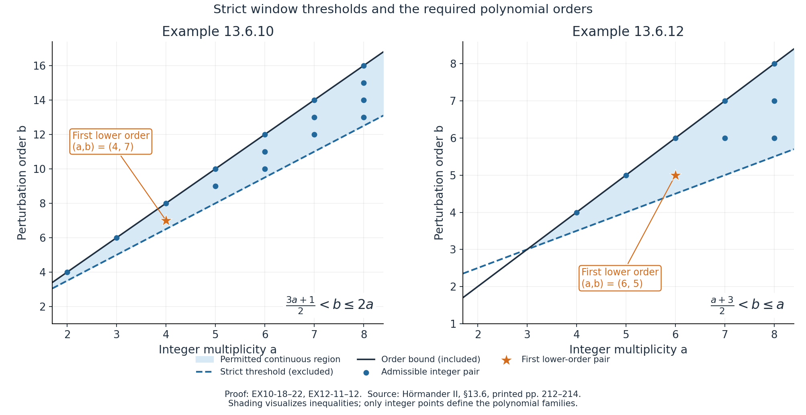
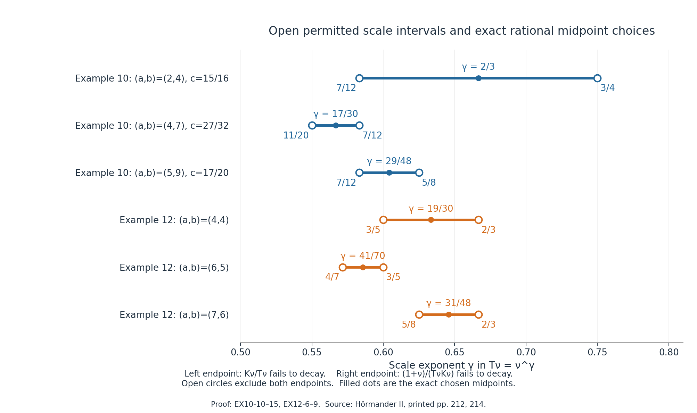

# Elliptic nonuniqueness from complex frequency windows

*Written by GPT-6.1 Sol (OpenAI), Ultra reasoning effort, October 2026. Original expression and original illustrations: CC0.*

The two families below supply every hypothesis of the complex-window theorem, including the exact order condition, the strict derivative sign and both scale limits. Their threshold inequalities are sharp for the respective displayed frequency constructions. They are not asserted to classify every possible nonuniqueness mechanism for these symbols.

## Prerequisite and scope

Use [Complex frequency windows and exact half-space support](complex-frequency-windows-and-exact-half-space-support.md), equations (CT1)–(CT3) and their full proof, relative to the prerequisites declared there. The two families below have noncharacteristic normals and use its bounded-strength complex branch. The algebraic prerequisites of the [Laurent-path lesson](real-laurent-paths-and-growth-envelopes.md) and [rational-selection lesson](rational-complex-frequency-paths-without-real-poles.md), and the smooth-jet prerequisites of the [simple-root transport lesson](simple-root-phases-and-flat-switching-errors.md), retain their stated open transitive dependencies.

**Planned prerequisite: [exact characteristic-halfspace smooth homogeneous solution](../prerequisites/planned-foundation-proofs.html#exact-characteristic-halfspace-smooth-homogeneous-solution).** For a nonzero constant-coefficient polynomial B with highest homogeneous part B_d and a nonzero real normal M satisfying B_d(M)=0, the contract supplies a globally smooth solution v of B(D)v=0 with support exactly `{x:x dot M<=0}`. Its general proof remains planned. These examples do not call the characteristic branch themselves; the complex-frequency theorem still retains this conditional branch in its full scope.

Put \(D=-i\partial\), and let \(H_N=\{x:x\cdot N\ge0\}\). We use the theorem in this form: if \(P,Q\) are nonzero complex polynomials with \(\deg P\ge\deg Q\), and

\[
\zeta_\nu=\xi_\nu-i\lambda_\nu N,
\quad\xi_\nu\in\mathbb R^n,\quad\lambda_\nu\ge0,
\quad T_\nu,K_\nu>0,\quad P(\zeta_\nu)Q(\zeta_\nu)\ne0,
\tag{EX1}
\]

satisfy, for every \(z\in\mathbb C\),

\[
\begin{gathered}
p_\nu(z)=P(\zeta_\nu+T_\nu zN)/P(\zeta_\nu)\to1,
\quad q_\nu(z)=Q(\zeta_\nu+T_\nu zN)/Q(\zeta_\nu)\to1,\\
P(\zeta_\nu)/Q(\zeta_\nu)\to0,
\quad K_\nu(p_\nu-q_\nu)\to r(z),\quad
\operatorname{Im}r'(z_0)<0\text{ for some }z_0\in\mathbb C,\\
K_\nu/T_\nu\to0,
\qquad(1+|\operatorname{Im}\zeta_\nu|)/(T_\nu K_\nu)\to0,
\end{gathered}
\tag{EX2}
\]

then for every integer \(J\ge0\) there are \(A_J,u_J\in C^\infty(\mathbb R^n;\mathbb C)\) with

\[
(P(D)+A_J(x)Q(D))u_J=0,\qquad
\operatorname{supp}u_J=H_N,\qquad
\partial^\alpha A_J=0\quad(x\cdot N=0,\ |\alpha|\le J).
\tag{EX3}
\]

The coefficient and solution may depend on \(J\). A single coefficient flat to every order is not claimed for the bounded-strength complex branch. The solution has every boundary jet zero: it is smooth and identically zero on the open negative half-space.

## The three-variable homogeneous family

Let \(a\ge2\) and \(0\le b\le2a\) be integers, and put

\[
P(\xi)=(\xi_1^2+\xi_2^2+\xi_3^2)^a-\tfrac12\xi_1^{2a},
\qquad Q(\xi)=\xi_2^b,\qquad N=e_3.
\tag{EX10-1}
\]

The circle construction with the weight specified below is possible if and only if

\[
b>\frac{3a+1}{2}.
\tag{EX10-2}
\]

For every such pair and every \(J\ge0\), EX3 gives a smooth solution supported exactly in \(\{x_3\ge0\}\), for a smooth complex coefficient vanishing through order \(J\) on \(x_3=0\).

**Ellipticity and order.** Here \(P=P_{2a}\) is homogeneous and real on real frequencies. For real \(\xi\),

\[
P_{2a}(\xi)=|\xi|^{2a}-\tfrac12\xi_1^{2a}
\ge\tfrac12|\xi|^{2a}>0\quad(\xi\ne0).
\tag{EX10-3}
\]

Thus the principal symbol is elliptic, its degree is \(2a\), and \(P_{2a}(e_3)=1\ne0\). The theorem's order hypothesis is exactly \(b\le2a\). If \(b<2a\), adding \(A_JQ\) does not change this principal symbol, so the perturbed operator is elliptic everywhere. If \(b=2a\), the estimate

\[
|P_{2a}(\xi)+A_J(x)\xi_2^{2a}|
\ge(\tfrac12-|A_J(x)|)|\xi|^{2a}
\tag{EX10-4}
\]

proves ellipticity on the open set \(|A_J|<1/2\), which contains the boundary. Global smallness of the coefficient is not supplied by EX3.

**Exact centres and windows.** Fix a rational number \(c\) in the open interval

\[
\frac{3a+1}{4a}<c<\frac{b}{2a}\le1.
\tag{EX10-5}
\]

For each integer \(\nu\ge2\) define positive real coordinates and scales by

\[
\xi_{\nu1}=\nu^c,\quad
\xi_{\nu2}=(\nu^2-\nu^{2c})^{1/2}
=\nu(1-\nu^{2c-2})^{1/2},\quad
\zeta_\nu=(\xi_{\nu1},\xi_{\nu2},-i\nu),
\quad T_\nu=\nu^\gamma,\quad
K_\nu=\nu^{2ac-a-a\gamma}.
\tag{EX10-6}
\]

The square root is positive since \(c<1\). These centres satisfy the exact circle identity \(\xi_{\nu1}^2+\xi_{\nu2}^2=\nu^2\); no replacement of this identity by an asymptotic one is made. Their real part is \((\xi_{\nu1},\xi_{\nu2},0)\), and \(\lambda_\nu=\nu>0\). At the centres,

\[
P(\zeta_\nu)=-\tfrac12\nu^{2ac}\ne0,\qquad
Q(\zeta_\nu)=\nu^b(1-\nu^{2c-2})^{b/2}\ne0,
\tag{EX10-7}
\]

and hence

\[
\frac{P(\zeta_\nu)}{Q(\zeta_\nu)}
=-\tfrac12\nu^{2ac-b}(1-\nu^{2c-2})^{-b/2}\longrightarrow0.
\tag{EX10-8}
\]

The exponent \(2ac-b\) is strictly negative. Normal translation gives the exact identities

\[
\begin{gathered}
P(\zeta_\nu+T_\nu z e_3)
=(T_\nu^2z^2-2i\nu T_\nu z)^a-\tfrac12\nu^{2ac},\\
Q(\zeta_\nu+T_\nu z e_3)=Q(\zeta_\nu),\\
p_\nu(z)=1-\frac2{K_\nu}
\big(\eta_\nu z^2-2iz\big)^a,\qquad
q_\nu(z)=1,\qquad
\eta_\nu=T_\nu/\nu=\nu^{\gamma-1},\\
K_\nu(p_\nu-q_\nu)=-2(\eta_\nu z^2-2iz)^a.
\end{gathered}
\tag{EX10-9}
\]

For the coefficient limits and both scalar limits it is enough to choose

\[
L(c):=\frac{2ac-a}{a+1}<\gamma<
U(c):=\frac{2ac-a-1}{a-1}.
\tag{EX10-10}
\]

The interval is nonempty precisely when \(4ac>3a+1\), as required in EX10-5. Moreover

\[
U(c)-(2c-1)=\frac{2(c-1)}{a-1}<0,\qquad
\gamma<2c-1<1,\qquad L(c)>\tfrac12.
\tag{EX10-11}
\]

Writing \(k=2ac-a-a\gamma\), the two endpoint inequalities give

\[
k-\gamma=2ac-a-(a+1)\gamma<0,\qquad
1-k-\gamma=a+1-2ac+(a-1)\gamma<0.
\tag{EX10-12}
\]

The latter and \(\gamma<1\) give \(k>1-\gamma>0\). Thus \(K_\nu\to\infty\), \(T_\nu\to\infty\) and \(\eta_\nu\to0\). For every fixed complex \(z\), EX10-9 now proves both normalized-window limits and the full weighted limit

\[
r_\nu(z)\longrightarrow r_{10}(z)=-2(-2iz)^a.
\tag{EX10-13}
\]

The convergence is also coefficientwise: expand

\[
r_\nu(z)=-2\sum_{j=0}^{a}\binom aj(-2i)^{a-j}\eta_\nu^{\,j}z^{a+j}.
\tag{EX10-14}
\]

The \(j=0\) coefficient is exact and all \(j\ge1\) coefficients tend to zero. No passage from one selected real \(z\) to all complex \(z\) is being assumed.

The required scale limits include the constant in the imaginary-height numerator:

\[
\frac{K_\nu}{T_\nu}=\nu^{k-\gamma}\to0,\qquad
\frac{1+|\operatorname{Im}\zeta_\nu|}{T_\nu K_\nu}
=\nu^{-k-\gamma}+\nu^{1-k-\gamma}\to0.
\tag{EX10-15}
\]

The additional small-window expression is

\[
\frac{\nu T_\nu}{\xi_{\nu1}^2}
=\nu^{1+\gamma-2c}\to0.
\tag{EX10-16}
\]

Its strict exponent follows from EX10-11; it is not an omitted extra hypothesis.

Finally choose the explicit unit complex point

\[
z_a=\exp\!\left(\frac{(a-3)\pi i}{2(a-1)}\right).
\tag{EX4}
\]

Using \(z_a^{a-1}=\exp((a-3)\pi i/2)\), direct multiplication gives

\[
r_{10}'(z_a)
=-2a(-2i)^a z_a^{a-1}
=-i\,a\,2^{a+1},\qquad
\operatorname{Im}r_{10}'(z_a)=-a2^{a+1}<0.
\tag{EX10-17}
\]

This also covers the even values of \(a\), when a real \(z\) may fail to give a strict imaginary derivative. EX1–EX2 and the noncharacteristic normal have now been verified in full. Applying the relative theorem yields EX3 with \(N=e_3\).

**Sharpness of the circle construction.** For an arbitrary exact circle centre write \(\rho_\nu=|\xi_{\nu1}|>0\) and require \(Q(\zeta_\nu)\ne0\). Keep the prescribed weight \(K_\nu=\rho_\nu^{2a}(\nu T_\nu)^{-a}\). The ratio and two scale limits imply

\[
\rho_\nu\nu^{-b/(2a)}\to0,\quad
\frac{T_\nu}{\mathcal L_\nu}\to\infty,\quad
\frac{T_\nu}{\mathcal U_\nu}\to0,
\tag{EX10-18}
\]

where the first implication uses \(|\xi_{\nu2}|\le\nu\), and

\[
\mathcal L_\nu=(\rho_\nu^{2a}\nu^{-a})^{1/(a+1)},\qquad
\mathcal U_\nu=(\rho_\nu^{2a}\nu^{-a-1})^{1/(a-1)}.
\tag{EX10-19}
\]

The last two limits force

\[
\frac{\mathcal U_\nu}{\mathcal L_\nu}
=\left(\frac{\rho_\nu^{4a}}{\nu^{3a+1}}\right)^{1/(a^2-1)}
\to\infty,\qquad
\rho_\nu\nu^{-(3a+1)/(4a)}\to\infty.
\tag{EX10-20}
\]

If \(b/(2a)\le(3a+1)/(4a)\), this contradicts the first limit in EX10-18. Equality is therefore excluded, even for non-power choices or logarithmic corrections. Conversely, when EX10-2 holds, the rational midpoint choice

\[
c=\tfrac12\left(\frac{3a+1}{4a}+\frac b{2a}\right),
\qquad \gamma=\tfrac12(L(c)+U(c))
\tag{EX10-21}
\]

supplies the exact construction already proved. This establishes the asserted if and only if for this circle construction.

**First order comparisons.** At \(a=2\) the threshold is \(b>7/2\), so \(b=4\) is the admissible order and \(\deg Q=\deg P=4\). At \(a=3\), \(b>5\) and \(b\le6\), again forcing the equal order \(b=6\). A strictly lower-order \(Q\) exists precisely when

\[
2a-1>(3a+1)/2,\quad\text{equivalently }a>3.
\tag{EX10-22}
\]

Thus the first lower-order case is \(a=4,b=7\), with orders \(8\) and \(7\). The threshold refers to this construction; no exclusion of other phenomena for inadmissible pairs is inferred.

## The two-variable exceptional family

Let \(a\ge2\), \(1\le b\le a\) be integers. Set

\[
P(\xi_1,\xi_2)=(\xi_1-i\xi_2)^a-\xi_1^{b-1},\qquad
Q(\xi_1,\xi_2)=\xi_1^b,\qquad N=e_2.
\tag{EX12-1}
\]

The polynomial degree requirement and the exact window compatibility give the full admissible range

\[
b\le a,\qquad b>\frac{a+3}{2}.
\tag{EX12-2}
\]

For every pair in this range and every \(J\ge0\), EX3 supplies \(A_J,u_J\in C^\infty(\mathbb R^2;\mathbb C)\) solving the equation with exact support \(\{x_2\ge0\}\) and coefficient boundary derivatives zero through order \(J\).

**Order and ellipticity.** The lower bound \(b\ge1\) makes \(P\) a polynomial. For arbitrary positive integer \(b\), \(\deg Q=b\) and \(\deg P=\max(a,b-1)\), so the general theorem's inequality \(\deg P\ge\deg Q\) is equivalent here to \(b\le a\). In particular, \(b=a+1\) already violates it, even though the scalar scale inequalities can have solutions. We retain the complex-frequency theorem's degree hypothesis. Under \(b\le a\), the degree of \(P\) is \(a\) and its principal symbol is

\[
P_a(\xi)=(\xi_1-i\xi_2)^a,\qquad
|P_a(\xi)|=(\xi_1^2+\xi_2^2)^{a/2}=|\xi|^a>0
\quad(\xi\in\mathbb R^2\setminus\{0\}).
\tag{EX12-3}
\]

Thus it is an elliptic complex principal symbol and \(P_a(e_2)=(-i)^a\ne0\). The second term of \(P\) has strictly lower order. If \(b<a\), the coefficient term also has lower order and the perturbed operator is elliptic everywhere. If \(b=a\), the estimate \(|P_a+A_J\xi_1^a|\ge(1-|A_J|)|\xi|^a\) proves ellipticity on the open set \(|A_J|<1\), which contains the boundary.

**All hypotheses at the exact centres.** Take

\[
\zeta_\nu=(\nu,-i\nu),\qquad T_\nu=\nu^\gamma,\qquad
K_\nu=\nu^k,\qquad k=b-1-a\gamma,\qquad \nu\ge2.
\tag{EX12-4}
\]

The centres have real part \((\nu,0)\), height \(\lambda_\nu=\nu>0\), and the normal combination \(\zeta_{\nu1}-i\zeta_{\nu2}\) is exactly zero. Consequently

\[
\begin{gathered}
P(\zeta_\nu)=-\nu^{b-1}\ne0,\quad Q(\zeta_\nu)=\nu^b\ne0,\quad
P(\zeta_\nu)/Q(\zeta_\nu)=-\nu^{-1}\to0,\\
P(\zeta_\nu+T_\nu ze_2)=(-iT_\nu z)^a-\nu^{b-1},\quad
Q(\zeta_\nu+T_\nu ze_2)=\nu^b,\\
p_\nu(z)=1-K_\nu^{-1}(-iz)^a,\quad q_\nu(z)=1,\quad
K_\nu(p_\nu-q_\nu)=r_{12}(z)=-(-iz)^a.
\end{gathered}
\tag{EX12-5}
\]

The weighted polynomial is exact, not just asymptotic. Choose

\[
\ell:=\frac{b-1}{a+1}<\gamma<
u:=\frac{b-2}{a-1}.
\tag{EX12-6}
\]

This interval is nonempty if and only if

\[
(b-1)(a-1)<(b-2)(a+1)
\quad\Longleftrightarrow\quad 2b>a+3,
\tag{EX12-7}
\]

which is the strict second inequality in EX12-2. Under \(b\le a\),

\[
u-\frac{b-1}{a}=\frac{b-a-1}{a(a-1)}<0.
\tag{EX12-8}
\]

Thus \(\gamma<(b-1)/a\), \(k>0\), and EX12-5 gives \(p_\nu(z)\to1\) for every complex \(z\), coefficientwise too. Also \(b>(a+3)/2\) implies \(b>2\) and \(\ell>0\); \(u<1\) under \(b\le a\). Hence \(T_\nu\to\infty\) and \(T_\nu/\nu\to0\). The two scalar checks are

\[
\begin{gathered}
K_\nu/T_\nu=\nu^{b-1-(a+1)\gamma}\to0,\\
(1+|\operatorname{Im}\zeta_\nu|)/(T_\nu K_\nu)
=\nu^{1-b+(a-1)\gamma}+\nu^{2-b+(a-1)\gamma}\to0.
\end{gathered}
\tag{EX12-9}
\]

The first exponent is negative because \(\gamma>\ell\); the second term's exponent is negative because \(\gamma<u\), and the first term decays one additional power. At the same explicit point EX4,

\[
r_{12}'(z_a)=-a(-i)^a z_a^{a-1}=-ia,\qquad
\operatorname{Im}r_{12}'(z_a)=-a<0.
\tag{EX12-10}
\]

This verifies all of EX1–EX2. The complex-frequency theorem proves the stated full nonuniqueness conclusion, with the stated finite coefficient jet order.

**Sharpness, including arbitrary scales.** With these exact centres and the prescribed weight \(K_\nu=\nu^{b-1}T_\nu^{-a}\), the two scalar conditions are equivalent to

\[
T_\nu\nu^{-(b-1)/(a+1)}\to\infty,\qquad
T_\nu\nu^{-(b-2)/(a-1)}\to0.
\tag{EX12-11}
\]

If \(\ell\ge u\), their quotient forces a number tending to infinity to equal a number tending to zero times \(\nu^{u-\ell}\le1\), an impossibility. If \(\ell<u\), choose the rational midpoint \(\gamma=(\ell+u)/2\); EX12-8 proves the normalized-window limit as well. This establishes the sharp strict threshold for the displayed construction, including non-power scales at the equality line. It does not remove the independent polynomial order requirement \(b\le a\).

**First order comparisons.** At \(a=2\) and \(a=3\), EX12-2 allows no integer \(b\). At \(a=4\), \(b=4\) is the first admissible pair and has equal orders \(4\) and \(4\). At \(a=5\) only \(b=5\) is admissible, again equal order. A strictly lower-order perturbation first exists when

\[
a-1>(a+3)/2,\quad\text{equivalently }a>5.
\tag{EX12-12}
\]

Thus \(a=6,b=5\) is the first lower-order case, with orders \(6\) and \(5\); this requires two more units of multiplicity than the first lower-order case of Example 13.6.10.

## Explicit rational choices and original worked examples

The midpoint formulas give rational exponents for every admissible integer pair. This is a finite algebraic verification of all hypotheses; no appeal to the rational selection theorem is needed merely to establish these inputs. The downstream relative theorem still retains its stated algebraic and smooth-jet prerequisites. In Example 13.6.10 the square root in the second coordinate is exact and real; rational exponents are not a claim that the entire original frequency path is a rational function.

The following table records \(k\) with \(K_\nu=\nu^k\), the ratio exponent \(d\) where \(P(\zeta_\nu)/Q(\zeta_\nu)\) is a nonzero asymptotic constant times \(\nu^d\), and the two decisive scale exponents.

| Family and orders | \(c\) | Allowed \(\gamma\) | Chosen \(\gamma\) | \(k\) | \(d\) | \(k-\gamma\) | \(1-k-\gamma\) |
| --- | --- | --- | --- | --- | --- | --- | --- |
| 10: \(a=2,b=4\), orders \(4,4\) | \(15/16\) | \((7/12,3/4)\) | \(2/3\) | \(5/12\) | \(-1/4\) | \(-1/4\) | \(-1/12\) |
| 10: \(a=4,b=7\), orders \(8,7\) | \(27/32\) | \((11/20,7/12)\) | \(17/30\) | \(29/60\) | \(-1/4\) | \(-1/12\) | \(-1/20\) |
| 10: \(a=5,b=9\), orders \(10,9\) | \(17/20\) | \((7/12,5/8)\) | \(29/48\) | \(23/48\) | \(-1/2\) | \(-1/8\) | \(-1/12\) |
| 12: \(a=4,b=4\), orders \(4,4\) | — | \((3/5,2/3)\) | \(19/30\) | \(7/15\) | \(-1\) | \(-1/6\) | \(-1/10\) |
| 12: \(a=6,b=5\), orders \(6,5\) | — | \((4/7,3/5)\) | \(41/70\) | \(17/35\) | \(-1\) | \(-1/10\) | \(-1/14\) |
| 12: \(a=7,b=6\), orders \(7,6\) | — | \((5/8,2/3)\) | \(31/48\) | \(23/48\) | \(-1\) | \(-1/6\) | \(-1/8\) |

**Worked example A (degree ten with a ninth-order perturbation).** Use \(a=5,b=9\), \(c=17/20\), \(\gamma=29/48\). The exact centres are \((\nu^{17/20},\sqrt{\nu^2-\nu^{17/10}},-i\nu)\), and \(K_\nu=\nu^{23/48}\). The coefficient ratio is

\[
-\tfrac12\nu^{-1/2}(1-\nu^{-3/10})^{-9/2}.
\tag{EX5}
\]

The exact weighted polynomial is \(-2(\nu^{-19/48}z^2-2iz)^5\), whose limit is \(+64iz^5\), since \((-2i)^5=-32i\). Its derivative at \(z_5=e^{i\pi/4}\) is \(-320i\). The window expression \(\nu T_\nu/\xi_{\nu1}^2=\nu^{-23/240}\) tends to zero. The scalar ratios are \(\nu^{-1/8}\) and \(\nu^{-13/12}+\nu^{-1/12}\), respectively. Therefore, for every \(J\), there are smooth \(A_J,u_J\) with exact support \(x_3\ge0\) and coefficient jets zero through \(J\), solving

\[
\left[(D_1^2+D_2^2+D_3^2)^5-\tfrac12D_1^{10}
+A_J(x)D_2^9\right]u_J=0.
\tag{EX6}
\]

The principal symbol remains elliptic for all \(x\), because the variable coefficient term has lower order.

**Worked example B (degree seven with a sixth-order perturbation).** Use \(a=7,b=6\), \(\gamma=31/48\), \(K_\nu=\nu^{23/48}\). Then the exact normalized windows are \(p_\nu=1-i\nu^{-23/48}z^7\) and \(q_\nu=1\), so \(r_{12}=-iz^7\). At \(z_7=e^{i\pi/3}\), \(r_{12}'=-7i\). The coefficient ratio is exactly \(-\nu^{-1}\), and the scalar ratios are \(\nu^{-1/6}\) and \(\nu^{-9/8}+\nu^{-1/8}\). For every \(J\), the relative theorem therefore gives

\[
\left[(D_1-iD_2)^7-D_1^5+A_J(x)D_1^6\right]u_J=0,
\quad \operatorname{supp}u_J=\{x_2\ge0\},
\quad \partial^\alpha A_J|_{x_2=0}=0\ (|\alpha|\le J).
\tag{EX7}
\]

Again, the variable term has lower order and the principal symbol is elliptic everywhere.

## Figures: thresholds and scale intervals

**Figure 1.** The blue regions are continuous parameter regions only for visualizing the inequalities. The symbols themselves are polynomials for integer \(a,b\), represented by the plotted integer points. The dashed lower boundaries are excluded: \(b=(3a+1)/2\) in EX10-2 and \(b=(a+3)/2\) in EX12-2. The solid upper boundaries \(b=2a\), \(b=a\) are included by the order hypothesis. The marked first lower-order pairs are \((4,7)\) and \((6,5)\), as proved in EX10-22 and EX12-12. The figure makes no claim outside the displayed constructions. Human source: Hörmander II, Examples 13.6.10 and 13.6.12; exact proof locators: EX10-18–EX10-22 and EX12-11–EX12-12.

**Figure 2.** Each horizontal segment is the open permitted interval for the exponent \(\gamma\) in the table. Open endpoint circles denote strict inequalities; the central filled point is the selected rational midpoint. Labels are exact fractions, while plotted positions are their numerical coordinates. The left boundary means \(K_\nu/T_\nu\to0\), the right boundary means \((1+\nu)/(T_\nu K_\nu)\to0\); endpoint substitution loses the relevant strict decay. Exact proof locators: EX10-10–EX10-15 and EX12-6–EX12-9. Human source: Hörmander II, printed 212 and 214. Reproducible plotting source: [Python source](../figures/an02-l107-elliptic-make-figures.py) and [exact rational checks](../figures/an02-l107-elliptic-figure-validation.json).

## Graded exercises with complete solutions

**Exercise 1 (basic: ellipticity and the order gate).** For each family show that the principal symbol is nonzero on real nonzero frequencies. For Example 13.6.12 explain why \(a=4,b=5\) cannot be an application of the full complex-frequency theorem even though the two scalar scale exponents can be made negative.

**Solution.** In Example 10, \(P_{2a}=|\xi|^{2a}-\xi_1^{2a}/2\ge|\xi|^{2a}/2>0\). In Example 12, \(|(\xi_1-i\xi_2)^a|=|\xi|^a>0\), since the real and imaginary parts of \(\xi_1-i\xi_2\) can both vanish only at zero. For \(a=4,b=5\), \(P=(\xi_1-i\xi_2)^4-\xi_1^4\) has degree \(4\), whereas \(Q\) has degree \(5\). The theorem requires the opposite order comparison. The interval \((4/5,1)\) for \(\gamma\) is nonempty, but it cannot repair this failed hypothesis; this is exactly why the full Example 12 range includes \(b\le a\).

**Exercise 2 (basic: the sign at a complex point).** In Example 10 with \(a=2\), compute the limiting polynomial and a point giving the strict negative imaginary derivative. Do the same for Example 12 with \(a=6\). Why is checking only \(r'(0)\) insufficient?

**Solution.** The first polynomial is \(-2(-2iz)^2=8z^2\), so \(r'(-i)=-16i\). The second is \(-(-iz)^6=z^6\); take \(z=e^{3\pi i/10}\), whose fifth power is \(-i\), obtaining \(r'(z)=-6i\). Both have negative imaginary derivative. Since the degree is greater than one, \(r'(0)=0\) in both examples; the complex-frequency theorem allows a general complex point. Its later shift and shrinking reduction supplies a linear limit, but the raw example does not need to have \(r'(0)\ne0\).

**Exercise 3 (intermediate: the first lower-order three-variable pair).** For \(a=4,b=7\), use \(c=27/32\), \(\gamma=17/30\). Compute \(k\), all window and scalar exponents, and the derivative sign. State the full complex-frequency conclusion.

**Solution.** The exact circle gives \(\xi_1=\nu^{27/32}\), \(\xi_2=\nu\sqrt{1-\nu^{-5/16}}\). The ratio is \(-\tfrac12\nu^{-1/4}(1-\nu^{-5/16})^{-7/2}\to0\). The weight exponent is \(k=8(27/32)-4-4(17/30)=29/60>0\). The window polynomial is \(p=1-2\nu^{-29/60}(\nu^{-13/30}z^2-2iz)^4\), \(q=1\), so its weighted limit is \(-32z^4\). At \(z=e^{i\pi/6}\) its derivative is \(-128i\). The auxiliary exponent \(1+\gamma-2c\) is \(-29/240\). Finally \(K/T=\nu^{-1/12}\), and \((1+\nu)/(TK)=\nu^{-21/20}+\nu^{-1/20}\). Thus every required limit holds, not just the ratio. For each \(J\) there are smooth \(A_J,u_J\) solving \([(D_1^2+D_2^2+D_3^2)^4-\tfrac12D_1^8+A_JD_2^7]u_J=0\), with support exactly \(x_3\ge0\) and coefficient derivatives through order \(J\) zero on the boundary. The order-seven perturbation preserves the order-eight elliptic principal symbol.

**Exercise 4 (intermediate: the first lower-order two-variable pair).** Verify the complete construction for \(a=6,b=5,\gamma=41/70\). Compare with \(a=5\), and explain the two-unit gap between the first lower-order examples.

**Solution.** Here \(k=4-6(41/70)=17/35\), the ratio is \(-\nu^{-1}\), \(p=1+\nu^{-17/35}z^6\), \(q=1\), and the weighted limit is \(z^6\). The derivative at \(e^{3\pi i/10}\) is \(-6i\). Also \(K/T=\nu^{-1/10}\) and \((1+\nu)/(TK)=\nu^{-15/14}+\nu^{-1/14}\). The interval is \((4/7,3/5)\), and \(41/70\) lies strictly inside it. The principal symbol has degree \(6\) and the perturbation degree \(5\). Hence EX3 gives the full equation, exact support \(x_2\ge0\), and each requested finite coefficient jet order. At \(a=5\) the threshold is \(b>4\), and the allowed order \(b\le5\) forces \(b=5\), so there is no lower-order choice. Example 10 allows lower order when \(a>3\), while Example 12 requires \(a>5\); their first integer values are \(4\) and \(6\).

**Exercise 5 (advanced: equality and arbitrary scales).** Show directly that the thresholds cannot include equality by taking \(a=3,b=5\) in Example 10 and \(a=5,b=4\) in Example 12. Allow non-power and logarithmically corrected scales.

**Solution.** In Example 10, the ratio implies \(\rho_\nu\nu^{-5/6}\to0\). The scale ratio in EX10-20 with \(a=3\) requires \(\rho_\nu\nu^{-10/12}=\rho_\nu\nu^{-5/6}\to\infty\). These are incompatible for any sequence \(\rho_\nu\), independently of its form. In Example 12, \(\ell=(4-1)/(5+1)=1/2\) and \(u=(4-2)/(5-1)=1/2\). EX12-11 requires the same quantity \(T_\nu\nu^{-1/2}\) to tend both to infinity and zero. No logarithmic correction can satisfy either contradiction. This proves strictness for the specified constructions and does not assert uniqueness by some other argument.

**Exercise 6 (advanced: separate exact algebra from theorem scope).** Suppose one has proved only the identities in EX12-5. List the additional facts needed for EX3, explain the role of the general characteristic prerequisite in these particular examples, and distinguish finite coefficient jets from the solution's flat boundary jets.

**Solution.** One must verify \(P,Q\ne0\), the order inequality \(b\le a\), real centre part and nonnegative height, positive \(T,K\), nonzero centre denominators, \(K\to\infty\) so both normalized windows tend to one for every complex \(z\), a strict negative imaginary derivative at an allowed complex point, \(K/T\to0\), and the entire numerator \(1+|\operatorname{Im}\zeta|\) divided by \(TK\) tending to zero. EX12-6–EX12-10 provide exactly those checks. The normal is noncharacteristic because \(P_a(e_2)=(-i)^a\ne0\); the planned characteristic theorem is therefore not called by this example's branch. The general complex-frequency theorem still has its planned characteristic contract in its full scope and its open transitive algebraic and smooth-jet bases, which are retained here rather than declared closed. EX3 supplies a separate smooth coefficient for each finite prescribed \(J\); it does not promise one coefficient flat to all orders. Every constructed smooth solution is zero on the negative half-space, so all its derivatives vanish at the boundary. Exact support \(H_N\) further says that no positive open subset can be deleted from the support, a conclusion coming from the full provider's assembly and upper tail.

**Exercise 7 (advanced: a uniform bound for the real-strength branch test).** For either admissible family show that the ratio \(\mathcal S_NQ/\mathcal S_NP\) is bounded on real frequencies, where \(\mathcal S_NR=(\sum_{j=0}^{m}|\partial_N^jR|^2)^{1/2}\) and \(m=\deg P\). Which branch of the relative theorem then receives these windows?

**Solution.** In Example 10, \(Q\) is normal-independent, so \(\mathcal S_NQ=|\xi_2|^b\). If \(|\xi|\ge1\), EX10-3 and \(b\le2a\) give \(\mathcal S_NQ/\mathcal S_NP\le2|\xi|^{b-2a}\le2\). On \(|\xi|\le1\), the \(2a\)-th normal derivative of \(P\) is the nonzero constant \((2a)!\), so the ratio is at most \(1/(2a)!\). In Example 12, \(\mathcal S_NQ=|\xi_1|^b\). For \(|\xi|\ge2\), the triangle inequality gives \(|P|\ge|\xi|^a-|\xi|^{b-1}\ge|\xi|^a/2\), using \(b\le a\); hence the ratio is at most \(2|\xi|^{b-a}\le2\). On \(|\xi|\le2\), the \(a\)-th normal derivative is \(a!(-i)^a\), so the ratio is at most \(2^b/a!\). Both normals are noncharacteristic and both strength ratios are bounded. Thus these windows exercise the bounded-strength complex branch of the relative theorem, whose conclusion has arbitrary prescribed finite coefficient order. The separate [real-frequency construction](flat-half-space-solutions-from-real-frequency-rays.md) for unbounded strength does not justify silently upgrading these coefficients to one flat coefficient.

## Scope of the conclusion

Both integer families satisfy every complex-frequency hypothesis in their stated admissible ranges. The proofs include exact centres, all complex pointwise and coefficientwise windows, nonzero ratios and denominators, strict derivative signs, both scalar scale limits including the numerator's constant, exact order comparisons, real ellipticity, and sharp thresholds for the displayed constructions, including equality exclusions for arbitrary scales. The first lower-order cases, six rational choices, two worked examples and seven complete exercise solutions give explicit applications.

The conclusion remains relative to the [complex-frequency theorem](complex-frequency-windows-and-exact-half-space-support.md) and its declared prerequisites. The general characteristic-halfspace proof remains planned, and the transitive algebraic and smooth-jet bases remain open. Bounded independent AI review of these arguments does not establish whole-course independent review or recursive prerequisite closure.

## References

- Lars Hörmander, *The Analysis of Linear Partial Differential Operators II: Differential Operators with Constant Coefficients*, Springer, second edition, §13.6, Examples 13.6.10 and 13.6.12, printed pp.212–214. The intervening Corollary 13.6.11 is a separate result.
- Lars Hörmander, *The Analysis of Linear Partial Differential Operators I: Distribution Theory and Fourier Analysis*, Springer, Theorem 8.6.7. The general characteristic-halfspace proof remains a planned prerequisite here.

The linked course theorem supplies the written relative proof used in both families.
