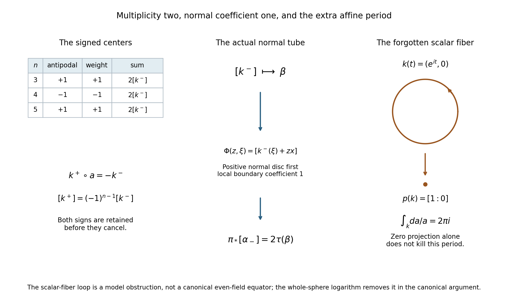
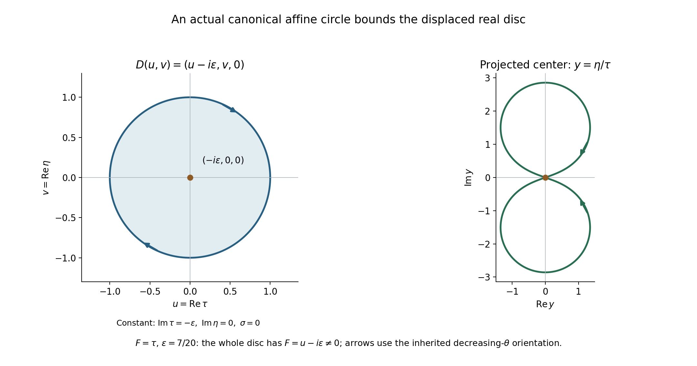

# Equatorial cycles and the projective period test

*Written by GPT-6.1 Sol (OpenAI), October 2026. Self-checked by the writing AI. Public domain (CC0).*

A deformed affine equator and a projective normal tube are different geometric objects. This chapter computes the map between them. The two signed equatorial centers give a factor of two; one positive normal disc gives a tube coefficient of one. The polynomial's degree is a third quantity and does not replace either factor.

Basic references are Atiyah, Bott and Gårding [A, B] for the classical contour method, and Hatcher [H] for finite-chain homology. The preceding [Rational top forms detect cycles in a hypersurface complement](../AN02-L182.html) and [Finite covers and normal circles in projective complements](../AN02-L183.html) prove the two general projective ingredients. [Tangent cones that permit an imaginary push](../AN02-L118.html) supplies the compact zero-free deformation and whole-sphere extension. The complete proof below gives the remaining geometric and affine-fiber arguments.

The [full angular-contour and polynomial-continuation reading](../reproduce/L184/angular-contours-and-polynomial-continuation.html) supplies the analytic argument and its exact constants. The complete all-integer parity-sensitive angular Fourier identity is proved in [Angular distributions and their full Fourier transforms](../AN02-L185.html#4-the-angular-fourier-identity-on-the-whole-frequency-space), Theorem 4.1, with arbitrary angular distributions and the full frequency origin retained. The general analytic-wavefront and wavefront-operation prerequisites remain explicitly planned. The component conclusion here retains the remaining analytic hypotheses.

## 1. The two factors in the comparison

Let \(F\) be homogeneous of degree \(m\), let \(x\ne0\) be real, and put \(L(\zeta)=x\cdot\zeta\). A permitted even equatorial field gives two cycles
\[
 k^-(\xi)=\xi-i\varepsilon\Theta(\xi),\qquad
 k^+(\xi)=\xi+i\varepsilon\Theta(\xi),
 \quad \xi\in S^{n-1}\cap x^\perp .
 \tag{1}
\]
They avoid \(F=0\) and lie in \(L=0\). The sphere is oriented as the boundary of the negative hemisphere. Its antipodal degree is \((-1)^{n-1}\). Evenness gives
\[
 k^+(-\xi)=-k^-(\xi).
 \tag{2}
\]
Complex scalar rotation from \(1\) to \(-1\) avoids the homogeneous zero set, so the scalar minus sign is homotopic to identity in this affine complement. Hence
\[
 [k^+]=(-1)^{n-1}[k^-],\qquad
 [k^-]+(-1)^{n-1}[k^+]=2[k^-].
 \tag{3}
\]

For one center cycle \(k\), a small positive complex normal disc is
\[
 \Phi(z,\xi)=[k(\xi)+zx],\qquad |z|\leq\delta.
 \tag{4}
\]
Compactness lets us choose \(\delta>0\) so its image avoids the removed divisor. Its normal coordinate satisfies
\[
 L(k(\xi)+zx)=z|x|^2.
 \tag{5}
\]
Thus the disc meets the projective hyperplane only at its center, and its complex normal derivative has positive real determinant. The full argument identifies its relative class with the exact Thom map applied to the projected center. Its boundary is one positive normal circle, normal first.

If \(\pi\) is projectivization and \(\tau\) that precise tube map, the actual signed contour therefore satisfies
\[
 \pi_*[\alpha_-]=2\tau(\pi_*[k^-]).
 \tag{6}
\]
The factor two comes from the centers in (3). The single-center tube coefficient comes from the relative disc in (4). The degree \(m\) enters the separate cover \(F=1\), used in the preceding homology theorem.

*Figure 1. The left panel lists the actual antipodal degree and second-center weight in dimensions three, four and five; their product gives the center class \(2[k^-]\). The middle panel represents the exact relative-disc map \(\Phi(z,\xi)=[k^-(\xi)+zx]\), whose positive normal boundary has coefficient one, and the resulting identity \(\pi_*[\alpha_-]=2\tau(\beta)\). This is a diagram of the specified maps and classes, not a spatial embedding in arbitrary dimension. The right panel shows the exact scalar-fiber model \(k(t)=(e^{it},0)\) in \(\mathbb C^*\times\mathbb C\), whose projection is the point \([1:0]\) while its logarithmic period is \(2\pi i\). This model is not a canonical even-field equator. The whole-sphere logarithm eliminates its winding in the canonical argument. Complete proof Sections 1, 2 and 4; Examples 1–2 below. Original figure, CC0; classical method context [A, B, H].*

## 2. Why the affine logarithm is also needed

Projectivizing forgets a scalar-circle direction. On the affine complement in \(L=0\), the global closed form
\[
 \vartheta=\frac{dF}{mF}
 \tag{7}
\]
has period \(2\pi i\) on a positive scalar fiber. Radial retraction and circle averaging give a complete decomposition
\[
 H^r_{\mathrm{dR}}(M;\mathbb C)
   =p^*H^r_{\mathrm{dR}}(Y;\mathbb C)
      \oplus[\vartheta]\wedge p^*H^{r-1}_{\mathrm{dR}}(Y;\mathbb C).
 \tag{8}
\]
The complete proof includes surjectivity, injectivity and the signs of the primitives. A zero projected class kills the first summand's periods, but not automatically the second's.

For a canonical equator in dimension \(n\geq3\), extend its permitted even field to the whole sphere using the preceding compact-cone theorem. The nonvanishing function
\[
 \Phi(\xi)=F(\xi-i\varepsilon V(\xi))
 \tag{9}
\]
has a logarithm on \(S^{n-1}\), because every loop there contracts. Restriction gives \(k^*\vartheta=m^{-1}dg\) on the equator. Its products with closed pulled-back base forms are exact, and all the remaining affine periods vanish. The smooth-period detection and faithful rational coefficient comparison then give rational affine null homology.

In dimension \(n=2\), the equator is a difference of two points. The affine hyperplane is a complex line, and its polynomial complement is \(\mathbb C^*\) whenever the zero-free equator exists. A path bounds that reduced zero-cycle. It must not be replaced by the ordinary positive generator of a projective point.

## 3. Four worked examples

### Example 1. Parity cancels out of the final multiplicity

In \(n=3\), the equator is \(S^1\), whose antipodal degree is \(+1\). Thus \([k^+]=[k^-]\), and the contour uses their sum, giving \(2[k^-]\).

In \(n=4\), the equator is \(S^2\), whose antipodal degree is \(-1\). Thus \([k^+]=-[k^-]\), while the contour's second weight is also \(-1\). Its center class is again
\([k^-]-[k^+]=2[k^-]\).

The two signs are separate before they cancel. Assuming an unsigned second sphere in every dimension would give an erroneous zero in one parity.

### Example 2. A zero projected class with a nonzero affine period

In \(\mathbb C^2\) let \(F(a,b)=a\), so \(M=\mathbb C^*\times\mathbb C\). Projectivization maps it onto \(\mathbb P^1\setminus\{a=0\}\cong\mathbb C\). The loop
\[
 k(t)=(e^{it},0),\qquad0\leq t\leq2\pi,
 \tag{10}
\]
projects to the constant projective point \([1:0]\), so its projected one-dimensional class is zero. But
\[
 \int_k\vartheta=\int_k\frac{da}{a}=2\pi i.
 \tag{11}
\]
Stokes therefore prevents it from bounding in the affine complement.

This loop is a model of the scalar fiber, not a canonical even-field equator. Its function \(F(k)=e^{it}\) has winding one and no global logarithm on the circle. The logarithm hypothesis in the canonical argument is what excludes this obstruction.

### Example 3. An actual canonical circle with an affine filling disc

In real dimension three take \(F(\tau,\eta,\sigma)=\tau\), \(N=e_\tau\) and \(x=e_\sigma\). On the equator use the constant even field \(\Theta=N\), which is perpendicular to \(x\) and permitted in every tangent component. Then
\[
 k(\theta)=(\cos\theta-i\varepsilon,\sin\theta,0).
 \tag{12}
\]
At characteristic frequencies the tangent component is \(v_\tau>0\); at noncharacteristic frequencies every vector is permitted. Thus this is an allowed field with a uniformly nonzero polynomial value.

With the ambient outward sphere orientation, the boundary of the negative \(\sigma\)-hemisphere traverses this equator with decreasing \(\theta\). Indeed its tangent orientation in coordinates \((\theta,\sigma)\) is \(d\theta\wedge d\sigma\); the outward boundary direction from \(\sigma<0\) is \(+\partial_\sigma\), so its remaining oriented tangent is \(-\partial_\theta\).

The map
\[
 D(u,v)=(u-i\varepsilon,v,0),\qquad u^2+v^2\leq1,
 \tag{13}
\]
has \(F(D)=u-i\varepsilon\ne0\). Give its real parameter disc the negative of the usual \(du\wedge dv\) orientation. Its boundary is exactly the inherited canonical circle (12). This is an actual finite smooth affine filling after a finite oriented disc triangulation.

The full-sphere extension is the same constant field \(N\). Its polynomial value \(\xi_\tau-i\varepsilon\) lies strictly in the lower half-plane, where a continuous holomorphic logarithm is available. Thus its logarithmic period is zero, consistent with the filling disc. This contrasts with the positive scalar-fiber loop in Example 2.

*Figure 2. Here \(F=\tau\), \(N=e_\tau\), \(x=e_\sigma\) and \(\varepsilon=7/20\). The left panel shows the real parameters of the exact affine disc \(D(u,v)=(u-i\varepsilon,v,0)\), with constant \(\operatorname{Im}\tau=-\varepsilon\), \(\operatorname{Im}\eta=0\), \(\sigma=0\). Its orientation is the negative of \(du\wedge dv\), so its boundary arrows follow the inherited decreasing angle. The whole disc has \(|F(D)|\geq\varepsilon\). The right panel plots the same boundary after projectivization in \(y=\eta/\tau=\sin\theta/(\cos\theta-i\varepsilon)\). Both panels retain the actual maps; the right curve can intersect itself although the affine circle is embedded. The projected center has a filling given by the same disc map, rather than inferred from the plotted shape. Example 3 and complete proof Section 4. Original exact coordinate figure, CC0; classical deformation context [A, B].*

### Example 4. A normal scale changes size but not orientation

For a center cycle in \(x^\perp\), replacing \(x\) by \(cx\), \(c>0\), in (4) rescales the positive complex normal direction by \(c\). Its real determinant on the two normal coordinates is \(c^2>0\). The same oriented local disc generator is obtained after adjusting its small radius.

The full-bundle tubular map introduces another positive scalar, \(\rho>0\), on its normal derivative. Inverting it changes that derivative by \(\rho^{-1}\), whose real determinant is \(\rho^{-2}>0\). Neither operation changes the tube coefficient one.

Even multiplying a complex normal coordinate by a nonzero complex number \(a\) has real determinant \(|a|^2>0\). Complex conjugation is different: its real determinant is \(-1\), so it reverses the normal-disc and normal-circle orientations. An arbitrary real change of normal coordinates therefore needs an orientation check; a nonzero complex-linear change already has the positive sign.

## 4. Exercises, 100 points

1. **The parity and the factor two, 10 points.** Derive (3) in dimensions \(n=3,4,5\). Explain why the inherited orientation does not change the antipodal degree. Is complex scalar multiplication by \(-1\) itself an orientation reversal of the affine complex space?
2. **The actual cap naturality, 12 points.** For a degree-two relative cocycle \(u\) and a map \(B\) of pairs, verify \(B_\#R_{B^*u}c=R_uB_\#c\) on a singular simplex of dimension \(j+2\). Explain how Thom pullback uniqueness and disc-first product normalization turn this into the first identity in the formal proof's (9).
3. **The full-bundle radial scale, 12 points.** For \(h(v)=\rho v/\sqrt{1+\|v\|^2}\), \(\rho>0\), compute its derivative at zero. In a normal bundle chart let \(v(sz,\xi)=sA_\xi z+O(s^2|z|^2)\). Explain why \(v(sz,\xi)/s\) extends to the required linear map and why its boundary remains outside the zero section.
4. **Both halves of the circle-average decomposition, 14 points.** For an invariant form \(w\) on the circle bundle, compute \(b=-i\iota_Zw\) and \(h=w-i\alpha\wedge b\). Prove horizontality. For closed \(w\), prove that these descend to closed base forms. If \(p^*\eta+i\alpha\wedge p^*\gamma=du\), compute the signs of the base primitives after averaging \(u\).
5. **A logarithm versus a fiber period, 12 points.** Compute the periods in Examples 2 and 3. Why does a logarithm on the whole sphere imply zero equatorial winding? Why does nonvanishing only on a circle fail to provide that implication?
6. **The inherited equator and its disc, 12 points.** Verify the decreasing-\(\theta\) orientation in Example 3 from the outward sphere orientation. Show that the disc map (13), with its stated orientation, gives the required boundary and never meets \(F=0\). Explain why this example permits integral null homology without proving it for every canonical cycle.
7. **Every positive pole exponent is received, 14 points.** For \(F\) of degree \(m\), choose a positive pole exponent \(s\) and an inverse power \(k\). Determine the required derivative order and the value of the contour exponent \(q\). Explain why every homogeneous numerator is covered and why the monomials with negative requested degree cause no missing forms.
8. **Rational descent and the two-point case, 14 points.** Give the chain of implications from zero signed-contour periods to rational affine null homology, including the factor two, tube injection and fiber logarithm. Explain why neither division by two nor complex periods prove integral null homology. In \(n=2\), show directly why the inherited zero-cycle bounds.

## 5. Complete solutions

### Solution 1

The antipodal degree of the equator \(S^{n-2}\) is \((-1)^{n-1}\). In dimensions \(3,4,5\), this is respectively \(+1,-1,+1\). The exact map identity \(k^+\circ a=-k^-\) and the scalar rotation homotopy give \([k^+]=(-1)^{n-1}[k^-]\). In each case the contour's second weight has the same sign, so
\([k^-]+(-1)^{n-1}[k^+]=2[k^-]\).
**5 points.**

Changing both source and target sphere orientations reverses their generators simultaneously; the scalar degree of a self-map is unchanged. Thus the inherited boundary orientation does not alter the antipodal degree. **2 points.** On a complex vector space of complex dimension \(r\), scalar multiplication by \(-1\) has real determinant \((-1)^{2r}=+1\). It is also homotopic to identity through multiplication by \(e^{it}\). The real equatorial antipodal degree and that ambient complex scalar map have different domains; their orientation conclusions must not be interchanged. **3 points.**

### Solution 2

On a simplex \(\sigma:\Delta^{j+2}\to E\),
\[
 B_\#R_{B^*u}\sigma
   =(B^*u)(\sigma[j,j+1,j+2])\,B\sigma[0,\ldots,j]
   =u(B\sigma[j,j+1,j+2])\,B\sigma[0,\ldots,j]
   =R_uB_\#\sigma .
 \tag{14}
\]
This is literal equality with the same front face and coefficient. Linear extension gives it on chains, and relative vanishing of \(u\) makes it descend to the pairs. **5 points.**

For the fiberwise complex-linear normal map, pullback of the normal Thom class has value one on each positive fiber generator. The exact Thom uniqueness statement makes that pullback the positive trivial Thom class. Its cap map sends the positive fiber disc crossed with the base cycle to that base cycle. **4 points.** The source product convention puts the disc last; moving its dimension two past a base of dimension \(n-2\) gives \((-1)^{2(n-2)}=1\). The disc-first normalization is therefore the same. Composing (14) with bundle projections identifies the cap of the pushed-forward relative disc with \(p_*[k]\); the cap isomorphism's inverse gives the stated Thom class equality. **3 points.**

### Solution 3

Differentiating the radial map gives \(Dh_0(v)=\rho v\), since the derivative of its denominator contributes a term quadratic in \(v\). It is positive scalar multiplication on the normal plane; the inverse derivative is \(\rho^{-1}I\). Both preserve its orientation, with real determinants \(\rho^2\) and \(\rho^{-2}\). **4 points.**

Taylor's formula gives
\[
 s^{-1}v(sz,\xi)=A_\xi z+O(s|z|^2).
 \tag{15}
\]
The compact parameter domain permits uniform remainder bounds on finitely many bundle charts, so the maps extend continuously to \(s=0\), with the displayed linear limit. Their base points also converge to \(p(k(\xi))\). Bundle transition functions preserve this limit. **4 points.** On \(|z|=\delta\), for \(s>0\), the original point has nonzero normal coordinate because its projective \(L\)-coordinate is nonzero. Scaling a nonzero vector by \(s^{-1}\) keeps it nonzero. At \(s=0\), the nonzero complex-linear map \(A_\xi\) takes nonzero \(z\) to a nonzero normal vector. Thus the homotopy is a homotopy of pairs, not merely a homotopy of ambient maps. **4 points.**

### Solution 4

Contraction squares to zero, so \(\iota_Zb=0\). Since \(\alpha(Z)=1\),
\[
 \iota_Z(i\alpha\wedge b)
     =i\bigl(\alpha(Z)b-\alpha\wedge\iota_Zb\bigr)
     =ib=\iota_Zw .
 \tag{16}
\]
Hence \(\iota_Zh=0\). Invariance of \(w,\alpha,Z\) gives invariance of \(b,h\) as well. **4 points.**

If \(dw=0\) and \(\mathcal L_Zw=0\), Cartan's identity gives \(d\iota_Zw=0\), so \(db=0\). Since \(d\alpha=0\), \(dh=0\). In a local circle chart, horizontality removes the angular differential, and invariance removes angular dependence from the remaining coefficients. Thus both forms descend uniquely to closed base forms. **4 points.**

Averaging a primitive preserves its differential because pullback commutes with \(d\). Decompose that averaged primitive as
\(u=p^*u_0+i\alpha\wedge p^*u_1\).
Then
\[
 du=p^*du_0-i\alpha\wedge p^*du_1.
 \tag{17}
\]
Comparing its horizontal and vertical parts gives \(\eta=du_0\) and \(\gamma=-du_1\). This proves injectivity of the two summands; merely obtaining a decomposition of closed forms would have established only surjectivity. **6 points.**

### Solution 5

Example 2 has \(F(k)=e^{it}\), so \(k^*\vartheta=i\,dt\) and its period is \(2\pi i\). Its projected one-dimensional cycle is zero, yet its affine cycle is detected by this fiber form. **3 points.** Example 3 has \(F(k)=\cos\theta-i\varepsilon\), contained in the lower half-plane. A logarithm there gives \(k^*\vartheta=d\log F(k)\), whose period on the closed curve is zero in either orientation. Its explicit filling disc also proves that period vanishes by Stokes. **3 points.**

When \(n\geq3\), the nonvanishing whole-sphere function has zero logarithmic periods: every loop misses a point, contracts through stereographic coordinates, and Stokes applies to the closed form \(d\Phi/\Phi\). Integrating this form gives the global logarithm. Restricting it to the equator makes the logarithmic derivative exact there. **4 points.** A nonvanishing function on a circle can instead have nonzero winding; \(e^{it}\) is the explicit counterexample. Nonvanishing alone on that circle does not give a logarithm. **2 points.**

### Solution 6

At the equator the ordered vectors
\[
 (\cos\theta,\sin\theta,0),\quad
 (-\sin\theta,\cos\theta,0),\quad (0,0,1)
 \tag{18}
\]
have determinant \(+1\). The first is the outward sphere normal, so the sphere's tangent orientation is \((\partial_\theta,\partial_\sigma)\). The outward boundary direction from the negative hemisphere is \(\partial_\sigma\); the ordered pair \((\partial_\sigma,-\partial_\theta)\) has that same tangent orientation. Hence the boundary traverses decreasing \(\theta\). **5 points.**

The negatively oriented parameter disc has that negative-circle boundary. Under (13) it maps to precisely the canonical circle, and its polynomial value \(u-i\varepsilon\) has nonzero imaginary part at every point. Thus its entire finite smooth triangulated image stays in the affine complement and bounds the inherited cycle over the integers. **4 points.** This particular filling is an integral chain. It proves integral null homology for this example alone; other canonical cycles may have integral torsion, as the preceding wave-sphere example demonstrates. A rational theorem cannot supply such an integral filling in every case. **3 points.**

### Solution 7

For \(F^k\), the homogeneous inverse degree is \(mk-n\). To receive a denominator exponent \(s\geq1\), choose
\[
 |\alpha|=mk+s-n,\qquad
 q=mk-n-|\alpha|=-s .
 \tag{19}
\]
The derivative order exceeds the polynomial degree by \(s\), so the all-powers polynomial conclusion makes that derivative zero. The negative-exponent contour formula has a nonzero scalar and \((iL)^{-s}=i^{-s}L^{-s}\), hence gives zero period of the desired rational monomial form. **6 points.**

Every homogeneous polynomial of nonnegative degree \(mk+s-n\) is a finite linear combination of monomials \(\zeta^\alpha\) of that degree. Linearity therefore covers every numerator, not just selected derivative directions. **4 points.** If the requested degree is negative, there is no nonzero homogeneous polynomial numerator, so there is no missed form. The projective descent rule is exactly \(\deg P=mk+s-d-1\) with \(d=n-1\), giving the same number \(mk+s-n\). All positive \(k,s\) are covered, and the preceding theorem already permits redundant or removable pole factors. **4 points.**

### Solution 8

The exact comparison is \(\pi_*[\alpha_-]=2\tau(\beta)\), \(\beta=p_*[k^-]\). Vanished periods of the signed contour imply vanished rational-top-form periods of \(\tau\beta\), because two is invertible over \(\mathbb Q\). The preceding rational-form theorem and tube injection give \(\beta=0\) in rational homology. **4 points.**

The affine decomposition then leaves only the scalar-fiber summand. The whole-sphere logarithm makes \(k^*\vartheta\) exact, and its wedge products with closed pulled-back base forms are exact. Thus every closed smooth topological-degree form has zero period on the affine cycle. Smooth-period detection gives complex null homology, and faithful rational coefficient extension gives rational null homology with a finite bounding chain. **5 points.**

An integral class can have order two; dividing a relation for twice that class by two does not produce an integral chain. Complex periods likewise vanish on integral torsion. Neither step proves integral null homology in general. **2 points.** In \(n=2\), the restricted homogeneous polynomial is a nonzero monomial on the one-dimensional complex hyperplane, so its complement is \(\mathbb C^*\). The inherited two points have opposite coefficients. A path between them has their difference as boundary, with its sign chosen for the inherited order. This is the direct reduced-zero argument; it uses no negative-degree fiber group. **3 points.**

## 6. The component conclusion

If the canonical equator bounds over the rationals at one point, the complete analytic reading makes every principal-power inverse a homogeneous polynomial throughout the connected component. Derivatives above its degree give zero periods against every positive-pole homogeneous rational top form. The comparison (6) and the projective receiver then give zero projected center class at every component point. The logarithm and the affine splitting (8) give rational affine null homology there. Thus the condition is constant on the component, at the exact analytic prerequisites stated above. The all-powers polynomial conclusion is used before the topological component conclusion, so the argument does not assume its own result.

The same analytic reading proves the entire exponential bound for hyperbolic lower-order completions and their positive powers. Rational null homology is the coefficient convention of this chapter. Integral torsion and the direct two-point calculation retain their separate conclusions.

## References

[A] Michael Atiyah, Raoul Bott and Lars Gårding, *Lacunas for hyperbolic differential operators with constant coefficients, I*, Acta Mathematica **124** (1970), 109–189. [Primary article](https://www.its.caltech.edu/~matilde/HypPDEAtiyahBottGarding.pdf).

[B] Michael Atiyah, Raoul Bott and Lars Gårding, *Lacunas for hyperbolic differential operators with constant coefficients, II*, Acta Mathematica **131** (1973), 145–206. [Primary article](https://archive.ymsc.tsinghua.edu.cn/pacm_download/117/6156-11511_2006_Article_BF02392039.pdf).

[H] Allen Hatcher, *Algebraic Topology*, Cambridge University Press (2002), §§3.3 and 3.G. [Author's freely readable text](https://pi.math.cornell.edu/~hatcher/AT/AT.pdf). The exact relative-cap and tubular arguments used here are the complete linked internal proofs.

Original exposition, examples, solutions and figures are CC0-1.0. Linked historical works retain their own rights and are not reproduced. The rational theorem detects no integral torsion.

## Complete proof

This chapter compares the actual signed affine equatorial contour with the positive-normal-circle projective tube. It proves the center multiplicity two, the individual normal coefficient one, the affine scalar-fiber cohomology splitting and the whole-sphere logarithm needed to recover an affine null-homology statement from projective periods.

Basic references are Atiyah, Bott and Gårding [A, B] for the classical hyperbolic contour and lacuna method, and Hatcher [H] for finite-chain homology and Thom constructions. The proof uses the complete internal rational-top-form and projective-tube theorems, with their exact smooth/chain hypotheses. The [complete angular-contour and polynomial-continuation reading](../reproduce/L184/angular-contours-and-polynomial-continuation.html) supplies the analytic argument consumed in Section 3. The complete all-integer parity-sensitive angular Fourier identity is proved in [Angular distributions and their full Fourier transforms](../AN02-L185.html#4-the-angular-fourier-identity-on-the-whole-frequency-space), Theorem 4.1, with arbitrary angular distributions and the full frequency origin retained. The general analytic-wavefront and wavefront-operation prerequisites remain explicitly planned.

The component conclusion has the following precise scope. Let \(F\) be real homogeneous of degree \(m\geq1\), hyperbolic in \(N\), in \(n\geq2\) variables. Let \(C=\Gamma(F,N)^*\) and let \(W_F\) be the union of the tangent hyperbolicity polars defined in the analytic reading.

**Component theorem.** At the analytic prerequisites just stated, on every connected component of \(\mathbb R^n\setminus(W_F\cup(-C))\), whether the canonical deformed affine equator bounds over \(\mathbb Q\) is constant. One such bounding cycle gives homogeneous polynomial values for every principal-power causal inverse, and entire exponential-type continuation for every hyperbolic lower-order completion and each positive power of that completion. The exact polynomial and entire estimates are proved in the accompanying analytic reading; the return from their periods to affine rational null homology is proved here.

The relative-disc and fiber arguments below also stand on their explicitly stated geometric assumptions without requiring \(F\) to be hyperbolic. The hyperbolic hypotheses enter through the allowed fields and analytic contour formulas in the component application.

Fix \(n\geq2\), a real homogeneous polynomial \(F\) of degree \(m\geq1\), a nonzero real vector \(x\), and \(L(\zeta)=x\cdot\zeta\). Set
\[
 H=\{L=0\},\quad M=H\setminus\{F=0\},\quad
 U=\mathbb P^{n-1}\setminus\{F=0\},\quad
 Y=\mathbb P(H)\cap U,\quad V=U\setminus Y .
 \tag{1}
\]
Let \(\Sigma=S^{n-1}\cap x^\perp\cong S^{n-2}\), with the inherited orientation: the boundary of the negative hemisphere of the outward-oriented \(S^{n-1}\). An allowed even equatorial field \(\Theta\) obeys \(x\cdot\Theta=0\), \(\Theta(-\xi)=\Theta(\xi)\), and the stated uniform deformation theorem makes the maps
\[
 k^-(\xi)=\xi-i\varepsilon\Theta(\xi),\qquad
 k^+(\xi)=\xi+i\varepsilon\Theta(\xi)
 \tag{2}
\]
take their values in \(M\), for a common small \(\varepsilon>0\). Write \(k=k^-\). Let \(\pi:\mathbb C^n\setminus\{F=0\}\to U\) be projectivization, let \(p=\pi|_M:M\to Y\), and put \(\beta=p_*[k]\).

Here \([k]\) means the image of an actual finite oriented fundamental cycle of \(\Sigma\); in dimension zero it is the inherited two-point cycle, with total coefficient zero. Rational coefficients are used for the receiver. The integral orientation identities below hold without division.

## 1. The antipodal relation gives exactly two centers

Let \(a(\xi)=-\xi\) on \(\Sigma\), and let \(S(\zeta)=-\zeta\) on \(M\). Evenness in (2) gives the exact map identity
\[
 k^+\circ a=S\circ k^- .
 \tag{3}
\]
The antipodal map of the sphere \(S^{n-2}\) has degree \((-1)^{n-1}\). For completeness, on the boundary of the unit ball in real dimension \(n-1\), the ambient map \(-I\) has determinant \((-1)^{n-1}\). It preserves the outward-normal prescription, hence induces that degree on the boundary. Reversing the chosen sphere orientation on both source and target leaves the degree unchanged. In the \(S^0\) case it interchanges the two points and sends their difference to its negative, again giving \(-1\).

The scalar map \(S\) is homotopic to identity in \(M\), through \(S_t(\zeta)=e^{i\pi t}\zeta\), because homogeneity gives \(F(S_t\zeta)=e^{im\pi t}F(\zeta)\ne0\). Apply singular homology to (3). It follows that
\[
 [k^+]=(-1)^{n-1}[k^-]\quad\hbox{in }H_{n-2}(M;\mathbb Z).
 \tag{4}
\]
Thus the center combination used in the actual negative-exponent contour is
\[
 [k^-]+(-1)^{n-1}[k^+]=2[k].
 \tag{5}
\]
Projectivization likewise gives \(2\beta\). This factor is two, independently of the degree \(m\) of \(F\). The degree-\(m\) cover \(F=1\) in the preceding finite-cover theorem supplied a vanishing group; it is not this hemisphere multiplicity.

## 2. A relative normal disc for one affine center cycle

Take any smooth map \(k:\Sigma\to M\), with \(\Sigma\) a compact oriented closed \((n-2)\)-manifold, allowing a finite oriented zero-dimensional manifold. Compactness gives \(\delta>0\) such that
\[
 \Phi:D_\delta^2\times\Sigma\longrightarrow U,\qquad
 \Phi(z,\xi)=[k(\xi)+zx]
 \tag{6}
\]
is defined and avoids \(F=0\). Indeed \(F(k(\xi))\ne0\) has a positive minimum modulus on the compact image, and uniform continuity applies to the bounded vectors \(k(\xi)+zx\) for small \(|z|\). Also \(k(\xi)+zx\ne0\): its \(L\)-value is \(z|x|^2\), so if it vanished then \(z=0\) and \(k(\xi)=0\), impossible in \(M\).

The inverse image of \(Y\) under (6) is exactly \(\{0\}\times\Sigma\), since
\[
 L(k(\xi)+zx)=z|x|^2.
 \tag{7}
\]
Hence (6) is a map of pairs
\[
 (D_\delta^2\times\Sigma,S_\delta^1\times\Sigma)
                                     \longrightarrow(U,V).
 \tag{8}
\]
Orient the complex disc positively and put it before the base cycle. Its relative fundamental class maps to a class \(A_k\in H_n(U,V;\mathbb Q)\).

We claim that, with the exact disc-first homological Thom map \(\Theta\) in [Projective exhaustion and the finite-chain tube receiver](../AN02-L124.html#tp6-the-included-normal-bundle-argument-and-the-tube-deduction),
\[
 A_k=\Theta(p_*[k]),\qquad
 \pi_*[C_\delta(k)]=\tau(p_*[k]),
 \tag{9}
\]
where the affine circle-first cycle is \(C_\delta(k)(z,\xi)=k(\xi)+zx\), \(|z|=\delta\), and \(\tau=\partial_{U,V}\Theta\).

Here is the relative-disc verification. Choose a Hermitian metric on \(U\), by a smooth locally finite partition and local Hermitian metrics. Its real orthogonal normal representative of the quotient normal line is invariant under the complex structure. The local addition in [Manifold duality and tubular sections](../reproduce/L124/context/providers/manifold-duality-and-tubular-sections.html), Section 3, has derivative \(DL_{(y,0)}(a,b)=a+b\), so its small-radius tubular map induces the identity on the quotient normal. Extending this to the full normal bundle uses the source's fiber map \(v\mapsto\rho(y)v/\sqrt{1+\|v\|^2}\), with \(\rho(y)>0\); its normal derivative at zero is positive multiplication by \(\rho(y)\). It therefore preserves the complex orientation. Shrink \(\delta\) so the image of (6), on its compact domain, lies in this tubular neighborhood. In bundle coordinates write the inverse tubular map as
\[
 \Psi(z,\xi)=(b(z,\xi),v(z,\xi))\in\nu .
 \tag{10}
\]
At \(z=0\), \(b(0,\xi)=p(k(\xi))\), \(v(0,\xi)=0\). Moreover \(v(z,\xi)\ne0\) for \(z\ne0\), by (7) and the tubular map's zero section. The normal derivative in the \(z\)-direction is the quotient of the complex vector \(x\), multiplied by the positive inverse radial scale \(\rho(p(k(\xi)))^{-1}\) if the full-bundle tube is used. Thus it is a complex-linear nonzero map
\[
 A_\xi:\mathbb C\longrightarrow\nu_{p(k(\xi))}.
 \tag{11}
\]
It is nonzero because the derivative of \(L\) in (7) is \(|x|^2>0\). Complex linearity makes it preserve the real normal orientation. The derivative here is the normal quotient derivative; tangential variation of the chosen representative causes no change to it.

There is an explicit homotopy of pairs in the full vector bundle \(\nu\), for \(0<s\leq1\),
\[
 \Psi_s(z,\xi)=
               \bigl(b(sz,\xi),s^{-1}v(sz,\xi)\bigr).
 \tag{12}
\]
It extends continuously, and smoothly locally, at \(s=0\) to
\[
 \Psi_0(z,\xi)=\bigl(p(k(\xi)),A_\xi z\bigr).
 \tag{13}
\]
To check the limit, work in any smooth bundle trivialization near \(p(k(\xi))\). Taylor's formula in the two real coordinates of \(z\) gives \(v(sz,\xi)=sA_\xi z+O(s^2|z|^2)\), uniformly on compact coordinate pieces of \(\Sigma\), and \(b(sz,\xi)\to b(0,\xi)\). A finite covering by such pieces proves the asserted global continuous extension; bundle transition functions give the same limit. For boundary \(|z|=\delta\), all \(s>0\) values have nonzero normal vector, and the limit is nonzero by (11). Thus (12) is a homotopy of the pairs in (8) to the linear positive fiber-disc family (13). It uses the full normal bundle, so no upper bound on its scaled fiber radius is required.

Here is the exact normalization and naturality calculation used in this step. Let \(f=p\circ k:\Sigma\to Y\), and define the oriented fiberwise complex-linear isomorphism
\[
 B:\Sigma\times\mathbb C\longrightarrow\nu,\qquad
 B(\xi,z)=(f(\xi),A_\xi z).
 \tag{14}
\]
This is a bundle map over \(f\), with the source interpreted as the pullback bundle trivialized by \(A_\xi\); it maps nonzero vectors to nonzero vectors. If \(u_\nu\) is the integral degree-two Thom class, \(B^*u_\nu\) is the positive trivial Thom class \(u_2\). Indeed its restriction to each fiber has generator one, because the real determinant of a nonzero complex-linear map is positive, and the already proved uniqueness of the Thom class gives the assertion.

The right-cap operator in that complete Thom/Euler reading, Section 4 has the simplex formula
\[
 R_u\sigma
    =u(\sigma[j,j+1,j+2])\,\sigma[0,\ldots,j],
       \qquad \dim\sigma=j+2 .
 \tag{15}
\]
For a cochain representative \(u\), composition with \(B\) gives literal chain equality
\[
 B_\#R_{B^*u}c=R_uB_\#c .
 \tag{16}
\]
Both sides evaluate \(u\) on the same last three vertices and retain the same pushed-forward front face, with the same coefficient. They descend to the relative chains because \(u\) vanishes on the nonzero-vector subspace. If a different cocycle represents the same Thom class, the exact cap homotopy in the provider gives the same induced homology map.

For the positive disc crossed with the fundamental cycle of \(\Sigma\), the trivial Thom calculation gives
\[
 (\operatorname{pr}_\Sigma)_*R_{u_2}
                    [D^2\times\Sigma]=[\Sigma].
 \tag{17}
\]
The product normalization in the provider puts the fiber last. Exchanging its real two-disc with the base of dimension \(n-2\) gives sign \((-1)^{2(n-2)}=1\), so (17) is exactly the disc-first class used here. The inclusion of the oriented disc pair \((D^2,S^1)\) in \((\mathbb C,\mathbb C^*)\) has positive relative fiber generator: radial retraction of the punctured disc onto its positive circle and the ball-pair boundary identify that generator. This is the same two-dimensional positive generator used in the supplied product-pair proof.

Let \(\operatorname{pr}_\nu:\nu\to Y\) be its base projection. Equations (16)–(17) and \(\operatorname{pr}_\nu B=f\operatorname{pr}_\Sigma\) give
\[
 (\operatorname{pr}_\nu)_*R_{u_\nu}
             B_*[D^2\times\Sigma]=f_*[\Sigma]=p_*[k].
 \tag{18}
\]
The left side is the exact homological Thom cap isomorphism. Its inverse therefore sends \(p_*[k]\) to the relative class of (13). Excision and the homotopy (12) give the first identity in (9). The argument fixes the induced map and its coefficient; it does not use an abstract equality of dimensions as a substitute for naturality.

Finally the oriented product boundary is
\[
 \partial(D^2\times[\Sigma])
       =S^1\times[\Sigma]+D^2\times\partial[\Sigma]
       =S^1\times[\Sigma].
 \tag{19}
\]
Naturality of the pair boundary and (6) give the second identity of (9), with positive normal circle first and coefficient one. This establishes the geometric comparison for one specified affine center cycle at the declared tubular/Thom inputs.

Apply (9) to both centers in (2). The actual signed affine contour \(\alpha_-\), using circle first and the weights of (5), has projectivized homology class
\[
 \pi_*[\alpha_-]
      =\tau\!\left(p_*[k^-]+(-1)^{n-1}p_*[k^+]\right)
      =2\tau(\beta)\quad\hbox{in }H_{n-1}(V;\mathbb Q).
 \tag{20}
\]
No factor \(m\), no additional hemisphere sign and no scalar arising from \(|x|^2\) is inserted: (7) is complex-linear with positive real determinant, and (19) fixes the normal boundary orientation.

## 3. Receiving the full all-powers period family

Suppose a bounding canonical affine cycle at one point of a real connected component has already given, by the [complete angular-contour and polynomial-continuation proof](../reproduce/L184/angular-contours-and-polynomial-continuation.html#one-bounding-cycle-gives-homogeneous-polynomials-on-the-whole-component), homogeneous polynomial values for every causal inverse \(E_k\) of \(F(D)^k\) throughout that component:
\[
 E_k|_{\mathcal C}=Q_k|_{\mathcal C},\qquad
 \deg Q_k=mk-n,
 \tag{21}
\]
with \(Q_k=0\) when this degree is negative. The conclusion (21) is provided by the complete analytic reading's contour argument; it does not assume component constancy of null homology.

Fix another \(x\in\mathcal C\). For any integers \(k,s\geq1\), take a multi-index with
\[
 |\alpha|=mk+s-n,\qquad q=mk-n-|\alpha|=-s<0.
 \tag{22}
\]
When the requested degree is negative, there is no nonzero homogeneous numerator of that degree. Otherwise every such derivative of the polynomial in (21) vanishes. The exact negative-exponent contour formula, with its nonzero stated scalar and \((iL)^q=i^{-s}L^{-s}\), therefore gives
\[
 \int_{\alpha_-}
       \frac{\zeta^\alpha\,\omega(\zeta)}
                         {F(\zeta)^kL(\zeta)^s}=0 .
 \tag{23}
\]
The numerator degree in (22) is precisely the projective descent degree for dimension \(d=n-1\). Its coefficient with the Kronecker form has weight zero and is horizontal, as proved in [Rational top forms detect cycles in a hypersurface complement](../AN02-L182.html#8-the-projective-homogeneous-family-with-positive-pole-exponents). Thus (23) is the period of the descended projective form on (20).

Linear combinations of the degree-\(|\alpha|\) monomials give every homogeneous polynomial numerator. Equation (20) and invertibility of two over \(\mathbb Q\) give zero periods against all those rational top forms on \(\tau\beta\). The general projective receiver in [Finite covers and normal circles in projective complements](../AN02-L183.html#6-the-general-rational-period-receiver-now-has-both-inputs), Corollary 6.1, gives
\[
 \beta=p_*[k]=0\quad\hbox{in }H_{n-2}(Y;\mathbb Q).
 \tag{24}
\]
This is the exact projective consequence of the all-powers polynomial argument. It is still necessary to receive (24) back in affine \(M\), where a scalar-circle cohomology component can be present.

## 4. The affine fiber component and component constancy

Here is the complete smooth decomposition needed from the affine circle-bundle argument:
\[
 H^r_{\mathrm{dR}}(M;\mathbb C)
 =p^*H^r_{\mathrm{dR}}(Y;\mathbb C)
    \oplus[\vartheta]\wedge p^*H^{r-1}_{\mathrm{dR}}(Y;\mathbb C),
 \qquad \vartheta=\frac{dF}{mF},
 \tag{25}
\]
On scalar fibers \(\vartheta=d\lambda/\lambda\), of period \(2\pi i\). We prove (25), including injectivity and the primitive signs.

Set \(r(\zeta)=m^{-1}\log|F(\zeta)|\) and \(S=\{|F|=1\}\subset M\). Homogeneity makes
\[
 S\times\mathbb R\longrightarrow M,\quad(s,r)\longmapsto e^r s,
 \qquad
 \zeta\longmapsto(e^{-r(\zeta)}\zeta,r(\zeta))
 \tag{26}
\]
inverse smooth maps. Contracting the real factor is a deformation retraction. The fibers of \(S\to Y\) are circles with the action \(T_t(s)=e^{it}s\), and its vector field \(Z\) generates increasing \(t\). The real form \(\alpha=\operatorname{Im}\vartheta|_S\) is closed and invariant, with \(\alpha(Z)=1\); moreover \(\vartheta|_S=i\alpha\). These facts follow by differentiating \(F(e^{it}s)=e^{imt}F(s)\) and \(d|F|=0\) on \(S\).

For a smooth form \(w\) on \(S\), define
\[
 Aw=\frac1{2\pi}\int_0^{2\pi}T_t^*w\,dt,\qquad
 Kw=\frac1{2\pi}\int_0^{2\pi}\int_0^t
                          T_v^*(\iota_Zw)\,dv\,dt .
 \tag{27}
\]
Differentiating pullbacks and the coordinate identity
\(\mathcal L_Z=d\iota_Z+\iota_Zd\)
give \(A-I=dK+Kd\), by integrating first in \(v\) and then in \(t\). The parameters are compact, so these are smooth coefficientwise integrals, with no compactness assumption on \(S\). Thus averaging replaces each closed form by a cohomologous invariant one, and averaging a primitive of an invariant exact form keeps it a primitive.

For an invariant closed form \(w\), put \(b=-i\iota_Zw\) and \(h=w-i\alpha\wedge b\). Both are invariant and horizontal: \(\iota_Zb=0\), and \(\iota_Z(i\alpha\wedge b)=ib=\iota_Zw\) cancels the vertical contraction of \(w\). Cartan's identity gives \(d b=0\), and \(d\alpha=0\) then gives \(d h=0\). In a circle product chart, horizontal invariant coefficients are independent of the angular variable and contain no angular differential; they descend uniquely to forms on the base. Therefore
\[
 w=p^*\eta+i\alpha\wedge p^*\gamma
                  \quad(d\eta=d\gamma=0).
 \tag{28}
\]
This proves surjectivity of the two summands in (25).

For injectivity, suppose the expression in (28) is \(du\). Average \(u\), then decompose its invariant coefficients, without requiring them closed, as
\(u=p^*u_0+i\alpha\wedge p^*u_1\).
Differentiation and comparison of the horizontal and vertical parts give
\(\eta=d u_0\), \(\gamma=-d u_1\).
Thus both base classes are zero. In degree zero the vertical summand is absent. Under (26), the global form is \(\vartheta=dr+i\alpha\); \(dr\) is exact, so the same decomposition transfers from \(S\) to all of \(M\). This proves (25).

For \(n\geq3\), that bridge also constructs a logarithm on the canonical cycle by extending its allowed even field to the entire \(S^{n-1}\), using [Tangent cones that permit an imaginary push](../AN02-L118.html#lc035-6-the-exact-field-adapters-used-in-c7-c8-and-ah3), the complete proof sections on compact permitted families and the full-sphere field extension. Those sections supply the exact compact-cone and uniform zero-free deformation statements used here. The resulting nonvanishing function \(\Phi(\xi)=F(\xi-i\varepsilon V(\xi))\) has a global logarithm \(g\) on the sphere, giving
\[
 k^*\vartheta=m^{-1}d(g|_\Sigma).
 \tag{29}
\]
We spell out the logarithm receiving step. Near the equator project a sphere point orthogonally onto \(H\), normalize that nonzero projection, and compose with \(\Theta\). This is a smooth even extension in a collar. The precise compact local-cone stability input keeps it allowed on a smaller collar. Blend it with the constant allowed vector \(N\) by an even cutoff supported in that collar and equal to one on the equator. Convexity of every relevant open cone keeps the blended field \(V\) allowed; outside the collar it is \(N\). The exact uniform zero-free deformation input, on the compact whole sphere, supplies one small \(\varepsilon\) for which \(\Phi\) is nonzero everywhere. If that parameter is smaller than the initial one, the already proved allowed-field/parameter homotopy identifies the same canonical cycle.

The form \(a=d\Phi/\Phi\) is closed. Every piecewise smooth loop on \(S^{n-1}\), \(n-1\geq2\), misses a point: its finitely many compact smooth arcs are Lipschitz, and subdivision into \(O(\delta^{-1})\) pieces covers their images by balls of radius \(O(\delta)\); their \((n-1)\)-dimensional volume tends to zero as \(O(\delta^{n-2})\). Stereographic projection from a missing point identifies the loop with one in \(\mathbb R^{n-1}\), where straight contraction gives a piecewise smooth contraction. Stokes for that contraction makes its integral of \(a\) zero.

Define \(g\) by integrating \(a\) from a fixed point. The zero loop periods make it independent of the path. In local coordinates it is a smooth primitive, so \(dg=a\). Therefore \(d(\Phi e^{-g})=0\); the connected sphere makes that function a nonzero constant. Adding a chosen logarithm of that constant gives \(\Phi=e^g\). Restricting to \(\Sigma\) gives (29). The full-sphere extension matters in \(n=3\): a nonvanishing function on the equatorial circle alone need not have zero winding.

Equation (24) kills all periods of the first summand in (25), by the finite smooth-cycle/de Rham comparison. Equation (29) kills those of the second: for a closed base form \(\eta\),
\[
 k^*(\vartheta\wedge p^*\eta)
           =m^{-1}d\bigl(g|_\Sigma\,k^*p^*\eta\bigr).
 \tag{30}
\]
Stokes gives zero on the closed \(\Sigma\). [When zero smooth periods mean that a cycle bounds](../AN02-L116.html#cd7-detection-noncompactness-degree-zero-and-rational-coefficients) then gives \([k]=0\) over \(\mathbb C\), and its faithful rational coefficient comparison gives \([k]=0\) over \(\mathbb Q\).

For \(n=2\), \(H\) is a complex line. Existence of the nonzero zero-free cycle means \(F|_H\) is a nonzero homogeneous polynomial on that line, so its complement is \(\mathbb C^*\). It is path connected: any two nonzero points are joined by radial and angular paths avoiding zero. The inherited two-point cycle has total coefficient zero and hence bounds a finite path chain in \(M\). There is no negative-degree fiber summand, and no ordinary positive-point generator is substituted for this reduced zero-cycle.

Suppose the canonical affine cycle bounds at one point of the component. The complete analytic reading's polynomial continuation theorem gives (21) throughout that component. Equations (20)–(24), the affine splitting (25), the logarithm (29)–(30) and the two-point argument therefore prove that it bounds over the rationals at every component point. If it bounds nowhere, the null-homology condition is false at every point. Thus its truth is constant on a connected component, at the exact stated analytic prerequisites. The analytic reading also supplies the homogeneous-polynomial values of all principal-power inverses and the entire exponential-type continuation for every hyperbolic lower-order completion and each of its positive powers. The constants of that exponential bound may depend on the power. A polynomial lacuna need not be a zero region: the two-dimensional wave inverse has the nonzero constant value \(-1/2\) in the future interior with \(D=-i\partial\). The proof concerns rational null homology; it does not infer integral component constancy or remove integral torsion.

## References

[A] Michael Atiyah, Raoul Bott and Lars Gårding, *Lacunas for hyperbolic differential operators with constant coefficients, I*, Acta Mathematica **124** (1970), 109–189. [Primary article](https://www.its.caltech.edu/~matilde/HypPDEAtiyahBottGarding.pdf).

[B] Michael Atiyah, Raoul Bott and Lars Gårding, *Lacunas for hyperbolic differential operators with constant coefficients, II*, Acta Mathematica **131** (1973), 145–206. [Primary article](https://archive.ymsc.tsinghua.edu.cn/pacm_download/117/6156-11511_2006_Article_BF02392039.pdf).

[H] Allen Hatcher, *Algebraic Topology*, Cambridge University Press (2002), §§3.3 and 3.G. [Author's freely readable text](https://pi.math.cornell.edu/~hatcher/AT/AT.pdf). The exact relative-cap and tubular arguments used here are the complete linked internal proofs.

Original exposition, examples, solutions and figures are CC0-1.0. Linked historical works retain their own rights and are not reproduced. The rational theorem detects no integral torsion.
