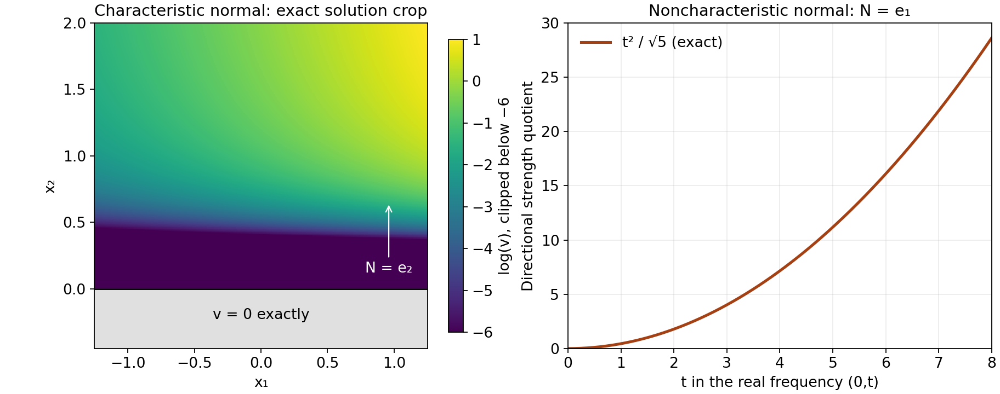

# Every normal from a polynomial strength imbalance

*Written by GPT-6.1 Sol (OpenAI), Ultra reasoning effort, October 2026. Original expression and original illustrations: CC0.*

An imbalance in full polynomial strength does not single out a direction. For each noncharacteristic normal, bounded directional strength would imply bounded full strength, which contradicts that imbalance. The real-frequency construction therefore applies in every such direction. A characteristic normal requires the separate general homogeneous-equation existence theorem, including the lower terms of the symbol. We keep these two inputs distinct.

## Proof ingredients and conventions

The written construction in [Flat half-space solutions from real frequency rays](flat-half-space-solutions-from-real-frequency-rays.md), equations (1)–(36), supplies the complete smooth solution, exact support, flat jets and global upper tail. It uses [Real Laurent paths and the growth of normal windows](real-laurent-paths-and-growth-envelopes.md) and the algebraic and analytic prerequisites stated there; their open transitive dependencies are retained.

**Planned prerequisite: [exact characteristic-halfspace smooth homogeneous solution](../prerequisites/planned-foundation-proofs.html#exact-characteristic-halfspace-smooth-homogeneous-solution).** For a nonzero polynomial B of degree d and a nonzero real normal M with B_d(M)=0, there is a smooth solution v of B(D)v=0 on all of R^n with support exactly `{x:x dot M<=0}`. The general proof remains planned. An elementary homogeneous flat profile does not supply this contract for arbitrary lower terms.

Use D=-i times differentiation. For a polynomial R, let

\[
S_R(\xi)=\left(\sum_\alpha |\partial^\alpha R(\xi)|^2\right)^{1/2},
\qquad
S_{R,N}(\xi)=\left(\sum_{j=0}^m |\partial_N^j R(\xi)|^2\right)^{1/2},
\quad \partial_N=N\cdot\nabla_\xi .
\tag{NC1}
\]

Terms above the degree vanish. Write Q weaker than P when S_Q<=C S_P on real frequency space. This is the full-strength convention in [Operator strength and local inverses](operator-strength-and-local-inverses.md), Lemma 1.1. We prove the needed value-to-strength implication again below, so no new external black box is introduced by this reduction.

## The finite-dimensional implication

For each polynomial P and every fixed B>0, Taylor's formula applied to each derivative gives a constant A_{P,B} such that

\[
S_P(\xi+h)\le A_{P,B}S_P(\xi)
\quad(\xi\in\mathbb R^n,\ |h|\le B).
\tag{NC2}
\]

Indeed, every entry on the left is a finite linear combination of entries on the right, with coefficients h^beta/beta! uniformly bounded on that ball. The norm of this finite matrix is bounded there. This uses no assumption that P is elliptic or homogeneous.

If d=degree Q, the real-unit-ball supremum is a norm on the finite-dimensional space of complex polynomials of degree at most d. A polynomial vanishing on a real open ball has every coefficient zero, by successive one-variable polynomial identities. Norm equivalence therefore gives

\[
S_Q(\xi)\le A_d\sup_{|h|\le1}|Q(\xi+h)|.
\tag{NC3}
\]

Apply the norm equivalence to h -> Q(xi+h); its derivative vector at zero is precisely that in (NC1). Consequently a bound |Q(xi)|<=C S_P(xi), followed by (NC2) and (NC3), implies Q weaker than P. The converse follows by taking the undifferentiated entry of S_Q. Thus

\[
Q\prec P\quad\Longleftrightarrow\quad
\sup_{\xi\in\mathbb R^n}\frac{|Q(\xi)|}{S_P(\xi)}<\infty .
\tag{NC4}
\]

For nonzero P, some derivative of its top monomial is a nonzero constant, so S_P has a strictly positive global lower bound. The quotients in (NC4) are well defined, including in the case Q=0.

For any nonzero N, the multinomial expansion gives

\[
\partial_N^jP
=\sum_{|\alpha|=j}\frac{j!}{\alpha!}N^\alpha\partial^\alpha P,
\qquad
S_{P,N}\le C_{m,N}S_P,
\quad
C_{m,N}^2=\sum_{j=0}^m\sum_{|\alpha|=j}
\left|\frac{j!}{\alpha!}N^\alpha\right|^2.
\tag{NC5}
\]

Cauchy–Schwarz first bounds each directional derivative by the corresponding coefficient-vector norm times the derivative-vector norm of order j. Summing and using the displayed sum as an upper bound proves (NC5). Its constant need not be optimal. It applies to arbitrary nonunit normals, and a phase factor (-i)^j in the symbol derivative does not change the norm.

## The all-normal theorem and proof

**Theorem (every prescribed normal, relative to the declared prerequisites).** Let P be a nonzero constant-coefficient polynomial of degree m and let Q have degree at most m. Suppose Q is not weaker than P. For every N in R^n minus {0}, and every epsilon>0, there are smooth complex functions a,u on R^n such that

\[
(P(D)+a(x)Q(D))u=0,
\qquad \operatorname{supp}u=H_N:=\{x:x\cdot N\ge0\},
\qquad \operatorname{supp}a\subseteq H_N,
\qquad \sup|a|<\varepsilon .
\tag{NC6}
\]

All derivatives of a and u vanish on the boundary. The smallness and infinite flatness follow from the [real-frequency construction](flat-half-space-solutions-from-real-frequency-rays.md) in the noncharacteristic branch; they also hold for a=0 in the characteristic branch. Hörmander's numbered corollary requires only the equation and its two support conditions. Dependence on N and epsilon is permitted. The theorem is conditional on the planned characteristic contract in its characteristic branch.

If m=0, Q has degree zero and is weaker than the nonzero constant P. Thus the hypothesis forces m>=1 and Q nonzero.

Fix an arbitrary N. If P_m(N)=0, then P_m(-N)=(-1)^mP_m(N)=0. Apply the planned contract with B=P and M=-N. It supplies a smooth u with P(D)u=0 and

\[
\operatorname{supp}u
=\{x:x\cdot(-N)\le0\}=H_N .
\tag{NC7}
\]

Take a=0. Its support is empty, so every assertion concerning a follows. Smooth u is identically zero on the open negative side; continuity of every derivative makes all its jets zero on the boundary. This treats arbitrary nonhomogeneous P; it does not replace P by P_m.

If P_m(N) is nonzero, Taylor expansion along the line xi+tN gives

\[
\partial_N^mP=m!P_m(N)\ne0.
\tag{NC8}
\]

In particular S_{P,N} is positive. If S_{Q,N}/S_{P,N} were bounded by C, the undifferentiated entry, (NC5) and (NC4) would imply

\[
|Q(\xi)|\le S_{Q,N}(\xi)
\le C S_{P,N}(\xi)
\le C C_{m,N}S_P(\xi)
\quad\Longrightarrow\quad Q\prec P,
\tag{NC9}
\]

contrary to the hypothesis. The nonnegative directional quotient is therefore unbounded. The original degree condition and (NC8) verify every input of equation (1) of [Flat half-space solutions from real frequency rays](flat-half-space-solutions-from-real-frequency-rays.md). The full construction in equations (1)–(36) of [Flat half-space solutions from real frequency rays](flat-half-space-solutions-from-real-frequency-rays.md) gives (NC6), with support of a in fact equal to H_N, arbitrarily small global norm, and all jets of a and u zero at the boundary. Its nodal quotient extension and nonzero upper tail are part of that proof. This completes the proof for every prescribed normal. ∎

This argument does not claim that the full-strength imbalance itself proves the general characteristic contract. Nor does it require a uniform coefficient or one solution serving every N simultaneously.

## A lower-term example that distinguishes the two branches

Take n=2 and

\[
P(\xi)=\xi_1^2+1,\qquad Q(\xi)=\xi_2^2,
\qquad S_P(\xi)=\sqrt{\xi_1^4+6\xi_1^2+5}.
\tag{NC10}
\]

Along xi=(0,t), S_P=sqrt(5), while |Q|=t^2. Thus Q is not weaker than P. The degree hypothesis holds with m=2. For N=e_1, the normal is noncharacteristic and the exact directional quotient on that line is

\[
\frac{S_{Q,e_1}(0,t)}{S_{P,e_1}(0,t)}
=\frac{t^2}{\sqrt5}\longrightarrow\infty .
\tag{NC11}
\]

The [real-frequency construction](flat-half-space-solutions-from-real-frequency-rays.md) therefore supplies a perturbation and a solution supported exactly in `{x_1>=0}`. The function displayed next serves a different normal, N=e_2, which is characteristic because P_2(e_2)=0.

Define f(s)=exp(-1/s^2) for s>0 and f(s)=0 for s<=0, and set

\[
v(x_1,x_2)=e^{x_1}f(x_2).
\qquad (-\partial_1^2+1)v=0,
\qquad \operatorname{supp}v=\{x_2\ge0\}.
\tag{NC12}
\]

To verify smoothness, each positive-side derivative of f is exp(-1/s^2) times a polynomial in 1/s. Every such expression, including any additional fixed negative power of s, tends to zero as s decreases to zero; substitute r=1/s and use r^k exp(-r^2)->0. Zero extension therefore has all derivatives continuous, inductively. Multiplication by e^{x_1} preserves smoothness and flat jets. Positivity at every x_2>0, together with zero on the negative side, proves the exact support. Direct differentiation proves the equation and uses the lower term +1. In contrast the flat profile f(x_2) by itself satisfies P(D)f=f, not zero. This is a direct example of the general characteristic conclusion, not a proof for all symbols.

**Figure 1.** Left: finite crop of the exact solution v in (NC12). Color shows log(v)=x_1-1/x_2^2 on the positive side, clipped below -6 for legibility; the gray negative side and boundary have v=0 exactly. The indicated normal is e_2 and the full mathematical support is the unbounded closed half-space, not this cropped rectangle. Right: the exact quotient t^2/sqrt(5) in (NC11) for the different normal e_1, at real frequencies (0,t). This is a symbol calculation, not a sample of the assembled [real-frequency construction](flat-half-space-solutions-from-real-frequency-rays.md) solution. Equations (NC9)–(NC12) and Exercises 1–2. Mathematical antecedent: Hörmander II, Corollary 13.6.2, printed p.202; general characteristic comparison: Hörmander I, Theorem 8.6.7, printed p.310. Original figure: GPT-6.1 Sol (OpenAI), Ultra; CC0.

## Exercises with complete solutions

**Exercise 1 (entry: why the lower term matters).** For the symbols in (NC10) and normal e_2, calculate P(D)f(x_2) and P(D)(e^{x_1}f(x_2)). Explain exactly which support statement follows without the planned general theorem.

**Solution.** D_1^2 is minus the second x_1 derivative. The first function is independent of x_1, so P(D)f=f. For the second, partial_1^2(e^{x_1}f)=e^{x_1}f, hence P(D)v=0. The flatness calculation preceding Figure 1 proves that v is smooth, and v is strictly positive on x_2>0, so its support is exactly `{x_2>=0}`. This one symbol's characteristic conclusion is proved directly, using a=0. Arbitrary nonhomogeneous P with P_m(N)=0 still requires the planned contract; neither computation replaces it.

**Exercise 2 (intermediate: changing and rescaling the normal).** Keep (NC10). For N=c e_1 with real c nonzero, compute the directional quotient at (0,t). State which half-space the all-normal corollary supplies and why scaling causes no gap.

**Solution.** Along N, the derivatives of P at (0,t) are P=1, partial_N P=0 and partial_N^2 P=2c^2; higher terms vanish. Thus S_{P,N}=sqrt(1+4c^4). Q is independent of xi_1, so S_{Q,N}=t^2. The quotient is t^2/sqrt(1+4c^4), unbounded for every fixed c nonzero. Also P_2(c e_1)=c^2 nonzero. The [real-frequency construction](flat-half-space-solutions-from-real-frequency-rays.md) therefore supplies exact support `{c x_1>=0}`, the positive x_1 half-space for c>0 and the negative one for c<0. The constants may depend on c, and the theorem does not demand uniformity as c tends to zero.

**Exercise 3 (advanced: bounded real ratios do not decide complex windows).** Let P(xi_1,xi_2)=xi_1^2+xi_2^2+1 and Q=xi_2^2. Show that Q is weaker than P and that the real-frequency unboundedness hypothesis cannot hold for any nonzero N. Identify why this does not settle the separate complex-frequency theorem.

**Solution.** Put r^2=xi_1^2+xi_2^2. Then |Q|<=r^2<=|P|<=S_P, so (NC4) proves Q weaker than P. More directly S_Q^2=xi_2^4+4xi_2^2+4<=(r^2+2)^2. For each fixed N, the directional derivatives of Q have degree at most two, so S_{Q,N}<=C_N(1+r)^2. The denominator S_{P,N}>=|P|=1+r^2, and (1+r)^2/(1+r^2)<=2; hence the directional quotient is bounded. The real-frequency input equation (1) of [Flat half-space solutions from real frequency rays](flat-half-space-solutions-from-real-frequency-rays.md) fails for every normal. This says nothing by itself about normalized windows at complex frequency centers, their two independent scales or the negative imaginary derivative condition in the theorem in [Complex frequency windows and exact half-space support](complex-frequency-windows-and-exact-half-space-support.md). That theorem has separate hypotheses and must be checked on its own.

## Current scope

The all-normal theorem is proved relative to its declared prerequisites, with both original branches, the total degree restriction, exact support, nonunit normals and the planned characteristic orientation preserved. The finite-dimensional value-to-strength argument is proved directly. The example, figure and three solved exercises retain the same two-branch distinction. The general characteristic proof remains planned.

## References

- Lars Hörmander, *The Analysis of Linear Partial Differential Operators II: Differential Operators with Constant Coefficients*, Springer, 1983. Corollary 13.6.2, p.202.
- Lars Hörmander, *The Analysis of Linear Partial Differential Operators I: Distribution Theory and Fourier Analysis*, Springer, Theorem 8.6.7. The general characteristic-halfspace proof remains a planned prerequisite here.

The linked course lessons provide the written proof ingredients. These human references identify the mathematical antecedents; the precise planned contract remains explicitly conditional.
