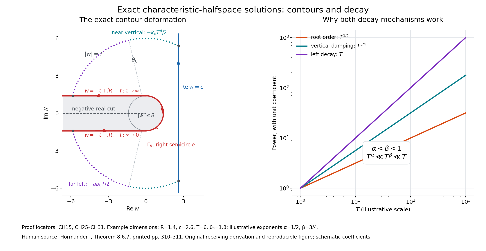

# Smooth solutions with an exact characteristic halfspace as support

*Original proof and figure: GPT-6.1 Sol (OpenAI), Ultra reasoning effort, October 2026; CC0.*

A characteristic plane can be the boundary of a nonzero smooth solution that is zero on the entire other side. Every derivative vanishes at that plane. The construction below works for complex constant coefficients and includes all lower order terms. It imposes no bound on the solution at spatial infinity.

We use \(D_j=-i\partial_{x_j}\), the bilinear dot product when a variable is complex, and the usual Euclidean norm for estimates. The support of a continuous function is the closure of the points where it is nonzero. A function is real analytic if locally it equals a convergent power series in the real coordinates.

## How to read the construction

The theorem treats every nonzero complex constant-coefficient polynomial and every real characteristic normal, with no normalization or orthogonality requirement. The solution is global and smooth, and solves the full operator including all lower order terms. There is no restriction on growth at infinity. Exact support means every nonempty open subset of the negative halfspace contains a point where the solution is nonzero; it does not mean the solution is nonzero at every point.

| Part of the argument | Read here | What it supplies |
| --- | --- | --- |
| The algebraic branch | Lemma 2, CH3–CH7; Appendix A.2–A.4 | Repeated roots are removed, finite monodromy is killed by \(v=t^p\), and boundedness gives a branch extending through zero. A zero branch is permitted. |
| The full symbol | CH8–CH15 | The branch determines \(q(w)\) with \(P(iwN+q(w)V)=0\) and the uniform sublinear bound \(|q(w)|\le C|w|^\alpha\). |
| Smoothness and one-sided vanishing | CH16–CH21 | Vertical damping dominates every differentiated root contribution. Moving the vertical line to the right proves vanishing on the positive side and all boundary jets. |
| Nontriviality | CH22–CH24 | The Gram dual selects a line without assuming orthogonal coordinates. A directly proved Gaussian Fourier-injectivity argument gives \(u\ne0\). |
| Exact support | CH25–CH31 and the final identity argument | The two outer-arc estimates justify the left deformation. The resulting holomorphic tube proves negative-interior analyticity, excluding an open region of zeros there. |
| Test the mechanisms | Examples 3–5, CH32–CH35; Exercises 1–5 | A zero branch, the heat operator and an essential lower order term check different features of the theorem. Every exercise has a complete solution. |

The complex tools used in the construction are proved in Appendix A, the finite-cover lemma and CH24. The ordinary entry toolkit consists of real and complex differential calculus, polynomial Euclidean division over a field and rational identities, finite permutations, elementary path lifting and winding contraction. The integral arguments use absolute-integral Fubini and dominated convergence; their precise scalar forms and proofs are available in [Banach estimates, quotient spaces and compact parameter arguments](../prerequisites/banach-foundation-bridges.html), Section 15.1, equations (LP2) and (LP4). These are the only external proof-provider links used here. No general Puiseux theorem, Holmgren theorem, analytic elliptic regularity or general support theorem is imported.

**Theorem 1 (exact characteristic halfspace).** Let \(P\ne0\) be a complex polynomial on \(\mathbb R^n\) of degree \(m\), and let \(P_m\) be its homogeneous part of degree \(m\). If \(N\in\mathbb R^n\setminus\{0\}\) satisfies \(P_m(N)=0\), there is a complex-valued function \(u\in C^\infty(\mathbb R^n)\) such that
\[
 P(D)u=0,\qquad
 \operatorname{supp}u=\{x:x\cdot N\le0\}.
 \tag{CH1}
\]
For every multiindex \(\gamma\),
\[
 \partial^\gamma u(x)=0\quad\hbox{when }x\cdot N=0.
 \tag{CH2}
\]
The constructed solution is real analytic on \(x\cdot N<0\). Replacing \(N\) by \(-N\) gives the positive closed halfspace for the same operator.

The hypothesis is impossible for \(m=0\), since then \(P_m=P\) is a nonzero constant. It is also impossible in dimension one: \(P_m(\xi)=a\xi^m\), with \(a\ne0\), cannot vanish at a nonzero real \(\xi\).

The proof uses two different decay mechanisms. On a right vertical contour a fractional power \(w^\beta\) damps the integral. On a contour extending to the left, the negative physical coordinate supplies stronger linear decay. The first mechanism gives global smoothness and vanishing for \(x\cdot N>0\); the second gives analyticity on the negative side. Fourier injectivity then prevents the solution from being zero everywhere.

## A finite-cover root lemma

We first prove the algebraic step, including the finite-cover argument. The basic one-variable complex facts used in this proof are supplied in Appendix A.

**Lemma 2.** Suppose
\[
 A(z,v)=z^d+\sum_{j=0}^{d-1}a_j(v)z^j,\qquad d\ge1,
 \tag{CH3}
\]
where the \(a_j\) are polynomials in \(v\), and \(A(0,0)=0\). There are an integer \(p\ge1\), a number \(\rho>0\), and a holomorphic function \(a(t)\) on \(|t|<\rho\), such that
\[
 a(0)=0,\qquad A(a(t),t^p)=0,\qquad |a(t)|\le C|t|
 \quad(|t|<\rho/2).
 \tag{CH4}
\]
The branch \(a\) may be identically zero.

**Proof.** Work temporarily over the field \(\mathbb C(v)\). The Euclidean algorithm forms the monic squarefree part
\[
 B=\frac{A}{\gcd(A,\partial_z A)}.
 \tag{CH5}
\]
Indeed, factoring in an algebraic closure gives \(A=\prod_\nu f_\nu^{k_\nu}\) with distinct monic irreducible factors and \(B=\prod_\nu f_\nu\). Characteristic zero makes each irreducible factor separable. Thus \(B\) has no repeated root. The identities \(B\mid A\) and \(A\mid B^d\) hold over \(\mathbb C(v)\). Exclude the zeros of their finitely many denominators; the specialized polynomials \(A(\cdot,v)\) and \(B(\cdot,v)\) then have the same root set. The discriminant of \(B\) is a nonzero rational function of \(v\). Equivalently, the Euclidean algorithm gives a rational-coefficient Bézout identity for \(B,\partial_z B\). Either description shows that, after reducing \(r_0>0\), every root of \(B(\cdot,v)\) is simple whenever \(0<|v|<r_0\).

All roots of \(A(\cdot,v)\) are uniformly bounded for \(|v|\le r_0\). In fact, if \(M\) bounds its coefficients there, a root has modulus at most \(1+M\): for \(|z|>1+M\), the leading term exceeds the sum of the moduli of the remaining terms. This also bounds the roots of \(B\) for nonzero \(v\).

Choose \(\varepsilon>0\) such that \(0\) is the only root of \(A(\cdot,0)\) in \(|z|\le\varepsilon\), and there is no root on the circle. For sufficiently small \(|v|\), \(A(\cdot,v)\) remains nonzero on that circle and has the same positive number of roots inside, counting multiplicity. Here is a direct root-count justification: the integral
\[
 \frac1{2\pi i}\int_{|z|=\varepsilon}
       \frac{\partial_z A(z,v)}{A(z,v)}\,dz
 \tag{CH6}
\]
is continuous in \(v\) and, after factoring the polynomial, is its integer number of enclosed roots. It is therefore constant. In particular, a root inside the circle exists for some small \(v_0\ne0\).

At every \(0<|v|<r_0\), the simple roots of \(B\) have local holomorphic labels. To see this without importing an implicit-function result, isolate a simple root by a small circle \(C\). Nearby parameters keep exactly one root inside \(C\), and that root equals
\[
 \frac1{2\pi i}\int_C z\,\frac{\partial_z B(z,v)}{B(z,v)}\,dz.
 \tag{CH7}
\]
The denominator stays nonzero on \(C\), so differentiation under this finite contour integral proves holomorphy.

Continue the chosen root along paths in the punctured \(v\)-disk. Continuation cannot stop along a compact path: the roots remain bounded, and at a limiting nonzero parameter every root is simple and has a local label as in CH7. The continued root cannot cross \(|z|=\varepsilon\), since that circle is root-free. Local uniqueness also implies that continuations along homotopic paths with fixed endpoints agree. One can check this last assertion by subdividing a path homotopy into small rectangles whose images lie in local-label neighborhoods; opposite routes across each rectangle agree.

A loop around zero permutes finitely many roots. Choose \(p\) so that this permutation raised to its \(p\)-th power is the identity, for example the factorial of \(\deg_z B\). In the substitution \(v=t^p\), a loop once around \(t=0\) goes \(p\) times around \(v=0\). Its root label therefore returns to itself. Every loop in a punctured disk is homotopic to an integer number of such turns: a continuous argument along a loop records its integer winding, and a loop of winding zero contracts after lifting the argument. Consequently the selected label becomes a single-valued holomorphic function \(a(t)\) on a punctured \(t\)-disk.

It is bounded there, so its singularity at zero is removable. Substitution into CH3 shows \(A(a(0),0)=0\). Since \(|a(t)|<\varepsilon\) and \(0\) is the only root in the closed circle, \(a(0)=0\). The Taylor expansion of the extended branch gives \(a(t)=t b(t)\), where \(b\) is holomorphic and bounded on a smaller disk. This proves CH4. \(\square\)

Repeated algebraic roots cause no obstruction. For example \(A=(z^2-v)^2\) has squarefree part \(B=z^2-v\); \(v=t^2\) gives the branch \(a(t)=t\). The lemma also covers \(A=z^d\), where the chosen branch is zero.

## A sublinear root of the full symbol

Write
\[
 P=P_m+P_{m-1}+\cdots+P_0
 \tag{CH8}
\]
with \(P_j\) homogeneous of degree \(j\). Choose a real vector \(V\) with \(P_m(V)\ne0\). Such a vector exists: a polynomial vanishing at every real point is zero, as follows by applying the one-variable polynomial identity successively in each coordinate. The vectors \(N,V\) are independent because homogeneity makes \(P_m\) zero on every real multiple of \(N\).

Form the monic polynomial in \(z\)
\[
 A(z,v)=\frac1{P_m(V)}
       \sum_{j=0}^m v^{m-j}P_j(N+zV).
 \tag{CH9}
\]
Its leading \(z^m\) coefficient is one; only \(P_m\) contributes that power. Also \(A(0,0)=0\). Lemma 2 supplies \(p,a\) as in CH4.

On the slit plane use
\[
 \operatorname{Log}w=\log|w|+i\arg w,\quad -\pi<\arg w<\pi.
 \tag{CH10}
\]
For sufficiently large \(|w|\), put
\[
 t(w)=\exp\!\left[-\frac{\operatorname{Log}w+i\pi/2}{p}\right],
 \qquad q(w)=iw\,a(t(w)).
 \tag{CH11}
\]
This specifies the branch completely; no change of branch occurs on a contour. Since \(t(w)^p=1/(iw)\), homogeneity and CH9 give
\[
 P(iwN+q(w)V)=(iw)^m P_m(V)
                   A(a(t(w)),1/(iw))=0.
 \tag{CH12}
\]
There are \(R_0,C>0\) such that \(q\) is holomorphic on
\[
 \Omega=\{w:|w|>R_0,\ -\pi<\arg w<\pi\},
 \qquad |q(w)|\le C|w|^\alpha,
 \quad \alpha=1-\frac1p\in[0,1).
 \tag{CH13}
\]
Indeed \(|t(w)|=|w|^{-1/p}\) and CH4 applies. This uniform bound holds throughout the slit exterior, including arguments close to either side of the cut. If \(a=0\), then \(q=0\); the same estimates apply.

Choose once and for all
\[
 \alpha<\beta<1,\qquad w^\beta=\exp(\beta\operatorname{Log}w),
 \qquad k=\cos(\beta\pi/2)>0.
 \tag{CH14}
\]
For \(\operatorname{Re}w>0\),
\[
 \operatorname{Re}w^\beta
       =|w|^\beta\cos(\beta\arg w)\ge k|w|^\beta.
 \tag{CH15}
\]

## The vertical integral and global smoothness

For \(c>R_0\) and real \(x\), define
\[
 \begin{split}
 r&=x\cdot N,\qquad h=x\cdot V,\\
 F(x,w)&=\exp[-rw+ihq(w)-w^\beta],\\
 u_c(x)&=\frac1{2\pi i}\int_{c-i\infty}^{c+i\infty}F(x,w)\,dw.
 \end{split}
 \tag{CH16}
\]
The vertical contour is directed upwards. Along \(w=c+is\), for \(x\) in a fixed compact set,
\[
 |F(x,c+is)|\le
 \exp[M c+MC|c+is|^\alpha-k|c+is|^\beta].
 \tag{CH17}
\]
The \(M\) may be increased to bound both \(|r|\) and \(|h|\). Since \(\alpha<\beta\), the last two terms are at most \(-k|c+is|^\beta/2\) for large \(|s|\). Each derivative in \(x\) adds a product of components of \(-wN+iq(w)V\), bounded by a fixed power of \(1+|s|\). Every such power is integrable against \(\exp(-k|s|^\beta/2)\). For example, substitution \(y=(k/2)s^\beta\) reduces its integral on \(s>1\) to an exponentially decaying power integral. Dominated differentiation, uniformly on compact \(x\)-sets, therefore proves \(u_c\in C^\infty(\mathbb R^n)\).

Because
\[
 D_j F=(iwN_j+q(w)V_j)F,
 \tag{CH18}
\]
CH12 and the same differentiation bounds give \(P(D)u_c=0\). This is an equation for the entire polynomial \(P\), not merely its principal part.

The value is independent of \(c\). For \(R_0<c_1<c_2\), apply Cauchy's theorem to the rectangle with these vertical sides and horizontal sides at heights \(\pm T\). For fixed real \(x\), the real part of \(-rw\) is bounded on the horizontal sides, and CH13–CH15 bound the other terms by
\[
 C_x T^\alpha-kT^\beta/2
 \tag{CH19}
\]
for large \(T\). Their fixed lengths \(c_2-c_1\) thus give integrals tending to zero. The two vertical integrals coincide after \(T\to\infty\). Denote their common value by \(u\).

If \(r>0\), take \(c\) arbitrarily large. For all \(|w|\ge c\), CH13 and \(\alpha<\beta\) give
\[
 |h|C|w|^\alpha\le(k/2)|w|^\beta
 \tag{CH20}
\]
once \(c\) is large enough for this fixed \(x\). Hence
\[
 |u(x)|\le\frac{e^{-rc}}{2\pi}
       \int_{\mathbb R}e^{-(k/2)|c+is|^\beta}\,ds
 \le\frac{e^{-rc}}{2\pi}
       \int_{\mathbb R}e^{-(k/2)|s|^\beta}\,ds.
 \tag{CH21}
\]
The final integral is finite and independent of \(c\). Sending \(c\to\infty\) proves \(u=0\) for \(r>0\). Every derivative is zero on that open set. Its continuity on all of \(\mathbb R^n\) gives CH2 and also \(u=0\) on \(r=0\).

## A nonzero one-dimensional restriction

Set
\[
 \Delta=|N|^2|V|^2-(N\cdot V)^2>0,\qquad
 L=\frac{|V|^2N-(N\cdot V)V}{\Delta}.
 \tag{CH22}
\]
Then \(L\cdot N=1\) and \(L\cdot V=0\). At \(x=rL\), CH16 becomes
\[
 u(rL)=\frac{e^{-cr}}{2\pi}
       \int_{\mathbb R}e^{-irs}f_c(s)\,ds,\qquad
 f_c(s)=e^{-(c+is)^\beta}.
 \tag{CH23}
\]
The function \(f_c\) is a nonzero Schwartz function. Its modulus has the stretched exponential decay in CH15. Differentiating it in \(s\) any number of times gives a finite sum of powers of \(c+is\) times that same exponential; the powers have at most polynomial growth, and \(|c+is|\ge c>0\).

We only need injectivity of the Fourier transform, not a general distribution theorem. If a Schwartz function \(f\) has \(\int e^{-irs}f(s)\,ds=0\) for every real \(r\), convolve it with
\[
 g_\epsilon(s)=(4\pi\epsilon)^{-1/2}e^{-s^2/(4\epsilon)}
       =\frac1{2\pi}\int_{\mathbb R}e^{irs}e^{-\epsilon r^2}\,dr.
 \tag{CH24}
\]
Fubini's theorem, justified by \(\|f\|_1\int e^{-\epsilon r^2}dr<\infty\), gives \(f*g_\epsilon=0\). These Gaussian kernels have mass one and concentrate at zero as \(\epsilon\downarrow0\). Boundedness and uniform continuity of \(f\), splitting the integral into \(|s|<\eta\) and its Gaussian tail, give \(f*g_\epsilon\to f\) uniformly. Thus \(f=0\). For completeness, the Gaussian identity in CH24 follows by differentiating \(I(s)=\int e^{-\epsilon r^2}e^{irs}dr\) and integrating by parts to get \(I'(s)=-sI(s)/(2\epsilon)\); the value \(I(0)=\sqrt{\pi/\epsilon}\) follows from the two-dimensional polar-coordinate Gaussian integral.

If \(u\) were identically zero, CH23 and this injectivity would force \(f_c=0\), contrary to its exponential formula. Consequently \(u\ne0\). Since it vanishes on \(r\ge0\), it is nonzero somewhere with \(r<0\).

## The left contour and exact support

Fix \(R>R_0\). The contour \(\Gamma_R\) consists, in the following order, of
\[
 \begin{array}{ll}
  w=-t-iR,&t:\infty\longrightarrow0,\\
  w=Re^{i\theta},&\theta:-\pi/2\longrightarrow\pi/2,\\
  w=-t+iR,&t:0\longrightarrow\infty.
 \end{array}
 \tag{CH25}
\]
It uses the right semicircle and two horizontal left rays. It stays in \(\Omega\), keeps the disk and the negative-real branch cut on its left as traversed, and has the same upward passage on its right as the vertical contour.

*Figure 1. The blue contour is the upward vertical line \(\operatorname{Re}w=c\). The red contour is exactly CH25: its lower ray points right, its semicircle passes through \(+R\), and its upper ray points left. The gray disk \(|w|\le R\) and negative-real cut are excluded during deformation. The dotted outer arcs have \(\phi_T\le|\arg w|\le\psi_T\); the marked angle \(\theta_0\) splits their two estimates in CH27. The right panel compares the powers controlling the proof: \(T^\alpha\) from the root, \(T^\beta\) from vertical damping, and \(T\) from left decay. It plots the illustrative exponents \(\alpha=1/2,\beta=3/4\), with unit coefficients; these curves are schematic orders, not numerical bounds for an arbitrary \(P\). The inequalities and contour equations, rather than the drawing's example dimensions, specify the proof. Reproducible source: figures/make_figures.py. Human mathematical source: Hörmander I, Theorem 8.6.7; the estimates and detailed contour justification here are original receiving work.*

The caption retains the original renderer filename. The same unchanged source is supplied as [an02-l111-make-figures.py](../figures/an02-l111-make-figures.py). The [standalone reproduction guide](../reproduce-AN02-L111.html) links the PNG, SVG, exact geometry and wrapper, and explains the illustrative parameters.

We justify the deformation for real \(x\) with \(r<0\); complex analyticity will then be proved directly on the new contour. Put \(a=-r>0\), and use a vertical line \(c>R\), allowed by the already proved independence. Intersect both contours with \(|w|<T\), where \(T>\max(c,R)\). Their upper endpoints have respective arguments
\[
 \phi_T=\arccos(c/T),\qquad
 \psi_T=\pi-\arcsin(R/T);
 \tag{CH26}
\]
the lower endpoints have the negative arguments. Join each pair by an arc on \(|w|=T\). The resulting bounded region between the contours excludes
\(\{|w|\le R\}\cup\{\operatorname{Re}w\le0,\ |\operatorname{Im}w|\le R\}\);
in particular it excludes the cut and is inside the holomorphic domain. Cauchy's theorem reduces equality of the limiting integrals to decay on the two joining arcs.

Choose a fixed
\[
 \frac\pi2<\theta_0<
       \min\!\left(\pi,\frac{\pi}{2\beta}\right),\qquad
 k_0=\cos(\beta\theta_0)>0,\qquad b_0=-\cos\theta_0>0.
 \tag{CH27}
\]
On either arc, with \(\theta=|\arg w|\), the exponent is bounded by
\[
 \operatorname{Re}[-rw+ihq(w)-w^\beta]
 \le aT\cos\theta+C|h|T^\alpha-T^\beta\cos(\beta\theta).
 \tag{CH28}
\]
For \(\phi_T\le\theta\le\theta_0\), \(T\cos\theta\le c\) and \(\cos(\beta\theta)\ge k_0\), so CH28 is at most \(ac+C|h|T^\alpha-k_0T^\beta\), hence at most \(-k_0T^\beta/2\) for large \(T\). For \(\theta_0\le\theta\le\psi_T\), it is at most
\[
 -ab_0T+C|h|T^\alpha+T^\beta
       \le-ab_0T/2
 \tag{CH29}
\]
for large \(T\). Each arc has length at most \(\pi T\). Both integrals therefore tend to zero. The vertical integral equals the integral over CH25.

Now let \(z\in\mathbb C^n\) and \(r=z\cdot N\), \(h=z\cdot V\). Define
\[
 U(z)=\frac1{2\pi i}\int_{\Gamma_R}
       \exp[-(z\cdot N)w+i(z\cdot V)q(w)-w^\beta]\,dw
 \quad\hbox{for }\operatorname{Re}(z\cdot N)<0.
 \tag{CH30}
\]
This integral is locally uniformly convergent. On a compact subset of this tube there are \(\delta>0\) and \(M<\infty\) with \(\operatorname{Re}r\le-\delta\), \(|r|,|h|\le M\). On a ray \(w=-t+i\sigma R\), \(\sigma=\pm1\),
\[
 \begin{split}
 \operatorname{Re}(-rw)&=t\operatorname{Re}r+\sigma R\operatorname{Im}r
       \le-\delta t+RM,\\
 |F(z,w)|&\le
 \exp[-\delta t+RM+CM(t+R)^\alpha+(t+R)^\beta].
 \end{split}
 \tag{CH31}
\]
Since \(\alpha,\beta<1\), this is bounded by a constant times \(e^{-\delta t/2}\). Any fixed number of derivatives in \(z\) only multiplies it by a polynomial in \(1+t\). The semicircle is compact and causes no convergence issue.

Here is also a direct power-series justification of holomorphy, avoiding any unstated several-complex-variable theorem. Around \(z_0\) in this tube, expand the exponential of the linear increment in \(z-z_0\). Its coefficients involve components of \(-wN+iq(w)V\), whose sum of moduli is at most \(C_1(1+t)\) on the rays. Choose a polydisk radius so small that the absolute sum of this exponential series is at most \(e^{\delta t/4+C_2}\). CH31 then provides an integrable majorant for the series and all its partial sums. Termwise integration gives a convergent power series for \(U\) on the polydisk. Thus \(U\) is holomorphic, and its restriction to real \(x\) is real analytic. The proved real contour deformation shows \(U(x)=u(x)\) for \(x\cdot N<0\).

Finally, a real analytic function on a connected open set that vanishes on a nonempty open subset vanishes everywhere there. A short proof useful here is to consider points with a zero neighborhood. They form an open set. They also form a relatively closed set: at a limit point all derivatives are zero by continuity, and the local convergent power series is therefore zero. Connectedness finishes the argument. The halfspace \(x\cdot N<0\) is convex and connected.

If the present \(u\) vanished on any nonempty open subset of that halfspace, it would vanish on the entire halfspace, contradicting its nonzero restriction in CH23. Hence every nonempty open subset of the negative halfspace meets a point where \(u\ne0\). Every ball centered at its boundary contains such an open subset. Combining this with \(u=0\) on the positive side proves exactly CH1, not just a support inclusion. CH2 was already proved. This completes Theorem 1. \(\square\)

## Examples

**Example 3 (a zero branch).** In coordinates \((y,t)\), take \(P(\xi,\tau)=\xi\), \(N=e_t\), \(V=e_y\). The root is \(q=0\). An elementary witness is \(u(y,t)=\varphi(t)\), where
\[
 \varphi(t)=
 \begin{cases}e^{1/t},&t<0,\\0,&t\ge0.\end{cases}
 \tag{CH32}
\]
Every left derivative is an exponential times a polynomial in \(1/t\), tending to zero at \(t=0\); hence \(\varphi\) is smooth and flat there. It is positive at every negative \(t\), so its support is exactly \(t\le0\). The general integral construction permits a zero branch as well.

**Example 4 (the heat operator).** Let
\[
 P(\xi,\tau)=\xi^2+i\tau,\qquad
 P(D)=\partial_t-\partial_y^2,\qquad
 N=e_t,\quad V=e_y.
 \tag{CH33}
\]
The principal part is \(\xi^2\), which vanishes at \(N\). The exact root equation is \(q^2-w=0\). Take \(q(w)=w^{1/2}\) on the slit plane and \(\beta=3/4\). The construction is
\[
 u(y,t)=\frac1{2\pi i}\int_{c-i\infty}^{c+i\infty}
       e^{-tw+iyw^{1/2}-w^{3/4}}\,dw.
 \tag{CH34}
\]
This nonzero global smooth heat solution has support exactly \(t\le0\) and all jets zero at \(t=0\). In its integrand, \(\partial_t\) gives \(-w\), while \(\partial_y^2\) gives \(-q^2\), so their difference is zero. At \(y=0\) the Fourier restriction in CH23 proves nontriviality. No estimate controlling spatial growth at infinity was imposed or proved. The conclusion concerns the full smooth class, and does not settle uniqueness in a smaller growth class.

**Example 5 (a lower order term survives).** For \(P(\xi,\tau)=\xi\tau-1\), use \(N=e_t\), \(V=(1,1)\), so \(P_2(V)=1\). For \(|w|>2\), the binomial-series branch
\[
 q(w)=\frac{2}{iw\,[1+\sqrt{1-4/w^2}]}
 \tag{CH35}
\]
satisfies \(q(iw+q)=1\). Its asymptotic is \(q(w)=1/(iw)+O(|w|^{-3})\); it is \(O(|w|^{-1})\) uniformly outside a sufficiently large disk. One may use the weaker bound \(\alpha=0\) and any \(0<\beta<1\). This produces an exact negative-halfspace solution for \(D_yD_t-1\). Dropping the constant term would change the root equation and would not verify that operator.

## Exercises with complete solutions

**Exercise 1 (orientation and coordinates).** Verify CH22. Explain why the theorem supplies both orientations, and why its hypothesis has no instance in dimension one or degree zero.

**Solution.** Taking the dot product of the numerator of \(L\) with \(N\) gives \(\Delta\), and with \(V\) gives zero. Strict Cauchy–Schwarz gives \(\Delta>0\) because \(N,V\) are independent. Thus \(rL\) is exactly the real line with dot products \(r,0\), without requiring \(N,V\) to be orthogonal or unit vectors. Homogeneity gives \(P_m(-N)=(-1)^mP_m(N)=0\); apply the theorem to \(-N\), obtaining \(x\cdot N\ge0\). No substitution in the lower order terms is needed. Degree zero gives a nonzero constant principal part, and dimension one gives \(aN^m\ne0\), as stated before the proof.

**Exercise 2 (repeated roots and branch bounds).** Carry out Lemma 2 for \(A(z,v)=(z^2-v)^2\). Then show that the estimate \(a(t)=O(t)\) suffices for CH13 even when the Taylor series starts at a higher power.

**Solution.** \(A_z=4z(z^2-v)\); over \(\mathbb C(v)\), its monic greatest common divisor with \(A\) is \(z^2-v\). Thus \(B=z^2-v\), whose discriminant is \(4v\). Its two roots are simple for \(v\ne0\); a turn around zero swaps them. Setting \(v=t^2\) gives \(a(t)=t\), or \(-t\), both extending through zero. In general if \(a(t)=t^k b(t)\), \(k\ge1\), then \(|q(w)|\le C|w|^{1-k/p}\). For \(|w|\ge1\), this is at most \(C|w|^{1-1/p}\). If all coefficients vanish, \(a=q=0\). No division by a leading nonzero Taylor coefficient is used.

**Exercise 3 (the full lower order root).** Verify CH35 and its uniform exterior estimate.

**Solution.** Set \(s=\sqrt{1-4/w^2}\) using the Taylor series for the square root at one. For \(|w|>2\), its argument \(1-4/w^2\) lies in the disk centered at one of radius less than one, so that branch is holomorphic and satisfies \(s^2=1-4/w^2\). Rationalization gives
\[
 q=\frac{iw}{2}(s-1).
\]
Then \(q+iw=(iw/2)(s+1)\), and
\[
 q(q+iw)=-\frac{w^2}{4}(s^2-1)=1.
\]
As \(|w|\to\infty\), \(s=1-2/w^2+O(|w|^{-4})\), hence \(q=-i/w+O(|w|^{-3})=1/(iw)+O(|w|^{-3})\). For \(|w|\ge R>2\), the power series is uniformly convergent; after increasing \(R\), \(|1+s|\ge1\). The denominator formula gives \(|q|\le2/|w|\). This is a uniform bound in every angle, not merely on the positive real axis.

**Exercise 4 (why the two exponent inequalities are needed).** Explain the roles of \(\alpha<\beta\) and \(\beta<1\). Compute the first two derivatives of \(f_c(s)\) and verify that they obey Schwartz bounds.

**Solution.** On the vertical contour, the possibly positive root contribution has order \(C|h||w|^\alpha\). To dominate it for every fixed real \(h\), the damping order must be strictly larger: \(\beta>\alpha\). With equal orders a sufficiently large \(|h|\) could defeat the available bound. On the left rays the negative real physical coordinate gives \(-\delta t\); it must dominate both sublinear terms \(t^\alpha,t^\beta\), so \(\beta<1\). This also gives the strictly positive number \(\cos(\beta\pi/2)\) on the vertical line. At \(\beta=1\), \(|e^{-(c+is)}|=e^{-c}\), which supplies no decay as \(|s|\to\infty\).

Writing \(w=c+is\), direct differentiation yields
\[
 f_c'=-i\beta w^{\beta-1}f_c,\qquad
 f_c''=
 \left[\beta(\beta-1)w^{\beta-2}
       -\beta^2w^{2\beta-2}\right]f_c.
\]
Since \(|w|\ge c>0\), these factors have no singularity on the line. Multiplying either derivative by any power of \(s\) still gives a bounded function, because CH15 gives \(|f_c|\le e^{-k|w|^\beta}\). Repeated differentiation has the same finite-sum form, proving all Schwartz seminorms are finite.

**Exercise 5 (smooth flatness does not give the exact support alone).** Prove flatness from vanishing on one side. Identify the additional argument needed to exclude an open zero region inside the other side, and prove the real analytic identity assertion used there.

**Solution.** If a smooth \(v\) vanishes on \(x\cdot N>0\), each \(\partial^\gamma v\) vanishes there too. For a boundary point \(x_0\), the points \(x_0+\varepsilon N\) lie on that side for \(\varepsilon>0\) and tend to \(x_0\); continuity gives \(\partial^\gamma v(x_0)=0\). This proves all jets are flat but permits, for instance, a compactly supported smooth function lying strictly inside the negative halfspace. It does not prove the entire halfspace is the support. Here CH30–CH31 provide analyticity on the connected negative interior, while CH23 supplies a nonzero value there. For any real analytic function, points with a zero neighborhood form an open set. If such points approach an interior point, every derivative at the limit is zero, since all those derivatives vanish at the approaching points. Its local convergent power series is zero; it too has a zero neighborhood. This set is relatively closed. If it is nonempty in a connected domain it equals that domain. Applying this to the constructed \(u\) excludes an interior open zero region and gives the exact support.

## Appendix A: the elementary complex tools used above

We record the relevant forms and their proofs to make the dependency boundary explicit. The measure-theoretic tools are ordinary absolute-integral Fubini and dominated convergence. Fourier injectivity was proved directly in CH24. No general Puiseux theorem, analytic elliptic regularity theorem, Holmgren theorem, or support theorem is a prerequisite of this construction.

**A.1 (Cauchy's theorem and integral formula).** A holomorphic function on a neighborhood of the closure of a bounded piecewise smooth planar region has zero integral over its oriented boundary. A holomorphic function inside and near a circle satisfies
\[
 f(z)=\frac1{2\pi i}\int_C\frac{f(\zeta)}{\zeta-z}\,d\zeta
\]
for \(z\) inside the circle, and therefore has a convergent Taylor series there.

One elementary proof starts with triangles. If a triangle integral were nonzero, dividing into four similar triangles and selecting one carrying at least a quarter of that integral gives nested triangles with diameters halving. At their common limit \(z_0\), differentiability writes \(f(z)=f(z_0)+f'(z_0)(z-z_0)+o(|z-z_0|)\). The constant and linear terms integrate to zero. The error times perimeter is \(o(4^{-j})\), contradicting the selected integral's lower bound proportional to \(4^{-j}\). Finite subdivision and cancellation of interior edges give the assertion for polygonal regions. Approximating each smooth boundary arc by polygonal arcs inside the holomorphic neighborhood, with uniform continuity of \(f\), gives the stated piecewise smooth form. For the integral formula remove a small disk about \(z\) and apply this theorem to \(f(\zeta)/(\zeta-z)\). The small-circle integral tends to \(2\pi i f(z)\). Expanding the kernel geometrically on a smaller concentric disk gives the Taylor series, uniformly on every strictly smaller disk, and the coefficient bounds. These arguments also justify holomorphic dependence of finite contour integrals with denominators bounded away from zero.

**A.2 (bounded removable singularities).** A bounded holomorphic function on a punctured disk extends holomorphically across its center. On any annulus, applying A.1 to its two boundary circles and expanding the two kernels gives the Laurent expansion. If \(|f|\le M\), its coefficient of \(z^{-j}\), \(j\ge1\), computed on \(|z|=r\), has modulus at most \(Mr^j\). The coefficient is independent of \(r\) by A.1; letting \(r\downarrow0\) makes it zero. The remaining nonnegative-power series is the claimed extension.

**A.3 (polynomial roots and contour counts).** Every nonconstant complex polynomial factors into linear factors. To see existence of one root, its modulus tends to infinity at infinity and hence has a global minimum. If the minimum at \(z_0\) were nonzero, divide by its value and write the first nonconstant local term as \(b(z-z_0)^k\). Choose a direction making that term negative real. For sufficiently small displacement its negative contribution lowers the modulus, a contradiction. Polynomial division and induction give the factorization. The monic root bound was proved in Lemma 2. For a circle avoiding all roots, factorization gives \(A_z/A=\sum_\nu k_\nu/(z-z_\nu)\). The integral of each summand divided by \(2\pi i\) is one for an inside root and zero for an outside root, by geometric-series integration. This proves CH6 and CH7, and proves stability of the root count whenever the boundary stays root-free.

**A.4 (local labels and monodromy).** Formula CH7 proves local labels at simple roots and their uniqueness. Uniformly bounded roots and simplicity at each nonzero parameter prove continuation along a compact path by a finite cover of local-label neighborhoods. The homotopy-subdivision and winding argument in Lemma 2 prove exactly the path independence needed after \(v=t^p\). This elementary finite-cover proof is the actual provider of CH4; an unproved invocation of a Puiseux expansion is unnecessary.

## Human source and scope

The human-source locator is Lars Hörmander, *The Analysis of Linear Partial Differential Operators I*, Section 8.6, Theorem 8.6.7, printed pages 310–311 in the supplied source copy. Its proof uses a fractional-power root, an exponentially damped complex-frequency integral, leftward deformation, and Fourier nontriviality. The present exposition supplies its own finite-cover root lemma, precise branch specification, uniform global smoothness estimates, both outer-arc estimates, a holomorphic tube argument, direct Fourier injectivity, examples, and complete exercises.

The result is a global smooth homogeneous solution with exact negative-halfspace support, including lower order terms and unrestricted growth, together with the positive-halfspace solution obtained by reversing the real normal. Theorem 1, Lemma 2, the contour proof and Appendix A supply the entire characteristic-halfspace construction. The ordinary entry toolkit listed in the roadmap remains explicit.
