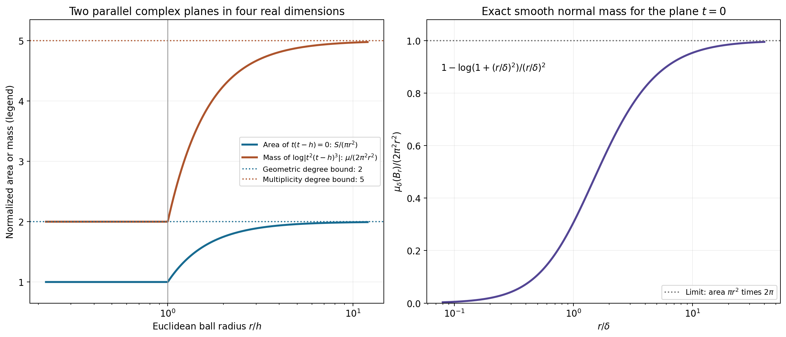
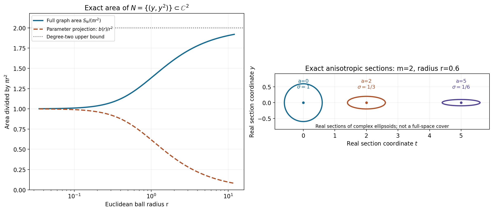

# Learning the surface representation theorem

The theorem replaces a neighborhood of the characteristic set by the set itself. A repeated factor contributes derivatives of the test transform and therefore polynomial amplitudes in the solution. The formal proof keeps three separate quantities: actual Euclidean surface area, all normal multiplicity jets, and a polynomial loss in the surface density norm.

Read [SR1–SR8, the complete proof](../AN02-L152.html#complete-proof). In its convention the forward test transform is \(F_v(z)=v(e^{-ix\cdot z})\), so the solution integral uses \(F_v(-z)\). The physical dual of a test weight \(k\) is \(B_{2,1/\check k}^{\mathrm{loc}}\), with \(\check k(\xi)=k(-\xi)\).

## Worked example 1. Two parallel complex planes and multiplicity

In \(\mathbb C^2\), let \(A(t,y)=t(t-h)\), \(h>0\). The zero set is the disjoint union of the complex planes \(t=0\) and \(t=h\). In a ball of radius \(r\) centered at zero, the first plane cuts out a complex disk of area \(\pi r^2\); the second cuts out a disk of squared radius \(r^2-h^2\) when \(r>h\). Consequently
\[
S_A(r)=\pi r^2+\pi(r^2-h^2)_+,\qquad
\frac{S_A(r)}{\pi r^2}
=1+(1-h^2/r^2)_+\le2.
\tag{L152.1}
\]
This is the degree-two area bound with its exact coefficient. For \(r<h\) the normalized area is one; after the second plane enters it increases to two.

Now take \(B=t^2(t-h)^3\). The geometric zero set and its unweighted area are unchanged. The logarithmic Laplacian counts local multiplicity, however:
\[
\frac{\Delta\log|B|(B(0,r))}{2\pi^2r^2}
=2+3(1-h^2/r^2)_+\le5=\deg B .
\tag{L152.2}
\]
The first plane has multiplicity two and the second three. The actual source convention integrates geometric area on regular-power charts; it does not replace that area by the multiplicity-counted current.

For the single plane \(t=0\), direct normal-kernel integration in the four-real-dimensional ball gives
\[
\int_{B(0,r)}
 \Delta\!\left(\tfrac12\log(|t|^2+\delta^2)\right)dV
=2\pi^2\left[r^2-\delta^2
                     \log(1+r^2/\delta^2)\right].
\tag{L152.3}
\]
Indeed the slice at \(|t|=\rho\) has \(y\)-area \(\pi(r^2-\rho^2)\). Multiply it by the kernel \(2\delta^2/(\rho^2+\delta^2)^2\), integrate \(2\pi\rho\,d\rho\), and substitute \(s=\rho^2\). The integral becomes
\(2\pi^2\delta^2\int_0^{r^2}(r^2-s)/(s+\delta^2)^2\,ds\), which evaluates to L152.3. As \(\delta\to0\), it tends to \(2\pi\) times the plane area. This checks the normalizations in SR10–SR13.

**Figure SR-A.** The left panel gives the exact degree-two geometric area ratio and the degree-five multiplicity-counted logarithmic mass for these two planes. The right panel shows the exact normalized mass L152.3 against \(r/\delta\). Both axes describe complete Euclidean-ball quantities in four real dimensions, rather than the area of a drawn real slice.

## Worked example 2. Anisotropic scaling at a collision

Let \(Q(t,y)=t^2-y\), \(m=2\), and center at \(\theta=(a,b)\in\mathbb C^2\). Set
\(\sigma=(1+\sqrt{|a|^2+|b|^2})^{-1}\). The transformed polynomial is
\[
Q_\theta(w_1,w_2)=
(a^2-b)+2aw_1+w_1^2-\sigma w_2,\qquad
\widetilde Q_\theta(0)^2
=|a^2-b|^2+4|a|^2+4+\sigma^2.
\tag{L152.4}
\]
The mixed-variable derivative has size \(\sigma\le1\), even when the center is large. The coefficient of \(w_1^2\) stays one. Thus Cauchy's estimate bounds the pure derivatives by the disk supremum, and that supremum is at least one. These are the two ingredients in the uniform local-division hypothesis.

The reduced discriminant is \(R(y)=4y\). In the scaled coordinates,
\[
R_\theta(w_2)=4(b+\sigma w_2),\qquad
\widetilde R_\theta(0)=4\sqrt{|b|^2+\sigma^2}\ge4\sigma.
\tag{L152.5}
\]
At \(b=0\) its point value vanishes, while its derivative strength is \(4\sigma>0\). A release criterion or proof using only \(|R_\theta(0)|\) would miss precisely this collision.

The covering ellipsoid has equation
\[
|t-a|^2+(1+|\theta|)^2|y-b|^2<r^2.
\tag{L152.6}
\]
Its ordinary volume is \((\pi^2/2)r^4\sigma^2\), not the volume of an ordinary radius-\(r\) ball. The cover in SR4 controls overlap by comparing these shrinking volumes locally, rather than assuming a fixed minimum volume over all of space.

For this \(m=2,n=2\), the explicit formal exponent is \(E=30\) and \(K=36\). The actual discriminant degree here is one; SR6 deliberately uses a uniform degree bound and is not claiming the best loss for this example.

## Worked example 3. A repeated characteristic point and a complex direction

In one physical dimension take \(P(\zeta)=(\zeta-\lambda)^3\), where \(\lambda=1+\frac i2\). The surface is the single point \(\{\lambda\}\), with counting measure. Let
\[
u(x)=(A+Bx+Cx^2)e^{i\lambda x},\qquad
\tau=1+i,\quad A=1,\ B=2-i,\ C=-\tfrac i2 .
\tag{L152.7}
\]
Since
\((D-\lambda)[p(x)e^{i\lambda x}]=-ip'(x)e^{i\lambda x}\),
three applications kill every quadratic \(p\).
The surface representation is exact with
\[
U^0(\lambda)=A,\qquad
U^1(\lambda)=B/\tau,\qquad
U^2(\lambda)=C/\tau^2,
\quad
u(x)=\sum_{a=0}^2(x\tau)^a U^a(\lambda)e^{i\lambda x}.
\tag{L152.8}
\]
All weighted density norms are finite because there are only three values at one point.

The forward transform signs can be checked without symmetry assumptions:
\[
F_v^{(a)}(-\lambda)
=v((-ix)^ae^{i\lambda x}),\qquad
u(v)=A F_v(-\lambda)+iB F_v'(-\lambda)-C F_v''(-\lambda).
\tag{L152.9}
\]
For \(k(\xi)=\sqrt{1+(\xi-1)^2}\), the shift inequality follows from the norm triangle inequality: \(k(\xi+h)\le k(\xi)+|h|\le(1+|h|)k(\xi)\). Its reflected reciprocal is
\(1/\check k(\xi)=1/\sqrt{1+(\xi+1)^2}\), which differs from \(1/k\). The reflection in the theorem cannot be removed merely because the counting-measure example is finite.

## Worked example 4. A continuous surface density for a repeated curved factor

In two physical dimensions let
\[
P(\zeta)=(\zeta_2-\zeta_1^2)^2,\qquad
N=\{(y,y^2):y\in\mathbb C\},\qquad \tau=(1,0).
\tag{L152.10}
\]
The highest-degree part is \(\zeta_1^4\), so this direction is noncharacteristic. The irreducible factor has multiplicity two. The graph's full real area density is \(J(y)=1+4|y|^2\), since its complex derivative is \(2y\). For \(\beta=\frac12+\frac i4\), \(s>0\), and any complex \(\alpha\), define
\[
U^0(y,y^2)=\frac{\mathbf1_{\{|y-\beta|<s\}}}{\pi s^2J(y)},
\qquad
U^1(y,y^2)=\alpha U^0(y,y^2).
\tag{L152.11}
\]
Testing or evaluating these compact surface integrals gives
\[
\int_NU^0(\zeta)e^{ix\cdot\zeta}\,dS(\zeta)
=\frac1{\pi s^2}\int_{|y-\beta|<s}
                   e^{i(x_1y+x_2y^2)}\,dA(y)
=e^{i(x_1\beta+x_2\beta^2)} .
\tag{L152.12}
\]
The last equality is the complex disk mean identity: expand the entire integrand about \(\beta\); every positive power of \(y-\beta\) has angular integral zero, and the constant integrates to \(\pi s^2\). Uniform convergence on the compact disk justifies termwise integration.
Thus the two densities give
\[
u(x)=(1+\alpha x_1)e^{i(x_1\beta+x_2\beta^2)} .
\tag{L152.13}
\]
For the single factor \(L(D)=D_2-D_1^2\),
\(L(D)[x_1e^{ix\cdot(\beta,\beta^2)}]=2i\beta e^{ix\cdot(\beta,\beta^2)}\).
This is nonzero when \(\beta\ne0\), whereas \(L(D)^2\) kills it. The degree-one amplitude therefore displays the actual repeated-factor phenomenon. Each individual surface kernel in the integral has the same annihilation property.

These densities have finite SR4 norm for any continuous finite \(\phi\), since their support is compact and \(J\ge1\). The surface measure cannot be omitted from their definition: division by \(J\) compensates precisely for its full metric area.

The area of this graph inside an ordinary radius-\(r\) ball about zero is also explicit. Set \(b(r)=(\sqrt{1+4r^2}-1)/2\), so \(|y|^2<b(r)\). Polar integration gives
\[
S_N(r)=\pi[b(r)+2b(r)^2]
       =\pi[2r^2-b(r)],\qquad
\frac{S_N(r)}{\pi r^2}=2-\frac{b(r)}{r^2}\le2 .
\tag{L152.14}
\]
The parameter-disk projection has area \(\pi b(r)\); the actual surface has the extra derivative term \(2\pi b(r)^2\). The normalized area tends to one at small scales and to its degree bound two at large scales.

**Figure SR-B.** The left panel compares the exact full graph area in L152.14 with its parameter-plane projection. The right panel draws explicitly labeled real-coordinate sections \(t-a\in\mathbb R,\ y-b\in\mathbb R\) of the exact complex ellipsoids L152.6 for \(m=2\); their shrinking transverse axes are prescribed by \(\sigma_\theta\). The plane section is not an ambient realization of the four-dimensional metric.

## Exercises with complete solutions

**Exercise 1.** Compute the area of the complex affine plane \(t=\gamma y\) inside \(B(0,r)\subset\mathbb C^2\). Does its slope change the degree-one bound?

**Solution 1.** The parameter region is \((1+|\gamma|^2)|y|^2<r^2\), and the real graph area density is \(1+|\gamma|^2\). The integral is
\((1+|\gamma|^2)\pi r^2/(1+|\gamma|^2)=\pi r^2\).
Thus it attains the degree-one bound at every slope. Using only the projected disk would give the smaller and incorrect full area \(\pi r^2/(1+|\gamma|^2)\).

**Exercise 2.** Differentiate the area ratios in Examples 1 and 4 and prove their monotonicity, including the transition \(r=h\).

**Solution 2.** The first ratio is constant one for \(r\le h\); for \(r>h\) its derivative is \(2h^2/r^3>0\), and both formulas agree at \(h\). For the curved graph use \(r^2=b+b^2\), so its ratio is
\((1+2b)/(1+b)=2-1/(1+b)\). Since \(b'(r)=2r/\sqrt{1+4r^2}>0\), its derivative is \(b'(r)/(1+b)^2>0\). Its limits are one and two.

**Exercise 3.** Why can the area proof pass to the open-ball mass without proving zero boundary mass?

**Solution 3.** For every smooth compact \(0\le\psi\le1\) inside that ball, the regularized mass bounds \(\int\psi\,\Delta q_\epsilon\). Distributional convergence passes the same bound to \(\int\psi\,d\mu\). Positive-measure inner regularity, equivalently an increasing sequence of such cutoffs exhausting the ball, identifies their supremum with \(\mu(B)\). No indicator is tested directly against a weak limit, so boundary atoms cause no gap.

**Exercise 4.** Verify the derivative strength in Example 2 and the discriminant lower bound at \(b=0\).

**Solution 4.** The only nonzero derivatives of \(Q_\theta\) at zero are its value \(a^2-b\), first derivatives \(2a,-\sigma\), and second derivative \(\partial_{w_1}^2Q_\theta=2\). Their squared absolute values sum to L152.4. The transformed discriminant has value \(4b\) and derivative \(4\sigma\); its strength is L152.5. At \(b=0\), strength \(4\sigma\) remains positive for every finite center, even though the point value is zero.

**Exercise 5.** Derive SR6 when \(m=2,n=2\), and identify each additional power of \(W\) after the local-remainder estimate.

**Solution 5.** The three terms in \(E\) are \(16,12,2\), hence \(E=30\). Squared cutoff derivatives give \(W^{m-1}=W\), polynomial strength gives \(W^m=W^2\), and inverse curvature is bounded by \(W\). This is \(W^4=W^{2m}\). Comparing the weight at an integration point with the surface-data point gives \(W^2\), so \(K=30+4+2=36\). The constants and this loose power are uniform; this does not establish an optimal derivative loss.

**Exercise 6.** Give the safe-circle division estimate when \(q(t)=t^m\) and the evaluation point is \(t=0\). Why is evaluation of \(1/q(0)\) unnecessary?

**Solution 6.** If \(b=qg\) with \(g\) holomorphic on a disk of radius \(c/4\), choose any circle with radius \(r\in(c/8,c/4)\). On it \(|q|=r^m\), and Cauchy's formula gives
\(|g(0)|\le r^{-m}\sup_{|t|=r}|b(t)|\).
The center may be a multiple zero. Holomorphic divisibility is already known from the two local decompositions; the integral uses only nonzero boundary values of \(q\).

**Exercise 7.** Check the signs in the global correction SR30–SR36.

**Solution 7.** From \(F=H+\mathcal QG\) and \(\bar\partial F=0\) we get
\(\bar\partial H=-\mathcal Q\bar\partial G\).
Set \(f=-\bar\partial G\). Expanding
\(\sum_{\mu,\nu}\chi_\mu(g_\mu-g_\nu)\bar\partial\chi_\nu\)
leaves \(-\sum_\nu g_\nu\bar\partial\chi_\nu\), because \(\sum\bar\partial\chi_\nu=0\) and \(\sum\chi_\mu=1\). This is \(f\). If \(\bar\partial w=f\), then
\(\bar\partial(H-\mathcal Qw)=\mathcal Qf-\mathcal Qf=0\) and
\(\bar\partial(G+w)=-f+f=0\). The displayed signs are therefore required.

**Exercise 8.** Explain why \(P(D)u=0\) can annihilate the repaired divisible part even though its inverse quotient is initially a compact distribution.

**Solution 8.** First prove the repaired transform has exponential type of \(K_{j+1}\), and hence a compact inverse \(v_{2,j}\in B_{2,k}\). Full entire division gives a compact inverse \(a_j\) of the quotient. Smooth \(a_j\) by a normalized compact mollifier. Then \(P(-D)(a_j*\rho_\epsilon)\) is an ordinary compact smooth test, so its action under \(u\) is zero. It equals a constant multiple of \(v_{2,j}*\rho_\epsilon\). Their weighted Fourier transforms converge by dominated convergence with the bounded multipliers \(\widehat\rho(\epsilon\xi)\to1\), and their supports lie in one fixed compact stage. Continuity of the canonical pairing passes zero to the repaired part. One never pairs two arbitrary distributions directly.

**Exercise 9.** Recover the density normalization in Example 3 for an arbitrary nonzero complex \(\tau\).

**Solution 9.** The algebraic identity
\((x\tau)^a(c_a/\tau^a)=c_ax^a\)
gives the surface densities. To check against the unit direction in the proof, \(e=\tau/|\tau|\) and
\(\partial_e^aF_v(-\lambda)=e^a(-i)^a v(x^ae^{i\lambda x})\).
The intermediate coefficient is \(B^a=i^ae^{-a}c_a\), where \(e^{-a}\) is the reciprocal power of the unit complex number \(e\). The final coefficient is
\((-i)^a|\tau|^{-a}B^a=c_a/\tau^a\).
Thus neither the phase of the complex direction nor the forward-transform sign is dropped.

**Exercise 10.** Compute the unweighted squared surface-density norm of Example 4 at \(\beta=0\), and explain why the theorem does not promise absolute pointwise convergence for all of its densities.

**Solution 10.** With \(J=1+4|y|^2\) and \(dS=JdA\),
\[
\int_N|U^0|^2dS
=\frac1{\pi^2s^4}\int_{|y|<s}\frac{dA(y)}{1+4|y|^2}
=\frac{\log(1+4s^2)}{4\pi s^4}.
\tag{L152.15}
\]
The radial integral is
\(2\pi\int_0^s r/(1+4r^2)\,dr=\frac\pi4\log(1+4s^2)\).
The two-density norm is multiplied by \(1+|\alpha|^2\).
These particular compact densities give pointwise integrals. In the full theorem only the weighted squared density and the weighted jet norm of each compact smooth test are controlled. Their Cauchy–Schwarz estimate proves absolute convergence of the tested integral. A fixed pointwise exponential need not have finite complementary surface norm on the entire unbounded variety, so that estimate cannot be applied to it without further evidence.

The computational checks independently integrate the normal kernel and graph areas, compute transformed coefficients and discriminants, integrate actual curved-surface kernels, verify repeated-operator identities and check the complex-direction/Fourier factors. They supplement the complete proof and do not stand in for it.

## Complete proof

*Original proof exposition by GPT-6.1 Sol (OpenAI), Ultra, October 2026. CC0 1.0.*

We represent a solution of a constant-coefficient equation by integrals over its actual characteristic hypersurfaces. Repeated factors require polynomial amplitudes. We prove the area bound, the anisotropic cover, the local division estimates, the global holomorphic repair and the compact-support argument needed for this conclusion.

Use \(D=-i\partial_x\), complex-linear distribution pairings and
\[
F_v(z)=v(e^{-ix\cdot z}),\qquad
\check k(\xi)=k(-\xi),\qquad W(z)=1+|z|^2 .
\tag{SR1}
\]
The dot product in an exponential or in \(x\cdot\tau\) is bilinear. A shift weight \(k\) is positive and satisfies \(k(\xi+h)\le(1+C|h|)^N k(\xi)\). In particular both \(k\) and its reciprocal have polynomial bounds, and \(\log k\) is Lipschitz. The compact test space \(E_k(X)=B_{2,k}\cap\mathcal E'(X)\) has its compact-support-stage inductive topology. Its canonical bilinear dual is \(B_{2,1/\check k}^{\mathrm{loc}}(X)\).

Our complete lower inputs are [L151 H2–H6, local Hermite division](../AN02-L151.html#h2-the-exact-local-division-theorem), [L147 GD4, locally integrable holomorphic logarithms](../AN02-L147.html#gd4-scalar-holomorphic-logarithms-are-proper-psh-and-locally-integrable), [L131 NP2–NP3 and NP5, positive Laplacian measures and harmonic regularity](../AN02-L131.html#np5-a-direct-harmonic-smoothing-argument), [L149 PW1–PW11, weights with their actual finite stages](../AN02-L149.html#complete-proof), [L150 NV2, NV4 and NV7, smooth polynomial strength, nonsmooth weighted existence and compact annihilation](../AN02-L150.html#nv4-a-strict-estimate-for-a-nonsmooth-weight), [L122 CF2.1–CF4.1, compact Fourier support and entire division](../AN02-L122.html#complete-formal-proof-compact-fourier-division-and-multiplicity-sensitive-annihilators), and [L043, complex Hilbert representation](../AN02-L043.html#a-representing-vector-in-hilbert-space). Each extra geometric and covering estimate used below is proved here.

## SR1. The exact surface theorem

**Theorem SR1.** Let \(X\subset\mathbb R^n\) be open and convex, \(n\ge1\), and let \(u\in B_{2,1/\check k}^{\mathrm{loc}}(X)\) satisfy \(P(D)u=0\). For nonconstant \(P\), factor it as
\[
P=c_P\prod_{j=1}^s P_j^{m_j},\qquad
d_j=\deg P_j,\quad m=\deg P=\sum_jm_jd_j,\quad
P_m(\tau)\ne0,\quad \tau\in\mathbb C^n.
\tag{SR2}
\]
The \(P_j\) are distinct irreducible nonconstant polynomials. Let \(N_j=\{P_j=0\}\). On a hypersurface, \(dS_j\) is its Euclidean real \(2n-2\) dimensional area on its smooth local reduced graph charts, extended by zero to the remaining points. Equivalently use the regular-power locus: near such a point a defining polynomial is a nonvanishing factor times a power of a holomorphic defining function with nonzero differential. This is the surface measure in the source theorem. In dimension one it is counting measure at distinct points.

There is a finite real locally Lipschitz PSH function \(\phi\) satisfying
\[
\begin{aligned}
e^{-\phi(\xi+i\eta)}&\le C_L e^{-H_L(\eta)}k(\xi)
&& (L\Subset X\text{ compact convex}),\\
k(\xi)&\le C_Ae^{-\phi(\xi+i\eta)}
&& (|\eta|<A),\\
|\nabla\phi(\xi+i\eta)|&\le C_0+\log(1+|\eta|)
&&\text{almost everywhere},\\
\mathcal L_\phi(w)&\ge c(1+|\eta|^2)^{-3/4}|w|^2
&&\text{distributionally},
\end{aligned}
\tag{SR3}
\]
and measurable \(U_j^a\) on \(N_j\), \(0\le a<m_j\), for which
\[
\sum_j\sum_{a<m_j}
\int_{N_j}|U_j^a(z)|^2 e^{2\phi(-z)}W(z)^{-K}\,dS_j(z)<\infty ,
\tag{SR4}
\]
and
\[
u(x)=\sum_j\sum_{a<m_j}(x\cdot\tau)^a
           \int_{N_j}U_j^a(z)e^{ix\cdot z}\,dS_j(z).
\tag{SR5}
\]
Here SR5 means distributional testing with every \(v\in C_c^\infty(X)\); the corresponding integrals of the tested kernels converge absolutely. It need not give an absolutely convergent pointwise integral.

One admissible, deliberately nonoptimal, integer depending only on \(n,m\) is
\[
E=m^4+m^2(2m-1)(m-1)+(m-1)(2n-2),\qquad
K=E+2m+2.
\tag{SR6}
\]
Constants in the proof may depend on the polynomial, the direction, the weight and the solution; the exponent \(K\) does not. Every exponential-polynomial kernel in SR5 itself solves \(P(D)h=0\).

We first prove the geometric estimates, then construct the representation. No tube density is substituted for a surface density.

## SR2. An exact algebraic area bound

Write \(b_{2n-2}=\pi^{n-1}/(n-1)!\), with \(b_0=1\). For any nonzero polynomial \(A\) of degree \(d\) and its regular-power zero locus \(Z_A\),
\[
\int_{Z_A\cap B(z,r)}dS\le b_{2n-2}\,d\,r^{2n-2}.
\tag{SR7}
\]
In particular, for \(A=P_j\), this gives the exact degree bound required for each \(N_j\).

Put \(q_\epsilon=\frac12\log(|A|^2+\epsilon^2)\). Its complex Hessian is positive: differentiation gives
\(\partial_l\bar\partial_h q_\epsilon=\epsilon^2 A_l\overline{A_h}/[2(|A|^2+\epsilon^2)^2]\).
It decreases locally in \(L^1\) to \(\log|A|\), as proved in L147 GD4. Thus \(\Delta q_\epsilon\) tends distributionally to the positive locally finite measure \(\mu=\Delta\log|A|\). We will bound that measure and compare its mass with area on regular charts.

Translate the center to zero and let \(M_\epsilon(r)\) be the spherical average of \(q_\epsilon(r\theta)\) over the unit sphere in \(\mathbb C^n\). Its function of logarithmic radius,
\[
s\longmapsto M_\epsilon(e^s),
\tag{SR8}
\]
is convex. Indeed, for each unit \(\theta\), the restriction \(w\mapsto q_\epsilon(w\theta)\) is smooth subharmonic in the complex plane. Its circle mean \(a_\theta(r)\) satisfies
\[
\frac{d^2}{ds^2}a_\theta(e^s)
=\frac{r^2}{2\pi}\int_0^{2\pi}
       \Delta_{\mathbb R^2}[q_\epsilon(w\theta)]_{w=re^{it}}\,dt\ge0.
\tag{SR9}
\]
This follows by differentiating the circle mean twice and integrating the angular second derivative to zero. Averaging \(a_\theta(r)\) over \(\theta\) is exactly \(M_\epsilon(r)\), since multiplication of \(\theta\) by any unit complex number preserves spherical measure. This proves SR8 without a unitary-group averaging theorem.

For \(r\ge1\), polynomial growth gives \(M_\epsilon(r)\le d\log r+C_\epsilon\). The derivative of a differentiable convex function bounded above by \(ds+C_\epsilon\) on a right half-line is at most \(d\): a derivative greater than \(d\) at one point supplies a tangent line contradicting that upper bound at large \(s\). The divergence theorem therefore yields
\[
\begin{aligned}
\int_{B(0,r)}\Delta q_\epsilon\,dV
&=|S^{2n-1}|\,r^{2n-1}M_\epsilon'(r)\\
&\le |S^{2n-1}|\,d\,r^{2n-2}
 =2\pi b_{2n-2}\,d\,r^{2n-2}.
\end{aligned}
\tag{SR10}
\]
The sphere constant follows from polar integration of the Gaussian:
\(\int_{\mathbb R^{2n}}e^{-|x|^2}dx=\pi^n\) and
\(\int_0^\infty e^{-r^2}r^{2n-1}dr=(n-1)!/2\).
The latter is obtained by substitution \(s=r^2\) and \(n-1\) integrations by parts.

For any \(0\le\psi\le1\) smooth and compactly supported inside \(B(0,r)\), distributional convergence passes SR10 to \(\int\psi\,d\mu\). Exhaust the open ball by such cutoffs and apply monotone convergence, or the inner regularity of the positive Radon measure, to get
\[
\mu(B(0,r))\le2\pi b_{2n-2}\,d\,r^{2n-2}.
\tag{SR11}
\]
This step does not assume that ball boundaries have zero mass.

Here is the precise area comparison. At a regular-power point choose unitary coordinates \((t,y)\) in which the zero set is \(t=a(y)\), and write \(A=g(t,y)(t-a(y))^\ell\), \(g\ne0\). The graph exists, for example, by an isolating circle and the first root power sum: the unique small reduced root equals its contour power sum and is holomorphic in \(y\); uniqueness and division give the nonvanishing factor. This is the local contour construction in L045 and L151 H4, and also proves the local implicit graph claim. A local holomorphic logarithm of \(g\), obtained by its convergent logarithm series after shrinking the neighborhood, has harmonic real part. Hence
\(\Delta\log|A|=\ell\,\Delta\log|t-a(y)|\) there.

For \(h=t-a(y)\), direct differentiation gives
\[
\Delta\left(\tfrac12\log(|h|^2+\delta^2)\right)
=\frac{2\delta^2(1+\sum_l|a_{y_l}|^2)}
              {( |t-a(y)|^2+\delta^2)^2}.
\tag{SR12}
\]
The real change \((t,y)\mapsto(t-a(y),y)\) has determinant one. In the normal complex variable the kernel \(2\delta^2/(|w|^2+\delta^2)^2\) has total mass \(2\pi\), by polar integration, and its mass outside any fixed disk tends to zero. Testing SR12 and using this approximate identity proves
\[
\Delta\log|h|=2\pi(1+|a'(y)|^2)\,dV_y
                 \quad\hbox{on the graph}.
\tag{SR13}
\]
For completeness, the real graph derivative has Gram matrix \(I+Da^{\mathsf T}Da\). Holomorphicity makes the two nonzero singular values of \(Da\) equal to \(|a'|\): the real matrix of a complex row has two orthogonal rows of squared norm \(|a'|^2\). Thus the square root of that Gram determinant is \(1+|a'|^2\). Consequently SR13 is exactly \(2\pi\,dS\), and \(\mu=2\pi\ell\,dS\) on this chart.

There are countably many such charts because Euclidean space has a countable base. A disjoint measurable partition subordinate to them makes their local identities additive. Since \(\ell\ge1\) and \(\mu\) is positive also on the complement, \(\mu\ge2\pi\,dS\) on \(Z_A\). Combine this with SR11 to prove SR7. No unproved assertion about the Hausdorff measure of the singular locus is needed: the surface measure being used was defined on the regular-power charts. For \(n=1\), the same computation is the usual \(2\pi\ell\) atom at an isolated zero, and SR7 counts at most \(d\) distinct zeros.

## SR3. Normalize the direction and obtain uniform local remainders

Let \(e=\tau/|\tau|\) and choose unitary complex coordinates \(z=T(t,y)\) whose first column is \(e\). The weight and its imaginary part remain in the original variables \(z\); we do not assume that a complex unitary change preserves the real physical space or \(\operatorname{Im}z\). All distances, volumes and surface areas are preserved by this frequency-coordinate change.

Because \(P_m(e)\ne0\), every highest-degree part \((P_j)_{d_j}(e)\) is nonzero. Normalize the factors of \(P(-T(t,y))\) by their nonzero leading \(t\)-coefficients to write a monic polynomial
\[
Q(t,y)=\prod_j Q_j(t,y)^{m_j},\qquad
Q_j\text{ monic of degree }d_j\text{ in }t,\qquad
Q=c\,P(-T(t,y)).
\tag{SR14}
\]
Every coefficient of \(t^\ell\) has \(y\)-degree at most \(m-\ell\). In characteristic zero the monic reduced product \(Q_*=\prod_jQ_j\) is squarefree over the fraction field \(\mathbb C(y)\): an irreducible factor cannot divide its nonzero \(t\)-derivative of smaller \(t\)-degree, and distinct factors remain relatively prime there by clearing denominators and polynomial unique factorization. Thus its usual monic discriminant \(R(y)\) is not identically zero. The Sylvester determinant gives
\[
d:=\deg R\le m(2m-1).
\tag{SR15}
\]

For a center \(\theta\) in these coordinates set
\[
\sigma_\theta=(1+|\theta|)^{1-m},\qquad
A_\theta=\operatorname{diag}(1,\sigma_\theta,\ldots,\sigma_\theta),
\qquad B_r(\theta)=\theta+A_\theta B(0,r).
\tag{SR16}
\]
The ball on the right is a complex Euclidean ball. Put
\(Q_\theta(w)=Q(\theta_1+w_1,\theta'+\sigma_\theta w')\).
Its leading \(w_1^m\)-coefficient is one. For \(|\alpha'|\ge1\), polynomial differentiation and the factor \(\sigma_\theta^{|\alpha'|}\) bound \(|\partial^\alpha Q_\theta(0)|\) uniformly in \(\theta\): its possible power of \(1+|\theta|\) is
\(m-|\alpha_1|-m|\alpha'|\le0\).
The pure \(w_1\)-derivatives are at most their factorials times
\(\sup_{|w_1|<1}|Q_\theta(w_1,0)|\), by Cauchy's estimate. This supremum is at least one by the monic leading coefficient. Hence the hypothesis H10 of L151 holds with one fixed constant depending on \(Q,n,m\).

Also \(\widetilde Q_\theta(0)\le C_Q(1+|\theta|)^m\). The discriminant of the reduced transformed product is \(R(\theta'+\sigma_\theta w')\), because translating all \(t\)-roots does not change their differences. A nonzero derivative of top total order \(d\) is a constant \(c_R\ne0\). Therefore its full derivative strength obeys
\[
\widetilde R_\theta(0)\ge |c_R|\sigma_\theta^d
=|c_R|(1+|\theta|)^{-d(m-1)}.
\tag{SR17}
\]
This remains valid for constant \(R\), including \(n=1\).

Apply the complete division theorem L151 H2 to
\(F(T(\theta+A_\theta w))\). With one uniform \(0<c<1/4\), it gives
\[
F(Tz)=Q(z)g_\theta(z)+h_\theta(z)\quad(z\in B_c(\theta)),
\tag{SR18}
\]
where \(g_\theta,h_\theta\) are holomorphic there. The surface scaling of \(A_\theta\) has every singular value at least \(\sigma_\theta\); thus its \(2n-2\) dimensional area factor is at least \(\sigma_\theta^{2n-2}\). Combining this with L151 H13, its admissible exponent \(m^3\), SR15–SR17, and \(\max m_j-\frac12\le m\), proves
\[
H_\theta:=\sup_{B_c(\theta)}|h_\theta|
\le C(1+|\theta|)^E
   \sum_j\sum_{a<m_j}
   \int_{\widetilde N_j\cap B_1(\theta)}
          |\partial_t^a[F(Tz)]|\,dS_j(z),
\tag{SR19}
\]
where \(\widetilde N_j=T^{-1}(-N_j)\) and \(E\) is SR6. The estimate remains true if its actual local degree or multiplicity is smaller. In particular the remainder is zero when all these surface pieces are empty.

Because \(B_1(\theta)\) is contained in the ordinary unit Euclidean ball, SR7 and Cauchy–Schwarz give
\[
H_\theta^2\le C W(\theta)^E J_\theta(F),\qquad
J_\theta(F)=\sum_j\sum_{a<m_j}
 \int_{\widetilde N_j\cap B_1(\theta)}
       |\partial_t^a[F(Tz)]|^2\,dS_j(z).
\tag{SR20}
\]
Indeed the total area counted with these multiplicities is at most
\(b_{2n-2}\sum_jm_jd_j=b_{2n-2}m\). This proves the square estimate without a uniform bound on the coefficients of \(F\).

## SR4. A full anisotropic cover and partition

Here is a concrete covering argument. Let \(L_0=3^{m-1}\) and choose
\(a=c/[16(1+L_0)]\).
Enumerate the rational points of \(\mathbb R^{2n}\). At each point include its open ball \(B_a(\theta)\) if it is disjoint from all previously included balls; otherwise omit it. The resulting balls are disjoint. If two such radius-\(a\) balls intersect, their centers have ordinary distance below \(2a\), so their \(1+|\theta|\) ratios lie between \(1/(1+2a)\) and \(1+2a\); their \(\sigma\)-ratios are between \(L_0^{-1}\) and \(L_0\). The triangle inequality after applying \(A_\theta^{-1}\) then shows that the center of one lies in \(B_{a(1+L_0)}(\theta)\) about the other.

Every enumerated rational point therefore lies in one of these enlarged balls. On any fixed ordinary compact set, the centers under consideration lie in a bounded set; their disjoint small balls have a common positive lower volume there. Only finitely many of them can occur, by packing in an ordinary larger bounded set. Approximating any point by rational points and taking a recurring one of those finitely many centers gives membership in a closed enlarged ball. The strictly larger \(B_{c/4}(\theta_\nu)\) therefore cover all of \(\mathbb C^n\), and the family is locally finite.

There is a uniform bound on the overlap of the \(B_1(\theta_\nu)\). If \(z\) belongs to such a ball, \(|z-\theta_\nu|<1\), so with \(L_1=2^{m-1}\) the \(\sigma\)-ratio lies between \(L_1^{-1}\) and \(L_1\). Every disjoint inner \(B_a(\theta_\nu)\) for these centers lies in
\(z+A_z B(0,L_1(1+a))\), and has volume at least
\(b_{2n}a^{2n}L_1^{-(2n-2)}\sigma_z^{2n-2}\).
Comparing volumes bounds the number by the finite integer
\[
N_*=\left\lceil
 \left(\frac{L_1(1+a)}a\right)^{2n}L_1^{2n-2}
\right\rceil.
\tag{SR21}
\]

Choose a nonnegative smooth function \(\beta\) equal to one on the closed ball of radius \(c/4\), and supported in the open ball of radius \(c/2\). Such a function is obtained from the usual \(e^{-1/s}\) smooth step, with all derivatives zero at its endpoints. Set
\[
\beta_\nu(z)=\beta(A_{\theta_\nu}^{-1}(z-\theta_\nu)),
\quad S(z)=\sum_\nu\beta_\nu(z),\quad
\chi_\nu=\beta_\nu/S .
\tag{SR22}
\]
The sums are locally finite, \(S\ge1\), and at most \(N_*\) terms are active. Differentiating the quotient and using the local \(\sigma\)-comparisons just proved yields
\[
\sum_\nu\chi_\nu=1,\quad
\operatorname{supp}\chi_\nu\subset B_{c/2}(\theta_\nu),\quad
|\partial_t\chi_\nu|
 +\sigma_{\theta_\nu}|\partial_{y_l}\chi_\nu|\le C.
\tag{SR23}
\]
The same estimate holds for real derivatives and conjugate derivatives. Thus
\(|\bar\partial\chi_\nu(z)|\le C(1+|z|)^{m-1}\) on its support.

## SR5. Uniform division on every overlap

If \(z\) belongs to both inner balls, the \(t\)-disk centered at \(z\), with the \(y\)-coordinate fixed and radius \(c/4\), lies in both outer \(B_c\)-balls. On their intersection,
\[
h_{\theta_\nu}-h_{\theta_\mu}
       =Q(g_{\theta_\mu}-g_{\theta_\nu}).
\tag{SR24}
\]
The quotient on the right is already holomorphic, including at the zeros of \(Q\).

For any monic degree-\(m\) polynomial \(q(t)\) and any center \(t_0\), one can choose \(r\in[c/8,c/4]\) such that its circle stays a fixed distance \(\delta>0\) from all its roots, where \(\delta\) depends only on \(c,m\). In fact remove from this radius interval the intervals of length \(2\delta\) about the at most \(m\) numbers \(|\alpha-t_0|\), with \(\delta=c/[64(m+1)]\). Their total length is less than the interval length. Choose a radius outside them. The reverse triangle inequality gives \(|t-\alpha|\ge\delta\) on that circle, so \(|q(t)|\ge\delta^m\). The circle can be chosen strictly inside the allowed interval if necessary.

The Cauchy formula for the holomorphic quotient in SR24 therefore proves, at every such overlap point,
\[
|g_{\theta_\mu}(z)-g_{\theta_\nu}(z)|
\le\delta^{-m}(H_{\theta_\nu}+H_{\theta_\mu}).
\tag{SR25}
\]
This supplies the needed division estimate directly. It does not use a pointwise lower bound on \(Q(z)\) at the overlap point.

## SR6. Repair the local remainders with one strict weight

Return all functions to the original frequency coordinates; unitary changes do not alter the estimates above. Let \(q(v)=|u(v)|\) on \(E_k(X)\), using its canonical continuous action. Apply the full L149 construction to this seminorm. Retain its specific stages \(\phi_j\uparrow\phi\), exhaustion \(K_j\Subset\operatorname{int}K_{j+1}\), and strip parameters \(A_j\), with \(\alpha_j\ge1/2\). They have the common gradient and curvature bounds SR3, the upper estimate
\[
\phi_j(\xi+i\eta)\le H_{K_{j+1}}(\eta)-\log k(\xi)+D_j,
\tag{SR26}
\]
the lower seed estimate
\(\phi_j\ge H_{K_j}(\eta)-\log k(\xi)-D'_j\),
and the actual domination
\[
\alpha_j q(w)\le
\left(\int_{|\eta|<A_j}|F_w(z)|^2e^{-2\phi_j(z)}\,dV(z)\right)^{1/2}
\quad(\operatorname{supp}w\subset K_{j+3}).
\tag{SR27}
\]
Using arbitrary stage weights without this support and seminorm information would not justify the next argument.

Let \(\mathcal Q(z)=Q(T^{-1}z)=cP(-z)\). For a fixed large parameter \(T_0\), define the smooth polynomial strength
\[
\mathcal J(z)^2=\sum_{|\gamma|\le m}
    |\partial_z^\gamma\mathcal Q(z)|^2
           (T_0^2+|\operatorname{Im}z|^2)^{|\gamma|}.
\tag{SR28}
\]
L150 NV2 proves positivity, \(|\mathcal Q|\le\mathcal J\), and the complex Hessian bound
\(\|\mathcal L_{\log\mathcal J}\|\le B(T_0^2+|\eta|^2)^{-1}\).
The same proof applies to these original coordinates. Choose \(T_0\) once so that this is at most half the common SR3 lower curvature; existence follows from the bound
\((1+|\eta|^2)^{3/4}/(T_0^2+|\eta|^2)\le 2^{3/4}T_0^{-1/2}\).
Then \(2(\phi_j-\log\mathcal J)\) is finite continuous PSH with Levi matrix at least \(c(1+|\eta|^2)^{-3/4}I\), uniformly in \(j\). Ordinary polynomial growth, keeping the decrease of degree after each derivative, also gives
\[
\mathcal J(z)^2\le C_{\mathcal Q,T_0}W(z)^m.
\tag{SR29}
\]
The scale factor in a jet of order \(|\gamma|\) contributes at most that same power \(|\gamma|\); its polynomial degree is at most \(m-|\gamma|\).

For \(v\in C_c^\infty(X)\), put \(F=F_v\), and use its local decompositions SR18. Define smooth locally finite sums
\[
H=\sum_\nu\chi_\nu h_\nu,\quad
G=\sum_\nu\chi_\nu g_\nu,\quad
F=H+\mathcal QG,\quad
f=-\bar\partial G
=\sum_{\mu,\nu}\chi_\mu(g_\mu-g_\nu)\bar\partial\chi_\nu .
\tag{SR30}
\]
The identity for \(f\) uses \(\sum\bar\partial\chi_\nu=0\); signs follow by expanding the double sum. In particular \(f\) is smooth and closed, with all apparent quotients removable. By SR20, SR23 and SR25,
\[
|H(z)|^2\le C\sum_{\nu:z\in B_{c/2}(\theta_\nu)}H_\nu^2,\qquad
|f(z)|^2\le C W(z)^{m-1}
             \sum_{\nu:z\in B_{c/2}(\theta_\nu)}H_\nu^2 .
\tag{SR31}
\]
The overlap bound absorbs both finite sums.

We record the complete weighted summation. If \(z\in B_{c/2}(\theta_\nu)\) and \(s\in B_1(\theta_\nu)\), then \(|z-s|<2\), and \(W(z),W(s),W(\theta_\nu)\) are comparable by fixed constants. The common gradient bound in SR3 gives
\[
e^{-2\phi_j(z)}\le C W(s)^2 e^{-2\phi_j(s)}.
\tag{SR32}
\]
To see this, integrate the local Lipschitz bound along the segment: its length is below two, and \(1+|\operatorname{Im}\zeta|\le3(1+|\operatorname{Im}s|)\) along it. Thus
\(|\phi_j(z)-\phi_j(s)|\le C+2\log(1+|\operatorname{Im}s|)\);
exponentiation gives SR32. The estimate holds for every segment by local Lipschitz continuity, including exceptional differentiability points.

The volume of each inner ellipsoid is at most that of a fixed ordinary unit ball. SR20, SR29–SR32 and the \(N_*\) overlap of the outer balls imply
\[
\begin{aligned}
\int |H|^2e^{-2\phi_j}\,dV&\le C\mathcal A_j(F),\\
\int |f|^2\mathcal J^2e^{-2\phi_j}
                       (1+|\eta|^2)^{3/4}\,dV
&\le C\mathcal A_j(F),\\
\mathcal A_j(F)&=
\sum_{\ell=1}^s\sum_{a<m_\ell}
 \int_{-N_\ell}
       |\partial_e^aF(s)|^2e^{-2\phi_j(s)}W(s)^K\,dS_\ell(s).
\end{aligned}
\tag{SR33}
\]
Here \(\ell\) labels factors and \(j\) labels stages; \(\partial_e=\sum_l e_l\partial_{z_l}\) is in the original coordinates. More explicitly, the squared cutoff bound contributes \(W^{m-1}\), strength contributes \(W^m\), and inverse curvature contributes at most \(W\). These give \(W^{2m}\); the squared local remainder contributes \(W^E\), and SR32 contributes \(W^2\). Hence \(K=E+2m+2\) suffices. Sum the local surface integrals last: each surface point is counted at most \(N_*\) times. This explains every exponent and all uses of overlap.

For any sufficiently large stage containing the support of \(v\) strictly inside \(K_j\), \(\mathcal A_j(F)\) is finite. Here are details of that assertion. Choose a compact convex carrier \(S\) and \(\rho>0\) with \(S+\rho\overline B\subset K_j\). Integration by parts in the real variables of each compact smooth function \((x\cdot e)^a v(x)\) gives, for every integer \(L\),
\[
|\partial_e^aF(\xi+i\eta)|
\le C_L(1+|\xi|)^{-2L}(1+|\eta|)^{2L} e^{H_S(\eta)} .
\tag{SR34}
\]
Apply \((1-\Delta_x)^L\) to the compact amplitude \(e^{x\cdot\eta}(x\cdot e)^av(x)\), getting denominator \((1+|\xi|^2)^L\). Its derivatives have order at most \(2L\) and give the displayed imaginary-frequency polynomial. The lower seed estimate, polynomial growth of \(k\), and \(H_{K_j}\ge H_S+\rho|\eta|\) now give arbitrary real-frequency decay, polynomial imaginary-frequency growth and \(e^{-2\rho|\eta|}\) in the integrand of SR33. Cover complex space by unit lattice cubes; SR7 bounds their surface mass by a uniform constant, using an enclosing ball of fixed radius. The suprema of these integrands are summable when \(L\) is chosen large enough. This proves finiteness, not just a formal trace restriction.

Apply the nonsmooth strict estimate proved in L150 NV4 to the weight \(2(\phi_j-\log\mathcal J)\) and the closed data \(f\). It gives a locally square-integrable \(w_j\) with \(\bar\partial w_j=f\) and
\[
\int |w_j|^2\mathcal J^2 e^{-2\phi_j}\,dV
\le C\mathcal A_j(F).
\tag{SR35}
\]
Set
\[
V_{1,j}=H-\mathcal Qw_j,\qquad
V_{2,j}=\mathcal Q(G+w_j),\qquad F=V_{1,j}+V_{2,j}.
\tag{SR36}
\]
Since \(\bar\partial H=\mathcal Q f\), both transforms are distributionally holomorphic. The quotient \(G+w_j\) is locally \(L^2\) and distributionally holomorphic as well. Its real Laplacian is zero; L131 NP5 gives smoothness, and its Cauchy–Riemann equations give holomorphicity. The same argument applies to \(V_{1,j}\). Thus all are actual entire functions. From \(|\mathcal Q|\le\mathcal J\), SR33 and SR35,
\[
\int |V_{1,j}|^2e^{-2\phi_j}\,dV\le C\mathcal A_j(F).
\tag{SR37}
\]

## SR7. Verify compact carriers and annihilation

The unit-ball holomorphic submean estimate, the common gradient bound and SR26 turn SR37 into
\[
|V_{1,j}(z)|\le C_j(1+|z|)^{N+1}
                           e^{H_{K_{j+1}}(\operatorname{Im}z)} .
\tag{SR38}
\]
Indeed on a unit ball the exponential weight changes by at most \(C(1+|\eta|)^2\); taking a square root gives \(1+|\eta|\), and \(1/k(\xi)\) has polynomial order \(N\). L122 CF2.1 therefore identifies \(V_{1,j}\) as the transform of a compact distribution \(v_{1,j}\) supported in \(K_{j+1}\Subset X\).

It also belongs to \(B_{2,k}\). On \(|\eta|<1\), the upper estimate SR26 gives \(e^{-\phi_j}\ge c_j k(\xi)\). Its weighted strip \(L^2\) norm is consequently finite by SR37. The full real-plane control by a unit imaginary strip in L148 CF22 gives its real \(B_{2,k}\) norm. Thus the canonical action of \(u\) on \(v_{1,j}\) is legitimate. The difference \(v_{2,j}=v-v_{1,j}\) is compact with the same carrier stage and belongs to \(B_{2,k}\).

By SR36 its entire transform is divisible by \(\mathcal Q=cP(-z)\). The full entire division and support theorem L122 CF3.2–CF4.1 gives a compact distribution \(a_j\) with carrier in \(K_{j+1}\) and \(v_{2,j}=cP(-D)a_j\). To justify annihilation without testing a rough distribution against another one, mollify \(a_j\) in the physical variables. For a compact smooth normalized mollifier \(\rho_\epsilon\), \(a_j*\rho_\epsilon\) is a compact smooth test in one fixed subset of \(X\), and
\[
cP(-D)(a_j*\rho_\epsilon)
       =v_{2,j}*\rho_\epsilon\longrightarrow v_{2,j}
                    \quad\hbox{in }B_{2,k}.
\tag{SR39}
\]
The convergence follows by dominated convergence for the bounded multipliers
\(\widehat\rho(\epsilon\xi)\to1\) acting on its existing weighted \(L^2\) Fourier transform. The supports stay in that fixed compact stage. The equation \(P(D)u=0\) annihilates each smooth left side, and continuity of the canonical stage action therefore gives \(u(v_{2,j})=0\).

Since \(v_{1,j}\) is supported in \(K_{j+1}\subset K_{j+3}\), SR27 and SR37 imply
\[
|u(v)|^2=|u(v_{1,j})|^2
   \le C\mathcal A_j(F_v).
\tag{SR40}
\]
All constants here are uniform in sufficiently large stage indices. In particular we did not infer compact support from holomorphicity alone.

## SR8. Pass to one weight and obtain the densities

The stage weights increase to \(\phi\); the integrands of \(\mathcal A_j(F)\) decrease. Their value at one sufficiently large initial stage is integrable by SR34. Dominated convergence, with that fixed majorant, passes SR40 to
\[
|u(v)|^2\le C\mathcal A(F_v),\qquad
\mathcal A(F)=
\sum_j\sum_{a<m_j}
 \int_{-N_j}|\partial_e^aF(s)|^2e^{-2\phi(s)}W(s)^K\,dS_j(s).
\tag{SR41}
\]
We have retained all four conditions SR3, since the final weight is the actual L149 weight; polynomial strength was subtracted only for the auxiliary \(\bar\partial\) estimate.

In the finite Hilbert direct sum
\[
\mathcal H=\bigoplus_{j,a<m_j}
 L^2(-N_j,e^{-2\phi(s)}W(s)^K\,dS_j(s)),
\tag{SR42}
\]
map a compact smooth \(v\) to its restricted jets \(Jv=(\partial_e^aF_v)\). SR41 makes \(L(Jv)=u(v)\) well defined and bounded: a zero jet vector forces \(u(v)=0\). Extend \(L\) continuously to the closure of this range. By the full complex Hilbert representation, with inner product linear in its first variable, there is \(g\) in that closure such that
\[
u(v)=\sum_{j,a}\int_{-N_j}\partial_e^aF_v(s)
                  \overline{g_j^a(s)}e^{-2\phi(s)}W(s)^K\,dS_j(s).
\tag{SR43}
\]
Put \(B_j^a(s)=\overline{g_j^a(s)}e^{-2\phi(s)}W(s)^K\).
Then \(\sum\int|B_j^a|^2e^{2\phi}W^{-K}=\|g\|_{\mathcal H}^2<\infty\).
Reflection \(s=-z\) preserves Euclidean area and \(W\), while
\[
\partial_e^aF_v(-z)
 =v\bigl((-i\,x\cdot e)^ae^{ix\cdot z}\bigr).
\tag{SR44}
\]
Define \(U_j^a(z)=(-i)^a|\tau|^{-a}B_j^a(-z)\). Equations SR43–SR44 are exactly SR4–SR5. Cauchy–Schwarz with SR41 proves absolute convergence for every compact smooth test. It also proves the same identity for any compact weighted test whose restricted jet vector is defined by a compatible limit in this Hilbert space; we do not assert finite trace energy for all of \(E_k(X)\).

Finally, for \(z\in N_j\),
\[
P(D)\bigl[(x\cdot\tau)^ae^{ix\cdot z}\bigr]
=e^{ix\cdot z}\sum_{b=0}^a
   \binom ab(-i)^b(x\cdot\tau)^{a-b}
                   (\tau\cdot\partial_z)^bP(z)=0
       \quad(a<m_j).
\tag{SR45}
\]
The formula is the finite polynomial product rule. The derivative in the sum is the \(b\)-th derivative of \(P(z+s\tau)\) at zero. Since \(P_j(z)=0\), that one-variable polynomial is divisible by \(s^{m_j}\), or is identically zero; thus all these derivatives vanish. This includes singular characteristic points.

If \(X\) is empty the conclusion is vacuous. A nonzero constant polynomial forces \(u=0\), giving an empty representation. The zero polynomial has no noncharacteristic direction and no factorization SR2; its unconstrained whole-complex-space representation is the separately proved L150 NV9, rather than an assertion of this surface theorem. This completes SR1 with the exact hypotheses and endpoint scope. \(\square\)

## Source scope and remaining work

This original proof gives the full surface representation in Hörmander, *The Analysis of Linear Partial Differential Operators II*, second edition, Theorem 15.3.3, printed pages 291–296, with its polynomial loss, all multiplicity jets and the reflected test-weight convention. Its area prerequisite matches the regular-power surface convention of Hörmander, *The Analysis of Linear Partial Differential Operators I*, second edition, Theorem 4.1.12, printed page 98. SR8–SR13 give a direct complete proof of the needed sharp polynomial area upper bound; they avoid requiring the full general Lelong-number limit theorem 4.1.15 as an unproved dependency. The prescribed highest-degree/noncharacteristic hypothesis and Euclidean metric are retained.

The source was read in approved local copies, including the statement and final Fourier sign on actual page pixels. No book text or source-page image is part of this original lesson. Illustrations and checks accompanying it are independently reproducible. This one theorem does not complete Chapter 15, its embedded exercise targets, the Chapter 16 inventory or the assigned residual work in Chapters 10–13.
