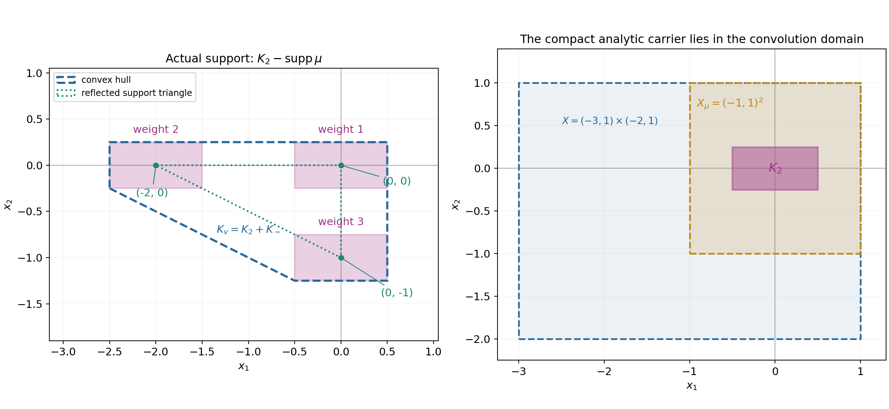
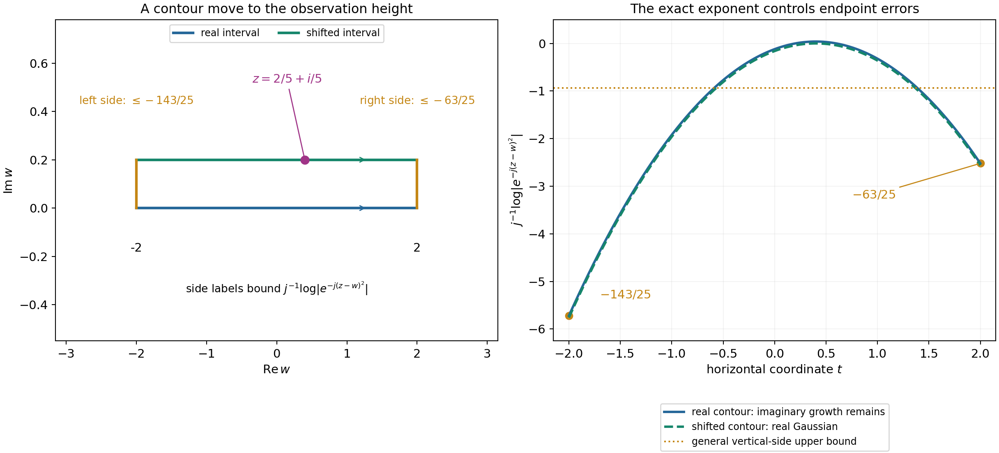

# Learning convex approximation for convolution equations

Original exposition, examples and solutions: GPT-6.1 Sol (OpenAI), Ultra. CC0 1.0. Self-checked by the writing AI; independent mathematical review is not claimed.

A compact convolution kernel determines where a local equation makes sense. Its complex characteristic frequencies supply explicit entire solutions. On an open convex set, finite sums of these solutions approximate every smooth homogeneous solution, with all derivatives on each compact observation set. The proof connects three objects: an annihilator, an entire quotient, and a convex analytic carrier.

Basic references are Grubb's [Fourier transformation of distributions](https://web.math.ku.dk/~grubb/dist5.pdf), Melrose's [Tempered distributions and the Fourier transform](https://math.mit.edu/~rbm/iml/Chapter1.pdf), and Hörmander's *The Analysis of Linear Partial Differential Operators I* and *II*. Read [Compact Fourier division and multiplicity-sensitive annihilators](../AN02-L122.html) for the negative-exponential transform convention, and [Fourier transforms of analytic functionals on a real convex carrier](../AN02-L146.html#af1-the-definition-and-the-exact-theorem) for the precise small-exponential-loss criterion. The complete arguments for this lesson are Theorems 1.1, 3.1 and 5.1 and Lemmas 4.1–4.2 below.

## 1. The equation and the approximation topology

For a nonzero compact distribution \(\mu\), put
\[
 X_\mu=\{x:x-\operatorname{supp}\mu\subset X\}.
 \tag{L1}
\]
Every point used in the convolution must belong to \(X\). This condition, together with a neighborhood of the compact translated support, lets the finite-order distribution act on \(y\mapsto u(x-y)\). The set \(X_\mu\) is open. It is convex when \(X\) is convex.

The homogeneous solution space is
\[
 N_\mu(X)=\{u\in C^\infty(X):\mu*u=0\text{ in }X_\mu\}.
 \tag{L2}
\]
The approximating space \(E_\mu\) consists of finite linear combinations of
\[
 f(x)e^{ix\cdot\lambda},\qquad
 f\text{ a polynomial},\quad\lambda\in\mathbb C^n,
 \quad\mu*(f e^{ix\cdot\lambda})=0\text{ everywhere}.
 \tag{L3}
\]
The polynomial factors remember zero multiplicities. Theorem 5.1 says that for each compact \(K\subset X\), derivative order \(m\), and tolerance \(\varepsilon>0\), a single such finite sum satisfies
\[
 \max_{|\alpha|\leq m}\sup_K|\partial^\alpha(u-h)|<\varepsilon.
 \tag{L4}
\]
An approximation on one compact set does not impose a global growth bound on \(u\), and the finite sum can change when the set, derivative order or tolerance changes.

## 2. Why the reflected symbol appears

Write
\[
 F_v(\zeta)=v(e^{-ix\cdot\zeta}),\qquad
 B(\zeta)=F_\mu(-\zeta).
 \tag{L5}
\]
Then
\[
 \mu*e^{-ix\cdot\zeta}=B(\zeta)e^{-ix\cdot\zeta}.
 \tag{L6}
\]
At a zero of \(B\) of directional order \(r\), differentiating (L6) \(k<r\) times produces the solutions
\((-ix\cdot\theta)^k e^{-ix\cdot\zeta}\).
If a compact \(v\) kills all solutions, its transform has all the corresponding zero derivatives. One-variable division on transverse complex lines removes every zero of \(B\). A Cauchy circle that surrounds the roots makes the quotient holomorphic in the other variables too, even when roots collide. Theorem 1.1 gives the exact equivalence
\[
 v(E_\mu)=0
 \quad\Longleftrightarrow\quad
 F_v=B G\text{ with }G\text{ entire}.
 \tag{L7}
\]
The converse uses the full finite polynomial-jet product identity, so it covers arbitrary polynomial factors rather than only powers of one directional coordinate.

**Example 1: a shifted first derivative.** Let \(\mu=\delta'_a\) on the line, with \(a=3/4\). The derivative distribution acts by \(\delta'_a(\phi)=-\phi'(a)\). Consequently
\[
 \mu*u(x)=u'(x-a),\qquad
 F_\mu(\zeta)=i\zeta e^{-ia\zeta},\qquad
 B(\zeta)=-i\zeta e^{ia\zeta}.
 \tag{L8}
\]
Take \(X=(-2,2)\). Then \(X_\mu=(a-2,a+2)\), and the local equation says \(u'=0\) throughout \(X\). Its solutions are constants.
At a characteristic frequency the polynomial factor must also be constant: the only zero of \(B\) is the simple zero at the origin. Thus \(E_\mu\) consists exactly of constants, and approximation is equality in this example.

For \(v=\delta_{-1}-\delta_1\), the transform is \(2i\sin\zeta\), and its quotient is
\[
 G(\zeta)=-2e^{-ia\zeta}\frac{\sin\zeta}{\zeta}.
 \tag{L9}
\]
The apparent singularity at zero is removable. The quotient's carrier is \([a-1,a+1]\), because \(\sin\zeta/\zeta\) is the transform of the probability measure with constant density \(1/2\) on \([-1,1]\). Multiplication by \(-2e^{-ia\zeta}\) scales and translates that measure. The reflected derivative carrier is \(\{-a\}\), and their sum is \([-1,1]=\operatorname{conv}\operatorname{supp}v\). All signs locate the carrier correctly.

**Example 2: a double translation difference.** Let \(a>0\) and
\[
 \mu=(\delta_0-\delta_a)*(\delta_0-\delta_a)
             =\delta_0-2\delta_a+\delta_{2a}.
 \tag{L10}
\]
The reflected symbol is \(B(\zeta)=(1-e^{ia\zeta})^2\). Its zeros \(2\pi k/a\) have order two, so the polynomial solutions at each frequency have the form
\[
 (A+Bx)e^{2\pi ikx/a}.
 \tag{L11}
\]
To see that there are no higher-degree polynomial factors, the second difference of a polynomial of degree \(d\geq2\) has leading coefficient \(a^2d(d-1)\) times its original leading coefficient and degree \(d-2\).

A smooth global homogeneous solution has the form
\[
 u(x)=p(x)+xq(x),\qquad p,q\text{ smooth and }a\text{-periodic}.
 \tag{L12}
\]
Indeed \(g(x)=u(x)-u(x-a)\) is periodic by the homogeneous equation. Set \(q=g/a\) and \(p=u-xq\). Then
\(p(x)-p(x-a)=g(x)-a q(x)=0\).
Conversely the second difference of (L12) is zero. Fourier partial sums for \(p,q\) converge with every fixed derivative: integrating their coefficients by parts arbitrarily many times gives bounds by every negative power of the integer frequency. On a bounded interval, multiplying the second sum by \(x\) preserves each fixed derivative convergence. This gives an explicit approximation by (L11).

## 3. Quotients have convex analytic carriers

The logarithm of a nonzero entire function is PSH, allowing minus infinity at its zeros. After smoothing the compact distributions by one nonzero compact smooth \(\phi\), the two products
\[
 F_\phi F_{\check\mu},\qquad F_\phi F_v
 \tag{L13}
\]
are transforms of compact smooth functions. Their logarithms have uniform imaginary-growth bounds and exact support indicators. Theorem 3.1 proves that their indicator difference is a support function, and gives
\[
 |G(\zeta)|\leq C_\varepsilon
 e^{H_{K_2}(\operatorname{Im}\zeta)+\varepsilon|\zeta|}
 \quad\text{for every }\varepsilon>0,
 \qquad
 K_2+\operatorname{conv}\operatorname{supp}\check\mu
       =\operatorname{conv}\operatorname{supp}v.
 \tag{L14}
\]
Every small loss is allowed, with its own constant. A real-axis polynomial bound is not asserted. The analytic-functional theorem supplies \(\sigma\) carried by \(K_2\) with \(F_\sigma=G\), including a proved action on holomorphic germs near that real convex carrier.

**Example 3: three translated rectangles.** In two dimensions take
\[
 \mu=\delta_{(0,0)}+2\delta_{(2,0)}+3\delta_{(0,1)},\qquad
 K_2=[-1/2,1/2]\times[-1/4,1/4].
 \tag{L15}
\]
Let \(\sigma\) be the probability measure with constant density on \(K_2\), and set \(v=\sigma*\check\mu\). Direct convolution pairing gives
\(v(h)=\sigma(\mu*h)=0\) for every entire homogeneous solution.
Its quotient is
\[
 G(\zeta)=
 \frac{\sin(\zeta_1/2)}{\zeta_1/2}
 \frac{\sin(\zeta_2/4)}{\zeta_2/4},
 \qquad
 H_{K_2}(\eta)=\tfrac12|\eta_1|+\tfrac14|\eta_2|.
 \tag{L16}
\]
Each sine quotient takes value one at zero. The reflected support triangle has vertices \((0,0),(-2,0),(0,-1)\) and support function
\[
 H_{K_-}(\eta)=\max\{0,-2\eta_1,-\eta_2\}.
 \tag{L17}
\]
Positive weights make the actual support of \(v\) the union of the three translated rectangles. Its convex hull is the pentagon with vertices
\[
 (-5/2,-1/4),\ (-1/2,-5/4),\ (1/2,-5/4),\
 (1/2,1/4),\ (-5/2,1/4).
 \tag{L18}
\]
Its support function is \(H_{K_2}+H_{K_-}\).
For \(X=(-3,1)\times(-2,1)\), every vertex and the whole pentagon lie in \(X\). The exact convolution domain is \(X_\mu=(-1,1)^2\), which contains \(K_2\).

The shaded translated rectangles are the actual support. The dashed pentagon is its convex hull \(K_v=K_2+K_-\). The second panel shows the open domain \(X\), its erosion \(X_\mu\), and the analytic carrier \(K_2\). Boundary lines show the defining inequalities; they do not add boundary points to the two open sets. The caption illustrates (5.9), not an equality of nonconvex supports for arbitrary complex kernels.

## 4. From entire tests to local homogeneous solutions

On entire tests, the transform identity gives
\[
 v(h)=\sigma(\mu*h).
 \tag{L19}
\]
Differentiating at frequency zero gives every polynomial moment. Uniform Taylor convergence and the two continuity bounds then prove this identity for all entire tests.

A general smooth test cannot be inserted into an analytic functional. Instead take a compact smooth \(w\) and Gaussian-smoothed entire \(w_j=E_j*w\). Then
\[
 w_j\longrightarrow w\text{ smoothly on the real space},\qquad
 \mu*w_j=E_j*(\mu*w).
 \tag{L20}
\]
If \(\mu*w\) is analytic near \(K_2\), Lemma 4.1 proves uniform complex convergence near that carrier. Its contour move removes the positive factor from the imaginary part of the Gaussian exponent.

For this diagram \(R=1\), \(z=2/5+i/5\), and the integration interval is \([-2,2]\). The shifted horizontal contour has height \(1/5\). The normalized logarithmic modulus on it is \(-(2/5-t)^2\). On the right and left vertical sides it is at most \(-63/25\) and \(-143/25\), respectively. Both are below the general bound \(-15/16\) used in (4.9). The curves show the actual exponent per \(j\), not a numerical proof of convergence.

To use the local equation, choose a cutoff equal to one near the whole convex carrier \(K_v\), with support in \(X\), and set \(w=\chi u\). Then \(v(w)=v(u)\), and \(\mu*w=0\) near \(K_2\). The real smooth limit controls the left side of (L19); the uniform complex limit controls the right side. Thus \(v(u)=0\). Continuous separation proves the density.

**Example 4: an empty convolution domain can still give useful approximants.** Let \(\mu=\delta_0-\delta_2\) and \(X=(-3/4,3/4)\). Then
\[
 X_\mu=X\cap(X+2)=\varnothing.
 \tag{L21}
\]
The local equation imposes no condition. Nevertheless the restrictions of the two-periodic exponentials \(e^{i\pi kx}\) are dense in all smooth functions on \(X\).
Here is a direct construction. For a compact observation set \(K\subset X\), choose \(\chi\in C_c^\infty(X)\) equal to one near \(K\), and extend \(w=\chi u\) by zero. Its periodization
\[
 p(x)=\sum_{\ell\in\mathbb Z}w(x-2\ell)
 \tag{L22}
\]
is smooth and two-periodic. The supports in different translates are disjoint and the sum is locally finite. On \(X\) only the term \(\ell=0\) can occur, so \(p=u\) near \(K\). For
\[
 c_k=\frac12\int_{-1}^{1}p(x)e^{-i\pi kx}\,dx,
 \tag{L23}
\]
integration by parts \(N\) times, with all periodic endpoint terms canceling, gives
\(|c_k|\leq C_N|k|^{-N}\) for \(k\ne0\).
For any fixed derivative order \(m\), choosing \(N>m+1\) makes the differentiated Fourier series absolutely and uniformly convergent. To identify its sum, use the period-two Fejér kernel
\[
 K_N(t)=\frac1{2(N+1)}
                 \left|\sum_{k=0}^N e^{i\pi kt}\right|^2.
 \tag{L24}
\]
It is nonnegative, and integrating its finite expansion on \([-1,1]\) gives integral one: unequal frequencies integrate to zero and the \(N+1\) diagonal terms each integrate to two. If \(\delta\leq|t|\leq1\), the finite geometric sum gives
\[
 K_N(t)\leq
       \frac1{2(N+1)\sin^2(\pi\delta/2)}.
 \tag{L25}
\]
Thus its mass outside any neighborhood of zero tends to zero. Splitting its convolution with the uniformly continuous periodic \(p\) at that neighborhood proves uniform convergence to \(p\). Expanding the same finite kernel shows these convolutions are the Cesàro means of the Fourier partial sums. The already absolutely convergent Fourier series has the same Cesàro limit as its ordinary sum, so that sum is \(p\). Uniform convergence of every differentiated series and the fundamental theorem of calculus identify the corresponding derivatives with those of \(p\). Fourier partial sums therefore approximate \(u\) with every prescribed finite collection of derivatives on \(K\).

## 5. Exercises and full solutions

The ten exercises total 100 points.

**Exercise 1 (10 points).** For \(\mu=\delta'_a\), derive all three identities in (L8), including the reflected symbol, and identify every polynomial-exponential homogeneous solution.

**Solution.** Since \(\partial_yu(x-y)=-u'(x-y)\), pairing with \(\delta'_a\) gives \(u'(x-a)\). Pairing with \(e^{-iy\zeta}\) gives \(i\zeta e^{-ia\zeta}\), and replacing \(\zeta\) by \(-\zeta\) gives \(-i\zeta e^{ia\zeta}\). A homogeneous \(f(x)e^{ix\lambda}\) has derivative zero everywhere, so it is constant. More explicitly, its derivative equation is \(f'+i\lambda f=0\). If \(\lambda\ne0\), the highest coefficient of a nonzero polynomial \(f\) cannot vanish in this equation. If \(\lambda=0\), \(f'=0\), so \(f\) is constant. The zero polynomial gives the zero solution at any frequency.

**Exercise 2 (10 points).** For the double difference in Example 2, prove the polynomial degree assertion and give the two transform conditions imposed on an annihilator at each characteristic frequency.

**Solution.** Taylor's finite expansion gives
\(f(x-a)=f(x)-a f'(x)+a^2f''(x)/2+\cdots\)
and
\(f(x-2a)=f(x)-2a f'(x)+2a^2f''(x)+\cdots\).
In \(f(x)-2f(x-a)+f(x-2a)\), the constant and first-derivative terms cancel and the second-derivative coefficient is \(a^2\). Higher derivatives have smaller degree. For degree \(d\geq2\), the leading coefficient is therefore \(a^2d(d-1)\) times the original one. The polynomial kernel has degree at most one.
Writing \(A=F_v\) and \(\zeta_k=2\pi k/a\), the conditions are \(A(\zeta_k)=A'(\zeta_k)=0\). Indeed \(A'(\zeta_k)=v(-ix e^{-ix\zeta_k})\), so annihilating both \(e^{-ix\zeta_k}\) and \(x e^{-ix\zeta_k}\) gives exactly those two zeros. All double zeros of \(B\) are then removable in \(A/B\), which is entire in one variable.

**Exercise 3 (8 points).** Compute \(X_\mu\) for Example 3, and verify both \(K_2\subset X_\mu\) and \(K_v\subset X\) with strict margins.

**Solution.** The three membership conditions are \((x_1,x_2)\in X\), \((x_1-2,x_2)\in X\), and \((x_1,x_2-1)\in X\). They give
\[
 x_1\in(-3,1)\cap(-1,3)=(-1,1),\qquad
 x_2\in(-2,1)\cap(-1,2)=(-1,1).
\]
Thus \(X_\mu=(-1,1)^2\). The rectangle has coordinate margins \(1/2\) and \(3/4\) inside it. The pentagon has coordinate ranges \([-5/2,1/2]\) and \([-5/4,1/4]\); their distances from the four sides of \(X\) are \(1/2,1/2,3/4,3/4\). Convexity includes every point between the listed vertices with the same coordinate bounds.

**Exercise 4 (8 points).** Let \(H_1(\eta)=2|\eta|\) and \(H_3(\eta)=|\eta|\) on the line. Show that their difference is not a support function. What does Theorem 3.1 rule out?

**Solution.** The difference is \(H_2(\eta)=-|\eta|\). Subadditivity would require
\(H_2(0)\leq H_2(1)+H_2(-1)\), which reads \(0\leq-2\). Thus it is not sublinear and cannot support a nonempty compact convex set. Although \(H_1\) and \(H_3\) individually support the intervals \([-2,2]\) and \([-1,1]\), no triple of proper PSH functions satisfying all hypotheses of Theorem 3.1 can have those indicators with \(p_3=p_1+p_2\). The sum hypothesis imposes an additional compatibility that arbitrary support functions need not have.

**Exercise 5 (10 points).** Recover the constant \(2^{2n+2}L\) in (3.10) from the growing-ball and double-submean estimates. Identify where the parameter-disk radius disappears.

**Solution.** On \(B(0,2\delta t)\), \(|H_j(\operatorname{Im}\zeta)|/t\leq2\delta\ell_j\). The growing-ball absolute-error bound has factor two, hence its upper limit is \(4\delta\ell_j|D|\). Sum the two errors to obtain \(4\delta L|D|\). The averaging ball centered at \(q\) has radius \(\delta t\), so replacing it by the containing ball increases the normalized bound by the volume ratio \(2^{2n}\). Division by the disk area cancels \(|D|\). The remaining Lipschitz error is \(La|y|\), which tends to zero as \(a\downarrow0\) after taking the upper limit. The resulting constant is \(2^{2n}4L=2^{2n+2}L\). The supremum on the left is independent of \(a\), so this last limit changes only the bound.

**Exercise 6 (8 points).** Explain why the quotient-growth proof translates the origin, and why the two original indicators remain unchanged.

**Solution.** A proper PSH function may equal minus infinity at the origin. In that case \(p_2(0)/t\) cannot give a finite seed excluding uniform collapse. Proper functions are finite almost everywhere, so choose one point \(z_*\) at which all three are finite. Their translated relation still holds. For \(j=1,3\), the new envelope is \(M_j(\eta+\operatorname{Im}z_*)\). Its difference from \(M_j(\eta)\) is bounded by the fixed quantity \(\ell_j|\operatorname{Im}z_*|\), using the envelope's Lipschitz bound. After setting \(\eta=ty\) and dividing by \(t\), the difference tends to zero. Thus the indicators are unchanged, while the scaled quotient has finite origin values tending to zero.

**Exercise 7 (10 points).** Suppose \(g\in C_c^\infty\) vanishes whenever \(\operatorname{dist}(x,K)<d\), with \(d>0\). Give a direct uniform complex Gaussian estimate near \(K\).

**Solution.** If \(\operatorname{dist}(\operatorname{Re}z,K)<d/4\), every point of \(\operatorname{supp}g\) is at least \(3d/4\) from \(\operatorname{Re}z\). If also \(|\operatorname{Im}z|<d/4\), (4.8) gives
\[
 |g_j(z)|\leq
 \left(\frac j\pi\right)^{n/2}\|g\|_1
 \exp\!\left[-j\left(\frac{9d^2}{16}-\frac{d^2}{16}\right)\right]
 =\left(\frac j\pi\right)^{n/2}\|g\|_1e^{-jd^2/2}.
\]
This tends to zero uniformly on that fixed complex neighborhood. The polynomial prefactor is dominated by the negative exponential. This direct estimate suffices for a zero germ; Lemma 4.1 proves the more general nonzero analytic-germ assertion too.

**Exercise 8 (8 points).** Verify the two exact vertical-side constants in the Gaussian diagram and compare them with the general contour estimate.

**Solution.** At \(w=2+is\), \(0\leq s\leq1/5\), the exponent per \(j\) is
\(-((2/5-2)^2-(1/5-s)^2)\leq-(64/25-1/25)=-63/25\).
At \(w=-2+is\), it is at most
\(-((2/5+2)^2-1/25)=-(144/25-1/25)=-143/25\).
Since \(63/25>15/16\) and \(143/25>15/16\), both bounds imply the weaker uniform bound \(-15/16\). On the shifted interval \(s=1/5\), the imaginary difference is zero and the exponent is exactly \(-(2/5-t)^2\).

**Exercise 9 (8 points).** Why does equality on the exponential tests in (5.12) imply equality on every entire test, and why is real smooth convergence alone insufficient for the later limit involving \(\sigma\)?

**Solution.** Exponentials have uniformly convergent power series and parameter derivatives on each bounded complex set. Differentiating the equality at frequency zero gives equality on every monomial with the same nonzero factor \((-i)^{|\alpha|}\), and therefore on every polynomial. The Taylor polynomials of an entire test converge uniformly on a larger polydisk; Cauchy estimates control all finite derivatives required by \(\mu\) and \(v\), and the analytic-functional bound controls \(\sigma\) on its complex neighborhood. These bounds pass polynomial equality to the entire test. For a subsequent smooth limit, \(\sigma\) is only known to be continuous on holomorphic germs with complex-neighborhood bounds. No real distributional finite-order bound is available. Uniform convergence on a fixed complex neighborhood, supplied by Lemma 4.1, is the required continuity input.

**Exercise 10 (20 points).** Explain why the cutoff in the density proof is taken equal to one near the whole \(K_v\) (10 points). Then show that convexity cannot simply be dropped by taking a derivative kernel on a disconnected open subset of the line (10 points).

**Solution.** Equation (5.9) gives
\[
 \operatorname{supp}v\subset K_v,\qquad
 K_2-\operatorname{supp}\mu\subset K_2+K_-=K_v.
\]
Thus one cutoff equal to one near \(K_v\) simultaneously preserves the pairing with \(v\) and every translated germ used by the convolution near \(K_2\). A cutoff known only on one translated piece would not justify both assertions. The entire convex hull is compact inside \(X\), so such a compact cutoff exists. A common margin from its plateau, together with compactness of the carrier and kernel support, makes \(\mu*(\chi u)=\mu*u=0\) in a neighborhood of \(K_2\).

For the second part take \(X=(-2,-1)\cup(1,2)\) and \(\mu=\delta'_0\). Then \(X_\mu=X\), and the equation is \(u'=0\) on each component. Let \(u=0\) on the first and \(u=1\) on the second. The only global polynomial-exponential homogeneous solutions are constants, by Exercise 1. At the two-point compact set \(\{-3/2,3/2\}\), every complex constant \(c\) has
\(\max\{|c|,|1-c|\}\geq1/2\), since \(1\leq|c|+|1-c|\).
No constants approximate \(u\) with arbitrarily small even zeroth-derivative error. This gives a concrete failure on a nonconvex open set without altering the convex theorem.

## References

- Gerd Grubb, *Fourier transformation of distributions*, lecture notes, Chapter 5. [Online reading](https://web.math.ku.dk/~grubb/dist5.pdf).
- Richard Melrose, *Introduction to Microlocal Analysis*, MIT lecture notes, revised 2007. Chapter 1, *Tempered distributions and the Fourier transform*. [Online reading](https://math.mit.edu/~rbm/iml/Chapter1.pdf).
- Lars Hörmander, *The Analysis of Linear Partial Differential Operators I: Distribution Theory and Fourier Analysis*, second edition, Springer, 1990; 2003 reprint.
- Lars Hörmander, *The Analysis of Linear Partial Differential Operators II: Differential Operators with Constant Coefficients*, Springer, 1983; 2005 reprint.

## Complete proof

Exponential-polynomial solutions retain the multiplicities of the complex zeros of a convolution symbol. Their annihilators are exactly the compact Fourier transforms divisible by that symbol. We prove this algebraic statement, find the convex analytic carrier of the quotient, and deduce smooth approximation on every open convex domain. The argument applies to every nonzero compact convolution operator, without a polynomial assumption on the symbol or an invertibility assumption.

Basic references are Grubb's [Fourier transformation of distributions](https://web.math.ku.dk/~grubb/dist5.pdf), Melrose's *Introduction to Microlocal Analysis*, and Hörmander's *The Analysis of Linear Partial Differential Operators I* and *II*. We use the Fourier convention, compact-distribution continuity and Fourier injectivity proved in [Compact Fourier division and multiplicity-sensitive annihilators](../AN02-L122.html), and the local Cauchy formula and compact parameter integration in [Cauchy bounds, root counts and analytic extensions](../AN02-L045.html#cauchy-estimates-and-parameter-contours). The convex-support argument uses the precise analytic-functional reconstruction in [Fourier transforms of analytic functionals on a real convex carrier](../AN02-L146.html#af1-the-definition-and-the-exact-theorem), including its proved holomorphic-germ action in Section AF8. Section 3 names the exact envelope, average and compactness results needed for the growth argument.

## 1. All polynomial jets at a characteristic frequency

Let \(0\ne\mu\in\mathcal E'(\mathbb R^n)\). Use
\[
 F_\mu(\zeta)=\langle\mu,e^{-ix\cdot\zeta}\rangle,\qquad
 B(\zeta)=F_\mu(-\zeta).
 \tag{1.1}
\]
The entire function \(B\) is not identically zero, by Fourier injectivity. Let \(E_\mu\) be the linear span of all functions
\[
 h(x)=f(x)e^{ix\cdot\lambda},\qquad
 \lambda\in\mathbb C^n,\quad f\in\mathbb C[x_1,\ldots,x_n],
 \qquad \mu*h=0\text{ on }\mathbb R^n.
 \tag{1.2}
\]
Each is smooth and entire in \(x\). Compact distributions pair with these functions by inserting a compact smooth cutoff equal to one near their support. The pairing is complex linear, with no complex conjugation.

**Theorem 1.1 (the entire annihilator quotient).** For \(v\in\mathcal E'(\mathbb R^n)\), the following are equivalent:

1. \(v(h)=0\) for every \(h\in E_\mu\).
2. There is an entire function \(G\) on \(\mathbb C^n\) such that
\[
 F_v(\zeta)=B(\zeta)G(\zeta)=F_\mu(-\zeta)G(\zeta).
 \tag{1.3}
\]
The quotient is unique. This assertion supplies no polynomial growth bound on \(G\).

*Proof of 1 implying 2.* Write \(A=F_v\). Fix \(\zeta_0\). If \(B(\zeta_0)\ne0\), ordinary division is holomorphic near that point. Otherwise choose a real vector \(\theta\ne0\) such that \(t\mapsto B(\zeta_0+t\theta)\) is not identically zero. Such a vector exists: the first nonzero homogeneous term \(P\) of the Taylor series at \(\zeta_0\) cannot vanish on every real vector. A complex polynomial vanishing on \(\mathbb R^n\) is zero, as follows by applying the one-variable polynomial identity successively in each coordinate.

Complete \(\theta\) to a real linear basis. Its complexification gives coordinates
\[
 \zeta=\zeta_0+T(s,t),\qquad s\in\mathbb C^{n-1},\quad t\in\mathbb C,
 \qquad T(0,t)=t\theta.
 \tag{1.4}
\]
In dimension one there is no \(s\) variable. Choose \(\rho>0\) so that \(B(\zeta_0+T(0,t))\) has no zero on \(|t|=\rho\). The zeros of a nonzero one-variable holomorphic function are isolated: factor the first nonzero Taylor term at each zero. By compactness and continuity, there is a neighborhood \(S\) of \(0\) such that
\[
 B(\zeta_0+T(s,t))\ne0,\qquad s\in S,\quad |t|=\rho.
 \tag{1.5}
\]
Shrink it if necessary to give a positive lower bound on every smaller compact parameter set. For each fixed \(s\), this one-variable function is nonzero and has only finitely many zeros in \(|t|<\rho\), since it is holomorphic past the closed disk and nonzero on its boundary.

Suppose \(t=\tau\) is such a zero of order \(m\), and put \(\zeta=\zeta_0+T(s,\tau)\). For \(0\leq k<m\), consider
\[
 h_k(x)=(-ix\cdot\theta)^k e^{-ix\cdot\zeta}.
 \tag{1.6}
\]
Compact-distribution continuity permits differentiating the exponential identity
\[
 \mu*e^{-ix\cdot(\zeta+t\theta)}
       =B(\zeta+t\theta)e^{-ix\cdot(\zeta+t\theta)}
 \tag{1.7}
\]
in \(t\). Every derivative of \(B\) of order at most \(k\) vanishes at \(t=0\), so \(\mu*h_k=0\). These functions belong to \(E_\mu\), with frequency \(-\zeta\). The annihilator hypothesis gives
\[
 \partial_\theta^k A(\zeta)=v(h_k)=0,\qquad 0\leq k<m.
 \tag{1.8}
\]
Thus, for each fixed \(s\), every zero of the denominator in the disk occurs in the numerator with at least the same order. The one-variable quotient extends holomorphically across all of them.

Joint holomorphy does not require choosing the roots smoothly, or supposing that they are simple. Define on \(S\times\{|t|<\rho\}\)
\[
 G_0(s,t)=\frac1{2\pi i}\int_{|w|=\rho}
 \frac{A(\zeta_0+T(s,w))}
      {B(\zeta_0+T(s,w))(w-t)}\,dw.
 \tag{1.9}
\]
Equation (1.5), local compact bounds and the Cauchy formula make this holomorphic jointly in \(s,t\). For example, on each smaller polydisk all parameter derivatives pass under the compact integral, and its local power series converge uniformly there. For fixed \(s\), the Cauchy formula for the extended one-variable quotient makes (1.9) equal to that quotient inside the disk. Hence \(B G_0=A\) there.

These local quotients agree on overlaps: on the open set where \(B\ne0\) each is \(A/B\), and that set is dense in every overlap, since a nonzero entire function cannot vanish on an open set. Continuity then gives equality across its zeros. They glue to an entire \(G\) satisfying (1.3).

*Proof of 2 implying 1.* This direction must handle every polynomial solution, rather than only the directional monomials used above. Write \(h(x)=f(x)e^{-ix\cdot\zeta_0}\). Taylor expansion of the polynomial \(f(x-y)\) inside the convolution gives
\[
 \mu*h(x)=e^{-ix\cdot\zeta_0}Q(x),\qquad
 Q(x)=\sum_\beta
   \frac{i^{|\beta|}}{\beta!}
   (\partial_\zeta^\beta B)(\zeta_0)
   \partial_x^\beta f(x)
   =B(\zeta_0+i\partial_x)f(x).
 \tag{1.10}
\]
The sum is finite because derivatives beyond the degree of \(f\) vanish. For the sign, \(\partial_\zeta^\beta B(\zeta_0)=\langle\mu,(iy)^\beta e^{iy\cdot\zeta_0}\rangle\), and the coefficient \((-y)^\beta\) in \(f(x-y)\) gives precisely \(i^{|\beta|}\partial_\zeta^\beta B\).

For a holomorphic germ \(H\), put
\[
 \Lambda_f(H)=
       \left.f(i\partial_\zeta)H(\zeta)\right|_{\zeta=\zeta_0}.
 \tag{1.11}
\]
The product rule yields the finite identity
\[
 \Lambda_f(BG)=\Lambda_Q(G).
 \tag{1.12}
\]
To see every coefficient, if \(f(x)=\sum_\alpha f_\alpha x^\alpha\), the term indexed by \(\beta\leq\alpha\) on either side is
\[
 f_\alpha\binom{\alpha}{\beta}i^{|\alpha|}
   (\partial_\zeta^\beta B)(\zeta_0)
   (\partial_\zeta^{\alpha-\beta}G)(\zeta_0).
 \tag{1.13}
\]
Since \(\mu*h=0\), (1.10) says \(Q=0\). Now
\[
 v(h)=\Lambda_f(A)=\Lambda_f(BG)=\Lambda_Q(G)=0.
 \tag{1.14}
\]
This proves annihilation of each generator of \(E_\mu\), and hence of its span. If two entire quotients existed, their difference would vanish on the nonempty open set \(B\ne0\) and therefore everywhere. This proves uniqueness. \(\square\)

The argument uses local one-variable circles with compact holomorphic parameter integration. It works through collisions of characteristic zeros and for nonpolynomial symbols. It does not identify an entire quotient with a compact-distribution transform without proving the required growth.

**Example 1. A translation difference has infinitely many characteristic frequencies.** For \(a>0\), let \(\mu=\delta_0-\delta_a\) on \(\mathbb R\). Then \(B(\zeta)=1-e^{ia\zeta}\), whose zeros \(2\pi k/a\), \(k\in\mathbb Z\), are simple. The entire quotient criterion is equivalent to \(F_v(2\pi k/a)=0\) for every \(k\). The corresponding solutions \(e^{-2\pi ikx/a}\) are \(a\)-periodic. A nonconstant polynomial factor cannot give another solution at one of these frequencies: the difference \(f(x)-f(x-a)\) has degree one less than \(f\), with nonzero leading coefficient \(a\,\deg(f)\) times that of \(f\). Thus the kernel among those polynomials consists of constants. This example has an entire symbol rather than a polynomial one.

**Example 2. Reflection is essential.** Define \(\check\mu\) by \(\check\mu(\phi)=\mu(\phi(-\,\cdot))\), and take \(v=\check\mu\). Then \(F_v(\zeta)=F_\mu(-\zeta)=B(\zeta)\), so its quotient is \(G=1\). Directly, for every homogeneous solution \(h\), \(v(h)=\langle\mu,h(-y)\rangle=(\mu*h)(0)=0\). Using \(F_\mu(\zeta)\) as the divisor would lose this identity for a general nonsymmetric \(\mu\).

## 2. The domain on which a compact convolution is defined

Let \(X\subset\mathbb R^n\) be open and convex and set
\[
 X_\mu=\{x:x-\operatorname{supp}\mu\subset X\},\qquad
 N_\mu(X)=\{u\in C^\infty(X):\mu*u=0\text{ in }X_\mu\}.
 \tag{2.1}
\]
The set \(X_\mu\) may be empty. It is open: at a point in it, the compact set \(x-\operatorname{supp}\mu\) has positive distance from the complement of \(X\), and a sufficiently small translation remains inside \(X\). It is convex because each set \(X+y\), \(y\in\operatorname{supp}\mu\), is convex and \(X_\mu\) is their intersection.

The convolution is continuous from \(C^\infty(X)\) to \(C^\infty(X_\mu)\). Indeed, for any compact \(K\subset X_\mu\), the compact set \(K-\operatorname{supp}\mu\) lies in \(X\). Choose a compact neighborhood of it in \(X\). Finite-order continuity of \(\mu\), with fixed cutoffs on a small neighborhood of its support, bounds each derivative of \(\mu*u\) on \(K\) by finitely many derivatives of \(u\) on that compact neighborhood. Differentiation in \(x\) passes through the pairing in those same smooth seminorms. These are exactly the compact seminorm estimates for the two Fréchet topologies.

Consequently \(N_\mu(X)\) is a closed subspace of \(C^\infty(X)\), and the restrictions of \(E_\mu\) lie in it. If \(X_\mu=\varnothing\), the condition is empty and \(N_\mu(X)=C^\infty(X)\).

## 3. The convex carrier of an exponential quotient

For a proper plurisubharmonic function \(p\) with
\(p(x+i\eta)\leq c+\ell|\eta|\), the [horizontal-envelope theorem](../AN02-L139.html#psh-envelope-theorem) defines
\[
 M_p(\eta)=\sup_x p(x+i\eta),\qquad
 H_p(\eta)=\lim_{t\to\infty}\frac{M_p(t\eta)}t.
 \tag{3.1}
\]
The function \(H_p\) is the support function of a nonempty compact convex set. It is positively homogeneous and \(\ell\)-Lipschitz, and the same theorem's recession argument gives
\[
 p(x+i\eta)\leq M_p(0)+H_p(\eta).
 \tag{3.2}
\]
We will also use the [growing-ball average theorem](../AN02-L141.html#growing-ball-average-theorem), the [local compactness and Hartogs comparison](../AN02-L143.html#psh-local-compactness), and Lemma 3.1 in [Slow decrease and entire division](../AN02-L163.html#3-a-half-plane-bound-with-no-residual-polynomial-loss). Those results include properness, singular values and moving compact maxima.

**Theorem 3.1 (support-function subtraction for a quotient).** Let \(p_1,p_2,p_3\) be proper PSH functions on \(\mathbb C^n\), and suppose
\[
 p_3=p_1+p_2,\qquad
 p_j(x+i\eta)\leq c_j+\ell_j|\eta|
       \quad(j=1,3),
 \tag{3.3}
\]
where \(\ell_j\geq0\). Write \(H_j=H_{p_j}\) for \(j=1,3\). Then
\[
 H_2=H_3-H_1
 \tag{3.4}
\]
is the support function of a nonempty compact convex set. For every \(\varepsilon>0\) there is a finite \(C_\varepsilon\) such that
\[
 p_2(z)\leq H_2(\operatorname{Im}z)
                   +\varepsilon|z|+C_\varepsilon
       \qquad(z\in\mathbb C^n).
 \tag{3.5}
\]
There is no assumption of a real-axis polynomial bound for \(p_2\).

*Proof.* Put \(L=\ell_1+\ell_3\). The difference \(H_2\) is initially only a continuous positively homogeneous \(L\)-Lipschitz function. In particular,
\(|H_2(\eta)|\leq L|\eta|\). We must prove its convexity; an arbitrary difference of support functions need not be convex.

Choose a point \(z_*\) where the three functions are finite. Such points have full measure, since the functions are proper and locally integrable. Replace \(p_j(z)\) temporarily by \(p_j(z+z_*)\). The indicators \(H_1,H_3\) do not change: the horizontal envelopes are translated by \(\operatorname{Im}z_*\), and the Lipschitz bound makes this fixed translation disappear after division by \(t\). At the end, translating (3.5) back changes only \(C_\varepsilon\). We may therefore assume \(p_2(0)\) is finite.

We first obtain an estimate on translated balls of radius proportional to \(t\). Fix \(\delta>0\), a real vector \(y\), a complex number \(w_0\), and \(a>0\). Use
\[
 B_t=B(0,2\delta t),\qquad
 D=D(w_0,a)\subset\mathbb C,\qquad
 e_{j,t}(\zeta,w)=\frac{p_j(\zeta+twy)}t
                           -H_j((\operatorname{Im}w)y).
 \tag{3.6}
\]
For \(j=1,3\), the growing-ball theorem, with the parameter disk \(\overline D\), gives
\[
 \limsup_{t\to\infty}
 \frac1{|B_t|}\int_{B_t}\int_D |e_{j,t}|\,dA(w)\,dV(\zeta)
 \leq 4\delta\ell_j\,|D|.
 \tag{3.7}
\]
Indeed its right side is twice the normalized integral of
\(|H_j(\operatorname{Im}\zeta)|/t\), and
\(|\operatorname{Im}\zeta|\leq2\delta t\) on \(B_t\).
All norms and volumes here are Euclidean, with \(\mathbb C^n\) of real dimension \(2n\).

The relation in (3.3) implies, almost everywhere,
\[
 \frac{p_2(\zeta+twy)}t-H_2((\operatorname{Im}w)y)
                         =e_{3,t}-e_{1,t}.
 \tag{3.8}
\]
This uses the common full-measure set where the proper PSH functions are finite, without subtracting two minus-infinite values.

For \(|q|\leq\delta t\), apply the submean inequality first in the \(\zeta\)-ball \(B(q,\delta t)\), and then in the \(w\)-disk \(D\). The first ball is contained in \(B_t\). The two averages and (3.8) bound
\[
 \frac{p_2(q+tw_0y)}t-H_2((\operatorname{Im}w_0)y)
 \leq
 \frac1{|B(q,\delta t)|\,|D|}
 \int_{B_t}\int_D (|e_{1,t}|+|e_{3,t}|)\,dA\,dV
                       +La|y|.
 \tag{3.9}
\]
The last term bounds the change of \(H_2\) across the disk.
Fubini is valid: for each fixed \(t\), translation in the full \(\zeta\)-variable bounds every absolute integral by a local \(L^1\) integral on a common compact set. A line restriction that is identically minus infinite contributes only on the exceptional set of translations; a minus-infinite value at the left makes the inequality automatic. Thus the two submean steps preserve the canonical PSH representative.

The volume ratio is \(2^{2n}\). Equations (3.7)–(3.9), followed by \(a\downarrow0\), give, with \(C=2^{2n+2}L\),
\[
 \limsup_{t\to\infty}\ \sup_{|q|\leq\delta t}
 \left\{\frac{p_2(q+tw_0y)}t-H_2((\operatorname{Im}w_0)y)\right\}
 \leq C\delta.
 \tag{3.10}
\]
The constants are independent of \(y,w_0,\delta\). Each limiting assertion is made for fixed values of those parameters; no uniform exceptional-set claim is needed.

Taking \(y=0,\delta=1\) in (3.10) shows that, for all sufficiently large \(t\),
\(\sup_{|q|\leq t}p_2(q)\leq(C+1)t\).
Set \(t=|z|\) outside that fixed ball and use local upper boundedness inside it. There are \(A,D\geq0\) such that
\[
 p_2(z)\leq A|z|+D.
 \tag{3.11}
\]
Consequently \(U_t(z)=p_2(tz)/t\), \(t\geq1\), is locally uniformly upper bounded. At the origin \(U_t(0)=p_2(0)/t\to0\). The compactness alternative therefore excludes uniform collapse: along every sequence \(t_j\to\infty\), some subsequence has a proper PSH local \(L^1\) limit \(V\). The pointwise upper-limit inequality gives \(V(0)\geq0\), and (3.11) gives \(V(z)\leq A|z|\).

Pass (3.10) to that limit. On each ball in question, the eventual constant upper bound passes through local \(L^1\) convergence almost everywhere and then everywhere by the submean inequality. Thus
\[
 V(q+w_0y)\leq H_2((\operatorname{Im}w_0)y)+C\delta
                 \quad(|q|<\delta).
 \tag{3.12}
\]
Letting \(\delta\downarrow0\) with \(q=0\) gives
\(V(wy)\leq H_2((\operatorname{Im}w)y)\).
In particular \(V\leq0\) on \(\mathbb R^n\). Taking \(q=x\) and then \(\delta\downarrow|x|\) gives
\[
 V(x+isy)\leq sH_2(y)+C|x|
                 \quad(x,y\in\mathbb R^n,\ s\geq0).
 \tag{3.13}
\]

Fix \(x,y\). The function
\[
 w\longmapsto V(x+wy)-(\operatorname{Im}w)H_2(y)
 \tag{3.14}
\]
is subharmonic on the whole plane or identically minus infinite. It is at most zero on the real axis, bounded above by \(C|x|\) on the positive imaginary axis, and has a linear upper bound on the upper half-plane by \(V(z)\leq A|z|\). The proved half-plane comparison therefore makes it at most zero there. Evaluating at \(w=i\) yields
\[
 V(x+iy)\leq H_2(y).
 \tag{3.15}
\]
In particular \(V(0)=0\) and \(M_V(0)=0\). Since (3.15) gives the imaginary-growth bound \(V(x+iy)\leq L|y|\), the envelope theorem applies to \(V\). Its support function \(h_V\) satisfies
\[
 V(z)\leq h_V(\operatorname{Im}z),\qquad h_V\leq H_2.
 \tag{3.16}
\]
The second inequality follows by taking the recession of
\(M_V(ty)\leq H_2(ty)=tH_2(y)\).

Let \(H\) be the supremum of \(h_V\) over all proper limits obtained in this way. This family is nonempty. Each associated compact convex set lies in the closed ball of radius \(L\), because \(h_V(y)\leq L|y|\). Their closed convex hull is a nonempty compact convex set, whose support function is exactly \(H\). In particular \(H\) is finite, continuous and sublinear, and
\[
 V(z)\leq H(\operatorname{Im}z),\qquad H\leq H_2.
 \tag{3.17}
\]

For every \(\varepsilon>0\), the compact Hartogs bound now gives
\[
 U_t(z)\leq H(\operatorname{Im}z)+\varepsilon
                 \quad(|z|\leq1,\ t\geq T_\varepsilon).
 \tag{3.18}
\]
Here is the full sequence argument. If this failed, select offending \(t_j\to\infty\). Their finite origin values exclude collapse, so a subsequence converges locally in \(L^1\) to one of the \(V\)'s defining \(H\). Apply the Hartogs comparison on the closed unit ball with the continuous comparison function \(H(\operatorname{Im}z)\). Equation (3.17) makes the upper limit of the excess at most zero, contradicting the fixed positive excess. Thus (3.18) holds for all sufficiently large real \(t\), rather than merely for one selected sequence.

For \(|z|\geq T_\varepsilon\), put \(t=|z|\) in (3.18) and use positive homogeneity. Local upper boundedness on the remaining ball supplies a finite constant, giving
\[
 p_2(z)\leq H(\operatorname{Im}z)+\varepsilon|z|+C_\varepsilon.
 \tag{3.19}
\]
We still have to identify this \(H\) with the original difference. By (3.2),
\[
 p_3(x+iy)\leq M_{p_1}(0)+H_1(y)+H(y)
                          +\varepsilon|x+iy|+C_\varepsilon.
 \tag{3.20}
\]
Fix real \(x,y\) and apply the half-plane comparison once more, this time to
\[
 w\longmapsto p_3(x+wy)-M_{p_3}(0)
       -(\operatorname{Im}w)\bigl(H_1(y)+H(y)+\varepsilon|y|\bigr).
 \tag{3.21}
\]
Its real-axis values are at most zero. On \(w=is\), (3.20) and
\(|x+isy|\leq|x|+s|y|\) bound it above by
\(M_{p_1}(0)+C_\varepsilon-M_{p_3}(0)+\varepsilon|x|\), independently of \(s\geq0\).
Its upper-half-plane linear growth follows directly from the original bound on \(p_3\). The comparison therefore gives
\[
 p_3(x+iy)\leq M_{p_3}(0)+H_1(y)+H(y)+\varepsilon|y|.
 \tag{3.22}
\]
Take the supremum over \(x\), replace \(y\) by \(ty\), divide by \(t\), and let \(t\to\infty\). Then let \(\varepsilon\downarrow0\). We obtain
\(H_3\leq H_1+H\), hence \(H_2\leq H\). Together with (3.17), this proves \(H=H_2\). Equation (3.19) proves (3.5). Translating back from \(z_*\) adds at most
\(L|\operatorname{Im}z_*|+\varepsilon|z_*|\) to its constant. This proves the theorem in the original coordinates. \(\square\)

The theorem establishes convexity of the difference by producing the limiting convex carriers and proving the reverse support inequality. It does not assume indicator additivity for \(p_2\) before establishing an appropriate growth bound.

## 4. Gaussian smoothing in a complex neighborhood

The Gaussian below uses the bilinear square, with no complex conjugation:
\[
 E_j(z)=\left(\frac j\pi\right)^{n/2}
               \exp\left(-j\sum_{k=1}^n z_k^2\right),
 \qquad j=1,2,\ldots.
 \tag{4.1}
\]
Its real restriction is positive and has integral one. For completeness,
\((\int_{\mathbb R}e^{-s^2}\,ds)^2=\int_{\mathbb R^2}e^{-|x|^2}\,dx=\pi\)
by polar coordinates; positivity selects the square root, and scaling and products give the stated normalization in every dimension.

**Lemma 4.1 (analytic localization).** Let \(g\in C_c^\infty(\mathbb R^n)\), and let \(K\subset\mathbb R^n\) be compact. Suppose \(g\) has a holomorphic extension \(\widetilde g\) to a complex neighborhood of \(K\). Then
\[
 g_j(z)=\int_{\mathbb R^n}E_j(z-t)g(t)\,dt
 \tag{4.2}
\]
is entire, tends to \(g\) in \(C^\infty(\mathbb R^n)\), and tends uniformly to \(\widetilde g\) on some fixed complex neighborhood of \(K\). In particular, if \(g=0\) in a real neighborhood of \(K\), the uniform complex limit is zero.

*Proof.* Entire dependence follows by passing every complex derivative through the integral over the fixed compact support of \(g\). The exponential and all its derivatives are uniformly bounded there when \(z\) ranges over a compact set. The resulting local power series converge uniformly on such sets.

For real \(x\), integration by parts gives
\(\partial^\alpha g_j=E_j*\partial^\alpha g\).
Each derivative of \(g\) is bounded and uniformly continuous on the real space. If \(\omega_\alpha(r)\) is its modulus of continuity, splitting the Gaussian average at \(|t|=r\) gives
\[
 \|\partial^\alpha g_j-\partial^\alpha g\|_\infty
 \leq \omega_\alpha(r)
       +2\|\partial^\alpha g\|_\infty\,2^{n/2}e^{-jr^2/2}.
 \tag{4.3}
\]
The tail bound uses
\[
 \left(\frac j\pi\right)^{n/2}
 \int_{|t|\geq r}e^{-j|t|^2}\,dt
 \leq 2^{n/2}e^{-jr^2/2},
 \tag{4.4}
\]
obtained by keeping \(e^{-jr^2/2}\) from one half of the exponent and integrating the other half over all of \(\mathbb R^n\).
First let \(j\to\infty\), then \(r\downarrow0\).
This proves uniform convergence of every fixed derivative, and hence the stated smooth convergence.

We prove the complex assertion locally with a quantitative contour estimate. Fix \(x_0\in K\). Choose \(R>0\) small enough that \(\widetilde g\) is holomorphic past the closed product box
\[
 P=\{w:|\operatorname{Re}w_k-x_{0,k}|\leq3R,\
                   |\operatorname{Im}w_k|\leq R,\ 1\leq k\leq n\}.
 \tag{4.5}
\]
It is bounded there by some \(M\). Put
\[
 Q=\prod_{k=1}^n[x_{0,k}-2R,x_{0,k}+2R],
 \qquad
 z=x+i\eta,\quad
 |x_k-x_{0,k}|\leq R,\quad |\eta|\leq R/4.
 \tag{4.6}
\]
On the real box, \(\widetilde g=g\). In (4.2), the contribution from \(\mathbb R^n\setminus Q\) has absolute value at most
\[
 \left(\frac j\pi\right)^{n/2}\|g\|_1
                              e^{-15jR^2/16}.
 \tag{4.7}
\]
Indeed at least one coordinate satisfies \(|t_k-x_k|\geq R\), while
\[
 |e^{-j\sum(z_k-t_k)^2}|
                  =e^{-j(|x-t|^2-|\eta|^2)}.
 \tag{4.8}
\]

In the integral over \(Q\), move each coordinate interval from height zero to height \(\eta_k\), successively. Cauchy's theorem on the coordinate rectangle equates the original interval integral to the shifted one plus its two vertical-side integrals. All rectangles and their products lie in \(P\). On a side in coordinate \(k\), the real part of that coordinate is \(x_{0,k}\pm2R\), so its distance from \(x_k\) is at least \(R\). The imaginary vector at every intermediate contour point has each coordinate either zero, \(\eta_\ell\), or between those two. Therefore its imaginary distance from \(\eta\) is at most \(|\eta|\leq R/4\). Equation (4.8) again gives the same exponentially decreasing bound on every side. Summing the \(2n\) side contributions yields
\[
 \left|
 \left(\frac j\pi\right)^{n/2}
 \int_Q e^{-j\sum(z_k-t_k)^2}\widetilde g(t)\,dt
 -
 \left(\frac j\pi\right)^{n/2}
 \int_Q e^{-j|x-t|^2}\widetilde g(t+i\eta)\,dt
 \right|
 \leq
 \left(\frac j\pi\right)^{n/2}
       2M(4R)^{n-1}\sum_k|\eta_k|\,e^{-15jR^2/16}.
 \tag{4.9}
\]
The telescoping contour moves explain every term: the already moved coordinates are integrated on shifted horizontal intervals, the later coordinates on real intervals, and the current coordinate on one vertical side. These have respective lengths \(4R\) and \(|\eta_k|\). The same estimate covers negative \(\eta_k\).

The last integral in (4.9) is a real Gaussian average of the holomorphic values at height \(\eta\). Uniform continuity on \(P\) bounds its difference from \(\widetilde g(x+i\eta)\) by a modulus of continuity on \(|t-x|<r\), plus
\[
 2M\,2^{n/2}e^{-jr^2/2}
                    +M\,2^{n/2}e^{-jR^2/2}
 \tag{4.10}
\]
on the remaining part and on the missing Gaussian mass outside \(Q\). We may choose \(0<r<R\). Equations (4.7), (4.9) and (4.10), followed by \(j\to\infty\) and then \(r\downarrow0\), prove uniform convergence throughout the smaller closed region in (4.6). Finitely many corresponding open smaller regions cover \(K\); their union is a fixed complex neighborhood on which the same convergence is uniform.

If the initial hypothesis is phrased as real analyticity near \(K\), it gives the required extension: the local real power series converge holomorphically on sufficiently small complex polydisks centered at real points. Intersections of such polydisks are connected and have a real open intersection whenever nonempty. The identity principle makes their extensions agree there. A finite collection around the compact set supplies a single complex neighborhood. When \(g\) vanishes near \(K\), take its extension there to be zero. \(\square\)

**Lemma 4.2 (commuting smoothing and compact convolution).** Let \(w\in C_c^\infty(\mathbb R^n)\) and \(\mu\in\mathcal E'(\mathbb R^n)\). Put \(w_j=E_j*w\). Then \(w_j\) is entire, \(w_j\to w\) smoothly on the real space, and
\[
 \mu*w_j=E_j*(\mu*w)
 \tag{4.11}
\]
as entire functions. If \(\mu*w\) is analytic near a compact real \(K\), the right side tends uniformly in a fixed complex neighborhood of \(K\) to its holomorphic extension.

*Proof.* The first statements are Lemma 4.1. A compact distribution convolved with \(w\) is a compact smooth function, by finite-order differentiation under its pairing. For each real \(y\), the change of variables \(s=t+y\) gives
\[
 \int E_j(z-s)w(s-y)\,ds
                       =\int E_j(z-y-t)w(t)\,dt.
 \tag{4.12}
\]
Pair both sides with \(\mu\) in \(y\), using a fixed cutoff near its support. The smooth seminorms of all integrands on that cutoff support are integrably bounded: on the left all relevant \(s\) lie in a common compact set, and on the right \(t\) lies in \(\operatorname{supp}w\). Finite-order continuity permits exchanging the pairing and integration. The two sides become \(E_j*(\mu*w)\) and \(\mu*w_j\), proving (4.11) for every complex \(z\), with locally uniform derivative bounds. Apply Lemma 4.1 to the compact smooth function \(\mu*w\) for the final conclusion. \(\square\)

## 5. Density on every open convex domain

**Theorem 5.1 (convex approximation by exponential-polynomial solutions).** For every nonzero \(\mu\in\mathcal E'(\mathbb R^n)\) and every open convex \(X\subset\mathbb R^n\), the restrictions of \(E_\mu\) are dense in \(N_\mu(X)\) in the \(C^\infty(X)\) topology. Explicitly, if \(u\in N_\mu(X)\), \(K\subset X\) is compact, \(m\) is a nonnegative integer, and \(\varepsilon>0\), there is a finite exponential-polynomial solution \(h\in E_\mu\) such that
\[
 \max_{|\alpha|\leq m}\ \sup_{x\in K}
                          |\partial^\alpha(u-h)(x)|<\varepsilon.
 \tag{5.1}
\]
The convolution kernel can be a distribution of any finite order and need not be invertible.

*Proof.* Empty \(X\) is immediate, so assume \(X\ne\varnothing\).
We use the locally convex separation proved in Proposition 1.2 of [Continuous functionals, test families and compact limits](../AN02-L042.html#from-normed-extension-to-seminorm-bounds).
It suffices to prove that every continuous linear functional on \(C^\infty(X)\) annihilating the restrictions of \(E_\mu\) also annihilates \(N_\mu(X)\).
Such a functional is a compact distribution \(v\in\mathcal E'(X)\).
Here is the relevant dual identification. Continuity bounds the functional by finitely many compact derivative seminorms, which may be combined into
\[
 |v(u)|\leq C\max_{|\alpha|\leq m}\sup_Q|\partial^\alpha u|
                 \quad(u\in C^\infty(X))
 \tag{5.2}
\]
for one compact \(Q\subset X\). Restrict to compact smooth tests to obtain a distribution supported in \(Q\). Conversely, for arbitrary \(u\in C^\infty(X)\), insert a cutoff equal to one near \(Q\); (5.2) makes the value unchanged. This gives its compact distributional extension to the real space and its usual action on all smooth functions near the support.

If \(v=0\), there is nothing to prove. Otherwise Theorem 1.1 gives the unique nonzero entire \(G\) such that
\[
 F_v(\zeta)=F_{\check\mu}(\zeta)G(\zeta),\qquad
 F_{\check\mu}(\zeta)=F_\mu(-\zeta).
 \tag{5.3}
\]
Define the nonempty compact convex sets
\[
 K_v=\operatorname{conv}\operatorname{supp}v,\qquad
 K_-=\operatorname{conv}\operatorname{supp}\check\mu
                 =-\operatorname{conv}\operatorname{supp}\mu.
 \tag{5.4}
\]
Their compactness follows by reducing each finite convex combination in \(\mathbb R^n\) to at most \(n+1\) points using affine dependence. The resulting hull is the continuous image of a compact support product and the closed coefficient simplex. Since \(X\) is convex and contains the support of \(v\), it contains \(K_v\); compactness then gives a positive neighborhood of \(K_v\) inside \(X\).

Choose any nonzero \(\phi\in C_c^\infty(\mathbb R^n)\) and set \(K_\phi=\operatorname{conv}\operatorname{supp}\phi\). The compact convolutions \(\phi*\check\mu\) and \(\phi*v\) are nonzero smooth functions. They are nonzero because their Fourier transforms are products of nonzero entire functions, and Fourier injectivity applies. Their logarithmic transforms
\[
 p_1=\log|F_\phi F_{\check\mu}|,\qquad
 p_2=\log|G|,\qquad
 p_3=\log|F_\phi F_v|
 \tag{5.5}
\]
are proper PSH and satisfy \(p_3=p_1+p_2\), including at their zeros.
Regard the two smooth compact functions as finite complex measures. The exact [measure-indicator theorem](../AN02-L142.html#MI1) gives the imaginary-growth bounds for \(p_1,p_3\) and identifies their indicators. The compact-distribution convolution support theorem, Theorem 3.1 in [Convex supports and convolution cancellation](../prerequisites/convex-supports-and-convolution-cancellation.html), gives
\[
 H_1=H_{K_\phi}+H_{K_-},\qquad
 H_3=H_{K_\phi}+H_{K_v}.
 \tag{5.6}
\]
These statements use ordinary support, not singular support. The logarithm remains proper through characteristic zeros by Lemma Z2 in [Fourier endpoints and the asymptotic density of zeros](../AN02-L137.html#proof-Z2).

Apply Theorem 3.1. The difference
\[
 H_2=H_{K_v}-H_{K_-}
 \tag{5.7}
\]
is the support function of a nonempty compact convex \(K_2\), and
\[
 |G(\zeta)|\leq C_\varepsilon
       e^{H_{K_2}(\operatorname{Im}\zeta)+\varepsilon|\zeta|}
       \quad\hbox{for every }\varepsilon>0.
 \tag{5.8}
\]
The constants may depend on \(\varepsilon\).
Equality of support functions and their proved uniqueness give the exact sum
\[
 K_2+K_-=K_v\subset X.
 \tag{5.9}
\]
In particular every \(a\in K_2\) has
\(a-\operatorname{supp}\mu\subset X\), so \(K_2\subset X_\mu\).

The precise analytic-functional theorem in [Fourier transforms of analytic functionals on a real convex carrier](../AN02-L146.html#af1-the-definition-and-the-exact-theorem), Theorem AF1, now gives an analytic functional \(\sigma\) carried by \(K_2\) with
\[
 F_\sigma=G.
 \tag{5.10}
\]
Section AF8 of that lesson proves its unique action on holomorphic germs near this real convex carrier. For each complex neighborhood \(\Omega\) of \(K_2\), a constant bounds this action by \(C_\Omega\sup_\Omega|h|\) for holomorphic \(h\) there. We use that proved local action below; we do not regard \(\sigma\) as a real distribution.

First, for every entire \(h\),
\[
 v(h)=\sigma(\mu*h).
 \tag{5.11}
\]
To prove the identity on the actual test space, the convolution of an entire test with \(\mu\) is entire, by finite-order differentiation through the pairing. Both sides of (5.11) are continuous for uniform holomorphic convergence on sufficiently large bounded complex sets. On the right choose a bounded complex neighborhood of \(K_2\); finite-order continuity of \(\mu\) and the Cauchy estimates control the convolution there by the supremum of \(h\) on a larger bounded complex set containing all the relevant translated points. On the left the same Cauchy estimates control the finitely many derivatives required by \(v\).

For \(h(x)=e^{-ix\cdot\zeta}\), the right side is
\[
 \sigma\bigl(F_\mu(-\zeta)e^{-ix\cdot\zeta}\bigr)
                 =F_\mu(-\zeta)G(\zeta)=F_v(\zeta).
 \tag{5.12}
\]
Differentiate this identity at \(\zeta=0\), with uniform exponential series on the bounded complex sets just described. It gives equality on every monomial and hence every polynomial. The Taylor polynomials of an arbitrary entire \(h\) converge uniformly on a larger polydisk, and Cauchy estimates give convergence of each required derivative on the smaller compact sets. The two continuity bounds pass polynomial equality to \(h\). This proves (5.11) for every entire test.

Next let \(w\in C_c^\infty(\mathbb R^n)\) and suppose \(g=\mu*w\) is analytic near \(K_2\). Lemma 4.2 gives entire \(w_j=E_j*w\), real smooth convergence \(w_j\to w\), and uniform complex convergence \(\mu*w_j\to\widetilde g\) on a fixed neighborhood of \(K_2\). Finite-order continuity of \(v\) and the local holomorphic bound for \(\sigma\) pass (5.11) to the limit:
\[
 v(w)=\sigma(\widetilde{\mu*w}).
 \tag{5.13}
\]
Here the right side is the germ action on the analytic extension near \(K_2\). In particular it is zero if \(\mu*w=0\) near \(K_2\).

Finally take \(u\in N_\mu(X)\). Choose a compact smooth cutoff
\(\chi\in C_c^\infty(X)\) equal to one near the whole compact convex set \(K_v=K_2+K_-\), and extend \(w=\chi u\) by zero to \(\mathbb R^n\). It is compact and smooth. The cutoff equals one near both \(\operatorname{supp}v\) and \(K_2-\operatorname{supp}\mu\), which are subsets of \(K_v\). Thus
\[
 v(u)=v(w),\qquad \mu*w=0
                     \quad\hbox{in a real neighborhood of }K_2.
 \tag{5.14}
\]
For the second assertion, compactness supplies a common neighborhood on which every translated point \(x-y\), \(y\in\operatorname{supp}\mu\), lies in the region \(\chi=1\). This neighborhood is also contained in \(X_\mu\). On a neighborhood of the support in the \(y\)-variable, \(w(x-y)=u(x-y)\); the finite-order distributional pairing is therefore unchanged. The homogeneous equation for \(u\) gives the zero.
Equation (5.13) now gives \(v(u)=0\), as required.

Locally convex separation proves that the closure of the restricted exponential-polynomial space contains \(N_\mu(X)\). Its closure is also contained there because the kernel is closed, as proved in Section 2. The two spaces are equal. A neighborhood in the smooth topology uses finitely many compact derivative seminorms; combining their compacts and derivative orders gives (5.1). This proves the theorem. \(\square\)

**Corollary 5.2 (an empty convolution domain).** If \(X\) is open and convex and \(X_\mu=\varnothing\), the restrictions of \(E_\mu\) are dense in all of \(C^\infty(X)\).

*Proof.* The homogeneous equation imposes no condition on the empty set, so \(N_\mu(X)=C^\infty(X)\). Apply Theorem 5.1. \(\square\)

## References

- Gerd Grubb, *Fourier transformation of distributions*, lecture notes, Chapter 5. [Online reading](https://web.math.ku.dk/~grubb/dist5.pdf). Background on Schwartz functions, distributional Fourier transforms and compact-support continuity.
- Richard Melrose, *Introduction to Microlocal Analysis*, MIT lecture notes, revised 2007. Chapter 1, *Tempered distributions and the Fourier transform*. [Online reading](https://math.mit.edu/~rbm/iml/Chapter1.pdf); [title and contents](https://math.mit.edu/~rbm/iml/Front.pdf).
- Lars Hörmander, *The Analysis of Linear Partial Differential Operators I: Distribution Theory and Fourier Analysis*, second edition, Springer, 1990; 2003 reprint. Background on compact Fourier transforms, analytic functionals and Gaussian analytic localization.
- Lars Hörmander, *The Analysis of Linear Partial Differential Operators II: Differential Operators with Constant Coefficients*, Springer, 1983; 2005 reprint. Reference for approximation by exponential-polynomial solutions of compact convolution equations.
