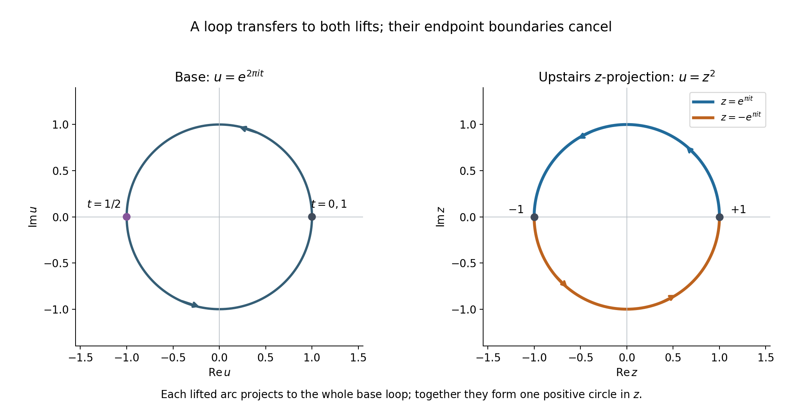
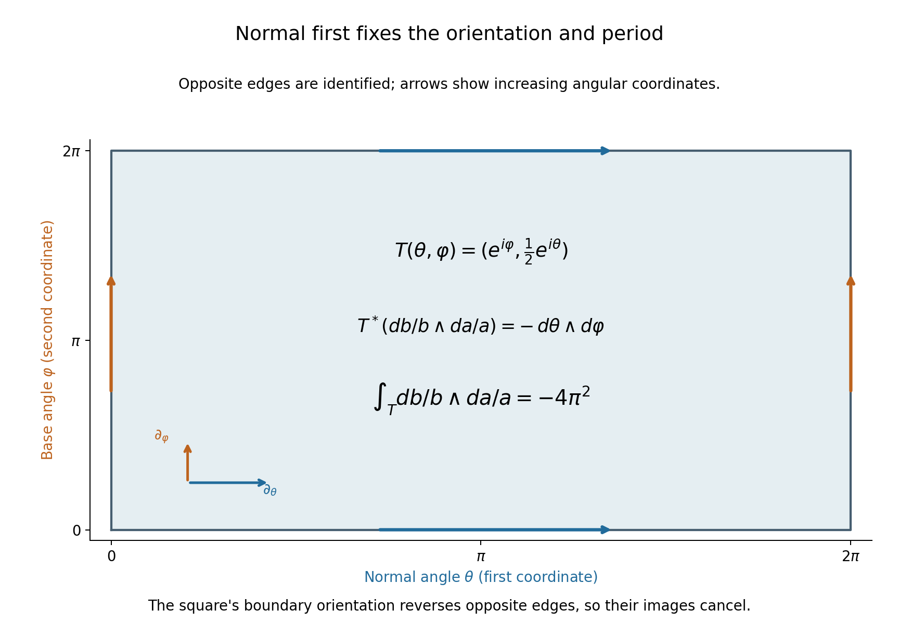

# Finite covers and normal circles in projective complements

*Written by GPT-6.1 Sol (OpenAI), October 2026. Self-checked by the writing AI. Public domain (CC0).*

A small normal circle around a hyperplane carries homological information about that hyperplane. To show that this information survives in the complement, we need one homology group of the ambient projective complement to vanish. A concrete finite cover provides that vanishing.

Basic references are Allen Hatcher's *Algebraic Topology* [H], Arthur Sard's critical-value paper [S], and Atiyah, Bott and Gårding's projective-cycle methods [A]. The complete proof below gives the covering, simplex lifting, chain transfer and homology deduction. The preceding [Rational top forms detect cycles in a hypersurface complement](../AN02-L182.html) supplies the exact critical-value and semialgebraic finiteness lemmas, as well as the rational period theorem. [Ordinary finite-chain Morse handles](../AN02-L125.html) supplies the relative sublevel proof. The oriented normal bundle and Thom/excision map are constructed in [Projective exhaustion and the finite-chain tube receiver](../AN02-L124.html#tp6-the-included-normal-bundle-argument-and-the-tube-deduction).

## 1. The two spaces and the missing homology group

Let \(F\) be a nonzero homogeneous polynomial of degree \(m\geq1\) in \(d+1\) complex variables, \(d\geq1\). We compare
\[
 U=\mathbb P^d\setminus\{F=0\},\qquad
 X=\{Z\in\mathbb C^{d+1}:F(Z)=1\}.
 \tag{1}
\]
The removed zero set may have singular points or repeated factors. The affine level \(X\) is smooth. Euler's identity gives
\[
 \sum_{j=0}^d Z_jF_{Z_j}=mF=m\ne0\quad\hbox{on }X,
 \tag{2}
\]
so its differential cannot vanish there. The map
\[
 p:X\longrightarrow U,\qquad Z\longmapsto[Z]
 \tag{3}
\]
has \(m\) points in each fiber: on a projective line the equation is \(\lambda^mF(Z)=1\). Local logarithms of the nonzero value of \(F\) give the \(m\) distinct holomorphic branches. Thus (3) is an \(m\)-sheeted covering, possibly disconnected, with a specified cyclic action by the \(m\)-th roots of unity.

A generic squared distance \(\rho_a(Z)=|Z-a|^2\) on \(X\) is proper, strictly plurisubharmonic and Morse. Its polynomial critical equations have only finitely many solutions. The equal-dimensional critical-value proof gives nondegeneracy, and semialgebraic projection turns discreteness into finiteness. The Morse indices are at most the complex dimension \(d\). The finite-chain handle argument therefore gives
\[
 H_j(X;R)=0\quad(j>d)
 \tag{4}
\]
for any coefficient ring \(R\), and finite-dimensional groups in every degree over a field.

To descend (4), lift each singular simplex in \(U\) in all \(m\) possible ways and sum those lifts. This defines the chain transfer
\[
 \operatorname{tr}:C_j(U;R)\longrightarrow C_j(X;R),
 \qquad p_\#\operatorname{tr}=mI.
 \tag{5}
\]
Restriction of all lifts to a face gives all lifts of that face, each once; hence the transfer commutes with the boundary. Over the rationals we can divide by \(m\), so its homology map is injective and
\[
 H_j(U;\mathbb Q)=0\quad(j>d).
 \tag{6}
\]
The same conclusion holds for any coefficient ring in which \(m\) is invertible. For integral coefficients the displayed transfer argument gives only \(mH_j(U;\mathbb Z)=0\) above \(d\). This is a limit of that inference, not an assertion that those particular integral groups must be nonzero.

## 2. The normal disc and its boundary

For a nonzero linear form \(L\), put
\[
 Y=U\cap\{L=0\},\qquad V=U\setminus Y
                         =\mathbb P^d\setminus\{FL=0\}.
 \tag{7}
\]
The hyperplane section \(Y\) is a closed smooth complex hypersurface of \(U\). It is allowed to be empty. Its real rank-two normal bundle has a canonical complex orientation.

The exact homological Thom/excision construction gives an isomorphism
\[
 \Theta:H_{d-1}(Y;\mathbb Q)
             \xrightarrow{\ \cong\ }H_{d+1}(U,V;\mathbb Q).
 \tag{8}
\]
Locally it crosses a base cycle with a positive normal two-disc, disc first. The relative boundary is its positive normal circle, circle first:
\[
 \tau=\partial_{U,V}\Theta:
          H_{d-1}(Y;\mathbb Q)\longrightarrow H_d(V;\mathbb Q).
 \tag{9}
\]
The exact sequence of the pair has the segment
\[
 H_{d+1}(U;\mathbb Q)\longrightarrow H_{d+1}(U,V;\mathbb Q)
                          \longrightarrow H_d(V;\mathbb Q).
 \tag{10}
\]
The first group vanishes by (6). Therefore the second arrow is injective, and so is the tube (9).

The cover degree and the local tube coefficient are different quantities. The cover has degree \(m\), used in the homology transfer. A positive normal disc has boundary one positive normal circle. Its local tube coefficient is one, independent of \(m\). Interchanging the normal circle with a base cycle of dimension \(d-1\) changes the orientation by \((-1)^{d-1}\).

Combining this injection with the preceding rational period theorem gives an exact test. In coordinates \(Z_0=L,Z_1,\ldots,Z_d\), let
\[
 \omega=\sum_{j=0}^d(-1)^jZ_j\,dZ_0\wedge\cdots
                   \wedge\widehat{dZ_j}\wedge\cdots\wedge dZ_d.
 \tag{11}
\]
If the tube of \(\beta\in H_{d-1}(Y;\mathbb Q)\) has zero period against every
\[
 \frac{P\omega}{F^kL^s},\qquad k,s\geq1,\qquad
               \deg P=mk+s-d-1,
 \tag{12}
\]
then \(\beta=0\). Indeed those forms detect its tube class in \(H_d(V;\mathbb Q)\), and the tube map is injective. A specified affine cycle must still be compared with this precise projective map; neither the cover nor the period test determines that comparison's sign or multiplicity on its own.

## 3. Four worked examples

### Example 1. A repeated factor and a disconnected cover

Take \(F=Z_0^m\). Then \(U=\{Z_0\ne0\}\cong\mathbb C^d\), with coordinates \(u_j=Z_j/Z_0\). Upstairs,
\[
 X=\bigcup_{\zeta^m=1}\{Z_0=\zeta\},
 \tag{13}
\]
the disjoint union of \(m\) affine \(d\)-planes. On the component \(Z_0=\zeta\), the map sends
\((\zeta,Z_1,\ldots,Z_d)\) to \(u_j=Z_j/\zeta\).
For a simplex \(\sigma\) with chart coordinates \(\sigma_j\), its transfer is
\[
 \operatorname{tr}\sigma=
       \sum_{\zeta^m=1}
          \bigl(y\longmapsto(\zeta,\zeta\sigma_1(y),\ldots,
                                             \zeta\sigma_d(y))\bigr).
 \tag{14}
\]
Each summand projects to exactly \(\sigma\), giving \(p_\#\operatorname{tr}\sigma=m\sigma\) on chains.

Repeated factors cause no smoothness problem on \(F=1\). They can make the cover disconnected. In this example permutations of the \(m\) components also give deck transformations, so the specified cyclic root action need not be the entire deck group. Its free transitive action on each fiber is all the transfer calculation requires.

### Example 2. A loop whose individual lifts are not loops

Take \(d=1\), \(F=Z_0Z_1\), \(m=2\). The affine level is \(zw=1\), parametrized by \(z\in\mathbb C^*\), \(w=1/z\). On \(U\), use the coordinate \(u=Z_0/Z_1\). Then
\[
 p(z)=z^2.
 \tag{15}
\]
The positively oriented base loop \(\gamma(t)=e^{2\pi it}\), \(0\leq t\leq1\), has two lifts
\[
 \widetilde\gamma_+(t)=e^{\pi it},\qquad
 \widetilde\gamma_-(t)=-e^{\pi it}.
 \tag{16}
\]
The first runs from \(1\) to \(-1\), and the second from \(-1\) to \(1\). Neither is individually a cycle, but their boundaries cancel:
\[
 \partial(\widetilde\gamma_++\widetilde\gamma_-)
          =([-1]-[1])+([1]-[-1])=0.
 \tag{17}
\]
The transfer is the positive full circle upstairs. Projecting it yields \(2\gamma\), because each parametrized half-circle projects to the same whole base loop.

The normalized upstairs period is
\[
 \int_{\operatorname{tr}\gamma}\frac{dz}{2\pi iz}
         =\tfrac12+\tfrac12=1.
 \tag{18}
\]
Meanwhile \(p^*(du/u)=2\,dz/z\). Thus the pulled-back base period on the transferred chain is two, in agreement with (5). Confusing (18) with the period of the pulled-back base form would lose the factor two.

*Figure 1. The base coordinate is \(u=e^{2\pi it}\), while the two upstairs coordinates are \(z=e^{\pi it}\) and \(z=-e^{\pi it}\), with \(w=1/z\) on \(X=\{zw=1\}\). The diagram shows the base plane and the upstairs \(z\)-projection, rather than all four real coordinates of \(X\). Equal parameter labels have the same base image. Arrows use increasing \(t\); the two half-circle endpoints cancel exactly as in (17). The transfer projects to twice the base loop but has the upstairs period (18). Formal Proposition 4.1 fixes both chain identities. Original coordinate diagram, CC0; transfer method context [H].*

### Example 3. A point, a normal disc and one circle

Take \(d=1\), \(F=Z_0^m\), \(L=Z_1\). In the affine coordinate \(v=Z_1/Z_0\),
\[
 U=\mathbb C,\qquad Y=\{0\},\qquad V=\mathbb C^*.
 \tag{19}
\]
The positive generator \([0]\) of ordinary \(H_0(Y;\mathbb Q)\) transfers under the Thom map to the relative class of a positively oriented small disc in \(U\). Its relative boundary is
\[
 v=\varepsilon e^{i\theta},\qquad0\leq\theta\leq2\pi,
 \tag{20}
\]
with coefficient one. Its period of \(dv/(2\pi iv)\) is one, proving directly that the tube is nonzero and injective.

The degree \(m\) of the separate affine covering in Example 1 does not appear in this normal boundary. Also, the source here is ordinary \(H_0\) of a point, not its reduced homology. A two-point affine equator with total coefficient zero is a different degree-zero cycle; its relation to a projective point must be computed in the specific geometric comparison.

### Example 4. Normal circle first on an exact product

Take \(d=2\), \(F=Z_0Z_1\), \(L=Z_2\). In the chart \(Z_0=1\), set \(a=Z_1/Z_0\), \(b=Z_2/Z_0\). Then
\[
 U=\mathbb C^*\times\mathbb C,\quad
 Y=\mathbb C^*\times\{0\},\quad
 V=(\mathbb C^*)^2.
 \tag{21}
\]
For the positive base loop \(a=e^{i\varphi}\), its normal-circle-first tube is
\[
 T(\theta,\varphi)=(e^{i\varphi},\varepsilon e^{i\theta}),
       \qquad0\leq\theta,\varphi\leq2\pi,
 \tag{22}
\]
oriented by the parameter order \((\theta,\varphi)\). It is the boundary of a normal-disc-first relative chain; the base circle is closed, so the product boundary gives it with coefficient one.

For the normal-first rational form,
\[
 T^*\!\left(\frac{db}{b}\wedge\frac{da}{a}\right)
      =(i\,d\theta)\wedge(i\,d\varphi)
                      =-\,d\theta\wedge d\varphi,
 \tag{23}
\]
and hence
\[
 \int_T\frac{db}{b}\wedge\frac{da}{a}
                  =-4\pi^2=(2\pi i)^2.
 \tag{24}
\]
The normalized form \((2\pi i)^{-2}(db/b)\wedge(da/a)\) has period one. Reversing the order of the two circle coordinates, or the wedge order alone, changes the sign. Reversing both preserves it.

*Figure 2. The plotted square is the parameter domain of the exact map (22). Opposite edges are identified with the same angular orientation; the map's domain order is \((\theta,\varphi)\), normal angle first. The displayed tangent directions and ordered differential \(d\theta\wedge d\varphi\) give the orientation. The pullback coefficient is \(-1\), so integrating over the full square gives (24). This is a parameter diagram of a torus in \(\mathbb C^2\), not a spatial embedding of the ambient four-dimensional space. Formal (29) gives the positive normal boundary coefficient, and Proposition 4.1 keeps that coefficient distinct from the covering degree. Original exact diagram, CC0; normal-tube method context [A].*

## 4. Exercises, 100 points

1. **Homogeneity and smoothness, 10 points.** Derive Euler's identity by monomials. Apply it to \(F(Z)=Z_0^2Z_1^2\) to prove that \(F=1\) is smooth, despite the repeated factors. Show that this affine level has two components, while its cover of the projective complement has four points in each fiber.
2. **Three lifts and one transferred cycle, 12 points.** For \(q:\mathbb C^*\to\mathbb C^*\), \(q(z)=z^3\), write all lifts of the positive unit loop. Compute their endpoints, show the sum is a cycle, and compute its period of \(dz/(2\pi iz)\) and of \(q^*(du/(2\pi iu))\).
3. **The transfer on a face, 12 points.** Prove that restrictions of all lifts of a singular two-simplex to any selected edge give all lifts of that edge, each exactly once. Use this to verify the signs in the transfer's boundary identity. Explain why selecting just one lift is insufficient for a chain map without additional choices.
4. **The polynomial normal equations, 14 points.** Write the equations defining the critical pairs of \(|Z-a|^2\) on \(F=1\). Derive the tangent Hessian formula and show why a regular value of the normal-parameter map makes it nonsingular. Explain why its domain and target have equal real dimension.
5. **What division by the degree proves, 12 points.** Suppose \(q:E\to B\) has degree six and \(H_j(E;R)=0\). Use the transfer to determine what is proved about \(H_j(B;R)\) for \(R=\mathbb Q,\mathbb F_5,\mathbb F_2,\mathbb Z\). Distinguish absence of an implication from evidence of a nonzero group.
6. **The normal-first sign, 12 points.** In a trivial normal bundle over a two-dimensional cycle, compute the boundary of \(D^2\times c\). What sign appears on moving the normal circle after that cycle? Repeat for a three-dimensional cycle. Explain why the two-disc's order gives a different sign calculation from the circle's order.
7. **One point and two points, 12 points.** In Example 3 compute ordinary and reduced \(H_0(Y;\mathbb Q)\). Compare it with the reduced class \([p_+]-[p_-]\) in a two-point space. If both points are mapped to the same projective point, compute the image of that class. Explain why this simple map does not settle a deformed affine equator's geometric comparison.
8. **From periods to a zero base class, 16 points.** Let \(\beta\in H_{d-1}(Y;\mathbb Q)\) have tube with zero periods against all forms (12). Give the complete deduction of \(\beta=0\), citing the exact preceding theorem and the coefficient comparison where needed. For Example 4, compute the normalized period if only the normal-circle orientation is reversed. State the further data needed before applying this receiver to a separately specified affine cycle.

## 5. Complete solutions

### Solution 1

For a monomial \(Z^\alpha\) of total degree \(m\), differentiation gives
\(\sum_jZ_j\partial_{Z_j}Z^\alpha=\sum_j\alpha_jZ^\alpha=mZ^\alpha\).
Summing over its coefficients gives \(\sum_jZ_jF_{Z_j}=mF\). On \(F=1\) the right side is nonzero, so at least one derivative is nonzero. **4 points.**

For \(F=Z_0^2Z_1^2\), \(m=4\); on the level both coordinates are nonzero, and directly \(F_{Z_0}=2Z_0Z_1^2\ne0\). The equation is
\((Z_0Z_1)^2=1\), so the level is the disjoint union of \(Z_0Z_1=1\) and \(Z_0Z_1=-1\), each isomorphic to \(\mathbb C^*\) by its first coordinate. These are the two connected components. **3 points.** In each projective line not meeting the removed divisor, \(\lambda^4F(Z)=1\) has four distinct roots. The cover therefore has degree four, with two points in each of the two components over every base point. Component count and sheet count are distinct. **3 points.**

### Solution 2

Let \(\zeta=e^{2\pi i/3}\). The lifts are
\[
 \widetilde\gamma_j(t)=\zeta^j e^{2\pi it/3},
                     \qquad j=0,1,2.
 \tag{25}
\]
They start at \(\zeta^j\) and end at \(\zeta^{j+1}\), with indices modulo three. Their boundaries sum to
\(\sum_j([\zeta^{j+1}]-[\zeta^j])=0\).
This is a cycle, though none of its three arcs is closed alone. **5 points.**

On every arc, \(dz/z=(2\pi i/3)\,dt\), so its normalized period is \(1/3\). The sum has period one. **3 points.** The pulled-back normalized base form is
\[
 q^*\!\left(\frac{du}{2\pi iu}\right)
                   =3\,\frac{dz}{2\pi iz}.
 \tag{26}
\]
Its transferred period is therefore three. On chains \(q_\#\operatorname{tr}\gamma=3\gamma\), which has the same base period. **4 points.**

### Solution 3

Fix a point on the selected edge. Evaluation there bijects all lifts of the two-simplex with the covering fiber, by Lemma 3.1. It also bijects all lifts of the edge simplex with that same fiber. Restriction preserves the value at this point. Hence the restriction correspondence is a bijection, and every edge lift appears exactly once. This does not require the originally chosen vertex to lie on that edge. **5 points.**

For ordered vertices \(v_0,v_1,v_2\), the simplex boundary is
\([v_1,v_2]-[v_0,v_2]+[v_0,v_1]\).
Each restricted collection is precisely its edge transfer; the alternating signs are unchanged by lifting. Therefore
\[
 \partial\operatorname{tr}\sigma
   =\operatorname{tr}(\sigma|_{12})
        -\operatorname{tr}(\sigma|_{02})
        +\operatorname{tr}(\sigma|_{01})
   =\operatorname{tr}\partial\sigma.
 \tag{27}
\]
**4 points.** A single lift depends on a chosen point of a fiber. Independently chosen lifts on faces need not be its restrictions. The once-traversed loop in Example 2 already shows a selected lift can have nonzero boundary although the base chain has zero boundary. Summing all lifts cancels that choice and yields the canonical chain map. **3 points.**

### Solution 4

With \(g_1=\operatorname{Re}F-1\), \(g_2=\operatorname{Im}F\), the critical pairs satisfy
\[
 g_1=g_2=0,\qquad
 Z-a=\lambda_1\nabla g_1+\lambda_2\nabla g_2.
 \tag{28}
\]
The gradients span the normal space, so this is exactly the vanishing of the tangent derivative of \(|Z-a|^2\). **3 points.**

For a curve \(Z(s)\) in the level with tangent \(v\), twice differentiating \(g_j(Z(s))=0\) gives
\(\nabla g_j\cdot Z''=-v\cdot\operatorname{Hess}g_jv\).
Consequently the restricted Hessian is
\[
 B(v,t)=2v\cdot
       \left(I-\sum_{j=1}^2\lambda_j\operatorname{Hess}g_j\right)t .
 \tag{29}
\]
The diagonal calculation follows from the second derivative of the distance; polarization gives the displayed bilinear form. **5 points.**

The domain of the normal-parameter map is \(X\times\mathbb R^2\), of dimension \(2d+2\), the same as the ambient target. Its differential is \(Av-\sum_j\mu_j\nabla g_j\). Tangent projection is \(P_TAv\). A tangent kernel vector can be completed by \(\mu\) to a kernel of the full differential, because its \(Av\) is normal; conversely full invertibility gives tangent invertibility. Regularity of the chosen center therefore makes the tangent Hessian nonsingular. **6 points.**

### Solution 5

The identity on homology is \(q_*\operatorname{tr}_*=6I\). If the upstairs group in this degree is zero, its transfer is zero, so \(6h=0\) for every base class. **3 points.**

Over \(\mathbb Q\), six is invertible, so \(h=0\). Over \(\mathbb F_5\), six equals one, and the same argument gives \(h=0\). **3 points.** Over \(\mathbb F_2\), six equals zero; \(6h=0\) imposes no new restriction. Over \(\mathbb Z\), the proved conclusion is annihilation by six, which does not exclude nonzero torsion. **4 points.** These last two deductions do not assert a nonzero group exists. They state the information supplied by this transfer identity alone; a separate geometric argument could prove more. **2 points.**

### Solution 6

For a cycle \(c\), \(\partial c=0\), and the product boundary identity gives
\[
 \partial(D^2\times c)
       =(\partial D^2)\times c+(-1)^2D^2\times\partial c
       =S^1\times c.
 \tag{30}
\]
The positive normal circle is first, with coefficient one. **4 points.** If \(\dim c=2\), moving that one-dimensional circle after \(c\) changes the orientation by \((-1)^{1\cdot2}=+1\). If \(\dim c=3\), the sign is \((-1)^3=-1\). **4 points.** Moving the two-disc instead gives \((-1)^{2\dim c}=+1\) in both cases. The relative disc product can therefore agree with a fiber-last Thom convention while the circle order on its boundary carries a nontrivial sign. The dimensions of the factors, rather than their descriptive names, determine the signs. **4 points.**

### Solution 7

For the one-point space \(Y\), ordinary \(H_0(Y;\mathbb Q)=\mathbb Q\), generated by its positive point. The augmentation is the identity, so reduced \(H_0(Y;\mathbb Q)=0\). The ordinary point nevertheless maps to the nonzero circle in Example 3. **4 points.**

A two-point space has ordinary \(H_0=\mathbb Q^2\) and reduced \(H_0=\{(a,b):a+b=0\}\cong\mathbb Q\), generated by \([p_+]-[p_-]\). Mapping both points to the same point sends that generator to \([p]-[p]=0\) in ordinary \(H_0(Y)\). **4 points.** A deformed affine equator may project to different points, may use a specified inherited orientation, and participates in an actual normal-tube comparison. Its relevant projective class is determined by that full map and cycle, not by replacing its domain with an undeformed two-point set whose images were chosen equal. Those maps and orientations must be computed before applying the receiver. **4 points.**

### Solution 8

The exact preceding Corollary 8.1 in *Rational top forms detect cycles in a hypersurface complement* proves that (12) detects ordinary rational \(d\)-cycle homology on \(V\). It includes the singular and repeated divisor cases and the positive pole exponents. Thus the vanished periods give \(\tau\beta=0\) in \(H_d(V;\mathbb Q)\). One may express the same deduction through complex de Rham detection and then use the faithful map \(H_d(V;\mathbb Q)\to H_d(V;\mathbb C)\), proved in *When zero smooth periods mean that a cycle bounds*. **6 points.**

The affine-level Morse argument and the transfer give \(H_{d+1}(U;\mathbb Q)=0\). The pair sequence therefore makes its relative boundary injective. The exact complex-oriented Thom/excision map is an isomorphism, so its composition with that relative boundary, namely \(\tau\), is injective. Hence \(\beta=0\). **5 points.**

In Example 4, reversing only the normal circle changes the orientation of the tube by \(-1\). Its normalized period becomes \(-1\). **2 points.** To apply the conclusion to another affine cycle, one needs the actual projectivization of that cycle, its relation to the normal-tube map, the inherited orientation, any hemisphere multiplicity or scalar, the coefficient convention and any reduced degree-zero interpretation. The projective receiver supplies none of those identifications automatically. **3 points.**

## 6. What the geometric application still needs

The projective homology bound and the normal-tube injection have now been proved over the coefficient field used by the rational period theorem. The full proof below also supplies the simplex lifting, including why a lift varies continuously with its endpoint.

The next geometric application must identify its actual affine equator with the specified projective class and tube. It must retain orientation and multiplicity, especially in the two-point case. A component argument additionally needs the analytic continuation and all-powers conclusions appropriate to that application. The result here supplies the general projective receiver at its exact internal Thom and finite-chain foundations.

## References

[H] Allen Hatcher, *Algebraic Topology*, Cambridge University Press (2002), §3.G, “Transfer Homomorphisms”. [Author's freely readable text](https://pi.math.cornell.edu/~hatcher/AT/AT.pdf). The transfer required here is proved in full.

[S] Arthur Sard, *The measure of the critical values of differentiable maps*, Bulletin of the American Mathematical Society **48** (1942), 883–890. [Original article](https://webhomes.maths.ed.ac.uk/~v1ranick/papers/sard.pdf). The exact equal-dimensional case has a complete preceding internal proof.

[A] Michael Atiyah, Raoul Bott and Lars Gårding, *Lacunas for hyperbolic differential operators with constant coefficients, II*, Acta Mathematica **131** (1973), 145–206. [Primary article](https://archive.ymsc.tsinghua.edu.cn/pacm_download/117/6156-11511_2006_Article_BF02392039.pdf). Historical context for the projective tube method; the required homology and transfer arguments are supplied here.

Original exposition and diagrams are CC0-1.0. The linked historical works retain their own rights and are not reproduced.

## Complete proof

Let \(F\) be a nonzero homogeneous complex polynomial of degree \(m\geq1\) in \(d+1\) variables, with \(d\geq1\). Put
\[
 U=\mathbb P^d\setminus\{F=0\}.
 \tag{1}
\]
We prove the ordinary rational homology bound \(H_j(U;\mathbb Q)=0\) for \(j>d\), then apply it to the positive-normal-circle tube of a hyperplane section. Singularities and repeated factors of the removed divisor are permitted.

The construction is elementary at the level of finite chains. The affine level \(F=1\) is a smooth closed hypersurface and a finite cyclic cover of \(U\). A proper squared distance on that level has finitely many Morse critical points; a transfer that sums all lifts of a simplex descends the homology bound. The subsequent tube argument uses the exact already written homological Thom and tubular-neighborhood construction.

Basic references are Allen Hatcher's *Algebraic Topology* [H] for finite-cover transfer, Arthur Sard's critical-value theorem [S], and Atiyah, Bott and Gårding's projective-cycle arguments [A]. The needed transfer is proved here. The exact internal inputs are [Rational top forms detect cycles in a hypersurface complement, Lemmas 6.1–6.2](../AN02-L182.html#6-why-the-graph-has-finite-dimensional-ordinary-homology), for equal-dimensional critical values and finite discrete semialgebraic sets; [Ordinary finite-chain Morse handles](../AN02-L125.html#mh0-statement-coefficients-and-boundary-cases), for the actual relative sublevel groups and the passage to finite-chain homology; and [Projective exhaustion and the finite-chain tube receiver](../AN02-L124.html#tp6-the-included-normal-bundle-argument-and-the-tube-deduction), for the explicitly oriented homological Thom/excision map. Their stated lower smooth and finite-chain foundations are retained. This argument does not require a general Stein homology theorem or a globally constructed Morse perturbation.

## 1. A smooth affine level with a cyclic covering map

Define
\[
 X=\{Z\in\mathbb C^{d+1}:F(Z)=1\},\qquad
 p:X\longrightarrow U,\quad Z\longmapsto[Z].
 \tag{2}
\]

**Proposition 1.1.** The set \(X\) is a closed smooth complex manifold of dimension \(d\). The map \(p\) is an \(m\)-sheeted covering by holomorphic local diffeomorphisms. Multiplication by the \(m\)-th roots of unity supplies a free transitive cyclic deck action on every fiber. The covering need not be connected.

**Proof.** Euler's polynomial identity is
\[
 \sum_{j=0}^{d} Z_j\frac{\partial F}{\partial Z_j}(Z)=mF(Z).
 \tag{3}
\]
It follows by checking each degree-\(m\) monomial and summing. On \(X\), the right side is \(m\ne0\), so the complex differential of \(F\) is nonzero. A coordinate partial derivative is therefore nonzero. The inverse function theorem in that coordinate gives a smooth complex hypersurface, of dimension \(d\). Closedness follows from continuity of \(F\), and \(0\notin X\).

Given \([Z]\in U\), all representatives on its line have the form \(\lambda Z\), \(\lambda\ne0\). They belong to \(X\) exactly when
\[
 \lambda^mF(Z)=1.
 \tag{4}
\]
This equation has exactly \(m\) distinct nonzero complex roots, since \(F(Z)\ne0\) and its derivative at a root is \(m\lambda^{m-1}F(Z)\ne0\). Thus each fiber has \(m\) points.

For the local covering description choose a projective chart section \(s(y)\) near a point of \(U\). Shrink its domain \(B\) so that \(F(s(y))\) takes its values in a disk not containing zero. On this disk a holomorphic logarithm \(\ell\) exists. Explicitly, centered at a nonzero value \(b\), take a smaller disk with \(|(z-b)/b|<1\), choose one logarithm of \(b\), and use the convergent power series for \(\log(1+(z-b)/b)\). It exponentiates to \(z\). Put
\[
 t(y)=\exp\bigl(-\ell(F(s(y)))/m\bigr)s(y).
 \tag{5}
\]
Then \(F(t(y))=1\). If \(\zeta=e^{2\pi i/m}\), all the local inverse sections of \(p\) are
\[
 t_j(y)=\zeta^j t(y),\qquad 0\leq j<m.
 \tag{6}
\]
They are distinct and holomorphic. Every point of \(p^{-1}(B)\) is in exactly one of their images. In the chart representation \(Z=\lambda s(y)\), the factor \(\lambda\) is a continuous holomorphic coordinate, so these finite disjoint sections are open branches of \(p^{-1}(B)\). This proves the evenly covered local description and the local diffeomorphism claim.

Multiplication by \(\zeta^j\) preserves \(X\) and is a deck transformation. Its action on every fiber is free and transitive, directly by (4). We use this specified cyclic action; it need not exhaust all deck transformations when the covering is disconnected. For example \(F(Z)=Z_0^m\) gives \(m\) separate affine \(d\)-planes in \(X\), mapping onto the single affine chart \(U\). \(\square\)

## 2. A finite-critical-point squared distance on the affine level

**Proposition 2.1.** Some \(a\in\mathbb C^{d+1}\) makes
\[
 \rho_a(Z)=|Z-a|^2\quad(Z\in X)
 \tag{7}
\]
a bounded-below proper strictly plurisubharmonic Morse function with finitely many critical points.

**Proof.** Write the ambient affine space as \(\mathbb R^N\), \(N=2d+2\). Put
\[
 g_1=\operatorname{Re}F-1,\qquad
 g_2=\operatorname{Im}F,\qquad n_j=\nabla g_j .
 \tag{8}
\]
These are real polynomial data. Their two gradients are independent on \(X\): the nonzero complex differential of \(F\), established in (3), is real-surjective onto \(\mathbb C\cong\mathbb R^2\). The gradients span the real normal space to \(X\).

Consider the smooth map
\[
 \Phi:X\times\mathbb R^2\longrightarrow\mathbb R^N,\qquad
 \Phi(Z,\lambda)=Z-\lambda_1n_1(Z)-\lambda_2n_2(Z).
 \tag{9}
\]
Its domain has real dimension \(2d+2=N\), the same as its target. The manifold \(X\) is a second-countable subspace of Euclidean space. Its implicit-function charts therefore have a countable subcover, and their products with countably many open boxes cover \(X\times\mathbb R^2\) by countably many coordinate domains. To justify the subcover, each chart contains a member of a countable topological basis around any point; for every basis member contained in a chart choose one such chart. Those choices cover the manifold.

In each coordinate domain, the equal-dimensional critical-value lemma cited above applies to \(\Phi\). The set of its critical values is a countable union of measure-zero sets and hence has measure zero. Choose \(a\) outside that union. Then \(a\) is a regular value of (9), in every chart and thus intrinsically.

A critical point of (7) satisfies precisely
\[
 Z-a=\lambda_1n_1(Z)+\lambda_2n_2(Z)
 \tag{10}
\]
for a unique pair \(\lambda\). At a solution put
\[
 A=I-\lambda_1\operatorname{Hess}g_1
        -\lambda_2\operatorname{Hess}g_2 .
 \tag{11}
\]
The restricted real Hessian of \(\rho_a\) is \(B(v,t)=2\,v\cdot At\) for \(v,t\in T_ZX\). Indeed, for a curve \(Z(s)\) in \(X\) with \(Z'(0)=v\), differentiating \(g_j(Z(s))=0\) twice gives \(n_j\cdot Z''(0)=-v\cdot(\operatorname{Hess}g_j)v\). Inserting (10) into the second derivative of \(|Z(s)-a|^2\) gives the asserted diagonal Hessian; polarization gives the bilinear expression.

The differential of (9) is
\[
 D\Phi(v,\mu)=Av-\mu_1n_1-\mu_2n_2 .
 \tag{12}
\]
Its tangent projection is \(P_TAv\), half the Hessian operator. If this tangent operator is invertible, its output determines \(v\), and the normal output then uniquely determines \(\mu\). Conversely a nonzero tangent kernel vector has \(Av\) normal, so a unique \(\mu\) gives a nonzero kernel vector in (12). Thus (12) is invertible exactly when the restricted Hessian is nonsingular. Regularity of \(a\) makes all the critical points Morse.

The actual solution set for their critical pairs is
\[
 S_a=\{(Z,\lambda)\in\mathbb R^{N+2}:
       g_1(Z)=g_2(Z)=0,\ 
       Z-a=\lambda_1n_1(Z)+\lambda_2n_2(Z)\}.
 \tag{13}
\]
It is semialgebraic, by its polynomial equations. The inverse function theorem makes each preimage of \(a\) in (9) isolated. The embedded coordinates of \(X\times\mathbb R^2\) have the Euclidean subspace topology, so \(S_a\) is discrete as a subset of \(\mathbb R^{N+2}\). The finite-discrete-semialgebraic lemma cited above makes it finite. Hence (7) has finitely many critical points, without a compactness assumption on the critical set.

Since \(X\) is closed, its intersection with a closed ambient ball is compact. This proves properness of (7); it is nonnegative. In any holomorphic local parametrization \(Z=Z(y)\), its Levi form is
\[
 \mathcal L_{\rho_a}(v)
       =\sum_{j=0}^{d}|dZ_j(v)|^2>0\quad(v\ne0),
 \tag{14}
\]
because the parametrization is an immersion. The center \(a\) contributes constants and has no effect on this Levi form. Thus the function is strictly plurisubharmonic. No smoothness or square-free assumption on the removed projective divisor was used. \(\square\)

**Corollary 2.2.** For any coefficient ring \(R\), ordinary finite-chain \(H_j(X;R)\) vanishes for \(j>d\). For a field \(R\), all these groups are finite dimensional.

**Proof.** At a critical point of a smooth strictly plurisubharmonic function the real Hessian obeys
\[
 B(v,v)+B(Jv,Jv)=4\mathcal L_{\rho_a}(v)>0\quad(v\ne0).
 \tag{15}
\]
Expansion of the Wirtinger derivatives gives this identity, with the factor four, as proved in the cited finite-chain handle lesson. If a negative subspace \(W\) had dimension \(r>d\), then \(\dim(W\cap JW)\geq2r-2d>0\). For \(0\ne v=Jw\in W\cap JW\), also \(Jv=-w\in W\); both real Hessian terms would be negative, contradicting (15). Every Morse index is therefore at most \(d\).

The exact handle theorem gives an increasing open sublevel cover, starting empty, whose relative group at each critical step is a finite sum of copies of \(R\) in the crossed indices. There are finitely many such points and values by Proposition 2.1. The pair exact sequences show inductively that every sublevel group above degree \(d\) is zero. Over a field, the exact segment
\[
 H_j(W_{i-1};R)\longrightarrow H_j(W_i;R)
                         \longrightarrow H_j(W_i,W_{i-1};R)
 \tag{16}
\]
also proves finite dimensionality: the first term bounds the kernel dimension, and the finite relative term bounds the image dimension.

Choose a regular sublevel above all critical values. Later relative groups are zero, so the pair sequences make all later absolute maps isomorphisms. The finite-chain direct-limit statement in the cited theorem applies: a finite cycle or bounding chain has compact image and lies in one of the increasing open stages. Thus the groups of the whole \(X\) are those of that single finite stage. This proves vanishing over all \(R\) and finite dimensionality over fields. It does not assert a cellular chain complex or forget possible attaching-map cancellations. \(\square\)

## 3. Lifting simplices without a hidden covering-space premise

We need the covering transfer for arbitrary continuous singular simplices. Its construction requires the following elementary lifting fact.

**Lemma 3.1.** If \(q:E\to B\) is a finite covering, \(\sigma:\Delta^j\to B\) is continuous, and \(v_0\) is a vertex of the simplex, then every \(e_0\in q^{-1}(\sigma(v_0))\) determines a unique continuous lift \(\widetilde\sigma:\Delta^j\to E\) with \(\widetilde\sigma(v_0)=e_0\). Evaluation at any point of the simplex bijects the set of all lifts with the fiber over that point. If \(E,B\) are smooth and the covering branches are local diffeomorphisms, a smooth simplex has smooth lifts.

**Proof.** First a continuous path \(\gamma:[0,1]\to B\) has a unique lift from a specified initial fiber point. Pull back the evenly covered neighborhoods to an open cover of its compact parameter interval and choose a finite subdivision so the image of each closed segment lies in one such neighborhood. On the first segment choose the inverse branch containing the specified starting point. At the next endpoint choose the unique branch containing that endpoint, and continue. The branches agree at each endpoint and give a continuous lift. Another lift must agree on the first segment by its branch and starting value, and then successively on every segment. Equivalently the agreement set is open and closed along the parameter interval. Thus the path lift is unique.

For each \(y\in\Delta^j\), lift the radial path
\[
 \gamma_y(t)=\sigma((1-t)v_0+ty)
 \tag{17}
\]
from \(e_0\), and define \(\widetilde\sigma(y)\) to be its endpoint. This definition always projects to \(\sigma(y)\); for \(y=v_0\) it gives \(e_0\).

We prove its continuity instead of assuming it. Fix \(y_*\). Compactness and continuity give a finite partition \(0=t_0<\cdots<t_s=1\) such that, on each closed segment, \(\gamma_{y_*}\) lies in an evenly covered neighborhood \(B_\ell\). By first choosing overlapping open parameter segments and a finer subdivision, the closed images can be kept inside those neighborhoods. Uniform continuity of \((t,y)\mapsto\sigma((1-t)v_0+ty)\) near this compact path then makes the same segments lie in \(B_\ell\) for all \(y\) in some relative neighborhood of \(y_*\). On the first segment the fixed initial point selects a branch for all these paths. Its endpoint depends continuously on \(y\). At the next segment, that endpoint stays in the same open branch of \(q^{-1}(B_2)\) after possibly shrinking the neighborhood of \(y_*\). Its branch inverse is continuous, so the next endpoint is continuous. Repeat the finite construction through all the segments. The final endpoint \(\widetilde\sigma(y)\) is continuous near \(y_*\). This holds at every point, including the boundary in its relative topology.

Any continuous lift of \(\sigma\) restricts on every radial path to the unique path lift from \(e_0\), so it equals the constructed map. More generally, two lifts agreeing at one point agree near it by the local branch inverse. Their agreement and disagreement sets are both open: near two unequal fiber points use their distinct covering branches. Connectedness of \(\Delta^j\) makes agreement at one point imply equality everywhere.

Distinct choices of \(e_0\) therefore give distinct values at every point. Conversely, starting the same radial construction at any selected point of \(\Delta^j\) gives a lift from any element of its fiber, since the simplex is convex. This proves the evaluation bijection. In particular an \(m\)-sheeted covering gives exactly \(m\) lifts of every simplex.

For a smooth simplex, at any point of its domain the continuous lift lies in one branch over an evenly covered neighborhood. On a relative neighborhood it is the composition of \(\sigma\) with that smooth local inverse. The smooth extension of \(\sigma\) near the compact simplex gives a local smooth extension of this composition even at its boundary; smoothness is local, so the lift is a smooth simplex. No differentiability of the radial path construction at the vertex is required. \(\square\)

## 4. The chain transfer and its coefficient condition

For any coefficient ring \(R\), singular chains are the free \(R\)-module on continuous singular simplices, each chain being a finite sum. For an \(m\)-sheeted covering \(q:E\to B\) define
\[
 \operatorname{tr}_j(\sigma)
          =\sum_{\widetilde\sigma:\,q\widetilde\sigma=\sigma}
                                    \widetilde\sigma .
 \tag{18}
\]
There are exactly \(m\) terms by Lemma 3.1. Extend linearly. The term “transfer” here denotes this explicit finite-chain operator.

**Proposition 4.1.** The transfer commutes with the singular boundary and satisfies
\[
 q_\#\operatorname{tr}=mI.
 \tag{19}
\]
For the cyclic covering (2), with deck maps \(D_\ell(Z)=\zeta^\ell Z\), it also satisfies
\[
 \operatorname{tr}\,p_\#=\sum_{\ell=0}^{m-1}(D_\ell)_\# .
 \tag{20}
\]
The same identities hold for the induced homology maps and for smooth chains when the covering is smooth.

**Proof.** For each face inclusion \(a_i:\Delta^{j-1}\to\Delta^j\), restrict every lift of \(\sigma\) to that face. These restrictions are exactly all the lifts of \(\sigma a_i\), each once. To check it, evaluate at any one face point. The evaluations of the \(m\) full lifts biject onto its \(m\)-point fiber by Lemma 3.1, and that fiber likewise bijects onto the lifts of the face simplex. Thus
\[
 \begin{aligned}
 \partial\operatorname{tr}_j\sigma
 &=\sum_{\widetilde\sigma}\sum_{i=0}^j
                             (-1)^i\widetilde\sigma a_i\\
 &=\sum_{i=0}^j(-1)^i
           \operatorname{tr}_{j-1}(\sigma a_i)
  =\operatorname{tr}_{j-1}\partial\sigma .
 \end{aligned}
 \tag{21}
\]
For \(j=0\), both boundaries are zero. Each lift projects to the original simplex, so (19) is literal equality of chains.

For (20), take a simplex \(\beta\) in \(X\). Each \(D_\ell\beta\) lifts \(p\beta\). Their values at a vertex run through the fiber, since the deck action is free and transitive there. By Lemma 3.1 these are all the lifts, giving (20). Smoothness of lifts gives the same argument on smooth chains. Chain maps send cycles to cycles and boundaries to boundaries, so the identities pass to ordinary homology. \(\square\)

**Theorem 4.2.** If \(m\) is invertible in the coefficient ring \(R\), then
\[
 H_j(U;R)=0\quad(j>d).
 \tag{22}
\]
For a field of characteristic zero or characteristic not dividing \(m\), every \(H_j(U;R)\) is finite dimensional. For integral coefficients the transfer proof establishes the narrower assertion
\[
 m\,H_j(U;\mathbb Z)=0\quad(j>d).
 \tag{23}
\]
It does not infer integral vanishing from division by \(m\).

**Proof.** Apply Proposition 4.1 to (2). On homology,
\[
 p_*\operatorname{tr}_*=mI .
 \tag{24}
\]
When \(m\) is invertible, \(\operatorname{tr}_*\) is injective. Corollary 2.2 makes its target zero above \(d\), proving (22). Over a field, its target is finite dimensional in every degree, so its injected source is finite dimensional as well.

With integral coefficients and \(j>d\), the target of the transfer is still zero by Corollary 2.2; (24) therefore gives (23). Multiplication by \(m\) can kill a nonzero abelian-group element, so no integral vanishing follows from this calculation alone. This last limitation is about the inference supplied by the transfer, not a claim that a particular complement has nonzero homology in those degrees. \(\square\)

## 5. The oriented hyperplane tube is injective over the rationals

Let \(L\) be a nonzero linear form, and put
\[
 Y=\{L=0\}\cap U,\qquad V=U\setminus Y
                    =\mathbb P^d\setminus\{FL=0\}.
 \tag{25}
\]
The hyperplane is smooth in projective space, and \(Y\) is its open part where \(F\ne0\). Thus \(Y\) is a closed embedded complex hypersurface of \(U\), even when the zero set of \(F\) is singular. It can be empty, in which case all the tube claims below have zero source.

Use the complex orientation of the real rank-two normal bundle of \(Y\) in \(U\). The exact homological Thom/excision construction in the cited projective-exhaustion lesson gives
\[
 \Theta:H_{d-1}(Y;\mathbb Q)
            \xrightarrow{\ \cong\ }H_{d+1}(U,V;\mathbb Q).
 \tag{26}
\]
It uses ordinary finite chains, oriented normal disc first, and its actual included tubular-neighborhood and Thom proofs. Define the normal-circle-first tube by
\[
 \tau=\partial_{U,V}\Theta:
                   H_{d-1}(Y;\mathbb Q)\longrightarrow H_d(V;\mathbb Q).
 \tag{27}
\]
This definition names a specific map, rather than choosing a possibly differently oriented geometric representative.

**Theorem 5.1.** The map (27) is injective.

**Proof.** Theorem 4.2 applies over \(\mathbb Q\), since \(m\geq1\) is invertible there, and gives \(H_{d+1}(U;\mathbb Q)=0\). The pair exact sequence contains
\[
 H_{d+1}(U;\mathbb Q)\longrightarrow H_{d+1}(U,V;\mathbb Q)
              \xrightarrow{\partial_{U,V}}H_d(V;\mathbb Q).
 \tag{28}
\]
Its first group is zero, so exactness makes the relative boundary injective. Composing with (26) proves the claim.

The local orientation and coefficient are fixed by the same map. For a base cycle \(b\) of dimension \(d-1\), the local relative representative is \(D^2\times b\), with the positively oriented complex normal disc first. The product boundary identity is
\[
 \partial(D^2\times b)=S^1\times b+
                                   D^2\times\partial b.
 \tag{29}
\]
The second term vanishes for a base cycle; the first is the positive counterclockwise normal circle first, with coefficient one. Moving the normal two-disc after the base changes orientation by \((-1)^{2(d-1)}=1\), so it agrees with the cited Thom convention. Moving its boundary circle after the base instead changes orientation by \((-1)^{d-1}\). The map (27) retains the circle-first convention.

For a nontrivial normal bundle, (29) describes the local restrictions of the global homological Thom construction. It does not assert one global product chart or multiply its coefficient by the degree of the affine cover. The finite-cover degree entered only to prove the vanishing of the first group in (28). The relative normal boundary itself has coefficient one. \(\square\)

## 6. The general rational-period receiver now has both inputs

The separate affine comparison is supplied in [Equatorial cycles and the projective period test](../AN02-L184.html#complete-proof): the actual signed contour projects to twice the normal tube of the projected canonical center. The affine circle-average/logarithm argument receives its vanished projective class back to rational affine null homology. Its component conclusion retains the precise planned analytic prerequisites in the full accompanying contour proof.

The complete rational-top-form theorem is already written in the linked lesson. In coordinates \(Z_0=L,Z_1,\ldots,Z_d\), let
\[
 \omega=\sum_{j=0}^d(-1)^j Z_j
      dZ_0\wedge\cdots\wedge\widehat{dZ_j}
                             \wedge\cdots\wedge dZ_d .
 \tag{30}
\]

**Corollary 6.1.** If \(\beta\in H_{d-1}(Y;\mathbb Q)\) and its tube (27) has zero periods against every
\[
 \frac{P\omega}{F^kL^s},\qquad
 k,s\geq1,\quad P\ \hbox{homogeneous},\quad
                          \deg P=mk+s-d-1 ,
 \tag{31}
\]
then \(\beta=0\).

**Proof.** The exact preceding Corollary 8.1 of [Rational top forms detect cycles in a hypersurface complement](../AN02-L182.html#8-the-projective-homogeneous-family-with-positive-pole-exponents) says that (31) detects ordinary rational \(d\)-cycle homology on \(V\), including singular and repeated \(F\). Its actual homology/smooth comparison lets us represent the tube by a finite smooth cycle and take those periods. Their vanishing gives \(\tau\beta=0\) in \(H_d(V;\mathbb Q)\). Theorem 5.1 is injective, so \(\beta=0\).

Equivalently the rational forms span the smooth complex top-degree de Rham group; zero periods give complex null homology, and the exact faithful coefficient comparison in the preceding integration lesson gives rational null homology. The two formulations use the same proved rational receiver. No inference about integral torsion is made. \(\square\)

A separately specified affine equatorial cycle must still be identified with its projective class and with the map (27), including any orientation or multiplicity. The projective covering (2), whose degree is \(m\), is distinct from that normal-circle construction and from projectivizing an affine cycle. Corollary 6.1 therefore completes the general projective period receiver, without presuming the remaining affine comparison or a full component-constancy argument.

## References

[H] Allen Hatcher, *Algebraic Topology*, Cambridge University Press (2002), §3.G, “Transfer Homomorphisms”. [Author's freely readable text](https://pi.math.cornell.edu/~hatcher/AT/AT.pdf). The finite-chain lifting and transfer arguments needed here are proved in §§3–4.

[S] Arthur Sard, *The measure of the critical values of differentiable maps*, Bulletin of the American Mathematical Society **48** (1942), 883–890. [Original article](https://webhomes.maths.ed.ac.uk/~v1ranick/papers/sard.pdf). The cited internal lemma gives a complete proof of the equal-dimensional \(C^1\) case; the countable chart passage is written in Proposition 2.1.

[A] Michael Atiyah, Raoul Bott and Lars Gårding, *Lacunas for hyperbolic differential operators with constant coefficients, II*, Acta Mathematica **131** (1973), 145–206. [Primary article](https://archive.ymsc.tsinghua.edu.cn/pacm_download/117/6156-11511_2006_Article_BF02392039.pdf). Its projective tube method is historical context. Here the vanishing group is established by the actual finite cyclic cover and the supplied finite-chain Morse argument; the required homological Thom/excision map is the exact linked internal construction.

Original exposition is CC0-1.0. The linked historical works retain their own rights and are not reproduced. All homology statements use ordinary finite chains; the coefficient hypotheses are stated explicitly.
