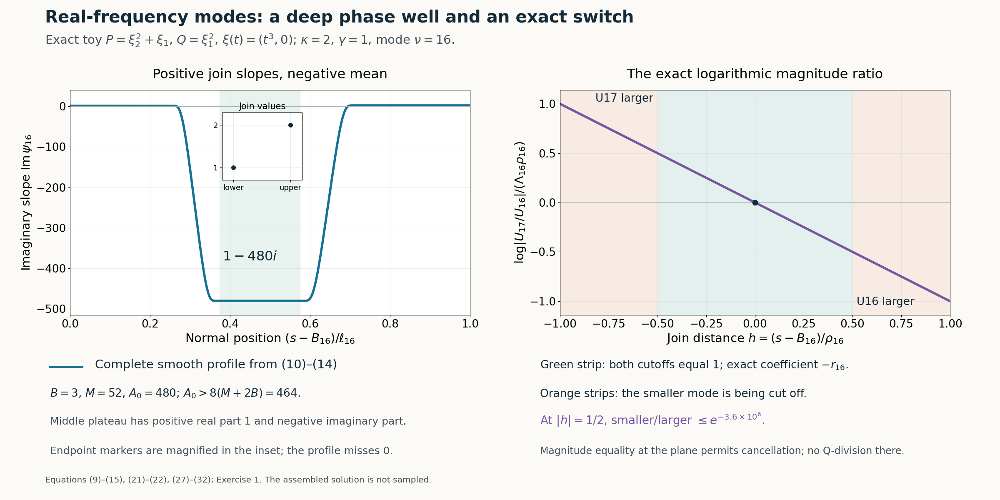

# Flat half-space solutions from real frequency rays

*Written by GPT-6.1 Sol (OpenAI), Ultra reasoning effort, October 2026. Self-checked by GPT-6.1 Sol (OpenAI). Original expression: CC0.*

We now use a real Laurent frequency path to build a smooth solution with support equal to a closed half space. Each mode is an exponential whose normal phase changes on an interval shrinking toward the boundary. Adjacent modes have exactly the same polynomial quotient near their joining plane. This exact equality defines the coefficient there even when the sum of their Q-images vanishes. Where a cutoff changes, one mode is exponentially smaller, so the usual quotient is well defined. The very large frequencies also make every derivative of the solution vanish at the boundary.

Read [Real Laurent paths and the growth of normal windows](real-laurent-paths-and-growth-envelopes.md). We use Theorem 1 of the preceding Laurent-path lesson, including its analytic normalized coefficients and estimates on compact normal windows. The smooth cutoff, phase matching, quotient at cancellations and global upper tail are proved here.

The mathematical inputs are the internal proof routes identified above and below, with their stated prerequisite assumptions. The Hörmander reference provides background comparison.

## Statement and normalized windows

Fix \(N\in\mathbb R^n\setminus\{0\}\) and constant coefficient polynomials P,Q of degree at most m satisfying
\[
\begin{gathered}
P_m(N)\ne0,\\
\sup_{\eta\in\mathbb R^n}
\mathcal S_N Q(\eta)/\mathcal S_N P(\eta)=\infty,
\\
D=-i\partial .
\end{gathered}
\tag{1}
\]
For every \(\varepsilon_*>0\) we will construct smooth complex functions a,u on \(\mathbb R^n\) such that
\[
\begin{gathered}
(P(D)+a(x)Q(D))u=0,\\
\operatorname{supp}u=\operatorname{supp}a
=\{x:x\cdot N\ge0\},\\
\sup_{\mathbb R^n}|a|<\varepsilon_* .
\end{gathered}
\tag{2}
\]
In particular u is nonzero. Both functions and every derivative will vanish to infinite order on \(x\cdot N=0\). Exact support of a is an additional consequence of the particular construction here; the numbered theorem requires the half space condition for u.

By the Laurent-path lemma choose a real path \(\xi(t)\), positive integer \(\kappa\), integers \(0<g_P<g_Q\), degree indices \(d_P>d_Q\ge0\), and constants \(c_P,c_Q\ne0\). Set
\[
\begin{gathered}
\beta=g_Q-g_P>0,\\
D_0=d_P-d_Q>0,\\
\gamma=\beta/D_0>0,\\
T(t)=t^\kappa .
\end{gathered}
\tag{3}
\]
To avoid conflating the degree difference with the differential operator, its name is \(D_0\). For \(u_*=1/t\), define the normalized windows
\[
\begin{gathered}
p(u_*,z)=t^{-g_P}P(\xi(t)+zt^\kappa N),\\
q(u_*,z)=t^{-g_Q}Q(\xi(t)+zt^\kappa N).
\end{gathered}
\tag{4}
\]
These are polynomials in z with coefficients holomorphic in \(u_*\) near zero. Their values there are \(c_Pz^{d_P},c_Qz^{d_Q}\). On any compact z set their coefficient errors and every fixed z derivative are \(O(|u_*|)\). The real Laurent series also gives \(|\xi(t)|\le Ct^L\) for some fixed integer \(L\ge 1\) and large positive t.

## An exact adjacent quotient root

**Lemma 1 (matching).** For sufficiently small positive \(u_*\) there is a complex number \(\sigma(u_*)\) such that
\[
\begin{gathered}
\sigma(u_*)=2^\gamma i+O(u_*),\\
\frac{p(u_*/2,\sigma(u_*))}{q(u_*/2,\sigma(u_*))}
=2^\beta\frac{p(u_*,i)}{q(u_*,i)} .
\end{gathered}
\tag{5}
\]
All four polynomial values involved are nonzero.

**Proof.** Both i and \(z_*=2^\gamma i\) are nonzero. The limiting q values are consequently nonzero. Thus the following expression is holomorphic in a fixed neighborhood of \((0,z_*)\):
\[
F(u_*,z)=\frac{p(u_*/2,z)}{q(u_*/2,z)}
-2^\beta\frac{p(u_*,i)}{q(u_*,i)} .
\]
At \(u_*=0\) it equals \((c_P/c_Q)(z^{D_0}-2^\beta i^{D_0})\). In particular
\[
\begin{gathered}
F(0,z_*)=0,\\
A\\
=\partial_zF(0,z_*)\\
=(c_P/c_Q)D_0z_*^{D_0-1}\ne0.
\end{gathered}
\tag{6}
\]
Here the positive real root \(2^\gamma\) was chosen before multiplication by i; \((2^\gamma)^{D_0}=2^\beta\) even when \(\gamma\) is fractional.

We can obtain the needed root by a direct contraction. Choose a closed disk \(|z-z_*|\le r\) small enough that the q denominators stay nonzero and \(|1-\partial_zF(u_*,z)/A|\le1/2\) there for all sufficiently small \(|u_*|\). Shrink the latter bound on \(|u_*|\) so that \(|F(u_*,z_*)/A|\le r/2\). The map \(z\mapsto z-F(u_*,z)/A\) takes the disk into itself and contracts distances by at most 1/2, using the integral of its derivative along the segment in the disk. Starting at \(z_*\), the successive differences form a geometric series, so the iterates converge inside the disk to a unique fixed point. The fixed point equation is exactly \(F=0\). Its distance from \(z_*\) is at most \(2|F(u_*,z_*)/A|=O(|u_*|)\). By continuity the p values also stay nonzero. This proves the lemma without assuming a choice between unrelated roots. \(\square\)

For integer \(\nu\) large enough put
\[
\begin{gathered}
t_\nu=2^\nu,\\
T_\nu=2^{\kappa\nu},\\
\xi_\nu=\xi(t_\nu),\\
\sigma_\nu^-=i,\\
\sigma_\nu^+=\sigma(t_{\nu-1}^{-1}).
\end{gathered}
\tag{7}
\]
The plus index is chosen so that the right slope of mode \(\nu+1\) matches the left slope of mode \(\nu\). Since the physical quotient P/Q equals \(t^{-\beta}p/q\), (5) gives the exact identity
\[
\begin{gathered}
\frac{P(\xi_\nu+iT_\nu N)}{Q(\xi_\nu+iT_\nu N)}
\\
=\frac{P(\xi_{\nu+1}+\sigma_{\nu+1}^+T_{\nu+1}N)}
{Q(\xi_{\nu+1}+\sigma_{\nu+1}^+T_{\nu+1}N)}
\\
=:r_\nu .
\end{gathered}
\tag{8}
\]
The constants \(r_\nu\) are nonzero and \(r_\nu=O(2^{-\beta\nu})\). The corresponding Q values have moduli bounded above and below by positive fixed constants times \(t_\nu^{g_Q}\), and the P values by such constants times \(t_\nu^{g_P}\). These bounds include the adjacent mode after absorbing the fixed factors \(2^{g_R}\).

## A nonzero smooth slope profile with negative mean

Put \(b_\nu=1/\nu\) and define
\[
\begin{gathered}
B_\nu=(b_\nu+b_{\nu+1})/2,\\
\rho_\nu=1/(16\nu^2),\\
\ell_\nu=B_{\nu-1}-B_\nu=1/(\nu^2-1).
\end{gathered}
\tag{9}
\]
Mode \(\nu\) has its lower join at \(B_\nu\) and its upper join at \(B_{\nu-1}\). All indices below are at least 16 and may be increased further. The identity for \(\ell_\nu\) is exact.

Choose a fixed smooth nondecreasing function h with \(h(y)=0\) for \(y\le0\) and \(h(y)=1\) for \(y\ge1\). One explicit choice is
\[
e(y)=
\begin{cases}e^{-1/y},&y>0,\\0,&y\le0,\end{cases}
\qquad
h(y)=\frac{e(y)}{e(y)+e(1-y)} .
\tag{10}
\]
The denominator is positive everywhere. Every one sided derivative of e at zero is a finite polynomial in \(1/y\) times \(e^{-1/y}\), hence tends to zero. This proves that e and h are smooth, including both endpoints. For \(0<y<1\), both \(e(y)\) and \(e(1-y)\) are positive, so \(0<h(y)<1\). The derivative of h has numerator \(e'(y)e(1-y)+e(y)e'(1-y)\), which is positive, and a positive squared denominator. Thus h is nondecreasing with the claimed constant extensions. Differentiating on [0,1] and using the constant extensions bounds each derivative of h.

For s real define
\[
\begin{aligned}
L_\nu(s)&=1-h\!\left(
\frac{s-B_\nu-4\rho_\nu}{2\rho_\nu}\right),\\
R_\nu(s)&=h\!\left(
\frac{s-B_{\nu-1}+6\rho_{\nu-1}}{2\rho_{\nu-1}}\right).
\end{aligned}
\tag{11}
\]
Their transition regions are disjoint: \(6\rho_\nu+6\rho_{\nu-1}<\ell_\nu\) for \(\nu\ge16\). In particular \(L_\nu,R_\nu\in[0,1]\) and \(L_\nu+R_\nu\le1\). Where both vanish, the interval length
\(\ell_\nu-6\rho_\nu-6\rho_{\nu-1}\) is at least \(1/(8\nu^2)\). To check the last bound, multiply by \(\nu^2\); for \(\nu\ge16\), the two subtracted terms total at most
\((3/8)(1+(16/15)^2)<7/8\), whereas \(\nu^2\ell_\nu>1\).

Choose a fixed \(B>1\) with \(\operatorname{Im}\sigma_\nu^+\le B\) for all sufficiently large \(\nu\), and then choose
\[
\begin{gathered}
M=2^\kappa(3B+4),\\
A_0>8(M+2B).
\end{gathered}
\tag{12}
\]
Set
\[
\begin{gathered}
\psi_\nu(s)\\
=L_\nu(s)i+R_\nu(s)\sigma_\nu^+
+(1-L_\nu(s)-R_\nu(s))(1-iA_0).
\end{gathered}
\tag{13}
\]
This is i for \(s\le B_\nu+4\rho_\nu\) and \(\sigma_\nu^+\) for \(s\ge B_{\nu-1}-4\rho_{\nu-1}\). In particular it is constant on the required two sided join neighborhoods. Its imaginary part is at most B everywhere, after increasing B if needed to cover i.

All \(\psi_\nu\) belong to one compact subset of \(\mathbb C\setminus\{0\}\) after a finite prefix is omitted. Indeed their values lie on the two line segments from i or \(\sigma_\nu^+\) to \(1-iA_0\), because L and R never have simultaneous positive values. The limiting segments from i and \(2^\gamma i\) to \(1-iA_0\) miss zero: interior points have strictly positive real part and endpoints are nonzero. Their compact union has positive distance from zero. The \(O(2^{-\nu})\) change of the second endpoint retains half that distance for large \(\nu\). Hence there are constants \(c,C>0\), independent of s,\(\nu\), with
\[
\begin{gathered}
c\le|\psi_\nu(s)|\le C,\\
|\partial_s^k\psi_\nu(s)|\le C_k\nu^{2k},
\\
k\ge0.
\end{gathered}
\tag{14}
\]
This proves the distance from zero even when the small real part of \(\sigma_\nu^+\) has either sign.

On the middle interval where \(L=R=0\), the imaginary part is \(-A_0\); elsewhere it is at most B. Since \(\ell_\nu\le2/\nu^2\), (12) implies
\[
\begin{gathered}
\int_{B_\nu}^{B_{\nu-1}}\operatorname{Im}\psi_\nu(s)\,ds
\\
\le B\ell_\nu-\frac{A_0+B}{8\nu^2}
<-\frac{M}{\nu^2}.
\end{gathered}
\tag{15}
\]
The large negative mean is compatible with both positive imaginary slopes at the joins.

## Phase matching, damping and exact dominance

Choose a starting index \(\nu_0\) beyond all finite prefixes needed above. Define phases successively by
\[
\begin{gathered}
\phi_\nu'(s)=T_\nu\psi_\nu(s),\\
\phi_{\nu+1}(B_\nu)=\phi_\nu(B_\nu).
\end{gathered}
\tag{16}
\]
For the first phase choose its additive constant so that
\(\operatorname{Im}\phi_{\nu_0}(B_{\nu_0-1})
\ge M T_{\nu_0-1}/(\nu_0-1)^2\).
Each subsequent phase is determined by its derivative and the matching value. Both real and imaginary parts of the phase are matched; this concerns the normal phases only, and does not assert equality of the real carrier phases at the joining plane.

Let \(H_\nu=\operatorname{Im}\phi_\nu(B_{\nu-1})\). Equations (15)–(16) give
\[
\begin{gathered}
H_{\nu+1}\\
=H_\nu-
T_\nu\int_{B_\nu}^{B_{\nu-1}}\operatorname{Im}\psi_\nu\,ds
\\
\ge H_\nu+M T_\nu/\nu^2,\\
H_\nu\ge M T_{\nu-1}/(\nu-1)^2 .
\end{gathered}
\tag{17}
\]
The last inequality follows from the initial choice and then the immediately preceding positive increment.

For any s between \(B_\nu-\rho_\nu\) and \(B_{\nu-1}+\rho_{\nu-1}\), the phase is strongly damped:
\[
\operatorname{Im}\phi_\nu(s)\ge
4T_\nu/\nu^2 .
\tag{18}
\]
For \(s\le B_{\nu-1}\), the possible drop from \(H_\nu\) is at most B times \(T_\nu(B_{\nu-1}-s)\). The latter distance is at most \(3/\nu^2\), while
\(H_\nu\ge M2^{-\kappa}T_\nu/\nu^2=(3B+4)T_\nu/\nu^2\).
For \(s\ge B_{\nu-1}\), the slope is the constant \(T_\nu\operatorname{Im}\sigma_\nu^+>0\) after a finite prefix, so the phase cannot fall below \(H_\nu\). This proves (18). The derivative bounds in (14) also hold on this enlarged interval.

Define actual modes by
\[
\begin{gathered}
U_\nu(x)=
\exp i\left[x\cdot\xi_\nu+\phi_\nu(s)\right],
\\
s=x\cdot N .
\end{gathered}
\tag{19}
\]
The carrier is real, so \(|U_\nu|=\exp(-\operatorname{Im}\phi_\nu)\) independently of the transverse position. Every \(U_\nu\) is nonzero. Polynomial differentiation, (14), the Laurent bound on \(\xi_\nu\), and (18) yield for each multi-index \(\alpha\)
\[
\begin{gathered}
|\partial_x^\alpha U_\nu(x)|
\le C_\alpha e^{C_\alpha\nu}
\exp(-4T_\nu/\nu^2)
\\
(B_\nu-\rho_\nu<s<B_{\nu-1}+\rho_{\nu-1}).
\end{gathered}
\tag{20}
\]
Fixed powers of \(\nu\) are absorbed by the exponential \(e^{C_\alpha\nu}\). This estimate is uniform over all transverse x.

Near \(B_\nu\) both normal phases are affine. Their matching value gives
\[
\begin{gathered}
\operatorname{Im}(\phi_{\nu+1}(s)-\phi_\nu(s))
\\
=\Lambda_\nu(s-B_\nu),\\
\Lambda_\nu=T_\nu
(2^\kappa\operatorname{Im}\sigma_{\nu+1}^+-1),\\
cT_\nu\le\Lambda_\nu\le CT_\nu,\\
\left|\frac{U_{\nu+1}(x)}{U_\nu(x)}\right|
=\exp[-\Lambda_\nu(s-B_\nu)]
\\
(|s-B_\nu|\le4\rho_\nu).
\end{gathered}
\tag{21}
\]
The slope bounds follow because the factor tends to
\(2^{\kappa+\gamma}-1>0\). Hence mode \(\nu\) dominates to the right of the join, and mode \(\nu+1\) dominates to its left. The equality of magnitudes at the plane does not require carrier frequencies to coincide.

Furthermore (8) and the affine phases imply the exact equations
\[
\begin{gathered}
(P(D)-r_\nu Q(D))U_\nu
\\
=(P(D)-r_\nu Q(D))U_{\nu+1}\\
=0\\
(|s-B_\nu|\le4\rho_\nu).
\end{gathered}
\tag{22}
\]
There are no transport residuals in this entire strip.

## Normalized images of a single variable-phase mode

For a single mode put \(\epsilon_\nu=T_\nu^{-1}\) and define ordered products applied to the constant function 1 by
\[
\begin{gathered}
b_{\nu,0}=1,\\
b_{\nu,j+1}=\psi_\nu b_{\nu,j}
-i\epsilon_\nu\partial_s b_{\nu,j}.
\end{gathered}
\tag{23}
\]
Conjugating \(D_s\) gives \(e^{-i\phi_\nu}\epsilon_\nu D_s e^{i\phi_\nu}
=\epsilon_\nu D_s+\psi_\nu\).
The recurrence therefore accounts for every derivative of the phase. For each fixed \(j\le m\), \(b_{\nu,j}\) is a finite polynomial in \(\psi_\nu\), its derivatives and \(\epsilon_\nu\), with leading term \(\psi_\nu^j\); every other term contains at least one factor \(\epsilon_\nu\). Induction proves the statement: multiplying the leading term by \(\psi_\nu\) gives the next leading term, while the differentiation term has an explicit \(\epsilon_\nu\), and differentiating a previous error does not remove its factor.

Write \(a_{R,j,\nu}\) for the z coefficients of the normalized window \(t_\nu^{-g_R}R(\xi_\nu+T_\nu zN)\). They equal the coefficients of \(c_Rz^{d_R}\) plus \(O(t_\nu^{-1})\). Exact polynomial conjugation gives
\[
\begin{gathered}
\frac{R(D)U_\nu}{t_\nu^{g_R}U_\nu}
\\
=\sum_{j=0}^m a_{R,j,\nu}b_{\nu,j}
\\
=c_R\psi_\nu^{d_R}(1+e_{R,\nu}(s)),\\
R=P,Q .
\end{gathered}
\tag{24}
\]
For every fixed r, the derivative bounds (14), the recurrence and
\(\epsilon_\nu=2^{-\kappa\nu}\le2^{-\nu}\) give
\[
|\partial_s^r e_{R,\nu}(s)|
\le C_r\nu^{C_r}2^{-\nu}.
\tag{25}
\]
To divide by \(\psi_\nu^{d_R}\), use its uniform positive lower bound from (14); derivatives of its reciprocal are finite sums of derivatives of \(\psi_\nu\) times bounded inverse powers. This retains the same polynomial bounds. Formula (24) is valid globally for the smooth profile, not just between joins. In particular, when \(\nu_0\) is large enough, \(P(D)U_\nu\) and \(Q(D)U_\nu\) never vanish on any single-mode region, since \(|e_{R,\nu}|<1/4\). The single-mode quotient is
\[
\begin{gathered}
a_\nu(s)\\
=-
\frac{c_P}{c_Q}2^{-\beta\nu}
\psi_\nu(s)^{D_0}
\frac{1+e_{P,\nu}(s)}{1+e_{Q,\nu}(s)},\\
|\partial_s^r a_\nu|\\
\le C_r\nu^{C_r}2^{-\beta\nu}.
\end{gathered}
\tag{26}
\]
The quotient is pointwise nonzero. In the constant slope join neighborhoods it reduces to the exact constant \(-r_\nu\) or \(-r_{\nu-1}\) as appropriate.

## Cutoffs, small-mode errors and the coefficient at cancellations

Choose
\[
\begin{gathered}
\chi_\nu(s)\\
=h\!\left(\frac{s-B_\nu+\rho_\nu}{\rho_\nu/2}\right)
h\!\left(\frac{B_{\nu-1}+\rho_{\nu-1}-s}{\rho_{\nu-1}/2}\right).
\end{gathered}
\tag{27}
\]
Its nonzero set is
\((B_\nu-\rho_\nu,B_{\nu-1}+\rho_{\nu-1})\). The cutoff equals 1 on
\([B_\nu-\rho_\nu/2,B_{\nu-1}+\rho_{\nu-1}/2]\),
and it has derivative bounds \(C_k\nu^{2k}\). Its support is the closed interval with those endpoints; h is zero at and beyond them. That closed interval lies strictly inside \((b_{\nu+1},b_{\nu-1})\): the lower available gap is \(B_\nu-b_{\nu+1}=1/(2\nu(\nu+1))>\rho_\nu\), and the upper gap is \(b_{\nu-1}-B_{\nu-1}=1/(2\nu(\nu-1))>\rho_{\nu-1}\). Both inequalities hold for every \(\nu\ge16\). Thus the cutoff is compactly supported in the original mode interval.

The enlarged intervals have no triple overlap. Indeed the gap between consecutive joins is \(\ell_{\nu+1}>1/(\nu+1)^2\), whereas for every \(\nu\ge16\) we have \[
\begin{gathered}
\rho_\nu+\rho_{\nu+1}\\
\le [1+(17/16)^2]/[16(\nu+1)^2]<1/(\nu+1)^2.
\end{gathered}
\] Each overlap is the small strip \(|s-B_\nu|<\rho_\nu\). In \(|s-B_\nu|\le\rho_\nu/2\) the two cutoffs equal 1, and no other mode contributes.

On the right transition strip
\(\rho_\nu/2\le s-B_\nu<\rho_\nu\)
the larger term is \(U_\nu\) and we can write the local sum as
\(U_\nu(1+R_\nu^*)\), with
\(R_\nu^*=\chi_{\nu+1}U_{\nu+1}/U_\nu\).
Both phases are affine there. Equation (21), the cutoff derivative bounds and the Laurent frequency bound give for every multi-index \(\alpha\)
\[
|\partial_x^\alpha R_\nu^*|
\le C_\alpha
\exp(C_\alpha\nu-cT_\nu/\nu^2).
\tag{28}
\]
The same estimate holds on the left transition with \(\nu+1\) as the larger mode. The constant c can be decreased uniformly; the exact distance from the join is at least \(\rho_\nu/2=1/(32\nu^2)\).

On such a strip write \(\omega_\nu=\xi_\nu+iT_\nu N\). Since the larger \(U_\nu\) is a pure exponential,
\[
\begin{gathered}
\frac{Q(D)[U_\nu(1+R_\nu^*)]}{U_\nu}
\\
=Q(\omega_\nu)(1+E_{Q,\nu}),\\
\frac{P(D)[U_\nu(1+R_\nu^*)]}{U_\nu}
\\
=P(\omega_\nu)(1+E_{P,\nu}).
\end{gathered}
\tag{29}
\]
These are exact formulas defining E: apply the constant coefficient operators \(R(\omega_\nu+D)\) to \(1+R_\nu^*\) and subtract \(R(\omega_\nu)\). Their coefficients have at most exponential growth in \(\nu\), their degrees are fixed, and their nonzero scalar divisors have the bounds after (8). Combining this finite calculation with (28) proves
\[
\begin{gathered}
|\partial_x^\alpha E_{R,\nu}|
\le C_\alpha
\exp(C_\alpha\nu-cT_\nu/\nu^2),\\
R=P,Q .
\end{gathered}
\tag{30}
\]
After increasing \(\nu_0\), both error moduli are below 1/4 everywhere on every transition. Thus the Q-image and P-image of the sum are nonzero there and its exact coefficient is
\[
a(x)=-r_\nu\frac{1+E_{P,\nu}(x)}{1+E_{Q,\nu}(x)}
\tag{31}
\]
on the right strip. Use the upper slope of mode \(\nu+1\) on the left strip; its exact quotient is the same \(r_\nu\), so (31) holds with the corresponding errors there too.

On the entire central joining strip \(|s-B_\nu|<\rho_\nu/2\), define instead
\[
a(x)=-r_\nu .
\tag{32}
\]
The sum there is \(U_\nu+U_{\nu+1}\), and (22) proves its equation exactly. The sum's Q-image is allowed to vanish. No reciprocal of that image is used to define a in this strip.

These definitions glue smoothly to (31). For a concrete overlap of the definitions, consider \(\rho_\nu/3<|s-B_\nu|<\rho_\nu/2\). The cutoffs are still 1 there and the sum solves the equation with the exact constant coefficient (32). The dominance estimate makes its Q-image nonzero for all sufficiently large \(\nu\), by the same calculation as (29)–(30). Its quotient is consequently exactly \(-r_\nu\) there. The constant and quotient definitions coincide on an open neighborhood of each joining-strip edge. This proves smooth gluing to every derivative order, including the endpoint of each cutoff plateau.

Away from the join strips there is one mode with cutoff 1, and use (26). Near the outer edge of a transition the other cutoff is identically zero on one side and flat to every order at its endpoint. The quotient remains well defined in that neighborhood and equals the single-mode quotient on an open side, so these definitions glue smoothly as well. They cover every positive s below the first mode's upper tail.

## Infinite assembly, the upper tail and both exact supports

For the first mode replace its cutoff by just the first factor of (27). It now stays 1 for every sufficiently large s. Its phase profile already equals the constant \(\sigma_{\nu_0}^+\) above its upper join neighborhood, so extend the phase with that affine slope to every larger s. All later mode intervals remain as above. Define
\[
u(x)=
\begin{cases}
\displaystyle\sum_{\nu=\nu_0}^{\infty}
\chi_\nu(x\cdot N)U_\nu(x),&x\cdot N>0,\\
0,&x\cdot N\le0 .
\end{cases}
\tag{33}
\]
For positive s the sum is locally finite and contains at most two terms. The initial cutoff modification affects only the global upper tail and adds no extra overlap. Define a by the already glued formulas for positive s, by the first mode's quotient on its upper single-mode part, and by zero when \(s\le 0\). On the affine upper tail a is the constant
\(-P(\xi_{\nu_0}+T_{\nu_0}\sigma_{\nu_0}^+N)/
Q(\xi_{\nu_0}+T_{\nu_0}\sigma_{\nu_0}^+N)\).
Both scalar polynomial values are nonzero. Hence the upper tail solves the equation globally and has no endpoint in the normal direction.

The derivative bounds for the cutoffs only add polynomial factors in \(\nu\) to (20). Thus near the boundary, for every \(\alpha,J\), there is a constant with
\[
|\partial_x^\alpha u(x)|\le C_{\alpha,J}s^J
\quad(0<s<s_0).
\tag{34}
\]
Indeed the index of any nonzero summand has s comparable to \(1/\nu\), and
\(\exp(C_\alpha\nu-c2^{\kappa\nu}/\nu^2)\) is bounded by every inverse power of \(\nu\) for large \(\nu\). The latter claim follows by taking logarithms: \(2^{\kappa\nu}/\nu^2\) divided by \(\nu\) or by \(\log\nu\) tends to infinity. At most two terms occur.

Similarly (26), (30)–(32) imply
\[
\begin{gathered}
|\partial_x^\alpha a(x)|\\
\le C_\alpha\nu^{C_\alpha}2^{-\beta\nu}
+C_\alpha\exp(C_\alpha\nu-c2^{\kappa\nu}/\nu^2)\\
\le C_{\alpha,J}s^J
\end{gathered}
\tag{35}
\]
for every J near the boundary. The first term controls each single-mode region and the constant joining regions; the second controls all transition errors and their reciprocal derivatives, whose denominators have modulus at least 3/4. Since \(\beta>0\), the first term too is smaller than every power of \(1/\nu\).

These estimates prove that the zero extensions of u,a are smooth and flat at \(s=0\). Here is a direct extension argument. Choose linear coordinates \((y,s)\) using \(N\ne0\). Each candidate derivative on \(s>0\) tends locally uniformly in y to zero as s decreases to zero. Extend it by zero to \(s\le 0\). It is continuous. For a transverse derivative, take differences in y while staying on the boundary or integrate that derivative along a segment on a positive-s slice; local uniform convergence lets that identity pass to the boundary. For the normal derivative, integrate the candidate s derivative from 0 to s; its continuity and the fact that the original function tends to zero give the fundamental theorem of calculus identity. Induct on derivative order. All extended candidate derivatives are therefore the classical derivatives, and all are zero on the boundary. This establishes smoothness without treating a merely vanishing sequence as a substitute for uniform derivative estimates.

For positive s the defining formulas give the equation exactly. At and below the boundary both smooth functions have zero jets and u vanishes, so the equation also holds there. On the upper affine tail it holds by the nonzero scalar quotient already specified. This proves the equation on all \(\mathbb R^n\).

The exact support is also explicit. In a single-mode region \(u=U_\nu\) is nonzero. In a transition region its factor \(1+R_\nu^*\) is nonzero by (28). In the central join strip, if \(s≠B_\nu\) the two modes have different magnitudes by (21), so their sum cannot vanish. At \(s=B_\nu\) it may vanish for some transverse positions, but every neighborhood meets an off-plane point where it is nonzero. The upper single-mode tail is nonzero. Thus no open subset of the positive half space is missing from the support, and the accumulation at zero places every boundary point in the support. This gives \(\operatorname{supp}u=\{s\ge0\}\).

The coefficient a is pointwise nonzero at every positive s. On a single-mode region this follows from (24)–(26), on a transition from (31) and the two error bounds, on a central join from \(r_\nu\ne0\), and on the upper tail from its nonzero numerator and denominator. Hence its support is also exactly \(\{s\ge0\}\).

Finally the bounds used above are uniform in transverse x. On all bounded or transition parts of mode \(\nu\), and on the initial affine upper tail, they give
\[
|a(x)|\le C2^{-\beta\nu_0}.
\tag{36}
\]
The constant C depends on the symbols, fixed slope profile and scales, but not on the starting index after a fixed prefix. Choose \(\nu_0\) so large that this bound is below the given \(\varepsilon_*\), while retaining all preceding finite-prefix conditions. The initial additive phase constant may then be chosen as stated and does not affect any quotient or derivative estimate. This proves (2) and completes the real-frequency construction. \(\square\)

**Figure 1.** The exact toy in Exercise 1 has \(\kappa=2,\gamma=1\). Left: the complete smooth profile \(\psi_{16}\) from equation (10)–equation (14) for \(B=3\),\(M=52\) and \(A_0=480>464\), with its negative middle plateau; the inset shows the positive endpoint imaginary slopes at a readable scale. The negative mean is proved by equation (15), without treating a numerical integral as proof. Right: the exact quantity \(\log|U_{17}/U_{16}|/(\Lambda_{16}\rho_{16})=-h\), with \(h=(s-B_{16})/\rho_{16}\). The join strip has a constant exact coefficient; the exterior transition strips have strict dominance. The smooth toy slope and the logarithmic ratio are plotted. Neither the full phase nor the infinite assembled solution is sampled. Equations: equation (9)–equation (15), equation (21)–equation (22), equation (27)–equation (32) and Exercise 1. 

## Exercises with complete solutions

**Exercise 1 (the doubling factor in exact matching).** In the Laurent-path model \(P=\xi_2^2+\xi_1,Q=\xi_1^2,N=e_2,\xi(t)=(t^3,0)\), choose \(\kappa=2\). Find the exact root \(\sigma(1/t)\) matching the quotient at the next doubled frequency to the quotient at z=i. Check its limit.

**Solution.** The complete normalized windows are \(p=z^2+1/t\) and \(q=1\), with \(g_P=4,g_Q=6,d_P=2,d_Q=0\). Thus \(\beta=2,D_0=2,\gamma=1\). Equation (5) becomes
\(\sigma^2+1/(2t)=4(-1+1/t)\), so
\(\sigma^2=-4+7/(2t)\).
For sufficiently large t its root near 2i is exactly
\[
\begin{gathered}
\sigma(1/t)\\
=i\sqrt{4-7/(2t)}
\\
=2i+O(t^{-1}).
\end{gathered}
\tag{37}
\]
The principal positive real square root is meant in this real formula. Direct substitution gives equality of the physical quotients after their factors \(t^{-2}\) and \((2t)^{-2}\) are included. Matching p/q without the factor 4 would instead compare different physical quotients.

**Exercise 2 (the direction of dominance).** Suppose \(\kappa=2,\gamma=1\) and the exact matching root has limit 2i. Compute the limiting coefficient of \(T_\nu\) in \(\Lambda_\nu\). Which mode is larger on the two sides of the join?

**Solution.** The coefficient is \(2^2\cdot2-1=7>0\). For large \(\nu\), \(\Lambda_\nu>0\) and the magnitude ratio is \(\exp[-\Lambda_\nu(s-B_\nu)]\). It is below 1 to the right, so \(U_\nu\) is larger there, and above 1 to the left, so \(U_{\nu+1}\) is larger there. The integer \(\kappa\) and the fractional degree ratio \(\gamma\) enter independently in this positive slope.

**Exercise 3 (why the slope profile cannot cross zero).** Explain why joining i to \(-iA_0\) by a straight line is invalid, while joining i to \(1-iA_0\) is valid. Show that the same fixed nonzero compact range works after the other endpoint is perturbed from \(2^\gamma i\) by \(O(2^{-\nu})\).

**Solution.** The segment between i and \(-iA_0\) lies on the imaginary axis and passes through 0, at parameter \(1/(1+A_0)\). A normal polynomial with positive limiting degree would then lose its nonzero lower bound. A point on the segment from i to \(1-iA_0\) has real part equal to the segment parameter, strictly positive in the interior, so it cannot be zero. Both endpoints are also nonzero. The segment from \(2^\gamma i\) to the same middle endpoint has the identical real-part property. Their union is compact with some distance \(c_0\)>0 from zero. Changing its endpoint by at most \(c_0\)/2 changes every convex combination by at most \(c_0\)/2, so the distance stays at least \(c_0\)/2. This proves the compact range argument used in (14).

**Exercise 4 (ordered phase derivatives).** Compute \(b_{\nu,2}\) and \(b_{\nu,3}\) from (23). Identify every power of \(\epsilon_\nu\) and explain why a symbolic substitution \(D_s\mapsto\phi_\nu'\) alone would miss terms.

**Solution.** Suppress the index and write \(\psi=\psi_\nu,\epsilon=\epsilon_\nu\). The recurrence gives
\[
\begin{gathered}
b_2=\psi^2-i\epsilon\psi',\\
b_3=\psi^3-3i\epsilon\psi\psi'
-\epsilon^2\psi'' .
\end{gathered}
\tag{38}
\]
For the cubic expression, multiply \(b_2\) by \(\psi\), subtract \(i\epsilon b_2'\), and use \((-i)^2=-1\). The term with \(\psi\psi'\) appears once from multiplication and twice from differentiation. Simply taking powers of \(\psi\) would omit both derivative corrections. Each correction does contain at least one \(\epsilon\), and (14) bounds its fixed derivatives by a polynomial in \(\nu\) times \(2^{-\kappa\nu}\).

**Exercise 5 (a zero Q-image is allowed at a join).** If U,V satisfy \((P-rQ)U=(P-rQ)V=0\) in a neighborhood and Q(U+V) vanishes at a point there, explain why the coefficient \(-r\) still defines a smooth solution equation for U+V. State the reason that this argument does not apply in a cutoff transition.

**Solution.** Linearity gives \(P(U+V)-rQ(U+V)=0\) throughout the neighborhood. This is an equality of smooth functions and remains true where either side vanishes. The already specified constant coefficient \(-r\) requires no quotient there. In a cutoff transition the Leibniz rule adds derivatives of the cutoff, so the same exact equation no longer holds for the truncated smaller mode. There the large-mode dominance bounds prove that the total Q-image is nonzero and control those additional terms. Both ingredients are needed; no global nonvanishing Q-image is asserted.

## References

- Internal Laurent-path input: [Real Laurent paths and the growth of normal windows](real-laurent-paths-and-growth-envelopes.md#the-hypotheses-and-the-exact-statement), Theorem 1 and equations (2)–(21), including the convergent real path, integer scale and holomorphic normalized coefficients.
- [Hörmander] Lars Hörmander, *The Analysis of Linear Partial Differential Operators II: Differential Operators with Constant Coefficients*, Springer, 1983.
- The adjacent quotient root, nonzero smooth slope profile, damping, exact dominance, ordered phase derivatives, cutoff errors, cancellation coefficient, flat extension, upper tail and both exact supports are proved in this lesson, Lemma 1, equations (5)–(36) and Exercises 1–5.
