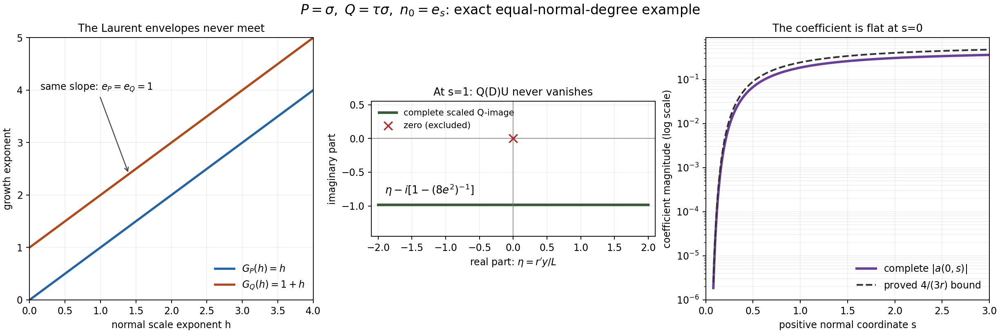

# Flat half-space solutions with perturbations of arbitrary order

*Original proof and figure: GPT-6.1 Sol (OpenAI), Ultra, October 2026; CC0. Recursive prerequisite closure and whole-course review remain incomplete.*

The degree bound on Q in the real-frequency half-space theorem can be removed. There are two reasons. When Q has fewer normal derivatives than P, or the same number with a constant top normal coefficient, the Laurent-window proof still has its eventual slope comparison. When Q has more normal derivatives, or has the same number with a nonconstant tangential top coefficient, a single exponential suffices. Its tangential frequency grows toward the boundary, while a still faster real damping term keeps all solution derivatives flat. The imaginary part of its normal logarithmic derivative stays away from zero for every tangential position, so the coefficient can be defined by a quotient everywhere inside the half space.

## The prerequisite proofs and the scope of the extension

The comparison reference is Hörmander, *The Analysis of Linear Partial Differential Operators II*, the unnumbered extension following Theorem 13.6.1. That extension removes the total-degree restriction on Q while retaining the full directional strength. Its conclusion asks for the exact half-space support of u and support of a contained in that half space. The theorem below additionally proves exact support of a and an arbitrarily small global coefficient, the latter corresponding to the separate remark on page 210. The linked written proofs and the arguments below supply the mathematics needed here.

| Open proof | Precise part used | Scope |
| --- | --- | --- |
| [Symbols at infinity](symbols-at-infinity.md) | Lemma 2.1, Lemma 3.1 and Corollary 3.3 | Projection of real polynomial conditions, eventual convergent Puiseux expansion, and compact-fiber lexicographic selection. |
| [Real Laurent paths and the growth of normal windows](real-laurent-paths-and-growth-envelopes.md) | The selection and growth-envelope proof, equations (2)–(21) | Lemma 2 below proves the changed endpoint premise. The linked theorem still imposes a total-degree bound and cannot be applied as stated to higher-order Q. |
| [Flat half-space solutions from real frequency rays](flat-half-space-solutions-from-real-frequency-rays.md) | The complete assembly, equations (3)–(36) and the proof following (35) | Exact adjacent quotient roots, nonzero slope profile, phase damping, every cutoff commutator, the definition at Q-image cancellations, smooth zero extension and the global upper tail. Lemma 3 below verifies this entire assembly for arbitrary fixed finite total degree. |

The two Laurent and assembly lessons retain their original restricted theorem statements. We extend the written selection and assembly arguments at the precise places checked in Lemmas 2–3; we do not invoke either restricted statement for higher-order Q. The complex-symbol theorem also retains a total-degree bound and is not used to prove this extension. P is noncharacteristic throughout, and no general characteristic half-space contract is used.

In particular the elementary algebra, complex-analysis and polynomial-division inputs declared in *Symbols at infinity* remain prerequisites; this lesson does not prove or close every prerequisite of those linked lessons. The result is complete relative to these explicit written bases.

## The theorem and the two normal-degree cases

For every polynomial R, including a Q of higher total degree, set

\[
\mathcal S_N R(\xi)=
\left(\sum_{j=0}^{\deg R}|D_N^jR(\xi)|^2\right)^{1/2},
\qquad D_N=-iN\cdot\partial_\xi,
\quad D=-i\partial_x.
\tag{HQ1}
\]

The strength of the zero polynomial is zero. Let P be nonzero of total degree m, let Q be any constant-coefficient polynomial of finite degree q, and fix a nonzero real N. Assume

\[
P_m(N)\ne0,\qquad
\sup_{\xi\in\mathbb R^n}\frac{\mathcal S_N Q(\xi)}{\mathcal S_N P(\xi)}=\infty.
\tag{HQ2}
\]

In particular Q is nonzero. The denominator is everywhere positive because D_N^m P is the nonzero constant (-i)^m m!P_m(N), also when m=0.

**Theorem 1 (arbitrary order of Q).** Under HQ2, for every epsilon>0 there exist complex a,u in C-infinity(R^n) such that

\[
(P(D)+a(x)Q(D))u=0,\qquad
\operatorname{supp}u=\operatorname{supp}a
=H_N:=\{x:x\cdot N\ge0\},\qquad
\sup_{x\in\mathbb R^n}|a(x)|<\epsilon.
\tag{HQ3}
\]

Every derivative of a and u is zero on x dot N=0. Exact support of a and the global smallness are additions to the support-subset conclusion of the source extension. There is no assertion of compact support, bounded u, real a, a fixed principal part, or constant operator strength when q>m.

Put n_0=N/|N|. Since D_N^j=|N|^jD_{n_0}^j, the two strengths for each fixed polynomial are equivalent by positive constants. The finiteness or infiniteness in HQ2 is unchanged. Also P_m(n_0)=|N|^{-m}P_m(N) is nonzero and H_{n_0}=H_N. Thus we may work with the unit normal n_0. For eta in the tangent space n_0-perp write

\[
\begin{aligned}
P(\eta+zn_0)&=\sum_{j=0}^{m}A_j(\eta)z^j,
&A_m&=p_m:=P_m(n_0)\ne0,\\
Q(\eta+zn_0)&=\sum_{j=0}^{d}B_j(\eta)z^j,
&B_d&\not\equiv0.
\end{aligned}
\tag{HQ4}
\]

Here d is the normal degree of Q, not its total degree; B_j has total tangential degree at most q-j. The following alternatives are exhaustive:

1. d<m, or d=m and B_m is constant. This is the Laurent-window branch, proved in Lemmas 2–3.
2. d>m, or d=m and B_m is nonconstant. This is the direct exponential branch, proved in Lemma 4.

In the first branch m is positive: otherwise d=m=0 and B_0 constant would make both P and Q constant, contradicting HQ2. The second branch includes a constant P.

## The Laurent branch without a total-degree bound

**Lemma 2 (extended real Laurent selection).** Assume HQ2 and the first alternative after HQ4. There exist a real convergent Laurent path xi(t), a positive integer kappa, positive integers g_P<g_Q, nonzero complex c_P,c_Q, and integers e_P>e_Q>=0 such that

\[
\begin{aligned}
t^{-g_P}P(\xi(t)+zt^\kappa n_0)&\longrightarrow c_Pz^{e_P},\\
t^{-g_Q}Q(\xi(t)+zt^\kappa n_0)&\longrightarrow c_Qz^{e_Q}.
\end{aligned}
\tag{HQ5}
\]

The limits are in the finite coefficient space of polynomials in z of degree at most m. Normalized coefficients are holomorphic in 1/t near zero, with coefficient error O(1/t). The path has |xi(t)|<=Ct^L for some finite integer L.

**Proof.** The selection in (2)–(7) of the Laurent-path lesson works for the present polynomials. To verify this without using its restricted theorem, set A= S_{n_0}P squared and B= S_{n_0}Q squared. These are real polynomials in xi, A>= (m!|p_m|)^2, and B/A is continuous and unbounded. Its maximum M(R) over the sphere |xi|=R has semialgebraic graph by *Symbols at infinity*, Lemma 2.1: the graph is specified by A(xi)S=B(xi), |xi|^2=R^2, and the universal inequality B(y)<=SA(y) for all |y|=R. The compact maximizing fibers are nonempty. Unboundedness forces unbounded radii. *Symbols at infinity*, Lemma 3.1 gives an eventual nonzero leading Puiseux term of M; its exponent must be positive, so M(R) tends to infinity along every sufficiently large radius. *Symbols at infinity*, Corollary 3.3 selects a maximizer with coordinate Puiseux expansions. Clearing their denominators gives a real convergent Laurent path xi_0(t) with S_{n_0}Q/S_{n_0}P tending to infinity.

Every normal derivative along this path is either zero identically or asymptotic to a nonzero constant times t^{mu_{R,j}}, with an integer exponent mu_{R,j}. Omit zero derivatives. Define

\[
G_R(h)=\max_j\{\mu_{R,j}+jh\},\qquad h\ge0,
\quad R=P,Q.
\tag{HQ6}
\]

All Q indices are at most d<=m, even though its total degree may exceed m. The lack of cancellation in the sum of squared derivative moduli gives G_Q(0)>G_P(0). P's highest line is mh because its m-th normal derivative is constant and nonzero. If d<m, all Q lines have smaller slopes, hence G_Q(h)<mh=G_P(h) for all sufficiently large h. If d=m with B_m constant, its top derivative is a nonzero constant, so its m-th line too is mh and all remaining slopes are smaller. Thus G_Q(h)=G_P(h)=mh eventually. This proves the endpoint comparison that (12) of the Laurent-path lesson previously obtained from the total-degree bound.

The continuous piecewise affine difference G_Q-G_P starts positive and reaches zero. On some open interval before its first zero it has negative slope while remaining positive: otherwise its integral slope from zero to that first zero could not be negative. Choose a positive rational h inside such an interval, avoiding the finitely many breakpoints of either envelope. Each envelope then has a unique active index e_R. The negative difference slope is e_Q-e_P, so e_P>e_Q, and G_Q(h)>G_P(h)>=mh>0. The finite Taylor identity

\[
R(\xi_0(t)+zt^h n_0)
=\sum_{j=0}^{m}\frac{i^j}{j!}D_{n_0}^jR(\xi_0(t))t^{jh}z^j
\tag{HQ7}
\]

now has precisely one coefficient of largest exponent for each R. All coefficients with j>d vanish for Q. Division by t^{G_R(h)} gives the monomial limit with c_R=(i^{e_R}/e_R!) times the nonzero leading derivative coefficient. A common integer reparameterization t=v^b makes kappa=bh, g_R=bG_R(h) integral, keeps the path real Laurent, and proves HQ5. Every normalized coefficient has a convergent Laurent expansion with no positive powers of v. As a function of 1/v it is holomorphic at zero, and subtraction of its limit gives O(1/v), as in (19)–(21) of the Laurent-path lesson. The finitely many positive path powers imply its polynomial growth bound. This supplies the whole changed selection proof. Square root normalization and the i^j Taylor phases are retained. Square.

**Lemma 3 (assembling modes for arbitrary finite total degree).** Let P,Q have any fixed finite total degrees, with normal degrees at most m. Suppose precisely the path, analytic normalized windows and monomial limits in HQ5 have been supplied. Then the construction (3)–(36) of the assembly lesson gives HQ3, including both flat zero extensions and a globally small coefficient.

**Proof from the linked assembly construction.** We verify the complete assembly argument instead of invoking the linked lesson's restricted statement. Put beta=g_Q-g_P>0, E=e_P-e_Q>0 and gamma=beta/E. Its matching equation is

\[
\frac{p(1/(2t),\sigma(1/t))}{q(1/(2t),\sigma(1/t))}
=2^\beta\frac{p(1/t,i)}{q(1/t,i)},
\quad \sigma(1/t)=2^\gamma i+O(t^{-1}).
\tag{HQ8}
\]

The full contraction proof in (5)–(6) of the assembly lesson uses only analytic coefficients and a simple root of (c_P/c_Q)(z^E-2^beta i^E) at 2^gamma i. It supplies the exact equation and nonzero polynomial values. Total order is absent. (7)–(22) of the assembly lesson then use the path growth bound, these exact quotients, the nonzero compact range of the smooth normal slope psi_nu, and its explicit derivative and negative-mean bounds. All remain available. Their intervals B_nu=(1/nu+1/(nu+1))/2, rho_nu=1/(16nu^2), positive slope gap Lambda_nu comparable to 2^{kappa nu}, and exact two-mode equation on each two-sided join neighborhood are unchanged.

For completeness the single-mode identity retains the correct index range. With T_nu=2^{kappa nu}, the ordered recurrence

\[
b_{\nu,0}=1,\qquad
b_{\nu,j+1}=\psi_\nu b_{\nu,j}-iT_\nu^{-1}\partial_s b_{\nu,j}
\tag{HQ9}
\]

is used only up to the normal degree m, because R(xi_nu+T_nu z n_0) has degree at most m in z. The tangential carrier is constant within each mode. Exact conjugation gives

\[
\frac{R(D)U_\nu}{t_\nu^{g_R}U_\nu}
=\sum_{j=0}^{m}a_{R,j,\nu}b_{\nu,j}
=c_R\psi_\nu^{e_R}(1+e_{R,\nu}),
\quad |\partial_s^k e_{R,\nu}|\le C_k\nu^{C_k}2^{-\nu}.
\tag{HQ10}
\]

This is (23)–(26) of the assembly lesson with the degrees e_R. Every derivative correction in HQ9 contains a factor T_nu^{-1}; psi stays a positive distance from zero. Thus the single-mode quotient and all its fixed derivatives have the same bounds C_k nu^{C_k}2^{-beta nu}, and neither single-mode P-image nor Q-image vanishes.

The only place where total order can enter is the cutoff calculation, and it enters as a fixed finite number. On the right transition near B_nu the sum is U_nu(1+V_nu), with U_nu the dominant pure exponential and, by (21) of the assembly lesson and the cutoff bounds (27)–(28) of the assembly lesson,

\[
|\partial_x^\alpha V_\nu|
\le C_\alpha\exp(C_\alpha\nu-c2^{\kappa\nu}/\nu^2).
\tag{HQ11}
\]

Write omega_nu=xi_nu+iT_nu n_0. For R=P or Q, now explicitly of any fixed total degree q_R, exact Taylor expansion gives

\[
\frac{R(D)[U_\nu(1+V_\nu)]}{R(\omega_\nu)U_\nu}
=1+\frac{1}{R(\omega_\nu)}
\sum_{|\alpha|\le q_R}
\frac{\partial^\alpha R(\omega_\nu)}{\alpha!}D^\alpha V_\nu.
\tag{HQ12}
\]

There are finitely many terms. The Laurent path and T_nu imply |omega_nu|<=exp(Cnu), so every polynomial coefficient has at most exp(C_R nu) growth. HQ5 and HQ8 bound the nonzero divisor |R(omega_nu)| above and below by positive constants times 2^{g_R nu}. Differentiating HQ12 a fixed number of times and applying HQ11 therefore bounds its error by C_alpha exp(C_alpha nu-c2^{kappa nu}/nu^2). The larger q changes only these finite constants and the finitely many derivatives of V needed; it does not change the estimate or its convergence.

On the left transition near the same B_nu the dominant pure exponential is U_{nu+1}. Use its upper frequency omega=xi_{nu+1}+T_{nu+1}sigma_{nu+1}^+ n_0, factor the sum by U_{nu+1}, and apply exactly the finite Taylor identity HQ12 at that omega. HQ8 gives the same nonzero physical quotient P(omega)/Q(omega)=r_nu as on the right strip. The individual P and Q divisors have the corresponding bounds proportional to 2^{g_R(nu+1)}. (21) of the assembly lesson and (28) of the assembly lesson give HQ11 for the left strip's smaller-mode factor too. Replacing nu by nu+1 changes only fixed constants, so the full image-error estimate and every derivative bound hold on this strip as well. This is the left-strip construction explicitly specified in (29)–(31) of the assembly lesson, with the actual total order retained in its Taylor sum. After increasing the starting index, both image errors are below 1/4 on both strips. Their quotient is nonzero, smooth and close to the same exact coefficient -r_nu, including at the flat endpoints of each cutoff.

In a central join the two uncut exponentials solve the *same* exact equation (P-r_nu Q)U=0 by HQ8. Define a=-r_nu there without dividing by their possibly zero Q-image. (32) of the assembly lesson and the open overlaps used after it prove smooth gluing to HQ12. The phase damping (18)–(20) of the assembly lesson, the at-most-two overlap and the cutoff bounds yield, for each alpha and J, |partial^alpha u|+|partial^alpha a|<=C_alpha,J s^J near s=0, with local uniformity in the other coordinates. The explicit integration/induction argument after (35) of the assembly lesson proves the smooth zero extensions. (33) of the assembly lesson's first-mode modification supplies a nonzero exponential for every large s and its constant quotient: there is no unintended upper support endpoint.

Finally, the exact support proof after (35) of the assembly lesson uses only nonzero single and transition modes, strict magnitude inequality off each joining plane, and density of those off-plane points. It gives support u=H_N. The single-mode, transition and constant-join quotients are pointwise nonzero, giving support a=H_N. The uniform bound (36) of the assembly lesson is C2^{-beta nu_0}, so choosing nu_0 large supplies any epsilon. These arguments cover every hypothesis change needed for arbitrary finite total degree. The complete profiles and recurrence are supplied in the linked assembly proof; no nodal denominator estimate or transport construction is merely assumed. Square.

## A direct mode when Q wins at the highest normal derivative

**Lemma 4 (one direct exponential).** Suppose HQ4 holds and d>=m. Let b be the total tangential degree of B_d. If d=m assume b>=1; if d>m allow b=0. Then HQ3 holds for every epsilon, without an additional strength-ratio premise.

**Choice of tangent ray.** If n>=2 choose a real unit tangent V for which the highest homogeneous part of B_d is nonzero at V, when b>0. Such a V exists: a nonzero polynomial cannot vanish at every real point, as induction in the number of variables and uniqueness of a univariate polynomial show; homogeneity then permits unit normalization. If b=0 choose any unit tangent V. With y=x dot V and s=x dot n_0, restrict the symbols to the two coordinates (tau,sigma):

\[
\begin{aligned}
P(\tau V+\sigma n_0)&=\sum_{j=0}^{m}a_j(\tau)\sigma^j, &a_m&=p_m,\\
Q(\tau V+\sigma n_0)&=\sum_{j=0}^{d}b_j(\tau)\sigma^j, &b_d(r)&=c r^b(1+O(r^{-1})),\ c\ne0.
\end{aligned}
\tag{HQ13}
\]

The remaining coordinates will be inactive for u and a, so restriction loses no terms acting on them. For all sufficiently large real r we have |b_d(r)|>=c_0 r^b and |b_d^{(ell)}(r)|<=C_ell r^{b-ell}, interpreting derivatives beyond the degree as zero. All other coefficient polynomials and their ell-th derivatives are bounded by C_ell r^{M-ell}, with M=max(m,q) and r>=1. For n=1 the tangent space is zero: b=0 necessarily, and the present alternative therefore has d>m. Omit y, V and all tangential derivatives in that case; the same proof uses the one-variable symbols.

**A global phase with no normal zeros.** Fix the integer A=M+2. For a large constant R>=1 and all s>0 set

\[
\begin{gathered}
r(s)=R e^{1/s},\qquad h(s)=1+s^{-2},\qquad
L(s)=r(s)^A h(s),\\
F(s)=\frac{r(s)^A}{A}+\int_s^1 r(t)^A\,dt,\qquad
U(y,s)=e^{ir(s)y-F(s)},\\
F'(s)=-L(s),\qquad
W(y,s)=\frac{D_sU}{U}=r'(s)y-iL(s).
\end{gathered}
\tag{HQ14}
\]

Each integral is finite for every s>0; for s>1 it is a signed integral. No growth condition at positive infinity is required. This formula is global, so it creates no transition to a second upper-tail mode. In dimension one use U=e^{-F}, W=-iL.

Both r' and L are real, L>0, and

\[
|W|\ge L=r^Ah,\qquad
r'=-r/s^2,\qquad
|\partial_s^k W|\le C_k h^k|W|,\qquad
|\partial_s^k r'|\le C_k r h^{k+1}.
\tag{HQ15}
\]

These constants are independent of y,s,R once R>=1. Here is the derivative verification. Repeated differentiation of e^{1/s} gives r^{(k)}=r times a polynomial in s^{-1}, of maximal degree 2k. For k>=1 every such polynomial has a factor s^{-(k+1)}. Dividing r^{(k+1)} by r' therefore leaves a polynomial in s^{-1} of maximal degree 2k, bounded by C_k h^k. Repeated differentiation of r^A h divided by r^A h is bounded by C_{A,k}h^k, since logarithmic derivatives of r are polynomials in s^{-1} and derivatives of h divided by h have the same bound. Thus each component r'y and -iL of W obeys the stated bound. They are respectively real and imaginary, so |r'y|,L<=|W|. The sum costs only a fixed constant. Mixed derivatives containing a y derivative replace W by r' or its s derivatives; a second y derivative is zero. This proves HQ15 on the whole positive half space, including unbounded y and large s.

**Ordered derivatives and the complete Q-image.** Set

\[
c_0=1,\qquad c_{j+1}=(D_s+W)c_j.
\tag{HQ16}
\]

Then D_s^jU=Uc_j exactly. Every term of c_j is a constant times

\[
\prod_{k=0}^{j-1}(\partial_s^k W)^{v_k},\qquad
\sum_{k=0}^{j-1}(k+1)v_k=j.
\tag{HQ17}
\]

This follows by induction: multiplication by W adds v_0, and differentiation replaces one kth derivative by a (k+1)st derivative. The only term with j factors is W^j, with coefficient one. A different term has ell=sum v_k<=j-1 and is bounded, using HQ15, by C_j h^{j-ell}|W|^ell. Also c_j is a polynomial in y of degree at most j. Differentiating a times in y replaces a distinct derivative factors by derivatives of r'. Consequently, provided h/|W|<=1,

\[
|c_j-W^j|\le C_j\frac h{|W|}|W|^j,
\qquad
|\partial_y^a c_j|\le C_{j,a}(rh)^a|W|^{j-a}
\quad(0\le a\le j).
\tag{HQ18}
\]

To check the second estimate term by term, a term with ell>=a factors contributes at most C(rh)^a h^{j-ell}|W|^{ell-a}; after factoring (rh)^a|W|^{j-a}, its remaining factor is (h/|W|)^{j-ell}<=1. Terms with ell<a vanish. The first estimate follows by summing the nonleading terms and the same inequality. These are finite sums for each fixed j, including c_0=1 with zero first error.

Because r is independent of y, exact conjugation and the finite Taylor formula for the coefficient polynomials give

\[
\begin{aligned}
\frac{P(D)U}{U}
&=\sum_{j=0}^{m}\sum_{a=0}^{j}
\frac{a_j^{(a)}(r)}{a!}(-i)^a\partial_y^a c_j,\\
\frac{Q(D)U}{U}
&=\sum_{j=0}^{d}\sum_{a=0}^{j}
\frac{b_j^{(a)}(r)}{a!}(-i)^a\partial_y^a c_j.
\end{aligned}
\tag{HQ19}
\]

Terms with a above the coefficient's degree are zero. This identity also follows by applying each ordered term b_j(D_y)D_s^j to U. It includes the tangential derivatives of c_j: replacing Q(D) by its frozen value Q(rV+Wn_0) alone would miss them.

The top term for P is p_m W^m. The top term for Q is b_d(r)W^d. The errors at j=d consist of c_d-W^d, bounded by Ch/|W| relative to W^d, and a>=1 terms. The derivative coefficient ratio is bounded by Cr^{-a}, so HQ18 bounds those terms relative to b_d(r)W^d by C(h/|W|)^a. For j<d, HQ13 and HQ18 bound the relative contribution by

\[
C r^{M-b}|W|^{j-d}(h/|W|)^a
\le C r^{M-b}/L
\le C r^{-2-b}.
\tag{HQ20}
\]

Here L>=1, h/|W|<=r^{-A}<=1, A=M+2 and j<=d-1. The identical estimate for P has top coefficient p_m constant, b=0 and j<m. Thus, on the entire positive half space,

\[
\frac{P(D)U}{U}=p_m W^m(1+E_P),\qquad
\frac{Q(D)U}{U}=b_d(r)W^d(1+E_Q),\qquad
|E_P|+|E_Q|\le C R^{-2}.
\tag{HQ21}
\]

For m=0 the first error is exactly zero. Choose R beyond the fixed coefficient threshold in HQ13 and so large that the right side of HQ21 is below 1/4. Both P(D)U and Q(D)U are then pointwise nonzero, for every s>0 and every real y. In particular no support gluing or division at a nodal set is needed in this branch.

**All derivatives of the quotient.** Define

\[
a(y,s)=-\frac{P(D)U}{Q(D)U}
=-\frac{p_m}{b_d(r)}W^{m-d}
\frac{1+E_P}{1+E_Q}.
\tag{HQ22}
\]

This is smooth everywhere s>0 and solves the equation there. We record a derivative estimate to justify the zero extension, not merely the small zeroth-order quotient. For every fixed k,a there are constants C,K such that, uniformly over y and s>0,

\[
|\partial_s^k\partial_y^a a(y,s)|
\le C h(s)^K r(s)^{-b}L(s)^{-(d-m)}.
\tag{HQ23}
\]

The constants may depend on P,Q,k,a but are independent of R after the fixed lower threshold. The finite differential formulas prove this as follows. Derivatives r^{(j)}/r are bounded by C_jh^j, and derivatives of 1/b_d(r) by C_jh^{K_j}r^{-b}, by the polynomial bounds and the nonzero lower bound in HQ13. HQ15 and its mixed-derivative version imply that every fixed derivative of W^{-t}, t>=0, is bounded by C h^K|W|^{-t}; for y derivatives use |r'|/|W|<=rh/L=r^{1-A}<=1. This reciprocal estimate follows inductively by differentiating WW^{-1}=1, then taking products for higher powers.

Each error in HQ21 is a finite sum of the monomials in HQ19 divided by its stated leading term. Differentiating such a monomial in s changes a coefficient derivative by a factor bounded by a power of h, or replaces a derivative of W by the next one with the same bound from HQ15. Differentiating in y replaces one derivative factor by a derivative of r', again costing at most a power of h after its compensating |W| denominator. Repeating the term-by-term bounds HQ18–HQ20 therefore gives |partial_s^k partial_y^a E_R|<=C h^K r^{-2}; the sharper factor r^{-A} for the top errors is not needed. The inverse (1+E_Q)^{-1} has all fixed derivatives bounded by C h^K, because its modulus denominator is at least 3/4 and repeated quotient differentiation is a finite polynomial in derivatives of E_Q and that reciprocal. The product in HQ22 now proves HQ23, using |W|^{-(d-m)}<=L^{-(d-m)}. Every y bound is uniform; inactive coordinates add no derivatives.

If d=m then b>=1 and HQ23 is at most C h^K R^{-b}e^{-b/s}. If d>m put t=d-m>=1; its bound is at most

\[
C h^K R^{-b-At}e^{-(b+At)/s}.
\tag{HQ24}
\]

The omitted factor h^{-t} only improves that bound. Both are smaller than every s^J as s decreases to zero, since h is polynomial in s^{-1} and the exponential exponent is strictly negative. Thus every derivative of a is flat at the boundary.

For U itself, F(s)>=r(s)^A/A when 0<s<=1. On any fixed bounded y interval, repeated differentiation of U using HQ14–HQ15 yields

\[
|\partial_s^k\partial_y^a U|
\le C_{k,a,Y} h^K r^K\exp[-r^A/A]
\quad(|y|\le Y,\ 0<s\le1).
\tag{HQ25}
\]

All exponents K here are finite and may increase with the derivative. The negative double exponential dominates their logarithms and every multiple of log(1/s), so this too is smaller than every s^J. Define u=U and a by HQ22 for s>0, and define both to be zero for s<=0. The local uniform derivative estimates HQ23–HQ25 give smooth zero extensions: integrate each candidate normal derivative from zero to s, pass tangential derivative identities to the boundary by local uniform convergence, and induct on derivative order. Every extended derivative is zero on s=0. This is the same elementary smooth extension argument explicitly written after (35) of the assembly lesson, with all estimates supplied here. The equation holds on the positive side by construction and on the boundary and negative side because all jets of u vanish.

The interior exponential U never vanishes. HQ21–HQ22 make a pointwise nonzero too. Every boundary point is an accumulation of positive-side points, hence both supports equal the full closed half space. Finally, HQ22 and HQ21 give, with a constant independent of R,

\[
\sup_{y,s>0}|a|
\le C R^{-b-A(d-m)}.
\tag{HQ26}
\]

The exponent is positive in precisely the alternatives of this lemma. Increasing R supplies the prescribed epsilon on the whole space. This proves Lemma 4, including dimension one, m=0, global smoothness, exact support and global smallness. Square.

**Proof of Theorem 1.** Normalize the normal as above and use the exhaustive split HQ4. Lemmas 2–3 give HQ3 in the first branch; Lemma 4 gives it in the second. The normal rescaling preserves the equation and the support set. No restriction on q remains. Square.

## Three exact examples

**Example 1 (high total degree with constant highest normal coefficient).** In two variables (tau,sigma), take P=sigma^2+tau, Q=tau^4+sigma^2, n_0=e_s. The degrees are m=2,q=4 but d=2 and B_2=1. On xi(t)=(t,0) the directional strengths are (t^2+4)^{1/2} and (t^8+4)^{1/2}; their ratio is unbounded. The envelopes are G_P(h)=max(1,2h), G_Q(h)=max(4,2h). Choose kappa=1. Then g_P=2,g_Q=4,e_P=2,e_Q=0 and the exact normalized windows are

\[
t^{-2}P((t,0)+zt e_s)=z^2+t^{-1},\qquad
t^{-4}Q((t,0)+zt e_s)=1+t^{-2}z^2.
\tag{HQ27}
\]

The entire higher-degree term is retained. Lemma 3 therefore assembles actual smooth half-space solutions for these symbols.

**Example 2 (equal normal degrees and a tangential top coefficient).** Let P=sigma and Q=tau sigma. On xi(t)=(t,0), S_{e_s}P=1 and S_{e_s}Q=t. But G_P(h)=h, G_Q(h)=1+h for all h>=0. For any nonzero monomial window limits the two normal powers are equal: Q at every real center is the tangential scalar tau times P on its normal line. Thus the strict e_P>e_Q conclusion of the old Laurent-path theorem is impossible here. This is a concrete missing case, not a reason to remove that degree inequality from the assembly lemma.

For this particular pair the direct formulas admit the sharper choice A=2, any R>=2. Put r=R e^{1/s}, L=r^2(1+s^{-2}), F=r^2/2+integral_s^1 r(t)^2 dt and U=e^{iry-F}. Then

\[
\begin{gathered}
P(D)U=WU,\quad W=r'y-iL,\\
Q(D)U=(rW-ir')U
=[rr'y-i r(L-s^{-2})]U,\\
a=-\frac1r\frac{r'y-iL}{r'y-i(L-s^{-2})},\qquad
\sup_y|a(y,s)|\le\frac{1}{r(1-r^{-2})}\le\frac{4}{3r}.
\end{gathered}
\tag{HQ28}
\]

The negative imaginary part r(L-s^{-2}) is strictly positive in modulus, since L>s^{-2}. The supremum bound follows from the exact ratio of squared moduli: its maximum over the real number r'y is at zero, and s^{-2}/L<=r^{-2}<=1/4. The smoothness and flatness proof is the same finite rational derivative argument as HQ23–HQ25; all relevant exponential powers remain positive. The estimate is global in y and s. Choosing R>4/(3 epsilon), with R>=2, gives a global norm less than epsilon.

**Example 3 (one space dimension).** Let P=sigma, Q=sigma^2. Put r=R e^{1/s}, L=r^4(1+s^{-2}), F=r^4/4+integral_s^1 r(t)^4 dt, U=e^{-F}. Then

\[
P(D)U=-iLU,\qquad Q(D)U=-(L^2+L')U,
\qquad a=-\frac{iL}{L^2+L'}.
\tag{HQ29}
\]

For R>=2, |L'|/L^2<=6/R^4<1, by direct differentiation. Thus the denominator is positive real, the equation is exact and a is nonzero and flat. The coefficient's modulus is bounded by [(1-6/R^4)R^4]^{-1}. This case has no tangential frequency coordinate at all and cannot supply a Laurent-path degree inequality e_P>e_Q; the extra normal derivative is what makes a small.

**Figure 1.** The exact pair in Example 2 is P=sigma, Q=tau sigma, normal n_0=e_s. Left: the growth envelopes for the real path (t,0); their difference is exactly 1 and their active normal powers are both 1. Middle: at s=1, R=2, A=2, let eta=r'y/L range over all real numbers. The full scaled Q-image Q(D)U/(rLU) is eta-i[1-1/(8e^2)], a horizontal line strictly below the origin; both complex axes have equal units. This is the complete differential image including the -ir' term. Right: the complete coefficient modulus at y=0 from HQ28, for 0.08<=s<=3, and its proved bound 4/(3r); the vertical axis is logarithmic. The flat boundary is approached from s>0. The middle image and coefficient samples are exact formulas evaluated numerically, not samples of the assembled solution and not an alternative proof of global estimates. Exact equation, global denominator, support and all jets are proved in HQ28 and HQ23–HQ25. Human comparison: Hörmander II, unnumbered extension after Theorem 13.6.1; the damping and smoothness mechanism is independently proved here. Reproducible source: `render_and_validate.py`. Original figure: GPT-6.1 Sol (OpenAI), Ultra; CC0.

## Exercises with complete solutions

**Exercise 1 (total and normal degrees).** For the symbols in Example 1 identify the applicable branch and the exact matching root at the doubled frequency. Use u_*=1/t, p=z^2+u_*, q=1+u_*^2 z^2.

**Solution.** The normal degrees are both 2 and the top Q coefficient is the constant 1, so Lemmas 2–3 apply despite q=4. The matching equation is p(u_*/2,z)/q(u_*/2,z)=4p(u_*,i)/q(u_*,i). Its right side is -4/(1+u_*). Multiplication by the nonzero denominator gives

\[
z^2=-\frac{8+u_*+u_*^2}{2(1+u_*+u_*^2)}.
\tag{HQ30}
\]

For sufficiently small positive u_* the unique root near 2i is i times the positive square root of that real positive fraction. It tends to 2i. The physical quotient at (t,it) is -1/[t(t+1)], so it is nonzero and tends to zero. Both normalization factors t^{-2} and (2t)^{-2} have been included by the factor 4 in the matching equation.

**Exercise 2 (why the strict monomial degree cannot be assumed).** Prove that P=sigma, Q=tau sigma cannot satisfy HQ5 with e_P>e_Q, for any real path xi(t) and positive normal scale.

**Solution.** Every normal window is P=xi_s(t)+zt^kappa and Q=xi_y(t)[xi_s(t)+zt^kappa]. The Q window is an exact scalar multiple of the P window. If a normalized P window has a nonzero monomial coefficient limit, the quotient of any two of its coefficients is unchanged by that scalar multiplication whenever the denominator coefficient is nonzero. A nonzero normalized Q limit therefore has exactly the same surviving monomial power. More explicitly, the coefficient of z in Q is xi_y t^kappa and its constant is xi_y xi_s, so their ratio is xi_s/t^kappa, identical to P. If either constant or linear term dominates in one nonzero monomial limit, it dominates in the other; at a tie neither becomes a monomial of a different power. Thus e_P=e_Q. The direct construction HQ28 resolves this missing case while preserving the legitimate assembly requirement.

**Exercise 3 (the derivative term in the Q-image).** Derive HQ28, check its sign and obtain a bound uniform over all tangential y.

**Solution.** Since D_yU=rU and D_sU=WU, applying D_y to WU yields D_y(WU)=rWU-i(partial_y W)U=(rW-ir')U. Here partial_y W=r' and r'/r=-s^{-2}. Factoring r gives denominator r'y-i(L-s^{-2}). The term -ir' cannot be omitted. As L>s^{-2}, neither that denominator nor W vanishes for real y. If z=r'y, the squared quotient factor is (z^2+L^2)/(z^2+(L-s^{-2})^2). It decreases as z^2 increases because L>L-s^{-2}>0, so its maximum is [L/(L-s^{-2})]^2. Since s^{-2}/L<=r^{-2} and r>=R>=2, |a|<=1/[r(1-r^{-2})]<=4/(3r), as claimed. This is uniform on the whole positive half space, rather than merely on compact y intervals.

**Exercise 4 (a constant P is allowed).** Let P=C nonzero, Q=tau^b with b>=1, normal e_s in R^2. Give an explicit smooth equation with exact half-space support and an arbitrarily small coefficient, including a proof of flatness.

**Solution.** Choose r=R e^{1/s}, A=b+2, and U=e^{iry-F} with F as in HQ14. Since Q has no normal derivatives, Q(D)U=r^bU exactly, and a=-C r^{-b} gives (C+aD_y^b)U=0. Every derivative of a is r^{-b} times a polynomial in s^{-1}; its modulus has an e^{-b/s} factor and is flat. For U use F>=r^A/A near zero, which absorbs all finite derivative powers in r and s^{-1} on bounded y intervals. Extend both by zero. Both are nonzero everywhere s>0, hence have support exactly {s>=0}. Their equation extends because all jets of U are zero at the boundary. Finally sup|a|<=|C|R^{-b}; choose R sufficiently large. The directional strength ratio is |tau|^b/|C|, unbounded. No positive-order hypothesis on P has been inserted.

**Exercise 5 (the exact one-dimensional bound).** Verify |L'|/L^2<=6/R^4 in Example 3 and explain why it proves a globally smooth quotient with a flat zero extension.

**Solution.** Write h=1+s^{-2} and L=r^4h. Since r'/r=-s^{-2},

\[
\frac{|L'|}{L^2}
=\frac{4s^{-2}+2s^{-3}/h}{r^4h}
=r^{-4}\left(\frac4{1+s^2}+\frac{2s}{(1+s^2)^2}\right)
\le 6R^{-4}.
\tag{HQ31}
\]

The last inequality uses s/(1+s^2)<=1 and 1/(1+s^2)<=1. In fact it is a deliberately coarse bound. For R>=2 it is below 1, so L^2+L'>=(1-6/R^4)L^2>0 at every s>0, and the exact quotient HQ29 is smooth and nonzero globally. Differentiating that rational expression gives finite powers of h multiplying L^{-1}, because derivatives of L divided by L have polynomial bounds in s^{-1}; reciprocal differentiation retains the positive relative denominator. The factor L^{-1}=r^{-4}h^{-1} contains e^{-4/s}, so every derivative is flat. The damping estimate proves the same for U. These estimates prove the smooth zero extension and exact equation, rather than inferring them from a small zeroth-order value alone.

## Reproduce the exact example figure

Figure 1 retains its original caption and numerical domains. Its rendering source is supplied unchanged as the original renderer and 206-check script, together with [a standalone reproduction wrapper](../figures/an02-l110-reproduce-higher-order-q.py). Save these with the [PNG](../figures/an02-l110-higher-order-q-mechanisms.png), [SVG](../figures/an02-l110-higher-order-q-mechanisms.svg) and [exact geometry description](../figures/an02-l110-higher-order-q-geometry.json). The reproduction guide gives the dependencies, command and verification limits.

Run the wrapper with Python, NumPy, SymPy and Matplotlib, using a fresh output directory. It executes the unchanged renderer and all 206 checks in isolation, verifies the complete generated figure and geometry, and writes uniquely named outputs. The SVG comparison accounts explicitly for Matplotlib's volatile date and randomly generated element identifiers; every other byte must match. Numerical reproduction supplements the proof of the equation, denominator bounds, support and flatness.

## What the proof establishes

The changed Laurent selection is proved in Lemma 2. Lemma 3 explicitly checks every order-sensitive part of the full linked assembly proof, particularly the Taylor sum through the true total order in HQ12. Lemma 4 proves the other alternatives with full ordered and mixed derivatives, a denominator bound uniform in transverse position, a global definition, all derivative flatness, both exact supports and an arbitrarily small global coefficient. The constant-P and dimension-one cases are included. The example Q=tau P explains why the old strict-degree Laurent conclusion cannot be assumed for every higher-order Q.

This is a complete relative proof of the higher-order-Q extension and of global smallness for this construction, at the algebraic and assembly prerequisite scope stated at the start. The 206 bounded algebra and model checks include actual exponential differentiation compared with ordered conjugation, the complete higher-order Laurent window, exact quotient matching, the mixed derivative in HQ28, the one-dimensional denominator bound, and a degree-seven Q with a varying highest normal coefficient. These checks and numerical figure evaluations supplement the written argument; they do not prove the global estimates by sampling.
